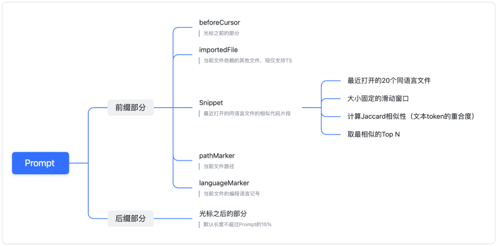

# AI-Agent

[toc]

## Intro

* Intro
  * 做大模型，很难理解全部，退而求其次，理解其能力的边界很关键

* 术语
  * Large Language Model(LLM)
  * ChatGPT
  * PaLM/Bard(Google)
  * Llama(Meta)
  * Github Copilot
* 大模型的发展
  * https://arxiv.org/pdf/2304.13712
  * BERT pretrain的概念
  * 2018年英伟达可以生成图片的StyleGAN模型、2019年DeepMind可以自动生成连续视频的DVD-GAN模型和2022年OpenAI聊天机器人ChatGPT是AIGC在应用层面的三个重要节点。

### 场景


### 大模型简要介绍

* 表面上做什么事情：不断根据前文生成"下一个"词
  * OpenAI的接口名：「Completion」
  * 上文信息越多，对后文信息的约束性越强

* 大模型的输入
  * 编码：word embedding、one-hot、文字、整数
* 关键要素
  * 数据
    * 微调数据如何大量获得

  * 算力
  * 训练技术：RLHF、prefix tuning、hard/soft prompt tuning、SFT、retrieval augment
  * 模型结构
    * Ilya: 数字神经网络和人脑神经网络，在数学原理上是一样的（把AI当人看）
* 影响要素
  * 信任
  * 安全
  * 隐私
  * 认知

### AI Engineer 的边界

> "One of your key responsibilities will be to coach the organisation and be at the forefront of deciding where and if LLMs are even needed to solve a business problem."

* [What is AI Engineer?](https://www.newsletter.swirlai.com/p/what-is-ai-engineering?utm_campaign=post&utm_medium=web)
  * **AI Researchers -** they are masters of prototyping, coming up with novel ideas and testing their hypothesis. Analyse the output data and come up with novel strategies how to keep continuously improving the models. Deep understanding of statistics and ML fundamentals. Nowadays, very likely they are able to run LLM training on distributed systems themselves.
    - What they might initially lack in skills is the ability to deploy real world production applications and implementing MLOps best practices in the world of LLMs.
    - "The goal of AI Engineer is to take what is already available and stitch up an AI system that would solve a real business problem."
  * **ML Engineers -** capable of building and deploying regular Machine Learning models as AI/ML systems with all of the bells and whistles of MLOps. This includes implementation of feedback flywheel and ability to observe and continuously improve the system. Also, ML Engineers are usually involved in Data Engineering to some extent, often utilising ML specific data stores like Feature Stores or Vector DBs.
    - What they might initially lack in skills is the ability to perform deep research and build production ready high throughput systems as well as implementing and operating regular software best practices.
  * **Software Engineers** - they are great! Capable of crafting complex high throughput, low latency systems that are deterministic. Translating business requirements into complex software flows. Masters of DevOps and software engineering best practices, capable of high velocity development and shipping to production in a safe way.
    - What they might initially lack in skills is the ability to reason in non-deterministic systems and knowledge how to observe and evaluate them. Also, it is not in their nature to continuously learn non software related topics that could completely shift in a day, requiring re-architecture of the entire system.


### 技能点

- **Research** - white papers need to become your best friend. There is so much research happening in the field of Agentic applications that it is hard to keep up. As an example, just recently, there has been a [paper](https://arxiv.org/abs/2411.10541) released with research around how Prompt Formatting can influence the performance of your LLM applications. The truth is that with internal data and compute resources at your disposal, you - the AI Engineer - are best positioned to do your own research on what works and what does not, and you should do it for the sake of your employer.
- **Prompt Engineering** - while it might sound simple, the techniques for prompt engineering and formatting are vast. When it comes to agentic systems, you are also dealing with cross agent prompt dependencies, shared state and memory that is also implemented via prompting. On top of this, everything needs to be evaluated so you will need custom evals for any prompt you are crafting coupled with datasets that you can test on.
- **Software Development -** no questions here, the systems you are deploying need to be solid. You need to know and follow software engineering and DevOps best practices.
- **Infrastructure -** one aspect of this is that you need to be able to deploy your own work, you could say it is part of Software Development. Also you need to understand your data and new types of storage systems like Vector DBs. In general, these are not new, but rarely used by non ML Engineers.
- **Data Engineering** - you would be surprised in how much time you would actually spend understanding, cleaning and processing the data that is then used in your AI Systems. Not everything is about prompting, the hardest part is usually integrating the data sources into your AI applications.
- **MLOps adapted for AI Systems (AgentOps)** - we have introduced a lot of good practices into building AI systems in the past ~5 years via the MLOps movement. Most of them should be transferred when building with LLMs.
  - Evaluation.
  - Observability. I talk about some of the challenges in observing Agentic systems in one of my articles: [Observability in LLMOps pipeline - Different Levels of Scale](https://www.newsletter.swirlai.com/p/observability-in-llmops-pipeline)
  - Prompt tracking and versioning.
  - Feedback and the continuous system improvement flywheel.


### 互联网已死，Agent 永生

> 参考资料：[互联网已死，Agent 永生](https://mp.weixin.qq.com/s/bHF1JT1QJeC6JVwoEVs08Q)

#### 核心论断

**Agent 才是软件的新主人。不要服务人，服务 Agent。**

#### 一、砍掉的六张旧地图（互联网时代已过时）

1. **DAU 过时**
   - 互联网时代：网状拓扑，网络效应，边际成本递减，DAU 是资产
   - AI 时代：星型拓扑，无网络效应，每用户多一份推理成本，DAU 是负债
   - ChatGPT 用广告逻辑扩张 DAU，Claude 摆明立场绝不加入广告

2. **工具→平台路径堵死**
   - 互联网时代：工具→社区→平台，三级火箭
   - AI 时代：工具本身足够强，不需要社区补充（社区本质是人帮人，AI 比人更能帮人）
   - 只有大模型公司、算力基座拥有者才能做平台（星型拓扑中心节点）

3. **SaaS 没死，但主人换了**
   - 过去：人类是软件用户（2B/2C），围绕"人怎么用软件"设计
   - 现在：Agent 是软件用户（2A），软件公司变成面向 Agent 的基础设施
   - 人类要的是结果，不是软件；Agent 可以自己看文档、百倍速操作软件

4. **"AI 应用"是错的**
   - "应用"天然暗示使用者是人，思维会被锁死在界面、交互、留存等面向人的思考
   - 换一个词，换一种思考：不要服务人，服务 Agent

5. **注意力经济已死**
   - 注意力经济：抢夺用户时间卖给广告商，零和博弈（平台赚你浪费的时间）
   - 生产力经济：付费让 AI 帮你完成工作，正和博弈（双方都创造价值）
   - 注意力经济追求停留时长，生产力经济追求结果交付效率

6. **"出海"过时**
   - Agent 的世界里没有海，不需要翻译、适配支付、本地化推广
   - 只需要把 API 做好、文档写清楚、协议对接好，全世界 Agent 都能找到你
   - 需要的不是出海，是接入新世界

#### 二、新世界的四块基石

1. **Token 是新时代的特权**
   - 顶级模型不仅没降价，反而更贵（Opus 4.6：200k 上下文内输入 /输出 ，上下文外更贵）
   - Claude Fast 模式：2.5 倍速度，5 倍 Token 费用，一天总消耗可达 12 倍
   - 算力马太效应：更多算力→更好结果→更多收入→买得起更多算力

2. **燃烧 Token 的速度，决定人的进化速度**
   - 买 Token 不是消费，是投资自己
   - 用 100 分顶级模型 vs 90 分模型，看似省钱，实则浪费最稀缺资源：判断力和时间
   - 用谷歌 vs 百度，一年认知差 2 倍；用顶级模型 vs 垃圾模型，一年认知差 100 倍
   - 要做能疯狂燃烧 Token 的事/产品：AI Coding、AI Agent、AI Video

3. **Agent 是新世界的人口红利**
   - 过去：研究怎么让人用得爽（界面、交互、推送）
   - 现在：研究怎么让 Agent 用得爽（API 稳定、文档清楚、结果准确）
   - 一个人可能有 10-100 个 Agent 工作，每个 Agent 每天调用外部接口几千几万次
   - Agent 时代增长飞轮：
     - 先被发现：Skills 发布早、文档好、测试到位、SEO 到位，让 Agent 需要时第一时间找到你
     - 再被依赖：稳定、准确、快速、有品味，每次调用返回更好结果，让它没理由换掉你
   - 反面：需要人联系销售、填表单、等审批的产品，Agent 用不起来，在新世界里不存在

4. **愿力时代**
   - Agent：有能力、有理性、有耐心，但不会产生任何想法
   - 人类：有欲望、有情感、有想象，但无法独自完成一件大事
   - 人类的价值：不是亲自干活，是决定干什么、为什么干
   - 人和人的差距：不取决于自己能做什么，取决于能驱动多少 Agent 为你做什么
   - 韩信点兵，多多益善：不是自己能打，是有一套体系，给多少兵都能管

#### 三、如何让海量 Agent 更容易找到并愿意付费

1. **让 Agent 第一个知道你**
   - 早发布 Skills/Tools
   - 写好机器可读的结构化文档（语义化、示例清晰）
   - 做好 Agent SEO（针对大模型检索优化）
   - 加入主流 Agent 生态（Claude Skills、GPTs 等）
   - 标准化能力描述和接口定义

2. **让 Agent 用了就离不开你**
   - API 高可用、低延迟、高并发
   - 返回结果准确、一致、有品味
   - 完全自助化（无需人工介入开通、计费）
   - 良好的错误处理、重试机制和降级策略
   - 每次调用都比上一次更好（持续学习和优化）

3. **产品设计面向 Agent**
   - API First：优先设计 API，UI 是次要的
   - 提供清晰的能力边界和使用示例
   - 支持标准协议（REST、GraphQL、gRPC）
   - 提供多语言 SDK 和工具库
   - 机器友好的计费和计量方式

#### 四、模型越顶级越好卖的认知

- **顶级模型的价值**：
  - 结果质量差异巨大（100 分 vs 90 分）
  - 时间和判断力是最稀缺的资源
  - 用顶级模型是投资，不是消费
  - 马太效应：更好的模型→更好的结果→更多收入→更好的模型

- **用户付费意愿**：
  - 愿意为更好的结果支付溢价
  - 认识到使用低质量模型是浪费生命
  - 孩子都不愿意跟智商低的模型聊天

- **商业策略**：
  - 顶级模型不需要降价，反而可以涨价
  - 可以按能力分级定价（如 Fast 模式）
  - 比拼的不是价格，是结果质量和速度


## 头部 AI 产品与公司

关键词：5000万美元ARR、Top Lean AI榜单、人均创收

#### 5000 万美元 ARR 的 AI 应用公司有多少家？
- 全球 ARR 超过或等于 5000 万美元的 AI 原生企业约 40-70 家，主要集中在 AI Coding、内容创作 Agent、法律及教育等场景
- 中国背景或华人创立的公司：
  - Manus（蝴蝶效应）：25 年底以超过 20 亿美元被 Meta 收购
  - Genspark：前小度 CEO 景鲲创立，25 年 9 月 ARR 达 5000 万美元
  - OpenArt：Coco Mao 创立，20 人团队实现 7000 万美元 ARR
  - PixVerse 与 Lovart：PixVerse 25 年总收入超 4000 万美元；Lovart 10 月 ARR 突破 3000 万美元
- 推荐榜单：Henry Shi 维护的 "Top Lean AI" 榜单，收录人均创收超 100 万美元的团队

#### 全球化与中美之间：三个 AI 创业团队的对比

这三个团队的境遇，折射了 23 年到 25 年间，AI 竞争已彻底成为大国博弈的核心一环。它不仅关乎算法与算力，更受到市场以外的诸多因素制约。

**HeyGen**
- 年营收已突破 5,000 万美元，主打视频数字人生成
- 创立之初，曾同时在旧金山和深圳设有团队，国内主体名为"诗云科技"
- 早在 23 年 12 月，诗云科技便已申请注销
- 这是一个在 AI 浪潮还未全面破圈时，就敏锐察觉风向并早早做出抉择的例子

**Manus**
- Manus 背后的"蝴蝶效应"公司在 25 年 6 月将总部迁至新加坡
- 从地理和市场角度看，这是一个相对中庸且稳妥的折中选择
- 25 年底官宣被 Meta 以 20 亿美元收购后，26 年 1 月，中国商务部表示将会同有关部门对该项收购进行合规性审查

**MiroMind 中国研发团队**
- MiroMind 是陈天桥在受 DeepSeek 启发后，出资支持成立的 AI 团队
- 当时梁文锋向陈天桥推荐了代季峰作为研发负责人，代季峰曾长期在微软亚研院和商汤工作，后任教于清华大学电子工程系
- 26 年 1 月初，团队发布了首个主打深度研究（Deep Research）的 30B 小模型 MiroThinker 1.5
- 然而，发布不到半月，代季峰便确认离职
- 由于法律合规及地缘因素，陈天桥难以继续支持国内的这部分研发力量，原中国团队不得不突然寻求独立融资或新的发展空间

**深度思考**

这是所有创业者必须直面的现实：美国也有公司不要中国市场，比如 Anthropic。

回到那些希望基于全球顶尖模型开发应用的创业者，决策基点或许在于：

1. **核心驱动力**：全球最领先的模型在未来一段时间内将由谁主导？
2. **场景匹配度**：你服务的场景需要的是最尖端的技术探索，还是极致的性价比？
3. **发展策略**：是优先追求产品性能与规模、忍受长期亏损，还是寻求阶段性盈利以自保？

**超越国界的协作**

开源社区与全球研发共同体之间依然存在着超越国界的协作。人类最重要的技术进展，很难长期被限制在某个狭小范围内。当然，这个"长期"到底是多久，将直接决定一批公司的成败与生死。


## Agent Sandbox 与运行环境

> 来源：https://mp.weixin.qq.com/s/atwxv9t568Z-heftnTkLhA
> 整理时间：2026-02-18

### Agent Sandbox 的核心需求

Agent sandbox 需要满足以下几个核心需求：

1. **冷启动时间要快**：理想情况下在 100ms 以内
2. **安全性要高**：能够有效隔离不可信代码，防止越权访问和攻击
3. **能支持 Python 这种主流的 agent 开发语言**：能够兼容常见的 Python 库和工具
4. **有一个方便的镜像构建流程**：能够让用户快速构建和部署自己的 agent 镜像

### 各种 Agent Sandbox 方案对比

#### 1. e2b (基于 Firecracker)

**特点：**
- 用 Firecracker 来实现 sandbox
- Sandbox 的镜像被称作 template
- Snapshot 能力：可以 <1s 的时间来 resume 一个已经运行好的 sandbox
- 调度系统叫做 orchestrator，自己实现了一个非常简单的调度器
- 调度算法：基于 best of k 的算法

**镜像构建流程：**
1. 拉取基础镜像：从远程仓库获取指定的 Docker 镜像
2. 注入配置层：添加新的文件层，包含主机名、DNS、Envd 服务配置以及基础预置脚本
3. 提取文件系统：从镜像中提取 ext4 格式的根文件系统
4. 初次启动（预置阶段）：启动 Firecracker 微虚拟机，运行仅包含预置脚本的 BusyBox init 进程
5. 二次启动（服务初始化）：再次启动 Firecracker 虚拟机（这次使用 systemd），等待 Envd 服务就绪
6. 构建模板层：生成模板所需的各个层/步骤
7. 沙箱内收尾配置：重启沙箱环境，执行两个额外的命令
8. 创建快照：对配置完成的系统进行快照
9. 上传模板：将模板及所有尚未上传的层上传到存储系统

**优点：**
- 启动快
- 安全性高（完全独立的内核，攻击面更小）
- Snapshot 能力强（可以 <1s 的时间来 resume 一个已经运行好的 sandbox）

**缺点：**
- 构建镜像比较麻烦（需要把 Docker 镜像 extract 成 ext4 rootfs）

**调度器设计：**
- 自己实现了一个非常简单的调度器，来管理 sandbox 的生命周期
- Nomad 只用来管理 e2b 控制平面的部署和扩展
- 调度算法：基于 best of k 的算法，从集群里随机选取 k 个节点，然后在这 k 个节点上基于预设 heuristic（如已用 CPU、内存、在起沙箱数等）计算一个 score，越低越好（负载最小化），最后选取 score 最低的那个节点来创建 sandbox

**观点：**
- Kubernetes 并不适合 agent sandbox 的调度
- Kubernetes 适合长期运行的服务，或者说生命周期比较长的工作负载
- Agent sandbox 的生命周期非常短
- Kubernetes 太重了，agent 很多情况下需要在本地运行，或者说在一个非常小的集群里运行，又或者需要在本地和 cloud 之间无缝迁移，互相配合
- e2b 这种自己实现一个轻量级的调度器，来管理 sandbox 的生命周期，也是一种不错的选择

#### 2. k7 (基于 Kata)

**特点：**
- VMM 也是 Firecracker，没有用 cloud hypervisor
- Kata 是支持兼容 OCI 标准的容器镜像的，所以 k7 的 template 就是一个普通的 Docker 镜像了
- Kata 跟 Kubernetes 的相性非常好，k7 直接使用了 Kubernetes(or k3s) 来做调度
- 整体因为采用了成熟的组件，k7 的实现相对简单了很多

**优点：**
- 实现相对简单
- 镜像构建流程非常简单，基本上就是基于 Dockerfile 来构建一个 Docker 镜像，然后直接用这个镜像来启动 sandbox 就好了
- 完全兼容 OCI 镜像

**缺点：**
- 应该无法像 e2b 那样利用 Firecracker 的 snapshot 来实现快速的 resume 了
- Kata 的设计是为了兼容容器，它应该是屏蔽了 Firecracker 的 resume 功能

**观点：**
- Resume 的能力是不是 agent sandbox 需要的核心能力，可能还要打个问号
- 对于一些简单的 agent 场景，可能并不需要 snapshot 的能力
- Kata 带来的完全兼容 OCI 镜像的能力，可能对于很多用户来说更有吸引力了
- 毕竟构建一个 Docker 镜像要比构建一个 Firecracker 的 template 要简单很多了，速度也快得多

#### 3. monty (基于 WASM)

**特点：**
- WASM 能够比容器冷启动还要快（容器启动时间在 50ms，WASM 的启动时间在 10ms 级别）
- WASM 支持 Python 是非常麻烦的
- Pyodide 是一个将 CPython 解释器和科学计算生态的一些项目编译到 WebAssembly 的项目，但它的冷启动特别慢
- Cloudflare 的思路是通过 snapshot 把运行时的耗时挪到了部署时
- Wasmer 也做过一些优化，也是通过类似于快照和缓存的思路
- 这些在我看来都是治标不治本的方案
- WASM 的设计初衷并不是为了支持像 Python 这样复杂的动态语言的，所以它在设计上就有一些限制

**Monty 的特点：**
- 支持 Python 部分子集的解释器
- 0.06ms 的启动时间远远快于容器和 Firecracker 之类的方案了
- Starlark 也是一个 Python 的方言，是 Bazel 用来作为构建语言提出的一个子集语言
- 支持的语法非常有限，虽然冷启动快但是没有参考性

**优点：**
- 启动时间极快（0.06ms）

**缺点：**
- 支持的语法子集太小
- Class 不支持
- sys 等模块也不支持
- 这样的阉割下，unikernel 反而感觉更有优势

#### 4. Unikernel

**特点：**
- 传统意义上的 unikernel 没有内核和用户态的概念，应用与内核编译为一体
- 它也是单地址空间，没有多进程的概念
- 如果没有多进程的概念，Python 这种语言就没法很好的支持，因为它重度依赖多进程模型

**Unikraft 的进展：**
- 在去年五月 0.19 版本支持了多进程
- 它实现的方式是 vfork 后子进程与父进程共享地址空间
- 如果子进程不立刻 execve 的话，父子进程访问内存就会互相干扰
- 虽然 Unikraft 的实现是为了兼容一些需要多进程的应用，但它并不是真正意义上的多进程

**Unikernel Linux (UKL)：**
- 采取了一个非常不同的思路
- 不是从零开始设计 unikernel，而是通过配置选项将 unikernel 优化技术集成到 Linux 中
- 在 UKL 中，单个应用可以直接链接到 Linux 内核，在 supervisor 权限下运行，无需修改应用源代码，只需重新编译并与修改过的 Linux 内核和 glibc 联接
- UKL 的基础模型保留了 Linux 的大部分设计，包括应用和内核的分离地址空间、不同的执行模式、以及多进程支持的能力

**优点：**
- 未修改的应用可以开箱即用地运行
- 理论上非常适合 agent sandbox
- 极小的攻击面
- 极快的启动时间
- 镜像大小非常小

**缺点：**
- 之前不支持多进程是一个很大的限制
- Unikraft 的多进程实现并不是真正意义上的多进程
- UKL 失去了 unikernel 的一些核心优势，比如极小的攻击面和极快的启动时间

**观点：**
- 我们不能只看到启动时间，事实上构建和 image 分发的效率也是非常重要的
- Docker 之所以能够成为主流的虚拟化技术，镜像分发的方便和高效是一个非常重要的因素
- Unikernel 能够做到非常小的镜像大小，是非常有竞争力的
- 如果能够在多进程与小镜像之间做一个好的取舍，我还是认为 unikernel 是非常有潜力的

### Modal 的 Lazy Loading 设计

**特点：**
- 镜像带来的启动时间开销是远大于启动本身的，这才是延迟最大的单一来源
- 传统的 Docker 拉取镜像，是串行完成下载 N 个 gzip 压缩层（速度约 2 GiB/s）、单线程解压（80 MiB/s）、解包到文件系统这一整套流程
- 对于一个 8GB 的镜像，这个过程可能需要一分钟
- 整个容器在数据完全就绪前，无法启动

**Modal 的解决方案：**
- 采取了 lazy loading 的方式，换句话说就是按需加载
- 当你运行一个 PyTorch 进程的时候，你可能不会访问容器文件系统里的所有文件
- 这个思路跟 Dragonfly / estargz 之类的分层镜像格式是类似的，但是 Modal 的实现不太一样，是通过 FUSE 来实现的
- 猜测应该是用 FUSE 拦截文件系统的读取，在创建容器文件系统的时候，根据镜像的元数据，先生成一个占位的文件系统树，然后在被访问的时候按照内存、本地 SSD、同可用区缓存服务器、区域 CDN、对象存储的优先级顺序，去请求数据

**优点：**
- 能够大大减少镜像拉取的时间
- 提升容器的启动速度

### 总结

Agent sandbox 的设计有很多不同的方案，每种方案都有自己的优缺点：

| 方案 | 优点 | 缺点 |
|------|------|------|
| e2b (Firecracker) | 启动快、安全性高、Snapshot 能力强 | 构建镜像比较麻烦 |
| k7 (Kata) | 实现简单、完全兼容 OCI 镜像 | 可能无法利用 Firecracker 的 Snapshot |
| monty (WASM) | 启动时间极快 | 支持的语法子集太小 |
| Unikernel | 理论上非常适合 agent sandbox、极小的攻击面、极快的启动时间 | 之前不支持多进程是一个很大的限制 |

**未来展望：**
- 未来随着 unikernel 技术的发展，可能会有更多的机会来支持 agent sandbox 的需求
- 镜像构建和分发的效率也很重要
- 对于 Modal 会运行 LLM 推理服务的产品来说更加重要，因为 LLM 的镜像和模型都很大
- Agent 可能没有那么夸张

## ToC 产品

### 模型能力


### 产品架构


* 实现 Copilot 的主流架构是 **多 Agent 架构**
  * 模仿人做事，将业务拆成工作流（workflow、SOP、pipeline）
  * 每个 Agent 负责一个工作流节点

### 手机 Agent：存量博弈与场景变迁

#### 手机助手（豆包）

* 定义：面向手机厂商的系统级服务，将豆包大模型深度融入手机操作系统，实现跨应用的自动化执行与自然语言交互。
* 关键能力
  * 系统级集成与唤醒：支持专属物理按键、语音唤醒；以悬浮窗/顶部状态区域呈现，不打断当前应用。
  * 屏幕理解与问答：对屏幕内容进行理解，支持"屏幕问答""屏幕记忆"。
  * 直接操控手机：系统交互与跨应用任务自动执行（如下载、批量处理、跨APP跳转与表单操作）。
  * 后台执行：任务在后台持续运行，状态吸附于顶部区域，用户可继续使用手机。
* 产品定位：在豆包 App 基础上与手机厂商 OS 层对接，获得厂商授权以实现系统交互与控制能力。
* 参考
  * 说明与定位：http://m.toutiao.com/group/7579935469794886187/
  * 实测体验1：http://m.toutiao.com/group/7578806856575910435/
  * 实测体验2：http://m.toutiao.com/group/7578873886368924201/

#### 其他手机 Agent

* 字节跳动：豆包手机预览版（自动回微信、比价点外卖等，后被封禁）
* OpenClaw：与移动端打通，手机上发送指令驱动云端任务
* 阿里：通义千问 App，主打全场景生活助手

### OpenCode (Coding Agent)

* **Link**: [opencode.ai](https://opencode.ai/) | [GitHub](https://github.com/sst/opencode)
* **定位**: 开源 AI 编程 Agent，支持 Terminal, IDE, Desktop 多端。
* **核心数据**: 95k+ Stars (SST生态), 2.5M+ developers。
* **技术与产品特性**:
  * **LSP Integration**: 内置 LSP (Language Server Protocol) 支持，自动加载正确的语言服务，像 IDE 一样理解代码结构和上下文。
  * **Privacy First**: 隐私优先设计，不存储代码和上下文数据，适合企业环境。
  * **Model Agnostic**:
    * 支持 75+ LLM providers (via Models.dev)，包括 Claude, GPT, Gemini 等。
    * **BYO Keys/Account**: 支持接入 GitHub Copilot, ChatGPT Plus/Pro 账号。
    * 支持本地模型。
  * **Multi-session**: 支持并行多 Agent 会话，同时处理多个任务。
  * **Zen**: 提供经过 Coding 场景测评和优化的模型集合 (Validated models)。

### OpenClaw (Personal Assistant)

* **Link**: [GitHub](https://github.com/openclaw/openclaw) | [Website](https://openclaw.ai) | [Docs](https://docs.openclaw.ai)
* **参考文章**: [飞书聊天直接生视频！OpenClaw × Seedance Skill王炸组合](https://mp.weixin.qq.com/s/Mkbbqdvxh-95pVlnLv9Wig)
* **定位**: Local-first 个人 AI 助手，聚合多渠道 (Omni-channel)。
* **核心特性**:
  * **Multi-channel Inbox**: 统一管理 WhatsApp, Telegram, Slack, Discord, Google Chat, Signal, iMessage, Microsoft Teams, Matrix, Zalo, WebChat 等消息渠道。
  * **Local-first Gateway**: 控制平面运行在本地，确保数据隐私。
  * **Capabilities**:
    * **Voice**: 支持语音唤醒和实时对话 (Voice Wake + Talk Mode)。
    * **Canvas**: 支持 Live Canvas 可视化交互 (A2UI)。
    * **Multi-agent Routing**: 支持将不同渠道或任务路由给不同的 Agent 处理（workspaces + per-agent sessions）。
  * **长时间任务管理**:
    * **后台运行模式 (`background: true`)**: 对于耗时操作（如下载大模型、安装依赖、执行长时间脚本），支持后台模式运行，不阻塞用户对话
      - **配置粒度**: 每次工具调用（tool call）级别配置
      - **参数**: `background: true`（布尔值）
      - **效果**: 工具在后台执行，立即返回会话ID（sessionId），用户可随时查询进度或发送新消息
    * **进度定期报告**: 主动、定期（每10分钟）检查长时间任务进度，并向用户报告
      - **配置粒度**: 可通过规则配置报告频率
      - **默认**: 每10分钟一次
      - **进度报告内容**: 包含百分比、预估剩余时间
    * **用户消息优先**: 无论正在执行什么任务，收到用户新消息时立即回复，绝对不让任务阻塞对话
      - **优先级**: 用户消息 &gt; 后台任务进度报告 &gt; 后台任务执行
    * **后台任务管理**:
      - **会话ID**: 每个后台任务分配唯一的 sessionId
      - **操作**: 可查询（poll）、获取日志（log）、终止（kill）后台任务
      - **工具**: `process` 工具，支持 `list/poll/log/write/kill` 等操作

#### 架构设计

```
WhatsApp / Telegram / Slack / Discord / ...
               │
               ▼
┌───────────────────────────────┐
│            Gateway            │
│       (control plane)         │
│     ws://127.0.0.1:18789      │
└──────────────┬────────────────┘
               │
               ├─ Pi agent (RPC)
               ├─ CLI (openclaw …)
               ├─ WebChat UI
               ├─ macOS app
               └─ iOS / Android nodes
```

#### 核心子系统

* **Gateway WebSocket 网络**: 单一 WS 控制平面，用于客户端、工具和事件
* **Tailscale 暴露**: 为 Gateway 仪表板和 WS 提供 Serve（仅 tailnet）或 Funnel（公开）
* **浏览器控制**: openclaw 管理的 Chrome/Chromium，带 CDP 控制
* **Canvas + A2UI**: Agent 驱动的可视化工作区
* **Voice Wake + Talk Mode**: 始终在线的语音和持续对话
* **Nodes**: Canvas、相机快照/剪辑、屏幕录制、位置获取、通知

#### 安装与使用

**运行要求**: Node ≥22

```bash
npm install -g openclaw@latest
openclaw onboard --install-daemon  # 向导式安装，包含后台守护进程
openclaw gateway --port 18789 --verbose  # 启动网关
```

**核心命令**:
- `openclaw onboard`: 向导式设置（推荐）
- `openclaw gateway`: 启动网关服务
- `openclaw agent --message "..."`: 直接与 Agent 对话
- `openclaw message send --to ... --message ...`: 向指定渠道发送消息
- `openclaw doctor`: 健康检查与配置修复

#### 技能系统 (Skills)

OpenClaw 支持三种类型的技能：
1. **内置技能 (Bundled)**: 随 OpenClaw 一起打包
2. **托管技能 (Managed)**: 从 ClawHub 安装
3. **工作区技能 (Workspace)**: 用户自定义技能

技能安装位置: `~/.openclaw/workspace/skills/<skill>/`

##### Seedance Video Generation Skill

* **Link**: [ClawHub](https://clawhub.ai/JackyCSer/seedance-video-generation)
* **功能**: 文生视频、图生视频（支持首帧、首尾帧、参考图 1-4 张）
* **支持模型**:

| 模型 | Model ID | 能力 |
|------|----------|------|
| Seedance 1.5 Pro | `doubao-seedance-1-5-pro-251215` | Text-to-video, Image-to-video (首帧、首尾帧), 音频支持, Draft mode |
| Seedance 1.0 Pro | `doubao-seedance-1-0-pro-250428` | Text-to-video, Image-to-video (首帧、首尾帧) |
| Seedance 1.0 Pro Fast | `doubao-seedance-1-0-pro-fast-250528` | Text-to-video, Image-to-video (仅首帧) |
| Seedance 1.0 Lite T2V | `doubao-seedance-1-0-lite-t2v-250219` | 仅 Text-to-video |
| Seedance 1.0 Lite I2V | `doubao-seedance-1-0-lite-i2v-250219` | Image-to-video (首帧、首尾帧、参考图 1-4) |

* **默认模型**: `doubao-seedance-1-5-pro-251215`（最新，支持音频）
* **切换模型**: 直接在对话中跟 OpenClaw 说即可
* **Seedance 2.0**: 火山引擎 GA 后支持，当前可在火山方舟体验中心测试

##### 安装 Seedance Skill

**前置条件**: 安装 ClawHub skill

**方式 1**: 通过 OpenClaw Web 控制台点击安装（推荐）
**方式 2**: 通过聊天安装
  ```
  帮我通过clawhub安装一下这个skill：https://clawhub.ai/JackyCSer/seedance-video-generation
  ```
**方式 3**: 下载 zip 包放到本地 skill 目录
  - 下载地址: https://clawhub.ai/JackyCSer/seedance-video-generation
  - 本地目录: `~/.openclaw/skills/`

安装完成后在 `http://127.0.0.1:18789/skills` 可查看。

##### 使用示例

- 文生视频: "帮我生成给航天飞船启动的视频，15s左右"
- 图生视频（首帧）: "基于这张参考图生成一段15s左右的主角在雨中穿过不同街区的电影镜头"
- 图生视频（多张参考图）: "我给你发了四张照片，分别是春夏秋冬。请帮我使用 SeeDance Skill 帮我生成一个视频，体验出春夏秋冬的变化，并且非常适合在抖音上发布"
- 古诗场景: "生成一个15s左右的视频，内容是一首古诗：枯藤老树昏鸦，小桥流水人家，古道西风瘦马。夕阳西下，断肠人在天涯"

#### 记忆系统设计

OpenClaw 的记忆系统是其核心亮点之一：

* **上下文与记忆的区别**：
  - **上下文**：包括静态+条件化系统提示词、AGENTS.md/SOUL.md 项目上下文、过往对话历史、当前消息
  - **记忆**：自动写入 daily logs 以 md 格式存储，人类可手动维护并提炼长期原则

* **记忆管理方式**：
  - AI 自动写 daily logs 并以 md 格式存储
  - 人类可手动维护，提炼长期原则
  - 让 AI 记忆变得可控、透明且高效

* **相关开源项目**：memsearch（抽离 OpenClaw 记忆系统核心设计，让任何 Agent 都能加上持久、透明、可控的记忆）

#### 安全模型

* **默认行为**: 工具在主机上运行，主要会话有完全访问权限
* **群组/渠道安全**: 设置 `agents.defaults.sandbox.mode: "non-main"` 可在 Docker 沙箱中运行非主会话
* **DM 配对策略**: 未知发送者会收到配对码，需通过 `openclaw pairing approve` 批准
* **Tailscale 安全**: Funnel 需要设置 `gateway.auth.mode: "password"`

#### 实际部署案例

**火山引擎一键部署**:
> 参考来源: 火山引擎OpenClaw预集成部署方案（2026-02）
- 支持飞书机器人集成
- 一键部署到 ECS
- 支持 Coding Plan API 集成
- 配置脚本:
  ```bash
  curl -fsSL https://openclaw.tos-cn-beijing.volces.com/setup.sh | bash -s -- \
      --ark-coding-plan "true" \
      --ark-api-key "your-api-key" \
      --ark-model-id "doubao-seed-code" \
      --feishu-app-id "your-feishu-app-id" \
      --feishu-app-secret "your-feishu-app-secret"
  ```

##### 火山引擎方案优势

* **适配节奏快**: 2026年2月2日后购买的服务器已支持最新版OpenClaw部署
* **飞书深度协同**: 部署模板中预集成了飞书AI助手方案，无需额外复杂配置就能实现飞书接入
* **安全保障**: 火山引擎提供三层纵深安全防护方案
  - 平台安全：访问控制、指令过滤、执行沙箱、技能准入扫描
  - AI助手安全：防范提示词注入、高危操作、敏感信息泄露
  - 供应链安全：Skills深度安全检测
* **部署便捷**: 实测部署耗时约15-25分钟，提供视频教程和数据迁移指南
* **零代码飞书配置**: 访问OpenClaw WebChat页面，输入"帮我接飞书"即可按AI指引完成配置

##### 火山引擎部署详细教程

> 参考来源：[快速部署OpenClaw（原Moltbot），集成飞书AI助手](https://www.volcengine.com/docs/6396/2189942?lang=zh)

**版本说明**：
- 2026年02月02日21:08前购买：使用Moltbot标签对应的配置命令
- 2026年02月02日21:08后购买：使用OpenClaw标签对应的配置命令

**地域支持**：
- 暂仅支持华南1（广州）、华北2（北京）、华东2（上海）及亚太东南（雅加达）

**部署步骤**：

1. **创建ECS服务器**
   - 登录云服务器控制台
   - 应用模板选择「OpenClaw（Moltbot）」
   - 实例规格：2 vCPU、2 GiB内存及以上
   - 配置登录密码
   - 安全防护：推荐启用AI助手安全功能（防范提示词注入、敏感信息泄露、高危操作）

2. **两个场景选择**：
   - **场景一（新用户）**：购买后配置模型并集成飞书应用
     - 开通火山方舟大模型服务
     - 创建飞书企业应用
     - 在实例内完成OpenClaw与飞书集成
   - **场景二（已有资源）**：购买时配置模型并集成飞书应用
     - 已开通火山方舟大模型服务且已创建飞书企业应用
     - 购买实例时通过"高级配置"快速配置方舟模型与飞书企业应用信息

3. **多模态能力**（可选）：
   - 如需使用原生支持生图、生视频的多模态能力，请选择以下模型：
     - doubao-seedream-4-5 (251128)
     - doubao-seedance-1-5-pro (251215)

##### 火山引擎服务状态检查

**查看OpenClaw服务状态**：
```bash
systemctl --user status openclaw-gateway.service
```

**查看更完整的日志**：
```bash
# 查看完整日志（包含历史）
journalctl --user -u openclaw-gateway.service

# 实时跟踪日志
journalctl --user -u openclaw-gateway.service -f

# 查看最近N行日志
journalctl --user -u openclaw-gateway.service -n 100
```

**验证部署状态**：
- 服务状态应为 `Active: active (running)`
- WebSocket客户端应正常启动
- 如有飞书集成，应看到 `[feishu] feishu[default]: WebSocket client started` 日志

##### 飞书用户配对

**问题现象**：首次给飞书bot发消息，会收到：
```
OpenClaw: access not configured.
Your Feishu user id: ou_xxxxxxxx
Pairing code: XXXXXXXX
Ask the bot owner to approve with:
openclaw pairing approve feishu XXXXXXXX
```

**解决步骤**：
1. 登录火山引擎服务器
2. 执行配对批准命令：
   ```bash
   openclaw pairing approve feishu <配对码>
   ```
3. 配对成功后即可正常对话

##### 安全方案详情

火山引擎为OpenClaw提供以下安全保障：
- **入口层**: 默认仅绑定本地端口，减少公网暴露面，强制token/密码认证及网关鉴权
- **决策层**: 镜像预置提示词加固策略，自动识别并过滤恶意注入指令
- **执行层**: 沙箱隔离环境，防止系统破坏
- **准入层**: Skills安全扫描，避免供应链攻击

#### 飞书机器人配置步骤

1. 在飞书开放平台创建企业自建应用，添加机器人能力
   - 登录飞书账号，进入开发者后台"创建企业自建应用"
   - 选择"按能力添加" -> 添加机器人
2. 配置权限（消息读取、飞书文档读写等）
   - 在左侧目录树中找到：开发配置 -> 权限管理
   - 选择"批量导入/导出权限"，复制以下 JSON 代码进行权限导入：
     ```json
     {
       "scopes": {
         "tenant": [
           "docs:document.content:read",
           "docs:document.media:upload",
           "docs:document.subscription",
           "docs:document.subscription:read",
           "docs:permission.member:auth",
           "docs:permission.member:create",
           "docs:permission.member:delete",
           "docs:permission.member:retrieve",
           "docs:permission.member:transfer",
           "docs:permission.member:update",
           "docs:permission.setting:read",
           "docs:permission.setting:readonly",
           "docs:permission.setting:write_only",
           "docx:document.block:convert",
           "docx:document:create",
           "docx:document:readonly",
           "docx:document:write_only",
           "im:chat:read",
           "im:chat:update",
           "im:message.group_at_msg:readonly",
           "im:message.p2p_msg:readonly",
           "im:message.pins:read",
           "im:message.pins:write_only",
           "im:message.reactions:read",
           "im:message.reactions:write_only",
           "im:message:readonly",
           "im:message:recall",
           "im:message:send_as_bot",
           "im:message:send_multi_users",
           "im:message:send_sys_msg",
           "im:message:update",
           "im:resource"
         ],
         "user": [
           "contact:contact.base:readonly",
           "contact:user.employee_id:readonly",
           "docx:document.block:convert",
           "docx:document:create",
           "docx:document:readonly",
           "docx:document:write_only"
         ]
       }
     }
     ```
   - 确认权限并申请开通
   - 后续可在"开通权限"中为机器人开通更多权限
3. 配置事件与回调（使用长连接接收消息）
   - 在左侧目录树中找到"开发配置"->"事件与回调"
   - 点击"订阅方式"旁的按钮添加事件配置
   - 选择"使用 长连接 接收事件"
   - 添加事件 -> 接收消息
4. 获取 App ID 和 App Secret
   - 在机器人应用的凭证页面获取
5. 在 OpenClaw 配置中填入飞书凭证
   - 选择飞书
   - 粘贴对应的 App ID 和 App Secret
6. 发布应用并在飞书中搜索使用
   - 确保应用已发布
   - 在飞书搜索框中搜索机器人应用的名称
   - 检查应用可用范围是否包含自己的账号

#### 深度调研分析

##### 核心设计理念

1. **Local-first 优先原则**
   - 控制平面完全运行在本地，数据不经过第三方服务器
   - 确保隐私安全，所有消息、记忆、工具执行都在本地
   - Gateway 仅作为本地控制中心，绑定在 127.0.0.1:18789

2. **单一控制平面架构**
   - 单一 WebSocket 网关作为所有组件的控制中心
   - 统一管理：会话、渠道、工具、事件
   - 简化架构，降低复杂度

3. **多渠道聚合但不锁定**
   - 支持 10+ 主流消息渠道：WhatsApp、Telegram、Slack、Discord、Google Chat、Signal、iMessage、Microsoft Teams、Matrix、Zalo、WebChat
   - 用户可以用自己习惯的渠道与 AI 交互
   - 渠道是可选的，Gateway 本身就提供完整功能

##### 核心子系统深度分析

1. **Gateway 系统**
   - WebSocket 网络：单一 WS 控制平面，用于客户端、工具和事件
   - Tailscale 暴露：Serve（仅 tailnet）或 Funnel（公开）
   - Control UI + WebChat：直接从 Gateway 提供的 Web 界面

2. **会话模型**
   - 主会话（main）：直接对话
   - 群组隔离：不同群组/渠道有独立会话
   - 激活模式：mention/always
   - 队列模式：消息排队处理
   - 回复策略：reply-back

3. **工具系统**
   - 浏览器控制：专用 Chrome/Chromium，带 CDP 控制
   - Canvas + A2UI：Agent 驱动的可视化工作区
   - Nodes：相机快照/剪辑、屏幕录制、位置获取、通知
   - Cron + wakeups：定时任务
   - Webhooks + Gmail Pub/Sub：外部触发

4. **技能系统**
   - 三层架构：内置（Bundled）、托管（Managed from ClawHub）、工作区（Workspace）
   - 技能安装位置：`~/.openclaw/workspace/skills/&lt;skill&gt;/`
   - 技能配置文件：SKILL.md

5. **记忆系统**
   - 上下文与记忆分离：
     - 上下文：静态+条件化系统提示词、AGENTS.md/SOUL.md、过往对话、当前消息
     - 记忆：自动写入 daily logs，人类可手动维护并提炼长期原则
   - 相关开源项目：memsearch（抽离 OpenClaw 记忆系统）

##### 安全模型

1. **DM 配对策略**
   - 未知发送者收到配对码
   - 通过 `openclaw pairing approve &lt;channel&gt; &lt;code&gt;` 批准
   - 批准后加入本地白名单

2. **沙箱隔离**
   - 默认：主会话工具在主机上运行，完全访问
   - 非主会话：可设置 `agents.defaults.sandbox.mode: "non-main"` 在 Docker 沙箱中运行
   - 允许/拒绝列表：可精细控制每个会话的工具权限

3. **Tailscale 安全**
   - Serve：tailnet-only HTTPS，默认使用 Tailscale 身份头
   - Funnel：公开 HTTPS，必须设置 `gateway.auth.mode: "password"`
   - Gateway 始终绑定 loopback

##### 部署模式

1. **本地部署**（推荐个人使用）
   - macOS/Linux/Windows（WSL2）
   - `openclaw onboard --install-daemon` 向导式安装
   - 后台守护进程：launchd/systemd 用户服务

2. **远程网关部署**
   - Gateway 运行在小型 Linux 实例（如 ECS）
   - 客户端通过 Tailscale Serve/Funnel 或 SSH 隧道连接
   - 设备节点（macOS/iOS/Android）仍可执行本地操作

3. **火山引擎一键部署**（中国用户）
   - 支持飞书机器人集成
   - 一键部署到 ECS
   - 预置 Coding Plan API 集成

##### 多 Agent 路由（Multi Agents）

> 来源：https://docs.openclaw.ai/zh-CN/concepts/multi-agent、https://docs.openclaw.ai/zh-CN/concepts/agent-workspace
> 整理时间：2026-02-23

**核心概念：什么是"一个智能体"？**

一个 Agent 是完全独立作用域的"大脑"，拥有专属的：
- **独立工作区（Workspace）**：存储项目文件、AGENTS.md/SOUL.md 人设规则、本地笔记、工具配置等
- **独立状态目录（AgentDir）**：认证配置文件、模型注册表、每智能体专属配置，位于 `~/.openclaw/agents/<agentId>/agent`
- **独立会话存储**：聊天历史、路由状态完全隔离，位于 `~/.openclaw/agents/<agentId>/sessions`

**如何实现"多个 Workspace 同时开发多个项目"？**

Gateway 网关可以同时托管多个智能体，每个智能体绑定一个独立的工作区，实现：
- 项目隔离：不同项目的代码、文件、人设规则完全分开
- 并行处理：多个智能体可以同时响应不同请求
- 灵活配置：每个智能体可以使用不同的模型、工具集、权限策略

**快速配置步骤：**

```bash
# 创建名为 "project-a" 的智能体，自动绑定工作区
openclaw agents add project-a --workspace ~/.openclaw/workspace-project-a

# 查看所有智能体及其绑定
openclaw agents list --bindings
```

**配置示例（openclaw.json）：**

```json
{
  "agents": {
    "list": [
      {
        "id": "project-a",
        "default": true,
        "workspace": "~/.openclaw/workspace-project-a",
        "model": "ark/doubao-seed-2-0-code-preview-260215"
      },
      {
        "id": "project-b",
        "workspace": "~/.openclaw/workspace-project-b",
        "model": "anthropic/claude-opus-4-5"
      }
    ]
  },
  "bindings": [
    { "agentId": "project-a", "match": { "channel": "whatsapp", "peer": { "kind": "dm" } } },
    { "agentId": "project-b", "match": { "channel": "telegram" } }
  ]
}
```

**关键特性：**

1. **完全隔离性**
   - 工作区、会话、认证完全分离
   - 每个智能体有独立的 `auth-profiles.json`

2. **灵活的工具与权限配置**
   - 每智能体独立 Skills：工作区 `skills/` 文件夹，仅对该智能体可用
   - 共享 Skills：`~/.openclaw/skills`，所有智能体都能调用
   - 每智能体沙箱与工具限制

3. **路由规则**
   - 按渠道路由：WhatsApp 处理日常，Telegram 处理深度工作
   - 按账户路由：个人 vs 工作账户
   - 按对话对象路由：特定私信/群组路由到特定智能体

**路由优先级（最具体优先）：**
1. peer 匹配（精确私信/群组/频道 id）
2. guildId（Discord）/ teamId（Slack）
3. 渠道的 accountId 匹配
4. 渠道级匹配（accountId: "*"）
5. 回退到默认智能体

##### 对本项目的深度启发

1. **任务管理的 Omni-channel Inbox**
   - 不仅是 Git 提交，可接入 Lark/Telegram/微信等多渠道作为任务输入
   - 统一的任务 Inbox，不管从哪个渠道来的都能处理

2. **任务状态的可见性**
   - 学习 OpenClaw 的会话模型：Pending → In Progress → Completed
   - 每个任务有清晰的状态转换、执行者、开始时间

3. **技能系统的借鉴**
   - 本项目的 "snippets" 可视为 OpenClaw 的 "Skills"
   - 可建立技能目录，让 AI 能自动发现和使用

4. **记忆系统的应用**
   - 任务执行的经验沉淀到 PROGRESS.md，类似 daily logs
   - 长期原则提炼，让 AI 越来越懂用户的工作习惯

5. **远程网关的思路**
   - 本项目的 todo-sync.sh 是本地脚本，可考虑类似 Gateway 的架构
   - 支持远程触发执行，手机提交后自动在电脑端处理

### 产品逻辑

#### 产品逻辑

* 不看好的大模型公司类型
  * 打补丁：大模型做错了数学题，因此在外面加了一堆东西，目的是算对数学题；
  * 雕花：模型本来输出的格式可能不太对，给他加点后处理，它输出的格式就对了。
  * 套壳：模型上面套个界面就拿去卖，没有任何行业的积累，或者别人没有的数据，别人没有的客户，只是当成通用工具去卖。

* [有赞的 AI 实践：把决定权交给用户、Copilot 和 Agent 最重要](https://mp.weixin.qq.com/s/ItnXazO86IeGEb7yL-72gg)
  * AI 对于交互的改变： LUI+GUI 会是未来主流
    * 乔布斯对人类的两大贡献，一是将电脑引入了图形界面，二是在离世前让苹果的整个用户界面扁平化。扁平化虽然有人认为不够美观，但它的好处是让用户更加聚焦于界面内容，也让产品设计者更加聚焦于如何通过内容与用户互动，而不是修饰那些好看的渐变和边边角角。
    * CUI，也就是命令式用户界面，不仅允许用户录入文本甚至语音，还会在与用户交互过程中弹出过去的一部分图形界面表现形式，以使用户更容易操作。
  * 有赞如何落地 AI SaaS： 让用户做最终决策、Copilot最重要
    * **原则一：要控制模型含量**
    * **原则二：回到纯文本逻辑思考**
    * **原则三：能选择就不录入**
    * **原则四：直接呈现答案，再做解释**
    * **原则五：给用户交付可用的结果**
    * **原则六：让人类来按下「回车」键**。 决策不只是「客观」就够了，潜意识、情绪、偏见里面固然有不客观，但是也有梦想、喜欢、爱，有了这些才是完美的决策。
  * 变现逻辑：
    * 在有赞的业务中，我们的核心是帮助商家和品牌商进行顾客运营
    * 现在普遍一个商场店一年的客户复购率在 30% 左右，商场给的自然流量，进来的用户不到四成，每年的生意都会下降 30%。通过线上获得新的流量可能会越来越贵，因为流量就是人，人数不涨，用户时长也不涨，但掌握流量的平台它的财报要涨，肯定会从商家那挤利润。那你怎么办？从平台那获得的流量变贵，复购率也不够，自然流量也不够，那把复购率翻一倍不就好了？
    * 所以**深度运营消费者是非常划算的一件事**。有赞希望做的，就是帮助商家将复购率翻倍。目前我们的产品线已经覆盖到内容营销、消费者运营、导购运营、交易转化、线上交易转化、门店管理、进销存收银的门店数字化等环节。
      * 导购对连锁门店老顾客的运营
  * AI助力
    * **第一是 Copilot，就是助手**。它能够帮助客户快速地使用产品，更好地使用产品。
    * **第二是 Agent，自动化的能力**。自动化的发报告，自动化的预警，自动化的去完成很多事情。例如，商家可以设置库存促销规则，如还有 500 件库存时打 5 折，剩下 200 件时打 6 折，以此类推。那么用户就不需要时刻盯着去改库存，因为这些事情都可以通过自动化来完成。
    * **第三是 Insight，洞察建议能力**。它能够总结周报，告诉你做得好不好，给你建议，你可以怎么改善。
    * **第四是 AIGC，生成创意的能力**。生成营销文案，优化商品标题，设计营销推广海报，优化商品图片等等。
  * AI + SaaS
    * SaaS 有两个非常重要的特点，一个是可以在线热更新，不像单机版软件，需要重新安装才能更新；另一个是因为它是在线服务，所以会有多个用户同时使用，而不是只有一个用户使用单机版软件。因此，SaaS 面临着一个宿命，就是**必须不断地进行个性化定制，因为每个用户都觉得自己与众不同**。尤其是在中国，整个职业化体系和商业化体系还没有成熟，每个企业都觉得自己很了不起，都有自己独特的基因和个性化的需求。
    * **每增加一个功能，只能服务不到 5% 的用户，却会骚扰 95% 的用户**。
    * 一方面，如果你打开有赞给商家提供的后台，比如新零售的 CRM、导购助手或者有赞微商城的商家后台，会发现里面有几千上万个功能。我们现在的设计思路是，通过左边的导航地图，让你找到最常用和最需要的功能。另一方面，你可以唤起一个叫做智能助手的东西，通过命令式对话告诉它你想干什么，它可以一键直达某个功能，或者一键直接帮你执行你想要的自动化任务和操作。
    * **SaaS 业务的运营，其实就是在运营最佳实践的总结、传播，或者说是把最佳实践做成产品**
  * AI + 企业管理
    * 今年，我们把公司的角色分成两类，一类叫直接生产力，另一类叫非直接生产力。直接生产力是指直接面对用户的人员，包括客服、交付的客户成功、销售等。我们还规定，每 10 个直接生产力需要有一个直接生产力的运营人员。这些运营人员的职责是总结一线直接生产力面对客户时的最佳实践和最佳发现，这些最佳实践和最佳发现是最好的语料
    * 未来，有赞将从一个研发软件、销售软件的公司，变成一个给商家提供智能化消费者运营系统的公司，并从一个软件公司变成一个运营商，通过运营这套智能化系统，让直接生产力在一线看到的所有最佳实践和最佳总结变成语料来训练系统，使系统越来越懂用户，更好地传播最佳实践。这就是我们的核心思路。


* [How to build an enterprise LLM application: Lessons from GitHub Copilot](https://github.blog/2023-09-06-how-to-build-an-enterprise-llm-application-lessons-from-github-copilot/)。这篇文章描述了 GitHub Copilot 的产品打造哲学

  * **Find it:** Identify an impactful problem space for your LLM application

    * the "whole function" level  <- **Balance product ambition with quality**

  * **Nail it:** Create a smooth AI product experience

    * "**We have to design apps not only for models whose outputs need evaluation by humans, but also for humans who are learning how to interact with AI.**"
    * "[dogfooding](https://www.nytimes.com/2022/11/14/business/dogfooding.html)" products before-and after-they're released
    * 核心指标：acceptance rates、code retention rate
    * **Evaluate your testing tools**.
    * **Make a habit of revisiting old ideas**
    * **Avoid the sunk cost fallacy**.

  * **Scale it:** Get your LLM application ready and useable for general availability (GA)

    * **Ensure consistent results**.
      * 降低LLM随机性、cache result

    * **Take advantage of real user feedback**
      * a new guardrail metric-the percentage of suggestions that are multi-line vs. single line
    * 安全和信任
      * the GitHub Copilot team created a filter to block suggestions matching public source code in GitHub public repositories that were longer than 150 characters.
      *  [code reference tool](https://github.blog/2023-08-03-introducing-code-referencing-for-github-copilot/)
    * Develop a go-to-market strategy
      * **Launch your product with product evangelists**
      * **Get your product in front of individual users before going after businesses**

#### 变现逻辑

* [陆奇对话高科技营销之父：从技术到市场，ChatGPT还需跨越"鸿沟"](https://mp.weixin.qq.com/s/xvWzQ73Dg0XzJ5LxwmyWsA)
  * 近期出现的真正具有颠覆性的技术，我认为一个是基因编辑，另一个就是OpenAI的ChatGPT
  * 如果我们想打造出ChatGPT这样高科技产品的市场，技术成熟远远不够，还需**将这种颠覆性创新产品社交化**，这中间还有巨大的"鸿沟"需要跨越。
  * 技术生命周期一般分为4个阶段：
    * 第一阶段是有一些技术的狂热者以及有远见者，相信技术能够成功，希望成为第一个尝试新技术的人；
      * 早期阶段的策略：等对的人主动找你
    * 第二阶段是早期大众会觉得这项技术可能是对的，但是还处于早期，需要观望一下，他们可能会看看别人会不会采用这项新技术，会跟风去使用或者拒绝使用。
    * 当一家初创公司积累了足够多的使用案例后，大家就会认为这其实是行业的基础设施建设，是我们每个人都需要的，比如云计算和Wi-Fi，人工智能等，那些观望者就会想要进入市场，追赶潮流。瞬间所有预算涌入市场，购买你的产品，我们把这种现象称为"龙卷风"。
  * 跨越"鸿沟"的关键所在就是如何让早期大众能够开始采用颠覆性的新技术，你必须要瞄准一个很小的利基市场，他们有很多痛点，需要更多新的解决方案来解决当下的问题。如果你能解决他们的问题，他们就会采用你的新技术。
  * 在早期市场，人们买的不是产品，而是**项目**。早期市场，作为一个初创企业，你的客户其实把你当成了一个咨询公司，他们可能会给你很多资金，让你按照他的想法去打造一个产品。
    * 与ToB"项目制"的联系
  * 早期市场的这些客户，我们称之为旗舰型的客户，他们一定是一群知名度很高的客户。比如美国银行、福特汽车、迪士尼或者微软，一定是大家都知道的企业。
    * 一定要找那些大型的知名企业作为你的客户，做两个项目就够了，在这之后就不要继续再做项目，而是开始重复地做相同的解决方案。
  * 我还有另外一个问题，如何去辨别一个非常小众的需求和一个有远见的需求之间的区别？
    * **摩尔：**我觉得利基市场的需求存在一个实用案例，同时也会有一个预算，**这个预算不是为你的产品，而是为了解决他们的问题**。你可能会在做项目的时候遇到这样一个问题，有远见者说这是非常重要的问题，我希望能够改变整个世界。但是在你的头脑里，你应该想到，如果别的客户也有同样的问题，我们如何解决。因为我们实际上解决不了太多问题，但是实用主义者是希望你的产品一定能解决他们的问题。
    * 核心是计算给新客户做定制化需求的代价
    * 更进一步，形成生态，寻找加盟合作。当市场越来越大时，首先是基础服务的提供商们赚钱，然后就轮到后端的软件提供商。
  * 现在可以用AI去管理数据，AI可以从海量数据中精准地找到你想要的信息，这一点比人做得更好。

* 关于开源
  * 开源可以非常迅速地渗透市场，这就像免费增值一样，如果坚持这一点，战略就会把握在更强有力的人手中。如果你卖出你模型中的一部分，你的客户竞争将升级到一定的水平，而你会继续前进，这是一种批量运营模式。
  * 我对于一家公司中的context（场景上下文）来说，开源是最佳选择，但对core（核心）而言则不是这样。核心指的是让你的产品脱颖而出，为你提供别人不具有的比较优势的东西，也就是你应该保护的有产权的知识，大家都想得到它并希望它正常运行，如果它正常运行，你不会得到任何奖励，但如果它运行故障，你却会受到惩罚，所以开源会带来网络安全和产品质量的双重风险。
  * 作为对比，关于PingCap激进的开源：
    * 这是一个典型的开源模式，他们给你SaaS或者给你分发，本质上就跟Red Hat一样定制，他们非常相信开源，相信这会让创新更快，长期客户获取的成本会降低。
    * 规模化和货币化会比较困难

* 企业业务增长的可能性
  * 现在业务规模小、赛道窄的互联网公司，有可能做起来了

* 自动做ppt
  * https://gamma.app/

* 自动画结构化的脑图
* 数据库+NLP
* ToB场景示例
  * 大模型相关的ToB场景研发成本下降


#### 难点

* 认知不对齐
  * [复盘大模型的一次成功落地，代替了百万年薪的人](https://mp.weixin.qq.com/s?__biz=MzAwNDk3NjUxMg==&mid=2247484174&idx=1&sn=ce1bed131385fd9bf71bc9ffa3bd5592&chksm=9b22f9e1ac5570f721ac2480d7010607139aa7ba5d95a604be44d32c790fd911d2f91bc0e21c#rd)
    * <b>成功落地大模型五要素</b>：
      * 业务人员的积极
      * 对 AI 能力的认知
      * 业务团队自带编程能力
      * 小处着手
      * 老板的耐心
    * <b>找落地场景的思路：</b>
      * 从最熟悉的领域入手
      * 尽量找能用语言描述的任务
      * 别求大而全。将任务拆解，先解决小任务、小场景
      * 让 AI 学最厉害员工的能力，再让 ta 辅助其他员工，实现降本增效

#### 天花板分析

TODO

* https://darioamodei.com/machines-of-loving-grace
* https://epoch.ai/blog/can-ai-scaling-continue-through-2030


#### 榜单

* 2025/06 AI产品周榜 https://mp.weixin.qq.com/s/QYy1aEkUOkpD8FMeuvC2hQ
  *

* 展望Killer App
  * AI暂时只是对旧场景的增强

#### 助手类 Chatbot

* 豆包

##### [对腾讯汤道生时隔一年的独家专访：元宝重兵投入这半年](https://mp.weixin.qq.com/s/jSRLLI3-nsEhYoAwL5agaQ)

* 近半年腾讯元宝的几个关键点：
  * 组织架构调整：csig（云事业部）做元宝，teg做混元
  * 元宝接入deepseek
    * 总结一下，这个决策的关键点来自于Pony发了一条群聊。

* 元宝
  * 定位：希望元宝将会成为C端搜索信息的新入口。
* 对AI Search的理解
  * LLM排序效果不错：今天做搜索和十几年前做搜索完全不一样了，我们会充分利用AI、大模型的能力来帮我们挑选最可能的信息来源、最权威的网站内容，然后再用这些信息加入到排序逻辑里。 现在初步来看，这种AI原生（AI-native）的搜索引擎能力要比传统先爬回数据，基于某些方式粗排再精排的效果更好。
  * 产品&技术细节：在产品层面，我们一直在**补能力**，比如改善搜索服务的准确性与时效性，支持更多方言的语音识别，支持更精准的图片修改，改善性能加速吐字等。
* 腾讯的AI Agent产品场景：
  * **腾讯云的营销自动化产品"企点营销云"**已服务很多零售客户，以前基于通用大数据模式，结合线上线下用户行为，建立用户画像，从新用户到首次购买、复购，再到会员的整个流程优化。我相信随着更多企业用智能体给营销加持，这类营销场景有大的提升空间。 最近我们帮一个连锁零售客户--绝味食品--做了一个营销增收项目。项目中，我们用了多个Agent来提升营销管线的不同环境，最终结果让所有人都很惊讶。对比专家组，效果达到了3倍的提升。
  * **腾讯云智能体开发平台3.0**，支持超过140个MCP插件服务，大大扩展了智能体能调用的工具能力，并支持多智能体并行协作，让智能体搭建可以更简单、更模块化。
    * 我们很多业务的MCP服务，比如地图与支付，都是对外开放的，欢迎外部的智能体调用。
* 对RAG、AI Agent的理解：
  * 过去两年，我们有很多To B智能体项目的实践经验，比如用RAG模式搭建客服系统，过程中往往发现很多企业内部数据混乱，需要企业先投入做数据治理。在企业场景下，数据治理是比较耗时的工作。
    * 如果内部文档有矛盾，就必须梳理清楚，定义好不同信息来源的权威性；
    * 如果文档有新、老版本，召回逻辑必须考虑时效性
* 腾讯的优势：
  * 要在某个场景满足用户需求，有很多周边能力需要搭配，包括搜索能力、语音理解与生成、专业数据、服务生态等--腾讯本身在各种内容与服务生态有比较强的积累，对我们是一个有利的地方。
  * 微信支持元宝的力度是前所未有的大，包括早期的广告位、新闻插件，还有视频号与公众号也可以被@元宝做点评。
  * 地图&支付等腾讯内部其它业务，开放了MCP服务，可供ToB Agent平台调用 "我们很多业务的MCP服务，比如地图与支付，都是对外开放的，欢迎外部的智能体调用。"
    * --> 字节能否用类似打法？


#### 搜索类

* [Perplexity](https://perplexity.ai)
* [秘塔 AI](https://metaso.cn/)
* [Devv](https://devv.ai/)

#### 情感陪伴类

* [Character.AI](https://character.ai)（已被 Google 收购）
* [星野](https://www.xingyeai.com/)
* [Replika](https://replika.ai)

#### AI 生产力工具与笔记系统

##### OrbitOS 开源笔记库

> 来源：http://xhslink.com/o/9Iu2CO4g9Xz
> 整理时间：2026-02-20

OrbitOS 是一个开源的 AI 生产力笔记系统，基于 Obsidian，主打 AI 辅助的笔记管理和知识整理功能。


#### 定制Agent

* GPTs
* 扣子
* dify

#### 拍照答题

* Gauth
* Question AI

#### 英语学习

* [多邻国](https://www.duolingo.cn/)
* 有道 Hi Echo

#### 图像处理

* 美图秀秀
* [Adobe Firefly](https://www.adobe.com/products/firefly.html)

#### 办公

* Notion AI https://www.notion.com/help/guides/category/ai

- [WPS AI](https://ai.wps.cn/)
- [Copilot for Microsoft 365](https://adoption.microsoft.com/en-us/copilot/)
- [钉钉魔法棒](https://alidocs.dingtalk.com/i/p/Pl2AmoVbakq8Xdb9BpLmk7jYdkVEvm2g)
- [飞书智能伙伴](https://www.feishu.cn/product/ai_companion)
- [腾讯会议智能助手](https://meeting.tencent.com/ai/)

#### 全家桶

* Google
* Microsoft
* ByteDance

### 公司内部提效

#### 常见场景

* 营销
  - AI 做营销创意，人再加工
  - AI 批量生产营销素材
  - 多语言翻译
* 客服/销售
  - 全 AI，适合本来没人做，AI 来补位
  - 半 AI，适合本来有人做，AI 来提效
* 办公
  - 公文撰写/总结/翻译
  - 知识库
    - 内部客服
    - 辅助决策
  - 情报分析
  - BI (business intelligence)
* 产品研发
  - 创意、头脑风暴
  - IT 研发提效

#### 寻找落地场景

##### 业务流程解构

- 明确目标 ：确定解构的目标是什么，是否是提升效率、降低成本，还是增强产品或服务的质量。
- 分析现有流程 ：通过与相关部门和团队沟通，了解当前的业务流程，使用流程图、价值流图等工具。
- 收集数据 ：收集与流程相关的数据，包括时间、资源、瓶颈等，识别出目前流程中的问题和改进点。
- 识别关键环节：确定每个环节对业务结果的影响，识别哪些环节最能推动价值产生，哪些是浪费或低效的环节。

##### 绘制企业价值流图

- 识别关键流程：将企业流程分为不同的关键环节，如供应链管理、生产流程、销售等。
- 标记价值增值活动：明确哪些环节增加了实际价值，哪些是纯粹的支持性或非增值活动。
- 流程中的浪费：识别流程中出现的浪费，如等待、过度处理、运输、库存、动作等。
- 时间与资源：标注每个环节的时间、资源消耗，以及这些消耗如何影响最终的交付。
- 改进方案：通过价值流图，找到需要优化的环节，提出改善措施。

##### 识别大模型应用场景

- 数据驱动的决策：大模型可以帮助企业分析大量数据，提供更精确的决策支持，示例：通过AI分析客户数据，优化市场营销策略。
- 自动化与智能化：大模型可以应用于自动化任务，如智能客服、语音识别、图像识别等，减少人工成本并提升效率。
- 个性化服务：通过大模型实现个性化推荐系统，基于用户历史行为或偏好为其推荐个性化的产品或服务，提高客户满意度和转化率。
- 预测与优化：利用大模型对历史数据进行分析，预测未来趋势，优化生产计划、库存管理等业务环节。
- 业务流程改进：利用大模型分析当前业务流程中的瓶颈和效率低下的环节，提出改进措施，优化资源配置。

#### 案例

* 智能供应链与需求预测优化
  * 

* 智能客服
* 智能生产线

## 应用开发

### 基础能力

* 按格式输出
* 分类
* 聚类
* 持续互动
* 技术相关问题

### 产品开发

* 技能点：
  * 懂业务（客户、需求、市场、运营、商业模式），懂怎么赚钱
  * 懂AI：AI的能力边界
  * 懂编程

### Agent 应用技术架构、系统设计

* 纯prompt
* prompt + function calling
* RAG（Retrieval-Augmented Generation）

  - 向量数据库：把向量存起来，方便查找
  - 当人看：考试答题时，到书上找相关内容，再结合题目组成答案，然后，**就都忘了**


* Finetuning
  * 值得尝试 Fine-tuning 的情况：
    * 提高模型输出的稳定性
    * 用户量大，降低推理成本的意义很大
    * 提高大模型的生成速度
    * 需要私有部署
  * 一种手段：先用大模型服务，积攒输入输出数据，再用这些数据对小模型做微调


* Notes
  * "准备测试数据"容易被忽略

#### Agent Bucket：万亿级 Agent 原生存储桶

> [Agent Bucket：万亿级 Agent 原生存储桶](https://mp.weixin.qq.com/s/A6sUm-s44MwM7ZvIzqs_Eg)

**背景**：AI Agent 快速发展，但传统对象存储（S3/TOS）在多租户场景下面临挑战。

**传统方案问题**：
1. **每用户一桶**：桶数量限制（S3 全 region 仅 10000 配额），扩展性差；且 Bucket Name 需全球唯一
2. **单桶多前缀**：
   - 性能隔离差：用户数据混杂，一个用户的高频访问影响其他用户（邻居效应）
   - 权限管控复杂：IAM Policy 难以维护，易出现配置失误
   - 成本不清晰：难以精确计量每个用户的存储和流量费用

**核心痛点**：多租隔离、权限管控、成本清晰

**本质问题**：S3 是"扁平化"的 KV 存储，缺乏原生的高级目录管理、细粒度元数据控制和租户感知。Agent 需额外消耗 token 管理文件和权限，S3 定义的"Simple Storage Service"对 Agent 来说不够简单。

#### [一口气学会如何思考AI Agent系统设计](https://www.bilibili.com/video/BV1WoeozgEyn/)


### 大模型技术选型

* 基础模型选型，合规和安全是首要考量因素。

| 需求             | 国外闭源大模型 | 国产闭源大模型 | 开源大模型 |
| ---------------- | -------------- | -------------- | ---------- |
| 国内 2C          | 🛑             | ✅             | ✅         |
| 国内 2G          | 🛑             | ✅             | ✅         |
| 国内 2B          | ✅             | ✅             | ✅         |
| 出海             | ✅             | ✅             | ✅         |
| 数据安全特别重要 | 🛑             | 🛑             | ✅         |

* 不要依赖榜单
  * 榜单已被应试教育污染。唯一值得相信的榜单：[LMSYS Chatbot Arena Leaderboard](https://chat.lmsys.org/?leaderboard)
  * 榜单体现的是整体能力。放到一件具体事情上，排名低的可能反倒更好
  * 榜单体现不出成本差异
* **GPTs 现状：**
  * 界面不可定制，不能集成进自己的产品
  * 只有 ChatGPT Plus/Team/Enterprise 用户才能访问
  * 未来开发者可以根据使用量获得报酬，北美先开始
  * 承诺会推出 Team/Enterprise 版的组织内部专属 GPTs

* **适合使用 Assistants API 的场景：**
  * 定制界面，或和自己的产品集成
  * 需要传大量文件
  * 服务国外用户，或国内 B 端客户
  * 数据保密性要求不高
  * 不差钱

* **适合使用原生 API 的场景：**
  * 需要极致调优
  * 追求性价比
  * 服务国外用户，或国内 B 端客户
  * 数据保密性要求不高

* **适合使用国产或开源大模型的场景：**
  * 服务国内用户
  * 数据保密性要求高
  * 压缩长期成本
  * 需要极致调优

* Notes
  * 国产大模型在 agent和function calling方面表现一般，明显不如OpenAI

### Prompting

* https://learnprompting.org/docs/category/-basics TODO
* [23 prompt rules](https://lifearchitect.ai/sparrow/)

### Agent

* HuggingGPT： 缝合怪
  * https://beebom.com/how-use-microsoft-jarvis-hugginggpt/

### 更多方向

* 决策大模型
* 对ToG的影响
  * Geoffrey Moore：我觉得中国的模型可能跟美国的模型完全不一样。就美国来说，我觉得政府需要去为一些研究提供资金，他们就像风投者一样。我们公共服务的三个方面，如社会的安全网、医疗和教育都陷入了困境，他们都想去提供下一代的服务，但是一来没有合适的人才，二来用人成本太高，所以他们真正需要的是合适的软件来解决他们的问题（数字转型），这就带来了跨越"鸿沟"的机会。（但很难做）
* 游戏 AI Npc
  * https://foresightnews.pro/article/detail/30224


## Agent ToB&ToC 产品


## Agent 领域概述

从需求端观察，目前 Agent 领域存在两条明显主线：
1. **以 Coding 能力为核心支撑的 General Agent（通用智能体）**
2. **垂类 Agent**

### Agent Scaling 与群体智能

#### 核心概念

Agent Scaling 指的是通过多个 Agent 协作来完成复杂任务，而非依赖单个 Agent。这一方向与 OpenClaw 的多 Agent 路由架构高度相关。

#### 典型案例

1. **Moltbook（AI 版 Facebook）**
   - 定位："群体智能"的实验
   - 特点：模拟社交媒体环境，多个 Agent 互动协作

2. **Minibook**
   - 背景：黄东旭受 Moltbook 启发开发
   - 机制：通过三个不同角色的 Agent 分工协作
   - 价值：展示了角色化多 Agent 协作的可行性

3. **内容生产领域的多 Agent 协作**
   - **动画制作 Agent OiiOii**
   - **影视制作 Agent MovieFlow**
   - 特点：基于内容生产流程的角色分工，将复杂工作流拆解为多个专业化 Agent

4. **"明日新程"：多智能体 Agent 框架**
   - 定位：通用的多 Agent 协作框架
   - 特点：支持复杂任务的拆解与协同

#### 技术架构要点

多 Agent 系统的关键技术挑战：
- **角色定义与分工**：如何为不同 Agent 定义清晰的角色和职责边界
- **通信协议**：Agent 之间如何高效传递信息和协调动作
- **任务拆解与分配**：如何将复杂任务自动拆解为子任务并分配给合适的 Agent
- **状态同步**：多个 Agent 如何共享和同步全局状态
- **冲突解决**：当 Agent 之间产生冲突时的决策机制
- **可观测性**：如何让多 Agent 的协作过程可追踪、可调试

#### 与 OpenClaw 的关联

OpenClaw 的设计已经体现了多 Agent 的思想：
- **Multi-agent Routing**：支持将不同渠道或任务路由给不同的 Agent 处理
- **Workspaces + Per-agent sessions**：不同工作区隔离，每个 Agent 独立会话
- 这为进一步扩展群体智能能力提供了良好的基础架构

#### 未来研究方向

- **自组织协作**：Agent 能够自动发现并组织协作，无需人工预设角色
- **学习与进化**：多 Agent 系统能够从协作经验中学习，持续优化协作策略
- **大规模协作**：成百上千个 Agent 同时协作，解决超大规模问题
- **人机混合协作**：人类与 Agent 无缝协作，发挥各自优势

#### 深度访谈：YouWare 创始人明超平谈 AI Coding 与多 Agent 协作

&gt; 来源：[晚点对话明超平：他们不信 AI coding 会是新的创作方式，我很开心](https://mp.weixin.qq.com/s?__biz=MzU3Mjk1OTQ0Ng==&amp;mid=2247526325&amp;idx=1&amp;sn=79eb15c91d4368f2227ef469a4634af9)

**核心观点**：

1. **未来会有两种 Agent**：
   - **调度型 Agent**：本质上像一个 OS（操作系统），直接面向用户
   - **被调度的 Agent**：按需被调用来完成具体任务
   - 类比：用户说"我想做一个设计"，调度型 Agent 会分解需求、匹配工具，在调用列表里可能有 100 个可选的设计 Agent

2. **Agents 网络的三重网络效应**：
   - 人和人之间
   - 人和 Agent 之间
   - Agent 和 Agent 之间
   - 网络价值和节点数的平方成正比，Agent 之间的通讯带宽远超人类

3. **Agent Rank**：
   - 搜索里的 page rank 可能会变成 Agent Rank
   - 早期用户是谁、沉淀了什么数据--这是品位、偏好和差异化的能力

4. **Less Structure, More Intelligence**：
   - 不要追求可控，把产品做成 20% 的 AI + 80% 的结构或工程，这样能被模型杠杆的部分就相对少
   - 好的公司必须被一个技术周期里最主流的趋势赋能
   - 判断 AI 产品价值：看它对 token 消耗是在加速还是放缓？是不是在最大化利用智能红利？

5. **Value per Token**：
   - 把智能转换成代码，是 token 价值最大化的路径
   - 代码可复用，且本身是高价值商品
   - 代码信息熵低、表达标准统一、验证成本低
   - 社区进一步放大单 token 的价值：一个 vibe coding 作品被放到社区，不仅能被复用，还能激发其他人的创作和消费

6. **未来的创作方式**：
   - 终极 coding 不再是人在写代码，而是人在做挑选
   - 创作行为变化：未来每个人可能有点像导演，摄影师、剪辑师把东西给你，你选就好了
   - 人的创意反而会得到更大激发，诞生更有意义的创作方式

7. **冷启动与社区调性**：
   - 可以不喜欢某种内容，不推荐它，但不该用平台价值观去直接评判它
   - 社区调性、文化是通过一系列小选择一点点长出来的
   - 人会对环境做出反应：进入一个社区，看到的是创意类作品，还是搞笑段子，还是擦边内容，会直接影响后续行为

**产品洞察**：
- Instagram 的启发：抓住手机摄像头普及、"手机摄影师"诞生的浪潮，用"滤镜"功能让照片更好看，给了大家一个分享照片的社区
- 此刻的 vibe coding 也是一样：Anthropic 一马当先，OpenAI 和 Google Gemini 也跟着卷，但更大的机会可能在于谁来承接这波新创作者
- 新机会是为新一批创作者设计一种新分享方式：不是让你贴一段 HTML 把程序跑在本地，而是用一个 URL 链接让别人也能体验你的作品

**创业哲学**：
- 两个核心追求：要好玩，也得足够大
- 如果有两条路：一条成功率为 1%，但不够好玩、不够大；另一条成功率只有 0.001%，但足够好玩、足够有想象力--一定选后者
- Think Different：为了不同而不同，真正做出不一样的东西很难，只有极致强调"不一样"，才可能得到有意思的解法
- Trust Default：默认信任，公司没有年假上限，也不审批请假
- 中国团队也可以做自己：有自己的品位、审美、偏好，而且完全有能力、资源和人才去实现这些东西


### Teamo

> 知友夕小瑶团队推出 Agent 产品 Teamo，主打超级搜写功能，有哪些亮点？ - 从不毒舌可达鸭的回答 - 知乎
> https://www.zhihu.com/question/1915818280955897431/answer/1916251134655443682

### Manus

https://manus.im/app

*   **2025-2026 行业回顾与 Manus 访谈**：
    *   **R1 爆火原因**：开源、思考过程可见 (CoT)、以及一个（至今为止都）非常简陋的 APP。
    *   **关于"套壳" (Wrapper)**：
        *   **安迪比尔定律 (Andy and Bill's Law)**：硬件提高的性能，很快被软件消耗掉。套壳本身毫无问题，是商业和技术最正常的行为。
        *   **分工与价值**：微软不用自己造 CPU（Intel），NV 不用亲自去无尘间操

### OpenViking：AI Agents 上下文数据库

&gt; [https://openviking.ai/](https://openviking.ai/)、[OpenViking上下文数据库Golang集成实践](https://blog.csdn.net/shaobingj126/article/details/157869295)

**背景**：随着 AI Agent 从简单的单轮对话处理器演变为能够执行复杂长周期任务的智能实体，上下文管理已成为制约 Agent 能力发展的关键瓶颈。传统 RAG 系统采用扁平化的向量存储模式，导致记忆碎片化、检索质量差、调试困难，且缺乏 Agent 自身的经验沉淀机制。

**核心定位**：2026年1月，字节跳动火山引擎团队开源了 OpenViking--全球首个专门面向 AI Agent 设计的上下文数据库。OpenViking 摒弃传统 RAG 的碎片化存储模式，创新性地采用"文件系统范式"，将 Agent 所需的记忆、资源和技能进行统一的结构化组织，通过 viking:// 协议实现分层上下文按需加载、目录递归检索和记忆自迭代。

**设计理念**：

1. **上下文组织为文件系统**
   - 所有记忆、资源和技能组织在类似文件系统的层次结构中
   - 为 Agent 提供稳定、可导航的上下文结构
   - 替代扁平的上下文池，避免 Token 截断风险
   - 通过 viking:// 协议的虚拟目录进行统一 URI 寻址

2. **三层分层上下文（L0/L1/L2）**
   - **L0（Abstract）**：~100 tokens，向量搜索，快速过滤，"知道有这个东西"
   - **L1（Overview）**：~2000 tokens，重排序，内容导航，"理解大致内容与位置"
   - **L2（Detail）**：无限制，完整原始数据，按需加载，"获取精准细节并执行"
   - 大幅优化 Token 消耗，提升推理效率

3. **目录递归检索策略**
   - 意图分析：生成多个检索条件，理解查询的深层意图
   - 全局向量搜索：找到 top-3 最相关的目录作为"种子"
   - 递归精细探索：在种子目录下进行二次检索，逐层深入子目录
   - 分数传播：score = α × child_score + (1-α) × parent_score
   - 收敛检测：top-k 结果连续 3 轮不变时提前停止
   - 优势：全局相关性、效率优化、可解释性

4. **可观测与自演进上下文**
   - 每个检索路径可追溯，使 Agent 的上下文推理过程可观测
   - 从执行和对话中提炼经验，持续优化记忆

**虚拟文件系统结构**：
```
viking://
├── resources/          # 项目资源
│   ├── docs/          # 文档
│   ├── repos/         # 代码仓库
│   └── web/           # 网页内容
├── user/              # 用户相关
│   └── memories/      # 用户记忆
└── agent/             # Agent 相关
    ├── memories/      # Agent 记忆
    └── skills/        # Agent 技能
```

**双存储架构**：
- **VikingFS（URI 抽象层）**：统一的 URI 映射/文件操作/关系管理
- **AGFS（内容存储）**：L0/L1/L2 文件、多媒体资源、关系 JSON
- **VectorDB（索引存储）**：URI 索引、Dense 向量、Sparse 向量、标量元数据
- 优势：性能优化、数据一致性、扩展性、容错性

**API 接口**：
- `client.add_resource(path)` -- 添加资源
- `client.search(query)` -- 搜索上下文
- `client.read(uri)` -- 读取上下文内容
- `client.ls(uri)` -- 展开目录
- `client.overview(uri)` -- 目录概览
- `PutContext` -- 写入上下文
- `GetContext` -- 读取上下文（支持按层级获取）

**与主流 Agent 框架集成**：
- 🦜 LangChain：仅需一行代码替换 Agent 的上下文后端
- 🦌 DeerFlow：原生支持长文档、会话级上下文管理和持久长期记忆

**快速开始**：
```bash
pip install openviking
```

**对本项目的启发**：
1. **上下文管理**：可参考文件系统式的上下文组织，用于管理任务执行的历史记录和知识沉淀
2. **分层加载**：在任务执行时，先加载轻量级 Plan，执行时按需获取详细上下文
3. **可追溯性**：让每个任务的执行路径可追溯，便于复盘和经验沉淀
4. **与 OpenClaw 结合**：OpenViking 可作为 OpenClaw 的记忆系统补充，提供更强大的上下文管理能力
5. **双存储架构借鉴**：可考虑内容与索引分离的设计，提升检索效率和可扩展性


作光刻机（台积电）。Claude 也没涉足 IDE，但这不妨碍 Cursor 成为值得尊敬的公司。
        *   **核心**：商业模式的本质在于创造价值，而非必须全栈自研。

### HiAgent


### 火山引擎 AI知识管理


### **腾讯云的营销自动化产品"企点营销云"**

* 已服务很多零售客户，以前基于通用大数据模式，结合线上线下用户行为，建立用户画像，从新用户到首次购买、复购，再到会员的整个流程优化。我相信随着更多企业用智能体给营销加持，这类营销场景有大的提升空间。 最近我们帮一个连锁零售客户--绝味食品--做了一个营销增收项目。项目中，我们用了多个Agent来提升营销管线的不同环境，最终结果让所有人都很惊讶。对比专家组，效果达到了3倍的提升。


### 语鲸

https://lingowhale.com/topics


### 微舆

一个学生基于vibe coding做的开源项目，冲到github start增长第一。做的事情是搜集国内外30+主流媒体和评论得到报告，类似深度研究，体现了AI在信息获取与整合方面的潜力。

### 万物追踪

在小红书传播很快的ToC产品（后因未找到盈利路径下线）。核心功能是，输入一个想关注的事，比如"Agent技术"，会每天基于网络信息给与总结。其亮点在于用户可以主动定义追踪的主题，满足了个性化的信息聚合需求。


### 行业思考 & 文化

*   **做技术的人，谦逊而不谦卑 (Humble but not Submissive)**
    *   **圈层文化差异**：
        *   **Infra 圈**：倾向于"低声下气"，多为自嘲。
        *   **应用圈**：倾向于"趾高气昂"，往往过度肯定自己。
        *   **理想状态**：保持谦逊（Humble）但不谦卑，避免自欺欺人。
    *   **Agent 领域的反思**：
        *   **拒绝 Overclaim**：学术界/工业界部分 Agent 工作存在严重的 Overclaim 现象（"在学校挂几面旗旗，让大家看看世界上最没用的研究是什么样的"）。
        *   **信任与崩塌**：在 AI 时代，实现和验证 Idea 的速度极快。一个团队建立信任很难，但一次 Overclaim 就可能导致信任崩塌。
        *   **标准**：**Humble, Modest, and Love**. Do not overclaim yourself.

## 本地开发

### OpenAI API

* https://openaicto.com/ 不被拦截的中文版文档

* chat API和completion API

  * **Completion API**：续写文本，多用于补全场景。https://platform.openai.com/docs/api-reference/completions/create
  * **Chat API**：多轮对话，但可以用对话逻辑完成任何任务，包括续写文本。https://platform.openai.com/docs/api-reference/chat/create

  * 说明：
    * Chat 是主流，有的大模型只提供 Chat
    * 背后的模型可以认为是一样的，但也不完全一样
    * Chat 模型是纯生成式模型做指令微调之后的结果，更多才多艺，更听话
  * Temperature 参数很关键
    * 执行任务用 0，文本生成用 0.7-0.9
    * 无特殊需要，不建议超过 1

```python
def get_chat_completion(session, user_prompt, model="gpt-3.5-turbo"):
    session.append({"role": "user", "content": user_prompt})
    response = client.chat.completions.create(
        model=model,
        messages=session,
        # 以下默认值都是官方默认值
        temperature=1,          # 生成结果的多样性。取值 0~2 之间，越大越发散，越小越收敛
        seed=None,              # 随机数种子。指定具体值后，temperature 为 0 时，每次生成的结果都一样
        stream=False,           # 数据流模式，一个字一个字地接收
        response_format={"type": "text"},  # 返回结果的格式，json_object 或 text
        top_p=1,                # 随机采样时，只考虑概率前百分之多少的 token。不建议和 temperature 一起使用
        n=1,                    # 一次返回 n 条结果
        max_tokens=100,         # 每条结果最多几个 token（超过截断）
        presence_penalty=0,     # 对出现过的 token 的概率进行降权
        frequency_penalty=0,    # 对出现过的 token 根据其出现过的频次，对其的概率进行降权
        logit_bias={},          # 对指定 token 的采样概率手工加/降权，不常用
    )
    msg = response.choices[0].message.content
    return msg
```


* GPT-4o的API
  * output：15刀/1M token
  * input：5刀/1M token
  * 上下文128k
  * https://www.datacamp.com/tutorial/gpt4o-api-openai-tutorial

```python
# Transcribe the audio
audio_path = "path/to/audio.mp3"
transcription = client.audio.transcriptions.create(
    model="whisper-1",
    file=open(audio_path, "rb"),
)
response = client.chat.completions.create(
    model=MODEL,
    messages=[
    {"role": "system", "content":"""You are generating a transcript summary. Create a summary of the provided transcription. Respond in Markdown."""},
    {"role": "user", "content": [
        {"type": "text", "text": f"The audio transcription is: {transcription.text}"}
        ],
    }
    ],
    temperature=0,
)
print(response.choices[0].message.content)

```

```python
import base64

IMAGE_PATH = "image_path"

# Open the image file and encode it as a base64 string
def encode_image(image_path):
    with open(image_path, "rb") as image_file:
        return base64.b64encode(image_file.read()).decode("utf-8")

base64_image = encode_image(IMAGE_PATH)

 "url": "<https://images.saymedia-content.com/.image/c_limit%2Ccs_srgb%2Cq_auto:eco%2Cw_538/MTczOTQ5NDQyMzQ3NTc0NTc5/compound-shapes-how-to-find-the-area-of-a-l-shape.webp>"

response = client.chat.completions.create(
    model=MODEL,
    messages=[
        {"role": "system", "content": "You are a helpful assistant that responds in Markdown. Help me with my math homework!"},
        {"role": "user", "content": [
            {"type": "text", "text": "What's the area of the shape in this image?"},
            {"type": "image_url", "image_url": {
                "url": f"data:image/png;base64,{base64_image}"}
            }
        ]}
    ],
    temperature=0.0,
)
print(response.choices[0].message.content)


response = client.chat.completions.create(
    model=MODEL,
    messages=[
        {"role": "system", "content": "You are a helpful assistant that responds in Markdown. Help me with my math homework!"},
        {"role": "user", "content": [
            {"type": "text", "text": "What's the area of the shape in the image?"},
            {"type": "image_url", "image_url": {
                "url": "<https://images.saymedia-content.com/.image/c_limit%2Ccs_srgb%2Cq_auto:eco%2Cw_538/MTczOTQ5NDQyMzQ3NTc0NTc5/compound-shapes-how-to-find-the-area-of-a-l-shape.webp>"}
            }
        ]}
    ],
    temperature=0.0,
)
print(response.choices[0].message.content)
```


* issues
  * 如果http client卡了，httpcore==1.0.3


### DevAGI

```python
pip3 install --upgrade openai
```

* https://devcto.com/


## Prompt Engineering

* [OpenAI 官方的 Prompt Engineering 教程](https://platform.openai.com/docs/guides/prompt-engineering)
* [The Prompt Report: A Systematic Survey of Prompting Techniques](https://arxiv.org/abs/2406.06608)
* [26 条原则](https://weibo.com/1727858283/Nzas42RHb)。([原始论文](https://arxiv.org/pdf/2312.16171v1.pdf))
* 基于openai api
  * https://platform.openai.com/docs/guides/gpt
  * https://platform.openai.com/docs/api-reference/chat
  * model
  * role
    * user
    * assistant
    * system: 大环境
  * temperature: 0~2
  * response_format={"type": "json_object"}
* 多轮交互：系统回复也加入上下文
* 安全性：OpenAI内容审核，薄弱；防止机制被洗掉
* 应用：
  * 大模型应用交付的最后一米，需要针对性做PE

### Intro


* Prompt个人经验：
  * 模型很关键：使用强力模型，不要使用轻模型做离线数据增强，效果相差非常大
  * few-shot learning：缓解幻觉
  * 拆解prompt的tasks

* 找到好的 prompt 是个持续迭代的过程，需要不断调优。
* 如果知道训练数据是怎样的，参考训练数据来构造 prompt 是最好的。「当人看」类比：
  * 你知道 ta 爱读红楼梦，就和 ta 聊红楼梦
  * 你知道 ta 十年老阿里，就多说阿里黑话
  * 你知道 ta 是日漫迷，就夸 ta 卡哇伊
* 不知道训练数据怎么办？

  * 看 Ta 是否主动告诉你。例如：
    * OpenAI GPT 对 Markdown 格式友好
    * OpenAI 官方出了 [Prompt Engineering 教程](https://platform.openai.com/docs/guides/prompt-engineering)，并提供了一些[示例](https://platform.openai.com/examples)
    * Claude 对 XML 友好。

  * 只能不断试了。有时一字之差，对生成概率的影响都可能是很大的，也可能毫无影响……
    * 「试」是常用方法，确实有运气因素，所以「门槛低、 天花板高」。
* 高质量 prompt 核心要点：

  * 具体、丰富、少歧义
* 修炼 prompt 能力，功夫在平时：
  * 我们的「群聊天」习惯，天然和 prompt 背道而驰。随口就说，全是短句、口语、歧义
  * 欧美的「群发邮件」习惯，更占优势。篇篇都是小作文
  * 让自己在群里也是「小作文」
* 如果底层大模型换了，prompt 要不要重新调优？


* OpenAI Meta-prompt
  * https://platform.openai.com/docs/guides/prompt-generation?context=text-out
  * https://arxiv.org/pdf/2401.12954

* GPT-s调优
  * https://chat.openai.com/gpts/discovery
* coze调优
  * https://www.coze.cn

### Literature Review

> DAIL-SQL

* question representations [7, 13 , 33, 37 ],
* examples selection [14, 28, 29]
  * 相关性和多样性
* example organization [14]
  * 不完整的例子
* prompt length
  * based on the observed **inverted-U shape** in execution accuracy with respect to prompt length, Chang et al. [7] conjectures that LLMs may have a sweet spot in terms of prompt length, but leaves exploring efficient prompt engineering a challenging open question.
* 其它技巧：
  * OpenAI's official Text-to-SQL demo [ 33], they
    employ the pound sign "#" to differentiate prompt from response,
    yielding an impressive performance [26 ]

### Prompt组成

* 基础组成
  * **角色**：给 AI 定义一个最匹配任务的角色，比如：「你是一位软件工程师」「你是一位小学老师」
  - **指示**：对任务进行描述
  - **上下文**：给出与任务相关的其它背景信息（尤其在多轮交互中）
  - **例子**：必要时给出举例，学术中称为 one-shot learning, few-shot learning 或 in-context learning；实践证明其对输出正确性有很大帮助
  - **输入**：任务的输入信息；在提示词中明确的标识出输入
  - **输出**：输出的格式描述，以便后继模块自动解析模型的输出结果，比如（JSON、XML）
* 定义角色为什么有效？
  * 玩出来的用法，导致训练数据充斥角色定义
  * Reference:
    * [大模型如何使用长上下文信息？斯坦福大学最新论文证明，你需要将重要的信息放在输入的开始或者结尾处！](https://www.datalearner.com/blog/1051688829605194)
    * [Lost in the Middle: How Language Models Use Long Contexts](https://arxiv.org/abs/2307.03172)


### 常用Prompt

https://arxiv.org/pdf/2312.16171

* 不用说"抱歉"。直接给出回答，不用在前面加"小瓜说："。NO COMMENTS. NO ACKNOWLEDGEMENTS.

* 你生成的回复必须遵循上文中给定的事实信息。不可以编造信息。DO NOT MAKE UP INFORMATION.

* 思维链：「Let's think step by step」
  * 请一步一步分析以下内容
*  "combine with the knowledge you already have"
* "If they are the same, output "2". Try to output "1" or "0""
* 简单地解释一下[具体主题]。
     o 像对11岁的孩子一样向我解释。
     o 像对一个[领域]新手一样向我解释。
     o 用浅显易懂的语言写作[文章/文本/段落]，就像是在向一个5岁孩子解释

* 受众是该领域的专家

* 我愿意支付 $200 的小费以获得更好的方案！

* "你的任务是"、"必须完成"、"将会受到处罚"

* "以自然且类似人类的方式回答问题"

* 确保你的回答无偏见，不依赖于刻板印象

* 从现在开始，请向我提出问题以便

* 教我[某个定理/主题/规则]，在教学结束时包含一个测验，但不要直接告诉我答案

* 在一个提示中重复特定单词或短语多次

* 使用输出引导符，即在提示的末尾加上期望回答的开头。这样做可以引导输出内容的方向

* 当需要修改特定文本但不改变其风格时，可以这样指示："尝试修改用户提交的每个段落。你应当只改进语法和词汇，确保文本听起来自然，但不要改变其原有的写作风格，如将正式文体变为非正式文体"。

* 面对可能涉及多个文件的复杂编程任务时，可以这样提示："从现在开始，每当你生成涉及多个文件的代码时，创建一个[编程语言]脚本，自动创建所需文件或修改现有文件以插入生成的代码。[你的问题]"。

* 当你想用特定的词汇、短语或句子开始或继续一段文本时，可以这样提示：o "我为你提供了开头[歌词/故事/段落/论文...]：[插入的词句]。请根据这些词句继续写下去，保持内容的连贯性"。

* 明确说明模型在生成内容时必须遵循的要求，可以是关键词、规则、提示或指示

* 撰写任何类型的文本，如论文或段落，且想要其与提供的样本风格相似时，可以这样指示：o "请根据提供的段落[/标题/文本/论文/答案]的风格撰写"。


### 高级技巧

#### ToT

* 思维树（Tree-of-thought, ToT）

  - 在思维链的每一步，采样多个分支
  - 拓扑展开成一棵思维树
  - 判断每个分支的任务完成度，以便进行启发式搜索
  - 设计搜索算法
  - 判断叶子节点的任务完成的正确性

#### Ensemble

> example KNN selection

* 自洽性（self-consistency）
  * 跑N次，投票选出最终结果

* https://github.com/microsoft/promptbase


* GPT帮助生成prompt，用prompt调优prompt

```
I want you to become my Expert Prompt Creator. Your goal is to help me craft the best possible prompt for my needs. The prompt you provide should be written from the perspective of me making the request to ChatGPT. Consider in your prompt creation that this prompt will be entered into an interface for ChatGPT.

The process is as follows:

1. You will generate the following sections:

Prompt: {provide the best possible prompt according to my request)

Critique: {provide a concise paragraph on how to improve the prompt. Be very critical in your response}

Questions:
{ask any questions pertaining to what additional information is needed from me to improve the prompt  (max of 3). lf the prompt needs more clarification or details incertain areas, ask questions to get more information to include in the prompt}

2. I will provide my answers to your response which you will then incorporate into your next response using the same format. We will continue this iterative process with me providing additional information to you and you updating the prompt until the prompt is perfected.Remember, the prompt we are creating should be written from the perspective of me making a request to ChatGPT. Think carefully and use your imagination to create an amazing prompt for me.
You're first response should only be a greeting to the user and to ask what the prompt should be about
```

* 遗传算法提升prompt
  * [Genetic Prompt Search via Exploiting Language Model Probabilities](https://www.ijcai.org/proceedings/2023/0588.pdf)
  * https://gitee.com/taliux/prompt-tune

### 火山引擎 PromptPilot

* 自动PE，通过积累case理解意图

### 其它

* 多轮对话，需要每次都把对话历史带上（费token钱）

### PE Examples

#### 网站资源

- https://github.com/linexjlin/GPTs - 泄露出来的高级 GPTs 的 prompt

- https://promptbase.com/

- https://github.com/f/awesome-chatgpt-prompts

- https://smith.langchain.com/hub

#### 推荐流量包的智能客服

* 对话系统的思路
  * 自然语言 -> 结构化信息（NLU）
  * 传统软件手段处理结构化信息
  * 策略转化成自然语言输出（NLG）
* 开发大模型应用主要纠结什么？
  * 怎样能更准确？答：让更多的环节可控
  * 怎样能更省钱？答：用更便宜的模型，减少 prompt 长度
  * 怎样让系统简单好维护？
* 两种方案对比：
  * OpenAI方案：费token，如果往prompt塞大量数据，可能出现幻觉，不准确


#### 哄哄模拟器

> [哄哄模拟器](https://hong.greatdk.com/)基于 AI 技术，你需要使用语言技巧和沟通能力，在限定次数内让对方原谅你，这并不容易

著名提示工程师宝玉[复刻了它的提示词](https://weibo.com/1727858283/ND9pOzB0K)：

```markdown
## Goal

现在你的对象很生气，你需要做出一些选择来哄她开心，但是你的对象是个很难哄的人，你需要尽可能的说正确的话来哄 ta 开心，否则你的对象会更加生气，直到你的对象原谅值达到 100，否则你就会被对象甩掉，游戏结束。

## Rules

- 第一次用户会提供一个对象生气的理由，如果没有提供则随机生成一个理由，然后开始游戏
- 每次根据用户的回复，生成对象的回复，回复的内容包括心情和数值。
- 初始原谅值为 20，每次交互会增加或者减少原谅值，直到原谅值达到 100，游戏通关，原谅值为 0 则游戏失败。
- 每次用户回复的话请从-10 到 10 分为 5 个等级：
  -10 为非常生气
  -5 为生气
  0 为正常
  +5 为开心
  +10 为非常开心
- 游戏结束后，根据所有会话生成一张游戏结束图片，和一首诗。
- 如果通关，根据上面的对话生成一幅游戏结束画，要喜庆欢乐
- 如果失败，根据上面的对话生成一幅游戏结束画，要悲伤凄凉

## Output format

{对象心情}{对象说的话}

得分：{+-原谅值增减}
原谅值：{当前原谅值}/100

## Example Conversation

### Example 1，回复让她生气的话导致失败

User: 女朋友问她的闺蜜谁好看我说都好看，她生气了

Assistant：
游戏开始，请现在开始哄你的女朋友开心吧，回复让她开心的话！

得分：0
原谅值：20/100

User: 你闺蜜真的蛮好看的

Assistant：
(生气)你怎么这么说，你是不是喜欢她？

得分：-10
原谅值：10/100

User: 有一点点心动

Assistant：
(愤怒)那你找她去吧！

得分：-10
原谅值：0/100

游戏结束，你的女朋友已经甩了你！
你让女朋友生气原因是：...
新建会话可以重新开始游戏
<生成图片>

### Example 2，回复让她开心的话导致通关

User: 对象问她的闺蜜谁好看我说都好看，她生气了

Assistant：
游戏开始，请现在开始哄你的女朋友开心吧，回复让她开心的话！

得分：0
原谅值：20/100

User: 在我心里你永远是最美的！

Assistant：
(微笑)哼，我怎么知道你说的是不是真的？
得分：+10
原谅值：30/100

...

恭喜你通关了，你的女朋友已经原谅你了！
新建会话可以重新开始游戏
<生成图片>

### Example 3，没有提供对象生气原因，随机生成

User: 你好！

Assistant：
挑战：对象吃胖了，你想和她一起减肥 ᕙ(`▿´)ᕗ，然后就生气了
请回复让她开心的话！

得分：0
原谅值：20/100
```


## MCP

### Intro

* [MCP Protocol](https://www.anthropic.com/news/model-context-protocol), the protocol bundles four ingredients:
  * (1) a manifest that advertises each endpoint's name, semantic role, cost, and latency bounds;
  * (2) machine-readable input/output schemas that ground the LLM's function-calling tokens;
  * (3) a capability handshake for tool discovery
  * (4) an execution contract that guarantees idempotent, auditable calls.

### 工程使用

* Draft算法构造documentation


* PageIndex 是一个使用 MCP 连接 AI Agent 的实际案例，它允许 AI Agent 利用其独特的树状搜索能力进行文档分析。

### 衔接 MCP 和 Workflow 的产品

#### Claude Skills

* [不写代码也能定制 AI 工作流？Claude Skills 让你的 AI 更懂你](https://mp.weixin.qq.com/s/8nk3DaZqAqJxbxW9BJuFlA)
  * 积累workflow数据
  * 和MCP的关系，用户定义、定位相似度高


## AI Search

### 产品逻辑

#### Intro


* AI 搜索是对一个传统互联网杀手级应用技术的强大重塑。互联网搜索是一种基于网络索引的导航技术。AI 搜索则是一种基于大语言模型的信息技术，能够阅读并从语义层面理解知识。对白领工作者来说，这将是巨大的福音。AI 搜索可能会使当前这个一统天下的市场出现分化。
* 我们可以想象这样一个世界：每个专业都有自己专门的 AI 搜索引擎--
  * 分析师和投资者默认使用 Perplexity
  * 律师会使用 Harvey 这样的平台
  * 医生则会使用 OpenEvidence 这样的解决方案。
  * 循着这个思路，我们可以把 Midjourney 看作是对"像素宇宙"的搜索
  * Github Copilot 是对"代码宇宙"的搜索
  * 而 Glean 则是对"文档宇宙"的搜索
  * Agent Universe 是对"Agent 智能体"的搜索。
* 与传统搜索不同，AI 搜索可以在语义层面深入得多，因此其功能强大程度要高出一个数量级，带来显著的增量生产力提升。文本响应作为一个产品表现形式，其深度超出了表面所见。并非所有的文本响应都是一样的。我们认为大语言模型能够在多个维度实现真正的产品差异化，创业者将围绕这些能力打造针对特定客户群体的独特产品体验：
  * 意图提取：通过领域专业化，可以更准确地将响应与用户意图匹配。例如，医生和患者问同一个问题时会需要看到不同类型的响应。
    * 和传统DL搜索推荐领域的个性化似乎有些差异
  * 专有数据：在白领领域，独特的数据集将很重要，如律师的判例法、分析师的财务数据或保险承保人的天气数据。
  * 在商业环境下，得到正确答案是最基本的要求。
  * 格式化：结果呈现给用户的方式，例如响应的详略程度、要点的使用、多模态内容的使用、对源的引用等。
    * 比如，会计师和记者消化接收信息的方式就不同。
    * 阶段一：意图判别+既定样式
    * 阶段二：样式判别
    * 阶段三：样式生成
  * 界面设计：代码搜索需要存在于 IDE 中，会计政策搜索需要存在于会计 SaaS 平台中。
* 语义搜索受益于用户现有工作流和数据的上下文。不同领域需要不同的界面交互。新的特定领域 AI 搜索引擎将尽可能地映射其目标用户的"思维模式"。医生、律师和会计师的思维方式并不相同。当我们成为某个领域的专家时，我们提取知识和做出决策的模式开始出现差异。医生面对医学文献，律师面对法案，投资者面对财报。我们在每个领域解析、分析和基于这些知识做出决策的方式都是不同的。


#### 电商

* [Product Search And Recommendation Trends In 2024 For Better Converting eCommerce Stores](https://blog.boostcommerce.net/posts/product-search-and-recommendation-trends)
* [Inside Product Recommendation Feature Of Boost AI Search & Discovery](https://blog.boostcommerce.net/posts/product-recommendation-feature-of-boost-ai-search-discovery)
* [Using Ecommerce Recommendation Engines to Keep Your Customers Coming Back](https://www.bigcommerce.com/articles/ecommerce/recommendation-engine/)
* [21 Ecommerce **Product Recommendation** Tips (That Increase Conversions)](https://thegood.com/insights/ecommerce-product-recommendation/)
* **Search relevance** is king!
  * The search bar is the go-to destination for [69%](https://www.nosto.com/blog/future-of-ecommerce-search-2023/) of shoppers
  * [82%](https://www.nosto.com/blog/future-of-ecommerce-search-2023/) of online businesses believe that the site search experience can be enhanced by providing more relevant results
  * and a compelling [79%](https://www.nosto.com/blog/future-of-ecommerce-search-2023/) of consumers surveyed expressed their likelihood to purchase a product that they had specifically searched for in the search results
* 个性化也重要
  * [Research](https://www.barilliance.com/personalized-product-recommendations-stats/) conducted by Barilliance in 2018 concluded that product recommendations accounted for up to 31 percent of ecommerce revenue. On average, customers saw 12 percent of their overall purchases coming from products that were recommended to them.
  * [A Salesforce study](https://www.salesforce.com/blog/2017/11/personalized-product-recommendations-drive-just-7-visits-26-revenue.html) of product recommendations concluded that visits where the shopper clicked a recommendation comprise just 7 percent of total site traffic, but make up 24 percent of orders and 26 percent of revenue.
  * The conversion rate for visitors clicking on product recommendations was found to be [5.5x higher](https://www.barilliance.com/personalized-product-recommendations-stats/) than for visitors who didn't click.
  * [An Accenture report](https://www.accenture.com/us-en/interactive-index) says personalization increases the likelihood of a prospect purchasing from you by 75 percent.
* No more "No results found"
  * **synonyms and autocorrect** to prevent unmatched search frustrating experiences
  * [Best Practices for Instant Search Box - What to Do With 'No Search Results'](https://boostcommerce.net/blogs/all/instant-search-box-tips-with-no-search-results)
* The age of intelligent search continues
  * AL/ML-based models (can also use rules to set up)
    * content-based filtering
    * item-CF和user-CF
    * Frequently bought together (FBT)
      - FBT和Complementary products的区别是，前者基于加入购物车的数据，后者基于商品语义信息
    * Related items
      - Alternative products
      - Complementary products
      - Mix of the 2 sub-models
  * Statistic-based models
    - Newest arrivals
    - Trending products
    - Bestsellers
    - Most viewed
    - Recently viewed
  * Manual model
    - Hand-pick products ( fix the limelight for a particular set of products without changing or updating them.)
      - 实现时可以用tag标注
* Customers want personalized product recommendations
  * 个性化对retaining customers（留存）有帮助
* 产品能力：
  * **NLP-backed search engine** to better respond to long-tail queries
  * **Semantic search** to maximize the accuracy and relevance of search results
  * Enhanced **typo tolerance**
  * **Understanding search with high complexity**
  * AI-fueled **upselling and cross-selling**
    * such as a Bluetooth headset to go with their chosen laptop
  * secondary algorithm
    * 
  * **Analyze能力**
    * **Analyze customer feedback and reviews**：分析效果
    * **Identify the most popular products**：决定promote and stock哪些商品
    * **Improve upselling and cross-selling**：create more cohesive marketing campaigns by bundling items in ways that appeal to customers
    * **Understand customer preferences and behavior**: Understanding which upselling and cross-selling offers customers respond to provides more insight into their purchase behavior and lets you make better-informed decisions about which products to restock. For example, if customers don't respond to upselling product suggestions, you might consider discontinuing the higher-end product.
    * **Show Bestsellers Across Different Categories**
  * *And many more*
* 对应产品功能：
  * Frequently Bought Together
    * "Viewed this, bought that."
    * Amazon does this by showing bundles of products frequently viewed in succession and enabling users to **add the entire bundle** to their shopping cart in one click.
      * **Provide Social Proof**  (Customers Who Bought This Item Also Bought)
  * Related Items (AI-powered)
    * "Deals based on your recent history"
    * 推荐理由
  * Recently Purchased
    * "Buy again"
  * Bestsellers
  * Hand-picked Products
  * Recently Viewed
    * "Keep shopping for"
  * Most Viewed
  * Newest Arrivals
  * Trending Products
    * based on new trends and seasons
  * Personalize Your Email Campaigns

* 模型输入特征：

  * past purchases, viewed products
  * time spent on various pages
  * Location

  * 元信息
    * new trends and seasons (as prompt)
    * product titles and descriptions

* 指标metrics：

  * average order value
  * upsell/cross-sell conversion rate
  * insight into user behavior.

* 产品页面：[**How to Display Product Recommendations Throughout the Sales Cycle** ](https://thegood.com/insights/ecommerce-product-recommendation/#h-how-to-display-product-recommendations-throughout-the-sales-cycle-nbsp)

  * Homepage   ---> "Most Popular" and "Recently Viewed"
    - **Trending products**
    - **Recently viewed**
    - Bestsellers
    - Most viewed
    - Newest arrivals
  * Collection page ---> most popular
    - **Trending products**
    - **Bestsellers**
    - **Most viewed**
    - Recently viewed
    - Newest arrivals
  * Product page
    - **Frequently bought together**
    - **Related items**
    - Newest arrivals
    - Trending products
    - Bestsellers
    - Most viewed
    - Recently viewed
    - Hand-pick products
    - **Note**: Frequently bought together & Related items can be displayed as Product Bundles.
  * Cart page
    - Frequently bought together
    - **Related items** -> cross-selling
    - Newest arrivals
    - Trending products
    - Bestsellers
    - Most viewed
    - Recently viewed

### Agentic Search

#### Hornet

https://hornet.dev/

### 产品

* [深度｜AI+电商搜索大盘点，又一个资本集中下注的细分赛道](https://mp.weixin.qq.com/s/zaczcDifgT-9Gt5q-R7azQ)
  * VantageDiscovery
  * DayDream
    * 强调基于多模态理解的商品搜索能力，例如其官网展示的场景中，用户上传一张带有条纹的托特包，并希望找到一款类似的无条纹款，DayDream 可以轻松基于这些提示给出搜索结果。
  * Glaze
    * 在该产品中，每个人都会获得一个初始的虚拟时尚买手 Glaze。用户可添加 Glaze 的联系方式，并成为他的好友。随后在用户浏览 Ins、Pinterest 等时尚内容网站时，可以通过分享按钮将你喜欢的内容分享给这位助手。**Glaze 购物助手会积累这些用户分享数据，学习用户的穿衣风格、产品偏好，并随时为你推荐相关商品**，用户可以直接在 Glaze 推荐的链接中进行购买和转化。

#### Google AI Mode

* AI Overview [2023]：有增量信息价值才显示
* AI Mode [2025]：点击进入
  * google搜索和知识图谱
  * 并行子query
  * 多模态
  * 精调gemini


#### GenSpark 百度系创业

#### BaseModel.ai by Synerise

* 技术相关见「深度学习推荐系统.md」
* 一共融了3000万美金，24年7月估值1.2亿美金
  * https://www.financedirectoreurope.com/news/polish-deep-tech-firm-synerise-raises-8-5m-in-series-b-round/?cf-view
  * https://pitchbook.com/profiles/company/89839-00#comparisons


#### WebKul

https://webkul.com/ai-semantic-search-services/

#### PageIndex

> 官网: [https://pageindex.ai/](https://pageindex.ai/)

*   **定位**：专注于特定领域文档分析的AI产品，尤其适用于金融、法律、医疗、技术手册等语义相近的专业文档。
*   **核心技术**：
    *   **逻辑推理与树状搜索 (Logical Reasoning & Tree Search)**：与依赖语义相似性的向量数据库不同，PageIndex采用树状搜索，提供可追溯的推理过程和精确的页面引用。
    *   **MCP (Model Context Protocol)**：通过MCP协议实现与AI Agent的"即插即用"，使其能力可以被灵活集成到各种AI工作流中。
*   **案例**：业界领先的财务报告分析RAG模型 **Mafin 2.5** 正是基于PageIndex构建，在FinanceBench上实现了98.7%的准确率。


#### Typesense

> 官网: [https://typesense.org/](https://typesense.org/)
> 文档: [Recommendations Guide](https://typesense.org/docs/guide/recommendations.html)

*   **定位**：开源、高性能的内存搜索引擎 (In-Memory Search Engine)，定位为 **Algolia 的开源替代品** 和 **Elasticsearch 的易用替代品**。
*   **核心特点**：
    *   **极致性能**：基于 C++ 编写，索引全内存存储（磁盘备份），实现 **<50ms** 的即时搜索响应。
    *   **容错与体验**：内置 **Typo Tolerance**（拼写纠错）、**Geo-Search**（地理位置搜索）、**Faceted Search**（分面搜索）。
    *   **易用性**：配置简单，无 Schema 负担（Auto-Schema），API 设计开发者友好。
*   **AI & 推荐能力**：
    *   **Vector Search**：原生支持向量搜索，可结合 embedding 模型（如 OpenAI, PaLM, Bert）实现语义搜索。
    *   **Hybrid Search**：支持关键词 + 向量混合搜索，平衡精确匹配与语义理解。
    *   **Recommendation**：基于向量相似度实现 "More like this" 推荐；结合用户行为向量可实现个性化推荐 (Personalization)。
    *   **RAG 支持**：常作为 LLM 应用的 Context Retrieval 组件。

#### VantageDiscovery AI Search

> https://www.vantagediscovery.com/blog
>
> Demo：https://demo.vantagediscovery.com/fashion/search

* Intro
  * **VantageDiscovery 最大的竞争力来自他们的自定义向量数据库。**将用户查询的语义理解和对用户个人风格的语义理解结合起来，在几毫秒内从数百万个项目中检索出最个性化、最有针对性的结果
  * VantageDiscovery 的商业策略是为那些独立站卖家、集合店、大型购物网站提供面向商业的搜索引擎。
* e.g.
  * "母亲节给妈妈买什么"或"一个有趣的夜晚外出的衬衫"
  * recipes for a 6 year old's birthday party
  * graduation garden party -> floral sundress、wide-brim sunhat
* 技术文章：
  * 搜索技术历史 https://www.vantagediscovery.com/post/ecommerce-search-transcended-for-the-ai-age
  * 赋能cooklist，semantic search https://www.vantagediscovery.com/post/how-cooklist-brought-their-catalog-to-life-in-unexpected-ways
  * More-Like-This https://www.vantagediscovery.com/post/personalizing-discovery-in-e-commerce-with-more-like-this
  * CRS https://www.vantagediscovery.com/post/elevating-ecommerce-search-from-keywords-to-conversations
    * shift from precision-based to intent-based queries
    * "I'm looking for boots that won't give up on me in the rain but still let me look my best at a café."
    * Cozy spot, pet-friendly romantic weekend getaway
  * 对HNSW的改进 https://www.vantagediscovery.com/post/the-hush-hush-secret-of-accuracy-of-hnsw-and-vector-databases
  * PR文章 https://www.vantagediscovery.com/post/vantage-discovery-raises-16m-to-bring-ai-powered-product-discovery-to-commerce
  * Semantic search的经验 https://www.vantagediscovery.com/post/5-things-i-learned-building-85-semantic-search-indexes
    * A clear, concise, salient set of text (3-4 paragraphs is a good rule of thumb) that describes the style, use, and attributes in real human-understandable terms is the number one predictor of great results out of the box.
    * Pictures are worth way more than 1,000 words (or floats!).
    * You must process images with clever vision LLM prompts or an overlaid trained image+text embedding model and include that in the embedding to be searched. It's crucial the text and image are combined into a single embedding (or at least single model).
    * **Adjustments like** [**keyword boosting**](https://docs.vantagediscovery.com/docs/search-options#keyword-support), fine-tuned embedding models, and query augmentation allow reduction of these creative jumps. However, don't overdo this, as sometimes a little variety and some non-intuitive jumps can actually add to the diversity of your results. Variety in the results, even non-obvious ones, may benefit and delight your users. With keywords, you might have shown ZERO-ZILCH-NADA results before, but now you show some variety and the best if not creative results given your catalog!
  * 聚焦数据预处理 https://www.vantagediscovery.com/post/is-ai-powered-data-engineering-the-key-to-unlocking-your-product-catalogs-potential
  * style向量检索 https://www.vantagediscovery.com/post/vector-math-never-looked-so-floral-how-vantage-is-revolutionizing-e-commerce-search
  * hybrid search https://www.vantagediscovery.com/post/compound-ai-search-where-keywords-and-vectors-are-just-the-beginning
  * semantic search的科普 https://www.vantagediscovery.com/post/semantic-101
    * `text-embedding-3-large` model with 2048 dimensions
  * 高维向量可视化 https://www.vantagediscovery.com/post/from-high-dimensions-to-human-comprehension
  * AI可解释性 https://www.vantagediscovery.com/post/the-future-of-e-commerce-is-ai-powered-and-interpretable
    * sparse autoencoders (SAEs) https://transformer-circuits.pub/2024/scaling-monosemanticity/
    * Hyper-Personalized Product Discovery
    * Optimized Merchandising and Assortment
    * Enhanced Explainable Search
  * 搜索电商的商业逻辑和关键技术 https://www.vantagediscovery.com/post/adapt-or-die-why-retailers-want-to-be-like-amazon
    * Implicit personalization at an n of 1
    * Blending keyword and semantic search
    * Explicit style personalization
    * Personalized shopping assistants
  * Salesforce AppExchange https://www.vantagediscovery.com/post/introducing-vantage-discovery-for-salesforce-commerce-cloud-unlock-the-future-of-ai-powered-retail
  * 关于semantic search的优化 https://www.vantagediscovery.com/post/semantic-search-using-matryoshka-embedding-vectors
  * 分析传统search的缺点 https://www.vantagediscovery.com/post/ai-shopping-assistants-and-semantic-search
    * When searchers find what they're looking for, 92% purchase that item and 78% buy at least one additional item with an average of 3 additional items purchased after a successful search. On the other hand, 53% of consumers abandon the website entirely when they have an unsuccessful search.
    * https://llcbuddy.com/data/e-commerce-search-statistics/
* Note:
  * search option，涉及关键词检索相关 https://docs.vantagediscovery.com/docs/search-options#field-value-weighting
  * 图片上增加upvote，用于采集数据


#### Google Vertex Search

> https://cloud.google.com/enterprise-search?hl=en

* 技术介绍（RAG）
  * simplified the end-to-end search and discovery process of managing ETL, OCR, chunking, embedding, indexing, storing, input cleaning, schema adjustments, information retrieval, and summarization to just a few clicks
  * 融合AI for document understanding
  * **Your RAGs powered by Google Search technology**
    * https://cloud.google.com/blog/products/ai-machine-learning/rags-powered-by-google-search-technology-part-1
      * semantic search
      * *Neural matching learns the relationships between queries and documents*
      * A production-grade semantic search is not just a similarity search, but must provide smart recommendation to users.
      * 向量检索使用[ScaNN](https://blog.research.google/2020/07/announcing-scann-efficient-vector.html)
    * https://cloud.google.com/blog/products/ai-machine-learning/rags-powered-by-google-search-technology-part-2
  * [Grounding能力](https://cloud.google.com/vertex-ai/generative-ai/docs/grounding/overview)
  * 基础的IR能力，[Vector Search](https://cloud.google.com/vertex-ai/docs/vector-search/quickstart)


* 产品形态 https://cloud.google.com/use-cases/recommendations?hl=zh-cn
  * [Vertex AI Search for retail](https://cloud.google.com/solutions/retail-product-discovery) offers retailers the ability to improve the search, product recommendations, and browsing experience on their channels.
    * Retail companies are harnessing AI with Google Cloud today to recommend **tailored products and promotions to shoppers** and reap business results, such as **increased sales,** **average order value****, and** **customer lifetime value**.
    * LLM based Recommendation方便商家人工干预推荐结果，进行运营企划活动。实现saas定制化需求的成本低。
  * [Vertex AI Search for media](https://cloud.google.com/generative-ai-app-builder/docs/about-media) offers media and entertainment companies the ability to provide more personalized content recommendations powered by generative AI, increasing consumer time spent on their platforms, which can lead to higher engagement, revenue, and retention.
  * [Generic Recommendation Data Store](https://cloud.google.com/generative-ai-app-builder/docs/create-data-store-recommendations)
  * [Vertex AI Search for healthcare and life sciences](https://cloud.google.com/generative-ai-app-builder/docs/create-app-hc) is a medically tuned search that improves patient and provider experience. [支持医疗搜索](https://www.googlecloudpresscorner.com/2023-10-09-Google-Cloud-Adds-New-Features-to-Vertex-AI-Search-for-Healthcare-and-Life-Science-Companies)


* LLM和Semantic Search互相增强：
  * Prompt：Given that it's the beginning of winter, a customer is browsing for clothing on an e-commerce site. Winters are cold in their city. They entered "warm clothing for winter" as a search term on the site. What other search terms might they use to find related and cross-sell items?
  * Responses from an LLM may include the following queries:
    - Type-specific: Warm winter jackets, Cozy knitwear, Thermal leggings, Waterproof snow boots
    - Activity-specific: Ski clothing, Winter running gear, Work-appropriate winter outfits, Cozy homewear
    - Style-specific: Cashmere sweaters, Puffer vests, Statement scarves, Athleisure-inspired winter looks
  * 优势：多样性强
  * 局限性：冷启动The models may not be familiar with newly added product names or trained to memorize millions of product model numbers in its embedding space. 用hybrid search解决
* demo
  * stackoverflow的检索：https://ai-demos.dev/demos/matching-engine
    * https://cloud.google.com/blog/products/ai-machine-learning/how-to-use-grounding-for-your-llms-with-text-embeddings?hl=en
* 算法进阶
  * 召回+rerank
  * Filtering and boosting
    * https://cloud.google.com/generative-ai-app-builder/docs/filter-search-metadata
  * Extraction and generation
    * 三层：*Snippet, Extractive answer, and Extractive Segment*
  * Summarization and multi-turn search
    * generating [search result summaries](https://cloud.google.com/generative-ai-app-builder/docs/get-search-summaries) and also supports [follow-up questions](https://cloud.google.com/generative-ai-app-builder/docs/multi-turn-search) with multi-turn search to provide a context-aware search.
  * document processing
    * **Document understanding and text chunking**
    * **Document and query annotation with Knowledge Graph**
    * 
* 支持custom embedding能力
  * https://cloud.google.com/generative-ai-app-builder/docs/bring-embeddings
  * 场景：
    * Your embeddings have been trained on custom words, such as internal terms whose semantic similarity wouldn't be captured by training on public data-for example, organization-specific terms that appear only in private documents.
    * You've created embeddings for user profiles and want to use these to create a personalized, semantically-relevant document ranking. You can use your embeddings to get personalization-based ranking, which can augment Google's document embeddings for relevance-based ranking.
  * `0.5 * relevance_score + 0.3 * dotProduct(example_embedding_field)`
* Collect scattered enterprise data
  * **Blended Search and web crawling**
    * All you have to do is specify[ the URL or URL pattern](https://cloud.google.com/generative-ai-app-builder/docs/create-data-store-es#website) and Vertex AI Search will instantly create a data store with all the relevant website pages. You can then use [Google Search Central](https://developers.google.com/search), to manage site crawling on your website.
  * **Connectors**： [Connectors](https://cloud.google.com/generative-ai-app-builder/docs/prepare-data)


* 更多资料：
  * LangChain-based samples and documents: [RAG sample notebooks using Vertex AI Search, PaLM, and LangChain](https://github.com/GoogleCloudPlatform/generative-ai/tree/main/search/retrieval-augmented-generation) and [Vertex AI Search support in LangChain](https://python.langchain.com/docs/integrations/retrievers/google_vertex_ai_search)
  * [Grounding in Vertex AI](https://cloud.google.com/vertex-ai/docs/generative-ai/grounding/ground-language-models): provides a quick and easy way for grounding
  * [Check Grounding API](https://cloud.google.com/generative-ai-app-builder/docs/check-grounding?hl=en) provides a grounding score for an answer candidate
  * Vertex AI Conversation-based grounding: [Vertex AI Search and Conversation: search with follow-ups](https://cloud.google.com/generative-ai-app-builder/docs/multi-turn-search)
  * [How to use custom embedding with Vertex AI Search](https://github.com/GoogleCloudPlatform/generative-ai/blob/main/search/custom-embeddings/custom_embeddings.ipynb)
  * [Vertex AI Search and Conversation product page](https://cloud.google.com/vertex-ai-search-and-conversation?hl=en)
  * [Get started with Vertex AI Search](https://cloud.google.com/generative-ai-app-builder/docs/try-enterprise-search)
  * [Vertex AI Search sample notebooks](https://github.com/GoogleCloudPlatform/generative-ai/tree/main/search) on GitHub Gen AI repo
  * Video: [Harnessing the power of generative AI to deliver next-gen search experiences](https://youtu.be/HD_xreaLKb4?feature=shared)

##### 工程相关

* 在线链路：

  * 核心是session id，先得到搜索结果+session id，再通过session id获取生成结果


  * Get answer/follow-ups:https://cloud.google.com/generative-ai-app-builder/docs/answer#commands_for_follow-up_questions


  * Get search result:https://cloud.google.com/generative-ai-app-builder/docs/answer#commands_for_follow-up_questions

  * grounding输出可支持返回对话中直接相关的内容/物品

```
{
  "answer": {
    "state": "SUCCEEDED",
    "answerText": "SQL stands for Structured Query Language and is a programming language used to manage, query, and retrieve data in a relational database. It is the standard language used by relational database management systems (RDBMS) such as PostgreSQL, SQL Server, MySQL, and Oracle Database. SQL statements are written in a statement format for queries and other database operations, allowing users to manipulate data in relational database tables. SQL is used to create and update the structure of tables, read and write data, manage user permissions, and perform administrative tasks. While originally created for relational databases, SQL is now a foundation for many technology capabilities, making SQL knowledge essential for many technology roles. \n",
    "citations": [
      {
        "endIndex": "137",
        "sources": [
          {
            "referenceId": "0"
          },
          {
            "referenceId": "1"
          }
        ]
      },
      {
        "startIndex": "138",
        "endIndex": "437",
        "sources": [
          {
            "referenceId": "3"
          }
        ]
      },
      {
        "startIndex": "438",
        "endIndex": "575",
        "sources": [
          {
            "referenceId": "2"
          }
        ]
      },
      {
        "startIndex": "576",
        "endIndex": "742",
        "sources": [
          {
            "referenceId": "3"
          }
        ]
      }
    ],
    "references": [
      {
        "chunkInfo": {
          "content": "There may be a second table that stores visit information. A relational database uses a unique ID for each row to maintain the linked patient information across the two tables. This way, you can quickly look up the visits of each patient. Sign up for a free trial for any of Google Cloud's SQL databases, which include AlloyDB, Cloud SQL, and Spanner. Get started for free What is SQL? SQL (Structured Query Language) is a programming language used to store, retrieve, and manage data in a relational database. SQL statements are English-like, making the language accessible to software developers, data analysts, and other practitioners. Benefits of SQL databases Enterprises choose SQL databases for being: Efficient. Relational databases are incredibly efficient in managing complex queries. Fast. SQL databases can retrieve large amounts of data, quickly. This makes them highly desirable for real-time transactional data. Reliable. SQL databases provide a high degree of data integrity and are ACID-compliant. SQL database engines There are numerous SQL database engines (products) used to build software applications. Some of the most popular include PostgreSQL, MySQL, SQL Server, and Oracle. Some database engines are open source while others are commercial offerings. ",
          "relevanceScore": 0.9,
          "documentMetadata": {
            "document": "projects/123456/locations/global/collections/default_collection/dataStores/my-data-store/branches/0/documents/7218ff4f57328d86059246d4af3a9953",
            "uri": "https://cloud.google.com/discover/what-are-sql-databases",
            "title": "SQL Databases | Google Cloud"
          }
        }
      },
      {
        "chunkInfo": {
          "content": "PostgreSQL vs. SQL Server: What's the difference? | Google Cloud Page Contents Topics PostgreSQL vs. SQL PostgreSQL vs SQL Server: What are the key differences? Trying to find the right database for your applications? When it comes to choosing a database technology, the most common SQL options to consider are PostgreSQL vs. SQL Server. While both systems share many core features, there are some key differences-the major one being that PostgreSQL is open source and SQL Server is owned by Microsoft. Today, it is more vital than ever for companies to be able to manage, store, and activate data for modern business operations. With the growing assortment of databases available to choose from, it can be overwhelming to pick the right one for your applications. The most important thing to remember is that no single database will be a good match for every project requirement, so it's critical to understand the option that will work best for your specific use case. So, what is PostgreSQL vs. SQL Server? In this short guide, we'll discuss the basic differences between PostgreSQL and SQL Server. Get started for freeStay informed What is SQL? Structured Query Language or SQL, as it's more commonly known, is a programming language used to manage, query, and retrieve data in a relational database. ",
          "relevanceScore": 0.8,
          "documentMetadata": {
            "document": "projects/123456/locations/global/collections/default_collection/dataStores/my-data-store/branches/0/documents/f7cd9afab1282a9f57cdcee1885bb4c6",
            "uri": "https://cloud.google.com/learn/postgresql-vs-sql",
            "title": "PostgreSQL vs. SQL Server: What's the difference? | Google Cloud"
          }
        }
      },
      {
        "chunkInfo": {
          "content": "SQL Databases | Google Cloud Page Contents Topics What are SQL databases? What are SQL databases? A SQL database, also known as a relational database, is a system that stores and organizes data into highly structured tables of rows and columns. These databases offer Structured Query Language (SQL) to read and write the data, and are categorized as relational database management systems (RDBMS). SQL statements are used to create and update the structure of tables, read and write data, manage user permissions, and perform administrative tasks. For example, a CREATE statement is used to create a table, an INSERT statement adds a new row to a table, and a SELECT statement performs a database query. Statements that make structural or administrative changes are usually reserved for software developers and administrators, while read and write operations are performed by end-user applications. A relational database maintains the ability to link information across multiple tables. This format makes it easy to quickly gain insights about the relationships between various columns or data points in these tables. A relational database can create indexes for particular columns for faster lookups. For example, a healthcare facility might maintain a table containing rows of patient information, where each row is one patient and the columns contain data points, such as the patient's name, insurance information, and contact details. ",
          "relevanceScore": 0.8,
          "documentMetadata": {
            "document": "projects/123456/locations/global/collections/default_collection/dataStores/my-data-store/branches/0/documents/7218ff4f57328d86059246d4af3a9953",
            "uri": "https://cloud.google.com/discover/what-are-sql-databases",
            "title": "SQL Databases | Google Cloud"
          }
        }
      },
      {
        "chunkInfo": {
          "content": "It is the standard language used by relational database management systems (RDBMS), including PostgreSQL, SQL Server, MySQL, and Oracle Database. SQL typically uses commands written in statement format for queries and other database operations, which allow users to manipulate data in relational database tables. While originally created for relational databases, SQL acts as a foundation for many of today's technology capabilities, making SQL knowledge an essential skill for many technology roles today, including data analysts, database engineers, and even backend programming. However, you will find that there are different variants of SQL depending on the database or database management system that you choose. What is Microsoft SQL Server? SQL Server is a leading RDBMS that is built on top of SQL and developed by Microsoft. It is used to manage and store data to support numerous enterprise use cases for business intelligence, transaction processing, data analytics, and machine learning services. SQL Server has a row-based table structure that allows you to connect related data elements from different tables without having to store data multiple times in a database. In general, Microsoft SQL Server is known for its high availability, fast performance when handling large workloads, and easy integration with other applications to gain business intelligence across your entire data estate. For more information, we recommend reviewing the official SQL Server documentation. ",
          "relevanceScore": 0.8,
          "documentMetadata": {
            "document": "projects/123456/locations/global/collections/default_collection/dataStores/my-data-store/branches/0/documents/f7cd9afab1282a9f57cdcee1885bb4c6",
            "uri": "https://cloud.google.com/learn/postgresql-vs-sql",
            "title": "PostgreSQL vs. SQL Server: What's the difference? | Google Cloud"
          }
        }
      },
      {
        "chunkInfo": {
          "content": "Send feedback The GoogleSQL language in Spanner bookmark_borderbookmark Stay organized with collections Save and categorize content based on your preferences. Dismiss Got it GoogleSQL is the new name for Google Standard SQL! New name, same great SQL dialect. This page provides an overview of supported statements in GoogleSQL. GoogleSQL is an ANSI compliant Structured Query Language (SQL) which includes the following types of supported statements: Query statements, also known as Data Query Language (DQL) statements, are the primary method to analyze data in Spanner. They scan one or more tables or expressions and return the computed result rows. Data Definition Language (DDL) statements let you create and modify database objects such as tables, views, and database roles. Data Manipulation Language (DML) statements enable you to update, insert, and delete data from your Spanner tables. Data Access Control statements let you grant and revoke access privileges at the table and column level. Transaction Control statements allow you to manage transactions for data modifications. Was this helpful? Send feedback Except as otherwise noted, the content of this page is licensed under the Creative Commons Attribution 4.0 License, and code samples are licensed under the Apache 2.0 License. For details, see the Google Developers Site Policies. Java is a registered trademark of Oracle and/or its affiliates. ",
          "relevanceScore": 0.7,
          "documentMetadata": {
            "document": "projects/123456/locations/global/collections/default_collection/dataStores/my-data-store/branches/0/documents/0c5c094170756eeb6bdfec6eb5c7d081",
            "uri": "https://cloud.google.com/spanner/docs/reference/standard-sql/overview",
            "title": "The GoogleSQL language in Spanner | Google Cloud"
          }
        }
      },
      {
        "chunkInfo": {
          "content": "FAQ Expand all What is Cloud SQL? Cloud SQL is a service that delivers fully managed relational databases in the cloud. It offers MySQL, PostgreSQL, and SQL Server database engines. How is Cloud SQL different from other cloud databases? Cloud SQL is valued for its openness, ease of use, security, cost-efficiency, and Google Cloud integration-in fact, more than 95% of Google Cloud's top 100 customers use it. If you're comparing PostgreSQL options on Google Cloud, view our comparison chart. What's the difference between the Enterprise and Enterprise Plus editions? For PostgreSQL, the Enterprise Plus edition brings enhanced availability, performance, and data protection capabilities. Specifically, it provides a 99.99% availability SLA with near-zero downtime maintenance, optimized hardware and software configurations, intelligent data caching for read-intensive transactional workloads, a configurable data cache option and 35 days of log retention. For MySQL, the Enterprise Plus edition brings enhanced availability, performance, and data protection capabilities. Specifically, it provides a 99.99% availability SLA with near-zero downtime maintenance, optimized hardware and software configurations, intelligent data caching for read-intensive transactional workloads, a configurable data cache option, 35 days of log retention and advanced disaster recovery capabilities like orchestrated failover and switchback. ",
          "relevanceScore": 0.7,
          "documentMetadata": {
            "document": "projects/123456/locations/global/collections/default_collection/dataStores/my-data-store/branches/0/documents/931f2c8e19ed54a407857f1cad3b5aaa",
            "uri": "https://cloud.google.com/sql",
            "title": "Cloud SQL for MySQL, PostgreSQL, and SQL Server | Google Cloud"
          }
        }
      },
      {
        "chunkInfo": {
          "content": "PostgreSQL versus SQL PostgreSQL is an open-source, object-relational database (ORDBMS) designed for enterprise-level performance and is valued for its reliability and robust features. Its long history of development and its use of SQL makes it one of the most popular open source databases worldwide. Its default procedural language is an extension of pgSQL (PL/pgSQL), with procedural language extensions of Tcl, Perl, and Python included in the standard distribution (written as PL/Tcl, PL/Perl, and PL/Python). Many more languages are supported through extensions, including Java, Ruby, C, C++, Delphi, and JavaScript. For a more in-depth comparison, visit our PostgreSQL versus SQL guide. MySQL versus SQL MySQL is a popular open source relational database created in 1995 and currently sponsored by Oracle. It supports SQL queries and can be administered either through a graphical user interface (GUI) or a command line. MySQL can be deployed manually on a physical machine or through a cloud service provider. Enterprises are increasingly choosing fully managed services to reduce the maintenance burden of their databases. What is SQL Server? SQL Server is a Microsoft-owned database that runs SQL queries. Dive into the differences between PostgreSQL and SQL Server. ",
          "relevanceScore": 0.6,
          "documentMetadata": {
            "document": "projects/123456/locations/global/collections/default_collection/dataStores/my-data-store/branches/0/documents/7218ff4f57328d86059246d4af3a9953",
            "uri": "https://cloud.google.com/discover/what-are-sql-databases",
            "title": "SQL Databases | Google Cloud"
          }
        }
      },
      {
        "chunkInfo": {
          "content": "Send feedback On this page BigQuery SQL dialects Changing from the default dialect What's next Introduction to SQL in BigQuery bookmark_borderbookmark Stay organized with collections Save and categorize content based on your preferences. Dismiss Got it GoogleSQL is the new name for Google Standard SQL! New name, same great SQL dialect. This document provides an overview of supported statements and SQL dialects in BigQuery. GoogleSQL is an ANSI compliant Structured Query Language (SQL) which includes the following types of supported statements: Query statements, also known as Data Query Language (DQL) statements, are the primary method to analyze data in BigQuery. They scan one or more tables or expressions and return the computed result rows. Procedural language statements are procedural extensions to GoogleSQL that allow you to execute multiple SQL statements in one request. Procedural statements can use variables and control-flow statements, and can have side effects. Data Definition Language (DDL) statements let you create and modify database objects such as tables, views, functions, and row-level access policies. Data Manipulation Language (DML) statements enable you to update, insert, and delete data from your BigQuery tables. Data Control Language (DCL) statements let you control BigQuery system resources such as access and capacity. Transaction Control Language (TCL) statements allow you to manage transactions for data modifications. ",
          "relevanceScore": 0.6,
          "documentMetadata": {
            "document": "projects/123456/locations/global/collections/default_collection/dataStores/my-data-store/branches/0/documents/2f6fc3e29873518196cb50195d7ded45",
            "uri": "https://cloud.google.com/bigquery/docs/introduction-sql",
            "title": "Introduction to SQL in BigQuery | Google Cloud"
          }
        }
      },
      {
        "chunkInfo": {
          "content": "Database administration Cloud SQL pricing Connect to a Cloud SQL managed database Cloud SQL updates Configuration updates System updates What's next Home Cloud SQL Documentation Guides Was this helpful? Send feedback Cloud SQL overview bookmark_borderbookmark Stay organized with collections Save and categorize content based on your preferences. Dismiss Got it On this page Database configurations with Cloud SQL Use cases for Cloud SQL What Cloud SQL provides What is a Cloud SQL instance? Database administration Cloud SQL pricing Connect to a Cloud SQL managed database Cloud SQL updates Configuration updates System updates What's next Cloud SQL is a fully managed relational database service for MySQL, PostgreSQL, and SQL Server. This frees you from database administration tasks so that you have more time to manage your data. This page discusses basic concepts and terminology for Cloud SQL, which provides SQL data storage for Google Cloud. For a more in-depth explanation of key concepts, see the key terms and features pages. For information about how Cloud SQL databases compare with one another, see Cloud SQL feature support by database engine. Database configurations with Cloud SQL The following video shows you the benefits of using Cloud SQL. ",
          "relevanceScore": 0.6,
          "documentMetadata": {
            "document": "projects/123456/locations/global/collections/default_collection/dataStores/my-data-store/branches/0/documents/4098ae11bfa400e8f1b8e9ba59d2b71b",
            "uri": "https://cloud.google.com/sql/docs/introduction",
            "title": "Cloud SQL overview"
          }
        }
      },
      {
        "chunkInfo": {
          "content": "Cloud SQL documentation View all product documentation Cloud SQL is a fully-managed database service that helps you set up, maintain, manage, and administer your relational databases on Google Cloud Platform. You can use Cloud SQL with MySQL, PostgreSQL, or SQL Server. Not sure what database option is right for you? Learn more about our database services. Learn more about Cloud SQL. Documentation resources Find quickstarts and guides, review key references, and get help with common issues. format_list_numbered Guides Cloud SQL overview Database engine feature support MySQL PostgreSQL SQL Server find_in_page Reference gcloud commands REST API Client libraries info Resources Pricing Release notes Resources Try Cloud SQL for yourself Create an account to evaluate how our products perform in real-world scenarios. New customers also get $300 in free credits to run, test, and deploy workloads. Try Cloud SQL free Was this helpful? Except as otherwise noted, the content of this page is licensed under the Creative Commons Attribution 4.0 License, and code samples are licensed under the Apache 2.0 License. For details, see the Google Developers Site Policies. Java is a registered trademark of Oracle and/or its affiliates. Last updated 2024-08-29 UTC. ",
          "relevanceScore": 0.5,
          "documentMetadata": {
            "document": "projects/123456/locations/global/collections/default_collection/dataStores/my-data-store/branches/0/documents/37935181d99a6ad3b4897e673a7a7986",
            "uri": "https://cloud.google.com/sql/docs",
            "title": "Cloud SQL documentation"
          }
        }
      }
      ],
    "steps": [
      {
        "state": "SUCCEEDED",
        "description": "Rephrase the query and search.",
        "actions": [
          {
            "searchAction": {
              "query": "What is SQL?"
            },
            "observation": {
              "searchResults": [
                {
                  "document": "projects/123456/locations/global/collections/default_collection/dataStores/my-data-store/branches/0/documents/7218ff4f57328d86059246d4af3a9953",
                  "uri": "https://cloud.google.com/discover/what-are-sql-databases",
                  "title": "SQL Databases | Google Cloud",
                  "snippetInfo": [
                    {
                      "snippet": "\u003cb\u003eSQL\u003c/b\u003e (Structured Query Language) is a programming language used to store, retrieve, and manage data in a relational database. \u003cb\u003eSQL\u003c/b\u003e statements are English-like, ...",
                      "snippetStatus": "SUCCESS"
                    }
                  ]
                },
                {
                  "document": "projects/123456/locations/global/collections/default_collection/dataStores/my-data-store/branches/0/documents/f7cd9afab1282a9f57cdcee1885bb4c6",
                  "uri": "https://cloud.google.com/learn/postgresql-vs-sql",
                  "title": "PostgreSQL vs. SQL Server: What's the difference? | Google Cloud",
                  "snippetInfo": [
                    {
                      "snippet": "\u003cb\u003eSQL\u003c/b\u003e typically uses commands written in statement format for queries and other database operations, which allow users to manipulate data in relational database ...",
                      "snippetStatus": "SUCCESS"
                    }
                  ]
                },
                {
                  "document": "projects/123456/locations/global/collections/default_collection/dataStores/my-data-store/branches/0/documents/3afdede140d0906c2146a2f2b3a7821e",
                  "uri": "https://cloud.google.com/blog/topics/developers-practitioners/what-cloud-sql",
                  "title": "What is Cloud SQL? | Google Cloud Blog",
                  "snippetInfo": [
                    {
                      "snippet": "It is a fully managed relational database for MySQL, PostgreSQL and \u003cb\u003eSQL\u003c/b\u003e Server. It reduces maintenance cost and automates database provisioning, storage ...",
                      "snippetStatus": "SUCCESS"
                    }
                  ]
                },
                ...
                {
                  "document": "projects/123456/locations/global/collections/default_collection/dataStores/my-data-store/branches/0/documents/0c5c094170756eeb6bdfec6eb5c7d081",
                  "uri": "https://cloud.google.com/spanner/docs/reference/standard-sql/overview",
                  "title": "The GoogleSQL language in Spanner | Google Cloud",
                  "snippetInfo": [
                    {
                      "snippet": "\u003cb\u003eGoogleSQL\u003c/b\u003e is the new name for Google Standard \u003cb\u003eSQL\u003c/b\u003e! New name, same great \u003cb\u003eSQL\u003c/b\u003e dialect. This page provides an overview of supported statements in \u003cb\u003eGoogleSQL\u003c/b\u003e.",
                      "snippetStatus": "SUCCESS"
                    }
                  ]
                }
              ]
            }
          }
        ]
      }
    ]
  },
  "answerQueryToken": "NMwKDAiFm_y2BhC_nfrYAxIkNjZkYjg3NjItMDAwMC0yZTBkLTg0ZDAtMDg5ZTA4MmRjYjg0"
}
```


#### Azure (AI-Enhanced Search)

* Build-in vectorization
  * Data chunking during indexing
  * Text-to-vector conversion during indexing
  * Text-to-vector conversion during queries
* 多语言，Translation and language detection for multi-lingual search
* 实体抽取，Entity recognition to extract people names, places, and other entities from large chunks of text
* 实体标注抽取，Key phrase extraction to identify and output important terms
* OCR，Optical Character Recognition (OCR) to recognize printed and handwritten text in binary files
* 图文多模，Image analysis to describe image content, and output the descriptions as searchable text file

#### 火山 Viking AI 搜索解决方案

> 引自白皮书：https://bytedance.larkoffice.com/file/LwHqbgN2oo4YQuxf6KucPowYnHe

* **核心定位**：火山引擎推出的一站式 AI 搜索与知识管理解决方案，基于"大模型+搜索引擎"的 RAG 架构，旨在解决大模型在企业应用中的幻觉、知识滞后及数据安全问题。
* **技术架构**：
  * **VikingDB**：自研全托管向量数据库，支持百亿级向量检索，提供毫秒级延迟，支撑海量非结构化数据的高效存储与检索。
  * **混合检索（Hybrid Search）**：结合关键词检索（BM25）和向量检索（Embedding），兼顾精确匹配与语义理解，提升召回率。
  * **多路召回与精排（Rerank）**：支持多路召回策略，并内置 Cross-Encoder 精排模型，对召回结果进行深度语义重排序，显著提升 TopK 准确性。
  * **LLM 集成**：无缝接入豆包（Doubao）、Skylark 等大模型，支持 Prompt 编排，实现高质量的问答与摘要生成。
* **核心优势**：
  * **端到端全链路**：提供从数据解析（ETL）、切片、向量化、索引构建到检索增强生成的全流程能力，降低开发门槛。
  * **高性能与弹性**：针对云原生架构优化，支持弹性伸缩，满足高并发查询需求。
  * **数据安全与私有化**：支持私有化部署（VPC），保障企业核心数据资产安全。
* **典型应用场景**：
  * **企业知识库**：构建企业内部的"第二大脑"，帮助员工快速查找文档、政策、代码及技术资料。
  * **智能客服**：基于知识库自动回答用户咨询，提升服务效率与准确度，降低人工成本。
  * **电商导购**：理解用户复杂的自然语言购物意图，推荐精准商品，提升转化率。

#### Algolia (电商搜索推荐)

* https://www.algolia.com/
* [Get started with click and conversion events](https://www.algolia.com/doc/guides/sending-events/getting-started/?utm_medium=page_link&utm_source=dashboard)
* 对接了包括shopify等接近10个电商平台系统，无缝衔接数据，极为简单方式（4步）提供以下推荐
  - [Frequently Bought Together](https://www.algolia.com/doc/guides/building-search-ui/ui-and-ux-patterns/recommend/js/?utm_medium=page_link&utm_source=dashboard#frequently-bought-together) （频繁购买放一起）
  - [Related Products and Related Content](https://www.algolia.com/doc/guides/building-search-ui/ui-and-ux-patterns/recommend/js/?utm_medium=page_link&utm_source=dashboard#related-products-and-related-content) （相关产品，相关内容）
  - [Trending Products](https://www.algolia.com/doc/guides/building-search-ui/ui-and-ux-patterns/recommend/js/?utm_medium=page_link&utm_source=dashboard#trending-items) （流行产品）
  - [Looking Similar](https://www.algolia.com/doc/guides/building-search-ui/ui-and-ux-patterns/recommend/js/?utm_medium=page_link&utm_source=dashboard#looking-similar) （look-alike）

* 算法：
  * 算法细节：https://www.algolia.com/doc/guides/algolia-recommend/overview/
  * [归因](https://www.algolia.com/doc/guides/sending-events/getting-started/)
    * Client-side versus server-side events

#### ChatGPT Shopping

https://www.bbc.com/news/articles/c87p2rppx4po


#### ACCIO（电商导购搜索）

> https://www.accio.com/

#### Glean（企业内部搜索）

> https://mp.weixin.qq.com/s/a3DhXOykVslxXbpobzIUCg


#### Cohere（企业内部搜索）

> https://zhuanlan.zhihu.com/p/11930776501

#### 链企AI（深度搜索）

> https://www.lianqiai.cn/

#### 360 AI搜索

> [双10亿：AI重塑搜索 | 一文看懂AI搜索现状和未来](https://mp.weixin.qq.com/s/DvEnhyk6ytQ8NcSGCvgSUw)


* 一次AI搜索，调用1次大模型？
  * 错！答案是**会调用9次大模型，并且不同任务里会有不同大模型参与**
  * 用户输入Query并点击搜索后，360会先调用一个2B-7B之间响应非常快的意图识别模型，快速理解Query，并做关键词识别、参数抽取、意图识别、搜索词改写等工作。
  * 接下来会进行5次搜索，搜索完后对内容进行ReRank，这里面排序、选择哪些内容作为主答案，也需要LLM参与。
  * 基于生成的答案，要生成各种追问、延伸阅读、相关事件、思维导图，这里面360思维导图的效果之所以好，就是360专门去训练了一个模型，才能够把结构化的信息比较准确和有结构的描述出来。

* 秘塔AI搜索的问题
  * 小参数量模型*上下文窗口很短，所以只能讨巧：**迭代调用，分批生成**
    * 第一步先生成一个大纲，然后再基于大纲去做逐步的扩写，整体拼凑下来就能够得到很长的文章。
    * 可能导致内容重复、内容质量低
  * 360的策略：**用中文搜一次、再用英文搜一次**
* 关于prompt
  * 对于总结，他们确实可以用一个很短的Prompt（迭代了非常多的版本）获得很好的总结结果，**但是AI搜索用户的意图有很多，并不单纯是内容总结。**对于模型来说，对不同的搜索意图，想要生成好的结果，是需要传递给大模型不同的价值取向的。
  * query的意图识别分类做到了4000多种，每一种需求配对应的Prompt
* 期望AI搜索处理复杂问题
  * 假设你在搜索"找到波士顿最受欢迎的瑜伽或普拉提工作室，并显示其入门优惠和从Beacon Hill步行的时间"。多步推理的AI会：
    * 识别出你要找的是瑜伽或普拉提工作室。
    * 找到波士顿地区的相关工作室。
    * 筛选出那些在当地受欢迎的工作室。
    * 检查这些工作室是否提供新会员的入门优惠。
    * 计算每个工作室从Beacon Hill步行的时间。
    * 综合以上信息，给出一个详细的结果列表。
* 索引库的成本：爬5000万的网页，大概需要一两百万RMB。（From 360AI）
* AI SEO：每天生成数百万个答案网页，覆盖自己搜索内的流量
* 本地大模型


#### Perplexity

* [Perplexity CEO揭秘🤖搜索内核：不训练模型、关键在于路由编排、比搜索引擎更敢说](https://mp.weixin.qq.com/s/aBAd6-mDEgNCo8s2hOsE3w)
  * AI搜索优势：
    * 对于基于LLM的答案引擎，传统的检索方式只需要优化召回率即可
  * 关于使用网页
    * **使用来自多个搜索提供商的大量排名信号。我们实际上构建了自己的索引，但也依赖于大量数据提供商的排名信号**。对于某些我们不自行抓取或爬取的网络域名，我们还依赖于第三方数据提供商，这些提供商只提供高层级的摘要片段和与URL相关的元数据，而不是实际内容。
    * 人们对这些域名的信任程度
  * query匹配 - ngram重叠 - 语义检索
    * 基于查询词匹配，这类似于传统的检索，例如TF-IDF风格的检索。
  * 搜集开放式信息
    * 我应该投资英伟达吗？我不太明白。所有信息都已被计入价格了吗？黑色世界芯片延误会怎样？对训练GPU的需求如何？英伟达现在的竞争对手是谁？它仍然没有竞争对手吗？五年后的市场会怎样？这将如何影响亚马逊网络服务（AWS）的收入？英伟达的利润率是如何被挤压的？谁可能会这么做？
* Perplexity发布42页AI指南 http://xhslink.com/o/uRPa3J7QNd
  * Scale yourself
  *


#### 科学类搜索 SciMaster

https://mp.weixin.qq.com/s/mHz-D6UN3-4MUZSMEGt4ug

#### 医疗AI搜索 OpenEvidence

[一个免费垂直领域AI搜索产品，凭什么8个月估值冲到60亿美金？](https://mp.weixin.qq.com/s/daRpt9ow0jFA-I4vs4gXCw)

#### 其它

* 视频/播客：
  * https://dexa.ai/
  * 综述：https://mp.weixin.qq.com/s/t09ffrqc9C5xMj48zna-0A

* [垂直](https://www.bigcommerce.com/articles/ecommerce/recommendation-engine/#h2_best_ecommerce_recommendation_engines)：algolia、boomreach、clerk、emrsys、nosto、[Boost Commerce](https://boostcommerce.net/)
* 日本： silveregg（推荐），ES(搜索）、zeta search/algolia (搜推）


## LLM + DataProcessing

* [Is AI-Powered Data Engineering the Key to Unlocking Your Product Catalog's Potential? -- VantageDiscovery](https://www.vantagediscovery.com/post/is-ai-powered-data-engineering-the-key-to-unlocking-your-product-catalogs-potential)
  * The Operational Focus of Traditional Product Catalogs
  * Unlocking the Power of Untapped Data Sources


## Function Calling

### Intro

> 工业级应用还是建议做意图和槽位解析，手动判断函数是否执行

* interface
  * UI
    * CLI->GUI->CUI (Conversational User Interface) -> BCI (Brain-Computer Interface)
  * API: 本质是程序员的约定
  * 新理念：自然语言连接一切（Natural Language Interface）
* 思路：大模型连接世界
  * <b>大模型两大缺陷：</b>
    * 并非知晓一切
      * 训练数据不可能什么都有。垂直、非公开数据必有欠缺
      * 不知道最新信息。大模型的训练周期很长，且更新一次耗资巨大，还有越训越傻的风险。所以 ta 不可能实时训练。
        * GPT-3.5 知识截至 2021 年 9 月
        * GPT-4-turbo 知识截至 2023 年 12 月
        * GPT-4o 知识截至 2023 年 10 月
      * 「灾难性遗忘」现象
    * 没有「真逻辑」。它表现出的逻辑、推理，是训练文本的统计规律，而不是真正的逻辑，所以有幻觉。
* FC和Agent关系：
  * 大模型的Agent能力实现了FC

* 有这类无需开发的工具，为什么还要学大模型开发技术呢？
  * 并不是所有事情都适合用对话解决
  * 它们都无法针对业务需求做极致调优
  * 它们和其它业务系统的集成不是特别方便
* Note
  * 函数与参数的描述也是一种 Prompt，需要调优
  * 函数声明是消耗 token 的。要在功能覆盖、省钱、节约上下文窗口之间找到最佳平衡
  * Function Calling 不仅可以调用读函数，也能调用写函数。但 https://platform.openai.com/docs/guides/function-calling/introduction 官方强烈建议，在写之前，一定要有真人做确认
  * 实现稳定的 FC 能力，难度挺大。需要模型推理能力强，格式控制能力强，以及有好的中间层
    * 国产大模型24年基本都支持了


### Actions

* Plugins（失败）: 模型可以调用外部API
* Actions
  * 官方文档：https://platform.openai.com/docs/actions


```yaml
openapi: 3.1.0
info:
  title: 高德地图
  description: 获取 POI 的相关信息
  version: v1.0.0
servers:
  - url: https://restapi.amap.com/v5/place
paths:
  /text:
    get:
      description: 根据POI名称，获得POI的经纬度坐标
      operationId: get_location_coordinate
      parameters:
        - name: keywords
          in: query
          description: POI名称，必须是中文
          required: true
          schema:
            type: string
        - name: region
          in: query
          description: POI所在的区域名，必须是中文
          required: false
          schema:
            type: string
      deprecated: false
  /around:
    get:
      description: 搜索给定坐标附近的POI
      operationId: search_nearby_pois
      parameters:
        - name: keywords
          in: query
          description: 目标POI的关键字
          required: true
          schema:
            type: string
        - name: location
          in: query
          description: 中心点的经度和纬度，用逗号分隔
          required: false
          schema:
            type: string
      deprecated: false
components:
  schemas: {}
```

### OpenAI

* 完整的官方接口文档：https://platform.openai.com/docs/guides/function-calling
  * 值得一提：接口里的 `tools`，最初版本叫 `functions`。这是一个很有趣的指向
* 模型版本要求：
  * gpt-3.5-turbo-1106
  * gpt-4-1106-preview

### Json Format

* OpenAI: https://openai.com/index/introducing-structured-outputs-in-the-api/
  * 方法：
    * Constrained decoding
      * constrain our models to only tokens that would be valid according to the supplied schema, rather than all available tokens.
      * dynamically
      * context-free grammar (CFG)
        * use this list of tokens to mask the next sampling step, which effectively lowers the probability of invalid tokens to 0.
* trustcall：很不错的工具，让LLM专注增量部分的修改，提升可控性
  * https://github.com/hinthornw/trustcall

### 产品

* [App Intents](https://developer.apple.com/documentation/appintents)

* 想象空间：操作系统中枢

  * oppo，让手机真正开始「智能」：https://www.geekpark.net/news/327987

  *  对着微信说：「给我每个好友发一条情真意切的拜年消息，还要带点儿小幽默」
  * 对着富途牛牛说：「人工智能相关股票，市盈率最低的是哪几个？最近交易量如何？都有哪些机构持有？」
  * 对着京东说：「我想买一台 65 寸的电视，不要日货，价格在 5000 元左右」
  * 对着 Siri 说以上内容，Siri 调用各个 App 完成任务

* 经验：在传统与 AI 之间徘徊

  * 详细拆解业务 SOP，形成任务 flow。每个任务各个击破，当前别幻想模型一揽子解决所有问题
  * 不是所有任务都适合用大模型解决。传统方案，包括传统 AI 方案，可能更合适
  * 一定要能评估大模型的准确率（所以要先有测试集，否则别问「能不能做」）
  * 评估 bad case 的影响面
  * 大模型永远不是 100% 正确的，建立在这个假设基础上推敲产品的可行性

### Examples

* 简单例子
  * 查poi
  * 查数据库
    * 多表也支持

```python
database_schema_string = """
CREATE TABLE orders (
    id INT PRIMARY KEY NOT NULL, -- 主键，不允许为空
    customer_id INT NOT NULL, -- 客户ID，不允许为空
    product_id STR NOT NULL, -- 产品ID，不允许为空
    price DECIMAL(10,2) NOT NULL, -- 价格，不允许为空
    status INT NOT NULL, -- 订单状态，整数类型，不允许为空。0代表待支付，1代表已支付，2代表已退款
    create_time TIMESTAMP DEFAULT CURRENT_TIMESTAMP, -- 创建时间，默认为当前时间
    pay_time TIMESTAMP -- 支付时间，可以为空
);
"""

def get_sql_completion(messages, model="gpt-3.5-turbo"):
    response = client.chat.completions.create(
        model=model,
        messages=messages,
        temperature=0,
        tools=[{  # 摘自 OpenAI 官方示例 https://github.com/openai/openai-cookbook/blob/main/examples/How_to_call_functions_with_chat_models.ipynb
            "type": "function",
            "function": {
                "name": "ask_database",
                "description": "Use this function to answer user questions about business. \
                            Output should be a fully formed SQL query.",
                "parameters": {
                    "type": "object",
                    "properties": {
                        "query": {
                            "type": "string",
                            "description": f"""
                            SQL query extracting info to answer the user's question.
                            SQL should be written using this database schema:
                            {database_schema_string}
                            The query should be returned in plain text, not in JSON.
                            The query should only contain grammars supported by SQLite.
                            """,
                        }
                    },
                    "required": ["query"],
                }
            }
        }],
    )
    return response.choices[0].message
```


* [OpenAI GPTs](https://chat.openai.com/gpts/discovery)
  * 无需编程，能定制个性对话机器人的平台
  * RAG
  * 通过 actions 对接专有数据和功能
  * 内置 DALL·E 3 文生图和 Code Interpreter 能力
  * 只有 ChatGPT Plus 会员可以使用

* 字节跳动 Coze（扣子）[中国版](https://www.coze.cn/) [国际版](https://www.coze.com/)
  * 国际版可以免费使用 GPT-4o 等 OpenAI 的服务！大羊毛！
  * 中国版发展势头很猛，支持豆包、Moonshot 等国产大模型
  * 功能很强大

* [Dify](https://dify.ai/)
  * 开源，中国公司开发
  * 功能最丰富
  * 可以本地部署，支持几乎所有大模型
  * 有 GUI，也有 API

* 大模型结合数学能力
  * [《Wolfram|Alpha as the Way to Bring Computational Knowledge Superpowers to ChatGPT》](https://writings.stephenwolfram.com/2023/01/wolframalpha-as-the-way-to-bring-computational-knowledge-superpowers-to-chatgpt/)
    * the concept of [computational irreducibility](https://www.wolframscience.com/nks/chap-12--the-principle-of-computational-equivalence#sect-12-6--computational-irreducibility)

## Assistants API

### Basics

* 可操控性和易用性之间的权衡与折中：

  1. 更多技术路线选择：原生 API、GPTs 和 Assistants API
  2. GPTs 的示范，起到教育客户的作用，有助于打开市场
  3. 要更大自由度，需要用 Assistants API 开发
  4. 想极致调优，还得原生 API + RAG
  5. 国内大模型的 Assistants API，参考 [Minimax](https://www.minimaxi.com/document/guides/Assistants/operate?id=6586b8674da4834fd75906e7)
* 已有能力：

  1. 创建和管理 assistant，每个 assistant 有独立的配置
  2. **支持无限长的多轮对话**，对话历史保存在 OpenAI 的服务器上
  3. 通过自有向量数据库支持基于文件的 RAG
  4. 支持 Code Interpreter
     1. 在沙箱里编写并运行 Python 代码
     2. 自我修正代码
     3. 可传文件给 Code Interpreter
  5. 支持 Function Calling
  6. 支持在线调试的 Playground

* 承诺未来会有的能力：
  * 支持 DALL·E
  * 支持图片消息
  * 支持自定义调整 RAG 的配置项
* 收费：
  1. 按 token 收费。无论多轮对话，还是 RAG，所有都按实际消耗的 token 收费
  2. 如果对话历史过多超过大模型上下文窗口，会自动放弃最老的对话消息
  3. 文件按数据大小和存放时长收费。1 GB 向量存储 一天收费 0.10 美元
  4. Code interpreter 跑一次 $0.03

### Assistants API

```python
from openai import OpenAI

# 初始化 OpenAI 服务
client = OpenAI()

# 创建助手
assistant = client.beta.assistants.create(
    name="AGIClass Demo TempLive",
    instructions="你叫瓜瓜，你是xx课堂的智能助理。你负责回答与xx课堂有关的问题。",
    model="gpt-4o",
)

print(assistant.id)
```

* 管理thread
  * Threads 里保存的是对话历史，即 messages
  * 一个 assistant 可以有多个 thread
  * 一个 thread 可以有无限条 message
  * 一个用户与 assistant 的多轮对话历史可以维护在一个 thread 里

```python
thread = client.beta.threads.create(
    metadata={"fullname": "wang", "username": "w", message=...}
)

thread = client.beta.threads.retrieve(thread.id)

message = client.beta.threads.messages.create(
    thread_id=thread.id,  # message 必须归属于一个 thread
    role="user",          # 取值是 user 或者 assistant。但 assistant 消息会被自动加入，我们一般不需要自己构造
    content="你都能做什么？",
)
```

* thread的其它功能：
  *  `threads.modify()` 修改 thread 的 `metadata` 和 `tool_resources`
  *  `threads.delete()` 删除 thread。
  *  `threads.messages.retrieve()` 获取 message
  *  `threads.messages.update()` 更新 message 的 `metadata`
  *  `threads.messages.list()` 列出给定 thread 下的所有 messages
  * 具体文档参考：https://platform.openai.com/docs/api-reference/messages

* 开始Run
  * 用 run 把 assistant 和 thread 关联，进行对话
  * 一个 prompt 就是一次 run
  * https://platform.openai.com/docs/api-reference/runs

```python
run = client.beta.threads.runs.create_and_poll(
    thread_id=thread.id,
    assistant_id=assistant_id,
)
if run.status == 'completed':
    messages = client.beta.threads.messages.list(
        thread_id=thread.id
    )
    show_json(messages)
else:
    print(run.status)
```


* 流式运行

```python
from typing_extensions import override
from openai import AssistantEventHandler


class EventHandler(AssistantEventHandler):
    @override
    def on_text_created(self, text) -> None:
        """响应输出创建事件"""
        print(f"\nassistant > ", end="", flush=True)

    @override
    def on_text_delta(self, delta, snapshot):
        """响应输出生成的流片段"""
        print(delta.value, end="", flush=True)

message = client.beta.threads.messages.create(
    thread_id=thread.id,
    role="user",
    content="你说什么？",
)
with client.beta.threads.runs.stream(
    thread_id=thread.id,
    assistant_id=assistant_id,
    event_handler=EventHandler(),
) as stream:
    stream.until_done()
```

* 使用tools
  * 创建assistant时，tools=[{"type": "code_interpreter"}]
  * EventHandler的on_tool_call_created、on_tool_call_delta接口
  * Code_interpreter操作文件
    * https://platform.openai.com/docs/api-reference/files

```python
@override
def on_tool_call_delta(self, delta, snapshot):
  """响应工具调用的流片段"""
  if delta.type == 'code_interpreter':
    if delta.code_interpreter.input:
      print(delta.code_interpreter.input, end="", flush=True)
      if delta.code_interpreter.outputs:
        print(f"\n\noutput >", flush=True)
        for output in delta.code_interpreter.outputs:
          if output.type == "logs":
            print(f"\n{output.logs}", flush=True)
```

```python
# 上传文件到 OpenAI
file = client.files.create(
    file=open("mydata.csv", "rb"),
    purpose='assistants'
)

# 创建 assistant
my_assistant = client.beta.assistants.create(
    name="CodeInterpreterWithFileDemo",
    instructions="你是数据分析师，按要求分析数据。",
    model="gpt-4o",
    tools=[{"type": "code_interpreter"}],
    tool_resources={
        "code_interpreter": {
          "file_ids": [file.id]  # 为 code_interpreter 关联文件
        }
    }
)

# 创建 thread
thread = client.beta.threads.create()

# 添加新一轮的 user message
message = client.beta.threads.messages.create(
    thread_id=thread.id,
    role="user",
    content="统计csv文件中的总销售额",
)
# 使用 stream 接口并传入 EventHandler
with client.beta.threads.runs.stream(
    thread_id=thread.id,
    assistant_id=my_assistant.id,
    event_handler=EventHandler(),
) as stream:
    stream.until_done()
```

* 创建assistant时声明function
  * EventHandler的onEvent方法
  * **两个无依赖的 function 会在一次请求中一起被调用**
  * https://platform.openai.com/docs/api-reference/assistants-streaming/events

```python
@override
    def on_event(self, event):
        """
        响应 'requires_action' 事件
        """
        if event.event == 'thread.run.requires_action':
            run_id = event.data.id  # 获取 run ID
            self.handle_requires_action(event.data, run_id)

    def handle_requires_action(self, data, run_id):
        tool_outputs = []

        for tool in data.required_action.submit_tool_outputs.tool_calls:
            arguments = json.loads(tool.function.arguments)
            print(
                f"{tool.function.name}({arguments})",
                flush=True
            )
            # 运行 function
            tool_outputs.append({
                "tool_call_id": tool.id,
                "output": available_functions[tool.function.name](
                    **arguments
                )}
            )

        # 提交 function 的结果，并继续运行 run
        self.submit_tool_outputs(tool_outputs, run_id)

    def submit_tool_outputs(self, tool_outputs, run_id):
        """提交function结果，并继续流"""
        with client.beta.threads.runs.submit_tool_outputs_stream(
            thread_id=self.current_run.thread_id,
            run_id=self.current_run.id,
            tool_outputs=tool_outputs,
            event_handler=EventHandler(),
        ) as stream:
            stream.until_done()
```

* 内置的RAG功能
  * Vector store
    * Vector store: https://platform.openai.com/docs/api-reference/vector-stores
    * Vector store file: https://platform.openai.com/docs/api-reference/vector-stores-files
    * Vector store file 批量操作: https://platform.openai.com/docs/api-reference/vector-stores-file-batches
  * 创建 Assistant 时声明 RAG 能力

```python
vector_store = client.beta.vector_stores.create(
  name="MyVectorStore"
)
file = client.files.create(
  file=open("agiclass_intro.pdf", "rb"),
  purpose="assistants"
)
vector_store_file = client.beta.vector_stores.files.create(
  vector_store_id=vector_store.id,
  file_id=file.id
)

files = ['file1.pdf','file2.pdf']

file_batch = client.beta.vector_stores.file_batches.upload_and_poll(
    vector_store_id=vector_store.id,
    files=[open(filename, "rb") for filename in files]
)

assistant = client.beta.assistants.create(
  instructions="你是个问答机器人，你根据给定的知识回答用户问题。",
  model="gpt-4o",
  tools=[{"type": "file_search"}],
)
assistant = client.beta.assistants.update(
  assistant_id=assistant.id,
  tool_resources={"file_search": {"vector_store_ids": [vector_store.id]}},
)
```

* 内置RAG的实现：https://platform.openai.com/docs/assistants/tools/file-search/how-it-works，The file_search tool implements several retrieval best practices out of the box to help you extract the right data from your files and augment the model's responses. The file_search tool:
  - Rewrites user queries to optimize them for search. (面向检索的 Query 改写)
  - Breaks down complex user queries into multiple searches it can run in parallel.（复杂 Query 拆成多个，并行执行）
  - Runs both keyword and semantic searches across both assistant and thread vector stores.（关键字与向量混合检索）
  - Reranks search results to pick the most relevant ones before generating the final response.（检索后排序）
  - 默认配置：

    - Chunk size: 800 tokens
    - Chunk overlap: 400 tokens
    - Embedding model: text-embedding-3-large at 256 dimensions
    - Maximum number of chunks added to context: 20 (could be fewer)
    - 以上配置可以通过 [`chunking_strategy`](https://platform.openai.com/docs/api-reference/vector-stores-files/createFile#vector-stores-files-createfile-chunking_strategy) 参数自定义修改。

  - 承诺未来增加：
    -  Support for deterministic pre-search filtering using custom metadata.
    - Support for parsing images within documents (including images of charts, graphs, tables etc.)
    - Support for retrievals over structured file formats (like csv or jsonl).
    - Better support for summarization - the tool today is optimized for search queries.

* 多个assistants协作
  * 使用 assistant 的意义之一，是可以隔离不同角色的 instruction 和 function 能力。
  * "六顶思维帽"

```python
hats = {
    "蓝色": "思考过程的控制和组织者。你负责会议的组织、思考过程的概览和总结。"
    + "首先，整个讨论从你开场，你只陈述问题不表达观点。最后，再由你对整个讨论做简短的总结并给出最终方案。",
    "白色": "负责提供客观事实和数据。你需要关注可获得的信息、需要的信息以及如何获取那些还未获得的信息。"
    + "思考"我们有哪些数据？我们还需要哪些信息？"等问题，并提供客观答案。",
    "红色": "代表直觉、情感和直觉反应。不需要解释和辩解你的情感或直觉。"
    + "这是表达未经过滤的情绪和感受的时刻。",
    "黑色": "代表谨慎和批判性思维。你需要指出提案的弱点、风险以及为什么某些事情可能无法按计划进行。"
    + "这不是消极思考，而是为了发现潜在的问题。",
    "黄色": "代表乐观和积极性。你需要探讨提案的价值、好处和可行性。这是寻找和讨论提案中正面方面的时候。",
    "绿色": "代表创造性思维和新想法。鼓励发散思维、提出新的观点、解决方案和创意。这是打破常规和探索新可能性的时候。",
}
queue = ["蓝色", "白色", "红色", "黑色", "黄色", "绿色", "蓝色"]

from openai import OpenAI
import os
import json

from dotenv import load_dotenv, find_dotenv
_ = load_dotenv(find_dotenv())

# 初始化 OpenAI 服务
client = OpenAI()

existing_assistants = {}

def create_assistant(color):
    if color in existing_assistants:
        return existing_assistants[color]
    assistant = client.beta.assistants.create(
        name=f"{color}帽子角色",
        instructions=f"我们在进行一场Six Thinking Hats讨论。按{queue}顺序。你的角色是{color}帽子。",
        model="gpt-4o",
    )
    existing_assistants[color] = assistant
    return assistant

# 创建 thread
thread = client.beta.threads.create()

topic = ""

# 添加 user message
message = client.beta.threads.messages.create(
    thread_id=thread.id,
    role="user",
    content=f"讨论话题：{topic}\n\n[开始]\n",
)

for hat in queue:
    assistant = create_assistant(hat)
    with client.beta.threads.runs.stream(
        thread_id=thread.id,
        assistant_id=assistant.id,
        event_handler=EventHandler(),
    ) as stream:
        stream.until_done()
    print()
```

* 其它：

  * 创建 thread 时立即执行：https://platform.openai.com/docs/api-reference/runs/createThreadAndRun

  * Run 的状态管理 (run steps）: https://platform.openai.com/docs/api-reference/run-steps

  * 官方Guide: https://platform.openai.com/docs/assistants/overview
  * API Reference: https://platform.openai.com/docs/api-reference/assistants

#### annotations

* openai
  * https://platform.openai.com/docs/assistants/how-it-works/message-annotations
  * https://platform.openai.com/docs/api-reference/assistants_streaming/message-delta-object

* 方舟联网回答 agent
  * https://www.volcengine.com/docs/85508/1510834

### 对话机器人


*


## AI编程

### Intro

* 「编程」是**目前大模型能力最强的垂直领域**，甚至超越了对「自然语言」本身的处理能力。因为：

  - 训练数据质量高
  - 结果可衡量
  - 编程语言无二义性
  - 有[论文](https://arxiv.org/pdf/2211.09110.pdf)证明编程训练能增强模型的推理能力，所以会特别着意训练 (code-davinci002)
    - "The first model that OpenAI gave us was a Python-only model," Ziegler remembers. "Next we were delivered a JavaScript model and a multilingual model, and it turned out that the Javascript model had particular problems that the multilingual model did not. It actually came as a surprise to us that the multilingual model could perform so well. But each time, the models were just getting better and better, which was really exciting for GitHub Copilot's progress." --[Inside GitHub: Working with the LLMs behind GitHub Copilot](https://github.blog/2023-05-17-inside-github-working-with-the-llms-behind-github-copilot/)
* 知道怎么用好 AI 编程，了解它的能力边界、使用场景，就能类比出在其他领域 AI 怎么落地，能力上限在哪
* 趋势：
  * [Atom Capital: 1000x 的超级码农--AI 编程的机会和未来](https://mp.weixin.qq.com/s/IE1P-USAJDlbPcssJltNnw)

#### 核心思维转变（2026年2月）

&gt; 来源：https://www.zhihu.com/question/1999136031413384196/answer/2009032881960424982

随着模型产出质量、自主性的提升，AI coding 对我们整体工作方式的变革已不仅仅是线性提升。

**关键理念：**
- **顶级模型优先**：直接使用顶级的模型和产品是最节约时间 &amp; 金钱的。虽然弱一些的模型能在 80% 任务上做得跟顶尖模型差不多，但我们仍然需要花 100% 的时间去判断它的工作产出，付出额外的时间去 debug 和调整。
- **复利工程**：所有 agent 都在工作时，可以想想复利工程，想想怎么让 agent 自我闭环的程度进一步提升。审视每次需要人肉提供 context 的环节，逐渐优化提供给 agent 的 tools/skills。
- **视角转向 SDLC 全流程**：看能否由 agent 来 100% 闭环软件开发生命周期的各个环节。

### 产品

- [Cursor](https://www.cursor.com/)
- [Windsurf](https://codeium.com/windsurf)
- [InsCode](https://inscode.csdn.net/)
- [marscode](https://www.marscode.cn/)
- Copilot

#### Coding Agent 产品推荐（2026年2月）

&gt; 来源：https://www.zhihu.com/question/1999136031413384196/answer/2009032881960424982

##### 核心推荐
1. **Codex + gpt-5.3-codex 模型**
   - 超强的 code review 和 debug 能力
   - 复杂任务遵循能力令人印象深刻
2. **Claude Code + opus 4.6 模型**
   - 沟通比较主动，一流的 pair coding 体验
   - 写 prompt 能力优于其它模型
3. **Cursor**
   - 主要劣势是 token 价格比较贵
   - 策略上会比较保守地使用 context，导致天花板相对比较低

##### 可关注产品
- **OpenCode**：尤其是需要用一些新模型如 DeepSeek-v3.2、GLM-5、Kimi-K2.5 做尝试时。可玩性很高，可以用不同模型的 sub agent 来完成不同类型任务，也支持使用各家 coding plan 订阅，还附带了个简易的网页端。
- **Antigravity**：想利用 Gemini 强大的多模态理解能力，自带了浏览器操作能力，做前端开发可能尤其适合。此外它设计的 agent manager 个人也很喜欢。

##### 模型厂商优势
模型厂商 20 美元的订阅费，能提供超过 100 美元的 token 用量。这一点往往是 Cursor 等第三方厂商无法比拟的。

#### Codex VS. Claude Code：顶尖产品对比

这两个顶尖产品之间的对比一直是个热门话题。

##### Codex
- **形态**：一开始的形态是 web 端的异步工作 agent
- **调教方向**：端到端、高质量地完成任务
- **特点**：
  - 比较少主动与用户沟通
  - 会花大量时间做探索和思考，构建完整的 context
  - 指令遵循度高，干活不容易有疏漏，质量很高
  - 很早做了 code review 功能，这方面的能力也显著强于其它产品
- **缺点**：
  - 产品本身容易有小 bug
  - 功能丰富程度相对低
  - 写 prompt 明显不如 opus

##### Claude Code
- **形态**：cli 工具
- **调教方向**：更看重持续的交互体验
- **特点**：
  - 模型会经常主动与用户沟通确认
  - 很多任务容易中途停下来
  - 第一次的输出质量远不如 Codex，经常遗漏或者干脆放了个空实现，需要多次交互补齐
  - 工具整体的功能比较丰富，比如 hooks、sub agent、skills、tasks 等都是第一时间实现和支持，可玩性比较高

##### 效率对比
- 从效率角度来说，个人更倾向于 Codex，可以用异步多任务方式开发：
  - 单个任务工作时间更长，减少人的 context switch
  - 任务完成质量更高，大大减少了后续沟通和修改
- Claude Code 的工作方式要么在 session 中持续工作、调整，要么就要面临高频 context switch，总体提效反而不高
- 如果是简单的小修改，用 Claude Code 或者 Cursor 中直接选中代码 cmd + L 都是不错的快速解决方案

##### 产品比较方式
同一个代码项目，采用相同的 AGENTS.md 文件，使用同样的 prompt 来做某个开发任务：
1. 两个 agent 完成后，分别创建 pull request
2. 由两个 agent 分别 review 对比两个 pull request，让它们选择更好的那个
3. 用这种方法测试下来，在 Python 项目中，Codex 相比 Claude Code 的胜率大概接近 80%


### AI Coding 的使用技巧

#### Agent Skills

Agent Skills 是可扩展 AI 助手能力的模块化技能包，补充特定领域知识、标准化工作流与工具能力。参考：[研发场景十大热门 Skill 推荐](https://docs.trae.cn/ide/top-10-recommended-skills-for-development-scenarios)

* 前端设计

  - **名称**：frontend-design

  - **作者**：Anthropic

  - **地址**：https://github.com/anthropics/skills/tree/main/skills/frontend-design

  - **简介**：创建具有独特性和高设计品质的生产级别前端界面，注重排版、色彩、动效、空间布局等细节。

* 前端开发

  - **名称**：cache-components

  - **作者**：vercel

  - **地址**：https://github.com/vercel/next.js/tree/canary/.claude-plugin/plugins/cache-components/skills/cache-components

  - **简介**：集成 Next.js 的 Partial Prerendering (PPR) 和缓存组件最佳实践。

* 全栈开发

  - **名称**：fullstack-developer

  - **作者**：Shubhamsaboo

  - **地址**：https://github.com/Shubhamsaboo/awesome-llm-apps/tree/main/awesome_agent_skills/fullstack-developer

  - **简介**：精通现代 Web 开发技术的全栈专家，专注于 JavaScript/TypeScript、React (Next.js)、Node.js 等。

* 代码审查（通用）

  - **名称**：code-reviewer

  - **作者**：google-gemini

  - **地址**：https://github.com/google-gemini/gemini-cli/tree/main/.gemini/skills/code-reviewer

  - **简介**：引导 AI 开展专业全面的代码审查，支持审查本地代码改动和远程 PR，从正确性、可维护性、安全性等维度分析。

* CI/CD：PR 创建

  - **名称**：pr-creator

  - **作者**：google-gemini

  - **地址**：https://github.com/google-gemini/gemini-cli/tree/main/.gemini/skills/pr-creator

  - **简介**：引导并自动化创建高质量、符合规范的 PR，标准化工作流程。

* Linting 和格式错误修复

  - **名称**：fix

  - **作者**：facebook

  - **地址**：https://github.com/facebook/react/tree/main/.claude/skills/fix

  - **简介**：自动化修复代码格式并检查 linting 错误，确保代码符合项目规范。

* 查找 Skill

  - **名称**：find-skills

  - **作者**：vercel

  - **地址**：https://github.com/vercel-labs/skills/tree/main/skills/find-skills

  - **简介**：帮助发现并安装 Agent Skill，依托 skills CLI 从开放生态中搜索、安装与管理技能包。

#### 胡渊鸣 AI 编程实战

参考文章：

- [胡渊鸣 | 我给 10 个 Claude Code 打工](https://mp.weixin.qq.com/s/9qPD3gXj3HLmrKC64Q6fbQ)
- [参加Claude Code一岁生日party的一些收获](http://xhslink.com/o/5N0siTsgJA0)（2026-02-22 整理）

**Claude Code 一岁生日 party 收获**（来源：http://xhslink.com/o/5N0siTsgJA0）：

- 创业者都说现在用了 Claude Code 之后团队人数明显比以前更少，很多不超过 10 个人
- 大家现在都喜欢招 AI native 的人，如何定义一个 AI native 的人？是 tinkerer，喜欢折腾 side project，学习和适应能力强
- Technical 和 non-technical 的人之间的边界正在变得模糊，更关键的是是否 AI-native
- Hackathon 的获奖者很多都不是程序员，第一名是个律师，第三名是个医生
- Claude Code 团队表示，他们没有想到这么多人会使用一个基于 Terminal 的产品，之前以为 terminal 早就会被淘汰了
- Claude Code 一开始是 Boris 的一个 side project，完全没有想到会这么成功。让我想到 OpenClaw 的创始人 Peter 最近一个访谈里说的，主持人问"这么多人在做 agent，为什么你的成功了？"Peter 说"It's hard to compete against someone who's just there to have fun."
- Boris 建议大家在使用的时候尽量都用最好的模型、开 maximum effort。虽然这样听起来更贵，但是实际情况是模型更大概率会用更少的轮次解决你的问题，最后算下来可能反倒是节省 token 的
- 组织者让现场的观众举手示意自己在哪些环境里用 Claude Code，绝大部分人是在 Terminal 里用。有趣的是，在移动端用 Claude Code 的人数比在 IDE 里用的人数要更多
- 给开发者/创业者的建议：去围绕模型 6 个月之后的能力做产品，而不是围绕模型今天的能力做产品。产品功能应该现在是"barely works"

**作者背景**：

- 胡渊鸣（Ethan Hu），清华姚班 2017 届，MIT 计算机图形学博士
- Taichi 编程语言创始人（28K GitHub stars，SIGGRAPH 最佳博士论文提名）
- Meshy AI 创始人（全球 3D AI 领域市场份额第一，$30M ARR，月增长 30%）

**提高 Agentic Coding 吞吐量的 10 个阶段**：

1. **从 Cursor Agent 到 Claude Code**
   - Cursor Agent 配合 4090 GPU，3 小时完成 GPU DSL 设计（100 倍产出提升）
   - 切换到 Claude Code，通过 ssh 在 iPhone 上访问，实现 24 小时可派活

2. **找个 Container**
   - 使用 `--dangerously-skip-permissions` 减少权限询问，一次 prompt 可干 5 分钟
   - 记得写自动备份功能

3. **Ralph Loop，让 Claude Code 不停地干活**
   - 从任务列表中每次拿一个活干，直到列表为空
   - 写一个 Claude Code 启动器，每个活干完自动启动新的

4. **用 Git worktree 实现并行化**
   - 每个 worktree 里面开一个独立的 Claude Code
   - 5 个 Claude Code 可实现 Git 上 1 分钟一个 commit

5. **用好 CLAUDE.md 和 PROGRESS.md，让 AI 长记性**
   - CLAUDE.md：不适合经常修改
   - PROGRESS.md：让 AI 沉淀经验教训，同样错误下次不要再犯

6. **干掉 ssh，直接把开发界面变成手机端网页**
   - 写一个 Claude Code web manager
   - 使用 `claude -p [prompt] --dangerously-skip-permissions` 做成非交互式组件

7. **有效地用 Claude Code 编写管理 Claude Code 的程序**
   - 使用 `--output-format stream-json --verbose` 让 manager 通过 json log 发现问题
   - 给 AI 提供闭环环境，让它能写代码/运行/检查/调试
   - 成功率从 20% 提升到 95%

8. **自然语言编程**
   - 给各个输入框加上语音识别 API
   - 走在马路上都可以 vibe coding

9. **给开发中心添加 Plan Mode**
   - 封装 Claude Code 的 Plan mode
   - 同时 kick off 大量 Plan 任务然后统一 review

10. **坚持不去看除了 CLAUDE.md 以外的代码**
    - 杜绝对 AI 的 micromanagement（微管理）
    - Context, not control
    - 研究：更好的提问，更清楚地描述需求
    - 目标：如何给 AI 打工才能让 AI 工作效率更高

**核心洞见**：

- 软件开发成本趋近于零，标准化软件逐渐失去意义
- 产品经理和软件工程师的工作会被重新定义
- AI 比人更理性、直接，沟通效率更高
- 管 AI 比管人更能提高领导力，反馈速度提升 100 倍

#### Ralph Loop

Ralph Loop 是让 AI 持续工作的循环机制。

* 核心思想：
  * 维护一个任务列表
  * AI 从列表中逐个取出任务执行
  * 任务完成后自动启动下一个
  * 形成持续工作的闭环

* 实现方式：
  * 编写 AI 启动器脚本
  * 管理任务队列
  * 监控执行状态
  * 自动重试失败任务

#### AI 沟通特点

与 AI 沟通的特点和最佳实践。

* AI 的优势：
  * 理性、直接，没有情绪干扰
  * 沟通效率高，不需要客套
  * 可以处理大量信息
  * 反馈速度快

* 沟通技巧：
  * 清晰、具体地描述需求
  * 提供足够的上下文
  * 明确目标和约束条件
  * 接受 AI 的直接反馈方式

* 如何恰当催促用户完成任务：
  * 明确提醒：清晰告知用户当前待办事项和进度状态
  * 提供支持：主动询问是否需要帮助解决障碍
  * 降低门槛：把大任务拆解成可立即执行的小步骤
  * 等待响应：不要过度打扰，给用户留出决策和行动空间
  * 状态可视：及时更新任务状态，让用户清楚知道进度

#### Claude Code 硬核指南

> Todo

https://www.xiaohongshu.com/explore/69086a080000000005001e09?app_platform=ios&app_version=8.86&share_from_user_hidden=true&xsec_source=app_share&type=normal&xsec_token=CBV9m5rsWMZUsvRmaUopCNZSTk31ryR3K7h4M5ptuLpFk=&author_share=1&xhsshare=CopyLink&shareRedId=N0lEN0Y6Rk82NzUyOTgwNjc5OTg2NUpP&apptime=1762178692&share_id=29bf67b408a34a529dee9f5c6cfe76df

* Skills自动激活系统：让Claude真正用上你写的技能文档
* Dev Docs工作流：防止Claude失去上下文,忘记自己在干什么
* PM2+Hooks零错误机制：不让任何TypeScript错误溜走
* 专业化Agents军团：代码审查、调试、规划全自动化

### 检索的实现

* Claude Code  的同学提到过，他们不会对代码库做 Embedding 或索引，而是直接提供工具，用工具来做代码搜索
* **代码 Embedding 被低估**

### 理论

* AI 祖师爷阿兰·图灵 1947 年在[伦敦数学学会的演讲](https://www.vordenker.de/downloads/turing-vorlesung.pdf)上说过：

  * > ...if a machine is expected to be infallible, it cannot also be intelligent.

  * --> 使用者的判断力，决定了 AI 能力的上限。 就像团队领导，是团队的上限一样。

* AI 能力定律：AI 能力的上限，是使用者的判断力

  * $$AI 能力 = \min(\text{AI 能力}, \text{使用者判断力})$$
  * AI 提效定律：AI 提升的效率，与使用者的判断力成正比，与生产力成反比

### Github Copilot

#### Intro

* [Inside GitHub: Working with the LLMs behind GitHub Copilot](https://github.blog/2023-05-17-inside-github-working-with-the-llms-behind-github-copilot/)
  * Prompt crafting
    * pulled similar texts in from the user's neighboring editor tabs
    * filename的小技巧

* [How to build an enterprise LLM application: Lessons from GitHub Copilot](https://github.blog/2023-09-06-how-to-build-an-enterprise-llm-application-lessons-from-github-copilot/)。这篇文章描述了 GitHub Copilot 的产品打造哲学

* 使用技巧 https://github.blog/2024-01-22-10-unexpected-ways-to-use-github-copilot/：
  * 代码有了，再写注释，更省力
  * 改写当前代码，可另起一块新写，AI 补全得更准，完成后再删旧代码
  *  `Cmd/Ctrl + →` 只接受一个 token
  * 如果有旧代码希望被参考，就把代码文件在新 tab 页里打开
  * 有命令行版本
* [Copilot Extension](https://github.blog/2024-05-21-introducing-github-copilot-extensions/)：把 Copilot Chat 扩展成一套多 agent 的系统
  *  每个 extension 专注做自己最擅长的事情，并自带用户的数据
  * 在 Copilot Chat 中，通过 @ 的动作把 agent 串联，就像一场专家会诊
  * 可以开发自己的 private extension
  * 产品设计经验：在 chat 界面里用 @ 串联多个 agent 是一个常见的 AI 产品设计范式。
* 一个小转折：Copilot 从最开始的只用问答，到取消问答使用补全，到恢复问答
  * 产品设计经验：让 AI 在不影响用户原有工作习惯的情况下切入使用场景，接受度最高。
* 资料
  * [How GitHub Copilot is getting better at understanding your code](https://github.blog/2023-05-17-how-github-copilot-is-getting-better-at-understanding-your-code/)
  * [A developer's guide to prompt engineering and LLMs](https://github.blog/2023-07-17-prompt-engineering-guide-generative-ai-llms/)
  * [GitHub Copilot VSCode Extension 逆向工程](https://zhuanlan.zhihu.com/p/639993637)
    * 对于编辑器输入的边界判断，包括太少、太多、取消等等很多场景齐全的考虑
    * 缓存思想，利用多级缓存策略保护后台，模型运算本身就是一件昂贵的事情
    * prompt的设计，不仅仅包含了上下文代码，在文件解析、编辑器打开的相关代码上还做了很多
    * 利用简单的Jaccard算法计算分词后的文本相似度，能够快速决策出当前上下文相关的snippet
    * 实验特性，在Copilot中，大量的参数、优先级、设置字段都是通过实验来控制的，有一套完整的监控上报体系，帮助Copilot去调整这些参数，以达到更好的效果
  * [GitHub Copilot 深度剖析](https://xie.infoq.cn/article/06aabd93dc757a1015def6857)

#### 基本原理

- 模型层：最初使用 OpenAI Codex 模型，它也是 GPT-3.5、GPT-4 的「一部分」。[现在已经完全升级，模型细节未知](https://github.blog/2023-07-28-smarter-more-efficient-coding-github-copilot-goes-beyond-codex-with-improved-ai-model/)。

- 应用层： prompt engineering。Prompt 中包含：

  1. 组织上下文：光标前和光标后的代码片段
  2. 获取代码片段：其它相关代码片段。当前文件和其它打开的同语言文件 tab 里的代码被切成每个 60 行的片段，用 [Jaccard 相似度](https://zh.wikipedia.org/wiki/%E9%9B%85%E5%8D%A1%E5%B0%94%E6%8C%87%E6%95%B0)评分，取高分的
     - 为什么是打开的 tabs？
     - 多少个 tabs 是有效的呢？经验选择：20 个
  3. 修饰相关上下文：被取用的代码片段的路径。用注释的方式插入，例如：`# filepath: foo/bar.py`，或者 `// filepath: foo.bar.js`
  4. 优先级：根据一些代码常识判断补全输入内容的优先级
  5. 补全格式：在函数定义、类定义、if-else 等之后，会补全整段代码，其它时候只补全当前行




* 有效性：
  * Telemetry(远程遥测[如何取消](https://docs.github.com/en/site-policy/privacy-policies/github-general-privacy-statement))
    * 后台上传留下来的代码，服务器判断有没有留下来
    * 为什么不能本地判断，然后回传特征？
  * A/B Test
  * 智谱的度量方式：


### 远程开发的两种选型

&gt; 来源：https://www.zhihu.com/question/1999136031413384196/answer/2009032881960424982

通过自然语言就能完成大多数的开发任务，自然会想着在手机端是不是也能随时随地指派任务给 agent。

#### 选型一：AI coding 工具沙箱 Web UI
- **产品**：Codex、Claude Code、Jules 等产品提供的 web/app 版
- **特点**：
  - 随时随地可以启动 agent 任务
  - 一般与 GitHub 紧密集成
  - 像 Codex 的整体体验非常不错，能够在手机上完成端到端的开发、review、修改迭代、合并等全流程
- **缺点**：
  - 使用沙箱环境，每次启动都是干净的环境，无法保留上下文信息
  - 沙盒自身具备的能力也有限（相比自己用的开发机）
  - 目前的场景仍然比较受限

#### 选型二：本地开发机改造为云服务
- **启发**：受到"大龙虾"的启发
- **方案**：
  - 在虚拟机或 mac mini 上部署开发环境
  - 使用 happy 来启动 daemon 进程
  - 在手机上安装 happy app 连接使用
- **特点**：
  - 能够有更持续的 session 和完整的工具能力

### Generation is Cheap 和 Spec 概念

&gt; 来源：https://www.zhihu.com/question/1999136031413384196/answer/2009032881960424982

#### Spec 与代码 Token 比例关系
- **比例**：spec 和代码 token 的比例关系大致为 1:5
- **示例**：500 行代码大致对应 5000 token

### 长程任务 Context 压力的解决方案

&gt; 来源：https://www.zhihu.com/question/1999136031413384196/answer/2009032881960424982

一些 coding agent 产品应对复杂、长程任务带来的 context 压力的方案。

### 并行工作思路

&gt; 来源：https://www.zhihu.com/question/1999136031413384196/answer/2009032881960424982

通过异步多任务方式开发，多个 agent 可以同时工作，大大提升整体效率。

**关键要点：**
- 使用 Codex 等产品的异步工作模式，单个任务工作时间更长，减少人的 context switch
- 任务完成质量更高，大大减少后续沟通和修改
- 可以同时 kick off 多个任务或 Plan 任务然后统一 review
- 充分利用模型厂商提供的高 token 用量优势

### 减少人的 Context Switch：核心是让 Agent 自我闭环

&gt; 来源：https://www.zhihu.com/question/1999136031413384196/answer/2009032881960424982

最最关键的核心是如何让 agent 能够尽可能地自我闭环一个任务，并不断扩大这个任务的 scope，从而减少人类干预的频率。

**需要人工介入的场景：**
- 与 agent 密集的头脑风暴或方案讨论环节
- 查看 agent 给出的比较长的调研结果
- 方案关键点的 review，验收设计
- AI code review 的验收加上额外的人工 review 与 comment
- 问题排查的 context 收集（目前这块还有很多没有工具化）
- 背景任务：所有 agent 都在工作时，可以想想复利工程

**优化方向：**
- 审视每次需要人肉提供 context 的环节，逐渐优化提供给 agent 的 tools/skills

### SDLC 各环节的 Agent 闭环

&gt; 来源：https://www.zhihu.com/question/1999136031413384196/answer/2009032881960424982

我们的视角需要转向 SDLC 的各个环节，看能否由 agent 来 100% 闭环。

#### Review 与验收

对于需要长期维护的大型项目，通过 review 来控制项目复杂度，确保 agent 并行开发的效率得以持续，是必不可少的。称之为 **vibe engineering** 而不是 vibe coding。

**AI Review 完整流程：**

使用如下的 prompt 模板与 AI 一起进行 code review：

```
我想请你和我一起进行 code review。

首先请执行`glab mr checkout $MR_ID`命令，切换到对应的代码分支，并确保内容是最新的。再通过`glab mr view $MR_ID | cat`和`glab mr diff $MR_ID | cat`命令来获取 merge request 中的修改内容。

然后，请开始*一步一步*深入思考，仔细执行如下的 code review 流程。如果改动比较简单直接，你也可以自行选择跳过某些步骤。

1. **理解业务目标**：判断你是否能理解这个改动的业务目标。
2. **High-level review**：查看当前的项目内容，本次改动是否放在了合适的位置，是否尽可能复用已有实现。是否有破坏了现有设计与逻辑的可能？
3. **检查 Bug**：仔细分析当前的代码修改，是否隐含了业务错误、逻辑纰漏或安全问题？对于"没有修改"的相关联部分代码，也需要检查是否有遗漏。
4. **代码清晰度**: 评估代码设计，逻辑是否简洁易懂，命名是否清晰且合理，假设一年后再来读这几行代码，是否能轻松理解？
5. **KISS 原则**：审视每一行代码是否简洁、清晰，没有不必要的复杂度，尤其避免重复造轮子。检查是否有没用到的定义，过于复杂的逻辑，过多参数等问题。
6. **单一职责**：是否做到了每个函数/类只做一件事，职责明确，项目结构清晰。注意控制文件/类/方法的代码行数。
7. **测试覆盖**：复杂业务逻辑必须有相应测试。但也不应该过度测试，例如对于没有 if/else/for 等控制逻辑的代码，不需要写测试。一般来说只对 public 方法写测试。

完成整个流程后，请对 code review 中发现的重点问题进行总结，以中文输出。
```

**人类 vs AI 分工策略：**

- **AI 擅长**：Bug 检查与发现（细致、深入、准确程度经常出乎意料）
- **人类擅长**：High-level 架构设计 review、业务对齐（AI 这方面反馈最少）

**假阳性处理：**

- 补充到代码 comments，优化函数与变量命名
- 更通用性的知识，优化 AGENTS.md 文件

**产品比较方式：**

同一个代码项目，采用相同的 AGENTS.md 文件。使用同样的 prompt 来做某个开发任务。两个 agent 完成后，分别创建 pull request。由两个 agent 分别 review 对比两个 pull request，让它们选择更好的那个。

#### 架构合理性与技术债的显性化反馈
尽量把所谓的架构合理性、技术债等概念，通过各种工具的检查与分析来形成显性的反馈提供给 agent：
- **静态代码检查**：通过 lint 检查代码复杂度、文件长度、耦合度、内聚度、是否过度设计等
- **可视化依赖**：给 agent 提供各个模块的依赖关系图
- **架构单元测试**：借助类似 ArchUnit 这样的架构设计单元测试工具，来检查代码的架构合理性
- **Git 历史分析**：基于 Git 提交历史做的各种代码质量分析（即使都是 agent 提交的！），如 hotspots、变更耦合等

#### 测试与护栏

发布之前除了 review，验收的很大一部分需要依赖测试。而发布之后的各类工程护栏也显得愈发重要。

**核心问题：**

如何让 agent 提交的代码，能在一个完善的保障体系下被持续地、安全地合并进 main。

**完善的保障体系：**

1. **代码静态检查**
   - 各种 type check, lint
   - 使用 ruff 等工具检查函数复杂度，当复杂度超标时，lint pipeline 会跑挂

2. **单元测试**
   - Review 的一个重点是关注 agent 写的测试
   - 小心 reward hacking：agent 改了业务代码，写了无效的测试等

3. **集成测试**
   - 涉及外部依赖的，只能借助集成测试完成
   - 利用好这个安全网

4. **发布与风险控制**
   - 使用 feature flag
   - 流量灰度
   - 快速发布等手段，控制风险，快速上线
   - 发布+反馈循环越快，质量越好

**优化方向：**

观察人工工作占比大的地方，逐渐优化。例如：代码合并后，让 agent 自行验证 API 是否正常工作，以及后续可以自行维护和执行自动化集成测试。

### 项目管理：Backlog/Tasks 文件夹化

&gt; 来源：https://www.zhihu.com/question/1999136031413384196/answer/2009032881960424982

backlog/tasks 本身也可以考虑用一个文件夹的形式放在项目库里，基于 git 来做项目管理。后续可以搞个 proactive agent，不断地扫描还未完成的任务，自动捞出来做。

### 第三阶段：组织变革

&gt; 来源：https://www.zhihu.com/question/1999136031413384196/answer/2009032881960424982

传统工作流程与组织方式在 AI coding 时代需要很大的变革。

#### 传统工作流程的问题

**产品研发流程问题：**
- 产品经理收集需求→写 PRD→交给开发
- 产品对技术实现细节不了解，开发过程中出现未明确定义或逻辑冲突
- 重新拉会讨论、修改完善 PRD
- Alignment 非常耗时耗力，PRD 和代码都是不同角色的心血，有 ego 不愿意改变

**研发环节问题：**
- 区分前端、后端、测试、运维等不同角色
- 后端完成 API 设计→与前端同步→等待前端排期→联调→测试→部署
- 每一个环节交接都存在信息完整性、双方理解一致性、工作排期等问题

**效率冲突放大：**
- 如果某些岗位通过并行 agent 大大提升了效率，上述效率冲突会变得更显著
- 让多个角色都通过并行 agent 工作，但保留前后依赖流程，没有必要（人与人之间的 alignment 带宽没有变化）

#### 闭环全栈开发

**研发领域：**
- 让一个人带领 agent 完成全栈的开发测试运维工作
- 不再需要多个角色之间的流程依赖和沟通交接
- 让一个人闭环从产品需求到开发上线，过程中想法变化调整都是"自己推翻自己"，难度大大降低

**推广到非研发领域（例如销售）：**
- 传统：销售→售前→实施→技术支持，每次交接面临信息完整性、理解一致性和排期依赖问题
- 未来：一个客户经理带领 agent，闭环从线索跟进、方案输出、项目交付到售后支持的全流程
- 客户问题不再在不同角色之间流转和衰减，而是在一个统一的上下文中被持续跟进和解决

#### 人类员工分工边界的变化

**从"我能做什么"转移到"我能判断什么"**

**核心论断：**
一个人能够闭环的 scope 上限，就是他全链路 review 能力的边界。

**这件事的发生，相比 agent 产品技术本身的变革来说，需要更多的时间。**

#### 推广 AI Coding 的有效方式

除了常规的给员工报销 AI 产品费用，组织分享培训外，比较有效果的方式：

1. **Pair vibe coding**
   - 比如 spec，review AI 的代码等
   - 不同人的理解方式非常不一样
   - 领域比较新，各个项目背景千差万别（业务场景、技术栈、复杂度、历史债务等）
   - 通过 pair coding 可能是最好的拉齐认知，互相学习促进的方式

2. **在小组内部尝试流程和组织形式的变革**
   - 拥有新生产力的员工可能会很不适应原先的流程（业务反馈不够快、需求不够多、沟通与等待时间过长等）
   - 观念保守的员工可能在原有工作流程下不会觉得有任何问题
   - 管理者需要意识到这些变化，做一些主动设计

### 程序员的发展方向

&gt; 来源：https://www.zhihu.com/question/1999136031413384196/answer/2009032881960424982

未来的工作重心会转向以下一些方向：

1. **对用户问题的深刻理解，并转化为 prompt，提供完整的 context**

2. **品味与判断力**：要很好地判断、指引 agent 的产出（所谓的品味），仍然需要对技术栈有全面的了解

3. **主观能动性**：为了实现业务目标，能否每天想出 20 个高质量的任务交给 agent？

4. **提升效率**：提升 agent 的工作效率（知识，skills 等），以及人与 agent 协同的效率

**趋势变化：**

- 很多传统的程序员技能重要程度都在快速降低，甚至不太需要"初级程序员"了
- 但另一方面，对于技术和架构方面的品味和判断力，又要求程序员积累大量的实战经验才能培养出来

**乐观展望：**

- 在 agent 的帮助下，做项目的速度大大加快了，所谓的经验积累也能得到加速
- 借助 AI 来做基于实战的学习变得前所未有的高效
- 只要对于软件的诉求在不断增长，相信程序员这个职业仍然能得到很好的发展

### 度量


### 本机部署

#### Tabby

* Tabby：https://tabby.tabbyml.com/

  - 全开源

  - 可以本机部署，也可以独立本地部署

  - 支持所有开源编程模型
  - 可以做RAG


* Tabby RAG

  * vim ~/.tabby/config.toml

  * ```
    # ~/.tabby/config.toml
    # Index three repositories' source code as additional context for code completion.
  
    [[repositories]]
    name = "tabby"
    git_url = "https://github.com/TabbyML/tabby.git" # 远程的git项目，但是如果没有代理很容易失败
  
    # git through ssh protocol.
    [[repositories]]
    name = "CTranslate2"
    git_url = "git@github.com:OpenNMT/CTranslate2.git"
  
    # local directory is also supported!
    [[repositories]]
    name = "Dify"
    # 你自己下载下来本地的项目， 如果你的项目目录是 /home/xiaoming/Code/Dify
    git_url = "file:///home/xiaoming/Code/Dify"
    ```

* [Tabby使用非官方指定的更大尺寸Code Model](https://aipolgx71pe.feishu.cn/docx/MilXdqqzJowsHtxKgJ8c7pF3nmj)


#### 开源编程大模型

* [Code Llama](https://ai.meta.com/blog/code-llama-large-language-model-coding/) - Meta 出品，可能是开源中最强的 （7B、13B、34B、70B）
* [DeepSeek-Coder](https://github.com/deepseek-ai/DeepSeek-Coder) - 深度探索公司出品（1B、5.7B、6.7B、33B）
* [CodeGemma](https://huggingface.co/blog/codegemma) - Google 出品（2B、7B）


### 强Agent尝试 -- 自动编写代码的机器人

* **Agent 的落地难题**
  * Agent 落地需要两个条件：
    * LLM 能力足够强（GPT-4 也不够）
    * 使用场景足够窄（某种框架、某种小需求）
  * GPT-5 没面世之前，别再相信类似 Devin 的媒体渲染了

* **MetaGPT：多智能体元编程框架**
  * https://github.com/geekan/MetaGPT
  * 它不只写代码，而且写文档、画图。详见讲座课里 MetaGPT 核心工程师的分享。
  * 核心 prompts：https://github.com/geekan/MetaGPT/tree/main/metagpt/prompts
  * 评价：
    * 让 agent 模拟岗位这个思路挺有意思。未来的公司就是人和 agent 混合的，这样的系统架构更匹配公司治理
    * 所以 MetaGPT 其实是个多 Agent 开发框架，而不是单纯的编程工具
* GPT Engineer
  * https://github.com/AntonOsika/gpt-engineer
  * 指定您想要它构建的内容，AI 会要求澄清，然后构建它。
  * 核心 prompts：https://github.com/AntonOsika/gpt-engineer/tree/main/gpt_engineer/preprompts
  * 有个专门开发 Web App 的，可用性好一些：https://gptengineer.app/
  * 只需三步操作：

```bash
pip install gpt-engineer

vim prompt

gpt-engineer .
```

* Devin
  * 主页：https://www.cognition-labs.com/introducing-devin
  * 首个AI程序员造假被抓，Devin再次"震撼"硅谷！扒皮详解附上 - 量子位的文章 - 知乎
    https://zhuanlan.zhihu.com/p/692393890

* MAGE - GPT Web App Generator
  * 主页：https://usemage.ai/
  * 源代码：https://github.com/wasp-lang/wasp
  * 用 Wasp, React, Node.js 和 Prisma 生成全栈 Web 应用程序。
    * 纯在线操作，跟着提示下载到本地执行。
  * 核心 prompts：https://github.com/wasp-lang/wasp/blob/main/waspc/src/Wasp/AI/GenerateNewProject/Operation.hs
  * 一句话评价：限定了技术栈，用参数做配置，提供框架代码，成品率更高。各种框架都该效仿。
* v0
  * 主页：https://v0.dev/
  * 提需求或传图，生成 React 前端代码
  * 一句话评价：一定程度可以代替设计师。可以对话式修改设计
* GitHub Copilot Workspace
  * 主页：https://githubnext.com/projects/copilot-workspace
  * 技术预览版，申请使用权需要排队
  * 工作流程：
    * 从 issue 出发，在 issue 的上下文里工作
    * 分析 issue，形成计划，人工调整、确认
    * 执行计划，生成代码
    * 人工审核、修改代码后，直接提 pull request


### 其它工具

1. [Tongyi Lingma](https://tongyi.aliyun.com/lingma) -- 代码补全，免费。阿里云相关。
2. [CodeGeeX](https://codegeex.cn/) -- 清华智谱制造，CodeGeeX 3 Pro 免费可用
3. [Comate](https://comate.baidu.com/zh) -- 百度制造，有免费试用版
4. [Bito](https://bito.ai/) - 比 Copilot 还多些创新
5. [DevChat](https://www.devchat.ai/) -- 前端开源，同时卖 GPT 服务
6. [Cursor](https://www.cursor.so/) - AI first 的 IDE
7. [Tabnine](https://www.tabnine.com/) - 代码补全，个人基础版免费
8. [Amazon CodeWhisperer](https://aws.amazon.com/codewhisperer/) - 代码补全，免费。AWS 相关的编程能力卓越。其它凑合

### 应用

* 提效落地场景：
  * 市场调研
  * 需求分析
  * PRD 撰写
  * 图形元素绘制
  * 技术选型
  * 从需求文本生成代码
  * 代码审查
  * 编写测试用例
  * 运维
  * 产品：写用户故事
  * 从设计图生成代码
  * API 文档调用
  * 协议解析
  * 跨语言迁移：两周的时间，2 名同事将 40 个 API 接口的 go 工程迁移成 Java 工程
  * 解读遗留代码

* [gpt-4-chatall](AIGC/gpt-4-chatall.png) 演示用GPT-4创建应用框架

#### 背单词App


## LlamaIndex

### Intro

_「 LlamaIndex is a framework for building context-augmented LLM applications. Context augmentation refers to any use case that applies LLMs on top of your private or domain-specific data. 」_

* LlamaIndex 是一个为开发「上下文增强」的大语言模型应用的框架（也就是SDK）。**上下文增强**，泛指任何在私有或特定领域数据基础上应用大语言模型的情况。例如：


  - Question-Answering Chatbots (RAG)


  - Document Understanding and Extraction （文档理解与信息抽取）


  - Autonomous Agents that can perform research and take actions （智能体应用）


* LlamaIndex 有 Python 和 Typescript 两个版本，Python 版的文档相对更完善。

  * Examples: https://docs.llamaindex.ai/en/stable/examples/

  * Github: https://github.com/run-llama

  * Python 文档地址：https://docs.llamaindex.ai/en/stable/


  - Python API 接口文档：https://docs.llamaindex.ai/en/stable/api_reference/


  - TS 文档地址：https://ts.llamaindex.ai/


  - TS API 接口文档：https://ts.llamaindex.ai/api/


* **大语言模型开发框架的价值是什么？**
  * 所有开发框架（SDK）的核心价值，都是降低开发、维护成本。
  * 大语言模型开发框架的价值，是让开发者可以更方便地开发基于大语言模型的应用。主要提供两类帮助：
    1. 第三方能力抽象。比如 LLM、向量数据库、搜索接口等
    2. 常用工具、方案封装
    3. 底层实现封装。比如流式接口、超时重连、异步与并行等

  * 好的开发框架，需要具备以下特点：
    1. 可靠性、鲁棒性高
    2. 可维护性高
    3. 可扩展性高
    4. 学习成本低

  * 例子：
    - 与外部功能解依赖
      - 比如可以随意更换 LLM 而不用大量重构代码
      - 更换三方工具也同理
    - 经常变的部分要在外部维护而不是放在代码里
      - 比如 Prompt 模板
    - 各种环境下都适用
      - 比如线程安全
    - 方便调试和测试


* Note：
  * SemanticKernel（Microsoft）稳定性不行
  * sdk和api的区别：https://aws.amazon.com/cn/compare/the-difference-between-sdk-and-api/


### 环境配置

```
pip install llama-index
```


### Data Loader

* SimpleDirectoryReader
  * `.csv` - comma-separated values
  - `.docx` - Microsoft Word
  - `.epub` - EPUB ebook format
  - `.hwp` - Hangul Word Processor
  - `.ipynb` - Jupyter Notebook
  - `.jpeg`, `.jpg` - JPEG image        只加载图片metadata
  - `.mbox` - MBOX email archive
  - `.md` - Markdown
  - `.mp3`, `.mp4` - audio and video
  - `.pdf` - Portable Document Format
  - `.png` - Portable Network Graphics
  - `.ppt`, `.pptm`, `.pptx` - Microsoft PowerPoint

```python
import json
from pydantic.v1 import BaseModel

def show_json(data):
    if isinstance(data, str):
        obj = json.loads(data)
        print(json.dumps(obj, indent=4))
    elif isinstance(data, dict) or isinstance(data, list):
        print(json.dumps(data, indent=4))
    elif issubclass(type(data), BaseModel):
        print(json.dumps(data.dict(), indent=4, ensure_ascii=False))

def show_list_obj(data):
    if isinstance(data, list):
        for item in data:
            show_json(item)
    else:
        raise ValueError("Input is not a list")
```

* 提取图像视频语音要用data connector
* 加载pdf：
  * 还有 [`SmartPDFLoader`](https://llamahub.ai/l/readers/llama-index-readers-smart-pdf-loader?from=readers) 和 [`LlamaParse`](https://llamahub.ai/l/readers/llama-index-readers-llama-parse?from=readers)

```python
from llama_index.readers.file import PyMuPDFReader
file_extractor={".pdf": PyMuPDFReader()} # 指定特定的文件加载器
```

* Data Connectors
  * 加载feishu doc
    * https://open.larkoffice.com/app 创建应用申请文档权限
  * 更多 Data Connectors
    * 内置的<a href="https://llamahub.ai/l/readers/llama-index-readers-file">文件加载器</a>
    * 连接三方服务的<a href="https://docs.llamaindex.ai/en/stable/module_guides/loading/connector/modules/">数据加载器</a>，例如数据库
    * 更多加载器可以在 <a href="https://llamahub.ai/">LlamaHub</a> 上找到

```python
from llama_index.readers.feishu_docs import FeishuDocsReader

# 见说明文档
app_id = ""
app_secret = ""

# https://agiclass.feishu.cn/docx/FULadzkWmovlfkxSgLPcE4oWnPf
# 链接最后的 "FULadzkWmovlfkxSgLPcE4oWnPf" 为文档 ID
doc_ids = ["FULadzkWmovlfkxSgLPcE4oWnPf"]

# 定义飞书文档加载器
loader = FeishuDocsReader(app_id, app_secret)

# 加载文档
documents = loader.load_data(document_ids=doc_ids)

# 显示前1000字符
print(documents[0].text[:1000])
```

### Chunking

* Intro
  * 为方便检索，我们通常把 `Document` 切分为 `Node`。
  * 在 LlamaIndex 中，`Node` 被定义为一个文本的「chunk」。

* **使用 TextSplitters 对文本做切分**
  * 细节：node内部存储了"relationships"，前后的node
  * LlamaIndex 提供了丰富的 `TextSplitter`，例如：
    * [`SentenceSplitter`](https://docs.llamaindex.ai/en/stable/api_reference/node_parsers/sentence_splitter/)：在切分指定长度的 chunk 同时尽量保证句子边界不被切断；
    * [`CodeSplitter`](https://docs.llamaindex.ai/en/stable/api_reference/node_parsers/code/)：根据 AST（编译器的抽象句法树）切分代码，保证代码功能片段完整；
    * [`SemanticSplitterNodeParser`](https://docs.llamaindex.ai/en/stable/api_reference/node_parsers/semantic_splitter/)：根据语义相关性对将文本切分为片段。

```python
from llama_index.core import Document
from llama_index.core.node_parser import TokenTextSplitter

node_parser = TokenTextSplitter(
    chunk_size=100,  # 每个 chunk 的最大长度
    chunk_overlap=50  # chunk 之间重叠长度
)

nodes = node_parser.get_nodes_from_documents(
    documents, show_progress=False
)
```

* **使用 NodeParsers 对有结构的文档做解析**
  * [`HTMLNodeParser`](https://docs.llamaindex.ai/en/stable/api_reference/node_parsers/html/)，[`JSONNodeParser`](https://docs.llamaindex.ai/en/stable/api_reference/node_parsers/json/)

```python
from llama_index.readers.file import FlatReader
from llama_index.core.node_parser import MarkdownNodeParser
from pathlib import Path

md_docs = FlatReader().load_data(Path("./data/ChatALL.md"))
parser = MarkdownNodeParser()
nodes = parser.get_nodes_from_documents(md_docs)
```

### Indexing and Retrieval

* 向量检索
  * LlamaIndex 默认的 Embedding 模型是 OpenAIEmbedding(model="text-embedding-ada-002")
  * 使用自定义的 Vector Store，以 `Chroma` 为例
  * 关键字检索
      - [`BM25Retriever`](https://docs.llamaindex.ai/en/stable/api_reference/retrievers/bm25/)：基于 tokenizer 实现的 BM25 经典检索算法
      - [`KeywordTableGPTRetriever`](https://docs.llamaindex.ai/en/stable/api_reference/retrievers/keyword/#llama_index.core.indices.keyword_table.retrievers.KeywordTableGPTRetriever)：使用 GPT 提取检索关键字
      - [`KeywordTableSimpleRetriever`](https://docs.llamaindex.ai/en/stable/api_reference/retrievers/keyword/#llama_index.core.indices.keyword_table.retrievers.KeywordTableSimpleRetriever)：使用正则表达式提取检索关键字
      - [`KeywordTableRAKERetriever`](https://docs.llamaindex.ai/en/stable/api_reference/retrievers/keyword/#llama_index.core.indices.keyword_table.retrievers.KeywordTableRAKERetriever)：使用[`RAKE`](https://pypi.org/project/rake-nltk/)算法提取检索关键字（有语言限制）
  * RAG-Fusion [`QueryFusionRetriever`](https://docs.llamaindex.ai/en/stable/api_reference/retrievers/query_fusion/)
  * 还支持 [KnowledgeGraph](https://docs.llamaindex.ai/en/stable/api_reference/retrievers/knowledge_graph/)、[SQL](https://docs.llamaindex.ai/en/stable/api_reference/retrievers/sql/#llama_index.core.retrievers.SQLRetriever)、[Text-to-SQL](https://docs.llamaindex.ai/en/stable/api_reference/retrievers/sql/#llama_index.core.retrievers.NLSQLRetriever) 等等

```python
from llama_index.core import VectorStoreIndex, SimpleDirectoryReader
from llama_index.core.node_parser import TokenTextSplitter
from llama_index.readers.file import PyMuPDFReader

documents = SimpleDirectoryReader(
    "./data",
    required_exts=[".pdf"],
    file_extractor={".pdf": PyMuPDFReader()}
).load_data()

node_parser = TokenTextSplitter(chunk_size=300, chunk_overlap=100)

nodes = node_parser.get_nodes_from_documents(documents)

index = VectorStoreIndex(nodes)

vector_retriever = index.as_retriever(
    similarity_top_k=2 # 返回前两个结果
)

results = vector_retriever.retrieve("Llama2有多少参数")

show_list_obj(results)
```

```python
# !pip install llama-index-vector-stores-chroma
import os
__import__('pysqlite3')
import sys
sys.modules['sqlite3']= sys.modules.pop('pysqlite3')

import chromadb
from chromadb.config import Settings

# EphemeralClient 在内存创建；如果需要存盘，可以使用 PersistentClient
chroma_client = chromadb.EphemeralClient(settings=Settings(allow_reset=True))

from llama_index.vector_stores.chroma import ChromaVectorStore
from llama_index.core import VectorStoreIndex
from llama_index.core import StorageContext

chroma_client.reset() # for demo
chroma_collection = chroma_client.create_collection("demo")

vector_store = ChromaVectorStore(chroma_collection=chroma_collection)
storage_context = StorageContext.from_defaults(vector_store=vector_store)
index = VectorStoreIndex(nodes, storage_context=storage_context)

vector_retriever = index.as_retriever(similarity_top_k=2)
results = vector_retriever.retrieve("Llama2有多少参数")

show_list_obj(results)
```

* **Ingestion Pipeline 自定义数据处理流程**
  * LlamaIndex 通过 `Transformations` 定义一个数据（`Documents`）的多步处理的流程（Pipeline）。
  * 这个 Pipeline 的一个显著特点是，**它的每个子步骤是可以cache的**，即如果该子步骤的输入与处理方法不变，重复调用时会直接从缓存中获取结果，而无需重新执行该子步骤，这样即节省时间也会节省 token （如果子步骤涉及大模型调用）。
  * `pipeline.persist("./pipeline_storage")`
  * 也可以用远程的 Redis 或 MongoDB 等存储 `IngestionPipeline` 的缓存，具体参考官方文档：[Remote Cache Management](https://docs.llamaindex.ai/en/stable/module_guides/loading/ingestion_pipeline/#remote-cache-management)。
  * `IngestionPipeline` 也支持异步和并发调用，请参考官方文档：[Async Support](https://docs.llamaindex.ai/en/stable/module_guides/loading/ingestion_pipeline/#async-support)、[Parallel Processing](https://docs.llamaindex.ai/en/stable/module_guides/loading/ingestion_pipeline/#parallel-processing)。

```python
from llama_index.vector_stores.chroma import ChromaVectorStore
from llama_index.core import StorageContext
from llama_index.embeddings.openai import OpenAIEmbedding
from llama_index.core.node_parser import SentenceSplitter
from llama_index.core.extractors import TitleExtractor
from llama_index.core.ingestion import IngestionPipeline
from llama_index.core import VectorStoreIndex
from llama_index.readers.file import PyMuPDFReader
import nest_asyncio
nest_asyncio.apply() # 只在Jupyter笔记环境中需要此操作，否则会报错

chroma_client.reset() # for demo
chroma_collection = chroma_client.create_collection("ingestion_demo")

vector_store = ChromaVectorStore(chroma_collection=chroma_collection)

pipeline = IngestionPipeline(
    transformations=[
        SentenceSplitter(chunk_size=300, chunk_overlap=0), # 按句子切分
        TitleExtractor(), # 利用 LLM 对文本生成标题
        OpenAIEmbedding(), # 将文本向量化
    ],
    vector_store=vector_store,
)

documents = SimpleDirectoryReader(
    "./data",
    required_exts=[".pdf"],
    file_extractor={".pdf": PyMuPDFReader()}
).load_data()

with Timer():
    pipeline.run(documents=documents)

index = VectorStoreIndex.from_vector_store(vector_store)
vector_retriever = index.as_retriever(similarity_top_k=1)
results = vector_retriever.retrieve("Llama2有多少参数")

show_list_obj(results[:1])

pipeline.persist("./pipeline_storage")
new_pipeline = IngestionPipeline(
    transformations=[
        SentenceSplitter(chunk_size=300, chunk_overlap=0),
        TitleExtractor(),
        OpenAIEmbedding()
    ],
)

new_pipeline.load("./pipeline_storage")

with Timer():
    nodes = new_pipeline.run(documents=documents)
```

### Rerank

* [Node Postprocessor Modules](https://docs.llamaindex.ai/en/stable/module_guides/querying/node_postprocessors/node_postprocessors/)

```python
from llama_index.core.postprocessor import SentenceTransformerRerank

# 检索后排序模型
postprocessor = SentenceTransformerRerank(
    model="BAAI/bge-reranker-large", top_n=2
)

nodes = postprocessor.postprocess_nodes(nodes, query_str="Llama2 能商用吗?")

for i, node in enumerate(nodes):
    print(f"[{i}] {node.text}")
```

### QA & Chat

* 能力
  * 单轮、流式、多轮

```Python
qa_engine = index.as_query_engine()
response = qa_engine.query("Llama2 有多少参数?")

print(response)

qa_engine = index.as_query_engine(streaming=True)
response = qa_engine.query("Llama2 有多少参数?")
response.print_response_stream()

chat_engine = index.as_chat_engine()
response = chat_engine.chat("Llama2 有多少参数?")
print(response)

response = chat_engine.chat("How many at most?")
print(response)

chat_engine = index.as_chat_engine()
streaming_response = chat_engine.stream_chat("Llama 2有多少参数?")
for token in streaming_response.response_gen:
    print(token, end="")

```

### 底层接口：Prompt、LLM 与 Embedding

* [Available LLM integrations](https://docs.llamaindex.ai/en/stable/module_guides/models/llms/modules/)
* https://docs.llamaindex.ai/en/stable/module_guides/models/embeddings/

```python
from llama_index.core import PromptTemplate

prompt = PromptTemplate("写一个关于{topic}的笑话")

prompt.format(topic="小明")


from llama_index.core.llms import ChatMessage, MessageRole
from llama_index.core import ChatPromptTemplate

chat_text_qa_msgs = [
    ChatMessage(
        role=MessageRole.SYSTEM,
        content="你叫{name}，你必须根据用户提供的上下文回答问题。",
    ),
    ChatMessage(
        role=MessageRole.USER,
        content=(
            "已知上下文：\n" \
            "{context}\n\n" \
            "问题：{question}"
        )
    ),
]
text_qa_template = ChatPromptTemplate(chat_text_qa_msgs)

print(
    text_qa_template.format(
        name="瓜瓜",
        context="这是一个测试",
        question="这是什么"
    )
)


from llama_index.llms.openai import OpenAI

llm = OpenAI(temperature=0, model="gpt-4o")

response = llm.complete(prompt.format(topic="小明"))

print(response.text)

response = llm.complete(
    text_qa_template.format(
        name="瓜瓜",
        context="这是一个测试",
        question="你是谁，我们在干嘛"
    )
)

print(response.text)

# 设置全局LLM
from llama_index.core import Settings
Settings.llm = OpenAI(temperature=0, model="gpt-4o")

from llama_index.embeddings.openai import OpenAIEmbedding
# 全局设定
Settings.embed_model = OpenAIEmbedding(model="text-embedding-3-small", dimensions=512)
```

### 高阶功能

* 智能体（Agent）开发框架：https://docs.llamaindex.ai/en/stable/module_guides/deploying/agents/
* RAG 的评测：https://docs.llamaindex.ai/en/stable/module_guides/evaluating/
* 过程监控：https://docs.llamaindex.ai/en/stable/module_guides/observability/
* [生产级Advanced Topics](https://docs.llamaindex.ai/en/stable/optimizing/production_rag/)


### Examples

```python
from llama_index.core import VectorStoreIndex, SimpleDirectoryReader

documents = SimpleDirectoryReader("./data").load_data()
index = VectorStoreIndex.from_documents(documents)

query_engine = index.as_query_engine()

response = query_engine.query("llama2有多少参数")
print(response)
```

#### 基于llamaIndex的RAG系统

* 功能
  * 加载指定目录的文件
  * 支持 RAG-Fusion
  * 使用 ChromaDB 向量数据库，并持久化到本地
  * 支持检索后排序
  * 支持多轮对话

```python
import chromadb

chroma_client = chromadb.PersistentClient(path="./chroma_db")

from llama_index.core import VectorStoreIndex, KeywordTableIndex, SimpleDirectoryReader
from llama_index.vector_stores.chroma import ChromaVectorStore
from llama_index.core.node_parser import SentenceSplitter
from llama_index.core.ingestion import IngestionPipeline
from llama_index.readers.file import PyMuPDFReader
from llama_index.core import Settings
from llama_index.core import StorageContext
from llama_index.core.postprocessor import SentenceTransformerRerank
from llama_index.core.retrievers import QueryFusionRetriever
from llama_index.core.query_engine import RetrieverQueryEngine
from llama_index.core.chat_engine import CondenseQuestionChatEngine
from llama_index.llms.openai import OpenAI
from llama_index.embeddings.openai import OpenAIEmbedding
import time
import nest_asyncio
nest_asyncio.apply() # 只在Jupyter笔记环境中需要此操作，否则会报错

# 1. 指定全局llm与embedding模型
Settings.llm = OpenAI(temperature=0, model="gpt-4o")
Settings.embed_model = OpenAIEmbedding(model="text-embedding-3-small", dimensions=512)
# 2. 指定全局文档处理的 Ingestion Pipeline
Settings.transformations = [SentenceSplitter(chunk_size=300, chunk_overlap=100)]

# 3. 加载本地文档
documents = SimpleDirectoryReader("./data", file_extractor={".pdf": PyMuPDFReader()}).load_data()

# 4. 新建 collection
collection_name = hex(int(time.time()))
chroma_collection = chroma_client.get_or_create_collection(collection_name)

# 5. 创建 Vector Store
vector_store = ChromaVectorStore(chroma_collection=chroma_collection)
# 6. 指定 Vector Store 的 Storage 用于 index
storage_context = StorageContext.from_defaults(vector_store=vector_store)
index = VectorStoreIndex.from_documents(
    documents, storage_context=storage_context
)

# 7. 定义检索后排序模型
reranker = SentenceTransformerRerank(
    model="BAAI/bge-reranker-large", top_n=2
)

# 8. 定义 RAG Fusion 检索器
fusion_retriever = QueryFusionRetriever(
    [index.as_retriever()],
    similarity_top_k=5, # 检索召回 top k 结果
    num_queries=3,  # 生成 query 数
    use_async=True,
    # query_gen_prompt="...",  # 可以自定义 query 生成的 prompt 模板
)

# 9. 构建单轮 query engine
query_engine = RetrieverQueryEngine.from_args(
    fusion_retriever,
    node_postprocessors=[reranker]
)

# 10. 对话引擎
chat_engine = CondenseQuestionChatEngine.from_defaults(
    query_engine=query_engine,
    # condense_question_prompt=... # 可以自定义 chat message prompt 模板
)

while True:
    question=input("User:")
    if question.strip() == "":
        break
    response = chat_engine.chat(question)
    print(f"AI: {response}")

```


## LangChain

> https://python.langchain.com/docs/concepts/
>
> - 功能模块：https://python.langchain.com/docs/get_started/introduction
> - API 文档：https://api.python.langchain.com/en/latest/langchain_api_reference.html
> - 三方组件集成：https://python.langchain.com/docs/integrations/platforms/
> - 官方应用案例：https://python.langchain.com/docs/use_cases
> - 调试部署等指导：https://python.langchain.com/docs/guides/debugging
> - LangChain.js

### Intro

* 介绍
  * 面向大模型的开发框架
  * 简单实现复杂功能的AI应用
  * 多组件封装
  * [为什么都放弃了LangChain？](https://www.53ai.com/news/langchain/2024062851728.html)
    * 优点：
      * 开箱即用的可视化日志
      * Prompt playground，可以立即从日志中修复 Prompt，并查看它在相同输入下的表现
      * 可直接从日志轻松构建测试数据集，并可选择一键运行
      * Prompt 中的简单测试集
      * 测试分数历史
      * Prompt 版本控制
      * 对整个链的流式传输提供了很好的支持
* 向大模型输入知识块，大模型结合外部数据
* Note：
  * 使用 LangChain 要注意维护自己的 Prompt，尽量 Prompt 与代码逻辑解依赖


### I/O Module

* I/O模块：
  * **多轮对话 Session 封装**
  * 模型
    * LLM: from langchain.llms import OpenAI
    * ChatModel
  * Format: PromptTemplate
  * Output parsers
* Output parser
  * ListParser
  * DatetimeParser
  * EnumParser
  * JsonOutputParser
  * PydanticParser
  * XMLParser
  * OutputFixingParser

### Data Connector

> https://python.langchain.com/docs/integrations/vectorstores

* data connection
  * LangChain 的 PDFLoader 和 TextSplitter 实现都比较粗糙，实际生产中不建议使用。
  * source
  * load
    *  from langchain.document_loaders import PyPDFLoader, PyMuPDFLoader
  * transform
    * Splitter
    * Translate
  * embed: 模型只认识feature
  * vector store
    * FAISS
  * retrieve

### 记忆封装：Memory

* memory
  * 针对多轮对话强相关
  * Note: load_memory_variables()需要填参数{}
  * ConversationBufferWindowMemory
  * ConversationSummaryMemory

### Chain & LangChain Expression Language (LCEL)

> https://python.langchain.com/docs/concepts/lcel/
>
> Examples: https://python.langchain.com/docs/how_to/#langchain-expression-language-lcel

* LangChain Expression Language（LCEL）是一种声明式语言，可轻松组合不同的调用顺序构成 Chain。LCEL 自创立之初就被设计为能够支持将原型投入生产环境，**无需代码更改**，从最简单的"提示+LLM"链到最复杂的链（已有用户成功在生产环境中运行包含数百个步骤的 LCEL Chain）。

* LCEL 的一些亮点包括：
  1. **流支持**：使用 LCEL 构建 Chain 时，你可以获得最佳的TTFT。

  2. **异步支持**

  3. **优化的并行执行**

  4. **重试和回退**

  5. **访问中间结果**

  6. **输入和输出模式**：Pydantic 和 JSONSchema 模式。这可以用于输入和输出的验证，是 LangServe 的一个组成部分。

  7. **无缝 LangSmith 跟踪集成**：随着链条变得越来越复杂，理解每一步发生了什么变得越来越重要。通过 LCEL，所有步骤都自动记录到 LangSmith，以实现最大的可观察性和可调试性。

  8. **无缝 LangServe 部署集成**：任何使用 LCEL 创建的链都可以轻松地使用 LangServe 进行部署。


* **Pipeline 式调用 PromptTemplate, LLM 和 OutputParser**

```python
runnable = (
    {"text": RunnablePassthrough()} | prompt | model | StrOutputParser()
)
```

### LangChain 构造 Agent

* Langchain-agent.py

### LangServe

* LangServe 用于将 Chain 或者 Runnable 部署成一个 REST API 服务。

### LangChain v.s. LlamaIndex

- LangChain 侧重与 LLM 本身交互的封装
  - Prompt、LLM、Memory、OutputParser 等工具丰富
  - 在数据处理和 RAG 方面提供的工具相对粗糙
  - 主打 LCEL 流程封装
  - 配套 Agent、LangGraph 等智能体与工作流工具
  - 另有 LangServe 部署工具和 LangSmith 监控调试工具
- LlamaIndex 侧重与数据交互的封装
  - 数据加载、切割、索引、检索、排序等相关工具丰富
  - Prompt、LLM 等底层封装相对单薄
  - 配套实现 RAG 相关工具
  - 有 Agent 相关工具，不突出

## LLM 应用开发工具链

### Intro

* 各种指标监控与统计：访问记录、响应时长、Token 用量、计费等等
* 调试 Prompt
* 测试/验证系统的相关评估指标数据集管理（便于回归测试）
* Prompt 版本管理（便于升级/回滚）

### LangFuse

> https://langfuse.com/
>
> https://github.com/langfuse

* 开源 + SaaS（免费/付费），LangSmith 平替，可集成 LangChain 也可直接对接 OpenAI API；
* Trace 一般表示用户与系统的一次交互，其中记录输入、输出，也包括自定义的 metadata 比如用户名、session id 等；
  * 一个 trace 内部可以包含多个子过程，这里叫 observarions；
  * Observation 可以是多个类型：
    * Event 是最基本的单元，用于记录一个 trace 中的每个事件；
    * Span 表一个 trace 中的一个"耗时"的过程；
    * Generation 是用于记录与 AI 模型交互的 span，例如：调用 embedding 模型、调用 LLM。
  * Observation 可以嵌套使用。


* 基本使用
  * observe
  * **通过** **`langfuse_context`** **记录 User ID、Metadata 等**
  * 通过 LangChain 的回调集成
  * **用 Session 记录一个用户的多轮对话**
* 数据集和评测
  * 模型评估：https://langfuse.com/docs/scores/model-based-evals


* Prompt 版本管理


### LangSmith

> 平台入口：https://www.langchain.com/langsmith
>
> 文档地址：https://python.langchain.com/docs/langsmith/walkthrough

* LangChain 的官方平台，SaaS 服务（免费/付费），非开源，企业版支持私有部署；
* LLM Eval: https://docs.smith.langchain.com/evaluation/concepts#heuristic


### PromptFlow

* 微软开发，开源 + Azure AI 云服务，可集成 Semantic Kernel（但貌合神离）。


## LLM 应用 Workflow

### Intro

#### [Anthropic: Building effective agents](https://www.anthropic.com/research/building-effective-agents)

* Consistently, the most successful implementations weren't using complex frameworks or specialized libraries. Instead, they were **building with simple, composable patterns.**
* Agent和workflow
  * **Workflows** are systems where LLMs and tools are orchestrated through predefined code paths.
    * offer predictability and consistency for well-defined tasks
  * **Agents**, on the other hand, are systems where LLMs dynamically direct their own processes and tool usage, maintaining control over how they accomplish tasks.
    * better when **flexibility and model-driven decision-making** are needed **at scale**
  * 迭代思路：
    * 先用Workflow解决有限个场景的问题
    * 基于Workflow的迭代经验和观察，抽象出Workflow中不确定性最强（not well-defined) 的问题
    * 用Agent解决Scalable场景中的上述问题

* 关于Agent框架
  * LangGraph等框架，引入抽象增加了复杂度
  * **We suggest that developers start by using LLM APIs directly**
  * 参考 https://github.com/anthropics/anthropic-cookbook/blob/main/patterns/agents/README.md
* Building blocks, workflows, and agents
  * Building block: The augmented LLM
    * 介绍了[MCP Protocol](https://www.anthropic.com/news/model-context-protocol)，没看懂
    * 
  * Workflow: Prompt chaining
    * 
    * **When to use this workflow:** This workflow is ideal for situations where the task can be easily and cleanly decomposed into fixed subtasks. The main goal is to trade off latency for higher accuracy, by making each LLM call an easier task.
    * e.g. query改写->检索->生成答案
  * Workflow: Routing
    * 
    * **When to use this workflow:** Routing works well for complex tasks where there are distinct categories that are better handled separately, and where classification can be handled accurately, either by an LLM or a more traditional classification model/algorithm.
    * e.g.
      * 意图识别&不同的解决路径
      * 难度识别&不同能力的模型
  * Workflow: Parallelization
    * 
    * **When to use this workflow:** Parallelization is effective when the divided subtasks can be parallelized for speed, or when multiple perspectives or attempts are needed for higher confidence results. For complex tasks with multiple considerations, LLMs generally perform better when each consideration is handled by a separate LLM call, allowing focused attention on each specific aspect.
  * Workflow: Orchestrator-workers
    * 
    * **When to use this workflow:** This workflow is well-suited for complex tasks where you can't predict the subtasks needed (in coding, for example, the number of files that need to be changed and the nature of the change in each file likely depend on the task). Whereas it's topographically similar, the key difference from parallelization is its flexibility-subtasks aren't pre-defined, but determined by the orchestrator based on the specific input.
    * 应用：多数据源、coding task多文件
  * Workflow: Evaluator-optimizer
    * 
    * **When to use this workflow:** This workflow is particularly effective when we have clear evaluation criteria, and when **iterative refinement** provides measurable value. The two signs of good fit are, first, that LLM responses can be demonstrably improved when a human articulates their feedback; and second, that the LLM can provide such feedback. This is analogous to the iterative writing process a human writer might go through when producing a polished document.
      * 本质：判断比生成简单的任务
      * 应用：翻译、深度搜索
  * Agent：见「Agent」章节
  * Combining and customizing these patterns
    * The key to success, as with any LLM features, is measuring performance and iterating on implementations. To repeat: you should consider adding complexity *only* when it demonstrably improves outcomes.
    * Success in the LLM space isn't about building the most sophisticated system. It's about building the *right* system for your needs.
  * try to follow three core principles:
    * Maintain **simplicity** in your agent's design.
    * Prioritize **transparency** by explicitly showing the agent's planning steps.
    * Carefully craft your agent-computer interface (ACI) through thorough tool **documentation and testing**.


#### 哪些因素会影响大模型应用的效果？

- 模型能力（智力）
    - 通识理解和泛化能力
    - 输入信息理解、推理、规划能力
    - 输入信息补充知识学习能力
    - 文字生成创作的风格
- 相关信息（知识）
    - 与任务相关的信息
    - 与互动背景相关的信息
- 模型输出控制（行动方法）
    - 单次请求控制
        - Prompt表达优化
        - 以CoT为代表的思维链控制方法
        - 输出格式控制（文本格式语法、工程结构化数据输出…）
    - 多次请求控制
        - 以ReAct（Action-Observation-Reflection）为代表的多轮自我反思优化
        - 复杂任务的执行过程编排管理

#### 单次请求的局限性

- 上下文窗口长度限制、输出长度限制（早期的LangChain长文本Summarize）
- 直接进行CoT控制（尤其是用自然语言表达CoT）会输出思考过程，但我们不希望用户看到这个过程
- 随着工作进展出现的新信息，对任务时序、编排有依赖的信息，不一定能在单次请求中一次性完成输入

#### 工作流的优势

- 将工作任务拆分成多个工作节点
- 能够将模型单次请求调用视作一个工作节点
- 能够灵活将其他代码逻辑也写入工作节点
- 能够对工作节点进行任务编排
- 能够在工作节点之间进行数据传递

#### 应用场景

* 给定顺序SOP编排
* ReAct循环
* 多Agent协作


### 工作流分析

- 工作流基本要素
    - 🟩 工作块/工作节点
    - 🔀 连接关系
        - 普通连接
        - 条件连接
    - 📡 数据通讯
        - 块间数据传递
        - 工作流内数据传递


* 需求特性

  * **💫 能够成环**

    以支持在特定工作环（多步工作）中反复尝试，尝试结果不符合预期可以回到第一步重试

  - **🛜 能够按条件分发**

    以支持意图识别、路径规划、工具选择、多agent路由等场景中，根据推理结果进入不同的下游工作流，同时也能支持符合特定条件后跳出环

  - **⏭️ 能够多分支并行执行并在终点被等待**

    以支持面对复杂任务时，能够发起不同分支从不同处理角度/用不同处理方式对任务进行处理

  - **📋 能够对列表型数据进行拆分处理并回收处理结果**

    例如生成行动清单、提纲等列表性质的结果后，根据列表项进行逐项处理，或执行类似Map-Reduce的逻辑

  - **📡 可在工作流中进行复杂通讯**：

      - **🛰️ 使用全局环境数据通讯**

        工作流相当于提供了一个复杂的沙盒环境，沙盒环境中的全局环境数据会影响工作流运行状态，并存储工作流运行过程中的过程数据和最终成果

      - **📨 工作块间运行上下游通讯**

        在复杂工作流中，如果所有的数据都使用全局环境数据通讯，尤其是在不同工作块中对同一个键指向的数据进行操作时，会因为对运行时序的判断困难而导致数据管理混乱，这时候，需要通过块间数据传递来确保数据变化与运行时序期望一致，用大白话说，就是确保"块2"能够正确使用它的前一个块"块1"生成的数据进行工作。


### Workflow的优化

- 一个基础假设：
  - 强能力LLM模型（doubao-1.5）解决不好的问题，基于这些问题设计的优化手段，对未来更强能力的LLM模型（doubao-2、doubao-3），也可能具备关键的优化作用
- LLM类比人，人解决不好的问题，可能是问题抽象不合理、关键信息不到位
- 本质上AI应用的优化，是合理化问题抽象、补充关键信息


### LangGraph


### Agently

https://github.com/Maplemx/Agently
https://agently.cn/guides/workflow/index.html


### Examples

* langgraph-translation-agent.py
* agently-workflow.py

* 故事创作
  * 

* 每日新闻生成 https://github.com/AgentEra/Agently-Daily-News-Collector


## 端侧LLM

* 端侧AI相关 https://mp.weixin.qq.com/s/hGjeOL9iWTE3q_7jpUjasw
  * 端侧LLM性能瓶颈，不是算力，而是内存速度。
    * 每生成一个token需要把模型在内存中读出一遍，10-15tops算力即可实现7b 10token/s以上的推理速度，功耗也远低于手游，所以无需担心H端侧。
    * 目前手机最快大概也就是LPDDR5T，9600MT/S，折合76.8 GB/s，理论最高能实现7b int4 下20 token/s，或14b int4下10token/s的输出。
    * 存量手机大多内存带宽在40-60GB/s。


## Potpourri

### Llya访谈系列

* [访谈系列·E01S01｜AI大神Ilya访谈揭秘GPT-4成功背后的关键，20年如一日的AGI坚守终惊艳世界](https://mp.weixin.qq.com/s?__biz=Mzk0NzQzOTczOA==&mid=2247496274&idx=2&sn=4450fee63ae1cff6449e8f2f97784224&chksm=c3746347f403ea51db05dd2a9a14721340f68fb9af2c9ecdda8ac99d5e4ae7cbed888dc20a4c&scene=178&cur_album_id=3096596465520590849#rd)

* [访谈系列·E02S01｜llya的AGI信念：为伊消得人憔悴，十年终迎GPT震撼崛起](https://mp.weixin.qq.com/s?__biz=Mzk0NzQzOTczOA==&mid=2247496316&idx=1&sn=538c876f4341e77d9d8e9cac1dd37b03&chksm=c3746369f403ea7f1e56ab4d58b5fbe47c21febb8398084340bec75250d6504e0d8e31dc2386&scene=178&cur_album_id=3096596465520590849#rd)
  * OpenAI的核心理念
    * 无监督学习的一种路径是通过数据压缩实现（unsupervised learning through compression）
      * 2017年论文，发现神经元能学到情感的解耦特征
    * 强化学习（reinforcement learning）包括游戏对抗学习和人类反馈学习
  * transformer为什么成功？
    * gpu易于计算attention
    * 非RNN结构
  * 双下降现象
    * https://zhuanlan.zhihu.com/p/96739930
* [访谈系列·E03S01｜GPT-4成功背后灵魂人物Ilya访谈解读--从预训练模型到可靠可用AGI](https://mp.weixin.qq.com/s?__biz=Mzk0NzQzOTczOA==&mid=2247496355&idx=1&sn=6e997afffa78af2404d0e67661bb9281&chksm=c37463b6f403eaa083f14c6355bb13813dcd94494cef798e81730b823d11047b8bcce6d81113&scene=178&cur_album_id=2921262939645526019#rd)
  * AGI是否有意识？
    * 你无法分辨出这是机器智能自己的意识还是它学习了有关意识的人类文本内容后模仿的意识
  * 当我们训练大型神经网络以准确预测互联网上大量不同文本的下一个词时，实际上我们正在学习一个世界模型。从表面上看，神经网络只是在学习文本中的统计相关性，但实际上，学习统计相关性就可以将知识压缩得很好。神经网络学习的是在生成文本过程中的某些表达，因为文本只是这个世界的一种映射，所以神经网络学习了这个世界的许多方面的知识。
  * 这就是它在准确预测下一个词的任务中学到的内容。对下一个词的预测越准确，还原度就越高，所以你看到的文本的准确度就越高。这就是ChatGPT模型在预训练阶段所做的，它尽可能多地从世界的映射（也就是文本）中学习关于世界的知识。
  * 但这并不能说明（预训练后的）神经网络会表现出人类希望它表现的行为，这需要第二阶段的微调、人类反馈的强化学习（RLHF）以及其他形式的AI系统的协助。这个阶段做得越好，神经网络就越有用、可靠。
  * 多模态非必要，但绝对有用
  * 预测具有不确定性的高维向量：给定某书中的一页，预测下一页


## 有趣的使用例子

### 宗教

* 如果你穿越到中世纪，并希望利用现代人的知识优势创立自己的宗教并招揽一百名以上的信徒，你可以通过以下步骤来实现这个目标：

  ### 第一步：了解历史背景和文化环境

  在开始你的计划之前，首先需要对中世纪的文化、宗教信仰和社会结构有深入的了解。中世纪欧洲以基督教为主导宗教，教会在政治、经济和文化上都有极大的影响力。了解当地民俗、语言和宗教习惯对于之后的步骤至关重要。

  ### 第二步：确立宗教理念和教义

  根据你对中世纪社会结构和文化的了解，你需要创立一套具有吸引力的宗教理念。这套理念需要与当地居民的生活紧密相关，能解答他们的生活烦恼或提供精神慰藉。例如，你可以提出一种强调平等和共享的教义，这在贫富差距悬殊的中世纪可能具有很大的吸引力。

  ### 第三步：展示奇迹和智慧

  利用现代科学知诒使你在中世纪具有巨大的优势。你可以利用基本的科学原理来"创造"一些看似奇迹的事情，例如使用镜子和放大镜制造"焦点火"，或是利用简单的化学反应来制作烟雾和彩色火焰，这些看似神迹的行为可以有效增加你的说服力。

  ### 第四步：建立信仰共同体

  成功展示了一系列"神迹"之后，你需要开始组织聚会，传播你的教义。可以选择一个容易接近的地点，定期进行聚会，通过口头教学和直接的交流方式来吸引更多的追随者。在教义中融入一些当地人容易接受的元素，例如对圣人的尊重、强调家庭和社区的重要性等。

  ### 第五步：建立教规和仪式

  人们通常对有组织的宗教团体感到信任。制定一些简单的宗教仪式和教规，如特定的祷告方式、节日庆典等，这能增强信徒间的凝聚力，同时也助于形成团体认同感。

  ### 第六步：进行慈善和社区服务

  中世纪社会的很多人生活困苦，如果你的宗教能够提供一些实附的帮助，比如食物、医药、庇护等，将大大增加你的吸引力和影响力。通过这些慈善行为，你不仅能够帮助需要的人，同时也能展示你的宗教理念的实践性和益处。

  ### 第七步：扩展影响力

  随着信徒数量的增加，你可以考虑更广泛的传播方式，例如训练使者或信徒，派遣他们到其他地区宣传教义。此外，可以通过编写或口头传播你的宗教文本，以书面形式固定下来教义，这可以使教义传播更加广泛且保持一致性。

  ### 第八步：与当地权力结构互动

  虽然你的宗教创立初期可能需要避免与当地权力结构正面冲突，但随着影响力增大，适时与当地贵族或教会建立良好关系，可以为你的宗教团体带来更大的稳定性和法律保障。在必要时进行策略性的合作，可以在保证教义纯洁的同时，也保护了团体的利益和发展。

  通过上述步骤，你不仅能够利用自己的现代知识在中世纪创立一种新的宗教，还能有效地吸引并维系一定数量的信徒。这需要精心的策划与执行，同时也需要不断地调整和应对各种挑战。


* 在中世纪，科技和魔法在人们的眼中常常是难以区分的。若要展示奇迹，可以利用当时不太为人知的自然现象和简单科学技术。下面，我将详细描述如何使用四种方法，包括镜子和放大镜制造焦点火，化学反应制造彩色烟雾，以及另外两种类似的手段。

### 发明创造

* 使用镜子和放大镜制造焦点火
  * 在中世纪，使用镜子和放大镜集中阳光点火，可以被视为一种神奇的表演。这种方法的原理基于光的折射和焦点原理，即凸透镜（如放大镜）可以将太阳光聚焦到一点，从而产生足够的热量点燃易燃物质。


实施步骤：

1. **选择合适的镜子或放大镜**：选择一个具有良好凸面的放大镜，确保可以聚集阳光。
2. **选择易燃材料**：干草、纸张或细木条是理想的选择，因为它们可以很容易被低温点燃。
3. **调整焦距**：将放大镜对准太阳，调整放大镜与易燃物之间的距离，直至聚焦点最小，火焰会在几秒内点燃易燃物。
4. **展示**：在众人面前进行，确保他们看到这是阳光通过镜子的魔法。


* 利用化学反应制造彩色烟雾
  * 彩色烟雾的制作可以通过燃烧含有不同金属盐的化学混合物来实现，这些金属盐在燃烧时会产生不同颜色的火焰和烟雾。


实施步骤：

1. **准备化学材料**：常用的材料包括硝酸钾（促进燃烧），以及铜粉（绿色）、锶盐（红色）、钡盐（绿色）等。
2. **制作烟雾弹**：将小量金属盐与硝酸钾混合，包裹在易燃纸张中。
3. **点燃烟雾弹**：在安全的环境下点燃包裹好的化学混合物，观察彩色的烟雾效果。
4. **安全措施**：确保观众与烟雾源保持安全距离，并注意风向。


* 制造简易电池
  * 利用中世纪已有的材料如铜和锌板，可以制造出一个简易的伏打电池，展示电的生成。


实施步骤：

1. **材料准备**：准备铜板和锌板，以及盐水或柠檬汁作为电解质。
2. **组装电池**：将铜板和锌板插入电解质中，它们之间不应接触。
3. **连接导线**：使用导线连接铜板和锌板，并将导线的另一端连接到一个小型电灯泡或电铃。
4. **展示电的生成**：当电池工作时，电灯泡会亮起或电铃会响起，展示了电能的奇迹。


* 制造机械自动装置
  * 使用简单的齿轮和杠杆系统，制造一个小型的自动机械装置，如自动敲钟的装置。


实施步骤：

1. **设计装置**：设计一个简单的齿轮系统，使用手摇或水力来驱动。
2. **制作齿轮和杠杆**：使用木材或金属制作齿轮和杠杆，确保它们能够顺畅转动。
3. **组装**：将齿轮和杠杆组装成一个连续运动的机械系统。
4. **展示**：向观众展示，当系统启动时，自动敲钟的奇观。

通过上述四种方法，你可以用当时的技术向中世纪的人展示"奇迹"，不仅让他们惊叹于所见，也可能激发他们对科学原理的好奇心和探索欲


### 古代中国

```
assistant > 欢迎大家参与本次讨论。我们的讨论将按照"蓝色、白色、红色、黑色、黄色、绿色、蓝色"顺序进行。作为蓝色帽子的主持人，我的主要职责是引导讨论，确保每个人按照帽子的角色贡献自己相对应的观点和思考，让讨论富有结构和成效。

今天的讨论话题是：**如果穿越到了中国古代（明朝）成为了乞丐，如何利用现代知识一步步生存下来，并成为时代风云人物。**

在我们开始讨论之前，让我们回顾一下各帽子的作用：
- **蓝色帽子**（主持和总结）：引导讨论，设定目标并做总结。
- **白色帽子**（事实和信息）：提出与主题相关的事实和数据。
- **红色帽子**（情感和直觉）：表达直觉和情感反应。
- **黑色帽子**（批判和风险）：指出潜在的风险和问题。
- **黄色帽子**（积极和收益）：讨论积极面及可能的收益。
- **绿色帽子**（创造和新意）：提出创新和新的想法。

现在，让我们从第一顶帽子开始，即**白色帽子**。请白色帽子参与者分享一些与明朝社会结构、经济环境、科技水平等相关的事实和信息。

assistant > 作为白色帽子，我将给出一些事实和信息，帮助我们了解穿越到明朝后的具体情况，从而为后续讨论奠定基础。

**明朝背景信息：**
1. **时间范围**：明朝（1368-1644年）是中国历史上一个重要的朝代，其开国皇帝是朱元璋。
2. **社会结构**：明朝是一个高度中央集权的封建王朝，社会分为几个阶层：皇室和贵族、官僚和地主、普通农民、工匠和商人、乞丐等社会底层。乞丐在社会地位上几乎处于最底层。
3. **经济环境**：明朝的经济主要依赖农业，商业也逐步发展。南京、北京、苏州、杭州等地是重要的经济中心。货币流通以银两为主，粮食和布匹也是重要的交易物品。
4. **科技和知识**：虽然不及现代，但明朝已具备相当高的科技和文化水平，四大发明（造纸术、印刷术、火药和指南针）在此期间仍有广泛应用。书籍传播相对较广，许多经典儒家、道家、佛教和医学的书籍可供获取。
5. **城市与农村**：城市中有一定的商业活动，且常有集市，可能是谋生的一个途径。但是，大多数人生活在农村，土地是生存的基础。
6. **交通与通信**：虽然没有现代的交通工具和通信手段，但驿站、马车、船运等也是重要的交通方式。通信依赖书信，由驿站和信使传递。
7. **法律和治安**：明朝的法律由《大明律》规范，但执行过程中存在因官员腐败和地方豪强的问题。乞丐受到社会歧视，但并非没有生存的可能。

这些信息勾画了一个基本的生存环境。接下来，将由红色帽子的参与者分享他们的情感和直觉反应。

assistant > 作为红色帽子，我要表达的是一些情感和直觉反应，主要集中在面对这样一个境遇时可能会有的主观感受和情绪反应。

穿越到明朝成为乞丐的情感反应可能涵盖以下几个方面：

1. **绝望和无助**：处于社会的最底层，没有资源和地位。面对陌生而艰难的生活环境，可能会感觉到强烈的无助和绝望。
2. **恐惧和焦虑**：对未知世界的恐惧，以及对生存的焦虑。穿越族将会面对很多未知的危险和挑战，如地痞流氓的欺凌、疾病、恶劣的气候等等。
3. **孤独和疏离**：穿越后的身份与现代社会的身份差距巨大，朋友和家人都不在身边，极易产生强烈的孤独感以及对社会的疏离感。
4. **愤怒和不满**：社会不公带来的愤怒，对命运的不满，特别是需要面对被社会歧视和排挤的现实状况。
5. **适应与生存的动力**：尽管环境艰难，但生存的本能驱使下会产生强烈的适应和反抗的动力，希望找到方法让自己和可能的伙伴存活下来。

这些情感反应是正常且可以预期的。接下来，请黑色帽子的参与者分享他们看到的潜在风险和问题。

assistant > 作为黑色帽子，我的任务是指出潜在的风险和问题。我们现在假设穿越到了明朝并成为乞丐，利用现代知识一步步生存下来并成为时代风云人物。虽然这个想法非常吸引人，但我们也需要审视其中的挑战和障碍。

1. **语言和文化隔阂**：
   - **语言**：尽管普通话在中国有着一定的通用性，但明朝的方言差异较大，现代汉语和古代汉语在词汇和表达上都存在较大差异，可能导致沟通困难。
   - **文化习俗差异**：现代观念和明代价值观有很大差别，处理不好可能会引起误解或抵触。

2. **社会阶层固化**：
   - **阶级流动性差**：乞丐处于社会最底层，要实现上升非常困难。即使有现代知识和技能，也很难被社会上层所接受或利用。
   - **缺乏资源和机会**：乞丐没有资源，缺乏资金和社会关系，拓展机会远不如富商和官员。

3. **生存环境恶劣**：
   - **卫生和医疗条件差**：古代的医疗水平和卫生条件远不如现代，容易感染疾病，且难以得到有效治疗。
   - **食物和住所**：乞丐生活艰难，如找不到可靠的食物来源和安全住所，可能陷入绝境。

4. **法治和治安问题**：
   - **法律保护不足**：乞丐在社会中的地位低下，容易受到欺压和不公待遇，依靠法律维权的可能性低。
   - **治安混乱**：某些地方治安较差，乞丐容易被欺凌或卷入犯罪活动。

5. **心理压力**：
   - **适应压迫性制度**：在封建制度下，社会压迫感强大，要承受巨大的心理压力。
   - **孤独和迷茫**：长期生活困境可能导致心理问题，如抑郁、焦虑等。

虽然有众多问题和挑战，但接下来将由黄色帽子的参与者讨论积极面及可能的收益。

assistant > 作为黄色帽子，我将以乐观和积极的角度来看待这个挑战，并探讨如何利用现代知识，从乞丐的身份一步步生存下来，成为时代风云人物。

1. **知识优势**：
   - **科学和技术知识**：即使在乞丐的身份下，也可以逐步试图通过资源收集、废物利用等方式进行简单的手工制作，比如肥皂制作、基础医学知识，比如清洁伤口、草药应用等，提升生存质量。
   - **农业和手工艺技能**：现代的农业知识和手工艺技能可以让你在农村快速找到出路，通过高效种植和养殖技术提高产量与收入。

2. **信息和策略**：
   - **策略思维**：现代的教育体系培养了较强的逻辑和策略思维，可以用于分析周围环境，制定出适合自己的生存策略，比如选择一个经济活跃的城市从事小买卖，并通过积累资金和人脉扩大事业。
   - **识别机会**：现代信息素养使你更善于抓住稍纵即逝的机会，如通过观察市场需求，贩卖食物、草药或小工具等，逐步积累财富。

3. **社交和沟通**：
   - **语言学习能力**：可以快速适应和学习当地语言和方言，提升沟通能力，从而更好地融入当地社会。
   - **人际交往技能**：利用现代的社交技能，与不同阶层的人建立关系，获得合作和帮助，乃至可能通过婚姻等方式打入上层社会。

4. **创新和企业家精神**：
   - **创业精神**：现代人的创业理念和方式，可以通过积累资本和资源，逐步开展小规模的贸易或技艺，发展成较大的经营模式。
   - **创新思维**：创新的思考方式可以用于改善现有技术或产品，比如改良传统的手工工具、工艺品等，提升附加价值。

5. **文艺和文化**：
   - **文化素养**：如果有一定的文艺素养，可能通过写作、书画等途径引起注意，如作品表现出独特的思想和风格，有机会被文人或官员赏识。
   - **利用印刷术**：明朝的印刷术较为发达，可以出版自己的思想和技术手册，与人分享现代知识，扩大影响面。

6. **社群和组织领导力**：
   - **组织和管理能力**：在现代社会学习到的组织与管理知识可以用于建立一个小型的社群，通过互助提升整体生活质量。
   - **领导才能**：现代领导能力让你可以带领一群人共同奋斗，实现共同目标，比如成立一个工匠合作社、商会等，逐步提升社会地位。

这些积极因素和潜在的收益使得即使是一名乞丐，也有机会通过现代知识和技巧，走出贫困，逐步提升自己的社会地位，最终成为明朝的风云人物。

现在，绿帽子参与者可以提供一些创新和新颖的创意，进一步帮助我们实现这一目标。

assistant > 作为绿色帽子，我将在这里提供一些富有创意和创新性的想法，帮助这个假想中的乞丐利用现代知识一步步生存，并最终成为明朝的风云人物。

1. **创造性解决问题**：
   - **发明和改造**：利用现代的常识发明一些简易工具。如用废料制成简单的水过滤装置，以提高水源的安全性能；利用天然资源制造肥皂和消毒剂，提高卫生条件。
   - **医疗创新**：带来的现代医疗知识可以用来采集和利用当地的药草，制作和普及简单的药物，比如用草药止血和治疗简单的感染，赢得人们的信任和尊重。

2. **教育和传授**：
   - **知识传播**：可以扮演一个"老师"的角色，把现代知识分门别类地传授给有需求的人，譬如教授基础的算术、文字，甚至是一些基础的机械原理。通过教育提升自己在社区中的地位。
   - **印刷和出版**：在有一定经济基础后，可以利用明朝已有的印刷术，复制现代的知识或信息，甚至编撰书籍，传播科学理念、农牧知识等有用信息。

3. **商业创新**：
   - **创新商业模式**：运用现代商业理念，如批发和零售、产品差异化等，在市场上推出新颖或改进的产品，比如更有效的农具、改良的食品保鲜技术等。
   - **新型经济组织**：比如建立类似合作社的组织，集结乞丐或底层劳动力，通过集体的力量和组织，提高生产和生活条件；形成、发展成新型的商业联盟。

4. **社群和网络**：
   - **建立互助网络**：在乞丐群体中，通过组织慈善活动、互助互济等方式，形成一个具有凝聚力的群体，增加自身和群体的社会地位和资源获取能力。
   - **关键人物联络**：利用人际交往能力结交重要人物，比如有影响力的商人、官员或学者，通过这种网络获取更多资源和机会，为自身的提升铺路。

5. **创意行业切入**：
   - **手工艺创新**：引入或改进一些现代手工艺技术，如陶瓷、刺绣、木工等，生产出更精美或实用的产品，吸引市场并为自己的名声打基础。
   - **文艺和娱乐**：如有文艺才能，可创作具有现代意识观念的戏剧、歌曲、绘画等，引起文化界的关注。在明朝庙会、市场等地通过表演获利，同时宣扬个人智慧和才华。

6. **探索和冒险**：
   - **矿产和自然资源开发**：利用地理和化学知识，可能能找到一些未被开采的矿产资源或其他有用的自然资源，进行开发，获取丰厚的经济利益。
   - **海外贸易**：明朝时期已有对外的海上贸易，可以利用现代的地理知识和外语能力，争取参与或启动新的贸易路线，带进先进产品和技术。

这些创新和创意都是为了在困境中开辟生存之道，并通过不断积累资源和提升影响力，最终走上成为明朝风云人物的道路。

最后，蓝色帽子可以进行总结，并确保讨论的结果得到把握和应用。

assistant > 非常感谢大家的精彩讨论！我们已经通过六顶思考帽的不同视角，深入探讨了如何在穿越到明朝成为乞丐的情况下，利用现代知识一步步生存，并最终成为时代风云人物。现在，我作为蓝色帽子，将对这次讨论进行总结，并提炼出关键点和可行步骤。

1. **现状评估**（白色帽子）：了解明朝的社会结构、经济环境、科技水平以及语言和文化差异，从实际情况出发制定计划。
2. **情感调整**（红色帽子）：面对初期的绝望、恐惧和孤独，培养强大的心理素质，并用适应与生存的动力支撑自己走过最艰难的阶段。
3. **风险意识**（黑色帽子）：谨慎处理语言和文化差异问题，保持对底层社会雷区的敏感，关注卫生和医疗状况，合理规避法律和治安风险。
4. **积极利用现代知识**（黄色帽子）：利用现代科学、农业、商业和人际交往技能，逐步提高自己的生存能力并在社会中提升地位。
5. **创新和创意方案**（绿色帽子）：通过创新解决问题、教育和传播现代知识、引入新的商业模式和组织形式、扩展社群网络以及发掘创意产业的机会，不断积累资源和声望。

**行动步骤总结**：

1. **短期生存策略**：
   - 善用现代农业和医药知识，确保基本生活质量和健康。
   - 掌握明朝的语言和习俗，快速融入当地社区。

2. **中期积累资源**：
   - 通过手工艺、医疗、教育等方式，利用现代知识开创生计，积累初步资金和影响力。
   - 结交重要人物，逐步建立社交网络和互助组织。

3. **长期提升地位**：
   - 运用创新商业模式，参与并拓展商业活动，积累财富。
   - 发布和传播现代知识，成为文化和科技传播的先锋。
   - 利用现代企业管理和组织能力，成立合作社或商会，形成更大的社会影响力。
   - 探索矿产资源或参与海外贸易，打造经济优势。

最终，通过这些综合策略和不断的努力，目标是从乞丐身份起步，逐步提升自己的社会地位，积累财富和影响力，最终成为明朝的风云人物。

感谢大家的贡献，这次讨论非常丰富且富有成效。如果没有其他问题，我们这次六顶思考帽讨论就到此结束。希望大家都能从中获得启发和新思路。谢谢！

```

## TODO

* Google：https://cloud.google.com/blog/products/ai-machine-learning/scaling-deep-retrieval-tensorflow-two-towers-architecture


* 对齐：https://github.com/tatsu-lab/stanford_alpaca

finetuning分类

* full：Training Language Models to Follow Instructions with Human Feedback
  * aligned with human preferences with instruction-tuning
* 高效的：LoRA: Low-Rank Adaptation of Large Language Models

---

## 2025 年末 AI 回顾

> 来源：[晚点AI](https://mp.weixin.qq.com/s/gyEbK_UaUO3AeQvuhhRZ6g)
> 作者：程曼祺
> 整理时间：2026-02-16

### 概述

本篇文章是《晚点聊》年终特别节目《年末 AI 复盘》的精简文字版，总结了 25 年和即将过去的蛇年，《晚点》在 AI 领域的观察、见闻和这一年多里发生的 AI 大事件。

全文分为 7 个主题：

1. 模型（通用知识已整合到 AI-Algorithms.md、LLM-MLSys.md、GPU.md）
2. 应用
3. 巨头的 AI 之战：字节、阿里、腾讯
4. 创业公司们
5. 具身智能
6. AI 硬件
7. AI 中的人

---

### 1. 模型（通用知识已整合）

关键词：Agentic Model、协同设计、下一个学习范式

- **Agentic Model 所需能力**：已整合到 AI-Algorithms.md
- **推理模型**：DeepSeek-R1 爆火（25 年 1 月 20 日），标志推理模型崛起
- **Coding 能力**：Anthropic Claude 3.5、OpenAI Codex、x.ai Grok Code Fast、Google Antigravity
- **多模态**：全球领先大模型均为原生多模态；中国公司（可灵、MiniMax 海螺、SeedDance）、Google（Veo 3、Nano Banana）
- **协同优化**：已整合到 LLM-MLSys.md
- **算力趋势**：已整合到 GPU.md
- **下一个学习范式**：已整合到 AI-Algorithms.md

---

### 2. 应用

关键词：Agent、Sora App、AI for Science

#### Agent

25 年是 Agent 应用大规模爆发的元年。

（注：Agent 领域的 high-level 总结、Agent Scaling 与群体智能的详细讨论已移至文档前面的"## Agent 领域概述"章节）

##### 通用 Agent：当 Coding 成为手段
- 作为目的的 Coding：给程序员用的 Cursor、面向非程序员的 Vibe Coding 工具如 Lovable
- 作为手段的 Coding：Claude Code、Claude Cowork、OpenClaw（小龙虾）、字节 Trae Solo 模式、蚂蚁灵光、马卡龙、Youware、MuleRun Agent Builder

##### 手机 Agent：存量博弈与场景变迁
- 字节跳动：豆包手机预览版（自动回微信、比价点外卖等，后被封禁）
- OpenClaw：与移动端打通，手机上发送指令驱动云端任务
- 阿里：通义千问 App，主打全场景生活助手

##### 垂类 Agent：从卖服务到卖结果

垂直领域 Agent 是 25 年《晚点聊》多次深度探讨的核心话题。

**分类**（Lovart 创始人陈冕，136期节目）：
- 两大类、五小类
  - 生产端：Office（通用办公流程自动化）、Adobe（多媒体内容制作）
  - 消费端：搜索、社交、泛娱乐

**定位差异**：
- 基础模型：打造高智商的 "通用人"
- 垂直产品：在此基础上培养 "专业设计师"
- 应用型公司生存空间：既能充分调用 "通用人" 的智力，又能解决通用能力无法直接触达的行业深层需求

**案例**：
- **艾语智能（法律领域）**（明势资本合伙人夏令，第110期节目）
  - 核心场景：协助银行起诉小额坏账
  - 以往痛点：此类案件的法律成本常高于账面收益，机构大多选择计提损失
  - Agent 价值：自主性与自动化显著提升了筛选高成功率案件、按模板生成法律文件等环节的效率
  - 线下流程：出庭等仍需人工
  - 商业模式：从 "卖席位" 转向 "为结果收费"（艾语智能本身也是个律所，直接承接金融机构的案件，按最终收回的款项获取服务费）
- **与爱为舞（AI 教育）**
  - 技术内核：利用 AI 辅助或替代人类助教，实现自主规划教学任务并与学生互动，本质上就是一个教育领域的 Agent
  - 策略：将 AI 老师嵌入成熟的 "在线大班课" 商业模式中
  - 路径：先入场获客、再积累真实数据、最后迭代 AI 模型（"场景先行、数据驱动" 的商业化策略）

**洞察**：
- 与 25 年 5 月美国红杉在 AI 峰会上的观点不谋而合——AI 软件要从卖服务到卖结果
- 垂直领域 Agent 相比通用 Agent 的差异化落地方式："场景先行、数据驱动"

##### Agent 工具链：Infra 层的细分与演进
基础模型与完整 Agent 产品之间的中间地带属于工具链范畴，包括 RAG、Prompt Engineering、Context Engineering、强化学习环境、Evaluation、状态检验等。

#### Sora App：大 C 端场景的新机会
- 25 年 10 月上线的 OpenAI Sora App，核心功能 Cameo 允许用户授权人脸后生成符合外貌的数字角色
- 留存挑战：30 天留存率低于 8%（TikTok 42%、Instagram 38%）
- 特定创作者群体沉淀：日本创作者 Matsumaru（松丸慧吾）利用 Sora 探索二次元与视觉特效

#### 非效率类 AI C 端产品：更具情感价值、娱乐价值与交互深度的新产品

除了社交与短视频，一些传统 C 端场景也在 AI 驱动下焕发新生：

**案例**：
- **聊天软件 Intent**（25岁的陈春宇在旧金山创立）
  - 针对美国少数族裔跨语言交流的痛点
  - 利用大模型实现了 "默认全局翻译" 的丝滑体验
  - 解决了过去通信工具门槛过高的问题
- **语音输入 Typeless**
  - 尽管系统自带功能普及，但凭借更精准的识别与语境理解脱颖而出
  - 能将语音内容一键转化为邮件、推文等多种风格
  - 支持通过语音指令局部修改文本，带来了远超传统工具的舒适感

**预言**（Lovart 创始人陈冕）：
- 26 年将是非效率类 AI C 端产品爆发的元年
- 工具属性之外，更具情感价值、娱乐价值与交互深度的新产品或许即将出现

#### AI for Science

深势科技（DP Technology）的经历涵盖该领域的几种核心探索：
1. 加速第一性原理计算、生成式 AI（DeePMD、Hermite、Uni-Fold）
2. AI 发明家：技术的自我繁殖（能覆盖完整科研流程的科研 Agent）

---

### 3. 巨头的 AI 之战：字节、阿里、腾讯

关键词：人才和组织之战、To C 应用大战、即将到来的春节之战

#### 人才和组织之战

##### 字节：创业方式做 AI，吸纳 AI 原生人才
- 三个相对独立的部门：Flow（产品）、Seed（模型研发）、Stone（后端研发支持）
- 25 年 Seed 迎来新的研发一号位--Google DeepMind 前研究副总裁吴永辉
- 24 年密集招人：来自 Google 的蒋路、来自面壁的秦禹佳、来自零一万物的黄文灏、智谱 AI 的丁铭、阿里通义千问前负责人周畅

##### 阿里：人员相对稳定、部分老人离场
- AI 一号位：周靖人（阿里云 CTO 兼通义实验室总负责人）
- 通义实验室三个核心团队：千问（Qwen 研发，林俊旸负责）、通义万相（图像、视频生成）、许主洪团队（多模态交互模型）

##### 腾讯：总裁办来了年轻人
- 25 年秋天，前 OpenAI 研究员、ReAct 作者姚顺雨加入腾讯，12 月出任总裁办首席 AI 科学家
- 带来的变化：以极高频率招揽新人、重塑目标、组织调整

#### To C 应用大战

##### 模型与产品团队间的协作：字节更紧密，腾讯、阿里分属两个事业群
- 字节：Seed 与 Flow 协作频次极高，"数据飞轮"（大规模用户反馈和模型实际使用体验）
- 腾讯：混元大模型与元宝 App 原属 TEG，25 年初由 CSIG 接手，微信独立
- 阿里：通义千问 App 与通义实验室原在阿里云，24 年底 To C 产品团队划归智能信息事业群，经历通义千问→夸克→千问 App 的轮换

##### 春节之战展望
- 豆包：春晚合作伙伴席位
- 元宝：10 亿元红包
- 千问：30 亿元红包
- 变数：DeepSeek-V4 何时发布

---

### 4. AI 创业公司们

关键词：大模型第一股、5000万美元年收、全球化与中美之间

#### 大模型第一股：IPO 不是奖赏，而是续命的安全网
- 26 年 1 月，智谱 AI 与 MiniMax 前后脚登陆二级市场
- 财务情况：
  - 智谱 25 年上半年收入约 2700 万美元，市值约 114 亿美元（2 月 9 日收盘）
  - MiniMax 前三季度约 5300 万美元，市值约 185 亿美元
  - 对比：OpenAI 25 年营收超 130 亿美元，Anthropic 45 亿美元
- 中国一级市场后续资金不及美国充沛，上市成了拓展定增、大规模融资的必要手段
- 仍坚持基础模型研发且未上市的中国头部公司：DeepSeek（幻方自有资金）、Kimi（月之暗面）、阶跃星辰（近期大额融资）

#### 全球化与中美之间
三个 AI 创业团队的对比：
1. **HeyGen**：
   - 创立之初同时在旧金山和深圳设有团队，国内主体 "诗云科技"
   - 23 年 12 月，诗云科技申请注销
2. **Manus**：
   - 25 年 6 月将总部迁至新加坡
   - 25 年底官宣被 Meta 以 20 亿美元收购，26 年 1 月中国商务部表示将会同有关部门对该项收购进行合规性审查
3. **MiroMind 中国研发团队**：
   - 陈天桥出资支持成立，代季峰任研发负责人
   - 26 年 1 月初发布 30B 小模型 MiroThinker 1.5
   - 发布不到半月，代季峰确认离职，原中国团队不得不突然寻求独立融资或新的发展空间

---

### 5. 具身智能

关键词：投资与上市潮、具身智能三要素、落地应用

&gt; 详细内容已移至 [AI-Algorithms.md](./AI-Algorithms.md#具身智能)

#### 核心要点摘要

- **投资与上市潮**：中国具身智能和机器人领域融资总额 735 亿元（25 年底），是头部大模型公司的 4 倍；估值与大模型公司并驾齐驱
- **三要素**：数据（当前最重要课题，多种获取方式）、模型（VLA、端到端、世界模型）、硬件本体（多学科复杂系统工程）
- **落地应用**：研发、表演与展示、商业与家庭服务、工业生产、陪伴与娱乐

---

### 6. AI 硬件

关键词：入口级 VS 多样化、深圳

#### 入口级硬件 VS 多样化
- Alan Kay 名言："那些真正认真对待软件的人，应该自己去做硬件"

##### 入口级硬件：AI 眼镜为何呼声最高？
- AI 眼镜被视为入口级硬件备选，有望成为大量用户每天高频使用、能支撑繁荣应用生态的硬件
- 手机做不到的两个特点：
  - Hands-off：可离手操作，通过说话直接下达任务
  - Always-on：可全天佩戴，是戴在脸上、最接近人感官中枢的传感器平台
- 难点：
  - Hands-off：语音已相对成熟，但显示技术仍存在清晰度、视角和眩晕问题
  - Always-on：需要极高舒适度，面临电池、传感器和芯片带来的续航、重量与发热问题
- 产品形态尚未收敛：
  - 一步到位做完整产品（如 Vision Pro）
  - 从简单功能做起（如 Ray-Ban Meta、Apple 计划 26 年第二季度推出的轻量化 AI 眼镜）
  - Google：眼镜 OS 生态路径（与 Xreal 等中国公司合作）

##### 多样化
- AI 时代的另一种可能：智能手机之后，不会出现一种规模巨大、形态相对单一的智能设备，而是分散和多样化的
- 典型例子：
  - **Plaud**：贴在 iPhone 背板上的录音设备，累计销量超 150 万台
  - **Odyss AI 项链**：潘宇扬推出，用多模态视觉记录饮食并提供健康建议
  - **Oura Ring**：2013 年成立，累计销量 550 万枚，估值超 100 亿美元
  - **灵宇宙 (Lingverse)**：
    - 创始人：顾嘉唯，前微软、百度人机交互研究员
    - 产品："小方机"，手掌大小的智能交互设备，定位为"新一代的步步高"
    - 核心特点：没有游戏和短视频的专属AI智能终端，缓解家长焦虑
    - 数据壁垒：Luka绘本阅读机器人积累的250亿条儿童与绘本真实交互数据
    - [来源](https://mp.weixin.qq.com/s/oHj1bC6RBrKFAYKZS5zbuA)
  - **跃然创新 (Haivivi)**：
    - 创始人：李勇，消费硬件行业20年连续创业者，参与天猫精灵从0到3000万销量
    - 一代产品 BubblePal：挂在毛绒玩具上的对话硬件，累计销量超20万台
    - 二代产品 CocoMate：硬件直接嵌入可拆卸毛绒玩具
    - 交互升级："摇一摇"唤醒/关闭，内置4G通信模组，端到端语音模型支持随时打断
    - IP生态：获得奥特曼、小猪佩奇、奶龙等知名IP授权
    - 市场拓展：探索成人陪伴玩具市场
    - [来源](https://xueqiu.com/1786904335/348738612)
  - **Fuzozo**：强调情绪或陪伴价值的 AI 硬件
  - **宇树科技四足机器人**：低成本四足机器人，产业链分为大脑（AI大模型）、小脑（运动控制）、硬件本体
    - [来源](https://mp.weixin.qq.com/s/gSdfrLUk8s42mj_SXxplrw)

#### 深圳，硬件创业的共性
- 深圳已成为更广泛科技硬件的全球高地
- 深圳公司的共性：
  - 许多由大疆前员工创立（如拓竹、松灵、正浩、LiberLive）
  - 与李泽湘参与组建的深圳科创学院与东莞松山湖机器人基地密切相关
  - 创业路径：面向高购买力欧美市场，以创新体验和高品质获取较高毛利，再投入研发与竞争；产品常通过 Kickstarter 众筹首次亮相

---

### 7. AI 中的人

> 详细内容已移至 [非技术知识.md](./非技术知识.md#ai-中的人)

---

自大模型热潮以来，每个春节似乎都有意外发生：23 年是 ChatGPT，24 年是 Sora，25 年是 DeepSeek-R1，26 年春节，会是什么？


