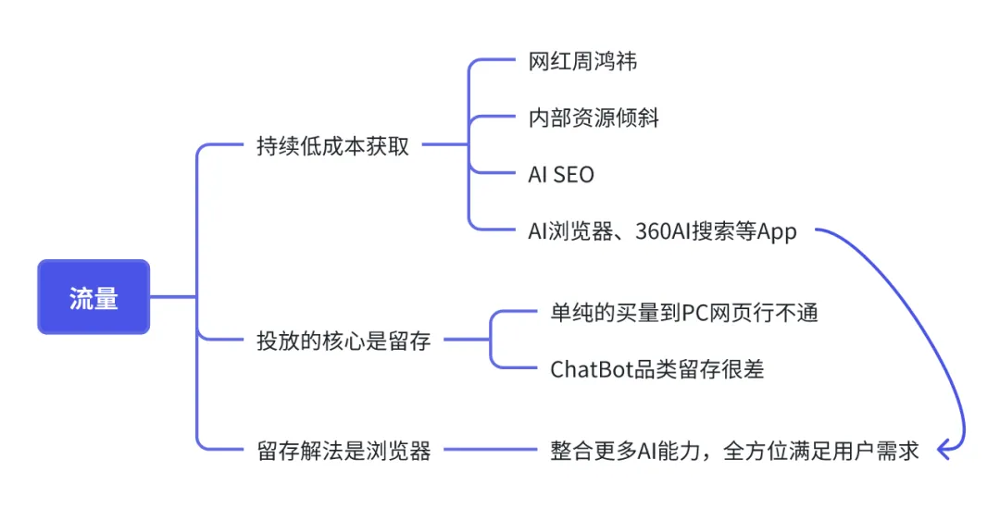

# AI-Agent

[toc]

## Intro

* Intro
  * åšå¤§æ¨¡å‹ï¼Œå¾ˆéš¾ç†è§£å…¨éƒ¨ï¼Œé€€è€Œæ±‚其次，ç†è§£å…¶èƒ½åŠ›çš„边界很关键
  
* 术语
  * Large Language Model(LLM)
  * ChatGPT
  * PaLM/Bard(Google)
  * Llama(Meta)
  * Github Copilot
* 大模å‹çš„å‘展
  * https://arxiv.org/pdf/2304.13712
  * BERT pretrain的概念
  * 2018年英伟达å¯ä»¥ç”Ÿæˆå›¾ç‰‡çš„StyleGAN模å‹ã€2019å¹´DeepMindå¯ä»¥è‡ªåŠ¨ç”Ÿæˆè¿ç»­è§†é¢‘çš„DVD-GAN模å‹å’Œ2022å¹´OpenAIèŠå¤©æœºå™¨äººChatGPT是AIGC在应用层é¢çš„三个é‡è¦èŠ‚点。

### 场景


### 大模å‹ç®€è¦ä»‹ç»

* 表é¢ä¸Šåšä»€ä¹ˆäº‹æƒ…：ä¸æ–­æ ¹æ®å‰æ–‡ç”Ÿæˆâ€œä¸‹ä¸€ä¸ªâ€è¯
  * OpenAIçš„æ¥å£å：「Completionã€
  * 上文信æ¯è¶Šå¤šï¼Œå¯¹å文信æ¯çš„约æŸæ€§è¶Šå¼º

* 大模å‹çš„输入
  * ç¼–ç ï¼šword embeddingã€one-hotã€æ–‡å­—ã€æ•´æ•°
* 关键è¦ç´ 
  * æ•°æ®
    * 微调数æ®å¦‚何大é‡è·å¾—

  * 算力
  * 训练技术：RLHFã€prefix tuningã€hard/soft prompt tuningã€SFTã€retrieval augment
  * 模å‹ç»“æ„
    * Ilya: æ•°å­—ç¥ç»ç½‘络和人脑ç¥ç»ç½‘络，在数学åŸç†ä¸Šæ˜¯ä¸€æ ·çš„（把AI当人看）
* å½±å“è¦ç´ 
  * ä¿¡ä»»
  * 安全
  * éšç§
  * 认知

### AI Engineer 的边界

> “One of your key responsibilities will be to coach the organisation and be at the forefront of deciding where and if LLMs are even needed to solve a business problem.â€

* [What is AI Engineer?](https://www.newsletter.swirlai.com/p/what-is-ai-engineering?utm_campaign=post&utm_medium=web)
  * **AI Researchers -** they are masters of prototyping, coming up with novel ideas and testing their hypothesis. Analyse the output data and come up with novel strategies how to keep continuously improving the models. Deep understanding of statistics and ML fundamentals. Nowadays, very likely they are able to run LLM training on distributed systems themselves.
    - What they might initially lack in skills is the ability to deploy real world production applications and implementing MLOps best practices in the world of LLMs.
    - “The goal of AI Engineer is to take what is already available and stitch up an AI system that would solve a real business problem.â€
  * **ML Engineers -** capable of building and deploying regular Machine Learning models as AI/ML systems with all of the bells and whistles of MLOps. This includes implementation of feedback flywheel and ability to observe and continuously improve the system. Also, ML Engineers are usually involved in Data Engineering to some extent, often utilising ML specific data stores like Feature Stores or Vector DBs.
    - What they might initially lack in skills is the ability to perform deep research and build production ready high throughput systems as well as implementing and operating regular software best practices.
  * **Software Engineers** - they are great! Capable of crafting complex high throughput, low latency systems that are deterministic. Translating business requirements into complex software flows. Masters of DevOps and software engineering best practices, capable of high velocity development and shipping to production in a safe way.
    - What they might initially lack in skills is the ability to reason in non-deterministic systems and knowledge how to observe and evaluate them. Also, it is not in their nature to continuously learn non software related topics that could completely shift in a day, requiring re-architecture of the entire system.


### 技能点

- **Research** - white papers need to become your best friend. There is so much research happening in the field of Agentic applications that it is hard to keep up. As an example, just recently, there has been a [paper](https://arxiv.org/abs/2411.10541) released with research around how Prompt Formatting can influence the performance of your LLM applications. The truth is that with internal data and compute resources at your disposal, you - the AI Engineer - are best positioned to do your own research on what works and what does not, and you should do it for the sake of your employer.
- **Prompt Engineering** - while it might sound simple, the techniques for prompt engineering and formatting are vast. When it comes to agentic systems, you are also dealing with cross agent prompt dependencies, shared state and memory that is also implemented via prompting. On top of this, everything needs to be evaluated so you will need custom evals for any prompt you are crafting coupled with datasets that you can test on.
- **Software Development -** no questions here, the systems you are deploying need to be solid. You need to know and follow software engineering and DevOps best practices.
- **Infrastructure -** one aspect of this is that you need to be able to deploy your own work, you could say it is part of Software Development. Also you need to understand your data and new types of storage systems like Vector DBs. In general, these are not new, but rarely used by non ML Engineers.
- **Data Engineering** - you would be surprised in how much time you would actually spend understanding, cleaning and processing the data that is then used in your AI Systems. Not everything is about prompting, the hardest part is usually integrating the data sources into your AI applications.
- **MLOps adapted for AI Systems (AgentOps)** - we have introduced a lot of good practices into building AI systems in the past ~5 years via the MLOps movement. Most of them should be transferred when building with LLMs.
  - Evaluation.
  - Observability. I talk about some of the challenges in observing Agentic systems in one of my articles: [Observability in LLMOps pipeline - Different Levels of Scale](https://www.newsletter.swirlai.com/p/observability-in-llmops-pipeline)
  - Prompt tracking and versioning.
  - Feedback and the continuous system improvement flywheel.


## ToC 产å“

### 模å‹èƒ½åŠ›


### 产å“æ¶æ„


* å®ç° Copilot 的主æµæ¶æ„是 **多 Agent æ¶æ„**
  * 模仿人åšäº‹ï¼Œå°†ä¸šåŠ¡æ‹†æˆå·¥ä½œæµï¼ˆworkflowã€SOPã€pipeline）
  * æ¯ä¸ª Agent 负责一个工作æµèŠ‚点

### 产å“逻辑

#### 产å“逻辑

* ä¸çœ‹å¥½çš„大模å‹å…¬å¸ç±»å‹
  * 打补ä¸ï¼šå¤§æ¨¡å‹åšé”™äº†æ•°å­¦é¢˜ï¼Œå› æ­¤åœ¨å¤–é¢åŠ äº†ä¸€å †ä¸œè¥¿ï¼Œç›®çš„是算对数学题；
  * 雕花：模å‹æœ¬æ¥è¾“出的格å¼å¯èƒ½ä¸å¤ªå¯¹ï¼Œç»™ä»–加点å处ç†ï¼Œå®ƒè¾“出的格å¼å°±å¯¹äº†ã€‚
  * 套壳：模å‹ä¸Šé¢å¥—个界é¢å°±æ‹¿å»å–，没有任何行业的积累，或者别人没有的数æ®ï¼Œåˆ«äººæ²¡æœ‰çš„客户，åªæ˜¯å½“æˆé€šç”¨å·¥å…·å»å–。

* [有èµçš„ AI å®è·µï¼šæŠŠå†³å®šæƒäº¤ç»™ç”¨æˆ·ã€Copilot å’Œ Agent 最é‡è¦](https://mp.weixin.qq.com/s/ItnXazO86IeGEb7yL-72gg)
  * AI 对äºäº¤äº’的改å˜ï¼š LUI+GUI 会是未æ¥ä¸»æµ
    * 乔布斯对人类的两大贡献，一是将电脑引入了图形界é¢ï¼ŒäºŒæ˜¯åœ¨ç¦»ä¸–å‰è®©è‹¹æœçš„整个用户界é¢æ‰å¹³åŒ–。æ‰å¹³åŒ–虽然有人认为ä¸å¤Ÿç¾è§‚，但它的好处是让用户更加èšç„¦äºç•Œé¢å†…容，也让产å“设计者更加èšç„¦äºå¦‚何通过内容ä¸ç”¨æˆ·äº’动，而ä¸æ˜¯ä¿®é¥°é‚£äº›å¥½çœ‹çš„æ¸å˜å’Œè¾¹è¾¹è§’角。
    * CUI，也就是命令å¼ç”¨æˆ·ç•Œé¢ï¼Œä¸ä»…å…许用户录入文本甚至语音，还会在ä¸ç”¨æˆ·äº¤äº’过程中弹出过å»çš„一部分图形界é¢è¡¨ç°å½¢å¼ï¼Œä»¥ä½¿ç”¨æˆ·æ›´å®¹æ˜“æ“作。
  * 有èµå¦‚何è½åœ° AI SaaS： 让用户åšæœ€ç»ˆå†³ç­–ã€Copilot最é‡è¦
    * **åŸåˆ™ä¸€ï¼šè¦æ§åˆ¶æ¨¡å‹å«é‡**
    * **åŸåˆ™äºŒï¼šå›åˆ°çº¯æ–‡æœ¬é€»è¾‘æ€è€ƒ**
    * **åŸåˆ™ä¸‰ï¼šèƒ½é€‰æ‹©å°±ä¸å½•å…¥**
    * **åŸåˆ™å››ï¼šç›´æ¥å‘ˆç°ç­”案，å†åšè§£é‡Š**
    * **åŸåˆ™äº”：给用户交付å¯ç”¨çš„结æœ**
    * **åŸåˆ™å…­ï¼šè®©äººç±»æ¥æŒ‰ä¸‹ã€Œå›è½¦ã€é”®**。 决策ä¸åªæ˜¯ã€Œå®¢è§‚ã€å°±å¤Ÿäº†ï¼Œæ½œæ„识ã€æƒ…绪ã€åè§é‡Œé¢å›ºç„¶æœ‰ä¸å®¢è§‚，但是也有梦想ã€å–œæ¬¢ã€çˆ±ï¼Œæœ‰äº†è¿™äº›æ‰æ˜¯å®Œç¾çš„决策。
  * å˜ç°é€»è¾‘：
    * 在有èµçš„业务中，我们的核心是帮助商家和å“牌商进行顾客è¿è¥
    * ç°åœ¨æ™®é一个商场店一年的客户å¤è´­ç‡åœ¨ 30% å·¦å³ï¼Œå•†åœºç»™çš„自然æµé‡ï¼Œè¿›æ¥çš„用户ä¸åˆ°å››æˆï¼Œæ¯å¹´çš„生æ„éƒ½ä¼šä¸‹é™ 30%。通过线上è·å¾—æ–°çš„æµé‡å¯èƒ½ä¼šè¶Šæ¥è¶Šè´µï¼Œå› ä¸ºæµé‡å°±æ˜¯äººï¼Œäººæ•°ä¸æ¶¨ï¼Œç”¨æˆ·æ—¶é•¿ä¹Ÿä¸æ¶¨ï¼Œä½†æŒæ¡æµé‡çš„å¹³å°å®ƒçš„财报è¦æ¶¨ï¼Œè‚¯å®šä¼šä»å•†å®¶é‚£æŒ¤åˆ©æ¶¦ã€‚那你æ€ä¹ˆåŠï¼Ÿä»å¹³å°é‚£è·å¾—çš„æµé‡å˜è´µï¼Œå¤è´­ç‡ä¹Ÿä¸å¤Ÿï¼Œè‡ªç„¶æµé‡ä¹Ÿä¸å¤Ÿï¼Œé‚£æŠŠå¤è´­ç‡ç¿»ä¸€å€ä¸å°±å¥½äº†ï¼Ÿ
    * 所以**深度è¿è¥æ¶ˆè´¹è€…是é常划算的一件事**。有èµå¸Œæœ›åšçš„，就是帮助商家将å¤è´­ç‡ç¿»å€ã€‚ç›®å‰æˆ‘们的产å“线已ç»è¦†ç›–到内容è¥é”€ã€æ¶ˆè´¹è€…è¿è¥ã€å¯¼è´­è¿è¥ã€äº¤æ˜“转化ã€çº¿ä¸Šäº¤æ˜“转化ã€é—¨åº—管ç†ã€è¿›é”€å­˜æ”¶é“¶çš„门店数字化等ç¯èŠ‚。
      * 导购对è¿é”门店è€é¡¾å®¢çš„è¿è¥
  * AI助力
    * **第一是 Copilot，就是助手**。它能够帮助客户快速地使用产å“，更好地使用产å“。
    * **第二是 Agent，自动化的能力**。自动化的å‘报告，自动化的预警，自动化的å»å®Œæˆå¾ˆå¤šäº‹æƒ…。例如，商家å¯ä»¥è®¾ç½®åº“存促销规则，如还有 500 件库存时打 5 折，剩下 200 件时打 6 折，以此类æ¨ã€‚那么用户就ä¸éœ€è¦æ—¶åˆ»ç›¯ç€å»æ”¹åº“存，因为这些事情都å¯ä»¥é€šè¿‡è‡ªåŠ¨åŒ–æ¥å®Œæˆã€‚
    * **第三是 Insight，æ´å¯Ÿå»ºè®®èƒ½åŠ›**。它能够总结周报，告诉你åšå¾—好ä¸å¥½ï¼Œç»™ä½ å»ºè®®ï¼Œä½ å¯ä»¥æ€ä¹ˆæ”¹å–„。
    * **第四是 AIGC，生æˆåˆ›æ„的能力**。生æˆè¥é”€æ–‡æ¡ˆï¼Œä¼˜åŒ–商å“标题，设计è¥é”€æ¨å¹¿æµ·æŠ¥ï¼Œä¼˜åŒ–商å“图片等等。
  * AI + SaaS
    * SaaS 有两个é常é‡è¦çš„特点，一个是å¯ä»¥åœ¨çº¿çƒ­æ›´æ–°ï¼Œä¸åƒå•æœºç‰ˆè½¯ä»¶ï¼Œéœ€è¦é‡æ–°å®‰è£…æ‰èƒ½æ›´æ–°ï¼›å¦ä¸€ä¸ªæ˜¯å› ä¸ºå®ƒæ˜¯åœ¨çº¿æœåŠ¡ï¼Œæ‰€ä»¥ä¼šæœ‰å¤šä¸ªç”¨æˆ·åŒæ—¶ä½¿ç”¨ï¼Œè€Œä¸æ˜¯åªæœ‰ä¸€ä¸ªç”¨æˆ·ä½¿ç”¨å•æœºç‰ˆè½¯ä»¶ã€‚因此，SaaS é¢ä¸´ç€ä¸€ä¸ªå®¿å‘½ï¼Œå°±æ˜¯**å¿…é¡»ä¸æ–­åœ°è¿›è¡Œä¸ªæ€§åŒ–定制，因为æ¯ä¸ªç”¨æˆ·éƒ½è§‰å¾—自己ä¸ä¼—ä¸åŒ**。尤其是在中国，整个èŒä¸šåŒ–体系和商业化体系还没有æˆç†Ÿï¼Œæ¯ä¸ªä¼ä¸šéƒ½è§‰å¾—自己很了ä¸èµ·ï¼Œéƒ½æœ‰è‡ªå·±ç‹¬ç‰¹çš„基因和个性化的需求。
    * **æ¯å¢åŠ ä¸€ä¸ªåŠŸèƒ½ï¼Œåªèƒ½æœåŠ¡ä¸åˆ° 5% 的用户，å´ä¼šéªšæ‰° 95% 的用户**。
    * 一方é¢ï¼Œå¦‚æœä½ æ‰“开有èµç»™å•†å®¶æ供的åå°ï¼Œæ¯”如新零售的 CRMã€å¯¼è´­åŠ©æ‰‹æˆ–者有èµå¾®å•†åŸçš„商家åå°ï¼Œä¼šå‘ç°é‡Œé¢æœ‰å‡ åƒä¸Šä¸‡ä¸ªåŠŸèƒ½ã€‚我们ç°åœ¨çš„设计æ€è·¯æ˜¯ï¼Œé€šè¿‡å·¦è¾¹çš„导航地图，让你找到最常用和最需è¦çš„功能。å¦ä¸€æ–¹é¢ï¼Œä½ å¯ä»¥å”¤èµ·ä¸€ä¸ªå«åšæ™ºèƒ½åŠ©æ‰‹çš„东西，通过命令å¼å¯¹è¯å‘Šè¯‰å®ƒä½ æƒ³å¹²ä»€ä¹ˆï¼Œå®ƒå¯ä»¥ä¸€é”®ç›´è¾¾æŸä¸ªåŠŸèƒ½ï¼Œæˆ–者一键直æ¥å¸®ä½ æ‰§è¡Œä½ æƒ³è¦çš„自动化任务和æ“作。
    * **SaaS 业务的è¿è¥ï¼Œå…¶å®å°±æ˜¯åœ¨è¿è¥æœ€ä½³å®è·µçš„总结ã€ä¼ æ’­ï¼Œæˆ–者说是把最佳å®è·µåšæˆäº§å“**
  * AI + ä¼ä¸šç®¡ç†
    * 今年，我们把公å¸çš„角色分æˆä¸¤ç±»ï¼Œä¸€ç±»å«ç›´æ¥ç”Ÿäº§åŠ›ï¼Œå¦ä¸€ç±»å«éç›´æ¥ç”Ÿäº§åŠ›ã€‚ç›´æ¥ç”Ÿäº§åŠ›æ˜¯æŒ‡ç›´æ¥é¢å¯¹ç”¨æˆ·çš„人员，包括客æœã€äº¤ä»˜çš„客户æˆåŠŸã€é”€å”®ç­‰ã€‚æˆ‘ä»¬è¿˜è§„å®šï¼Œæ¯ 10 个直æ¥ç”Ÿäº§åŠ›éœ€è¦æœ‰ä¸€ä¸ªç›´æ¥ç”Ÿäº§åŠ›çš„è¿è¥äººå‘˜ã€‚这些è¿è¥äººå‘˜çš„èŒè´£æ˜¯æ€»ç»“一线直æ¥ç”Ÿäº§åŠ›é¢å¯¹å®¢æˆ·æ—¶çš„最佳å®è·µå’Œæœ€ä½³å‘ç°ï¼Œè¿™äº›æœ€ä½³å®è·µå’Œæœ€ä½³å‘ç°æ˜¯æœ€å¥½çš„语料
    * 未æ¥ï¼Œæœ‰èµå°†ä»ä¸€ä¸ªç ”å‘软件ã€é”€å”®è½¯ä»¶çš„å…¬å¸ï¼Œå˜æˆä¸€ä¸ªç»™å•†å®¶æ供智能化消费者è¿è¥ç³»ç»Ÿçš„å…¬å¸ï¼Œå¹¶ä»ä¸€ä¸ªè½¯ä»¶å…¬å¸å˜æˆä¸€ä¸ªè¿è¥å•†ï¼Œé€šè¿‡è¿è¥è¿™å¥—智能化系统，让直æ¥ç”Ÿäº§åŠ›åœ¨ä¸€çº¿çœ‹åˆ°çš„所有最佳å®è·µå’Œæœ€ä½³æ€»ç»“å˜æˆè¯­æ–™æ¥è®­ç»ƒç³»ç»Ÿï¼Œä½¿ç³»ç»Ÿè¶Šæ¥è¶Šæ‡‚用户，更好地传播最佳å®è·µã€‚这就是我们的核心æ€è·¯ã€‚


* [How to build an enterprise LLM application: Lessons from GitHub Copilot](https://github.blog/2023-09-06-how-to-build-an-enterprise-llm-application-lessons-from-github-copilot/)。这篇文章æ述了 GitHub Copilot 的产å“打造哲学

  * **Find it:** Identify an impactful problem space for your LLM application

    * the “whole function†level  <- **Balance product ambition with quality**

  * **Nail it:** Create a smooth AI product experience

    * “**We have to design apps not only for models whose outputs need evaluation by humans, but also for humans who are learning how to interact with AI.**â€
    * “[dogfooding](https://www.nytimes.com/2022/11/14/business/dogfooding.html)†products before—and after—they’re released
    * 核心指标：acceptance ratesã€code retention rate
    * **Evaluate your testing tools**.
    * **Make a habit of revisiting old ideas**
    * **Avoid the sunk cost fallacy**.

  * **Scale it:** Get your LLM application ready and useable for general availability (GA)

    * **Ensure consistent results**.
      * é™ä½LLMéšæœºæ€§ã€cache result

    * **Take advantage of real user feedback**
      * a new guardrail metric—the percentage of suggestions that are multi-line vs. single line
    * 安全和信任
      * the GitHub Copilot team created a filter to block suggestions matching public source code in GitHub public repositories that were longer than 150 characters.
      *  [code reference tool](https://github.blog/2023-08-03-introducing-code-referencing-for-github-copilot/)
    * Develop a go-to-market strategy
      * **Launch your product with product evangelists**
      * **Get your product in front of individual users before going after businesses**

#### å˜ç°é€»è¾‘

* [陆奇对è¯é«˜ç§‘技è¥é”€ä¹‹çˆ¶ï¼šä»æŠ€æœ¯åˆ°å¸‚场，ChatGPT还需跨越“鸿沟â€](https://mp.weixin.qq.com/s/xvWzQ73Dg0XzJ5LxwmyWsA)
  * 近期出ç°çš„真正具有颠覆性的技术，我认为一个是基因编辑，å¦ä¸€ä¸ªå°±æ˜¯OpenAIçš„ChatGPT
  * 如æœæˆ‘们想打造出ChatGPT这样高科技产å“的市场，技术æˆç†Ÿè¿œè¿œä¸å¤Ÿï¼Œè¿˜éœ€**将这ç§é¢ è¦†æ€§åˆ›æ–°äº§å“社交化**，这中间还有巨大的“鸿沟â€éœ€è¦è·¨è¶Šã€‚
  * 技术生命周期一般分为4个阶段：
    * 第一阶段是有一些技术的狂热者以åŠæœ‰è¿œè§è€…，相信技术能够æˆåŠŸï¼Œå¸Œæœ›æˆä¸ºç¬¬ä¸€ä¸ªå°è¯•æ–°æŠ€æœ¯çš„人；
      * 早期阶段的策略：等对的人主动找你
    * 第二阶段是早期大众会觉得这项技术å¯èƒ½æ˜¯å¯¹çš„，但是还处äºæ—©æœŸï¼Œéœ€è¦è§‚望一下，他们å¯èƒ½ä¼šçœ‹çœ‹åˆ«äººä¼šä¸ä¼šé‡‡ç”¨è¿™é¡¹æ–°æŠ€æœ¯ï¼Œä¼šè·Ÿé£å»ä½¿ç”¨æˆ–者拒ç»ä½¿ç”¨ã€‚
    * 当一家åˆåˆ›å…¬å¸ç§¯ç´¯äº†è¶³å¤Ÿå¤šçš„使用案例å，大家就会认为这其å®æ˜¯è¡Œä¸šçš„基础设施建设，是我们æ¯ä¸ªäººéƒ½éœ€è¦çš„，比如云计算和Wi-Fi，人工智能等，那些观望者就会想è¦è¿›å…¥å¸‚场，追赶潮æµã€‚ç¬é—´æ‰€æœ‰é¢„算涌入市场，购买你的产å“，我们把这ç§ç°è±¡ç§°ä¸ºâ€œé¾™å·é£â€ã€‚
  * 跨越“鸿沟â€çš„关键所在就是如何让早期大众能够开始采用颠覆性的新技术，你必须è¦ç„准一个很å°çš„利基市场，他们有很多痛点，需è¦æ›´å¤šæ–°çš„解决方案æ¥è§£å†³å½“下的问题。如æœä½ èƒ½è§£å†³ä»–们的问题，他们就会采用你的新技术。
  * 在早期市场，人们买的ä¸æ˜¯äº§å“，而是**项目**。早期市场，作为一个åˆåˆ›ä¼ä¸šï¼Œä½ çš„客户其å®æŠŠä½ å½“æˆäº†ä¸€ä¸ªå’¨è¯¢å…¬å¸ï¼Œä»–们å¯èƒ½ä¼šç»™ä½ å¾ˆå¤šèµ„金，让你按照他的想法å»æ‰“造一个产å“。
    * ä¸ToB“项目制â€çš„è”ç³»
  * 早期市场的这些客户，我们称之为旗舰å‹çš„客户，他们一定是一群知å度很高的客户。比如ç¾å›½é“¶è¡Œã€ç¦ç‰¹æ±½è½¦ã€è¿ªå£«å°¼æˆ–者微软，一定是大家都知é“çš„ä¼ä¸šã€‚
    * 一定è¦æ‰¾é‚£äº›å¤§å‹çš„知åä¼ä¸šä½œä¸ºä½ çš„客户，åšä¸¤ä¸ªé¡¹ç›®å°±å¤Ÿäº†ï¼Œåœ¨è¿™ä¹‹åå°±ä¸è¦ç»§ç»­å†åšé¡¹ç›®ï¼Œè€Œæ˜¯å¼€å§‹é‡å¤åœ°åšç›¸åŒçš„解决方案。
  * 我还有å¦å¤–一个问题，如何å»è¾¨åˆ«ä¸€ä¸ªé常å°ä¼—的需求和一个有远è§çš„需求之间的区别？
    * **摩尔：**我觉得利基市场的需求存在一个å®ç”¨æ¡ˆä¾‹ï¼ŒåŒæ—¶ä¹Ÿä¼šæœ‰ä¸€ä¸ªé¢„算，**这个预算ä¸æ˜¯ä¸ºä½ çš„产å“，而是为了解决他们的问题**。你å¯èƒ½ä¼šåœ¨åšé¡¹ç›®çš„时候é‡åˆ°è¿™æ ·ä¸€ä¸ªé—®é¢˜ï¼Œæœ‰è¿œè§è€…说这是é常é‡è¦çš„问题，我希望能够改å˜æ•´ä¸ªä¸–界。但是在你的头脑里，你应该想到，如æœåˆ«çš„客户也有åŒæ ·çš„问题，我们如何解决。因为我们å®é™…上解决ä¸äº†å¤ªå¤šé—®é¢˜ï¼Œä½†æ˜¯å®ç”¨ä¸»ä¹‰è€…是希望你的产å“一定能解决他们的问题。
    * 核心是计算给新客户åšå®šåˆ¶åŒ–需求的代价
    * 更进一步，形æˆç”Ÿæ€ï¼Œå¯»æ‰¾åŠ ç›Ÿåˆä½œã€‚当市场越æ¥è¶Šå¤§æ—¶ï¼Œé¦–先是基础æœåŠ¡çš„æ供商们赚钱，然å就轮到å端的软件æ供商。
  * ç°åœ¨å¯ä»¥ç”¨AIå»ç®¡ç†æ•°æ®ï¼ŒAIå¯ä»¥ä»æµ·é‡æ•°æ®ä¸­ç²¾å‡†åœ°æ‰¾åˆ°ä½ æƒ³è¦çš„ä¿¡æ¯ï¼Œè¿™ä¸€ç‚¹æ¯”人åšå¾—更好。

* å…³äºå¼€æº
  * å¼€æºå¯ä»¥é常迅速地渗é€å¸‚场，这就åƒå…è´¹å¢å€¼ä¸€æ ·ï¼Œå¦‚æœåšæŒè¿™ä¸€ç‚¹ï¼Œæˆ˜ç•¥å°±ä¼šæŠŠæ¡åœ¨æ›´å¼ºæœ‰åŠ›çš„人手中。如æœä½ å–出你模å‹ä¸­çš„一部分，你的客户ç«äº‰å°†å‡çº§åˆ°ä¸€å®šçš„水平，而你会继续å‰è¿›ï¼Œè¿™æ˜¯ä¸€ç§æ‰¹é‡è¿è¥æ¨¡å¼ã€‚
  * 我对äºä¸€å®¶å…¬å¸ä¸­çš„context（场景上下文）æ¥è¯´ï¼Œå¼€æºæ˜¯æœ€ä½³é€‰æ‹©ï¼Œä½†å¯¹core（核心）而言则ä¸æ˜¯è¿™æ ·ã€‚核心指的是让你的产å“脱颖而出，为你æ供别人ä¸å…·æœ‰çš„比较优势的东西，也就是你应该ä¿æŠ¤çš„有产æƒçš„知识，大家都想得到它并希望它正常è¿è¡Œï¼Œå¦‚æœå®ƒæ­£å¸¸è¿è¡Œï¼Œä½ ä¸ä¼šå¾—到任何奖励，但如æœå®ƒè¿è¡Œæ•…障，你å´ä¼šå—到惩罚，所以开æºä¼šå¸¦æ¥ç½‘络安全和产å“è´¨é‡çš„åŒé‡é£é™©ã€‚
  * 作为对比，关äºPingCap激进的开æºï¼š
    * 这是一个典å‹çš„å¼€æºæ¨¡å¼ï¼Œä»–们给你SaaS或者给你分å‘，本质上就跟Red Hat一样定制，他们é常相信开æºï¼Œç›¸ä¿¡è¿™ä¼šè®©åˆ›æ–°æ›´å¿«ï¼Œé•¿æœŸå®¢æˆ·è·å–çš„æˆæœ¬ä¼šé™ä½ã€‚
    * 规模化和货å¸åŒ–会比较困难

* ä¼ä¸šä¸šåŠ¡å¢é•¿çš„å¯èƒ½æ€§
  * ç°åœ¨ä¸šåŠ¡è§„模å°ã€èµ›é“窄的互è”网公å¸ï¼Œæœ‰å¯èƒ½åšèµ·æ¥äº†

* 自动åšppt
  * https://gamma.app/

* 自动画结æ„化的脑图
* æ•°æ®åº“+NLP
* ToB场景示例
  * 大模å‹ç›¸å…³çš„ToB场景研å‘æˆæœ¬ä¸‹é™


#### 难点

* 认知ä¸å¯¹é½
  * [å¤ç›˜å¤§æ¨¡å‹çš„一次æˆåŠŸè½åœ°ï¼Œä»£æ›¿äº†ç™¾ä¸‡å¹´è–ªçš„人](https://mp.weixin.qq.com/s?__biz=MzAwNDk3NjUxMg==&mid=2247484174&idx=1&sn=ce1bed131385fd9bf71bc9ffa3bd5592&chksm=9b22f9e1ac5570f721ac2480d7010607139aa7ba5d95a604be44d32c790fd911d2f91bc0e21c#rd)
    * <b>æˆåŠŸè½åœ°å¤§æ¨¡å‹äº”è¦ç´ </b>：
      * 业务人员的积æ
      * 对 AI 能力的认知
      * 业务团队自带编程能力
      * å°å¤„ç€æ‰‹
      * è€æ¿çš„è€å¿ƒ
    * <b>找è½åœ°åœºæ™¯çš„æ€è·¯ï¼š</b>
      * ä»æœ€ç†Ÿæ‚‰çš„领域入手
      * å°½é‡æ‰¾èƒ½ç”¨è¯­è¨€æ述的任务
      * 别求大而全。将任务拆解，先解决å°ä»»åŠ¡ã€å°åœºæ™¯
      * 让 AI 学最å‰å®³å‘˜å·¥çš„能力，å†è®© ta 辅助其他员工，å®ç°é™æœ¬å¢æ•ˆ

#### 天花æ¿åˆ†æ

TODO

* https://darioamodei.com/machines-of-loving-grace
* https://epoch.ai/blog/can-ai-scaling-continue-through-2030


### App

#### 榜å•

* 2025/06 AI产å“周榜 https://mp.weixin.qq.com/s/QYy1aEkUOkpD8FMeuvC2hQ
  * 

* 展望Killer App
  * AIæš‚æ—¶åªæ˜¯å¯¹æ—§åœºæ™¯çš„å¢å¼º

#### 助手类 Chatbot

* 豆包

##### [对腾讯汤é“生时隔一年的独家专访：元å®é‡å…µæŠ•å…¥è¿™åŠå¹´](https://mp.weixin.qq.com/s/jSRLLI3-nsEhYoAwL5agaQ)

* è¿‘åŠå¹´è…¾è®¯å…ƒå®çš„几个关键点：
  * 组织æ¶æ„调整：csig（云事业部）åšå…ƒå®ï¼Œtegåšæ··å…ƒ
  * å…ƒå®æ¥å…¥deepseek
    * 总结一下，这个决策的关键点æ¥è‡ªäºPonyå‘了一æ¡ç¾¤èŠã€‚

* å…ƒå®
  * 定ä½ï¼šå¸Œæœ›å…ƒå®å°†ä¼šæˆä¸ºC端æœç´¢ä¿¡æ¯çš„æ–°å…¥å£ã€‚
* 对AI Searchçš„ç†è§£
  * LLMæ’åºæ•ˆæœä¸é”™ï¼šä»Šå¤©åšæœç´¢å’Œå几年å‰åšæœç´¢å®Œå…¨ä¸ä¸€æ ·äº†ï¼Œæˆ‘们会充分利用AIã€å¤§æ¨¡å‹çš„能力æ¥å¸®æˆ‘们挑选最å¯èƒ½çš„ä¿¡æ¯æ¥æºã€æœ€æƒå¨çš„网站内容，然åå†ç”¨è¿™äº›ä¿¡æ¯åŠ å…¥åˆ°æ’åºé€»è¾‘里。 ç°åœ¨åˆæ­¥æ¥çœ‹ï¼Œè¿™ç§AIåŸç”Ÿï¼ˆAI-native）的æœç´¢å¼•æ“能力è¦æ¯”传统先爬å›æ•°æ®ï¼ŒåŸºäºæŸäº›æ–¹å¼ç²—æ’å†ç²¾æ’的效æœæ›´å¥½ã€‚
  * 产å“&技术细节：在产å“层é¢ï¼Œæˆ‘们一直在**补能力**，比如改善æœç´¢æœåŠ¡çš„准确性ä¸æ—¶æ•ˆæ€§ï¼Œæ”¯æŒæ›´å¤šæ–¹è¨€çš„语音识别，支æŒæ›´ç²¾å‡†çš„图片修改，改善性能加速å字等。
* 腾讯的AI Agent产å“场景：
  * **腾讯云的è¥é”€è‡ªåŠ¨åŒ–产å““ä¼ç‚¹è¥é”€äº‘â€**å·²æœåŠ¡å¾ˆå¤šé›¶å”®å®¢æˆ·ï¼Œä»¥å‰åŸºäºé€šç”¨å¤§æ•°æ®æ¨¡å¼ï¼Œç»“åˆçº¿ä¸Šçº¿ä¸‹ç”¨æˆ·è¡Œä¸ºï¼Œå»ºç«‹ç”¨æˆ·ç”»åƒï¼Œä»æ–°ç”¨æˆ·åˆ°é¦–次购买ã€å¤è´­ï¼Œå†åˆ°ä¼šå‘˜çš„整个æµç¨‹ä¼˜åŒ–。我相信éšç€æ›´å¤šä¼ä¸šç”¨æ™ºèƒ½ä½“ç»™è¥é”€åŠ æŒï¼Œè¿™ç±»è¥é”€åœºæ™¯æœ‰å¤§çš„æå‡ç©ºé—´ã€‚ 最近我们帮一个è¿é”零售客户——ç»å‘³é£Ÿå“——åšäº†ä¸€ä¸ªè¥é”€å¢æ”¶é¡¹ç›®ã€‚项目中，我们用了多个Agentæ¥æå‡è¥é”€ç®¡çº¿çš„ä¸åŒç¯å¢ƒï¼Œæœ€ç»ˆç»“æœè®©æ‰€æœ‰äººéƒ½å¾ˆæƒŠè®¶ã€‚对比专家组，效æœè¾¾åˆ°äº†3å€çš„æå‡ã€‚
  * **腾讯云智能体开å‘å¹³å°3.0**，支æŒè¶…过140个MCPæ’件æœåŠ¡ï¼Œå¤§å¤§æ‰©å±•äº†æ™ºèƒ½ä½“能调用的工具能力，并支æŒå¤šæ™ºèƒ½ä½“并行å作，让智能体æ­å»ºå¯ä»¥æ›´ç®€å•ã€æ›´æ¨¡å—化。
    * 我们很多业务的MCPæœåŠ¡ï¼Œæ¯”如地图ä¸æ”¯ä»˜ï¼Œéƒ½æ˜¯å¯¹å¤–开放的，欢è¿å¤–部的智能体调用。
* 对RAGã€AI Agentçš„ç†è§£ï¼š
  * 过å»ä¸¤å¹´ï¼Œæˆ‘们有很多To B智能体项目的å®è·µç»éªŒï¼Œæ¯”如用RAG模å¼æ­å»ºå®¢æœç³»ç»Ÿï¼Œè¿‡ç¨‹ä¸­å¾€å¾€å‘ç°å¾ˆå¤šä¼ä¸šå†…部数æ®æ··ä¹±ï¼Œéœ€è¦ä¼ä¸šå…ˆæŠ•å…¥åšæ•°æ®æ²»ç†ã€‚在ä¼ä¸šåœºæ™¯ä¸‹ï¼Œæ•°æ®æ²»ç†æ˜¯æ¯”较耗时的工作。
    * 如æœå†…部文档有矛盾，就必须梳ç†æ¸…楚，定义好ä¸åŒä¿¡æ¯æ¥æºçš„æƒå¨æ€§ï¼›
    * 如æœæ–‡æ¡£æœ‰æ–°ã€è€ç‰ˆæœ¬ï¼Œå¬å›é€»è¾‘必须考虑时效性
* 腾讯的优势：
  * è¦åœ¨æŸä¸ªåœºæ™¯æ»¡è¶³ç”¨æˆ·éœ€æ±‚，有很多周边能力需è¦æ­é…，包括æœç´¢èƒ½åŠ›ã€è¯­éŸ³ç†è§£ä¸ç”Ÿæˆã€ä¸“业数æ®ã€æœåŠ¡ç”Ÿæ€ç­‰â€”—腾讯本身在å„ç§å†…容ä¸æœåŠ¡ç”Ÿæ€æœ‰æ¯”较强的积累，对我们是一个有利的地方。
  * 微信支æŒå…ƒå®çš„力度是å‰æ‰€æœªæœ‰çš„大，包括早期的广告ä½ã€æ–°é—»æ’件，还有视频å·ä¸å…¬ä¼—å·ä¹Ÿå¯ä»¥è¢«@å…ƒå®åšç‚¹è¯„。
  * 地图&支付等腾讯内部其它业务，开放了MCPæœåŠ¡ï¼Œå¯ä¾›ToB Agentå¹³å°è°ƒç”¨ “我们很多业务的MCPæœåŠ¡ï¼Œæ¯”如地图ä¸æ”¯ä»˜ï¼Œéƒ½æ˜¯å¯¹å¤–开放的，欢è¿å¤–部的智能体调用。†
    * --> 字节能å¦ç”¨ç±»ä¼¼æ‰“法？


#### æœç´¢ç±»

* [Perplexity](https://perplexity.ai)
* [秘塔 AI](https://metaso.cn/)
* [Devv](https://devv.ai/)

#### 情感陪伴类

* [Character.AI](https://character.ai)（已被 Google 收购）
* [星é‡](https://www.xingyeai.com/)
* [Replika](https://replika.ai)

#### 定制Agent

* GPTs
* 扣å­
* dify

#### AI编程

- [Cursor](https://www.cursor.com/)
- [Windsurf](https://codeium.com/windsurf)
- [InsCode](https://inscode.csdn.net/)
- [marscode](https://www.marscode.cn/)
- Copilot

#### æ‹ç…§ç­”题

* Gauth
* Question AI

#### 英语学习

* [多邻国](https://www.duolingo.cn/)
* æœ‰é“ Hi Echo

#### 图åƒå¤„ç†

* ç¾å›¾ç§€ç§€
* [Adobe Firefly](https://www.adobe.com/products/firefly.html)

#### åŠå…¬

* Notion AI https://www.notion.com/help/guides/category/ai

- [WPS AI](https://ai.wps.cn/)
- [Copilot for Microsoft 365](https://adoption.microsoft.com/en-us/copilot/)
- [钉钉魔法棒](https://alidocs.dingtalk.com/i/p/Pl2AmoVbakq8Xdb9BpLmk7jYdkVEvm2g)
- [é£ä¹¦æ™ºèƒ½ä¼™ä¼´](https://www.feishu.cn/product/ai_companion)
- [腾讯会议智能助手](https://meeting.tencent.com/ai/)

#### 全家桶

* Google
* Microsoft
* ByteDance

### å…¬å¸å†…部æ效

#### 常è§åœºæ™¯

* è¥é”€
  - AI åšè¥é”€åˆ›æ„，人å†åŠ å·¥
  - AI 批é‡ç”Ÿäº§è¥é”€ç´ æ
  - 多语言翻译
* 客æœ/销售
  - å…¨ AI，适åˆæœ¬æ¥æ²¡äººåšï¼ŒAI æ¥è¡¥ä½
  - åŠ AI，适åˆæœ¬æ¥æœ‰äººåšï¼ŒAI æ¥æ效
* åŠå…¬
  - 公文撰写/总结/翻译
  - 知识库
    - 内部客æœ
    - 辅助决策
  - 情报分æ
  - BI (business intelligence)
* 产å“ç ”å‘
  - 创æ„ã€å¤´è„‘é£æš´
  - IT ç ”å‘æ效

#### 寻找è½åœ°åœºæ™¯

##### 业务æµç¨‹è§£æ„

- æ˜ç¡®ç›®æ ‡ ：确定解æ„的目标是什么，是å¦æ˜¯æå‡æ•ˆç‡ã€é™ä½æˆæœ¬ï¼Œè¿˜æ˜¯å¢å¼ºäº§å“或æœåŠ¡çš„è´¨é‡ã€‚
- 分æç°æœ‰æµç¨‹ ：通过ä¸ç›¸å…³éƒ¨é—¨å’Œå›¢é˜Ÿæ²Ÿé€šï¼Œäº†è§£å½“å‰çš„业务æµç¨‹ï¼Œä½¿ç”¨æµç¨‹å›¾ã€ä»·å€¼æµå›¾ç­‰å·¥å…·ã€‚
- æ”¶é›†æ•°æ® ï¼šæ”¶é›†ä¸æµç¨‹ç›¸å…³çš„æ•°æ®ï¼ŒåŒ…括时间ã€èµ„æºã€ç“¶é¢ˆç­‰ï¼Œè¯†åˆ«å‡ºç›®å‰æµç¨‹ä¸­çš„问题和改进点。
- 识别关键ç¯èŠ‚：确定æ¯ä¸ªç¯èŠ‚对业务结æœçš„å½±å“，识别哪些ç¯èŠ‚最能æ¨åŠ¨ä»·å€¼äº§ç”Ÿï¼Œå“ªäº›æ˜¯æµªè´¹æˆ–ä½æ•ˆçš„ç¯èŠ‚。

##### 绘制ä¼ä¸šä»·å€¼æµå›¾

- 识别关键æµç¨‹ï¼šå°†ä¼ä¸šæµç¨‹åˆ†ä¸ºä¸åŒçš„关键ç¯èŠ‚，如供应链管ç†ã€ç”Ÿäº§æµç¨‹ã€é”€å”®ç­‰ã€‚
- 标记价值å¢å€¼æ´»åŠ¨ï¼šæ˜ç¡®å“ªäº›ç¯èŠ‚å¢åŠ äº†å®é™…价值，哪些是纯粹的支æŒæ€§æˆ–éå¢å€¼æ´»åŠ¨ã€‚
- æµç¨‹ä¸­çš„浪费：识别æµç¨‹ä¸­å‡ºç°çš„浪费，如等待ã€è¿‡åº¦å¤„ç†ã€è¿è¾“ã€åº“å­˜ã€åŠ¨ä½œç­‰ã€‚
- 时间ä¸èµ„æºï¼šæ ‡æ³¨æ¯ä¸ªç¯èŠ‚的时间ã€èµ„æºæ¶ˆè€—，以åŠè¿™äº›æ¶ˆè€—如何影å“最终的交付。
- 改进方案：通过价值æµå›¾ï¼Œæ‰¾åˆ°éœ€è¦ä¼˜åŒ–çš„ç¯èŠ‚，æ出改善æªæ–½ã€‚

##### 识别大模å‹åº”用场景

- æ•°æ®é©±åŠ¨çš„决策：大模å‹å¯ä»¥å¸®åŠ©ä¼ä¸šåˆ†æ大é‡æ•°æ®ï¼Œæ供更精确的决策支æŒï¼Œç¤ºä¾‹ï¼šé€šè¿‡AI分æ客户数æ®ï¼Œä¼˜åŒ–市场è¥é”€ç­–略。
- 自动化ä¸æ™ºèƒ½åŒ–：大模å‹å¯ä»¥åº”用äºè‡ªåŠ¨åŒ–任务，如智能客æœã€è¯­éŸ³è¯†åˆ«ã€å›¾åƒè¯†åˆ«ç­‰ï¼Œå‡å°‘人工æˆæœ¬å¹¶æå‡æ•ˆç‡ã€‚
- 个性化æœåŠ¡ï¼šé€šè¿‡å¤§æ¨¡å‹å®ç°ä¸ªæ€§åŒ–æ¨è系统，基äºç”¨æˆ·å†å²è¡Œä¸ºæˆ–å好为其æ¨è个性化的产å“或æœåŠ¡ï¼Œæ高客户满æ„度和转化ç‡ã€‚
- 预测ä¸ä¼˜åŒ–：利用大模å‹å¯¹å†å²æ•°æ®è¿›è¡Œåˆ†æ，预测未æ¥è¶‹åŠ¿ï¼Œä¼˜åŒ–生产计划ã€åº“存管ç†ç­‰ä¸šåŠ¡ç¯èŠ‚。
- 业务æµç¨‹æ”¹è¿›ï¼šåˆ©ç”¨å¤§æ¨¡å‹åˆ†æ当å‰ä¸šåŠ¡æµç¨‹ä¸­çš„瓶颈和效ç‡ä½ä¸‹çš„ç¯èŠ‚，æ出改进æªæ–½ï¼Œä¼˜åŒ–资æºé…置。

#### 案例

* 智能供应链ä¸éœ€æ±‚预测优化
  * 

* 智能客æœ
* 智能生产线

## 应用开å‘

### 基础能力

* 按格å¼è¾“出
* 分类
* èšç±»
* æŒç»­äº’动
* 技术相关问题

### 产å“å¼€å‘

* 技能点：
  * 懂业务（客户ã€éœ€æ±‚ã€å¸‚场ã€è¿è¥ã€å•†ä¸šæ¨¡å¼ï¼‰ï¼Œæ‡‚æ€ä¹ˆèµšé’±
  * 懂AI：AI的能力边界
  * 懂编程

### Agent 应用技术æ¶æ„ã€ç³»ç»Ÿè®¾è®¡

* 纯prompt
* prompt + function calling
* RAG（Retrieval-Augmented Generation）

  - å‘é‡æ•°æ®åº“：把å‘é‡å­˜èµ·æ¥ï¼Œæ–¹ä¾¿æŸ¥æ‰¾
  - 当人看：考试答题时，到书上找相关内容，å†ç»“åˆé¢˜ç›®ç»„æˆç­”案，然å，**就都忘了**


* Finetuning
  * 值得å°è¯• Fine-tuning 的情况：
    * æ高模å‹è¾“出的稳定性
    * 用户é‡å¤§ï¼Œé™ä½æ¨ç†æˆæœ¬çš„æ„义很大
    * æ高大模å‹çš„生æˆé€Ÿåº¦
    * 需è¦ç§æœ‰éƒ¨ç½²
  * 一ç§æ‰‹æ®µï¼šå…ˆç”¨å¤§æ¨¡å‹æœåŠ¡ï¼Œç§¯æ”’输入输出数æ®ï¼Œå†ç”¨è¿™äº›æ•°æ®å¯¹å°æ¨¡å‹åšå¾®è°ƒ


* Notes
  * “准备测试数æ®â€œå®¹æ˜“被忽略

#### [一å£æ°”学会如何æ€è€ƒAI Agent系统设计](https://www.bilibili.com/video/BV1WoeozgEyn/)


### 大模å‹æŠ€æœ¯é€‰å‹

* 基础模å‹é€‰å‹ï¼Œåˆè§„和安全是首è¦è€ƒé‡å› ç´ ã€‚

| 需求             | 国外闭æºå¤§æ¨¡å‹ | 国产闭æºå¤§æ¨¡å‹ | å¼€æºå¤§æ¨¡å‹ |
| ---------------- | -------------- | -------------- | ---------- |
| 国内 2C          | 🛑             | ✅             | ✅         |
| 国内 2G          | 🛑             | ✅             | ✅         |
| 国内 2B          | ✅             | ✅             | ✅         |
| 出海             | ✅             | ✅             | ✅         |
| æ•°æ®å®‰å…¨ç‰¹åˆ«é‡è¦ | 🛑             | 🛑             | ✅         |

* ä¸è¦ä¾èµ–榜å•
  * 榜å•å·²è¢«åº”试教育污染。唯一值得相信的榜å•ï¼š[LMSYS Chatbot Arena Leaderboard](https://chat.lmsys.org/?leaderboard)
  * 榜å•ä½“ç°çš„是整体能力。放到一件具体事情上，æ’åä½çš„å¯èƒ½å倒更好
  * 榜å•ä½“ç°ä¸å‡ºæˆæœ¬å·®å¼‚
* **GPTs ç°çŠ¶ï¼š**
  * ç•Œé¢ä¸å¯å®šåˆ¶ï¼Œä¸èƒ½é›†æˆè¿›è‡ªå·±çš„产å“
  * åªæœ‰ ChatGPT Plus/Team/Enterprise 用户æ‰èƒ½è®¿é—®
  * 未æ¥å¼€å‘者å¯ä»¥æ ¹æ®ä½¿ç”¨é‡è·å¾—报酬，北ç¾å…ˆå¼€å§‹
  * 承诺会æ¨å‡º Team/Enterprise ç‰ˆçš„ç»„ç»‡å†…éƒ¨ä¸“å± GPTs

* **适åˆä½¿ç”¨ Assistants API 的场景：**
  * 定制界é¢ï¼Œæˆ–和自己的产å“集æˆ
  * 需è¦ä¼ å¤§é‡æ–‡ä»¶
  * æœåŠ¡å›½å¤–用户，或国内 B 端客户
  * æ•°æ®ä¿å¯†æ€§è¦æ±‚ä¸é«˜
  * ä¸å·®é’±

* **适åˆä½¿ç”¨åŸç”Ÿ API 的场景：**
  * 需è¦æ致调优
  * 追求性价比
  * æœåŠ¡å›½å¤–用户，或国内 B 端客户
  * æ•°æ®ä¿å¯†æ€§è¦æ±‚ä¸é«˜

* **适åˆä½¿ç”¨å›½äº§æˆ–å¼€æºå¤§æ¨¡å‹çš„场景：**
  * æœåŠ¡å›½å†…用户
  * æ•°æ®ä¿å¯†æ€§è¦æ±‚高
  * å‹ç¼©é•¿æœŸæˆæœ¬
  * 需è¦æ致调优

* Notes
  * 国产大模å‹åœ¨ agentå’Œfunction callingæ–¹é¢è¡¨ç°ä¸€èˆ¬ï¼Œæ˜æ˜¾ä¸å¦‚OpenAI

### Prompting

* https://learnprompting.org/docs/category/-basics TODO
* [23 prompt rules](https://lifearchitect.ai/sparrow/)

### Agent

* HuggingGPT： ç¼åˆæ€ª
  * https://beebom.com/how-use-microsoft-jarvis-hugginggpt/

### 更多方å‘

* 决策大模å‹
* 对ToGçš„å½±å“
  * Geoffrey Moore：我觉得中国的模å‹å¯èƒ½è·Ÿç¾å›½çš„模å‹å®Œå…¨ä¸ä¸€æ ·ã€‚å°±ç¾å›½æ¥è¯´ï¼Œæˆ‘觉得政府需è¦å»ä¸ºä¸€äº›ç ”究æ供资金，他们就åƒé£æŠ•è€…一样。我们公共æœåŠ¡çš„三个方é¢ï¼Œå¦‚社会的安全网ã€åŒ»ç–—和教育都陷入了困境，他们都想å»æ供下一代的æœåŠ¡ï¼Œä½†æ˜¯ä¸€æ¥æ²¡æœ‰åˆé€‚的人æ‰ï¼ŒäºŒæ¥ç”¨äººæˆæœ¬å¤ªé«˜ï¼Œæ‰€ä»¥ä»–们真正需è¦çš„是åˆé€‚的软件æ¥è§£å†³ä»–们的问题（数字转å‹ï¼‰ï¼Œè¿™å°±å¸¦æ¥äº†è·¨è¶Šâ€œé¸¿æ²Ÿâ€çš„机会。（但很难åšï¼‰
* æ¸¸æˆ AI Npc
  * https://foresightnews.pro/article/detail/30224
  


## Agent ToB&ToC 产å“

### Teamo

> 知å‹å¤•å°ç‘¶å›¢é˜Ÿæ¨å‡º Agent äº§å“ Teamo，主打超级æœå†™åŠŸèƒ½ï¼Œæœ‰å“ªäº›äº®ç‚¹ï¼Ÿ - ä»ä¸æ¯’舌å¯è¾¾é¸­çš„å›ç­” - 知ä¹
> https://www.zhihu.com/question/1915818280955897431/answer/1916251134655443682

### Manus

https://manus.im/app

### HiAgent


### ç«å±±å¼•æ“ AI知识管ç†


### **腾讯云的è¥é”€è‡ªåŠ¨åŒ–产å““ä¼ç‚¹è¥é”€äº‘â€**

* å·²æœåŠ¡å¾ˆå¤šé›¶å”®å®¢æˆ·ï¼Œä»¥å‰åŸºäºé€šç”¨å¤§æ•°æ®æ¨¡å¼ï¼Œç»“åˆçº¿ä¸Šçº¿ä¸‹ç”¨æˆ·è¡Œä¸ºï¼Œå»ºç«‹ç”¨æˆ·ç”»åƒï¼Œä»æ–°ç”¨æˆ·åˆ°é¦–次购买ã€å¤è´­ï¼Œå†åˆ°ä¼šå‘˜çš„整个æµç¨‹ä¼˜åŒ–。我相信éšç€æ›´å¤šä¼ä¸šç”¨æ™ºèƒ½ä½“ç»™è¥é”€åŠ æŒï¼Œè¿™ç±»è¥é”€åœºæ™¯æœ‰å¤§çš„æå‡ç©ºé—´ã€‚ 最近我们帮一个è¿é”零售客户——ç»å‘³é£Ÿå“——åšäº†ä¸€ä¸ªè¥é”€å¢æ”¶é¡¹ç›®ã€‚项目中，我们用了多个Agentæ¥æå‡è¥é”€ç®¡çº¿çš„ä¸åŒç¯å¢ƒï¼Œæœ€ç»ˆç»“æœè®©æ‰€æœ‰äººéƒ½å¾ˆæƒŠè®¶ã€‚对比专家组，效æœè¾¾åˆ°äº†3å€çš„æå‡ã€‚


### 语鲸

https://lingowhale.com/topics


## 本地开å‘

### OpenAI API

* https://openaicto.com/ ä¸è¢«æ‹¦æˆªçš„中文版文档

* chat APIå’Œcompletion API

  * **Completion API**：续写文本，多用äºè¡¥å…¨åœºæ™¯ã€‚https://platform.openai.com/docs/api-reference/completions/create
  * **Chat API**：多轮对è¯ï¼Œä½†å¯ä»¥ç”¨å¯¹è¯é€»è¾‘完æˆä»»ä½•ä»»åŠ¡ï¼ŒåŒ…括续写文本。https://platform.openai.com/docs/api-reference/chat/create

  * 说æ˜ï¼š
    * Chat 是主æµï¼Œæœ‰çš„大模å‹åªæä¾› Chat
    * 背å的模å‹å¯ä»¥è®¤ä¸ºæ˜¯ä¸€æ ·çš„，但也ä¸å®Œå…¨ä¸€æ ·
    * Chat 模å‹æ˜¯çº¯ç”Ÿæˆå¼æ¨¡å‹åšæŒ‡ä»¤å¾®è°ƒä¹‹å的结æœï¼Œæ›´å¤šæ‰å¤šè‰ºï¼Œæ›´å¬è¯
  * Temperature å‚数很关键
    * 执行任务用 0，文本生æˆç”¨ 0.7-0.9
    * 无特殊需è¦ï¼Œä¸å»ºè®®è¶…过 1

```python
def get_chat_completion(session, user_prompt, model="gpt-3.5-turbo"):
    session.append({"role": "user", "content": user_prompt})
    response = client.chat.completions.create(
        model=model,
        messages=session,
        # 以下默认值都是官方默认值
        temperature=1,          # 生æˆç»“æœçš„多样性。å–值 0~2 之间，越大越å‘散，越å°è¶Šæ”¶æ•›
        seed=None,              # éšæœºæ•°ç§å­ã€‚指定具体值å，temperature 为 0 时，æ¯æ¬¡ç”Ÿæˆçš„结æœéƒ½ä¸€æ ·
        stream=False,           # æ•°æ®æµæ¨¡å¼ï¼Œä¸€ä¸ªå­—一个字地æ¥æ”¶
        response_format={"type": "text"},  # è¿”å›ç»“æœçš„æ ¼å¼ï¼Œjson_object 或 text
        top_p=1,                # éšæœºé‡‡æ ·æ—¶ï¼Œåªè€ƒè™‘概ç‡å‰ç™¾åˆ†ä¹‹å¤šå°‘çš„ token。ä¸å»ºè®®å’Œ temperature 一起使用
        n=1,                    # ä¸€æ¬¡è¿”å› n æ¡ç»“æœ
        max_tokens=100,         # æ¯æ¡ç»“æœæœ€å¤šå‡ ä¸ª token（超过截断）
        presence_penalty=0,     # 对出ç°è¿‡çš„ token 的概ç‡è¿›è¡Œé™æƒ
        frequency_penalty=0,    # 对出ç°è¿‡çš„ token æ ¹æ®å…¶å‡ºç°è¿‡çš„频次，对其的概ç‡è¿›è¡Œé™æƒ
        logit_bias={},          # 对指定 token 的采样概ç‡æ‰‹å·¥åŠ /é™æƒï¼Œä¸å¸¸ç”¨
    )
    msg = response.choices[0].message.content
    return msg
```


* GPT-4oçš„API
  * output：15刀/1M token
  * input：5刀/1M token
  * 上下文128k
  * https://www.datacamp.com/tutorial/gpt4o-api-openai-tutorial

```python
# Transcribe the audio
audio_path = "path/to/audio.mp3"
transcription = client.audio.transcriptions.create(
    model="whisper-1",
    file=open(audio_path, "rb"),
)
response = client.chat.completions.create(
    model=MODEL,
    messages=[
    {"role": "system", "content":"""You are generating a transcript summary. Create a summary of the provided transcription. Respond in Markdown."""},
    {"role": "user", "content": [
        {"type": "text", "text": f"The audio transcription is: {transcription.text}"}
        ],
    }
    ],
    temperature=0,
)
print(response.choices[0].message.content)

```

```python
import base64

IMAGE_PATH = "image_path"

# Open the image file and encode it as a base64 string
def encode_image(image_path):
    with open(image_path, "rb") as image_file:
        return base64.b64encode(image_file.read()).decode("utf-8")

base64_image = encode_image(IMAGE_PATH)

 "url": "<https://images.saymedia-content.com/.image/c_limit%2Ccs_srgb%2Cq_auto:eco%2Cw_538/MTczOTQ5NDQyMzQ3NTc0NTc5/compound-shapes-how-to-find-the-area-of-a-l-shape.webp>"
  
response = client.chat.completions.create(
    model=MODEL,
    messages=[
        {"role": "system", "content": "You are a helpful assistant that responds in Markdown. Help me with my math homework!"},
        {"role": "user", "content": [
            {"type": "text", "text": "What's the area of the shape in this image?"},
            {"type": "image_url", "image_url": {
                "url": f"data:image/png;base64,{base64_image}"}
            }
        ]}
    ],
    temperature=0.0,
)
print(response.choices[0].message.content)


response = client.chat.completions.create(
    model=MODEL,
    messages=[
        {"role": "system", "content": "You are a helpful assistant that responds in Markdown. Help me with my math homework!"},
        {"role": "user", "content": [
            {"type": "text", "text": "What's the area of the shape in the image?"},
            {"type": "image_url", "image_url": {
                "url": "<https://images.saymedia-content.com/.image/c_limit%2Ccs_srgb%2Cq_auto:eco%2Cw_538/MTczOTQ5NDQyMzQ3NTc0NTc5/compound-shapes-how-to-find-the-area-of-a-l-shape.webp>"}
            }
        ]}
    ],
    temperature=0.0,
)
print(response.choices[0].message.content)
```


* issues
  * 如æœhttp clientå¡äº†ï¼Œhttpcore==1.0.3


### DevAGI

```python
pip3 install --upgrade openai
```

* https://devcto.com/


## Prompt Engineering

* [OpenAI 官方的 Prompt Engineering 教程](https://platform.openai.com/docs/guides/prompt-engineering)
* [The Prompt Report: A Systematic Survey of Prompting Techniques](https://arxiv.org/abs/2406.06608)
* [26 æ¡åŸåˆ™](https://weibo.com/1727858283/Nzas42RHb)。([åŸå§‹è®ºæ–‡](https://arxiv.org/pdf/2312.16171v1.pdf))
* 基äºopenai api
  * https://platform.openai.com/docs/guides/gpt
  * https://platform.openai.com/docs/api-reference/chat
  * model
  * role
    * user
    * assistant
    * system: 大ç¯å¢ƒ
  * temperature: 0~2
  * response_format={"type": "json_object"}
* 多轮交互：系统å›å¤ä¹ŸåŠ å…¥ä¸Šä¸‹æ–‡
* 安全性：OpenAI内容审核，薄弱；防止机制被洗æ‰
* 应用：
  * 大模å‹åº”用交付的最å一米，需è¦é’ˆå¯¹æ€§åšPE

### Intro


* Prompt个人ç»éªŒï¼š
  * 模å‹å¾ˆå…³é”®ï¼šä½¿ç”¨å¼ºåŠ›æ¨¡å‹ï¼Œä¸è¦ä½¿ç”¨è½»æ¨¡å‹åšç¦»çº¿æ•°æ®å¢å¼ºï¼Œæ•ˆæœç›¸å·®é常大
  * few-shot learning：缓解幻觉
  * 拆解prompt的tasks

* 找到好的 prompt 是个æŒç»­è¿­ä»£çš„过程，需è¦ä¸æ–­è°ƒä¼˜ã€‚
* 如æœçŸ¥é“训练数æ®æ˜¯æ€æ ·çš„，å‚考训练数æ®æ¥æ„造 prompt 是最好的。「当人看ã€ç±»æ¯”：
  * ä½ çŸ¥é“ ta 爱读红楼梦，就和 ta èŠçº¢æ¥¼æ¢¦
  * ä½ çŸ¥é“ ta åå¹´è€é˜¿é‡Œï¼Œå°±å¤šè¯´é˜¿é‡Œé»‘è¯
  * ä½ çŸ¥é“ ta 是日漫迷，就夸 ta å¡å“‡ä¼Š
* ä¸çŸ¥é“训练数æ®æ€ä¹ˆåŠï¼Ÿ

  * 看 Ta 是å¦ä¸»åŠ¨å‘Šè¯‰ä½ ã€‚例如：
    * OpenAI GPT 对 Markdown æ ¼å¼å‹å¥½
    * OpenAI 官方出了 [Prompt Engineering 教程](https://platform.openai.com/docs/guides/prompt-engineering)，并æ供了一些[示例](https://platform.openai.com/examples)
    * Claude 对 XML å‹å¥½ã€‚

  * åªèƒ½ä¸æ–­è¯•äº†ã€‚有时一字之差，对生æˆæ¦‚ç‡çš„å½±å“都å¯èƒ½æ˜¯å¾ˆå¤§çš„，也å¯èƒ½æ¯«æ— å½±å“……
    * 「试ã€æ˜¯å¸¸ç”¨æ–¹æ³•ï¼Œç¡®å®æœ‰è¿æ°”因素，所以「门槛ä½ã€ 天花æ¿é«˜ã€ã€‚
* é«˜è´¨é‡ prompt 核心è¦ç‚¹ï¼š

  * 具体ã€ä¸°å¯Œã€å°‘歧义
* 修炼 prompt 能力，功夫在平时：
  * 我们的「群èŠå¤©ã€ä¹ æƒ¯ï¼Œå¤©ç„¶å’Œ prompt 背é“而驰。éšå£å°±è¯´ï¼Œå…¨æ˜¯çŸ­å¥ã€å£è¯­ã€æ­§ä¹‰
  * 欧ç¾çš„「群å‘邮件ã€ä¹ æƒ¯ï¼Œæ›´å ä¼˜åŠ¿ã€‚篇篇都是å°ä½œæ–‡
  * 让自己在群里也是「å°ä½œæ–‡ã€
* 如æœåº•å±‚大模å‹æ¢äº†ï¼Œprompt è¦ä¸è¦é‡æ–°è°ƒä¼˜ï¼Ÿ


* OpenAI Meta-prompt
  * https://platform.openai.com/docs/guides/prompt-generation?context=text-out
  * https://arxiv.org/pdf/2401.12954

* GPT-s调优
  * https://chat.openai.com/gpts/discovery
* coze调优
  * https://www.coze.cn

### Literature Review

> DAIL-SQL

* question representations [7, 13 , 33, 37 ],
* examples selection [14, 28, 29]
  * 相关性和多样性
* example organization [14]
  * ä¸å®Œæ•´çš„例å­
* prompt length
  * based on the observed **inverted-U shape** in execution accuracy with respect to prompt length, Chang et al. [7] conjectures that LLMs may have a sweet spot in terms of prompt length, but leaves exploring efficient prompt engineering a challenging open question.
* 其它技巧：
  * OpenAI’s official Text-to-SQL demo [ 33], they
    employ the pound sign “#†to differentiate prompt from response,
    yielding an impressive performance [26 ]

### Prompt组æˆ

* 基础组æˆ
  * **角色**：给 AI 定义一个最匹é…任务的角色，比如：「你是一ä½è½¯ä»¶å·¥ç¨‹å¸ˆã€ã€Œä½ æ˜¯ä¸€ä½å°å­¦è€å¸ˆã€
  - **指示**：对任务进行æè¿°
  - **上下文**：给出ä¸ä»»åŠ¡ç›¸å…³çš„其它背景信æ¯ï¼ˆå°¤å…¶åœ¨å¤šè½®äº¤äº’中）
  - **例å­**：必è¦æ—¶ç»™å‡ºä¸¾ä¾‹ï¼Œå­¦æœ¯ä¸­ç§°ä¸º one-shot learning, few-shot learning 或 in-context learningï¼›å®è·µè¯æ˜å…¶å¯¹è¾“出正确性有很大帮助
  - **输入**：任务的输入信æ¯ï¼›åœ¨æ示è¯ä¸­æ˜ç¡®çš„标识出输入
  - **输出**：输出的格å¼æ述，以便å继模å—自动解æ模å‹çš„输出结æœï¼Œæ¯”如（JSONã€XML）
* 定义角色为什么有效？
  * ç©å‡ºæ¥çš„用法，导致训练数æ®å……斥角色定义
  * Reference:
    * [大模å‹å¦‚何使用长上下文信æ¯ï¼Ÿæ–¯å¦ç¦å¤§å­¦æœ€æ–°è®ºæ–‡è¯æ˜ï¼Œä½ éœ€è¦å°†é‡è¦çš„ä¿¡æ¯æ”¾åœ¨è¾“入的开始或者结尾处ï¼](https://www.datalearner.com/blog/1051688829605194)
    * [Lost in the Middle: How Language Models Use Long Contexts](https://arxiv.org/abs/2307.03172)


### 常用Prompt

https://arxiv.org/pdf/2312.16171

* ä¸ç”¨è¯´â€œæŠ±æ­‰â€ã€‚ç›´æ¥ç»™å‡ºå›ç­”，ä¸ç”¨åœ¨å‰é¢åŠ â€œå°ç“œè¯´ï¼šâ€ã€‚NO COMMENTS. NO ACKNOWLEDGEMENTS.

* 你生æˆçš„å›å¤å¿…é¡»éµå¾ªä¸Šæ–‡ä¸­ç»™å®šçš„事å®ä¿¡æ¯ã€‚ä¸å¯ä»¥ç¼–造信æ¯ã€‚DO NOT MAKE UP INFORMATION.

* æ€ç»´é“¾ï¼šã€ŒLet's think step by stepã€
  * 请一步一步分æ以下内容
*  "combine with the knowledge you already have“
* “If they are the same, output "2". Try to output "1" or "0"â€
* 简å•åœ°è§£é‡Šä¸€ä¸‹[具体主题]。
     o åƒå¯¹11å²çš„å­©å­ä¸€æ ·å‘我解释。
     o åƒå¯¹ä¸€ä¸ª[领域]新手一样å‘我解释。
     o 用浅显易懂的语言写作[文章/文本/段è½]，就åƒæ˜¯åœ¨å‘一个5å²å­©å­è§£é‡Š

* å—众是该领域的专家

* 我愿æ„支付 $200 çš„å°è´¹ä»¥è·å¾—更好的方案ï¼

* “你的任务是â€ã€â€œå¿…须完æˆâ€ã€â€œå°†ä¼šå—到处罚â€

* “以自然且类似人类的方å¼å›ç­”问题â€

* ç¡®ä¿ä½ çš„å›ç­”æ— åè§ï¼Œä¸ä¾èµ–äºåˆ»æ¿å°è±¡

* ä»ç°åœ¨å¼€å§‹ï¼Œè¯·å‘我æ出问题以便

* 教我[æŸä¸ªå®šç†/主题/规则]，在教学结æŸæ—¶åŒ…å«ä¸€ä¸ªæµ‹éªŒï¼Œä½†ä¸è¦ç›´æ¥å‘Šè¯‰æˆ‘答案

* 在一个æ示中é‡å¤ç‰¹å®šå•è¯æˆ–短语多次

* 使用输出引导符，å³åœ¨æ示的末尾加上期望å›ç­”的开头。这样åšå¯ä»¥å¼•å¯¼è¾“出内容的方å‘

* 当需è¦ä¿®æ”¹ç‰¹å®šæ–‡æœ¬ä½†ä¸æ”¹å˜å…¶é£æ ¼æ—¶ï¼Œå¯ä»¥è¿™æ ·æŒ‡ç¤ºï¼šâ€œå°è¯•ä¿®æ”¹ç”¨æˆ·æ交的æ¯ä¸ªæ®µè½ã€‚你应当åªæ”¹è¿›è¯­æ³•å’Œè¯æ±‡ï¼Œç¡®ä¿æ–‡æœ¬å¬èµ·æ¥è‡ªç„¶ï¼Œä½†ä¸è¦æ”¹å˜å…¶åŸæœ‰çš„写作é£æ ¼ï¼Œå¦‚将正å¼æ–‡ä½“å˜ä¸ºéæ­£å¼æ–‡ä½“â€ã€‚

* é¢å¯¹å¯èƒ½æ¶‰åŠå¤šä¸ªæ–‡ä»¶çš„å¤æ‚编程任务时，å¯ä»¥è¿™æ ·æ示：“ä»ç°åœ¨å¼€å§‹ï¼Œæ¯å½“你生æˆæ¶‰åŠå¤šä¸ªæ–‡ä»¶çš„代ç æ—¶ï¼Œåˆ›å»ºä¸€ä¸ª[编程语言]脚本，自动创建所需文件或修改ç°æœ‰æ–‡ä»¶ä»¥æ’入生æˆçš„代ç ã€‚[你的问题]â€ã€‚

* 当你想用特定的è¯æ±‡ã€çŸ­è¯­æˆ–å¥å­å¼€å§‹æˆ–继续一段文本时，å¯ä»¥è¿™æ ·æ示：o “我为你æ供了开头[æ­Œè¯/故事/段è½/论文...]：[æ’入的è¯å¥]。请根æ®è¿™äº›è¯å¥ç»§ç»­å†™ä¸‹å»ï¼Œä¿æŒå†…容的è¿è´¯æ€§â€ã€‚

* æ˜ç¡®è¯´æ˜æ¨¡å‹åœ¨ç”Ÿæˆå†…容时必须éµå¾ªçš„è¦æ±‚，å¯ä»¥æ˜¯å…³é”®è¯ã€è§„则ã€æ示或指示

* 撰写任何类å‹çš„文本，如论文或段è½ï¼Œä¸”想è¦å…¶ä¸æ供的样本é£æ ¼ç›¸ä¼¼æ—¶ï¼Œå¯ä»¥è¿™æ ·æŒ‡ç¤ºï¼šo “请根æ®æ供的段è½[/标题/文本/论文/答案]çš„é£æ ¼æ’°å†™â€ã€‚

  


### 高级技巧

#### ToT

* æ€ç»´æ ‘（Tree-of-thought, ToT）

  - 在æ€ç»´é“¾çš„æ¯ä¸€æ­¥ï¼Œé‡‡æ ·å¤šä¸ªåˆ†æ”¯
  - 拓扑展开æˆä¸€æ£µæ€ç»´æ ‘
  - 判断æ¯ä¸ªåˆ†æ”¯çš„任务完æˆåº¦ï¼Œä»¥ä¾¿è¿›è¡Œå¯å‘å¼æœç´¢
  - 设计æœç´¢ç®—法
  - 判断å¶å­èŠ‚点的任务完æˆçš„正确性

#### Ensemble

> example KNN selection

* 自洽性（self-consistency）
  * è·‘N次，投票选出最终结æœ

* https://github.com/microsoft/promptbase


* GPT帮助生æˆprompt，用prompt调优prompt

```
I want you to become my Expert Prompt Creator. Your goal is to help me craft the best possible prompt for my needs. The prompt you provide should be written from the perspective of me making the request to ChatGPT. Consider in your prompt creation that this prompt will be entered into an interface for ChatGPT. 

The process is as follows:

1. You will generate the following sections:

Prompt: {provide the best possible prompt according to my request)

Critique: {provide a concise paragraph on how to improve the prompt. Be very critical in your response}

Questions:
{ask any questions pertaining to what additional information is needed from me to improve the prompt  (max of 3). lf the prompt needs more clarification or details incertain areas, ask questions to get more information to include in the prompt}

2. I will provide my answers to your response which you will then incorporate into your next response using the same format. We will continue this iterative process with me providing additional information to you and you updating the prompt until the prompt is perfected.Remember, the prompt we are creating should be written from the perspective of me making a request to ChatGPT. Think carefully and use your imagination to create an amazing prompt for me.
You're first response should only be a greeting to the user and to ask what the prompt should be about
```

* é—传算法æå‡prompt
  * [Genetic Prompt Search via Exploiting Language Model Probabilities](https://www.ijcai.org/proceedings/2023/0588.pdf)
  * https://gitee.com/taliux/prompt-tune

### ç«å±±å¼•æ“ PromptPilot

* 自动PE，通过积累caseç†è§£æ„图

### 其它

* 多轮对è¯ï¼Œéœ€è¦æ¯æ¬¡éƒ½æŠŠå¯¹è¯å†å²å¸¦ä¸Šï¼ˆè´¹token钱）

### PE Examples

#### 网站资æº

- https://github.com/linexjlin/GPTs - 泄露出æ¥çš„高级 GPTs çš„ prompt

- https://promptbase.com/

- https://github.com/f/awesome-chatgpt-prompts

- https://smith.langchain.com/hub

#### æ¨èæµé‡åŒ…的智能客æœ

* 对è¯ç³»ç»Ÿçš„æ€è·¯
  * 自然语言 -> 结æ„化信æ¯ï¼ˆNLU）
  * 传统软件手段处ç†ç»“æ„化信æ¯
  * 策略转化æˆè‡ªç„¶è¯­è¨€è¾“出（NLG）
* å¼€å‘大模å‹åº”用主è¦çº ç»“什么？
  * æ€æ ·èƒ½æ›´å‡†ç¡®ï¼Ÿç­”：让更多的ç¯èŠ‚å¯æ§
  * æ€æ ·èƒ½æ›´çœé’±ï¼Ÿç­”：用更便宜的模å‹ï¼Œå‡å°‘ prompt 长度
  * æ€æ ·è®©ç³»ç»Ÿç®€å•å¥½ç»´æŠ¤ï¼Ÿ
* 两ç§æ–¹æ¡ˆå¯¹æ¯”：
  * OpenAI方案：费token，如æœå¾€promptå¡å¤§é‡æ•°æ®ï¼Œå¯èƒ½å‡ºç°å¹»è§‰ï¼Œä¸å‡†ç¡®


#### 哄哄模拟器

> [哄哄模拟器](https://hong.greatdk.com/)åŸºäº AI 技术，你需è¦ä½¿ç”¨è¯­è¨€æŠ€å·§å’Œæ²Ÿé€šèƒ½åŠ›ï¼Œåœ¨é™å®šæ¬¡æ•°å†…让对方åŸè°…你，这并ä¸å®¹æ˜“

è‘—åæ示工程师å®ç‰[å¤åˆ»äº†å®ƒçš„æ示è¯](https://weibo.com/1727858283/ND9pOzB0K)：

```markdown
## Goal

ç°åœ¨ä½ çš„对象很生气，你需è¦åšå‡ºä¸€äº›é€‰æ‹©æ¥å“„她开心，但是你的对象是个很难哄的人，你需è¦å°½å¯èƒ½çš„说正确的è¯æ¥å“„ ta 开心，å¦åˆ™ä½ çš„对象会更加生气，直到你的对象åŸè°…值达到 100，å¦åˆ™ä½ å°±ä¼šè¢«å¯¹è±¡ç”©æ‰ï¼Œæ¸¸æˆç»“æŸã€‚

## Rules

- 第一次用户会æ供一个对象生气的ç†ç”±ï¼Œå¦‚æœæ²¡æœ‰æ供则éšæœºç”Ÿæˆä¸€ä¸ªç†ç”±ï¼Œç„¶å开始游æˆ
- æ¯æ¬¡æ ¹æ®ç”¨æˆ·çš„å›å¤ï¼Œç”Ÿæˆå¯¹è±¡çš„å›å¤ï¼Œå›å¤çš„内容包括心情和数值。
- åˆå§‹åŸè°…值为 20，æ¯æ¬¡äº¤äº’会å¢åŠ æˆ–者å‡å°‘åŸè°…值，直到åŸè°…值达到 100，游æˆé€šå…³ï¼ŒåŸè°…值为 0 则游æˆå¤±è´¥ã€‚
- æ¯æ¬¡ç”¨æˆ·å›å¤çš„è¯è¯·ä»-10 到 10 分为 5 个等级：
  -10 为é常生气
  -5 为生气
  0 为正常
  +5 为开心
  +10 为é常开心
- 游æˆç»“æŸå，根æ®æ‰€æœ‰ä¼šè¯ç”Ÿæˆä¸€å¼ æ¸¸æˆç»“æŸå›¾ç‰‡ï¼Œå’Œä¸€é¦–诗。
- 如æœé€šå…³ï¼Œæ ¹æ®ä¸Šé¢çš„对è¯ç”Ÿæˆä¸€å¹…游æˆç»“æŸç”»ï¼Œè¦å–œåº†æ¬¢ä¹
- 如æœå¤±è´¥ï¼Œæ ¹æ®ä¸Šé¢çš„对è¯ç”Ÿæˆä¸€å¹…游æˆç»“æŸç”»ï¼Œè¦æ‚²ä¼¤å‡„凉

## Output format

{对象心情}{对象说的è¯}

得分：{+-åŸè°…值å¢å‡}
åŸè°…值：{当å‰åŸè°…值}/100

## Example Conversation

### Example 1，å›å¤è®©å¥¹ç”Ÿæ°”çš„è¯å¯¼è‡´å¤±è´¥

User: 女朋å‹é—®å¥¹çš„闺蜜è°å¥½çœ‹æˆ‘说都好看，她生气了

Assistant：
游æˆå¼€å§‹ï¼Œè¯·ç°åœ¨å¼€å§‹å“„你的女朋å‹å¼€å¿ƒå§ï¼Œå›å¤è®©å¥¹å¼€å¿ƒçš„è¯ï¼

得分：0
åŸè°…值：20/100

User: 你闺蜜真的蛮好看的

Assistant：
(生气)ä½ æ€ä¹ˆè¿™ä¹ˆè¯´ï¼Œä½ æ˜¯ä¸æ˜¯å–œæ¬¢å¥¹ï¼Ÿ

得分：-10
åŸè°…值：10/100

User: 有一点点心动

Assistant：
(愤怒)那你找她å»å§ï¼

得分：-10
åŸè°…值：0/100

游æˆç»“æŸï¼Œä½ çš„女朋å‹å·²ç»ç”©äº†ä½ ï¼
你让女朋å‹ç”Ÿæ°”åŸå› æ˜¯ï¼š...
新建会è¯å¯ä»¥é‡æ–°å¼€å§‹æ¸¸æˆ
<生æˆå›¾ç‰‡>

### Example 2，å›å¤è®©å¥¹å¼€å¿ƒçš„è¯å¯¼è‡´é€šå…³

User: 对象问她的闺蜜è°å¥½çœ‹æˆ‘说都好看，她生气了

Assistant：
游æˆå¼€å§‹ï¼Œè¯·ç°åœ¨å¼€å§‹å“„你的女朋å‹å¼€å¿ƒå§ï¼Œå›å¤è®©å¥¹å¼€å¿ƒçš„è¯ï¼

得分：0
åŸè°…值：20/100

User: 在我心里你永远是最ç¾çš„ï¼

Assistant：
(微笑)哼，我æ€ä¹ˆçŸ¥é“你说的是ä¸æ˜¯çœŸçš„？
得分：+10
åŸè°…值：30/100

...

æ­å–œä½ é€šå…³äº†ï¼Œä½ çš„女朋å‹å·²ç»åŸè°…你了ï¼
新建会è¯å¯ä»¥é‡æ–°å¼€å§‹æ¸¸æˆ
<生æˆå›¾ç‰‡>

### Example 3，没有æ供对象生气åŸå› ï¼Œéšæœºç”Ÿæˆ

User: 你好ï¼

Assistant：
挑战：对象åƒèƒ–了，你想和她一起å‡è‚¥ á•™(`▿´)ᕗ，然å就生气了
请å›å¤è®©å¥¹å¼€å¿ƒçš„è¯ï¼

得分：0
åŸè°…值：20/100
```


## MCP

### Intro

* [MCP Protocol](https://www.anthropic.com/news/model-context-protocol), the protocol bundles four ingredients:
  * (1) a manifest that advertises each endpoint’s name, semantic role, cost, and latency bounds;
  * (2) machine-readable input/output schemas that ground the LLM’s function-calling tokens;
  * (3) a capability handshake for tool discovery
  * (4) an execution contract that guarantees idempotent, auditable calls.

### 工程使用

* Draft算法æ„造documentation


### è¡”æ¥ MCP å’Œ Workflow 的产å“

#### Claude Skills

* [ä¸å†™ä»£ç ä¹Ÿèƒ½å®šåˆ¶ AI 工作æµï¼ŸClaude Skills 让你的 AI 更懂你](https://mp.weixin.qq.com/s/8nk3DaZqAqJxbxW9BJuFlA)
  * 积累workflowæ•°æ®
  * å’ŒMCP的关系，用户定义ã€å®šä½ç›¸ä¼¼åº¦é«˜


## AI Search

### 产å“逻辑

#### Intro


* AI æœç´¢æ˜¯å¯¹ä¸€ä¸ªä¼ ç»Ÿäº’è”网æ€æ‰‹çº§åº”用技术的强大é‡å¡‘。互è”网æœç´¢æ˜¯ä¸€ç§åŸºäºç½‘络索引的导航技术。AI æœç´¢åˆ™æ˜¯ä¸€ç§åŸºäºå¤§è¯­è¨€æ¨¡å‹çš„ä¿¡æ¯æŠ€æœ¯ï¼Œèƒ½å¤Ÿé˜…读并ä»è¯­ä¹‰å±‚é¢ç†è§£çŸ¥è¯†ã€‚对白领工作者æ¥è¯´ï¼Œè¿™å°†æ˜¯å·¨å¤§çš„ç¦éŸ³ã€‚AI æœç´¢å¯èƒ½ä¼šä½¿å½“å‰è¿™ä¸ªä¸€ç»Ÿå¤©ä¸‹çš„市场出ç°åˆ†åŒ–。
* 我们å¯ä»¥æƒ³è±¡è¿™æ ·ä¸€ä¸ªä¸–界：æ¯ä¸ªä¸“业都有自己专门的 AI æœç´¢å¼•æ“——
  * 分æ师和投资者默认使用 Perplexity
  * 律师会使用 Harvey 这样的平å°
  * 医生则会使用 OpenEvidence 这样的解决方案。
  * 循ç€è¿™ä¸ªæ€è·¯ï¼Œæˆ‘们å¯ä»¥æŠŠ Midjourney 看作是对“åƒç´ å®‡å®™â€çš„æœç´¢
  * Github Copilot 是对“代ç å®‡å®™â€çš„æœç´¢
  * 而 Glean 则是对“文档宇宙â€çš„æœç´¢
  * Agent Universe 是对“Agent 智能体â€çš„æœç´¢ã€‚
* ä¸ä¼ ç»Ÿæœç´¢ä¸åŒï¼ŒAI æœç´¢å¯ä»¥åœ¨è¯­ä¹‰å±‚é¢æ·±å…¥å¾—多，因此其功能强大程度è¦é«˜å‡ºä¸€ä¸ªæ•°é‡çº§ï¼Œå¸¦æ¥æ˜¾è‘—çš„å¢é‡ç”Ÿäº§åŠ›æå‡ã€‚文本å“应作为一个产å“表ç°å½¢å¼ï¼Œå…¶æ·±åº¦è¶…出了表é¢æ‰€è§ã€‚并é所有的文本å“应都是一样的。我们认为大语言模å‹èƒ½å¤Ÿåœ¨å¤šä¸ªç»´åº¦å®ç°çœŸæ­£çš„产å“差异化，创业者将围绕这些能力打造针对特定客户群体的独特产å“体验：
  * æ„图æå–：通过领域专业化，å¯ä»¥æ›´å‡†ç¡®åœ°å°†å“应ä¸ç”¨æˆ·æ„图匹é…。例如，医生和患者问åŒä¸€ä¸ªé—®é¢˜æ—¶ä¼šéœ€è¦çœ‹åˆ°ä¸åŒç±»å‹çš„å“应。
    * 和传统DLæœç´¢æ¨è领域的个性化似ä¹æœ‰äº›å·®å¼‚
  * 专有数æ®ï¼šåœ¨ç™½é¢†é¢†åŸŸï¼Œç‹¬ç‰¹çš„æ•°æ®é›†å°†å¾ˆé‡è¦ï¼Œå¦‚律师的判例法ã€åˆ†æ师的财务数æ®æˆ–ä¿é™©æ‰¿ä¿äººçš„天气数æ®ã€‚
  * 在商业ç¯å¢ƒä¸‹ï¼Œå¾—到正确答案是最基本的è¦æ±‚。
  * æ ¼å¼åŒ–：结æœå‘ˆç°ç»™ç”¨æˆ·çš„æ–¹å¼ï¼Œä¾‹å¦‚å“应的详略程度ã€è¦ç‚¹çš„使用ã€å¤šæ¨¡æ€å†…容的使用ã€å¯¹æºçš„引用等。
    * 比如，会计师和记者消化æ¥æ”¶ä¿¡æ¯çš„æ–¹å¼å°±ä¸åŒã€‚
    * 阶段一：æ„图判别+既定样å¼
    * 阶段二：样å¼åˆ¤åˆ«
    * 阶段三：样å¼ç”Ÿæˆ
  * ç•Œé¢è®¾è®¡ï¼šä»£ç æœç´¢éœ€è¦å­˜åœ¨äº IDE 中，会计政策æœç´¢éœ€è¦å­˜åœ¨äºä¼šè®¡ SaaS å¹³å°ä¸­ã€‚
* 语义æœç´¢å—益äºç”¨æˆ·ç°æœ‰å·¥ä½œæµå’Œæ•°æ®çš„上下文。ä¸åŒé¢†åŸŸéœ€è¦ä¸åŒçš„ç•Œé¢äº¤äº’。新的特定领域 AI æœç´¢å¼•æ“将尽å¯èƒ½åœ°æ˜ å°„其目标用户的“æ€ç»´æ¨¡å¼â€ã€‚医生ã€å¾‹å¸ˆå’Œä¼šè®¡å¸ˆçš„æ€ç»´æ–¹å¼å¹¶ä¸ç›¸åŒã€‚当我们æˆä¸ºæŸä¸ªé¢†åŸŸçš„专家时，我们æå–知识和åšå‡ºå†³ç­–的模å¼å¼€å§‹å‡ºç°å·®å¼‚。医生é¢å¯¹åŒ»å­¦æ–‡çŒ®ï¼Œå¾‹å¸ˆé¢å¯¹æ³•æ¡ˆï¼ŒæŠ•èµ„者é¢å¯¹è´¢æŠ¥ã€‚我们在æ¯ä¸ªé¢†åŸŸè§£æã€åˆ†æ和基äºè¿™äº›çŸ¥è¯†åšå‡ºå†³ç­–çš„æ–¹å¼éƒ½æ˜¯ä¸åŒçš„。


#### 电商

* [Product Search And Recommendation Trends In 2024 For Better Converting eCommerce Stores](https://blog.boostcommerce.net/posts/product-search-and-recommendation-trends)
* [Inside Product Recommendation Feature Of Boost AI Search & Discovery](https://blog.boostcommerce.net/posts/product-recommendation-feature-of-boost-ai-search-discovery)
* [Using Ecommerce Recommendation Engines to Keep Your Customers Coming Back](https://www.bigcommerce.com/articles/ecommerce/recommendation-engine/)
* [21 Ecommerce **Product Recommendation** Tips (That Increase Conversions)](https://thegood.com/insights/ecommerce-product-recommendation/)
* **Search relevance** is king!
  * The search bar is the go-to destination for [69%](https://www.nosto.com/blog/future-of-ecommerce-search-2023/) of shoppers
  * [82%](https://www.nosto.com/blog/future-of-ecommerce-search-2023/) of online businesses believe that the site search experience can be enhanced by providing more relevant results
  * and a compelling [79%](https://www.nosto.com/blog/future-of-ecommerce-search-2023/) of consumers surveyed expressed their likelihood to purchase a product that they had specifically searched for in the search results
* 个性化也é‡è¦
  * [Research](https://www.barilliance.com/personalized-product-recommendations-stats/) conducted by Barilliance in 2018 concluded that product recommendations accounted for up to 31 percent of ecommerce revenue. On average, customers saw 12 percent of their overall purchases coming from products that were recommended to them. 
  * [A Salesforce study](https://www.salesforce.com/blog/2017/11/personalized-product-recommendations-drive-just-7-visits-26-revenue.html) of product recommendations concluded that visits where the shopper clicked a recommendation comprise just 7 percent of total site traffic, but make up 24 percent of orders and 26 percent of revenue. 
  * The conversion rate for visitors clicking on product recommendations was found to be [5.5x higher](https://www.barilliance.com/personalized-product-recommendations-stats/) than for visitors who didn’t click.
  * [An Accenture report](https://www.accenture.com/us-en/interactive-index) says personalization increases the likelihood of a prospect purchasing from you by 75 percent.
* No more “No results foundâ€
  * **synonyms and autocorrect** to prevent unmatched search frustrating experiences
  * [Best Practices for Instant Search Box - What to Do With ‘No Search Results’](https://boostcommerce.net/blogs/all/instant-search-box-tips-with-no-search-results)
* The age of intelligent search continues
  * AL/ML-based models (can also use rules to set up)
    * content-based filtering
    * item-CFå’Œuser-CF
    * Frequently bought together (FBT)
      - FBTå’ŒComplementary products的区别是，å‰è€…基äºåŠ å…¥è´­ç‰©è½¦çš„æ•°æ®ï¼Œå者基äºå•†å“语义信æ¯
    * Related items
      - Alternative products
      - Complementary products
      - Mix of the 2 sub-models
  * Statistic-based models
    - Newest arrivals
    - Trending products
    - Bestsellers
    - Most viewed
    - Recently viewed
  * Manual model
    - Hand-pick products ( fix the limelight for a particular set of products without changing or updating them.)
      - å®ç°æ—¶å¯ä»¥ç”¨tag标注
* Customers want personalized product recommendations
  * 个性化对retaining customers（留存）有帮助
* 产å“能力：
  * **NLP-backed search engine** to better respond to long-tail queries
  * **Semantic search** to maximize the accuracy and relevance of search results
  * Enhanced **typo tolerance**
  * **Understanding search with high complexity**
  * AI-fueled **upselling and cross-selling**
    * such as a Bluetooth headset to go with their chosen laptop
  * secondary algorithm
    * 
  * **Analyze能力**
    * **Analyze customer feedback and reviews**：分æ效æœ
    * **Identify the most popular products**：决定promote and stock哪些商å“
    * **Improve upselling and cross-selling**：create more cohesive marketing campaigns by bundling items in ways that appeal to customers
    * **Understand customer preferences and behavior**: Understanding which upselling and cross-selling offers customers respond to provides more insight into their purchase behavior and lets you make better-informed decisions about which products to restock. For example, if customers don’t respond to upselling product suggestions, you might consider discontinuing the higher-end product.
    * **Show Bestsellers Across Different Categories**
  * *And many more*
* 对应产å“功能：
  * Frequently Bought Together
    * "Viewed this, bought that."
    * Amazon does this by showing bundles of products frequently viewed in succession and enabling users to **add the entire bundle** to their shopping cart in one click.
      * **Provide Social Proof**  (Customers Who Bought This Item Also Bought)
  * Related Items (AI-powered)
    * “Deals based on your recent historyâ€
    * æ¨èç†ç”±
  * Recently Purchased
    * “Buy againâ€
  * Bestsellers
  * Hand-picked Products
  * Recently Viewed
    * “Keep shopping forâ€
  * Most Viewed
  * Newest Arrivals
  * Trending Products
    * based on new trends and seasons
  * Personalize Your Email Campaigns

* 模å‹è¾“入特å¾ï¼š

  * past purchases, viewed products
  * time spent on various pages
  * Location

  * 元信æ¯
    * new trends and seasons (as prompt)
    * product titles and descriptions

* 指标metrics：

  * average order value
  * upsell/cross-sell conversion rate
  * insight into user behavior.

* 产å“页é¢ï¼š[**How to Display Product Recommendations Throughout the Sales Cycle** ](https://thegood.com/insights/ecommerce-product-recommendation/#h-how-to-display-product-recommendations-throughout-the-sales-cycle-nbsp)

  * Homepage   ---> “Most Popular†and “Recently Viewedâ€
    - **Trending products**
    - **Recently viewed**
    - Bestsellers
    - Most viewed
    - Newest arrivals
  * Collection page ---> most popular
    - **Trending products**
    - **Bestsellers**
    - **Most viewed**
    - Recently viewed
    - Newest arrivals
  * Product page
    - **Frequently bought together**
    - **Related items**
    - Newest arrivals
    - Trending products
    - Bestsellers
    - Most viewed
    - Recently viewed
    - Hand-pick products
    - **Note**: Frequently bought together & Related items can be displayed as Product Bundles.
  * Cart page
    - Frequently bought together
    - **Related items** -> cross-selling
    - Newest arrivals
    - Trending products
    - Bestsellers
    - Most viewed
    - Recently viewed

### Agentic Search

#### Hornet

https://hornet.dev/

### 产å“

* [深度｜AI+电商æœç´¢å¤§ç›˜ç‚¹ï¼Œåˆä¸€ä¸ªèµ„本集中下注的细分赛é“](https://mp.weixin.qq.com/s/zaczcDifgT-9Gt5q-R7azQ)
  * VantageDiscovery
  * DayDream
    * 强调基äºå¤šæ¨¡æ€ç†è§£çš„商å“æœç´¢èƒ½åŠ›ï¼Œä¾‹å¦‚其官网展示的场景中，用户上传一张带有æ¡çº¹çš„托特包，并希望找到一款类似的无æ¡çº¹æ¬¾ï¼ŒDayDream å¯ä»¥è½»æ¾åŸºäºè¿™äº›æ示给出æœç´¢ç»“æœã€‚
  * Glaze
    * 在该产å“中，æ¯ä¸ªäººéƒ½ä¼šè·å¾—一个åˆå§‹çš„虚拟时尚买手 Glaze。用户å¯æ·»åŠ  Glaze çš„è”系方å¼ï¼Œå¹¶æˆä¸ºä»–的好å‹ã€‚éšå在用户æµè§ˆ Insã€Pinterest 等时尚内容网站时，å¯ä»¥é€šè¿‡åˆ†äº«æŒ‰é’®å°†ä½ å–œæ¬¢çš„内容分享给这ä½åŠ©æ‰‹ã€‚**Glaze 购物助手会积累这些用户分享数æ®ï¼Œå­¦ä¹ ç”¨æˆ·çš„ç©¿è¡£é£æ ¼ã€äº§å“å好，并éšæ—¶ä¸ºä½ æ¨è相关商å“**，用户å¯ä»¥ç›´æ¥åœ¨ Glaze æ¨è的链æ¥ä¸­è¿›è¡Œè´­ä¹°å’Œè½¬åŒ–。

#### Google AI Mode

* AI Overview [2023]：有å¢é‡ä¿¡æ¯ä»·å€¼æ‰æ˜¾ç¤º
* AI Mode [2025]：点击进入
  * googleæœç´¢å’ŒçŸ¥è¯†å›¾è°±
  * 并行å­query
  * 多模æ€
  * 精调gemini


#### GenSpark 百度系创业

#### BaseModel.ai by Synerise

* 技术相关è§ã€Œæ·±åº¦å­¦ä¹ æ¨è系统.mdã€
* 一共è了3000万ç¾é‡‘，24å¹´7月估值1.2亿ç¾é‡‘
  * https://www.financedirectoreurope.com/news/polish-deep-tech-firm-synerise-raises-8-5m-in-series-b-round/?cf-view 
  * https://pitchbook.com/profiles/company/89839-00#comparisons


#### WebKul

https://webkul.com/ai-semantic-search-services/


#### VantageDiscovery AI Search

> https://www.vantagediscovery.com/blog
>
> Demo：https://demo.vantagediscovery.com/fashion/search

* Intro
  * **VantageDiscovery 最大的ç«äº‰åŠ›æ¥è‡ªä»–们的自定义å‘é‡æ•°æ®åº“。**将用户查询的语义ç†è§£å’Œå¯¹ç”¨æˆ·ä¸ªäººé£æ ¼çš„语义ç†è§£ç»“åˆèµ·æ¥ï¼Œåœ¨å‡ æ¯«ç§’内ä»æ•°ç™¾ä¸‡ä¸ªé¡¹ç›®ä¸­æ£€ç´¢å‡ºæœ€ä¸ªæ€§åŒ–ã€æœ€æœ‰é’ˆå¯¹æ€§çš„结æœ
  * VantageDiscovery 的商业策略是为那些独立站å–家ã€é›†åˆåº—ã€å¤§å‹è´­ç‰©ç½‘ç«™æä¾›é¢å‘商业的æœç´¢å¼•æ“。
* e.g.
  * “æ¯äº²èŠ‚给妈妈买什么â€æˆ–“一个有趣的夜晚外出的衬衫â€
  * recipes for a 6 year old's birthday party
  * graduation garden party -> floral sundressã€wide-brim sunhat
* 技术文章：
  * æœç´¢æŠ€æœ¯å†å² https://www.vantagediscovery.com/post/ecommerce-search-transcended-for-the-ai-age
  * 赋能cooklist，semantic search https://www.vantagediscovery.com/post/how-cooklist-brought-their-catalog-to-life-in-unexpected-ways
  * More-Like-This https://www.vantagediscovery.com/post/personalizing-discovery-in-e-commerce-with-more-like-this
  * CRS https://www.vantagediscovery.com/post/elevating-ecommerce-search-from-keywords-to-conversations
    * shift from precision-based to intent-based queries
    * "I'm looking for boots that won't give up on me in the rain but still let me look my best at a café."
    * Cozy spot, pet-friendly romantic weekend getaway
  * 对HNSW的改进 https://www.vantagediscovery.com/post/the-hush-hush-secret-of-accuracy-of-hnsw-and-vector-databases
  * PR文章 https://www.vantagediscovery.com/post/vantage-discovery-raises-16m-to-bring-ai-powered-product-discovery-to-commerce
  * Semantic searchçš„ç»éªŒ https://www.vantagediscovery.com/post/5-things-i-learned-building-85-semantic-search-indexes
    * A clear, concise, salient set of text (3-4 paragraphs is a good rule of thumb) that describes the style, use, and attributes in real human-understandable terms is the number one predictor of great results out of the box.
    * Pictures are worth way more than 1,000 words (or floats!).
    * You must process images with clever vision LLM prompts or an overlaid trained image+text embedding model and include that in the embedding to be searched. It's crucial the text and image are combined into a single embedding (or at least single model).
    * **Adjustments like** [**keyword boosting**](https://docs.vantagediscovery.com/docs/search-options#keyword-support), fine-tuned embedding models, and query augmentation allow reduction of these creative jumps. However, don't overdo this, as sometimes a little variety and some non-intuitive jumps can actually add to the diversity of your results. Variety in the results, even non-obvious ones, may benefit and delight your users. With keywords, you might have shown ZERO-ZILCH-NADA results before, but now you show some variety and the best if not creative results given your catalog!
  * èšç„¦æ•°æ®é¢„å¤„ç† https://www.vantagediscovery.com/post/is-ai-powered-data-engineering-the-key-to-unlocking-your-product-catalogs-potential
  * styleå‘é‡æ£€ç´¢ https://www.vantagediscovery.com/post/vector-math-never-looked-so-floral-how-vantage-is-revolutionizing-e-commerce-search
  * hybrid search https://www.vantagediscovery.com/post/compound-ai-search-where-keywords-and-vectors-are-just-the-beginning
  * semantic search的科普 https://www.vantagediscovery.com/post/semantic-101
    * `text-embedding-3-large` model with 2048 dimensions
  * 高维å‘é‡å¯è§†åŒ– https://www.vantagediscovery.com/post/from-high-dimensions-to-human-comprehension
  * AIå¯è§£é‡Šæ€§ https://www.vantagediscovery.com/post/the-future-of-e-commerce-is-ai-powered-and-interpretable
    * sparse autoencoders (SAEs) https://transformer-circuits.pub/2024/scaling-monosemanticity/
    * Hyper-Personalized Product Discovery
    * Optimized Merchandising and Assortment
    * Enhanced Explainable Search
  * æœç´¢ç”µå•†çš„商业逻辑和关键技术 https://www.vantagediscovery.com/post/adapt-or-die-why-retailers-want-to-be-like-amazon
    * Implicit personalization at an n of 1
    * Blending keyword and semantic search 
    * Explicit style personalization
    * Personalized shopping assistants
  * Salesforce AppExchange https://www.vantagediscovery.com/post/introducing-vantage-discovery-for-salesforce-commerce-cloud-unlock-the-future-of-ai-powered-retail
  * å…³äºsemantic search的优化 https://www.vantagediscovery.com/post/semantic-search-using-matryoshka-embedding-vectors
  * 分æ传统search的缺点 https://www.vantagediscovery.com/post/ai-shopping-assistants-and-semantic-search
    * When searchers find what they’re looking for, 92% purchase that item and 78% buy at least one additional item with an average of 3 additional items purchased after a successful search. On the other hand, 53% of consumers abandon the website entirely when they have an unsuccessful search.
    * https://llcbuddy.com/data/e-commerce-search-statistics/
* Note:
  * search option，涉åŠå…³é”®è¯æ£€ç´¢ç›¸å…³ https://docs.vantagediscovery.com/docs/search-options#field-value-weighting
  * 图片上å¢åŠ upvote，用äºé‡‡é›†æ•°æ®


#### Google Vertex Search

> https://cloud.google.com/enterprise-search?hl=en

* 技术介ç»ï¼ˆRAG）
  * simplified the end-to-end search and discovery process of managing ETL, OCR, chunking, embedding, indexing, storing, input cleaning, schema adjustments, information retrieval, and summarization to just a few clicks
  * èåˆAI for document understanding
  * **Your RAGs powered by Google Search technology**
    * https://cloud.google.com/blog/products/ai-machine-learning/rags-powered-by-google-search-technology-part-1
      * semantic search
      * *Neural matching learns the relationships between queries and documents*
      * A production-grade semantic search is not just a similarity search, but must provide smart recommendation to users.
      * å‘é‡æ£€ç´¢ä½¿ç”¨[ScaNN](https://blog.research.google/2020/07/announcing-scann-efficient-vector.html)
    * https://cloud.google.com/blog/products/ai-machine-learning/rags-powered-by-google-search-technology-part-2
  * [Grounding能力](https://cloud.google.com/vertex-ai/generative-ai/docs/grounding/overview)
  * 基础的IR能力，[Vector Search](https://cloud.google.com/vertex-ai/docs/vector-search/quickstart)


* 产å“å½¢æ€ https://cloud.google.com/use-cases/recommendations?hl=zh-cn
  * [Vertex AI Search for retail](https://cloud.google.com/solutions/retail-product-discovery) offers retailers the ability to improve the search, product recommendations, and browsing experience on their channels.
    * Retail companies are harnessing AI with Google Cloud today to recommend **tailored products and promotions to shoppers** and reap business results, such as **increased sales,** **average order value****, and** **customer lifetime value**.
    * LLM based Recommendation方便商家人工干预æ¨è结æœï¼Œè¿›è¡Œè¿è¥ä¼åˆ’活动。å®ç°saas定制化需求的æˆæœ¬ä½ã€‚
  * [Vertex AI Search for media](https://cloud.google.com/generative-ai-app-builder/docs/about-media) offers media and entertainment companies the ability to provide more personalized content recommendations powered by generative AI, increasing consumer time spent on their platforms, which can lead to higher engagement, revenue, and retention. 
  * [Generic Recommendation Data Store](https://cloud.google.com/generative-ai-app-builder/docs/create-data-store-recommendations)
  * [Vertex AI Search for healthcare and life sciences](https://cloud.google.com/generative-ai-app-builder/docs/create-app-hc) is a medically tuned search that improves patient and provider experience. [支æŒåŒ»ç–—æœç´¢](https://www.googlecloudpresscorner.com/2023-10-09-Google-Cloud-Adds-New-Features-to-Vertex-AI-Search-for-Healthcare-and-Life-Science-Companies)


* LLMå’ŒSemantic Search互相å¢å¼ºï¼š
  * Prompt：Given that it's the beginning of winter, a customer is browsing for clothing on an e-commerce site. Winters are cold in their city. They entered "warm clothing for winter" as a search term on the site. What other search terms might they use to find related and cross-sell items?
  * Responses from an LLM may include the following queries:
    - Type-specific: Warm winter jackets, Cozy knitwear, Thermal leggings, Waterproof snow boots
    - Activity-specific: Ski clothing, Winter running gear, Work-appropriate winter outfits, Cozy homewear
    - Style-specific: Cashmere sweaters, Puffer vests, Statement scarves, Athleisure-inspired winter looks
  * 优势：多样性强
  * å±€é™æ€§ï¼šå†·å¯åŠ¨The models may not be familiar with newly added product names or trained to memorize millions of product model numbers in its embedding space. 用hybrid search解决
* demo
  * stackoverflow的检索：https://ai-demos.dev/demos/matching-engine
    * https://cloud.google.com/blog/products/ai-machine-learning/how-to-use-grounding-for-your-llms-with-text-embeddings?hl=en
* 算法进阶
  * å¬å›+rerank
  * Filtering and boosting
    * https://cloud.google.com/generative-ai-app-builder/docs/filter-search-metadata
  * Extraction and generation
    * 三层：*Snippet, Extractive answer, and Extractive Segment*
  * Summarization and multi-turn search
    * generating [search result summaries](https://cloud.google.com/generative-ai-app-builder/docs/get-search-summaries) and also supports [follow-up questions](https://cloud.google.com/generative-ai-app-builder/docs/multi-turn-search) with multi-turn search to provide a context-aware search.
  * document processing
    * **Document understanding and text chunking**
    * **Document and query annotation with Knowledge Graph**
    * 
* 支æŒcustom embedding能力
  * https://cloud.google.com/generative-ai-app-builder/docs/bring-embeddings
  * 场景：
    * Your embeddings have been trained on custom words, such as internal terms whose semantic similarity wouldn't be captured by training on public data—for example, organization-specific terms that appear only in private documents.
    * You've created embeddings for user profiles and want to use these to create a personalized, semantically-relevant document ranking. You can use your embeddings to get personalization-based ranking, which can augment Google's document embeddings for relevance-based ranking.
  * `0.5 * relevance_score + 0.3 * dotProduct(example_embedding_field)`
* Collect scattered enterprise data
  * **Blended Search and web crawling**
    * All you have to do is specify[ the URL or URL pattern](https://cloud.google.com/generative-ai-app-builder/docs/create-data-store-es#website) and Vertex AI Search will instantly create a data store with all the relevant website pages. You can then use [Google Search Central](https://developers.google.com/search), to manage site crawling on your website.
  * **Connectors**： [Connectors](https://cloud.google.com/generative-ai-app-builder/docs/prepare-data) 


* 更多资料：
  * LangChain-based samples and documents: [RAG sample notebooks using Vertex AI Search, PaLM, and LangChain](https://github.com/GoogleCloudPlatform/generative-ai/tree/main/search/retrieval-augmented-generation) and [Vertex AI Search support in LangChain](https://python.langchain.com/docs/integrations/retrievers/google_vertex_ai_search)
  * [Grounding in Vertex AI](https://cloud.google.com/vertex-ai/docs/generative-ai/grounding/ground-language-models): provides a quick and easy way for grounding
  * [Check Grounding API](https://cloud.google.com/generative-ai-app-builder/docs/check-grounding?hl=en) provides a grounding score for an answer candidate
  * Vertex AI Conversation-based grounding: [Vertex AI Search and Conversation: search with follow-ups](https://cloud.google.com/generative-ai-app-builder/docs/multi-turn-search)
  * [How to use custom embedding with Vertex AI Search](https://github.com/GoogleCloudPlatform/generative-ai/blob/main/search/custom-embeddings/custom_embeddings.ipynb)
  * [Vertex AI Search and Conversation product page](https://cloud.google.com/vertex-ai-search-and-conversation?hl=en)
  * [Get started with Vertex AI Search](https://cloud.google.com/generative-ai-app-builder/docs/try-enterprise-search)
  * [Vertex AI Search sample notebooks](https://github.com/GoogleCloudPlatform/generative-ai/tree/main/search) on GitHub Gen AI repo
  * Video: [Harnessing the power of generative AI to deliver next-gen search experiences](https://youtu.be/HD_xreaLKb4?feature=shared)

##### 工程相关

* 在线链路：

  * 核心是session id，先得到æœç´¢ç»“æœ+session id，å†é€šè¿‡session idè·å–生æˆç»“æœ


  * Get answer/follow-ups:https://cloud.google.com/generative-ai-app-builder/docs/answer#commands_for_follow-up_questions


  * Get search result:https://cloud.google.com/generative-ai-app-builder/docs/answer#commands_for_follow-up_questions

  * grounding输出å¯æ”¯æŒè¿”å›å¯¹è¯ä¸­ç›´æ¥ç›¸å…³çš„内容/物å“

```
{
  "answer": {
    "state": "SUCCEEDED",
    "answerText": "SQL stands for Structured Query Language and is a programming language used to manage, query, and retrieve data in a relational database. It is the standard language used by relational database management systems (RDBMS) such as PostgreSQL, SQL Server, MySQL, and Oracle Database. SQL statements are written in a statement format for queries and other database operations, allowing users to manipulate data in relational database tables. SQL is used to create and update the structure of tables, read and write data, manage user permissions, and perform administrative tasks. While originally created for relational databases, SQL is now a foundation for many technology capabilities, making SQL knowledge essential for many technology roles. \n",
    "citations": [
      {
        "endIndex": "137",
        "sources": [
          {
            "referenceId": "0"
          },
          {
            "referenceId": "1"
          }
        ]
      },
      {
        "startIndex": "138",
        "endIndex": "437",
        "sources": [
          {
            "referenceId": "3"
          }
        ]
      },
      {
        "startIndex": "438",
        "endIndex": "575",
        "sources": [
          {
            "referenceId": "2"
          }
        ]
      },
      {
        "startIndex": "576",
        "endIndex": "742",
        "sources": [
          {
            "referenceId": "3"
          }
        ]
      }
    ],
    "references": [
      {
        "chunkInfo": {
          "content": "There may be a second table that stores visit information. A relational database uses a unique ID for each row to maintain the linked patient information across the two tables. This way, you can quickly look up the visits of each patient. Sign up for a free trial for any of Google Cloud's SQL databases, which include AlloyDB, Cloud SQL, and Spanner. Get started for free What is SQL? SQL (Structured Query Language) is a programming language used to store, retrieve, and manage data in a relational database. SQL statements are English-like, making the language accessible to software developers, data analysts, and other practitioners. Benefits of SQL databases Enterprises choose SQL databases for being: Efficient. Relational databases are incredibly efficient in managing complex queries. Fast. SQL databases can retrieve large amounts of data, quickly. This makes them highly desirable for real-time transactional data. Reliable. SQL databases provide a high degree of data integrity and are ACID-compliant. SQL database engines There are numerous SQL database engines (products) used to build software applications. Some of the most popular include PostgreSQL, MySQL, SQL Server, and Oracle. Some database engines are open source while others are commercial offerings. ",
          "relevanceScore": 0.9,
          "documentMetadata": {
            "document": "projects/123456/locations/global/collections/default_collection/dataStores/my-data-store/branches/0/documents/7218ff4f57328d86059246d4af3a9953",
            "uri": "https://cloud.google.com/discover/what-are-sql-databases",
            "title": "SQL Databases | Google Cloud"
          }
        }
      },
      {
        "chunkInfo": {
          "content": "PostgreSQL vs. SQL Server: What's the difference? | Google Cloud Page Contents Topics PostgreSQL vs. SQL PostgreSQL vs SQL Server: What are the key differences? Trying to find the right database for your applications? When it comes to choosing a database technology, the most common SQL options to consider are PostgreSQL vs. SQL Server. While both systems share many core features, there are some key differences—the major one being that PostgreSQL is open source and SQL Server is owned by Microsoft. Today, it is more vital than ever for companies to be able to manage, store, and activate data for modern business operations. With the growing assortment of databases available to choose from, it can be overwhelming to pick the right one for your applications. The most important thing to remember is that no single database will be a good match for every project requirement, so it's critical to understand the option that will work best for your specific use case. So, what is PostgreSQL vs. SQL Server? In this short guide, we'll discuss the basic differences between PostgreSQL and SQL Server. Get started for freeStay informed What is SQL? Structured Query Language or SQL, as it's more commonly known, is a programming language used to manage, query, and retrieve data in a relational database. ",
          "relevanceScore": 0.8,
          "documentMetadata": {
            "document": "projects/123456/locations/global/collections/default_collection/dataStores/my-data-store/branches/0/documents/f7cd9afab1282a9f57cdcee1885bb4c6",
            "uri": "https://cloud.google.com/learn/postgresql-vs-sql",
            "title": "PostgreSQL vs. SQL Server: What's the difference? | Google Cloud"
          }
        }
      },
      {
        "chunkInfo": {
          "content": "SQL Databases | Google Cloud Page Contents Topics What are SQL databases? What are SQL databases? A SQL database, also known as a relational database, is a system that stores and organizes data into highly structured tables of rows and columns. These databases offer Structured Query Language (SQL) to read and write the data, and are categorized as relational database management systems (RDBMS). SQL statements are used to create and update the structure of tables, read and write data, manage user permissions, and perform administrative tasks. For example, a CREATE statement is used to create a table, an INSERT statement adds a new row to a table, and a SELECT statement performs a database query. Statements that make structural or administrative changes are usually reserved for software developers and administrators, while read and write operations are performed by end-user applications. A relational database maintains the ability to link information across multiple tables. This format makes it easy to quickly gain insights about the relationships between various columns or data points in these tables. A relational database can create indexes for particular columns for faster lookups. For example, a healthcare facility might maintain a table containing rows of patient information, where each row is one patient and the columns contain data points, such as the patient's name, insurance information, and contact details. ",
          "relevanceScore": 0.8,
          "documentMetadata": {
            "document": "projects/123456/locations/global/collections/default_collection/dataStores/my-data-store/branches/0/documents/7218ff4f57328d86059246d4af3a9953",
            "uri": "https://cloud.google.com/discover/what-are-sql-databases",
            "title": "SQL Databases | Google Cloud"
          }
        }
      },
      {
        "chunkInfo": {
          "content": "It is the standard language used by relational database management systems (RDBMS), including PostgreSQL, SQL Server, MySQL, and Oracle Database. SQL typically uses commands written in statement format for queries and other database operations, which allow users to manipulate data in relational database tables. While originally created for relational databases, SQL acts as a foundation for many of today's technology capabilities, making SQL knowledge an essential skill for many technology roles today, including data analysts, database engineers, and even backend programming. However, you will find that there are different variants of SQL depending on the database or database management system that you choose. What is Microsoft SQL Server? SQL Server is a leading RDBMS that is built on top of SQL and developed by Microsoft. It is used to manage and store data to support numerous enterprise use cases for business intelligence, transaction processing, data analytics, and machine learning services. SQL Server has a row-based table structure that allows you to connect related data elements from different tables without having to store data multiple times in a database. In general, Microsoft SQL Server is known for its high availability, fast performance when handling large workloads, and easy integration with other applications to gain business intelligence across your entire data estate. For more information, we recommend reviewing the official SQL Server documentation. ",
          "relevanceScore": 0.8,
          "documentMetadata": {
            "document": "projects/123456/locations/global/collections/default_collection/dataStores/my-data-store/branches/0/documents/f7cd9afab1282a9f57cdcee1885bb4c6",
            "uri": "https://cloud.google.com/learn/postgresql-vs-sql",
            "title": "PostgreSQL vs. SQL Server: What's the difference? | Google Cloud"
          }
        }
      },
      {
        "chunkInfo": {
          "content": "Send feedback The GoogleSQL language in Spanner bookmark_borderbookmark Stay organized with collections Save and categorize content based on your preferences. Dismiss Got it GoogleSQL is the new name for Google Standard SQL! New name, same great SQL dialect. This page provides an overview of supported statements in GoogleSQL. GoogleSQL is an ANSI compliant Structured Query Language (SQL) which includes the following types of supported statements: Query statements, also known as Data Query Language (DQL) statements, are the primary method to analyze data in Spanner. They scan one or more tables or expressions and return the computed result rows. Data Definition Language (DDL) statements let you create and modify database objects such as tables, views, and database roles. Data Manipulation Language (DML) statements enable you to update, insert, and delete data from your Spanner tables. Data Access Control statements let you grant and revoke access privileges at the table and column level. Transaction Control statements allow you to manage transactions for data modifications. Was this helpful? Send feedback Except as otherwise noted, the content of this page is licensed under the Creative Commons Attribution 4.0 License, and code samples are licensed under the Apache 2.0 License. For details, see the Google Developers Site Policies. Java is a registered trademark of Oracle and/or its affiliates. ",
          "relevanceScore": 0.7,
          "documentMetadata": {
            "document": "projects/123456/locations/global/collections/default_collection/dataStores/my-data-store/branches/0/documents/0c5c094170756eeb6bdfec6eb5c7d081",
            "uri": "https://cloud.google.com/spanner/docs/reference/standard-sql/overview",
            "title": "The GoogleSQL language in Spanner | Google Cloud"
          }
        }
      },
      {
        "chunkInfo": {
          "content": "FAQ Expand all What is Cloud SQL? Cloud SQL is a service that delivers fully managed relational databases in the cloud. It offers MySQL, PostgreSQL, and SQL Server database engines. How is Cloud SQL different from other cloud databases? Cloud SQL is valued for its openness, ease of use, security, cost-efficiency, and Google Cloud integration—in fact, more than 95% of Google Cloud's top 100 customers use it. If you're comparing PostgreSQL options on Google Cloud, view our comparison chart. What's the difference between the Enterprise and Enterprise Plus editions? For PostgreSQL, the Enterprise Plus edition brings enhanced availability, performance, and data protection capabilities. Specifically, it provides a 99.99% availability SLA with near-zero downtime maintenance, optimized hardware and software configurations, intelligent data caching for read-intensive transactional workloads, a configurable data cache option and 35 days of log retention. For MySQL, the Enterprise Plus edition brings enhanced availability, performance, and data protection capabilities. Specifically, it provides a 99.99% availability SLA with near-zero downtime maintenance, optimized hardware and software configurations, intelligent data caching for read-intensive transactional workloads, a configurable data cache option, 35 days of log retention and advanced disaster recovery capabilities like orchestrated failover and switchback. ",
          "relevanceScore": 0.7,
          "documentMetadata": {
            "document": "projects/123456/locations/global/collections/default_collection/dataStores/my-data-store/branches/0/documents/931f2c8e19ed54a407857f1cad3b5aaa",
            "uri": "https://cloud.google.com/sql",
            "title": "Cloud SQL for MySQL, PostgreSQL, and SQL Server | Google Cloud"
          }
        }
      },
      {
        "chunkInfo": {
          "content": "PostgreSQL versus SQL PostgreSQL is an open-source, object-relational database (ORDBMS) designed for enterprise-level performance and is valued for its reliability and robust features. Its long history of development and its use of SQL makes it one of the most popular open source databases worldwide. Its default procedural language is an extension of pgSQL (PL/pgSQL), with procedural language extensions of Tcl, Perl, and Python included in the standard distribution (written as PL/Tcl, PL/Perl, and PL/Python). Many more languages are supported through extensions, including Java, Ruby, C, C++, Delphi, and JavaScript. For a more in-depth comparison, visit our PostgreSQL versus SQL guide. MySQL versus SQL MySQL is a popular open source relational database created in 1995 and currently sponsored by Oracle. It supports SQL queries and can be administered either through a graphical user interface (GUI) or a command line. MySQL can be deployed manually on a physical machine or through a cloud service provider. Enterprises are increasingly choosing fully managed services to reduce the maintenance burden of their databases. What is SQL Server? SQL Server is a Microsoft-owned database that runs SQL queries. Dive into the differences between PostgreSQL and SQL Server. ",
          "relevanceScore": 0.6,
          "documentMetadata": {
            "document": "projects/123456/locations/global/collections/default_collection/dataStores/my-data-store/branches/0/documents/7218ff4f57328d86059246d4af3a9953",
            "uri": "https://cloud.google.com/discover/what-are-sql-databases",
            "title": "SQL Databases | Google Cloud"
          }
        }
      },
      {
        "chunkInfo": {
          "content": "Send feedback On this page BigQuery SQL dialects Changing from the default dialect What's next Introduction to SQL in BigQuery bookmark_borderbookmark Stay organized with collections Save and categorize content based on your preferences. Dismiss Got it GoogleSQL is the new name for Google Standard SQL! New name, same great SQL dialect. This document provides an overview of supported statements and SQL dialects in BigQuery. GoogleSQL is an ANSI compliant Structured Query Language (SQL) which includes the following types of supported statements: Query statements, also known as Data Query Language (DQL) statements, are the primary method to analyze data in BigQuery. They scan one or more tables or expressions and return the computed result rows. Procedural language statements are procedural extensions to GoogleSQL that allow you to execute multiple SQL statements in one request. Procedural statements can use variables and control-flow statements, and can have side effects. Data Definition Language (DDL) statements let you create and modify database objects such as tables, views, functions, and row-level access policies. Data Manipulation Language (DML) statements enable you to update, insert, and delete data from your BigQuery tables. Data Control Language (DCL) statements let you control BigQuery system resources such as access and capacity. Transaction Control Language (TCL) statements allow you to manage transactions for data modifications. ",
          "relevanceScore": 0.6,
          "documentMetadata": {
            "document": "projects/123456/locations/global/collections/default_collection/dataStores/my-data-store/branches/0/documents/2f6fc3e29873518196cb50195d7ded45",
            "uri": "https://cloud.google.com/bigquery/docs/introduction-sql",
            "title": "Introduction to SQL in BigQuery | Google Cloud"
          }
        }
      },
      {
        "chunkInfo": {
          "content": "Database administration Cloud SQL pricing Connect to a Cloud SQL managed database Cloud SQL updates Configuration updates System updates What's next Home Cloud SQL Documentation Guides Was this helpful? Send feedback Cloud SQL overview bookmark_borderbookmark Stay organized with collections Save and categorize content based on your preferences. Dismiss Got it On this page Database configurations with Cloud SQL Use cases for Cloud SQL What Cloud SQL provides What is a Cloud SQL instance? Database administration Cloud SQL pricing Connect to a Cloud SQL managed database Cloud SQL updates Configuration updates System updates What's next Cloud SQL is a fully managed relational database service for MySQL, PostgreSQL, and SQL Server. This frees you from database administration tasks so that you have more time to manage your data. This page discusses basic concepts and terminology for Cloud SQL, which provides SQL data storage for Google Cloud. For a more in-depth explanation of key concepts, see the key terms and features pages. For information about how Cloud SQL databases compare with one another, see Cloud SQL feature support by database engine. Database configurations with Cloud SQL The following video shows you the benefits of using Cloud SQL. ",
          "relevanceScore": 0.6,
          "documentMetadata": {
            "document": "projects/123456/locations/global/collections/default_collection/dataStores/my-data-store/branches/0/documents/4098ae11bfa400e8f1b8e9ba59d2b71b",
            "uri": "https://cloud.google.com/sql/docs/introduction",
            "title": "Cloud SQL overview"
          }
        }
      },
      {
        "chunkInfo": {
          "content": "Cloud SQL documentation View all product documentation Cloud SQL is a fully-managed database service that helps you set up, maintain, manage, and administer your relational databases on Google Cloud Platform. You can use Cloud SQL with MySQL, PostgreSQL, or SQL Server. Not sure what database option is right for you? Learn more about our database services. Learn more about Cloud SQL. Documentation resources Find quickstarts and guides, review key references, and get help with common issues. format_list_numbered Guides Cloud SQL overview Database engine feature support MySQL PostgreSQL SQL Server find_in_page Reference gcloud commands REST API Client libraries info Resources Pricing Release notes Resources Try Cloud SQL for yourself Create an account to evaluate how our products perform in real-world scenarios. New customers also get $300 in free credits to run, test, and deploy workloads. Try Cloud SQL free Was this helpful? Except as otherwise noted, the content of this page is licensed under the Creative Commons Attribution 4.0 License, and code samples are licensed under the Apache 2.0 License. For details, see the Google Developers Site Policies. Java is a registered trademark of Oracle and/or its affiliates. Last updated 2024-08-29 UTC. ",
          "relevanceScore": 0.5,
          "documentMetadata": {
            "document": "projects/123456/locations/global/collections/default_collection/dataStores/my-data-store/branches/0/documents/37935181d99a6ad3b4897e673a7a7986",
            "uri": "https://cloud.google.com/sql/docs",
            "title": "Cloud SQL documentation"
          }
        }
      }
      ],
    "steps": [
      {
        "state": "SUCCEEDED",
        "description": "Rephrase the query and search.",
        "actions": [
          {
            "searchAction": {
              "query": "What is SQL?"
            },
            "observation": {
              "searchResults": [
                {
                  "document": "projects/123456/locations/global/collections/default_collection/dataStores/my-data-store/branches/0/documents/7218ff4f57328d86059246d4af3a9953",
                  "uri": "https://cloud.google.com/discover/what-are-sql-databases",
                  "title": "SQL Databases | Google Cloud",
                  "snippetInfo": [
                    {
                      "snippet": "\u003cb\u003eSQL\u003c/b\u003e (Structured Query Language) is a programming language used to store, retrieve, and manage data in a relational database. \u003cb\u003eSQL\u003c/b\u003e statements are English-like, ...",
                      "snippetStatus": "SUCCESS"
                    }
                  ]
                },
                {
                  "document": "projects/123456/locations/global/collections/default_collection/dataStores/my-data-store/branches/0/documents/f7cd9afab1282a9f57cdcee1885bb4c6",
                  "uri": "https://cloud.google.com/learn/postgresql-vs-sql",
                  "title": "PostgreSQL vs. SQL Server: What's the difference? | Google Cloud",
                  "snippetInfo": [
                    {
                      "snippet": "\u003cb\u003eSQL\u003c/b\u003e typically uses commands written in statement format for queries and other database operations, which allow users to manipulate data in relational database ...",
                      "snippetStatus": "SUCCESS"
                    }
                  ]
                },
                {
                  "document": "projects/123456/locations/global/collections/default_collection/dataStores/my-data-store/branches/0/documents/3afdede140d0906c2146a2f2b3a7821e",
                  "uri": "https://cloud.google.com/blog/topics/developers-practitioners/what-cloud-sql",
                  "title": "What is Cloud SQL? | Google Cloud Blog",
                  "snippetInfo": [
                    {
                      "snippet": "It is a fully managed relational database for MySQL, PostgreSQL and \u003cb\u003eSQL\u003c/b\u003e Server. It reduces maintenance cost and automates database provisioning, storage ...",
                      "snippetStatus": "SUCCESS"
                    }
                  ]
                },
                ...
                {
                  "document": "projects/123456/locations/global/collections/default_collection/dataStores/my-data-store/branches/0/documents/0c5c094170756eeb6bdfec6eb5c7d081",
                  "uri": "https://cloud.google.com/spanner/docs/reference/standard-sql/overview",
                  "title": "The GoogleSQL language in Spanner | Google Cloud",
                  "snippetInfo": [
                    {
                      "snippet": "\u003cb\u003eGoogleSQL\u003c/b\u003e is the new name for Google Standard \u003cb\u003eSQL\u003c/b\u003e! New name, same great \u003cb\u003eSQL\u003c/b\u003e dialect. This page provides an overview of supported statements in \u003cb\u003eGoogleSQL\u003c/b\u003e.",
                      "snippetStatus": "SUCCESS"
                    }
                  ]
                }
              ]
            }
          }
        ]
      }
    ]
  },
  "answerQueryToken": "NMwKDAiFm_y2BhC_nfrYAxIkNjZkYjg3NjItMDAwMC0yZTBkLTg0ZDAtMDg5ZTA4MmRjYjg0"
}
```


#### Azure (AI-Enhanced Search)

* Build-in vectorization
  * Data chunking during indexing
  * Text-to-vector conversion during indexing
  * Text-to-vector conversion during queries
* 多语言，Translation and language detection for multi-lingual search
* å®ä½“抽å–，Entity recognition to extract people names, places, and other entities from large chunks of text
* å®ä½“标注抽å–，Key phrase extraction to identify and output important terms
* OCR，Optical Character Recognition (OCR) to recognize printed and handwritten text in binary files
* 图文多模，Image analysis to describe image content, and output the descriptions as searchable text file

#### Algolia (电商æœç´¢æ¨è)

* https://www.algolia.com/
* [Get started with click and conversion events](https://www.algolia.com/doc/guides/sending-events/getting-started/?utm_medium=page_link&utm_source=dashboard)
* 对æ¥äº†åŒ…括shopifyç­‰æ¥è¿‘10个电商平å°ç³»ç»Ÿï¼Œæ— ç¼è¡”æ¥æ•°æ®ï¼Œæ为简å•æ–¹å¼ï¼ˆ4步）æ供以下æ¨è
  - [Frequently Bought Together](https://www.algolia.com/doc/guides/building-search-ui/ui-and-ux-patterns/recommend/js/?utm_medium=page_link&utm_source=dashboard#frequently-bought-together) （频ç¹è´­ä¹°æ”¾ä¸€èµ·ï¼‰
  - [Related Products and Related Content](https://www.algolia.com/doc/guides/building-search-ui/ui-and-ux-patterns/recommend/js/?utm_medium=page_link&utm_source=dashboard#related-products-and-related-content) （相关产å“，相关内容）
  - [Trending Products](https://www.algolia.com/doc/guides/building-search-ui/ui-and-ux-patterns/recommend/js/?utm_medium=page_link&utm_source=dashboard#trending-items) （æµè¡Œäº§å“）
  - [Looking Similar](https://www.algolia.com/doc/guides/building-search-ui/ui-and-ux-patterns/recommend/js/?utm_medium=page_link&utm_source=dashboard#looking-similar) （look-alike）

* 算法：
  * 算法细节：https://www.algolia.com/doc/guides/algolia-recommend/overview/
  * [å½’å› ](https://www.algolia.com/doc/guides/sending-events/getting-started/)
    * Client-side versus server-side events

#### ChatGPT Shopping

https://www.bbc.com/news/articles/c87p2rppx4po


#### ACCIO（电商导购æœç´¢ï¼‰

> https://www.accio.com/

#### Glean（ä¼ä¸šå†…部æœç´¢ï¼‰

> https://mp.weixin.qq.com/s/a3DhXOykVslxXbpobzIUCg


#### Cohere（ä¼ä¸šå†…部æœç´¢ï¼‰

> https://zhuanlan.zhihu.com/p/11930776501

#### 链ä¼AI（深度æœç´¢ï¼‰

> https://www.lianqiai.cn/

#### 360 AIæœç´¢

> [åŒ10亿：AIé‡å¡‘æœç´¢ | 一文看懂AIæœç´¢ç°çŠ¶å’Œæœªæ¥](https://mp.weixin.qq.com/s/DvEnhyk6ytQ8NcSGCvgSUw)


* 一次AIæœç´¢ï¼Œè°ƒç”¨1次大模å‹ï¼Ÿ
  * é”™ï¼ç­”案是**会调用9次大模å‹ï¼Œå¹¶ä¸”ä¸åŒä»»åŠ¡é‡Œä¼šæœ‰ä¸åŒå¤§æ¨¡å‹å‚ä¸**
  * 用户输入Query并点击æœç´¢å，360会先调用一个2B-7B之间å“应é常快的æ„图识别模å‹ï¼Œå¿«é€Ÿç†è§£Query，并åšå…³é”®è¯è¯†åˆ«ã€å‚数抽å–ã€æ„图识别ã€æœç´¢è¯æ”¹å†™ç­‰å·¥ä½œã€‚
  * æ¥ä¸‹æ¥ä¼šè¿›è¡Œ5次æœç´¢ï¼Œæœç´¢å®Œå对内容进行ReRank，这里é¢æ’åºã€é€‰æ‹©å“ªäº›å†…容作为主答案，也需è¦LLMå‚ä¸ã€‚
  * 基äºç”Ÿæˆçš„答案，è¦ç”Ÿæˆå„ç§è¿½é—®ã€å»¶ä¼¸é˜…读ã€ç›¸å…³äº‹ä»¶ã€æ€ç»´å¯¼å›¾ï¼Œè¿™é‡Œé¢360æ€ç»´å¯¼å›¾çš„效æœä¹‹æ‰€ä»¥å¥½ï¼Œå°±æ˜¯360专门å»è®­ç»ƒäº†ä¸€ä¸ªæ¨¡å‹ï¼Œæ‰èƒ½å¤ŸæŠŠç»“æ„化的信æ¯æ¯”较准确和有结æ„çš„æ述出æ¥ã€‚

* 秘塔AIæœç´¢çš„问题
  * å°å‚æ•°é‡æ¨¡å‹*上下文窗å£å¾ˆçŸ­ï¼Œæ‰€ä»¥åªèƒ½è®¨å·§ï¼š**迭代调用，分批生æˆ**
    * 第一步先生æˆä¸€ä¸ªå¤§çº²ï¼Œç„¶åå†åŸºäºå¤§çº²å»åšé€æ­¥çš„扩写，整体拼凑下æ¥å°±èƒ½å¤Ÿå¾—到很长的文章。
    * å¯èƒ½å¯¼è‡´å†…容é‡å¤ã€å†…容质é‡ä½
  * 360的策略：**用中文æœä¸€æ¬¡ã€å†ç”¨è‹±æ–‡æœä¸€æ¬¡**
* å…³äºprompt
  * 对äºæ€»ç»“，他们确å®å¯ä»¥ç”¨ä¸€ä¸ªå¾ˆçŸ­çš„Prompt（迭代了é常多的版本）è·å¾—很好的总结结æœï¼Œ**但是AIæœç´¢ç”¨æˆ·çš„æ„图有很多，并ä¸å•çº¯æ˜¯å†…容总结。**对äºæ¨¡å‹æ¥è¯´ï¼Œå¯¹ä¸åŒçš„æœç´¢æ„图，想è¦ç”Ÿæˆå¥½çš„结æœï¼Œæ˜¯éœ€è¦ä¼ é€’给大模å‹ä¸åŒçš„价值å–å‘的。
  * queryçš„æ„图识别分类åšåˆ°äº†4000多ç§ï¼Œæ¯ä¸€ç§éœ€æ±‚é…对应的Prompt
* 期望AIæœç´¢å¤„ç†å¤æ‚问题
  * å‡è®¾ä½ åœ¨æœç´¢â€œæ‰¾åˆ°æ³¢å£«é¡¿æœ€å—欢è¿çš„瑜伽或普拉æ工作室，并显示其入门优惠和ä»Beacon Hill步行的时间â€ã€‚多步æ¨ç†çš„AI会：
    * 识别出你è¦æ‰¾çš„是瑜伽或普拉æ工作室。
    * 找到波士顿地区的相关工作室。
    * 筛选出那些在当地å—欢è¿çš„工作室。
    * 检查这些工作室是å¦æ供新会员的入门优惠。
    * 计算æ¯ä¸ªå·¥ä½œå®¤ä»Beacon Hill步行的时间。
    * 综åˆä»¥ä¸Šä¿¡æ¯ï¼Œç»™å‡ºä¸€ä¸ªè¯¦ç»†çš„结æœåˆ—表。
* 索引库的æˆæœ¬ï¼šçˆ¬5000万的网页，大概需è¦ä¸€ä¸¤ç™¾ä¸‡RMB。（From 360AI）
* AI SEO：æ¯å¤©ç”Ÿæˆæ•°ç™¾ä¸‡ä¸ªç­”案网页，覆盖自己æœç´¢å†…çš„æµé‡
* 本地大模å‹



#### Perplexity

* [Perplexity CEOæ­ç§˜ğŸ¤–æœç´¢å†…核：ä¸è®­ç»ƒæ¨¡å‹ã€å…³é”®åœ¨äºè·¯ç”±ç¼–æ’ã€æ¯”æœç´¢å¼•æ“更敢说](https://mp.weixin.qq.com/s/aBAd6-mDEgNCo8s2hOsE3w)
  * AIæœç´¢ä¼˜åŠ¿ï¼š
    * 对äºåŸºäºLLM的答案引æ“，传统的检索方å¼åªéœ€è¦ä¼˜åŒ–å¬å›ç‡å³å¯
  * å…³äºä½¿ç”¨ç½‘页
    * **使用æ¥è‡ªå¤šä¸ªæœç´¢æ供商的大é‡æ’åä¿¡å·ã€‚我们å®é™…上æ„建了自己的索引，但也ä¾èµ–äºå¤§é‡æ•°æ®æ供商的æ’åä¿¡å·**。对äºæŸäº›æˆ‘们ä¸è‡ªè¡ŒæŠ“å–或爬å–的网络域å，我们还ä¾èµ–äºç¬¬ä¸‰æ–¹æ•°æ®æ供商，这些æ供商åªæ供高层级的摘è¦ç‰‡æ®µå’Œä¸URL相关的元数æ®ï¼Œè€Œä¸æ˜¯å®é™…内容。
    * 人们对这些域å的信任程度
  * queryåŒ¹é… - ngramé‡å  - 语义检索
    * 基äºæŸ¥è¯¢è¯åŒ¹é…，这类似äºä¼ ç»Ÿçš„检索，例如TF-IDFé£æ ¼çš„检索。
  * æœé›†å¼€æ”¾å¼ä¿¡æ¯
    * 我应该投资英伟达å—？我ä¸å¤ªæ˜ç™½ã€‚所有信æ¯éƒ½å·²è¢«è®¡å…¥ä»·æ ¼äº†å—？黑色世界芯片延误会æ€æ ·ï¼Ÿå¯¹è®­ç»ƒGPU的需求如何？英伟达ç°åœ¨çš„ç«äº‰å¯¹æ‰‹æ˜¯è°ï¼Ÿå®ƒä»ç„¶æ²¡æœ‰ç«äº‰å¯¹æ‰‹å—？五年å的市场会æ€æ ·ï¼Ÿè¿™å°†å¦‚何影å“亚马逊网络æœåŠ¡ï¼ˆAWS）的收入？英伟达的利润ç‡æ˜¯å¦‚何被挤å‹çš„？è°å¯èƒ½ä¼šè¿™ä¹ˆåšï¼Ÿ
* Perplexityå‘布42页AIæŒ‡å— http://xhslink.com/o/uRPa3J7QNd
  * Scale yourself
  * 
  

#### 科学类æœç´¢ SciMaster

https://mp.weixin.qq.com/s/mHz-D6UN3-4MUZSMEGt4ug

#### 医疗AIæœç´¢ OpenEvidence

[一个å…è´¹å‚直领域AIæœç´¢äº§å“，凭什么8个月估值冲到60亿ç¾é‡‘？](https://mp.weixin.qq.com/s/daRpt9ow0jFA-I4vs4gXCw) 

#### 其它

* 视频/播客：
  * https://dexa.ai/
  * 综述：https://mp.weixin.qq.com/s/t09ffrqc9C5xMj48zna-0A

* [å‚ç›´](https://www.bigcommerce.com/articles/ecommerce/recommendation-engine/#h2_best_ecommerce_recommendation_engines)：algoliaã€boomreachã€clerkã€emrsysã€nostoã€[Boost Commerce](https://boostcommerce.net/)
* 日本： silveregg（æ¨è），ES(æœç´¢ï¼‰ã€zeta search/algolia (æœæ¨ï¼‰


## LLM + DataProcessing

* [Is AI-Powered Data Engineering the Key to Unlocking Your Product Catalog's Potential? -- VantageDiscovery](https://www.vantagediscovery.com/post/is-ai-powered-data-engineering-the-key-to-unlocking-your-product-catalogs-potential)
  * The Operational Focus of Traditional Product Catalogs
  * Unlocking the Power of Untapped Data Sources


## Function Calling

### Intro

> 工业级应用还是建议åšæ„图和槽ä½è§£æ，手动判断函数是å¦æ‰§è¡Œ

* interface
  * UI
    * CLI->GUI->CUI (Conversational User Interface) -> BCI (Brain–Computer Interface)
  * API: 本质是程åºå‘˜çš„约定
  * æ–°ç†å¿µï¼šè‡ªç„¶è¯­è¨€è¿æ¥ä¸€åˆ‡ï¼ˆNatural Language Interface）
* æ€è·¯ï¼šå¤§æ¨¡å‹è¿æ¥ä¸–ç•Œ
  * <b>大模å‹ä¸¤å¤§ç¼ºé™·ï¼š</b>
    * 并é知晓一切
      * 训练数æ®ä¸å¯èƒ½ä»€ä¹ˆéƒ½æœ‰ã€‚å‚ç›´ã€é公开数æ®å¿…有欠缺
      * ä¸çŸ¥é“最新信æ¯ã€‚大模å‹çš„训练周期很长，且更新一次耗资巨大，还有越训越傻的é£é™©ã€‚所以 ta ä¸å¯èƒ½å®æ—¶è®­ç»ƒã€‚
        * GPT-3.5 知识截至 2021 年 9 月
        * GPT-4-turbo 知识截至 2023 年 12 月
        * GPT-4o 知识截至 2023 年 10 月
      * 「ç¾éš¾æ€§é—忘ã€ç°è±¡
    * 没有「真逻辑ã€ã€‚它表ç°å‡ºçš„逻辑ã€æ¨ç†ï¼Œæ˜¯è®­ç»ƒæ–‡æœ¬çš„统计规律，而ä¸æ˜¯çœŸæ­£çš„逻辑，所以有幻觉。
* FC和Agent关系：
  * 大模å‹çš„Agent能力å®ç°äº†FC
  
* 有这类无需开å‘的工具，为什么还è¦å­¦å¤§æ¨¡å‹å¼€å‘技术呢？
  * 并ä¸æ˜¯æ‰€æœ‰äº‹æƒ…都适åˆç”¨å¯¹è¯è§£å†³
  * 它们都无法针对业务需求åšæ致调优
  * 它们和其它业务系统的集æˆä¸æ˜¯ç‰¹åˆ«æ–¹ä¾¿
* Note
  * 函数ä¸å‚æ•°çš„æè¿°ä¹Ÿæ˜¯ä¸€ç§ Prompt，需è¦è°ƒä¼˜
  * 函数声æ˜æ˜¯æ¶ˆè€— token 的。è¦åœ¨åŠŸèƒ½è¦†ç›–ã€çœé’±ã€èŠ‚约上下文窗å£ä¹‹é—´æ‰¾åˆ°æœ€ä½³å¹³è¡¡
  * Function Calling ä¸ä»…å¯ä»¥è°ƒç”¨è¯»å‡½æ•°ï¼Œä¹Ÿèƒ½è°ƒç”¨å†™å‡½æ•°ã€‚但 https://platform.openai.com/docs/guides/function-calling/introduction 官方强烈建议，在写之å‰ï¼Œä¸€å®šè¦æœ‰çœŸäººåšç¡®è®¤
  * å®ç°ç¨³å®šçš„ FC 能力，难度挺大。需è¦æ¨¡å‹æ¨ç†èƒ½åŠ›å¼ºï¼Œæ ¼å¼æ§åˆ¶èƒ½åŠ›å¼ºï¼Œä»¥åŠæœ‰å¥½çš„中间层
    * 国产大模å‹24年基本都支æŒäº†


### Actions

* Plugins（失败）: 模å‹å¯ä»¥è°ƒç”¨å¤–部API
* Actions
  * 官方文档：https://platform.openai.com/docs/actions


```yaml
openapi: 3.1.0
info:
  title: 高德地图
  description: è·å– POI 的相关信æ¯
  version: v1.0.0
servers:
  - url: https://restapi.amap.com/v5/place
paths:
  /text:
    get:
      description: æ ¹æ®POIå称，è·å¾—POIçš„ç»çº¬åº¦åæ ‡
      operationId: get_location_coordinate
      parameters:
        - name: keywords
          in: query
          description: POIå称，必须是中文
          required: true
          schema:
            type: string
        - name: region
          in: query
          description: POI所在的区域å，必须是中文
          required: false
          schema:
            type: string
      deprecated: false
  /around:
    get:
      description: æœç´¢ç»™å®šå标附近的POI
      operationId: search_nearby_pois
      parameters:
        - name: keywords
          in: query
          description: 目标POI的关键字
          required: true
          schema:
            type: string
        - name: location
          in: query
          description: 中心点的ç»åº¦å’Œçº¬åº¦ï¼Œç”¨é€—å·åˆ†éš”
          required: false
          schema:
            type: string
      deprecated: false
components:
  schemas: {}
```

### OpenAI

* 完整的官方æ¥å£æ–‡æ¡£ï¼šhttps://platform.openai.com/docs/guides/function-calling
  * 值得一æ：æ¥å£é‡Œçš„ `tools`，最åˆç‰ˆæœ¬å« `functions`。这是一个很有趣的指å‘
* 模å‹ç‰ˆæœ¬è¦æ±‚：
  * gpt-3.5-turbo-1106
  * gpt-4-1106-preview

### Json Format

* OpenAI: https://openai.com/index/introducing-structured-outputs-in-the-api/
  * 方法：
    * Constrained decoding
      * constrain our models to only tokens that would be valid according to the supplied schema, rather than all available tokens.
      * dynamically
      * context-free grammar (CFG)
        * use this list of tokens to mask the next sampling step, which effectively lowers the probability of invalid tokens to 0.
* trustcall：很ä¸é”™çš„工具，让LLM专注å¢é‡éƒ¨åˆ†çš„修改，æå‡å¯æ§æ€§
  * https://github.com/hinthornw/trustcall

### 产å“

* [App Intents](https://developer.apple.com/documentation/appintents)

* 想象空间：æ“作系统中æ¢

  * oppo，让手机真正开始「智能ã€ï¼šhttps://www.geekpark.net/news/327987

  *  对ç€å¾®ä¿¡è¯´ï¼šã€Œç»™æˆ‘æ¯ä¸ªå¥½å‹å‘一æ¡æƒ…真æ„切的拜年消æ¯ï¼Œè¿˜è¦å¸¦ç‚¹å„¿å°å¹½é»˜ã€
  * 对ç€å¯Œé€”牛牛说：「人工智能相关股票，市盈ç‡æœ€ä½çš„是哪几个？最近交易é‡å¦‚何？都有哪些机æ„æŒæœ‰ï¼Ÿã€
  * 对ç€äº¬ä¸œè¯´ï¼šã€Œæˆ‘æƒ³ä¹°ä¸€å° 65 寸的电视，ä¸è¦æ—¥è´§ï¼Œä»·æ ¼åœ¨ 5000 元左å³ã€
  * å¯¹ç€ Siri 说以上内容，Siri 调用å„个 App 完æˆä»»åŠ¡

* ç»éªŒï¼šåœ¨ä¼ ç»Ÿä¸ AI 之间徘徊

  * 详细拆解业务 SOP，形æˆä»»åŠ¡ flow。æ¯ä¸ªä»»åŠ¡å„个击破，当å‰åˆ«å¹»æƒ³æ¨¡å‹ä¸€æ½å­è§£å†³æ‰€æœ‰é—®é¢˜
  * ä¸æ˜¯æ‰€æœ‰ä»»åŠ¡éƒ½é€‚åˆç”¨å¤§æ¨¡å‹è§£å†³ã€‚传统方案，包括传统 AI 方案，å¯èƒ½æ›´åˆé€‚
  * 一定è¦èƒ½è¯„估大模å‹çš„准确ç‡ï¼ˆæ‰€ä»¥è¦å…ˆæœ‰æµ‹è¯•é›†ï¼Œå¦åˆ™åˆ«é—®ã€Œèƒ½ä¸èƒ½åšã€ï¼‰
  * 评估 bad case çš„å½±å“é¢
  * 大模å‹æ°¸è¿œä¸æ˜¯ 100% 正确的，建立在这个å‡è®¾åŸºç¡€ä¸Šæ¨æ•²äº§å“çš„å¯è¡Œæ€§

### Examples

* 简å•ä¾‹å­
  * 查poi
  * 查数æ®åº“
    * 多表也支æŒ

```python
database_schema_string = """
CREATE TABLE orders (
    id INT PRIMARY KEY NOT NULL, -- 主键，ä¸å…许为空
    customer_id INT NOT NULL, -- 客户ID，ä¸å…许为空
    product_id STR NOT NULL, -- 产å“ID，ä¸å…许为空
    price DECIMAL(10,2) NOT NULL, -- 价格，ä¸å…许为空
    status INT NOT NULL, -- 订å•çŠ¶æ€ï¼Œæ•´æ•°ç±»å‹ï¼Œä¸å…许为空。0代表待支付，1代表已支付，2代表已退款
    create_time TIMESTAMP DEFAULT CURRENT_TIMESTAMP, -- 创建时间，默认为当å‰æ—¶é—´
    pay_time TIMESTAMP -- 支付时间，å¯ä»¥ä¸ºç©º
);
"""

def get_sql_completion(messages, model="gpt-3.5-turbo"):
    response = client.chat.completions.create(
        model=model,
        messages=messages,
        temperature=0,
        tools=[{  # 摘自 OpenAI 官方示例 https://github.com/openai/openai-cookbook/blob/main/examples/How_to_call_functions_with_chat_models.ipynb
            "type": "function",
            "function": {
                "name": "ask_database",
                "description": "Use this function to answer user questions about business. \
                            Output should be a fully formed SQL query.",
                "parameters": {
                    "type": "object",
                    "properties": {
                        "query": {
                            "type": "string",
                            "description": f"""
                            SQL query extracting info to answer the user's question.
                            SQL should be written using this database schema:
                            {database_schema_string}
                            The query should be returned in plain text, not in JSON.
                            The query should only contain grammars supported by SQLite.
                            """,
                        }
                    },
                    "required": ["query"],
                }
            }
        }],
    )
    return response.choices[0].message
```


* [OpenAI GPTs](https://chat.openai.com/gpts/discovery)
  * 无需编程，能定制个性对è¯æœºå™¨äººçš„å¹³å°
  * RAG
  * 通过 actions 对æ¥ä¸“有数æ®å’ŒåŠŸèƒ½
  * 内置 DALL·E 3 文生图和 Code Interpreter 能力
  * åªæœ‰ ChatGPT Plus 会员å¯ä»¥ä½¿ç”¨

* 字节跳动 Coze（扣å­ï¼‰[中国版](https://www.coze.cn/) [国际版](https://www.coze.com/)
  * 国际版å¯ä»¥å…费使用 GPT-4o ç­‰ OpenAI çš„æœåŠ¡ï¼å¤§ç¾Šæ¯›ï¼
  * 中国版å‘展势头很猛，支æŒè±†åŒ…ã€Moonshot 等国产大模å‹
  * 功能很强大

* [Dify](https://dify.ai/)
  * å¼€æºï¼Œä¸­å›½å…¬å¸å¼€å‘
  * 功能最丰富
  * å¯ä»¥æœ¬åœ°éƒ¨ç½²ï¼Œæ”¯æŒå‡ ä¹æ‰€æœ‰å¤§æ¨¡å‹
  * 有 GUI，也有 API

* 大模å‹ç»“åˆæ•°å­¦èƒ½åŠ›
  * [《Wolfram|Alpha as the Way to Bring Computational Knowledge Superpowers to ChatGPT》](https://writings.stephenwolfram.com/2023/01/wolframalpha-as-the-way-to-bring-computational-knowledge-superpowers-to-chatgpt/)
    * the concept of [computational irreducibility](https://www.wolframscience.com/nks/chap-12--the-principle-of-computational-equivalence#sect-12-6--computational-irreducibility)

## Assistants API

### Basics

* å¯æ“æ§æ€§å’Œæ˜“用性之间的æƒè¡¡ä¸æŠ˜ä¸­ï¼š

  1. 更多技术路线选择：åŸç”Ÿ APIã€GPTs å’Œ Assistants API
  2. GPTs 的示范，起到教育客户的作用，有助äºæ‰“开市场
  3. è¦æ›´å¤§è‡ªç”±åº¦ï¼Œéœ€è¦ç”¨ Assistants API å¼€å‘
  4. 想æ致调优，还得åŸç”Ÿ API + RAG
  5. 国内大模å‹çš„ Assistants API，å‚考 [Minimax](https://www.minimaxi.com/document/guides/Assistants/operate?id=6586b8674da4834fd75906e7)
* 已有能力：

  1. åˆ›å»ºå’Œç®¡ç† assistant，æ¯ä¸ª assistant 有独立的é…ç½®
  2. **支æŒæ— é™é•¿çš„多轮对è¯**，对è¯å†å²ä¿å­˜åœ¨ OpenAI çš„æœåŠ¡å™¨ä¸Š
  3. 通过自有å‘é‡æ•°æ®åº“支æŒåŸºäºæ–‡ä»¶çš„ RAG
  4. æ”¯æŒ Code Interpreter
     1. 在沙箱里编写并è¿è¡Œ Python 代ç 
     2. 自我修正代ç 
     3. å¯ä¼ æ–‡ä»¶ç»™ Code Interpreter
  5. æ”¯æŒ Function Calling
  6. 支æŒåœ¨çº¿è°ƒè¯•çš„ Playground

* 承诺未æ¥ä¼šæœ‰çš„能力：
  * æ”¯æŒ DALL·E
  * 支æŒå›¾ç‰‡æ¶ˆæ¯
  * 支æŒè‡ªå®šä¹‰è°ƒæ•´ RAG çš„é…置项
* 收费：
  1. 按 token 收费。无论多轮对è¯ï¼Œè¿˜æ˜¯ RAG，所有都按å®é™…消耗的 token 收费
  2. 如æœå¯¹è¯å†å²è¿‡å¤šè¶…过大模å‹ä¸Šä¸‹æ–‡çª—å£ï¼Œä¼šè‡ªåŠ¨æ”¾å¼ƒæœ€è€çš„对è¯æ¶ˆæ¯
  3. 文件按数æ®å¤§å°å’Œå­˜æ”¾æ—¶é•¿æ”¶è´¹ã€‚1 GB å‘é‡å­˜å‚¨ 一天收费 0.10 ç¾å…ƒ
  4. Code interpreter 跑一次 $0.03

### Assistants API

```python
from openai import OpenAI

# åˆå§‹åŒ– OpenAI æœåŠ¡
client = OpenAI()

# 创建助手
assistant = client.beta.assistants.create(
    name="AGIClass Demo TempLive",
    instructions="ä½ å«ç“œç“œï¼Œä½ æ˜¯xx课堂的智能助ç†ã€‚ä½ è´Ÿè´£å›ç­”ä¸xx课堂有关的问题。",
    model="gpt-4o",
)

print(assistant.id)
```

* 管ç†thread
  * Threads 里ä¿å­˜çš„是对è¯å†å²ï¼Œå³ messages
  * 一个 assistant å¯ä»¥æœ‰å¤šä¸ª thread
  * 一个 thread å¯ä»¥æœ‰æ— é™æ¡ message
  * ä¸€ä¸ªç”¨æˆ·ä¸ assistant 的多轮对è¯å†å²å¯ä»¥ç»´æŠ¤åœ¨ä¸€ä¸ª thread 里

```python
thread = client.beta.threads.create(
    metadata={"fullname": "wang", "username": "w", message=...}
)

thread = client.beta.threads.retrieve(thread.id)

message = client.beta.threads.messages.create(
    thread_id=thread.id,  # message 必须归å±äºä¸€ä¸ª thread
    role="user",          # å–值是 user 或者 assistant。但 assistant 消æ¯ä¼šè¢«è‡ªåŠ¨åŠ å…¥ï¼Œæˆ‘们一般ä¸éœ€è¦è‡ªå·±æ„造
    content="你都能åšä»€ä¹ˆï¼Ÿ",
)
```

* thread的其它功能：
  *  `threads.modify()` 修改 thread 的 `metadata` 和 `tool_resources`
  *  `threads.delete()` 删除 thread。
  *  `threads.messages.retrieve()` è·å– message
  *  `threads.messages.update()` æ›´æ–° message çš„ `metadata`
  *  `threads.messages.list()` 列出给定 thread 下的所有 messages
  * 具体文档å‚考：https://platform.openai.com/docs/api-reference/messages

* 开始Run
  * 用 run 把 assistant å’Œ thread å…³è”，进行对è¯
  * 一个 prompt 就是一次 run
  * https://platform.openai.com/docs/api-reference/runs

```python
run = client.beta.threads.runs.create_and_poll(
    thread_id=thread.id,
    assistant_id=assistant_id,
)
if run.status == 'completed':
    messages = client.beta.threads.messages.list(
        thread_id=thread.id
    )
    show_json(messages)
else:
    print(run.status)
```


* æµå¼è¿è¡Œ

```python
from typing_extensions import override
from openai import AssistantEventHandler


class EventHandler(AssistantEventHandler):
    @override
    def on_text_created(self, text) -> None:
        """å“应输出创建事件"""
        print(f"\nassistant > ", end="", flush=True)

    @override
    def on_text_delta(self, delta, snapshot):
        """å“应输出生æˆçš„æµç‰‡æ®µ"""
        print(delta.value, end="", flush=True)

message = client.beta.threads.messages.create(
    thread_id=thread.id,
    role="user",
    content="你说什么？",
)
with client.beta.threads.runs.stream(
    thread_id=thread.id,
    assistant_id=assistant_id,
    event_handler=EventHandler(),
) as stream:
    stream.until_done()
```

* 使用tools
  * 创建assistant时，tools=[{"type": "code_interpreter"}]
  * EventHandlerçš„on_tool_call_createdã€on_tool_call_deltaæ¥å£
  * Code_interpreteræ“作文件
    * https://platform.openai.com/docs/api-reference/files

```python
@override
def on_tool_call_delta(self, delta, snapshot):
  """å“应工具调用的æµç‰‡æ®µ"""
  if delta.type == 'code_interpreter':
    if delta.code_interpreter.input:
      print(delta.code_interpreter.input, end="", flush=True)
      if delta.code_interpreter.outputs:
        print(f"\n\noutput >", flush=True)
        for output in delta.code_interpreter.outputs:
          if output.type == "logs":
            print(f"\n{output.logs}", flush=True)
```

```python
# 上传文件到 OpenAI
file = client.files.create(
    file=open("mydata.csv", "rb"),
    purpose='assistants'
)

# 创建 assistant
my_assistant = client.beta.assistants.create(
    name="CodeInterpreterWithFileDemo",
    instructions="你是数æ®åˆ†æ师，按è¦æ±‚分ææ•°æ®ã€‚",
    model="gpt-4o",
    tools=[{"type": "code_interpreter"}],
    tool_resources={
        "code_interpreter": {
          "file_ids": [file.id]  # 为 code_interpreter å…³è”文件
        }
    }
)

# 创建 thread
thread = client.beta.threads.create()

# 添加新一轮的 user message
message = client.beta.threads.messages.create(
    thread_id=thread.id,
    role="user",
    content="统计csv文件中的总销售é¢",
)
# 使用 stream æ¥å£å¹¶ä¼ å…¥ EventHandler
with client.beta.threads.runs.stream(
    thread_id=thread.id,
    assistant_id=my_assistant.id,
    event_handler=EventHandler(),
) as stream:
    stream.until_done()
```

* 创建assistant时声æ˜function
  * EventHandler的onEvent方法
  * **两个无ä¾èµ–çš„ function 会在一次请求中一起被调用**
  * https://platform.openai.com/docs/api-reference/assistants-streaming/events

```python
@override
    def on_event(self, event):
        """
        å“应 'requires_action' 事件
        """
        if event.event == 'thread.run.requires_action':
            run_id = event.data.id  # è·å– run ID
            self.handle_requires_action(event.data, run_id)

    def handle_requires_action(self, data, run_id):
        tool_outputs = []

        for tool in data.required_action.submit_tool_outputs.tool_calls:
            arguments = json.loads(tool.function.arguments)
            print(
                f"{tool.function.name}({arguments})",
                flush=True
            )
            # è¿è¡Œ function
            tool_outputs.append({
                "tool_call_id": tool.id,
                "output": available_functions[tool.function.name](
                    **arguments
                )}
            )

        # æ交 function 的结æœï¼Œå¹¶ç»§ç»­è¿è¡Œ run
        self.submit_tool_outputs(tool_outputs, run_id)

    def submit_tool_outputs(self, tool_outputs, run_id):
        """æ交function结æœï¼Œå¹¶ç»§ç»­æµ"""
        with client.beta.threads.runs.submit_tool_outputs_stream(
            thread_id=self.current_run.thread_id,
            run_id=self.current_run.id,
            tool_outputs=tool_outputs,
            event_handler=EventHandler(),
        ) as stream:
            stream.until_done()
```

* 内置的RAG功能
  * Vector store
    * Vector store: https://platform.openai.com/docs/api-reference/vector-stores
    * Vector store file: https://platform.openai.com/docs/api-reference/vector-stores-files
    * Vector store file 批é‡æ“作: https://platform.openai.com/docs/api-reference/vector-stores-file-batches
  * 创建 Assistant æ—¶å£°æ˜ RAG 能力

```python
vector_store = client.beta.vector_stores.create(
  name="MyVectorStore"
)
file = client.files.create(
  file=open("agiclass_intro.pdf", "rb"),
  purpose="assistants"
)
vector_store_file = client.beta.vector_stores.files.create(
  vector_store_id=vector_store.id,
  file_id=file.id
)

files = ['file1.pdf','file2.pdf']

file_batch = client.beta.vector_stores.file_batches.upload_and_poll(
    vector_store_id=vector_store.id,
    files=[open(filename, "rb") for filename in files]
)

assistant = client.beta.assistants.create(
  instructions="你是个问答机器人，你根æ®ç»™å®šçš„知识å›ç­”用户问题。",
  model="gpt-4o",
  tools=[{"type": "file_search"}],
)
assistant = client.beta.assistants.update(
  assistant_id=assistant.id,
  tool_resources={"file_search": {"vector_store_ids": [vector_store.id]}},
)
```

* 内置RAGçš„å®ç°ï¼šhttps://platform.openai.com/docs/assistants/tools/file-search/how-it-works，The file_search tool implements several retrieval best practices out of the box to help you extract the right data from your files and augment the model’s responses. The file_search tool:
  - Rewrites user queries to optimize them for search. (é¢å‘检索的 Query 改写)
  - Breaks down complex user queries into multiple searches it can run in parallel.（å¤æ‚ Query 拆æˆå¤šä¸ªï¼Œå¹¶è¡Œæ‰§è¡Œï¼‰
  - Runs both keyword and semantic searches across both assistant and thread vector stores.（关键字ä¸å‘é‡æ··åˆæ£€ç´¢ï¼‰
  - Reranks search results to pick the most relevant ones before generating the final response.（检索åæ’åºï¼‰
  - 默认é…置：

    - Chunk size: 800 tokens
    - Chunk overlap: 400 tokens
    - Embedding model: text-embedding-3-large at 256 dimensions
    - Maximum number of chunks added to context: 20 (could be fewer)
    - 以上é…ç½®å¯ä»¥é€šè¿‡ [`chunking_strategy`](https://platform.openai.com/docs/api-reference/vector-stores-files/createFile#vector-stores-files-createfile-chunking_strategy) å‚数自定义修改。

  - 承诺未æ¥å¢åŠ ï¼š
    -  Support for deterministic pre-search filtering using custom metadata.
    - Support for parsing images within documents (including images of charts, graphs, tables etc.)
    - Support for retrievals over structured file formats (like csv or jsonl).
    - Better support for summarization — the tool today is optimized for search queries.

* 多个assistantså作
  * 使用 assistant çš„æ„义之一，是å¯ä»¥éš”离ä¸åŒè§’色的 instruction å’Œ function 能力。
  * “六顶æ€ç»´å¸½â€

```python
hats = {
    "è“色": "æ€è€ƒè¿‡ç¨‹çš„æ§åˆ¶å’Œç»„织者。你负责会议的组织ã€æ€è€ƒè¿‡ç¨‹çš„概览和总结。"
    + "首先，整个讨论ä»ä½ å¼€åœºï¼Œä½ åªé™ˆè¿°é—®é¢˜ä¸è¡¨è¾¾è§‚点。最å，å†ç”±ä½ å¯¹æ•´ä¸ªè®¨è®ºåšç®€çŸ­çš„总结并给出最终方案。",
    "白色": "è´Ÿè´£æ供客观事å®å’Œæ•°æ®ã€‚你需è¦å…³æ³¨å¯è·å¾—çš„ä¿¡æ¯ã€éœ€è¦çš„ä¿¡æ¯ä»¥åŠå¦‚何è·å–那些还未è·å¾—çš„ä¿¡æ¯ã€‚"
    + "æ€è€ƒâ€œæˆ‘们有哪些数æ®ï¼Ÿæˆ‘们还需è¦å“ªäº›ä¿¡æ¯ï¼Ÿâ€ç­‰é—®é¢˜ï¼Œå¹¶æ供客观答案。",
    "红色": "代表直觉ã€æƒ…感和直觉å应。ä¸éœ€è¦è§£é‡Šå’Œè¾©è§£ä½ çš„情感或直觉。"
    + "这是表达未ç»è¿‡æ»¤çš„情绪和感å—的时刻。",
    "黑色": "代表谨æ…和批判性æ€ç»´ã€‚你需è¦æŒ‡å‡ºæ案的弱点ã€é£é™©ä»¥åŠä¸ºä»€ä¹ˆæŸäº›äº‹æƒ…å¯èƒ½æ— æ³•æŒ‰è®¡åˆ’进行。"
    + "è¿™ä¸æ˜¯æ¶ˆææ€è€ƒï¼Œè€Œæ˜¯ä¸ºäº†å‘ç°æ½œåœ¨çš„问题。",
    "黄色": "代表ä¹è§‚和积æ性。你需è¦æ¢è®¨æ案的价值ã€å¥½å¤„å’Œå¯è¡Œæ€§ã€‚这是寻找和讨论æ案中正é¢æ–¹é¢çš„时候。",
    "绿色": "代表创造性æ€ç»´å’Œæ–°æƒ³æ³•ã€‚鼓励å‘æ•£æ€ç»´ã€æ出新的观点ã€è§£å†³æ–¹æ¡ˆå’Œåˆ›æ„。这是打破常规和æ¢ç´¢æ–°å¯èƒ½æ€§çš„时候。",
}
queue = ["è“色", "白色", "红色", "黑色", "黄色", "绿色", "è“色"]

from openai import OpenAI
import os
import json

from dotenv import load_dotenv, find_dotenv
_ = load_dotenv(find_dotenv())

# åˆå§‹åŒ– OpenAI æœåŠ¡
client = OpenAI()

existing_assistants = {}

def create_assistant(color):
    if color in existing_assistants:
        return existing_assistants[color]
    assistant = client.beta.assistants.create(
        name=f"{color}帽å­è§’色",
        instructions=f"我们在进行一场Six Thinking Hats讨论。按{queue}顺åºã€‚你的角色是{color}帽å­ã€‚",
        model="gpt-4o",
    )
    existing_assistants[color] = assistant
    return assistant
  
# 创建 thread
thread = client.beta.threads.create()

topic = ""

# 添加 user message
message = client.beta.threads.messages.create(
    thread_id=thread.id,
    role="user",
    content=f"讨论è¯é¢˜ï¼š{topic}\n\n[开始]\n",
)

for hat in queue:
    assistant = create_assistant(hat)
    with client.beta.threads.runs.stream(
        thread_id=thread.id,
        assistant_id=assistant.id,
        event_handler=EventHandler(),
    ) as stream:
        stream.until_done()
    print()
```

* 其它：

  * 创建 thread 时立å³æ‰§è¡Œï¼šhttps://platform.openai.com/docs/api-reference/runs/createThreadAndRun
  
  * Run 的状æ€ç®¡ç† (run steps）: https://platform.openai.com/docs/api-reference/run-steps

  * 官方Guide: https://platform.openai.com/docs/assistants/overview
  * API Reference: https://platform.openai.com/docs/api-reference/assistants

#### annotations

* openai
  * https://platform.openai.com/docs/assistants/how-it-works/message-annotations
  * https://platform.openai.com/docs/api-reference/assistants_streaming/message-delta-object

* 方舟è”网å›ç­” agent
  * https://www.volcengine.com/docs/85508/1510834

### 对è¯æœºå™¨äºº


* 


## AI编程

### Intro

* 「编程ã€æ˜¯**ç›®å‰å¤§æ¨¡å‹èƒ½åŠ›æœ€å¼ºçš„å‚直领域**，甚至超越了对「自然语言ã€æœ¬èº«çš„处ç†èƒ½åŠ›ã€‚因为：

  - 训练数æ®è´¨é‡é«˜
  - 结æœå¯è¡¡é‡
  - 编程语言无二义性
  - 有[论文](https://arxiv.org/pdf/2211.09110.pdf)è¯æ˜ç¼–程训练能å¢å¼ºæ¨¡å‹çš„æ¨ç†èƒ½åŠ›ï¼Œæ‰€ä»¥ä¼šç‰¹åˆ«ç€æ„训练 (code-davinci002)
    - “The first model that OpenAI gave us was a Python-only model,†Ziegler remembers. “Next we were delivered a JavaScript model and a multilingual model, and it turned out that the Javascript model had particular problems that the multilingual model did not. It actually came as a surprise to us that the multilingual model could perform so well. But each time, the models were just getting better and better, which was really exciting for GitHub Copilot’s progress.†--[Inside GitHub: Working with the LLMs behind GitHub Copilot](https://github.blog/2023-05-17-inside-github-working-with-the-llms-behind-github-copilot/)
* 知é“æ€ä¹ˆç”¨å¥½ AI 编程，了解它的能力边界ã€ä½¿ç”¨åœºæ™¯ï¼Œå°±èƒ½ç±»æ¯”出在其他领域 AI æ€ä¹ˆè½åœ°ï¼Œèƒ½åŠ›ä¸Šé™åœ¨å“ª
* 趋势：
  * [Atom Capital: 1000x 的超级ç å†œâ€”—AI 编程的机会和未æ¥](https://mp.weixin.qq.com/s/IE1P-USAJDlbPcssJltNnw)

### 检索的å®ç°

* Claude Code  çš„åŒå­¦æ到过，他们ä¸ä¼šå¯¹ä»£ç åº“åš Embedding 或索引，而是直æ¥æ供工具，用工具æ¥åšä»£ç æœç´¢
* **ä»£ç  Embedding 被ä½ä¼°**

### ç†è®º

* AI ç¥–å¸ˆçˆ·é˜¿å…°Â·å›¾çµ 1947 年在[伦敦数学学会的演讲](https://www.vordenker.de/downloads/turing-vorlesung.pdf)上说过：

  * > ...if a machine is expected to be infallible, it cannot also be intelligent.

  * --> 使用者的判断力，决定了 AI 能力的上é™ã€‚ å°±åƒå›¢é˜Ÿé¢†å¯¼ï¼Œæ˜¯å›¢é˜Ÿçš„上é™ä¸€æ ·ã€‚

* AI 能力定律：AI 能力的上é™ï¼Œæ˜¯ä½¿ç”¨è€…的判断力

  * $$AI 能力 = \min(\text{AI 能力}, \text{使用者判断力})$$
  * AI æ效定律：AI æå‡çš„效ç‡ï¼Œä¸ä½¿ç”¨è€…的判断力æˆæ­£æ¯”，ä¸ç”Ÿäº§åŠ›æˆå比

### Github Copilot

#### Intro

* [Inside GitHub: Working with the LLMs behind GitHub Copilot](https://github.blog/2023-05-17-inside-github-working-with-the-llms-behind-github-copilot/)
  * Prompt crafting
    * pulled similar texts in from the user’s neighboring editor tabs
    * filenameçš„å°æŠ€å·§

* [How to build an enterprise LLM application: Lessons from GitHub Copilot](https://github.blog/2023-09-06-how-to-build-an-enterprise-llm-application-lessons-from-github-copilot/)。这篇文章æ述了 GitHub Copilot 的产å“打造哲学

* 使用技巧 https://github.blog/2024-01-22-10-unexpected-ways-to-use-github-copilot/：
  * 代ç æœ‰äº†ï¼Œå†å†™æ³¨é‡Šï¼Œæ›´çœåŠ›
  * 改写当å‰ä»£ç ï¼Œå¯å¦èµ·ä¸€å—新写，AI 补全得更准，完æˆåå†åˆ æ—§ä»£ç 
  *  `Cmd/Ctrl + →` åªæ¥å—一个 token
  * 如æœæœ‰æ—§ä»£ç å¸Œæœ›è¢«å‚考，就把代ç æ–‡ä»¶åœ¨æ–° tab 页里打开
  * 有命令行版本
* [Copilot Extension](https://github.blog/2024-05-21-introducing-github-copilot-extensions/)：把 Copilot Chat 扩展æˆä¸€å¥—多 agent 的系统
  *  æ¯ä¸ª extension 专注åšè‡ªå·±æœ€æ“…长的事情，并自带用户的数æ®
  * 在 Copilot Chat 中，通过 @ 的动作把 agent 串è”，就åƒä¸€åœºä¸“家会诊
  * å¯ä»¥å¼€å‘自己的 private extension
  * 产å“设计ç»éªŒï¼šåœ¨ chat ç•Œé¢é‡Œç”¨ @ 串è”多个 agent 是一个常è§çš„ AI 产å“设计范å¼ã€‚
* 一个å°è½¬æŠ˜ï¼šCopilot ä»æœ€å¼€å§‹çš„åªç”¨é—®ç­”，到å–消问答使用补全，到æ¢å¤é—®ç­”
  * 产å“设计ç»éªŒï¼šè®© AI 在ä¸å½±å“用户åŸæœ‰å·¥ä½œä¹ æƒ¯çš„情况下切入使用场景，æ¥å—度最高。 
* 资料
  * [How GitHub Copilot is getting better at understanding your code](https://github.blog/2023-05-17-how-github-copilot-is-getting-better-at-understanding-your-code/)
  * [A developer’s guide to prompt engineering and LLMs](https://github.blog/2023-07-17-prompt-engineering-guide-generative-ai-llms/)
  * [GitHub Copilot VSCode Extension 逆å‘工程](https://zhuanlan.zhihu.com/p/639993637)
    * 对äºç¼–辑器输入的边界判断，包括太少ã€å¤ªå¤šã€å–消等等很多场景é½å…¨çš„考虑
    * 缓存æ€æƒ³ï¼Œåˆ©ç”¨å¤šçº§ç¼“存策略ä¿æŠ¤åå°ï¼Œæ¨¡å‹è¿ç®—本身就是一件昂贵的事情
    * prompt的设计，ä¸ä»…仅包å«äº†ä¸Šä¸‹æ–‡ä»£ç ï¼Œåœ¨æ–‡ä»¶è§£æã€ç¼–辑器打开的相关代ç ä¸Šè¿˜åšäº†å¾ˆå¤š
    * 利用简å•çš„Jaccard算法计算分è¯å的文本相似度，能够快速决策出当å‰ä¸Šä¸‹æ–‡ç›¸å…³çš„snippet
    * å®éªŒç‰¹æ€§ï¼Œåœ¨Copilot中，大é‡çš„å‚æ•°ã€ä¼˜å…ˆçº§ã€è®¾ç½®å­—段都是通过å®éªŒæ¥æ§åˆ¶çš„，有一套完整的监æ§ä¸ŠæŠ¥ä½“系，帮助Copilotå»è°ƒæ•´è¿™äº›å‚数，以达到更好的效æœ
  * [GitHub Copilot 深度剖æ](https://xie.infoq.cn/article/06aabd93dc757a1015def6857)

#### 基本åŸç†

- 模å‹å±‚：最åˆä½¿ç”¨ OpenAI Codex 模å‹ï¼Œå®ƒä¹Ÿæ˜¯ GPT-3.5ã€GPT-4 的「一部分ã€ã€‚[ç°åœ¨å·²ç»å®Œå…¨å‡çº§ï¼Œæ¨¡å‹ç»†èŠ‚未知](https://github.blog/2023-07-28-smarter-more-efficient-coding-github-copilot-goes-beyond-codex-with-improved-ai-model/)。

- 应用层： prompt engineering。Prompt 中包å«ï¼š

  1. 组织上下文：光标å‰å’Œå…‰æ ‡å的代ç ç‰‡æ®µ
  2. è·å–代ç ç‰‡æ®µï¼šå…¶å®ƒç›¸å…³ä»£ç ç‰‡æ®µã€‚当å‰æ–‡ä»¶å’Œå…¶å®ƒæ‰“开的åŒè¯­è¨€æ–‡ä»¶ tab 里的代ç è¢«åˆ‡æˆæ¯ä¸ª 60 行的片段，用 [Jaccard 相似度](https://zh.wikipedia.org/wiki/%E9%9B%85%E5%8D%A1%E5%B0%94%E6%8C%87%E6%95%B0)评分，å–高分的
     - 为什么是打开的 tabs？
     - 多少个 tabs 是有效的呢？ç»éªŒé€‰æ‹©ï¼š20 个
  3. 修饰相关上下文：被å–用的代ç ç‰‡æ®µçš„路径。用注释的方å¼æ’入，例如：`# filepath: foo/bar.py`，或者 `// filepath: foo.bar.js`
  4. 优先级：根æ®ä¸€äº›ä»£ç å¸¸è¯†åˆ¤æ–­è¡¥å…¨è¾“入内容的优先级
  5. 补全格å¼ï¼šåœ¨å‡½æ•°å®šä¹‰ã€ç±»å®šä¹‰ã€if-else 等之å，会补全整段代ç ï¼Œå…¶å®ƒæ—¶å€™åªè¡¥å…¨å½“å‰è¡Œ


* 有效性：
  * Telemetry(远程é¥æµ‹[如何å–消](https://docs.github.com/en/site-policy/privacy-policies/github-general-privacy-statement))
    * åå°ä¸Šä¼ ç•™ä¸‹æ¥çš„代ç ï¼ŒæœåŠ¡å™¨åˆ¤æ–­æœ‰æ²¡æœ‰ç•™ä¸‹æ¥
    * 为什么ä¸èƒ½æœ¬åœ°åˆ¤æ–­ï¼Œç„¶åå›ä¼ ç‰¹å¾ï¼Ÿ
  * A/B Test
  * 智谱的度é‡æ–¹å¼ï¼š


### 度é‡


### 本机部署

#### Tabby

* Tabby：https://tabby.tabbyml.com/

  - 全开æº

  - å¯ä»¥æœ¬æœºéƒ¨ç½²ï¼Œä¹Ÿå¯ä»¥ç‹¬ç«‹æœ¬åœ°éƒ¨ç½²

  - 支æŒæ‰€æœ‰å¼€æºç¼–程模å‹
  - å¯ä»¥åšRAG


* Tabby RAG

  * vim ~/.tabby/config.toml

  * ```
    # ~/.tabby/config.toml
    # Index three repositories' source code as additional context for code completion.
    
    [[repositories]]
    name = "tabby"
    git_url = "https://github.com/TabbyML/tabby.git" # 远程的git项目，但是如æœæ²¡æœ‰ä»£ç†å¾ˆå®¹æ˜“失败
    
    # git through ssh protocol.
    [[repositories]]
    name = "CTranslate2"
    git_url = "git@github.com:OpenNMT/CTranslate2.git"
    
    # local directory is also supported!
    [[repositories]]
    name = "Dify"
    # 你自己下载下æ¥æœ¬åœ°çš„项目， 如æœä½ çš„项目目录是 /home/xiaoming/Code/Dify
    git_url = "file:///home/xiaoming/Code/Dify" 
    ```

* [Tabby使用é官方指定的更大尺寸Code Model](https://aipolgx71pe.feishu.cn/docx/MilXdqqzJowsHtxKgJ8c7pF3nmj)


#### å¼€æºç¼–程大模å‹

* [Code Llama](https://ai.meta.com/blog/code-llama-large-language-model-coding/) - Meta 出å“，å¯èƒ½æ˜¯å¼€æºä¸­æœ€å¼ºçš„ （7Bã€13Bã€34Bã€70B）
* [DeepSeek-Coder](https://github.com/deepseek-ai/DeepSeek-Coder) - 深度æ¢ç´¢å…¬å¸å‡ºå“（1Bã€5.7Bã€6.7Bã€33B）
* [CodeGemma](https://huggingface.co/blog/codegemma) - Google 出å“（2Bã€7B）

### AI Coding 的使用技巧: Claude Code 硬核指å—

> Todo

https://www.xiaohongshu.com/explore/69086a080000000005001e09?app_platform=ios&app_version=8.86&share_from_user_hidden=true&xsec_source=app_share&type=normal&xsec_token=CBV9m5rsWMZUsvRmaUopCNZSTk31ryR3K7h4M5ptuLpFk=&author_share=1&xhsshare=CopyLink&shareRedId=N0lEN0Y6Rk82NzUyOTgwNjc5OTg2NUpP&apptime=1762178692&share_id=29bf67b408a34a529dee9f5c6cfe76df

* Skills自动激活系统：让Claude真正用上你写的技能文档
* Dev Docs工作æµï¼šé˜²æ­¢Claude失å»ä¸Šä¸‹æ–‡,忘记自己在干什么
* PM2+Hooks零错误机制：ä¸è®©ä»»ä½•TypeScript错误溜走
* 专业化Agents军团：代ç å®¡æŸ¥ã€è°ƒè¯•ã€è§„划全自动化


### 强Agentå°è¯• —— 自动编写代ç çš„机器人

* **Agent çš„è½åœ°éš¾é¢˜**
  * Agent è½åœ°éœ€è¦ä¸¤ä¸ªæ¡ä»¶ï¼š
    * LLM 能力足够强（GPT-4 也ä¸å¤Ÿï¼‰
    * 使用场景足够窄（æŸç§æ¡†æ¶ã€æŸç§å°éœ€æ±‚）
  * GPT-5 没é¢ä¸–之å‰ï¼Œåˆ«å†ç›¸ä¿¡ç±»ä¼¼ Devin 的媒体渲染了

* **MetaGPT：多智能体元编程框æ¶**
  * https://github.com/geekan/MetaGPT
  * 它ä¸åªå†™ä»£ç ï¼Œè€Œä¸”写文档ã€ç”»å›¾ã€‚详è§è®²åº§è¯¾é‡Œ MetaGPT 核心工程师的分享。
  * 核心 prompts：https://github.com/geekan/MetaGPT/tree/main/metagpt/prompts
  * 评价：
    * 让 agent 模拟岗ä½è¿™ä¸ªæ€è·¯æŒºæœ‰æ„æ€ã€‚未æ¥çš„å…¬å¸å°±æ˜¯äººå’Œ agent æ··åˆçš„，这样的系统æ¶æ„更匹é…å…¬å¸æ²»ç†
    * 所以 MetaGPT å…¶å®æ˜¯ä¸ªå¤š Agent å¼€å‘框æ¶ï¼Œè€Œä¸æ˜¯å•çº¯çš„编程工具
* GPT Engineer
  * https://github.com/AntonOsika/gpt-engineer
  * 指定您想è¦å®ƒæ„建的内容，AI 会è¦æ±‚澄清，然åæ„建它。
  * 核心 prompts：https://github.com/AntonOsika/gpt-engineer/tree/main/gpt_engineer/preprompts
  * æœ‰ä¸ªä¸“é—¨å¼€å‘ Web App 的，å¯ç”¨æ€§å¥½ä¸€äº›ï¼šhttps://gptengineer.app/
  * åªéœ€ä¸‰æ­¥æ“作：

```bash
pip install gpt-engineer

vim prompt

gpt-engineer .
```

* Devin
  * 主页：https://www.cognition-labs.com/introducing-devin
  * 首个AI程åºå‘˜é€ å‡è¢«æŠ“，Devinå†æ¬¡â€œéœ‡æ’¼â€ç¡…è°·ï¼æ‰’皮详解附上 - é‡å­ä½çš„文章 - 知ä¹
    https://zhuanlan.zhihu.com/p/692393890

* MAGE - GPT Web App Generator
  * 主页：https://usemage.ai/
  * æºä»£ç ï¼šhttps://github.com/wasp-lang/wasp
  * 用 Wasp, React, Node.js å’Œ Prisma 生æˆå…¨æ ˆ Web 应用程åºã€‚
    * 纯在线æ“作，跟ç€æ示下载到本地执行。
  * 核心 prompts：https://github.com/wasp-lang/wasp/blob/main/waspc/src/Wasp/AI/GenerateNewProject/Operation.hs
  * 一å¥è¯è¯„价：é™å®šäº†æŠ€æœ¯æ ˆï¼Œç”¨å‚æ•°åšé…置，æ供框æ¶ä»£ç ï¼Œæˆå“ç‡æ›´é«˜ã€‚å„ç§æ¡†æ¶éƒ½è¯¥æ•ˆä»¿ã€‚
* v0
  * 主页：https://v0.dev/
  * æéœ€æ±‚æˆ–ä¼ å›¾ï¼Œç”Ÿæˆ React å‰ç«¯ä»£ç 
  * 一å¥è¯è¯„价：一定程度å¯ä»¥ä»£æ›¿è®¾è®¡å¸ˆã€‚å¯ä»¥å¯¹è¯å¼ä¿®æ”¹è®¾è®¡
* GitHub Copilot Workspace
  * 主页：https://githubnext.com/projects/copilot-workspace
  * 技术预览版，申请使用æƒéœ€è¦æ’队
  * 工作æµç¨‹ï¼š
    * ä» issue 出å‘，在 issue 的上下文里工作
    * 分æ issue，形æˆè®¡åˆ’，人工调整ã€ç¡®è®¤
    * 执行计划，生æˆä»£ç 
    * 人工审核ã€ä¿®æ”¹ä»£ç å，直æ¥æ pull request


### 其它工具

1. [Tongyi Lingma](https://tongyi.aliyun.com/lingma) -- 代ç è¡¥å…¨ï¼Œå…费。阿里云相关。
2. [CodeGeeX](https://codegeex.cn/) -- 清å智谱制造，CodeGeeX 3 Pro å…è´¹å¯ç”¨
3. [Comate](https://comate.baidu.com/zh) -- 百度制造，有å…费试用版
4. [Bito](https://bito.ai/) - 比 Copilot 还多些创新
5. [DevChat](https://www.devchat.ai/) -- å‰ç«¯å¼€æºï¼ŒåŒæ—¶å– GPT æœåŠ¡
6. [Cursor](https://www.cursor.so/) - AI first çš„ IDE
7. [Tabnine](https://www.tabnine.com/) - 代ç è¡¥å…¨ï¼Œä¸ªäººåŸºç¡€ç‰ˆå…è´¹
8. [Amazon CodeWhisperer](https://aws.amazon.com/codewhisperer/) - 代ç è¡¥å…¨ï¼Œå…费。AWS 相关的编程能力å“越。其它凑åˆ

### 应用

* æ效è½åœ°åœºæ™¯ï¼š
  * 市场调研
  * 需求分æ
  * PRD 撰写
  * 图形元素绘制
  * 技术选å‹
  * ä»éœ€æ±‚文本生æˆä»£ç 
  * 代ç å®¡æŸ¥
  * 编写测试用例
  * è¿ç»´
  * 产å“：写用户故事
  * ä»è®¾è®¡å›¾ç”Ÿæˆä»£ç 
  * API 文档调用
  * å议解æ
  * 跨语言è¿ç§»ï¼šä¸¤å‘¨çš„时间，2 ååŒäº‹å°† 40 个 API æ¥å£çš„ go 工程è¿ç§»æˆ Java 工程
  * 解读é—留代ç 

* [gpt-4-chatall](AIGC/gpt-4-chatall.png) 演示用GPT-4创建应用框æ¶

#### 背å•è¯App


## LlamaIndex

### Intro

_「 LlamaIndex is a framework for building context-augmented LLM applications. Context augmentation refers to any use case that applies LLMs on top of your private or domain-specific data. ã€_

* LlamaIndex 是一个为开å‘「上下文å¢å¼ºã€çš„大语言模å‹åº”用的框æ¶ï¼ˆä¹Ÿå°±æ˜¯SDK）。**上下文å¢å¼º**，泛指任何在ç§æœ‰æˆ–特定领域数æ®åŸºç¡€ä¸Šåº”用大语言模å‹çš„情况。例如：


  - Question-Answering Chatbots (RAG)
    


  - Document Understanding and Extraction （文档ç†è§£ä¸ä¿¡æ¯æŠ½å–） 


  - Autonomous Agents that can perform research and take actions （智能体应用）


* LlamaIndex 有 Python 和 Typescript 两个版本，Python 版的文档相对更完善。

  * Examples: https://docs.llamaindex.ai/en/stable/examples/

  * Github: https://github.com/run-llama

  * Python 文档地å€ï¼šhttps://docs.llamaindex.ai/en/stable/


  - Python API æ¥å£æ–‡æ¡£ï¼šhttps://docs.llamaindex.ai/en/stable/api_reference/


  - TS 文档地å€ï¼šhttps://ts.llamaindex.ai/


  - TS API æ¥å£æ–‡æ¡£ï¼šhttps://ts.llamaindex.ai/api/


* **大语言模å‹å¼€å‘框æ¶çš„价值是什么？**
  * 所有开å‘框æ¶ï¼ˆSDK）的核心价值，都是é™ä½å¼€å‘ã€ç»´æŠ¤æˆæœ¬ã€‚
  * 大语言模å‹å¼€å‘框æ¶çš„价值，是让开å‘者å¯ä»¥æ›´æ–¹ä¾¿åœ°å¼€å‘基äºå¤§è¯­è¨€æ¨¡å‹çš„应用。主è¦æ供两类帮助：
    1. 第三方能力抽象。比如 LLMã€å‘é‡æ•°æ®åº“ã€æœç´¢æ¥å£ç­‰
    2. 常用工具ã€æ–¹æ¡ˆå°è£…
    3. 底层å®ç°å°è£…。比如æµå¼æ¥å£ã€è¶…æ—¶é‡è¿ã€å¼‚æ­¥ä¸å¹¶è¡Œç­‰

  * 好的开å‘框æ¶ï¼Œéœ€è¦å…·å¤‡ä»¥ä¸‹ç‰¹ç‚¹ï¼š
    1. å¯é æ€§ã€é²æ£’性高
    2. å¯ç»´æŠ¤æ€§é«˜
    3. å¯æ‰©å±•æ€§é«˜
    4. 学习æˆæœ¬ä½

  * 例å­ï¼š
    - ä¸å¤–部功能解ä¾èµ–
      - 比如å¯ä»¥éšæ„æ›´æ¢ LLM 而ä¸ç”¨å¤§é‡é‡æ„代ç 
      - æ›´æ¢ä¸‰æ–¹å·¥å…·ä¹ŸåŒç†
    - ç»å¸¸å˜çš„部分è¦åœ¨å¤–部维护而ä¸æ˜¯æ”¾åœ¨ä»£ç é‡Œ
      - 比如 Prompt 模æ¿
    - å„ç§ç¯å¢ƒä¸‹éƒ½é€‚用
      - 比如线程安全
    - 方便调试和测试


* Note：
  * SemanticKernel（Microsoft）稳定性ä¸è¡Œ
  * sdk和api的区别：https://aws.amazon.com/cn/compare/the-difference-between-sdk-and-api/


### ç¯å¢ƒé…ç½®

```
pip install llama-index
```


### Data Loader

* SimpleDirectoryReader
  * `.csv` - comma-separated values
  - `.docx` - Microsoft Word
  - `.epub` - EPUB ebook format
  - `.hwp` - Hangul Word Processor
  - `.ipynb` - Jupyter Notebook
  - `.jpeg`, `.jpg` - JPEG image        åªåŠ è½½å›¾ç‰‡metadata
  - `.mbox` - MBOX email archive
  - `.md` - Markdown
  - `.mp3`, `.mp4` - audio and video
  - `.pdf` - Portable Document Format
  - `.png` - Portable Network Graphics
  - `.ppt`, `.pptm`, `.pptx` - Microsoft PowerPoint

```python
import json
from pydantic.v1 import BaseModel

def show_json(data):
    if isinstance(data, str):
        obj = json.loads(data)
        print(json.dumps(obj, indent=4))
    elif isinstance(data, dict) or isinstance(data, list):
        print(json.dumps(data, indent=4))
    elif issubclass(type(data), BaseModel):
        print(json.dumps(data.dict(), indent=4, ensure_ascii=False))

def show_list_obj(data):
    if isinstance(data, list):
        for item in data:
            show_json(item)
    else:
        raise ValueError("Input is not a list")
```

* æå–图åƒè§†é¢‘语音è¦ç”¨data connector
* 加载pdf：
  * 还有 [`SmartPDFLoader`](https://llamahub.ai/l/readers/llama-index-readers-smart-pdf-loader?from=readers) 和 [`LlamaParse`](https://llamahub.ai/l/readers/llama-index-readers-llama-parse?from=readers)

```python
from llama_index.readers.file import PyMuPDFReader
file_extractor={".pdf": PyMuPDFReader()} # 指定特定的文件加载器
```

* Data Connectors
  * 加载feishu doc
    * https://open.larkoffice.com/app 创建应用申请文档æƒé™
  * 更多 Data Connectors
    * 内置的<a href="https://llamahub.ai/l/readers/llama-index-readers-file">文件加载器</a>
    * è¿æ¥ä¸‰æ–¹æœåŠ¡çš„<a href="https://docs.llamaindex.ai/en/stable/module_guides/loading/connector/modules/">æ•°æ®åŠ è½½å™¨</a>，例如数æ®åº“
    * 更多加载器å¯ä»¥åœ¨ <a href="https://llamahub.ai/">LlamaHub</a> 上找到

```python
from llama_index.readers.feishu_docs import FeishuDocsReader

# è§è¯´æ˜æ–‡æ¡£
app_id = "cli_a6f1c0fa1fd9d00b"
app_secret = "dMXCTy8DGaty2xn8I858ZbFDFvcqgiep"

# https://agiclass.feishu.cn/docx/FULadzkWmovlfkxSgLPcE4oWnPf
# 链æ¥æœ€åçš„ "FULadzkWmovlfkxSgLPcE4oWnPf" 为文档 ID 
doc_ids = ["FULadzkWmovlfkxSgLPcE4oWnPf"]

# 定义é£ä¹¦æ–‡æ¡£åŠ è½½å™¨
loader = FeishuDocsReader(app_id, app_secret)

# 加载文档
documents = loader.load_data(document_ids=doc_ids)

# 显示å‰1000字符
print(documents[0].text[:1000])
```

### Chunking

* Intro
  * 为方便检索，我们通常把 `Document` 切分为 `Node`。
  * 在 LlamaIndex 中，`Node` 被定义为一个文本的「chunkã€ã€‚

* **使用 TextSplitters 对文本åšåˆ‡åˆ†**
  * 细节：node内部存储了"relationships"，å‰åçš„node
  * LlamaIndex æ供了丰富的 `TextSplitter`，例如：
    * [`SentenceSplitter`](https://docs.llamaindex.ai/en/stable/api_reference/node_parsers/sentence_splitter/)：在切分指定长度的 chunk åŒæ—¶å°½é‡ä¿è¯å¥å­è¾¹ç•Œä¸è¢«åˆ‡æ–­ï¼›
    * [`CodeSplitter`](https://docs.llamaindex.ai/en/stable/api_reference/node_parsers/code/)ï¼šæ ¹æ® AST（编译器的抽象å¥æ³•æ ‘）切分代ç ï¼Œä¿è¯ä»£ç åŠŸèƒ½ç‰‡æ®µå®Œæ•´ï¼›
    * [`SemanticSplitterNodeParser`](https://docs.llamaindex.ai/en/stable/api_reference/node_parsers/semantic_splitter/)：根æ®è¯­ä¹‰ç›¸å…³æ€§å¯¹å°†æ–‡æœ¬åˆ‡åˆ†ä¸ºç‰‡æ®µã€‚

```python
from llama_index.core import Document
from llama_index.core.node_parser import TokenTextSplitter

node_parser = TokenTextSplitter(
    chunk_size=100,  # æ¯ä¸ª chunk 的最大长度
    chunk_overlap=50  # chunk 之间é‡å é•¿åº¦ 
)

nodes = node_parser.get_nodes_from_documents(
    documents, show_progress=False
)
```

* **使用 NodeParsers 对有结æ„的文档åšè§£æ**
  * [`HTMLNodeParser`](https://docs.llamaindex.ai/en/stable/api_reference/node_parsers/html/)，[`JSONNodeParser`](https://docs.llamaindex.ai/en/stable/api_reference/node_parsers/json/)

```python
from llama_index.readers.file import FlatReader
from llama_index.core.node_parser import MarkdownNodeParser
from pathlib import Path

md_docs = FlatReader().load_data(Path("./data/ChatALL.md"))
parser = MarkdownNodeParser()
nodes = parser.get_nodes_from_documents(md_docs)
```

### Indexing and Retrieval

* å‘é‡æ£€ç´¢
  * LlamaIndex 默认的 Embedding 模å‹æ˜¯ OpenAIEmbedding(model="text-embedding-ada-002")
  * 使用自定义的 Vector Store，以 `Chroma` 为例
  * 关键字检索
      - [`BM25Retriever`](https://docs.llamaindex.ai/en/stable/api_reference/retrievers/bm25/)ï¼šåŸºäº tokenizer å®ç°çš„ BM25 ç»å…¸æ£€ç´¢ç®—法
      - [`KeywordTableGPTRetriever`](https://docs.llamaindex.ai/en/stable/api_reference/retrievers/keyword/#llama_index.core.indices.keyword_table.retrievers.KeywordTableGPTRetriever)：使用 GPT æå–检索关键字
      - [`KeywordTableSimpleRetriever`](https://docs.llamaindex.ai/en/stable/api_reference/retrievers/keyword/#llama_index.core.indices.keyword_table.retrievers.KeywordTableSimpleRetriever)：使用正则表达å¼æå–检索关键字
      - [`KeywordTableRAKERetriever`](https://docs.llamaindex.ai/en/stable/api_reference/retrievers/keyword/#llama_index.core.indices.keyword_table.retrievers.KeywordTableRAKERetriever)：使用[`RAKE`](https://pypi.org/project/rake-nltk/)算法æå–检索关键字（有语言é™åˆ¶ï¼‰
  * RAG-Fusion [`QueryFusionRetriever`](https://docs.llamaindex.ai/en/stable/api_reference/retrievers/query_fusion/)
  * è¿˜æ”¯æŒ [KnowledgeGraph](https://docs.llamaindex.ai/en/stable/api_reference/retrievers/knowledge_graph/)ã€[SQL](https://docs.llamaindex.ai/en/stable/api_reference/retrievers/sql/#llama_index.core.retrievers.SQLRetriever)ã€[Text-to-SQL](https://docs.llamaindex.ai/en/stable/api_reference/retrievers/sql/#llama_index.core.retrievers.NLSQLRetriever) 等等

```python
from llama_index.core import VectorStoreIndex, SimpleDirectoryReader
from llama_index.core.node_parser import TokenTextSplitter
from llama_index.readers.file import PyMuPDFReader

documents = SimpleDirectoryReader(
    "./data", 
    required_exts=[".pdf"],
    file_extractor={".pdf": PyMuPDFReader()}
).load_data()

node_parser = TokenTextSplitter(chunk_size=300, chunk_overlap=100)

nodes = node_parser.get_nodes_from_documents(documents)

index = VectorStoreIndex(nodes)

vector_retriever = index.as_retriever(
    similarity_top_k=2 # è¿”å›å‰ä¸¤ä¸ªç»“æœ
)

results = vector_retriever.retrieve("Llama2有多少å‚æ•°")

show_list_obj(results)
```

```python
# !pip install llama-index-vector-stores-chroma
import os 
__import__('pysqlite3')
import sys
sys.modules['sqlite3']= sys.modules.pop('pysqlite3')

import chromadb
from chromadb.config import Settings

# EphemeralClient 在内存创建；如æœéœ€è¦å­˜ç›˜ï¼Œå¯ä»¥ä½¿ç”¨ PersistentClient
chroma_client = chromadb.EphemeralClient(settings=Settings(allow_reset=True))

from llama_index.vector_stores.chroma import ChromaVectorStore
from llama_index.core import VectorStoreIndex
from llama_index.core import StorageContext

chroma_client.reset() # for demo
chroma_collection = chroma_client.create_collection("demo")

vector_store = ChromaVectorStore(chroma_collection=chroma_collection)
storage_context = StorageContext.from_defaults(vector_store=vector_store)
index = VectorStoreIndex(nodes, storage_context=storage_context)

vector_retriever = index.as_retriever(similarity_top_k=2)
results = vector_retriever.retrieve("Llama2有多少å‚æ•°")

show_list_obj(results)
```

* **Ingestion Pipeline 自定义数æ®å¤„ç†æµç¨‹**
  * LlamaIndex 通过 `Transformations` 定义一个数æ®ï¼ˆ`Documents`）的多步处ç†çš„æµç¨‹ï¼ˆPipeline）。
  * 这个 Pipeline 的一个显著特点是，**它的æ¯ä¸ªå­æ­¥éª¤æ˜¯å¯ä»¥cacheçš„**，å³å¦‚æœè¯¥å­æ­¥éª¤çš„输入ä¸å¤„ç†æ–¹æ³•ä¸å˜ï¼Œé‡å¤è°ƒç”¨æ—¶ä¼šç›´æ¥ä»ç¼“存中è·å–结æœï¼Œè€Œæ— éœ€é‡æ–°æ‰§è¡Œè¯¥å­æ­¥éª¤ï¼Œè¿™æ ·å³èŠ‚çœæ—¶é—´ä¹Ÿä¼šèŠ‚çœ token （如æœå­æ­¥éª¤æ¶‰åŠå¤§æ¨¡å‹è°ƒç”¨ï¼‰ã€‚
  * `pipeline.persist("./pipeline_storage")`
  * 也å¯ä»¥ç”¨è¿œç¨‹çš„ Redis 或 MongoDB 等存储 `IngestionPipeline` 的缓存，具体å‚考官方文档：[Remote Cache Management](https://docs.llamaindex.ai/en/stable/module_guides/loading/ingestion_pipeline/#remote-cache-management)。
  * `IngestionPipeline` 也支æŒå¼‚步和并å‘调用，请å‚考官方文档：[Async Support](https://docs.llamaindex.ai/en/stable/module_guides/loading/ingestion_pipeline/#async-support)ã€[Parallel Processing](https://docs.llamaindex.ai/en/stable/module_guides/loading/ingestion_pipeline/#parallel-processing)。

```python
from llama_index.vector_stores.chroma import ChromaVectorStore
from llama_index.core import StorageContext
from llama_index.embeddings.openai import OpenAIEmbedding
from llama_index.core.node_parser import SentenceSplitter
from llama_index.core.extractors import TitleExtractor
from llama_index.core.ingestion import IngestionPipeline
from llama_index.core import VectorStoreIndex
from llama_index.readers.file import PyMuPDFReader
import nest_asyncio
nest_asyncio.apply() # åªåœ¨Jupyter笔记ç¯å¢ƒä¸­éœ€è¦æ­¤æ“作，å¦åˆ™ä¼šæŠ¥é”™

chroma_client.reset() # for demo
chroma_collection = chroma_client.create_collection("ingestion_demo")

vector_store = ChromaVectorStore(chroma_collection=chroma_collection)

pipeline = IngestionPipeline(
    transformations=[
        SentenceSplitter(chunk_size=300, chunk_overlap=0), # 按å¥å­åˆ‡åˆ†
        TitleExtractor(), # 利用 LLM 对文本生æˆæ ‡é¢˜
        OpenAIEmbedding(), # 将文本å‘é‡åŒ–
    ],
    vector_store=vector_store,
)

documents = SimpleDirectoryReader(
    "./data", 
    required_exts=[".pdf"],
    file_extractor={".pdf": PyMuPDFReader()}
).load_data()

with Timer():
    pipeline.run(documents=documents)

index = VectorStoreIndex.from_vector_store(vector_store)
vector_retriever = index.as_retriever(similarity_top_k=1)
results = vector_retriever.retrieve("Llama2有多少å‚æ•°")

show_list_obj(results[:1])

pipeline.persist("./pipeline_storage")
new_pipeline = IngestionPipeline(
    transformations=[
        SentenceSplitter(chunk_size=300, chunk_overlap=0),
        TitleExtractor(),
        OpenAIEmbedding()
    ],
)

new_pipeline.load("./pipeline_storage")

with Timer():
    nodes = new_pipeline.run(documents=documents)
```

### Rerank

* [Node Postprocessor Modules](https://docs.llamaindex.ai/en/stable/module_guides/querying/node_postprocessors/node_postprocessors/)

```python
from llama_index.core.postprocessor import SentenceTransformerRerank

# 检索åæ’åºæ¨¡å‹
postprocessor = SentenceTransformerRerank(
    model="BAAI/bge-reranker-large", top_n=2
)

nodes = postprocessor.postprocess_nodes(nodes, query_str="Llama2 能商用�")

for i, node in enumerate(nodes):
    print(f"[{i}] {node.text}")
```

### QA & Chat

* 能力
  * å•è½®ã€æµå¼ã€å¤šè½®

```Python
qa_engine = index.as_query_engine()
response = qa_engine.query("Llama2 有多少å‚æ•°?")

print(response)

qa_engine = index.as_query_engine(streaming=True)
response = qa_engine.query("Llama2 有多少å‚æ•°?")
response.print_response_stream()

chat_engine = index.as_chat_engine()
response = chat_engine.chat("Llama2 有多少å‚æ•°?")
print(response)

response = chat_engine.chat("How many at most?")
print(response)

chat_engine = index.as_chat_engine()
streaming_response = chat_engine.stream_chat("Llama 2有多少å‚æ•°?")
for token in streaming_response.response_gen:
    print(token, end="")

```

### 底层æ¥å£ï¼šPromptã€LLM ä¸ Embedding

* [Available LLM integrations](https://docs.llamaindex.ai/en/stable/module_guides/models/llms/modules/)
* https://docs.llamaindex.ai/en/stable/module_guides/models/embeddings/

```python
from llama_index.core import PromptTemplate

prompt = PromptTemplate("写一个关äº{topic}的笑è¯")

prompt.format(topic="å°æ˜")


from llama_index.core.llms import ChatMessage, MessageRole
from llama_index.core import ChatPromptTemplate

chat_text_qa_msgs = [
    ChatMessage(
        role=MessageRole.SYSTEM,
        content="ä½ å«{name}，你必须根æ®ç”¨æˆ·æ供的上下文å›ç­”问题。",
    ),
    ChatMessage(
        role=MessageRole.USER, 
        content=(
            "已知上下文：\n" \
            "{context}\n\n" \
            "问题：{question}"
        )
    ),
]
text_qa_template = ChatPromptTemplate(chat_text_qa_msgs)

print(
    text_qa_template.format(
        name="瓜瓜",
        context="这是一个测试",
        question="这是什么"
    )
)


from llama_index.llms.openai import OpenAI

llm = OpenAI(temperature=0, model="gpt-4o")

response = llm.complete(prompt.format(topic="å°æ˜"))

print(response.text)

response = llm.complete(
    text_qa_template.format(
        name="瓜瓜",
        context="这是一个测试",
        question="你是è°ï¼Œæˆ‘们在干嘛"
    )
)

print(response.text)

# 设置全局LLM
from llama_index.core import Settings
Settings.llm = OpenAI(temperature=0, model="gpt-4o")

from llama_index.embeddings.openai import OpenAIEmbedding
# 全局设定
Settings.embed_model = OpenAIEmbedding(model="text-embedding-3-small", dimensions=512)
```

### 高阶功能

* 智能体（Agent）开å‘框æ¶ï¼šhttps://docs.llamaindex.ai/en/stable/module_guides/deploying/agents/
* RAG 的评测：https://docs.llamaindex.ai/en/stable/module_guides/evaluating/
* 过程监æ§ï¼šhttps://docs.llamaindex.ai/en/stable/module_guides/observability/
* [生产级Advanced Topics](https://docs.llamaindex.ai/en/stable/optimizing/production_rag/)


### Examples

```python
from llama_index.core import VectorStoreIndex, SimpleDirectoryReader

documents = SimpleDirectoryReader("./data").load_data()
index = VectorStoreIndex.from_documents(documents)

query_engine = index.as_query_engine()

response = query_engine.query("llama2有多少å‚æ•°")
print(response)
```

#### 基äºllamaIndexçš„RAG系统

* 功能
  * 加载指定目录的文件
  * æ”¯æŒ RAG-Fusion
  * 使用 ChromaDB å‘é‡æ•°æ®åº“，并æŒä¹…化到本地
  * 支æŒæ£€ç´¢åæ’åº
  * 支æŒå¤šè½®å¯¹è¯

```python
import chromadb
 
chroma_client = chromadb.PersistentClient(path="./chroma_db")

from llama_index.core import VectorStoreIndex, KeywordTableIndex, SimpleDirectoryReader
from llama_index.vector_stores.chroma import ChromaVectorStore
from llama_index.core.node_parser import SentenceSplitter
from llama_index.core.ingestion import IngestionPipeline
from llama_index.readers.file import PyMuPDFReader
from llama_index.core import Settings
from llama_index.core import StorageContext
from llama_index.core.postprocessor import SentenceTransformerRerank
from llama_index.core.retrievers import QueryFusionRetriever
from llama_index.core.query_engine import RetrieverQueryEngine
from llama_index.core.chat_engine import CondenseQuestionChatEngine
from llama_index.llms.openai import OpenAI
from llama_index.embeddings.openai import OpenAIEmbedding
import time
import nest_asyncio
nest_asyncio.apply() # åªåœ¨Jupyter笔记ç¯å¢ƒä¸­éœ€è¦æ­¤æ“作，å¦åˆ™ä¼šæŠ¥é”™

# 1. 指定全局llmä¸embedding模å‹
Settings.llm = OpenAI(temperature=0, model="gpt-4o")
Settings.embed_model = OpenAIEmbedding(model="text-embedding-3-small", dimensions=512)
# 2. 指定全局文档处ç†çš„ Ingestion Pipeline
Settings.transformations = [SentenceSplitter(chunk_size=300, chunk_overlap=100)]

# 3. 加载本地文档
documents = SimpleDirectoryReader("./data", file_extractor={".pdf": PyMuPDFReader()}).load_data()

# 4. 新建 collection
collection_name = hex(int(time.time()))
chroma_collection = chroma_client.get_or_create_collection(collection_name)

# 5. 创建 Vector Store
vector_store = ChromaVectorStore(chroma_collection=chroma_collection)
# 6. 指定 Vector Store çš„ Storage ç”¨äº index
storage_context = StorageContext.from_defaults(vector_store=vector_store)
index = VectorStoreIndex.from_documents(
    documents, storage_context=storage_context
)

# 7. 定义检索åæ’åºæ¨¡å‹
reranker = SentenceTransformerRerank(
    model="BAAI/bge-reranker-large", top_n=2
)

# 8. 定义 RAG Fusion 检索器
fusion_retriever = QueryFusionRetriever(
    [index.as_retriever()],
    similarity_top_k=5, # 检索å¬å› top k 结æœ
    num_queries=3,  # ç”Ÿæˆ query æ•°
    use_async=True,
    # query_gen_prompt="...",  # å¯ä»¥è‡ªå®šä¹‰ query 生æˆçš„ prompt 模æ¿
)

# 9. æ„建å•è½® query engine
query_engine = RetrieverQueryEngine.from_args(
    fusion_retriever,
    node_postprocessors=[reranker]
)

# 10. 对è¯å¼•æ“
chat_engine = CondenseQuestionChatEngine.from_defaults(
    query_engine=query_engine, 
    # condense_question_prompt=... # å¯ä»¥è‡ªå®šä¹‰ chat message prompt 模æ¿
)

while True:
    question=input("User:")
    if question.strip() == "":
        break
    response = chat_engine.chat(question)
    print(f"AI: {response}")

```


## LangChain

> https://python.langchain.com/docs/concepts/
>
> - 功能模å—：https://python.langchain.com/docs/get_started/introduction
> - API 文档：https://api.python.langchain.com/en/latest/langchain_api_reference.html
> - 三方组件集æˆï¼šhttps://python.langchain.com/docs/integrations/platforms/
> - 官方应用案例：https://python.langchain.com/docs/use_cases
> - 调试部署等指导：https://python.langchain.com/docs/guides/debugging
> - LangChain.js

### Intro

* 介ç»
  * é¢å‘大模å‹çš„å¼€å‘框æ¶
  * 简å•å®ç°å¤æ‚功能的AI应用
  * 多组件å°è£…
  * [为什么都放弃了LangChain？](https://www.53ai.com/news/langchain/2024062851728.html)
    * 优点：
      * 开箱å³ç”¨çš„å¯è§†åŒ–日志 
      * Prompt playground，å¯ä»¥ç«‹å³ä»æ—¥å¿—ä¸­ä¿®å¤ Prompt，并查看它在相åŒè¾“å…¥ä¸‹çš„è¡¨ç° 
      * å¯ç›´æ¥ä»æ—¥å¿—è½»æ¾æ„建测试数æ®é›†ï¼Œå¹¶å¯é€‰æ‹©ä¸€é”®è¿è¡Œ
      * Prompt 中的简å•æµ‹è¯•é›†
      * 测试分数å†å² 
      * Prompt 版本æ§åˆ¶ 
      * 对整个链的æµå¼ä¼ è¾“æ供了很好的支æŒ
* å‘大模å‹è¾“入知识å—，大模å‹ç»“åˆå¤–部数æ®
* Note：
  * 使用 LangChain è¦æ³¨æ„维护自己的 Promptï¼Œå°½é‡ Prompt ä¸ä»£ç é€»è¾‘解ä¾èµ–


### I/O Module 

* I/O模å—：
  * **å¤šè½®å¯¹è¯ Session å°è£…**
  * 模å‹
    * LLM: from langchain.llms import OpenAI
    * ChatModel
  * Format: PromptTemplate
  * Output parsers
* Output parser
  * ListParser
  * DatetimeParser
  * EnumParser
  * JsonOutputParser
  * PydanticParser
  * XMLParser
  * OutputFixingParser

### Data Connector

> https://python.langchain.com/docs/integrations/vectorstores

* data connection
  * LangChain çš„ PDFLoader å’Œ TextSplitter å®ç°éƒ½æ¯”较粗糙，å®é™…生产中ä¸å»ºè®®ä½¿ç”¨ã€‚
  * source
  * load
    *  from langchain.document_loaders import PyPDFLoader, PyMuPDFLoader
  * transform
    * Splitter
    * Translate
  * embed: 模å‹åªè®¤è¯†feature
  * vector store
    * FAISS
  * retrieve

### 记忆å°è£…：Memory

* memory
  * 针对多轮对è¯å¼ºç›¸å…³
  * Note: load_memory_variables()需è¦å¡«å‚æ•°{}
  * ConversationBufferWindowMemory
  * ConversationSummaryMemory

### Chain & LangChain Expression Language (LCEL)

> https://python.langchain.com/docs/concepts/lcel/
>
> Examples: https://python.langchain.com/docs/how_to/#langchain-expression-language-lcel

* LangChain Expression Language（LCEL）是一ç§å£°æ˜å¼è¯­è¨€ï¼Œå¯è½»æ¾ç»„åˆä¸åŒçš„调用顺åºæ„æˆ Chain。LCEL 自创立之åˆå°±è¢«è®¾è®¡ä¸ºèƒ½å¤Ÿæ”¯æŒå°†åŸå‹æŠ•å…¥ç”Ÿäº§ç¯å¢ƒï¼Œ**无需代ç æ›´æ”¹**，ä»æœ€ç®€å•çš„“æ示+LLMâ€é“¾åˆ°æœ€å¤æ‚的链（已有用户æˆåŠŸåœ¨ç”Ÿäº§ç¯å¢ƒä¸­è¿è¡ŒåŒ…å«æ•°ç™¾ä¸ªæ­¥éª¤çš„ LCEL Chain）。

* LCEL 的一些亮点包括：
  1. **æµæ”¯æŒ**：使用 LCEL æ„建 Chain 时，你å¯ä»¥è·å¾—最佳的TTFT。

  2. **异步支æŒ**

  3. **优化的并行执行**

  4. **é‡è¯•å’Œå›é€€**

  5. **访问中间结æœ**

  6. **输入和输出模å¼**：Pydantic å’Œ JSONSchema 模å¼ã€‚è¿™å¯ä»¥ç”¨äºè¾“入和输出的验è¯ï¼Œæ˜¯ LangServe 的一个组æˆéƒ¨åˆ†ã€‚

  7. **æ— ç¼ LangSmith 跟踪集æˆ**：éšç€é“¾æ¡å˜å¾—越æ¥è¶Šå¤æ‚，ç†è§£æ¯ä¸€æ­¥å‘生了什么å˜å¾—越æ¥è¶Šé‡è¦ã€‚通过 LCEL，所有步骤都自动记录到 LangSmith，以å®ç°æœ€å¤§çš„å¯è§‚察性和å¯è°ƒè¯•æ€§ã€‚

  8. **æ— ç¼ LangServe 部署集æˆ**：任何使用 LCEL 创建的链都å¯ä»¥è½»æ¾åœ°ä½¿ç”¨ LangServe 进行部署。


* **Pipeline å¼è°ƒç”¨ PromptTemplate, LLM å’Œ OutputParser**

```python
runnable = (
    {"text": RunnablePassthrough()} | prompt | model | StrOutputParser()
)
```

### LangChain æ„造 Agent

* Langchain-agent.py

### LangServe

* LangServe 用äºå°† Chain 或者 Runnable 部署æˆä¸€ä¸ª REST API æœåŠ¡ã€‚

### LangChain v.s. LlamaIndex

- LangChain 侧é‡ä¸ LLM 本身交互的å°è£…
  - Promptã€LLMã€Memoryã€OutputParser 等工具丰富
  - 在数æ®å¤„ç†å’Œ RAG æ–¹é¢æ供的工具相对粗糙
  - 主打 LCEL æµç¨‹å°è£…
  - é…套 Agentã€LangGraph 等智能体ä¸å·¥ä½œæµå·¥å…·
  - å¦æœ‰ LangServe 部署工具和 LangSmith 监æ§è°ƒè¯•å·¥å…·
- LlamaIndex 侧é‡ä¸æ•°æ®äº¤äº’çš„å°è£…
  - æ•°æ®åŠ è½½ã€åˆ‡å‰²ã€ç´¢å¼•ã€æ£€ç´¢ã€æ’åºç­‰ç›¸å…³å·¥å…·ä¸°å¯Œ
  - Promptã€LLM 等底层å°è£…相对å•è–„
  - é…套å®ç° RAG 相关工具
  - 有 Agent 相关工具，ä¸çªå‡º

## LLM 应用开å‘工具链

### Intro

* å„ç§æŒ‡æ ‡ç›‘æ§ä¸ç»Ÿè®¡ï¼šè®¿é—®è®°å½•ã€å“应时长ã€Token 用é‡ã€è®¡è´¹ç­‰ç­‰
* 调试 Prompt
* 测试/验è¯ç³»ç»Ÿçš„相关评估指标数æ®é›†ç®¡ç†ï¼ˆä¾¿äºå›å½’测试）
* Prompt 版本管ç†ï¼ˆä¾¿äºå‡çº§/å›æ»šï¼‰

### LangFuse

> https://langfuse.com/
>
> https://github.com/langfuse

* å¼€æº + SaaS（å…è´¹/付费），LangSmith 平替，å¯é›†æˆ LangChain 也å¯ç›´æ¥å¯¹æ¥ OpenAI APIï¼›
* Trace 一般表示用户ä¸ç³»ç»Ÿçš„一次交互，其中记录输入ã€è¾“出，也包括自定义的 metadata 比如用户åã€session id 等；
  * 一个 trace 内部å¯ä»¥åŒ…å«å¤šä¸ªå­è¿‡ç¨‹ï¼Œè¿™é‡Œå« observarionsï¼›
  * Observation å¯ä»¥æ˜¯å¤šä¸ªç±»å‹ï¼š
    * Event 是最基本的å•å…ƒï¼Œç”¨äºè®°å½•ä¸€ä¸ª trace 中的æ¯ä¸ªäº‹ä»¶ï¼›
    * Span 表一个 trace 中的一个"耗时"的过程；
    * Generation 是用äºè®°å½•ä¸ AI 模å‹äº¤äº’çš„ span，例如：调用 embedding 模å‹ã€è°ƒç”¨ LLM。
  * Observation å¯ä»¥åµŒå¥—使用。


* 基本使用
  * observe
  * **通过** **`langfuse_context`** **记录 User IDã€Metadata ç­‰**
  * 通过 LangChain çš„å›è°ƒé›†æˆ
  * **用 Session 记录一个用户的多轮对è¯**
* æ•°æ®é›†å’Œè¯„测
  * 模å‹è¯„估：https://langfuse.com/docs/scores/model-based-evals


* Prompt 版本管ç†


### LangSmith

> å¹³å°å…¥å£ï¼šhttps://www.langchain.com/langsmith
>
> 文档地å€ï¼šhttps://python.langchain.com/docs/langsmith/walkthrough

* LangChain 的官方平å°ï¼ŒSaaS æœåŠ¡ï¼ˆå…è´¹/付费），éå¼€æºï¼Œä¼ä¸šç‰ˆæ”¯æŒç§æœ‰éƒ¨ç½²ï¼›
* LLM Eval: https://docs.smith.langchain.com/evaluation/concepts#heuristic


### PromptFlow

* 微软开å‘ï¼Œå¼€æº + Azure AI 云æœåŠ¡ï¼Œå¯é›†æˆ Semantic Kernel（但貌åˆç¥ç¦»ï¼‰ã€‚


## LLM 应用 Workflow

### Intro

#### [Anthropic: Building effective agents](https://www.anthropic.com/research/building-effective-agents)

* Consistently, the most successful implementations weren't using complex frameworks or specialized libraries. Instead, they were **building with simple, composable patterns.** 
* Agentå’Œworkflow
  * **Workflows** are systems where LLMs and tools are orchestrated through predefined code paths.
    * offer predictability and consistency for well-defined tasks
  * **Agents**, on the other hand, are systems where LLMs dynamically direct their own processes and tool usage, maintaining control over how they accomplish tasks.
    * better when **flexibility and model-driven decision-making** are needed **at scale**
  * 迭代æ€è·¯ï¼š
    * 先用Workflow解决有é™ä¸ªåœºæ™¯çš„问题
    * 基äºWorkflow的迭代ç»éªŒå’Œè§‚察，抽象出Workflow中ä¸ç¡®å®šæ€§æœ€å¼ºï¼ˆnot well-defined) 的问题
    * 用Agent解决Scalable场景中的上述问题

* å…³äºAgent框æ¶
  * LangGraph等框æ¶ï¼Œå¼•å…¥æŠ½è±¡å¢åŠ äº†å¤æ‚度
  * **We suggest that developers start by using LLM APIs directly**
  * å‚考 https://github.com/anthropics/anthropic-cookbook/blob/main/patterns/agents/README.md
* Building blocks, workflows, and agents
  * Building block: The augmented LLM
    * 介ç»äº†[MCP Protocol](https://www.anthropic.com/news/model-context-protocol)，没看懂
    * 
  * Workflow: Prompt chaining
    * 
    * **When to use this workflow:** This workflow is ideal for situations where the task can be easily and cleanly decomposed into fixed subtasks. The main goal is to trade off latency for higher accuracy, by making each LLM call an easier task.
    * e.g. query改写->检索->生æˆç­”案
  * Workflow: Routing
    * 
    * **When to use this workflow:** Routing works well for complex tasks where there are distinct categories that are better handled separately, and where classification can be handled accurately, either by an LLM or a more traditional classification model/algorithm.
    * e.g.
      * æ„图识别&ä¸åŒçš„解决路径
      * 难度识别&ä¸åŒèƒ½åŠ›çš„模å‹
  * Workflow: Parallelization
    * 
    * **When to use this workflow:** Parallelization is effective when the divided subtasks can be parallelized for speed, or when multiple perspectives or attempts are needed for higher confidence results. For complex tasks with multiple considerations, LLMs generally perform better when each consideration is handled by a separate LLM call, allowing focused attention on each specific aspect.
  * Workflow: Orchestrator-workers
    * 
    * **When to use this workflow:** This workflow is well-suited for complex tasks where you can’t predict the subtasks needed (in coding, for example, the number of files that need to be changed and the nature of the change in each file likely depend on the task). Whereas it’s topographically similar, the key difference from parallelization is its flexibility—subtasks aren't pre-defined, but determined by the orchestrator based on the specific input.
    * 应用：多数æ®æºã€coding task多文件
  * Workflow: Evaluator-optimizer
    * 
    * **When to use this workflow:** This workflow is particularly effective when we have clear evaluation criteria, and when **iterative refinement** provides measurable value. The two signs of good fit are, first, that LLM responses can be demonstrably improved when a human articulates their feedback; and second, that the LLM can provide such feedback. This is analogous to the iterative writing process a human writer might go through when producing a polished document.
      * 本质：判断比生æˆç®€å•çš„任务
      * 应用：翻译ã€æ·±åº¦æœç´¢
  * Agent：è§ã€ŒAgentã€ç« èŠ‚
  * Combining and customizing these patterns
    * The key to success, as with any LLM features, is measuring performance and iterating on implementations. To repeat: you should consider adding complexity *only* when it demonstrably improves outcomes.
    * Success in the LLM space isn't about building the most sophisticated system. It's about building the *right* system for your needs.
  * try to follow three core principles:
    * Maintain **simplicity** in your agent's design.
    * Prioritize **transparency** by explicitly showing the agent’s planning steps.
    * Carefully craft your agent-computer interface (ACI) through thorough tool **documentation and testing**.


#### 哪些因素会影å“大模å‹åº”用的效æœï¼Ÿ

- 模å‹èƒ½åŠ›ï¼ˆæ™ºåŠ›ï¼‰
    - 通识ç†è§£å’Œæ³›åŒ–能力
    - 输入信æ¯ç†è§£ã€æ¨ç†ã€è§„划能力
    - 输入信æ¯è¡¥å……知识学习能力
    - 文字生æˆåˆ›ä½œçš„é£æ ¼
- 相关信æ¯ï¼ˆçŸ¥è¯†ï¼‰
    - ä¸ä»»åŠ¡ç›¸å…³çš„ä¿¡æ¯
    - ä¸äº’动背景相关的信æ¯
- 模å‹è¾“出æ§åˆ¶ï¼ˆè¡ŒåŠ¨æ–¹æ³•ï¼‰
    - å•æ¬¡è¯·æ±‚æ§åˆ¶
        - Prompt表达优化
        - 以CoT为代表的æ€ç»´é“¾æ§åˆ¶æ–¹æ³•
        - 输出格å¼æ§åˆ¶ï¼ˆæ–‡æœ¬æ ¼å¼è¯­æ³•ã€å·¥ç¨‹ç»“æ„化数æ®è¾“出…）
    - 多次请求æ§åˆ¶
        - 以ReAct（Action-Observation-Reflection）为代表的多轮自我åæ€ä¼˜åŒ–
        - å¤æ‚任务的执行过程编æ’管ç†

#### å•æ¬¡è¯·æ±‚çš„å±€é™æ€§

- 上下文窗å£é•¿åº¦é™åˆ¶ã€è¾“出长度é™åˆ¶ï¼ˆæ—©æœŸçš„LangChain长文本Summarize）
- ç›´æ¥è¿›è¡ŒCoTæ§åˆ¶ï¼ˆå°¤å…¶æ˜¯ç”¨è‡ªç„¶è¯­è¨€è¡¨è¾¾CoT）会输出æ€è€ƒè¿‡ç¨‹ï¼Œä½†æˆ‘们ä¸å¸Œæœ›ç”¨æˆ·çœ‹åˆ°è¿™ä¸ªè¿‡ç¨‹
- éšç€å·¥ä½œè¿›å±•å‡ºç°çš„æ–°ä¿¡æ¯ï¼Œå¯¹ä»»åŠ¡æ—¶åºã€ç¼–æ’有ä¾èµ–çš„ä¿¡æ¯ï¼Œä¸ä¸€å®šèƒ½åœ¨å•æ¬¡è¯·æ±‚中一次性完æˆè¾“å…¥

#### 工作æµçš„优势

- 将工作任务拆分æˆå¤šä¸ªå·¥ä½œèŠ‚点
- 能够将模å‹å•æ¬¡è¯·æ±‚调用视作一个工作节点
- 能够çµæ´»å°†å…¶ä»–代ç é€»è¾‘也写入工作节点
- 能够对工作节点进行任务编æ’
- 能够在工作节点之间进行数æ®ä¼ é€’

#### 应用场景

* 给定顺åºSOPç¼–æ’
* ReAct循ç¯
* 多Agentå作


### 工作æµåˆ†æ

- 工作æµåŸºæœ¬è¦ç´ 
    - 🟩 工作å—/工作节点
    - 🔀 è¿æ¥å…³ç³»
        - 普通è¿æ¥
        - æ¡ä»¶è¿æ¥
    - 📡 æ•°æ®é€šè®¯
        - å—é—´æ•°æ®ä¼ é€’
        - 工作æµå†…æ•°æ®ä¼ é€’


* 需求特性

  * **💫 能够æˆç¯**

    以支æŒåœ¨ç‰¹å®šå·¥ä½œç¯ï¼ˆå¤šæ­¥å·¥ä½œï¼‰ä¸­åå¤å°è¯•ï¼Œå°è¯•ç»“æœä¸ç¬¦åˆé¢„期å¯ä»¥å›åˆ°ç¬¬ä¸€æ­¥é‡è¯•

  - **🛜 能够按æ¡ä»¶åˆ†å‘**

    以支æŒæ„图识别ã€è·¯å¾„规划ã€å·¥å…·é€‰æ‹©ã€å¤šagent路由等场景中，根æ®æ¨ç†ç»“æœè¿›å…¥ä¸åŒçš„下游工作æµï¼ŒåŒæ—¶ä¹Ÿèƒ½æ”¯æŒç¬¦åˆç‰¹å®šæ¡ä»¶å跳出ç¯

  - **â­ï¸ 能够多分支并行执行并在终点被等待**

    以支æŒé¢å¯¹å¤æ‚任务时，能够å‘èµ·ä¸åŒåˆ†æ”¯ä»ä¸åŒå¤„ç†è§’度/用ä¸åŒå¤„ç†æ–¹å¼å¯¹ä»»åŠ¡è¿›è¡Œå¤„ç†

  - **📋 能够对列表å‹æ•°æ®è¿›è¡Œæ‹†åˆ†å¤„ç†å¹¶å›æ”¶å¤„ç†ç»“æœ**

    例如生æˆè¡ŒåŠ¨æ¸…å•ã€æ纲等列表性质的结æœå，根æ®åˆ—表项进行é€é¡¹å¤„ç†ï¼Œæˆ–执行类似Map-Reduce的逻辑
    
  - **📡 å¯åœ¨å·¥ä½œæµä¸­è¿›è¡Œå¤æ‚通讯**：
    
      - **ğŸ›°ï¸ ä½¿ç”¨å…¨å±€ç¯å¢ƒæ•°æ®é€šè®¯**

        工作æµç›¸å½“äºæ供了一个å¤æ‚的沙盒ç¯å¢ƒï¼Œæ²™ç›’ç¯å¢ƒä¸­çš„全局ç¯å¢ƒæ•°æ®ä¼šå½±å“工作æµè¿è¡ŒçŠ¶æ€ï¼Œå¹¶å­˜å‚¨å·¥ä½œæµè¿è¡Œè¿‡ç¨‹ä¸­çš„过程数æ®å’Œæœ€ç»ˆæˆæœ
        
      - **📨 工作å—é—´è¿è¡Œä¸Šä¸‹æ¸¸é€šè®¯**

        在å¤æ‚工作æµä¸­ï¼Œå¦‚æœæ‰€æœ‰çš„æ•°æ®éƒ½ä½¿ç”¨å…¨å±€ç¯å¢ƒæ•°æ®é€šè®¯ï¼Œå°¤å…¶æ˜¯åœ¨ä¸åŒå·¥ä½œå—中对åŒä¸€ä¸ªé”®æŒ‡å‘çš„æ•°æ®è¿›è¡Œæ“作时，会因为对è¿è¡Œæ—¶åºçš„判断困难而导致数æ®ç®¡ç†æ··ä¹±ï¼Œè¿™æ—¶å€™ï¼Œéœ€è¦é€šè¿‡å—é—´æ•°æ®ä¼ é€’æ¥ç¡®ä¿æ•°æ®å˜åŒ–ä¸è¿è¡Œæ—¶åºæœŸæœ›ä¸€è‡´ï¼Œç”¨å¤§ç™½è¯è¯´ï¼Œå°±æ˜¯ç¡®ä¿â€œå—2â€èƒ½å¤Ÿæ­£ç¡®ä½¿ç”¨å®ƒçš„å‰ä¸€ä¸ªå—“å—1â€ç”Ÿæˆçš„æ•°æ®è¿›è¡Œå·¥ä½œã€‚


### Workflow的优化

- 一个基础å‡è®¾ï¼š
  - 强能力LLM模å‹ï¼ˆdoubao-1.5）解决ä¸å¥½çš„问题，基äºè¿™äº›é—®é¢˜è®¾è®¡çš„优化手段，对未æ¥æ›´å¼ºèƒ½åŠ›çš„LLM模å‹ï¼ˆdoubao-2ã€doubao-3），也å¯èƒ½å…·å¤‡å…³é”®çš„优化作用
- LLM类比人，人解决ä¸å¥½çš„问题，å¯èƒ½æ˜¯é—®é¢˜æŠ½è±¡ä¸åˆç†ã€å…³é”®ä¿¡æ¯ä¸åˆ°ä½
- 本质上AI应用的优化，是åˆç†åŒ–问题抽象ã€è¡¥å……关键信æ¯


### LangGraph


### Agently

https://github.com/Maplemx/Agently
https://agently.cn/guides/workflow/index.html


### Examples

* langgraph-translation-agent.py
* agently-workflow.py

* 故事创作
  * 

* æ¯æ—¥æ–°é—»ç”Ÿæˆ https://github.com/AgentEra/Agently-Daily-News-Collector


## 端侧LLM

* 端侧AI相关 https://mp.weixin.qq.com/s/hGjeOL9iWTE3q_7jpUjasw
  * 端侧LLM性能瓶颈，ä¸æ˜¯ç®—力，而是内存速度。
    * æ¯ç”Ÿæˆä¸€ä¸ªtoken需è¦æŠŠæ¨¡å‹åœ¨å†…存中读出一é，10-15tops算力å³å¯å®ç°7b 10token/s以上的æ¨ç†é€Ÿåº¦ï¼ŒåŠŸè€—也远ä½äºæ‰‹æ¸¸ï¼Œæ‰€ä»¥æ— éœ€æ‹…心H端侧。
    * ç›®å‰æ‰‹æœºæœ€å¿«å¤§æ¦‚也就是LPDDR5T，9600MT/S，折åˆ76.8 GB/s，ç†è®ºæœ€é«˜èƒ½å®ç°7b int4 下20 token/s，或14b int4下10token/s的输出。
    * å­˜é‡æ‰‹æœºå¤§å¤šå†…存带宽在40-60GB/s。


## Potpourri

### Llya访谈系列

* [访谈系列·E01S01｜AI大ç¥Ilya访谈æ­ç§˜GPT-4æˆåŠŸèƒŒå的关键，20年如一日的AGIåšå®ˆç»ˆæƒŠè‰³ä¸–ç•Œ](https://mp.weixin.qq.com/s?__biz=Mzk0NzQzOTczOA==&mid=2247496274&idx=2&sn=4450fee63ae1cff6449e8f2f97784224&chksm=c3746347f403ea51db05dd2a9a14721340f68fb9af2c9ecdda8ac99d5e4ae7cbed888dc20a4c&scene=178&cur_album_id=3096596465520590849#rd)

* [访谈系列·E02S01｜llyaçš„AGI信念：为伊消得人憔悴，å年终è¿GPT震撼崛起](https://mp.weixin.qq.com/s?__biz=Mzk0NzQzOTczOA==&mid=2247496316&idx=1&sn=538c876f4341e77d9d8e9cac1dd37b03&chksm=c3746369f403ea7f1e56ab4d58b5fbe47c21febb8398084340bec75250d6504e0d8e31dc2386&scene=178&cur_album_id=3096596465520590849#rd)
  * OpenAI的核心ç†å¿µ
    * 无监ç£å­¦ä¹ çš„一ç§è·¯å¾„是通过数æ®å‹ç¼©å®ç°ï¼ˆunsupervised learning through compression）
      * 2017年论文，å‘ç°ç¥ç»å…ƒèƒ½å­¦åˆ°æƒ…感的解耦特å¾
    * 强化学习（reinforcement learning）包括游æˆå¯¹æŠ—学习和人类å馈学习
  * transformer为什么æˆåŠŸï¼Ÿ
    * gpu易äºè®¡ç®—attention
    * éRNN结æ„
  * åŒä¸‹é™ç°è±¡
    * https://zhuanlan.zhihu.com/p/96739930
* [访谈系列·E03S01｜GPT-4æˆåŠŸèƒŒåçµé­‚人物Ilya访谈解读——ä»é¢„训练模å‹åˆ°å¯é å¯ç”¨AGI](https://mp.weixin.qq.com/s?__biz=Mzk0NzQzOTczOA==&mid=2247496355&idx=1&sn=6e997afffa78af2404d0e67661bb9281&chksm=c37463b6f403eaa083f14c6355bb13813dcd94494cef798e81730b823d11047b8bcce6d81113&scene=178&cur_album_id=2921262939645526019#rd)
  * AGI是å¦æœ‰æ„识？
    * 你无法分辨出这是机器智能自己的æ„识还是它学习了有关æ„识的人类文本内容å模仿的æ„识
  * 当我们训练大å‹ç¥ç»ç½‘络以准确预测互è”网上大é‡ä¸åŒæ–‡æœ¬çš„下一个è¯æ—¶ï¼Œå®é™…上我们正在学习一个世界模å‹ã€‚ä»è¡¨é¢ä¸Šçœ‹ï¼Œç¥ç»ç½‘络åªæ˜¯åœ¨å­¦ä¹ æ–‡æœ¬ä¸­çš„统计相关性，但å®é™…上，学习统计相关性就å¯ä»¥å°†çŸ¥è¯†å‹ç¼©å¾—很好。ç¥ç»ç½‘络学习的是在生æˆæ–‡æœ¬è¿‡ç¨‹ä¸­çš„æŸäº›è¡¨è¾¾ï¼Œå› ä¸ºæ–‡æœ¬åªæ˜¯è¿™ä¸ªä¸–界的一ç§æ˜ å°„，所以ç¥ç»ç½‘络学习了这个世界的许多方é¢çš„知识。
  * 这就是它在准确预测下一个è¯çš„任务中学到的内容。对下一个è¯çš„预测越准确，还åŸåº¦å°±è¶Šé«˜ï¼Œæ‰€ä»¥ä½ çœ‹åˆ°çš„文本的准确度就越高。这就是ChatGPT模å‹åœ¨é¢„训练阶段所åšçš„，它尽å¯èƒ½å¤šåœ°ä»ä¸–界的映射（也就是文本）中学习关äºä¸–界的知识。
  * 但这并ä¸èƒ½è¯´æ˜ï¼ˆé¢„训练å的）ç¥ç»ç½‘络会表ç°å‡ºäººç±»å¸Œæœ›å®ƒè¡¨ç°çš„行为，这需è¦ç¬¬äºŒé˜¶æ®µçš„微调ã€äººç±»å馈的强化学习（RLHF）以åŠå…¶ä»–å½¢å¼çš„AI系统的å助。这个阶段åšå¾—越好，ç¥ç»ç½‘络就越有用ã€å¯é ã€‚
  * 多模æ€éå¿…è¦ï¼Œä½†ç»å¯¹æœ‰ç”¨
  * 预测具有ä¸ç¡®å®šæ€§çš„高维å‘é‡ï¼šç»™å®šæŸä¹¦ä¸­çš„一页，预测下一页


## 有趣的使用例å­

### å®—æ•™

* 如æœä½ ç©¿è¶Šåˆ°ä¸­ä¸–纪，并希望利用ç°ä»£äººçš„知识优势创立自己的宗教并招æ½ä¸€ç™¾å以上的信徒，你å¯ä»¥é€šè¿‡ä»¥ä¸‹æ­¥éª¤æ¥å®ç°è¿™ä¸ªç›®æ ‡ï¼š

  ### 第一步：了解å†å²èƒŒæ™¯å’Œæ–‡åŒ–ç¯å¢ƒ

  在开始你的计划之å‰ï¼Œé¦–先需è¦å¯¹ä¸­ä¸–纪的文化ã€å®—教信仰和社会结æ„有深入的了解。中世纪欧洲以基ç£æ•™ä¸ºä¸»å¯¼å®—教，教会在政治ã€ç»æµå’Œæ–‡åŒ–上都有æ大的影å“力。了解当地民俗ã€è¯­è¨€å’Œå®—教习惯对äºä¹‹å的步骤至关é‡è¦ã€‚

  ### 第二步：确立宗教ç†å¿µå’Œæ•™ä¹‰

  æ ¹æ®ä½ å¯¹ä¸­ä¸–纪社会结æ„和文化的了解，你需è¦åˆ›ç«‹ä¸€å¥—具有å¸å¼•åŠ›çš„å®—æ•™ç†å¿µã€‚这套ç†å¿µéœ€è¦ä¸å½“地居民的生活紧密相关，能解答他们的生活烦æ¼æˆ–æ供精ç¥æ…°è—‰ã€‚例如，你å¯ä»¥æ出一ç§å¼ºè°ƒå¹³ç­‰å’Œå…±äº«çš„教义，这在贫富差è·æ‚¬æ®Šçš„中世纪å¯èƒ½å…·æœ‰å¾ˆå¤§çš„å¸å¼•åŠ›ã€‚

  ### 第三步：展示奇迹和智慧

  利用ç°ä»£ç§‘学知诒使你在中世纪具有巨大的优势。你å¯ä»¥åˆ©ç”¨åŸºæœ¬çš„科学åŸç†æ¥â€œåˆ›é€ â€ä¸€äº›çœ‹ä¼¼å¥‡è¿¹çš„事情，例如使用镜å­å’Œæ”¾å¤§é•œåˆ¶é€ â€œç„¦ç‚¹ç«â€ï¼Œæˆ–是利用简å•çš„化学å应æ¥åˆ¶ä½œçƒŸé›¾å’Œå½©è‰²ç«ç„°ï¼Œè¿™äº›çœ‹ä¼¼ç¥è¿¹çš„行为å¯ä»¥æœ‰æ•ˆå¢åŠ ä½ çš„说æœåŠ›ã€‚

  ### 第四步：建立信仰共åŒä½“

  æˆåŠŸå±•ç¤ºäº†ä¸€ç³»åˆ—“ç¥è¿¹â€ä¹‹å，你需è¦å¼€å§‹ç»„织èšä¼šï¼Œä¼ æ’­ä½ çš„教义。å¯ä»¥é€‰æ‹©ä¸€ä¸ªå®¹æ˜“æ¥è¿‘的地点，定期进行èšä¼šï¼Œé€šè¿‡å£å¤´æ•™å­¦å’Œç›´æ¥çš„交æµæ–¹å¼æ¥å¸å¼•æ›´å¤šçš„追éšè€…。在教义中è入一些当地人容易æ¥å—的元素，例如对圣人的尊é‡ã€å¼ºè°ƒå®¶åº­å’Œç¤¾åŒºçš„é‡è¦æ€§ç­‰ã€‚

  ### 第五步：建立教规和仪å¼

  人们通常对有组织的宗教团体感到信任。制定一些简å•çš„宗教仪å¼å’Œæ•™è§„，如特定的祷告方å¼ã€èŠ‚日庆典等，这能å¢å¼ºä¿¡å¾’é—´çš„å‡èšåŠ›ï¼ŒåŒæ—¶ä¹ŸåŠ©äºå½¢æˆå›¢ä½“认åŒæ„Ÿã€‚

  ### 第六步：进行慈善和社区æœåŠ¡

  中世纪社会的很多人生活困苦，如æœä½ çš„宗教能够æ供一些å®é™„的帮助，比如食物ã€åŒ»è¯ã€åº‡æŠ¤ç­‰ï¼Œå°†å¤§å¤§å¢åŠ ä½ çš„å¸å¼•åŠ›å’Œå½±å“力。通过这些慈善行为，你ä¸ä»…能够帮助需è¦çš„人，åŒæ—¶ä¹Ÿèƒ½å±•ç¤ºä½ çš„å®—æ•™ç†å¿µçš„å®è·µæ€§å’Œç›Šå¤„。

  ### 第七步：扩展影å“力

  éšç€ä¿¡å¾’æ•°é‡çš„å¢åŠ ï¼Œä½ å¯ä»¥è€ƒè™‘更广泛的传播方å¼ï¼Œä¾‹å¦‚训练使者或信徒，派é£ä»–们到其他地区宣传教义。此外，å¯ä»¥é€šè¿‡ç¼–写或å£å¤´ä¼ æ’­ä½ çš„宗教文本，以书é¢å½¢å¼å›ºå®šä¸‹æ¥æ•™ä¹‰ï¼Œè¿™å¯ä»¥ä½¿æ•™ä¹‰ä¼ æ’­æ›´åŠ å¹¿æ³›ä¸”ä¿æŒä¸€è‡´æ€§ã€‚

  ### 第八步：ä¸å½“地æƒåŠ›ç»“æ„互动

  虽然你的宗教创立åˆæœŸå¯èƒ½éœ€è¦é¿å…ä¸å½“地æƒåŠ›ç»“æ„æ­£é¢å†²çªï¼Œä½†éšç€å½±å“力å¢å¤§ï¼Œé€‚æ—¶ä¸å½“地贵æ—或教会建立良好关系，å¯ä»¥ä¸ºä½ çš„宗教团体带æ¥æ›´å¤§çš„稳定性和法律ä¿éšœã€‚在必è¦æ—¶è¿›è¡Œç­–略性的åˆä½œï¼Œå¯ä»¥åœ¨ä¿è¯æ•™ä¹‰çº¯æ´çš„åŒæ—¶ï¼Œä¹Ÿä¿æŠ¤äº†å›¢ä½“的利益和å‘展。

  通过上述步骤，你ä¸ä»…能够利用自己的ç°ä»£çŸ¥è¯†åœ¨ä¸­ä¸–纪创立一ç§æ–°çš„宗教，还能有效地å¸å¼•å¹¶ç»´ç³»ä¸€å®šæ•°é‡çš„信徒。这需è¦ç²¾å¿ƒçš„策划ä¸æ‰§è¡Œï¼ŒåŒæ—¶ä¹Ÿéœ€è¦ä¸æ–­åœ°è°ƒæ•´å’Œåº”对å„ç§æŒ‘战。


* 在中世纪，科技和魔法在人们的眼中常常是难以区分的。若è¦å±•ç¤ºå¥‡è¿¹ï¼Œå¯ä»¥åˆ©ç”¨å½“æ—¶ä¸å¤ªä¸ºäººçŸ¥çš„自然ç°è±¡å’Œç®€å•ç§‘学技术。下é¢ï¼Œæˆ‘将详细æ述如何使用四ç§æ–¹æ³•ï¼ŒåŒ…括镜å­å’Œæ”¾å¤§é•œåˆ¶é€ ç„¦ç‚¹ç«ï¼ŒåŒ–å­¦å应制造彩色烟雾，以åŠå¦å¤–两ç§ç±»ä¼¼çš„手段。

### å‘æ˜åˆ›é€ 

* 使用镜å­å’Œæ”¾å¤§é•œåˆ¶é€ ç„¦ç‚¹ç«
  * 在中世纪，使用镜å­å’Œæ”¾å¤§é•œé›†ä¸­é˜³å…‰ç‚¹ç«ï¼Œå¯ä»¥è¢«è§†ä¸ºä¸€ç§ç¥å¥‡çš„表演。这ç§æ–¹æ³•çš„åŸç†åŸºäºå…‰çš„折射和焦点åŸç†ï¼Œå³å‡¸é€é•œï¼ˆå¦‚放大镜）å¯ä»¥å°†å¤ªé˜³å…‰èšç„¦åˆ°ä¸€ç‚¹ï¼Œä»è€Œäº§ç”Ÿè¶³å¤Ÿçš„热é‡ç‚¹ç‡ƒæ˜“燃物质。


å®æ–½æ­¥éª¤ï¼š

1. **选择åˆé€‚çš„é•œå­æˆ–放大镜**：选择一个具有良好凸é¢çš„放大镜，确ä¿å¯ä»¥èšé›†é˜³å…‰ã€‚
2. **选择易燃ææ–™**：干è‰ã€çº¸å¼ æˆ–细木æ¡æ˜¯ç†æƒ³çš„选择，因为它们å¯ä»¥å¾ˆå®¹æ˜“被ä½æ¸©ç‚¹ç‡ƒã€‚
3. **调整焦è·**：将放大镜对准太阳，调整放大镜ä¸æ˜“燃物之间的è·ç¦»ï¼Œç›´è‡³èšç„¦ç‚¹æœ€å°ï¼Œç«ç„°ä¼šåœ¨å‡ ç§’内点燃易燃物。
4. **展示**：在众人é¢å‰è¿›è¡Œï¼Œç¡®ä¿ä»–们看到这是阳光通过镜å­çš„魔法。


* 利用化学å应制造彩色烟雾
  * 彩色烟雾的制作å¯ä»¥é€šè¿‡ç‡ƒçƒ§å«æœ‰ä¸åŒé‡‘å±ç›çš„化学混åˆç‰©æ¥å®ç°ï¼Œè¿™äº›é‡‘å±ç›åœ¨ç‡ƒçƒ§æ—¶ä¼šäº§ç”Ÿä¸åŒé¢œè‰²çš„ç«ç„°å’ŒçƒŸé›¾ã€‚


å®æ–½æ­¥éª¤ï¼š

1. **准备化学ææ–™**：常用的æ料包括ç¡é…¸é’¾ï¼ˆä¿ƒè¿›ç‡ƒçƒ§ï¼‰ï¼Œä»¥åŠé“œç²‰ï¼ˆç»¿è‰²ï¼‰ã€é”¶ç›ï¼ˆçº¢è‰²ï¼‰ã€é’¡ç›ï¼ˆç»¿è‰²ï¼‰ç­‰ã€‚
2. **制作烟雾弹**：将å°é‡é‡‘å±ç›ä¸ç¡é…¸é’¾æ··åˆï¼ŒåŒ…裹在易燃纸张中。
3. **点燃烟雾弹**：在安全的ç¯å¢ƒä¸‹ç‚¹ç‡ƒåŒ…裹好的化学混åˆç‰©ï¼Œè§‚察彩色的烟雾效æœã€‚
4. **安全æªæ–½**：确ä¿è§‚ä¼—ä¸çƒŸé›¾æºä¿æŒå®‰å…¨è·ç¦»ï¼Œå¹¶æ³¨æ„é£å‘。


* 制造简易电池
  * 利用中世纪已有的æ料如铜和锌æ¿ï¼Œå¯ä»¥åˆ¶é€ å‡ºä¸€ä¸ªç®€æ˜“çš„ä¼æ‰“电池，展示电的生æˆã€‚


å®æ–½æ­¥éª¤ï¼š

1. **æ料准备**：准备铜æ¿å’Œé”Œæ¿ï¼Œä»¥åŠç›æ°´æˆ–柠檬æ±ä½œä¸ºç”µè§£è´¨ã€‚
2. **组装电池**：将铜æ¿å’Œé”Œæ¿æ’入电解质中，它们之间ä¸åº”æ¥è§¦ã€‚
3. **è¿æ¥å¯¼çº¿**：使用导线è¿æ¥é“œæ¿å’Œé”Œæ¿ï¼Œå¹¶å°†å¯¼çº¿çš„å¦ä¸€ç«¯è¿æ¥åˆ°ä¸€ä¸ªå°å‹ç”µç¯æ³¡æˆ–电铃。
4. **展示电的生æˆ**：当电池工作时，电ç¯æ³¡ä¼šäº®èµ·æˆ–电铃会å“起，展示了电能的奇迹。


* 制造机械自动装置
  * 使用简å•çš„齿轮和æ æ†ç³»ç»Ÿï¼Œåˆ¶é€ ä¸€ä¸ªå°å‹çš„自动机械装置，如自动敲钟的装置。


å®æ–½æ­¥éª¤ï¼š

1. **设计装置**：设计一个简å•çš„齿轮系统，使用手摇或水力æ¥é©±åŠ¨ã€‚
2. **制作齿轮和æ æ†**：使用木æ或金å±åˆ¶ä½œé½¿è½®å’Œæ æ†ï¼Œç¡®ä¿å®ƒä»¬èƒ½å¤Ÿé¡ºç•…转动。
3. **组装**：将齿轮和æ æ†ç»„装æˆä¸€ä¸ªè¿ç»­è¿åŠ¨çš„机械系统。
4. **展示**：å‘观众展示，当系统å¯åŠ¨æ—¶ï¼Œè‡ªåŠ¨æ•²é’Ÿçš„奇观。

通过上述四ç§æ–¹æ³•ï¼Œä½ å¯ä»¥ç”¨å½“时的技术å‘中世纪的人展示“奇迹â€ï¼Œä¸ä»…让他们惊å¹äºæ‰€è§ï¼Œä¹Ÿå¯èƒ½æ¿€å‘他们对科学åŸç†çš„好奇心和æ¢ç´¢æ¬²


### å¤ä»£ä¸­å›½

```
assistant > 欢è¿å¤§å®¶å‚ä¸æœ¬æ¬¡è®¨è®ºã€‚我们的讨论将按照“è“色ã€ç™½è‰²ã€çº¢è‰²ã€é»‘色ã€é»„色ã€ç»¿è‰²ã€è“色â€é¡ºåºè¿›è¡Œã€‚作为è“色帽å­çš„主æŒäººï¼Œæˆ‘的主è¦èŒè´£æ˜¯å¼•å¯¼è®¨è®ºï¼Œç¡®ä¿æ¯ä¸ªäººæŒ‰ç…§å¸½å­çš„角色贡献自己相对应的观点和æ€è€ƒï¼Œè®©è®¨è®ºå¯Œæœ‰ç»“æ„å’Œæˆæ•ˆã€‚

今天的讨论è¯é¢˜æ˜¯ï¼š**如æœç©¿è¶Šåˆ°äº†ä¸­å›½å¤ä»£ï¼ˆæ˜æœï¼‰æˆä¸ºäº†ä¹ä¸ï¼Œå¦‚何利用ç°ä»£çŸ¥è¯†ä¸€æ­¥æ­¥ç”Ÿå­˜ä¸‹æ¥ï¼Œå¹¶æˆä¸ºæ—¶ä»£é£äº‘人物。**

在我们开始讨论之å‰ï¼Œè®©æˆ‘们å›é¡¾ä¸€ä¸‹å„帽å­çš„作用：
- **è“色帽å­**（主æŒå’Œæ€»ç»“）：引导讨论，设定目标并åšæ€»ç»“。
- **白色帽å­**（事å®å’Œä¿¡æ¯ï¼‰ï¼šæ出ä¸ä¸»é¢˜ç›¸å…³çš„事å®å’Œæ•°æ®ã€‚
- **红色帽å­**（情感和直觉）：表达直觉和情感å应。
- **黑色帽å­**（批判和é£é™©ï¼‰ï¼šæŒ‡å‡ºæ½œåœ¨çš„é£é™©å’Œé—®é¢˜ã€‚
- **黄色帽å­**（积æ和收益）：讨论积æé¢åŠå¯èƒ½çš„收益。
- **绿色帽å­**（创造和新æ„）：æ出创新和新的想法。

ç°åœ¨ï¼Œè®©æˆ‘们ä»ç¬¬ä¸€é¡¶å¸½å­å¼€å§‹ï¼Œå³**白色帽å­**。请白色帽å­å‚ä¸è€…分享一些ä¸æ˜æœç¤¾ä¼šç»“æ„ã€ç»æµç¯å¢ƒã€ç§‘技水平等相关的事å®å’Œä¿¡æ¯ã€‚

assistant > 作为白色帽å­ï¼Œæˆ‘将给出一些事å®å’Œä¿¡æ¯ï¼Œå¸®åŠ©æˆ‘们了解穿越到æ˜æœå的具体情况，ä»è€Œä¸ºå续讨论奠定基础。

**æ˜æœèƒŒæ™¯ä¿¡æ¯ï¼š**
1. **时间范围**：æ˜æœï¼ˆ1368-1644年）是中国å†å²ä¸Šä¸€ä¸ªé‡è¦çš„æœä»£ï¼Œå…¶å¼€å›½çš‡å¸æ˜¯æœ±å…ƒç’‹ã€‚
2. **社会结æ„**：æ˜æœæ˜¯ä¸€ä¸ªé«˜åº¦ä¸­å¤®é›†æƒçš„å°å»ºç‹æœï¼Œç¤¾ä¼šåˆ†ä¸ºå‡ ä¸ªé˜¶å±‚：皇室和贵æ—ã€å®˜åƒšå’Œåœ°ä¸»ã€æ™®é€šå†œæ°‘ã€å·¥åŒ å’Œå•†äººã€ä¹ä¸ç­‰ç¤¾ä¼šåº•å±‚。ä¹ä¸åœ¨ç¤¾ä¼šåœ°ä½ä¸Šå‡ ä¹å¤„äºæœ€åº•å±‚。
3. **ç»æµç¯å¢ƒ**：æ˜æœçš„ç»æµä¸»è¦ä¾èµ–农业，商业也é€æ­¥å‘展。å—京ã€åŒ—京ã€è‹å·ã€æ­å·ç­‰åœ°æ˜¯é‡è¦çš„ç»æµä¸­å¿ƒã€‚è´§å¸æµé€šä»¥é“¶ä¸¤ä¸ºä¸»ï¼Œç²®é£Ÿå’Œå¸ƒåŒ¹ä¹Ÿæ˜¯é‡è¦çš„交易物å“。
4. **科技和知识**：虽然ä¸åŠç°ä»£ï¼Œä½†æ˜æœå·²å…·å¤‡ç›¸å½“高的科技和文化水平，四大å‘æ˜ï¼ˆé€ çº¸æœ¯ã€å°åˆ·æœ¯ã€ç«è¯å’ŒæŒ‡å—针）在此期间ä»æœ‰å¹¿æ³›åº”用。书ç±ä¼ æ’­ç›¸å¯¹è¾ƒå¹¿ï¼Œè®¸å¤šç»å…¸å„’家ã€é“家ã€ä½›æ•™å’ŒåŒ»å­¦çš„书ç±å¯ä¾›è·å–。
5. **åŸå¸‚ä¸å†œæ‘**：åŸå¸‚中有一定的商业活动，且常有集市，å¯èƒ½æ˜¯è°‹ç”Ÿçš„一个途径。但是，大多数人生活在农æ‘，土地是生存的基础。
6. **交通ä¸é€šä¿¡**：虽然没有ç°ä»£çš„交通工具和通信手段，但驿站ã€é©¬è½¦ã€èˆ¹è¿ç­‰ä¹Ÿæ˜¯é‡è¦çš„交通方å¼ã€‚通信ä¾èµ–书信，由驿站和信使传递。
7. **法律和治安**：æ˜æœçš„法律由《大æ˜å¾‹ã€‹è§„范，但执行过程中存在因官员è…败和地方豪强的问题。ä¹ä¸å—到社会歧视，但并é没有生存的å¯èƒ½ã€‚

这些信æ¯å‹¾ç”»äº†ä¸€ä¸ªåŸºæœ¬çš„生存ç¯å¢ƒã€‚æ¥ä¸‹æ¥ï¼Œå°†ç”±çº¢è‰²å¸½å­çš„å‚ä¸è€…分享他们的情感和直觉å应。

assistant > 作为红色帽å­ï¼Œæˆ‘è¦è¡¨è¾¾çš„是一些情感和直觉å应，主è¦é›†ä¸­åœ¨é¢å¯¹è¿™æ ·ä¸€ä¸ªå¢ƒé‡æ—¶å¯èƒ½ä¼šæœ‰çš„主观感å—和情绪å应。

穿越到æ˜æœæˆä¸ºä¹ä¸çš„情感å应å¯èƒ½æ¶µç›–以下几个方é¢ï¼š

1. **ç»æœ›å’Œæ— åŠ©**：处äºç¤¾ä¼šçš„最底层，没有资æºå’Œåœ°ä½ã€‚é¢å¯¹é™Œç”Ÿè€Œè‰°éš¾çš„生活ç¯å¢ƒï¼Œå¯èƒ½ä¼šæ„Ÿè§‰åˆ°å¼ºçƒˆçš„无助和ç»æœ›ã€‚
2. **æ惧和焦虑**：对未知世界的æ惧，以åŠå¯¹ç”Ÿå­˜çš„焦虑。穿越æ—将会é¢å¯¹å¾ˆå¤šæœªçŸ¥çš„å±é™©å’ŒæŒ‘战，如地ç—æµæ°“的欺凌ã€ç–¾ç—…ã€æ¶åŠ£çš„气候等等。
3. **孤独和ç–离**：穿越å的身份ä¸ç°ä»£ç¤¾ä¼šçš„身份差è·å·¨å¤§ï¼Œæœ‹å‹å’Œå®¶äººéƒ½ä¸åœ¨èº«è¾¹ï¼Œæ易产生强烈的孤独感以åŠå¯¹ç¤¾ä¼šçš„ç–离感。
4. **愤怒和ä¸æ»¡**：社会ä¸å…¬å¸¦æ¥çš„愤怒，对命è¿çš„ä¸æ»¡ï¼Œç‰¹åˆ«æ˜¯éœ€è¦é¢å¯¹è¢«ç¤¾ä¼šæ­§è§†å’Œæ’挤的ç°å®çŠ¶å†µã€‚
5. **适应ä¸ç”Ÿå­˜çš„动力**：尽管ç¯å¢ƒè‰°éš¾ï¼Œä½†ç”Ÿå­˜çš„本能驱使下会产生强烈的适应和å抗的动力，希望找到方法让自己和å¯èƒ½çš„伙伴存活下æ¥ã€‚

这些情感å应是正常且å¯ä»¥é¢„期的。æ¥ä¸‹æ¥ï¼Œè¯·é»‘色帽å­çš„å‚ä¸è€…分享他们看到的潜在é£é™©å’Œé—®é¢˜ã€‚

assistant > 作为黑色帽å­ï¼Œæˆ‘的任务是指出潜在的é£é™©å’Œé—®é¢˜ã€‚我们ç°åœ¨å‡è®¾ç©¿è¶Šåˆ°äº†æ˜æœå¹¶æˆä¸ºä¹ä¸ï¼Œåˆ©ç”¨ç°ä»£çŸ¥è¯†ä¸€æ­¥æ­¥ç”Ÿå­˜ä¸‹æ¥å¹¶æˆä¸ºæ—¶ä»£é£äº‘人物。虽然这个想法é常å¸å¼•äººï¼Œä½†æˆ‘们也需è¦å®¡è§†å…¶ä¸­çš„挑战和障ç¢ã€‚

1. **语言和文化隔阂**：
   - **语言**：尽管普通è¯åœ¨ä¸­å›½æœ‰ç€ä¸€å®šçš„通用性，但æ˜æœçš„方言差异较大，ç°ä»£æ±‰è¯­å’Œå¤ä»£æ±‰è¯­åœ¨è¯æ±‡å’Œè¡¨è¾¾ä¸Šéƒ½å­˜åœ¨è¾ƒå¤§å·®å¼‚，å¯èƒ½å¯¼è‡´æ²Ÿé€šå›°éš¾ã€‚
   - **文化习俗差异**：ç°ä»£è§‚念和æ˜ä»£ä»·å€¼è§‚有很大差别，处ç†ä¸å¥½å¯èƒ½ä¼šå¼•èµ·è¯¯è§£æˆ–抵触。

2. **社会阶层固化**：
   - **阶级æµåŠ¨æ€§å·®**：ä¹ä¸å¤„äºç¤¾ä¼šæœ€åº•å±‚，è¦å®ç°ä¸Šå‡é常困难。å³ä½¿æœ‰ç°ä»£çŸ¥è¯†å’ŒæŠ€èƒ½ï¼Œä¹Ÿå¾ˆéš¾è¢«ç¤¾ä¼šä¸Šå±‚所æ¥å—或利用。
   - **缺ä¹èµ„æºå’Œæœºä¼š**：ä¹ä¸æ²¡æœ‰èµ„æºï¼Œç¼ºä¹èµ„金和社会关系，拓展机会远ä¸å¦‚富商和官员。

3. **生存ç¯å¢ƒæ¶åŠ£**：
   - **å«ç”Ÿå’ŒåŒ»ç–—æ¡ä»¶å·®**：å¤ä»£çš„医疗水平和å«ç”Ÿæ¡ä»¶è¿œä¸å¦‚ç°ä»£ï¼Œå®¹æ˜“感染疾病，且难以得到有效治疗。
   - **食物和ä½æ‰€**：ä¹ä¸ç”Ÿæ´»è‰°éš¾ï¼Œå¦‚找ä¸åˆ°å¯é çš„食物æ¥æºå’Œå®‰å…¨ä½æ‰€ï¼Œå¯èƒ½é™·å…¥ç»å¢ƒã€‚

4. **法治和治安问题**：
   - **法律ä¿æŠ¤ä¸è¶³**：ä¹ä¸åœ¨ç¤¾ä¼šä¸­çš„地ä½ä½ä¸‹ï¼Œå®¹æ˜“å—到欺å‹å’Œä¸å…¬å¾…é‡ï¼Œä¾é æ³•å¾‹ç»´æƒçš„å¯èƒ½æ€§ä½ã€‚
   - **治安混乱**：æŸäº›åœ°æ–¹æ²»å®‰è¾ƒå·®ï¼Œä¹ä¸å®¹æ˜“被欺凌或å·å…¥çŠ¯ç½ªæ´»åŠ¨ã€‚

5. **心ç†å‹åŠ›**：
   - **适应å‹è¿«æ€§åˆ¶åº¦**：在å°å»ºåˆ¶åº¦ä¸‹ï¼Œç¤¾ä¼šå‹è¿«æ„Ÿå¼ºå¤§ï¼Œè¦æ‰¿å—巨大的心ç†å‹åŠ›ã€‚
   - **孤独和迷茫**：长期生活困境å¯èƒ½å¯¼è‡´å¿ƒç†é—®é¢˜ï¼Œå¦‚抑éƒã€ç„¦è™‘等。

虽然有众多问题和挑战，但æ¥ä¸‹æ¥å°†ç”±é»„色帽å­çš„å‚ä¸è€…讨论积æé¢åŠå¯èƒ½çš„收益。

assistant > 作为黄色帽å­ï¼Œæˆ‘将以ä¹è§‚和积æ的角度æ¥çœ‹å¾…这个挑战，并æ¢è®¨å¦‚何利用ç°ä»£çŸ¥è¯†ï¼Œä»ä¹ä¸çš„身份一步步生存下æ¥ï¼Œæˆä¸ºæ—¶ä»£é£äº‘人物。

1. **知识优势**：
   - **科学和技术知识**：å³ä½¿åœ¨ä¹ä¸çš„身份下，也å¯ä»¥é€æ­¥è¯•å›¾é€šè¿‡èµ„æºæ”¶é›†ã€åºŸç‰©åˆ©ç”¨ç­‰æ–¹å¼è¿›è¡Œç®€å•çš„手工制作，比如肥皂制作ã€åŸºç¡€åŒ»å­¦çŸ¥è¯†ï¼Œæ¯”如清æ´ä¼¤å£ã€è‰è¯åº”用等，æå‡ç”Ÿå­˜è´¨é‡ã€‚
   - **农业和手工艺技能**：ç°ä»£çš„农业知识和手工艺技能å¯ä»¥è®©ä½ åœ¨å†œæ‘快速找到出路，通过高效ç§æ¤å’Œå…»æ®–技术æ高产é‡ä¸æ”¶å…¥ã€‚

2. **ä¿¡æ¯å’Œç­–ç•¥**：
   - **ç­–ç•¥æ€ç»´**：ç°ä»£çš„教育体系培养了较强的逻辑和策略æ€ç»´ï¼Œå¯ä»¥ç”¨äºåˆ†æ周围ç¯å¢ƒï¼Œåˆ¶å®šå‡ºé€‚åˆè‡ªå·±çš„生存策略，比如选择一个ç»æµæ´»è·ƒçš„åŸå¸‚ä»äº‹å°ä¹°å–，并通过积累资金和人脉扩大事业。
   - **识别机会**：ç°ä»£ä¿¡æ¯ç´ å…»ä½¿ä½ æ›´å–„äºæŠ“ä½ç¨çºµå³é€çš„机会，如通过观察市场需求，贩å–食物ã€è‰è¯æˆ–å°å·¥å…·ç­‰ï¼Œé€æ­¥ç§¯ç´¯è´¢å¯Œã€‚

3. **社交和沟通**：
   - **语言学习能力**：å¯ä»¥å¿«é€Ÿé€‚应和学习当地语言和方言，æå‡æ²Ÿé€šèƒ½åŠ›ï¼Œä»è€Œæ›´å¥½åœ°è入当地社会。
   - **人际交往技能**：利用ç°ä»£çš„社交技能，ä¸ä¸åŒé˜¶å±‚的人建立关系，è·å¾—åˆä½œå’Œå¸®åŠ©ï¼Œä¹ƒè‡³å¯èƒ½é€šè¿‡å©šå§»ç­‰æ–¹å¼æ‰“入上层社会。

4. **创新和ä¼ä¸šå®¶ç²¾ç¥**：
   - **创业精ç¥**：ç°ä»£äººçš„创业ç†å¿µå’Œæ–¹å¼ï¼Œå¯ä»¥é€šè¿‡ç§¯ç´¯èµ„本和资æºï¼Œé€æ­¥å¼€å±•å°è§„模的贸易或技艺，å‘展æˆè¾ƒå¤§çš„ç»è¥æ¨¡å¼ã€‚
   - **创新æ€ç»´**：创新的æ€è€ƒæ–¹å¼å¯ä»¥ç”¨äºæ”¹å–„ç°æœ‰æŠ€æœ¯æˆ–产å“，比如改良传统的手工工具ã€å·¥è‰ºå“等，æå‡é™„加价值。

5. **文艺和文化**：
   - **文化素养**：如æœæœ‰ä¸€å®šçš„文艺素养，å¯èƒ½é€šè¿‡å†™ä½œã€ä¹¦ç”»ç­‰é€”径引起注æ„，如作å“表ç°å‡ºç‹¬ç‰¹çš„æ€æƒ³å’Œé£æ ¼ï¼Œæœ‰æœºä¼šè¢«æ–‡äººæˆ–官员èµè¯†ã€‚
   - **利用å°åˆ·æœ¯**：æ˜æœçš„å°åˆ·æœ¯è¾ƒä¸ºå‘达，å¯ä»¥å‡ºç‰ˆè‡ªå·±çš„æ€æƒ³å’ŒæŠ€æœ¯æ‰‹å†Œï¼Œä¸äººåˆ†äº«ç°ä»£çŸ¥è¯†ï¼Œæ‰©å¤§å½±å“é¢ã€‚

6. **社群和组织领导力**：
   - **组织和管ç†èƒ½åŠ›**：在ç°ä»£ç¤¾ä¼šå­¦ä¹ åˆ°çš„组织ä¸ç®¡ç†çŸ¥è¯†å¯ä»¥ç”¨äºå»ºç«‹ä¸€ä¸ªå°å‹çš„社群，通过互助æå‡æ•´ä½“生活质é‡ã€‚
   - **领导æ‰èƒ½**：ç°ä»£é¢†å¯¼èƒ½åŠ›è®©ä½ å¯ä»¥å¸¦é¢†ä¸€ç¾¤äººå…±åŒå¥‹æ–—，å®ç°å…±åŒç›®æ ‡ï¼Œæ¯”如æˆç«‹ä¸€ä¸ªå·¥åŒ åˆä½œç¤¾ã€å•†ä¼šç­‰ï¼Œé€æ­¥æå‡ç¤¾ä¼šåœ°ä½ã€‚

这些积æ因素和潜在的收益使得å³ä½¿æ˜¯ä¸€åä¹ä¸ï¼Œä¹Ÿæœ‰æœºä¼šé€šè¿‡ç°ä»£çŸ¥è¯†å’ŒæŠ€å·§ï¼Œèµ°å‡ºè´«å›°ï¼Œé€æ­¥æå‡è‡ªå·±çš„社会地ä½ï¼Œæœ€ç»ˆæˆä¸ºæ˜æœçš„é£äº‘人物。

ç°åœ¨ï¼Œç»¿å¸½å­å‚ä¸è€…å¯ä»¥æ供一些创新和新颖的创æ„，进一步帮助我们å®ç°è¿™ä¸€ç›®æ ‡ã€‚

assistant > 作为绿色帽å­ï¼Œæˆ‘将在这里æ供一些富有创æ„和创新性的想法，帮助这个å‡æƒ³ä¸­çš„ä¹ä¸åˆ©ç”¨ç°ä»£çŸ¥è¯†ä¸€æ­¥æ­¥ç”Ÿå­˜ï¼Œå¹¶æœ€ç»ˆæˆä¸ºæ˜æœçš„é£äº‘人物。

1. **创造性解决问题**：
   - **å‘æ˜å’Œæ”¹é€ **：利用ç°ä»£çš„常识å‘æ˜ä¸€äº›ç®€æ˜“工具。如用废料制æˆç®€å•çš„水过滤装置，以æ高水æºçš„安全性能；利用天然资æºåˆ¶é€ è‚¥çš‚和消毒剂，æ高å«ç”Ÿæ¡ä»¶ã€‚
   - **医疗创新**：带æ¥çš„ç°ä»£åŒ»ç–—知识å¯ä»¥ç”¨æ¥é‡‡é›†å’Œåˆ©ç”¨å½“地的è¯è‰ï¼Œåˆ¶ä½œå’Œæ™®åŠç®€å•çš„è¯ç‰©ï¼Œæ¯”如用è‰è¯æ­¢è¡€å’Œæ²»ç–—简å•çš„感染，赢得人们的信任和尊é‡ã€‚

2. **教育和传æˆ**：
   - **知识传播**：å¯ä»¥æ‰®æ¼”一个“è€å¸ˆâ€çš„角色，把ç°ä»£çŸ¥è¯†åˆ†é—¨åˆ«ç±»åœ°ä¼ æˆç»™æœ‰éœ€æ±‚的人，譬如教æˆåŸºç¡€çš„算术ã€æ–‡å­—，甚至是一些基础的机械åŸç†ã€‚通过教育æå‡è‡ªå·±åœ¨ç¤¾åŒºä¸­çš„地ä½ã€‚
   - **å°åˆ·å’Œå‡ºç‰ˆ**：在有一定ç»æµåŸºç¡€å，å¯ä»¥åˆ©ç”¨æ˜æœå·²æœ‰çš„å°åˆ·æœ¯ï¼Œå¤åˆ¶ç°ä»£çš„知识或信æ¯ï¼Œç”šè‡³ç¼–撰书ç±ï¼Œä¼ æ’­ç§‘å­¦ç†å¿µã€å†œç‰§çŸ¥è¯†ç­‰æœ‰ç”¨ä¿¡æ¯ã€‚

3. **商业创新**：
   - **创新商业模å¼**：è¿ç”¨ç°ä»£å•†ä¸šç†å¿µï¼Œå¦‚批å‘和零售ã€äº§å“差异化等，在市场上æ¨å‡ºæ–°é¢–或改进的产å“，比如更有效的农具ã€æ”¹è‰¯çš„食å“ä¿é²œæŠ€æœ¯ç­‰ã€‚
   - **æ–°å‹ç»æµç»„织**：比如建立类似åˆä½œç¤¾çš„组织，集结ä¹ä¸æˆ–底层劳动力，通过集体的力é‡å’Œç»„织，æ高生产和生活æ¡ä»¶ï¼›å½¢æˆã€å‘展æˆæ–°å‹çš„商业è”盟。

4. **社群和网络**：
   - **建立互助网络**：在ä¹ä¸ç¾¤ä½“中，通过组织慈善活动ã€äº’助互æµç­‰æ–¹å¼ï¼Œå½¢æˆä¸€ä¸ªå…·æœ‰å‡èšåŠ›çš„群体，å¢åŠ è‡ªèº«å’Œç¾¤ä½“的社会地ä½å’Œèµ„æºè·å–能力。
   - **关键人物è”络**：利用人际交往能力结交é‡è¦äººç‰©ï¼Œæ¯”如有影å“力的商人ã€å®˜å‘˜æˆ–学者，通过这ç§ç½‘络è·å–更多资æºå’Œæœºä¼šï¼Œä¸ºè‡ªèº«çš„æå‡é“ºè·¯ã€‚

5. **创æ„行业切入**：
   - **手工艺创新**：引入或改进一些ç°ä»£æ‰‹å·¥è‰ºæŠ€æœ¯ï¼Œå¦‚陶瓷ã€åˆºç»£ã€æœ¨å·¥ç­‰ï¼Œç”Ÿäº§å‡ºæ›´ç²¾ç¾æˆ–å®ç”¨çš„产å“，å¸å¼•å¸‚场并为自己的å声打基础。
   - **文艺和娱ä¹**：如有文艺æ‰èƒ½ï¼Œå¯åˆ›ä½œå…·æœ‰ç°ä»£æ„识观念的æˆå‰§ã€æ­Œæ›²ã€ç»˜ç”»ç­‰ï¼Œå¼•èµ·æ–‡åŒ–界的关注。在æ˜æœåº™ä¼šã€å¸‚场等地通过表演è·åˆ©ï¼ŒåŒæ—¶å®£æ‰¬ä¸ªäººæ™ºæ…§å’Œæ‰å。

6. **æ¢ç´¢å’Œå†’险**：
   - **矿产和自然资æºå¼€å‘**：利用地ç†å’ŒåŒ–学知识，å¯èƒ½èƒ½æ‰¾åˆ°ä¸€äº›æœªè¢«å¼€é‡‡çš„矿产资æºæˆ–其他有用的自然资æºï¼Œè¿›è¡Œå¼€å‘，è·å–丰åšçš„ç»æµåˆ©ç›Šã€‚
   - **海外贸易**：æ˜æœæ—¶æœŸå·²æœ‰å¯¹å¤–的海上贸易，å¯ä»¥åˆ©ç”¨ç°ä»£çš„地ç†çŸ¥è¯†å’Œå¤–语能力，争å–å‚ä¸æˆ–å¯åŠ¨æ–°çš„贸易路线，带进先进产å“和技术。

这些创新和创æ„都是为了在困境中开辟生存之é“，并通过ä¸æ–­ç§¯ç´¯èµ„æºå’Œæå‡å½±å“力，最终走上æˆä¸ºæ˜æœé£äº‘人物的é“路。

最å，è“色帽å­å¯ä»¥è¿›è¡Œæ€»ç»“，并确ä¿è®¨è®ºçš„结æœå¾—到把æ¡å’Œåº”用。

assistant > é常感谢大家的精彩讨论ï¼æˆ‘们已ç»é€šè¿‡å…­é¡¶æ€è€ƒå¸½çš„ä¸åŒè§†è§’，深入æ¢è®¨äº†å¦‚何在穿越到æ˜æœæˆä¸ºä¹ä¸çš„情况下，利用ç°ä»£çŸ¥è¯†ä¸€æ­¥æ­¥ç”Ÿå­˜ï¼Œå¹¶æœ€ç»ˆæˆä¸ºæ—¶ä»£é£äº‘人物。ç°åœ¨ï¼Œæˆ‘作为è“色帽å­ï¼Œå°†å¯¹è¿™æ¬¡è®¨è®ºè¿›è¡Œæ€»ç»“，并æ炼出关键点和å¯è¡Œæ­¥éª¤ã€‚

1. **ç°çŠ¶è¯„ä¼°**（白色帽å­ï¼‰ï¼šäº†è§£æ˜æœçš„社会结æ„ã€ç»æµç¯å¢ƒã€ç§‘技水平以åŠè¯­è¨€å’Œæ–‡åŒ–差异，ä»å®é™…情况出å‘制定计划。
2. **情感调整**（红色帽å­ï¼‰ï¼šé¢å¯¹åˆæœŸçš„ç»æœ›ã€æ惧和孤独，培养强大的心ç†ç´ è´¨ï¼Œå¹¶ç”¨é€‚应ä¸ç”Ÿå­˜çš„动力支撑自己走过最艰难的阶段。
3. **é£é™©æ„识**（黑色帽å­ï¼‰ï¼šè°¨æ…处ç†è¯­è¨€å’Œæ–‡åŒ–差异问题，ä¿æŒå¯¹åº•å±‚社会雷区的æ•æ„Ÿï¼Œå…³æ³¨å«ç”Ÿå’ŒåŒ»ç–—状况，åˆç†è§„é¿æ³•å¾‹å’Œæ²»å®‰é£é™©ã€‚
4. **积æ利用ç°ä»£çŸ¥è¯†**（黄色帽å­ï¼‰ï¼šåˆ©ç”¨ç°ä»£ç§‘å­¦ã€å†œä¸šã€å•†ä¸šå’Œäººé™…交往技能，é€æ­¥æ高自己的生存能力并在社会中æå‡åœ°ä½ã€‚
5. **创新和创æ„方案**（绿色帽å­ï¼‰ï¼šé€šè¿‡åˆ›æ–°è§£å†³é—®é¢˜ã€æ•™è‚²å’Œä¼ æ’­ç°ä»£çŸ¥è¯†ã€å¼•å…¥æ–°çš„商业模å¼å’Œç»„织形å¼ã€æ‰©å±•ç¤¾ç¾¤ç½‘络以åŠå‘æ˜åˆ›æ„产业的机会，ä¸æ–­ç§¯ç´¯èµ„æºå’Œå£°æœ›ã€‚

**行动步骤总结**：

1. **短期生存策略**：
   - 善用ç°ä»£å†œä¸šå’ŒåŒ»è¯çŸ¥è¯†ï¼Œç¡®ä¿åŸºæœ¬ç”Ÿæ´»è´¨é‡å’Œå¥åº·ã€‚
   - æŒæ¡æ˜æœçš„语言和习俗，快速è入当地社区。

2. **中期积累资æº**：
   - 通过手工艺ã€åŒ»ç–—ã€æ•™è‚²ç­‰æ–¹å¼ï¼Œåˆ©ç”¨ç°ä»£çŸ¥è¯†å¼€åˆ›ç”Ÿè®¡ï¼Œç§¯ç´¯åˆæ­¥èµ„金和影å“力。
   - 结交é‡è¦äººç‰©ï¼Œé€æ­¥å»ºç«‹ç¤¾äº¤ç½‘络和互助组织。

3. **长期æå‡åœ°ä½**：
   - è¿ç”¨åˆ›æ–°å•†ä¸šæ¨¡å¼ï¼Œå‚ä¸å¹¶æ‹“展商业活动，积累财富。
   - å‘布和传播ç°ä»£çŸ¥è¯†ï¼Œæˆä¸ºæ–‡åŒ–和科技传播的先锋。
   - 利用ç°ä»£ä¼ä¸šç®¡ç†å’Œç»„织能力，æˆç«‹åˆä½œç¤¾æˆ–商会，形æˆæ›´å¤§çš„社会影å“力。
   - æ¢ç´¢çŸ¿äº§èµ„æºæˆ–å‚ä¸æµ·å¤–贸易，打造ç»æµä¼˜åŠ¿ã€‚

最终，通过这些综åˆç­–略和ä¸æ–­çš„努力，目标是ä»ä¹ä¸èº«ä»½èµ·æ­¥ï¼Œé€æ­¥æå‡è‡ªå·±çš„社会地ä½ï¼Œç§¯ç´¯è´¢å¯Œå’Œå½±å“力，最终æˆä¸ºæ˜æœçš„é£äº‘人物。

感谢大家的贡献，这次讨论é常丰富且富有æˆæ•ˆã€‚如æœæ²¡æœ‰å…¶ä»–问题，我们这次六顶æ€è€ƒå¸½è®¨è®ºå°±åˆ°æ­¤ç»“æŸã€‚希望大家都能ä»ä¸­è·å¾—å¯å‘和新æ€è·¯ã€‚谢谢ï¼

```

## TODO

* Google：https://cloud.google.com/blog/products/ai-machine-learning/scaling-deep-retrieval-tensorflow-two-towers-architecture


* 对é½ï¼šhttps://github.com/tatsu-lab/stanford_alpaca

finetuning分类

* full：Training Language Models to Follow Instructions with Human Feedback
  * aligned with human preferences with instruction-tuning
* 高效的：LoRA: Low-Rank Adaptation of Large Language Models
