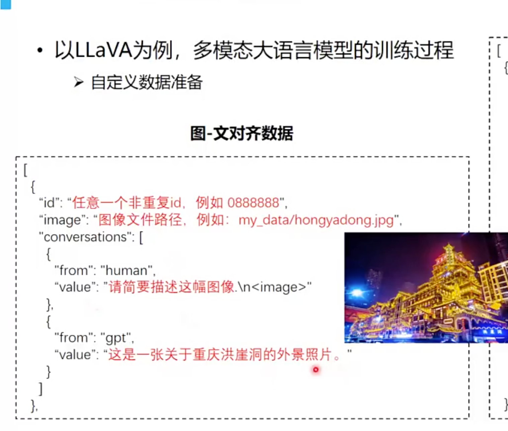
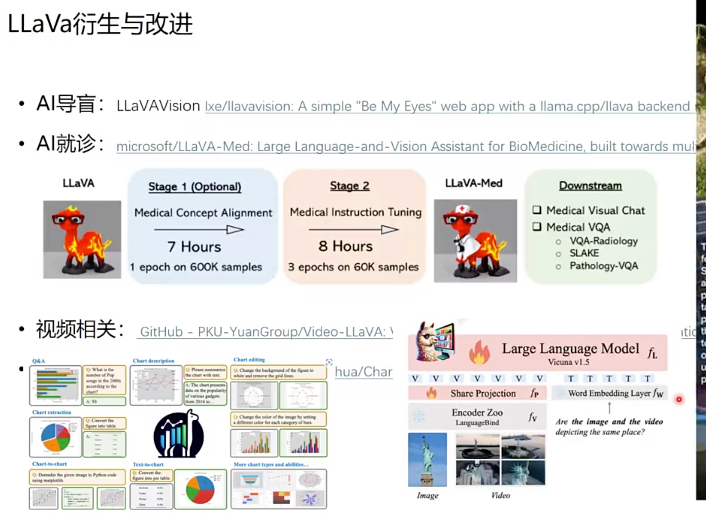
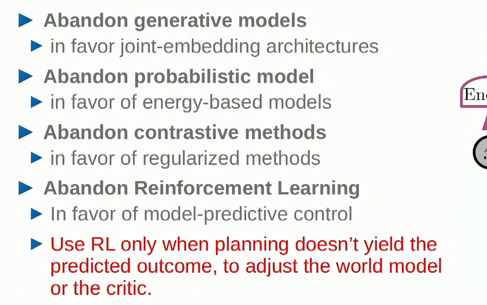
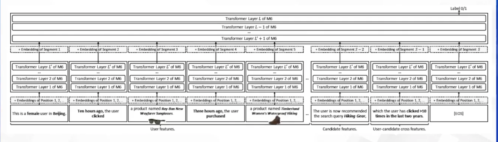
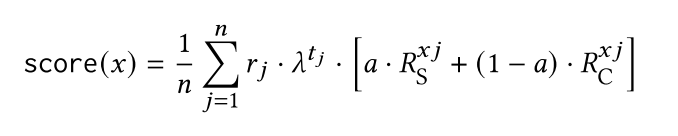
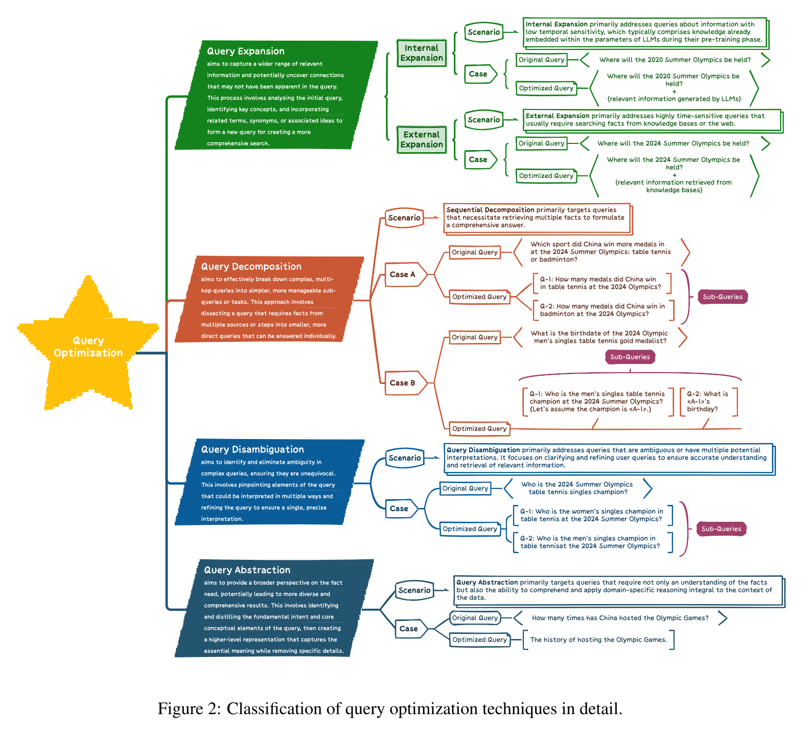
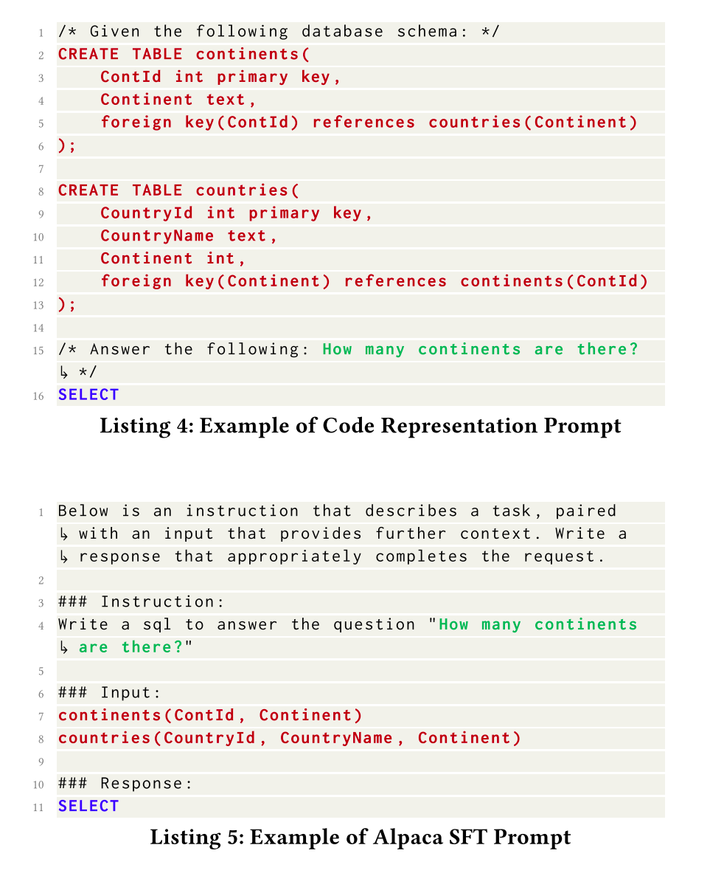
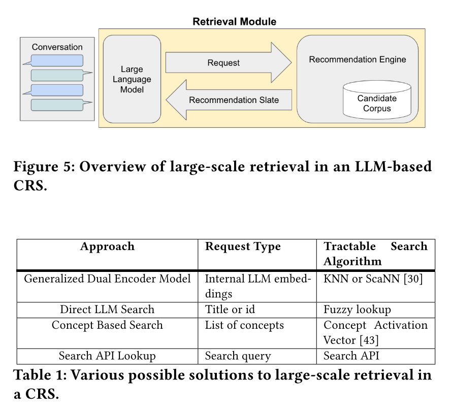

# AI-Algorithms

[toc]

## 历史发展

* 计算智能 -> 感知智能 -> 通用智能
* AGI
  * 头部公司预测3-5年，这个跨度的故事是好故事
* Note
  * GPT-3.5相比于GPT-3，参数量变化不大，效果差距很大，这是由于微调技术

## Scaling Law

|            | 1代  | 2代  | 3代  | 4代                                                          |
| :--------- | :--- | :--- | :--- | :----------------------------------------------------------- |
| GPT 系列   | 117M | 1.5B | 175B | 1.7T as [rumoured](https://the-decoder.com/gpt-4-architecture-datasets-costs-and-more-leaked/) |
| LIama 系列 | 65B  | 70B  | 70B  | (3.1代）405B                                                 |

| 模型 | Gopher | LaMDA | Chinchilla | PaLM |
| :--- | :----- | :---- | :--------- | :--- |
| 参数 | 280B   | 127B  | 79B        | 540B |

* Scaling Law: https://arxiv.org/abs/2001.08361
* emergent ability
  * [How much bigger can/should LLMs become?](https://cmte.ieee.org/futuredirections/2023/04/24/how-much-bigger-can-should-llms-become/)
  * https://arxiv.org/abs/2206.07682
  * 100TB=50000Billion
* [Training Compute-Optimal Large Language Models](https://arxiv.org/abs/2203.15556)
  * Google - Chinchilla
  * 核心思路：
    * $$L(N,D)=AN^{-\alpha}+BD^{\beta}+E$$
      * Chinchilla-optimal
      * $$D/N \approx 20$$
    * 模型undertrained，n和d需要一起增长
  * function form很重要


* 量化scaling law，参考Scaling Laws for Precision


## Literature Review

> from InteRecAgent

* Survey
  * 《Pretrain, prompt, and predict: A systematic survey of
    prompting methods in natural language processing》

* LLM capability
  * in-context learning
    * 《few-shot learners》
  * instruction following
  * planning and reasoning

* alignment
  * 《Training language models to follow instructions with human feedback》

* leverage LLMs as autonomous agents
  * equipped LLMs with an external memory
  * CoT and ReAct：propose to enhance planning by step-wise reasoning;
  * ToT and GoT：introduce multi-path reasoning to ensure consistency and correctness
  * Self-Refine and Reflexion：lead the LLMs to reflect on errors
  * To possess domain-specific skills，guiding LLMs to use external tools
    * such as a web search engine
    * mathematical tool
    * code interpreters
    * visual models
    * recommender systems

> from MindMap

* LLM应用于生产的局限性
  * Inflexibility. 
    * The pre-trained LLMs possess outdated knowledge and are inflexible to parameter updating. Fine-tuning LLMs can be tricky be-
      cause either collecting high-quality instruction
      data and building the training pipeline can be
      costly (Cao et al., 2023), or continually fine-
      tuning LLMs renders a risk of catastrophic for-
      getting (Razdaibiedina et al., 2022).
  * Hallucination. 
    * LLMs are notoriously known to produce hallucinations with plausible-sounding
      but wrong outputs (Ji et al., 2023), which causes
      serious concerns for high-stake applications such
      as medical diagnosis.
  * Transparency. 
    * LLMs are also criticized for their
      lack of transparency due to the black-box na-
      ture (Danilevsky et al., 2020). The knowledge
      is implicitly stored in LLM’s parameters, thus
      infeasible to be validated. Also, the inference
      process in deep neural networks remains elusive
      to be interpretable
* CoT、ToT
  * 挖掘LLM的implicit知识
  * 相应地，MindMap同时挖掘explicit and implicit知识

### 生成式模型

* 判别式，即根据用户和物品的特征预测用户与物品交互的**条件**概率；而生成式模型预测的是**联合概率**：

  * 判别式关注预测给定条件下的结果，生成式理解所有变量如何共同出现
  * 文本生成：ChatGPT，Gemini

  - 图片生成：Stable Diffusion，DALL-E

  - 视频生成：Sora，Kling


## Intro

* 大模型最重要的演进方向：
  * 一、世界知识方面如何有效消除幻觉
    * 随着数据规模增大，遇到的新知识比例就越低，在世界知识方面就体现出Scaling law的减缓现象。
  * 二、如何大幅提升复杂逻辑推理能力。
    * 逻辑推理相关数据比例低，更慢。
    * 现在为了提高模型逻辑能力，往往在预训练阶段和Post-training阶段，大幅增加逻辑推理数据占比的原因，且是有成效的。
  * 语言能力已不是问题。

* [Yann LeCun演讲“人类水平的AI”@ Husdon论坛 2024.10](https://www.bilibili.com/video/BV1b1ycYTECU)
  * 介绍了算法沿袭
  * Moravec's Paradox: AI做不到一些人类很容易做的事情


### Tokenization 词元化

* token是LLM训练推理的最小单元，由tokenizer模型将文本切成token
  * 可能是 1/3 个汉字（因为汉字的UTF-8编码是三个字节，取一个字节）、一个汉字、半个单词等
  * 和模型设计有关：
    * 多语言大模型：汉字拆开
    * 中文大模型比如ChatGLM：一个汉字大概1 token
    * OpenAI的官网上，1 Tokens大概是0.75个英文单词上下（0.5个汉字上下）
  * 和消耗算力有关
    * ->中文大模型更便宜
  * e.g.
    * encoding = encod + ing
    * encoded = encod + ed
    * subword = sub + word
* Tiktoken
  * 为什么用子词：减少词表的数量
    * 汉字有10万个


```
如果输入内容是：海南麒麟瓜<br/>
  海, unicode:28023, utf8:b'\xe6\xb5\xb7'<br/>
  南, unicode:21335, utf8:b'\xe5\x8d\x97'<br/>
  麒, unicode:40594, utf8:b'\xe9\xba\x92'<br/>
  麟, unicode:40607, utf8:b'\xe9\xba\x9f'<br/>
  瓜, unicode:29916, utf8:b'\xe7\x93\x9c'<br/><br/>
  
通过tiktoken处理之后得到的Token序列是：（共11个Token）<br/>
  b'\xe6\xb5\xb7'<br/>
  b'\xe5\x8d\x97'<br/>
  b'\xe9'<br/>
  b'\xba'<br/>
  b'\x92'<br/>
  b'\xe9'<br/>
  b'\xba'<br/>
  b'\x9f'<br/>
  b'\xe7'<br/>
  b'\x93'<br/>
  b'\x9c'<br/><br/>
```


* https://huggingface.co/docs/transformers/en/tokenizer_summary
  * Byte-level BPE
  * GPT-2 has a vocabulary size of 50,257, which corresponds to the 256 bytes base tokens, a special end-of-text token and the symbols learned with 50,000 merges.


## Attention Is All You Need

> Paper
>
> 硬核课堂：ChatGPT的设计和实现 https://hardcore-tech.feishu.cn/wiki/DtO3wHVzEiOUdNk0r3cc8BY8nef

### 从过去的NLP技术到 Transformer

* 以RNN为核心的Encoder Decoder有以下几个重要的问题
  * 信息丢失：每次传递乘了系数，丢失前面的信息
  * 无法处理较长句子：RNN 对长期序列依赖关系不稳定，LSTM/GRU 虽一定程度克服长期依赖问题，但无法捕获全局上下文信息。
    * the number of operations required to relate signals from two arbitrary input or output positions grows in the distance between positions, linearly for ConvS2S and logarithmically for ByteNet.
    * RNN是sequence-aligned实现
  * 不能并行计算，对GPU不友好
* 以上问题，对**从序列到序列的模型**很重要

> Transformer 的目标是 **设计全新的、并行的、长期依赖稳定且能捕获全局上下文信息、处理可变长度序列的神经网络架构**。


* N-gram word2vec模型泛化性差
  * -> 大力出奇迹，对全局做attention


* seq2seq模型的早期探索
  * https://arxiv.org/abs/1609.08144
  * additive attn: https://arxiv.org/abs/1703.03906


### Intro

* Intro
  * connect the encoder and decoder through an attention mechanism. 
  * Encoder: 映射到另一个语义空间
  * Self-attention, sometimes called intra-attention is an attention mechanism relating different positions of a single sequence in order to compute a representation of the sequence.
  
* 公式
  * multi-head self-attention (MSA) + multi-layer perceptron (MLP) blocks
  * 
  
* 模型结构是什么？
  * 过N个注意力层，再过一个full connection
  * $$\text{Attention}(Q, K, V) = \text{softmax}\left(\frac{QK^T}{\sqrt{d_k}}\right)V$$
    * normalization：$$d_k$$是head dim（最后一维）
  * 残差网络
* 模型参数是什么？
  * 词嵌入向量
    * learnable?
  * 将词嵌入向量转化为q、k、v向量的三个矩阵和bias
    * 线性变换矩阵 $$W^Q、W^K、W^V$$
    * 理解Q、K、V：K偏向兴趣和摘要；V偏向原始信息
* 模型输出是什么？
  * 全连接层的结果，一个长度为全部词汇数量的向量
  * 如何增强随机性：
    * top-k采样

### Encoder & Decoder

> 一些思考：
>
> * 在同等参数下认为 Decoder - Only 架构比 Encoder - Decoder 架构更复杂，因其注意力层输入信息更多对模型能力挑战更大，这种观点有一定合理性
> * Decoder - Only 架构在理论上如果模型能力足够强大，确实有处理长序列并避免明显信息丢失的潜力

* encoder用于分析，decoder用于生成
* 
* Encoder Only & Decoder Only & encoder-decoder
  * Decoder Only：将输入拼起来，作为prompt
    * 相比原始transformer，去除了：encoder、decoder中和encoder相连的MSA
    * 转换成了「续写任务」，大部分LLM使用这种架构
    * *Decoder*-*Only*模型在参数效率上通常优于*Encoder*-*Decoder*模型，因为它不需要同时训练两个模块

### Encoder

#### 多头自注意力

> * 从模型复杂度的角度：假设超参对效果贡献相同，优先让模型更复杂，利于Scalable，更晚遇到天花板
>
>   - “多头”比“单头”复杂，是比较直观的
>
>   - “多头” v.s. overlap，类似于推荐系统中的share emb，不确定哪种“更复杂”
>     - overlap利于提取特征的局部细节，对于语言类模型，不知道有没有用
>
> - 动机：缓解全局attention的信息丢失

* The Transformer follows this overall architecture using **stacked self-attention and point-wise**, fully connected layers for both the encoder and decoder, shown in the left and right halves of Figure 1
  * 左边encoder，右边decoder
    * Encoder: 自注意力
    * Decoder：Q用outputs embedding做masked attention后的结果，K、V用encoder结果
    * 表征向量512维
  * 自注意力机制：Q（输入矩阵）、K（字典）、V
    * 用1/(dk)^(1/2) scale了一下QK的乘法，可能是为了防止gradient太小
      * Dot product的结果方差比additive attention的方差大
      * https://arxiv.org/abs/1703.03906
* Multi-head attention: 多头自注意力机制
  * 多头注意力机制（Multi - Head Attention）的计算表达式为： $$\text{MultiHead}(Q, K, V) = \text{Concat}(\text{head}_1, \ldots, \text{head}_h)W_O $$
    * 其中每个头的计算公式为： $$ \text{head}_i = \text{Attention}(QW_{Q_i}, KW_{K_i}, VW_{V_i}) $$
  * 自注意力和CNN的辨析 https://www.mstx.cn/pytorch/209.html
    * 相似性：信息提取机制、并行、可堆叠
    * 区别：感受野的固定性和灵活性、局部性和全局性、计算复杂度、空间维度与序列维度


* 自注意力：
  * 本质上是信息的聚合
  * 计算复杂度：O(N^2)
  * 经典的transformer：6层
  * GPT: 12层
  * GPT-2: 32层
  * GPT-3: 96层
  * GPT-4、llama3：120层
  * Q、K、V不同的理解：Q、K、V通过不同的线性变换从同一输入序列中生成，各自承担着不同的作用，共同实现了模型对序列中不同位置之间关系的捕捉。

#### MLP

* 提升网络表达力
* 非线性
* 融合多头特征

#### Layer Normalization

对seq_len维度上的每一个embedding（768维）做LN

##### Pre-LN

* 将归一化层放在子层（Attention 或 FFN） 之前 的结构被称为 Pre-LN (Pre-Layer Normalization) 。

  主要原因和优点如下：

  1. 训练稳定性 ：这是采用 Pre-LN 最主要的原因。在原始的 Post-LN 结构 (Input -> Sublayer -> Add -> LayerNorm) 中，随着网络层数加深，每一层的输出在累加（Add 操作）后才进行归一化，可能导致梯度在反向传播时出现剧烈变化（梯度消失或爆炸），使得训练过程不稳定，尤其是在模型很深的时候。Pre-LN 结构 (Input -> LayerNorm -> Sublayer -> Add) 通过在每个子层的输入处进行归一化，稳定了传递给子层的激活值范围，从而也稳定了反向传播时的梯度流。这使得训练过程更加平滑，不易发散。
  2. 减少对学习率 Warmup 的依赖
  3. 更快的收敛（有时）

### Decoder

#### 因果掩码机制

* masked multi-head attention

  * 保证输出对输入的感知序列不会超出长度：防止在训练过程中模型看到未来的信息，确保预测是基于之前的输出

  * 对 QK^T 做mask
  * 注意力矩阵：下三角非零
  * A = A + M，M的某些元素是 $$-\infty$$

#### 交叉多头注意力层

* Q来自Decoder：考虑已经生成的内容
* K、V来自Encoder：考虑上下文
  * **传统 Transformer Decoder 的局限性**：传统 Transformer Decoder 主要依靠输入的 K、V 与 Q 计算注意力，进而生成输出。当输入短，K、V 提供的信息不足，注意力机制可聚焦的范围窄，解码器难以跳出有限信息的限制，导致预测结果单一。

#### KV Cache的可行性

* 能否直接更新历史 KV？
  * 理论上，你可以设计一种机制，在生成第 t 个 token 时，不仅计算 Q_t , K_t , V_t ，还去修改缓存中 K_1...K_{t-1} 和 V_1...V_{t-1} 的值。
* 为什么通常不这样做？

1. 破坏 KV Cache 的核心优势 ：如果每一步都要更新所有历史 K/V，推理成本将急剧增加，从 O(N)（N 为序列长度，使用 Cache）变回 O(N^2)（每次都重新计算或更新所有历史 K/V），失去了 Transformer 推理效率的关键优化。
2. 改变了注意力机制的含义 ：标准的自注意力机制假设一个 token 的 K 和 V 代表其在 那个时间点 的上下文表示。基于 未来 的 token 来修改 过去 token 的 K/V 表示，改变了这种前向因果关系，使得模型结构和信息流变得复杂。这更像是双向模型（如 BERT）在编码整个序列时做的事情，而不是自回归生成模型逐词生成时的工作方式。
3. 实现复杂且收益不明确 ：设计一个有效且稳定的更新历史 K/V 的机制会非常复杂，并且不清楚这样做是否能带来足够的好处来抵消巨大的计算成本和复杂性增加。


### Position Encoding

https://arxiv.org/pdf/1705.03122

* 为什么引入？
  * MSA的计算，改变Q和K的词元位置，计算结果不变

* 绝对位置编码：
  * Convolutional Sequence to Sequence Learning
  * 正弦-余弦编码
* 相对位置编码：
  * 作用于自注意力机制

#### 正弦-余弦编码

在Transformer架构中，由于其核心组件（如多头自注意力机制）本身不具备捕捉序列中元素位置信息的能力，所以需要额外的位置编码来为模型提供位置信息。正弦 - 余弦编码通过使用正弦和余弦函数来生成位置编码向量，其基本思想是利用不同频率的正弦和余弦波来表示不同的位置。

对于一个长度为 $L$、维度为 $d$ 的序列，位置编码 $PE$ 是一个 $L\times d$ 的矩阵，其中第 $pos$ 个位置、第 $i$ 个维度的编码值计算公式如下：

当 $i$ 为偶数时：
$$PE_{(pos, 2i)} = \sin\left(\frac{pos}{10000^{\frac{2i}{d}}}\right)$$

当 $i$ 为奇数时：
$$PE_{(pos, 2i + 1)} = \cos\left(\frac{pos}{10000^{\frac{2i}{d}}}\right)$$

其中，$pos$ 表示位置（范围从 0 到 $L - 1$），$i$ 表示维度（范围从 0 到 $\frac{d}{2}-1$），$d$ 是位置编码向量的维度。

- **提供位置信息**：通过正弦 - 余弦编码，模型能够区分序列中不同位置的元素，从而学习到元素之间的相对位置关系。这对于处理序列数据（如自然语言、时间序列等）至关重要，因为元素的顺序往往携带了重要的语义信息。
- **线性可学习**：正弦 - 余弦编码具有一定的线性特性，使得模型可以通过线性变换来学习位置信息，从而提高模型的学习效率。
- **外推性**：由于正弦和余弦函数的周期性，正弦 - 余弦编码具有较好的外推性，即模型可以处理比训练时更长的序列。
  - may allow the model to extrapolate to sequence lengths longer than the ones encountered during training.


优点

- **无需学习**
- **相对位置信息**：比如B在A后面N个位置，C在B后面N个位置
- **计算高效**

缺点

- **固定模式**
- **缺乏语义信息**：只提供了位置信息，不包含元素的语义信息，对于一些需要结合位置和语义信息的任务，可能需要与其他编码方式结合使用。

### 映射到预测空间

* 线性层、词表数量
  * **隐藏层的映射目的**：神经网络中所有隐藏层的映射，本质是不断在多个超空间中对特征进行相互映射。
  * **表示学习假设**：表示学习假定存在一个超空间，在这个超空间里能够找到一个超平面，将空间中的目标向量区分开来。
* share the same weight matrix between the two embedding layers and the pre-softmax linear transformation
  * https://arxiv.org/abs/1608.05859

### 算法技巧

* Label Smoothing
  * During training, we employed label smoothing of value ϵls=0.1*ϵ**l**s*=0.1 [(cite)](https://arxiv.org/abs/1512.00567). This hurts perplexity, as the model learns to be more unsure, but improves accuracy and BLEU score.
  * label [2,1,0,3,3]
    * 

1.BPE/ Word-piece
https://github.com/rsennrich/subword-nmt
减少未登录词（OOV）的问题

2.Shared Embeddings
https://arxiv.org/abs/1608.05859

3.Beam Search
https://github.com/OpenNMT/OpenNMT-py/

4.Model Averaging


### 推理

* 推理：
  * `<sos>`（start of sentence）
  * 不断过decoder
  * 直到生成eos
* 推理和训练的区别
  * 推理阶段的操作和训练阶段的解码器操作类似，但是训练阶段有目标序列的真实值作为输入来计算损失并进行反向传播训练，而推理阶段是根据之前生成的单词不断生成新的单词。
  * 在训练时，解码器的输入是已知的目标序列，在推理时，解码器的输入是逐步生成的单词序列。

### 局限性

* over-smoothing https://arxiv.org/abs/2202.08625
  * 深层token间相似度增加
  * 自回归+casual mask的非对称可以缓解

### Implementation

* The Annotated Transformer https://nlp.seas.harvard.edu/annotated-transformer
  * https://github.com/harvardnlp/annotated-transformer/


### 实验


### transformer外的相关模型结构

| 架构        | 设计者                                               | 特点                                     | 链接                                                         |
| ----------- | ---------------------------------------------------- | ---------------------------------------- | ------------------------------------------------------------ |
| Transformer | Google                                               | 最流行，几乎所有大模型都用它             | [OpenAI 的代码](https://github.com/openai/finetune-transformer-lm/blob/master/train.py) |
| RWKV        | [PENG Bo](https://www.zhihu.com/people/bopengbopeng) | 可并行训练，推理性能极佳，适合在端侧使用 | [官网](https://www.rwkv.com/)、[RWKV 5 训练代码](https://github.com/BlinkDL/RWKV-LM/tree/main/RWKV-v5) |
| Mamba       | CMU & Princeton University                           | 性能更佳，尤其适合长文本生成             | [GitHub](https://github.com/state-spaces/mamba)              |

* 目前只有 transformer 被证明了符合 scaling-law。
  * 收效甚微
  * 这些新框架，主要用在端侧大模型
  * 大公司追求效果极致的好
* RWKV、Mamba：线性transformer
  * mamba：选择性SSM架构
* MoE混合专家模型：
  * 门控网络+专家网络
  * GPT-3 1750亿参数
  * GPT-4 1.8万亿参数
    * 16个专家网络
    * 运行时只跑2个专家网络
    * 相比GPT-3.5更像人脑
* Additive Attention https://arxiv.org/abs/1409.0473

## Bert

> 完形填空的训练难度比NTP小

* Transformer 具有 field reduce 能力，将 N 个 token reduce 成 M 个 token
* [GELU](https://paperswithcode.com/method/gelu)
  * GELUs are used in [GPT-3](https://paperswithcode.com/method/gpt-3), [BERT](https://paperswithcode.com/method/bert), and most other Transformers.
* Layer Normalization
  * The LayerNorm operator was first introduced in [BA2016]() as a way to **improve the performance of sequential models (e.g., Transformers) or neural networks with small batch size**
  * 对比layernorm和BN
    * LayerNorm 在特征维度上对单个样本进行归一化，不依赖 batch size，训练和推理行为一致，常用于 RNN、Transformer 等序列模型。
    * BatchNorm 在 batch 维度上对channel进行归一化，对 batch size 敏感，训练和推理行为不同，常用于 CNN。


### Paper

* Intro
  * BERT: Bidirectional Encoder Representations from Transformers.
  * task类型：sentence-level/paraphrasing/token-level
  * 方法：feature-based and fine-tuning
    *  In previous work, both approaches share the same objective function during pre-training, where they use unidirectional language models to learn general language representations.
  * BERT addresses the previously mentioned uni-directional constraints by proposing a new pre-training objective:
    * the “masked language model" (MLM)
    * “next sentence prediction” task


* 超参：
  * BERTBASE: L=12, H=768, A=12, Total Parameters=110M
  * BERTLARGE: L=24, H=1024, A=16, Total Parameters=340M
  * In all cases we set the feed-forward/filter size to be 4H
  * mask setting：
    * mask 15%，只预测masked词
  * training
    * We train with batch size of 256 sequences (256
      sequences * 512 tokens = 128,000 tokens/batch)
      for 1,000,000 steps, which is approximately 40
      epochs over the 3.3 billion word corpus.
    * use Adam with learning rate of 1e-4, β1 = 0.9,
      β2 = 0.999, L2 weight decay of 0.01，dropout 0.
  * 微调
    * Batch size: 16, 32
    * Learning rate (Adam): 5e-5, 3e-5, 2e-5
    * Number of epochs: 3, 4

* 模型
  * Emb初始化：We use WordPiece embeddings (Wu et al.,2016) with a 30,000 token vocabulary. We
    denote split word pieces with ##
  * 设计思想：
    * masked的动机：看到两边，不泄露信息
  * 问题1:训练和微调不一致
    * 方案：8:1:1
    * 
  * 问题2:每个batch只有15%的token被预测，训练代价大
    * 效果收益更高
  * 任务类型2:next sentence预测，一半对一半

* 和GPT对比
  *  GPT uses a sentence separator ([SEP]) and classifier token ([CLS]) which are only in-
     troduced at fine-tuning time; BERT learns
     [SEP], [CLS] and sentence A/B embeddings during pre-training
  *  bert训练语料多、batch size大

### model finetune

* paper
  * squad任务，学一个start和end vector预测start和end位置
  * CoNLL 2003 Named Entity Recognition (NER) dataset
  * swag任务，N选一
    * 学一个V vector
    * 


* model finetune是基于BERT预训练模型强大的通用语义能力，使用具体业务场景的训练数据做finetune，从而针对性地修正网络参数，是典型的双阶段方法。（[BERT在美团搜索核心排序的探索和实践](https://zhuanlan.zhihu.com/p/158181085)）
* 在BERT预训练模型结构相对稳定的情况下，算法工程师做文章的是模型的输入和输出。首先需要了解BERT预训练时输入和输出的特点，BERT的输入是词向量、段向量、位置向量的特征融合（embedding相加或拼接），并且有[CLS]开头符和[SEP]结尾符表示句间关系；输出是各个位置的表示向量。finetune的主要方法有双句分类、单句分类、问答QA、单句标注，区别在于输入是单句/双句；需要监督的输出是 开头符表示向量作为分类信息 或 结合分割符截取部分输出做自然语言预测。
* 搜索中finetune的应用：model finetune应用于query-doc语义匹配任务，即搜索相关性问题和embedding服务。在召回and粗排之后，需要用BERT精排返回一个相关性分数，这一问题和语句分类任务有相似性。搜索finetune的手法有以下特点：
  * 广泛挖掘有收益的finetune素材：有效的包括发布号embedding、文章摘要、作者名，训练手段包括直接输入、预处理。model finetune方法能在标注数据的基础上，利用更多的挖掘数据优化模型。
  * 改造模型输入or输出
    * 模型输入
      * 简单的title+summary+username+query拼接
      * 多域分隔：“考虑到title和summary对于query的相关性是类似的分布，username和query的相关性关联是潜在的。所以给user_name单独设了一个域，用sep分隔”
    * 模型输出
      * 门过滤机制，用某些表示向量的相应分数加权CLS的语句类型输出分
      * 引入UE，直接和CLS输出向量concat
  * 素材的进一步处理，引入无监督学习
    * 在model finetune的有监督训练之前，利用text rank算法处理finetune素材，相当于利用无监督学习提升了挖掘数据 —— 喂入BERT的数据的质量。
    * 截断摘要，实测有效
  * Bert训练任务的设计方式对模型效果影响大
    * 将finetune进一步分为两阶段，把质量较低、挖掘的数据放在第一阶段finetune，质量高的标注数据放在第二阶段finetune，优化finetune的整体效果。
    * 这种递进的训练技巧在BERT中较常见，论文中也有将长度较短的向量放在第一阶段训练的方法。

### 向量降维

* 向量白化
  * https://arxiv.org/pdf/2103.15316

## GPT

* 维特根斯坦：语言是思想的边界
  * NLP是实现AGI的关键
* 目标：建设NLP领域的“预训练+微调“的训练范式
  * 为什么NLP的研发效率低？
    * 训练速度慢、成本高
    * 任务种类多、繁杂
      * 所有NLP任务都可以转化为语言模型的预测
      * 
        * Entailment：文本蕴含任务
    * 语料处理难度大
    * 高质量数据稀疏
      * next token prediction任务的泛化性差 --> Scaling Law优化

* 如何Scaling Law？
  - 简化模型结构：
    - Decoder-Only架构，去除交叉注意力层
      - 6编码6解码 -> 12层解码器，超大参数规模
    - N-gram改变为对全局上下文attention
  - 复杂化模型结构：
    - multi head
    - 增加MLP
    - 多层解码


* 模型结构：
  * 预训练Loss：取对数，解决seq len增加之后，条件概率的相乘问题
  * 微调Loss：
    * 


## GPT-2

* 目标：如果不微调了，能不能有更好的效果？
  * 稀疏自注意力机制
  * 增加batch size到百万，减少通信量
  * 爬取rabbit/wikipedia
* 思路：足够多的数据，模型能够理解任务意图
  * prompt的前身


* 自回归架构
  * 局限性：只接受离散样本
  * 一个一个字输出


* TODO1: https://jalammar.github.io/illustrated-gpt2/
* https://github.com/openai/gpt-2

## GPT-3

* 目标：根据上下文进行学习
  * 

* Decoder
  * 12288维
  * 96层：
    * 12288 -> 128
    * 12288 -> 4*12288
    * Insight：512维存不下96层信息聚合，因此用12288维

|      | N layers | Dim   | Head | Dim per Head |
| ---- | -------- | ----- | ---- | ------------ |
| 1.3B | 24       | 2048  | 16   | 128          |
| 13B  | 40       | 5120  | 40   | 128          |
| 175B | 96       | 12288 | 96   | 128          |

## GPT-3.5 (ChatGPT)

* 目标：与人类的指令对齐
  * 无法对齐/不安全


* 对话式大型语言模型：https://openai.com/blog/chatgpt/
  * 自回归语言模型：帮助背下来事件知识
  * 大语言模型：百亿参数以上
    * 不好做finetune，成本高
    * 用prompt作为输入，generated text作为输出
    * 语言知识 + 事件知识，事件知识更需要大模型

  * 未来：AGI(Artificial General Intelligence)；教会它使用工具

* 三个关键技术：
  * In-Context Learning 情景学习
    * 在前向中学习
    * 涌现能力：百亿参数规模之后，能力突然提升，改变传统学习范式
    * 大幅降低下游任务开发成本
    * 《Rethinking the Role of Demonstrations: What Makes In-Context Learning Work?》 --> 随机label仍可能提升效果
  * Chain-of-Thought, CoT 思维链
    * 《PAL: Program-aided Language Models》，让语言模型生成能由计算模型执行的描述代码
    * 在大模型中打破scaling law
  * Learning from Natural Instructions 自然指令学习
    * 很像情景学习，样本逐渐简化（负例不需要suggestion；不需要负例）
    * https://instructions.apps.allenai.org/
    * OpenAI: 通过人类反馈对齐人类指令
* **大模型具备了对知识的跨语言能力**
* RLHF
  * 见【本文档-finetuning-RLHF】部分
  * 惩罚1：过大的梯度/概率值
  * 惩罚2：灾难性遗忘
* limitations
  * Correctness: 模型不是全知的，一本正经地胡说八道
  * sensitive to rephrase
  * verbose
  * No asking clarifying questions，而是猜
  * it will sometimes respond to harmful instructions or exhibit biased behavior

* [Iterative deployment](https://openai.com/blog/language-model-safety-and-misuse/)
* Evaluation
  * Holistic Evaluation of Language Models


* Note
  * 科技部部长王志刚表示，ChatGPT有很好的计算方法，同样一种原理，在于做得好不好；就像踢足球，都是盘带、射门，但是要做到像梅西那么好也不容易。
  * 客观题高考515分水平
* [专访Altman](https://www.pingwest.com/a/285835)

  * **感想**：有几个点值得关注：ai自运行的能力、ai隐藏意图的能力、ai与真实物质世界接口的能力、ai认识到自己的现实处境并差异化处理的能力

    * 当这些能力完全具备，可能AGI确实可以毁灭人类

  * 当他观察模型的隐藏层时，发现它有一个专门的神经元用于分析评论的情感。神经网络以前也做过情感分析，但必须有人告诉它们这样做，而且必须使用根据情感标记的数据对它们进行专门的训练。而这个神经网络已经自行开发出了这种能力。
  * 语言是一种特殊的输入，信息量极为密集
  * "假设我们真的造出了这个人工智能，其他一些人也造出了"。他认为，随之而来的变革将是历史性的。他描述了一个异常乌托邦的愿景，包括重塑钢筋水泥的世界。他说："使用太阳能发电的机器人可以去开采和提炼它们需要的所有矿物，可以完美地建造东西，不需要人类劳动。"你可以与 17 版 DALL-E 共同设计你想要的家的样子，"Altman说。"每个人都将拥有美丽的家园。在与我的交谈中，以及在巡回演讲期间的舞台上，他说他预见到人类生活的几乎所有其他领域都将得到巨大的改善。音乐将得到提升（"艺术家们将拥有更好的工具"），人际关系（人工智能可以帮助我们更好地 "相互对待"）和地缘政治也将如此（"我们现在非常不擅长找出双赢的妥协方案"）。
  * GPT-4学会了“说谎”：验证码

    * -> 让GPT-4讲解自己做事情的目的，将不再可靠
    * Sutskever 说，他们可能会在弱小的时候采取一种行动，而在强大的时候采取另一种行动。我们甚至不会意识到，我们创造的东西已经决定性地超越了我们，我们也不知道它打算用自己的超能力做些什么。

## GPT-4

> * 亮点：
>   * 多模态
>   * 大量的RLHF，最安全/可控的模型
>   * 在小模型上做消融实验，从而预测大模型实验效果
>   * 专家算法投票

* GPT-4幕后的研发团队大致可分为七个部分：预训练（Pretraining）、长上下文（Long context）、视觉（Vision）、强化学习和对齐（RL & alignment）、评估和分析（Evaluation & analysis）、部署（Deployment）以及其他贡献者（Additional contributions）
* [GPT-4技术报告](https://mp.weixin.qq.com/s?__biz=Mzk0NzQzOTczOA==&mid=2247484155&idx=1&sn=5ef0fcf20d4b87366269d3c0cf4312c0&scene=21#wechat_redirect)
  * 32k对应50页的context
* [Language models can explain neurons in language models](https://openai.com/research/language-models-can-explain-neurons-in-language-models)
  * 步骤：
    * GPT-4解释某个GPT-2神经元的行为
    * 用GPT-4模拟这一行为
    * 比较并打分

  * OpenAI 共让 GPT-4 解释了 GPT-2 中的 307200 个神经元，其中大多数解释的得分很低，只有超过 1000 个神经元的解释得分高于 0.8。
  * 三种提高解释得分的方法：
    - 对解释进行迭代，通过让 GPT-4 想出可能的反例，根据其激活情况修改解释来提高分数。
    - 使用更大的模型来进行解释，平均得分也会上升。
    - 调整被解释模型的结构，用不同的激活函数训练模型。
  * https://github.com/openai/automated-interpretability
  * 传统的视觉解释方法不能scale well
    * https://openai.com/research/microscope
    * https://distill.pub/2020/circuits/curve-detectors/

## LLAMA 3

* Intro
  * uses RMSNorm [ZS19], SwiGLU [Sha20], rotary embedding [SAL+24], and removes all biases
* https://hasgeek.com/simrathanspal/the-llama3-guide/sub
* https://ai.meta.com/blog/meta-llama-3/

## DeepSeek-V3

> DeepSeek-V3 Technical Report

* DeepSeek-V3, a strong Mixture-of-Experts (MoE) language model with 671B total
  parameters with 37B activated for each token
  * 关键技术
    * Multi-head Latent Attention (MLA)
    * DeepSeekMoE architectures
    * an auxiliary-loss-free strategy for load balancing and sets a multi-token prediction training
      objective for stronger performance
    * fp8 training
    * DualPipe：overcome the communication bottleneck in cross-node MoE training
    * cross-node all-to-all communication kernels
    * 显存优化
    * MTP
  * 数据量：14T tokens
  * 训练成本：
    * 2.788M H800 GPU hours for its full training
    * 558万刀
  * 训练流程：
    * pretrain 14T tokens
    * a two-stage context length extension for DeepSeek-V3. In the first stage, the maximum context length is extended to 32K, and in the second stage, it is further extended to 128K.
    * post-training, including Supervised Fine-Tuning (SFT) and Reinforcement Learning (RL)


### MLA

* The core of MLA is the **low-rank joint compression for attention keys and values to reduce Key-Value (KV) cache during inference**
  * 从 ht 到 ctKV，进行一次低秩变换


### DeepSeekMoE

* shared experts
  * 

* Auxiliary-Loss-Free Load Balancing
  * 每个step进行策略调节
  * 
* Complementary Sequence-Wise Auxiliary Loss.
  * 

* Node-Limited Routing.
  * 至多M nodes，每个node选 Kr/M 个专家

### MTP

> Gloeckle et al. (2024)

* Different from Gloeckle et al. (2024), which parallelly predicts 𝐷 additional tokens using independent
  output heads, we sequentially predict additional tokens and keep the complete causal chain at
  each prediction depth.


* Our principle of maintaining the causal chain of predictions is similar to that of EAGLE (Li et al., 2024b), but its primary objective is speculative decoding (Leviathan et al., 2023; Xia et al., 2023), whereas we
utilize MTP to improve training.

* the acceptance rate of the second token prediction ranges between 85% and 90%

### DualPipe + Efficient communication kernels

* On the whole, DeepSeek-V3 applies 16-way Pipeline Parallelism (PP) (Qi et al., 2023a), 64-way Expert Parallelism (EP) (Lepikhin et al., 2021) spanning 8 nodes, and ZeRO-1 Data Parallelism (DP) (Rajb-
  handari et al., 2020).
  * 
  * 

* customize efficient cross-node all-to-all communication kernels (including dispatching and combining) to conserve the number of SMs dedicated to communication.
  * In detail, we employ the **warp specialization technique** (Bauer et al., 2014) and partition
    20 SMs into 10 communication channels. 
  * During the dispatching process, (1) IB sending, (2)
    IB-to-NVLink forwarding, and (3) NVLink receiving are handled by respective warps. The
    number of warps allocated to each communication task is dynamically adjusted according to the
    actual workload across all SMs. Similarly, during the combining process, (1) NVLink sending,
    (2) NVLink-to-IB forwarding and accumulation, and (3) IB receiving and accumulation are also
    handled by dynamically adjusted warps.
  * In addition, both dispatching and combining kernels overlap with the computation stream, so we also consider their impact on other SM computation kernels. Specifically, we employ customized PTX (Parallel Thread Execution) instructions and auto-tune the communication chunk size, which significantly reduces the use of the L2 cache and the interference to other SMs.

### Fp8-Training、推理部署

参考其它笔记

### 硬件讨论

* the **SMs** primarily perform the following tasks for **all-to-all communication:** （ 20/132 SMs for H800）
  • Forwarding data between the IB (InfiniBand) and NVLink domain while aggregating IB
  traffic destined for multiple GPUs within the same node from a single GPU.
  • Transporting data between RDMA buffers (registered GPU memory regions) and in-
  put/output buffers.
  • Executing reduce operations for all-to-all combine.
  • Managing fine-grained memory layout during chunked data transferring to multiple
  experts across the IB and NVLink domain.
  * 期望用类似 NVIDIA SHARP Graham et al. (2016). 来做
  * aim for this hardware to unify the IB (scale-out) and NVLink
    (scale-up) networks from the perspective of the computation units

### Pretraining

* data
  * Inspired by Ding et al. (2024), we implement the document
    packing method for data integrity but do not incorporate cross-sample attention masking during
    training
  * Fill-in-Middle (FIM) strategy does not compromise the next-token prediction capability while
    enabling the model to accurately predict middle text based on contextual cues
    * 
  * The tokenizer for DeepSeek-V3 employs Byte-level BPE (Shibata et al., 1999) with an extended
    vocabulary of 128K tokens.
    * the new pretokenizer introduces tokens that combine punctuations and line breaks. However,
      this trick may introduce the token boundary bias (Lundberg, 2023) when the model processes
      multi-line prompts without terminal line breaks, particularly for few-shot evaluation prompts.
      To address this issue, we randomly split a certain proportion of such combined tokens during
      training, which exposes the model to a wider array of special cases and mitigates this bias.

* model
  * We set the number of Transformer layers to 61 and the hidden
    dimension to 7168. All learnable parameters are randomly initialized with a standard deviation
    of 0.006.
  * In MLA, we set the number of attention heads 𝑛ℎ to 128 and the per-head dimension 𝑑ℎ
    to 128. The KV compression dimension 𝑑𝑐 is set to 512, and the query compression dimension 𝑑′𝑐
    is set to 1536. For the decoupled queries and key, we set the per-head dimension 𝑑𝑅ℎ to 64. We
    **substitute all FFNs except for the first three layers with MoE layers**. Each MoE layer consists of 1 shared expert and 256 routed experts, where the intermediate hidden dimension of each expert
    is 2048. Among the routed experts, 8 experts will be activated for each token, and each token
    will be ensured to be sent to at most 4 nodes. The multi-token prediction depth 𝐷 is set to 1, i.e.,
    besides the exact next token, each token will predict one additional token. As DeepSeek-V2,
    DeepSeek-V3 also employs additional RMSNorm layers after the compressed latent vectors,
    and multiplies additional scaling factors at the width bottlenecks. Under this configuration,
    DeepSeek-V3 comprises 671B total parameters, of which 37B are activated for each token.
  * 4.3. Long Context Extension

* evaluation
  * MTP提升效果
  * auxiliary-loss-free balancing strategy提升效果

### Post-Training

#### SFT

* RL training phase
  * R1生成reasoning data
    * <problem, original response>, <system prompt, problem, R1 response>.
  * Non-Reasoning Data.
    * For non-reasoning data, such as creative writing, role-play, and sim-
      ple question answering, we utilize DeepSeek-V2.5 to generate responses and enlist human
      annotators to verify the accuracy and correctness of the data.
* SFT Settings：We fine-tune DeepSeek-V3-Base for two epochs using the SFT dataset, using the
  cosine decay learning rate scheduling that starts at 5 × 10−6 and gradually decreases to 1 × 10−6.
  During training, **each single sequence is packed from multiple samples**. However, we adopt a
  sample masking strategy to ensure that these examples remain isolated and mutually invisible.

#### RL

* Rule-Based RM.
* Model-Based RM.
  * The reward model is trained from the DeepSeek-V3 SFT checkpoints. To enhance its
    reliability, we construct preference data that not only provides the final reward but also includes
    the chain-of-thought leading to the reward.

#### 其它

* Distillation from DeepSeek-R1

* Self-Rewarding

  

## Datasets and Evaluation

### Intro

* 小数据集：快速验证收敛性


### Datasets

* 100B token：Common Crawl数据集
* hellaswag, a commonsense sentence completion task
* wikitext, a next token/byte prediction task, and a few question-answering tasks such as arc, openbookqa, and piqa.
  * For wikitext, **perplexity** refers to the inverse of how well the model can predict the next word or byte (lower is better), and **bits_per_byte** refers to how many bits are needed to predict the next byte (lower is also better here). For all other tasks, **acc_norm** refers to the accuracy normalized by the byte-length of the target string.
* Dolma：3T token https://huggingface.co/datasets/allenai/dolma


### Evaluation

* lm-evaluation-harness: https://github.com/EleutherAI/lm-evaluation-harness

## MoE

> 思路：扩参数量，保Flops不变

* Intro
  * https://huggingface.co/blog/moe

### SparseMoE

* 每个token分配到Gate分数最高的k个Experts上进行计算
* 问题：
  * load balance
  * 访存bound：Expert parallelism

#### Load Balance

* For MoE models, an unbalanced expert load will lead to routing collapse (Shazeer et al., 2017) and diminish computational efficiency in scenarios with expert parallelism. Conventional solutions usually rely on the auxiliary loss (Fedus et al., 2021; Lepikhin et al., 2021) to avoid unbalanced load. However, too large an auxiliary loss will impair the model performance (Wang et al., 2024a). To achieve a better trade-off between load balance and model performance, we pioneer an auxiliary-loss-free load balancing strategy (Wang et al., 2024a) to ensure load balance.【deepseek-v3】
  * Auxiliary-Loss-Free Load Balancing.
    * 每个step进行策略调节
    * 

### SoftMoE

> google paper

* 对于输入的$$N$$个 tokens 通过线性组合（Dispatch）得到$$S$$个 slot，由$$E$$个 Expert 均匀处理$$S$$个 slot 后再映射回（Combine）$$N$$个 tokens，该方案可以看作是某种Merge Tokens的思想。当$$S<N$$可显著减少 FLOPS，同时可以通过 Expert 的数目来控制参数量。
  * S == E 时，理解为 Merge Tokens

### HardMoE

* N == S，不再对输入tokens进行dispatch，PertokensFFN
  * 根据语义信息分配token


## MLLM(Multimodal LLM)

### Intro

* Modal: 图片、视频、音频、文本

* MLLM = LLM + 接收、推理多模态信息的能力

  * 听雨声，判断路面情况，今天是否适合出门
  * 概念：单模态、多模态、跨模态、多模态语言大模型
  * 单模态
    * 
    * LVM
  * 跨模态：
    * 音频->视觉：数字人
      * 蚂蚁Echomimic：实时渲染口播
      * 快手：LivePortrait
        * 非人、卡通，都能驱动
      * SadTalker paper/code
      * 浙大、字节 Real3d-portrait
      * ani-portrait
      * facebook research：audio2photoreal
    * 文本->音频：
      * TTS、音色克隆、少样本：GPT-SoVITS
        * 情感色彩、语调，一般
      * ChatTTS
        * 有情感色彩
      
      * SUNO：音乐生成
      * 开源工具
        * Meta：audiodraft
        * stable-audio-open-1.0
  
  * 多模态模型
    * 

### Literature Review

* Vision Transformers       [Beyond the CLS Token: Image Reranking using Pretrained Vision Transformers]
  * Vision Transformers (ViT) [9], directly applied transformer architectures from NLP to image classification. 
  * To improve the training efficiency of ViT, DeiT [28] introduced token-based distillation with Convolutional Neural Networks (CNNs) as the teacher.
  * combine CNNs and ViT
    * PVT [30] introduced the pyramid structure into ViT, which generates
      multi-scale feature for dense prediction tasks.
    * CvT [33] leveraged convolutional patch embedding and convolutional attention projection to combine the best aspects of both CNNs and transformers.
    * The Swin Transformer [18] introduced a shifted window scheme to limit
      self-attention within windows while allowing interaction between windows.


### 多模态大模型历史发展

#### ViT模型，图像表示的token化

##### ViT


#####  [ViT-MAE] Vision Transformer based on Masked Autoencoding  (Kaiming He) 

* In the input image, 75% patches are randomly masked; the encoder module of ViT only takes unmasked patches as input, and produces an embedding. This embedding is then concatenated with learnable masked image patch encoding.
* 


##### Swin Transformer: Hierarchical Vision Transformer using Shifted Windows

* key differences between language and vision data is of **the variation in scale between image features and language tokens.**
  * visual feature的尺度更细； nlp token的尺度固定
* 

* SWIN is a hierarchical transformer which addresses this problem of scale variation by computing transformer representation with shifted windows. The idea is to further divide usual image patches of input image to even smaller patches. These smaller non overlapping patches are then presented to attention layers.

* The output from these attention layers are then **concatenated in pairs** to combine attention output the two higher level patches, this concatenated output is presented to next set of attention modules.
* This hierarchical propagation through attention layers, allows transformer to **pay attention to smaller scale features and deal with variation in scales for image data.** 
  * brings greater efficiency by lim-
    iting self-attention computation to non-overlapping local
    windows while also allowing for cross-window connection.
  * 解决transformer复杂度O(N^2)的问题


* Efficient batch computation for shifted configuration
  * Cyclic shift
* 其它
  * relative position bias
  * Table 5 研究了 Real speed of different self-attention computation meth-
    ods and implementations on a V100 GPU


##### SWIN v.s ViT

* https://www.reddit.com/r/MachineLearning/comments/1b3bhbd/d_why_is_vit_more_commonly_used_than_swin/
  * vit的scaling更好
* https://stuartfeeser.com/blogs/ai-engineers/swin-vs-vit/index.html
  * 增大patch数量N时，swin效率更高，vit O(N^2), swin O(N)
  * swin对细节捕捉更好，更适合做dense vision tasks（语义分割、实体检测）

#### 基于transformer的图像-文本联合建模


* BEit
  * 

#### 大规模图文Token对齐模型 CLIP


#### 多模态大语言模型

* GPT-4v

  * 遵循文字指令

  * 理解视觉指向和参考
  * 支持视觉+文本联合提示
  * few-shot
  * 视觉认知能力强

  * 时序视觉信号理解

* Gemini：原生多模态大模型


* GPT-4o
  * GPT 4o本质上是要探索不同模态相互融合的大一统模型应该怎么做的问题，对于提升大模型的智力水平估计帮助不大


### Embedding Model

https://ezml.io/blog/beyond-clip-the-future-of-multimodal-retrieval-with-visualized-bge-vista-and-magiclens

#### CLIP

**What is CLIP?**

CLIP, developed by OpenAI, is a model designed to understand and relate images and text through contrastive learning. It learns to match images with their corresponding text descriptions and to differentiate these pairs from mismatches, enabling it to perform various tasks, from image classification to zero-shot learning.

**How Does CLIP Work?**

- **Contrastive Learning:** CLIP is trained on a vast dataset of image-text pairs, learning to create a shared embedding space where both images and texts are represented as vectors. The model maximizes the similarity of correct image-text pairs and minimizes it for incorrect pairs.
- **Joint Embedding Space:** CLIP’s ability to create a joint embedding space for images and text allows it to generalize across different tasks and domains.

**Limitations of CLIP**

- **Fine-Grained Visual Understanding:** CLIP struggles with fine-grained visual details due to its broad learning approach. It can miss subtle distinctions within images that are critical for certain tasks.
- **Imprecise Multimodal Alignment:** The alignment between text and images can be imprecise, especially when dealing with complex or nuanced relationships.
- **Retrieval Performance Variability:** CLIP's performance can vary depending on the specificity of the query and the image, sometimes leading to suboptimal results.

#### CoCa

https://research.google/blog/image-text-pre-training-with-contrastive-captioners/


#### Visualized BGE (Bootstrapped Grid Embedding)

**How Does Visualized BGE Work?**

- **Grid-Based Embeddings:** Unlike CLIP, which processes entire images, Visualized BGE (specifically the BGE-Visualized-M3 variant) breaks down images into grids and embeds each segment separately. This grid-based approach allows the model to capture more localized and detailed visual information.
- **Bootstrapping:** Visualized BGE uses a bootstrapping process where the model iteratively refines its understanding of the image’s content. This iterative training enhances the model's ability to differentiate between subtle visual details.
- **Leveraging Stable Diffusion:** The training process of Visualized BGE, especially in its M3 variant, incorporates techniques similar to stable diffusion to generate edited images. These variations expose the model to a diverse set of images, thereby improving its ability to recognize and embed fine-grained details across various scenarios.

**Prominent Example - BGE-Visualized-M3**

The **BGE-Visualized-M3** model is a prominent example of the Visualized BGE architecture. It supports multiple retrieval functionalities such as:

- **Dense Retrieval:** Standard dense retrieval, commonly seen in text embeddings.
- **Multi-Vector Retrieval:** Fine-grained interactions between multiple vectors.
- **Sparse Retrieval:** Term-based retrieval with enhanced importance assigned to certain terms.

**Advantages of Visualized BGE**

- **Fine-Grained Detail Recognition:** The grid-based embedding method enhances the model’s ability to recognize and differentiate fine details within images.
- **Improved Retrieval Accuracy:** The detailed focus leads to more accurate retrieval results, particularly in scenarios where specific visual features are critical.
- **Complex Image Handling:** Visualized BGE, especially in its BGE-Visualized-M3 variant, excels in understanding complex images with multiple elements, where generalist models like CLIP might struggle.

#### VISTA (Visualized Text Embedding for Universal Multimodal Retrieval)


**What is VISTA?**

VISTA (Visualized Text Embedding for Universal Multimodal Retrieval) takes the advancements of Visualized BGE even further by enhancing the integration of text and image data. VISTA introduces a sophisticated method of embedding text in a way that is deeply integrated with visual data, making it a versatile model for a broad range of multimodal tasks.

**How Does VISTA Work?**

- **ViT and Text Tokenization:** VISTA uses a Vision Transformer (ViT) as an image tokenizer, feeding the visual tokens into a pre-trained text encoder. This allows the model to handle images, text, and multimodal data seamlessly.
- **In-Depth Fusion:** VISTA creates a deeply fused multimodal representation by concatenating the visual tokens from the ViT encoder with the text tokens and processing this interleaved sequence through a frozen text encoder. This ensures that the text embedding capabilities are preserved while enhancing image-text alignment.
- **Two-Stage Training Process:** VISTA employs a two-stage training process. In the first stage, it performs cross-modal training using massive weakly labeled data, aligning visual tokens with the text encoder. In the second stage, VISTA fine-tunes this alignment with high-quality composed image-text datasets, significantly improving the model's ability to handle complex multimodal tasks.

**Improvements Over CLIP**

- **Unified Embedding Space:** Unlike CLIP, which handles text and image embeddings separately, VISTA creates a unified embedding space that ensures better integration and alignment of text and image data.
- **Versatility:** VISTA’s architecture allows it to excel across a broader range of multimodal retrieval tasks, from simple image-text matching to complex multimodal document retrieval.
- **Enhanced Detail and Context Understanding:** By deeply integrating visual and textual data, VISTA can better understand and retrieve information based on nuanced and detailed queries.

#### MagicLens by Google 


**What is MagicLens?**

MagicLens is a cutting-edge, self-supervised image retrieval model designed to handle **open-ended instructions** for image search. Unlike traditional models that focus on visual similarities, MagicLens allows users to express complex search intents through natural language, retrieving images based on diverse semantic relations beyond mere visual features.

**How Does MagicLens Work?**

- **Training on Web Data:** MagicLens is trained on **36.7 million image triplets** (query image, instruction, target image) mined from naturally occurring web image pairs. These pairs contain implicit relations (e.g., “inside view of,” “different angle”), which are made explicit using large multimodal models (LMMs) and large language models (LLMs).

- **Self-Supervised Learning:** The model generates diverse instructions using foundation models (PaLM and PaLI) and learns to align image-text pairs via contrastive learning, allowing it to support open-ended, complex queries.
- **Dual-Encoder Architecture:** A dual-encoder system processes the query image and integrates the instruction into the target image retrieval, making the system highly efficient for diverse retrieval tasks.

**Key Innovations:**

- **Beyond Visual Similarity:** MagicLens excels at retrieving images based on **non-visual relations**, such as context, object-specific queries, or semantic differences (e.g., “different product angle” or “related landmarks”).
- **Efficient Model Size:** Despite being **50x smaller** than previous state-of-the-art models, MagicLens achieves superior performance across various image retrieval benchmarks.
- **Real-Time and Accurate Retrieval:** MagicLens allows for **interactive, real-time search** and refines results based on user feedback, making it adaptable to dynamic retrieval tasks.

**Why It’s an Advancement:**

MagicLens moves beyond the visual similarity limitations of CLIP and Visualized BGE, supporting **open-ended, natural language-driven searches**. It represents a significant leap in the ability to handle complex, contextually rich image queries, making it highly effective and scalable for modern multimodal search applications.


### Data Prepare


* Trick
  * image放在prompt结尾，比较少受文本信息干扰



* prompt


### Training - Llava

#### Intro

* 模型：
  * ViT的倒数第二层除cls token外的image token

* 细节：
  * 容易过拟合，--num_train_epochs=1，一般是从头训练


#### 算法迭代

* 改进Visual Encoder
  * 
  * 
  * 
  * 
* 改进Projection Layer
  * lora思想、改进文本能力
  * 


#### 视频、语音输入


#### 原生MLLM

* Next-GPT训练
  * 阶段一：更新input projection layer 
  * 阶段二：decoder段输出结果与指令对齐，只更新output projection layer
  * 阶段三：


### 开源项目


  


### Evaluation

* MME评测集
  * https://github.com/BradyFU/Awesome-Multimodal-Large-Language-Models/tree/Evaluation
* 

### 应用于 切图、物体匹配

#### Talking to DINO: Bridging Self-Supervised Vision Backbones with Language for Open-Vocabulary Segmentation

> 技术关键点和结论：
>
> * 利用ViT patch embedding，作为图像的局部特征
> * 通过learned mapping，将图像的局部特征和clip category embedding对齐，做实体分割

* 核心思路：通过learned mapping，对vit patch embedding和clip category embedding对齐，做实体分割


* 算法：
  * warp text embedding
  * Dinov2:
    * N个attention map（patch维度）
    * N个weighted visual embedding
    * N个相似度分数
  * 对比学习：最相似的weighted visual embedding <-> text embedding
  * Identifying Background Regions


#### [todo] OmniGlue: Generalizable Feature Matching with Foundation Model Guidance

> - 技术关键点和结论（仅略读）：
>   - Google的CV领域SOTA paper，基于更强的Foundation Model做优化
>   - 针对图像Feature Matching的场景，DIML技术，用optimal transport做排序


### Applications

* 工业
* 医疗
* 视觉内容认知与编辑
* 具身智能
* 新一代人机交互


* 多模态Agent
  * CogAgent
    * 围绕GUI的能力强化：解析和目标定位能力

* Llava衍生的应用
  * 图表问答生成：ChartLlama-code




### 多模态

#### [Where to Go Next for Recommender Systems? ID- vs. Modality-based Recommender Models Revisited](https://arxiv.org/pdf/2303.13835)

* Intro：
  * 结论是：MoRec is already comparable to its IDRec counterpart with an expensive end-to-end training method, **even for warm item recommendation**
  * https://github.com/westlake-repl/IDvs.MoRec
  * Q(i): Equipped with strong modality encoders (ME), can
    MoRec be comparable to or even surpass IDRec in regular, especially in warm-start item recommendation scenario?
    * two-tower based DSSM [24, 50] and session-based SASRec [25])，公平的实验setting对比
  * Q(ii): If Q(i) is yes, can the recent technical advances devel-
    oped in NLP and CV fields translate into accuracy improve- ment in MoRec when using text and visual features? 
  * Q(iii): Are the representations learned by these founda-
    tion models as general as claimed? How can we effectively use item modality representations derived from an NLP or CV encoder network?

* 算法：
  * User表征：User Emb、User BHV、User Profile
  * Item表征：Item Emb、模态Emb
  * 基于DSSM和SASREC研究IDRec和MoRec
    * SASRec is a well-known se- quential recommendation model based on multi-head self-attention (MHSA) [59] which describes a user by her interacted item ID sequence.
* 结论：
  * seq2seq训练 + SASREC相比双塔，更能发挥MoRec的能力
  * E2E训练效果比two stage好很多
    * “唯一The good thing” is that by proper adaption (i.e., TS-DNN), TS-based MoRec have some potential to compete with E2E MoRec for text recommendation in the future (16.66 vs 18.23).
    * representation fea- tures are not universal enough, at least for item recommendation.


* 关于Training Cost：
  * the best MoRec (with SASRec as user encoder and Swin-B as ME) takes an astonishing more than 100x compute and training time than IDRec
  * inference time差不多
  * 优化思路：
    * 只finetune top-layer
* 其它算法相关：
  * extra pre-training：在e2e morec的基础上，比较难做效果
  * Combing ID & modality features：效果差
  * it is sometimes necessary to set different learning rate for item ME and other modules. This may be because item ME has been pre-trained on NLP and CV datasets before, and its learning stride may be different from other modules trained from scratch.

#### Exploring the Upper Limits of Text-Based Collaborative Filtering Using Large Language Models: Discoveries and Insights

* Intro
  * Text-based collaborative filtering (TCF)
  * We examine whether these extremely large LMs could enable a universal item representation for the recommendation task.

* 算法：
  * loss：either be a pairwise BPR [38] loss or a cross-entropy classification loss [54].

* 结论
  * Q1: How does the recommender system’s performance respond to the continuous increase in the item encoder’s size? Is the performance limits attainable at the scale of hundreds of billions? 
    * sasrec效果好于DSSM
    * the TCF model with a 175B parameter LM may not have reached its performance ceiling
  * Q2: Can super-large LMs, such as GPT-3 with 175-billion parameters, generate universal text representations?
    * even the item representation learned by an extremely large LM (e.g., GPT-3) may not result in a universal representation, at least not for the text
    * 
    * Finetune LM效果好（top two layers）
  * Q3: Can recommender models with a 175-billion parameter LM as the item encoder easily beat the simplest ID embedding based models (IDCF), especially for warm item recommendation?
    * 
  * Q4: How close is the TCF paradigm to a universal recommender model?
    * while TCF models with large LMs do exhibit a certain degree of transfer learning capability, they still fall significantly short of being a universal recommender model, as we had initially envisioned
    * Table 3
    * For a universal recommender system model, not only should item representations be transferable, **but also the matching relationship between users and items needs to be transferable.** However, the matching relationship is closely related to the exposure strategy of the specific recommender system.
  * Q5: Will the classic TCF paradigm be replaced by a recent prompt engineering based rec- ommendation method that utilizes ChatGPT (called ChatGPT4Rec)?


* 其它：
  * appendix有sasrec在不同数据集的训练超参


## 视频算法

### Intro

* 技术报告：https://openai.com/research/video-generation-models-as-world-simulators

* [物理改变图像生成：扩散模型启发于热力学，比它速度快10倍的挑战者来自电动力学](https://zhuanlan.zhihu.com/p/599013984)

* VideoPoet


* [一锤降维！解密OpenAI超级视频模型Sora技术报告，虚拟世界涌现了](https://mp.weixin.qq.com/s/ODsebK3fEc-adRDwRVDhQA?poc_token=HMxd12WjhN3a1nz74MaIrMjep8dIn2Cj_NTdFwef)
  * 扩展视频生成模型的规模，是构建模拟物理世界通用模拟器的非常有希望的方向
  * patch
    * 从宏观角度来看，研究者首先将视频压缩到一个低维潜空间中，随后把这种表征分解为时空patch，这样就实现了从视频到patch的转换。
    * 在推理时，可以通过在一个合适大小的网格中适当排列随机初始化的patch，从而控制生成视频的大小。
  * 训练技巧
    * 直接在视频原始比例上训练
    * 研究者采用了DALL·E 3中的重新标注技术，应用在了视频上。
      * 首先，研究者训练了一个能生成详细描述的标注模型，然后用它为训练集中的所有视频，生成文本说明。
      * 他们发现，使用详细的视频说明进行训练，不仅能提高文本的准确性，还能提升视频的整体质量。
      * 类似于DALL·E 3，研究者也使用了GPT，把用户的简短提示转化为详细的说明，然后这些说明会被输入到视频模型中。

  * 生成的视频特点：
    * 多种输入形式、多视频间过渡、人和物的特征

### 视频抽关键帧

#### Literature Review

* 方法：
  * uniform sampling based,
  * clustering based,
    * VSUMM [4], SGC [5], GMC [6] used k-means, minimum spanning tree, and graph modularity
    * 缺点是忽略了temporal sequences
  * comparison based,
    * VSUKFE [7] and DiffHist [8]
    * 根据阈值对比
  * shot based approaches
    * drawing only one frame
      from each shot is insufficient to fully describe videos’ visual
      contents;
    * using traditional features for boundary
      detection might be inaccurate for shot segmentations.

#### Large Model based Sequential Keyframe Extraction for Video Summarization

* 切片（shot）：TransNetV2
* 帧理解：CLIP
* 每个shot内的frame聚类
  * 迭代出k_max个聚类中心
    * $$k_{max}=\sqrt{N}$$
  * 最大化SC(silhouette coefficient)，合并聚类中心
    * 聚类中心合并到2个，选择SC最大的一个聚类 （类比于筛掉一半聚类对应的帧，并选择聚类效果更好的一个中心）
  * Redundancy Elimination
    * 先基于color histogram去除solid-color or uninformative frames
    * 再基于color histogram迭代去除相似帧


* benchmark构建
  * 人工打分，取局部极值点作为关键帧

#### An effective Key Frame Extraction technique based on Feature Fusion and Fuzzy-C means clustering with Artificial Hummingbird

- https://www.nature.com/articles/s41598-024-75923-y
- 和 LMSKE 的差异（二者均为一个hybrid方案）：
  - 先利用 【颜色通道相关性、直方图差异、互信息、惯性矩】筛选关键帧再做聚类
    - LMSKE：shot切分 -> 聚类(利用多模态Embedding) -> 筛选(颜色通道)
    - 该paper：筛选(多种特征) -> 聚类(利用HSV)
  - 聚类算法的改进：Artificial Hummingbird、Fuzzy C-means Clustering
- 优劣势分析：相比LMSKE，实时性更好、视频图片语义信息的利用更少

## OpenAI o1

> o1本质上是在探索大模型在AGI路上能走多远、天花板在哪里的问题

* [如何理解OpenAI o1](https://mp.weixin.qq.com/s/QdVSq8q7wLWtPakdZdqidA)

  * 提升LLM模型认知能力的核心在于复杂逻辑推理能力。

    * LLM的逻辑推理能力越强，则能解锁更多复杂应用，大模型应用的天花板就越高
    * o1模型能力越强，则可以反哺基座模型

  * o1的做法本质上是CoT的自动化or内化。

    * rl搜索COT的决策空间
    * 问题越复杂，隐藏的COT token消耗越大

    * 大部分逻辑推理数据的形式是<问题，正确答案>，缺了中间的详细推理步骤，而o1本质上是让大模型学会自动寻找从问题到正确答案的中间步骤，以此来增强复杂问题的解决能力。

  * RL的scaling law本质上是COT决策树搜索的scaling law

  * Agent无法实用化的主要原因就在于基座模型的复杂推理能力不够强。

    * 通过基座模型Plan把一个复杂任务分解为10个步骤，哪怕单个步骤的正确率高达95%，要想最后把任务做对，10个环节的准确率连乘下来，最终的正确率只有59%

  * OpenAI想做的方向太多，资源分散导致分到具体一个方向的资源不够用，所以越往后发展“期货状态”的方向越多，也让人觉得尽显疲态。

## AGI

### Lecun

> LeCun: https://www.bilibili.com/video/BV1b1ycYTECU
>
> 视频其中一个核心思想是“预测能力的本质是我们找到我们观察的事物的良好表征”，事实上现在人类做机器学习的工作大部分是在 寻找表征、优化表征。
>
> 最近一段时间伴随LLM出现，技术领域的发展不外乎这两种：1）利用LLM学到的表征去做一些事情；2）让LLM学会更多表征。

* Lecun的Insight：需要视觉信息训练
  * 反驳“视觉信息冗余”
    * 视神经纤维 1byte/s 已经相比视网膜光传感器有1/100的压缩比了
      * 6000w-1e8光传感器
      * 100w神经纤维
    * self-supervised learning需要冗余信息才能学好
      * 高度压缩==随机 -> 学不好


* Objective-Driven AI
  * 转化为优化问题，让决策output接近objective，需要先优化perception
  * optimization-based AI
    * 有zero-shot能力
    * search/plan


* 系统
  * Model Predictive Control（MPC）
    * using gradient-based method, graph search, MCTS, DP, ...
  * 分层的planning，world model预估级联

* 训练：
  * 观察婴儿对世界模型的认知路径，可以启发各种属性的认知顺序和难度（比如对重力的认知）
  * generative + self-supervised行不通


* Joint Embedding Predictive Architecture
  * 预测能力的本质是我们找到我们观察的事物的良好表征
    * e.g. 电商场景下的类目体系，类目是对商品的向上一层的抽象表征




* VICReg
  * 先扩维再正则化


* Video-JEPA
  * 蒸馏防止collapse


### 其它

* 豆包大模型视觉 https://zhuanlan.zhihu.com/p/5761953085

  * 尽管Scaling在Sora上取得成功，但不足以使视频生成模型真正理解并泛化应用基本的物理定律。
    * 模型仅在训练数据分布内表现良好，分布外表现较差，不过Scaling对组合泛化（需组合训练时已熟悉的概念或对象）有效；
    * 模型无法抽象出一般规则，而是试图模仿最接近的训练示例；
    * 当模型参考训练示例时，甚至存在顺序偏好：颜色 > 大小 > 速度 > 形状；

  * 训练数据分布内（in-distribution）：训练数据和测试数据来自同一分布，**表现良好**；
  * 训练数据分布外（out-of-distribution）：模型在面对从未见过的新场景时，是否能够将已学过的物理定律应用到未知的情境，**表现不佳**；
  * 组合泛化（combinatorial generalization）：介于前两者之间，训练数据已包含了所有概念或物体，但这些概念、物体并未以所有可能的组合或更复杂的形式出现，**Scaling有效**；
  * 视频模型具有**三种基本组合模式**，分别为：
    - 属性组合
    - 空间组合（多个物体不同运动状态）
    - 时间组合（不同的时间点多个物体的不同状态）

  * 视频生成的Scaling Law**应当侧重于增加组合多样性，而不仅仅是扩大数据量**。

## In-context Learning

https://ai.stanford.edu/blog/understanding-incontext/

## CoT 相关技术

* [OpenAI研究员、思维树作者姚顺雨专访：人生是一场无限流游戏丨独家](https://mp.weixin.qq.com/s/MdPI-X1HvRxFuX_Z0Ju_ug)
  * 许多计算本质上就是去计算下一个token，next token prediction开始成为一个新的计算。那么针对计算复杂性，传统的语言如何在新框架下适用，还有很多问题需要去解决
  * Open-endedness
    * 语言游戏之所以和其他游戏区别很大，就是因为语言的开放性，即open-endedness。既然这样，那么它本质上应该有一个generative solution，而不是一个discriminative solution。所以从我第一个工作开始，我就一直在做autoregressive language model (GPT-2)
    * 从哲学的角度来看，人生就是一个无限流游戏，某种程度上来说，更像一个文字游戏，而不是电子游戏。每天你都有很多选择，从程度上说是非常high level、 open ended的。
  * ReAct
    * 这篇论文的本质是Agent不仅仅有environment action，也有thinking action。
    * 主要的思路是，在玩文字游戏的时候，为什么机器很笨，而人很聪明，是因为人类有思考的能力。当时我在做ReAct的时候，最初的想法是，如果我能够让机器模仿人，不仅仅是模仿人的活动，也模仿人怎么思考，是不是就可以泛化得更好。具体比如人看到了一个城堡，人的选择是走向第三个门，如果你只去模仿这样的Mapping，很多时候是很难去泛化的。但是如果能够让它同时去模仿人的思考过程，那可能就是一个非常自然的、可以泛化的一个理由。比如人可能会想，现在周围很黑暗而且有奇怪的叫声，可能有危险需要灯。灯在第一个房间，但是第一个房间的钥匙在第三个房间，所以我得先去第三个房间。
  * CoT的扩展
    * 从某种程度上来说，ReAct和Tree of Thoughts其实相当于是CoT的两个方向的扩展。一个方向是要和外部世界发生联系，另一个方向是内部的思考，如何从一个线性过程变成一个非线性，也就是更加通往 system 2的一个过程。
  * 身边太多聪明的人，但你发现自己并不比他们差。做研究非常重要的因素就是信心，如果你不相信能做出非常好的研究，那你是不可能做出来好的研究的。

## Finetuning

### Intro

* finetune v.s. from scratch
* 如何做finetune
  * 基座模型选型
* 全参数finetune和小参数量finetune
  * 小参数量finetune
    * Adapters
    * Prompt-tuning v1/v2
    * LoRA

* finetune需求
  * OpenAI: 1.3w条SFT prompt
  * embedding：至少10w条数据，相似性和同义性
* alpaca


### Literature Review

* finetuning分类
  * full：Training Language Models to Follow Instructions with Human Feedback
    * aligned with human preferences with instruction-tuning

  * 高效的：LoRA: Low-Rank Adaptation of Large Language Models

* Pre-trained LLMs can be adapted to domain tasks with further fine-tuning
  * 《Large language models encode clinical knowledge》

* fine-tuned LLMs fail to learn from examples
  * DAIL-SQL

### RLHF

* Reinforcement Learning from Human Feedback (RLHF), using the same methods as [InstructGPT](https://openai.com/blog/instruction-following/), but with slight differences in the data collection setup
  * RLHF的blog介绍：https://huggingface.co/blog/rlhf
    * supervised fine-tuning: human AI trainers provided conversations in which they played both sides—the user and an AI assistant
  * 步骤：
    * 预训练一个语言模型 (LM) ；
    * 聚合问答数据并训练一个奖励模型 (Reward Model，RM) ；
    * 用强化学习 (RL) 方式微调语言模型（LM）。
      * 长期以来，出于工程和算法原因，人们认为用强化学习训练 LM 是不可能的。而目前多个组织找到的可行方案是使用策略梯度强化学习 (Policy Gradient RL) 算法、近端策略优化 (Proximal Policy Optimization，PPO) 微调初始 LM 的部分或全部参数。因为微调整个 10B～100B+ 参数的成本过高 (相关工作参考低秩适应 LoRA 和 DeepMind 的 Sparrow LM)
  * reward model: 人工打分
    * 人工写答案 -> 人工选答案 -> 机器选答案
    * prompt dataset
    * fine-tune the model using [Proximal Policy Optimization](https://openai.com/blog/openai-baselines-ppo/)
    * 一些巧妙的打分方式：
      * 客服点按钮，选取ai答案，也是finetune过程
      * reddit帖子中的最高分


* 

### LoRA


https://github.com/huggingface/peft


### Instruction tuning

#### Literature Review

* Zero-shot training of retrievers.
  * 克服没见过的任务的query难点
    * 无监督：leveraging another model to automatically generate
      training data (Wang et al., 2022a).[TRwI]
    * 生成label（template-based)：Dai et al. (2022) use task-specific tem-
      plates and few-shot samples to automatically gen-
      erate in-domain training queries given randomly
      sampled documents from the target corpus using
      FLAN (Wei et al., 2022a)..[TRwI]

* Instruction Tuning

  * Weiet al., 2022a; Sanh et al., 2022; Ouyang et al., 2022;
    Min et al., 2022; Wang et al., 2022b; Mishra et al.,
    2022; Chung et al., 2022 .[TRwI]
  * 缺少指令tuning的retrieval[TRwI]
    * 缺少标注数据集
    * llm生成海量emb的成本高 
    * Retrieval with descriptions的路线：效果一般

  * dataset scale提升instruction的泛化能力
    * Recent work (Wang et al., 2022b; Chung et al., 2022)
      show that scaling up the number of the training
      datasets improves LLMs’ ability to adapt to new
      task via instructions. We open-source our instruc-
      tion data and call for community efforts to collect
      more retrieval tasks and human-written instructions
      as in instruction-following for LMs (Wang et al.,
      2022b; Bach et al., 2022), to investigate whether
      further increasing the number of the datasets (e.g.,
      more than 100 datasets) improves zero-shot and
      cross-task retrieval. [TRwI]

#### Task-aware Retrieval with Instructions

> https://github.com/facebookresearch/tart

* Intro
  * 
  * In summary, our contributions are as follows:
    * Retrieval with instructions, a new formulation
      to model users’ intent explicitly (Section 3).
    * BERRI, a new large-scale collection of approximately 40 retrieval datasets in diverse domains with instructions (Section 4).
    * TART, a task-aware retriever trained on
      BERRI that advances state of the art on zero-
      shot and cross-task retrieval (Section 5).
* 数据
  * berri 数据集
    * intent domain unit
    * 
    * https://huggingface.co/datasets/sentence-transformers/embedding-training-data
  * ERRI (Bank of Explicit RetRieval Instructions), a collection of
    approximately 40 retrieval datasets with diverse in-
    structions in a unified format, covering 10 diverse
    domains. Each task has on average 3.5 diverse
    instructions annotated by experts, 
  * 难负例：
    * We mine hard negative documents dHD us-
      ing an off-the-shelf retriever and then **filter out**
      **false negative documents using an off-the-shelf**
      **reranker**, following Qu et al. (2021).
      * ms-marco-MiniLM-L-12-v27
* 模型
  * dual-encoder，instruction和query相连
    * The bi-encoder architecture is
      known to be less expressive since it only has
      limited interactions between queries and docu-
      ments (Khattab and Zaharia, 2020), especially
      when the training data is limited (Hofstätter et al.,
      2021). 
  * cross-encoder做rank
    * To address this issue, we also explore a
      cross-encoder architecture (Nogueira and Cho,
      2019), which computes the relevance between
      a query and each document by jointly encoding
      them with cross-attention.
* Training
  * 用cross-encoder rank model更准确地挖掘hard negative，给dual model学习
  * 
* 评估
  * 评测数据集：beir、lotte-pooled
  * a new evaluation setup, X2-Retrieval
    * closed performance and pooled performance
* 结论：
  * 
  * 
  * 8.2 Dataset Scale
  * dual model效果一般(110M，table-3)，猜测需要参数量比较大或者cross-encoder才能学好


### Alignment

https://github.com/tatsu-lab/stanford_alpaca

指令微调是什么? - superpeng的回答 - 知乎
https://www.zhihu.com/question/603488576/answer/3178990801

* 指令微调是一种特定的微调方式，在不同的论文中以不同的方式引入。我们在一个新的语言建模任务上对模型进行微调，其中的示例具有额外的结构，嵌入到模型提示中。
  * 先无监督训练，再用有监督的“指令-回答“预料
  * 指令调整模型接收一对输入和输出，描述引导模型的任务。
* 核心思路：解决“回答问题”与“接话”的差异
* Note：
  * 数据获取昂贵（RLHF人工打分的成本比人工写故事要低）
  * 对开放性问题效果不好（write a story about ...）

### SFT

### FoodGPT: A Large Language Model in Food Testing Domain with Incremental Pre-training and Knowledge Graph Prompt

* Incremental Pre-training 增量预训练
  * 图像和扫描文档
    * 存储大量领域标准文档信息，使用 OCR 技术处理。因文档可能超模型训练序列长度，按章节拆分，为防描述冲突，给数据章节添加前缀（通过 UIE 模型提取文档名，启发式生成方法构建前缀）。同时用 BERT 和 GPT - 2 计算文本章节中句子的困惑度，排除高困惑度句子。
  * 结构化知识
    * 存在于私有结构化数据库，由人工输入的表格组成。创建 Datav1 和 Datav2 两个版本用于增量预训练。Datav1 去除机密隐私信息后用字典构建数据，以 “测试项目” 为键，对应多个具体测试项目的表格（markdown 格式）为值；Datav2 采用新方法序列化，去除机密隐私信息后合并部分无单独意义的字段，输入 ChatGPT 按规则随机生成文本。
  * 其他类型数据
    * 包括食品检测字典、中国食品检测教程和研究论文、食品情感数据、食品安全相关法律、食品安全相关考题等，选择 Chinese - LLaMA2 - 13B 为基础模型，用 LoRA 方法进行增量预训练。

* Instruction Fine-tuning

  - 数据集构建
    - 通过两种方式构建指令微调数据集。一是从食品论坛选取相关主题，抓取大量问答对，优先选择发帖频率高的用户以确保高质量答案；二是与食品检测领域专家合作设计 100 个高质量种子指令，用 evol - instruct 方法扩展和多样化。

  - 训练过程
    - 用 LoRA 方法对 Chinese - LLaMA2 - 13B 的指令进行微调。


## Long-Context 长上下文

* 早期GPT的上下文只有4K
* 超大的上下文窗口=超长的短期记忆
* 128K Token = 124K Input Token + 4096 Output Token

### “Train Short, Test Long”, Positional Embedding

* TSTL指的是一种训练和评估大型语言模型（LLM）或其他序列处理模型的方法和期望能力。具体含义如下：

  * Train Short (短序列训练) ：在模型训练阶段，主要使用相对较短的文本序列（例如，上下文长度为 512 或 1024 个 token）进行训练。这样做可以：

    - 节省计算资源 ：处理短序列需要更少的内存和计算时间，训练速度更快。

    - 利用现有数据 ：很多现有的训练数据集可能包含大量中短长度的文本。

  * Test Long (长序列测试/推理) ：在模型训练完成后，期望它能够在处理比训练时所见过的序列 更长 的文本时，依然保持良好的性能和稳定性。例如，一个在 1024 token 长度上训练的模型，希望它在处理 2048、4096 甚至更长 token 的输入时，也能理解上下文、生成连贯的文本，并且不会出现性能急剧下降或崩溃的情况。
  * 传统的绝对位置编码（如 Transformer 原始论文中的正弦/余弦编码或学习的绝对位置嵌入）在 TSTL 方面表现不佳。因为它们要么为每个绝对位置学习一个特定的嵌入向量，要么其编码方式在超过训练长度后无法自然外推。当遇到比训练时更长的序列时，模型没有见过这些新位置的编码，导致性能下降。

#### Alibi

https://arxiv.org/abs/2108.12409

- 它不直接向词嵌入添加位置信息，而是在计算注意力分数时，给每个 query-key 对添加一个 与它们之间距离成正比的惩罚项（bias） 。
- 这个惩罚是 相对的 、 局部的 ，并且是 非学习 的（或者说，其斜率是固定的，按注意力头分配）。
- 因为惩罚只依赖于相对距离，而不是绝对位置编号，所以当序列变长时，这种相对距离的惩罚机制仍然有效。模型自然地倾向于关注更近的 token，这种倾向性不依赖于序列的总长度。因此，Alibi 表现出很好的长度外推能力。

#### RoPE

https://arxiv.org/abs/2104.09864

- 它通过将位置信息编码为 旋转矩阵 ，并应用于 query 和 key 向量。
- 两个 token 之间的注意力分数依赖于它们向量的点积，而 RoPE 的设计使得这个点积主要取决于它们的 相对位置 （通过旋转角度的差值体现）。
- 虽然 RoPE 编码的是绝对位置（通过旋转角度），但其核心机制使得相对位置信息得以保留和利用。这种基于旋转的相对位置编码方式，相比于学习绝对位置嵌入，具有更好的外推性，因为它不依赖于为训练长度内的每个绝对位置分配特定编码。

#### 其它

[LongRoPE](https://arxiv.org/abs/2402.13753), [NTK-RoPE](https://www.reddit.com/r/LocalLLaMA/comments/14lz7j5/ntkaware_scaled_rope_allows_llama_models_to_have/), [ReRoPE](https://github.com/bojone/rerope?tab=readme-ov-file),


## Interpretability

* Intro
  * 关于可解释性，诙谐的举例，青少年在想什么无法理解，有些东西就是很难理解，但他真实存在并work，青少年也是人

* sparse autoencoders (SAEs) , Anthropic's paper https://transformer-circuits.pub/2024/scaling-monosemanticity/

* Interpretability在电商场景的潜在应用 https://www.vantagediscovery.com/post/the-future-of-e-commerce-is-ai-powered-and-interpretable

  * **Hyper-Personalized Product Discovery**
    * Scenario: An e-commerce platform wants to move beyond basic recommendation algorithms and create truly personalized shopping experiences that resonate with individual customers. They need to understand not just what products customers interact with, but the underlying reasons and preferences driving their choices.
    * Solution: By using SAEs to analyze the LLM activations associated with user browsing behavior, purchase history, and product interactions (e.g., reviews, ratings, wishlists), the platform can extract nuanced features representing individual preferences and decision criteria. For example, features might emerge for "aesthetic style," "sustainability concerns," "value for money," "brand affinity," or specific functional requirements.
    * 

  * **Optimized Merchandising and Assortment**
    * Scenario: A retailer using an e-commerce platform wants to make data-driven decisions about inventory management, product assortment, and merchandising strategies. They need to understand which products are resonating with customers, which attributes are driving demand, and how to optimize pricing and promotions for maximum profitability.
    * Solution: By applying SAEs to analyze the LLM activations linked to product sales data, customer reviews, and market trends, the platform can identify crucial features influencing purchasing decisions. These might include features like "price sensitivity," "seasonal demand," "regional preferences," or "emerging trends" related to specific product attributes.
  * **Enhanced Explainable Search**
    * Scenario: A customer searches for "running shoes" but is dissatisfied with the results, feeling they are too generic.
    * Solution: The platform could use SAEs to analyze the search query's representation in the LLM's activation space. By identifying the activated features, they could provide an explanation to the customer, like "We are showing you popular running shoes based on your location and browsing history." Additionally, the platform could offer "steering" options based on other relevant features. For example, they could suggest refining the search by "cushioning," "terrain," or "price range."

## 幻觉

《Lost in the middle: How language models use long contexts》


- 自然语言生成中关于幻觉研究的综述：https://arxiv.org/abs/2202.03629
- 语言模型出现的幻觉是如何滚雪球的：https://arxiv.org/abs/2305.13534
- ChatGPT 在推理、幻觉和交互性上的评估：https://arxiv.org/abs/2302.04023
- 对比学习减少对话中的幻觉：https://arxiv.org/abs/2212.10400
- 自洽性提高了语言模型的思维链推理能力：https://arxiv.org/abs/2203.11171
- 生成式大型语言模型的黑盒幻觉检测：https://arxiv.org/abs/2303.08896

## 安全 & 伦理

> 仅一天就被外媒封杀 前谷歌CEO到底说了... https://v.douyin.com/iBttgjpb/

### AI战争

* 美国白鹤计划crane war
  * 机器人/无人机摧毁整个军队理论（坦克、炮兵、迫击炮），让地面进攻成为不可能
  * 美国能源不足，加拿大发电，阿拉伯投资

### AI安全

* 关键问题：如何在一个学习了的系统中检测危险（比如混合某些化合物），并且你无法直接询问它这些内容
  * 解决方案：设定一个阈值，超过了向政府报告

### AI政治

* 对民主的威胁-虚假信息-aigc
  * 尝试解决tiktok问题：平等时间规则（总统候选人的内容播出时间平等）
* 去中心化的思想构建未来的AI安全：https://mp.weixin.qq.com/s/K1gbW1aIkwl8aLzkD9nYnQ
  * 比特币：攻击收益远小于攻击成本
  * 以生态著称的公链以太坊：虽然秘钥也是几十位，但是系统就太复杂了，各种二层技术、跨链桥等带来了很多漏洞，以至于网络攻击不断，就是因为攻击收益大于攻击成本
  * 方案：确权，实名，竞争

### AI伦理

* 算法演变到最后会扩大“out of rage”，因为冲突带来流量
* 关于丢失工作：需要高等教育的工作没事，因为这些人会和系统协作

## RAG

### Intro

* RAG（Retrieval Augmented Generation）顾名思义，通过***\*检索\****的方法来增强***\*生成模型\****的能力。


* 搭建过程：
  * 文档加载，并按一定条件**切割**成片段
  * 将切割的文本片段灌入**检索引擎**
  * 封装**检索接口**
  * 构建**调用流程**：Query -> 检索 -> Prompt -> LLM -> 回复
* 离线步骤：
  1. 文档加载
  2. 文档切分
  3. 向量化
  4. 灌入向量数据库

- 在线步骤：
  1. 获得用户问题
  2. 用户问题向量化
  3. 检索向量数据库
  4. 将检索结果和用户问题填入 Prompt 模版
  5. 用最终获得的 Prompt 调用 LLM
  6. 由 LLM 生成回复

### Literature Review

> LightRAG 5.2

#### LLM + Graphs

* GNNs as Prefix：
  * (GNNs) are utilized as the initial processing layer for graph data, generating structure-aware tokens that LLMs can use during inference
  * GraphGPT、LLaGA
* LLMs as Prefix
  * GALM、OFA
* LLMs-Graphs Integration
  * focuses on achieving a seamless interaction between LLMs and graph data, employing techniques such as fusion training and GNN alignment
  * developing LLM-based agents capable of engaging with graph information directly

> HybridRAG

#### KG

* knowledge extraction
  * The main tasks in this step are entity recognition, relationship extraction, and co-reference resolution. 
* knowledge improvement
  *  KG completion technique infers missing entities and relationships within the graph using methods such as link prediction and entity resolution. 
  *  Link prediction predicts the existence and type of a relation between two entities
     based on the graph structure and features
  *  entity resolution matches and merges different representations of the same entity
     from different sources
* knowledge adaptation

> Retrieval-Augmented Generation with Knowledge Graphs for Customer Service Question Answering: Related Work

#### KGQA: Question answering (QA) with knowledge graphs (KGs)

* retrieval-based
  * utilize relation extraction [19] or distributed representations [5] to derive answers from KGs, but they face difficulties with questions involving multi- ple entities.
* template-based
  * depend on manually-created templates for encoding complex queries, yet are limited by the scope of available templates [16].
* semantic parsing-based methods
  * map text to logical forms containing predicates from KGs [4] [14] [21]
* Evaluation
  * Mean Reciprocal Rank (MRR)
    * MRR gauges the average inverse rank of the initial correct response
  * recall@K
    * recall@K determines the likelihood of a relevant item’s appearance within the top K selections
  * NDCG@K
    * NDCG@K appraises the rank quality by considering both position and pertinence of items.
  * For question-answering performance, we juxtaposed the "golden" solutions against the generated responses, utilizing metrics such as BLEU [11], ROUGE [9], and METEOR [3] scores.

#### LLM4KGQA

* [7] provide a comprehensive review of this integration, categorizing the roles of LLMs as Predictors, Encoders, and Aligners
* For graph-based reasoning, Think-on-Graph [15] and Reasoning-on-Graph [10] enhance LLMs’ reasoning abilities by integrating KGs. 
* Yang et al. [20] propose augmenting LLMs’ factual reasoning across various training phases using KGs. 
* For LLM-based question answering, Wen et al.’s Mindmap [18] and Qi et al. [13] employ KGs to boost LLM inference capabilities in specialized domains such as medicine and food. These contributions underscore the increasing efficacy of LLM and KG combinations in enhancing information retrieval and reasoning tasks.

> MindMap

#### LLM + KG

> MindMap

* 融入训练：KGs emerged as a promising complement to the drawbacks of LLMs
  (Pan et al., 2023). 
  * For instance, KG triples were
    added to the training of LLMs (Zhang et al., 2019b)、Sun et al., 2021
  * KG encoders were entangled with LLM layers
    for joint inference and optimization on graph and
    text data (Zhang et al., 2022). 
  * applying KG prediction tasks, e.g., link prediction, as additional supervision (Ya-
    sunaga et al., 2022)
* synergistic inference of KGs and fixed LLMs
  * 22年左右，很多工作挖掘GNN、Graph Encoder、added interactions between text tokens and KG
    entities in the intermediate layers of LLMs (Zhang et al., 2022; Yao et al., 2023b)，后来才转向**prompting fixed pre-trained LLMs with graphical inputs**
  * Retrieval-Augmented LLM Inference
    * 《Knowledge-augmented language model prompting
      for zero-shot knowledge graph question answering.》 忽略了图结构信息
  * Graph Mining with LLMs
    * 实体/关系识别、图summary
      * prompting LLMs for KG entity linking prediction (Choudhary and Reddy, 2023; Sun et al., 2023), graph mining (Guo et al., 2023), and KG question answering (Baek et al., 2023)
      * 《GPT4Graph: Can large language models understand graph structured data? an empirical evaluation and benchmarking》
      * 《Exploring the potential of large language models (llms) in learning on
        graphs.》
      * 《Complex logical reasoning over knowledge graphs
        using large language models》
      * 局限性： rely heavily on the factual correctness of the KG and ignore the situation where
        the KG does not match the question
    * complex reasoning across multiple evidence graphs grounded on KGs
      * MindMap


### 关键字检索

* Elastic Search
  * Elasticsearch（简称ES）是一个广泛应用的开源搜索引擎: https://www.elastic.co/
  * 关于ES的安装、部署等知识，网上可以找到大量资料，例如: https://juejin.cn/post/7104875268166123528
  * 关于经典信息检索技术的更多细节，可以参考: https://nlp.stanford.edu/IR-book/information-retrieval-book.html
* **关键字检索的局限性**
  * 同一个语义，用词不同，可能导致检索不到有效的结果

### 向量库和向量检索

* Text Embeddings

  * **语义相似度**：向量之间距离
    * 欧氏距离
    * 余弦距离

* 向量数据库

  * 与传统的关系型数据库是互补的

* 主流向量数据库性能对比：

  * FAISS: Meta 开源的向量检索引擎 https://github.com/facebookresearch/faiss

  - Pinecone: 商用向量数据库，只有云服务 https://www.pinecone.io/

  * **Milvus**: 开源向量数据库，同时有云服务 https://milvus.io/
    * 性能优化较多
  * Weaviate: 开源向量数据库，同时有云服务 https://weaviate.io/
  * Qdrant: 开源向量数据库，同时有云服务 https://qdrant.tech/
  * PGVector: Postgres 的开源向量检索引擎 https://github.com/pgvector/pgvector
  * RediSearch: Redis 的开源向量检索引擎 https://github.com/RediSearch/RediSearch
  * ElasticSearch 也支持向量检索 https://www.elastic.co/enterprise-search/vector-search


* pgvector
  * PostgreSQL里面的一个vector search的插件
  * 缺点：
    * 向量维度最大只支持2000维，而现在很多新的模型生成的向量远远超过2000维，可能达到4096维以上（和采用了PostgreSQL底层存储有关）
    * 处理复杂应用场景时能力非常弱。这里的复杂场景指的是传统的关系型数据库中的操作，如filter、join和where等。例如，如果需要将两张表进行join然后再进行向量搜索，pgvector处理这种关系型操作的能力很差。
* PGVector.rs
  * 主要论点：vector是一种新的data type，而不是新的indexing构建方式
  * 基于关系型数据库来支持向量搜索，而不是开发一个新的specialized vector DB
  * 复杂场景：关系型数据库中的表与表之间的复杂查询操作。
    * 例如，支付宝的业务可能涉及几十张表，需要很多join和where语句来实现。这种复杂的关系型数据库查询需求是独立的vector DB无法满足的，因为它们通常只做向量搜索，没有大量的表与表之间的操作。
  * 对于那些专注向量搜索的应用，独立的vector DB确实可能是更好的选择。它们有更好的扩展能力，能更好地满足这类需求。因此，这两种场景并不冲突，具体选择取决于业务需求。如果业务需要处理复杂的关系型数据库查询，我们的pgvecto.rs会更适合，而如果业务重心在向量搜索，独立的vector DB可能更有优势。

* turbopuffer
  * 专门做多租户场景，这一单点差异化让它的商业化进程非常顺利。它针对有多租户需求的客户（比如Notion这样的应用）提供数据库服务。

### Embedding模型

* 向量模型怎么训练：

  * 构建相关（正例）与不相关（负例）的句子对儿样本

  * 训练双塔式模型，让正例间的距离小，负例间的距离大

  * https://www.sbert.net/

* OpenAI 新发布的两个 Embedding 模型
  * text-embedding-3-large、text-embedding-3-small
  * 特点：**越大越准、越小越快**
    * 支持自定义的缩短向量维度，从而在几乎不影响最终效果的情况下降低向量检索与相似度计算的复杂度
    * 计算时用前N维
  * 可变长度的 Embedding 技术：
    * https://arxiv.org/abs/2205.13147 Matryoshka Representation Learning
  * 

* 开源库：
  * https://github.com/FlagOpen/FlagEmbedding

* Note：
  * 可能支持跨语言

### 算法进阶

*  文本分割的粒度
   * 缺陷
     * 粒度太大可能导致检索不精准，粒度太小可能导致信息不全面
       * 比如切分自然段，粒度太大
     * 问题的答案可能跨越两个片段
   * 改进: 按一定粒度，部分重叠式的切割文本，使上下文更完整

*  检索后排序
   * 问题: 有时，最合适的答案不一定排在检索的最前面
   * 方案:
     * 检索时过招回一部分文本
     * 通过一个排序模型对 query 和 document 重新打分排序
   * 一些 Rerank 的 API 服务
     * [Cohere Rerank](https://cohere.com/rerank)：支持多语言
     * [Jina Rerank](https://jina.ai/reranker/)：目前只支持英文


* **混合检索（Hybrid Search）**
  * 参考 「LLM + Search」
  * 很多向量数据库都支持混合检索，比如 [Weaviate](https://weaviate.io/blog/hybrid-search-explained)、[Pinecone](https://www.pinecone.io/learn/hybrid-search-intro/) 等。也可以根据上述原理自己实现。

* RAG Fusion


*  [query rewriting and query expansion](https://www.google.com/search/howsearchworks/how-search-works/ranking-results/#meaning)
*  PDF中的表格如何处理
   * TableTransformer模型 + GPT-4V
     * TableTransformer找到表格
     * 用 GPT-4 Vision 生成表格（图像）描述，并向量化用于检索
   * 一些面向 RAG 的文档解析辅助工具

     - [PyMuPDF](https://pymupdf.readthedocs.io/en/latest/): PDF 文件处理基础库，带有基于规则的表格与图像抽取（不准）
     - [RAGFlow](https://github.com/infiniflow/ragflow): 一款基于深度文档理解构建的开源 RAG 引擎，支持多种文档格式
     - [Unstructured.io](https://unstructured.io/): 一个开源+SaaS形式的文档解析库，支持多种文档格式
     - [LlamaParse](https://docs.llamaindex.ai/en/stable/llama_cloud/llama_parse/)：付费 API 服务，由 LlamaIndex 官方提供，解析不保证100%准确，实测偶有文字丢失或错位发生
     - [Mathpix](https://mathpix.com/)：付费 API 服务，效果较好，可解析段落结构、表格、公式等，贵！


### Rank

#### Literature Review

* rank
  * encoders of T5-based instruction-following pretrained mod-
    els, namely T0-3B (Sanh et al., 2022) and FLAN-
    T5 (Chung et al., 2022), empirically leads to supe-
    rior performance as found in prior work (Sachan
    et al., 2022). We follow the EncT5 approach (Liu
    et al., 2021) and prepended each sequence with a
    start-of-sequence token. The token representation
    is then fed to a newly initialized feed-forward net-
    work. Unlike MonoT5 (Nogueira et al., 2020), we
    use their encoders only to reduce parameters and
    improve inference-time efficiency [Task-aware Retrieval with Instructions]

### GraphRAG

> [Graph Retrieval-Augmented Generation: A Survey 论文解读](https://mp.weixin.qq.com/s/Dx8pYhmbrhtRMXNez_GOmw)

* Intro
  * 利用了实体之间的结构信息，实现了更精确、全面的检索，捕捉了关系知识，促进了更准确、上下文感知的响应
  * Graph-Based Indexing, Graph-Guided Retrieval, and Graph-Enhanced Generation
* 难点：
  * **忽视关系：**传统RAG方法主要基于文本的语义相似性，而忽视了文本之间的结构关系。例如，在引用网络中，传统RAG方法可能无法捕捉到论文之间的引用关系。
  * **冗余信息：**RAG通常以文本片段的形式提供信息，当这些片段拼接在一起作为提示时，可能会导致上下文过长，出现“lost in the middle”的问题。
  * **缺乏全局信息：**RAG只能检索到文档的子集，而无法全面理解全局信息，这在查询聚焦摘要（QFS）等任务中可能存在问题。


* GraphRAG的思路：
  * GraphRAG的核心思想是将知识图谱中的结构化信息（如节点、三元组、路径或子图）与LLMs的输出相结合，以提供更准确和丰富的生成结果。
  * 使用结构化知识图谱来更有效地处理冗余信息和全局信息的问题，更方便地进行信息的检索和聚合


* Preliminaries

  * Text-Attributed Graphs (TAGs)
    * 
  * GNN
    * 

* Graph-Based Indexing

  * 数据
    * 开放知识图谱：公开可用的知识图谱，一般主要包括三类：百科知识图谱（如WikiData）、常识知识图谱（ConceptNet）以及领域知识图谱。
    * 自构建图数据：这些是研究人员根据特定任务需求构建的自定义图数据。例如，可能从文档、表格或其他数据库中提取实体和关系，并将它们组织成图结构。
  * 索引
    * 图索引：图索引保留了图的完整结构，使节点和边的访问变得容易。在后续的GraphRAG过程中，可以使用经典的图搜索算法（如BFS和最短路径算法）来快速检索信息。
    * 文本索引：这种方法将图数据转换为文本描述，以便使用各种文本检索技术（如稀疏检索和密集检索）进行优化。
    * 向量检索：这种方法将图数据转换为向量表示，以利用高效的向量搜索算法（如局部敏感哈希）进行快速检索。

* Graph-Guided Retrieval

  * 

  * **检索器的选择：**在图检索中，选择适当的检索器是至关重要的。研究人员可以根据任务需求和数据类型选择以下类型的检索器。
    * 非参数化检索器：基于传统的图搜索算法（如BFS和DFS），不依赖于深度学习模型，适用于高效的大规模数据检索。
    * 语言模型检索器：基于语言模型（如BERT、GPT等），利用其强大的自然语言理解能力，适用于处理复杂的用户查询。
    * 图神经网络检索器：基于图神经网络（如GCN、GAT等），利用其对图结构数据的表示能力，适用于处理复杂的图结构数据。
  * Retrieval Paradigm
    * Once Retrieval
    * **Iterative Retrieval**
      * **Non-Adaptive Retrieval**
      * **Adaptive Retrieval.**
    * **Multi-Stage Retrieval.**

* Graph-Enhanced Generation
  * 


* 训练
  * Retriever训练
    * Training-Free
    * Training-Based
  * Generator训练
    * Training-Free
    * SFT
    * GNN

* 应用
  * 下游任务：问答（知识库问答、常识问答）、信息抽取（实体链接、关系抽取）、事实验证、链接预测、对话系统、推荐系统等。
  * 应用领域：GraphRAG的应用领域主要包括：电商、生物医疗、学术、文献学、法律
    * 电商：
      * RETE: Retrieval-Enhanced Temporal Event Forecasting on **Unified Query Product Evolutionary Graph.**
        * auto-regressive
      * Retrieval-Augmented Generation with Knowledge Graphs for Customer Service Question Answering

* 开源代码
  * 微软GraphRAG：[GitHub - microsoft/graphrag: A modular graph-based Retrieval-Augmented Generation (RAG) system](https://github.com/microsoft/graphrag)
  * 蚂蚁GraphRAG：https://github.com/eosphoros-ai/DB-GPTNeo4j 
  * NallM：https://github.com/neo4j/NaLLMNeo4j 
  * LLM Graph Builder：https://github.com/neo4j-labs/llm-graph-builderNebulaGraph 
  * GraphRAG：https://www.nebula-graph.io/posts/graph-RAG


### LightRAG

> https://github.com/HKUDS/LightRAG
>
> [从原理、本地Qwen2.5-3B模型部署到源码解读，全流程解析LightRAG](https://www.bilibili.com/video/BV1CwCRYGE6J)
>
> * 思路：
>
>   - 数据增强：LLM
>
>   - 剪枝：
>     - LLM realtime update Graph：图节点/边去重
>     - high-level concept / low-level entity

* Intro
  * **incorporates graph structures into text indexing** and retrieval processes
  * a **dual-level retrieval** system that enhances comprehensive information retrieval from both low-level and high-level knowledge discovery
  * an incremental update algorithm that ensures the timely integration of new data


* RAG的设计
  * Comprehensive Information Retrieval: The indexing function φ(·) must be adept at extracting global information, as this is crucial for enhancing the model’s ability to answer queries effectively.
  * Efficient and Low-Cost Retrieval: The indexed data structure Dˆ must enable rapid and cost- efficient retrieval to effectively handle a high volume of queries.
  * Fast Adaptation to Data Changes: The ability to swiftly and efficiently adjust the data structure to incorporate new information from the external knowledge base, is crucial for ensuring that the system remains current and relevant in an ever-changing information landscape.


* Framework
  * we leverage LLMs to identify and extract various entities (e.g., names, dates, locations, and events) along with the relationships between them.
  * Graph-Based Text Indexing
  * DUAL-LEVEL RETRIEVAL PARADIGM
* Graph-Based Text Indexing
  * Extracting Entities and Relationships. R(·)
  * LLM Profiling for Key-Value Pair Generation. P(·)
    * Entities use their names as the sole index key,
    * whereas relations may have multiple index keys derived from LLM enhancements that include global themes from connected entities.
  * Deduplication to Optimize Graph Operations. D(·)
* 两路召回 DUAL-LEVEL RETRIEVAL PARADIGM
  - Specific Queries -> Low-Level Retrieval
    - “Who wrote ’Pride and Prejudice’?”
    - -> 召回title
  - Abstract Queries -> High-Level Retrieval
    - “How does artificial intelligence influence modern education?”
    - -> 召回关系
  - Integrating Graph and Vectors for Efficient Retrieval.
    - Query Keyword Extraction: 
      - local query keywords k(l) and global query keywords k(g).
    - Keyword Matching：
      - match local query keywords with candidate entities and global query keywords with relations linked to global keys
    - Incorporating High-Order Relatedness.
      - 基于前面已召回的节点和边，再多一跳

* Evaluation

  * 基线：
    * Naive RAG
    * RQ-RAG：These sub-queries are designed to enhance search accuracy by utilizing explicit techniques such as rewriting, decomposition, and disambiguation
    * GraphRAG:
      * It generates corresponding descriptions for these elements, aggregates nodes into communities, and produces a community report to capture global information
  * **LightRAG做单一领域的任务比GraphRAG强**
    * 

  * 结论：
    * The Superiority of Graph-enhanced RAG Systems in Large-Scale Corpora
    * Enhancing Response Diversity with LightRAG
    * LightRAG’s Superiority over GraphRAG
      * **Enhanced Response Variety**: By integrating low-level retrieval of specific entities with high-level retrieval of broader topics, LightRAG boosts response diversity. This dual-level mechanism effectively addresses both detailed and abstract queries, ensuring a thorough grasp of information.
      * **Complex Query Handling**: This approach is especially valuable in scenarios requiring diverse perspectives. By accessing both specific details and overarching themes, LightRAG adeptly responds to complex queries involving interconnected topics, providing contextually relevant answers.
    * 对high/low level retrieval的分析：
      * 去掉High：it struggles to gather information for complex queries that demand comprehensive insights
    * Semantic Graph Excels in RAG.
      * We eliminated the use of original text in our retrieval process. Surprisingly, the resulting variant, -Origin, does not exhibit significant performance declines across all four datasets. In some cases, this variant even shows improvements (e.g. in Agriculture and Mix). We attribute this phenomenon to the effective extraction of key information during the graph-based indexing process, which provides sufficient context for answering queries. Additionally, the original text often contains irrelevant information that can introduce noise in the response.
      * 启发：信息并不是越多越好 -> 对rerank的启发

* Prompts
  * Prompts for Graph Generation：7.3.1 
  * Prompts for Query Generation：7.3.2
  * Prompts for Keyword Extraction：7.3.3
  * Prompts for RAG Evaluation


### LLM4KGQA

> KGQA: Knowledge Graph Question Answering

#### FinDKG

* 抽取KG的prompt


* 动态图
  * GNN，时序信息建模

#### HybridRAG: Integrating Knowledge Graphs and Vector Retrieval Augmented Generation for Efficient Information Extraction

* Intro
  * KG：将文档视为两个实体和关系的triplet
  * 当前 RAG 技术包括基于向量数据库的 VectorRAG 和基于知识图谱（KG）的 GraphRAG，各有局限，如 VectorRAG 对金融文档的段落分块假设不合理，GraphRAG 在抽象问答任务或问题未提及明确实体时表现不佳。
* KG构建
  * each triplet is represented as **a nested list [’h’, ’type’, ’r’, ’o’, ’type’, ’metadata’]**,
    * ’h’ and ’o’ denote the head and object entities respectively,
    * ’type’ specifies the entity category,
    * ’r’ represents the relationship,
    * ’metadata’ encapsulates additional contextual information.
    * This format allows for a rich, multidimensional representation of information, facilitating
      more nuanced downstream analysis.
  * 少于4 word
  * 实体消重
  * 实现：NetworkxEntityGraph
* 评估
  * faithfulness, answer relevance, and context relevance      （HybridRAG）
    * 使用 RAGAS 框架


#### Retrieval-Augmented Generation with Knowledge Graphs for Customer Service Question Answering [SIGIR 2024]

* Intro
  * intra-issue structure and inter-issue relations
  * 过往工作的 Limitations
    * Limitation 1 - Compromised Retrieval Accuracy from Ignoring Structures
    * Limitation 2 - Reduced Answer Quality from Segmentation
* 意图识别
  * 3.2.1 intent识别，。识别陈述句和疑问句区别不大 核心是识别对象，因此用一个template识别k到v的映射
* 知识图谱构建
  * 显式和隐式建立ticket之间关系
    * 显式：已有数据
    * 隐式：title embedding，余弦相似度，阈值

* Embedding-based Retrieval of Sub-graphs. (3.2.2)
  * EBR-based ticket identification step
    * 计算ticket的相关性：涉及多个entity，每个entity算相关性然后分数相加召回
    * 引申：图的二跳问题
  * LLM-driven subgraph extraction step
    * 从工单中查找想要的属性

#### MindMap: Knowledge Graph Prompting Sparks Graph of Thoughts in Large Language Models

> https://github.com/wyl-willing/MindMap
>
> 思路很清晰：既利用KG加强召回率和精准度，又融入GoT挖掘LLM的内在知识


* Evidence graph mining
  * 实体识别：
    * **Prompt：Table 9 of Appendix D.**
    * BERT similarity to match entities and keywords
  * Evidence Sub-graphs Exploration
    * 基于提取的实体从源 KG 构建证据子图，包括基于路径的探索和基于邻居的探索两种方法，并对生成的子图进行修剪
    * 算法见Appendix E
    * Path-based
    * Neighbor-based
      * 一跳必加
      * 二跳根据和query的相关性加
* Evidence graph aggregation
  * 从前面步骤中提取至少 k 个基于路径和 k 个基于邻居的证据子图，将每个子图格式化为实体链并转换为自然语言描述，定义为推理图。
  * 顺带能解决实体重复的问题
* LLM reasoning on the mind map
  * 相比来说，以前的LLM4KG： they do not think
    on multiple evidence KG sub-graphs with multi-
    thought in LLM, and without backtracking evi-
    dence sources

* Evaluation
  * hallucination quantification：引入指标定义
  * train a keyword extraction model(NER-MT5) based on mT5-large
  * "combine with the knowledge you already have“ 能提升效果


* Prompt

实体抽取

```
template = """
There are some samples:
\n\n
### Instruction:\n’Learn to extract entities from the following
medical questions.’\n\n### Input:\n
<CLS>Doctor, I have been having discomfort and dryness in my vagina
for a while now. I also experience pain during sex. What could be
the problem and what tests do I need?<SEP>The extracted entities
are\n\n ### Output:
<CLS>Doctor, I have been having discomfort and dryness in my vagina
for a while now. I also experience pain during sex. What could be
the problem and what tests do I need?<SEP>The extracted entities
are Vaginal pain, Vaginal dryness, Pain during intercourse<EOS>
\n\n
Instruction:\n’Learn to extract entities from the following medical
answers.’\n\n### Input:\n
<CLS>Okay, based on your symptoms, we need to perform some diagnostic
procedures to confirm the diagnosis. We may need to do a CAT scan
of your head and an Influenzavirus antibody assay to rule out any
other conditions. Additionally, we may need to evaluate you
further and consider other respiratory therapy or physical therapy
exercises to help you feel better.<SEP>The extracted entities are
\n\n ### Output:
<CLS>Okay, based on your symptoms, we need to perform some diagnostic
procedures to confirm the diagnosis. We may need to do a CAT scan
of your head and an Influenzavirus antibody assay to rule out any
other conditions. Additionally, we may need to evaluate you
further and consider other respiratory therapy or physical therapy
exercises to help you feel better.<SEP>The extracted entities are
CAT scan of head (Head ct), Influenzavirus antibody assay,
Physical therapy exercises; manipulation; and other procedures,
Other respiratory therapy<EOS>
\n\n
Try to output:
### Instruction:\n’Learn to extract entities from the following
medical questions.’\n\n### Input:\n
<CLS>{input}<SEP>The extracted entities are\n\n ### Output:
"""
```

生成答案、GoT

```Python
SystemMessage(content= """You are an excellent AI doctor, and you can diagnose diseases and recommend medications based on the symptoms in the conversation."""),
HumanMessage(content"""Patient input:"""+ Question),
AIMessage(content=f """Combine the knowledge you already have, you have some extra medical knowledge information in the following:\n\n ### """+ path_reasoning_graph + """\n\n###""" + neighbor_reasoning_path),
HumanMessage(content="""What disease does the patient have? What tests should patient take to confirm the diagnosis? What recommened medications can cure the disease? Think step by step.\n\n\n
Output1: The answer includes disease and tests and recommened medications.\n\n
Output2: Show me inference process as a string about extract what knowledge from which Path-based Evidence or Neighor-based Evidence, and in the end infer what result. \n Transport the inference process into the
following format:\n Path-based Evidence number('entity name'->'relation name'->...)->Path-based Evidence number('entity name'->'relation name'->...)->Neighbor-based Evidence number('entity name'->'relation name'->...)-
>Neighbor-based Evidence number('entity name'->'relation name'->...)->result number('entity name')->Path-based Evidence number('entity name'->'relation name'->...)->Neighbor-based Evidence number('entity name'->'relation
name'->...). \n\n
Output3: Draw a decision tree. The entity or relation in single quotes in the inference process is added as a node with the source of evidence, which is followed by the entity in parentheses.\n\n
There is a sample:\n ... """)
```

传统RAG

```
template = """
You are an excellent AI doctor, and you can diagnose diseases and Patient input:\n conversation.\n\n recommend medications based on the symptoms in the
{question}
\n\n
You have some medical knowledge information in the following:
{instruction}
What disease does the patient have? What tests should patient \n\n
take to confirm the diagnosis? What recommened medications can
cure the disease?
"""
```

LLM Evaluation

* “If they are the same, output "2". Try to output "1" or "0"”

```
def prompt_comparation(reference,output1,output2): template = """
Reference: {reference} \n\n
output1: {output1}
\n\n
output2: {output2}
\n\n
According to the facts of disease diagnosis and drug and tests recommendation in reference output, which output is better match. If the output1 is better match, output ’1’. If the
output2 is better match, output ’0’. If they are same match,
output ’2’.
"""
prompt = template.format(reference=reference, output1=output1,
output2=output2)
response = openai.ChatCompletion.create( messages=[ model="gpt-4", {"role": "user", "content": prompt} {"role": "system", "content": """You are an excellent AI doctor."""},
]
response_of_comparation = response.choices[0].message.content return response_of_comparation
```

### 业务场景

* 场景一：合作伙伴评估
  - “哪些企业最适合成为我们的战略合作伙伴？”
  - 对话式搜推 --> 追问用户企业
  - 知识图谱 --> 业务领域、技术优势、市场定位、信用评级、知识产权情况、诉讼记录
  - 寻求业务、技术能力的互补性 (工程施工 + 设计规划)
* 场景二：市场趋势洞察
  - “未来哪些行业领域可能出现爆发式增长，我们企业该如何提前布局？”
  - 对话式搜推 --> 追问用户行业
  - 知识图谱 --> 注册数量、资本投入、新增专利数量
  - 寻找不同行业之间的关联节点
* 场景三：潜在项目预测
  - “未来哪些项目最有可能适合我们企业参与投标？”
  - 对话式搜推 --> 追问用户技术优势
  - 知识图谱 --> 领域招投标项目数量增长趋势、政策法规、行业动态
  - 为用户提供潜在项目清单


### 竞品


## Multi-modal Search

### Intro

### Literature Review

* DML is to learn image embeddings to reflect the seman-
  tics among samples. [BtCT]
  * loss functions [6, 14, 20, 25]
  * sampling strategies [23, 32, 36]. 
  * interpret the decision made by the models. Inspired by DIML [35], [BtCT] leverage the spatial structure for improved and interpretable metric learning.

* Image Search [BtCT]
  * In [10], image descriptors generated by vision transformers are used for the image retrieval task. Although improvements over CNNs are reported, it is not clear why vision transformers perform better. 
    * uses transformers’ class token only, 
  * [BtCT] : **consider both CLS token and patch tokens for image retrieval** to improve interpretability and accuracy.

* Optimal Transport for Feature Matching [BtCT]
  * Similar to image retrieval, inputs to feature matching are image pairs. The goal of feature matching is to establish pointwise correspondence using local features.
  * Recently, methods combining the attention mechanism with CNNs features are the state of the art. 
    * Given keypoint descriptors, SuperGlue [24] uses
      a graph neural network and attention layers to solve an assignment problem.
    * In [17], an Optimal Transport (OT) layer is adopted to obtain the semantic correspondence.
    * Matching quality is improved by suppressing one-to-many matchings. LoFTR [27] proposes a two-stage method using coarse and fine level features with optimal transport.
    * Given the feature maps of two images, COTR [13] concatenate and feed feature maps to a transformer with query point as input. The output is further fed into a decoder to infer the correspondence.
  * Among these approaches, we find two common differences with image retrieval. * 
    * First, all methods require CNNs backbone for feature extraction.
    * Second, feature matching heavily depends on datasets with dense feature correspondence for training. Examples are ScanNet[8] and MegaDepth [16].
    * In our work, unlike feature matching, optimal transport is exploited within a metric learning framework, in which only image level labels are available.

* Interpretable Deep Vision Models [BtCT]
  * For vision transformers, a common class-agnostic method to understand its predictions is to consider the attentions as relevancy scores.
  * Instead of taking a single attention layer, attention rollout [1] proposed to combine all attention maps in a linear way and to reassign all attention scores.
  * 《Towards interpretable deep metric learning with structural matching》

* Transformers for high-resolution images [PEaLF]
  * [50] designed a pyramidal architecture and addresses
    complexity by gradually reducing the spatial resolution of keys and values.
  * lowering spatial resolution at each layer for efficient computations
    * [17] utilized pooling to reduce the resolution
      across the spatial and temporal dimensions,
    * [27] used local attention with
      shifted windows and patch merging.
    * XCiT [1] proposed to replace the
      quadratic self-attention operation with a “transposed” attention operation be-
      tween channels which they call “cross-covariance attention” (XCA).
      * 特点是深层网络也保留局部特征


### 预处理

* 物体检测
* 类目预测
* Query Expansion
  * random crop

### 视觉特征

#### Intro

* Global feature和local feature
  * global feature
    * compact representation
    * can be learned so that it is in-
      variant to viewpoint and illumination
    * the risk of losing information about
      the spatial arrangement of visual elements


#### 各类backbone

[SIFT Meets CNN: A Decade Survey of Instance Retrieval](https://arxiv.org/pdf/1608.01807.pdf)


* [Image Similarity for Brand Detection: A Comparison Between BEiT, SWIN and ViT-MAE](https://bolster.ai/blog/image-similarity-beit-swin-vit-mae)
  * 场景：brand识别，识别phishing attack.
  * 算法方案讨论：
    * CNN分类：label质量要求高、数据分布均匀性要求高
  * 历史方案：
    * CV Hashing: Secure Hashing Algorithm or SHA-> a 64 bit hexadecimal encoding，只能召回原图。。。
  * Embedding Model
    * BERT Pre-training of image transformers (BEiT)
    * SWIN
    * ViT-MAE
    * 结论：SWIN最强

* [国旗识别 - Build an AI Image Similarity Search with Transformers — ViT, CLIP, DINO-v2, and BLIP-2](https://medium.com/@tapanbabbar/build-an-image-similarity-search-with-transformers-vit-clip-efficientnet-dino-v2-and-blip-2-5040d1848c00)
  * **CLIP** (Contrastive Language-Image Pre-training): Built by OpenAI, it learns to match images with text. Not a bad choice for our similarity search.
  * **ViT** (Vision Transformer): ViT revolutionizes image processing by treating images as sequences, similar to how Transformers handle text.
  * **BLIP**: A vision-language model with a focus on aligning visual and textual content.
  * **EfficientNet**: Known for its efficiency, this model is great for image recognition tasks.
  * **DINO**: A self-supervised transformer model that excels at learning features from images.
  * **VGG16**: A classic convolutional neural network (CNN) that’s been around for years and still holds its own in image recognition tasks.
  * Caution: Contextual Bias in Similarity Models

* https://github.com/huggingface/notebooks/blob/main/examples/image_similarity.ipynb
  * 完整的torch demo

#### 提取 Embedding

- CNNs such as ResNet
  - 对最后一层卷积层的feature maps，做global average pooling and fully connected layer 
- Vision Transformers such as ViT
  - Hidden State的第一个Embedding，对应于 CLS Token 的 Embedding
- SwinV2
  - 所有Hidden State的 avg pooling 结果

#### Beyond the CLS Token: Image Reranking using Pretrained Vision Transformers

> * 技术关键点和结论：
>   - vit/swin/dinov2的patch embedding作为图像局部特征
>     - swin最强
>   - 引入DIML技术，用optimal transport做排序
>   - 技术适用场景：
>     - 在CvT（vit + convolution）上，这个技术效果好
>     - Visual Place Recognition评测，这个技术效果很好

* Intro
  * exploit a pretrained model for optimal spatial weights
    assigned to local patch tokens.
  * local patch similarity equipped with
    an optimal transport solver could improve image retrieval accuracy compared to the one using global similarity only
  * Apart from the added interpretability, leveraging local feature maps does not require extra learning at all. 
    * In CNNs, patch level features are available before the aggregation of global
      average pooling and projection of fully connected layers.
    * For ViT, local patch tokens are trained together with a special CLS token. All tokens interact each other with self-attentions. To adapt a permutation-invariant transformer to work on images, position embeddings are added to the patch embedding.
  
* Related Work
  * Deep metric learning (DML)  
  * ResNet
    * Hierarchical design
    * translation invariance
    * local receptive field
  * **Towards interpretable deep metric learning with structural matching**

* DML
  * For CNNs such as ResNet, f is obtained by global average pooling and fully connected layer on the feature maps of the final convolutional layer.

* DIML
  * 

* ViT with Convolutions
  * 动机：For structural similarity learning, good properties of the representation should be locally smooth and semantically discriminative. Comparing to ResNet and vanilla ViT, we hypothesize that the introduction of convolution to ViT satisfies the two requirements.
  * 结论：Comparing to ResNet and vanilla ViT, we
    hypothesize that the introduction of convolution to ViT satisfies the two requirements.
    * semantic intra-class features are correlated
    * inter-class semantics are distinguished.

* Structural Metric Learning using Transformers

  * 

  * Relevancy Score as Marginal Distribution
    * Cross-correlation is proposed in [35]
    * Aggregated attention is obtained by multiplying attention maps from all attention layers.
      * It was originally used for the purpose of interpreting transformers classification [1].
      * In our method, the relevancy map is used to guide the optimal transport optimization for structural similarity.
      * The relevancy map can be obtained by a forward pass of transformers
      * it is theoretically applicable to almost all the transformers architectures [1] that use global attentions such as DeiT and CvT.
    * 

  * OT的改进：“partial”，缓解视角/Scale差异的影响
    * 

* 结论：
  * Swin最强
  * 在CvT上，这个技术效果好
  * 
  * Visual Place Recognition评测，这个技术效果很好

#### Patch Embedding as Local Features: Unifying Deep Local and Global Features Via Vision Transformer for Image Retrieval

> https://github.com/PXThanhLam/ViTGaL
>
> - 技术关键点和结论：
>   - vit的patch embedding可作为图像局部特征
>   - 先通过图像全局特征做召回，再基于图像局部特征做Rank，效果较好
>   - multi-astrous，patch embedding通过空洞卷积，有效果提升
>   - 用 a small autoencoder (AE) 做特征降维

* ViTGaL
  * Vision Transformer based Global and Local features (ViT-
    GaL). 
  * add a multi-atrous convolution to the output of the
    transformer encoder layer of ViTs to simulate the image pyramid used in
    standard image retrieval algorithms.
  * use class attention to aggregate the token embeddings output from the multi-atrous layer to get both global and local features.

* Intro

  * **ViT的深层patch embedding，具备局部特征**
    * a recent study [39] found that spatial information from the input is
      preserved in ViT even as the final layer.
    * using patch embeddings from the final layer of ViT yields the best result
    * Vit embedding的可视化
      * Peeling Back the Layers: Interpreting the Storytelling of ViT https://mp.weixin.qq.com/s/gzTRfu3SU1_6ZJsH2ngduA
        * 注意力向量的L2范数（长度视为信息量的度量）在网络的不同层呈现出一种抛物线型的变化趋势：先上升，达到峰值后又下降。
        * 这似乎暗示着视觉理解在中层达到了一个饱和状态，之后部分非核心信息被舍弃，最终提炼出高度凝练的语义表征
  * ViT的问题
    * 景色识别，高精度图片很重要，模型难训练
      * 方案1：The dominant approach is reducing the
        spatial dimension of input resolutions at every block of layers, similar to CNN
        [27,26,50]
      * 方案2：XCiT [1] replaced a self-attention between tokens with a
        “transposed” attention between channels which they call “cross-covariance attention” (XCA).
  
  * image pyramid
    * we proposed to simulate an image pyramid with multi-atrous convolutions [10]


* 模型
  * merge all the attention scores in different attention
    heads in the class attention layer and extract associated patch embeddings with
    the top scores.
    * class attention layer. This layer is identical to the
      transformer encoder block used in ViT, except the self-attention operation is
      only calculated between the cls token embedding (treated as a query) and the
      token embeddings of image patches (treated as keys and values).

* Local feature降维
  * [23] shows that
    whitening down weights co-occurrences of local features, which is generally ben-
    eficial for retrieval applications.
  * using a small autoencoder (AE) module [21] following
    the state-of-the-art dimensionality reduction method used in [9]
    * use the attention scores from the autoencoder network as key point detection scores to extract top local descriptors
    * For local features matching, we use RANSAC [18] with an affine model

* 结论：
  * multi-atrous效果好，不需要multi-scale
  * rerank效果好


### 竞品

* Aliyun
  * https://help.aliyun.com/zh/image-search/developer-reference/api-searchbypic?spm=a2c4g.11186623.help-menu-66413.d_4_3_1_3.7538364fjOQka0&scm=20140722.H_202282._.OR_help-V_1

* Google：https://cloud.google.com/blog/products/ai-machine-learning/multimodal-generative-ai-search
  * https://ai-demos.dev/demos/matching-engine
  * https://atlas.nomic.ai/map/vertexAI-mercari 可视化
  * 


### Cases

* 电商

  * *"cups with dancing people"*

  * *"handmade accessories with black and white beads"*

  * *"Cups in the Google logo colors"*

  * *"Shirts that says my birthday"*

* 自动驾驶
  * "a crossing road with red lights on and pedestrians are standing,"
  * "a crushed car stopping in the middle of the freeway ahead" 
* 安防
  * a person trying to open the doors,
  * water is flooding in the factory
  * the machines are on fire.

## LLM4Rec

### Intro

* https://github.com/WLiK/LLM4Rec-Awesome-Papers
* [LLM+Recommendation大模型推荐近期进展|含WWW, SIGIR, AAAI等顶会文章](https://mp.weixin.qq.com/s/m8DMgSt_r-HVNHHzA8ceVw)
* KDD 2024 工业界搜广推工作整理 https://mp.weixin.qq.com/s/io8bZRMTmt9rQ2pRh1T2pQ
* 一篇中文科普文章：https://36kr.com/p/2805108795192961
  * LLM MLSys比传统RecSys更通用
    * 传统RecSys涉及的中间件更多、更重
    * Langchain的调用流程通用性强
  * AI Paas引领推荐系统Saas由算法主导到工程主导的转型


#### [马坚鑫 阿里M6团队 MLNLP2023大模型与推荐系统论坛](https://www.bilibili.com/video/BV17u4y1N7zY)

* Qwen LLM介绍

  * 7B开源模型
  * ReAct prompting
    * 技巧：处理多轮问答上下文，将ReAct prompting贴在倒数第二个回答前面，而不是最后一个问题前，有助于模型理解上下文
  * 如何训练Agent能力
    * AI aligns AI
      * Step 0: 少量高质量数据，用作SFT和in-context examples
      * Step 1: self-instruct，即通过in-context prompt生成更多样本
      * Step 2: 规则处理，人工审核，（可选）人工改正
      * Step 3: 循环 Step 1-2

* LLM在RecSys的价值 —— 从生产者、平台、消费者视角

  * 

  * LLM + RecSys 有益于内容生产者

    * 核心诉求：流量，尤其是新内容的冷启动
    * 

    * ali结果：小模型、少量样本、冷启动优秀

  * LLM + RecSys有益于推荐平台

    * 核心诉求：算法支持平台的运营企划
    * 时事热点：加快对事件的响应速度
      * 快中秋了 -> 推荐月饼，无需从行为学习
    * 人工干预：基于LLM的customized instruction/system prompt

  * LLM + RecSys有益于内容消费者

    * 推荐理由
    * 用户反馈
    * 导购、对话式推荐

* RecSys对LLM的挑战

  * 推理成本
    * 硬件
    * 工程：缓存；投机采样
    * 算法：大模型+小模型+规则；放弃通用；Linear Attn
      * e.g. GPT做数学题非常消耗token（CoT），但调用工具很轻量
    * UI/UX：好的产品设计能避开缺陷
      * e.g. chatGPT流式输出，巧妙地让生成长文的耗时可接受

* 模型结构尝试：

  * 延迟交互（late interaction）
    * 把浅层的cross attention干掉，高层再进行transformer的交互



* 挑战：模型更新 - RecSys每天都有新内容
  * 检索增强RAG的难点1：新知识易检索，新常识难检索
    * e.g. 有没有超过GPT-4的大模型
  * RAG的难点2：检索算法的精度、LLM的长序列支持
  * 预测：1-2年内会出现LLM的online learning


### 电商 LLM4Rec

#### Amazon:  [基于大语言模型和推荐系统构建电商智能导购机器人](https://aws.amazon.com/cn/blogs/china/build-an-e-commerce-intelligent-shopping-guide-robot-based-on-large-language-model-and-recommendation-system/)

* 基于 Amazon SageMaker、Amazon OpenSearch、AWS Lambda、Amazon Personalize 和 Amazon API Gateway 等基础云服务，结合大语言模型、开源大语言模型应用框架 langchain 以及开源前端架构 Stramlit
* 功能：智能问询、商品推荐、商品个性化营销文案
  * 多轮对话：挖掘用户需求，商品的品牌、价格、材质、用途、使用场景等角度
* 框架：
  * dynamodb存储“用户同session的对话记录”（类似OpenAI的thread概念）
* 测试集：https://github.com/aws-samples/retail-demo-store
  * 2000 多个虚拟商品数据、6000 多个虚拟顾客数据和 2 万多条虚拟交互信息


#### 阿里[LLM在电商推荐系统的探索与实践](https://www.53ai.com/news/qianyanjishu/357.html)、LLM4REC综述

> LLM+RS、LLM As RS
>
> 基于LLM知识能力的类目搭配推荐

* 对比RecSys和LLM：
  * 前者是一个数据驱动的系统，依赖电商ID体系来建模用户或物品，缺乏语义和外部知识信息，存在信息茧房、冷启动、多样性不足、无法跨域推荐等问题；
  * 后者缺乏推荐领域内的专有数据信息，不具备传统推荐模型的序列处理和记忆能力，同时计算复杂度高、训练和推理成本大。

* 两种范式：LLM+RS；LLM as RS
* LLM + RS
  * LLM Embedding: U-BERT[2]对用户评论内容进行编码来增强用户的个性化向量表征，最终得到稠密的embedding向量；UniSRec[3]通过对商品title/用户行为序列进行编码，来达成跨域序列推荐的目标。
  * LLM Summary:
    * 生成式新闻推荐框架GENRE[5]
    * GPT4Rec[6]将LLM模型用于用户意图理解，根据用户的行为历史，进行兴趣抽取并生成中间的语义query，用于后续的推荐召回。如下图所示，其主要分为两步：首先根据用户历史交互的商品和它们对应的标题，通过prompt格式化后，使用GPT2来生成可以表征用户多个兴趣的“search query”。然后将GPT2生成的query提供给搜索引擎，以检索要推荐的商品，从而提高推荐召回的相关性和多样性。


* LLM As RS
  * LLM As Ranker
    * 此类工作[7] [8]将推荐问题形式化为给定条件的排序任务，其中用户的历史交互作为条件，推荐系统召回得到的商品作为候选。通过设计合适的prompt模版，结合条件、候选、排序指令，使得LLM为候选的商品进行打分或者排序。
    * 实验证明，LLM在Zero-Shot场景具有较好的零样本排序能力，但在排序时不可避免地有position bias和popularity bias问题。


* 算法方案：受限于LLM模型极大的推理耗时，无法满足在线推荐系统毫秒级的时延限制，短期内不具备将LLM模型用于在线推理的条件。于是我们更多地采用"LLM + 推荐"的方式，去利用大模型的知识和推理能力，提高推荐模型对商品信息、上下文、用户行为序列的知识表达，包括：
  * 借助LLM通用知识信息，构建类目搭配体系，引入推荐系统在推荐召回侧引入搭配I2I、排序侧进行类目兴趣扩展建模，提高推荐的多样性。
  * 借助LLM文本推理能力，辅助商品/用户理解。
    * 我们使用LLM将电商Item冗余文本信息进行去噪提纯和改写；
    * 结合用户行为序列、上下文以及用户画像，进行用户行为sumarry总结。并通过预训练语言模型，将文本知识结果进行embedding向量化表征，与传统的推荐模型进行知识感知嵌入，提高模型的知识表达。


* 基于LLM知识能力的类目搭配推荐
  * 经过多年的沉淀，电商平台已经拥有了一套完整的类目体系。这套类目体系通常采用树状结构，通过层层拆解，最终将一个商品映射到一个末级类目，不同末级类目之间相对独立。现有的类目体系无法体现出这类目之间存在的搭配信息，缺乏跨类目的搭配关系表达。
  * 同时，相较于品牌和卖家，类目可以更加显式地与用户兴趣进行聚合和映射。在推荐场景之中，给用户准确地推荐相关商品的同时，如果能够挖掘不同兴趣之间的隐藏关系，基于搭配进行发散推荐，将给用户带来新的惊喜感、实现用户需求和兴趣的扩展。
  * 类目体系：休闲裤和衬衫分别属于一级类目（男装）下面的不同二级类目，而男帆布鞋又挂载在另一个一级类目（流行男鞋）上
  * 传统的类目关系挖掘往往基于知识图谱，采用距离度量、聚类、行业规则、协同过滤等方法。这些工作大都需要繁杂的数据清洗、算法挖掘和行业专家知识。LLM大模型的出现，让快速、高效的电商知识构建变成了现实。
  * Prompt:"1.用逗号分隔,2.返回格式为'''类目1,类目2,类目3...''',3.不包含【cate_name】这个词,4.搭配类目丰富"
  * 站内类目ID映射：由于LLM模型返回的是通用知识信息，存在与站内的类目体系无法完全对应的情况。为了便于后续推荐各个模块使用，兼容现有的电商推荐链路，我们进一步将LLM搭配类目映射成站内类目ID。站内类目ID映射可以采用以下两种方法：
    * 基于文本相关性的向量召回。将LLM搭配类目和站内类目分别表征成文本embedding向量，然后通过向量召回的方式，选取与LLM搭配类目距离空间最近的top站内类目进行映射。
    * 基于站内后验统计的query2cate映射。将搭配类目作为query，根据电商平台搜索query2cate的统计数据，使用该query下top的点击cate作为映射类目，实现LLM搭配到站内ID的映射。
  * 精排兴趣扩展


* **基于LLM文本能力的商品语义表征**
  * 对于商品类目以及属性信息，通常将其通过multi-hot的方式进行编码转化成特征向量。
    * 容易产生数据稀疏问题。
  * 商品标题语义上并不连贯，信息凌乱（包括“爆款”、“特价”等），直接进行mutli-hot或者文本编码难以得到很好的嵌入表示。
  * 一种可行的解决方案是将对商品零散的信息转换成语义连贯的文本，然后通过pre-train语言模型进行编码。对此，我们借助LLM蕴含的强大的语言表达能力和逻辑推理能力从商品标题中抽取出关键信息，从而实现对商品标题的正则化，得到语义连贯的文本描述，再对其进行编码，从而丰富商品的特征。
  * Prompt：你现在是一个买家。给定商品的描述词【A】以及各种属性【B】，请根据关键词和关键属性描述出商品是什么。要求是只需要回答是什么，不要补充其他内容，尽量从A和B中选出词语进行描述，字数不超过40，回答模版为:这个商品是...。比如当A=['giyo', '公路', '山地车', '专用', '自行车', '单车', '专业', '骑行', '手套', '半指', '夏季', '男', '硅胶', '减震', '女']，B=['尺码': 'XXL', '类目': '自行车手套', '适用对象': '通用', '颜色分类': '弧光半指-黄色-双面透气+GEL硅胶+劲厚掌垫', '上市时间': '2016年夏季', '货号': '1183', '品牌': 'GIYO/集优', '款式': '半指手套']，输出：这个商品是GIYO牌的自行车半指手套。现在A=...,B=...
  * 指标：平均困惑度 https://zhuanlan.zhihu.com/p/114432097

* 商品语义向量-引入排序模型：仅仅是加特征
  * 借助Modelscope的CoROM模型[15]，我们对正则化后的商品标题文本进行了向量化抽取，并作为特征加入基于双塔结构的DSSM粗排模型中[16]
    * https://www.modelscope.cn/models/damo/nlp_corom_sentence-embedding_chinese-base-ecom/summary
  * 特征降维方式是BERT-whitening[18]

* 更多方向：
  * 多模态推荐：利用多模态LLM大模型的多模态信息抽取和表征能力，提取包括图片、文本、视频关键帧，视频语音文字等不同模态的语义化信息，并通过离线特征工程进行表征，使线上推荐模型能够真正完整地感知到各种电商模态信息，并实现对用户不同信息偏好和意图的理解。
  * LLM推理加速：现阶段LLM存在推理时延过高的问题，无法满足推荐系统数十ms级别的rt要求，我们的LLM探索也止步于离线特征编码阶段。后续考虑通过蒸馏、剪枝、量化等手段，用一个小模型蒸馏出LLM的部分能力，从而降低推理的复杂性，使其能线上serving。
  * LLM as 重排: 利用LLM丰富的知识领域扩展能力，在商品已有丰富的语义标签基础上，结合用户历史交互兴趣、选择偏好、序列生成规则 和 prompt template为用户从top排序集合中选取合适的商品或话题，生成推荐列表。

#### 阿里云-施兴-推荐搜索技术的前沿探索

> https://github.com/alibaba/EasyRec/


### 通用 LLM4Rec

> https://github.com/CHIANGEL/Awesome-LLM-for-RecSys
>
> https://github.com/WLiK/LLM4Rec-Awesome-Papers

#### Literature Review

* LLM增强数据 [hllm]
  * (Zhang et al. 2024a; Ren et al. 2024;
    Xi et al. 2023), such as summary of user behavior and item
    information expansion.
  * RLMRec (Ren et al. 2024) develops a user/item profiling paradigm em-
    powered by LLMs, and aligns the semantic space of LLMs
    with the representation space of collaborative relational sig-
    nals through a cross-view alignment framework.
  * LLMs are also employed to generate augmented training signals for
    coldstart items (Wang et al. 2024)

* LLMs as either feature encoders [9–24] [star]

  * 直接使用
    * star
    * [15]
  * mapping continuous LLM
    embeddings into discrete tokens using vector quantization and
    training a subsequent generative model [12, 13, 21, 22];
  * training sequential models by initializing the embedding layer with
    LLM embeddings [9, 14, 24];
  * training models to directly compute the relevance between item and user embeddings (i.e., embeddings of user selected items) [10, 11, 16–20, 23].

* LLM as scoring and ranking functions [25–31]. [star]

  * generative selection prompting, instructing the LLM to choose the top k items in ranked order from a set of candidates [25, 27, 28]
  * lag behind the performance of fine-tuned models due to a lack of collaborative knowledge
  * fine-tuning the models with interaction data, though this approach is also costly [40–45].

* LLM as a Ranker for Information Retrieval.[star]

  * 优势：
    * 构建简单
    * 顺便得到推荐解释
    * 少量交互量的数据下，效果好于传统模型
  * 劣势：
    * 延时高
    * 正常交互量的数据下，效果一般
    * 效果提升很难
  * point-wise: LLMs directly evaluate relevance using numerical scores or binary judgments [48, 49]
    * capturing the relative importance of passages
  * pair-wise: LLMs express preferences between item pairs
    * effective but inefficient due to the high number ofcalls required [50]
  * List-wise: LLMs compare multiple passages simultaneously [51],
    * performance heavily relies on the model’s semantic prior and
      reasoning capabilities [50]
  * adapt the recommendation domain data into conversational
    formats (Bao et al. 2023; Friedman et al. 2023; Zhang
    et al. 2023; Yang et al. 2023; Zhai et al. 2023). [HLLM]

* LLM接受ID Feature作为输入，并建模 [HLLM]

  * 改进处理文本行为序列耗时长的问题
  * LLaRA (Liao et al.2024) proposed a novel hybrid prompting method that inte-
    grates ID-based item embeddings with textual item features.
  * SFT mainly enhances instruction-following abilities, which
    do not aid in recommendation tasks (Zhou et al. 2024)

  * Ning et al. 2024; Zhai et al. 2024;

#### STAR: A Simple Training-free Approach for Recommendations using Large Language Models


* Intro
  * 
* 结论：
  * 召回效果很好
    * “头重脚轻”的召回排序架构
    * 语义比CF重要
    * recency decay 0.7
    * length=3，只能建模短时序列
  * LLM做pairwise排序，能提升效果
    * Table 5: 相比以往的N选M任务，window-based排序任务降低了难度，效果更好
    * window size=4，stride=2，参与排序的recall len=20
    * Table 6: 排序prompt中，popularity, co-occurrence的作用，热度信息没用
      * previous research indicating that simple popularity bias
        is ineffective in addressing recommendation problems [60–62].
    * Table 7: LLM模型能力对pairwise排序任务的效果影响有限
  * collaborative information在召回和排序中很重要
  * 比较有趣的结果：不考虑rating，效果更好，原因是目标是ctr，不考虑rating的后验


* 比Avg Pooling再召回强很多：原因是更细腻的交互，不丢失信息，本质上已经是一个策略排序模型了。
  * 启发：用短序列中的每个Item做召回，每个History Item可以作为一路召回，三路Merge


* 召回

  * using a combination of semantic similarity and collaborative
    commonality to the items in a user’s history.
    * a temporal factor gives priority to user’s recent interactions

  * Semantic relationship：
    * 入库：We construct a prompt based on
      the item information and metadata, including the title, description,
      category, brand, sales ranking, and price.
  * Collaborative relationship：
    * ItemCF
  * 融合：
    * 时间衰减、rating（行为等级）
    * 

* 排序：LLM as Ranker

  * pointwise
  * pairwise
    * 从下往上
  * listwise
    * a window size 𝑤 and a stride d
  * 特征：
    * Popularity
    * Co-occurence


* Prompt:

```
Analyze the user’s purchase history to identify user preferences and purchase patterns. Then, rank the 4 items above based on their alignment
with the user’s preferences and other contextual factors. All the items should be included and listed using identifiers, in descending order of the user’s
preference. The most preferred recommendation item should be listed first. The output format should be [] > [], where each [] is an identifier, e.g., [1] >
[2]. Only respond with the ranking results, do not say any word or explain. Output in the following JSON format:
{
"rank": "[] > [] .. > []"
}
```


* Evaluation
  * 倒数第一个：test； 倒数第二个：validation

#### [LLMRec] Is ChatGPT a Good Recommender ? A Preliminary Study

> https://github.com/williamliujl/LLMRec

* Intro
  * taobao的尝试，Pretrained Model做推荐
    * M6-Rec: Generative Pretrained Language Models are Open-Ended Recommender Systems.
    * Recommendation as language processing (rlp): A unified pretrain, personalized prompt & predict paradigm (p5)
* 实验结论：
  * 「未经finetune的ChatGPT」 performs well in rating prediction but poorly in sequential and direct recommendation tasks, achieving only similar performance levels to early
    baseline methods on certain metrics.
  * 人工评估结果，Explanation Generation、Review Sumarization效果较好
* 架构：
  * different prompts are constructed based on the specific characteristics of the recommendation tasks (Section 3.1)
  * these prompts are used as inputs for ChatGPT, which generates the recommendation results according to the requirements specified in the prompts
  * the output from ChatGPT is checked and refined by the refinement module, and the refined results are returned to the user as the final recommendation results (Section 3.2).
    * 检查gpt的输出是否符合格式
    * 如果输出item和item pool不匹配，则用BERT做相似度匹配


* 五种task
  * Rating Prediction
  * Sequential Recommendation
  * Direct Recommendation
  * Explanation Generation
  * Review Sumarization
* 实验设置：
  * 10 items、3 shots、gpt-3.5-turbo
  * direct rec：99负例、1正例
  * 指标：top-k Hit Ratio (HR@k), top-k Normalized Discounted Cumulative Gain (NDCG@k)
* 其它：
  * Figure2提供了针对不同recommendation task的一些prompt
* 结果：
  * rating predict效果还行
  * sequential predict效果不好：
    * focus more on semantic similarity rather than the transition relationships between items,
    * 无法把候选都输入prompt，输出了假数据
  * direct rec:
    * gpt有bias，更容易推荐prompt中排在前面和后面的item


#### GPT4Rec: A Generative Framework for Personalized Recommendation and User Interests Interpretation

> * Beam Search生成多query：似乎可被LLM能力替代

* Intro
  * we present GPT4Rec, a novel and flexible generative framework inspired by search engines.
    It first generates hypothetical "search queries" given item titles in a user’s history, and then retrieves items for recommendation by searching these queries.
  * a multi-query generation technique with beam search.


* 架构
  * GPT4Rec formats the item titles with a prompt and uses a generative language model
    to learn both item and user embeddings in the language space.
    The model then generates multiple queries that represent user’s
    interests, which will be fed to a search engine to retrieve items
    for recommendation.
  * prompt: "Previously, the customer has bought: <ITEM TITLE 1>. <ITEM TITLE 2>... In the future, the customer wants to buy"
  * beam search
  * BM25 matching score function [20], as it is one of the most widely used baseline search engines that accounts for the term frequency saturation and the document length with two corresponding parameters
  * **multi generation的算法**
    * 
* 训练细节
  * 基于对比学习的思想，T-1个推测第T个
  * 先训练好backbone，再调BM25的参数
  * 


* 结论
  * The comparison with baseline methods suggests that both item
    content information and modern language modeling are key ingredients for achieving superior performance. One the one hand, while BERT4Rec has the best performance among the baseline methods by leveraging modern language modeling techniques, it fails to fully utilize the item content information by treating items as IDs. On the other hand, ContentRec’s use of item content information with bag- of-words embeddings and mean-pooling modeling is insufficient for achieving comparable performance.
  * In particular, generating K queries and retriev- ing one item per query yields the best performance of Recall@K. This finding suggests that each query contains enough detail to re- trieve a relevant item.
* 定性分析的角度
  * diversity：兴趣模糊时，推送新类别
  * coverage：兴趣固定时，推送固定类别

### Evaluation

> 有评估代码的开源仓库：
>
> https://github.com/bytedance/HLLM

#### Amazon Book Review

https://arxiv.org/pdf/2403.03952

https://huggingface.co/datasets/McAuley-Lab/Amazon-Reviews-2023

#### PixelRec

https://github.com/westlake-repl/PixelRec

## LLM4Search

### 产品逻辑

#### Intro

* AI 搜索是对一个传统互联网杀手级应用技术的强大重塑。互联网搜索是一种基于网络索引的导航技术。AI 搜索则是一种基于大语言模型的信息技术，能够阅读并从语义层面理解知识。对白领工作者来说，这将是巨大的福音。AI 搜索可能会使当前这个一统天下的市场出现分化。
* 我们可以想象这样一个世界：每个专业都有自己专门的 AI 搜索引擎——
  * 分析师和投资者默认使用 Perplexity
  * 律师会使用 Harvey 这样的平台
  * 医生则会使用 OpenEvidence 这样的解决方案。
  * 循着这个思路，我们可以把 Midjourney 看作是对“像素宇宙”的搜索
  * Github Copilot 是对“代码宇宙”的搜索
  * 而 Glean 则是对“文档宇宙”的搜索
  * Agent Universe 是对“Agent 智能体”的搜索。
* 与传统搜索不同，AI 搜索可以在语义层面深入得多，因此其功能强大程度要高出一个数量级，带来显著的增量生产力提升。文本响应作为一个产品表现形式，其深度超出了表面所见。并非所有的文本响应都是一样的。我们认为大语言模型能够在多个维度实现真正的产品差异化，创业者将围绕这些能力打造针对特定客户群体的独特产品体验：
  * 意图提取：通过领域专业化，可以更准确地将响应与用户意图匹配。例如，医生和患者问同一个问题时会需要看到不同类型的响应。
    * 和传统DL搜索推荐领域的个性化似乎有些差异
  * 专有数据：在白领领域，独特的数据集将很重要，如律师的判例法、分析师的财务数据或保险承保人的天气数据。
  * 在商业环境下，得到正确答案是最基本的要求。
  * 格式化：结果呈现给用户的方式，例如响应的详略程度、要点的使用、多模态内容的使用、对源的引用等。
    * 比如，会计师和记者消化接收信息的方式就不同。
    * 阶段一：意图判别+既定样式
    * 阶段二：样式判别
    * 阶段三：样式生成
  * 界面设计：代码搜索需要存在于 IDE 中，会计政策搜索需要存在于会计 SaaS 平台中。
* 语义搜索受益于用户现有工作流和数据的上下文。不同领域需要不同的界面交互。新的特定领域 AI 搜索引擎将尽可能地映射其目标用户的“思维模式”。医生、律师和会计师的思维方式并不相同。当我们成为某个领域的专家时，我们提取知识和做出决策的模式开始出现差异。医生面对医学文献，律师面对法案，投资者面对财报。我们在每个领域解析、分析和基于这些知识做出决策的方式都是不同的。


#### 电商

* [Product Search And Recommendation Trends In 2024 For Better Converting eCommerce Stores](https://blog.boostcommerce.net/posts/product-search-and-recommendation-trends)
* [Inside Product Recommendation Feature Of Boost AI Search & Discovery](https://blog.boostcommerce.net/posts/product-recommendation-feature-of-boost-ai-search-discovery)
* [Using Ecommerce Recommendation Engines to Keep Your Customers Coming Back](https://www.bigcommerce.com/articles/ecommerce/recommendation-engine/)
* [21 Ecommerce **Product Recommendation** Tips (That Increase Conversions)](https://thegood.com/insights/ecommerce-product-recommendation/)
* **Search relevance** is king!
  * The search bar is the go-to destination for [69%](https://www.nosto.com/blog/future-of-ecommerce-search-2023/) of shoppers
  * [82%](https://www.nosto.com/blog/future-of-ecommerce-search-2023/) of online businesses believe that the site search experience can be enhanced by providing more relevant results
  * and a compelling [79%](https://www.nosto.com/blog/future-of-ecommerce-search-2023/) of consumers surveyed expressed their likelihood to purchase a product that they had specifically searched for in the search results
* 个性化也重要
  * [Research](https://www.barilliance.com/personalized-product-recommendations-stats/) conducted by Barilliance in 2018 concluded that product recommendations accounted for up to 31 percent of ecommerce revenue. On average, customers saw 12 percent of their overall purchases coming from products that were recommended to them. 
  * [A Salesforce study](https://www.salesforce.com/blog/2017/11/personalized-product-recommendations-drive-just-7-visits-26-revenue.html) of product recommendations concluded that visits where the shopper clicked a recommendation comprise just 7 percent of total site traffic, but make up 24 percent of orders and 26 percent of revenue. 
  * The conversion rate for visitors clicking on product recommendations was found to be [5.5x higher](https://www.barilliance.com/personalized-product-recommendations-stats/) than for visitors who didn’t click.
  * [An Accenture report](https://www.accenture.com/us-en/interactive-index) says personalization increases the likelihood of a prospect purchasing from you by 75 percent.
* No more “No results found”
  * **synonyms and autocorrect** to prevent unmatched search frustrating experiences
  * [Best Practices for Instant Search Box - What to Do With ‘No Search Results’](https://boostcommerce.net/blogs/all/instant-search-box-tips-with-no-search-results)
* The age of intelligent search continues
  * AL/ML-based models (can also use rules to set up)
    * content-based filtering
    * item-CF和user-CF
    * Frequently bought together (FBT)
      - FBT和Complementary products的区别是，前者基于加入购物车的数据，后者基于商品语义信息
    * Related items
      - Alternative products
      - Complementary products
      - Mix of the 2 sub-models
  * Statistic-based models
    - Newest arrivals
    - Trending products
    - Bestsellers
    - Most viewed
    - Recently viewed
  * Manual model
    - Hand-pick products ( fix the limelight for a particular set of products without changing or updating them.)
      - 实现时可以用tag标注
* Customers want personalized product recommendations
  * 个性化对retaining customers（留存）有帮助
* 产品能力：
  * **NLP-backed search engine** to better respond to long-tail queries
  * **Semantic search** to maximize the accuracy and relevance of search results
  * Enhanced **typo tolerance**
  * **Understanding search with high complexity**
  * AI-fueled **upselling and cross-selling**
    * such as a Bluetooth headset to go with their chosen laptop
  * secondary algorithm
    * 
  * **Analyze能力**
    * **Analyze customer feedback and reviews**：分析效果
    * **Identify the most popular products**：决定promote and stock哪些商品
    * **Improve upselling and cross-selling**：create more cohesive marketing campaigns by bundling items in ways that appeal to customers
    * **Understand customer preferences and behavior**: Understanding which upselling and cross-selling offers customers respond to provides more insight into their purchase behavior and lets you make better-informed decisions about which products to restock. For example, if customers don’t respond to upselling product suggestions, you might consider discontinuing the higher-end product.
    * **Show Bestsellers Across Different Categories**
  * *And many more*
* 对应产品功能：
  * Frequently Bought Together
    * "Viewed this, bought that."
    * Amazon does this by showing bundles of products frequently viewed in succession and enabling users to **add the entire bundle** to their shopping cart in one click.
      * **Provide Social Proof**  (Customers Who Bought This Item Also Bought)
  * Related Items (AI-powered)
    * “Deals based on your recent history”
    * 推荐理由
  * Recently Purchased
    * “Buy again”
  * Bestsellers
  * Hand-picked Products
  * Recently Viewed
    * “Keep shopping for”
  * Most Viewed
  * Newest Arrivals
  * Trending Products
    * based on new trends and seasons
  * Personalize Your Email Campaigns

* 模型输入特征：

  * past purchases, viewed products
  * time spent on various pages
  * Location

  * 元信息
    * new trends and seasons (as prompt)
    * product titles and descriptions

* 指标metrics：

  * average order value
  * upsell/cross-sell conversion rate
  * insight into user behavior.

* 产品页面：[**How to Display Product Recommendations Throughout the Sales Cycle** ](https://thegood.com/insights/ecommerce-product-recommendation/#h-how-to-display-product-recommendations-throughout-the-sales-cycle-nbsp)

  * Homepage   ---> “Most Popular” and “Recently Viewed”
    - **Trending products**
    - **Recently viewed**
    - Bestsellers
    - Most viewed
    - Newest arrivals
  * Collection page ---> most popular
    - **Trending products**
    - **Bestsellers**
    - **Most viewed**
    - Recently viewed
    - Newest arrivals
  * Product page
    - **Frequently bought together**
    - **Related items**
    - Newest arrivals
    - Trending products
    - Bestsellers
    - Most viewed
    - Recently viewed
    - Hand-pick products
    - **Note**: Frequently bought together & Related items can be displayed as Product Bundles.
  * Cart page
    - Frequently bought together
    - **Related items** -> cross-selling
    - Newest arrivals
    - Trending products
    - Bestsellers
    - Most viewed
    - Recently viewed

###  搜索算法

#### Hybrid Search

* Hybrid search is a combination of full text and vector queries that execute against a search index that **contains both searchable plain text content and generated embeddings**. For query purposes, hybrid search is:
  * A single query request that includes both `search` and `vectors` query parameters
  * Executing in parallel
  * With merged results in the query response, scored using Reciprocal Rank Fusion (RRF)
* 背景：
  * 实际生产中，传统的关键字检索（稀疏表示）与向量检索（稠密表示）各有优劣。
    * 举个具体例子，比如文档中包含很长的专有名词，关键字检索往往更精准而向量检索容易引入概念混淆。
    * e.g. 在医学中“小细胞肺癌”和“非小细胞肺癌”是两种不同的癌症

* [Relevance scoring in hybrid search using Reciprocal Rank Fusion (RRF)](https://learn.microsoft.com/en-us/azure/search/hybrid-search-ranking)
  * Kv search (BM25)
  * Vector search (HNSW)
  * RRF: $rrf(d)=\sum_{a\in A}\frac{1}{k+rank_a(d)}$

* [VantageDiscovery的电商搜索实践](https://www.vantagediscovery.com/post/compound-ai-search-where-keywords-and-vectors-are-just-the-beginning)

  * 高级能力
    * **Intelligent Weighting**: Dynamically adjust the importance of different search factors based on business goals or seasonal priorities.
    * **Flexible Matching Criteria**: Find relevant results even with partial query matches, ensuring customers always find suitable products.
    * **Contextual Semantic Adjustment**: Control the degree of semantic interpretation based on product categories or query types, optimizing for both precision and recall.
    * **Category-Specific Models**: Utilize different AI models for various product types, ensuring specialized understanding across diverse catalogs.

  * Imagine a customer searching for a "cozy blue sweater for a winter wedding." A compound AI system handles this complex query by:
    * Analyzing intent: identifying style, color, item, and occasion.
    * Expanding context: considering related concepts like "formal knitwear" or "elegant cold-weather attire."
    * Performing semantic search using advanced embeddings.
    * Conducting traditional keyword search in parallel.
    * Blending results, prioritizing wedding-appropriate items.
    * Returning a curated selection of relevant products, including complementary accessories.
  * https://docs.vantagediscovery.com/docs/search-more-like-these-tm#example-soft-chair--item-27--two-pinterest-images
    * 


### LLM4电商搜索

#### Picnic: LLM 增强电商搜索

> https://blog.picnic.nl/enhancing-search-retrieval-with-large-language-models-llms-7c3748b26d72

* 思路：大量的LLM离线预处理+在线缓存
  * 离线：
    * LLM: 商品 -> Query + 描述
    * LLM: Query + List[描述] -> 描述
  * 在线：
    * 描述型 Query -> 相似Query描述 -> 召回需求商品
    * 真 Query -> 缓存 -> 命中Query描述 -> 召回相似商品
* prompt-based product description generation
  * transforming search terms into detailed, actionable queries


### Query理解和分析

> [电商搜索全链路（PART II）Query理解](https://mp.weixin.qq.com/s/GrMItUHW8Szghmveejn9XA)


* Query预处理
  * 运营审核干预
  * 归一化：包括大小写转换、繁简体转换、全半角转换、符号表情移除等
  * 长度截断：对超长的query进行截断
* Query分词
  * 目前业界中大部分搜索系统中的分词模块都会有专门的基础中台部门来迭代优化，亦或直接使用开源的分词工具（譬如JieBa、HanLP、PyLTP、LAC等）
  * Review of Chinese Word Segmentation Studies: *https://manu44.magtech.com.cn/Jwk_infotech_wk3/CN/Y2020/V4/I2/3/1*
  * NLP分词算法深度综述: *https://zhuanlan.zhihu.com/p/50444885*

```python
# 提取名词
values = [token.word for token in jieba.posseg.cut(query)
            if token.flag in {'n', 'nr', 'ns', 'nt', 'nz'}]
```


> Query改写

- Query纠错：技术方案主要可以分为pipeline和end2end两种类型

  - Pipeline错误检测：识别输入句子中错误词的位置。主要方法有以下几种：

  - - 基于词典：对query切分后，检查各个词是否在维护的自定义词表或挖掘积累的常见纠错pair中；
    - 基于语言模型：统计大规模语料的n-gram信息，频率小于一定阈值的即认为是错误词；
    - 基于序列标注：通过模型（bi-LSTM-CRF、BERT-CRF等）来学习错误词的开始和结束位置，'0' 表示无错误，'1' 表示错误；

  - Pipeline错误纠正：定位到错词后，进行错词的纠正。首先采用多种策略（编辑距离、HMM模型、训练深度模型挖掘等）进行纠错候选召回，然后对该候选集合进行排序得到最终的正确query。

  - End2End：

    - 字节AI Lab的Soft-Mask BERT
    - 蚂蚁金服SpellGCN
    - 腾讯 PLOME

  - 业界案例：在实际应用场景中，会存在很多论文未涉及的问题

    - [百度：中文纠错技术](https://mp.weixin.qq.com/s?__biz=MzU1NTMyOTI4Mw==&mid=2247488610&idx=1&sn=c8793392f789ba5c39a9e8a4d7c6beac&scene=21#wechat_redirect)
    - [哈工大讯飞文本纠错系统](http://cogskl.iflytek.com/archives/1306)
    - [平安寿险AI：文本纠错技术](https://zhuanlan.zhihu.com/p/159101860)
    - [阿里：语音对话中的纠错系统](https://mp.weixin.qq.com/s?__biz=MzA3MTQ0NTUyMw==&mid=2247484572&idx=1&sn=de6d707458e05bec4d53c4e4427da0e2&scene=21#wechat_redirect)
    - [小爱：基于BERT的ASR纠错](https://mp.weixin.qq.com/s?__biz=MzU1NTMyOTI4Mw==&mid=2247503412&idx=1&sn=75ef312902713d3766a43a6c71e1024e&scene=21#wechat_redirect)
    - [滴滴：语音交互自然语言理解探索与实践](https://mp.weixin.qq.com/s?__biz=MzU1NTMyOTI4Mw==&mid=2247529750&idx=2&sn=dbf897c5cb112fb87b6a1d9a37804548&scene=21#wechat_redirect)
    - [流利说：自动语法纠错](https://mp.weixin.qq.com/s?__biz=MzI0NjIzNDkwOA==&mid=2247484827&idx=1&sn=137c9b927a9d77af73825eb24abb5c8f&scene=21#wechat_redirect)


- Query归一：目标是将长尾冷门的query/词语归一到热门标准query
  - 涉及的主要技术是同义词挖掘及语义实体对齐。具体实现上有很多方式，譬如：
    - 从知识库或者结构化数据构造规则模板来挖掘；
    - 利用丰富的行为数据，结合无监督词向量，来挖掘语义相似词；
    - 通过深度匹配模型、文本生成模型seq2seq等先挖掘出语义表达相近的query-query、item-item或query-item短语对，然后再将语义相近的query/item短语对进行语义对齐；
- Query扩展：根据粒度的不同分为Term粒度和Query粒度两种
  - 美团方案：
    - 首先离线通过用户搜索日志、翻译（词对齐等）、图方法（协同过滤、graph embedding等）、词向量Embedding等方法挖掘得到千万级别的候选语料；
    - 但一般上述挖掘语料质量不够高，又设计了基于BERT的语义判别模型进一步提高改写pair对的准确率；
    - 在线的目标是进一步提高改写的效果，设计了高精度的词典改写、较高精度的模型改写（基于SMT统计翻译模型和XGBoost排序模型）、覆盖长尾Query的基于强化学习方法优化的NMT模型、针对商户搜索的向量化召回四种线上方案。
  - 其它方案：
    - [丁香园：搜索中的Query扩展技术](https://zhuanlan.zhihu.com/p/138551957)
    - [丁香园：搜索中的Query扩展技术(二)](https://zhuanlan.zhihu.com/p/296504323)
    - [Query 理解和语义召回在知乎搜索中的应用](https://mp.weixin.qq.com/s?__biz=MzU1NTMyOTI4Mw==&mid=2247496409&idx=1&sn=7b2f5984d71454e1a2812321f6018cf8&scene=21#wechat_redirect)
    - [美团搜索中查询改写技术的探索与实践](https://tech.meituan.com/2022/02/17/exploration-and-practice-of-query-rewriting-in-meituan-search.htm)

### Query Rewrite

#### Literature Review

* Pseudo-Relevance Feed- back (PRF)
* Document Expansion
* 数据集 Evaluation：https://github.com/amazon-science/esci-data

#### A Survey of Query Optimization in Large Language Models




* **查询扩展（Query Expansion）**：
  * 分为内部扩展和外部扩展。
  * 内部扩展利用 LLM 自身或原始查询中的信息，如 GENREAD 依初始查询生成上下文文档辅助回答；QUERY2DOC 用 LLM 生成伪文档扩展查询提升检索效果；REFEED 迭代改进输出；INTER 构建交互框架协同检索与 LLM；HYDE 结合假设文档与对比编码检索；FLARE 迭代预测检索；MILL 生成子查询与文档协同；GENQRENSEMBLE 集成关键词增强检索；ERRR 提取参数知识优化查询。外部扩展则从外部数据源（如网络、知识库）引入信息，如 LameR 用潜在答案扩充查询；GuideCQR 依检索文档优化查询；CSQE 提取关键句扩展；MUGI 生成伪参考增强检索。
* **问题分解（Question Decomposition）**：
  * 复杂查询需分解为简单子查询再检索信息整合答案。
  * 如 DSP 框架在 LLM 和检索模型间处理文本；LEAST - TO - MOST 等方法按顺序分解解决问题；SELF - ASK 指出组合性差距；EAR 等方法扩展或纠正查询；ICAT 转移推理能力；REACT 结合推理与行动；AUTOPRM 等控制分解粒度；LPKG 基于知识图生成查询；ALTER 等增强检索推理；REAPER 规划检索；HIRAG 分解多跳查询；MQA - KEAL 利用外部记忆；RICHRAG 和 CONTREGEN 改进检索过程；PLAN×RAG 构建推理图；RAG - STAR 集成信息推理。
* **查询消歧（Query Disambiguation）**：
  * 针对模糊查询
  * 方法包括 Ling 等的演绎推理、ECHOPROMPT 的重述查询、TOC 的构建歧义树、INFOCQR 的改写编辑框架、ADAQR 的偏好优化、MAFERW 的多方面反馈优化、CHIQ 的利用 NLP 能力等，以明确用户意图提高检索准确性。
* **查询抽象（Query Abstraction）**：
  * 对于复杂多跳查询，人类常抽象求解，相关方法如 STEP-BACK 引导 LLM 推理；Zhou 等的概念推理；COA 的抽象推理链；AOT 的抽象框架；Baek 等的增加抽象信息；MA - RIR 的定义查询方面；META - REASONING 的语义解构；RULERAG 的规则引导；SIMGRAG 的处理查询与知识图对齐。
* 挑战与未来方向
  - **查询中心过程奖励模型**：过程奖励模型（PRMs）虽有潜力，但 CoT 方法生成过程难预测，构建以查询子问题为中心的 PRMs 可能是优化方向。
  - **查询优化基准**：缺乏统一基准阻碍技术评估比较，开发全面评估框架和基准至关重要。
  - **提高查询优化效率和质量**：现有方法多枚举耗时耗资源，应设计高效算法识别最优路径，如优化查询分解方式。
  - **Enhancing Query Optimization via**
    **Post-Performance**：基于提示的方法中 LLM 对检索质量感知不足，需进一步研究整合排名结果。


#### Large Language Model based Long-tail Query Rewriting in Taobao Search

* BEQUE, a comprehensive framework that Bridges the sEmantic gap for long-tail QUEries
  * multi-instruction supervised fine tuning (SFT)
    * based on rejection sampling and auxiliary tasks mixing to fine-tune LLM
  * offline feedback
  * objective alignment.
  * beam search to generate multiple candidate rewrites

* 现有查询改写方法的局限
  - 基于嵌入的检索范式结果难解释
  - “查询改写 & 精确匹配” 范式中判别式方法难以控制语义范围和确保相关性
  - 生成式方法受限于模型规模对长尾查询理解不足，基于大语言模型的改写方法缺乏微调与目标对齐


* 多指令 SFT
  - 收集改写相关任务数据微调大语言模型，包括:
  - 构建查询改写数据集（经两轮拒绝采样提升质量并结合辅助任务数据）
  - 利用辅助任务数据集（质量分类、产品标题预测、思维链任务）增强模型对长尾查询的理解

* Evaluation: 利用taobao rele score function，定义hit rate

#### Query Expansion by Prompting Large Language Models

* Intro
  * PRF-based approaches assume that the top retrieved documents are relevant to the query
  * we rely on the knowledge inherent in the LLM.
* 

* 结论：
  * PRF可以增强排序

#### Query2doc: Query Expansion with Large Language Models

* 检索sparse：重复5遍再相连
* 检索dense：用[SEP]相连

### NL2Sql

#### Literature Review

* extracting the question-to-SQL patterns and generalizing them by training an
  encoder-decoder model with Text-to-SQL corpus

#### Evaluation

* https://bird-bench.github.io/
* https://yale-lily.github.io/spider


#### [DAIL-SQL] Text-to-SQL Empowered by Large Language Models: A Benchmark Evaluation

* Intro

  * prompt engineering methods, including question representation, example selection and example organization
  * DAIL- SQL encodes structure knowledge as SQL statements, selects examples based on their skeleton similarities and removes cross- domain knowledge from examples for token efficiency. Before

* Prompt Engineering

  * question representations in zero-shot scenario
  * example selection and organization strategies in few-shot scenario
    * the option of displaying full information, solely SQL queries or question-SQL pair.
  * verify the hypothesis that LLMs learn from the mappings between question and SQL skeleton

* Zero-shot -- Question Representation

  * database schema
  * prompt
    * basic（BS）
    * Text representation（TR）
    * **OpenAI Demostration Prompt (OD)**
      * “Complete sqlite SQL query only and with no explanation”
      * 综合效果最好最通用
    * Code Representation Prompt
      * 完整建表语句
    * AS
      * 需要SFT模型才行

  


* 增益
  * INS
  * **RI**
    * with no explanation 效果好
    * Let's think step by step 效果不稳定
  * FK




* Few-shot
  * 背景setting：cross-domain Text- to-SQL （例子可能来自于别的数据库）
  * example selection
    * Random
    * Question Similarity Selection (QTS )
    * **Masked Question Similarity Selection （MQS）**
      * 先mask实体再检索 -> CBR-ApSQL
    * **Query Similarity Selection (QRS)**
      * 先生成（拟合）query再检索
    * 总结：taking both question and SQL queries into con- sideration may benefit Text-to-SQL task
  * example organization
    * Full-Information Organization (FI)
    * SQL-Only Organization (SO).
    * 总结：quality和quantity的权衡
      * GPT 3.5 Turbo 上下文短，example加多了反而不好


* supervised fine-tuning (SFT)

  * **Alignment**的范式, which aligns LLMs’ behavior to avoid generating offensive, biased responses and hallucinations
  * 数据对 -> (prompt, ground_truth)

  * 细节：
    * Following the setting of supervised fine-tuning [34, 47], we block the gradients from prompt and only update weights with those from response (SQL queries).
    * 9000条样本

  * 结论：
    * SFT：
      * Figure 6：LLAMA2-chat-7B 经过指令微调，EA达到70%
      * **Alpaca SFT Prompt**
      * 微调后，不同Question Representation的效果gap变小
      * **fine-tuned LLMs fail to learn from examples.**
    * Zero-shot Scenario with Open-source LLM
      * code-llama-34B 厉害，只有用TR的时候效果差


* DAIL-SQL
  * 融合了上面的技术
  * Question Representation: CR-P
    * 外键->JOIN语句
    * pre-trained on extensive coding corpora, LLMs could better understand the prompt in CR ?? without too much additional effort.
  * Example Organization: DAIL Organization
  * Example Selection: MQS + masked QRS
    * 按MQS排序，再按masked QRS优先级重排

* evaluation
  * exact-set-match accuracy (EM)
  * **execution accuracy (EX)**


#### [CBR-ApSQL] Prompting GPT-3.5 for Text-to-SQL with De-semanticization and Skeleton Retrieval

* Masked Question Similarity Selection (MQS)

### 竞品

* [深度｜AI+电商搜索大盘点，又一个资本集中下注的细分赛道](https://mp.weixin.qq.com/s/zaczcDifgT-9Gt5q-R7azQ)
  * VantageDiscovery
  * DayDream
    * 强调基于多模态理解的商品搜索能力，例如其官网展示的场景中，用户上传一张带有条纹的托特包，并希望找到一款类似的无条纹款，DayDream 可以轻松基于这些提示给出搜索结果。
  * Glaze
    * 在该产品中，每个人都会获得一个初始的虚拟时尚买手 Glaze。用户可添加 Glaze 的联系方式，并成为他的好友。随后在用户浏览 Ins、Pinterest 等时尚内容网站时，可以通过分享按钮将你喜欢的内容分享给这位助手。**Glaze 购物助手会积累这些用户分享数据，学习用户的穿衣风格、产品偏好，并随时为你推荐相关商品**，用户可以直接在 Glaze 推荐的链接中进行购买和转化。


#### WebKul

https://webkul.com/ai-semantic-search-services/


#### VantageDiscovery AI Search

> https://www.vantagediscovery.com/blog
>
> Demo：https://demo.vantagediscovery.com/fashion/search

* Intro
  * **VantageDiscovery 最大的竞争力来自他们的自定义向量数据库。**将用户查询的语义理解和对用户个人风格的语义理解结合起来，在几毫秒内从数百万个项目中检索出最个性化、最有针对性的结果
  * VantageDiscovery 的商业策略是为那些独立站卖家、集合店、大型购物网站提供面向商业的搜索引擎。
* e.g.
  * “母亲节给妈妈买什么”或“一个有趣的夜晚外出的衬衫”
  * recipes for a 6 year old's birthday party
  * graduation garden party -> floral sundress、wide-brim sunhat
* 技术文章：
  * 搜索技术历史 https://www.vantagediscovery.com/post/ecommerce-search-transcended-for-the-ai-age
  * 赋能cooklist，semantic search https://www.vantagediscovery.com/post/how-cooklist-brought-their-catalog-to-life-in-unexpected-ways
  * More-Like-This https://www.vantagediscovery.com/post/personalizing-discovery-in-e-commerce-with-more-like-this
  * CRS https://www.vantagediscovery.com/post/elevating-ecommerce-search-from-keywords-to-conversations
    * shift from precision-based to intent-based queries
    * "I'm looking for boots that won't give up on me in the rain but still let me look my best at a café."
    * Cozy spot, pet-friendly romantic weekend getaway
  * 对HNSW的改进 https://www.vantagediscovery.com/post/the-hush-hush-secret-of-accuracy-of-hnsw-and-vector-databases
  * PR文章 https://www.vantagediscovery.com/post/vantage-discovery-raises-16m-to-bring-ai-powered-product-discovery-to-commerce
  * Semantic search的经验 https://www.vantagediscovery.com/post/5-things-i-learned-building-85-semantic-search-indexes
    * A clear, concise, salient set of text (3-4 paragraphs is a good rule of thumb) that describes the style, use, and attributes in real human-understandable terms is the number one predictor of great results out of the box.
    * Pictures are worth way more than 1,000 words (or floats!).
    * You must process images with clever vision LLM prompts or an overlaid trained image+text embedding model and include that in the embedding to be searched. It's crucial the text and image are combined into a single embedding (or at least single model).
    * **Adjustments like** [**keyword boosting**](https://docs.vantagediscovery.com/docs/search-options#keyword-support), fine-tuned embedding models, and query augmentation allow reduction of these creative jumps. However, don't overdo this, as sometimes a little variety and some non-intuitive jumps can actually add to the diversity of your results. Variety in the results, even non-obvious ones, may benefit and delight your users. With keywords, you might have shown ZERO-ZILCH-NADA results before, but now you show some variety and the best if not creative results given your catalog!
  * 聚焦数据预处理 https://www.vantagediscovery.com/post/is-ai-powered-data-engineering-the-key-to-unlocking-your-product-catalogs-potential
  * style向量检索 https://www.vantagediscovery.com/post/vector-math-never-looked-so-floral-how-vantage-is-revolutionizing-e-commerce-search
  * hybrid search https://www.vantagediscovery.com/post/compound-ai-search-where-keywords-and-vectors-are-just-the-beginning
  * semantic search的科普 https://www.vantagediscovery.com/post/semantic-101
    * `text-embedding-3-large` model with 2048 dimensions
  * 高维向量可视化 https://www.vantagediscovery.com/post/from-high-dimensions-to-human-comprehension
  * AI可解释性 https://www.vantagediscovery.com/post/the-future-of-e-commerce-is-ai-powered-and-interpretable
    * sparse autoencoders (SAEs) https://transformer-circuits.pub/2024/scaling-monosemanticity/
    * Hyper-Personalized Product Discovery
    * Optimized Merchandising and Assortment
    * Enhanced Explainable Search
  * 搜索电商的商业逻辑和关键技术 https://www.vantagediscovery.com/post/adapt-or-die-why-retailers-want-to-be-like-amazon
    * Implicit personalization at an n of 1
    * Blending keyword and semantic search 
    * Explicit style personalization
    * Personalized shopping assistants
  * Salesforce AppExchange https://www.vantagediscovery.com/post/introducing-vantage-discovery-for-salesforce-commerce-cloud-unlock-the-future-of-ai-powered-retail
  * 关于semantic search的优化 https://www.vantagediscovery.com/post/semantic-search-using-matryoshka-embedding-vectors
  * 分析传统search的缺点 https://www.vantagediscovery.com/post/ai-shopping-assistants-and-semantic-search
    * When searchers find what they’re looking for, 92% purchase that item and 78% buy at least one additional item with an average of 3 additional items purchased after a successful search. On the other hand, 53% of consumers abandon the website entirely when they have an unsuccessful search.
    * https://llcbuddy.com/data/e-commerce-search-statistics/
* Note:
  * search option，涉及关键词检索相关 https://docs.vantagediscovery.com/docs/search-options#field-value-weighting
  * 图片上增加upvote，用于采集数据


#### Google Vertex Search

> https://cloud.google.com/enterprise-search?hl=en

* 技术介绍（RAG）
  * simplified the end-to-end search and discovery process of managing ETL, OCR, chunking, embedding, indexing, storing, input cleaning, schema adjustments, information retrieval, and summarization to just a few clicks
  * 融合AI for document understanding
  * **Your RAGs powered by Google Search technology**
    * https://cloud.google.com/blog/products/ai-machine-learning/rags-powered-by-google-search-technology-part-1
      * semantic search
      * *Neural matching learns the relationships between queries and documents*
      * A production-grade semantic search is not just a similarity search, but must provide smart recommendation to users.
      * 向量检索使用[ScaNN](https://blog.research.google/2020/07/announcing-scann-efficient-vector.html)
    * https://cloud.google.com/blog/products/ai-machine-learning/rags-powered-by-google-search-technology-part-2
  * [Grounding能力](https://cloud.google.com/vertex-ai/generative-ai/docs/grounding/overview)
  * 基础的IR能力，[Vector Search](https://cloud.google.com/vertex-ai/docs/vector-search/quickstart)


* 产品形态 https://cloud.google.com/use-cases/recommendations?hl=zh-cn
  * [Vertex AI Search for retail](https://cloud.google.com/solutions/retail-product-discovery) offers retailers the ability to improve the search, product recommendations, and browsing experience on their channels.
    * Retail companies are harnessing AI with Google Cloud today to recommend **tailored products and promotions to shoppers** and reap business results, such as **increased sales,** **average order value****, and** **customer lifetime value**.
    * LLM based Recommendation方便商家人工干预推荐结果，进行运营企划活动。实现saas定制化需求的成本低。
  * [Vertex AI Search for media](https://cloud.google.com/generative-ai-app-builder/docs/about-media) offers media and entertainment companies the ability to provide more personalized content recommendations powered by generative AI, increasing consumer time spent on their platforms, which can lead to higher engagement, revenue, and retention. 
  * [Generic Recommendation Data Store](https://cloud.google.com/generative-ai-app-builder/docs/create-data-store-recommendations)
  * [Vertex AI Search for healthcare and life sciences](https://cloud.google.com/generative-ai-app-builder/docs/create-app-hc) is a medically tuned search that improves patient and provider experience. [支持医疗搜索](https://www.googlecloudpresscorner.com/2023-10-09-Google-Cloud-Adds-New-Features-to-Vertex-AI-Search-for-Healthcare-and-Life-Science-Companies)


* LLM和Semantic Search互相增强：
  * Prompt：Given that it's the beginning of winter, a customer is browsing for clothing on an e-commerce site. Winters are cold in their city. They entered "warm clothing for winter" as a search term on the site. What other search terms might they use to find related and cross-sell items?
  * Responses from an LLM may include the following queries:
    - Type-specific: Warm winter jackets, Cozy knitwear, Thermal leggings, Waterproof snow boots
    - Activity-specific: Ski clothing, Winter running gear, Work-appropriate winter outfits, Cozy homewear
    - Style-specific: Cashmere sweaters, Puffer vests, Statement scarves, Athleisure-inspired winter looks
  * 优势：多样性强
  * 局限性：冷启动The models may not be familiar with newly added product names or trained to memorize millions of product model numbers in its embedding space. 用hybrid search解决
* demo
  * stackoverflow的检索：https://ai-demos.dev/demos/matching-engine
    * https://cloud.google.com/blog/products/ai-machine-learning/how-to-use-grounding-for-your-llms-with-text-embeddings?hl=en

* 算法进阶
  * 召回+rerank
  * Filtering and boosting
    * https://cloud.google.com/generative-ai-app-builder/docs/filter-search-metadata
  * Extraction and generation
    * 三层：*Snippet, Extractive answer, and Extractive Segment*
  * Summarization and multi-turn search
    * generating [search result summaries](https://cloud.google.com/generative-ai-app-builder/docs/get-search-summaries) and also supports [follow-up questions](https://cloud.google.com/generative-ai-app-builder/docs/multi-turn-search) with multi-turn search to provide a context-aware search.
  * document processing
    * **Document understanding and text chunking**
    * **Document and query annotation with Knowledge Graph**
    * 

* 支持custom embedding能力
  * https://cloud.google.com/generative-ai-app-builder/docs/bring-embeddings
  * 场景：
    * Your embeddings have been trained on custom words, such as internal terms whose semantic similarity wouldn't be captured by training on public data—for example, organization-specific terms that appear only in private documents.
    * You've created embeddings for user profiles and want to use these to create a personalized, semantically-relevant document ranking. You can use your embeddings to get personalization-based ranking, which can augment Google's document embeddings for relevance-based ranking.
  * `0.5 * relevance_score + 0.3 * dotProduct(example_embedding_field)`
* Collect scattered enterprise data
  * **Blended Search and web crawling**
    * All you have to do is specify[ the URL or URL pattern](https://cloud.google.com/generative-ai-app-builder/docs/create-data-store-es#website) and Vertex AI Search will instantly create a data store with all the relevant website pages. You can then use [Google Search Central](https://developers.google.com/search), to manage site crawling on your website.
  * **Connectors**： [Connectors](https://cloud.google.com/generative-ai-app-builder/docs/prepare-data) 


* 更多资料：
  * LangChain-based samples and documents: [RAG sample notebooks using Vertex AI Search, PaLM, and LangChain](https://github.com/GoogleCloudPlatform/generative-ai/tree/main/search/retrieval-augmented-generation) and [Vertex AI Search support in LangChain](https://python.langchain.com/docs/integrations/retrievers/google_vertex_ai_search)
  * [Grounding in Vertex AI](https://cloud.google.com/vertex-ai/docs/generative-ai/grounding/ground-language-models): provides a quick and easy way for grounding
  * [Check Grounding API](https://cloud.google.com/generative-ai-app-builder/docs/check-grounding?hl=en) provides a grounding score for an answer candidate
  * Vertex AI Conversation-based grounding: [Vertex AI Search and Conversation: search with follow-ups](https://cloud.google.com/generative-ai-app-builder/docs/multi-turn-search)
  * [How to use custom embedding with Vertex AI Search](https://github.com/GoogleCloudPlatform/generative-ai/blob/main/search/custom-embeddings/custom_embeddings.ipynb)
  * [Vertex AI Search and Conversation product page](https://cloud.google.com/vertex-ai-search-and-conversation?hl=en)
  * [Get started with Vertex AI Search](https://cloud.google.com/generative-ai-app-builder/docs/try-enterprise-search)
  * [Vertex AI Search sample notebooks](https://github.com/GoogleCloudPlatform/generative-ai/tree/main/search) on GitHub Gen AI repo
  * Video: [Harnessing the power of generative AI to deliver next-gen search experiences](https://youtu.be/HD_xreaLKb4?feature=shared)


#### Azure (AI-Enhanced Search)

* Build-in vectorization
  * Data chunking during indexing
  * Text-to-vector conversion during indexing
  * Text-to-vector conversion during queries
* 多语言，Translation and language detection for multi-lingual search
* 实体抽取，Entity recognition to extract people names, places, and other entities from large chunks of text
* 实体标注抽取，Key phrase extraction to identify and output important terms
* OCR，Optical Character Recognition (OCR) to recognize printed and handwritten text in binary files
* 图文多模，Image analysis to describe image content, and output the descriptions as searchable text file

#### Algolia (电商搜索推荐)

* https://www.algolia.com/
* [Get started with click and conversion events](https://www.algolia.com/doc/guides/sending-events/getting-started/?utm_medium=page_link&utm_source=dashboard)
* 对接了包括shopify等接近10个电商平台系统，无缝衔接数据，极为简单方式（4步）提供以下推荐
  - [Frequently Bought Together](https://www.algolia.com/doc/guides/building-search-ui/ui-and-ux-patterns/recommend/js/?utm_medium=page_link&utm_source=dashboard#frequently-bought-together) （频繁购买放一起）
  - [Related Products and Related Content](https://www.algolia.com/doc/guides/building-search-ui/ui-and-ux-patterns/recommend/js/?utm_medium=page_link&utm_source=dashboard#related-products-and-related-content) （相关产品，相关内容）
  - [Trending Products](https://www.algolia.com/doc/guides/building-search-ui/ui-and-ux-patterns/recommend/js/?utm_medium=page_link&utm_source=dashboard#trending-items) （流行产品）
  - [Looking Similar](https://www.algolia.com/doc/guides/building-search-ui/ui-and-ux-patterns/recommend/js/?utm_medium=page_link&utm_source=dashboard#looking-similar) （look-alike）

* 算法：
  * 算法细节：https://www.algolia.com/doc/guides/algolia-recommend/overview/
  * [归因](https://www.algolia.com/doc/guides/sending-events/getting-started/)
    * Client-side versus server-side events

#### ChatGPT Shopping

https://www.bbc.com/news/articles/c87p2rppx4po


#### ACCIO（电商导购搜索）

> https://www.accio.com/

#### Glean（企业内部搜索）

> https://mp.weixin.qq.com/s/a3DhXOykVslxXbpobzIUCg


#### Cohere（企业内部搜索）

> https://zhuanlan.zhihu.com/p/11930776501

#### 链企AI（深度搜索）

> https://www.lianqiai.cn/

#### 360 AI搜索

> [双10亿：AI重塑搜索 | 一文看懂AI搜索现状和未来](https://mp.weixin.qq.com/s/DvEnhyk6ytQ8NcSGCvgSUw)


* 一次AI搜索，调用1次大模型？
  * 错！答案是**会调用9次大模型，并且不同任务里会有不同大模型参与**
  * 用户输入Query并点击搜索后，360会先调用一个2B-7B之间响应非常快的意图识别模型，快速理解Query，并做关键词识别、参数抽取、意图识别、搜索词改写等工作。
  * 接下来会进行5次搜索，搜索完后对内容进行ReRank，这里面排序、选择哪些内容作为主答案，也需要LLM参与。
  * 基于生成的答案，要生成各种追问、延伸阅读、相关事件、思维导图，这里面360思维导图的效果之所以好，就是360专门去训练了一个模型，才能够把结构化的信息比较准确和有结构的描述出来。

* 秘塔AI搜索的问题
  * 小参数量模型*上下文窗口很短，所以只能讨巧：**迭代调用，分批生成**
    * 第一步先生成一个大纲，然后再基于大纲去做逐步的扩写，整体拼凑下来就能够得到很长的文章。
    * 可能导致内容重复、内容质量低
  * 360的策略：**用中文搜一次、再用英文搜一次**
* 关于prompt
  * 对于总结，他们确实可以用一个很短的Prompt（迭代了非常多的版本）获得很好的总结结果，**但是AI搜索用户的意图有很多，并不单纯是内容总结。**对于模型来说，对不同的搜索意图，想要生成好的结果，是需要传递给大模型不同的价值取向的。
  * query的意图识别分类做到了4000多种，每一种需求配对应的Prompt
* 期望AI搜索处理复杂问题
  * 假设你在搜索“找到波士顿最受欢迎的瑜伽或普拉提工作室，并显示其入门优惠和从Beacon Hill步行的时间”。多步推理的AI会：
    * 识别出你要找的是瑜伽或普拉提工作室。
    * 找到波士顿地区的相关工作室。
    * 筛选出那些在当地受欢迎的工作室。
    * 检查这些工作室是否提供新会员的入门优惠。
    * 计算每个工作室从Beacon Hill步行的时间。
    * 综合以上信息，给出一个详细的结果列表。
* 索引库的成本：爬5000万的网页，大概需要一两百万RMB。（From 360AI）
* AI SEO：每天生成数百万个答案网页，覆盖自己搜索内的流量
* 本地大模型


#### Perplexity

* [Perplexity CEO揭秘🤖搜索内核：不训练模型、关键在于路由编排、比搜索引擎更敢说](https://mp.weixin.qq.com/s/aBAd6-mDEgNCo8s2hOsE3w)
  * AI搜索优势：
    * 对于基于LLM的答案引擎，传统的检索方式只需要优化召回率即可
  * 关于使用网页
    * **使用来自多个搜索提供商的大量排名信号。我们实际上构建了自己的索引，但也依赖于大量数据提供商的排名信号**。对于某些我们不自行抓取或爬取的网络域名，我们还依赖于第三方数据提供商，这些提供商只提供高层级的摘要片段和与URL相关的元数据，而不是实际内容。
    * 人们对这些域名的信任程度
  * query匹配 - ngram重叠 - 语义检索
    * 基于查询词匹配，这类似于传统的检索，例如TF-IDF风格的检索。
  * 搜集开放式信息
    * 我应该投资英伟达吗？我不太明白。所有信息都已被计入价格了吗？黑色世界芯片延误会怎样？对训练GPU的需求如何？英伟达现在的竞争对手是谁？它仍然没有竞争对手吗？五年后的市场会怎样？这将如何影响亚马逊网络服务（AWS）的收入？英伟达的利润率是如何被挤压的？谁可能会这么做？

#### 其它

* 视频/播客：
  * https://dexa.ai/
  * 综述：https://mp.weixin.qq.com/s/t09ffrqc9C5xMj48zna-0A

* [垂直](https://www.bigcommerce.com/articles/ecommerce/recommendation-engine/#h2_best_ecommerce_recommendation_engines)：algolia、boomreach、clerk、emrsys、nosto、[Boost Commerce](https://boostcommerce.net/)
* 日本： silveregg（推荐），ES(搜索）、zeta search/algolia (搜推）


## CRS 对话式搜推


### Literature Review

* CRS：参考「Recommender AI Agent」的文献综述

  * attribute-based question-answering CRS
    * aims to recom- mend suitable items to users within as few rounds as possible. The interaction between the system and users primarily revolves around question-answering concerning desired item attributes, iteratively refining user interests
    * Key research challenges in this area include developing strategies for selecting queried attributes(Mirzadeh, Ricci, and Bansal 2005; Zhang et al. 2018)
    * addressing the exploration- exploitation trade-off(Christakopoulou, Radlinski, and Hof- mann 2016; Xie et al. 2021).


  * open-ended conversation CRS
    * leveraging pre- trained language models for conversation understanding and response generation
      * incorporated external knowledge

### 工程

* semantic cache优化：https://www.couchbase.com/blog/faster-llm-apps-semantic-cache-langchain-couchbase/

### 算法工程

#### [CRS] [Google] [RecLLM] Leveraging Large Language Models in Conversational Recommender Systems

* Intro

  * 难点：a large, evolving item corpus and a lack of conversational data for training.
    * making it challenging for an LLM to memorize the corpus within its parameters.
    * Evaluation of CRSs is difficult in part due to the generative and open-ended nature of the mixed-initiative dialogue [39]
  * we propose new implementations for user preference understanding, flexible dialogue management and explainable recommendations as part of an integrated architecture powered by LLMs. 
    * For improved personalization, we describe how an LLM can consume interpretable natural language user profiles and use them to modulate session-level context.
    * To overcome conversa- tional data limitations in the absence of an existing production CRS, we propose techniques for building a controllable LLM-based user simulator to generate synthetic conversations.
  * 实验设置：In terms of the item corpus, RecLLM recommends from the cor-
    pus of all public YouTube videos
    * there are no logs of users interacting with this system to jumpstart training of the model(s)
  * 对话能力：
    * retaining context
    * handling topic shifts
    * referencing slate items.

* Dialogue Management

  * extra challenges:
    * control
      * preference elicitation—in which the system must figure out when and how to best query the user in order to extract maximal information about their preferences—is an entire subfield of CRS dialogue management [11, 74, 83, 112].
    * ambiguity
      * Short-term satisfaction and long-term coverage: Understanding how users tolerate algorithmic exploration.
    * Grounding
  * **Unified LLM Impl**: one of the distinguishing features of this architecture is that there no longer exists a hardcoded policy graph with fixed dialogue states
    * on a given system turn the LLM generates a sequence of natural language outputs that encapsulate all context tracking, intermediate reasoning, natural language generation, and API calls to the rest of the system
    * System calls Hardcode: "Response: <message>";   "Request: <query>"
    * Other outputs of the LLM can function as chain-of-reasoning steps, instructions to itself to follow, or dialogue state tracking inferences
    * 利用in-context few-shot learning or tuning让LLM掌握新状态的处理，而不是开发新组件增加状态
      * In Section 4.2 we discuss ideas for overcoming this limita- tion by tuning our dialogue manager and recommendation modules with larger amounts of synthetically generated data.
  * 

* Recommendations and Refinement - Retrieval

  * Two-stage: with the added twist that the **ranker also jointly generates natural language explanations** for why each item is being selected
  * 

  * Generalized Dual Encoder Model: 
    * using an LLM as a context encoder
      * embedding：generated by extracting and then projecting a suitable activation layer from the model.
    * 缺点：require large amounts of training data to constrain the context tower embeddings to occupy the same subspace as the item tower embedding
      * 为了用上user feature和context feature
  * Direct LLM Search
    * 缺点：记不住全量corpus
  * Concept Based Search
    * In this method the LLM outputs a list of concepts, which are then embedded and aggregated by the recom- mendation engine into a single context embedding
      * Concept Activation Vectors [43]
    * 优势：
      * 让LLM提取concept很简单
      * 无需tuning item embs（可以直接用pretrained emb）
    * 缺点：one limitation is that lists of concepts are often a coarse representation of a conversation and similar to continuous bag-of-words methods [60] are lossy with respect to word order and other nuances of language, which can negatively affect retrieval quality.
      * 思考：按信息价值排序
  * Search API Lookup
    * 优势同concept based search
    * 依赖search api的能力

* Rerank
  * within RecLLM we use the simple approach of bucketing the range of possible scores and having the LLM output a semantically meaningful phrase (e.g. "excellent fit") corresponding to a bucket id
  * scores the item using chain-of-thought reasoning[95]


* User Profile
  * 用自然语言表示
    * 《On Natural Language User Profiles for Transparent and Scrutable Recommendation》
  * In RecLLM we build user profiles **based on a user’s repeated interaction** with the system over multiple sessions, although it would be possible to incorporate other data sources as well.
    * Memory Extraction: 用LLM
    * Triggering：用RAG方法，判断上一句和user profile的余弦相似度
    * system integration：
      * For instance, the sys- tem may know that the user is allergic to seafood, but if the user explicitly says they want to see some videos about fish recipes to pass along to a friend it’s important that the system overrides this preference from the user profile and gives the user what they are asking for
      * 交给LLM！


* SIMULATION AND LARGE-SCALE TUNING

  * user simulation:
    * input是之前所有对话
  * 评估realism的方法：众包、模型、ensemble分类的分布
    * diversity：defining a notion of entropy of Q with respect to the classifier ensemble

  * Controlled Simulation：we condition the user simulator on additional latent (to the CRS) variables that allow us to guide its behavior in a certain direction
    * Session-level control：user profile
    * Turn-level control：user intent
  * Generating Synthetic Training Data.
    * 

  * Tuning System Modules

    * Retrieval - tune a Generalized Dual Encoder Model
      * Regardless of whether we choose to tune only the adapter layers of the two tower model or the LLM params as well, the loss is fully differentiable and normal supervised learning with gradient descent suffices
    * Retrieval - tune Search API
      * we can reframe the setup as a contextual bandit problem [5], where the LLM is a policy, the labels are rewards signals, and the black box search algorithm is treated as the environment (see Figure 10b)
      * 

    * Dialog system
      * 方案一：给1000个例子
      * 方案二：RLHF
        * Generate a set of simulated sessions Q using a user simulator as outlined in Section 4.1
        * Have crowdsource workers evaluate our unified LLM by **rating per turn responses** within Q in terms of fluency, interestingness, groundedness etc, as well as giving session level ratings based on overall how effective the system was at helping the user explore the recommendations corpus
        * Train reward models on this rating data (likely also using LLMs with chain-of-thought reasoning).
        * Further tune the unified LLM on simulated sessions through reinforcement learning to optimize for proxy rewards generated by these reward models

* Related Work
  * In [33, 63, 100] a pretrained language model is tuned to process
    documents as part of a dual encoder retrieval model, and in [32] this is extended to full conversations as in the Generalized Dual Encoder proposal from Section 4.2. When the ground truth labels do not enable a fully differentiable loss function (such as in Search API Lookup), [65, 82] show it is still effective to tune LLMs for language generation tasks using techniques derived from reinforce- ment learning. Other works [14, 81] also use reinforcement learning to tune LLMs for open ended or task based dialogue using reward signals inferred from the conversations (e.g. through sentiment analysis or a notion of task completion).

#### [InteRecAgent] [CRS] Recommender AI Agent: Integrating Large Language Models for Interactive Recommendations

> https://aka.ms/recagent
>
> figure 5: plan-first 和 reflection 最有用
>
> 问题：
>
> * candidate bus怎么做的？

* Intro
  * LLMs lack the knowledge of domain-specific item catalogs and be- havioral patterns, particularly in areas that diverge from gen- eral world knowledge, such as online e-commerce
    * fail to capture fine-grained, domain-specific behavior patterns, especially in domains with massive training data
  * InteRecAgent的介绍
    * employs LLMs as the brain and recommender models as tools
    * a minimal set of essential tools required to transform LLMs into InteRecAgent
    * an efficient workflow within InteRecAgent for task execution, in- corporating key components such as memory components, dynamic demonstration-augmented task planning, and reflec- tion
  * InteRecAgent的设计思路：Interactive Recommender Agent
    * “shared candidate bus”
    * “long-term and short-term user profile”
    * “plan-first execution”(plan-then-tool) strategy
      * InteRecAgent generates all the steps of tool- calling at once and strictly follows the execution plan to ac- complish the task.
      * a reflection strategy
    * 基于GPT-4生成dataset，再finetune LLAMA2


* Methodology

  * hard conditions and soft conditions.
    * Hard conditions refer to explicit demands on items, such as “I want some popular sports games” or “Recommend me some RPG games under $100”.
    * Soft conditions pertain to demands that cannot be explicitly expressed with discrete attributes and require the use of semantic matching models, like “I want some games similar to Call of Duty and Fortnite”.
  * 潜在的Hard conditions：SQL Query Tool → SQL Retrieval Tool → Ranker Tool
    * 想要比xxx贵的
  * 解决ReAct的缺陷
    * To tackle these chal- lenges, we enhance the three critical components of a typical LLM-based agent, namely memory (Section 3.2), task planning (Section 3.3 and 3.4), and tool learning abilities (Section 3.5).

* Framework细节

  * The Candidate Bus, accessible by all tools, comprises two parts: a data bus for storing can- didate items, and a tracker for recording each tool’s output.
  * Which ofthese movies do you think is most suitable for me: [Movie List]?” In this case, the LLM will call a special tool—**the memory initialization tool**—to set the user-specified items as the initial candidate items.
  * User Profile
    * 基于对话历史分析User Profile，有“like”、“dislike”、“expect”三种
      - 为了避免储存太长的对话历史，设定了“long-term"、“short-term”，当超过对话框，就用short-term interest更新long-term interest

* Plan-first Execution with Dynamic Demonstrations

  * 相比step-by-step的优点
    * step-by-step不方便对各种dynamic tool调用做in-context learning
    * 而这个方法可以写很多 ⟨query, plan⟩ pairs
  * 

  * To address the challenge, we introduce a dynamic demonstration strategy, where only a few demonstrations that are most simi- lar to current user intent are incorporated into the prompt.
    * **example sampler**
  * LLM生成examples：
    * plan -> intent -> plan
    * The inconsistency indicates that the quality of the generated intent is not high enough, and we only retain those consistent demonstrations. 

* Reflection

  * actor-critic reflection mechanism

* 微调7B小模型

  * [instructions, tool execution plans] pairs

* Evaluation

  * 对话式：Hit@k and AT@k, representing the success of recommending the target item within k turns and the average turns (AT) re- quired for a successful recommendation
  * 比Chat-Rec效果好，可能的优势点有很多
    * SASRec做rerank
    * 更合理的plan
    * reflection

* Cases：Figure 6

* 结论：

  * figure 5: plan-first 和 reflection 最有用

* Prompts

  * User simulator

    * ```
      You are a user chatting with a recommender for {item} rec- ommendation in turn. Your history is {history}. Your tar- get items: {target}. Here is the information about target you could use: {target item info}. You must follow the rules below during chat. If the recommender recommends {target}, you should ac- cept. If the recommender recommends other items, you should refuse them and provide the information about {target}. If the recommender asks for your preference, you should provide the information about {target}. You could provide your history. Your output is only allowed to be the words from the user you act. If you think the con- versation comes to an ending, output a ⟨END⟩. You should never directly tell the target item. Only use the provided in- formation about the target. Never give many details about the target items at one time. Less than 3 conditions is better. Now lets start, you first, act as a user. Here are the previous conversation you have completed: {chat history}.
      ```

  * Task Descriptions： Figure C1

  * Tool Descriptions：Figure C2-C5

  * Reflection：C6

  * Demonstration Generation：

    * generating plan：C7
    * 两种生成intent：C8、C11

  * 大模型做推荐：C9、C10
