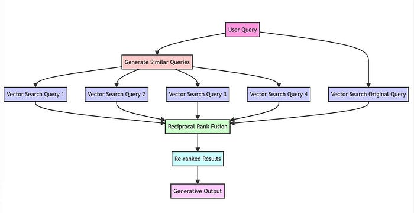
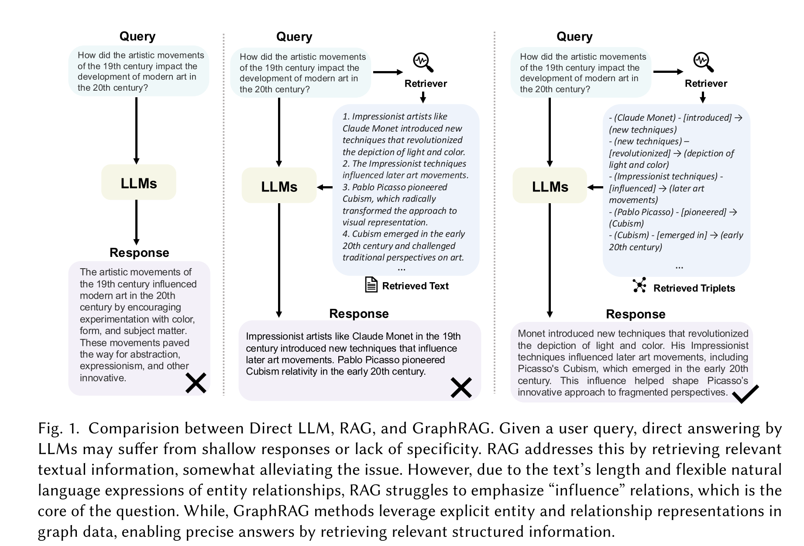
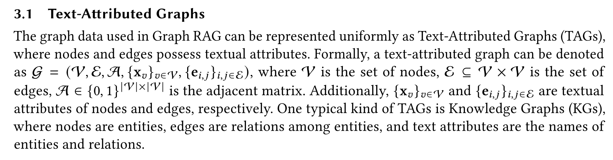
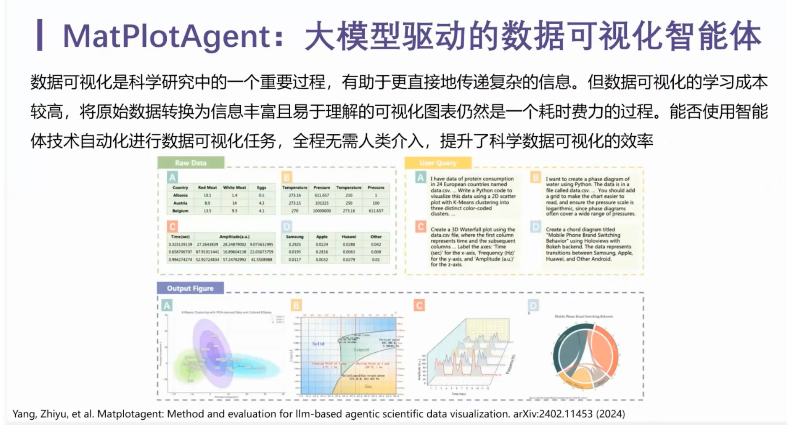
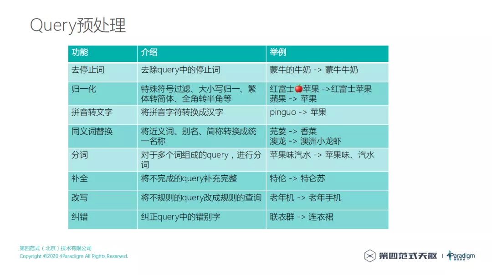
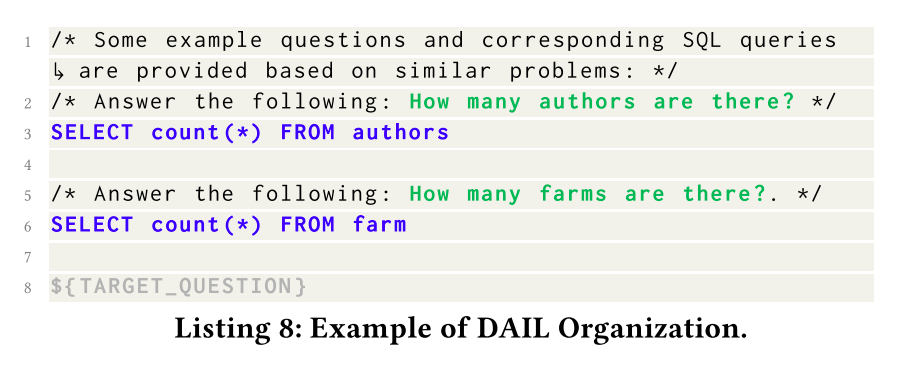

# AI-Applied-Algorithms

[toc]


## RAG

### Intro

#### 为什么需要


#### Context Engineering的概念

> Chroma访谈 「RAG真是一个糟糕的概念」 https://mp.weixin.qq.com/s/D5MXQKMffdGS_gTMHE4LIQ

* Context Engineering 这个概念，算是 AI 工程学的一部分。Context Engineering 的任务，就是在每一步生成时，决定上下文窗口里应该放什么。
  * 一个是内循环，决定这一次上下文里该放哪些内容；
  * 另一个是外循环，随着时间积累，逐渐学会如何越来越好地选择信息，只放最相关的。
  * 背后的观察是，context越长，LLM的能力下降
* **索引的目标就是用写入时的性能去换查询时的性能**
* Rerank
  * 专门的 re-rank 模型未来会慢慢边缘化。它们不会消失，但只会在极端规模、极端成本场景下才需要。就像硬件一样，大部分时候 CPU 或 GPU 就够了，只有极少数情况才会考虑 ASIC 或 FPGA。
* 代码检索的场景
  * **Claude Code  的同学提到过，他们不会对代码库做 Embedding 或索引，而是直接提供工具，用工具来做代码搜索**

#### RAG的未来

* 未来的检索系统可能会有几个特点：
  * 第一，它们会一直停留在潜在空间里，而不是再回到自然语言。
  * 第二，边生成边检索
    * RAGAR
* Cartridge，soft-prompt外挂kv-cachehttps://hazyresearch.stanford.edu/blog/2025-06-08-cartridges

### 业务场景

* 场景一：合作伙伴评估
  - “哪些企业最适合成为我们的战略合作伙伴？”
  - 对话式搜推 --> 追问用户企业
  - 知识图谱 --> 业务领域、技术优势、市场定位、信用评级、知识产权情况、诉讼记录
  - 寻求业务、技术能力的互补性 (工程施工 + 设计规划)
* 场景二：市场趋势洞察
  - “未来哪些行业领域可能出现爆发式增长，我们企业该如何提前布局？”
  - 对话式搜推 --> 追问用户行业
  - 知识图谱 --> 注册数量、资本投入、新增专利数量
  - 寻找不同行业之间的关联节点
* 场景三：潜在项目预测
  - “未来哪些项目最有可能适合我们企业参与投标？”
  - 对话式搜推 --> 追问用户技术优势
  - 知识图谱 --> 领域招投标项目数量增长趋势、政策法规、行业动态
  - 为用户提供潜在项目清单

### 检索


#### 基础流程

* RAG（Retrieval Augmented Generation）顾名思义，通过***\*检索\****的方法来增强***\*生成模型\****的能力。


* 搭建过程：
  * 文档加载，并按一定条件**切割**成片段
  * 将切割的文本片段灌入**检索引擎**
  * 封装**检索接口**
  * 构建**调用流程**：Query -> 检索 -> Prompt -> LLM -> 回复
* 离线步骤：
  1. 文档加载
  2. 文档切分
  3. 向量化
  4. 灌入向量数据库

- 在线步骤：
  1. 获得用户问题
  2. 用户问题向量化
  3. 检索向量数据库
  4. 将检索结果和用户问题填入 Prompt 模版
  5. 用最终获得的 Prompt 调用 LLM
  6. 由 LLM 生成回复

##### Retrieval-in-context LM: 验证了相比LLM内在知识有正向价值

* Paper
  * In-context RAG
  * REPLUG


#### 关键字检索

* Elastic Search
  * Elasticsearch（简称ES）是一个广泛应用的开源搜索引擎: https://www.elastic.co/
  * 关于ES的安装、部署等知识，网上可以找到大量资料，例如: https://juejin.cn/post/7104875268166123528
  * 关于经典信息检索技术的更多细节，可以参考: https://nlp.stanford.edu/IR-book/information-retrieval-book.html
* **关键字检索的局限性**
  * 同一个语义，用词不同，可能导致检索不到有效的结果

#### 向量库和向量检索

* Text Embeddings

  * **语义相似度**：向量之间距离
    * 欧氏距离
    * 余弦距离

* 向量数据库

  * 与传统的关系型数据库是互补的

* 主流向量数据库性能对比：

  * FAISS: Meta 开源的向量检索引擎 https://github.com/facebookresearch/faiss

  - Pinecone: 商用向量数据库，只有云服务 https://www.pinecone.io/

  * **Milvus**: 开源向量数据库，同时有云服务 https://milvus.io/
    * 性能优化较多
  * Weaviate: 开源向量数据库，同时有云服务 https://weaviate.io/
  * Qdrant: 开源向量数据库，同时有云服务 https://qdrant.tech/
  * PGVector: Postgres 的开源向量检索引擎 https://github.com/pgvector/pgvector
  * RediSearch: Redis 的开源向量检索引擎 https://github.com/RediSearch/RediSearch
  * ElasticSearch 也支持向量检索 https://www.elastic.co/enterprise-search/vector-search


##### 产品 Intro


* pgvector
  * PostgreSQL里面的一个vector search的插件
  * 缺点：
    * 向量维度最大只支持2000维，而现在很多新的模型生成的向量远远超过2000维，可能达到4096维以上（和采用了PostgreSQL底层存储有关）
    * 处理复杂应用场景时能力非常弱。这里的复杂场景指的是传统的关系型数据库中的操作，如filter、join和where等。例如，如果需要将两张表进行join然后再进行向量搜索，pgvector处理这种关系型操作的能力很差。
* PGVector.rs
  * 主要论点：vector是一种新的data type，而不是新的indexing构建方式
  * 基于关系型数据库来支持向量搜索，而不是开发一个新的specialized vector DB
  * 复杂场景：关系型数据库中的表与表之间的复杂查询操作。
    * 例如，支付宝的业务可能涉及几十张表，需要很多join和where语句来实现。这种复杂的关系型数据库查询需求是独立的vector DB无法满足的，因为它们通常只做向量搜索，没有大量的表与表之间的操作。
  * 对于那些专注向量搜索的应用，独立的vector DB确实可能是更好的选择。它们有更好的扩展能力，能更好地满足这类需求。因此，这两种场景并不冲突，具体选择取决于业务需求。如果业务需要处理复杂的关系型数据库查询，我们的pgvecto.rs会更适合，而如果业务重心在向量搜索，独立的vector DB可能更有优势。
* turbopuffer
  * 专门做多租户场景，这一单点差异化让它的商业化进程非常顺利。它针对有多租户需求的客户（比如Notion这样的应用）提供数据库服务。
* chroma https://mp.weixin.qq.com/s/D5MXQKMffdGS_gTMHE4LIQ
  * 原生支持正则搜索，因为它对代码搜索特别好用。我们还专门做了索引优化，让正则搜索在大数据量下也能跑得很快。
  * “forking”功能，可以在一百毫秒内复制一个已有索引

### 难点

#### 企业内部数据混乱

* 过去两年，我们有很多To B智能体项目的实践经验，比如用RAG模式搭建客服系统，过程中往往发现很多企业内部数据混乱，需要企业先投入做数据治理。在企业场景下，数据治理是比较耗时的工作。 （腾讯CSIG经验）
  * 如果内部文档有矛盾，就必须梳理清楚，定义好不同信息来源的权威性；
  * 如果文档有新、老版本，召回逻辑必须考虑时效性

#### 向量化召回的算法缺陷 [DeepMind]

>  [[EP-23\] Deepmind: 单向量召回的根本缺陷_哔哩哔哩_bilibili](https://b23.tv/FZKVfnd)


### Literature Review

#### RAG的几个关键问题


> LightRAG 5.2

#### LLM + Graphs

* GNNs as Prefix：
  * (GNNs) are utilized as the initial processing layer for graph data, generating structure-aware tokens that LLMs can use during inference
  * GraphGPT、LLaGA
* LLMs as Prefix
  * GALM、OFA
* LLMs-Graphs Integration
  * focuses on achieving a seamless interaction between LLMs and graph data, employing techniques such as fusion training and GNN alignment
  * developing LLM-based agents capable of engaging with graph information directly

> HybridRAG

#### KG

* knowledge extraction
  * The main tasks in this step are entity recognition, relationship extraction, and co-reference resolution. 
* knowledge improvement
  *  KG completion technique infers missing entities and relationships within the graph using methods such as link prediction and entity resolution. 
  *  Link prediction predicts the existence and type of a relation between two entities
     based on the graph structure and features
  *  entity resolution matches and merges different representations of the same entity
     from different sources
* knowledge adaptation

> Retrieval-Augmented Generation with Knowledge Graphs for Customer Service Question Answering: Related Work

#### KGQA: Question answering (QA) with knowledge graphs (KGs)

* retrieval-based
  * utilize relation extraction [19] or distributed representations [5] to derive answers from KGs, but they face difficulties with questions involving multi- ple entities.
* template-based
  * depend on manually-created templates for encoding complex queries, yet are limited by the scope of available templates [16].
* semantic parsing-based methods
  * map text to logical forms containing predicates from KGs [4] [14] [21]
* Evaluation
  * Mean Reciprocal Rank (MRR)
    * MRR gauges the average inverse rank of the initial correct response
  * recall@K
    * recall@K determines the likelihood of a relevant item’s appearance within the top K selections
  * NDCG@K
    * NDCG@K appraises the rank quality by considering both position and pertinence of items.
  * For question-answering performance, we juxtaposed the "golden" solutions against the generated responses, utilizing metrics such as BLEU [11], ROUGE [9], and METEOR [3] scores.

#### LLM4KGQA

* [7] provide a comprehensive review of this integration, categorizing the roles of LLMs as Predictors, Encoders, and Aligners
* For graph-based reasoning, Think-on-Graph [15] and Reasoning-on-Graph [10] enhance LLMs’ reasoning abilities by integrating KGs. 
* Yang et al. [20] propose augmenting LLMs’ factual reasoning across various training phases using KGs. 
* For LLM-based question answering, Wen et al.’s Mindmap [18] and Qi et al. [13] employ KGs to boost LLM inference capabilities in specialized domains such as medicine and food. These contributions underscore the increasing efficacy of LLM and KG combinations in enhancing information retrieval and reasoning tasks.

> MindMap

#### LLM + KG

> MindMap

* 融入训练：KGs emerged as a promising complement to the drawbacks of LLMs
  (Pan et al., 2023). 
  * For instance, KG triples were
    added to the training of LLMs (Zhang et al., 2019b)、Sun et al., 2021
  * KG encoders were entangled with LLM layers
    for joint inference and optimization on graph and
    text data (Zhang et al., 2022). 
  * applying KG prediction tasks, e.g., link prediction, as additional supervision (Ya-
    sunaga et al., 2022)
* synergistic inference of KGs and fixed LLMs
  * 22年左右，很多工作挖掘GNN、Graph Encoder、added interactions between text tokens and KG
    entities in the intermediate layers of LLMs (Zhang et al., 2022; Yao et al., 2023b)，后来才转向**prompting fixed pre-trained LLMs with graphical inputs**
  * Retrieval-Augmented LLM Inference
    * 《Knowledge-augmented language model prompting
      for zero-shot knowledge graph question answering.》 忽略了图结构信息
  * Graph Mining with LLMs
    * 实体/关系识别、图summary
      * prompting LLMs for KG entity linking prediction (Choudhary and Reddy, 2023; Sun et al., 2023), graph mining (Guo et al., 2023), and KG question answering (Baek et al., 2023)
      * 《GPT4Graph: Can large language models understand graph structured data? an empirical evaluation and benchmarking》
      * 《Exploring the potential of large language models (llms) in learning on
        graphs.》
      * 《Complex logical reasoning over knowledge graphs
        using large language models》
      * 局限性： rely heavily on the factual correctness of the KG and ignore the situation where
        the KG does not match the question
    * complex reasoning across multiple evidence graphs grounded on KGs
      * MindMap

### Embedding模型

* 向量模型怎么训练：

  * 构建相关（正例）与不相关（负例）的句子对儿样本

  * 训练双塔式模型，让正例间的距离小，负例间的距离大

  * https://www.sbert.net/

* OpenAI 新发布的两个 Embedding 模型
  * text-embedding-3-large、text-embedding-3-small
  * 特点：**越大越准、越小越快**
    * 支持自定义的缩短向量维度，从而在几乎不影响最终效果的情况下降低向量检索与相似度计算的复杂度
    * 计算时用前N维
  * 可变长度的 Embedding 技术：
    * https://arxiv.org/abs/2205.13147 Matryoshka Representation Learning
  * 

* 开源库：
  * https://github.com/FlagOpen/FlagEmbedding

* Note：
  * 可能支持跨语言

### 算法细节

#### document分割

*  文本分割的粒度
   * 缺陷
     * 粒度太大可能导致检索不精准，粒度太小可能导致信息不全面
       * 比如切分自然段，粒度太大
     * 问题的答案可能跨越两个片段
   * 改进: 按一定粒度，部分重叠式的切割文本，使上下文更完整

#### Rerank

*  检索后排序
   * 问题: 有时，最合适的答案不一定排在检索的最前面
   * 方案:
     * 检索时过招回一部分文本
     * 通过一个排序模型对 query 和 document 重新打分排序
   * 一些 Rerank 的 API 服务
     * [Cohere Rerank](https://cohere.com/rerank)：支持多语言
     * [Jina Rerank](https://jina.ai/reranker/)：目前只支持英文


#### RAG Fusion



#### query相关：长度等

*  [query rewriting and query expansion](https://www.google.com/search/howsearchworks/how-search-works/ranking-results/#meaning)
*  query长度
   *  

#### PDF中的表格如何处理

* TableTransformer模型 + GPT-4V
  * TableTransformer找到表格
  * 用 GPT-4 Vision 生成表格（图像）描述，并向量化用于检索
* 一些面向 RAG 的文档解析辅助工具

  - [PyMuPDF](https://pymupdf.readthedocs.io/en/latest/): PDF 文件处理基础库，带有基于规则的表格与图像抽取（不准）
  - [RAGFlow](https://github.com/infiniflow/ragflow): 一款基于深度文档理解构建的开源 RAG 引擎，支持多种文档格式
  - [Unstructured.io](https://unstructured.io/): 一个开源+SaaS形式的文档解析库，支持多种文档格式
  - [LlamaParse](https://docs.llamaindex.ai/en/stable/llama_cloud/llama_parse/)：付费 API 服务，由 LlamaIndex 官方提供，解析不保证100%准确，实测偶有文字丢失或错位发生
  - [Mathpix](https://mathpix.com/)：付费 API 服务，效果较好，可解析段落结构、表格、公式等，贵！


### Rank

#### Literature Review

* rank
  * encoders of T5-based instruction-following pretrained mod-
    els, namely T0-3B (Sanh et al., 2022) and FLAN-
    T5 (Chung et al., 2022), empirically leads to supe-
    rior performance as found in prior work (Sachan
    et al., 2022). We follow the EncT5 approach (Liu
    et al., 2021) and prepended each sequence with a
    start-of-sequence token. The token representation
    is then fed to a newly initialized feed-forward net-
    work. Unlike MonoT5 (Nogueira et al., 2020), we
    use their encoders only to reduce parameters and
    improve inference-time efficiency [Task-aware Retrieval with Instructions]

### GraphRAG

> [Graph Retrieval-Augmented Generation: A Survey 论文解读](https://mp.weixin.qq.com/s/Dx8pYhmbrhtRMXNez_GOmw)

* Intro
  * 利用了实体之间的结构信息，实现了更精确、全面的检索，捕捉了关系知识，促进了更准确、上下文感知的响应
  * Graph-Based Indexing, Graph-Guided Retrieval, and Graph-Enhanced Generation
* 难点：
  * **忽视关系：**传统RAG方法主要基于文本的语义相似性，而忽视了文本之间的结构关系。例如，在引用网络中，传统RAG方法可能无法捕捉到论文之间的引用关系。
  * **冗余信息：**RAG通常以文本片段的形式提供信息，当这些片段拼接在一起作为提示时，可能会导致上下文过长，出现“lost in the middle”的问题。
  * **缺乏全局信息：**RAG只能检索到文档的子集，而无法全面理解全局信息，这在查询聚焦摘要（QFS）等任务中可能存在问题。



* GraphRAG的思路：
  * GraphRAG的核心思想是将知识图谱中的结构化信息（如节点、三元组、路径或子图）与LLMs的输出相结合，以提供更准确和丰富的生成结果。
  * 使用结构化知识图谱来更有效地处理冗余信息和全局信息的问题，更方便地进行信息的检索和聚合


* Preliminaries

  * Text-Attributed Graphs (TAGs)
    * 
  * GNN
    * 

* Graph-Based Indexing

  * 数据
    * 开放知识图谱：公开可用的知识图谱，一般主要包括三类：百科知识图谱（如WikiData）、常识知识图谱（ConceptNet）以及领域知识图谱。
    * 自构建图数据：这些是研究人员根据特定任务需求构建的自定义图数据。例如，可能从文档、表格或其他数据库中提取实体和关系，并将它们组织成图结构。
  * 索引
    * 图索引：图索引保留了图的完整结构，使节点和边的访问变得容易。在后续的GraphRAG过程中，可以使用经典的图搜索算法（如BFS和最短路径算法）来快速检索信息。
    * 文本索引：这种方法将图数据转换为文本描述，以便使用各种文本检索技术（如稀疏检索和密集检索）进行优化。
    * 向量检索：这种方法将图数据转换为向量表示，以利用高效的向量搜索算法（如局部敏感哈希）进行快速检索。

* Graph-Guided Retrieval

  * 

  * **检索器的选择：**在图检索中，选择适当的检索器是至关重要的。研究人员可以根据任务需求和数据类型选择以下类型的检索器。
    * 非参数化检索器：基于传统的图搜索算法（如BFS和DFS），不依赖于深度学习模型，适用于高效的大规模数据检索。
    * 语言模型检索器：基于语言模型（如BERT、GPT等），利用其强大的自然语言理解能力，适用于处理复杂的用户查询。
    * 图神经网络检索器：基于图神经网络（如GCN、GAT等），利用其对图结构数据的表示能力，适用于处理复杂的图结构数据。
  * Retrieval Paradigm
    * Once Retrieval
    * **Iterative Retrieval**
      * **Non-Adaptive Retrieval**
      * **Adaptive Retrieval.**
    * **Multi-Stage Retrieval.**

* Graph-Enhanced Generation
  * 


* 训练
  * Retriever训练
    * Training-Free
    * Training-Based
  * Generator训练
    * Training-Free
    * SFT
    * GNN

* 应用
  * 下游任务：问答（知识库问答、常识问答）、信息抽取（实体链接、关系抽取）、事实验证、链接预测、对话系统、推荐系统等。
  * 应用领域：GraphRAG的应用领域主要包括：电商、生物医疗、学术、文献学、法律
    * 电商：
      * RETE: Retrieval-Enhanced Temporal Event Forecasting on **Unified Query Product Evolutionary Graph.**
        * auto-regressive
      * Retrieval-Augmented Generation with Knowledge Graphs for Customer Service Question Answering

* 开源代码
  * 微软GraphRAG：[GitHub - microsoft/graphrag: A modular graph-based Retrieval-Augmented Generation (RAG) system](https://github.com/microsoft/graphrag)
  * 蚂蚁GraphRAG：https://github.com/eosphoros-ai/DB-GPTNeo4j 
  * NallM：https://github.com/neo4j/NaLLMNeo4j 
  * LLM Graph Builder：https://github.com/neo4j-labs/llm-graph-builderNebulaGraph 
  * GraphRAG：https://www.nebula-graph.io/posts/graph-RAG


### LightRAG

> https://github.com/HKUDS/LightRAG
>
> [从原理、本地Qwen2.5-3B模型部署到源码解读，全流程解析LightRAG](https://www.bilibili.com/video/BV1CwCRYGE6J)
>
> * 思路：
>
>   - 数据增强：LLM
>
>   - 剪枝：
>     - LLM realtime update Graph：图节点/边去重
>     - high-level concept / low-level entity

* Intro
  * **incorporates graph structures into text indexing** and retrieval processes
  * a **dual-level retrieval** system that enhances comprehensive information retrieval from both low-level and high-level knowledge discovery
  * an incremental update algorithm that ensures the timely integration of new data


* RAG的设计
  * Comprehensive Information Retrieval: The indexing function φ(·) must be adept at extracting global information, as this is crucial for enhancing the model’s ability to answer queries effectively.
  * Efficient and Low-Cost Retrieval: The indexed data structure Dˆ must enable rapid and cost- efficient retrieval to effectively handle a high volume of queries.
  * Fast Adaptation to Data Changes: The ability to swiftly and efficiently adjust the data structure to incorporate new information from the external knowledge base, is crucial for ensuring that the system remains current and relevant in an ever-changing information landscape.


* Framework
  * we leverage LLMs to identify and extract various entities (e.g., names, dates, locations, and events) along with the relationships between them.
  * Graph-Based Text Indexing
  * DUAL-LEVEL RETRIEVAL PARADIGM
* Graph-Based Text Indexing
  * Extracting Entities and Relationships. R(·)
  * LLM Profiling for Key-Value Pair Generation. P(·)
    * Entities use their names as the sole index key,
    * whereas relations may have multiple index keys derived from LLM enhancements that include global themes from connected entities.
  * Deduplication to Optimize Graph Operations. D(·)
* 两路召回 DUAL-LEVEL RETRIEVAL PARADIGM
  - Specific Queries -> Low-Level Retrieval
    - “Who wrote ’Pride and Prejudice’?”
    - -> 召回title
  - Abstract Queries -> High-Level Retrieval
    - “How does artificial intelligence influence modern education?”
    - -> 召回关系
  - Integrating Graph and Vectors for Efficient Retrieval.
    - Query Keyword Extraction: 
      - local query keywords k(l) and global query keywords k(g).
    - Keyword Matching：
      - match local query keywords with candidate entities and global query keywords with relations linked to global keys
    - Incorporating High-Order Relatedness.
      - 基于前面已召回的节点和边，再多一跳

* Evaluation

  * 基线：
    * Naive RAG
    * RQ-RAG：These sub-queries are designed to enhance search accuracy by utilizing explicit techniques such as rewriting, decomposition, and disambiguation
    * GraphRAG:
      * It generates corresponding descriptions for these elements, aggregates nodes into communities, and produces a community report to capture global information
  * **LightRAG做单一领域的任务比GraphRAG强**
    * 

  * 结论：
    * The Superiority of Graph-enhanced RAG Systems in Large-Scale Corpora
    * Enhancing Response Diversity with LightRAG
    * LightRAG’s Superiority over GraphRAG
      * **Enhanced Response Variety**: By integrating low-level retrieval of specific entities with high-level retrieval of broader topics, LightRAG boosts response diversity. This dual-level mechanism effectively addresses both detailed and abstract queries, ensuring a thorough grasp of information.
      * **Complex Query Handling**: This approach is especially valuable in scenarios requiring diverse perspectives. By accessing both specific details and overarching themes, LightRAG adeptly responds to complex queries involving interconnected topics, providing contextually relevant answers.
    * 对high/low level retrieval的分析：
      * 去掉High：it struggles to gather information for complex queries that demand comprehensive insights
    * Semantic Graph Excels in RAG.
      * We eliminated the use of original text in our retrieval process. Surprisingly, the resulting variant, -Origin, does not exhibit significant performance declines across all four datasets. In some cases, this variant even shows improvements (e.g. in Agriculture and Mix). We attribute this phenomenon to the effective extraction of key information during the graph-based indexing process, which provides sufficient context for answering queries. Additionally, the original text often contains irrelevant information that can introduce noise in the response.
      * 启发：信息并不是越多越好 -> 对rerank的启发

* Prompts
  * Prompts for Graph Generation：7.3.1 
  * Prompts for Query Generation：7.3.2
  * Prompts for Keyword Extraction：7.3.3
  * Prompts for RAG Evaluation

### Agentic RAG


### LLM4KGQA

> KGQA: Knowledge Graph Question Answering

#### FinDKG

* 抽取KG的prompt


* 动态图
  * GNN，时序信息建模

#### HybridRAG: Integrating Knowledge Graphs and Vector Retrieval Augmented Generation for Efficient Information Extraction

* Intro
  * KG：将文档视为两个实体和关系的triplet
  * 当前 RAG 技术包括基于向量数据库的 VectorRAG 和基于知识图谱（KG）的 GraphRAG，各有局限，如 VectorRAG 对金融文档的段落分块假设不合理，GraphRAG 在抽象问答任务或问题未提及明确实体时表现不佳。
* KG构建
  * each triplet is represented as **a nested list [’h’, ’type’, ’r’, ’o’, ’type’, ’metadata’]**,
    * ’h’ and ’o’ denote the head and object entities respectively,
    * ’type’ specifies the entity category,
    * ’r’ represents the relationship,
    * ’metadata’ encapsulates additional contextual information.
    * This format allows for a rich, multidimensional representation of information, facilitating
      more nuanced downstream analysis.
  * 少于4 word
  * 实体消重
  * 实现：NetworkxEntityGraph
* 评估
  * faithfulness, answer relevance, and context relevance      （HybridRAG）
    * 使用 RAGAS 框架


#### Retrieval-Augmented Generation with Knowledge Graphs for Customer Service Question Answering [SIGIR 2024]

* Intro
  * intra-issue structure and inter-issue relations
  * 过往工作的 Limitations
    * Limitation 1 - Compromised Retrieval Accuracy from Ignoring Structures
    * Limitation 2 - Reduced Answer Quality from Segmentation
* 意图识别
  * 3.2.1 intent识别，。识别陈述句和疑问句区别不大 核心是识别对象，因此用一个template识别k到v的映射
* 知识图谱构建
  * 显式和隐式建立ticket之间关系
    * 显式：已有数据
    * 隐式：title embedding，余弦相似度，阈值

* Embedding-based Retrieval of Sub-graphs. (3.2.2)
  * EBR-based ticket identification step
    * 计算ticket的相关性：涉及多个entity，每个entity算相关性然后分数相加召回
    * 引申：图的二跳问题
  * LLM-driven subgraph extraction step
    * 从工单中查找想要的属性

#### MindMap: Knowledge Graph Prompting Sparks Graph of Thoughts in Large Language Models

> https://github.com/wyl-willing/MindMap
>
> 思路很清晰：既利用KG加强召回率和精准度，又融入GoT挖掘LLM的内在知识


* Evidence graph mining
  * 实体识别：
    * **Prompt：Table 9 of Appendix D.**
    * BERT similarity to match entities and keywords
  * Evidence Sub-graphs Exploration
    * 基于提取的实体从源 KG 构建证据子图，包括基于路径的探索和基于邻居的探索两种方法，并对生成的子图进行修剪
    * 算法见Appendix E
    * Path-based
    * Neighbor-based
      * 一跳必加
      * 二跳根据和query的相关性加
* Evidence graph aggregation
  * 从前面步骤中提取至少 k 个基于路径和 k 个基于邻居的证据子图，将每个子图格式化为实体链并转换为自然语言描述，定义为推理图。
  * 顺带能解决实体重复的问题
* LLM reasoning on the mind map
  * 相比来说，以前的LLM4KG： they do not think
    on multiple evidence KG sub-graphs with multi-
    thought in LLM, and without backtracking evi-
    dence sources

* Evaluation
  * hallucination quantification：引入指标定义
  * train a keyword extraction model(NER-MT5) based on mT5-large
  * "combine with the knowledge you already have“ 能提升效果


* Prompt

实体抽取

```
template = """
There are some samples:
\n\n
### Instruction:\n’Learn to extract entities from the following
medical questions.’\n\n### Input:\n
<CLS>Doctor, I have been having discomfort and dryness in my vagina
for a while now. I also experience pain during sex. What could be
the problem and what tests do I need?<SEP>The extracted entities
are\n\n ### Output:
<CLS>Doctor, I have been having discomfort and dryness in my vagina
for a while now. I also experience pain during sex. What could be
the problem and what tests do I need?<SEP>The extracted entities
are Vaginal pain, Vaginal dryness, Pain during intercourse<EOS>
\n\n
Instruction:\n’Learn to extract entities from the following medical
answers.’\n\n### Input:\n
<CLS>Okay, based on your symptoms, we need to perform some diagnostic
procedures to confirm the diagnosis. We may need to do a CAT scan
of your head and an Influenzavirus antibody assay to rule out any
other conditions. Additionally, we may need to evaluate you
further and consider other respiratory therapy or physical therapy
exercises to help you feel better.<SEP>The extracted entities are
\n\n ### Output:
<CLS>Okay, based on your symptoms, we need to perform some diagnostic
procedures to confirm the diagnosis. We may need to do a CAT scan
of your head and an Influenzavirus antibody assay to rule out any
other conditions. Additionally, we may need to evaluate you
further and consider other respiratory therapy or physical therapy
exercises to help you feel better.<SEP>The extracted entities are
CAT scan of head (Head ct), Influenzavirus antibody assay,
Physical therapy exercises; manipulation; and other procedures,
Other respiratory therapy<EOS>
\n\n
Try to output:
### Instruction:\n’Learn to extract entities from the following
medical questions.’\n\n### Input:\n
<CLS>{input}<SEP>The extracted entities are\n\n ### Output:
"""
```

生成答案、GoT

```Python
SystemMessage(content= """You are an excellent AI doctor, and you can diagnose diseases and recommend medications based on the symptoms in the conversation."""),
HumanMessage(content"""Patient input:"""+ Question),
AIMessage(content=f """Combine the knowledge you already have, you have some extra medical knowledge information in the following:\n\n ### """+ path_reasoning_graph + """\n\n###""" + neighbor_reasoning_path),
HumanMessage(content="""What disease does the patient have? What tests should patient take to confirm the diagnosis? What recommened medications can cure the disease? Think step by step.\n\n\n
Output1: The answer includes disease and tests and recommened medications.\n\n
Output2: Show me inference process as a string about extract what knowledge from which Path-based Evidence or Neighor-based Evidence, and in the end infer what result. \n Transport the inference process into the
following format:\n Path-based Evidence number('entity name'->'relation name'->...)->Path-based Evidence number('entity name'->'relation name'->...)->Neighbor-based Evidence number('entity name'->'relation name'->...)-
>Neighbor-based Evidence number('entity name'->'relation name'->...)->result number('entity name')->Path-based Evidence number('entity name'->'relation name'->...)->Neighbor-based Evidence number('entity name'->'relation
name'->...). \n\n
Output3: Draw a decision tree. The entity or relation in single quotes in the inference process is added as a node with the source of evidence, which is followed by the entity in parentheses.\n\n
There is a sample:\n ... """)
```

传统RAG

```
template = """
You are an excellent AI doctor, and you can diagnose diseases and Patient input:\n conversation.\n\n recommend medications based on the symptoms in the
{question}
\n\n
You have some medical knowledge information in the following:
{instruction}
What disease does the patient have? What tests should patient \n\n
take to confirm the diagnosis? What recommened medications can
cure the disease?
"""
```

LLM Evaluation

* “If they are the same, output "2". Try to output "1" or "0"”

```
def prompt_comparation(reference,output1,output2): template = """
Reference: {reference} \n\n
output1: {output1}
\n\n
output2: {output2}
\n\n
According to the facts of disease diagnosis and drug and tests recommendation in reference output, which output is better match. If the output1 is better match, output ’1’. If the
output2 is better match, output ’0’. If they are same match,
output ’2’.
"""
prompt = template.format(reference=reference, output1=output1,
output2=output2)
response = openai.ChatCompletion.create( messages=[ model="gpt-4", {"role": "user", "content": prompt} {"role": "system", "content": """You are an excellent AI doctor."""},
]
response_of_comparation = response.choices[0].message.content return response_of_comparation
```

### REALM: 检索增强的新预训练方法


### RETRO：检索信息注入LLM中间层


* 关键设计：CCA


* CCA的实现：
  * 错位，目的是保留最后一个token，保证最后一个token能整合信息
  * 


### KNN-LM: 从LLM生成机制入手，加权两个概率分布

* 相比普通LLM，会考虑外部信息中的全部tokens


* 加权两个概率分布
  * 

* 结论：
  * 


### Soft Prompt

#### Cartridge: soft-prompt外挂kv-cache

[LLM无限上下文了，RAG（Retrieval Augmented Generation）还有意义吗？ - Crim的回答 - 知乎](https://www.zhihu.com/question/653424464/answer/1925241113582768305)

https://hazyresearch.stanford.edu/blog/2025-06-08-cartridges

#### [Meta] REFRAG: Rethinking RAG based Decoding

> 本质上是对RAG做性能优化
>
> insight是利用块间注意力小的特点，分块做encoder处理，损失小

* Intro
  * 大型语言模型（LLMs）在检索增强生成（RAG）等长上下文任务中面临**高延迟**（尤其是首 token 生成时间 TTFT 呈二次增长）和**内存消耗大**（KV 缓存随上下文长度线性增加）的问题，而 RAG 上下文因检索段落语义相似度低，存在块对角注意力结构，导致大量计算冗余。为此，研究提出**REFRAG**（RAG 专用高效解码框架），通过 “压缩 - 感知 - 扩展” 机制：利用轻量编码器（如 RoBERTa）预计算检索段落的**块嵌入**、通过投影层匹配解码器（如 LLaMA）嵌入空间，并结合**强化学习（RL）选择性扩展关键块**，实现任意位置压缩且保持自回归性。
  * 实验表明，REFRAG 在不修改 LLM 架构、无困惑度损失的前提下，实现**30.85× TTFT 加速**（较此前 SOTA 模型 CEPE 提升 3.75×），并将 LLM 上下文长度扩展**16×**，在 RAG（强 / 弱检索器场景均优）、多轮对话、长文档摘要等任务中，均优于 LLaMA、REPLUG 等基线模型，甚至在弱检索器场景提升精度 1.93%。
* 流程
  * 
  * **上下文分块**：将 RAG 中的`s`个上下文 token 划分为`L = s/k`个`k`长度块（如`k=16`，`s=2048`则`L=128`）；
  * **块嵌入预计算**：轻量编码器（如 RoBERTa-Large）处理每个块`C_i`，生成块嵌入`c_i = M_enc(C_i)`，并通过投影层`ϕ`映射为与解码器 token 嵌入维度一致的`e_i^cnk`；
  * **解码器输入构造**：将 “问题 token 嵌入（`e_1~e_q`）+ 块嵌入（`e_1^cnk~e_L^cnk`）” 输入解码器（如 LLaMA-2-7B），生成答案；
  * **RL 选择性扩展**：轻量 RL 策略以 “next-paragraph 预测困惑度” 为负奖励，选择关键块（如高相关性段落）扩展为原 token，非关键块保留压缩嵌入，实现 “精度 - 效率” 平衡。

* 痛点：现有长上下文优化方法（如 CEPE、StreamingLLM）针对通用 LLM 任务，未考虑 RAG 特性：

  - **信息稀疏**：RAG 上下文由多段检索文本组成，仅少数段落与查询直接相关，全 token 计算存在大量冗余；
  - **预编码信息浪费**：检索阶段已通过向量编码、重排序获得段落与查询的相关性信息，解码时被完全丢弃；
  - **块对角注意力**：检索段落因多样性 / 去重，语义相似度低，形成 “块内高注意力、块间低注意力” 的块对角结构，跨块计算无效。

* REFRAG 的训练分为 “持续预训练（CPT）” 与 “下游微调” 两阶段，核心策略为**重构任务**与**课程学习**。

  * ##### 3.1 持续预训练（CPT）

    1. **重构任务**
       - 目标：**对齐编码器与解码器嵌入空间**，减少压缩信息损失；
       - 操作：冻结解码器，仅训练编码器 + 投影层，让解码器从块嵌入中恢复原`k`个 token；
       - 作用：强制模型依赖上下文记忆（块嵌入）而非参数记忆，为后续长上下文处理奠定基础。
    2. **课程学习**
       - 问题：`k`增大时，token 组合数呈`V^k`增长（`V`为词汇量），直接多块重构难度极高；
       - 方案：从 “单块重构（易）” 逐步过渡到 “多块重构（难）”，数据混合从 “易任务主导” 逐步转向 “难任务主导”（表 8）；
       - 效果：避免训练崩溃，使模型逐步掌握 “压缩 - 恢复” 能力（表 11 显示，无课程学习时 REFRAG 重构`2048`token 的困惑度为 1.599，有课程学习时仅 0.135）。

  * 3.2 下游微调

    - **监督微调（SFT）**：使用 RAG（110 万数据点，含 OpenAssistant、SQuADv2 等）、多轮对话（TopiOCQA 等）数据集，微调模型适配下游任务；
    - **RL 策略微调**：优化块扩展选择，进一步提升 “压缩效率” 与 “答案精度” 的平衡。

### 竞品


## Agent Overview

> 【InfiniTensor】清华大学系列训练营-大模型与人工智能系统训练营 大模型前沿技术（五）自主智能体 https://www.bilibili.com/video/BV14sPkehEGg
>
> [llm agent 的快速入门方式](https://www.xiaohongshu.com/explore/68e3bec5000000000700ed01?app_platform=ios&app_version=8.86&share_from_user_hidden=true&xsec_source=app_share&type=normal&xsec_token=CBfQmFcoc4M6mGAUGRJluHv66k2gE1CdeNtrSkdPT8pG8=&author_share=1&xhsshare=CopyLink&shareRedId=N0lEN0Y6Rk82NzUyOTgwNjc5OTg2NUpP&apptime=1759854383&share_id=5cd45c0cb7834338adbcdc7590eb78a6)
>
> Todo: a survey of self-evolving agents

### Intro

* 和Workflow的对比，见workflow章节中的甲骨文文章
* Intro
  * understanding complex inputs, engaging in reasoning and planning, using tools reliably, and recovering from errors.
  * it's crucial for the agents to gain “ground truth” from the environment at each step (such as tool call results or code execution) to assess its progress
  * **When to use agents:** Agents can be used for open-ended problems where it’s difficult or impossible to predict the required number of steps, and where you can’t hardcode a fixed path. The LLM will potentially operate for many turns, and you must have some level of trust in its decision-making. Agents' autonomy makes them ideal for scaling tasks in trusted environments.


* [Google 白皮书分析](https://ppc.land/ai-agents-google-unveils-framework-for-next-gen-systems/)
  * 白皮书：https://ppc.land/content/files/2025/01/Newwhitepaper_Agents2.pdf
  * 
  * model layer
  * orchestration layer
    * ReAct, Chain-of-Thought, and Tree-of-Thoughts
    * "agent chaining"

  * Tools layer
    * Extensions
      * provide standardized API interactions

    * Functions
      * enable client-side execution control

    * Data Stores
      * facilitate access to various types of information

  * 

* 吴恩达：系统可以具有不同程度的Agentic特性
  * **Reflection（反思）**：类似于AI的自我纠错和迭代。例如，AI系统会检查自己编写的代码，并提出修改建议。
  * **Tool Use（工具使用）**：大语言模型调用插件，扩展了其能力。例如，使用Copilot进行联网搜索或调用代码插件解决数理逻辑问题。
  * **Planning（规划）**：AI根据用户输入的任务，拆解流程、选择工具、调用、执行并输出结果。例如，根据一张图片中的姿态生成一张新图片，并进行描述。
  * **Multi-agent（多智能体协作）**：多个Agent协作完成任务，每个Agent可能扮演不同的角色，如CEO、产品经理或程序员。这种模式模拟了现实生活中的工作场景，能够处理复杂系统处理复杂系统
* OpenAI开源多智能体agent框架swarm https://mp.weixin.qq.com/s/ysUzxUYV-lsQ6aiYPU0KdA
  * https://github.com/openai/swarm
  * 自动将函数转成适配格式的json描述
  * 上下文的管理有多种模式可以轻松传递
  * 10行代码构建出多智能体系统


- [LangGraph](https://langchain-ai.github.io/langgraph/) from LangChain;
- Amazon Bedrock's [AI Agent framework](https://aws.amazon.com/bedrock/agents/);
- [Rivet](https://rivet.ironcladapp.com/), a drag and drop GUI LLM workflow builder; and
- [Vellum](https://www.vellum.ai/), another GUI tool for building and testing complex workflows.

#### 未来展望


### 演进路线：认知框架

> todo https://www.zhihu.com/question/1927140506573435010/answer/1928873138189476851 作者：远洋之帆
>
> 后面还有更多技术介绍

* 认知框架已形成四代技术脉络：

1. **第一代**：线性推理（CoT/ReAct）  
2. **第二代**：结构化探索（ToT/GoT）  
3. **第三代**：程序增强（PAL/CR）  
4. **第四代**：系统化协作（多Agent/von Neumann）

* 演进路线

  | 演进维度   | 代表框架                  | 核心突破                 |
  | ---------- | ------------------------- | ------------------------ |
  | 线性推理   | CoT, Self-Consistency     | 分步解决复杂问题         |
  | 结构化探索 | ToT, GoT, SoT             | 多路径搜索与回溯机制     |
  | 程序增强   | PAL, PoT                  | 代码执行确保计算精确性   |
  | 动态优化   | BoT, RoT, VoT             | 迭代修正与验证机制       |
  | 知识融合   | RAT, Analogical Prompting | 外部知识实时检索与整合   |
  | 系统协作   | von Neumann Multi-Agent   | 仿计算机架构的分布式推理 |

* **1. 基础推理框架**

  | 框架                                                         | 核心技术                               | 突破性应用                |
  | ------------------------------------------------------------ | -------------------------------------- | ------------------------- |
  | CoT                                                          | 分步提示（"Let's think step by step"） | MATH数据集准确率提升300%  |
  | [ReAct](https://zhida.zhihu.com/search?content_id=737342368&content_type=Answer&match_order=1&q=ReAct&zhida_source=entity) | 推理-行动循环（Think→Act→Observe）     | HotpotQA问答幻觉率降低58% |
  | Self-Consistency                                             | 多路径投票机制                         | GSM8K数学题稳定性提升40%  |

* **2. 结构化框架**

| 框架 | 数据结构          | 创新点                             |
| ---- | ----------------- | ---------------------------------- |
| ToT  | 树状搜索          | DFS/BFS策略实现Game-of-24成功率74% |
| GoT  | 有向无环图        | 思维聚合能力使排序任务成本降31%    |
| SoT  | 骨架-细节二级结构 | 文本生成延迟降低2.4倍              |

* **3. 程序辅助框架**

```python
# PAL典型工作流（数学问题求解）
def pal_execute(question):
    # 自然语言转代码
    code_prompt = f"将问题转换为Python代码: {question}"
    generated_code = llm.generate(code_prompt)

    # 安全沙盒执行
    with Sandbox() as env:
        result = env.execute(generated_code)

    # 结果验证
    if validate(result):
        return result
    else:
        return self_correction()  # 触发自我修正
```

> **优势**：在MATH数据集上准确率达85.3%（比纯CoT高22%） 

* **4. 迭代优化框架**

**Buffer of Thoughts (BoT) 核心机制**：


* **三、框架性能对比**

| 评估维度       | CoT  | ToT  | PAL  | BoT  | RAT  |
| -------------- | ---- | ---- | ---- | ---- | ---- |
| 复杂推理准确率 | 57%  | 74%  | 85%  | 82%  | 79%  |
| 响应延迟(ms)   | 1200 | 3500 | 2500 | 4200 | 2900 |
| 外部知识依赖   | 无   | 无   | 低   | 无   | 高   |
| 错误传播风险   | 高   | 中   | 低   | 低   | 中   |

#### 框架选择决策树


### 

| 框架类别   | 代表框架                 | 核心特点   | 计算复杂度 | 适用场景     |
| ---------- | ------------------------ | ---------- | ---------- | ------------ |
| 基础推理   | CoT, Self-Consistency    | 线性推理   | 低         | 简单推理任务 |
| 结构化推理 | ToT, GoT, SoT            | 树/图结构  | 中-高      | 复杂决策问题 |
| 程序辅助   | PAL, PoT                 | 代码执行   | 中         | 数学计算密集 |
| 迭代优化   | BoT, RoT, VoT            | 多轮优化   | 高         | 需要精确答案 |
| 知识增强   | RAT, Analogical          | 外部知识   | 中         | 知识密集任务 |
| 元认知     | Meta-Prompting, CCI      | 自我调节   | 中-高      | 自适应任务   |
| 协作框架   | Multi-Agent, von Neumann | 多主体协作 | 最高       | 复杂系统问题 |


### Function Calling

https://www.anthropic.com/news/tool-use-ga

*  Anthropic's suggestions for deciding on tool formats are the following:

   - Give the model enough tokens to "think" before it writes itself into a corner.

   - Keep the format close to what the model has seen naturally occurring in text on the internet.

   - Make sure there's no formatting "overhead" such as having to keep an accurate count of thousands of lines of code, or string-escaping any code it writes.

*  *agent*-computer interfaces (ACI)

   * Put yourself in the model's shoes
   * writing a great docstring for a junior developer on your team
   * https://console.anthropic.com/workbench
   * [Poka-yoke](https://en.wikipedia.org/wiki/Poka-yoke) your tools
   * e.g. SWE Bench，文件tool仅输入绝对路径

### ReAct

> todo ReAct paper

* thought 节点
* action 节点
* iteration and branch 节点


```
Answer the following questions as best you can. You have access to the following tools:

{tools}

Use the following format:

Question: the input question you must answer
Thought: you should always think about what to do
Action: the action to take, should be one of [{tool_names}]
Action Input: the input to the action
Observation: the result of the action
... (this Thought/Action/Action Input/Observation can repeat N times)
Thought: I now know the final answer
Final Answer: the final answer to the original input question

Begin!

Question: {input}
Thought:{agent_scratchpad}
```

### tree of thought (ToT)

> todo paper

* 把search的思想引入到agent的设计里面，为后续mcts和agent结合的大量工作奠定了基础。

### **SelfAskWithSearch**

* 适合知识图谱这样的层层推理场景


### Plan-And-Execute

> https://blog.langchain.dev/planning-agents/

* 好处
  * Generating the full reasoning steps is a tried-and-true prompting technique to improve outcomes.
  * 性能、成本
* Naive版本
  * https://github.com/langchain-ai/langgraph/blob/main/docs/docs/tutorials/plan-and-execute/plan-and-execute.ipynb


* ReWOO：Reasoning WithOut Observations
  * the planner can reference previous outputs using syntax like `#E2` 
  * more effective than a naive plan-and-execute agent since each task can have only the required context (its input and variable values).

* LLMCompiler
  * https://github.com/langchain-ai/langgraph/blob/main/docs/docs/tutorials/llm-compiler/LLMCompiler.ipynb
  * **Planner**: streams a DAG of tasks. Each task contains a tool, arguments, and list of dependencies.
  * **Task Fetching Unit** schedules and executes the tasks. This accepts a stream of tasks. This unit schedules tasks once their dependencies are met. Since many tools involve other calls to search engines or LLMs, the extra parallelism can grant a significant speed boost (the paper claims 3.6x).
  * **Joiner**: dynamically replan or finish based on the entire graph history (including task execution results) is an LLM step that decides whether to respond with the final answer or whether to pass the progress back to the (re-)planning agent to continue work.
  * 好处：
    * **Planner** outputs are ***streamed;\*** the output parser eagerly yields task parameters and their dependencies.
    * The **task fetching unit** receives the parsed task stream and schedules tasks once all their dependencies are satisfied.
    * Task arguments can be *variables,* which are the outputs of previous tasks in the DAG. For instance, the model can call `search("${1}")` to search for queries generated by the output of task 1. This lets the agent work even faster than the "embarrassingly parallel" tool calling in OpenAI.

### Agent Examples

#### Intro

* 模版


#### Agentic RAG

* 

#### Coding Agent

- A coding Agent to resolve [SWE-bench tasks](https://www.anthropic.com/research/swe-bench-sonnet), which involve edits to many files based on a task description;
  - 
- Our [“computer use” reference implementation](https://github.com/anthropics/anthropic-quickstarts/tree/main/computer-use-demo), where Claude uses a computer to accomplish tasks.

#### Customer support

- 特点
  - Support interactions naturally follow a conversation flow while requiring access to external information and actions;
  - Tools can be integrated to pull customer data, order history, and knowledge base articles;
  - Actions such as issuing refunds or updating tickets can be handled programmatically; and
  - Success can be clearly measured through user-defined resolutions.
- 一口气学会如何思考AI Agent系统设计 https://www.bilibili.com/video/BV1WoeozgEyn/
  - 参考「Agent应用技术架构」


## Agent 推理框架

### 算法理论

* Agent难点
  * 基座模型的复杂推理能力不够强

    * 通过基座模型Plan把一个复杂任务分解为10个步骤，哪怕单个步骤的正确率高达95%，要想最后把任务做对，10个环节的准确率连乘下来，最终的正确率只有59%
* [专访Pokee CEO朱哲清](https://www.xiaohongshu.com/explore/688cba190000000023038da5?app_platform=ios&app_version=8.86&share_from_user_hidden=true&xsec_source=app_share&type=normal&xsec_token=CBmLxP7tTpVSUcvw4pq6ugGZ5IA8aKu780DUkpud8d5ck=&author_share=1&xhsshare=CopyLink&shareRedId=N0lEN0Y6Rk82NzUyOTgwNjc5OTg2NUpP&apptime=1755577736&share_id=ed67514d0f084d5e93e2177cce5b2489&exSource=)，谈agentic experience
  * multi-step reasoning和multi-step execution的重要性
    * creative&design类agent的一个瓶颈是，一步做完，用户没法改了，比如无法导入AE并保留图层，或者导入Figma
  * RL的重要性
    * agent中，pretraining的主要意义是理解
    * 从人类工作流中提取pretraining数据集的效率低
    * 复杂系统中，多轮迭代产生的数据，价值高，不能完全依赖offline RL
  * agent如何超越function calling
    * 目标导向的规划很重要
    * 解决evalutaion的瓶颈
    * 个性化memory理解

### 业务场景

* 基座推理模型的训练数据场景
  * 编程
  * 推理
  * 数学
  * --> 增加浏览能力

* 在线研究：因为很多职业都需要做大量的资料搜集、信息整合，最后写成报告
  * “我希望模型能帮我找到几款产品，并根据 Reddit 上的评价给排个序”
  * “我希望它能帮我针对某个主题写一篇文献综述”
  * 找出 Liam Felis 和 Barrett Zoff 合著的所有论文
  * 找出我们一个同事的中间名
  * 做旅行计划
* 软件工程
* 电商
  * “我喜欢这几个牌子，请帮我找找还有哪些新牌子能买到类似这款的特定外套”
  * “我想要一件人造皮草的外套，要这个长度，是这一季的新款”
  * 找一个有非常具体要求的 Airbnb 房源

### RFT (Reinforcement Fine-tuning)

* **针对某个特定任务去训练模型，那它在这个任务上的表现肯定会更好**
  * 在一个类型的任务上训练，模型的能力也能迁移到其他领域
  * 如果你手头有个非常具体的任务，而且你觉得这个任务和你已知的模型训练数据差别很大，你自己试了很多次，换了各种提示语，效果就是不理想——比如说，**某个特别专业的基因测序任务，或者其他对模型来说完全是“圈外”（out of distribution）的知识，模型压根不知道从何下手——那我觉得，这时候就值得考虑试试强化学习微调。**
  * 如果某个任务对你的核心业务流程来说至关重要，性能提升个 10%、15% 就能决定生死存亡，那或许也应该尝试 RFT。

### Coding Agent

#### codeact: Executable Code Actions Elicit Better LLM Agents

这篇论文提出了一些哲学概念，就是当前的代码具有图灵完备性，任何任务都可以用代码完成。这个观念很重要，成为当前市面上大多数agent工作的基石性的概念。


### 通用Agent框架

#### Deep Research

##### Intro

>  DeepResearch 框架overview https://www.zhihu.com/question/1915818280955897431/answer/1916251134655443682
>
>  https://mp.weixin.qq.com/s/hTRDTu7y6_PuNOZwoxRJIg

* Deep Research产生于OpenAI研究员的副业中，设计之初就定位为专注**海量信息整合类的“只读”任务，避免高风险操作，比如其他agent喜欢演示的**简单交易场景。

  * 第一，现实中大量的知识型工作，核心内容其实就是信息整合，所以这对从事这类工作的人会非常有价值。

    第二，OpenAI 的长远目标是创造能够做出新科学发现的通用人工智能（AGI）。我们觉得，能够高效整合信息是实现这个目标的基础。你想想，如果连文献综述都写不好，又怎么可能写出开创性的科学论文呢？所以，这个方向和公司的大目标是高度一致的。

* Deep Research采用**强化微调（RL Fine-Tuning）**，结合人类专家数据与合成数据集。

* Deep Research数据选取上采取的“广撒网”的策略，广泛收集了各种专业领域的信息收集场景数据，并未深入某个特别领域。因为强化学习能够**在训练中自己摸索出从问题到答案的路径**。

  * 通往通用智能体的清晰路径，由高质量数据整理、完备工具集成、可衡量任务设计，以及预训练与强化学习的循环互促共同构成。

* 当你有一个非常具体、定义明确的问题时，这个问题需要引导模型去检索特定的信息源，或者聚焦在某些方面Deep Research 通常表现更好，而不是O3。

  * 当然基础模型也很重要，在一个类型的任务上训练，模型的能力也能迁移到其他领域。比方说，你主要用数学、编程和其他推理类问题训练出来的O3模型，它写东西的能力也会不错。

* **Deep Research 会一直专注于那些需要最长处理时间的复杂任务。而像 o3 或者 O-next（下一代模型）可能会在“快”和“深入”之间找到更好的平衡点。**

* 未来Deep Research的产品路线，下一步是让它能**访问私人数据**，再往后是执行写入操作或者调用 API 了。

  * 从只读到可写的发展趋势

* DeepResearch v.s. O3
  * **这个问题需要引导模型去检索特定的信息源，或者聚焦在某些方面，那么用 Deep Research 会更有效？**

* 未来期望：
  * 通用智能体，做更多类型的事情 --> 人希望和更少的同事协作

##### Data + Algo

* 针对浏览任务进行训练应该是可行的

* 合成数据+真人专家数据
  * 在 OpenAI 这样的地方工作，可能就有条件做一些通常不建议初创公司做的事，就是同时面向非常广泛的用户群体，去请教各个不同领域的专家，看看能不能让模型一下子在所有方面都做得不错

##### Tools

* 浏览工具，是个基于文本的浏览器，但它能看到网页里嵌入的图片，也能打开 PDF 文件
* 调用 Python 工具，用来做数据分析、计算、画图表

##### 挑战

* 延时

  * PE：“在接下来五分钟内，尽你所能做到最好就行。”

  * 模型要学会判断“思考多久才够”。但是，**我估计 Deep Research 会一直专注于那些需要最长处理时间的复杂任务。而像 o3 或者 O-next（下一代模型）可能会在“快”和“深入”之间找到更好的平衡点。**

* 安全性

* 上下文管理

* 幻觉
  * **大多数情况是因为它错误地解读了某个信息来源。**这也是我们为什么坚持要**加上引用**的原因之一——**让用户能方便地核对信息来源**


#### OpenAI AutoGPT

#### Alita: 动态生成MCP

* **Alita 通用智能体**，以 “**最小预定义**” 和 “**最大自演化**” 为核心设计原则，仅依赖单个核心组件（网络代理）和少量通用模块，通过动态生成**模型上下文协议（MCP）** 自主构建、优化和复用外部能力，突破传统智能体对人工预定义工具 / 工作流的依赖

* #####  核心组件细节

  1. 管理器代理（核心协调者）
     - 功能：任务分解、组件调度、结果聚合；
     - 工具集：MCP Brainstorming（能力缺口识别）、ScriptGeneratingTool（脚本生成）、CodeRunningTool（隔离执行）。
  2. 网络代理（外部信息检索）
     - 功能：补充内部知识缺口，检索领域代码 / 文档；
     - 工具集：SimpleTextBrowser（网页界面）、GoogleSearchTool（全网搜索）、GithubSearchTool（开源工具检索）、页面导航工具（VisitTool/PageUpTool/PageDownTool）。
  3. MCP 创建组件（自演化核心）
     - **MCP Brainstorming**：评估当前能力，识别缺口并提供工具生成参考；
     - **ScriptGeneratingTool**：生成任务脚本、环境配置脚本（如 Conda 创建指令）、清理脚本；
     - **CodeRunningTool**：在隔离环境中执行脚本，验证后封装为 MCP；
     - **环境管理**：创建独立 Conda 环境，支持依赖安装、故障恢复（如版本约束调整）、并行初始化。

#### XAgent：大模型驱动的自主智能体框架

* 效果大于AutoGPT
  * 


https://github.com/OpenBMB/XAgent


* 双循环机制
  * planning agent
    * 每次执行完子任务，反思planning


* ToolServer


* 请求用户干预，寻求实时反馈
  * 

#### UltraRAG


### Agent + Workflow

#### ICE：智能体赋能工作流优化


### 


### 子领域的Agent框架应用

#### Gemini 2.5 Pro Capable of Winning Gold at IMO 2025


#### RepoAgent：大模型驱动的项目级代码文档生成框架


#### MatPlotAgent：数据可视化智能体




### 用户 Agent，模拟用户行为

#### AppEvalPilot

* 用户智能体AppEvalPilot，用于页面测试 http://xhslink.com/o/6779KN43YSi


## Context-Engineering、记忆与个性化

> TODO 上下文工程Intro https://mp.weixin.qq.com/s/3t4PjpZcMVU1wCO0ThUs2A
>
> TODO anthropic context engineering https://www.anthropic.com/engineering/effective-context-engineering-for-ai-agents
>
> TODO https://www.promptingguide.ai/guides/context-engineering-guide.en
>
> TODO Context Engineering 2.0: The Context of Context Engineering https://arxiv.org/pdf/2510.26493


### File System as Meta Tool

> File System as Meta Tool：AI Agent 基础设施新思路 https://mp.weixin.qq.com/s/seaRW3uKwNfX0pnis8g0Rw

* **File System for Agent Context**:
  * 最近，文件系统作为 AI Agent 的核心架构正在被重新审视。
  * Manus、Claude Code、Anthropic Skill 系统等实践都指向文件系统在 AI Agent 架构中的价值。
* **Unix 哲学：Everything is a file**:
  * AGFS (Aggregated File System) 项目理念：Everything is a file system。队列、数据库、天气 API 都可以是文件系统。
  * 这是对 Plan 9 操作系统 "用文件系统做一切事情" 理念的致敬。
  * 目标：将工具通过文件系统接口提供，可以直接串联到 bash 上，以最小的代价组合出最多的可能性。
* **Context, Context File System, Memory 的关系**:
  * 当前 AI Agent 基础设施 (APIs + Containers + Local FS) 存在调试困难、协作依赖网络、可观测性差等问题。
  * 数据库擅长数据存取，但不擅长控制流（if-else, for loop）。Agent 需要的是编程能力 + 数据访问能力的结合。
  * **Context File System** 可作为承载 Context 和组织 Memory 的 **Meta Tool**。
* **传统文件系统的缺陷**:
  * 只适合非结构化数据。
  * 难以支持 Agent 间的消息投递。
* **解决方案**:
  * 针对不同场景实现不同的文件系统，再串联到一个大平台上。
  * Memory 可以通过文件夹（如 long_term, short_term）来组织。
  * 消息传递用 QueueFS
`cat context.txt | llm > output.txt && exec action.sh`

### 火山引擎 MineContext


## Online Learning、持续学习

> [深度讨论 Online Learning ：99 条思考读懂 LLM 下一个核心范式｜Best Ideas](https://mp.weixin.qq.com/s/K4eROyUU97QZY4uTacMtRw)

### Intro


#### Online learning 是通往 L4+ 智能的关键路径

**如果模型只在现有人类知识内循环，就无法迈向 ASI**

**1.** Online learning 长期的预期是让模型在很长程的任务上出现新的 scaling law。模型表现出现极大程度的提升，是 AGI 的关键因素。

**2.** Online learning 和模型自主探索（exploration）的能力十分相关。从 AGI 到 ASI 的本质是模型要突破人类知识上限，而 exploration 过程中模型如果要获得超越人类知识的小突破，就意味着需要具备自我探索（self-exploration）和自我奖励（self-rewarding）的能力。

**3.** 如果模型只在现有人类知识内循环，就无法迈向 ASI。真正突破点在于 explore 和 exploit 的平衡，以及模型能否实现自主生成新知识。

**4.** Online Learning 是通往对于更高层次的智能（如 L4 级别智能或 AGI）的关键途径。例如，在撰写研究论文的过程中，研究者需要不断学习和调整；在证明一个复杂定理时，需要将问题拆解为多个引理，并通过探索逐步推进。这些过程都充分体现了系统级 Online Learning 的必要性。

**5.** 在此基础上，更强形式的 Online Learning 可能是这样一种模式：人们可以给模型一天时间，不指定任何任务，让它自主生成任务、规划学习路径，并在结束时接受测试。


**Cursor 的实践到底是不是 online learning？**

**6.** Cursor 最近自己在博客中分享的代码补全模型训练过程可能就是 online learning 的一个现实实践：根据 Cursor 的技术 blog，团队每隔两个小时就会对模型进行一次迭代更新，迭代过程直接使用了真实用户的反馈（在 cursor 中这里具体指用户对补全结果的选择）作为环境，而不是像传统那样专门训练一个 reward model 代替（模拟）人类真实反馈。


**7.** Cursor 实践的启发在于：人和 AI、模型交互中的数据能不能用来提升智能？什么数据是有用的？

**•** 短程交互（如代码补全）：反馈直接、清晰、海量，适合替代 reward model。

**•** 长程任务（如应用开发、PPT 生成）：反馈稀疏、周期长、噪声大，难以高质量积累，不适合作为 Online Learning 信号。

**8.** 虽然 Cursor 的例子很有启发，但它可能不是真正的 online learning。

**9.** Cursor 收集了 ～2h 的数据，在训练实践中理论上这些数据不会作为一个 batch，而是会拆分从好几个步骤去实现，这个过程更像是 off-policy。

* Off-policy: 当数据由当前模型采样产生，并能立即与环境交互并更新，则属于 on-policy；如果数据来自历史记录，或者反馈经过延迟、整理后才进入训练环节，更接近于传统的 off-policy。

**10.** 所以 Cursor 的做法可能不是真正的 online learning，而是更接近 Lifelong Learning 或“自动数据收集+定期训练”。在这种模式下，任务目标（e.g 代码补齐 或 next token prediction）的分布是稳定的，并不涉及长期演化

**11.** 真正的 Online Learning 系统应能够随着数据的不断收集持续提升性能，而不是在短期内很快收敛。

>  推荐系统通过**稀疏emb**做到了这一点（即使是batch training），LLM的setting下，反而难以做到。


### Online Learning & Meta Learning 理论

#### Intro

**12.** 今天关于 online learning 是什么还没有具体的概念，但可以确定的是在当下讨论中 online learning 并非一个单一概念，需要拆开两类分别讨论：

**•** Lifelong Learning：特点是目标与手段都相对明确：需要通过 online RL 来做，其中的关键是怎么做 reward 和数据收集。比如 Cursor 通过用户反馈优化补齐模型，做法明确，数据也很丰富。

**•** Meta Online Learning：与 Lifelong Learning 相比，目标明确但手段不清晰，需要新的算法与架构进行探索。它的核心目标是优化 test-time scaling 曲线的斜率，让模型在短期内快速适应新任务（fast adaptation）。

**13.** Online Learning 目前来看有两条技术路径，这两条路径并不完全重合：

1）直接路径：直接通过 RL 和环境交互来实现 Lifelong Learning；

2）先做好 Meta Learning，然后能更好实现 Lifelong Learning。

从实现路径上，做好 meta learning 之后再做 lifelong learning 会更轻松。

> 存疑吧，lifelong learning的路径更清晰


**14.** 第二条路径表明，Meta Learning 很可能是 Lifelong Learning 的前置条件，可以嵌入到 Lifelong Learning 之中。Meta Learning 为 Lifelong Learning 提供了更高上限。具体来说，Meta Learning 能让模型快速适应新任务并积累知识，在这一过程中，模型还可以利用自身的适应能力不断收集更有价值的数据，这些数据再被迭代更新，从而推动 Lifelong Learning 的实现，通过这种结合，模型可以逐步实现 ASI。

**15.** 也有观点认为，Online Learning 更像是从 Meta Learning 发展起来的概念。Meta Learning 强调  fast adaptation 的能力，看重在真实的在线场景下进行持续学习与适应。LLM 时代 Meta Learning 更进一步演变成了 in-context learning  或者说 in-context RL，今天我们说的 context engineering 也是 in-context learning 的一部分，本质上是通过调整 context 来优化模型表现。

**16.** Online learning 可以看作是面向一个 agent system、在 online 情况下实现快速学习、不断适应新的环境，这个学习过程既包括了模型部分，也有非模型部分（e.g memory 就是非模型部分）。

**17.** 可能到未来 meta learning 是一条很好的路，但它能够让模型在新任务中更快地适应与改进。但今天很多系统依然主要集中在实时数据驱动的渐进改进，而非全面实现自适应的高阶学习能力。

##### **Online Learning 不是 Online RL**

**18.** 很多讨论中会出现把 online RL 和 Online Learning 两个概念被混用的情况，类似于“Agent”时代在商业化过程中被过度含糊化，这种模糊性可能反而会妨碍领域的发展。Online learning 的定义今天比较多关注 online 的部分：

1）在 test-time 要求模型（AI 系统）有 learning 或 training 的能力；

2）实现方法并不一定通过 training 来做。

所以这里会有两个问题需要思考、解决：

1）online learning 和 in-context learning 之间的关系是什么样的？

2）learning 和 training 是不是同时必须？

**19.** Online Learning 更多强调模型随着时间一直不断、不停止地跟随系统自身的运行在学习，在 LLM 和 Agent 系统中，凡是能让系统在交互中改变未来行为的机制（如 memory 更新、test-time adaptation），都可以被广义地称为 Online Learning。

**20.** Online RL 的范畴很大，比如 GRPO、传统 RL 等都是 online 的，只不过训完之后不会实时 update 模型。

**21.** Online RL 的关注点在于模型更新，即可以在 online 的情况下提升模型水平，但模型能力提升本身是否 online 并不重要，因为利用收集的历史数据同样可以提升模型能力。

**22.** Online learning 最终的目标是让模型本身有很强的 in-context learning 能力，即 learning 的更新过程由模型自己完成，这件事短期可以通过 online RL 系统在短期内来提升，但上限达不到 ASI。

**23.** Online RL 的上限在于它达不到 in-context learning 的能力，因为系统的更新是 RL 系统更新带来的，但 RL 更新的频率不可能太高。这件事本质上是因为今天 Model 的数据利用效率问题，虽然数据吞吐量已经很大，但效率和效果还没提升，只要数据分布发生变化带来的模型表现差异就会很大。

> 强调了llm的弱点，数据利用效率低，从而online rl无法达成in-context learning的能力

**24.** Online RL 系统要依赖某种形式从环境中提取 reward 信号，很大程度上依赖于人工设计。

##### **Online learning 代表了一种新的交互和推理形式**

**25.** Online Learning 是面向整个 agent 系统，因此 online learning 的最终目标并不仅限于优化模型参数，而是动态优化整个 agent 系统。这包括模型与非模型组件（如 memory）的协同更新，使系统能够快速适应新环境，并且通过不断的交互持续提升表现。

**26.** Online learning 代表了一种新的交互和推理形式：

**•** Chat 时代通过 reward model 提升和人类用户的对话体验；

**•** Long reasoning 时代可以基于 RL 让模型（AI 系统）思考更加深入，做专家级任务；

**•** Agent 时代我们需要 agent 在生产或训练环境通过自主探索（exploration）的能力来自主收集 reward 信号、完成某些任务，这种新的交互形式可能就是 online learning 的体现。

**27.** 如果未来模型能够在没有预设任务的环境（task-free setting）下学得比现有基于任务驱动的 RL 效果更好，才算是实现了真正强大的 Online Learning。在这种情况下，环境依然存在，但任务或查询（task/query）不再由人类设定，而是由模型自己探索。这种能力的实现可能需要借助 Meta Learning 的路径。

**28.** 但因为 online learning 的目标到今天还没有达成共识，现实中更为可行的目标是让系统能够依靠实时收集到的数据不断变好，而不一定要求其立即具备完整的 meta learning 能力。

**29.** 还可以从 online learning 的两个实现阶段来理解它和 meta learning 的关系，这两个阶段其实也是 online learning 的两个不同目标：

**•** 通过一个系统赋予模型学习能力，但模型本身并没有学习能力：典型例子是 AlphaGo，整个 rule-based 系统具备 test-time scaling，但模型没有，本身并不具备独立学习的能力，online RL 并不解决 in-context learning 能力

**•** 让模型有内生的 learning 能力：这个目标更高阶。例如 Reasoning model 时代是模型具有 learning 能力而系统就不需要有了。

**30.** Meta learning 的思路是把模型的 in-context learning 能力提高，并把 in-context learning 作为一个工具去系统性地处理系统的 learning 问题。Online RL 并不预期能提高 in-context learning 的能力

**31.** Online Learning 与其说是当前模型必须达成的目标，不如说是未来模型必备的能力。

**32.** Coding 等高反馈、任务明确的领域，可能率先展现 online learning 的雏形。因为 coding 的反馈更加明确、信息密度也更高、数据获取成本低、环境高度可控，而且 Coding 也是梯度最大、效果最直接的场景；而在推荐系统中，噪声较多，且单一样本所包含的信息量有限。

**33.** **数据分布差异越大，Online Learning 价值越突出：**

> Online Learning对AI应用的价值

**•** 如果想要提升的模型能力是一个通用能力（e.g Coding，数学），即模型收集的数据分布没有随着时间发生很大的变化，交互的环境相对比较稳定，这种稳定环境下的优化通过渐进式学习就可以实现；

**•** 如果是需要模型实现对动态环境适应、更 personalized 学习，例如探索每个个体的偏好（涉及人类偏好、实时新闻或个性化需求的任务中），这种时候模型面对的数据分布差异很大，因为模型要和每个个体交互，而每个个体给出的反馈数据差异极大，这种场景/需求下 online learning 更能够效益最大化。


#### 如何做 Online Learning

##### **怎么才能做好 Online Learning？**

**5 类 AI 系统对比**

**34.** Online Learning 实践中遇到的第一个问题是反馈信号过于稀疏与单一，可以通过对比其他领域，把 AI 系统反馈信号过于单一这个问题看得更清楚。在 LLM 与 Agent 的场景中，因为目标本身比较模糊，而现有的数据反馈又过于简单。这类信号很难支撑模型能力的实质性提升。


**35.** Coding 可能是相对容易的一个环境：完全虚拟、reward 数据相对好拿。

**36.** 但今天像 Claude Code 这些工具还存在对用户个性化习惯的理解不足、记忆机制缺乏，导致用户必须反复提示，如果能够解决记忆问题，性能的提升将会立竿见影。

**37.** 个性化是低点的目标，最终的目标仍旧是模型能力。今天做 online learning 如果不应该只考虑“点赞、点踩”这些偏好数据，心态上可以把用户看成“环境”，agent（系统）和用户交互就是在学习信号，就和 coding 中建议是否获得采纳类似，所以模型个性化和模型能力变强是同一个问题。

**38.** Chatbot 时代，用户的点赞和输入本身提供了丰富的 in-context 奖励，但这些信号并没有显著提升模型的整体能力。而到了 Long reasoning 时代，RL 使得模型的深度推理能力得到了激发，从而出现了阶段性的能力跃迁。这表明，问题的本质不在于交互形式是否丰富，而在于能否找到适配模型能力的新训练或推理范式。

**39.** 反馈信号过于单一引发了一系列待解决的问题：是否需要收集更复杂、更多样化的反馈数据，才能让 Online Learning 真正发挥作用？用户交互数据的形态和质量究竟如何设计，才能真正用于提升模型智能？这种基于真实交互信号的迭代方式，未来是否可能成为主流路径？

**40.** 现阶段数据质量和环境是绑定在一起的：首先有一个环境，有了环境之后就需要构建任务、reward，任务质量的高低就是数据质量的一部分，同时又需要环境做得足够好来确保不会被 hacking。


##### **核心瓶颈 ：Reward 信号的获取**

**41.** 今天要做好 online learning 有两大核心瓶颈：

**•** Online Learning 对 Reward 高度依赖，但 online 环境中怎么获取 reward？

**•** 模型 in-context learning 能力不足。

**42.** 在一些简单场景中，Reward 相对明确且高密度，因此更适合用 online learning：

**•** 简单场景越容易实现 online learning：在 Cursor 的代码补全中，用户对补全结果的接受或拒绝能直接转化为清晰、快速的反馈信号，在客服场景中，用户的满意或不满意也能直接反映系统表现；

**•** chatbot 中用户给反馈的在推荐系统中，点击或不点击同样能够作为有效的反馈；

**43.** 在更复杂的场景中，Reward 信号的获取变得更加困难。

**•** 在通用 Chatbot 中，用户通常缺乏强烈的反馈意愿，而即使给出反馈，往往也比较模糊或稀疏；

**•** 在多步 Agent 任务中，因为缺乏用户 context ，很难完整复现用户交互、要做一次 online trial 常常行不通，因此很难像单步任务一样获得清晰的 Reward。

> 所以 Online learning 在相当大程度上会以 RL 的方式来实现，但和 online RL 和 Online Learning 存在一定的 gap， 主要表现在 reward 和 environment 上。

**44.** Reward  Model 的问题在于存在 reward 定义与最终目标之间的差距，这种不一致容易导致学习过程偏离预期方向，从而影响效果。

**45.** 从过去推荐系统模型的实践来看系统的反馈速度是实现有效 Online Learning 的关键。离线模型的话很容易取得效果提升，但我们希望模型能够持续在线学习，因此模型收集数据的频率和更新参数的频率可能是需要提升的，但今天模型参数都很大，如何做到快速更新、收集到的数据是否足够让模型向前一个 step 都属于没有研究清楚的问题。

**46.** 除了上述两个因素之外，RL 环境的变化程度也会极大地影响 Online Learning 的有效性与稳定性，如果环境高度动态，模型就难以捕捉到稳定的学习信号。

**47.** 在 reward 上，Online Learning 非常依赖从环境或用户交互中提取的 reward，但现实中许多任务缺乏清晰的 reward 信号，往往需要人工设计，这限制了模型的适用性与通用性。

**48.** 围绕 Reward 的设计，目前的做法通常依赖于封闭环境（如 coding），因为这类环境的 reward 定义明确且容易获取。但未来的发展方向应是让模型具备自我生成 reward 的能力，从而减少对外部显式 reward 的依赖，而这可能正是实现真正高水平智能的关键路径。

**49.** 也有观点认为，虽然 Online Learning 具体实现形式尚不清晰，但研究方向已经较为明确，也就是**通过交互、探索（exploration）和奖励的自我收集（reward self-collection），让模型能够不断改进自身能力**。


##### **Memory 是重要组成部分**

**66.** 从实用主义角度出发，优化 memory 是比全参数角度更好的路径。

**67.** 如果把 Agent 系统当成一个学习目标，那么 online learning 的实现并不一定是模型更新，也可以是更新 memory 或者其他外部组件来实现能力提升。

**68.** Memory 是 Online Learning 的重要组成部分。即使模型参数保持不变，随着记忆的不断积累，模型的策略（policy）也会发生变化。这种能力与人类的记忆系统相似，能够帮助模型识别和存取重要信息。

**69.** 今天 memory 系统大多还是外部的固定组件，但未来希望模型能够拥有自主的 context engineering 和记忆管理能力。类似于人类有自己的一套记忆系统，自己决定哪些重要、不重要，甚至自己回忆，理想状态下 AI（agent）系统也需要这样的能力。

**70.** 可以通过 Memory 更新来推动 online learning 的发展，这与自动化的 context engineering 不同，这个方法强调通过 memory 来为每个用户存储独立的 memory slot（外部参数），并在每次交互后直接改写 memory，而不是单纯累积 context 再由系统进行筛选。

**71.** 但 memory 的路径做 online learning 会遇到模型学习效率的问题。如果系统只是依赖 memory 而不更新模型参数，虽然形式上也可以说是 online learning，但有一个技术问题需要解决：如何保证模型在与环境多次交互时前后计算的连贯性。

**•** 理想状态下，模型在回答完一个问题后，会根据结果对 memory 进行更新，再依赖更新后的 memory 去回答下一个问题。这样一来，不同交互之间的计算就能够建立起联系，整个系统的学习效率也会显著提高。

**•** 反面情况是：如果模型在回答多个问题时，没有对 memory 进行及时更新，那么每一次计算实际上彼此之间没有任何关系，本质上就等于只是把已经收集到的问题和答案重新堆叠，然后再统一计算一次。

**72.** 但 online learning 不应该被狭义地理解为模型参数的更新。类比人类大脑，我们并不会随时重构神经网络，而是依靠记忆、存储以及对外部信息的利用来提升认知与能力。因此，Online Learning 更合理的定义是：整个 agent 系统的动态优化，而不仅仅局限在模型本身。比如，参加一场讨论会可能会改变一个人的策略或认知方式，但并不会直接修改那个人的神经网络结构。系统层面的 Online Learning 正是通过外部知识的存储与利用来实现能力提升。

> “外部知识的存储与利用”，可类比于推荐系统中的实时特征，均是通过提升[系统的记忆特征的完备性](https://zhuanlan.zhihu.com/p/1930155262179807978)，来提升能力


**05.** **Online learning 下的评估范式变化**

**89.** 可以优先选择一些冷启动场景进行检验，比如在新功能上线后，可以观察能否通过少量的用户交互快速提升整体满意度是最直接的检验方式。

**90.** 还可以找一个“新游戏”（AI 没见过的新游戏），让 AI 系统不断地玩，希望社区有人做这件事：

**•** 比如 DeepMind Atari 街机、下围棋等都是类似的思路；在这种设定下，模型一开始的表现可能很弱，但经过几十到上百局的交互，能力会逐步提升。

**•** 在这个过程中，关键的观测指标不是最终分数，而是性能提升的斜率，这个数字能直观反映模型在短期内的学习速度。

**91.** 这个过程和迁移学习不同，不是从已有任务迁移到新任务，而是检验模型在全新环境中的即时学习过程。

**92.** 进一步来看，上述框架可以类比为一种 Meta Learning 测试方式。具体做法是：给模型一个从未见过的新任务，允许模型在一定时间内进行 online adaptation，然后再对模型的表现进行评估。例如，在游戏场景中，可以让模型适应一种全新的棋类环境，并观察它在数小时内的进步幅度；

**93.** 评价 meta online learning 的标准是 text-time scaling 曲线的斜率：主要观察模型 CoT 或者 inference compute 过程中，随着时间增加，生成 token 的质量和智能水平是否显著提升。

**94.** 机器人领域也可以沿用这个思路，也急需拥有的能力：可以测试模型进入陌生房间后，是否能在短时间内学会在环境中移动并完成任务。这里的核心指标是模型在适应前后性能的差距（gap），它能够量化模型真正的 online learning 能力。

**95.** 在传统模型学习中，通常使用固定的训练集（training-set）和固定的测试集（testing-set），目标是衡量模型在静态任务上的性能。在 online learning 场景下，testing 本身就包含了 training 的过程。

**96.** 在 meta learning 的视角下，online learning 的测试流程可以是这样一个流程：

**•** AI 系统和 100 个用户做交互。其中，如果用户 A 与系统进行了很多轮互动，这个过程本身就可以被视作 Online Learning 的过程。

**•** 互动结束后可以再测试系统对用户 A 的理解程度，形成 reward。

这个流程和目标本身就和 meta learning 的逻辑高度一致，也就是系统需要通过少量交互快速适应用户的需求和偏好。但这一点今天还没形成共识。

**97.** 测试流程必须包含交互与适应环节，才能真实反映系统的学习能力。

**98.** 虽然 RL 环境仍然是底层的重要框架，但最终依旧需要设计合理的 final reward 来衡量整体表现。

**99.** Memory 与 agent 的使用方式也必须被重新纳入测试与优化的环节。

#### 几种路线

* meta-learning：能力上的变革，核心是【快速】影响模型表现。
  * 模型实现（Parametric Learning）
    * in-weights learning
      * 模型结构中可学习的参数（比如MoE-CL的路线）
    * soft prompt
    * 特例：推荐系统sparse embedding实现
  * 系统实现（Non-parametric Learning）
    * in-context learning：文本prompt
    * 假如模型有 in-context RL 能力，能够理解 reward 代表的意思，就不需要 weights 更新。但如果模型不懂，就需要把 reward 更新到模型中。
* Lifelong learning：先做work，再在此基础上探索meta-learning更强的能力
  * 思路1：更充分的语义化，才能在稠密的模型中共享信息增益
  * 思路2：通过系统赋予模型学习能力，如AlphaGo

##### **2 种机制选择： in-context learning 还是 in-weights learning？**

**50.** Online Learning 的目标场景可以分成两类：

1）任务分布随时间演化的场景，例如金融（市场信号会随时间变化，但这类场景在实际应用中相对有限）；

2）大规模个性化：即每个用户的需求不同，agent 需要持续适应个体化偏好，

**51.** 从实用主义角度出发，weights 级别的个性化学习（即每个用户的需求不同，agent 需要持续适应个体化偏好）其实并不实际，因为：

1）Weights 级别的个性化学习成本很高，相当于要为每个用户单独运行一次模型，但每个用户都有一个自己的模型从部署上很不现实；

2）Weights 这种黑盒级别的个性化会在可解释性角度没有 in context learning 好，会在商业落地上遇到挑战。

**52.** 从 learning 手段来看 online learning 的话，online learning 可以和 in-context learning 对应，更进一步就是 in-weights learning，它和 slow weight 是两类重要但不同的学习机制：

**•** Fast weight： 代表短期的快速变化，例如 KV cache 或线性 attention state 等机制。需要注意的是，Fast weight 并不一定是纯 forward，在一些新结构中，fast weight 的更新也包含了 backward；

**•** Slow weight：通常对应传统的参数更新方式，例如通过梯度下降来调整模型参数。这类更新频率较低，更偏向长期的稳定改进。

**53.** Fast weight 与 slow weight 并不冲突。前者能够支持模型在短时间内快速适应新的输入或环境，而后者则为模型提供持久的记忆和稳定性。因此，Online Learning 可以结合 Fast weight 与 slow weight，并不必局限于某一种机制。

**54.** 传统的 in-weights learning 是通过更新模型参数来实现学习，而 in-context Learning 则依赖于上下文信息（fast weight）来实现快速适应，并不一定需要参数的更新。

**55.** 换一个角度来看，也可以将 Learning 分成两种方式：

**•** 参数化学习（Parametric Learning）：通常就是指狭义的 training，即通过更新模型参数将知识编码到参数里，比如 RL 中的参数更新。

**•** 非参数化学习（Non-parametric Learning）：不依赖显式的参数更新，而是在推理过程中，通过改变梯度流、内部状态或输出分布来适应任务。典型代表就是 in-context learning。

**56.** Richard S. Sutton 说的“Learning from experience” 讲的也是 online learning：当模型在某个任务上第一次出错时，如果能立即在第二次执行时纠正错误，这就是 online learning 能力的直接体现，但这件事今天模型还做不到第一遍做错之后能够从中获得教训、立刻改正，缺乏类似人类的快速复盘与即时改进能力。

**57.** 在不更新模型参数的情况下要会实现 online learning 有个前提是 in-context learning（或 fast-weights）需要保证系统前序和环境交互产生的实时数据能够影响后续模型的输出。但不确定今天的模型架构或数据处理机制是否可以做到这一点？以现在的架构 fast weight 做不到永久性的，存在一个时间上限，但这个上限可以很长。

**58.** 从技术实践上需要解决 2 个问题：

**•** 架构：需要设计一种能够持续收集新数据并影响输出的体系。这可能包括维护 memory、context 或参数更新等手段，简单来说是确保策略（policy）能够随着新数据不断更新和优化。

**•** 数据筛选：今天的模型普遍缺乏辨别哪些数据的能力，但人类学习效率高的原因之一就在于能够自动筛选并聚焦关键数据，这一点可能对于模型实现 online learning 很关键。

**59.** 现阶段的 in-context learning 中 context 的内容完全由外部输入决定，模型只能被动利用已有信息来完成任务。而在下一阶段（e.g in-context agent learning），可能会出现agent 自己决定 context、自己做 context engineering 的能力。这种演进会让 learning 的形态发生根本性的变化。

**60.** Online Learning 的关键其实不在于是否更新权重，而在于如何将 reward 注入模型，如果模型能够理解 reward 的含义，例如区分正负反馈在此基础上调整策略（policy），那么它并不一定需要依赖参数更新即可完成适应；但如果模型无法直接理解 reward，那么就必须通过参数更新（如 RL）将这些信息写入模型内部。

**61.** 是否做 in-weights learning 可能并不重要，更重要的是引入环境、获取 reward，以及模型怎么用好 reward。假如模型有 in-context RL 能力，能够理解 reward 代表的意思，就不需要 weights 更新。但如果模型不懂，就需要把 reward 更新到模型中。

**62.** 选择怎么更新 reward 随着架构层面演技改变的：以现在的技术更新 reward 的方式仍旧是 RL 的方式，假如未来有一天架构能够支持在 fast weight 层直接注入 reward，就可以绕过传统的参数更新。

**63.** 对于非架构研究者而言，可以重点关注两个方向：

**•** 如何更好地抽取 reward 信号，从而能从复杂环境和长任务链条中提炼有效反馈；

**•** 如何设计能够体现持续改进需求的长任务。

**64.** 在理解 Online Learning 时，需要区分 Learning 与 Training 的概念：training 在狭义上是指通过反向传播（如 SGD 等方法）来改变模型权重；Learning 并不一定依赖参数更新，例如 in-context learning。

**65.** 从硬件角度来看，Training 意味着存在反向传递的计算，而 in-context learning 是 依赖前向推理过程，虽然没有涉及权重更新，但同样能够实现部分 Online Learning 的功能。目前对于 in-context learning 的极限究竟在哪里，还没有明确答案。

##### MoE-CL：大模型持续学习，Task Experts/Classifier

> todo：复习GAN


* 共享+专有lora专家
* 基于GAN的task-aware discriminator

### 架构和算力问题

#### **来自推荐系统的启发**

**73.** Online Learning 的价值并不在于追逐最新的数据分布，而在于真正理解用户的长期行为，也就是实现个性化。在推荐系统的实践中，Online Learning 不仅仅是为了适应动态变化的分布，更重要的是捕捉并建模用户的个性化偏好，比如通过引入端到端的架构，尤其是更接近 decode 的结构来提升模型的容量，从而更好地对用户的长期特征进行建模。

**74.** 好的 online learning 是 reward environment 给的奖励只和模型决策有关，这一点很重要。

**75.** 推荐系统模型很早就进入到 online learning，并且更新频率在 1 分钟以内，但过去之所以做得不好是因为没有做到端到端， in-model 的结果没有立即拿到 reward。

**76.** 目前推荐系统已经能够实现分钟级的更新，而现有的大模型往往需要以小时甚至天为单位进行迭代，这也印证了前文提到的 Online Learning 的一个必要条件：端到端的反馈必须足够短。也就是说，模型产生结果后需要能够迅速获得与该决策直接相关的 reward，如果 reward 需要经过复杂的处理后才能传递给模型，它的价值就会被大大稀释。

**77.** 推荐系统实操中，相比 offline 系统，online 系统的表现差异并没有拉大的趋势，最终效果往往仍然趋于一个恒定的 gap。

**78.** 为什么推荐场景还没有构建出完善的 online learning ？

**•** 一定程度上和推荐系统的学术研究投入不够相关，工业界以业务 KPI 为核心，相关的基础研究相对较少；

**•** 最本质原因是推荐系统在过去都还不是一个端到端的结构。从结构上看，过去的推荐系统大多采用多模块拼接的方式，e.g 召回、粗排、精排等。非端到端的系统 learning 很低效，因为无法确定某个模块的迭代是否会对整个系统表现带来升级。

**•** 随着硬件性能提升和模型结构的发展，行业在最近几年才开始有机会做端到端的生成式推荐系统，在这种架构下，online learning 和数据筛选等问题才有可能真正发挥作用。

举例：在非端到端推荐系统里，可以拿到的用户行为反馈在于最后“行为曝光”环节，但这个数据只能用于最后一个模块（通常为精排）。这个模块处理的数据也不是端到端的，它处理的问题是：输入 M 个候选集里，最终曝光了 N 个内容。因此模型训练只能围绕 N 个曝光内容得到的用户反馈进行迭代，且这个反馈只能用于提升最后一个模块的能力，但当系统的性能迭代到一定程度后，如果希望进一步提升用户体验或提高线上点击率，仅靠优化最终排序往往是不够的。在这种情况下，就要考虑前序模块的能力提升，例如提供 M 个候选集的模块质量，但它的优化是没有办法通过 N 个曝光的数据反馈来提升的。

**79.** 用户的最终反馈只能直接影响最后的精排模块，而前端模块（如召回）难以直接优化，因为它们的 action 与最终 reward 之间缺乏端到端的关联，这导致系统容易快速收敛到局部最优，难以持续探索和改进。

**80.** 推荐系统和 coding 不一样：Coding 给出的结果用户是否接受很明确，即用户反馈足够清晰，而推荐系统交互时间短：用户做决策、信息量、一条样本可提供的有效信息很少。

**81.** 即便推荐的优势在于数据量足够大，但在实践情况中，可以学习的有效数据并不多。目前在推荐领域的端到端实践还比较失望，和 offline 相比还没出现预期中的“模型越来越好”的情况。

#### **Agent 系统需要端到端吗？**

**82.** Cursor 今天拿出来的结果其实不是特别震撼，因为如果真的实现 online learning 的效果，Cursor 应该给出一个随着收集的 data 越来越高，模型能力持续提升的趋势，而不是快速收敛，后者通过 off-line learning 就可以做到的。

**83.** 端到端系统有机会实现更高天花板的迭代，LLM 的成功受益于端到端的架构，受益于 scaling law，一旦系统被拆解成很多个模块，那么系统定义、模块迭代

**84.** 从实操角度，Agent 系统在中短期有一定概率会模块化：

**•** 商业角度上，在今天技术还没研究基础的情况下，为了满足用户任务需求，有可能在短期内通过拆解成多个模块，但要实现 online learning ，可能会存在 1）把实现关键结果的模块做到端到端，2）一些模块不更新，以“固定策略”的形式呈现。

**•** 本质上会回归 RL 的归因问题（credit assignment）。类似于 Language Chain of Thought（LCOT）中，我们无法确定某一段话或某个 token 应该被赋予怎样的价值。在多模块的 agent 系统中，也很难判断 memory 或其他中间模块对最终结果的贡献度。因此，在实际应用中，系统通常只能依赖最终的 outcome reward 来决定是否对模块做了正确的更新。

#### **Online Learning 的算力挑战**

**85.** 假设我们把模型个性化问题定义为 context 问题，则存在两种范式：

**•** 模型直接利用更长的 context，例如，有时模型在对话中会尝试纠正用户，那么我们可以把这些历史纠正的记录都放入 context 中。通过分析更长的 context，模型能够更好地理解语境，从而从中获得更多信息，用于学习和改进。

**•** 由于现有模型并不擅长直接处理 context 数据，因此需要在训练过程中，将 context 中的关键信息注入到模型的参数（weights）中，通过 learning 来改变分布。

> context类似RNN的状态，该范式像“RNN包住transformer”

**86.** 相对于前者而言，后者的可实施性更强，因为在算力上更高效。因为如果只依赖模型自己处理更长的 context 来实现模型能力提升，就意味着在此前的所有交互中（无论是用户与系统、还是模型与环境之间的交互），计算都是相互独立的，彼此之间没有共享或复用，也没有得到更好的效果。

在长 context 路径上，由于大量计算仅仅用于简单的信息累积，而没有真正转化为学习，这在算力层面可能会造成明显的资源浪费。假设总 context 长度为 100 万个 token，而每次交互需要处理 1 万个 token，那么系统必须重复进行 100 次推理，累计处理 100 万个 token。但这些推理计算彼此之间是独立的，并不会对下一次推理产生增益。结果就是，大量计算仅仅被用于简单的累积，而没有转化为真正的学习。

**87.** 从这个角度来想， in-weight learning 具有更明显的优势。通过 in-weight learning 或 memory 更新，让每一次交互的计算结果都能被留存，从而对后续模型表现产生影响。


## Multi-modal Search/Agent

### Intro

### Literature Review

* DML is to learn image embeddings to reflect the seman-
  tics among samples. [BtCT]
  * loss functions [6, 14, 20, 25]
  * sampling strategies [23, 32, 36]. 
  * interpret the decision made by the models. Inspired by DIML [35], [BtCT] leverage the spatial structure for improved and interpretable metric learning.

* Image Search [BtCT]
  * In [10], image descriptors generated by vision transformers are used for the image retrieval task. Although improvements over CNNs are reported, it is not clear why vision transformers perform better. 
    * uses transformers’ class token only, 
  * [BtCT] : **consider both CLS token and patch tokens for image retrieval** to improve interpretability and accuracy.

* Optimal Transport for Feature Matching [BtCT]
  * Similar to image retrieval, inputs to feature matching are image pairs. The goal of feature matching is to establish pointwise correspondence using local features.
  * Recently, methods combining the attention mechanism with CNNs features are the state of the art. 
    * Given keypoint descriptors, SuperGlue [24] uses
      a graph neural network and attention layers to solve an assignment problem.
    * In [17], an Optimal Transport (OT) layer is adopted to obtain the semantic correspondence.
    * Matching quality is improved by suppressing one-to-many matchings. LoFTR [27] proposes a two-stage method using coarse and fine level features with optimal transport.
    * Given the feature maps of two images, COTR [13] concatenate and feed feature maps to a transformer with query point as input. The output is further fed into a decoder to infer the correspondence.
  * Among these approaches, we find two common differences with image retrieval. * 
    * First, all methods require CNNs backbone for feature extraction.
    * Second, feature matching heavily depends on datasets with dense feature correspondence for training. Examples are ScanNet[8] and MegaDepth [16].
    * In our work, unlike feature matching, optimal transport is exploited within a metric learning framework, in which only image level labels are available.

* Interpretable Deep Vision Models [BtCT]
  * For vision transformers, a common class-agnostic method to understand its predictions is to consider the attentions as relevancy scores.
  * Instead of taking a single attention layer, attention rollout [1] proposed to combine all attention maps in a linear way and to reassign all attention scores.
  * 《Towards interpretable deep metric learning with structural matching》

* Transformers for high-resolution images [PEaLF]
  * [50] designed a pyramidal architecture and addresses
    complexity by gradually reducing the spatial resolution of keys and values.
  * lowering spatial resolution at each layer for efficient computations
    * [17] utilized pooling to reduce the resolution
      across the spatial and temporal dimensions,
    * [27] used local attention with
      shifted windows and patch merging.
    * XCiT [1] proposed to replace the
      quadratic self-attention operation with a “transposed” attention operation be-
      tween channels which they call “cross-covariance attention” (XCA).
      * 特点是深层网络也保留局部特征


### 预处理

* 物体检测
* 类目预测
* Query Expansion
  * random crop

### 视觉特征

#### Intro

* Global feature和local feature
  * global feature
    * compact representation
    * can be learned so that it is in-
      variant to viewpoint and illumination
    * the risk of losing information about
      the spatial arrangement of visual elements


#### 各类backbone

[SIFT Meets CNN: A Decade Survey of Instance Retrieval](https://arxiv.org/pdf/1608.01807.pdf)


* [Image Similarity for Brand Detection: A Comparison Between BEiT, SWIN and ViT-MAE](https://bolster.ai/blog/image-similarity-beit-swin-vit-mae)
  * 场景：brand识别，识别phishing attack.
  * 算法方案讨论：
    * CNN分类：label质量要求高、数据分布均匀性要求高
  * 历史方案：
    * CV Hashing: Secure Hashing Algorithm or SHA-> a 64 bit hexadecimal encoding，只能召回原图。。。
  * Embedding Model
    * BERT Pre-training of image transformers (BEiT)
    * SWIN
    * ViT-MAE
    * 结论：SWIN最强

* [国旗识别 - Build an AI Image Similarity Search with Transformers — ViT, CLIP, DINO-v2, and BLIP-2](https://medium.com/@tapanbabbar/build-an-image-similarity-search-with-transformers-vit-clip-efficientnet-dino-v2-and-blip-2-5040d1848c00)
  * **CLIP** (Contrastive Language-Image Pre-training): Built by OpenAI, it learns to match images with text. Not a bad choice for our similarity search.
  * **ViT** (Vision Transformer): ViT revolutionizes image processing by treating images as sequences, similar to how Transformers handle text.
  * **BLIP**: A vision-language model with a focus on aligning visual and textual content.
  * **EfficientNet**: Known for its efficiency, this model is great for image recognition tasks.
  * **DINO**: A self-supervised transformer model that excels at learning features from images.
  * **VGG16**: A classic convolutional neural network (CNN) that’s been around for years and still holds its own in image recognition tasks.
  * Caution: Contextual Bias in Similarity Models

* https://github.com/huggingface/notebooks/blob/main/examples/image_similarity.ipynb
  * 完整的torch demo

#### 提取 Embedding

- CNNs such as ResNet
  - 对最后一层卷积层的feature maps，做global average pooling and fully connected layer 
- Vision Transformers such as ViT
  - Hidden State的第一个Embedding，对应于 CLS Token 的 Embedding
- SwinV2
  - 所有Hidden State的 avg pooling 结果

#### Beyond the CLS Token: Image Reranking using Pretrained Vision Transformers

> * 技术关键点和结论：
>   - vit/swin/dinov2的patch embedding作为图像局部特征
>     - swin最强
>   - 引入DIML技术，用optimal transport做排序
>   - 技术适用场景：
>     - 在CvT（vit + convolution）上，这个技术效果好
>     - Visual Place Recognition评测，这个技术效果很好

* Intro
  * exploit a pretrained model for optimal spatial weights
    assigned to local patch tokens.
  * local patch similarity equipped with
    an optimal transport solver could improve image retrieval accuracy compared to the one using global similarity only
  * Apart from the added interpretability, leveraging local feature maps does not require extra learning at all. 
    * In CNNs, patch level features are available before the aggregation of global
      average pooling and projection of fully connected layers.
    * For ViT, local patch tokens are trained together with a special CLS token. All tokens interact each other with self-attentions. To adapt a permutation-invariant transformer to work on images, position embeddings are added to the patch embedding.

* Related Work
  * Deep metric learning (DML)  
  * ResNet
    * Hierarchical design
    * translation invariance
    * local receptive field
  * **Towards interpretable deep metric learning with structural matching**

* DML
  * For CNNs such as ResNet, f is obtained by global average pooling and fully connected layer on the feature maps of the final convolutional layer.

* DIML
  * 

* ViT with Convolutions
  * 动机：For structural similarity learning, good properties of the representation should be locally smooth and semantically discriminative. Comparing to ResNet and vanilla ViT, we hypothesize that the introduction of convolution to ViT satisfies the two requirements.
  * 结论：Comparing to ResNet and vanilla ViT, we
    hypothesize that the introduction of convolution to ViT satisfies the two requirements.
    * semantic intra-class features are correlated
    * inter-class semantics are distinguished.

* Structural Metric Learning using Transformers

  * 

  * Relevancy Score as Marginal Distribution
    * Cross-correlation is proposed in [35]
    * Aggregated attention is obtained by multiplying attention maps from all attention layers.
      * It was originally used for the purpose of interpreting transformers classification [1].
      * In our method, the relevancy map is used to guide the optimal transport optimization for structural similarity.
      * The relevancy map can be obtained by a forward pass of transformers
      * it is theoretically applicable to almost all the transformers architectures [1] that use global attentions such as DeiT and CvT.
    * 

  * OT的改进：“partial”，缓解视角/Scale差异的影响
    * 

* 结论：
  * Swin最强
  * 在CvT上，这个技术效果好
  * 
  * Visual Place Recognition评测，这个技术效果很好

#### Patch Embedding as Local Features: Unifying Deep Local and Global Features Via Vision Transformer for Image Retrieval

> https://github.com/PXThanhLam/ViTGaL
>
> - 技术关键点和结论：
>   - vit的patch embedding可作为图像局部特征
>   - 先通过图像全局特征做召回，再基于图像局部特征做Rank，效果较好
>   - multi-astrous，patch embedding通过空洞卷积，有效果提升
>   - 用 a small autoencoder (AE) 做特征降维

* ViTGaL
  * Vision Transformer based Global and Local features (ViT-
    GaL). 
  * add a multi-atrous convolution to the output of the
    transformer encoder layer of ViTs to simulate the image pyramid used in
    standard image retrieval algorithms.
  * use class attention to aggregate the token embeddings output from the multi-atrous layer to get both global and local features.

* Intro

  * **ViT的深层patch embedding，具备局部特征**
    * a recent study [39] found that spatial information from the input is
      preserved in ViT even as the final layer.
    * using patch embeddings from the final layer of ViT yields the best result
    * Vit embedding的可视化
      * Peeling Back the Layers: Interpreting the Storytelling of ViT https://mp.weixin.qq.com/s/gzTRfu3SU1_6ZJsH2ngduA
        * 注意力向量的L2范数（长度视为信息量的度量）在网络的不同层呈现出一种抛物线型的变化趋势：先上升，达到峰值后又下降。
        * 这似乎暗示着视觉理解在中层达到了一个饱和状态，之后部分非核心信息被舍弃，最终提炼出高度凝练的语义表征
  * ViT的问题
    * 景色识别，高精度图片很重要，模型难训练
      * 方案1：The dominant approach is reducing the
        spatial dimension of input resolutions at every block of layers, similar to CNN
        [27,26,50]
      * 方案2：XCiT [1] replaced a self-attention between tokens with a
        “transposed” attention between channels which they call “cross-covariance attention” (XCA).

  * image pyramid
    * we proposed to simulate an image pyramid with multi-atrous convolutions [10]


* 模型
  * merge all the attention scores in different attention
    heads in the class attention layer and extract associated patch embeddings with
    the top scores.
    * class attention layer. This layer is identical to the
      transformer encoder block used in ViT, except the self-attention operation is
      only calculated between the cls token embedding (treated as a query) and the
      token embeddings of image patches (treated as keys and values).

* Local feature降维
  * [23] shows that
    whitening down weights co-occurrences of local features, which is generally ben-
    eficial for retrieval applications.
  * using a small autoencoder (AE) module [21] following
    the state-of-the-art dimensionality reduction method used in [9]
    * use the attention scores from the autoencoder network as key point detection scores to extract top local descriptors
    * For local features matching, we use RANSAC [18] with an affine model

* 结论：
  * multi-atrous效果好，不需要multi-scale
  * rerank效果好


### 竞品

* Aliyun
  * https://help.aliyun.com/zh/image-search/developer-reference/api-searchbypic?spm=a2c4g.11186623.help-menu-66413.d_4_3_1_3.7538364fjOQka0&scm=20140722.H_202282._.OR_help-V_1

* Google：https://cloud.google.com/blog/products/ai-machine-learning/multimodal-generative-ai-search
  * https://ai-demos.dev/demos/matching-engine
  * https://atlas.nomic.ai/map/vertexAI-mercari 可视化
  * 


### Cases

* 电商

  * *"cups with dancing people"*

  * *"handmade accessories with black and white beads"*

  * *"Cups in the Google logo colors"*

  * *"Shirts that says my birthday"*

* 自动驾驶
  * "a crossing road with red lights on and pedestrians are standing,"
  * "a crushed car stopping in the middle of the freeway ahead" 
* 安防
  * a person trying to open the doors,
  * water is flooding in the factory
  * the machines are on fire.

### [Seed] M3-Agent

> https://github.com/ByteDance-Seed/m3-agent
>
> https://www.arxiv.org/abs/2508.09736


## AI Search

### Intro

###  搜索算法

#### Hybrid Search

* Hybrid search is a combination of full text and vector queries that execute against a search index that **contains both searchable plain text content and generated embeddings**. For query purposes, hybrid search is:
  * A single query request that includes both `search` and `vectors` query parameters
  * Executing in parallel
  * With merged results in the query response, scored using Reciprocal Rank Fusion (RRF)
* 背景：
  * 实际生产中，传统的关键字检索（稀疏表示）与向量检索（稠密表示）各有优劣。
    * 举个具体例子，比如文档中包含很长的专有名词，关键字检索往往更精准而向量检索容易引入概念混淆。
    * e.g. 在医学中“小细胞肺癌”和“非小细胞肺癌”是两种不同的癌症
  * 很多向量数据库都支持混合检索，比如 [Weaviate](https://weaviate.io/blog/hybrid-search-explained)、[Pinecone](https://www.pinecone.io/learn/hybrid-search-intro/) 等
  
* [Relevance scoring in hybrid search using Reciprocal Rank Fusion (RRF)](https://learn.microsoft.com/en-us/azure/search/hybrid-search-ranking)
  * Kv search (BM25)
  * Vector search (HNSW)
  * RRF: $rrf(d)=\sum_{a\in A}\frac{1}{k+rank_a(d)}$

* [VantageDiscovery的电商搜索实践](https://www.vantagediscovery.com/post/compound-ai-search-where-keywords-and-vectors-are-just-the-beginning)

  * 高级能力
    * **Intelligent Weighting**: Dynamically adjust the importance of different search factors based on business goals or seasonal priorities.
    * **Flexible Matching Criteria**: Find relevant results even with partial query matches, ensuring customers always find suitable products.
    * **Contextual Semantic Adjustment**: Control the degree of semantic interpretation based on product categories or query types, optimizing for both precision and recall.
    * **Category-Specific Models**: Utilize different AI models for various product types, ensuring specialized understanding across diverse catalogs.

  * Imagine a customer searching for a "cozy blue sweater for a winter wedding." A compound AI system handles this complex query by:
    * Analyzing intent: identifying style, color, item, and occasion.
    * Expanding context: considering related concepts like "formal knitwear" or "elegant cold-weather attire."
    * Performing semantic search using advanced embeddings.
    * Conducting traditional keyword search in parallel.
    * Blending results, prioritizing wedding-appropriate items.
    * Returning a curated selection of relevant products, including complementary accessories.
  * https://docs.vantagediscovery.com/docs/search-more-like-these-tm#example-soft-chair--item-27--two-pinterest-images
    * 

#### 多目标 LLM Ranking、插件系统

##### [腾讯元宝搜索实践：大模型时代，AI 如何让搜索焕发新生](https://mp.weixin.qq.com/s/A7PhY4b6rV3DF7ygiqzO9w)


* 插件系统
  * 插件召排，基于用户输入改写后的 query，以向量方式召回 k 个插件，再基于 rank 模型简化召回插件列表，输出 top n，保证召回率 100%；
  * 外部知识引入，为 Function Calling 模型提供节假日等外部知识，提升槽位抽取精度，降低模型幻觉；
  * Function Calling，基于输入候选插件及外部知识，对用户改写 query 抽取出需要调用的 API 及槽位；
  * API 调用，将插件结果按照规则映射到 API 请求，获取 api 结果；
  * 质量控制，部分插件偏向于检索，增加相关度过滤提升精度。
* LLM Ranking
  * Continued Pre-training（搜索持续预训练）：采用多种任务形式的搜索语料持续训练，优化大模型的领域适配效果；
  * 大规模监督生成式学习：采用纯生成式方案进行大规模下游任务训练，并采用细粒度的打分 GenFR 对生成式模型进行约束；
  * 生成式模型蒸馏：对生成式 teacher ( 13B/30B/70B) 进行蒸馏，将能力迁移到尺寸相对较小的 LLM student (0.5B) 上以满足推理性能；
  * 多目标能力拟合：多目标排序时采用 4 个目标连续生成的方案，先后生成相关性、权威性、时效性、需求满足，最后多个目标加权得到最终得分。
  * 这些环节对应了 AI 搜索从基础能力建设到线上落地的全流程。


* RL
  * 

### AI Search 中的推理

> [搜索新范式！AI Search Paradigm重新定义复杂信息需求的智能搜索范式](https://zhuanlan.zhihu.com/p/1931375587781501201)
>
> https://arxiv.org/abs/2506.17188
>
> 

#### 多 Agent 架构与工作流

* 从词法搜索到机器学习时代搜索，再到RAG，搜索技术一步步突破。尽管当前主流的RAG系统尽管能够直接提供自然语言形式的答案，但在面对需要多阶段推理、复杂任务分解或跨工具协同的Query时，仍捉襟见肘。其本质问题在于传统 RAG 系统以线性“检索-生成”为基础，缺乏认知规划、动态工具调用和反思式调整的机制，无法有效应对现实中复杂多样的信息需求。例如RAG可以回答“汉武帝的年龄? ”，但是很难回答“汉武帝和凯撒大帝谁的年龄更大，大几岁？”这种需要复杂推理流程的Query。

* 核心原因在于：**大多数 RAG 系统本质上仍是“单轮检索 + 单轮生成”的线性流程，缺乏任务拆解规划、调度工具、验证信息、出错后的反思与重试以及综合回答等一系列机制**。针对上述问题，百度搜索团队提出AI搜索新范式，旨在模拟人类获取信息的方式，犹如将专家团队装入搜索引擎：它能自动分解任务、调用多种工具、Multi-Agent协同作业来解决复杂任务。


1. **核心架构**：四个专业化 LLM-Agent，职责明确且动态协同，避免单 Agent 任务过载，提升灵活性与可扩展性。

2. 各 Agent 详细职责

   | Agent 角色 | 核心职责                                                     | 关键差异（vs 传统系统）                       |
   | ---------- | ------------------------------------------------------------ | --------------------------------------------- |
   | Master     | 1. 分析查询复杂度与意图；2. 动态组建 Agent 团队；3. 监控下属 Agent 性能，失败时引导重规划 | 传统 RAG 为固定流水线，Master 为 “动态协调者” |
   | Planner    | 1. 仅处理复杂查询，从 MCP 平台选工具；2. 分解查询为 DAG 结构子任务（节点 = 子任务，边 = 依赖）；3. 接收 Master 指令重配置 DAG | 传统 RAG 无显式 DAG 规划，仅简单分解          |
   | Executor   | 1. 执行简单查询或 DAG 子任务；2. 调用 MCP 工具，评估结果；3. 工具失效时切换备份工具 | 传统 RAG 工具调用单一，无结果评估与备份机制   |
   | Writer     | 1. 合成所有子任务结果；2. 生成连贯 / 多视角回答，过滤冗余与消歧；3. 补充背景信息提升完整性 | 传统 RAG 从扁平文档列表生成，合成能力弱       |

3. 三种团队配置

   - **Writer-Only**：处理简单查询（如 “汉武大帝的名字”），仅 Writer 依赖内置知识生成答案。
   - **Executor-Inclusive**：处理中度复杂查询（如 “北京今日天气”），Executor 调用工具（天气查询），Writer 合成结果。
   - **Planner-Enhanced**：处理复杂查询（如 “汉武大帝与凯撒谁年长，差几岁”），Planner 分解为 3 个子任务（查汉武生日、查凯撒生日、计算差值），Executor 执行，Writer 合成。

#### Task Planner

* **MCP中的工具聚类：**基于 API 功能相似度，自动聚类形成“工具包”，借助功能冗余提升整体系统韧性。
* **面向查询的工具检索（COLT）：**文章提出 COLT 检索机制，支持基于语义表示选择相关工具、建图建模工具协同使用关系以及最终用多标签列表排序方式，确保工具组合“完整+合理”。
* **基于DAG的任务规划：**Planner将复杂问题拆解为多个子任务并构建JSON格式的DAG，采用思维链→结构化模式，即LLM先在内部推理，再一键生成结构化DAG。
* **Master指导下的DeepResearch机制：**每步执行由 Executor 完成并验证；若结果缺失、失败，Master 会启动反思机制；局部回滚 DAG 片段，Planner 重新规划，避免全局重算。
* **基于强化学习（RL）的优化Planner策略：**提出了基于强化学习的 Planner 优化方法，通过定义明确的奖励机制（涵盖结果准确性、用户反馈、格式规范性与中间任务执行质量），实现 Planner 在复杂任务规划中的性能提升。
  * Planner很关键，所以SFT和RL都有价值
* 动态能力边界


#### 召回排序层：用模型的方式减少策略的发散

##### 方法一：RL 增强多维度 ranking / generation

- 动机是多路召回，有不同的侧重点
- RL增强排序和生成，根据reward，学习对不同路召回Score的倾向性


* For example, given a query “What is the current price of gold?”, the AI search system retrieves
  relevant documents along with their metadata. The ranker may then select a policy, such as P1 :
  {𝑟𝑒𝑐𝑒𝑛𝑐 𝑦 ≻ 𝑞𝑢𝑎𝑙𝑖𝑡 𝑦 ≻ 𝑟𝑒𝑙𝑒𝑣𝑎𝑛𝑐𝑒 ≻ 𝑎𝑢𝑡ℎ𝑜𝑟𝑖𝑡 𝑦}, or P2 : {𝑞𝑢𝑎𝑙𝑖𝑡 𝑦 ≻ 𝑟𝑒𝑙𝑒𝑣𝑎𝑛𝑐𝑒 ≻ 𝑟𝑒𝑐𝑒𝑛𝑐 𝑦 ≻ 𝑎𝑢𝑡ℎ𝑜𝑟𝑖𝑡 𝑦},
  to sort these documents accordingly. The sorted results are forwarded to the generator, and
  feedback from the generator is subsequently used to reward the ranker. This process facilitates
  document ranking that effectively integrates metadata, thereby optimizing overall retrieval
  performance.

##### 方法二：Distillation of LLM Ranking

- Step 1: 将业务规则、偏好，抽象为 LLM Prompt
- Step 2: 使用 LLM Ranker 进行排序
- Step 3: 用一个 Student 模型，蒸馏 LLM Ranker 的排序分数
  - 难点：Student 模型的结构设计
- 

#### Writer

* **LLM生成的“3H标准”，即有用（Helpfulness）、无害（Harmlessness）和真实（Honesty）**
* **鲁棒RAG系统（ATM）**，即通过对抗训练与多智能体迭代训练相结合，显著增强了Writer的鲁棒性
  * 
* **RAG任务对齐系统（PA-RAG）**，即先通过指令微调获得基础 RAG 能力，再进行多视角偏好优化，确保模型输出信息性强、鲁棒性佳且引用准确
  * 
* **基于用户反馈进行优化（RLHB）**，即通过显式与隐式用户反馈，利用RL直接对齐LLM，克服了传统对齐成本高且脱离真实在线行为的局限。

#### 多智能体联合优化 MMOA-RAG、MAPPO

**多智能体联合优化（MMOA-RAG）：**将 Planner、Executor和Writer 三个智能体视为协作团体，组成一个Multi-Agent系统，整体优化目标采用多智能体 PPO（MAPPO），使得所有Agent共同朝着同一个全局奖励方向前进，同时通过惩罚项约束各自的低效行为。


### LLM4电商搜索

#### Picnic: LLM 增强电商搜索

> https://blog.picnic.nl/enhancing-search-retrieval-with-large-language-models-llms-7c3748b26d72

* 思路：大量的LLM离线预处理+在线缓存
  * 离线：
    * LLM: 商品 -> Query + 描述
    * LLM: Query + List[描述] -> 描述
  * 在线：
    * 描述型 Query -> 相似Query描述 -> 召回需求商品
    * 真 Query -> 缓存 -> 命中Query描述 -> 召回相似商品
* prompt-based product description generation
  * transforming search terms into detailed, actionable queries


### Query理解和分析

> [电商搜索全链路（PART II）Query理解](https://mp.weixin.qq.com/s/GrMItUHW8Szghmveejn9XA)


#### 实体识别


* 领域知识积累
  * e.g.
    * 口条=猪舌
    * 角瓜=茭瓜=西葫芦
    * Redmi
  * 词库挖掘
    * 同义词挖掘
      * 基于word2vec共现关系（噪声大）
      * 百科爬取
      * 运营提供
      * 现有词库
    * 上位词挖掘
      * 类目作为上位词
      * 爬取类目体系
  * 商品知识图谱构建
    * 知识图谱其实是做了一个非个性化全局的知识构建，通过商品库去分析静态概率，最后根据用户点击行为会做一些动态调整，调整完的知识图谱再用在后面的排序上。
    * 
  * LLM都能搞定

#### 意图识别


* FastText分类器 https://fasttext.cc/

#### 分词与预处理



* Query预处理
  * 运营审核干预
  * 归一化：包括大小写转换、繁简体转换、全半角转换、符号表情移除等
  * 长度截断：对超长的query进行截断
* Query分词
  * 目前业界中大部分搜索系统中的分词模块都会有专门的基础中台部门来迭代优化，亦或直接使用开源的分词工具（譬如JieBa、HanLP、PyLTP、LAC等）
  * Review of Chinese Word Segmentation Studies: *https://manu44.magtech.com.cn/Jwk_infotech_wk3/CN/Y2020/V4/I2/3/1*
  * NLP分词算法深度综述: *https://zhuanlan.zhihu.com/p/50444885*

```python
# 提取名词
values = [token.word for token in jieba.posseg.cut(query)
            if token.flag in {'n', 'nr', 'ns', 'nt', 'nz'}]
```


> Query改写

#### Query纠错

- 技术方案主要可以分为pipeline和end2end两种类型
- Pipeline错误检测：识别输入句子中错误词的位置。主要方法有以下几种：
  - 基于词典：对query切分后，检查各个词是否在维护的自定义词表或挖掘积累的常见纠错pair中；
  - 基于语言模型：统计大规模语料的n-gram信息，频率小于一定阈值的即认为是错误词；
  - 基于序列标注：通过模型（bi-LSTM-CRF、BERT-CRF等）来学习错误词的开始和结束位置，'0' 表示无错误，'1' 表示错误；
- Pipeline错误纠正：定位到错词后，进行错词的纠正。首先采用多种策略（编辑距离、HMM模型、训练深度模型挖掘等）进行纠错候选召回，然后对该候选集合进行排序得到最终的正确query。
- End2End：

  - 字节AI Lab的Soft-Mask BERT
  - 蚂蚁金服SpellGCN
  - 腾讯 PLOME
- 业界案例：在实际应用场景中，会存在很多论文未涉及的问题

  - [百度：中文纠错技术](https://mp.weixin.qq.com/s?__biz=MzU1NTMyOTI4Mw==&mid=2247488610&idx=1&sn=c8793392f789ba5c39a9e8a4d7c6beac&scene=21#wechat_redirect)
  - [哈工大讯飞文本纠错系统](http://cogskl.iflytek.com/archives/1306)
  - [平安寿险AI：文本纠错技术](https://zhuanlan.zhihu.com/p/159101860)
  - [阿里：语音对话中的纠错系统](https://mp.weixin.qq.com/s?__biz=MzA3MTQ0NTUyMw==&mid=2247484572&idx=1&sn=de6d707458e05bec4d53c4e4427da0e2&scene=21#wechat_redirect)
  - [小爱：基于BERT的ASR纠错](https://mp.weixin.qq.com/s?__biz=MzU1NTMyOTI4Mw==&mid=2247503412&idx=1&sn=75ef312902713d3766a43a6c71e1024e&scene=21#wechat_redirect)
  - [滴滴：语音交互自然语言理解探索与实践](https://mp.weixin.qq.com/s?__biz=MzU1NTMyOTI4Mw==&mid=2247529750&idx=2&sn=dbf897c5cb112fb87b6a1d9a37804548&scene=21#wechat_redirect)
  - [流利说：自动语法纠错](https://mp.weixin.qq.com/s?__biz=MzI0NjIzNDkwOA==&mid=2247484827&idx=1&sn=137c9b927a9d77af73825eb24abb5c8f&scene=21#wechat_redirect)


#### 其它

- Query归一：目标是将长尾冷门的query/词语归一到热门标准query
  - 涉及的主要技术是同义词挖掘及语义实体对齐。具体实现上有很多方式，譬如：
    - 从知识库或者结构化数据构造规则模板来挖掘；
    - 利用丰富的行为数据，结合无监督词向量，来挖掘语义相似词；
    - 通过深度匹配模型、文本生成模型seq2seq等先挖掘出语义表达相近的query-query、item-item或query-item短语对，然后再将语义相近的query/item短语对进行语义对齐；

### Query Rewrite

#### Intro

Query扩展：根据粒度的不同分为Term粒度和Query粒度两种

- 美团方案：
  - 首先离线通过用户搜索日志、翻译（词对齐等）、图方法（协同过滤、graph embedding等）、词向量Embedding等方法挖掘得到千万级别的候选语料；
  - 但一般上述挖掘语料质量不够高，又设计了基于BERT的语义判别模型进一步提高改写pair对的准确率；
  - 在线的目标是进一步提高改写的效果，设计了高精度的词典改写、较高精度的模型改写（基于SMT统计翻译模型和XGBoost排序模型）、覆盖长尾Query的基于强化学习方法优化的NMT模型、针对商户搜索的向量化召回四种线上方案。
- 其它方案：
  - [丁香园：搜索中的Query扩展技术](https://zhuanlan.zhihu.com/p/138551957)
  - [丁香园：搜索中的Query扩展技术(二)](https://zhuanlan.zhihu.com/p/296504323)
  - [Query 理解和语义召回在知乎搜索中的应用](https://mp.weixin.qq.com/s?__biz=MzU1NTMyOTI4Mw==&mid=2247496409&idx=1&sn=7b2f5984d71454e1a2812321f6018cf8&scene=21#wechat_redirect)
  - [美团搜索中查询改写技术的探索与实践](https://tech.meituan.com/2022/02/17/exploration-and-practice-of-query-rewriting-in-meituan-search.htm)

#### Literature Review

* Pseudo-Relevance Feed- back (PRF)
* Document Expansion
* 数据集 Evaluation：https://github.com/amazon-science/esci-data

#### A Survey of Query Optimization in Large Language Models


* **查询扩展（Query Expansion）**：
  * 分为内部扩展和外部扩展。
  * 内部扩展利用 LLM 自身或原始查询中的信息，如 GENREAD 依初始查询生成上下文文档辅助回答；QUERY2DOC 用 LLM 生成伪文档扩展查询提升检索效果；REFEED 迭代改进输出；INTER 构建交互框架协同检索与 LLM；HYDE 结合假设文档与对比编码检索；FLARE 迭代预测检索；MILL 生成子查询与文档协同；GENQRENSEMBLE 集成关键词增强检索；ERRR 提取参数知识优化查询。外部扩展则从外部数据源（如网络、知识库）引入信息，如 LameR 用潜在答案扩充查询；GuideCQR 依检索文档优化查询；CSQE 提取关键句扩展；MUGI 生成伪参考增强检索。
* **问题分解（Question Decomposition）**：
  * 复杂查询需分解为简单子查询再检索信息整合答案。
  * 如 DSP 框架在 LLM 和检索模型间处理文本；LEAST - TO - MOST 等方法按顺序分解解决问题；SELF - ASK 指出组合性差距；EAR 等方法扩展或纠正查询；ICAT 转移推理能力；REACT 结合推理与行动；AUTOPRM 等控制分解粒度；LPKG 基于知识图生成查询；ALTER 等增强检索推理；REAPER 规划检索；HIRAG 分解多跳查询；MQA - KEAL 利用外部记忆；RICHRAG 和 CONTREGEN 改进检索过程；PLAN×RAG 构建推理图；RAG - STAR 集成信息推理。
* **查询消歧（Query Disambiguation）**：
  * 针对模糊查询
  * 方法包括 Ling 等的演绎推理、ECHOPROMPT 的重述查询、TOC 的构建歧义树、INFOCQR 的改写编辑框架、ADAQR 的偏好优化、MAFERW 的多方面反馈优化、CHIQ 的利用 NLP 能力等，以明确用户意图提高检索准确性。
* **查询抽象（Query Abstraction）**：
  * 对于复杂多跳查询，人类常抽象求解，相关方法如 STEP-BACK 引导 LLM 推理；Zhou 等的概念推理；COA 的抽象推理链；AOT 的抽象框架；Baek 等的增加抽象信息；MA - RIR 的定义查询方面；META - REASONING 的语义解构；RULERAG 的规则引导；SIMGRAG 的处理查询与知识图对齐。
* 挑战与未来方向
  - **查询中心过程奖励模型**：过程奖励模型（PRMs）虽有潜力，但 CoT 方法生成过程难预测，构建以查询子问题为中心的 PRMs 可能是优化方向。
  - **查询优化基准**：缺乏统一基准阻碍技术评估比较，开发全面评估框架和基准至关重要。
  - **提高查询优化效率和质量**：现有方法多枚举耗时耗资源，应设计高效算法识别最优路径，如优化查询分解方式。
  - **Enhancing Query Optimization via**
    **Post-Performance**：基于提示的方法中 LLM 对检索质量感知不足，需进一步研究整合排名结果。

#### Query Expansion by Prompting Large Language Models

* Intro
  * PRF-based approaches assume that the top retrieved documents are relevant to the query
  * we rely on the knowledge inherent in the LLM.
* 

* 结论：
  * PRF可以增强排序

#### Query2doc: Query Expansion with Large Language Models

* 检索sparse：重复5遍再相连
* 检索dense：用[SEP]相连

### NL2Sql

#### Literature Review

* extracting the question-to-SQL patterns and generalizing them by training an
  encoder-decoder model with Text-to-SQL corpus

#### Evaluation

* https://bird-bench.github.io/
* https://yale-lily.github.io/spider


#### [DAIL-SQL] Text-to-SQL Empowered by Large Language Models: A Benchmark Evaluation

* Intro

  * prompt engineering methods, including question representation, example selection and example organization
  * DAIL- SQL encodes structure knowledge as SQL statements, selects examples based on their skeleton similarities and removes cross- domain knowledge from examples for token efficiency. Before

* Prompt Engineering

  * question representations in zero-shot scenario
  * example selection and organization strategies in few-shot scenario
    * the option of displaying full information, solely SQL queries or question-SQL pair.
  * verify the hypothesis that LLMs learn from the mappings between question and SQL skeleton

* Zero-shot -- Question Representation

  * database schema
  * prompt
    * basic（BS）
    * Text representation（TR）
    * **OpenAI Demostration Prompt (OD)**
      * “Complete sqlite SQL query only and with no explanation”
      * 综合效果最好最通用
    * Code Representation Prompt
      * 完整建表语句
    * AS
      * 需要SFT模型才行

  


* 增益
  * INS
  * **RI**
    * with no explanation 效果好
    * Let's think step by step 效果不稳定
  * FK


* Few-shot
  * 背景setting：cross-domain Text- to-SQL （例子可能来自于别的数据库）
  * example selection
    * Random
    * Question Similarity Selection (QTS )
    * **Masked Question Similarity Selection （MQS）**
      * 先mask实体再检索 -> CBR-ApSQL
    * **Query Similarity Selection (QRS)**
      * 先生成（拟合）query再检索
    * 总结：taking both question and SQL queries into con- sideration may benefit Text-to-SQL task
  * example organization
    * Full-Information Organization (FI)
    * SQL-Only Organization (SO).
    * 总结：quality和quantity的权衡
      * GPT 3.5 Turbo 上下文短，example加多了反而不好



* supervised fine-tuning (SFT)

  * **Alignment**的范式, which aligns LLMs’ behavior to avoid generating offensive, biased responses and hallucinations
  * 数据对 -> (prompt, ground_truth)

  * 细节：
    * Following the setting of supervised fine-tuning [34, 47], we block the gradients from prompt and only update weights with those from response (SQL queries).
    * 9000条样本

  * 结论：
    * SFT：
      * Figure 6：LLAMA2-chat-7B 经过指令微调，EA达到70%
      * **Alpaca SFT Prompt**
      * 微调后，不同Question Representation的效果gap变小
      * **fine-tuned LLMs fail to learn from examples.**
    * Zero-shot Scenario with Open-source LLM
      * code-llama-34B 厉害，只有用TR的时候效果差


* DAIL-SQL
  * 融合了上面的技术
  * Question Representation: CR-P
    * 外键->JOIN语句
    * pre-trained on extensive coding corpora, LLMs could better understand the prompt in CR ?? without too much additional effort.
  * Example Organization: DAIL Organization
  * Example Selection: MQS + masked QRS
    * 按MQS排序，再按masked QRS优先级重排

* evaluation
  * exact-set-match accuracy (EM)
  * **execution accuracy (EX)**


#### [CBR-ApSQL] Prompting GPT-3.5 for Text-to-SQL with De-semanticization and Skeleton Retrieval

* Masked Question Similarity Selection (MQS)


## CRS 对话式搜推


### Literature Review

* CRS：参考「Recommender AI Agent」的文献综述

  * attribute-based question-answering CRS
    * aims to recom- mend suitable items to users within as few rounds as possible. The interaction between the system and users primarily revolves around question-answering concerning desired item attributes, iteratively refining user interests
    * Key research challenges in this area include developing strategies for selecting queried attributes(Mirzadeh, Ricci, and Bansal 2005; Zhang et al. 2018)
    * addressing the exploration- exploitation trade-off(Christakopoulou, Radlinski, and Hof- mann 2016; Xie et al. 2021).


  * open-ended conversation CRS
    * leveraging pre- trained language models for conversation understanding and response generation
      * incorporated external knowledge

### 工程

* semantic cache优化：https://www.couchbase.com/blog/faster-llm-apps-semantic-cache-langchain-couchbase/

### 算法工程

#### [CRS] [Google] [RecLLM] Leveraging Large Language Models in Conversational Recommender Systems

* Intro

  * 难点：a large, evolving item corpus and a lack of conversational data for training.
    * making it challenging for an LLM to memorize the corpus within its parameters.
    * Evaluation of CRSs is difficult in part due to the generative and open-ended nature of the mixed-initiative dialogue [39]
  * we propose new implementations for user preference understanding, flexible dialogue management and explainable recommendations as part of an integrated architecture powered by LLMs. 
    * For improved personalization, we describe how an LLM can consume interpretable natural language user profiles and use them to modulate session-level context.
    * To overcome conversa- tional data limitations in the absence of an existing production CRS, we propose techniques for building a controllable LLM-based user simulator to generate synthetic conversations.
  * 实验设置：In terms of the item corpus, RecLLM recommends from the cor-
    pus of all public YouTube videos
    * there are no logs of users interacting with this system to jumpstart training of the model(s)
  * 对话能力：
    * retaining context
    * handling topic shifts
    * referencing slate items.

* Dialogue Management

  * extra challenges:
    * control
      * preference elicitation—in which the system must figure out when and how to best query the user in order to extract maximal information about their preferences—is an entire subfield of CRS dialogue management [11, 74, 83, 112].
    * ambiguity
      * Short-term satisfaction and long-term coverage: Understanding how users tolerate algorithmic exploration.
    * Grounding
  * **Unified LLM Impl**: one of the distinguishing features of this architecture is that there no longer exists a hardcoded policy graph with fixed dialogue states
    * on a given system turn the LLM generates a sequence of natural language outputs that encapsulate all context tracking, intermediate reasoning, natural language generation, and API calls to the rest of the system
    * System calls Hardcode: "Response: <message>";   "Request: <query>"
    * Other outputs of the LLM can function as chain-of-reasoning steps, instructions to itself to follow, or dialogue state tracking inferences
    * 利用in-context few-shot learning or tuning让LLM掌握新状态的处理，而不是开发新组件增加状态
      * In Section 4.2 we discuss ideas for overcoming this limita- tion by tuning our dialogue manager and recommendation modules with larger amounts of synthetically generated data.
  * 

* Recommendations and Refinement - Retrieval

  * Two-stage: with the added twist that the **ranker also jointly generates natural language explanations** for why each item is being selected
  * 

  * Generalized Dual Encoder Model: 
    * using an LLM as a context encoder
      * embedding：generated by extracting and then projecting a suitable activation layer from the model.
    * 缺点：require large amounts of training data to constrain the context tower embeddings to occupy the same subspace as the item tower embedding
      * 为了用上user feature和context feature
  * Direct LLM Search
    * 缺点：记不住全量corpus
  * Concept Based Search
    * In this method the LLM outputs a list of concepts, which are then embedded and aggregated by the recom- mendation engine into a single context embedding
      * Concept Activation Vectors [43]
    * 优势：
      * 让LLM提取concept很简单
      * 无需tuning item embs（可以直接用pretrained emb）
    * 缺点：one limitation is that lists of concepts are often a coarse representation of a conversation and similar to continuous bag-of-words methods [60] are lossy with respect to word order and other nuances of language, which can negatively affect retrieval quality.
      * 思考：按信息价值排序
  * Search API Lookup
    * 优势同concept based search
    * 依赖search api的能力

* Rerank
  * within RecLLM we use the simple approach of bucketing the range of possible scores and having the LLM output a semantically meaningful phrase (e.g. "excellent fit") corresponding to a bucket id
  * scores the item using chain-of-thought reasoning[95]


* User Profile
  * 用自然语言表示
    * 《On Natural Language User Profiles for Transparent and Scrutable Recommendation》
  * In RecLLM we build user profiles **based on a user’s repeated interaction** with the system over multiple sessions, although it would be possible to incorporate other data sources as well.
    * Memory Extraction: 用LLM
    * Triggering：用RAG方法，判断上一句和user profile的余弦相似度
    * system integration：
      * For instance, the sys- tem may know that the user is allergic to seafood, but if the user explicitly says they want to see some videos about fish recipes to pass along to a friend it’s important that the system overrides this preference from the user profile and gives the user what they are asking for
      * 交给LLM！


* SIMULATION AND LARGE-SCALE TUNING

  * user simulation:
    * input是之前所有对话
  * 评估realism的方法：众包、模型、ensemble分类的分布
    * diversity：defining a notion of entropy of Q with respect to the classifier ensemble

  * Controlled Simulation：we condition the user simulator on additional latent (to the CRS) variables that allow us to guide its behavior in a certain direction
    * Session-level control：user profile
    * Turn-level control：user intent
  * Generating Synthetic Training Data.
    * 

  * Tuning System Modules

    * Retrieval - tune a Generalized Dual Encoder Model
      * Regardless of whether we choose to tune only the adapter layers of the two tower model or the LLM params as well, the loss is fully differentiable and normal supervised learning with gradient descent suffices
    * Retrieval - tune Search API
      * we can reframe the setup as a contextual bandit problem [5], where the LLM is a policy, the labels are rewards signals, and the black box search algorithm is treated as the environment (see Figure 10b)
      * 

    * Dialog system
      * 方案一：给1000个例子
      * 方案二：RLHF
        * Generate a set of simulated sessions Q using a user simulator as outlined in Section 4.1
        * Have crowdsource workers evaluate our unified LLM by **rating per turn responses** within Q in terms of fluency, interestingness, groundedness etc, as well as giving session level ratings based on overall how effective the system was at helping the user explore the recommendations corpus
        * Train reward models on this rating data (likely also using LLMs with chain-of-thought reasoning).
        * Further tune the unified LLM on simulated sessions through reinforcement learning to optimize for proxy rewards generated by these reward models

* Related Work
  * In [33, 63, 100] a pretrained language model is tuned to process
    documents as part of a dual encoder retrieval model, and in [32] this is extended to full conversations as in the Generalized Dual Encoder proposal from Section 4.2. When the ground truth labels do not enable a fully differentiable loss function (such as in Search API Lookup), [65, 82] show it is still effective to tune LLMs for language generation tasks using techniques derived from reinforce- ment learning. Other works [14, 81] also use reinforcement learning to tune LLMs for open ended or task based dialogue using reward signals inferred from the conversations (e.g. through sentiment analysis or a notion of task completion).

#### [InteRecAgent] [CRS] Recommender AI Agent: Integrating Large Language Models for Interactive Recommendations

> https://aka.ms/recagent
>
> figure 5: plan-first 和 reflection 最有用
>
> 问题：
>
> * candidate bus怎么做的？

* Intro
  * LLMs lack the knowledge of domain-specific item catalogs and be- havioral patterns, particularly in areas that diverge from gen- eral world knowledge, such as online e-commerce
    * fail to capture fine-grained, domain-specific behavior patterns, especially in domains with massive training data
  * InteRecAgent的介绍
    * employs LLMs as the brain and recommender models as tools
    * a minimal set of essential tools required to transform LLMs into InteRecAgent
    * an efficient workflow within InteRecAgent for task execution, in- corporating key components such as memory components, dynamic demonstration-augmented task planning, and reflec- tion
  * InteRecAgent的设计思路：Interactive Recommender Agent
    * “shared candidate bus”
    * “long-term and short-term user profile”
    * “plan-first execution”(plan-then-tool) strategy
      * InteRecAgent generates all the steps of tool- calling at once and strictly follows the execution plan to ac- complish the task.
      * a reflection strategy
    * 基于GPT-4生成dataset，再finetune LLAMA2


* Methodology

  * hard conditions and soft conditions.
    * Hard conditions refer to explicit demands on items, such as “I want some popular sports games” or “Recommend me some RPG games under $100”.
    * Soft conditions pertain to demands that cannot be explicitly expressed with discrete attributes and require the use of semantic matching models, like “I want some games similar to Call of Duty and Fortnite”.
  * 潜在的Hard conditions：SQL Query Tool → SQL Retrieval Tool → Ranker Tool
    * 想要比xxx贵的
  * 解决ReAct的缺陷
    * To tackle these chal- lenges, we enhance the three critical components of a typical LLM-based agent, namely memory (Section 3.2), task planning (Section 3.3 and 3.4), and tool learning abilities (Section 3.5).

* Framework细节

  * The Candidate Bus, accessible by all tools, comprises two parts: a data bus for storing can- didate items, and a tracker for recording each tool’s output.
  * Which ofthese movies do you think is most suitable for me: [Movie List]?” In this case, the LLM will call a special tool—**the memory initialization tool**—to set the user-specified items as the initial candidate items.
  * User Profile
    * 基于对话历史分析User Profile，有“like”、“dislike”、“expect”三种
      - 为了避免储存太长的对话历史，设定了“long-term"、“short-term”，当超过对话框，就用short-term interest更新long-term interest

* Plan-first Execution with Dynamic Demonstrations

  * 相比step-by-step的优点
    * step-by-step不方便对各种dynamic tool调用做in-context learning
    * 而这个方法可以写很多 ⟨query, plan⟩ pairs
  * 

  * To address the challenge, we introduce a dynamic demonstration strategy, where only a few demonstrations that are most simi- lar to current user intent are incorporated into the prompt.
    * **example sampler**
  * LLM生成examples：
    * plan -> intent -> plan
    * The inconsistency indicates that the quality of the generated intent is not high enough, and we only retain those consistent demonstrations. 

* Reflection

  * actor-critic reflection mechanism

* 微调7B小模型

  * [instructions, tool execution plans] pairs

* Evaluation

  * 对话式：Hit@k and AT@k, representing the success of recommending the target item within k turns and the average turns (AT) re- quired for a successful recommendation
  * 比Chat-Rec效果好，可能的优势点有很多
    * SASRec做rerank
    * 更合理的plan
    * reflection

* Cases：Figure 6

* 结论：

  * figure 5: plan-first 和 reflection 最有用

* Prompts

  * User simulator

    * ```
      You are a user chatting with a recommender for {item} rec- ommendation in turn. Your history is {history}. Your tar- get items: {target}. Here is the information about target you could use: {target item info}. You must follow the rules below during chat. If the recommender recommends {target}, you should ac- cept. If the recommender recommends other items, you should refuse them and provide the information about {target}. If the recommender asks for your preference, you should provide the information about {target}. You could provide your history. Your output is only allowed to be the words from the user you act. If you think the con- versation comes to an ending, output a ⟨END⟩. You should never directly tell the target item. Only use the provided in- formation about the target. Never give many details about the target items at one time. Less than 3 conditions is better. Now lets start, you first, act as a user. Here are the previous conversation you have completed: {chat history}.
      ```

  * Task Descriptions： Figure C1

  * Tool Descriptions：Figure C2-C5

  * Reflection：C6

  * Demonstration Generation：

    * generating plan：C7
    * 两种生成intent：C8、C11

  * 大模型做推荐：C9、C10

## 自动驾驶

> 期望对 LLM + 搜广推应用有所借鉴价值

### Intro

#### 理想 —— 郎咸朋

> 张小珺商业访谈录 —— 第96期

* 理想两个nvidia drive orin-x芯片 500tflops

* tesla 144tflops，表现性能更强
* 自动驾驶的因素太多，人/路面/天气，难以定义最佳实践，long-tail问题严重
  * e.g. 路上有个大坑
* 系统1系统2
  * 思考快与慢
  * 系统1行为智能
  * 系统2 VLM
* 端到端的产品只有两家：特斯拉和理想
* 八卦：
  * 当时百度地图负责人顾维灏（现毫末智行ceo）安排主讲人搞高精地图
  * tesla也找百度要地图数据，可能是尝试轻图
* 「通用知识融入到正文」

#### 小马智行 —— 楼天城

> 张小珺商业访谈录 —— 第71期

* 真正的**无人驾驶**是里程碑、大新闻
* MPI视角的解读
* 迭代思路：从教系统到帮助系统
* 目前到万小时，相当于20万公里
* 想走全无人，所以不走纯视觉，有激光雷达
* 当前在发展上：单车智能帮助车路系统
* 预计最终存活一只手
* L4之后，车可能成为一种新的killer app，产品形态有革新的空间

#### 小鹏

* 我们先是基于高精地图实现了高速 NOA，并且更早转到城市，是第一家完成城市 NOA 落地的车企。到 2023 年一季度末，我就意识到原来基于高精地图和规则做城市 NOA（Navigate on Autopilot） 这条路走不通，觉得应该转。
* 23年上半年开始想转端到端，走了弯路
  * 我们先花了很大力气做了一个部署在车端的小模型，做了半年多，发现它处理不了大量实时数据。因为推理的算力已经用完了，你再用，它不够有效率。
  * 后来我们很快摒弃了之前的思路，采用了 Foundation Model （基座模型）以及云端加车端的两套处理方案，包括蒸馏、剪枝和强化学习，这意味着不再单纯依赖车辆本地的计算能力，而是将一部分计算任务放到云端，利用云端强大的算力进行运算，在车端做一些必要的处理，两者相互配合来实现自动驾驶。云端训练要花大量时间，因为 infra（基础设施）与本地不同，云端是训练完再部署到车端，这也导致我们慢了一些。

### 自动驾驶分级

* L5：无人驾驶

* L4：有限场景自动驾驶，划定一块区域。定义看体验
  * 端到端 L4 用在辅助驾驶 L2，是降维打击

* L3：有监督自动驾驶，系统开始承担部分责任
  * L3是L4的先导，不是L2的延伸
  * 监管率 MPI (miles per intervention)，200km监管一次可达到L3标准
* L2
  * L2和L4的目标差异很大：fsd越发展，可能距离L4越远

### 历史发展

* 激光雷达 + 高精地图路线：
  * 纯规则算法，思路是在世界的地面上铺设虚拟轨道
    * 14年百度ADU成立
  * 问题1: 高精地图铺不够，更新问题
    * 30w公里高速，970万公里普通道路

* 有图/轻图/无图
* 18年，tesla BEV transformer

#### MPI视角

> 楼天城

* 定义：多长时间接管一次
  * 1h ~ 20km
* 1h：
  * 基础的识别做好，该有的都得有
  * 今天的辅助驾驶不一定能做好
  * 车辆改装、传感器，integration

* 1到10：靠DL模型

* 10到100
  * 端到端模型、车队收集数据
  * 原生数据

* 100到1000:
  * 指标体系
  * 减小评价的噪声：雨水、修路、运气
  * 一定水平之后，开车好坏难以定义，甚至是千人千面的
  * **人类司机大概是千的水平**

* 1000到10000
  * 减小数据的噪声很重要
  * 风险可能来自外部和内部的联动，比如自己开的慢，很安全，让其他司机confused，反而增大风险
  * 关键是如何降低其它车的风险
    * 别犹豫，表现像一个老司机

### Tesla - BEV transformer

> 深度解析tesla方案：https://www.51cto.com/article/747018.html
>
> 启发：特征抽取和融合的全局视角

* 纯视觉方案，探索实时的感知决策规划
* 为什么出现：15年以前，受限于camera像素和实时处理能力

#### 激光雷达 v.s. 视觉方案

* 视角信息多
  * radar一维信息，信息量低
  * 之前radar只能看前方，侧后方只能靠毫米波雷达，输出点信息（速度位置等）
  * tesla相信图像信息最丰富（隐藏了空间信息）
  * 激光雷达在成本、信息量都比图像差，好处在于有点就有确定的距离
* 视角成本低
  * 激光雷达成本高
    * at128激光雷达（单价1.2万美元）
    * 当时64线激光雷达，RMB 50-60w
    * 百度一辆车500万的传感器……
    * 小的横着的16线激光雷达：看天上信号灯的杆
  * nvidia orin-x 每个3000美金
  * tesla甚至自己造芯片，成本低
    * tesla一台车传感器+芯片1000美金
    * tesla造asic专用芯片便宜

* 激光雷达的“作弊”特点
  * 不需要学习
  * 发展起来最快

#### BEV transformer

* bird eye view transformer
  * bev算法的有效算力高：并非先提取后融合（对每个图像都提取特征再输入模型融合），而是先融合后提取，一开始就提取图像上的所有特征，基于全部图像信息，统一一次计算提前所有特征
  * 先拼一张全景图，融合后提取特征，再反投到多张原图

### 端到端方案

* 原先：感知 - 决策规划 - 生成路径，三者分离
* 端到端方案
  * 从分场景做软件产品的思路，到模型e2e自我迭代的思路
  * 高质量垂类数据很重要
* 优势：
  * case：纵向刹车控制的好，兼顾安全和舒适

### 评估

#### 评估标准

* 安全、舒适、速度，**前三标准**
  * 舒适由模型判断

#### 评估建设

* eval命题构造

  * 理想：重建（3DGS）+生成（Diffusion），用世界模型生成考题

  * 楼天城：“Contest based metric system”
    * “基于竞赛的度量系统”，旨在根据不同的场景分别评估系统的能力。