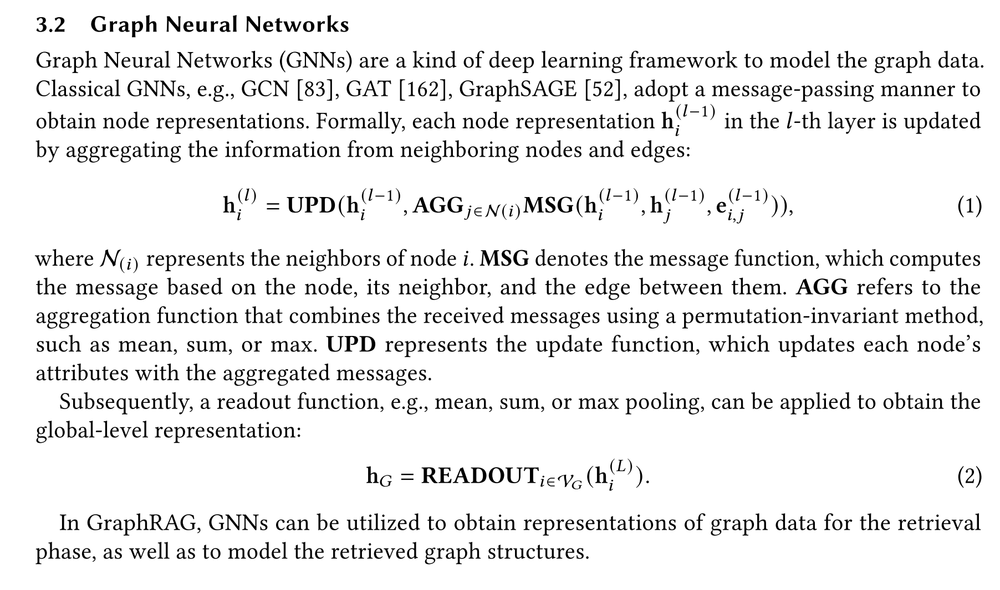
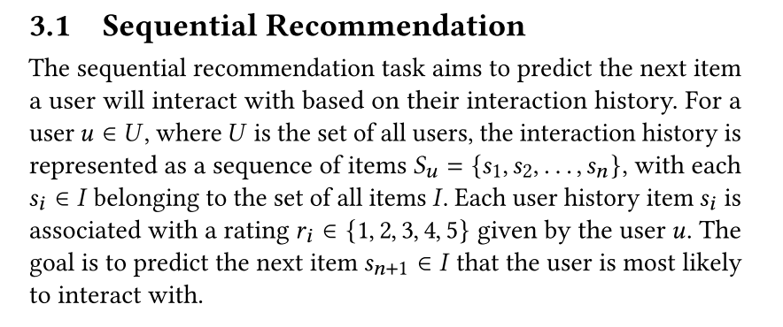

# AI-Applied-Algorithms

[toc]


## RAG

### Intro

* RAG（Retrieval Augmented Generation）顾名思义，通过***\*检索\****的方法来增强***\*生成模型\****的能力。


* 搭建过程：
  * 文档加载，并按一定条件**切割**成片段
  * 将切割的文本片段灌入**检索引擎**
  * 封装**检索接口**
  * 构建**调用流程**：Query -> 检索 -> Prompt -> LLM -> 回复
* 离线步骤：
  1. 文档加载
  2. 文档切分
  3. 向量化
  4. 灌入向量数据库

- 在线步骤：
  1. 获得用户问题
  2. 用户问题向量化
  3. 检索向量数据库
  4. 将检索结果和用户问题填入 Prompt 模版
  5. 用最终获得的 Prompt 调用 LLM
  6. 由 LLM 生成回复

### 业务场景

* 场景一：合作伙伴评估
  - “哪些企业最适合成为我们的战略合作伙伴？”
  - 对话式搜推 --> 追问用户企业
  - 知识图谱 --> 业务领域、技术优势、市场定位、信用评级、知识产权情况、诉讼记录
  - 寻求业务、技术能力的互补性 (工程施工 + 设计规划)
* 场景二：市场趋势洞察
  - “未来哪些行业领域可能出现爆发式增长，我们企业该如何提前布局？”
  - 对话式搜推 --> 追问用户行业
  - 知识图谱 --> 注册数量、资本投入、新增专利数量
  - 寻找不同行业之间的关联节点
* 场景三：潜在项目预测
  - “未来哪些项目最有可能适合我们企业参与投标？”
  - 对话式搜推 --> 追问用户技术优势
  - 知识图谱 --> 领域招投标项目数量增长趋势、政策法规、行业动态
  - 为用户提供潜在项目清单

### Literature Review

> LightRAG 5.2

#### LLM + Graphs

* GNNs as Prefix：
  * (GNNs) are utilized as the initial processing layer for graph data, generating structure-aware tokens that LLMs can use during inference
  * GraphGPT、LLaGA
* LLMs as Prefix
  * GALM、OFA
* LLMs-Graphs Integration
  * focuses on achieving a seamless interaction between LLMs and graph data, employing techniques such as fusion training and GNN alignment
  * developing LLM-based agents capable of engaging with graph information directly

> HybridRAG

#### KG

* knowledge extraction
  * The main tasks in this step are entity recognition, relationship extraction, and co-reference resolution. 
* knowledge improvement
  *  KG completion technique infers missing entities and relationships within the graph using methods such as link prediction and entity resolution. 
  *  Link prediction predicts the existence and type of a relation between two entities
     based on the graph structure and features
  *  entity resolution matches and merges different representations of the same entity
     from different sources
* knowledge adaptation

> Retrieval-Augmented Generation with Knowledge Graphs for Customer Service Question Answering: Related Work

#### KGQA: Question answering (QA) with knowledge graphs (KGs)

* retrieval-based
  * utilize relation extraction [19] or distributed representations [5] to derive answers from KGs, but they face difficulties with questions involving multi- ple entities.
* template-based
  * depend on manually-created templates for encoding complex queries, yet are limited by the scope of available templates [16].
* semantic parsing-based methods
  * map text to logical forms containing predicates from KGs [4] [14] [21]
* Evaluation
  * Mean Reciprocal Rank (MRR)
    * MRR gauges the average inverse rank of the initial correct response
  * recall@K
    * recall@K determines the likelihood of a relevant item’s appearance within the top K selections
  * NDCG@K
    * NDCG@K appraises the rank quality by considering both position and pertinence of items.
  * For question-answering performance, we juxtaposed the "golden" solutions against the generated responses, utilizing metrics such as BLEU [11], ROUGE [9], and METEOR [3] scores.

#### LLM4KGQA

* [7] provide a comprehensive review of this integration, categorizing the roles of LLMs as Predictors, Encoders, and Aligners
* For graph-based reasoning, Think-on-Graph [15] and Reasoning-on-Graph [10] enhance LLMs’ reasoning abilities by integrating KGs. 
* Yang et al. [20] propose augmenting LLMs’ factual reasoning across various training phases using KGs. 
* For LLM-based question answering, Wen et al.’s Mindmap [18] and Qi et al. [13] employ KGs to boost LLM inference capabilities in specialized domains such as medicine and food. These contributions underscore the increasing efficacy of LLM and KG combinations in enhancing information retrieval and reasoning tasks.

> MindMap

#### LLM + KG

> MindMap

* 融入训练：KGs emerged as a promising complement to the drawbacks of LLMs
  (Pan et al., 2023). 
  * For instance, KG triples were
    added to the training of LLMs (Zhang et al., 2019b)、Sun et al., 2021
  * KG encoders were entangled with LLM layers
    for joint inference and optimization on graph and
    text data (Zhang et al., 2022). 
  * applying KG prediction tasks, e.g., link prediction, as additional supervision (Ya-
    sunaga et al., 2022)
* synergistic inference of KGs and fixed LLMs
  * 22年左右，很多工作挖掘GNN、Graph Encoder、added interactions between text tokens and KG
    entities in the intermediate layers of LLMs (Zhang et al., 2022; Yao et al., 2023b)，后来才转向**prompting fixed pre-trained LLMs with graphical inputs**
  * Retrieval-Augmented LLM Inference
    * 《Knowledge-augmented language model prompting
      for zero-shot knowledge graph question answering.》 忽略了图结构信息
  * Graph Mining with LLMs
    * 实体/关系识别、图summary
      * prompting LLMs for KG entity linking prediction (Choudhary and Reddy, 2023; Sun et al., 2023), graph mining (Guo et al., 2023), and KG question answering (Baek et al., 2023)
      * 《GPT4Graph: Can large language models understand graph structured data? an empirical evaluation and benchmarking》
      * 《Exploring the potential of large language models (llms) in learning on
        graphs.》
      * 《Complex logical reasoning over knowledge graphs
        using large language models》
      * 局限性： rely heavily on the factual correctness of the KG and ignore the situation where
        the KG does not match the question
    * complex reasoning across multiple evidence graphs grounded on KGs
      * MindMap


### 关键字检索

* Elastic Search
  * Elasticsearch（简称ES）是一个广泛应用的开源搜索引擎: https://www.elastic.co/
  * 关于ES的安装、部署等知识，网上可以找到大量资料，例如: https://juejin.cn/post/7104875268166123528
  * 关于经典信息检索技术的更多细节，可以参考: https://nlp.stanford.edu/IR-book/information-retrieval-book.html
* **关键字检索的局限性**
  * 同一个语义，用词不同，可能导致检索不到有效的结果

### 向量库和向量检索

* Text Embeddings

  * **语义相似度**：向量之间距离
    * 欧氏距离
    * 余弦距离

* 向量数据库

  * 与传统的关系型数据库是互补的

* 主流向量数据库性能对比：

  * FAISS: Meta 开源的向量检索引擎 https://github.com/facebookresearch/faiss

  - Pinecone: 商用向量数据库，只有云服务 https://www.pinecone.io/

  * **Milvus**: 开源向量数据库，同时有云服务 https://milvus.io/
    * 性能优化较多
  * Weaviate: 开源向量数据库，同时有云服务 https://weaviate.io/
  * Qdrant: 开源向量数据库，同时有云服务 https://qdrant.tech/
  * PGVector: Postgres 的开源向量检索引擎 https://github.com/pgvector/pgvector
  * RediSearch: Redis 的开源向量检索引擎 https://github.com/RediSearch/RediSearch
  * ElasticSearch 也支持向量检索 https://www.elastic.co/enterprise-search/vector-search


* pgvector
  * PostgreSQL里面的一个vector search的插件
  * 缺点：
    * 向量维度最大只支持2000维，而现在很多新的模型生成的向量远远超过2000维，可能达到4096维以上（和采用了PostgreSQL底层存储有关）
    * 处理复杂应用场景时能力非常弱。这里的复杂场景指的是传统的关系型数据库中的操作，如filter、join和where等。例如，如果需要将两张表进行join然后再进行向量搜索，pgvector处理这种关系型操作的能力很差。
* PGVector.rs
  * 主要论点：vector是一种新的data type，而不是新的indexing构建方式
  * 基于关系型数据库来支持向量搜索，而不是开发一个新的specialized vector DB
  * 复杂场景：关系型数据库中的表与表之间的复杂查询操作。
    * 例如，支付宝的业务可能涉及几十张表，需要很多join和where语句来实现。这种复杂的关系型数据库查询需求是独立的vector DB无法满足的，因为它们通常只做向量搜索，没有大量的表与表之间的操作。
  * 对于那些专注向量搜索的应用，独立的vector DB确实可能是更好的选择。它们有更好的扩展能力，能更好地满足这类需求。因此，这两种场景并不冲突，具体选择取决于业务需求。如果业务需要处理复杂的关系型数据库查询，我们的pgvecto.rs会更适合，而如果业务重心在向量搜索，独立的vector DB可能更有优势。

* turbopuffer
  * 专门做多租户场景，这一单点差异化让它的商业化进程非常顺利。它针对有多租户需求的客户（比如Notion这样的应用）提供数据库服务。

### Embedding模型

* 向量模型怎么训练：

  * 构建相关（正例）与不相关（负例）的句子对儿样本

  * 训练双塔式模型，让正例间的距离小，负例间的距离大

  * https://www.sbert.net/

* OpenAI 新发布的两个 Embedding 模型
  * text-embedding-3-large、text-embedding-3-small
  * 特点：**越大越准、越小越快**
    * 支持自定义的缩短向量维度，从而在几乎不影响最终效果的情况下降低向量检索与相似度计算的复杂度
    * 计算时用前N维
  * 可变长度的 Embedding 技术：
    * https://arxiv.org/abs/2205.13147 Matryoshka Representation Learning
  * 

* 开源库：
  * https://github.com/FlagOpen/FlagEmbedding

* Note：
  * 可能支持跨语言

### 算法进阶

*  文本分割的粒度
   * 缺陷
     * 粒度太大可能导致检索不精准，粒度太小可能导致信息不全面
       * 比如切分自然段，粒度太大
     * 问题的答案可能跨越两个片段
   * 改进: 按一定粒度，部分重叠式的切割文本，使上下文更完整

*  检索后排序
   * 问题: 有时，最合适的答案不一定排在检索的最前面
   * 方案:
     * 检索时过招回一部分文本
     * 通过一个排序模型对 query 和 document 重新打分排序
   * 一些 Rerank 的 API 服务
     * [Cohere Rerank](https://cohere.com/rerank)：支持多语言
     * [Jina Rerank](https://jina.ai/reranker/)：目前只支持英文


* **混合检索（Hybrid Search）**
  * 参考 「LLM + Search」
  * 很多向量数据库都支持混合检索，比如 [Weaviate](https://weaviate.io/blog/hybrid-search-explained)、[Pinecone](https://www.pinecone.io/learn/hybrid-search-intro/) 等。也可以根据上述原理自己实现。

* RAG Fusion


*  [query rewriting and query expansion](https://www.google.com/search/howsearchworks/how-search-works/ranking-results/#meaning)
*  PDF中的表格如何处理
   * TableTransformer模型 + GPT-4V
     * TableTransformer找到表格
     * 用 GPT-4 Vision 生成表格（图像）描述，并向量化用于检索
   * 一些面向 RAG 的文档解析辅助工具

     - [PyMuPDF](https://pymupdf.readthedocs.io/en/latest/): PDF 文件处理基础库，带有基于规则的表格与图像抽取（不准）
     - [RAGFlow](https://github.com/infiniflow/ragflow): 一款基于深度文档理解构建的开源 RAG 引擎，支持多种文档格式
     - [Unstructured.io](https://unstructured.io/): 一个开源+SaaS形式的文档解析库，支持多种文档格式
     - [LlamaParse](https://docs.llamaindex.ai/en/stable/llama_cloud/llama_parse/)：付费 API 服务，由 LlamaIndex 官方提供，解析不保证100%准确，实测偶有文字丢失或错位发生
     - [Mathpix](https://mathpix.com/)：付费 API 服务，效果较好，可解析段落结构、表格、公式等，贵！


### Rank

#### Literature Review

* rank
  * encoders of T5-based instruction-following pretrained mod-
    els, namely T0-3B (Sanh et al., 2022) and FLAN-
    T5 (Chung et al., 2022), empirically leads to supe-
    rior performance as found in prior work (Sachan
    et al., 2022). We follow the EncT5 approach (Liu
    et al., 2021) and prepended each sequence with a
    start-of-sequence token. The token representation
    is then fed to a newly initialized feed-forward net-
    work. Unlike MonoT5 (Nogueira et al., 2020), we
    use their encoders only to reduce parameters and
    improve inference-time efficiency [Task-aware Retrieval with Instructions]

### GraphRAG

> [Graph Retrieval-Augmented Generation: A Survey 论文解读](https://mp.weixin.qq.com/s/Dx8pYhmbrhtRMXNez_GOmw)

* Intro
  * 利用了实体之间的结构信息，实现了更精确、全面的检索，捕捉了关系知识，促进了更准确、上下文感知的响应
  * Graph-Based Indexing, Graph-Guided Retrieval, and Graph-Enhanced Generation
* 难点：
  * **忽视关系：**传统RAG方法主要基于文本的语义相似性，而忽视了文本之间的结构关系。例如，在引用网络中，传统RAG方法可能无法捕捉到论文之间的引用关系。
  * **冗余信息：**RAG通常以文本片段的形式提供信息，当这些片段拼接在一起作为提示时，可能会导致上下文过长，出现“lost in the middle”的问题。
  * **缺乏全局信息：**RAG只能检索到文档的子集，而无法全面理解全局信息，这在查询聚焦摘要（QFS）等任务中可能存在问题。


* GraphRAG的思路：
  * GraphRAG的核心思想是将知识图谱中的结构化信息（如节点、三元组、路径或子图）与LLMs的输出相结合，以提供更准确和丰富的生成结果。
  * 使用结构化知识图谱来更有效地处理冗余信息和全局信息的问题，更方便地进行信息的检索和聚合


* Preliminaries

  * Text-Attributed Graphs (TAGs)
    * 
  * GNN
    * 

* Graph-Based Indexing

  * 数据
    * 开放知识图谱：公开可用的知识图谱，一般主要包括三类：百科知识图谱（如WikiData）、常识知识图谱（ConceptNet）以及领域知识图谱。
    * 自构建图数据：这些是研究人员根据特定任务需求构建的自定义图数据。例如，可能从文档、表格或其他数据库中提取实体和关系，并将它们组织成图结构。
  * 索引
    * 图索引：图索引保留了图的完整结构，使节点和边的访问变得容易。在后续的GraphRAG过程中，可以使用经典的图搜索算法（如BFS和最短路径算法）来快速检索信息。
    * 文本索引：这种方法将图数据转换为文本描述，以便使用各种文本检索技术（如稀疏检索和密集检索）进行优化。
    * 向量检索：这种方法将图数据转换为向量表示，以利用高效的向量搜索算法（如局部敏感哈希）进行快速检索。

* Graph-Guided Retrieval

  * 

  * **检索器的选择：**在图检索中，选择适当的检索器是至关重要的。研究人员可以根据任务需求和数据类型选择以下类型的检索器。
    * 非参数化检索器：基于传统的图搜索算法（如BFS和DFS），不依赖于深度学习模型，适用于高效的大规模数据检索。
    * 语言模型检索器：基于语言模型（如BERT、GPT等），利用其强大的自然语言理解能力，适用于处理复杂的用户查询。
    * 图神经网络检索器：基于图神经网络（如GCN、GAT等），利用其对图结构数据的表示能力，适用于处理复杂的图结构数据。
  * Retrieval Paradigm
    * Once Retrieval
    * **Iterative Retrieval**
      * **Non-Adaptive Retrieval**
      * **Adaptive Retrieval.**
    * **Multi-Stage Retrieval.**

* Graph-Enhanced Generation
  * 


* 训练
  * Retriever训练
    * Training-Free
    * Training-Based
  * Generator训练
    * Training-Free
    * SFT
    * GNN

* 应用
  * 下游任务：问答（知识库问答、常识问答）、信息抽取（实体链接、关系抽取）、事实验证、链接预测、对话系统、推荐系统等。
  * 应用领域：GraphRAG的应用领域主要包括：电商、生物医疗、学术、文献学、法律
    * 电商：
      * RETE: Retrieval-Enhanced Temporal Event Forecasting on **Unified Query Product Evolutionary Graph.**
        * auto-regressive
      * Retrieval-Augmented Generation with Knowledge Graphs for Customer Service Question Answering

* 开源代码
  * 微软GraphRAG：[GitHub - microsoft/graphrag: A modular graph-based Retrieval-Augmented Generation (RAG) system](https://github.com/microsoft/graphrag)
  * 蚂蚁GraphRAG：https://github.com/eosphoros-ai/DB-GPTNeo4j 
  * NallM：https://github.com/neo4j/NaLLMNeo4j 
  * LLM Graph Builder：https://github.com/neo4j-labs/llm-graph-builderNebulaGraph 
  * GraphRAG：https://www.nebula-graph.io/posts/graph-RAG


### LightRAG

> https://github.com/HKUDS/LightRAG
>
> [从原理、本地Qwen2.5-3B模型部署到源码解读，全流程解析LightRAG](https://www.bilibili.com/video/BV1CwCRYGE6J)
>
> * 思路：
>
>   - 数据增强：LLM
>
>   - 剪枝：
>     - LLM realtime update Graph：图节点/边去重
>     - high-level concept / low-level entity

* Intro
  * **incorporates graph structures into text indexing** and retrieval processes
  * a **dual-level retrieval** system that enhances comprehensive information retrieval from both low-level and high-level knowledge discovery
  * an incremental update algorithm that ensures the timely integration of new data


* RAG的设计
  * Comprehensive Information Retrieval: The indexing function φ(·) must be adept at extracting global information, as this is crucial for enhancing the model’s ability to answer queries effectively.
  * Efficient and Low-Cost Retrieval: The indexed data structure Dˆ must enable rapid and cost- efficient retrieval to effectively handle a high volume of queries.
  * Fast Adaptation to Data Changes: The ability to swiftly and efficiently adjust the data structure to incorporate new information from the external knowledge base, is crucial for ensuring that the system remains current and relevant in an ever-changing information landscape.


* Framework
  * we leverage LLMs to identify and extract various entities (e.g., names, dates, locations, and events) along with the relationships between them.
  * Graph-Based Text Indexing
  * DUAL-LEVEL RETRIEVAL PARADIGM
* Graph-Based Text Indexing
  * Extracting Entities and Relationships. R(·)
  * LLM Profiling for Key-Value Pair Generation. P(·)
    * Entities use their names as the sole index key,
    * whereas relations may have multiple index keys derived from LLM enhancements that include global themes from connected entities.
  * Deduplication to Optimize Graph Operations. D(·)
* 两路召回 DUAL-LEVEL RETRIEVAL PARADIGM
  - Specific Queries -> Low-Level Retrieval
    - “Who wrote ’Pride and Prejudice’?”
    - -> 召回title
  - Abstract Queries -> High-Level Retrieval
    - “How does artificial intelligence influence modern education?”
    - -> 召回关系
  - Integrating Graph and Vectors for Efficient Retrieval.
    - Query Keyword Extraction: 
      - local query keywords k(l) and global query keywords k(g).
    - Keyword Matching：
      - match local query keywords with candidate entities and global query keywords with relations linked to global keys
    - Incorporating High-Order Relatedness.
      - 基于前面已召回的节点和边，再多一跳

* Evaluation

  * 基线：
    * Naive RAG
    * RQ-RAG：These sub-queries are designed to enhance search accuracy by utilizing explicit techniques such as rewriting, decomposition, and disambiguation
    * GraphRAG:
      * It generates corresponding descriptions for these elements, aggregates nodes into communities, and produces a community report to capture global information
  * **LightRAG做单一领域的任务比GraphRAG强**
    * 

  * 结论：
    * The Superiority of Graph-enhanced RAG Systems in Large-Scale Corpora
    * Enhancing Response Diversity with LightRAG
    * LightRAG’s Superiority over GraphRAG
      * **Enhanced Response Variety**: By integrating low-level retrieval of specific entities with high-level retrieval of broader topics, LightRAG boosts response diversity. This dual-level mechanism effectively addresses both detailed and abstract queries, ensuring a thorough grasp of information.
      * **Complex Query Handling**: This approach is especially valuable in scenarios requiring diverse perspectives. By accessing both specific details and overarching themes, LightRAG adeptly responds to complex queries involving interconnected topics, providing contextually relevant answers.
    * 对high/low level retrieval的分析：
      * 去掉High：it struggles to gather information for complex queries that demand comprehensive insights
    * Semantic Graph Excels in RAG.
      * We eliminated the use of original text in our retrieval process. Surprisingly, the resulting variant, -Origin, does not exhibit significant performance declines across all four datasets. In some cases, this variant even shows improvements (e.g. in Agriculture and Mix). We attribute this phenomenon to the effective extraction of key information during the graph-based indexing process, which provides sufficient context for answering queries. Additionally, the original text often contains irrelevant information that can introduce noise in the response.
      * 启发：信息并不是越多越好 -> 对rerank的启发

* Prompts
  * Prompts for Graph Generation：7.3.1 
  * Prompts for Query Generation：7.3.2
  * Prompts for Keyword Extraction：7.3.3
  * Prompts for RAG Evaluation


### LLM4KGQA

> KGQA: Knowledge Graph Question Answering

#### FinDKG

* 抽取KG的prompt


* 动态图
  * GNN，时序信息建模

#### HybridRAG: Integrating Knowledge Graphs and Vector Retrieval Augmented Generation for Efficient Information Extraction

* Intro
  * KG：将文档视为两个实体和关系的triplet
  * 当前 RAG 技术包括基于向量数据库的 VectorRAG 和基于知识图谱（KG）的 GraphRAG，各有局限，如 VectorRAG 对金融文档的段落分块假设不合理，GraphRAG 在抽象问答任务或问题未提及明确实体时表现不佳。
* KG构建
  * each triplet is represented as **a nested list [’h’, ’type’, ’r’, ’o’, ’type’, ’metadata’]**,
    * ’h’ and ’o’ denote the head and object entities respectively,
    * ’type’ specifies the entity category,
    * ’r’ represents the relationship,
    * ’metadata’ encapsulates additional contextual information.
    * This format allows for a rich, multidimensional representation of information, facilitating
      more nuanced downstream analysis.
  * 少于4 word
  * 实体消重
  * 实现：NetworkxEntityGraph
* 评估
  * faithfulness, answer relevance, and context relevance      （HybridRAG）
    * 使用 RAGAS 框架


#### Retrieval-Augmented Generation with Knowledge Graphs for Customer Service Question Answering [SIGIR 2024]

* Intro
  * intra-issue structure and inter-issue relations
  * 过往工作的 Limitations
    * Limitation 1 - Compromised Retrieval Accuracy from Ignoring Structures
    * Limitation 2 - Reduced Answer Quality from Segmentation
* 意图识别
  * 3.2.1 intent识别，。识别陈述句和疑问句区别不大 核心是识别对象，因此用一个template识别k到v的映射
* 知识图谱构建
  * 显式和隐式建立ticket之间关系
    * 显式：已有数据
    * 隐式：title embedding，余弦相似度，阈值

* Embedding-based Retrieval of Sub-graphs. (3.2.2)
  * EBR-based ticket identification step
    * 计算ticket的相关性：涉及多个entity，每个entity算相关性然后分数相加召回
    * 引申：图的二跳问题
  * LLM-driven subgraph extraction step
    * 从工单中查找想要的属性

#### MindMap: Knowledge Graph Prompting Sparks Graph of Thoughts in Large Language Models

> https://github.com/wyl-willing/MindMap
>
> 思路很清晰：既利用KG加强召回率和精准度，又融入GoT挖掘LLM的内在知识


* Evidence graph mining
  * 实体识别：
    * **Prompt：Table 9 of Appendix D.**
    * BERT similarity to match entities and keywords
  * Evidence Sub-graphs Exploration
    * 基于提取的实体从源 KG 构建证据子图，包括基于路径的探索和基于邻居的探索两种方法，并对生成的子图进行修剪
    * 算法见Appendix E
    * Path-based
    * Neighbor-based
      * 一跳必加
      * 二跳根据和query的相关性加
* Evidence graph aggregation
  * 从前面步骤中提取至少 k 个基于路径和 k 个基于邻居的证据子图，将每个子图格式化为实体链并转换为自然语言描述，定义为推理图。
  * 顺带能解决实体重复的问题
* LLM reasoning on the mind map
  * 相比来说，以前的LLM4KG： they do not think
    on multiple evidence KG sub-graphs with multi-
    thought in LLM, and without backtracking evi-
    dence sources

* Evaluation
  * hallucination quantification：引入指标定义
  * train a keyword extraction model(NER-MT5) based on mT5-large
  * "combine with the knowledge you already have“ 能提升效果


* Prompt

实体抽取

```
template = """
There are some samples:
\n\n
### Instruction:\n’Learn to extract entities from the following
medical questions.’\n\n### Input:\n
<CLS>Doctor, I have been having discomfort and dryness in my vagina
for a while now. I also experience pain during sex. What could be
the problem and what tests do I need?<SEP>The extracted entities
are\n\n ### Output:
<CLS>Doctor, I have been having discomfort and dryness in my vagina
for a while now. I also experience pain during sex. What could be
the problem and what tests do I need?<SEP>The extracted entities
are Vaginal pain, Vaginal dryness, Pain during intercourse<EOS>
\n\n
Instruction:\n’Learn to extract entities from the following medical
answers.’\n\n### Input:\n
<CLS>Okay, based on your symptoms, we need to perform some diagnostic
procedures to confirm the diagnosis. We may need to do a CAT scan
of your head and an Influenzavirus antibody assay to rule out any
other conditions. Additionally, we may need to evaluate you
further and consider other respiratory therapy or physical therapy
exercises to help you feel better.<SEP>The extracted entities are
\n\n ### Output:
<CLS>Okay, based on your symptoms, we need to perform some diagnostic
procedures to confirm the diagnosis. We may need to do a CAT scan
of your head and an Influenzavirus antibody assay to rule out any
other conditions. Additionally, we may need to evaluate you
further and consider other respiratory therapy or physical therapy
exercises to help you feel better.<SEP>The extracted entities are
CAT scan of head (Head ct), Influenzavirus antibody assay,
Physical therapy exercises; manipulation; and other procedures,
Other respiratory therapy<EOS>
\n\n
Try to output:
### Instruction:\n’Learn to extract entities from the following
medical questions.’\n\n### Input:\n
<CLS>{input}<SEP>The extracted entities are\n\n ### Output:
"""
```

生成答案、GoT

```Python
SystemMessage(content= """You are an excellent AI doctor, and you can diagnose diseases and recommend medications based on the symptoms in the conversation."""),
HumanMessage(content"""Patient input:"""+ Question),
AIMessage(content=f """Combine the knowledge you already have, you have some extra medical knowledge information in the following:\n\n ### """+ path_reasoning_graph + """\n\n###""" + neighbor_reasoning_path),
HumanMessage(content="""What disease does the patient have? What tests should patient take to confirm the diagnosis? What recommened medications can cure the disease? Think step by step.\n\n\n
Output1: The answer includes disease and tests and recommened medications.\n\n
Output2: Show me inference process as a string about extract what knowledge from which Path-based Evidence or Neighor-based Evidence, and in the end infer what result. \n Transport the inference process into the
following format:\n Path-based Evidence number('entity name'->'relation name'->...)->Path-based Evidence number('entity name'->'relation name'->...)->Neighbor-based Evidence number('entity name'->'relation name'->...)-
>Neighbor-based Evidence number('entity name'->'relation name'->...)->result number('entity name')->Path-based Evidence number('entity name'->'relation name'->...)->Neighbor-based Evidence number('entity name'->'relation
name'->...). \n\n
Output3: Draw a decision tree. The entity or relation in single quotes in the inference process is added as a node with the source of evidence, which is followed by the entity in parentheses.\n\n
There is a sample:\n ... """)
```

传统RAG

```
template = """
You are an excellent AI doctor, and you can diagnose diseases and Patient input:\n conversation.\n\n recommend medications based on the symptoms in the
{question}
\n\n
You have some medical knowledge information in the following:
{instruction}
What disease does the patient have? What tests should patient \n\n
take to confirm the diagnosis? What recommened medications can
cure the disease?
"""
```

LLM Evaluation

* “If they are the same, output "2". Try to output "1" or "0"”

```
def prompt_comparation(reference,output1,output2): template = """
Reference: {reference} \n\n
output1: {output1}
\n\n
output2: {output2}
\n\n
According to the facts of disease diagnosis and drug and tests recommendation in reference output, which output is better match. If the output1 is better match, output ’1’. If the
output2 is better match, output ’0’. If they are same match,
output ’2’.
"""
prompt = template.format(reference=reference, output1=output1,
output2=output2)
response = openai.ChatCompletion.create( messages=[ model="gpt-4", {"role": "user", "content": prompt} {"role": "system", "content": """You are an excellent AI doctor."""},
]
response_of_comparation = response.choices[0].message.content return response_of_comparation
```


### 竞品


## 推理 Agent

### 业务场景

* 基座推理模型的训练数据场景
  * 编程
  * 推理
  * 数学
  * --> 增加浏览能力

* 在线研究：因为很多职业都需要做大量的资料搜集、信息整合，最后写成报告
  * “我希望模型能帮我找到几款产品，并根据 Reddit 上的评价给排个序”
  * “我希望它能帮我针对某个主题写一篇文献综述”
  * 找出 Liam Felis 和 Barrett Zoff 合著的所有论文
  * 找出我们一个同事的中间名
  * 做旅行计划
* 软件工程
* 电商
  * “我喜欢这几个牌子，请帮我找找还有哪些新牌子能买到类似这款的特定外套”
  * “我想要一件人造皮草的外套，要这个长度，是这一季的新款”
  * 找一个有非常具体要求的 Airbnb 房源

### RFT (Reinforcement Fine-tuning)

* **针对某个特定任务去训练模型，那它在这个任务上的表现肯定会更好**
  * 在一个类型的任务上训练，模型的能力也能迁移到其他领域
  * 如果你手头有个非常具体的任务，而且你觉得这个任务和你已知的模型训练数据差别很大，你自己试了很多次，换了各种提示语，效果就是不理想——比如说，**某个特别专业的基因测序任务，或者其他对模型来说完全是“圈外”（out of distribution）的知识，模型压根不知道从何下手——那我觉得，这时候就值得考虑试试强化学习微调。**
  * 如果某个任务对你的核心业务流程来说至关重要，性能提升个 10%、15% 就能决定生死存亡，那或许也应该尝试 RFT。

### Deep Research

#### Intro

>  https://mp.weixin.qq.com/s/hTRDTu7y6_PuNOZwoxRJIg

* Deep Research产生于OpenAI研究员的副业中，设计之初就定位为专注**海量信息整合类的“只读”任务，避免高风险操作，比如其他agent喜欢演示的**简单交易场景。

  * 第一，现实中大量的知识型工作，核心内容其实就是信息整合，所以这对从事这类工作的人会非常有价值。

    第二，OpenAI 的长远目标是创造能够做出新科学发现的通用人工智能（AGI）。我们觉得，能够高效整合信息是实现这个目标的基础。你想想，如果连文献综述都写不好，又怎么可能写出开创性的科学论文呢？所以，这个方向和公司的大目标是高度一致的。

* Deep Research采用**强化微调（RL Fine-Tuning）**，结合人类专家数据与合成数据集。

* Deep Research数据选取上采取的“广撒网”的策略，广泛收集了各种专业领域的信息收集场景数据，并未深入某个特别领域。因为强化学习能够**在训练中自己摸索出从问题到答案的路径**。

  * 通往通用智能体的清晰路径，由高质量数据整理、完备工具集成、可衡量任务设计，以及预训练与强化学习的循环互促共同构成。

* 当你有一个非常具体、定义明确的问题时，这个问题需要引导模型去检索特定的信息源，或者聚焦在某些方面Deep Research 通常表现更好，而不是O3。

  * 当然基础模型也很重要，在一个类型的任务上训练，模型的能力也能迁移到其他领域。比方说，你主要用数学、编程和其他推理类问题训练出来的O3模型，它写东西的能力也会不错。

* **Deep Research 会一直专注于那些需要最长处理时间的复杂任务。而像 o3 或者 O-next（下一代模型）可能会在“快”和“深入”之间找到更好的平衡点。**

* 未来Deep Research的产品路线，下一步是让它能**访问私人数据**，再往后是执行写入操作或者调用 API 了。

  * 从只读到可写的发展趋势


* DeepResearch v.s. O3
  * **这个问题需要引导模型去检索特定的信息源，或者聚焦在某些方面，那么用 Deep Research 会更有效？**

* 未来期望：
  * 通用智能体，做更多类型的事情 --> 人希望和更少的同事协作

#### Data + Algo

* 针对浏览任务进行训练应该是可行的

* 合成数据+真人专家数据
  * 在 OpenAI 这样的地方工作，可能就有条件做一些通常不建议初创公司做的事，就是同时面向非常广泛的用户群体，去请教各个不同领域的专家，看看能不能让模型一下子在所有方面都做得不错

#### Tools

* 浏览工具，是个基于文本的浏览器，但它能看到网页里嵌入的图片，也能打开 PDF 文件
* 调用 Python 工具，用来做数据分析、计算、画图表

#### 挑战

##### 延时

* PE：“在接下来五分钟内，尽你所能做到最好就行。”
* 模型要学会判断“思考多久才够”。但是，**我估计 Deep Research 会一直专注于那些需要最长处理时间的复杂任务。而像 o3 或者 O-next（下一代模型）可能会在“快”和“深入”之间找到更好的平衡点。**

##### 安全性

##### 上下文管理

##### 幻觉

* **大多数情况是因为它错误地解读了某个信息来源。**这也是我们为什么坚持要**加上引用**的原因之一——**让用户能方便地核对信息来源**


## Multi-modal Search

### Intro

### Literature Review

* DML is to learn image embeddings to reflect the seman-
  tics among samples. [BtCT]
  * loss functions [6, 14, 20, 25]
  * sampling strategies [23, 32, 36]. 
  * interpret the decision made by the models. Inspired by DIML [35], [BtCT] leverage the spatial structure for improved and interpretable metric learning.

* Image Search [BtCT]
  * In [10], image descriptors generated by vision transformers are used for the image retrieval task. Although improvements over CNNs are reported, it is not clear why vision transformers perform better. 
    * uses transformers’ class token only, 
  * [BtCT] : **consider both CLS token and patch tokens for image retrieval** to improve interpretability and accuracy.

* Optimal Transport for Feature Matching [BtCT]
  * Similar to image retrieval, inputs to feature matching are image pairs. The goal of feature matching is to establish pointwise correspondence using local features.
  * Recently, methods combining the attention mechanism with CNNs features are the state of the art. 
    * Given keypoint descriptors, SuperGlue [24] uses
      a graph neural network and attention layers to solve an assignment problem.
    * In [17], an Optimal Transport (OT) layer is adopted to obtain the semantic correspondence.
    * Matching quality is improved by suppressing one-to-many matchings. LoFTR [27] proposes a two-stage method using coarse and fine level features with optimal transport.
    * Given the feature maps of two images, COTR [13] concatenate and feed feature maps to a transformer with query point as input. The output is further fed into a decoder to infer the correspondence.
  * Among these approaches, we find two common differences with image retrieval. * 
    * First, all methods require CNNs backbone for feature extraction.
    * Second, feature matching heavily depends on datasets with dense feature correspondence for training. Examples are ScanNet[8] and MegaDepth [16].
    * In our work, unlike feature matching, optimal transport is exploited within a metric learning framework, in which only image level labels are available.

* Interpretable Deep Vision Models [BtCT]
  * For vision transformers, a common class-agnostic method to understand its predictions is to consider the attentions as relevancy scores.
  * Instead of taking a single attention layer, attention rollout [1] proposed to combine all attention maps in a linear way and to reassign all attention scores.
  * 《Towards interpretable deep metric learning with structural matching》

* Transformers for high-resolution images [PEaLF]
  * [50] designed a pyramidal architecture and addresses
    complexity by gradually reducing the spatial resolution of keys and values.
  * lowering spatial resolution at each layer for efficient computations
    * [17] utilized pooling to reduce the resolution
      across the spatial and temporal dimensions,
    * [27] used local attention with
      shifted windows and patch merging.
    * XCiT [1] proposed to replace the
      quadratic self-attention operation with a “transposed” attention operation be-
      tween channels which they call “cross-covariance attention” (XCA).
      * 特点是深层网络也保留局部特征


### 预处理

* 物体检测
* 类目预测
* Query Expansion
  * random crop

### 视觉特征

#### Intro

* Global feature和local feature
  * global feature
    * compact representation
    * can be learned so that it is in-
      variant to viewpoint and illumination
    * the risk of losing information about
      the spatial arrangement of visual elements


#### 各类backbone

[SIFT Meets CNN: A Decade Survey of Instance Retrieval](https://arxiv.org/pdf/1608.01807.pdf)


* [Image Similarity for Brand Detection: A Comparison Between BEiT, SWIN and ViT-MAE](https://bolster.ai/blog/image-similarity-beit-swin-vit-mae)
  * 场景：brand识别，识别phishing attack.
  * 算法方案讨论：
    * CNN分类：label质量要求高、数据分布均匀性要求高
  * 历史方案：
    * CV Hashing: Secure Hashing Algorithm or SHA-> a 64 bit hexadecimal encoding，只能召回原图。。。
  * Embedding Model
    * BERT Pre-training of image transformers (BEiT)
    * SWIN
    * ViT-MAE
    * 结论：SWIN最强

* [国旗识别 - Build an AI Image Similarity Search with Transformers — ViT, CLIP, DINO-v2, and BLIP-2](https://medium.com/@tapanbabbar/build-an-image-similarity-search-with-transformers-vit-clip-efficientnet-dino-v2-and-blip-2-5040d1848c00)
  * **CLIP** (Contrastive Language-Image Pre-training): Built by OpenAI, it learns to match images with text. Not a bad choice for our similarity search.
  * **ViT** (Vision Transformer): ViT revolutionizes image processing by treating images as sequences, similar to how Transformers handle text.
  * **BLIP**: A vision-language model with a focus on aligning visual and textual content.
  * **EfficientNet**: Known for its efficiency, this model is great for image recognition tasks.
  * **DINO**: A self-supervised transformer model that excels at learning features from images.
  * **VGG16**: A classic convolutional neural network (CNN) that’s been around for years and still holds its own in image recognition tasks.
  * Caution: Contextual Bias in Similarity Models

* https://github.com/huggingface/notebooks/blob/main/examples/image_similarity.ipynb
  * 完整的torch demo

#### 提取 Embedding

- CNNs such as ResNet
  - 对最后一层卷积层的feature maps，做global average pooling and fully connected layer 
- Vision Transformers such as ViT
  - Hidden State的第一个Embedding，对应于 CLS Token 的 Embedding
- SwinV2
  - 所有Hidden State的 avg pooling 结果

#### Beyond the CLS Token: Image Reranking using Pretrained Vision Transformers

> * 技术关键点和结论：
>   - vit/swin/dinov2的patch embedding作为图像局部特征
>     - swin最强
>   - 引入DIML技术，用optimal transport做排序
>   - 技术适用场景：
>     - 在CvT（vit + convolution）上，这个技术效果好
>     - Visual Place Recognition评测，这个技术效果很好

* Intro
  * exploit a pretrained model for optimal spatial weights
    assigned to local patch tokens.
  * local patch similarity equipped with
    an optimal transport solver could improve image retrieval accuracy compared to the one using global similarity only
  * Apart from the added interpretability, leveraging local feature maps does not require extra learning at all. 
    * In CNNs, patch level features are available before the aggregation of global
      average pooling and projection of fully connected layers.
    * For ViT, local patch tokens are trained together with a special CLS token. All tokens interact each other with self-attentions. To adapt a permutation-invariant transformer to work on images, position embeddings are added to the patch embedding.

* Related Work
  * Deep metric learning (DML)  
  * ResNet
    * Hierarchical design
    * translation invariance
    * local receptive field
  * **Towards interpretable deep metric learning with structural matching**

* DML
  * For CNNs such as ResNet, f is obtained by global average pooling and fully connected layer on the feature maps of the final convolutional layer.

* DIML
  * 

* ViT with Convolutions
  * 动机：For structural similarity learning, good properties of the representation should be locally smooth and semantically discriminative. Comparing to ResNet and vanilla ViT, we hypothesize that the introduction of convolution to ViT satisfies the two requirements.
  * 结论：Comparing to ResNet and vanilla ViT, we
    hypothesize that the introduction of convolution to ViT satisfies the two requirements.
    * semantic intra-class features are correlated
    * inter-class semantics are distinguished.

* Structural Metric Learning using Transformers

  * 

  * Relevancy Score as Marginal Distribution
    * Cross-correlation is proposed in [35]
    * Aggregated attention is obtained by multiplying attention maps from all attention layers.
      * It was originally used for the purpose of interpreting transformers classification [1].
      * In our method, the relevancy map is used to guide the optimal transport optimization for structural similarity.
      * The relevancy map can be obtained by a forward pass of transformers
      * it is theoretically applicable to almost all the transformers architectures [1] that use global attentions such as DeiT and CvT.
    * 

  * OT的改进：“partial”，缓解视角/Scale差异的影响
    * 

* 结论：
  * Swin最强
  * 在CvT上，这个技术效果好
  * 
  * Visual Place Recognition评测，这个技术效果很好

#### Patch Embedding as Local Features: Unifying Deep Local and Global Features Via Vision Transformer for Image Retrieval

> https://github.com/PXThanhLam/ViTGaL
>
> - 技术关键点和结论：
>   - vit的patch embedding可作为图像局部特征
>   - 先通过图像全局特征做召回，再基于图像局部特征做Rank，效果较好
>   - multi-astrous，patch embedding通过空洞卷积，有效果提升
>   - 用 a small autoencoder (AE) 做特征降维

* ViTGaL
  * Vision Transformer based Global and Local features (ViT-
    GaL). 
  * add a multi-atrous convolution to the output of the
    transformer encoder layer of ViTs to simulate the image pyramid used in
    standard image retrieval algorithms.
  * use class attention to aggregate the token embeddings output from the multi-atrous layer to get both global and local features.

* Intro

  * **ViT的深层patch embedding，具备局部特征**
    * a recent study [39] found that spatial information from the input is
      preserved in ViT even as the final layer.
    * using patch embeddings from the final layer of ViT yields the best result
    * Vit embedding的可视化
      * Peeling Back the Layers: Interpreting the Storytelling of ViT https://mp.weixin.qq.com/s/gzTRfu3SU1_6ZJsH2ngduA
        * 注意力向量的L2范数（长度视为信息量的度量）在网络的不同层呈现出一种抛物线型的变化趋势：先上升，达到峰值后又下降。
        * 这似乎暗示着视觉理解在中层达到了一个饱和状态，之后部分非核心信息被舍弃，最终提炼出高度凝练的语义表征
  * ViT的问题
    * 景色识别，高精度图片很重要，模型难训练
      * 方案1：The dominant approach is reducing the
        spatial dimension of input resolutions at every block of layers, similar to CNN
        [27,26,50]
      * 方案2：XCiT [1] replaced a self-attention between tokens with a
        “transposed” attention between channels which they call “cross-covariance attention” (XCA).

  * image pyramid
    * we proposed to simulate an image pyramid with multi-atrous convolutions [10]


* 模型
  * merge all the attention scores in different attention
    heads in the class attention layer and extract associated patch embeddings with
    the top scores.
    * class attention layer. This layer is identical to the
      transformer encoder block used in ViT, except the self-attention operation is
      only calculated between the cls token embedding (treated as a query) and the
      token embeddings of image patches (treated as keys and values).

* Local feature降维
  * [23] shows that
    whitening down weights co-occurrences of local features, which is generally ben-
    eficial for retrieval applications.
  * using a small autoencoder (AE) module [21] following
    the state-of-the-art dimensionality reduction method used in [9]
    * use the attention scores from the autoencoder network as key point detection scores to extract top local descriptors
    * For local features matching, we use RANSAC [18] with an affine model

* 结论：
  * multi-atrous效果好，不需要multi-scale
  * rerank效果好


### 竞品

* Aliyun
  * https://help.aliyun.com/zh/image-search/developer-reference/api-searchbypic?spm=a2c4g.11186623.help-menu-66413.d_4_3_1_3.7538364fjOQka0&scm=20140722.H_202282._.OR_help-V_1

* Google：https://cloud.google.com/blog/products/ai-machine-learning/multimodal-generative-ai-search
  * https://ai-demos.dev/demos/matching-engine
  * https://atlas.nomic.ai/map/vertexAI-mercari 可视化
  * 


### Cases

* 电商

  * *"cups with dancing people"*

  * *"handmade accessories with black and white beads"*

  * *"Cups in the Google logo colors"*

  * *"Shirts that says my birthday"*

* 自动驾驶
  * "a crossing road with red lights on and pedestrians are standing,"
  * "a crushed car stopping in the middle of the freeway ahead" 
* 安防
  * a person trying to open the doors,
  * water is flooding in the factory
  * the machines are on fire.

## LLM4Rec

### Intro

* https://github.com/WLiK/LLM4Rec-Awesome-Papers
* [LLM+Recommendation大模型推荐近期进展|含WWW, SIGIR, AAAI等顶会文章](https://mp.weixin.qq.com/s/m8DMgSt_r-HVNHHzA8ceVw)
* KDD 2024 工业界搜广推工作整理 https://mp.weixin.qq.com/s/io8bZRMTmt9rQ2pRh1T2pQ
* 一篇中文科普文章：https://36kr.com/p/2805108795192961
  * LLM MLSys比传统RecSys更通用
    * 传统RecSys涉及的中间件更多、更重
    * Langchain的调用流程通用性强
  * AI Paas引领推荐系统Saas由算法主导到工程主导的转型


#### [马坚鑫 阿里M6团队 MLNLP2023大模型与推荐系统论坛](https://www.bilibili.com/video/BV17u4y1N7zY)

* Qwen LLM介绍

  * 7B开源模型
  * ReAct prompting
    * 技巧：处理多轮问答上下文，将ReAct prompting贴在倒数第二个回答前面，而不是最后一个问题前，有助于模型理解上下文
  * 如何训练Agent能力
    * AI aligns AI
      * Step 0: 少量高质量数据，用作SFT和in-context examples
      * Step 1: self-instruct，即通过in-context prompt生成更多样本
      * Step 2: 规则处理，人工审核，（可选）人工改正
      * Step 3: 循环 Step 1-2

* LLM在RecSys的价值 —— 从生产者、平台、消费者视角

  * 

  * LLM + RecSys 有益于内容生产者

    * 核心诉求：流量，尤其是新内容的冷启动
    * 

    * ali结果：小模型、少量样本、冷启动优秀

  * LLM + RecSys有益于推荐平台

    * 核心诉求：算法支持平台的运营企划
    * 时事热点：加快对事件的响应速度
      * 快中秋了 -> 推荐月饼，无需从行为学习
    * 人工干预：基于LLM的customized instruction/system prompt

  * LLM + RecSys有益于内容消费者

    * 推荐理由
    * 用户反馈
    * 导购、对话式推荐

* RecSys对LLM的挑战

  * 推理成本
    * 硬件
    * 工程：缓存；投机采样
    * 算法：大模型+小模型+规则；放弃通用；Linear Attn
      * e.g. GPT做数学题非常消耗token（CoT），但调用工具很轻量
    * UI/UX：好的产品设计能避开缺陷
      * e.g. chatGPT流式输出，巧妙地让生成长文的耗时可接受

* 模型结构尝试：

  * 延迟交互（late interaction）
    * 把浅层的cross attention干掉，高层再进行transformer的交互


* 挑战：模型更新 - RecSys每天都有新内容
  * 检索增强RAG的难点1：新知识易检索，新常识难检索
    * e.g. 有没有超过GPT-4的大模型
  * RAG的难点2：检索算法的精度、LLM的长序列支持
  * 预测：1-2年内会出现LLM的online learning


### 电商 LLM4Rec

#### Amazon:  [基于大语言模型和推荐系统构建电商智能导购机器人](https://aws.amazon.com/cn/blogs/china/build-an-e-commerce-intelligent-shopping-guide-robot-based-on-large-language-model-and-recommendation-system/)

* 基于 Amazon SageMaker、Amazon OpenSearch、AWS Lambda、Amazon Personalize 和 Amazon API Gateway 等基础云服务，结合大语言模型、开源大语言模型应用框架 langchain 以及开源前端架构 Stramlit
* 功能：智能问询、商品推荐、商品个性化营销文案
  * 多轮对话：挖掘用户需求，商品的品牌、价格、材质、用途、使用场景等角度
* 框架：
  * dynamodb存储“用户同session的对话记录”（类似OpenAI的thread概念）
* 测试集：https://github.com/aws-samples/retail-demo-store
  * 2000 多个虚拟商品数据、6000 多个虚拟顾客数据和 2 万多条虚拟交互信息


#### 阿里[LLM在电商推荐系统的探索与实践](https://www.53ai.com/news/qianyanjishu/357.html)、LLM4REC综述

> LLM+RS、LLM As RS
>
> 基于LLM知识能力的类目搭配推荐

* 对比RecSys和LLM：
  * 前者是一个数据驱动的系统，依赖电商ID体系来建模用户或物品，缺乏语义和外部知识信息，存在信息茧房、冷启动、多样性不足、无法跨域推荐等问题；
  * 后者缺乏推荐领域内的专有数据信息，不具备传统推荐模型的序列处理和记忆能力，同时计算复杂度高、训练和推理成本大。

* 两种范式：LLM+RS；LLM as RS
* LLM + RS
  * LLM Embedding: U-BERT[2]对用户评论内容进行编码来增强用户的个性化向量表征，最终得到稠密的embedding向量；UniSRec[3]通过对商品title/用户行为序列进行编码，来达成跨域序列推荐的目标。
  * LLM Summary:
    * 生成式新闻推荐框架GENRE[5]
    * GPT4Rec[6]将LLM模型用于用户意图理解，根据用户的行为历史，进行兴趣抽取并生成中间的语义query，用于后续的推荐召回。如下图所示，其主要分为两步：首先根据用户历史交互的商品和它们对应的标题，通过prompt格式化后，使用GPT2来生成可以表征用户多个兴趣的“search query”。然后将GPT2生成的query提供给搜索引擎，以检索要推荐的商品，从而提高推荐召回的相关性和多样性。


* LLM As RS
  * LLM As Ranker
    * 此类工作[7] [8]将推荐问题形式化为给定条件的排序任务，其中用户的历史交互作为条件，推荐系统召回得到的商品作为候选。通过设计合适的prompt模版，结合条件、候选、排序指令，使得LLM为候选的商品进行打分或者排序。
    * 实验证明，LLM在Zero-Shot场景具有较好的零样本排序能力，但在排序时不可避免地有position bias和popularity bias问题。


* 算法方案：受限于LLM模型极大的推理耗时，无法满足在线推荐系统毫秒级的时延限制，短期内不具备将LLM模型用于在线推理的条件。于是我们更多地采用"LLM + 推荐"的方式，去利用大模型的知识和推理能力，提高推荐模型对商品信息、上下文、用户行为序列的知识表达，包括：
  * 借助LLM通用知识信息，构建类目搭配体系，引入推荐系统在推荐召回侧引入搭配I2I、排序侧进行类目兴趣扩展建模，提高推荐的多样性。
  * 借助LLM文本推理能力，辅助商品/用户理解。
    * 我们使用LLM将电商Item冗余文本信息进行去噪提纯和改写；
    * 结合用户行为序列、上下文以及用户画像，进行用户行为sumarry总结。并通过预训练语言模型，将文本知识结果进行embedding向量化表征，与传统的推荐模型进行知识感知嵌入，提高模型的知识表达。


* 基于LLM知识能力的类目搭配推荐
  * 经过多年的沉淀，电商平台已经拥有了一套完整的类目体系。这套类目体系通常采用树状结构，通过层层拆解，最终将一个商品映射到一个末级类目，不同末级类目之间相对独立。现有的类目体系无法体现出这类目之间存在的搭配信息，缺乏跨类目的搭配关系表达。
  * 同时，相较于品牌和卖家，类目可以更加显式地与用户兴趣进行聚合和映射。在推荐场景之中，给用户准确地推荐相关商品的同时，如果能够挖掘不同兴趣之间的隐藏关系，基于搭配进行发散推荐，将给用户带来新的惊喜感、实现用户需求和兴趣的扩展。
  * 类目体系：休闲裤和衬衫分别属于一级类目（男装）下面的不同二级类目，而男帆布鞋又挂载在另一个一级类目（流行男鞋）上
  * 传统的类目关系挖掘往往基于知识图谱，采用距离度量、聚类、行业规则、协同过滤等方法。这些工作大都需要繁杂的数据清洗、算法挖掘和行业专家知识。LLM大模型的出现，让快速、高效的电商知识构建变成了现实。
  * Prompt:"1.用逗号分隔,2.返回格式为'''类目1,类目2,类目3...''',3.不包含【cate_name】这个词,4.搭配类目丰富"
  * 站内类目ID映射：由于LLM模型返回的是通用知识信息，存在与站内的类目体系无法完全对应的情况。为了便于后续推荐各个模块使用，兼容现有的电商推荐链路，我们进一步将LLM搭配类目映射成站内类目ID。站内类目ID映射可以采用以下两种方法：
    * 基于文本相关性的向量召回。将LLM搭配类目和站内类目分别表征成文本embedding向量，然后通过向量召回的方式，选取与LLM搭配类目距离空间最近的top站内类目进行映射。
    * 基于站内后验统计的query2cate映射。将搭配类目作为query，根据电商平台搜索query2cate的统计数据，使用该query下top的点击cate作为映射类目，实现LLM搭配到站内ID的映射。
  * 精排兴趣扩展


* **基于LLM文本能力的商品语义表征**
  * 对于商品类目以及属性信息，通常将其通过multi-hot的方式进行编码转化成特征向量。
    * 容易产生数据稀疏问题。
  * 商品标题语义上并不连贯，信息凌乱（包括“爆款”、“特价”等），直接进行mutli-hot或者文本编码难以得到很好的嵌入表示。
  * 一种可行的解决方案是将对商品零散的信息转换成语义连贯的文本，然后通过pre-train语言模型进行编码。对此，我们借助LLM蕴含的强大的语言表达能力和逻辑推理能力从商品标题中抽取出关键信息，从而实现对商品标题的正则化，得到语义连贯的文本描述，再对其进行编码，从而丰富商品的特征。
  * Prompt：你现在是一个买家。给定商品的描述词【A】以及各种属性【B】，请根据关键词和关键属性描述出商品是什么。要求是只需要回答是什么，不要补充其他内容，尽量从A和B中选出词语进行描述，字数不超过40，回答模版为:这个商品是...。比如当A=['giyo', '公路', '山地车', '专用', '自行车', '单车', '专业', '骑行', '手套', '半指', '夏季', '男', '硅胶', '减震', '女']，B=['尺码': 'XXL', '类目': '自行车手套', '适用对象': '通用', '颜色分类': '弧光半指-黄色-双面透气+GEL硅胶+劲厚掌垫', '上市时间': '2016年夏季', '货号': '1183', '品牌': 'GIYO/集优', '款式': '半指手套']，输出：这个商品是GIYO牌的自行车半指手套。现在A=...,B=...
  * 指标：平均困惑度 https://zhuanlan.zhihu.com/p/114432097

* 商品语义向量-引入排序模型：仅仅是加特征
  * 借助Modelscope的CoROM模型[15]，我们对正则化后的商品标题文本进行了向量化抽取，并作为特征加入基于双塔结构的DSSM粗排模型中[16]
    * https://www.modelscope.cn/models/damo/nlp_corom_sentence-embedding_chinese-base-ecom/summary
  * 特征降维方式是BERT-whitening[18]

* 更多方向：
  * 多模态推荐：利用多模态LLM大模型的多模态信息抽取和表征能力，提取包括图片、文本、视频关键帧，视频语音文字等不同模态的语义化信息，并通过离线特征工程进行表征，使线上推荐模型能够真正完整地感知到各种电商模态信息，并实现对用户不同信息偏好和意图的理解。
  * LLM推理加速：现阶段LLM存在推理时延过高的问题，无法满足推荐系统数十ms级别的rt要求，我们的LLM探索也止步于离线特征编码阶段。后续考虑通过蒸馏、剪枝、量化等手段，用一个小模型蒸馏出LLM的部分能力，从而降低推理的复杂性，使其能线上serving。
  * LLM as 重排: 利用LLM丰富的知识领域扩展能力，在商品已有丰富的语义标签基础上，结合用户历史交互兴趣、选择偏好、序列生成规则 和 prompt template为用户从top排序集合中选取合适的商品或话题，生成推荐列表。

#### 阿里云-施兴-推荐搜索技术的前沿探索

> https://github.com/alibaba/EasyRec/


### 通用 LLM4Rec

> https://github.com/CHIANGEL/Awesome-LLM-for-RecSys
>
> https://github.com/WLiK/LLM4Rec-Awesome-Papers

#### Literature Review

* LLM增强数据 [hllm]
  * (Zhang et al. 2024a; Ren et al. 2024;
    Xi et al. 2023), such as summary of user behavior and item
    information expansion.
  * RLMRec (Ren et al. 2024) develops a user/item profiling paradigm em-
    powered by LLMs, and aligns the semantic space of LLMs
    with the representation space of collaborative relational sig-
    nals through a cross-view alignment framework.
  * LLMs are also employed to generate augmented training signals for
    coldstart items (Wang et al. 2024)

* LLMs as either feature encoders [9–24] [star]

  * 直接使用
    * star
    * [15]
  * mapping continuous LLM
    embeddings into discrete tokens using vector quantization and
    training a subsequent generative model [12, 13, 21, 22];
  * training sequential models by initializing the embedding layer with
    LLM embeddings [9, 14, 24];
  * training models to directly compute the relevance between item and user embeddings (i.e., embeddings of user selected items) [10, 11, 16–20, 23].

* LLM as scoring and ranking functions [25–31]. [star]

  * generative selection prompting, instructing the LLM to choose the top k items in ranked order from a set of candidates [25, 27, 28]
  * lag behind the performance of fine-tuned models due to a lack of collaborative knowledge
  * fine-tuning the models with interaction data, though this approach is also costly [40–45].

* LLM as a Ranker for Information Retrieval.[star]

  * 优势：
    * 构建简单
    * 顺便得到推荐解释
    * 少量交互量的数据下，效果好于传统模型
  * 劣势：
    * 延时高
    * 正常交互量的数据下，效果一般
    * 效果提升很难
  * point-wise: LLMs directly evaluate relevance using numerical scores or binary judgments [48, 49]
    * capturing the relative importance of passages
  * pair-wise: LLMs express preferences between item pairs
    * effective but inefficient due to the high number ofcalls required [50]
  * List-wise: LLMs compare multiple passages simultaneously [51],
    * performance heavily relies on the model’s semantic prior and
      reasoning capabilities [50]
  * adapt the recommendation domain data into conversational
    formats (Bao et al. 2023; Friedman et al. 2023; Zhang
    et al. 2023; Yang et al. 2023; Zhai et al. 2023). [HLLM]

* LLM接受ID Feature作为输入，并建模 [HLLM]

  * 改进处理文本行为序列耗时长的问题
  * LLaRA (Liao et al.2024) proposed a novel hybrid prompting method that inte-
    grates ID-based item embeddings with textual item features.
  * SFT mainly enhances instruction-following abilities, which
    do not aid in recommendation tasks (Zhou et al. 2024)

  * Ning et al. 2024; Zhai et al. 2024;

#### STAR: A Simple Training-free Approach for Recommendations using Large Language Models


* Intro
  * 
* 结论：
  * 召回效果很好
    * “头重脚轻”的召回排序架构
    * 语义比CF重要
    * recency decay 0.7
    * length=3，只能建模短时序列
  * LLM做pairwise排序，能提升效果
    * Table 5: 相比以往的N选M任务，window-based排序任务降低了难度，效果更好
    * window size=4，stride=2，参与排序的recall len=20
    * Table 6: 排序prompt中，popularity, co-occurrence的作用，热度信息没用
      * previous research indicating that simple popularity bias
        is ineffective in addressing recommendation problems [60–62].
    * Table 7: LLM模型能力对pairwise排序任务的效果影响有限
  * collaborative information在召回和排序中很重要
  * 比较有趣的结果：不考虑rating，效果更好，原因是目标是ctr，不考虑rating的后验


* 比Avg Pooling再召回强很多：原因是更细腻的交互，不丢失信息，本质上已经是一个策略排序模型了。
  * 启发：用短序列中的每个Item做召回，每个History Item可以作为一路召回，三路Merge


* 召回

  * using a combination of semantic similarity and collaborative
    commonality to the items in a user’s history.
    * a temporal factor gives priority to user’s recent interactions

  * Semantic relationship：
    * 入库：We construct a prompt based on
      the item information and metadata, including the title, description,
      category, brand, sales ranking, and price.
  * Collaborative relationship：
    * ItemCF
  * 融合：
    * 时间衰减、rating（行为等级）
    * 

* 排序：LLM as Ranker

  * pointwise
  * pairwise
    * 从下往上
  * listwise
    * a window size 𝑤 and a stride d
  * 特征：
    * Popularity
    * Co-occurence


* Prompt:

```
Analyze the user’s purchase history to identify user preferences and purchase patterns. Then, rank the 4 items above based on their alignment
with the user’s preferences and other contextual factors. All the items should be included and listed using identifiers, in descending order of the user’s
preference. The most preferred recommendation item should be listed first. The output format should be [] > [], where each [] is an identifier, e.g., [1] >
[2]. Only respond with the ranking results, do not say any word or explain. Output in the following JSON format:
{
"rank": "[] > [] .. > []"
}
```


* Evaluation
  * 倒数第一个：test； 倒数第二个：validation

#### [LLMRec] Is ChatGPT a Good Recommender ? A Preliminary Study

> https://github.com/williamliujl/LLMRec

* Intro
  * taobao的尝试，Pretrained Model做推荐
    * M6-Rec: Generative Pretrained Language Models are Open-Ended Recommender Systems.
    * Recommendation as language processing (rlp): A unified pretrain, personalized prompt & predict paradigm (p5)
* 实验结论：
  * 「未经finetune的ChatGPT」 performs well in rating prediction but poorly in sequential and direct recommendation tasks, achieving only similar performance levels to early
    baseline methods on certain metrics.
  * 人工评估结果，Explanation Generation、Review Sumarization效果较好
* 架构：
  * different prompts are constructed based on the specific characteristics of the recommendation tasks (Section 3.1)
  * these prompts are used as inputs for ChatGPT, which generates the recommendation results according to the requirements specified in the prompts
  * the output from ChatGPT is checked and refined by the refinement module, and the refined results are returned to the user as the final recommendation results (Section 3.2).
    * 检查gpt的输出是否符合格式
    * 如果输出item和item pool不匹配，则用BERT做相似度匹配


* 五种task
  * Rating Prediction
  * Sequential Recommendation
  * Direct Recommendation
  * Explanation Generation
  * Review Sumarization
* 实验设置：
  * 10 items、3 shots、gpt-3.5-turbo
  * direct rec：99负例、1正例
  * 指标：top-k Hit Ratio (HR@k), top-k Normalized Discounted Cumulative Gain (NDCG@k)
* 其它：
  * Figure2提供了针对不同recommendation task的一些prompt
* 结果：
  * rating predict效果还行
  * sequential predict效果不好：
    * focus more on semantic similarity rather than the transition relationships between items,
    * 无法把候选都输入prompt，输出了假数据
  * direct rec:
    * gpt有bias，更容易推荐prompt中排在前面和后面的item


#### GPT4Rec: A Generative Framework for Personalized Recommendation and User Interests Interpretation

> * Beam Search生成多query：似乎可被LLM能力替代

* Intro
  * we present GPT4Rec, a novel and flexible generative framework inspired by search engines.
    It first generates hypothetical "search queries" given item titles in a user’s history, and then retrieves items for recommendation by searching these queries.
  * a multi-query generation technique with beam search.


* 架构
  * GPT4Rec formats the item titles with a prompt and uses a generative language model
    to learn both item and user embeddings in the language space.
    The model then generates multiple queries that represent user’s
    interests, which will be fed to a search engine to retrieve items
    for recommendation.
  * prompt: "Previously, the customer has bought: <ITEM TITLE 1>. <ITEM TITLE 2>... In the future, the customer wants to buy"
  * beam search
  * BM25 matching score function [20], as it is one of the most widely used baseline search engines that accounts for the term frequency saturation and the document length with two corresponding parameters
  * **multi generation的算法**
    * 
* 训练细节
  * 基于对比学习的思想，T-1个推测第T个
  * 先训练好backbone，再调BM25的参数
  * 


* 结论
  * The comparison with baseline methods suggests that both item
    content information and modern language modeling are key ingredients for achieving superior performance. One the one hand, while BERT4Rec has the best performance among the baseline methods by leveraging modern language modeling techniques, it fails to fully utilize the item content information by treating items as IDs. On the other hand, ContentRec’s use of item content information with bag- of-words embeddings and mean-pooling modeling is insufficient for achieving comparable performance.
  * In particular, generating K queries and retriev- ing one item per query yields the best performance of Recall@K. This finding suggests that each query contains enough detail to re- trieve a relevant item.
* 定性分析的角度
  * diversity：兴趣模糊时，推送新类别
  * coverage：兴趣固定时，推送固定类别

### Evaluation

> 有评估代码的开源仓库：
>
> https://github.com/bytedance/HLLM

#### Amazon Book Review

https://arxiv.org/pdf/2403.03952

https://huggingface.co/datasets/McAuley-Lab/Amazon-Reviews-2023

#### PixelRec

https://github.com/westlake-repl/PixelRec

## LLM4Search

### 产品逻辑

#### Intro

* AI 搜索是对一个传统互联网杀手级应用技术的强大重塑。互联网搜索是一种基于网络索引的导航技术。AI 搜索则是一种基于大语言模型的信息技术，能够阅读并从语义层面理解知识。对白领工作者来说，这将是巨大的福音。AI 搜索可能会使当前这个一统天下的市场出现分化。
* 我们可以想象这样一个世界：每个专业都有自己专门的 AI 搜索引擎——
  * 分析师和投资者默认使用 Perplexity
  * 律师会使用 Harvey 这样的平台
  * 医生则会使用 OpenEvidence 这样的解决方案。
  * 循着这个思路，我们可以把 Midjourney 看作是对“像素宇宙”的搜索
  * Github Copilot 是对“代码宇宙”的搜索
  * 而 Glean 则是对“文档宇宙”的搜索
  * Agent Universe 是对“Agent 智能体”的搜索。
* 与传统搜索不同，AI 搜索可以在语义层面深入得多，因此其功能强大程度要高出一个数量级，带来显著的增量生产力提升。文本响应作为一个产品表现形式，其深度超出了表面所见。并非所有的文本响应都是一样的。我们认为大语言模型能够在多个维度实现真正的产品差异化，创业者将围绕这些能力打造针对特定客户群体的独特产品体验：
  * 意图提取：通过领域专业化，可以更准确地将响应与用户意图匹配。例如，医生和患者问同一个问题时会需要看到不同类型的响应。
    * 和传统DL搜索推荐领域的个性化似乎有些差异
  * 专有数据：在白领领域，独特的数据集将很重要，如律师的判例法、分析师的财务数据或保险承保人的天气数据。
  * 在商业环境下，得到正确答案是最基本的要求。
  * 格式化：结果呈现给用户的方式，例如响应的详略程度、要点的使用、多模态内容的使用、对源的引用等。
    * 比如，会计师和记者消化接收信息的方式就不同。
    * 阶段一：意图判别+既定样式
    * 阶段二：样式判别
    * 阶段三：样式生成
  * 界面设计：代码搜索需要存在于 IDE 中，会计政策搜索需要存在于会计 SaaS 平台中。
* 语义搜索受益于用户现有工作流和数据的上下文。不同领域需要不同的界面交互。新的特定领域 AI 搜索引擎将尽可能地映射其目标用户的“思维模式”。医生、律师和会计师的思维方式并不相同。当我们成为某个领域的专家时，我们提取知识和做出决策的模式开始出现差异。医生面对医学文献，律师面对法案，投资者面对财报。我们在每个领域解析、分析和基于这些知识做出决策的方式都是不同的。


#### 电商

* [Product Search And Recommendation Trends In 2024 For Better Converting eCommerce Stores](https://blog.boostcommerce.net/posts/product-search-and-recommendation-trends)
* [Inside Product Recommendation Feature Of Boost AI Search & Discovery](https://blog.boostcommerce.net/posts/product-recommendation-feature-of-boost-ai-search-discovery)
* [Using Ecommerce Recommendation Engines to Keep Your Customers Coming Back](https://www.bigcommerce.com/articles/ecommerce/recommendation-engine/)
* [21 Ecommerce **Product Recommendation** Tips (That Increase Conversions)](https://thegood.com/insights/ecommerce-product-recommendation/)
* **Search relevance** is king!
  * The search bar is the go-to destination for [69%](https://www.nosto.com/blog/future-of-ecommerce-search-2023/) of shoppers
  * [82%](https://www.nosto.com/blog/future-of-ecommerce-search-2023/) of online businesses believe that the site search experience can be enhanced by providing more relevant results
  * and a compelling [79%](https://www.nosto.com/blog/future-of-ecommerce-search-2023/) of consumers surveyed expressed their likelihood to purchase a product that they had specifically searched for in the search results
* 个性化也重要
  * [Research](https://www.barilliance.com/personalized-product-recommendations-stats/) conducted by Barilliance in 2018 concluded that product recommendations accounted for up to 31 percent of ecommerce revenue. On average, customers saw 12 percent of their overall purchases coming from products that were recommended to them. 
  * [A Salesforce study](https://www.salesforce.com/blog/2017/11/personalized-product-recommendations-drive-just-7-visits-26-revenue.html) of product recommendations concluded that visits where the shopper clicked a recommendation comprise just 7 percent of total site traffic, but make up 24 percent of orders and 26 percent of revenue. 
  * The conversion rate for visitors clicking on product recommendations was found to be [5.5x higher](https://www.barilliance.com/personalized-product-recommendations-stats/) than for visitors who didn’t click.
  * [An Accenture report](https://www.accenture.com/us-en/interactive-index) says personalization increases the likelihood of a prospect purchasing from you by 75 percent.
* No more “No results found”
  * **synonyms and autocorrect** to prevent unmatched search frustrating experiences
  * [Best Practices for Instant Search Box - What to Do With ‘No Search Results’](https://boostcommerce.net/blogs/all/instant-search-box-tips-with-no-search-results)
* The age of intelligent search continues
  * AL/ML-based models (can also use rules to set up)
    * content-based filtering
    * item-CF和user-CF
    * Frequently bought together (FBT)
      - FBT和Complementary products的区别是，前者基于加入购物车的数据，后者基于商品语义信息
    * Related items
      - Alternative products
      - Complementary products
      - Mix of the 2 sub-models
  * Statistic-based models
    - Newest arrivals
    - Trending products
    - Bestsellers
    - Most viewed
    - Recently viewed
  * Manual model
    - Hand-pick products ( fix the limelight for a particular set of products without changing or updating them.)
      - 实现时可以用tag标注
* Customers want personalized product recommendations
  * 个性化对retaining customers（留存）有帮助
* 产品能力：
  * **NLP-backed search engine** to better respond to long-tail queries
  * **Semantic search** to maximize the accuracy and relevance of search results
  * Enhanced **typo tolerance**
  * **Understanding search with high complexity**
  * AI-fueled **upselling and cross-selling**
    * such as a Bluetooth headset to go with their chosen laptop
  * secondary algorithm
    * 
  * **Analyze能力**
    * **Analyze customer feedback and reviews**：分析效果
    * **Identify the most popular products**：决定promote and stock哪些商品
    * **Improve upselling and cross-selling**：create more cohesive marketing campaigns by bundling items in ways that appeal to customers
    * **Understand customer preferences and behavior**: Understanding which upselling and cross-selling offers customers respond to provides more insight into their purchase behavior and lets you make better-informed decisions about which products to restock. For example, if customers don’t respond to upselling product suggestions, you might consider discontinuing the higher-end product.
    * **Show Bestsellers Across Different Categories**
  * *And many more*
* 对应产品功能：
  * Frequently Bought Together
    * "Viewed this, bought that."
    * Amazon does this by showing bundles of products frequently viewed in succession and enabling users to **add the entire bundle** to their shopping cart in one click.
      * **Provide Social Proof**  (Customers Who Bought This Item Also Bought)
  * Related Items (AI-powered)
    * “Deals based on your recent history”
    * 推荐理由
  * Recently Purchased
    * “Buy again”
  * Bestsellers
  * Hand-picked Products
  * Recently Viewed
    * “Keep shopping for”
  * Most Viewed
  * Newest Arrivals
  * Trending Products
    * based on new trends and seasons
  * Personalize Your Email Campaigns

* 模型输入特征：

  * past purchases, viewed products
  * time spent on various pages
  * Location

  * 元信息
    * new trends and seasons (as prompt)
    * product titles and descriptions

* 指标metrics：

  * average order value
  * upsell/cross-sell conversion rate
  * insight into user behavior.

* 产品页面：[**How to Display Product Recommendations Throughout the Sales Cycle** ](https://thegood.com/insights/ecommerce-product-recommendation/#h-how-to-display-product-recommendations-throughout-the-sales-cycle-nbsp)

  * Homepage   ---> “Most Popular” and “Recently Viewed”
    - **Trending products**
    - **Recently viewed**
    - Bestsellers
    - Most viewed
    - Newest arrivals
  * Collection page ---> most popular
    - **Trending products**
    - **Bestsellers**
    - **Most viewed**
    - Recently viewed
    - Newest arrivals
  * Product page
    - **Frequently bought together**
    - **Related items**
    - Newest arrivals
    - Trending products
    - Bestsellers
    - Most viewed
    - Recently viewed
    - Hand-pick products
    - **Note**: Frequently bought together & Related items can be displayed as Product Bundles.
  * Cart page
    - Frequently bought together
    - **Related items** -> cross-selling
    - Newest arrivals
    - Trending products
    - Bestsellers
    - Most viewed
    - Recently viewed

###  搜索算法

#### Hybrid Search

* Hybrid search is a combination of full text and vector queries that execute against a search index that **contains both searchable plain text content and generated embeddings**. For query purposes, hybrid search is:
  * A single query request that includes both `search` and `vectors` query parameters
  * Executing in parallel
  * With merged results in the query response, scored using Reciprocal Rank Fusion (RRF)
* 背景：
  * 实际生产中，传统的关键字检索（稀疏表示）与向量检索（稠密表示）各有优劣。
    * 举个具体例子，比如文档中包含很长的专有名词，关键字检索往往更精准而向量检索容易引入概念混淆。
    * e.g. 在医学中“小细胞肺癌”和“非小细胞肺癌”是两种不同的癌症

* [Relevance scoring in hybrid search using Reciprocal Rank Fusion (RRF)](https://learn.microsoft.com/en-us/azure/search/hybrid-search-ranking)
  * Kv search (BM25)
  * Vector search (HNSW)
  * RRF: $rrf(d)=\sum_{a\in A}\frac{1}{k+rank_a(d)}$

* [VantageDiscovery的电商搜索实践](https://www.vantagediscovery.com/post/compound-ai-search-where-keywords-and-vectors-are-just-the-beginning)

  * 高级能力
    * **Intelligent Weighting**: Dynamically adjust the importance of different search factors based on business goals or seasonal priorities.
    * **Flexible Matching Criteria**: Find relevant results even with partial query matches, ensuring customers always find suitable products.
    * **Contextual Semantic Adjustment**: Control the degree of semantic interpretation based on product categories or query types, optimizing for both precision and recall.
    * **Category-Specific Models**: Utilize different AI models for various product types, ensuring specialized understanding across diverse catalogs.

  * Imagine a customer searching for a "cozy blue sweater for a winter wedding." A compound AI system handles this complex query by:
    * Analyzing intent: identifying style, color, item, and occasion.
    * Expanding context: considering related concepts like "formal knitwear" or "elegant cold-weather attire."
    * Performing semantic search using advanced embeddings.
    * Conducting traditional keyword search in parallel.
    * Blending results, prioritizing wedding-appropriate items.
    * Returning a curated selection of relevant products, including complementary accessories.
  * https://docs.vantagediscovery.com/docs/search-more-like-these-tm#example-soft-chair--item-27--two-pinterest-images
    * 


### LLM4电商搜索

#### Picnic: LLM 增强电商搜索

> https://blog.picnic.nl/enhancing-search-retrieval-with-large-language-models-llms-7c3748b26d72

* 思路：大量的LLM离线预处理+在线缓存
  * 离线：
    * LLM: 商品 -> Query + 描述
    * LLM: Query + List[描述] -> 描述
  * 在线：
    * 描述型 Query -> 相似Query描述 -> 召回需求商品
    * 真 Query -> 缓存 -> 命中Query描述 -> 召回相似商品
* prompt-based product description generation
  * transforming search terms into detailed, actionable queries


### Query理解和分析

> [电商搜索全链路（PART II）Query理解](https://mp.weixin.qq.com/s/GrMItUHW8Szghmveejn9XA)


* Query预处理
  * 运营审核干预
  * 归一化：包括大小写转换、繁简体转换、全半角转换、符号表情移除等
  * 长度截断：对超长的query进行截断
* Query分词
  * 目前业界中大部分搜索系统中的分词模块都会有专门的基础中台部门来迭代优化，亦或直接使用开源的分词工具（譬如JieBa、HanLP、PyLTP、LAC等）
  * Review of Chinese Word Segmentation Studies: *https://manu44.magtech.com.cn/Jwk_infotech_wk3/CN/Y2020/V4/I2/3/1*
  * NLP分词算法深度综述: *https://zhuanlan.zhihu.com/p/50444885*

```python
# 提取名词
values = [token.word for token in jieba.posseg.cut(query)
            if token.flag in {'n', 'nr', 'ns', 'nt', 'nz'}]
```


> Query改写

- Query纠错：技术方案主要可以分为pipeline和end2end两种类型

  - Pipeline错误检测：识别输入句子中错误词的位置。主要方法有以下几种：

  - - 基于词典：对query切分后，检查各个词是否在维护的自定义词表或挖掘积累的常见纠错pair中；
    - 基于语言模型：统计大规模语料的n-gram信息，频率小于一定阈值的即认为是错误词；
    - 基于序列标注：通过模型（bi-LSTM-CRF、BERT-CRF等）来学习错误词的开始和结束位置，'0' 表示无错误，'1' 表示错误；

  - Pipeline错误纠正：定位到错词后，进行错词的纠正。首先采用多种策略（编辑距离、HMM模型、训练深度模型挖掘等）进行纠错候选召回，然后对该候选集合进行排序得到最终的正确query。

  - End2End：

    - 字节AI Lab的Soft-Mask BERT
    - 蚂蚁金服SpellGCN
    - 腾讯 PLOME

  - 业界案例：在实际应用场景中，会存在很多论文未涉及的问题

    - [百度：中文纠错技术](https://mp.weixin.qq.com/s?__biz=MzU1NTMyOTI4Mw==&mid=2247488610&idx=1&sn=c8793392f789ba5c39a9e8a4d7c6beac&scene=21#wechat_redirect)
    - [哈工大讯飞文本纠错系统](http://cogskl.iflytek.com/archives/1306)
    - [平安寿险AI：文本纠错技术](https://zhuanlan.zhihu.com/p/159101860)
    - [阿里：语音对话中的纠错系统](https://mp.weixin.qq.com/s?__biz=MzA3MTQ0NTUyMw==&mid=2247484572&idx=1&sn=de6d707458e05bec4d53c4e4427da0e2&scene=21#wechat_redirect)
    - [小爱：基于BERT的ASR纠错](https://mp.weixin.qq.com/s?__biz=MzU1NTMyOTI4Mw==&mid=2247503412&idx=1&sn=75ef312902713d3766a43a6c71e1024e&scene=21#wechat_redirect)
    - [滴滴：语音交互自然语言理解探索与实践](https://mp.weixin.qq.com/s?__biz=MzU1NTMyOTI4Mw==&mid=2247529750&idx=2&sn=dbf897c5cb112fb87b6a1d9a37804548&scene=21#wechat_redirect)
    - [流利说：自动语法纠错](https://mp.weixin.qq.com/s?__biz=MzI0NjIzNDkwOA==&mid=2247484827&idx=1&sn=137c9b927a9d77af73825eb24abb5c8f&scene=21#wechat_redirect)


- Query归一：目标是将长尾冷门的query/词语归一到热门标准query
  - 涉及的主要技术是同义词挖掘及语义实体对齐。具体实现上有很多方式，譬如：
    - 从知识库或者结构化数据构造规则模板来挖掘；
    - 利用丰富的行为数据，结合无监督词向量，来挖掘语义相似词；
    - 通过深度匹配模型、文本生成模型seq2seq等先挖掘出语义表达相近的query-query、item-item或query-item短语对，然后再将语义相近的query/item短语对进行语义对齐；
- Query扩展：根据粒度的不同分为Term粒度和Query粒度两种
  - 美团方案：
    - 首先离线通过用户搜索日志、翻译（词对齐等）、图方法（协同过滤、graph embedding等）、词向量Embedding等方法挖掘得到千万级别的候选语料；
    - 但一般上述挖掘语料质量不够高，又设计了基于BERT的语义判别模型进一步提高改写pair对的准确率；
    - 在线的目标是进一步提高改写的效果，设计了高精度的词典改写、较高精度的模型改写（基于SMT统计翻译模型和XGBoost排序模型）、覆盖长尾Query的基于强化学习方法优化的NMT模型、针对商户搜索的向量化召回四种线上方案。
  - 其它方案：
    - [丁香园：搜索中的Query扩展技术](https://zhuanlan.zhihu.com/p/138551957)
    - [丁香园：搜索中的Query扩展技术(二)](https://zhuanlan.zhihu.com/p/296504323)
    - [Query 理解和语义召回在知乎搜索中的应用](https://mp.weixin.qq.com/s?__biz=MzU1NTMyOTI4Mw==&mid=2247496409&idx=1&sn=7b2f5984d71454e1a2812321f6018cf8&scene=21#wechat_redirect)
    - [美团搜索中查询改写技术的探索与实践](https://tech.meituan.com/2022/02/17/exploration-and-practice-of-query-rewriting-in-meituan-search.htm)

### Query Rewrite

#### Literature Review

* Pseudo-Relevance Feed- back (PRF)
* Document Expansion
* 数据集 Evaluation：https://github.com/amazon-science/esci-data

#### A Survey of Query Optimization in Large Language Models


* **查询扩展（Query Expansion）**：
  * 分为内部扩展和外部扩展。
  * 内部扩展利用 LLM 自身或原始查询中的信息，如 GENREAD 依初始查询生成上下文文档辅助回答；QUERY2DOC 用 LLM 生成伪文档扩展查询提升检索效果；REFEED 迭代改进输出；INTER 构建交互框架协同检索与 LLM；HYDE 结合假设文档与对比编码检索；FLARE 迭代预测检索；MILL 生成子查询与文档协同；GENQRENSEMBLE 集成关键词增强检索；ERRR 提取参数知识优化查询。外部扩展则从外部数据源（如网络、知识库）引入信息，如 LameR 用潜在答案扩充查询；GuideCQR 依检索文档优化查询；CSQE 提取关键句扩展；MUGI 生成伪参考增强检索。
* **问题分解（Question Decomposition）**：
  * 复杂查询需分解为简单子查询再检索信息整合答案。
  * 如 DSP 框架在 LLM 和检索模型间处理文本；LEAST - TO - MOST 等方法按顺序分解解决问题；SELF - ASK 指出组合性差距；EAR 等方法扩展或纠正查询；ICAT 转移推理能力；REACT 结合推理与行动；AUTOPRM 等控制分解粒度；LPKG 基于知识图生成查询；ALTER 等增强检索推理；REAPER 规划检索；HIRAG 分解多跳查询；MQA - KEAL 利用外部记忆；RICHRAG 和 CONTREGEN 改进检索过程；PLAN×RAG 构建推理图；RAG - STAR 集成信息推理。
* **查询消歧（Query Disambiguation）**：
  * 针对模糊查询
  * 方法包括 Ling 等的演绎推理、ECHOPROMPT 的重述查询、TOC 的构建歧义树、INFOCQR 的改写编辑框架、ADAQR 的偏好优化、MAFERW 的多方面反馈优化、CHIQ 的利用 NLP 能力等，以明确用户意图提高检索准确性。
* **查询抽象（Query Abstraction）**：
  * 对于复杂多跳查询，人类常抽象求解，相关方法如 STEP-BACK 引导 LLM 推理；Zhou 等的概念推理；COA 的抽象推理链；AOT 的抽象框架；Baek 等的增加抽象信息；MA - RIR 的定义查询方面；META - REASONING 的语义解构；RULERAG 的规则引导；SIMGRAG 的处理查询与知识图对齐。
* 挑战与未来方向
  - **查询中心过程奖励模型**：过程奖励模型（PRMs）虽有潜力，但 CoT 方法生成过程难预测，构建以查询子问题为中心的 PRMs 可能是优化方向。
  - **查询优化基准**：缺乏统一基准阻碍技术评估比较，开发全面评估框架和基准至关重要。
  - **提高查询优化效率和质量**：现有方法多枚举耗时耗资源，应设计高效算法识别最优路径，如优化查询分解方式。
  - **Enhancing Query Optimization via**
    **Post-Performance**：基于提示的方法中 LLM 对检索质量感知不足，需进一步研究整合排名结果。


#### Large Language Model based Long-tail Query Rewriting in Taobao Search

* BEQUE, a comprehensive framework that Bridges the sEmantic gap for long-tail QUEries
  * multi-instruction supervised fine tuning (SFT)
    * based on rejection sampling and auxiliary tasks mixing to fine-tune LLM
  * offline feedback
  * objective alignment.
  * beam search to generate multiple candidate rewrites

* 现有查询改写方法的局限
  - 基于嵌入的检索范式结果难解释
  - “查询改写 & 精确匹配” 范式中判别式方法难以控制语义范围和确保相关性
  - 生成式方法受限于模型规模对长尾查询理解不足，基于大语言模型的改写方法缺乏微调与目标对齐


* 多指令 SFT
  - 收集改写相关任务数据微调大语言模型，包括:
  - 构建查询改写数据集（经两轮拒绝采样提升质量并结合辅助任务数据）
  - 利用辅助任务数据集（质量分类、产品标题预测、思维链任务）增强模型对长尾查询的理解

* Evaluation: 利用taobao rele score function，定义hit rate

#### Query Expansion by Prompting Large Language Models

* Intro
  * PRF-based approaches assume that the top retrieved documents are relevant to the query
  * we rely on the knowledge inherent in the LLM.
* 

* 结论：
  * PRF可以增强排序

#### Query2doc: Query Expansion with Large Language Models

* 检索sparse：重复5遍再相连
* 检索dense：用[SEP]相连

### NL2Sql

#### Literature Review

* extracting the question-to-SQL patterns and generalizing them by training an
  encoder-decoder model with Text-to-SQL corpus

#### Evaluation

* https://bird-bench.github.io/
* https://yale-lily.github.io/spider


#### [DAIL-SQL] Text-to-SQL Empowered by Large Language Models: A Benchmark Evaluation

* Intro

  * prompt engineering methods, including question representation, example selection and example organization
  * DAIL- SQL encodes structure knowledge as SQL statements, selects examples based on their skeleton similarities and removes cross- domain knowledge from examples for token efficiency. Before

* Prompt Engineering

  * question representations in zero-shot scenario
  * example selection and organization strategies in few-shot scenario
    * the option of displaying full information, solely SQL queries or question-SQL pair.
  * verify the hypothesis that LLMs learn from the mappings between question and SQL skeleton

* Zero-shot -- Question Representation

  * database schema
  * prompt
    * basic（BS）
    * Text representation（TR）
    * **OpenAI Demostration Prompt (OD)**
      * “Complete sqlite SQL query only and with no explanation”
      * 综合效果最好最通用
    * Code Representation Prompt
      * 完整建表语句
    * AS
      * 需要SFT模型才行

  


* 增益
  * INS
  * **RI**
    * with no explanation 效果好
    * Let's think step by step 效果不稳定
  * FK


* Few-shot
  * 背景setting：cross-domain Text- to-SQL （例子可能来自于别的数据库）
  * example selection
    * Random
    * Question Similarity Selection (QTS )
    * **Masked Question Similarity Selection （MQS）**
      * 先mask实体再检索 -> CBR-ApSQL
    * **Query Similarity Selection (QRS)**
      * 先生成（拟合）query再检索
    * 总结：taking both question and SQL queries into con- sideration may benefit Text-to-SQL task
  * example organization
    * Full-Information Organization (FI)
    * SQL-Only Organization (SO).
    * 总结：quality和quantity的权衡
      * GPT 3.5 Turbo 上下文短，example加多了反而不好


* supervised fine-tuning (SFT)

  * **Alignment**的范式, which aligns LLMs’ behavior to avoid generating offensive, biased responses and hallucinations
  * 数据对 -> (prompt, ground_truth)

  * 细节：
    * Following the setting of supervised fine-tuning [34, 47], we block the gradients from prompt and only update weights with those from response (SQL queries).
    * 9000条样本

  * 结论：
    * SFT：
      * Figure 6：LLAMA2-chat-7B 经过指令微调，EA达到70%
      * **Alpaca SFT Prompt**
      * 微调后，不同Question Representation的效果gap变小
      * **fine-tuned LLMs fail to learn from examples.**
    * Zero-shot Scenario with Open-source LLM
      * code-llama-34B 厉害，只有用TR的时候效果差


* DAIL-SQL
  * 融合了上面的技术
  * Question Representation: CR-P
    * 外键->JOIN语句
    * pre-trained on extensive coding corpora, LLMs could better understand the prompt in CR ?? without too much additional effort.
  * Example Organization: DAIL Organization
  * Example Selection: MQS + masked QRS
    * 按MQS排序，再按masked QRS优先级重排

* evaluation
  * exact-set-match accuracy (EM)
  * **execution accuracy (EX)**


#### [CBR-ApSQL] Prompting GPT-3.5 for Text-to-SQL with De-semanticization and Skeleton Retrieval

* Masked Question Similarity Selection (MQS)


## CRS 对话式搜推


### Literature Review

* CRS：参考「Recommender AI Agent」的文献综述

  * attribute-based question-answering CRS
    * aims to recom- mend suitable items to users within as few rounds as possible. The interaction between the system and users primarily revolves around question-answering concerning desired item attributes, iteratively refining user interests
    * Key research challenges in this area include developing strategies for selecting queried attributes(Mirzadeh, Ricci, and Bansal 2005; Zhang et al. 2018)
    * addressing the exploration- exploitation trade-off(Christakopoulou, Radlinski, and Hof- mann 2016; Xie et al. 2021).


  * open-ended conversation CRS
    * leveraging pre- trained language models for conversation understanding and response generation
      * incorporated external knowledge

### 工程

* semantic cache优化：https://www.couchbase.com/blog/faster-llm-apps-semantic-cache-langchain-couchbase/

### 算法工程

#### [CRS] [Google] [RecLLM] Leveraging Large Language Models in Conversational Recommender Systems

* Intro

  * 难点：a large, evolving item corpus and a lack of conversational data for training.
    * making it challenging for an LLM to memorize the corpus within its parameters.
    * Evaluation of CRSs is difficult in part due to the generative and open-ended nature of the mixed-initiative dialogue [39]
  * we propose new implementations for user preference understanding, flexible dialogue management and explainable recommendations as part of an integrated architecture powered by LLMs. 
    * For improved personalization, we describe how an LLM can consume interpretable natural language user profiles and use them to modulate session-level context.
    * To overcome conversa- tional data limitations in the absence of an existing production CRS, we propose techniques for building a controllable LLM-based user simulator to generate synthetic conversations.
  * 实验设置：In terms of the item corpus, RecLLM recommends from the cor-
    pus of all public YouTube videos
    * there are no logs of users interacting with this system to jumpstart training of the model(s)
  * 对话能力：
    * retaining context
    * handling topic shifts
    * referencing slate items.

* Dialogue Management

  * extra challenges:
    * control
      * preference elicitation—in which the system must figure out when and how to best query the user in order to extract maximal information about their preferences—is an entire subfield of CRS dialogue management [11, 74, 83, 112].
    * ambiguity
      * Short-term satisfaction and long-term coverage: Understanding how users tolerate algorithmic exploration.
    * Grounding
  * **Unified LLM Impl**: one of the distinguishing features of this architecture is that there no longer exists a hardcoded policy graph with fixed dialogue states
    * on a given system turn the LLM generates a sequence of natural language outputs that encapsulate all context tracking, intermediate reasoning, natural language generation, and API calls to the rest of the system
    * System calls Hardcode: "Response: <message>";   "Request: <query>"
    * Other outputs of the LLM can function as chain-of-reasoning steps, instructions to itself to follow, or dialogue state tracking inferences
    * 利用in-context few-shot learning or tuning让LLM掌握新状态的处理，而不是开发新组件增加状态
      * In Section 4.2 we discuss ideas for overcoming this limita- tion by tuning our dialogue manager and recommendation modules with larger amounts of synthetically generated data.
  * 

* Recommendations and Refinement - Retrieval

  * Two-stage: with the added twist that the **ranker also jointly generates natural language explanations** for why each item is being selected
  * 

  * Generalized Dual Encoder Model: 
    * using an LLM as a context encoder
      * embedding：generated by extracting and then projecting a suitable activation layer from the model.
    * 缺点：require large amounts of training data to constrain the context tower embeddings to occupy the same subspace as the item tower embedding
      * 为了用上user feature和context feature
  * Direct LLM Search
    * 缺点：记不住全量corpus
  * Concept Based Search
    * In this method the LLM outputs a list of concepts, which are then embedded and aggregated by the recom- mendation engine into a single context embedding
      * Concept Activation Vectors [43]
    * 优势：
      * 让LLM提取concept很简单
      * 无需tuning item embs（可以直接用pretrained emb）
    * 缺点：one limitation is that lists of concepts are often a coarse representation of a conversation and similar to continuous bag-of-words methods [60] are lossy with respect to word order and other nuances of language, which can negatively affect retrieval quality.
      * 思考：按信息价值排序
  * Search API Lookup
    * 优势同concept based search
    * 依赖search api的能力

* Rerank
  * within RecLLM we use the simple approach of bucketing the range of possible scores and having the LLM output a semantically meaningful phrase (e.g. "excellent fit") corresponding to a bucket id
  * scores the item using chain-of-thought reasoning[95]


* User Profile
  * 用自然语言表示
    * 《On Natural Language User Profiles for Transparent and Scrutable Recommendation》
  * In RecLLM we build user profiles **based on a user’s repeated interaction** with the system over multiple sessions, although it would be possible to incorporate other data sources as well.
    * Memory Extraction: 用LLM
    * Triggering：用RAG方法，判断上一句和user profile的余弦相似度
    * system integration：
      * For instance, the sys- tem may know that the user is allergic to seafood, but if the user explicitly says they want to see some videos about fish recipes to pass along to a friend it’s important that the system overrides this preference from the user profile and gives the user what they are asking for
      * 交给LLM！


* SIMULATION AND LARGE-SCALE TUNING

  * user simulation:
    * input是之前所有对话
  * 评估realism的方法：众包、模型、ensemble分类的分布
    * diversity：defining a notion of entropy of Q with respect to the classifier ensemble

  * Controlled Simulation：we condition the user simulator on additional latent (to the CRS) variables that allow us to guide its behavior in a certain direction
    * Session-level control：user profile
    * Turn-level control：user intent
  * Generating Synthetic Training Data.
    * 

  * Tuning System Modules

    * Retrieval - tune a Generalized Dual Encoder Model
      * Regardless of whether we choose to tune only the adapter layers of the two tower model or the LLM params as well, the loss is fully differentiable and normal supervised learning with gradient descent suffices
    * Retrieval - tune Search API
      * we can reframe the setup as a contextual bandit problem [5], where the LLM is a policy, the labels are rewards signals, and the black box search algorithm is treated as the environment (see Figure 10b)
      * 

    * Dialog system
      * 方案一：给1000个例子
      * 方案二：RLHF
        * Generate a set of simulated sessions Q using a user simulator as outlined in Section 4.1
        * Have crowdsource workers evaluate our unified LLM by **rating per turn responses** within Q in terms of fluency, interestingness, groundedness etc, as well as giving session level ratings based on overall how effective the system was at helping the user explore the recommendations corpus
        * Train reward models on this rating data (likely also using LLMs with chain-of-thought reasoning).
        * Further tune the unified LLM on simulated sessions through reinforcement learning to optimize for proxy rewards generated by these reward models

* Related Work
  * In [33, 63, 100] a pretrained language model is tuned to process
    documents as part of a dual encoder retrieval model, and in [32] this is extended to full conversations as in the Generalized Dual Encoder proposal from Section 4.2. When the ground truth labels do not enable a fully differentiable loss function (such as in Search API Lookup), [65, 82] show it is still effective to tune LLMs for language generation tasks using techniques derived from reinforce- ment learning. Other works [14, 81] also use reinforcement learning to tune LLMs for open ended or task based dialogue using reward signals inferred from the conversations (e.g. through sentiment analysis or a notion of task completion).

#### [InteRecAgent] [CRS] Recommender AI Agent: Integrating Large Language Models for Interactive Recommendations

> https://aka.ms/recagent
>
> figure 5: plan-first 和 reflection 最有用
>
> 问题：
>
> * candidate bus怎么做的？

* Intro
  * LLMs lack the knowledge of domain-specific item catalogs and be- havioral patterns, particularly in areas that diverge from gen- eral world knowledge, such as online e-commerce
    * fail to capture fine-grained, domain-specific behavior patterns, especially in domains with massive training data
  * InteRecAgent的介绍
    * employs LLMs as the brain and recommender models as tools
    * a minimal set of essential tools required to transform LLMs into InteRecAgent
    * an efficient workflow within InteRecAgent for task execution, in- corporating key components such as memory components, dynamic demonstration-augmented task planning, and reflec- tion
  * InteRecAgent的设计思路：Interactive Recommender Agent
    * “shared candidate bus”
    * “long-term and short-term user profile”
    * “plan-first execution”(plan-then-tool) strategy
      * InteRecAgent generates all the steps of tool- calling at once and strictly follows the execution plan to ac- complish the task.
      * a reflection strategy
    * 基于GPT-4生成dataset，再finetune LLAMA2


* Methodology

  * hard conditions and soft conditions.
    * Hard conditions refer to explicit demands on items, such as “I want some popular sports games” or “Recommend me some RPG games under $100”.
    * Soft conditions pertain to demands that cannot be explicitly expressed with discrete attributes and require the use of semantic matching models, like “I want some games similar to Call of Duty and Fortnite”.
  * 潜在的Hard conditions：SQL Query Tool → SQL Retrieval Tool → Ranker Tool
    * 想要比xxx贵的
  * 解决ReAct的缺陷
    * To tackle these chal- lenges, we enhance the three critical components of a typical LLM-based agent, namely memory (Section 3.2), task planning (Section 3.3 and 3.4), and tool learning abilities (Section 3.5).

* Framework细节

  * The Candidate Bus, accessible by all tools, comprises two parts: a data bus for storing can- didate items, and a tracker for recording each tool’s output.
  * Which ofthese movies do you think is most suitable for me: [Movie List]?” In this case, the LLM will call a special tool—**the memory initialization tool**—to set the user-specified items as the initial candidate items.
  * User Profile
    * 基于对话历史分析User Profile，有“like”、“dislike”、“expect”三种
      - 为了避免储存太长的对话历史，设定了“long-term"、“short-term”，当超过对话框，就用short-term interest更新long-term interest

* Plan-first Execution with Dynamic Demonstrations

  * 相比step-by-step的优点
    * step-by-step不方便对各种dynamic tool调用做in-context learning
    * 而这个方法可以写很多 ⟨query, plan⟩ pairs
  * 

  * To address the challenge, we introduce a dynamic demonstration strategy, where only a few demonstrations that are most simi- lar to current user intent are incorporated into the prompt.
    * **example sampler**
  * LLM生成examples：
    * plan -> intent -> plan
    * The inconsistency indicates that the quality of the generated intent is not high enough, and we only retain those consistent demonstrations. 

* Reflection

  * actor-critic reflection mechanism

* 微调7B小模型

  * [instructions, tool execution plans] pairs

* Evaluation

  * 对话式：Hit@k and AT@k, representing the success of recommending the target item within k turns and the average turns (AT) re- quired for a successful recommendation
  * 比Chat-Rec效果好，可能的优势点有很多
    * SASRec做rerank
    * 更合理的plan
    * reflection

* Cases：Figure 6

* 结论：

  * figure 5: plan-first 和 reflection 最有用

* Prompts

  * User simulator

    * ```
      You are a user chatting with a recommender for {item} rec- ommendation in turn. Your history is {history}. Your tar- get items: {target}. Here is the information about target you could use: {target item info}. You must follow the rules below during chat. If the recommender recommends {target}, you should ac- cept. If the recommender recommends other items, you should refuse them and provide the information about {target}. If the recommender asks for your preference, you should provide the information about {target}. You could provide your history. Your output is only allowed to be the words from the user you act. If you think the con- versation comes to an ending, output a ⟨END⟩. You should never directly tell the target item. Only use the provided in- formation about the target. Never give many details about the target items at one time. Less than 3 conditions is better. Now lets start, you first, act as a user. Here are the previous conversation you have completed: {chat history}.
      ```

  * Task Descriptions： Figure C1

  * Tool Descriptions：Figure C2-C5

  * Reflection：C6

  * Demonstration Generation：

    * generating plan：C7
    * 两种生成intent：C8、C11

  * 大模型做推荐：C9、C10

## 自动驾驶

> 期望对 LLM + 搜广推应用有所借鉴价值

### Intro

#### 理想 —— 郎咸朋

> 张小珺商业访谈录 —— 第96期

* 理想两个nvidia drive orin-x芯片 500tflops

* tesla 144tflops，表现性能更强
* 自动驾驶的因素太多，人/路面/天气，难以定义最佳实践，long-tail问题严重
  * e.g. 路上有个大坑
* 系统1系统2
  * 思考快与慢
  * 系统1行为智能
  * 系统2 VLM
* 端到端的产品只有两家：特斯拉和理想
* 八卦：
  * 当时百度地图负责人顾维灏（现毫末智行ceo）安排主讲人搞高精地图
  * tesla也找百度要地图数据，可能是尝试轻图
* 「通用知识融入到正文」

#### 小马智行 —— 楼天城

> 张小珺商业访谈录 —— 第71期

* 真正的**无人驾驶**是里程碑、大新闻
* MPI视角的解读
* 迭代思路：从教系统到帮助系统
* 目前到万小时，相当于20万公里
* 想走全无人，所以不走纯视觉，有激光雷达
* 当前在发展上：单车智能帮助车路系统
* 预计最终存活一只手
* L4之后，车可能成为一种新的killer app，产品形态有革新的空间

### 自动驾驶分级

* L5：无人驾驶

* L4：有限场景自动驾驶，划定一块区域。定义看体验
  * 端到端 L4 用在辅助驾驶 L2，是降维打击

* L3：有监督自动驾驶，系统开始承担部分责任
  * L3是L4的先导，不是L2的延伸
  * 监管率 MPI (miles per intervention)，200km监管一次可达到L3标准
* L2
  * L2和L4的目标差异很大：fsd越发展，可能距离L4越远

### 历史发展

* 激光雷达 + 高精地图路线：
  * 纯规则算法，思路是在世界的地面上铺设虚拟轨道
    * 14年百度ADU成立
  * 问题1: 高精地图铺不够，更新问题
    * 30w公里高速，970万公里普通道路

* 有图/轻图/无图
* 18年，tesla BEV transformer

#### MPI视角

> 楼天城

* 定义：多长时间接管一次
  * 1h ~ 20km
* 1h：
  * 基础的识别做好，该有的都得有
  * 今天的辅助驾驶不一定能做好
  * 车辆改装、传感器，integration

* 1到10：靠DL模型

* 10到100
  * 端到端模型、车队收集数据
  * 原生数据

* 100到1000:
  * 指标体系
  * 减小评价的噪声：雨水、修路、运气
  * 一定水平之后，开车好坏难以定义，甚至是千人千面的
  * **人类司机大概是千的水平**

* 1000到10000
  * 减小数据的噪声很重要
  * 风险可能来自外部和内部的联动，比如自己开的慢，很安全，让其他司机confused，反而增大风险
  * 关键是如何降低其它车的风险
    * 别犹豫，表现像一个老司机

### Tesla - BEV transformer

> 深度解析tesla方案：https://www.51cto.com/article/747018.html
>
> 启发：特征抽取和融合的全局视角

* 纯视觉方案，探索实时的感知决策规划
* 为什么出现：15年以前，受限于camera像素和实时处理能力

#### 激光雷达 v.s. 视觉方案

* 视角信息多
  * radar一维信息，信息量低
  * 之前radar只能看前方，侧后方只能靠毫米波雷达，输出点信息（速度位置等）
  * tesla相信图像信息最丰富（隐藏了空间信息）
  * 激光雷达在成本、信息量都比图像差，好处在于有点就有确定的距离
* 视角成本低
  * 激光雷达成本高
    * at128激光雷达（单价1.2万美元）
    * 当时64线激光雷达，RMB 50-60w
    * 百度一辆车500万的传感器……
    * 小的横着的16线激光雷达：看天上信号灯的杆
  * nvidia orin-x 每个3000美金
  * tesla甚至自己造芯片，成本低
    * tesla一台车传感器+芯片1000美金
    * tesla造asic专用芯片便宜

* 激光雷达的“作弊”特点
  * 不需要学习
  * 发展起来最快

#### BEV transformer

* bird eye view transformer
  * bev算法的有效算力高：并非先提取后融合（对每个图像都提取特征再输入模型融合），而是先融合后提取，一开始就提取图像上的所有特征，基于全部图像信息，统一一次计算提前所有特征
  * 先拼一张全景图，融合后提取特征，再反投到多张原图

### 端到端方案

* 原先：感知 - 决策规划 - 生成路径，三者分离
* 端到端方案
  * 从分场景做软件产品的思路，到模型e2e自我迭代的思路
  * 高质量垂类数据很重要
* 优势：
  * case：纵向刹车控制的好，兼顾安全和舒适

### 评估

#### 评估标准

* 安全、舒适、速度，**前三标准**
  * 舒适由模型判断

#### 评估建设

* eval命题构造

  * 理想：重建（3DGS）+生成（Diffusion），用世界模型生成考题

  * 楼天城：“Contest based metric system”
    * “基于竞赛的度量系统”，旨在根据不同的场景分别评估系统的能力。