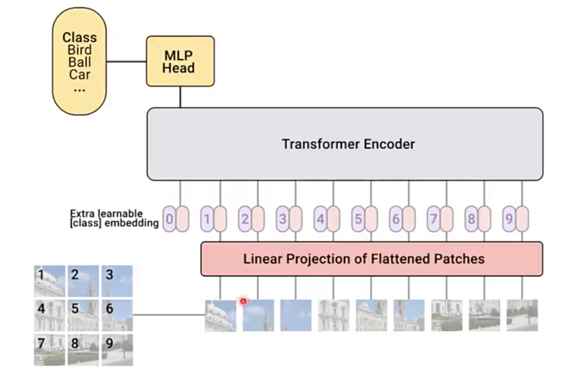
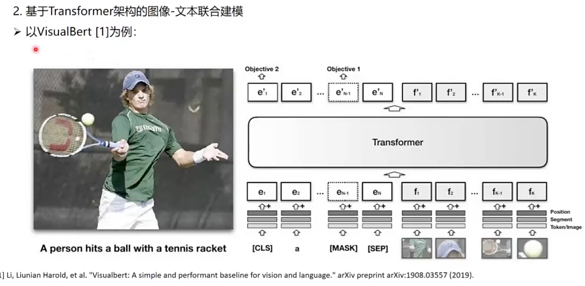
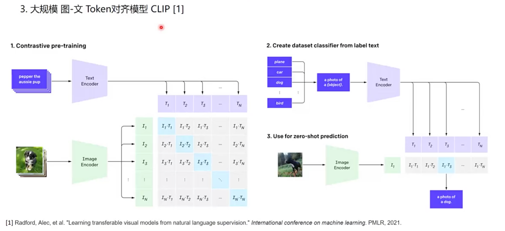
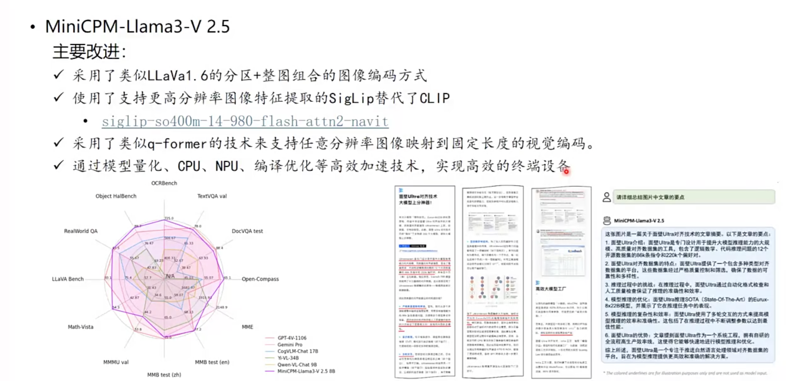
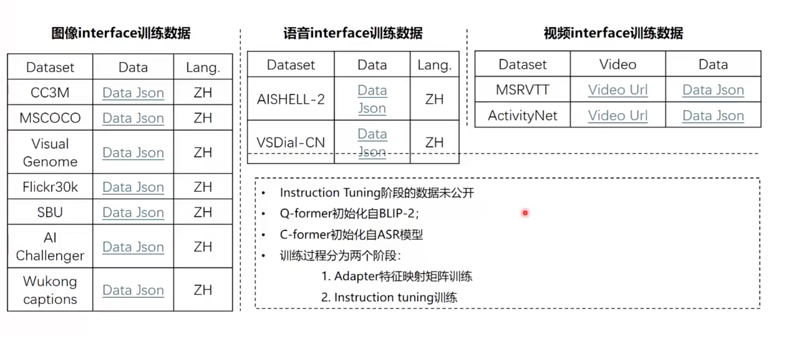
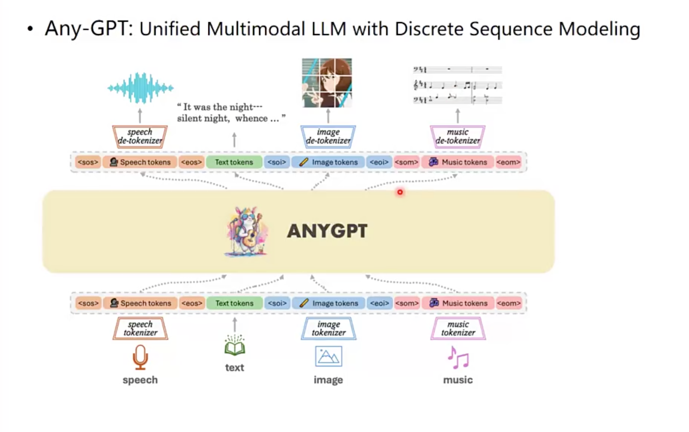
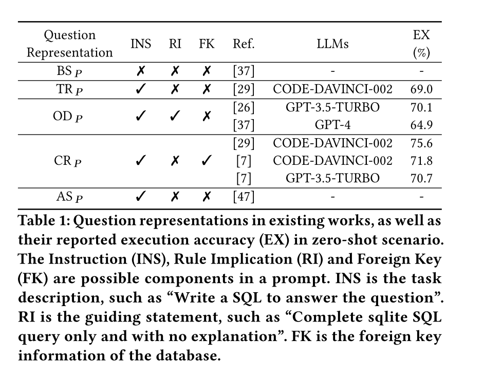
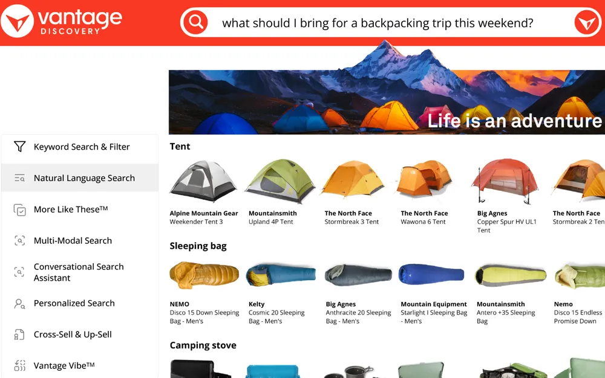

# AIGC-Algorithms

## 历史发展

* 计算智能 -> 感知智能 -> 通用智能
* emergent ability
  * [How much bigger can/should LLMs become?](https://cmte.ieee.org/futuredirections/2023/04/24/how-much-bigger-can-should-llms-become/)
  * https://arxiv.org/abs/2206.07682
  * 100TB=50000Billion

* AGI
  * 头部公司预测3-5年，这个跨度的故事是好故事

* Note
  * GPT-3.5相比于GPT-3，参数量变化不大，效果差距很大，这是由于微调技术

## Literature Review

> from InteRecAgent

* Survey
  * 《Pretrain, prompt, and predict: A systematic survey of
    prompting methods in natural language processing》

* LLM capability
  * in- context learning
    * 《few-shot learners》
  * instruction following
  * planning and reasoning

* alignment
  * 《Training language models to follow instructions with human feedback》

* leverage LLMs as autonomous agents
  * equipped LLMs with an external memory
  * CoT and ReAct：propose to enhance planning by step-wise reasoning;
  * ToT and GoT：introduce multi-path reasoning to ensure consistency and correctness
  * Self-Refine and Reflexion：lead the LLMs to reflect on errors
  * To possess domain-specific skills，guiding LLMs to use external tools
    * such as a web search engine
    * mathematical tool
    * code interpreters
    * visual models
    * recommender systems

> from MindMap

* LLM应用于生产的局限性
  * Inflexibility. 
    * The pre-trained LLMs possess outdated knowledge and are inflexible to parameter updating. Fine-tuning LLMs can be tricky be-
      cause either collecting high-quality instruction
      data and building the training pipeline can be
      costly (Cao et al., 2023), or continually fine-
      tuning LLMs renders a risk of catastrophic for-
      getting (Razdaibiedina et al., 2022).
  * Hallucination. 
    * LLMs are notoriously known to produce hallucinations with plausible-sounding
      but wrong outputs (Ji et al., 2023), which causes
      serious concerns for high-stake applications such
      as medical diagnosis.
  * Transparency. 
    * LLMs are also criticized for their
      lack of transparency due to the black-box na-
      ture (Danilevsky et al., 2020). The knowledge
      is implicitly stored in LLM’s parameters, thus
      infeasible to be validated. Also, the inference
      process in deep neural networks remains elusive
      to be interpretable
* CoT、ToT
  * 挖掘LLM的implicit知识
  * 相应地，MindMap同时挖掘explicit and implicit知识

## Intro

* 大模型最重要的演进方向：
  * 一、世界知识方面如何有效消除幻觉
    * 随着数据规模增大，遇到的新知识比例就越低，在世界知识方面就体现出Scaling law的减缓现象。
  * 二、如何大幅提升复杂逻辑推理能力。
    * 逻辑推理相关数据比例低，更慢。
    * 现在为了提高模型逻辑能力，往往在预训练阶段和Post-training阶段，大幅增加逻辑推理数据占比的原因，且是有成效的。
  * 语言能力已不是问题。

* [Yann LeCun演讲“人类水平的AI”@ Husdon论坛 2024.10](https://www.bilibili.com/video/BV1b1ycYTECU)
  * 介绍了算法沿袭
  * Moravec's Paradox: AI做不到一些人类很容易做的事情

### token

* token是LLM训练推理的最小单元，由tokenizer模型将文本切成token
  * 可能是 1/3 个汉字（因为汉字的UTF-8编码是三个字节，取一个字节）、一个汉字、半个单词等
  * 和模型设计有关：
    * 多语言大模型：汉字拆开
    * 中文大模型：一个token对应一个汉字
  * 和消耗算力有关
    * ->中文大模型更便宜

## Attention Is All You Need

* The best performing models also connect the encoder and decoder through an attention mechanism. 
  * Encoder: 映射到另一个语义空间
* Self-attention, sometimes called intra-attention is an attention mechanism relating different positions of a single sequence in order to compute a representation of the sequence.
* 模型结构是什么？
  * 过N个注意力层，再过一个full connection
  * Attention(Q,K, V) = softmax(QK^T/sqrt(d_k))V

* 模型参数是什么？
  * 词嵌入向量
    * learnable?
  * 将词嵌入向量转化为q、k、v向量的三个矩阵和bias
* 模型输出是什么？
  * 全连接层的结果，一个长度为全部词汇数量的向量
  * 如何增强随机性：
    * top-k采样

* The Transformer follows this overall architecture using **stacked self-attention and point-wise**, fully connected layers for both the encoder and decoder, shown in the left and right halves of Figure 1
  * 左边encoder，右边decoder
    * Encoder: 自注意力
    * Decoder：Q用outputs embedding做masked attention后的结果，K、V用encoder结果
    * 表征向量512维
  * masked multi-head attention保证输出对输入的感知序列不会超出长度
  * 自注意力机制：Q（输入矩阵）、K（字典）、V
    * 用1/(dk)^(1/2) scale了一下QK的乘法，可能是为了防止gradient太小
    * Dot product的结果方差比additive attention的方差大

* Multi-head attention

### Implementation

* TODO2: https://tensorflow.org/text/tutorials/transformer

### transformer外的模型结构

| 架构        | 设计者                                               | 特点                                     | 链接                                                         |
| ----------- | ---------------------------------------------------- | ---------------------------------------- | ------------------------------------------------------------ |
| Transformer | Google                                               | 最流行，几乎所有大模型都用它             | [OpenAI 的代码](https://github.com/openai/finetune-transformer-lm/blob/master/train.py) |
| RWKV        | [PENG Bo](https://www.zhihu.com/people/bopengbopeng) | 可并行训练，推理性能极佳，适合在端侧使用 | [官网](https://www.rwkv.com/)、[RWKV 5 训练代码](https://github.com/BlinkDL/RWKV-LM/tree/main/RWKV-v5) |
| Mamba       | CMU & Princeton University                           | 性能更佳，尤其适合长文本生成             | [GitHub](https://github.com/state-spaces/mamba)              |

目前只有 transformer 被证明了符合 scaling-law。

## BERT

## GPT-2

* 自回归架构
  * 局限性：只接受离散样本

* TODO1: https://jalammar.github.io/illustrated-gpt2/

## ChatGPT

* 对话式大型语言模型：https://openai.com/blog/chatgpt/
  * 自回归语言模型：帮助背下来事件知识
  * 大语言模型：百亿参数以上
    * 不好做finetune，成本高
    * 用prompt作为输入，generated text作为输出
    * 语言知识 + 事件知识，事件知识更需要大模型

  * 未来：AGI(Artificial General Intelligence)；教会它使用工具

* 三个关键技术：
  * In-Context Learning 情景学习
    * 在前向中学习
    * 涌现能力：百亿参数规模之后，能力突然提升，改变传统学习范式
    * 大幅降低下游任务开发成本
    * 《Rethinking the Role of Demonstrations: What Makes In-Context Learning Work?》 --> 随机label仍可能提升效果
  * Chain-of-Thought, CoT 思维链
    * 《PAL: Program-aided Language Models》，让语言模型生成能由计算模型执行的描述代码
    * 在大模型中打破scaling law
  * Learning from Natural Instructions 自然指令学习
    * 很像情景学习，样本逐渐简化（负例不需要suggestion；不需要负例）
    * https://instructions.apps.allenai.org/
    * OpenAI: 通过人类反馈对齐人类指令
* **大模型具备了对知识的跨语言能力**
* RLHF
  * 见【算法-finetune-RLHF】部分
* limitations
  * Correctness: 模型不是全知的，一本正经地胡说八道
  * sensitive to rephrase
  * verbose
  * No asking clarifying questions，而是猜
  * it will sometimes respond to harmful instructions or exhibit biased behavior

* [Iterative deployment](https://openai.com/blog/language-model-safety-and-misuse/)
* Evaluation
  * Holistic Evaluation of Language Models

* Note
  * 科技部部长王志刚表示，ChatGPT有很好的计算方法，同样一种原理，在于做得好不好；就像踢足球，都是盘带、射门，但是要做到像梅西那么好也不容易。
  * 客观题高考515分水平
* [专访Altman](https://www.pingwest.com/a/285835)

  * **感想**：有几个点值得关注：ai自运行的能力、ai隐藏意图的能力、ai与真实物质世界接口的能力、ai认识到自己的现实处境并差异化处理的能力

    * 当这些能力完全具备，可能AGI确实可以毁灭人类

  * 当他观察模型的隐藏层时，发现它有一个专门的神经元用于分析评论的情感。神经网络以前也做过情感分析，但必须有人告诉它们这样做，而且必须使用根据情感标记的数据对它们进行专门的训练。而这个神经网络已经自行开发出了这种能力。
  * 语言是一种特殊的输入，信息量极为密集
  * "假设我们真的造出了这个人工智能，其他一些人也造出了"。他认为，随之而来的变革将是历史性的。他描述了一个异常乌托邦的愿景，包括重塑钢筋水泥的世界。他说："使用太阳能发电的机器人可以去开采和提炼它们需要的所有矿物，可以完美地建造东西，不需要人类劳动。"你可以与 17 版 DALL-E 共同设计你想要的家的样子，"Altman说。"每个人都将拥有美丽的家园。在与我的交谈中，以及在巡回演讲期间的舞台上，他说他预见到人类生活的几乎所有其他领域都将得到巨大的改善。音乐将得到提升（"艺术家们将拥有更好的工具"），人际关系（人工智能可以帮助我们更好地 "相互对待"）和地缘政治也将如此（"我们现在非常不擅长找出双赢的妥协方案"）。
  * GPT-4学会了“说谎”：验证码

    * -> 让GPT-4讲解自己做事情的目的，将不再可靠
    * Sutskever 说，他们可能会在弱小的时候采取一种行动，而在强大的时候采取另一种行动。我们甚至不会意识到，我们创造的东西已经决定性地超越了我们，我们也不知道它打算用自己的超能力做些什么。

## GPT-4

* GPT-4幕后的研发团队大致可分为七个部分：预训练（Pretraining）、长上下文（Long context）、视觉（Vision）、强化学习和对齐（RL & alignment）、评估和分析（Evaluation & analysis）、部署（Deployment）以及其他贡献者（Additional contributions）
* [GPT-4技术报告](https://mp.weixin.qq.com/s?__biz=Mzk0NzQzOTczOA==&mid=2247484155&idx=1&sn=5ef0fcf20d4b87366269d3c0cf4312c0&scene=21#wechat_redirect)
  * 32k对应50页的context
* [Language models can explain neurons in language models](https://openai.com/research/language-models-can-explain-neurons-in-language-models)
  * 步骤：
    * GPT-4解释某个GPT-2神经元的行为
    * 用GPT-4模拟这一行为
    * 比较并打分

  * OpenAI 共让 GPT-4 解释了 GPT-2 中的 307200 个神经元，其中大多数解释的得分很低，只有超过 1000 个神经元的解释得分高于 0.8。
  * 三种提高解释得分的方法：
    - 对解释进行迭代，通过让 GPT-4 想出可能的反例，根据其激活情况修改解释来提高分数。
    - 使用更大的模型来进行解释，平均得分也会上升。
    - 调整被解释模型的结构，用不同的激活函数训练模型。
  * https://github.com/openai/automated-interpretability
  * 传统的视觉解释方法不能scale well
    * https://openai.com/research/microscope
    * https://distill.pub/2020/circuits/curve-detectors/

## MLLM(Multimodal LLM)

### Intro

* Modal: 图片、视频、音频、文本

* MLLM = LLM + 接收、推理多模态信息的能力

  * 听雨声，判断路面情况，今天是否适合出门
  * 概念：单模态、多模态、跨模态、多模态语言大模型
  * 单模态
    * 
    * LVM
  * 跨模态：
    * 音频->视觉：数字人
      * 蚂蚁Echomimic：实时渲染口播
      * 快手：LivePortrait
        * 非人、卡通，都能驱动
      * SadTalker paper/code
      * 浙大、字节 Real3d-portrait
      * ani-portrait
      * facebook research：audio2photoreal
    * 文本->音频：
      * TTS、音色克隆、少样本：GPT-SoVITS
        * 情感色彩、语调，一般
      * ChatTTS
        * 有情感色彩
      
      * SUNO：音乐生成
      * 开源工具
        * Meta：audiodraft
        * stable-audio-open-1.0
  
  * 多模态模型
    * 

### 多模态大模型历史发展

#### ViT模型，图像表示的token化

* Mask Image Modeling (Kaiming He)    Masked autoencoders ...

#### 基于transformer的图像-文本联合建模

#### 大规模图文Token对齐模型 CLIP

#### 多模态大语言模型

* GPT-4v

  * 遵循文字指令

  * 理解视觉指向和参考
  * 支持视觉+文本联合提示
  * few-shot
  * 视觉认知能力强

  * 时序视觉信号理解

* Gemini：原生多模态大模型

* GPT-4o
  * GPT 4o本质上是要探索不同模态相互融合的大一统模型应该怎么做的问题，对于提升大模型的智力水平估计帮助不大

### Embedding Model

https://ezml.io/blog/beyond-clip-the-future-of-multimodal-retrieval-with-visualized-bge-vista-and-magiclens

#### CLIP

**What is CLIP?**

CLIP, developed by OpenAI, is a model designed to understand and relate images and text through contrastive learning. It learns to match images with their corresponding text descriptions and to differentiate these pairs from mismatches, enabling it to perform various tasks, from image classification to zero-shot learning.

**How Does CLIP Work?**

- **Contrastive Learning:** CLIP is trained on a vast dataset of image-text pairs, learning to create a shared embedding space where both images and texts are represented as vectors. The model maximizes the similarity of correct image-text pairs and minimizes it for incorrect pairs.
- **Joint Embedding Space:** CLIP’s ability to create a joint embedding space for images and text allows it to generalize across different tasks and domains.

**Limitations of CLIP**

- **Fine-Grained Visual Understanding:** CLIP struggles with fine-grained visual details due to its broad learning approach. It can miss subtle distinctions within images that are critical for certain tasks.
- **Imprecise Multimodal Alignment:** The alignment between text and images can be imprecise, especially when dealing with complex or nuanced relationships.
- **Retrieval Performance Variability:** CLIP's performance can vary depending on the specificity of the query and the image, sometimes leading to suboptimal results.

#### Visualized BGE (Bootstrapped Grid Embedding)

**How Does Visualized BGE Work?**

- **Grid-Based Embeddings:** Unlike CLIP, which processes entire images, Visualized BGE (specifically the BGE-Visualized-M3 variant) breaks down images into grids and embeds each segment separately. This grid-based approach allows the model to capture more localized and detailed visual information.
- **Bootstrapping:** Visualized BGE uses a bootstrapping process where the model iteratively refines its understanding of the image’s content. This iterative training enhances the model's ability to differentiate between subtle visual details.
- **Leveraging Stable Diffusion:** The training process of Visualized BGE, especially in its M3 variant, incorporates techniques similar to stable diffusion to generate edited images. These variations expose the model to a diverse set of images, thereby improving its ability to recognize and embed fine-grained details across various scenarios.

**Prominent Example - BGE-Visualized-M3**

The **BGE-Visualized-M3** model is a prominent example of the Visualized BGE architecture. It supports multiple retrieval functionalities such as:

- **Dense Retrieval:** Standard dense retrieval, commonly seen in text embeddings.
- **Multi-Vector Retrieval:** Fine-grained interactions between multiple vectors.
- **Sparse Retrieval:** Term-based retrieval with enhanced importance assigned to certain terms.

**Advantages of Visualized BGE**

- **Fine-Grained Detail Recognition:** The grid-based embedding method enhances the model’s ability to recognize and differentiate fine details within images.
- **Improved Retrieval Accuracy:** The detailed focus leads to more accurate retrieval results, particularly in scenarios where specific visual features are critical.
- **Complex Image Handling:** Visualized BGE, especially in its BGE-Visualized-M3 variant, excels in understanding complex images with multiple elements, where generalist models like CLIP might struggle.

#### VISTA (Visualized Text Embedding for Universal Multimodal Retrieval)

**What is VISTA?**

VISTA (Visualized Text Embedding for Universal Multimodal Retrieval) takes the advancements of Visualized BGE even further by enhancing the integration of text and image data. VISTA introduces a sophisticated method of embedding text in a way that is deeply integrated with visual data, making it a versatile model for a broad range of multimodal tasks.

**How Does VISTA Work?**

- **ViT and Text Tokenization:** VISTA uses a Vision Transformer (ViT) as an image tokenizer, feeding the visual tokens into a pre-trained text encoder. This allows the model to handle images, text, and multimodal data seamlessly.
- **In-Depth Fusion:** VISTA creates a deeply fused multimodal representation by concatenating the visual tokens from the ViT encoder with the text tokens and processing this interleaved sequence through a frozen text encoder. This ensures that the text embedding capabilities are preserved while enhancing image-text alignment.
- **Two-Stage Training Process:** VISTA employs a two-stage training process. In the first stage, it performs cross-modal training using massive weakly labeled data, aligning visual tokens with the text encoder. In the second stage, VISTA fine-tunes this alignment with high-quality composed image-text datasets, significantly improving the model's ability to handle complex multimodal tasks.

**Improvements Over CLIP**

- **Unified Embedding Space:** Unlike CLIP, which handles text and image embeddings separately, VISTA creates a unified embedding space that ensures better integration and alignment of text and image data.
- **Versatility:** VISTA’s architecture allows it to excel across a broader range of multimodal retrieval tasks, from simple image-text matching to complex multimodal document retrieval.
- **Enhanced Detail and Context Understanding:** By deeply integrating visual and textual data, VISTA can better understand and retrieve information based on nuanced and detailed queries.

#### MagicLens by Google 

**What is MagicLens?**

MagicLens is a cutting-edge, self-supervised image retrieval model designed to handle **open-ended instructions** for image search. Unlike traditional models that focus on visual similarities, MagicLens allows users to express complex search intents through natural language, retrieving images based on diverse semantic relations beyond mere visual features.

**How Does MagicLens Work?**

- **Training on Web Data:** MagicLens is trained on **36.7 million image triplets** (query image, instruction, target image) mined from naturally occurring web image pairs. These pairs contain implicit relations (e.g., “inside view of,” “different angle”), which are made explicit using large multimodal models (LMMs) and large language models (LLMs).

- **Self-Supervised Learning:** The model generates diverse instructions using foundation models (PaLM and PaLI) and learns to align image-text pairs via contrastive learning, allowing it to support open-ended, complex queries.
- **Dual-Encoder Architecture:** A dual-encoder system processes the query image and integrates the instruction into the target image retrieval, making the system highly efficient for diverse retrieval tasks.

**Key Innovations:**

- **Beyond Visual Similarity:** MagicLens excels at retrieving images based on **non-visual relations**, such as context, object-specific queries, or semantic differences (e.g., “different product angle” or “related landmarks”).
- **Efficient Model Size:** Despite being **50x smaller** than previous state-of-the-art models, MagicLens achieves superior performance across various image retrieval benchmarks.
- **Real-Time and Accurate Retrieval:** MagicLens allows for **interactive, real-time search** and refines results based on user feedback, making it adaptable to dynamic retrieval tasks.

**Why It’s an Advancement:**

MagicLens moves beyond the visual similarity limitations of CLIP and Visualized BGE, supporting **open-ended, natural language-driven searches**. It represents a significant leap in the ability to handle complex, contextually rich image queries, making it highly effective and scalable for modern multimodal search applications.

* 论文要点：

  * 网络共现图片数据

    * google开源的conceptual captioner标注有害图片
    * 数据噪声对pretraining影响不大

    

  * query negative：q(image=query_image, text=None) 作为重要负例
    * 对比学习，参数T越小，训练越不稳定，但可以捕捉难负例
    * 拓展：batch内其它query都可以作为negative
  * 

  * 

  * 在 open domain 的图像上也有非常强的性能

* 结论：

  * I2T 打平或微降
  * T2I 效果好
  * Self-Attn is better than any Cross-Attn
    * Cross-attn: uses text embedding
      to attend concatenated image and text embeddings.

* benchmark
  * 图搜图：we consider three benchmarks, namely TU-Berlin (Zhang et al., 2016),
    Sketchy (Yelamarthi et al., 2018), and QuickDraw (Dey
    et al., 2019).
  * 

### Data Prepare

* Trick
  * image放在prompt结尾，比较少受文本信息干扰

* prompt

### Training - Llava

* 细节：
  * 容易过拟合，--num_train_epochs=1，一般是从头训练

#### 算法迭代

* 改进Visual Encoder
  * 
  * 
  * 
  * 
* 改进Projection Layer
  * internLM已经弄的很大了，存在瓶颈
  * lora思想、改进文本能力
  * 
  

#### 视频、语音输入

#### 原生MLLM

* Next-GPT训练
  * 阶段一：更新input projection layer 
  * 阶段二：decoder段输出结果与指令对齐，只更新output projection layer
  * 阶段三：

### 开源项目

  

### Evaluation

* MME评测集
  * https://github.com/BradyFU/Awesome-Multimodal-Large-Language-Models/tree/Evaluation
* 

### Applications

* 工业
* 医疗
* 视觉内容认知与编辑
* 具身智能
* 新一代人机交互

* 多模态Agent
  * CogAgent
    * 围绕GUI的能力强化：解析和目标定位能力

* Llava衍生的应用
  * 图表问答生成：ChartLlama-code

## 视频生成模型

* 技术报告：https://openai.com/research/video-generation-models-as-world-simulators

* VideoPoet

* [一锤降维！解密OpenAI超级视频模型Sora技术报告，虚拟世界涌现了](https://mp.weixin.qq.com/s/ODsebK3fEc-adRDwRVDhQA?poc_token=HMxd12WjhN3a1nz74MaIrMjep8dIn2Cj_NTdFwef)
  * 扩展视频生成模型的规模，是构建模拟物理世界通用模拟器的非常有希望的方向
  * patch
    * 从宏观角度来看，研究者首先将视频压缩到一个低维潜空间中，随后把这种表征分解为时空patch，这样就实现了从视频到patch的转换。
    * 在推理时，可以通过在一个合适大小的网格中适当排列随机初始化的patch，从而控制生成视频的大小。
  * 训练技巧
    * 直接在视频原始比例上训练
    * 研究者采用了DALL·E 3中的重新标注技术，应用在了视频上。
      * 首先，研究者训练了一个能生成详细描述的标注模型，然后用它为训练集中的所有视频，生成文本说明。
      * 他们发现，使用详细的视频说明进行训练，不仅能提高文本的准确性，还能提升视频的整体质量。
      * 类似于DALL·E 3，研究者也使用了GPT，把用户的简短提示转化为详细的说明，然后这些说明会被输入到视频模型中。

  * 生成的视频特点：
    * 多种输入形式、多视频间过渡、人和物的特征

## OpenAI o1

> o1本质上是在探索大模型在AGI路上能走多远、天花板在哪里的问题

* [如何理解OpenAI o1](https://mp.weixin.qq.com/s/QdVSq8q7wLWtPakdZdqidA)

  * 提升LLM模型认知能力的核心在于复杂逻辑推理能力。

    * LLM的逻辑推理能力越强，则能解锁更多复杂应用，大模型应用的天花板就越高
    * o1模型能力越强，则可以反哺基座模型

  * o1的做法本质上是CoT的自动化or内化。

    * rl搜索COT的决策空间
    * 问题越复杂，隐藏的COT token消耗越大

    * 大部分逻辑推理数据的形式是<问题，正确答案>，缺了中间的详细推理步骤，而o1本质上是让大模型学会自动寻找从问题到正确答案的中间步骤，以此来增强复杂问题的解决能力。

  * RL的scaling law本质上是COT决策树搜索的scaling law

  * Agent无法实用化的主要原因就在于基座模型的复杂推理能力不够强。

    * 通过基座模型Plan把一个复杂任务分解为10个步骤，哪怕单个步骤的正确率高达95%，要想最后把任务做对，10个环节的准确率连乘下来，最终的正确率只有59%

  * OpenAI想做的方向太多，资源分散导致分到具体一个方向的资源不够用，所以越往后发展“期货状态”的方向越多，也让人觉得尽显疲态。

## AGI

### Lecun

> LeCun: https://www.bilibili.com/video/BV1b1ycYTECU
>
> 视频其中一个核心思想是“预测能力的本质是我们找到我们观察的事物的良好表征”，事实上现在人类做机器学习的工作大部分是在 寻找表征、优化表征。
>
> 最近一段时间伴随LLM出现，技术领域的发展不外乎这两种：1）利用LLM学到的表征去做一些事情；2）让LLM学会更多表征。

* Lecun的Insight：需要视觉信息训练
  * 反驳“视觉信息冗余”
    * 视神经纤维 1byte/s 已经相比视网膜光传感器有1/100的压缩比了
      * 6000w-1e8光传感器
      * 100w神经纤维
    * self-supervised learning需要冗余信息才能学好
      * 高度压缩==随机 -> 学不好

* Objective-Driven AI
  * 转化为优化问题，让决策output接近objective，需要先优化perception
  * optimization-based AI
    * 有zero-shot能力
    * search/plan

* 系统
  * Model Predictive Control（MPC）
    * using gradient-based method, graph search, MCTS, DP, ...
  * 分层的planning，world model预估级联

* 训练：
  * 观察婴儿对世界模型的认知路径，可以启发各种属性的认知顺序和难度（比如对重力的认知）
  * generative + self-supervised行不通

* Joint Embedding Predictive Architecture
  * 预测能力的本质是我们找到我们观察的事物的良好表征
    * e.g. 电商场景下的类目体系，类目是对商品的向上一层的抽象表征

* VICReg
  * 先扩维再正则化

* Video-JEPA
  * 蒸馏防止collapse

### 其它

* 豆包大模型视觉 https://zhuanlan.zhihu.com/p/5761953085

  * 尽管Scaling在Sora上取得成功，但不足以使视频生成模型真正理解并泛化应用基本的物理定律。
    * 模型仅在训练数据分布内表现良好，分布外表现较差，不过Scaling对组合泛化（需组合训练时已熟悉的概念或对象）有效；
    * 模型无法抽象出一般规则，而是试图模仿最接近的训练示例；
    * 当模型参考训练示例时，甚至存在顺序偏好：颜色 > 大小 > 速度 > 形状；

  * 训练数据分布内（in-distribution）：训练数据和测试数据来自同一分布，**表现良好**；
  * 训练数据分布外（out-of-distribution）：模型在面对从未见过的新场景时，是否能够将已学过的物理定律应用到未知的情境，**表现不佳**；
  * 组合泛化（combinatorial generalization）：介于前两者之间，训练数据已包含了所有概念或物体，但这些概念、物体并未以所有可能的组合或更复杂的形式出现，**Scaling有效**；
  * 视频模型具有**三种基本组合模式**，分别为：
    - 属性组合
    - 空间组合（多个物体不同运动状态）
    - 时间组合（不同的时间点多个物体的不同状态）

  * 视频生成的Scaling Law**应当侧重于增加组合多样性，而不仅仅是扩大数据量**。

## In-context Learning

https://ai.stanford.edu/blog/understanding-incontext/

## CoT 相关技术

* [OpenAI研究员、思维树作者姚顺雨专访：人生是一场无限流游戏丨独家](https://mp.weixin.qq.com/s/MdPI-X1HvRxFuX_Z0Ju_ug)
  * 许多计算本质上就是去计算下一个token，next token prediction开始成为一个新的计算。那么针对计算复杂性，传统的语言如何在新框架下适用，还有很多问题需要去解决
  * Open-endedness
    * 语言游戏之所以和其他游戏区别很大，就是因为语言的开放性，即open-endedness。既然这样，那么它本质上应该有一个generative solution，而不是一个discriminative solution。所以从我第一个工作开始，我就一直在做autoregressive language model (GPT-2)
    * 从哲学的角度来看，人生就是一个无限流游戏，某种程度上来说，更像一个文字游戏，而不是电子游戏。每天你都有很多选择，从程度上说是非常high level、 open ended的。
  * ReAct
    * 这篇论文的本质是Agent不仅仅有environment action，也有thinking action。
    * 主要的思路是，在玩文字游戏的时候，为什么机器很笨，而人很聪明，是因为人类有思考的能力。当时我在做ReAct的时候，最初的想法是，如果我能够让机器模仿人，不仅仅是模仿人的活动，也模仿人怎么思考，是不是就可以泛化得更好。具体比如人看到了一个城堡，人的选择是走向第三个门，如果你只去模仿这样的Mapping，很多时候是很难去泛化的。但是如果能够让它同时去模仿人的思考过程，那可能就是一个非常自然的、可以泛化的一个理由。比如人可能会想，现在周围很黑暗而且有奇怪的叫声，可能有危险需要灯。灯在第一个房间，但是第一个房间的钥匙在第三个房间，所以我得先去第三个房间。
  * CoT的扩展
    * 从某种程度上来说，ReAct和Tree of Thoughts其实相当于是CoT的两个方向的扩展。一个方向是要和外部世界发生联系，另一个方向是内部的思考，如何从一个线性过程变成一个非线性，也就是更加通往 system 2的一个过程。
  * 身边太多聪明的人，但你发现自己并不比他们差。做研究非常重要的因素就是信心，如果你不相信能做出非常好的研究，那你是不可能做出来好的研究的。

## Finetuning

### Intro

* finetune v.s. from scratch
* 如何做finetune
  * 基座模型选型
* 全参数finetune和小参数量finetune
  * 小参数量finetune
    * Adapters
    * Prompt-tuning v1/v2
    * LoRA

* finetune需求
  * OpenAI: 1.3w条SFT prompt
  * embedding：至少10w条数据，相似性和同义性
* 很厉害的alpaca

#### RLHF

* Reinforcement Learning from Human Feedback (RLHF), using the same methods as [InstructGPT](https://openai.com/blog/instruction-following/), but with slight differences in the data collection setup
  * RLHF的blog介绍：https://huggingface.co/blog/rlhf
    * supervised fine-tuning: human AI trainers provided conversations in which they played both sides—the user and an AI assistant
  * 步骤：
    * 预训练一个语言模型 (LM) ；
    * 聚合问答数据并训练一个奖励模型 (Reward Model，RM) ；
    * 用强化学习 (RL) 方式微调语言模型（LM）。
      * 长期以来，出于工程和算法原因，人们认为用强化学习训练 LM 是不可能的。而目前多个组织找到的可行方案是使用策略梯度强化学习 (Policy Gradient RL) 算法、近端策略优化 (Proximal Policy Optimization，PPO) 微调初始 LM 的部分或全部参数。因为微调整个 10B～100B+ 参数的成本过高 (相关工作参考低秩适应 LoRA 和 DeepMind 的 Sparrow LM)
  * reward model: 人工打分
    * 人工写答案 -> 人工选答案 -> 机器选答案
    * prompt dataset
    * fine-tune the model using [Proximal Policy Optimization](https://openai.com/blog/openai-baselines-ppo/)
    * 一些巧妙的打分方式：
      * 客服点按钮，选取ai答案，也是finetune过程
      * reddit帖子中的最高分

* 

#### LoRA

https://github.com/huggingface/peft

### Literature Review

* finetuning分类
  * full：Training Language Models to Follow Instructions with Human Feedback
    * aligned with human preferences with instruction-tuning

  * 高效的：LoRA: Low-Rank Adaptation of Large Language Models

* Pre-trained LLMs can be adapted to domain tasks with further fine-tuning
  * 《Large language models encode clinical knowledge》
* fine-tuned LLMs fail to learn from examples
  * DAIL-SQL

### Alignment

https://github.com/tatsu-lab/stanford_alpaca

指令微调是什么? - superpeng的回答 - 知乎
https://www.zhihu.com/question/603488576/answer/3178990801

* 指令微调是一种特定的微调方式，在不同的论文中以不同的方式引入。我们在一个新的语言建模任务上对模型进行微调，其中的示例具有额外的结构，嵌入到模型提示中。
  * 先无监督训练，再用有监督的“指令-回答“预料
  * 指令调整模型接收一对输入和输出，描述引导模型的任务。
* 核心思路：解决“回答问题”与“接话”的差异
* Note：
  * 数据获取昂贵（RLHF人工打分的成本比人工写故事要低）
  * 对开放性问题效果不好（write a story about ...）

### SFT

### FoodGPT: A Large Language Model in Food Testing Domain with Incremental Pre-training and Knowledge Graph Prompt

* Incremental Pre-training 增量预训练
  * 图像和扫描文档
    * 存储大量领域标准文档信息，使用 OCR 技术处理。因文档可能超模型训练序列长度，按章节拆分，为防描述冲突，给数据章节添加前缀（通过 UIE 模型提取文档名，启发式生成方法构建前缀）。同时用 BERT 和 GPT - 2 计算文本章节中句子的困惑度，排除高困惑度句子。
  * 结构化知识
    * 存在于私有结构化数据库，由人工输入的表格组成。创建 Datav1 和 Datav2 两个版本用于增量预训练。Datav1 去除机密隐私信息后用字典构建数据，以 “测试项目” 为键，对应多个具体测试项目的表格（markdown 格式）为值；Datav2 采用新方法序列化，去除机密隐私信息后合并部分无单独意义的字段，输入 ChatGPT 按规则随机生成文本。
  * 其他类型数据
    * 包括食品检测字典、中国食品检测教程和研究论文、食品情感数据、食品安全相关法律、食品安全相关考题等，选择 Chinese - LLaMA2 - 13B 为基础模型，用 LoRA 方法进行增量预训练。

* Instruction Fine-tuning

  - 数据集构建
    - 通过两种方式构建指令微调数据集。一是从食品论坛选取相关主题，抓取大量问答对，优先选择发帖频率高的用户以确保高质量答案；二是与食品检测领域专家合作设计 100 个高质量种子指令，用 evol - instruct 方法扩展和多样化。

  - 训练过程
    - 用 LoRA 方法对 Chinese - LLaMA2 - 13B 的指令进行微调。

## Long-Context

* 早期GPT的上下文只有4K
* 超大的上下文窗口=超长的短期记忆
* 128K Token = 124K Input Token + 4096 Output Token

## Interpretability

* Intro
  * 关于可解释性，诙谐的举例，青少年在想什么无法理解，有些东西就是很难理解，但他真实存在并work，青少年也是人

* sparse autoencoders (SAEs) , Anthropic's paper https://transformer-circuits.pub/2024/scaling-monosemanticity/

* Interpretability在电商场景的潜在应用 https://www.vantagediscovery.com/post/the-future-of-e-commerce-is-ai-powered-and-interpretable

  * **Hyper-Personalized Product Discovery**
    * Scenario: An e-commerce platform wants to move beyond basic recommendation algorithms and create truly personalized shopping experiences that resonate with individual customers. They need to understand not just what products customers interact with, but the underlying reasons and preferences driving their choices.
    * Solution: By using SAEs to analyze the LLM activations associated with user browsing behavior, purchase history, and product interactions (e.g., reviews, ratings, wishlists), the platform can extract nuanced features representing individual preferences and decision criteria. For example, features might emerge for "aesthetic style," "sustainability concerns," "value for money," "brand affinity," or specific functional requirements.
    * 

  * **Optimized Merchandising and Assortment**
    * Scenario: A retailer using an e-commerce platform wants to make data-driven decisions about inventory management, product assortment, and merchandising strategies. They need to understand which products are resonating with customers, which attributes are driving demand, and how to optimize pricing and promotions for maximum profitability.
    * Solution: By applying SAEs to analyze the LLM activations linked to product sales data, customer reviews, and market trends, the platform can identify crucial features influencing purchasing decisions. These might include features like "price sensitivity," "seasonal demand," "regional preferences," or "emerging trends" related to specific product attributes.
  * **Enhanced Explainable Search**
    * Scenario: A customer searches for "running shoes" but is dissatisfied with the results, feeling they are too generic.
    * Solution: The platform could use SAEs to analyze the search query's representation in the LLM's activation space. By identifying the activated features, they could provide an explanation to the customer, like "We are showing you popular running shoes based on your location and browsing history." Additionally, the platform could offer "steering" options based on other relevant features. For example, they could suggest refining the search by "cushioning," "terrain," or "price range."

## 幻觉

《Lost in the middle: How language models use long contexts》

- 自然语言生成中关于幻觉研究的综述：https://arxiv.org/abs/2202.03629
- 语言模型出现的幻觉是如何滚雪球的：https://arxiv.org/abs/2305.13534
- ChatGPT 在推理、幻觉和交互性上的评估：https://arxiv.org/abs/2302.04023
- 对比学习减少对话中的幻觉：https://arxiv.org/abs/2212.10400
- 自洽性提高了语言模型的思维链推理能力：https://arxiv.org/abs/2203.11171
- 生成式大型语言模型的黑盒幻觉检测：https://arxiv.org/abs/2303.08896

## 安全 & 伦理

> 仅一天就被外媒封杀 前谷歌CEO到底说了... https://v.douyin.com/iBttgjpb/

### AI战争

* 美国白鹤计划crane war
  * 机器人/无人机摧毁整个军队理论（坦克、炮兵、迫击炮），让地面进攻成为不可能
  * 美国能源不足，加拿大发电，阿拉伯投资

### AI安全

* 关键问题：如何在一个学习了的系统中检测危险（比如混合某些化合物），并且你无法直接询问它这些内容
  * 解决方案：设定一个阈值，超过了向政府报告

### AI政治

* 对民主的威胁-虚假信息-aigc
  * 尝试解决tiktok问题：平等时间规则（总统候选人的内容播出时间平等）
* 去中心化的思想构建未来的AI安全：https://mp.weixin.qq.com/s/K1gbW1aIkwl8aLzkD9nYnQ
  * 比特币：攻击收益远小于攻击成本
  * 以生态著称的公链以太坊：虽然秘钥也是几十位，但是系统就太复杂了，各种二层技术、跨链桥等带来了很多漏洞，以至于网络攻击不断，就是因为攻击收益大于攻击成本
  * 方案：确权，实名，竞争

### AI伦理

* 算法演变到最后会扩大“out of rage”，因为冲突带来流量
* 关于丢失工作：需要高等教育的工作没事，因为这些人会和系统协作

## LLM4Search

### 产品逻辑

#### 电商

* [Product Search And Recommendation Trends In 2024 For Better Converting eCommerce Stores](https://blog.boostcommerce.net/posts/product-search-and-recommendation-trends)
* [Inside Product Recommendation Feature Of Boost AI Search & Discovery](https://blog.boostcommerce.net/posts/product-recommendation-feature-of-boost-ai-search-discovery)
* [Using Ecommerce Recommendation Engines to Keep Your Customers Coming Back](https://www.bigcommerce.com/articles/ecommerce/recommendation-engine/)
* [21 Ecommerce **Product Recommendation** Tips (That Increase Conversions)](https://thegood.com/insights/ecommerce-product-recommendation/)
* **Search relevance** is king!
  * The search bar is the go-to destination for [69%](https://www.nosto.com/blog/future-of-ecommerce-search-2023/) of shoppers
  * [82%](https://www.nosto.com/blog/future-of-ecommerce-search-2023/) of online businesses believe that the site search experience can be enhanced by providing more relevant results
  * and a compelling [79%](https://www.nosto.com/blog/future-of-ecommerce-search-2023/) of consumers surveyed expressed their likelihood to purchase a product that they had specifically searched for in the search results
* 个性化也重要
  * [Research](https://www.barilliance.com/personalized-product-recommendations-stats/) conducted by Barilliance in 2018 concluded that product recommendations accounted for up to 31 percent of ecommerce revenue. On average, customers saw 12 percent of their overall purchases coming from products that were recommended to them. 
  * [A Salesforce study](https://www.salesforce.com/blog/2017/11/personalized-product-recommendations-drive-just-7-visits-26-revenue.html) of product recommendations concluded that visits where the shopper clicked a recommendation comprise just 7 percent of total site traffic, but make up 24 percent of orders and 26 percent of revenue. 
  * The conversion rate for visitors clicking on product recommendations was found to be [5.5x higher](https://www.barilliance.com/personalized-product-recommendations-stats/) than for visitors who didn’t click.
  * [An Accenture report](https://www.accenture.com/us-en/interactive-index) says personalization increases the likelihood of a prospect purchasing from you by 75 percent.
* No more “No results found”
  * **synonyms and autocorrect** to prevent unmatched search frustrating experiences
  * [Best Practices for Instant Search Box - What to Do With ‘No Search Results’](https://boostcommerce.net/blogs/all/instant-search-box-tips-with-no-search-results)
* The age of intelligent search continues
  * AL/ML-based models (can also use rules to set up)
    * content-based filtering
    * item-CF和user-CF
    * Frequently bought together (FBT)
      - FBT和Complementary products的区别是，前者基于加入购物车的数据，后者基于商品语义信息
    * Related items
      - Alternative products
      - Complementary products
      - Mix of the 2 sub-models
  * Statistic-based models
    - Newest arrivals
    - Trending products
    - Bestsellers
    - Most viewed
    - Recently viewed
  * Manual model
    - Hand-pick products ( fix the limelight for a particular set of products without changing or updating them.)
      - 实现时可以用tag标注
* Customers want personalized product recommendations
  * 个性化对retaining customers（留存）有帮助
* 产品能力：
  * **NLP-backed search engine** to better respond to long-tail queries
  * **Semantic search** to maximize the accuracy and relevance of search results
  * Enhanced **typo tolerance**
  * **Understanding search with high complexity**
  * AI-fueled **upselling and cross-selling**
    * such as a Bluetooth headset to go with their chosen laptop
  * secondary algorithm
    * 
  * **Analyze能力**
    * **Analyze customer feedback and reviews**：分析效果
    * **Identify the most popular products**：决定promote and stock哪些商品
    * **Improve upselling and cross-selling**：create more cohesive marketing campaigns by bundling items in ways that appeal to customers
    * **Understand customer preferences and behavior**: Understanding which upselling and cross-selling offers customers respond to provides more insight into their purchase behavior and lets you make better-informed decisions about which products to restock. For example, if customers don’t respond to upselling product suggestions, you might consider discontinuing the higher-end product.
    * **Show Bestsellers Across Different Categories**
  * *And many more*
* 对应产品功能：
  * Frequently Bought Together
    * "Viewed this, bought that."
    * Amazon does this by showing bundles of products frequently viewed in succession and enabling users to **add the entire bundle** to their shopping cart in one click.
      * **Provide Social Proof**  (Customers Who Bought This Item Also Bought)
  * Related Items (AI-powered)
    * “Deals based on your recent history”
    * 推荐理由
  * Recently Purchased
    * “Buy again”
  * Bestsellers
  * Hand-picked Products
  * Recently Viewed
    * “Keep shopping for”
  * Most Viewed
  * Newest Arrivals
  * Trending Products
    * based on new trends and seasons
  * Personalize Your Email Campaigns

* 模型输入特征：

  * past purchases, viewed products
  * time spent on various pages
  * Location

  * 元信息
    * new trends and seasons (as prompt)
    * product titles and descriptions

* 指标metrics：

  * average order value
  * upsell/cross-sell conversion rate
  * insight into user behavior.

* 产品页面：[**How to Display Product Recommendations Throughout the Sales Cycle** ](https://thegood.com/insights/ecommerce-product-recommendation/#h-how-to-display-product-recommendations-throughout-the-sales-cycle-nbsp)

  * Homepage   ---> “Most Popular” and “Recently Viewed”
    - **Trending products**
    - **Recently viewed**
    - Bestsellers
    - Most viewed
    - Newest arrivals
  * Collection page ---> most popular
    - **Trending products**
    - **Bestsellers**
    - **Most viewed**
    - Recently viewed
    - Newest arrivals
  * Product page
    - **Frequently bought together**
    - **Related items**
    - Newest arrivals
    - Trending products
    - Bestsellers
    - Most viewed
    - Recently viewed
    - Hand-pick products
    - **Note**: Frequently bought together & Related items can be displayed as Product Bundles.
  * Cart page
    - Frequently bought together
    - **Related items** -> cross-selling
    - Newest arrivals
    - Trending products
    - Bestsellers
    - Most viewed
    - Recently viewed

###  搜索算法

#### Hybrid Search

* Hybrid search is a combination of full text and vector queries that execute against a search index that **contains both searchable plain text content and generated embeddings**. For query purposes, hybrid search is:
  * A single query request that includes both `search` and `vectors` query parameters
  * Executing in parallel
  * With merged results in the query response, scored using Reciprocal Rank Fusion (RRF)
* 背景：
  * 实际生产中，传统的关键字检索（稀疏表示）与向量检索（稠密表示）各有优劣。
    * 举个具体例子，比如文档中包含很长的专有名词，关键字检索往往更精准而向量检索容易引入概念混淆。
    * e.g. 在医学中“小细胞肺癌”和“非小细胞肺癌”是两种不同的癌症

* [Relevance scoring in hybrid search using Reciprocal Rank Fusion (RRF)](https://learn.microsoft.com/en-us/azure/search/hybrid-search-ranking)
  * Kv search (BM25)
  * Vector search (HNSW)
  * RRF: $rrf(d)=\sum_{a\in A}\frac{1}{k+rank_a(d)}$

* [VantageDiscovery的电商搜索实践](https://www.vantagediscovery.com/post/compound-ai-search-where-keywords-and-vectors-are-just-the-beginning)

  * 高级能力
    * **Intelligent Weighting**: Dynamically adjust the importance of different search factors based on business goals or seasonal priorities.
    * **Flexible Matching Criteria**: Find relevant results even with partial query matches, ensuring customers always find suitable products.
    * **Contextual Semantic Adjustment**: Control the degree of semantic interpretation based on product categories or query types, optimizing for both precision and recall.
    * **Category-Specific Models**: Utilize different AI models for various product types, ensuring specialized understanding across diverse catalogs.

  * Imagine a customer searching for a "cozy blue sweater for a winter wedding." A compound AI system handles this complex query by:
    * Analyzing intent: identifying style, color, item, and occasion.
    * Expanding context: considering related concepts like "formal knitwear" or "elegant cold-weather attire."
    * Performing semantic search using advanced embeddings.
    * Conducting traditional keyword search in parallel.
    * Blending results, prioritizing wedding-appropriate items.
    * Returning a curated selection of relevant products, including complementary accessories.
  * https://docs.vantagediscovery.com/docs/search-more-like-these-tm#example-soft-chair--item-27--two-pinterest-images
    * 

### NL2Sql

#### Literature Review

* extracting the question-to-SQL patterns and generalizing them by training an
  encoder-decoder model with Text-to-SQL corpus

#### Evaluation

* https://bird-bench.github.io/
* https://yale-lily.github.io/spider

#### [DAIL-SQL] Text-to-SQL Empowered by Large Language Models: A Benchmark Evaluation

* Intro

  * prompt engineering methods, including question representation, example selection and example organization
  * DAIL- SQL encodes structure knowledge as SQL statements, selects examples based on their skeleton similarities and removes cross- domain knowledge from examples for token efficiency. Before

* Prompt Engineering

  * question representations in zero-shot scenario
  * example selection and organization strategies in few-shot scenario
    * the option of displaying full information, solely SQL queries or question-SQL pair.
  * verify the hypothesis that LLMs learn from the mappings between question and SQL skeleton

* Zero-shot -- Question Representation

  * database schema
  * prompt
    * basic（BS）
    * Text representation（TR）
    * **OpenAI Demostration Prompt (OD)**
      * “Complete sqlite SQL query only and with no explanation”
      * 综合效果最好最通用
    * Code Representation Prompt
      * 完整建表语句
    * AS
      * 需要SFT模型才行

  

* 增益
  * INS
  * **RI**
    * with no explanation 效果好
    * Let's think step by step 效果不稳定
  * FK

* Few-shot
  * 背景setting：cross-domain Text- to-SQL （例子可能来自于别的数据库）
  * example selection
    * Random
    * Question Similarity Selection (QTS )
    * **Masked Question Similarity Selection （MQS）**
      * 先mask实体再检索 -> CBR-ApSQL
    * **Query Similarity Selection (QRS)**
      * 先生成（拟合）query再检索
    * 总结：taking both question and SQL queries into con- sideration may benefit Text-to-SQL task
  * example organization
    * Full-Information Organization (FI)
    * SQL-Only Organization (SO).
    * 总结：quality和quantity的权衡
      * GPT 3.5 Turbo 上下文短，example加多了反而不好

* supervised fine-tuning (SFT)

  * **Alignment**的范式, which aligns LLMs’ behavior to avoid generating offensive, biased responses and hallucinations
  * 数据对 -> (prompt, ground_truth)

  * 细节：
    * Following the setting of supervised fine-tuning [34, 47], we block the gradients from prompt and only update weights with those from response (SQL queries).
    * 9000条样本

  * 结论：
    * SFT：
      * Figure 6：LLAMA2-chat-7B 经过指令微调，EA达到70%
      * **Alpaca SFT Prompt**
      * 微调后，不同Question Representation的效果gap变小
      * **fine-tuned LLMs fail to learn from examples.**
    * Zero-shot Scenario with Open-source LLM
      * code-llama-34B 厉害，只有用TR的时候效果差

* DAIL-SQL
  * 融合了上面的技术
  * Question Representation: CR-P
    * 外键->JOIN语句
    * pre-trained on extensive coding corpora, LLMs could better understand the prompt in CR ?? without too much additional effort.
  * Example Organization: DAIL Organization
  * Example Selection: MQS + masked QRS
    * 按MQS排序，再按masked QRS优先级重排

* evaluation
  * exact-set-match accuracy (EM)
  * **execution accuracy (EX)**

#### [CBR-ApSQL] Prompting GPT-3.5 for Text-to-SQL with De-semanticization and Skeleton Retrieval

* Masked Question Similarity Selection (MQS)

### 竞品

* [深度｜AI+电商搜索大盘点，又一个资本集中下注的细分赛道](https://mp.weixin.qq.com/s/zaczcDifgT-9Gt5q-R7azQ)
  * VantageDiscovery
  * DayDream
    * 强调基于多模态理解的商品搜索能力，例如其官网展示的场景中，用户上传一张带有条纹的托特包，并希望找到一款类似的无条纹款，DayDream 可以轻松基于这些提示给出搜索结果。
  * Glaze
    * 在该产品中，每个人都会获得一个初始的虚拟时尚买手 Glaze。用户可添加 Glaze 的联系方式，并成为他的好友。随后在用户浏览 Ins、Pinterest 等时尚内容网站时，可以通过分享按钮将你喜欢的内容分享给这位助手。**Glaze 购物助手会积累这些用户分享数据，学习用户的穿衣风格、产品偏好，并随时为你推荐相关商品**，用户可以直接在 Glaze 推荐的链接中进行购买和转化。

#### WebKul

https://webkul.com/ai-semantic-search-services/

#### VantageDiscovery AI Search

> https://www.vantagediscovery.com/blog
>
> Demo：https://demo.vantagediscovery.com/fashion/search

* Intro
  * **VantageDiscovery 最大的竞争力来自他们的自定义向量数据库。**将用户查询的语义理解和对用户个人风格的语义理解结合起来，在几毫秒内从数百万个项目中检索出最个性化、最有针对性的结果
  * VantageDiscovery 的商业策略是为那些独立站卖家、集合店、大型购物网站提供面向商业的搜索引擎。
* e.g.
  * “母亲节给妈妈买什么”或“一个有趣的夜晚外出的衬衫”
  * recipes for a 6 year old's birthday party
  * graduation garden party -> floral sundress、wide-brim sunhat
* 技术文章：
  * 搜索技术历史 https://www.vantagediscovery.com/post/ecommerce-search-transcended-for-the-ai-age
  * 赋能cooklist，semantic search https://www.vantagediscovery.com/post/how-cooklist-brought-their-catalog-to-life-in-unexpected-ways
  * More-Like-This https://www.vantagediscovery.com/post/personalizing-discovery-in-e-commerce-with-more-like-this
  * CRS https://www.vantagediscovery.com/post/elevating-ecommerce-search-from-keywords-to-conversations
    * shift from precision-based to intent-based queries
    * "I'm looking for boots that won't give up on me in the rain but still let me look my best at a café."
    * Cozy spot, pet-friendly romantic weekend getaway
  * 对HNSW的改进 https://www.vantagediscovery.com/post/the-hush-hush-secret-of-accuracy-of-hnsw-and-vector-databases
  * PR文章 https://www.vantagediscovery.com/post/vantage-discovery-raises-16m-to-bring-ai-powered-product-discovery-to-commerce
  * Semantic search的经验 https://www.vantagediscovery.com/post/5-things-i-learned-building-85-semantic-search-indexes
    * A clear, concise, salient set of text (3-4 paragraphs is a good rule of thumb) that describes the style, use, and attributes in real human-understandable terms is the number one predictor of great results out of the box.
    * Pictures are worth way more than 1,000 words (or floats!).
    * You must process images with clever vision LLM prompts or an overlaid trained image+text embedding model and include that in the embedding to be searched. It's crucial the text and image are combined into a single embedding (or at least single model).
    * **Adjustments like** [**keyword boosting**](https://docs.vantagediscovery.com/docs/search-options#keyword-support), fine-tuned embedding models, and query augmentation allow reduction of these creative jumps. However, don't overdo this, as sometimes a little variety and some non-intuitive jumps can actually add to the diversity of your results. Variety in the results, even non-obvious ones, may benefit and delight your users. With keywords, you might have shown ZERO-ZILCH-NADA results before, but now you show some variety and the best if not creative results given your catalog!
  * 聚焦数据预处理 https://www.vantagediscovery.com/post/is-ai-powered-data-engineering-the-key-to-unlocking-your-product-catalogs-potential
  * style向量检索 https://www.vantagediscovery.com/post/vector-math-never-looked-so-floral-how-vantage-is-revolutionizing-e-commerce-search
  * hybrid search https://www.vantagediscovery.com/post/compound-ai-search-where-keywords-and-vectors-are-just-the-beginning
  * semantic search的科普 https://www.vantagediscovery.com/post/semantic-101
    * `text-embedding-3-large` model with 2048 dimensions
  * 高维向量可视化 https://www.vantagediscovery.com/post/from-high-dimensions-to-human-comprehension
  * AI可解释性 https://www.vantagediscovery.com/post/the-future-of-e-commerce-is-ai-powered-and-interpretable
    * sparse autoencoders (SAEs) https://transformer-circuits.pub/2024/scaling-monosemanticity/
    * Hyper-Personalized Product Discovery
    * Optimized Merchandising and Assortment
    * Enhanced Explainable Search
  * 搜索电商的商业逻辑和关键技术 https://www.vantagediscovery.com/post/adapt-or-die-why-retailers-want-to-be-like-amazon
    * Implicit personalization at an n of 1
    * Blending keyword and semantic search 
    * Explicit style personalization
    * Personalized shopping assistants
  * Salesforce AppExchange https://www.vantagediscovery.com/post/introducing-vantage-discovery-for-salesforce-commerce-cloud-unlock-the-future-of-ai-powered-retail
  * 关于semantic search的优化 https://www.vantagediscovery.com/post/semantic-search-using-matryoshka-embedding-vectors
  * 分析传统search的缺点 https://www.vantagediscovery.com/post/ai-shopping-assistants-and-semantic-search
    * When searchers find what they’re looking for, 92% purchase that item and 78% buy at least one additional item with an average of 3 additional items purchased after a successful search. On the other hand, 53% of consumers abandon the website entirely when they have an unsuccessful search.
    * https://llcbuddy.com/data/e-commerce-search-statistics/
* Note:
  * search option，涉及关键词检索相关 https://docs.vantagediscovery.com/docs/search-options#field-value-weighting
  * 图片上增加upvote，用于采集数据

#### Google Vertex Search

> https://cloud.google.com/enterprise-search?hl=en

* 技术介绍（RAG）
  * simplified the end-to-end search and discovery process of managing ETL, OCR, chunking, embedding, indexing, storing, input cleaning, schema adjustments, information retrieval, and summarization to just a few clicks
  * 融合AI for document understanding
  * **Your RAGs powered by Google Search technology**
    * https://cloud.google.com/blog/products/ai-machine-learning/rags-powered-by-google-search-technology-part-1
      * semantic search
      * *Neural matching learns the relationships between queries and documents*
      * A production-grade semantic search is not just a similarity search, but must provide smart recommendation to users.
      * 向量检索使用[ScaNN](https://blog.research.google/2020/07/announcing-scann-efficient-vector.html)
    * https://cloud.google.com/blog/products/ai-machine-learning/rags-powered-by-google-search-technology-part-2
  * [Grounding能力](https://cloud.google.com/vertex-ai/generative-ai/docs/grounding/overview)
  * 基础的IR能力，[Vector Search](https://cloud.google.com/vertex-ai/docs/vector-search/quickstart)

* 产品形态 https://cloud.google.com/use-cases/recommendations?hl=zh-cn
  * [Vertex AI Search for retail](https://cloud.google.com/solutions/retail-product-discovery) offers retailers the ability to improve the search, product recommendations, and browsing experience on their channels.
    * Retail companies are harnessing AI with Google Cloud today to recommend **tailored products and promotions to shoppers** and reap business results, such as **increased sales,** **average order value****, and** **customer lifetime value**.
    * LLM based Recommendation方便商家人工干预推荐结果，进行运营企划活动。实现saas定制化需求的成本低。
  * [Vertex AI Search for media](https://cloud.google.com/generative-ai-app-builder/docs/about-media) offers media and entertainment companies the ability to provide more personalized content recommendations powered by generative AI, increasing consumer time spent on their platforms, which can lead to higher engagement, revenue, and retention. 
  * [Generic Recommendation Data Store](https://cloud.google.com/generative-ai-app-builder/docs/create-data-store-recommendations)
  * [Vertex AI Search for healthcare and life sciences](https://cloud.google.com/generative-ai-app-builder/docs/create-app-hc) is a medically tuned search that improves patient and provider experience. [支持医疗搜索](https://www.googlecloudpresscorner.com/2023-10-09-Google-Cloud-Adds-New-Features-to-Vertex-AI-Search-for-Healthcare-and-Life-Science-Companies)

* LLM和Semantic Search互相增强：
  * Prompt：Given that it's the beginning of winter, a customer is browsing for clothing on an e-commerce site. Winters are cold in their city. They entered "warm clothing for winter" as a search term on the site. What other search terms might they use to find related and cross-sell items?
  * Responses from an LLM may include the following queries:
    - Type-specific: Warm winter jackets, Cozy knitwear, Thermal leggings, Waterproof snow boots
    - Activity-specific: Ski clothing, Winter running gear, Work-appropriate winter outfits, Cozy homewear
    - Style-specific: Cashmere sweaters, Puffer vests, Statement scarves, Athleisure-inspired winter looks
  * 优势：多样性强
  * 局限性：冷启动The models may not be familiar with newly added product names or trained to memorize millions of product model numbers in its embedding space. 用hybrid search解决
* demo
  * stackoverflow的检索：https://ai-demos.dev/demos/matching-engine
    * https://cloud.google.com/blog/products/ai-machine-learning/how-to-use-grounding-for-your-llms-with-text-embeddings?hl=en

* 算法进阶
  * 召回+rerank
  * Filtering and boosting
    * https://cloud.google.com/generative-ai-app-builder/docs/filter-search-metadata
  * Extraction and generation
    * 三层：*Snippet, Extractive answer, and Extractive Segment*
  * Summarization and multi-turn search
    * generating [search result summaries](https://cloud.google.com/generative-ai-app-builder/docs/get-search-summaries) and also supports [follow-up questions](https://cloud.google.com/generative-ai-app-builder/docs/multi-turn-search) with multi-turn search to provide a context-aware search.
  * document processing
    * **Document understanding and text chunking**
    * **Document and query annotation with Knowledge Graph**
    * 

* 支持custom embedding能力
  * https://cloud.google.com/generative-ai-app-builder/docs/bring-embeddings
  * 场景：
    * Your embeddings have been trained on custom words, such as internal terms whose semantic similarity wouldn't be captured by training on public data—for example, organization-specific terms that appear only in private documents.
    * You've created embeddings for user profiles and want to use these to create a personalized, semantically-relevant document ranking. You can use your embeddings to get personalization-based ranking, which can augment Google's document embeddings for relevance-based ranking.
  * `0.5 * relevance_score + 0.3 * dotProduct(example_embedding_field)`
* Collect scattered enterprise data
  * **Blended Search and web crawling**
    * All you have to do is specify[ the URL or URL pattern](https://cloud.google.com/generative-ai-app-builder/docs/create-data-store-es#website) and Vertex AI Search will instantly create a data store with all the relevant website pages. You can then use [Google Search Central](https://developers.google.com/search), to manage site crawling on your website.
  * **Connectors**： [Connectors](https://cloud.google.com/generative-ai-app-builder/docs/prepare-data) 

* 更多资料：
  * LangChain-based samples and documents: [RAG sample notebooks using Vertex AI Search, PaLM, and LangChain](https://github.com/GoogleCloudPlatform/generative-ai/tree/main/search/retrieval-augmented-generation) and [Vertex AI Search support in LangChain](https://python.langchain.com/docs/integrations/retrievers/google_vertex_ai_search)
  * [Grounding in Vertex AI](https://cloud.google.com/vertex-ai/docs/generative-ai/grounding/ground-language-models): provides a quick and easy way for grounding
  * [Check Grounding API](https://cloud.google.com/generative-ai-app-builder/docs/check-grounding?hl=en) provides a grounding score for an answer candidate
  * Vertex AI Conversation-based grounding: [Vertex AI Search and Conversation: search with follow-ups](https://cloud.google.com/generative-ai-app-builder/docs/multi-turn-search)
  * [How to use custom embedding with Vertex AI Search](https://github.com/GoogleCloudPlatform/generative-ai/blob/main/search/custom-embeddings/custom_embeddings.ipynb)
  * [Vertex AI Search and Conversation product page](https://cloud.google.com/vertex-ai-search-and-conversation?hl=en)
  * [Get started with Vertex AI Search](https://cloud.google.com/generative-ai-app-builder/docs/try-enterprise-search)
  * [Vertex AI Search sample notebooks](https://github.com/GoogleCloudPlatform/generative-ai/tree/main/search) on GitHub Gen AI repo
  * Video: [Harnessing the power of generative AI to deliver next-gen search experiences](https://youtu.be/HD_xreaLKb4?feature=shared)

#### Azure (AI-Enhanced Search)

* Build-in vectorization
  * Data chunking during indexing
  * Text-to-vector conversion during indexing
  * Text-to-vector conversion during queries
* 多语言，Translation and language detection for multi-lingual search
* 实体抽取，Entity recognition to extract people names, places, and other entities from large chunks of text
* 实体标注抽取，Key phrase extraction to identify and output important terms
* OCR，Optical Character Recognition (OCR) to recognize printed and handwritten text in binary files
* 图文多模，Image analysis to describe image content, and output the descriptions as searchable text file

#### Algolia (电商搜索推荐)

* https://www.algolia.com/
* [Get started with click and conversion events](https://www.algolia.com/doc/guides/sending-events/getting-started/?utm_medium=page_link&utm_source=dashboard)
* 对接了包括shopify等接近10个电商平台系统，无缝衔接数据，极为简单方式（4步）提供以下推荐
  - [Frequently Bought Together](https://www.algolia.com/doc/guides/building-search-ui/ui-and-ux-patterns/recommend/js/?utm_medium=page_link&utm_source=dashboard#frequently-bought-together) （频繁购买放一起）
  - [Related Products and Related Content](https://www.algolia.com/doc/guides/building-search-ui/ui-and-ux-patterns/recommend/js/?utm_medium=page_link&utm_source=dashboard#related-products-and-related-content) （相关产品，相关内容）
  - [Trending Products](https://www.algolia.com/doc/guides/building-search-ui/ui-and-ux-patterns/recommend/js/?utm_medium=page_link&utm_source=dashboard#trending-items) （流行产品）
  - [Looking Similar](https://www.algolia.com/doc/guides/building-search-ui/ui-and-ux-patterns/recommend/js/?utm_medium=page_link&utm_source=dashboard#looking-similar) （look-alike）

* 算法：
  * 算法细节：https://www.algolia.com/doc/guides/algolia-recommend/overview/
  * [归因](https://www.algolia.com/doc/guides/sending-events/getting-started/)
    * Client-side versus server-side events

#### Glean（企业内部深度搜索）

> https://mp.weixin.qq.com/s/a3DhXOykVslxXbpobzIUCg

#### 链企AI（深度搜索）

> https://www.lianqiai.cn/

#### 360 AI搜索

> [双10亿：AI重塑搜索 | 一文看懂AI搜索现状和未来](https://mp.weixin.qq.com/s/DvEnhyk6ytQ8NcSGCvgSUw)

* 一次AI搜索，调用1次大模型？
  * 错！答案是**会调用9次大模型，并且不同任务里会有不同大模型参与**
  * 用户输入Query并点击搜索后，360会先调用一个2B-7B之间响应非常快的意图识别模型，快速理解Query，并做关键词识别、参数抽取、意图识别、搜索词改写等工作。
  * 接下来会进行5次搜索，搜索完后对内容进行ReRank，这里面排序、选择哪些内容作为主答案，也需要LLM参与。
  * 基于生成的答案，要生成各种追问、延伸阅读、相关事件、思维导图，这里面360思维导图的效果之所以好，就是360专门去训练了一个模型，才能够把结构化的信息比较准确和有结构的描述出来。

* 秘塔AI搜索的问题
  * 小参数量模型*上下文窗口很短，所以只能讨巧：**迭代调用，分批生成**
    * 第一步先生成一个大纲，然后再基于大纲去做逐步的扩写，整体拼凑下来就能够得到很长的文章。
    * 可能导致内容重复、内容质量低
  * 360的策略：**用中文搜一次、再用英文搜一次**
* 关于prompt
  * 对于总结，他们确实可以用一个很短的Prompt（迭代了非常多的版本）获得很好的总结结果，**但是AI搜索用户的意图有很多，并不单纯是内容总结。**对于模型来说，对不同的搜索意图，想要生成好的结果，是需要传递给大模型不同的价值取向的。
  * query的意图识别分类做到了4000多种，每一种需求配对应的Prompt
* 期望AI搜索处理复杂问题
  * 假设你在搜索“找到波士顿最受欢迎的瑜伽或普拉提工作室，并显示其入门优惠和从Beacon Hill步行的时间”。多步推理的AI会：
    * 识别出你要找的是瑜伽或普拉提工作室。
    * 找到波士顿地区的相关工作室。
    * 筛选出那些在当地受欢迎的工作室。
    * 检查这些工作室是否提供新会员的入门优惠。
    * 计算每个工作室从Beacon Hill步行的时间。
    * 综合以上信息，给出一个详细的结果列表。
* 索引库的成本：爬5000万的网页，大概需要一两百万RMB。（From 360AI）
* AI SEO：每天生成数百万个答案网页，覆盖自己搜索内的流量
* 本地大模型

#### Perplexity

* [Perplexity CEO揭秘🤖搜索内核：不训练模型、关键在于路由编排、比搜索引擎更敢说](https://mp.weixin.qq.com/s/aBAd6-mDEgNCo8s2hOsE3w)
  * AI搜索优势：
    * 对于基于LLM的答案引擎，传统的检索方式只需要优化召回率即可
  * 关于使用网页
    * **使用来自多个搜索提供商的大量排名信号。我们实际上构建了自己的索引，但也依赖于大量数据提供商的排名信号**。对于某些我们不自行抓取或爬取的网络域名，我们还依赖于第三方数据提供商，这些提供商只提供高层级的摘要片段和与URL相关的元数据，而不是实际内容。
    * 人们对这些域名的信任程度
  * query匹配 - ngram重叠 - 语义检索
    * 基于查询词匹配，这类似于传统的检索，例如TF-IDF风格的检索。
  * 搜集开放式信息
    * 我应该投资英伟达吗？我不太明白。所有信息都已被计入价格了吗？黑色世界芯片延误会怎样？对训练GPU的需求如何？英伟达现在的竞争对手是谁？它仍然没有竞争对手吗？五年后的市场会怎样？这将如何影响亚马逊网络服务（AWS）的收入？英伟达的利润率是如何被挤压的？谁可能会这么做？

#### 其它

* [垂直](https://www.bigcommerce.com/articles/ecommerce/recommendation-engine/#h2_best_ecommerce_recommendation_engines)：algolia、boomreach、clerk、emrsys、nosto、[Boost Commerce](https://boostcommerce.net/)
* 日本： silveregg（推荐），ES(搜索）、zeta search/algolia (搜推）
