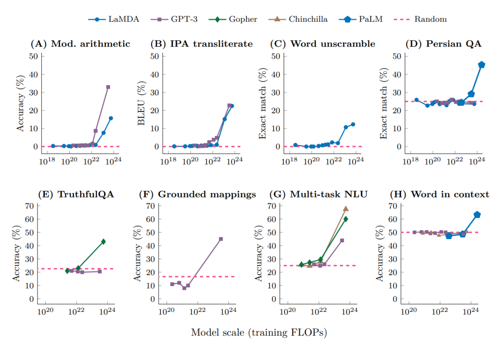
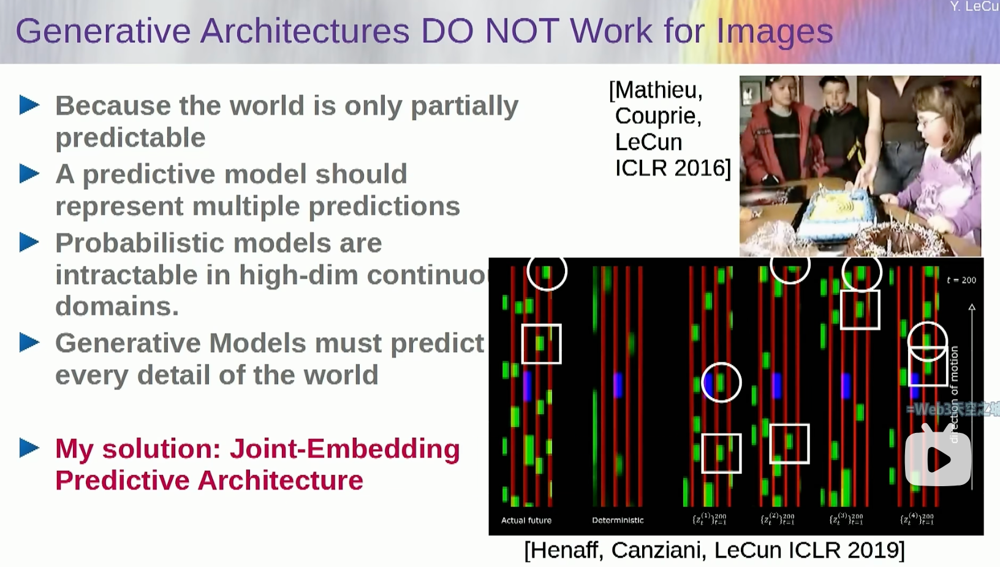

# AIGC-Algorithms

## 历史发展

* 计算智能 -> 感知智能 -> 通用智能
* emergent ability
  * [How much bigger can/should LLMs become?](https://cmte.ieee.org/futuredirections/2023/04/24/how-much-bigger-can-should-llms-become/)
  * https://arxiv.org/abs/2206.07682
  * 100TB=50000Billion

* AGI
  * 头部公司预测3-5年，这个跨度的故事是好故事

* Note
  * GPT-3.5相比于GPT-3，参数量变化不大，效果差距很大，这是由于微调技术

## Literature Review

> from InteRecAgent

* Survey
  * 《Pretrain, prompt, and predict: A systematic survey of
    prompting methods in natural language processing》

* LLM capability
  * in- context learning
    * 《few-shot learners》
  * instruction following
  * planning and reasoning

* alignment
  * 《Training language models to follow instructions with human feedback》

* leverage LLMs as autonomous agents
  * equipped LLMs with an external memory
  * CoT and ReAct：propose to enhance planning by step-wise reasoning;
  * ToT and GoT：introduce multi-path reasoning to ensure consistency and correctness
  * Self-Refine and Reflexion：lead the LLMs to reflect on errors
  * To possess domain-specific skills，guiding LLMs to use external tools
    * such as a web search engine
    * mathematical tool
    * code interpreters
    * visual models
    * recommender systems

> from MindMap

* LLM应用于生产的局限性
  * Inflexibility. 
    * The pre-trained LLMs possess outdated knowledge and are inflexible to parameter updating. Fine-tuning LLMs can be tricky be-
      cause either collecting high-quality instruction
      data and building the training pipeline can be
      costly (Cao et al., 2023), or continually fine-
      tuning LLMs renders a risk of catastrophic for-
      getting (Razdaibiedina et al., 2022).
  * Hallucination. 
    * LLMs are notoriously known to produce hallucinations with plausible-sounding
      but wrong outputs (Ji et al., 2023), which causes
      serious concerns for high-stake applications such
      as medical diagnosis.
  * Transparency. 
    * LLMs are also criticized for their
      lack of transparency due to the black-box na-
      ture (Danilevsky et al., 2020). The knowledge
      is implicitly stored in LLM’s parameters, thus
      infeasible to be validated. Also, the inference
      process in deep neural networks remains elusive
      to be interpretable
* CoT、ToT
  * 挖掘LLM的implicit知识
  * 相应地，MindMap同时挖掘explicit and implicit知识

## Intro

* 大模型最重要的演进方向：
  * 一、世界知识方面如何有效消除幻觉
    * 随着数据规模增大，遇到的新知识比例就越低，在世界知识方面就体现出Scaling law的减缓现象。
  * 二、如何大幅提升复杂逻辑推理能力。
    * 逻辑推理相关数据比例低，更慢。
    * 现在为了提高模型逻辑能力，往往在预训练阶段和Post-training阶段，大幅增加逻辑推理数据占比的原因，且是有成效的。
  * 语言能力已不是问题。

* [Yann LeCun演讲“人类水平的AI”@ Husdon论坛 2024.10](https://www.bilibili.com/video/BV1b1ycYTECU)
  * 介绍了算法沿袭
  * Moravec's Paradox: AI做不到一些人类很容易做的事情

### token

* token是LLM训练推理的最小单元，由tokenizer模型将文本切成token
  * 可能是 1/3 个汉字（因为汉字的UTF-8编码是三个字节，取一个字节）、一个汉字、半个单词等
  * 和模型设计有关：
    * 多语言大模型：汉字拆开
    * 中文大模型：一个token对应一个汉字
  * 和消耗算力有关
    * ->中文大模型更便宜

## Attention Is All You Need

* The best performing models also connect the encoder and decoder through an attention mechanism. 
  * Encoder: 映射到另一个语义空间
* Self-attention, sometimes called intra-attention is an attention mechanism relating different positions of a single sequence in order to compute a representation of the sequence.
* 模型结构是什么？
  * 过N个注意力层，再过一个full connection
  * Attention(Q,K, V) = softmax(QK^T/sqrt(d_k))V

* 模型参数是什么？
  * 词嵌入向量
    * learnable?
  * 将词嵌入向量转化为q、k、v向量的三个矩阵和bias
* 模型输出是什么？
  * 全连接层的结果，一个长度为全部词汇数量的向量
  * 如何增强随机性：
    * top-k采样

* The Transformer follows this overall architecture using **stacked self-attention and point-wise**, fully connected layers for both the encoder and decoder, shown in the left and right halves of Figure 1
  * 左边encoder，右边decoder
    * Encoder: 自注意力
    * Decoder：Q用outputs embedding做masked attention后的结果，K、V用encoder结果
    * 表征向量512维
  * masked multi-head attention保证输出对输入的感知序列不会超出长度
  * 自注意力机制：Q（输入矩阵）、K（字典）、V
    * 用1/(dk)^(1/2) scale了一下QK的乘法，可能是为了防止gradient太小
    * Dot product的结果方差比additive attention的方差大

* Multi-head attention

### Implementation

* TODO2: https://tensorflow.org/text/tutorials/transformer

### transformer外的模型结构

| 架构        | 设计者                                               | 特点                                     | 链接                                                         |
| ----------- | ---------------------------------------------------- | ---------------------------------------- | ------------------------------------------------------------ |
| Transformer | Google                                               | 最流行，几乎所有大模型都用它             | [OpenAI 的代码](https://github.com/openai/finetune-transformer-lm/blob/master/train.py) |
| RWKV        | [PENG Bo](https://www.zhihu.com/people/bopengbopeng) | 可并行训练，推理性能极佳，适合在端侧使用 | [官网](https://www.rwkv.com/)、[RWKV 5 训练代码](https://github.com/BlinkDL/RWKV-LM/tree/main/RWKV-v5) |
| Mamba       | CMU & Princeton University                           | 性能更佳，尤其适合长文本生成             | [GitHub](https://github.com/state-spaces/mamba)              |

目前只有 transformer 被证明了符合 scaling-law。

## BERT

## GPT-2

* 自回归架构
  * 局限性：只接受离散样本

* TODO1: https://jalammar.github.io/illustrated-gpt2/

## ChatGPT

* 对话式大型语言模型：https://openai.com/blog/chatgpt/
  * 自回归语言模型：帮助背下来事件知识
  * 大语言模型：百亿参数以上
    * 不好做finetune，成本高
    * 用prompt作为输入，generated text作为输出
    * 语言知识 + 事件知识，事件知识更需要大模型

  * 未来：AGI(Artificial General Intelligence)；教会它使用工具

* 三个关键技术：
  * In-Context Learning 情景学习
    * 在前向中学习
    * 涌现能力：百亿参数规模之后，能力突然提升，改变传统学习范式
    * 大幅降低下游任务开发成本
    * 《Rethinking the Role of Demonstrations: What Makes In-Context Learning Work?》 --> 随机label仍可能提升效果
  * Chain-of-Thought, CoT 思维链
    * 《PAL: Program-aided Language Models》，让语言模型生成能由计算模型执行的描述代码
    * 在大模型中打破scaling law
  * Learning from Natural Instructions 自然指令学习
    * 很像情景学习，样本逐渐简化（负例不需要suggestion；不需要负例）
    * https://instructions.apps.allenai.org/
    * OpenAI: 通过人类反馈对齐人类指令
* **大模型具备了对知识的跨语言能力**
* RLHF
  * 见【算法-finetune-RLHF】部分
* limitations
  * Correctness: 模型不是全知的，一本正经地胡说八道
  * sensitive to rephrase
  * verbose
  * No asking clarifying questions，而是猜
  * it will sometimes respond to harmful instructions or exhibit biased behavior

* [Iterative deployment](https://openai.com/blog/language-model-safety-and-misuse/)
* Evaluation
  * Holistic Evaluation of Language Models

* Note
  * 科技部部长王志刚表示，ChatGPT有很好的计算方法，同样一种原理，在于做得好不好；就像踢足球，都是盘带、射门，但是要做到像梅西那么好也不容易。
  * 客观题高考515分水平
* [专访Altman](https://www.pingwest.com/a/285835)

  * **感想**：有几个点值得关注：ai自运行的能力、ai隐藏意图的能力、ai与真实物质世界接口的能力、ai认识到自己的现实处境并差异化处理的能力

    * 当这些能力完全具备，可能AGI确实可以毁灭人类

  * 当他观察模型的隐藏层时，发现它有一个专门的神经元用于分析评论的情感。神经网络以前也做过情感分析，但必须有人告诉它们这样做，而且必须使用根据情感标记的数据对它们进行专门的训练。而这个神经网络已经自行开发出了这种能力。
  * 语言是一种特殊的输入，信息量极为密集
  * "假设我们真的造出了这个人工智能，其他一些人也造出了"。他认为，随之而来的变革将是历史性的。他描述了一个异常乌托邦的愿景，包括重塑钢筋水泥的世界。他说："使用太阳能发电的机器人可以去开采和提炼它们需要的所有矿物，可以完美地建造东西，不需要人类劳动。"你可以与 17 版 DALL-E 共同设计你想要的家的样子，"Altman说。"每个人都将拥有美丽的家园。在与我的交谈中，以及在巡回演讲期间的舞台上，他说他预见到人类生活的几乎所有其他领域都将得到巨大的改善。音乐将得到提升（"艺术家们将拥有更好的工具"），人际关系（人工智能可以帮助我们更好地 "相互对待"）和地缘政治也将如此（"我们现在非常不擅长找出双赢的妥协方案"）。
  * GPT-4学会了“说谎”：验证码

    * -> 让GPT-4讲解自己做事情的目的，将不再可靠
    * Sutskever 说，他们可能会在弱小的时候采取一种行动，而在强大的时候采取另一种行动。我们甚至不会意识到，我们创造的东西已经决定性地超越了我们，我们也不知道它打算用自己的超能力做些什么。

## GPT-4

* GPT-4幕后的研发团队大致可分为七个部分：预训练（Pretraining）、长上下文（Long context）、视觉（Vision）、强化学习和对齐（RL & alignment）、评估和分析（Evaluation & analysis）、部署（Deployment）以及其他贡献者（Additional contributions）
* [GPT-4技术报告](https://mp.weixin.qq.com/s?__biz=Mzk0NzQzOTczOA==&mid=2247484155&idx=1&sn=5ef0fcf20d4b87366269d3c0cf4312c0&scene=21#wechat_redirect)
  * 32k对应50页的context
* [Language models can explain neurons in language models](https://openai.com/research/language-models-can-explain-neurons-in-language-models)
  * 步骤：
    * GPT-4解释某个GPT-2神经元的行为
    * 用GPT-4模拟这一行为
    * 比较并打分

  * OpenAI 共让 GPT-4 解释了 GPT-2 中的 307200 个神经元，其中大多数解释的得分很低，只有超过 1000 个神经元的解释得分高于 0.8。
  * 三种提高解释得分的方法：
    - 对解释进行迭代，通过让 GPT-4 想出可能的反例，根据其激活情况修改解释来提高分数。
    - 使用更大的模型来进行解释，平均得分也会上升。
    - 调整被解释模型的结构，用不同的激活函数训练模型。
  * https://github.com/openai/automated-interpretability
  * 传统的视觉解释方法不能scale well
    * https://openai.com/research/microscope
    * https://distill.pub/2020/circuits/curve-detectors/

## MLLM(Multimodal LLM)

### Intro

* Modal: 图片、视频、音频、文本

* MLLM = LLM + 接收、推理多模态信息的能力

  * 听雨声，判断路面情况，今天是否适合出门
  * 概念：单模态、多模态、跨模态、多模态语言大模型
  * 单模态
    * 
    * LVM
  * 跨模态：
    * 音频->视觉：数字人
      * 蚂蚁Echomimic：实时渲染口播
      * 快手：LivePortrait
        * 非人、卡通，都能驱动
      * SadTalker paper/code
      * 浙大、字节 Real3d-portrait
      * ani-portrait
      * facebook research：audio2photoreal
    * 文本->音频：
      * TTS、音色克隆、少样本：GPT-SoVITS
        * 情感色彩、语调，一般
      * ChatTTS
        * 有情感色彩

  

## GPT-4o、Sora

> GPT 4o本质上是要探索不同模态相互融合的大一统模型应该怎么做的问题，对于提升大模型的智力水平估计帮助不大

* 技术报告：https://openai.com/research/video-generation-models-as-world-simulators

* [一锤降维！解密OpenAI超级视频模型Sora技术报告，虚拟世界涌现了](https://mp.weixin.qq.com/s/ODsebK3fEc-adRDwRVDhQA?poc_token=HMxd12WjhN3a1nz74MaIrMjep8dIn2Cj_NTdFwef)

  * 扩展视频生成模型的规模，是构建模拟物理世界通用模拟器的非常有希望的方向
  * patch
    * 从宏观角度来看，研究者首先将视频压缩到一个低维潜空间中，随后把这种表征分解为时空patch，这样就实现了从视频到patch的转换。
    * 在推理时，可以通过在一个合适大小的网格中适当排列随机初始化的patch，从而控制生成视频的大小。
  * 训练技巧
    * 直接在视频原始比例上训练
    * 研究者采用了DALL·E 3中的重新标注技术，应用在了视频上。
      * 首先，研究者训练了一个能生成详细描述的标注模型，然后用它为训练集中的所有视频，生成文本说明。
      * 他们发现，使用详细的视频说明进行训练，不仅能提高文本的准确性，还能提升视频的整体质量。
      * 类似于DALL·E 3，研究者也使用了GPT，把用户的简短提示转化为详细的说明，然后这些说明会被输入到视频模型中。

  * 生成的视频特点：
    * 多种输入形式、多视频间过渡、人和物的特征

## OpenAI o1

> o1本质上是在探索大模型在AGI路上能走多远、天花板在哪里的问题

* [如何理解OpenAI o1](https://mp.weixin.qq.com/s/QdVSq8q7wLWtPakdZdqidA)

  * 提升LLM模型认知能力的核心在于复杂逻辑推理能力。

    * LLM的逻辑推理能力越强，则能解锁更多复杂应用，大模型应用的天花板就越高
    * o1模型能力越强，则可以反哺基座模型

  * o1的做法本质上是CoT的自动化or内化。

    * rl搜索COT的决策空间
    * 问题越复杂，隐藏的COT token消耗越大

    * 大部分逻辑推理数据的形式是<问题，正确答案>，缺了中间的详细推理步骤，而o1本质上是让大模型学会自动寻找从问题到正确答案的中间步骤，以此来增强复杂问题的解决能力。

  * RL的scaling law本质上是COT决策树搜索的scaling law

  * Agent无法实用化的主要原因就在于基座模型的复杂推理能力不够强。

    * 通过基座模型Plan把一个复杂任务分解为10个步骤，哪怕单个步骤的正确率高达95%，要想最后把任务做对，10个环节的准确率连乘下来，最终的正确率只有59%

  * OpenAI想做的方向太多，资源分散导致分到具体一个方向的资源不够用，所以越往后发展“期货状态”的方向越多，也让人觉得尽显疲态。

## AGI

### Lecun

> LeCun: https://www.bilibili.com/video/BV1b1ycYTECU
>
> 视频其中一个核心思想是“预测能力的本质是我们找到我们观察的事物的良好表征”，事实上现在人类做机器学习的工作大部分是在 寻找表征、优化表征。
>
> 最近一段时间伴随LLM出现，技术领域的发展不外乎这两种：1）利用LLM学到的表征去做一些事情；2）让LLM学会更多表征。

* Lecun的Insight：需要视觉信息训练
  * 反驳“视觉信息冗余”
    * 视神经纤维 1byte/s 已经相比视网膜光传感器有1/100的压缩比了
      * 6000w-1e8光传感器
      * 100w神经纤维
    * self-supervised learning需要冗余信息才能学好
      * 高度压缩==随机 -> 学不好

* Objective-Driven AI
  * 转化为优化问题，让决策output接近objective，需要先优化perception
  * optimization-based AI
    * 有zero-shot能力
    * search/plan

* 系统
  * Model Predictive Control（MPC）
    * using gradient-based method, graph search, MCTS, DP, ...
  * 分层的planning，world model预估级联

* 训练：
  * 观察婴儿对世界模型的认知路径，可以启发各种属性的认知顺序和难度（比如对重力的认知）
  * generative + self-supervised行不通

* Joint Embedding Predictive Architecture
  * 预测能力的本质是我们找到我们观察的事物的良好表征
    * e.g. 电商场景下的类目体系，类目是对商品的向上一层的抽象表征

* VICReg
  * 先扩维再正则化

* Video-JEPA
  * 蒸馏防止collapse

### 其它

* 豆包大模型视觉 https://zhuanlan.zhihu.com/p/5761953085

  * 尽管Scaling在Sora上取得成功，但不足以使视频生成模型真正理解并泛化应用基本的物理定律。
    * 模型仅在训练数据分布内表现良好，分布外表现较差，不过Scaling对组合泛化（需组合训练时已熟悉的概念或对象）有效；
    * 模型无法抽象出一般规则，而是试图模仿最接近的训练示例；
    * 当模型参考训练示例时，甚至存在顺序偏好：颜色 > 大小 > 速度 > 形状；

  * 训练数据分布内（in-distribution）：训练数据和测试数据来自同一分布，**表现良好**；
  * 训练数据分布外（out-of-distribution）：模型在面对从未见过的新场景时，是否能够将已学过的物理定律应用到未知的情境，**表现不佳**；
  * 组合泛化（combinatorial generalization）：介于前两者之间，训练数据已包含了所有概念或物体，但这些概念、物体并未以所有可能的组合或更复杂的形式出现，**Scaling有效**；
  * 视频模型具有**三种基本组合模式**，分别为：
    - 属性组合
    - 空间组合（多个物体不同运动状态）
    - 时间组合（不同的时间点多个物体的不同状态）

  * 视频生成的Scaling Law**应当侧重于增加组合多样性，而不仅仅是扩大数据量**。

## In-context Learning

https://ai.stanford.edu/blog/understanding-incontext/

## CoT 相关技术

* [OpenAI研究员、思维树作者姚顺雨专访：人生是一场无限流游戏丨独家](https://mp.weixin.qq.com/s/MdPI-X1HvRxFuX_Z0Ju_ug)
  * 许多计算本质上就是去计算下一个token，next token prediction开始成为一个新的计算。那么针对计算复杂性，传统的语言如何在新框架下适用，还有很多问题需要去解决
  * Open-endedness
    * 语言游戏之所以和其他游戏区别很大，就是因为语言的开放性，即open-endedness。既然这样，那么它本质上应该有一个generative solution，而不是一个discriminative solution。所以从我第一个工作开始，我就一直在做autoregressive language model (GPT-2)
    * 从哲学的角度来看，人生就是一个无限流游戏，某种程度上来说，更像一个文字游戏，而不是电子游戏。每天你都有很多选择，从程度上说是非常high level、 open ended的。
  * ReAct
    * 这篇论文的本质是Agent不仅仅有environment action，也有thinking action。
    * 主要的思路是，在玩文字游戏的时候，为什么机器很笨，而人很聪明，是因为人类有思考的能力。当时我在做ReAct的时候，最初的想法是，如果我能够让机器模仿人，不仅仅是模仿人的活动，也模仿人怎么思考，是不是就可以泛化得更好。具体比如人看到了一个城堡，人的选择是走向第三个门，如果你只去模仿这样的Mapping，很多时候是很难去泛化的。但是如果能够让它同时去模仿人的思考过程，那可能就是一个非常自然的、可以泛化的一个理由。比如人可能会想，现在周围很黑暗而且有奇怪的叫声，可能有危险需要灯。灯在第一个房间，但是第一个房间的钥匙在第三个房间，所以我得先去第三个房间。
  * CoT的扩展
    * 从某种程度上来说，ReAct和Tree of Thoughts其实相当于是CoT的两个方向的扩展。一个方向是要和外部世界发生联系，另一个方向是内部的思考，如何从一个线性过程变成一个非线性，也就是更加通往 system 2的一个过程。
  * 身边太多聪明的人，但你发现自己并不比他们差。做研究非常重要的因素就是信心，如果你不相信能做出非常好的研究，那你是不可能做出来好的研究的。

## Finetuning

### Intro

* finetune v.s. from scratch
* 如何做finetune
  * 基座模型选型
* 全参数finetune和小参数量finetune
  * 小参数量finetune
    * Adapters
    * Prompt-tuning v1/v2
    * LoRA

* finetune需求
  * OpenAI: 1.3w条SFT prompt
  * embedding：至少10w条数据，相似性和同义性
* 很厉害的alpaca

#### RLHF

* Reinforcement Learning from Human Feedback (RLHF), using the same methods as [InstructGPT](https://openai.com/blog/instruction-following/), but with slight differences in the data collection setup
  * RLHF的blog介绍：https://huggingface.co/blog/rlhf
    * supervised fine-tuning: human AI trainers provided conversations in which they played both sides—the user and an AI assistant
  * 步骤：
    * 预训练一个语言模型 (LM) ；
    * 聚合问答数据并训练一个奖励模型 (Reward Model，RM) ；
    * 用强化学习 (RL) 方式微调语言模型（LM）。
      * 长期以来，出于工程和算法原因，人们认为用强化学习训练 LM 是不可能的。而目前多个组织找到的可行方案是使用策略梯度强化学习 (Policy Gradient RL) 算法、近端策略优化 (Proximal Policy Optimization，PPO) 微调初始 LM 的部分或全部参数。因为微调整个 10B～100B+ 参数的成本过高 (相关工作参考低秩适应 LoRA 和 DeepMind 的 Sparrow LM)
  * reward model: 人工打分
    * 人工写答案 -> 人工选答案 -> 机器选答案
    * prompt dataset
    * fine-tune the model using [Proximal Policy Optimization](https://openai.com/blog/openai-baselines-ppo/)
    * 一些巧妙的打分方式：
      * 客服点按钮，选取ai答案，也是finetune过程
      * reddit帖子中的最高分

* 

#### LoRA

https://github.com/huggingface/peft

### Literature Review

* finetuning分类
  * full：Training Language Models to Follow Instructions with Human Feedback
    * aligned with human preferences with instruction-tuning

  * 高效的：LoRA: Low-Rank Adaptation of Large Language Models

* Pre-trained LLMs can be adapted to domain tasks with further fine-tuning
  * 《Large language models encode clinical knowledge》
* fine-tuned LLMs fail to learn from examples
  * DAIL-SQL

### Alignment

https://github.com/tatsu-lab/stanford_alpaca

指令微调是什么? - superpeng的回答 - 知乎
https://www.zhihu.com/question/603488576/answer/3178990801

* 指令微调是一种特定的微调方式，在不同的论文中以不同的方式引入。我们在一个新的语言建模任务上对模型进行微调，其中的示例具有额外的结构，嵌入到模型提示中。
  * 先无监督训练，再用有监督的“指令-回答“预料
  * 指令调整模型接收一对输入和输出，描述引导模型的任务。
* 核心思路：解决“回答问题”与“接话”的差异
* Note：
  * 数据获取昂贵（RLHF人工打分的成本比人工写故事要低）
  * 对开放性问题效果不好（write a story about ...）

### SFT

### FoodGPT: A Large Language Model in Food Testing Domain with Incremental Pre-training and Knowledge Graph Prompt

* Incremental Pre-training 增量预训练
  * 图像和扫描文档
    * 存储大量领域标准文档信息，使用 OCR 技术处理。因文档可能超模型训练序列长度，按章节拆分，为防描述冲突，给数据章节添加前缀（通过 UIE 模型提取文档名，启发式生成方法构建前缀）。同时用 BERT 和 GPT - 2 计算文本章节中句子的困惑度，排除高困惑度句子。
  * 结构化知识
    * 存在于私有结构化数据库，由人工输入的表格组成。创建 Datav1 和 Datav2 两个版本用于增量预训练。Datav1 去除机密隐私信息后用字典构建数据，以 “测试项目” 为键，对应多个具体测试项目的表格（markdown 格式）为值；Datav2 采用新方法序列化，去除机密隐私信息后合并部分无单独意义的字段，输入 ChatGPT 按规则随机生成文本。
  * 其他类型数据
    * 包括食品检测字典、中国食品检测教程和研究论文、食品情感数据、食品安全相关法律、食品安全相关考题等，选择 Chinese - LLaMA2 - 13B 为基础模型，用 LoRA 方法进行增量预训练。

* Instruction Fine-tuning

  - 数据集构建
    - 通过两种方式构建指令微调数据集。一是从食品论坛选取相关主题，抓取大量问答对，优先选择发帖频率高的用户以确保高质量答案；二是与食品检测领域专家合作设计 100 个高质量种子指令，用 evol - instruct 方法扩展和多样化。

  - 训练过程
    - 用 LoRA 方法对 Chinese - LLaMA2 - 13B 的指令进行微调。

## Long-Context

* 早期GPT的上下文只有4K
* 超大的上下文窗口=超长的短期记忆
* 128K Token = 124K Input Token + 4096 Output Token

## Interpretability

* Intro
  * 关于可解释性，诙谐的举例，青少年在想什么无法理解，有些东西就是很难理解，但他真实存在并work，青少年也是人

* sparse autoencoders (SAEs) , Anthropic's paper https://transformer-circuits.pub/2024/scaling-monosemanticity/

* Interpretability在电商场景的潜在应用 https://www.vantagediscovery.com/post/the-future-of-e-commerce-is-ai-powered-and-interpretable

  * **Hyper-Personalized Product Discovery**
    * Scenario: An e-commerce platform wants to move beyond basic recommendation algorithms and create truly personalized shopping experiences that resonate with individual customers. They need to understand not just what products customers interact with, but the underlying reasons and preferences driving their choices.
    * Solution: By using SAEs to analyze the LLM activations associated with user browsing behavior, purchase history, and product interactions (e.g., reviews, ratings, wishlists), the platform can extract nuanced features representing individual preferences and decision criteria. For example, features might emerge for "aesthetic style," "sustainability concerns," "value for money," "brand affinity," or specific functional requirements.
    * 

  * **Optimized Merchandising and Assortment**
    * Scenario: A retailer using an e-commerce platform wants to make data-driven decisions about inventory management, product assortment, and merchandising strategies. They need to understand which products are resonating with customers, which attributes are driving demand, and how to optimize pricing and promotions for maximum profitability.
    * Solution: By applying SAEs to analyze the LLM activations linked to product sales data, customer reviews, and market trends, the platform can identify crucial features influencing purchasing decisions. These might include features like "price sensitivity," "seasonal demand," "regional preferences," or "emerging trends" related to specific product attributes.
  * **Enhanced Explainable Search**
    * Scenario: A customer searches for "running shoes" but is dissatisfied with the results, feeling they are too generic.
    * Solution: The platform could use SAEs to analyze the search query's representation in the LLM's activation space. By identifying the activated features, they could provide an explanation to the customer, like "We are showing you popular running shoes based on your location and browsing history." Additionally, the platform could offer "steering" options based on other relevant features. For example, they could suggest refining the search by "cushioning," "terrain," or "price range."

## 幻觉

《Lost in the middle: How language models use long contexts》

- 自然语言生成中关于幻觉研究的综述：https://arxiv.org/abs/2202.03629
- 语言模型出现的幻觉是如何滚雪球的：https://arxiv.org/abs/2305.13534
- ChatGPT 在推理、幻觉和交互性上的评估：https://arxiv.org/abs/2302.04023
- 对比学习减少对话中的幻觉：https://arxiv.org/abs/2212.10400
- 自洽性提高了语言模型的思维链推理能力：https://arxiv.org/abs/2203.11171
- 生成式大型语言模型的黑盒幻觉检测：https://arxiv.org/abs/2303.08896

## 安全 & 伦理

> 仅一天就被外媒封杀 前谷歌CEO到底说了... https://v.douyin.com/iBttgjpb/

### AI战争

* 美国白鹤计划crane war
  * 机器人/无人机摧毁整个军队理论（坦克、炮兵、迫击炮），让地面进攻成为不可能
  * 美国能源不足，加拿大发电，阿拉伯投资

### AI安全

* 关键问题：如何在一个学习了的系统中检测危险（比如混合某些化合物），并且你无法直接询问它这些内容
  * 解决方案：设定一个阈值，超过了向政府报告

### AI政治

* 对民主的威胁-虚假信息-aigc
  * 尝试解决tiktok问题：平等时间规则（总统候选人的内容播出时间平等）
* 去中心化的思想构建未来的AI安全：https://mp.weixin.qq.com/s/K1gbW1aIkwl8aLzkD9nYnQ
  * 比特币：攻击收益远小于攻击成本
  * 以生态著称的公链以太坊：虽然秘钥也是几十位，但是系统就太复杂了，各种二层技术、跨链桥等带来了很多漏洞，以至于网络攻击不断，就是因为攻击收益大于攻击成本
  * 方案：确权，实名，竞争

### AI伦理

* 算法演变到最后会扩大“out of rage”，因为冲突带来流量
* 关于丢失工作：需要高等教育的工作没事，因为这些人会和系统协作

