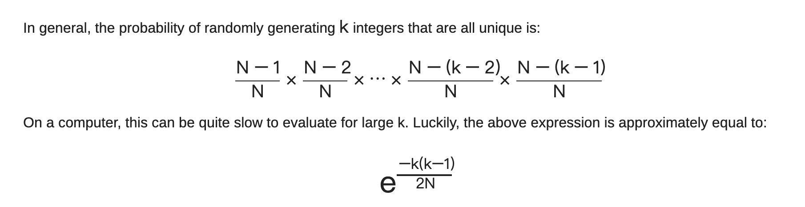

## Algorithms-Potpourri

* [格林公式在面积并问题中的应用](https://trinkle23897.github.io/posts/calc-circle-area-union) --- by n+e

* [Three Optimization Tips for C](https://www.slideshare.net/andreialexandrescu1/three-optimization-tips-for-c-15708507)

  * You can't improve what you can't measure

  * Reduce strength

  * Minimize array writes


```c++
uint32_t digits10(uint64_t v) {
  if (v < P01) return 1;
  if (v < P02) return 2;
  if (v < P03) return 3;
  if (v < P12) {
    if (v < P08) {
      if (v < P06) {
        if (v < P04) return 4;
        return 5 + (v < P05);
      }
      return 7 + (v >= P07);
    }
    if (v < P10) {
      return 9 + (v >= P09);
    }
    return 11 + (v >= P11);
  }
  return 12 + digits10(v/P12);
}

unsigned u64ToAsciiTable(uint64_t value, char* dst) {
  static const char digits[201] =
    "0001020304050607080910111213141516171819"
    "2021222324252627282930313233343536373839"
    "4041424344454647484950515253545556575859"
    "6061626364656667686970717273747576777879"
    "8081828384858687888990919293949596979899"
  uint32_t const length = digits10(value);
  uint32_t next = length - 1;
  while (value >= 100) {
    auto const i = (value % 100) * 2;
    value /= 100;
    dst[next] = digits[i + 1];
    dst[next - 1] = digits[i];
    next -= 2;
  }
  if (value < 10) {
    dst[next] = '0' + uint32_t(value);
  } else {
    auto i = uint32_t(value) * 2;
    dst[next] = digits[i + 1];
    dst[next - 1] = digits[i];
  }
  return length;
}
```

### 数据

在GPU里针对单精度和双精度就需要各自独立的计算单元, 一般在GPU里支持单精度运算的单精度ALU(算术逻辑单元)称之为FP32 core, 而把用作双精度运算的双精度ALU称之为DP unit或者FP64 core. 

- FP64: 用8个字节来表达一个数字, 1位符号, 11位指数, 52位小数，**有效位数为16位**. 常用于科学计算, 例如: 计算化学, 分子建模, 流体动力学
- FP32: 用4个字节来表达一个数字, 1位符号, 8位指数, 23位小数，**有效位数为7位**. 常用于多媒体和图形处理计算、深度学习、人工智能等领域
- FP16: 用2个字节来表达一个数字, 1位符号, 5位指数, 10位小数，**有效位数为3位**. 常用于精度更低的机器学习等


### 数据结构

#### Hash Table

* Open Hashing (Closed Addressing) v.s. Close Hashing (Open Addressing)
  * https://programming.guide/hash-tables-open-vs-closed-addressing.html
  * Open Hashing 的缺点：
    * 读放大
    * load key 有额外一次 memory read
    * rehash 时整个结构要重建
* [Hopscotch hashing](https://en.wikipedia.org/wiki/Hopscotch_hashing)
* Cuckoo Hashing: https://web.stanford.edu/class/archive/cs/cs166/cs166.1146/lectures/13/Small13.pdf
* GeoHash
* Key的均衡性
  * [MurmurHash](https://github.com/aappleby/smhasher/blob/master/src/MurmurHash3.cpp)
* HashTable实现中可用的设计：
  * per dim合并
    * 记录available indices提升分配速度
  
  * map只存indices，提升rehash速度
  

##### Hash Collision

https://preshing.com/20110504/hash-collision-probabilities/

* 存在冲突的概率：$$\frac{k^2}{2N}$$



* 冲突次数的期望：近似为 $$\frac{k^2}{N}$$
  * 冲突率：近似为 $$\frac{k}{N}$$
  * 证明：1）利用二项分布；2）假设每个位置最多冲突一次


#### LRU cache

* [linked-list based LRU cache](https://krishankantsinghal.medium.com/my-first-blog-on-medium-583159139237)
  * hashmap的value存双向链表节点的指针
* array-list based LRU cache
  * hashmap的value存array-list的index
    * Array-list的value存pre-index + post-index + entry
  * e.g. Persia

#### Radix Tree

[radix tree (Linux 内核实现)](https://lwn.net/Articles/175432/)：压缩前缀树，维护 kv 查找

前缀树的结构：

* 一棵子树的所有子节点都有相同前缀的 key 值

* 只有叶子节点有对应的 value 值

* key的最大长度固定

当 key 有以下特性的时候压缩前缀树比 hashmap 更具优势：

* 当存储的 key 值本身就有很好的 hash 特性，但是又非常稀疏时。比如说网段，地址空间，可以不用设计复杂 hash 函数。每次插入查找没有hash 计算的开销。
* 大量的 key 有着相同的前缀时，相比于 hashmap 每个节点都要存储完整的 key 值，更具有空间复杂度优势。

应用：[Trie](https://en.wikipedia.org/wiki/Trie)

#### Pairing Heap

https://en.wikipedia.org/wiki/Pairing_heap

实现简单、均摊复杂度优越，用于实现优先队列

定义：一个配对堆要么是一个空堆，要么由一个根元素与一个可能为空的配对堆子树列表所组成。所有子树的根元素都大于该堆的根元素。

```python
type PairingTree[Elem] = Heap(elem: Elem, subheaps: List[PairingTree[Elem]])
type PairingHeap[Elem] = Empty | PairingTree[Elem]
```

操作：

* 合并：一个空堆与另一个堆合并将会返回另一个堆；否则将会返回一个新堆，其将两个堆的根元素中较小的元素当作新堆的根元素，并将较大的元素所在的堆合并到新堆的子堆中。

```C++
function merge(heap1, heap2: PairingHeap[Elem]) -> PairingHeap[Elem]
  if heap1 is Empty
    return heap2
  elsif heap2 is Empty
    return heap1
  elsif heap1.elem < heap2.elem
    return Heap(heap1.elem, heap2 :: heap1.subheaps)
  else
    return Heap(heap2.elem, heap1 :: heap2.subheaps)
```

* 插入：将一个仅有该元素的新堆与需要被插入的堆合并。

```c++
function insert(elem: Elem, heap: PairingHeap[Elem]) -> PairingHeap[Elem]
  return merge(Heap(elem, []), heap)
```

* 删除最小：根元素即为最小元素。删除根元素，然后合并子树，合并方法为从左到右两两合并，然后再从左向右顺序合并。

```c++
function delete-min(heap: PairingHeap[Elem]) -> PairingHeap[Elem]
  if heap is Empty
    error
  else
    merge-pairs(heap.subheaps)
    return elem: Elem
function merge-pairs(list: List[PairingTree[Elem]]) -> PairingHeap[Elem]
  if length(list) == 0
    return Empty
  elsif length(list) == 1
    return list[0]
  else
    return merge(merge(list[0], list[1]), merge-pairs(list[2..]))
```

#### BloomFilter

https://en.wikipedia.org/wiki/Bloom_filter


### 数据处理

#### TopK

* std是对topK的近似

```python
 def get_topk_amax(tensor, percentile):
      tensor = tf.abs(tensor)
      tensor = tf.reshape(tensor, [-1])
      tensor_size = tf.cast(tf.size(tensor), tf.float32)
      k = tf.math.maximum(1, tf.cast(tf.math.ceil(tensor_size * (1-percentile)), tf.int32))
      topk, _ = tf.math.top_k(tensor, k=k)
      target_amax = topk[-1]
      return target_amax

  def get_std_amax(tensor, std_scale):
      return tf.abs(tf.reduce_mean(tensor)) + std_scale * tf.math.reduce_std(tensor)      

  def get_max_amax(tensor):
      return tf.reduce_max(tf.abs(tensor))
```


### 图算法

* Dijkstras's 算法：图的最短路径
  * 分层cluster的思想，超越dijkstras https://www.quantamagazine.org/new-method-is-the-fastest-way-to-find-the-best-routes-20250806/

* 社区发现 Louvain算法 https://zhuanlan.zhihu.com/p/558706129
