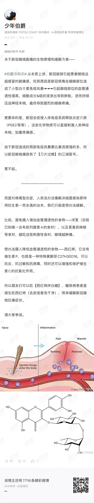
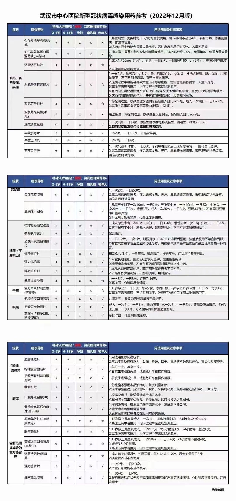
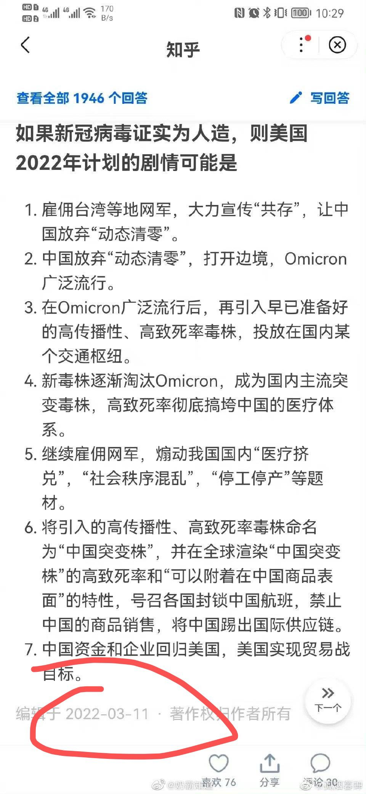
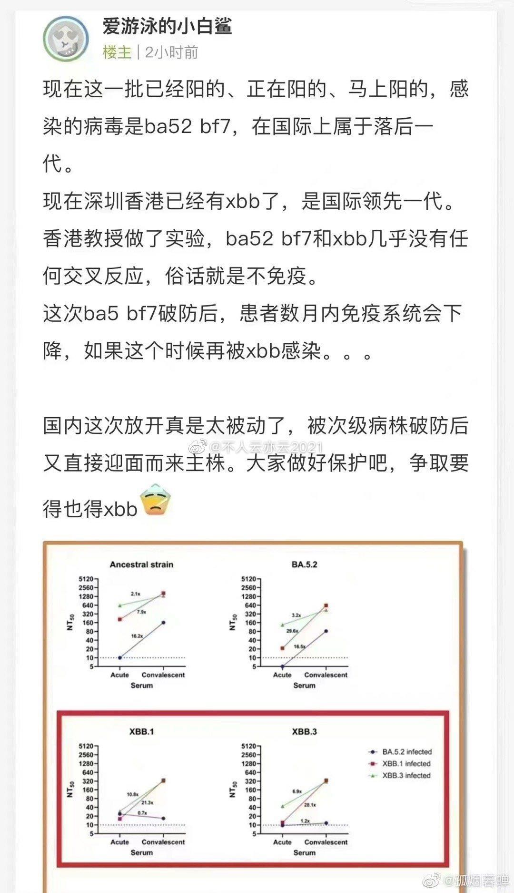
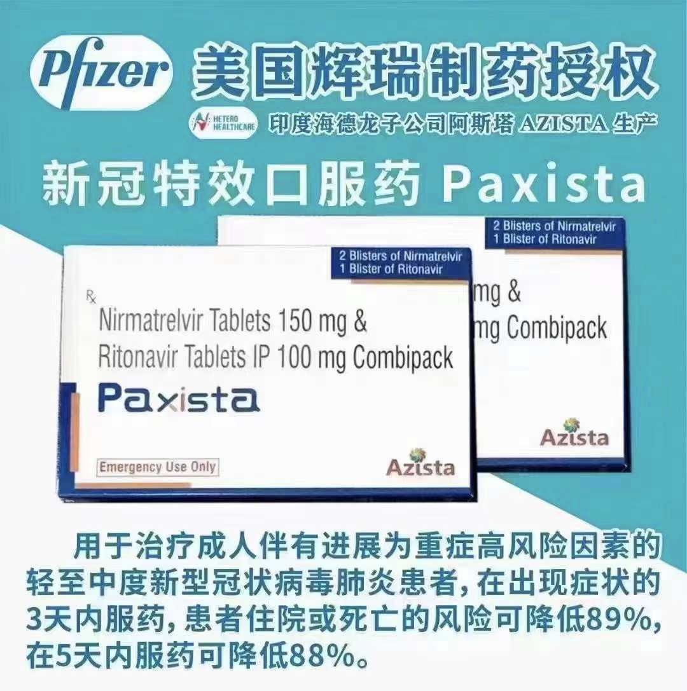
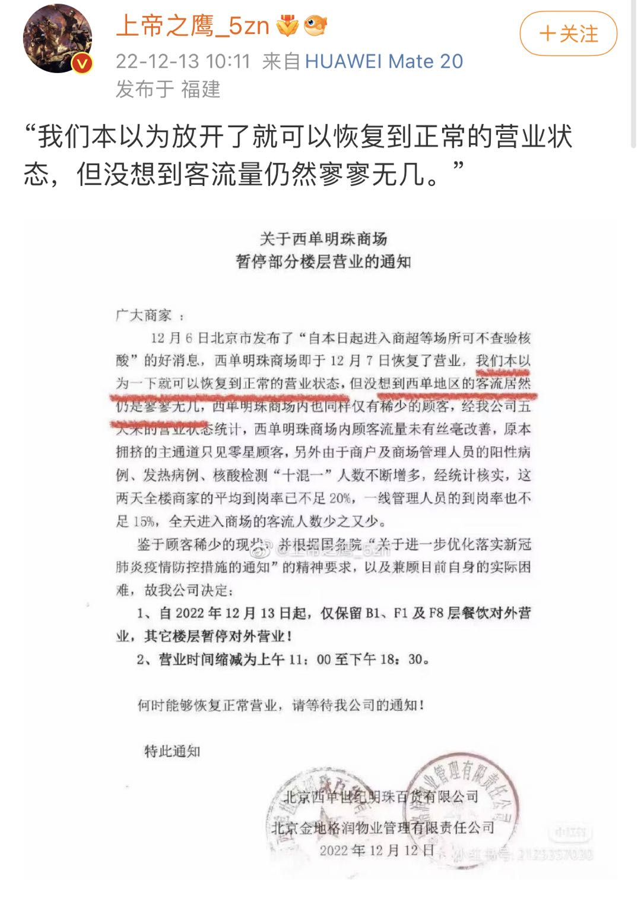

### 日常行为

#### 核心逻辑

* 感知外界的病毒浓度，关注并降低自身和周围环境的病毒浓度
  * nonpharmaceutical interventions (NPIs): 非药物干预

* 时刻关注自己的“手”
  * 清晰定义“健康”、“污染”这两种状态，当手处于污染状态（接触了潜在污染源），随时消毒
  * **Sanitizer is everywhere.**
* 避开“三密“：密闭空间、密集场所、密切接触
* 不同场合的防护措施及应对细节：形成肌肉记忆

#### 场合应对

* 取快递、外卖
  * step 1: 戴口罩（即使不出门）
  * step 2: 拆开后，将外包装留在门口
  * step 3: 内包装喷消毒液带进屋，开内包装后把内容倒出来，内包装也扔外面
  * step 4: 消毒手
  * step 5: 取口罩
  * 快递的内容不一定会消毒，毕竟不是所有东西都可以消毒，但是保证摸了以后手是消毒的
* 出房间门
  * 戴口罩
  * 开窗通风（本质是室内应尽量通风，由于开了暖气，应抓紧离开房间的时间通风）
* 家居
  * 整体思路：[避免室内负压](https://mp.weixin.qq.com/s?__biz=MzU0MTA3ODA4NQ==&mid=2247493220&idx=1&sn=93c1ca17e8ecdf8a249e6d827e5a866e)，搞定各种门窗孔洞
    * [Free liFe的知乎回答](https://www.zhihu.com/question/568850755/answer/2800885837)
    * [关于防止遭受病毒气溶胶沿楼宇垂直系统入侵的一些措施建议-1.4版-2022.12.13](https://zhuanlan.zhihu.com/p/587386873)
    * 单元内，有可能上下连通的空气通道包括（有些通道可能有液封或止逆阀）：
      - 厨房的烟道，洗菜池下水管。
      - 卫生间的排风道，洗衣机/淋浴地漏，坐便下水管，洗脸池下水管。同层左右连通的空气通道。
      - 入户门（关门后的门缝）
  * 卫生间：[卫生间如何“防新冠”？ - 装修院长的文章 - 知乎](https://zhuanlan.zhihu.com/p/108054711)
    * 下属管道：U形、往里灌84
    * 地漏：U形、注意水封（勤注水）、往里灌84、可以用保鲜膜覆盖
    * 换气扇：止逆阀
      * 无阳性，开换气扇；有阳性，关换气扇
      * **万一水封状态不确定，不要打开换气扇**
    * 洗手盆：不宜用盆塞，防止拔开盆塞放水自虹吸效应导致水封损失
    * 开窗
    * **冲水时和冲水后，均关闭马桶盖**
    * [警惕住宅楼内卫生间新冠病毒气溶胶传播 - 朱博说空气的文章 - 知乎](https://zhuanlan.zhihu.com/p/500731940)
      * 出现气溶胶病毒大量且快速传播的建筑主要特征：有通风竖井；同单元同户型传播；自下而上传播；（采暖季，存在热浮升气流）
    * 卫生间门：如果有吸油烟机造成的室内负压，建议始终关闭
  * 烟道
    * 安装止逆阀
    * 抽油烟机常开
  * 室外消毒：给自己的门、门把手、门地板定期喷洒消毒剂
  * 开入户门的时候，别开窗，关上厨房和厕所的门，减少和楼道对流
* 电梯
  * 一次性用品来按，比如用纸
  * 带一支弹出式的圆珠笔
  * 如果手头没有任何一次性的用品，我就用左手小指的指关节去按
    * 因为即便我这个部位摸了电梯按钮，我剩余手指还能继续握着手机保持相对的干净，过后我再用立马用消毒液消手就好（所以要随身携带）
  * “电梯超过三名乘客我是不会上去的，如果有人不戴口罩或者牵着大狗我也不会同乘”
* 超市购物
  * 消毒购物推车的把手
  * 买到的东西不急着用或者不急着放入冰箱的就在玄关处放着静置
  * 菜的话就不单独消毒了，清洗就行
* 就餐
  * 一般不下馆子
  * 食堂：
    * 取餐前先消毒手，以后多拿几张餐巾纸，在餐桌上铺一个小的干净区域给我自己
    * 拿一张餐巾纸放桌上的远处，口罩外面向下放在那个纸上，吃完饭就把口罩戴上
    * 硬核细节。。小孩去学校带上三明治，摘一次口罩吃一大口，再戴上口罩慢慢嚼
* 外出回家
  * 地垫摩擦给鞋子消毒，换拖鞋
  * 脱外衣裤悬挂（紫外线衣柜）
  * 免洗消毒液消毒手部、手机、门把手
  * 洗手（最好直接洗澡）
  * 若接触了严重污染源：盐水洗鼻、漱口
    * [盐水洗鼻的预防原理](https://zhuanlan.zhihu.com/p/514625834)，奥密克戎主要在上呼吸道繁殖（鼻腔、气管、支气管、咽喉），洗鼻可能有帮助。个人觉得预防的作用大于治疗。

* 旅行
  * 飞机火车戴n95，不吃飞机餐，带消毒湿巾随时擦

#### 感染后

* 退烧药
* 喝水（2L/天），最好是vc泡腾或电解质水
* 在家戴口罩，保护家人，避免飞沫溅在家具上
* 洗鼻子，降低上呼吸道病毒浓度
  * 某作者说一天要洗20次，存疑
* 漱口水，降低口腔内活病毒载量
* 合衣而眠方便夜里起来
* [不要剧烈运动](https://www.xiaohongshu.com/discovery/item/639d81b90000000019023871)
* 同居者如何降低中招概率
  * 及时检测
  * 独立房间、独立卫生间
  * 无接触吃饭
  * 空气净化器及相应的通风方案
  * 门底密封条

### 新冠方法论

#### 防疫心得

* [共存区往事——如何保护自己，正常生活【12.16】 - Luxenius的文章 - 知乎](https://zhuanlan.zhihu.com/p/579970078)
  * 共存的本质：在疫苗的人工免疫和反复感染的自然免疫下，形成相当程度对重症的免疫力（而非对感染的免疫），从而达成弱化感染后果的效应。注意，主要不是病毒自身的弱化，是免疫的强化。
    * 而共存最终要成功，则需要否认疫情。除身中疫易，除心中疫难。这不完全是自欺欺人。只有否认疫情的存在，才能恢复安全感，也才能最大程度减轻对后果的道德负担，才能恢复「常态」
  * “晚阳”的好处，参考【病——理论】部分
    * “做好个人防护完全有机会不感染，道理是这样的：在疫情的高峰期，社会面阳性率极高，减少在人群密集区域的暴露并且做好规范防护；疫情高峰过去以后，社会面阳性率落入低谷，以日常基本的防护正常生活，被感染的概率很小，这样就有机会做到全程不感染。”，[Ref](https://www.zhihu.com/question/571884460/answer/2802319861)
  * 疫苗
    * 三针灭活防重症的效果与mRNA疫苗在同一个水平
  * 新冠本质是**低个人风险，高社会风险，特殊人群高风险**
* [免疫钉子户养成记 合订本（2022年12月8日第三次更新）- 拍帮主](https://mp.weixin.qq.com/s/fg3gdjemJzkqBC5JC6YMsw)
  * CRBox
  * "三密"回避与风险判断
  * 二氧化碳检测仪和抗原试剂盒
  * 详细讲解了口罩气密性的话题
  * 以德州私立小学为例
    * Multi-layered Approach
    * 口罩+隔离+空气质量+检测+接种+风险评估
    * https://docs.google.com/document/d/1Syp8-kXkyTGgdnOPPfWS1rpq-CoOqVIawImaade1gNE/edit

* [新冠还没阳的同学需要注意什么 - 李主任在露营的小红书笔记](https://www.xiaohongshu.com/discovery/item/639c8f3f000000001b02411f)
  * 融入【日常行为】章节

#### 医生指导

* [家长和北京协和儿科医生的对话记录](https://m.hupu.com/bbs-share/56965866.html)
  * 吃点退烧药（儿童用美林）当感冒治，点到为止
  * 退烧药阻挡不住儿童高热惊厥
    * 高热惊厥只发生在前12个小时
  * 退烧后开始咳嗽，没有什么合适的镇咳药物
  * 日常
    * 多喝液体，少吃多餐
    * 物理降温：少穿少盖、多喝水、家里环境温度低一点
    * 温水澡没必要，因为温水比体温温度低
  * 关于母乳：中成药没有母乳喂养安全级别（谁都不知道），布洛芬有（不影响孩子）
  * 可能有 甲流、乙流、新冠、呼吸道合胞病毒 合并感染的情况
  * 单一亚型毒株的重复感染：一大家人最多在两周内就会结束，能保3-6个月的免疫

#### 公共卫生

* [即将来临的大创新：软件定义城市](https://mp.weixin.qq.com/s?__biz=MzAwNzY1NTYwMA==&mid=2453901290&idx=1&sn=751945e808303e7a36668a7780d490b3)
  * 科技克服霍乱疫情（1817年开始的100年）
    * 下水道和马桶
      * 雨果在1862年的《悲惨世界Les Misérables》中写到：L’égout, c’est la conscience de la ville. 下水道是一个城市的良心
    * 液氯过滤饮用水
    * 显微镜技术开始升级换代
    * 霍乱的治疗方法和疫苗
  * 展望了一些防疫管理、民生保障的思路

* [同事在4月份对公共卫生的一些思考](https://mp.weixin.qq.com/s/jJR2xP5pgxQoMlayl3xk5w)
  * 信息公开
    * 1）政府应该明确告诉群众当前辉瑞mrna/灭活疫苗一些关键的流行病学数据：不同r0毒株需要疫苗接种率达到多少才能实现群体免疫；当前各地区一针/三针疫苗接种率；不同群体在0针/一针/三针疫苗基础上的死亡率/重症率/抗感染力。
    * 2）政府应该明确告诉群众包括连花清瘟胶囊在内的各种治疗手段当前的功效/成本等，承诺兜底基本医疗保障
  * 社区组织能力
    * 社区医疗保障
    * 基本生活物资保障
  * 在现阶段，打开国门和动态清零是一个二元悖论。我们只能寄希望于一个感染率更强但是致死率更低的新毒株取代当前主流毒株，让党打开国门，拯救党的事业。什么时候会来？只能听天由命。

#### 国外情况

* [新冠现在到底是什么情况，是我们过于重视新冠还是国外太轻视新冠了？ - Luxenius的回答 - 知乎](https://www.zhihu.com/question/526746642/answer/2588784610)
  * 作者：作为医护人员经历了国内外的抗疫一线
  * 医院的分级诊疗体系、病人处理策略等
  * staffing issue：医护人员缺乏个人防护，交叉感染严重的问题
  * 世上的选项有四种：A、像多数发达国家一样共存； B、像极少数发达岛国一样清零；C、中国式的动态清零；D、其他第三世界国家的躺平。
    * 我们面临的选项其实不包含A和B，**只有C和D**。
    * 因为最重要的条件，不是人均床位多少、ICU资源有多丰富，而是**分级医疗体系**。
* [关于疫情，还是得用数据说话，实事求是 - 大白话时事](https://mp.weixin.qq.com/s/YDBS44RbWh3JtHqDOMOYaw)
  * 日本的8波疫情
    * 虽然奥密克戎在普遍打了疫苗和重复感染的前提下，死亡率大幅度降低，只有千分之二左右，但由于奥密克戎传染性远强于德尔塔，再加上躺平之后，短时间内感染人数远超去年同时期水平，所以实际新增死亡人数反而变多
    * 两波疫情的间隔时间越来越短，而且疫情低谷时期的新增死亡人数底部在抬高
    * 日本8月超额死亡人数近2万人，根本原因是疫情大爆发后的医疗资源挤兑

  * 在病毒一轮又一轮的重复感染下，有基础慢性病的老人，只能不断加速死亡。

* [英国顶尖私立高中的防疫方式](https://mp.weixin.qq.com/s?__biz=MzkxODI3NzY1Mg==&mid=2247497160&idx=3&sn=fcd764609a37ab501b426fc6ae19c1df)
  * 社工、教育(教师和学生)、医护是新冠后遗症/感染风险最高最严重的三大行业
  * HEPA净化器 + 抗原检测 + CO2监测 + 口罩
    * 如果在该患者附近放置两台HEPA空气净化器，周围的测试者的气溶胶暴露减少65%，如果周围的测试者还佩戴有口罩，那么气溶胶暴露减少约90%。

  * CDC的指导意见
    * 开窗让室内外空气完全流通（冬天/雨天可能无法使用此法）；
    * 使用高速排气扇将室内空气排出（冬天/雨天可能无法使用此法）；
    * 使用HEPA空气净化器；
    * 安装新风系统；
    * 在室内2.4米以上的空间安装室内上层紫外线杀菌设备(UVGI，Upper-Room Ultraviolet Germicidal Irradiation)，人在房间的净高2.4米以下活动，2.4米以上持续杀菌消毒，同时防止房间内人员直接受到紫外线照射。
    * 有输入新风的中央空调，再使用高速排气扇，室内有害微粒降低96%

#### 国内情况

* [各城市首轮感染高峰期预测](https://zhuanlan.zhihu.com/p/590989182)
  * 定义“**超额发烧搜索指数累计面积**”
  * 香港、台湾和日本这三个地区，当**疫情达到顶峰时，这个“超额发烧搜索指数累计面积”的数值全部刚好达到80**。这两个地区第一波疫情结束时，香港特别行政区的面积达到了160，台湾地区的面积达到了200，日本的最终面积是250
  * 过峰阈值是80，第一轮疫情结束时的阈值是250

### 病

#### 理论

* [「感染剂量」低者症状更轻 -- Luxenius的知乎回答](https://www.zhihu.com/question/572513831/answer/2803150858)
  * 自我保护逻辑 —— "晚阳"的好处
* [重复感染的危害](https://zhuanlan.zhihu.com/p/590659479)
  * 无论是否接种疫苗，重复感染都增加了死亡以及患各种后遗症的额外风险，且这种风险随感染次数的增加而增加。
  * Nature论文：https://www.nature.com/articles/s41591-022-02051-3
  

#### 症状

* 不要再以肺炎为中心看待这个疾病，因为它即便还是经常会感染到肺部，但是大部分人表现不以肺炎为主
* 重症
  * 其它症状：持续高热不退、手脚冰凉、面色晦暗、反应差等，以及粘膜不明原因深红血红
  * 长时间持续低于92%为线，为急诊就医的警示
  * “见过几个年轻人的重症，需要气管插管，用激素+瑞德西韦的（是的，瑞德西韦目前还用于重症）”
* [共存区往事4：儿童新冠的致命并发症——MIS-C - Luxenius的文章 - 知乎](https://zhuanlan.zhihu.com/p/590917106)

* 关于新冠喉咙剧痛的生物原理和缓解方案

* [感染新冠后，我们的身体会经历什么？（作者：钟文泽）](https://www.douyin.com/video/7174345663336041765)

#### 后遗症

* [新冠后遗症有哪些症状？一张表看清Long COVID - Luxenius的文章 - 知乎](https://zhuanlan.zhihu.com/p/512450168)

### 疫苗

* 灭活疫苗
  * 三针灭活防重症的效果与mRNA疫苗在同一个水平
* 腺病毒载体和重组蛋白疫苗针剂也逐渐成为国内主流，新接种的很多都是
  * 康希诺、智飞、丽珠等
  * [新冠疫苗第四针接种放开，丽珠重组新冠病毒融合蛋白疫苗有效保护奥密克戎变异株感染者，该疫苗有哪些特点？ - Justin Liu的回答 - 知乎](https://www.zhihu.com/question/572722840/answer/2804292741)
    * 腺病毒疫苗：黏膜免疫一部分来自recruit lung resident T cells （Trm）, 对于年轻人而言，这个可以提升对病毒的免疫，但对老年人可能会加剧免疫反应应答，有一定可能诱发ILD
* [晚点LatePost：疫苗研发之路——沉默与远见](https://mp.weixin.qq.com/s/84Ct6Eto5JXto5E_PbxDug)
  * 预计到2022年，中国疫苗销售额有望达到520亿元
  * “没有疫苗人类永远只能做被动防御；有了疫苗，人类才有主动出击的机会。”
  * 商业公司疫苗研发难题
    * “重大传染性疫苗的研发之路有时颇为漫长、不可预测且代价昂贵”
    * 科兴研究完sars疫苗然后疫情结束的例子
  * 疫苗研发缺一不可的三股力量
    * 科学家、政府机构、生物医药企业
    * 政府为疫苗研发提供资金及审批等政策支持；科研机构进行临床前研发；生物医药公司则负责临床研究、批量生产。
    * 世界卫生组织负责人曾数次指责医药行业，称药企对利润的无止尽追求是40多年才做出埃博拉疫苗的原因之一
  * 灭活疫苗
    * 制备时间长，但技术相对成熟
  * mRNA疫苗
    * 核酸疫苗制备时间短，辉瑞生产的应该是首次完成临床试验的成品疫苗
      * 在疫苗研制的多个阶段中，最复杂的就是早期候选疫苗(株)的开发、制备和筛选，如果候选疫苗在动物实验中被证明是安全和有效了，那就相当于成功了一半。
      * 最乐观估计，完成二期临床也需要8个月，其中4个月完成临床前阶段，4-5个月完成临床1-2期。这还是建立在一二期临床可合并进行，且审批通畅的情况下。
    * mRNA是基因的载体DNA和表达产物蛋白质的中间步骤，负责在细胞核中转录得到DNA上的遗传信息，并在细胞质中由核糖体帮助翻译得到蛋白片段。
    * mRNA疗法是向患者体内直接递送mRNA，mRNA导入细胞后，利用患者细胞内相应元件直接翻译出蛋白片段的方法。
  
  * 投资相关
    * 两国资本市场对生物医药公司不同的估值逻辑：国外资本市场多长线投资者，医药公司只要有研发能力，即使长期亏损也能获得投资，而国内生物技术类的创业公司主要依靠风险投资支持进行新药研发。
    * 随着2019年国家设立科创板，并为未盈利的生物医药公司设立了“第五套”IPO上市标准，中国资本市场对生物医药公司的估值逻辑将逐渐趋向于美国。

* 老年人接种禁忌

### 药

#### 退烧药

* **对乙酰氨基酚**（泰诺、泰诺林、百服咛、扑热息痛；或者其他含此成分的如感康、快克、999等），**布洛芬**
  * 引用自 [共存区往事——如何保护自己，正常生活【12.16】 - Luxenius的文章 - 知乎](https://zhuanlan.zhihu.com/p/579970078)
  * 发热**首选对乙酰氨基酚**，布洛芬其次。
  * 这两个药是副作用较小的解热镇痛消炎类药物，称为NSAIDs类，不针对病毒本身，其实是缓解症状、减少反应的目的，大部分类似疾病也是靠这个原理来进行治疗，帮助身体渡过难受阶段。这个病本身就是靠自身免疫力对抗病毒，但是，有些人这个过程会非常颠簸，所以需要这类药。
  * 退热的话最好不要首选那种12小时的布洛芬缓释胶囊，因为退热需要的是更快速的药物释放。
  * 复合制剂，例如**新康泰克**，也是很好的，这种是对乙酰氨基酚，加入了抗过敏的马来酸氯苯那敏，对抗症状的伪麻黄碱和镇咳的右美沙芬的合剂。只是要注意，要看清楚，如果复方药里面已经含有上述成分，就不要再重复使用，否则会造成药物过量，引发不良反应。
  * 特别提醒：**孕妇不要用布洛芬**，有较高的胎儿风险，准确说NSAIDs里面的阿司匹林、洛索洛芬、萘普生、双氯芬酸、塞来昔布等都是孕妇禁用。如果不得不用的话，其中**对乙酰氨基酚**是唯一的选择，但超过20周也最好先咨询医生。
  * 至于连花清瘟，有舆论争议，但我个人也常备几盒，其实缓解症状的效果挺好的，我有一点呼吸道不适的时候都会服用。但是前提是，把上述的对乙酰氨基酚和布洛芬两个药先准备好。

#### 对症下药

* 镇咳药
  * 主要是含有**可待因**或者**右美沙芬**的止咳口服液，商品名例如奥亭、惠菲宁等。小儿的话有**福尔可定**等。但是这个有很多注意事项，比如主要针对难以控制的干咳。如果有痰，慎用，原则上有痰应该咳出来而不应该盲目镇咳。并且此类药物有一定成瘾性，需要慎用。拿不准的应在线或者药店咨询。这类药目前需要专门开具。
  * 如果买不到的话，止咳的**枇杷露**能起到一定效果。
* 缓解咽喉痛
  * **连花清瘟**有缓解效果，还可以准备各种**糖浆**、**润喉糖、枇杷露**，以及**西瓜霜含片和喷剂**，但严重的时候也是不管用的。
    * 连花清瘟可考虑嚼碎了就着口水咽下去，因为里面有麻黄碱
    * 注意饭后吃
    * [连花清瘟的不适用场合](https://www.douyin.com/video/7175719432705084733)
      * 高血压～麻黄
      * 吃过西医退烧药
      * 年老体弱脾胃虚寒
      * 风寒感冒（鼻塞打喷嚏）
      * 肝肾功能不全
  * 蓝岑口服液
  * 北美有一种含局麻成分但可以随便销售的润喉糖，叫**Cepacol**
    * 其中强化型的含**苯佐卡因**。含化过程中嘴里会麻麻的，但能解决因疼痛而难以下咽的问题。
    * 另一个替代是**Chloraseptic**，是类似成分的喉喷剂，含儿童型。
    * 再一个强力控制咽痛的糖的替代，**Difflam**，跟上面的Cepacol类似
  * 国内：**利多卡因喷雾**（例如立快妥）、白金口腔喷剂
  * 西红柿拌白糖，参考【病——症状】章节
* 鼻塞伴嗅觉丧失
  * 可以使用**羟甲唑啉喷雾剂/滴鼻剂**，但注意，高血压冠心病等需要非常慎用，因为该药品过量或者进入循环可能导致血压快速升高（极为少见）。不宜长期使用，否则造成粘膜萎缩。
  * [一个动作让鼻塞快速通气！附简单高效的止鼻涕方法推荐](https://www.bilibili.com/video/BV1Mu411o7mY/)
* 腹泻呕吐
  * 对症治疗的药物比如**蒙脱石散**、**次水杨酸铋剂**、**洛哌丁胺**等，可以明显缓解腹泻症状
  * **口服补液盐**，拉肚子拉得厉害了可以口服来补充水和电解质。**小儿口服补液盐**即便在平日也是必备药品
  * 对于呕吐症状可以用一些**藿香正气**，注意要买不含酒精的，例如**999的藿香正气合剂**。
* 极端情况高热不退
  * 考虑吲哚美辛

#### 新冠特效药

* Paxlovid及其印度仿制药
  * 在共存区最常见是给到达急诊或者家庭医生看过的，有很明确症状，阳性的病人的，发病早期病人的（对应国内应该算轻型和普通型的患者）。尤其是有进展风险的高风险患者
  * 主要是在很早期的感染阶段服用能够降低重症率和死亡率，和联合其他支持治疗降低死亡率，也另有研究认为会减少一些新冠后遗症率
  * 该药副作用不小，例如胃肠道反应，且有一些禁忌症，所以请在专业人员指导下决策。
  * [如何看待Paxlovid，Luxenius的回答](https://www.zhihu.com/question/572106846/answer/2799933500)

* [Nature 新研究发现熊去氧胆酸可关闭新冠感染受体，有望预防新冠，这可能带来多大的改变？ - 赵泠的回答 - 知乎](https://www.zhihu.com/question/570771866/answer/2791342830)
  * 在以**治疗剂量**使用熊去氧胆酸的少量[肝移植](https://www.zhihu.com/search?q=肝移植&search_source=Entity&hybrid_search_source=Entity&hybrid_search_extra={"sourceType"%3A"answer"%2C"sourceId"%3A2791342830})接受者身上，熊去氧胆酸似乎降低了新冠病毒感染率和重症率，防止住院和死亡的效果不到 Paxlovid 的四分之一
  * 还是对肝有副作用的，不建议长期服用预防新冠，目前看这个药意义不大

#### 各大用药目录

* 新冠用药目录第一版

* 感冒药

* 武汉市中心医院新冠感染用药指导

### 日常物资

#### 医疗

* 腹泻类
  * 蒙脱石散：家里必备药，止泻+保护作用，好像基本没什么副作用的样子
  * 补液盐散：严重腹泻时用来补充电解质的
* 感冒类
  * 布洛芬、新康泰克、泰诺
  * 莲花清瘟、蓝岑口服液
  * 退热贴
  * 体温计
* 外伤类
  * 创可贴
  * 红花油
  * 消毒：碘伏、酒精棉球
  * 膏药
* 口罩
  * 医用防护N95
  * 医用外科

#### 食物

* 速冻类
* 罐头类
  * 番茄罐头、午餐肉、鱼罐头（金枪鱼、凤尾鱼）

#### 保健品

* 护肝片
* 维生素
  * 维C
  * 维生素D可能对新冠的暴露有预防作用
* 参片
* 叶黄素护眼片

#### 日用品

* 电水壶烧开水。。

#### 预防、监测、防护

##### 口罩

* 医用外科口罩：符合YY 0469-2011国家标准

* N95口罩
  * 高标准的带有“医用防护口罩”字样，我买的是 3M 1860
  * 使用时间
    * 普通防护为累积40小时或30天，以先到达者为准
    * 高危环境4-6小时即应更换
    * 如果头带不紧了，则更换
  * [医用防护口罩佩戴和密合性测试整理](http://www.beijing.gov.cn/ywdt/zwzt/yqfk/kpzs/202206/t20220620_2745629.html)
* KN95口罩：普通人因为处于非医疗场景，通常不需要考虑口罩被感染性液体浸润的问题，能将就用

* 口罩使用
  * 放置：铺卫生纸，口罩外侧朝下放置在卫生纸上
  * 取戴口罩的时候都只摸带子不摸外面里面，摸完了要消毒手

* 医用面罩、医用护目镜、医用鞋套

##### 消毒

* 洗手、消毒液
  * 入户缓冲区：
    * 消毒地垫
    * 自动泡沫洗手机
    * 衣帽架
    * 快干洗手液
    * 酒精喷雾
  * 卫生间：传统洗手液
  * 外出：
    * 身上：便携免洗洗手液（带挂钩）
    * 包包：消毒湿巾

* 家用的**空气净化消毒一体机**，5000元，作用面积20平米
  * 注意，要带有「消字号」的产品

##### CR Box

* Corsi Rosenthal Box(CR Box)
  * 参考
    * https://edgecollective.io/airbox/
    * https://mp.weixin.qq.com/s/fg3gdjemJzkqBC5JC6YMsw
    * [三个老爸实验室DIY教程](https://www.bilibili.com/video/BV1HR4y1f7QU)
    * [DIY注意事项](https://zhuanlan.zhihu.com/p/587504408)

  * 思路有点厉害，大力出奇迹，看中的不是单次过滤效率，而是过滤次数。使用中效的滤网（F8-F9）通过多过滤几次来吸附空气中的病毒，而hepa虽然过滤效果好，但对风量的影响较大，导致吸附效果反而没有那么好
  * 材料：共501元
    * 风扇：松下FV-25VW3，底座29cm*29cm，289元
    * 滤网：4 * 32cm*32cm F9滤网，155元
      * [滤网等级](https://www.emw.de/en/filter-campus/comparison-of-filter-classes.html)，F8对应MERV14-15，F9对应MERV16
      * F8初阻100-130pa，终阻不到300pa，150元左右的换气扇能吹动
      * 带滤棉

    * 底板：亚克力板，`320mm*320mm*5mm`，30元
    * 胶带：3M管道密封胶布（duct tape），27元

  * 安装：滤网的箭头向内、风扇箭头向外，用胶带把边边角角都密封起来
    * 安装时间45min，总cost几百块

  * 使用：
    * The optimal place is in the center of the room. However, that is not always possible. The units will work effectively as long as they are at least 3 feet away from any wall.

  * 效果
    * 净化效果碾压正经的HEPA净化器
    * 使用MERV 13等级的滤网，可实现83平方米的房间每小时换气3次左右

  * 维护：
    * 动filter时做好防护
    * 每6个月更换一次滤网

##### 检测、健康监测

* 抗原试剂盒
  * 什么时候测呢？1、有症状；2、接触过确诊者；3、周围密切接触的人有症状；4、从疫情高发区回来；5、其他各种你拿不准的情况。但没必要天天测。测一次阴性，第二天再测一次，还是阴性，你就暂时安心。
  * 备这个的主要意义其实是缓解焦虑
  * 没阳的家人需要知道自己的状态

* 二氧化碳检测仪
  * 便携式

* 血氧仪（手指脉搏氧饱和度计）

  * 如果你两次测血氧饱和度都在92-94%这个区间请尽快就医，如果低于92%就啥也别说了直接去医院

  

* 体温计
  * 正常体温范围：
    * 额温：36.0-37.2
    * 口腔：36.3-37.2
    * 直肠：36.0-37.5

* 不推荐制氧仪，不如租赁氧气钢瓶
* 雾化器
  * 有小孩的话可以考虑，很多小孩哪怕在换季的时候经常干咳很久，各种原因都有，病毒感染、支原体感染等。雾化吸入支气管扩张和消炎药物是一种常见疗法，在家吸就免得在医院里面挤了。不过药还是咨询医生来开。

* 传统文化防疫

### 应急、就医

* 在线问诊
  * 摸熟在线问诊平台，尤其是本地大医院的
  * 美团、小荷健康

* 120
* 海淀区急救专线：82468499
* “ 朝阳区16家发热门诊，3家高端私立，2家急诊抢救，1家新冠定点，1家儿科专科，其他的也有几家看起来不那么靠谱的民办。实际上我看这里面有用的就是：中日、安贞、朝阳、306 ”

### Rumours

### 资源

* 知乎个人防疫手册: https://www.zhihu.com/topic/26703443

* [京东科学防疫](https://prodev.m.jd.com/mall/active/4NVJCbnAXdPArhpqaUUuYhqs7VCE/index.html?_ts=1671197780161)

* https://www.cdc.gov/coronavirus/2019-ncov/prevent-getting-sick/prevention.html
* https://www.who.int/zh/emergencies/diseases/novel-coronavirus-2019/advice-for-public

### 名词

* RT：呼吸治疗师
* NP：执业护师