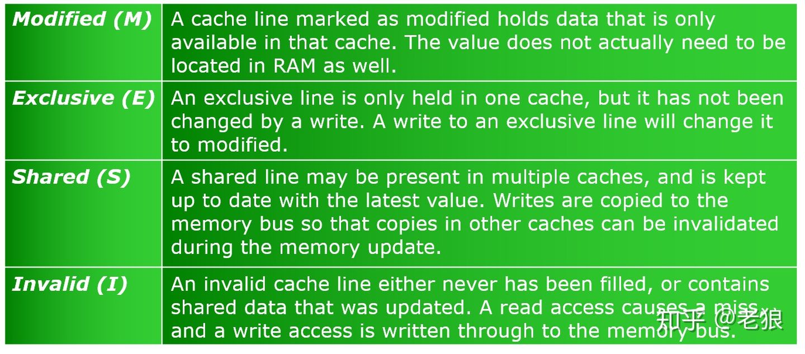
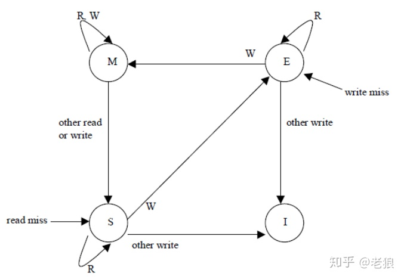
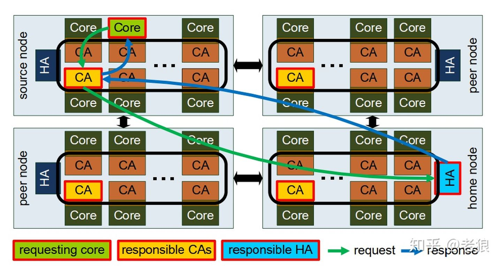
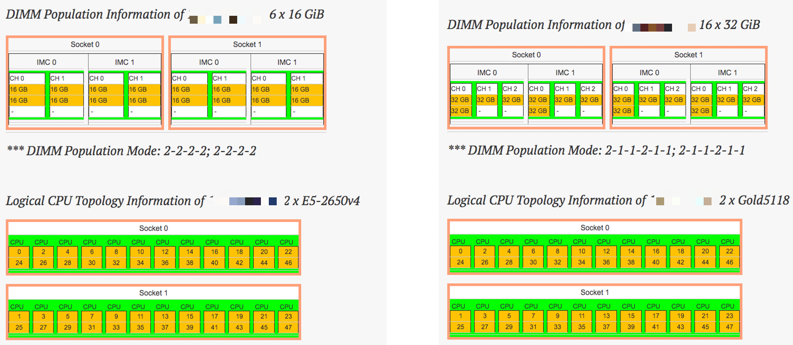

[toc]

### Cache 系列科普

[UEFI和BIOS探秘 —— Zhihu Column](https://www.zhihu.com/column/UEFIBlog)

* L1 cache
  * 4~5 cycles, L1D latency ~1ns
  * 算一下 load/store 指令占所有 instructions 的比例，小于 5 就没办法 hide latency，需要优化访存模式
* L2 cache
  * ~12 cycles, ~3ns
* LLC (L3 cache)
  * ~38 cycles, ~12ns
  * 直接走 IMC，1.5MB/core
  * 分析：llc-load-miss * 64B per load / time elapsed，和内存带宽数据做对比
* L4: eDRAM，可作显存
* [L1，L2，L3 Cache究竟在哪里？](https://zhuanlan.zhihu.com/p/31422201)
  * [CPU Die and Socket](https://zhuanlan.zhihu.com/p/51354994): Intel Xeon 是一个 CPU Die 一个 Socket；而 AMD ECPY 的一个 Socket 由 4 个 CPU Die 组成。因此 AMD 8 个逻辑核共享 LLC，而 Intel 全部核心共享
  * [为什么Intel CPU的Die越来越小了？](https://zhuanlan.zhihu.com/p/31903866)
    * 晶体管数目增长落后于晶体管密度增长
    * Coffeelake 8700K，晶体管的密度不增反降，Pitch从70nm增加到了84nm。在可以提供更高频率支持的背后，代价就是对Die的大小造成负面影响
* [Cache是怎么组织和工作的？](https://zhuanlan.zhihu.com/p/31859105)
  * 全相联、组相联
* [Cache为什么有那么多级？为什么一级比一级大？是不是Cache越大越好？](https://zhuanlan.zhihu.com/p/32058808)

* [显存为什么不能当内存使？内存、Cache和Cache一致性](https://zhuanlan.zhihu.com/p/63494668)
  * 有 GDDR 和 PC DDR 设计初衷不同导致的问题
  * 为什么不能通过PCIe来扩展普通内存？
    * 为什么偷显存性能低的原因：显存不能保证被cache，或者说无法保证cache的一致性
  * Cache 一致性
    * 用硬件而非软件来做 cache coherency
    * CPU 片内总线架构演进：ring bus -> mesh
    * 模型：MESI protocol

[Xeon Gold 5118 - Intel](https://en.wikichip.org/wiki/intel/xeon_gold/5118)

[14 nm lithography process](https://en.wikichip.org/wiki/14_nm_lithography_process)

* [Skylake (server) - Microarchitectures - Intel](https://en.wikichip.org/wiki/intel/microarchitectures/skylake_(server))
  * [Mesh Interconnect Architecture - Intel](https://en.wikichip.org/wiki/intel/mesh_interconnect_architecture)
  * [The Intel Skylake-X Review: Core i9 7900X, i7 7820X and i7 7800X Tested](https://www.anandtech.com/show/11550/the-intel-skylakex-review-core-i9-7900x-i7-7820x-and-i7-7800x-tested/5)

SMP (Symmetric Multiprocessing): cache的发展

Bus Snooping (1983)

* 实现：Home Agent (HA)，在内存控制器端；Cache Agent (CA)，在L3 Cache端
  * [Intel 的两种 snoop 的方式](https://www.intel.ca/content/dam/doc/white-paper/quick-path-interconnect-introduction-paper.pdf)：Home Snoop 和 Source Snoop。它们的主要区别在于谁主导 snoop 消息的发送

* 缺点：在QPI总线上广播，带宽消耗大，scaling 有问题

* Write-invalidate
* Write-update

The two most common mechanisms of ensuring coherency are *[snooping](https://en.wikipedia.org/wiki/Bus_sniffing)* and *[directory-based](https://en.wikipedia.org/wiki/Directory-based_cache_coherence)*, each having their own benefits and drawbacks.

* Snooping based protocols tend to be faster, if enough [bandwidth](https://en.wikipedia.org/wiki/Memory_bandwidth) is available, since all transactions are a request/response seen by all processors. The drawback is that snooping isn't scalable. Every request must be broadcast to all nodes in a system, meaning that as the system gets larger, the size of the (logical or physical) bus and the bandwidth it provides must grow.
* Directories, on the other hand, tend to have longer latencies (with a 3 hop request/forward/respond) but use much less bandwidth since messages are point to point and not broadcast. For this reason, many of the larger systems (>64 processors) use this type of cache coherence.

* scalability of multi-thread applications can be limited by synchronization 
  * 延伸：PCIe 内部 memory （包括 PCIe 后面的显存、NvRAM 等）的割裂性在服务器领域造成了很大问题，CXL 的引入为解决这个问题提供了技术手段

* synchronization primitives: LOCK PREFIX、XCHG

内存拓扑的 unbalanced 问题

* 可能导致同一物理机上先启动的服务效率高
* 多 channel 的 64bit DRAM，ddr 频率在 2666 居多，单 channel 可以到 ～20GB/s，4～6 channel 比较常见

Some conclusion and Advices

* 11 -> 1H: Hyper Threading could help on performance on such “lock” condition (But may not in the end, maybe depends on the total threads: C1-> CH)

* 22 -> 21: Lower Core-Count Topology helps for this circustances (Not the Benchmark Software threads)

* Increase of the hardware resource (along with a huge mount of OS threads) usually not help on the performance, but waste of the CPU and memory resources

* Intel’s “innovation” for high performance processors has been tired with maintaining the same performance for “unconstrained” end users.
  * Intel has been done very well, if you compare with ARM64 Enterprise and AMD...

* lock code is the RISK (pitfall from something beyond your source code, even from glibc, 3rd lib ...)

* Use the scaling tests to find your bottleneck, and improve the “lock”  components
  * Maybe from DISK I/O, Network layer
  * Rarely from the memory bandwidth layer, LLC cache size for the non-HPC workloads

### Hyper-threading

https://www.semanticscholar.org/paper/Hyper-Threading-Technology-Architecture-and-1-and-Marr-Binns/04b58af4fc0e5c3e8e614e2ddb0c41749cc9166c

https://pdfs.semanticscholar.org/04b5/8af4fc0e5c3e8e614e2ddb0c41749cc9166c.pdf?_ga=2.24705338.1691629142.1553869518-295966427.1553869518

https://www.slideshare.net/am_sharifian/intel-hyper-threading-technology/1

* 实测性能是 -20% ~ +20%，因为可能依赖内存带宽、抢占cache。数值计算任务，用到了AVX、SSE技术的，开Hyper-threading一般都会降性能；访存频繁的CPU任务，建议打开，因为circle、LRU是idle的，会有提升
* 禁止hyper-threading：offline、isolate

### 指令集

* AVX-512 throttling
  * [On the dangers of Intel's frequency scaling](https://blog.cloudflare.com/on-the-dangers-of-intels-frequency-scaling/)
  * [Gathering Intel on Intel AVX-512 Transitions](https://travisdowns.github.io/blog/2020/01/17/avxfreq1.html)

### 存储

* NVMe
  * [NVMe vs SATA: What’s the difference and which is faster?](https://www.microcontrollertips.com/why-nvme-ssds-are-faster-than-sata-ssds/)
  * [Bandana: Using Non-volatile Memory for Storing Deep Learning Models, SysML 2019](https://arxiv.org/pdf/1811.05922.pdf)
    * https://www.youtube.com/watch?v=MSaD8DFsMAg
  * Persistent Memory
    * Optane DIMM: https://www.anandtech.com/show/12828/intel-launches-optane-dimms-up-to-512gb-apache-pass-is-here
      * Optane DC PMMs can be configured in one of these two modes: (1) memory mode and (2) app direct mode. In the former mode, the DRAM DIMMs serve as a hardware-managed cache (i.e., direct mapped write-back L4 cache) for frequently-accessed data residing on slower PMMs. The memory mode enables legacy software to leverage PMMs as a high-capacity volatile main memory device without extensive modifications. However, it does not allow the DBMS to utilize the non-volatility property of PMMs. In the latter mode, the PMMs are directly exposed to the processor and the DBMS directly manages both DRAM and NVM. In this paper, we configure the PMMs in app direct mode to ensure the durability of NVM-resident data.
      * pmem: https://pmem.io/pmdk/
      * DWPD: 衡量 SSD 寿命
      * 《Spitfire: A Three-Tier Buffer Manager for Volatile and Non-Volatile Memory》

### 显示器

一些外设概念

* OSD(On Screen Display) Menu
* 接口：DC-IN, HDMI 2.0 两个, DisplayPort, 耳机, USB 3.0 两个, Kensington 锁槽
* 170Hz 刷新率、130%sRGB、96%DCI-P3

### 显卡

[gpu-z 判断锁算力版本](https://zhuanlan.zhihu.com/p/385968761)

### 主板

* [PCI-E x1/x4/x8/x16](https://www.toutiao.com/i6852969617992712715)
  * PCI-E x16：22（供电）+142（数据）；用于显卡，最靠近 CPU
  * PCI-E x8：伪装成 x16
  * PCI-E x4：22+14；通常由主板芯片扩展而来，也有直连 CPU 的，用于安装 PCI-E SSD
  * PCI-E x1：独立网卡、独立声卡、USB 3.0/3.1扩展卡等
    * 另外一个形态，一般称为Mini PCI-E插槽，常见于 Mini-ITX 主板以及笔记本电脑上，多数用来扩展无线网卡，但由于其在物理结构上与 mSATA 插槽相同，因此也有不少主板会通过跳线或者 BIOS 设定让 Mini PCI-E 接口在 PCI-E 模式或者 SATA 模式中切换，以实现一口两用的效果。已经被 M.2 接口取代，基本上已经告别主流。

