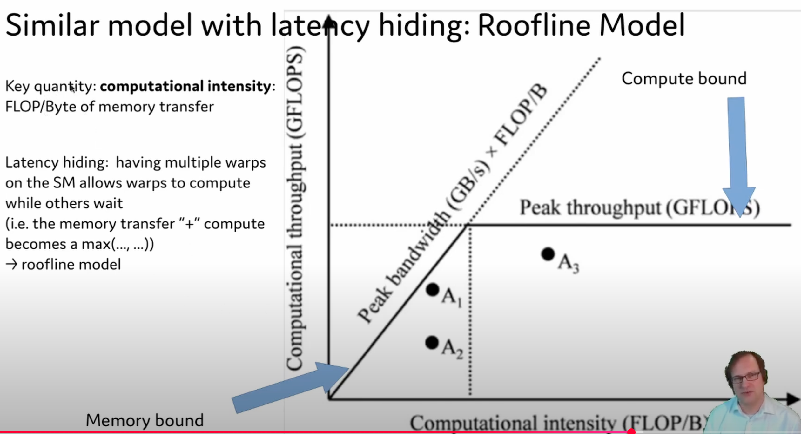
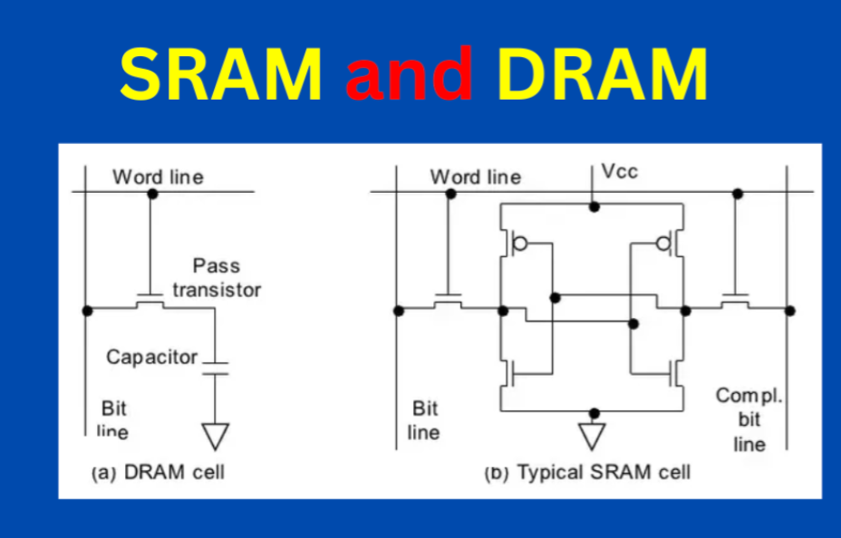
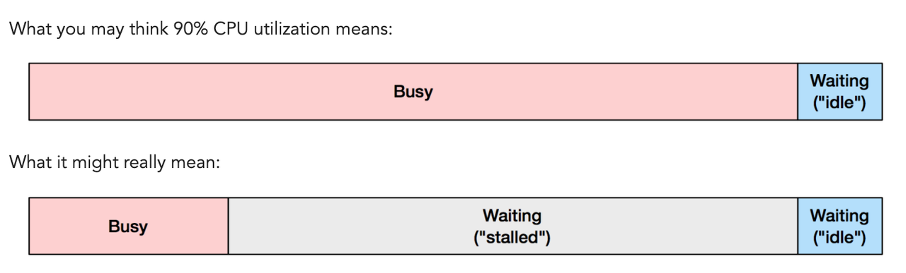
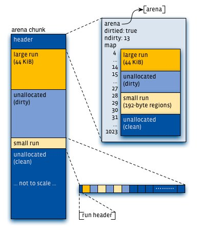
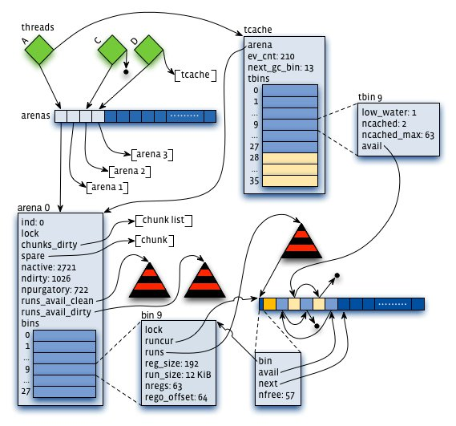
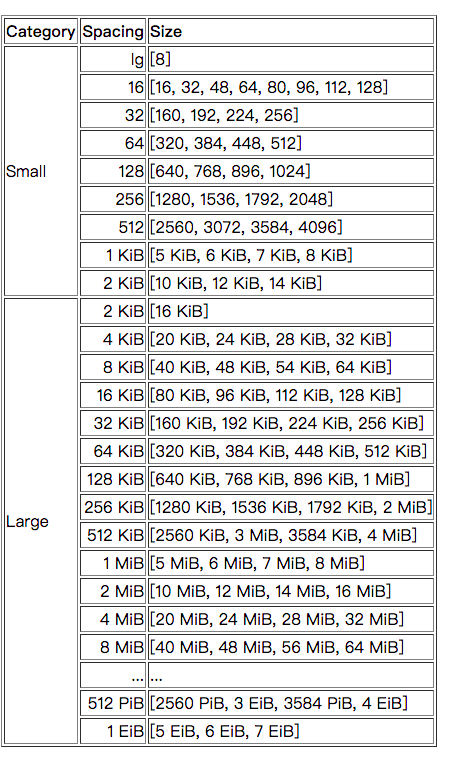

[toc]

### Intro

* CPU
  *  [instruction pipelining](https://en.wikipedia.org/wiki/Instruction_pipelining), [out of order execution](https://en.wikipedia.org/wiki/Out-of-order_execution), [speculative execution](https://en.wikipedia.org/wiki/Speculative_execution) and multilevel caches


### 性能优化理论

> - 业务流程分析：是否有冗余计算，是否能实现场景需求，比如pointwise、listwise
> - 整体代码性能分析：design是否有更优解，比如pipeline的编排能否更合理、no padding等能否达成
> - 关键处代码瓶颈分析：例如folding、unique、gradient reduce等操作

#### Roofline Model

* Roofline: an insightful visual performance model for multicore architectures.
  * **横轴：arithmetic intensity**: which is the number of arithmetic operations per byte of memory access.
    * Compute-bound: the time taken by the operation is determined by how many arithmetic operations there are, while time accessing HBM is much smaller. Typical examples are matrix multiply with large inner dimension, and convolution with large number of channels.
    * Memory-bound: the time taken by the operation is determined by the number of memory accesses, while time spent in computation is much smaller. Examples include most other operations: elementwise (e.g., activation, dropout), and reduction (e.g., sum, softmax, batch norm, layer norm).
    
    * 算术操纵数量/内存访问字节数量
    * e.g. attention大于0.5接近1
  * 纵轴：computational throughput



* 硬件例子：
  * V100: 125/0.9 =139FLOPS/Byte
  
* Memory optimization和runtime optimization
  * 往往是互相制约的
* IO-Aware Runtime Optimization 【flash-attention】
  * We draw the most direct connection to the literature of analyzing I/O complexity in this work [1], but concepts of memory hierarchies are fundamental and has appeared in many forms, from the working set model [21], to data locality [86], to the Roofline model of arithmetic intensity [85], to analyses of scalability [59], to standard textbook treatments of computer architecture [40].

#### 为什么优化 Latency 困难

* [It's the Latency, Stupid](http://www.stuartcheshire.org/rants/latency.html)
  * internet latency
    * Ethernet connection: 0.3ms
    * modem link: 100ms
    * modem link传输：典型值 33kbit/sec
  * 磁盘的seek time
  * 在低带宽的专用连接和高带宽连接的一小部分份额之间做选择，应该选择后者。

#### Low Latency Guide

https://rigtorp.se/low-latency-guide/

* Disable hyper-threading
  * Using the [CPU hot-plugging functionality](https://www.kernel.org/doc/html/latest/core-api/cpu_hotplug.html) to disable one of a pair of sibling threads. Use `lscpu --extended` or `cat /sys/devices/system/cpu/cpu*/topology/thread_siblings_list` to determine which “CPUs” are sibling threads.
  * 由于超线程的存在，CPU 使用率往往是低估的。所以你 CPU 使用率算出来是 50% 时，很可能实际对物理真实核心的占用其实是 70%。
* CAS Latency: https://en.wikipedia.org/wiki/CAS_latency
  * One byte of memory (from each chip; 64 bits total from the whole DIMM) is accessed by supplying a 3-bit bank number, a 14-bit row address, and a 13-bit column address.
* 绑核
  * `sched_getaffinity`、`sched_setaffinity`
* Uncore
  * [What is Uncore?](https://forums.tomshardware.com/threads/what-is-uncore-how-is-it-relevant-to-overclocking.2094084/)

### Arch with C++

```c++
constexpr size_t CACHE_LINE_SIZE =
#if __cplusplus >= 201703L and __cpp_lib_hardware_interference_size
  std::hardware_constructive_interference_size;
#else
  64;
#endif
```

`__buildin_prefetch`: https://www.daemon-systems.org/man/__builtin_prefetch.3.html

[Using the extra 16 bits in 64-bit pointers](https://stackoverflow.com/questions/16198700/using-the-extra-16-bits-in-64-bit-pointers)

### CPU

#### Intro

* 核心性能因素
  * 单核性能
    * 频率 clock speed
      * boost clock
    * 流水线设计
    * 指令发射数 issue width
  * 核心数量
  * 多级缓存

#### Branch Predictor

[**Zen5的2-Ahead Branch Predictor**](https://chipsandcheese.com/p/zen-5s-2-ahead-branch-predictor-unit-how-30-year-old-idea-allows-for-new-tricks)

### 各种微架构

#### Intel

[Xeon Gold 5118 - Intel](https://en.wikichip.org/wiki/intel/xeon_gold/5118)

[14 nm lithography process](https://en.wikichip.org/wiki/14_nm_lithography_process)

* [Skylake (server) - Microarchitectures - Intel](https://en.wikichip.org/wiki/intel/microarchitectures/skylake_(server))
  * [Mesh Interconnect Architecture - Intel](https://en.wikichip.org/wiki/intel/mesh_interconnect_architecture)
  * [The Intel Skylake-X Review: Core i9 7900X, i7 7820X and i7 7800X Tested](https://www.anandtech.com/show/11550/the-intel-skylakex-review-core-i9-7900x-i7-7820x-and-i7-7800x-tested/5)
  * skylake 的一些简单 latency 参数：https://www.7-cpu.com/cpu/Skylake.html
* [Sapphire Rapids](https://en.wikipedia.org/wiki/Sapphire_Rapids) for IDC, Alder Lake for public use
  * 它的上一代：[Whitley](https://www.asipartner.com/solutions/server/intel-whitley-platform/)

#### AMD

* [AMD CCD and CCX in Ryzen Processors Explained](https://www.hardwaretimes.com/amd-ccd-and-ccx-in-ryzen-processors-explained/#go-to-content)

  * **The basic unit of a Ryzen processor is a CCX or Core Complex**, a quad-core/octa-core CPU model with a shared L3 cache.

  * However, while CCXs are the basic unit of silicon dabbed, at an architectural level, a **CCD or Core Chiplet Die is your lowest level of abstraction**. A CCD consists of two CCXs paired together using the Infinity Fabric Interconnect. All Ryzen parts, even quad-core parts, ship with at least one CCD. They just have a differing number of cores disabled per CCX.

  * zen-3(milan)舍弃了一个CCD包含两个CCX的概念，8 cores (one CCD/CCX) 共享 32MB 的 L3 cache

  * Intel’s Monolithic Design and the Future
* [AMD Ryzen 5000 “Zen 3” Architectural Deep Dive](https://www.hardwaretimes.com/amd-ryzen-5000-zen-3-architectural-deep-dive/)
  * lower core-to-core latency
  * Branch Target Buffer (BTB)
  * Although the load/store bandwidths have effectively doubled, the L1 to L2 cache transfer speeds are unchanged at 32 bytes/cycle x 2. The L1 fetch width is also the same as Zen 2 at 32 bytes.

* [NUMA Configuration settings on AMD EPYC 2nd Generation](https://downloads.dell.com/manuals/common/dell-emc-dfd-numa-amd-epyc-2ndgen.pdf)

  * 1 socket ~ 4 CCX ~ 8 memory controller(~ memory channel)
    * Up to 2 DIMMs per channel
  * With this architecture, all cores on a single CCD are closest to 2 memory channels. The rest of the memory channels are across the IO die, at differing distances from these cores. Memory interleaving allows a CPU to efficiently spread memory accesses across multiple DIMMs. This allows more memory accesses to execute without waiting for one to complete, maximizing performance. 
  * Nodes Per Socket (NPS)
  * For additional tuning details, please refer to the Tuning Guides shared by AMD [here](For additional tuning details, please refer to the Tuning Guides shared by AMD here. For detailed discussions around the AMD memory architecture, and memory configurations, please refer to the Balanced Memory Whitepaper). For detailed discussions around the AMD memory architecture, and memory configurations, please refer to the [Balanced Memory Whitepaper](https://downloads.dell.com/Manuals/Common/dellemc-balanced-memory-2ndgen-amd-epyc-poweredge.pdf)

#### AMD 课程

ROCm：https://developer.amd.com/resources/rocm-learning-center/

### 内存

#### DRAM vs SRAM

* DRAM: 1 transistor, 1 capacitor

* SRAM: 6 transistors
  * So SRAM is faster but more expensive, takes up more space and gets hotter

* https://siliconvlsi.com/why-sram-is-faster-than-dram/




### Cache 系列科普 ~ Latency

#### CPU Cache



[UEFI和BIOS探秘 —— Zhihu Column](https://www.zhihu.com/column/UEFIBlog)

[interactive latency numbers](https://colin-scott.github.io/personal_website/research/interactive_latency.html)

数据基于 Skylake 架构

* L1 cache
  * 32KB
  * 4~5 cycles, L1D latency ~1ns
  * 算一下 load/store 指令占所有 instructions 的比例，小于 5 就没办法 hide latency，需要优化访存模式
* L2 cache
  * 512KB
  * ~12 cycles, ~4ns
* LLC (L3 cache) **很关键**
  * 32MB
  * ~38 cycles, ~12ns
    * 与之对比，memory access 约 50~100ns (Intel 70ns, AMD 80ns)
  * 直接走 IMC，1.5MB/core
  * 分析：llc-load-miss * 64B per load / time elapsed，和内存带宽数据做对比
* L4: eDRAM，可作显存
* DRAM
  * ~100ns
* [L1，L2，L3 Cache究竟在哪里？](https://zhuanlan.zhihu.com/p/31422201)
  * [CPU Die and Socket](https://zhuanlan.zhihu.com/p/51354994): Intel Xeon 是一个 CPU Die 一个 Socket；而 AMD ECPY 的一个 Socket 由 4 个 CPU Die 组成。因此 AMD 8 个逻辑核共享 LLC，而 Intel 全部核心共享
  * [为什么Intel CPU的Die越来越小了？](https://zhuanlan.zhihu.com/p/31903866)
    * 晶体管数目增长落后于晶体管密度增长
    * Coffeelake 8700K，晶体管的密度不增反降，Pitch从70nm增加到了84nm。在可以提供更高频率支持的背后，代价就是对Die的大小造成负面影响
* [Cache是怎么组织和工作的？](https://zhuanlan.zhihu.com/p/31859105)
  * 全相联、组相联
* [Cache为什么有那么多级？为什么一级比一级大？是不是Cache越大越好？](https://zhuanlan.zhihu.com/p/32058808)


#### Cache Coherence

* [显存为什么不能当内存使？内存、Cache和Cache一致性](https://zhuanlan.zhihu.com/p/63494668)
  * 有 GDDR 和 PC DDR 设计初衷不同导致的问题
  * 为什么不能通过PCIe来扩展普通内存？
    * 为什么偷显存性能低的原因：显存不能保证被cache，或者说无法保证cache的一致性
  * Cache 一致性
    * 用硬件而非软件来做 cache coherency
    * CPU 片内总线架构演进：ring bus -> mesh
    * 模型：MESI protocol


SMP (Symmetric Multiprocessing): cache的发展

Bus Snooping (1983)

* 实现：Home Agent (HA)，在内存控制器端；Cache Agent (CA)，在L3 Cache端
  * [Intel 的两种 snoop 的方式](https://www.intel.ca/content/dam/doc/white-paper/quick-path-interconnect-introduction-paper.pdf)：Home Snoop 和 Source Snoop。它们的主要区别在于谁主导 snoop 消息的发送


* 缺点：在QPI总线上广播，带宽消耗大，scaling 有问题

* Write-invalidate
* Write-update


The two most common mechanisms of ensuring coherency are *[snooping](https://en.wikipedia.org/wiki/Bus_sniffing)* and *[directory-based](https://en.wikipedia.org/wiki/Directory-based_cache_coherence)*, each having their own benefits and drawbacks.

* Snooping based protocols tend to be faster, if enough [bandwidth](https://en.wikipedia.org/wiki/Memory_bandwidth) is available, since all transactions are a request/response seen by all processors. The drawback is that snooping isn't scalable. Every request must be broadcast to all nodes in a system, meaning that as the system gets larger, the size of the (logical or physical) bus and the bandwidth it provides must grow.
* Directories, on the other hand, tend to have longer latencies (with a 3 hop request/forward/respond) but use much less bandwidth since messages are point to point and not broadcast. For this reason, many of the larger systems (>64 processors) use this type of cache coherence.
  * 图解 slides: http://15418.courses.cs.cmu.edu/spring2017/lecture/directorycoherence/slide_015

* scalability of multi-thread applications can be limited by synchronization 
  * 延伸：PCIe 内部 memory （包括 PCIe 后面的显存、NvRAM 等）的割裂性在服务器领域造成了很大问题，CXL 的引入为解决这个问题提供了技术手段

* synchronization primitives: LOCK PREFIX、XCHG

内存拓扑的 unbalanced 问题

* 可能导致同一物理机上先启动的服务效率高
* 多 channel 的 64bit DRAM，ddr 频率在 2666 居多，单 channel 可以到 ～20GB/s，4～6 channel 比较常见


Some conclusion and Advices

* 11 -> 1H: Hyper Threading could help on performance on such “lock” condition (But may not in the end, maybe depends on the total threads: C1-> CH)

* 22 -> 21: Lower Core-Count Topology helps for this circustances (Not the Benchmark Software threads)

* Increase of the hardware resource (along with a huge mount of OS threads) usually not help on the performance, but waste of the CPU and memory resources

* Intel’s “innovation” for high performance processors has been tired with maintaining the same performance for “unconstrained” end users.
  * Intel has been done very well, if you compare with ARM64 Enterprise and AMD...

* lock code is the RISK (pitfall from something beyond your source code, even from glibc, 3rd lib ...)

* Use the scaling tests to find your bottleneck, and improve the “lock”  components
  * Maybe from DISK I/O, Network layer
  * Rarely from the memory bandwidth layer, LLC cache size for the non-HPC workloads

#### TLB

* 内存页条目缓存即TLB（ Translation Lookaside Buffer）TLB缓存命中率越高，CPU执行指令的速度越快。

* `cat /proc/interrupts | grep "TLB shootdowns"`
  * 文件记录的是 remote TLB flush 事件。本地CPU使用IPI中断通知其他CPU flush TLB时，该节点对应的CPU会计数。
* `perf stat -e cache-misses,cache-references,instructions,cycles,faults,branch-instructions,branch-misses,L1-dcache-stores,L1-dcache-store-misses,L1-dcache-loads,L1-dcache-load-misses,LLC-loads,LLC-load-misses,LLC-stores,LLC-store-misses,dTLB-loads,dTLB-load-misses,iTLB-loads,iTLB-load-misses -p $PID`

### NUMA

* 搜到一段获取 cpu topology 的 C 语言代码：https://github.com/SANL-2015/SANL-2015/blob/8779af7939bcacebd74abfabba9873b68eaca304/SAND2015/liblock/liblock.c#L99

```shell
yum -y install numactl numastat

numactl -H
numastat
numactl -C 0-15 ./bin
numactl -N0 -m0 ./bin
```


### Hyper-threading

https://www.semanticscholar.org/paper/Hyper-Threading-Technology-Architecture-and-1-and-Marr-Binns/04b58af4fc0e5c3e8e614e2ddb0c41749cc9166c

https://pdfs.semanticscholar.org/04b5/8af4fc0e5c3e8e614e2ddb0c41749cc9166c.pdf?_ga=2.24705338.1691629142.1553869518-295966427.1553869518

https://www.slideshare.net/am_sharifian/intel-hyper-threading-technology/1

* 实测性能是 -20% ~ +20%，因为可能依赖内存带宽、抢占cache。数值计算任务，用到了AVX、SSE技术的，开Hyper-threading一般都会降性能；访存频繁的CPU任务，建议打开，因为circle、LRU是idle的，会有提升
* 禁止hyper-threading：offline、isolate

### 指令集

* AVX-512 throttling
  * [On the dangers of Intel's frequency scaling](https://blog.cloudflare.com/on-the-dangers-of-intels-frequency-scaling/)
  * [Gathering Intel on Intel AVX-512 Transitions](https://travisdowns.github.io/blog/2020/01/17/avxfreq1.html)
* [AVX-512_BF16 Extension](https://www.intel.com/content/www/us/en/developer/articles/technical/intel-deep-learning-boost-new-instruction-bfloat16.html)
  * 点积 + 转换
* CLZ 等指令：https://en.wikipedia.org/wiki/Find_first_set

### 汇编优化

* FFmpeg：https://github.com/FFmpeg/asm-lessons


#### AMX

* AMX: [The x86 Advanced Matrix Extension (AMX) Brings Matrix Operations; To Debut with Sapphire Rapids](https://fuse.wikichip.org/news/3600/the-x86-advanced-matrix-extension-amx-brings-matrix-operations-to-debut-with-sapphire-rapids/)
  * AMX introduces a new matrix register file with eight rank-2 tensor (matrix) registers called “tiles”.
  * 独立单元，支持bf16，intel oneAPI DNNL指令集接口
* 功能：单元相比avx512、vnni，支持了reduce操作
* 实现：
  - 输入8位/16位，计算用32位（防溢出）
  - 扩展了tile config、tile data寄存器，内核支持（XFD，eXtended Feature Disable）, allos os to add states to thread on demand
* 测试：减少内存带宽，增频了（重计算指令减少）
  - 配合tf有automix策略，op可能为bf16+fp32混合计算
  - matmul相关运算全bf16
  - tf2.9合入intel大量patch, TF_ENABLE_ONEDNN_OPTS=1，检测cpuid自动打开；oneDNN 2.7
    - TF_ONEDNN_USE_SYSTEM_ALLOCATOR
    - jemalloc: MALLOC_CONF="oversize_threshold:96000000,dirty_decay_ms:30000,muzzy_decay_ms:30000"), mitigate page_fault, which benefit fp32 in addition
    - TF_ONEDNN_PRIM_CACHE_SIZE=8192 (for mix models deployment)
    - TF2.9 SplitV performance issue
* 其它SPR独立单元：
  - Intel DSA(data streaming accelerator): batched memcpy/memmove，减少CPU cycles
    - https://01.org/blogs/2019/introducing-intel-data-streaming-accelerator
  - Intel IAA(in-memory analytics accelerator): compress/decompress/scan/filter，也是offload cpu cores
    - https://www.intel.com/content/www/us/en/analytics/in-memory-data-and-analytics.html
    - 场景如presto：https://engineering.fb.com/2019/06/10/data-infrastructure/aria-presto/

### 存储：硬盘、NVMe

* 硬盘：分为HDD和SSD
  * 读写模式
    * 随机读写：高频、小文件
      * IOPS
      * 瓶颈：磁盘读取到缓冲区
  
    * 连续读写：顺序、大文件
      * MB/s
      * 瓶颈：缓冲区传输到内存
  * 典型数据（NVMe）：
    * 1TB
    * 700000 IOPS
    * 7000 GB/s
  * 优化硬盘读写的技术：
    * 利用内存
      * mmap，尤其随机访问场景
      * RAMDisk
    * 尽量连续读写
    * NVMe
* NVMe
  * [NVMe vs SATA: What’s the difference and which is faster?](https://www.microcontrollertips.com/why-nvme-ssds-are-faster-than-sata-ssds/)
    * 使用传输速率更高的PCIe通道
  * [Bandana: Using Non-volatile Memory for Storing Deep Learning Models, SysML 2019](https://arxiv.org/pdf/1811.05922.pdf)
    * https://www.youtube.com/watch?v=MSaD8DFsMAg
  * Persistent Memory
    * Optane DIMM: https://www.anandtech.com/show/12828/intel-launches-optane-dimms-up-to-512gb-apache-pass-is-here
      * Optane DC PMMs can be configured in one of these two modes: (1) memory mode and (2) app direct mode. In the former mode, the DRAM DIMMs serve as a hardware-managed cache (i.e., direct mapped write-back L4 cache) for frequently-accessed data residing on slower PMMs. The memory mode enables legacy software to leverage PMMs as a high-capacity volatile main memory device without extensive modifications. However, it does not allow the DBMS to utilize the non-volatility property of PMMs. In the latter mode, the PMMs are directly exposed to the processor and the DBMS directly manages both DRAM and NVM. In this paper, we configure the PMMs in app direct mode to ensure the durability of NVM-resident data.
      * pmem: https://pmem.io/pmdk/
      * DWPD: 衡量 SSD 寿命
      * 《Spitfire: A Three-Tier Buffer Manager for Volatile and Non-Volatile Memory》
* 内存
  * 双通道、四通道，将内存带宽提升相应倍数

### jemalloc

#### 内存分配器

* 栈内存的生命周期是函数，堆内存可能是进程
  * [Stack-based allocation](https://en.wikipedia.org/wiki/Stack-based_memory_allocation)：基于栈的堆分配，参见sbrk
* 系统调用细节
  * C++14 开始支持 sized free，要求 size 和指针对应内存申请时的大小相同
* size classes
  * 4KB逻辑页 -> "small" 小于 16KB 

#### jeprof使用

* 安装jeprof和jemalloc
  * https://note.abeffect.com/articles/2019/07/26/1564106051567.html
* 使用

```
export MALLOC_CONF="prof:true,prof_leak:true,lg_prof_interval:31,prof_final:true,prof_prefix:jemalloc/jeheap"

apt-get install -y binutils graphviz ghostscript

jeprof --show_bytes --pdf /usr/bin/python3 [--base=98/heapf_.3408.0.i0.heap] 98/heapf_.3408.44.i44.heap > result.pdf
```


#### je 接口与参数

##### 非标准接口

* mallocx / rallocx 返回已分配的内存指针，null表示没有符合条件的内存
  * `realloc(), rallocx, xallocx` : in-place resizing

* xallocx 返回 ptr resized 结果
* sallocx 返回已经分配的 ptr 的真实大小
* nallocx 返回 mallocx 可以成功的试算大小
* mallctl、mallctlnametomib 和 mallctlbymib 控制 jemalloc 内部状态
* dallocx= free
* sdallocx = sized free

##### 调参

http://jemalloc.net/jemalloc.3.html#TUNING

* opt_dss（用法  MALLOC_CONF=dss:primary ）: primary 表示主要使用brk，seconday 表示优先mmap，默认是 seconday

##### 内存泄漏分析

https://zhuanlan.zhihu.com/p/138886684

gdb `call malloc_stats_print(0, 0, 0)`

#### jemalloc 多篇论文介绍

[“Understanding glibc malloc” by Sploitfun. February, 2015.” ](https://sploitfun.wordpress.com/2015/02/10/understanding-glibc-malloc/) 

* per thread arena
* Fast Bin; Unsorted Bin; Small Bin; Large Bin; Top Chunk; Last Remainder Chunk


(jemalloc) A Scalable Concurrent malloc(3) Implementation for FreeBSD

Introduction: allocator 性能逐渐成为重点

问题1: 要尽量避免 cache line 的多线程争抢问题

* jemalloc instead relies on multiple allocation arenas to reduce the problem, and leaves it up to the application writer to pad allocations in order to avoid false cache line sharing in performance-critical code, or in code where one thread allocates objects and hands them off to multiple other threads.
  * Multiple Arenas 默认是cpu core 数乘以 4
  * 线程争抢 (false sharing)：一个 cacheline 64 bytes，如果a线程b线程每个线程共享一块malloc出来的内存的前32byte和后32byte，两个线程会争抢这个cache line。这种编程模式，依赖业务代码加一些 padding 避免争抢

问题2: reduce lock contention <-> cache sloshing

* jemalloc uses multiple arenas, but uses a more reliable mechanism than hashing for assignment of threads to arenas.

解决方案：

* the arena is chosen in round-robin fashion，用 TLS(Thread-local storage) 实现，可被 TSD 替代
* 理解 "chunk" 2 MB，small、large、huge，huge 用单个红黑树管理
* 对于small/large，chunks 用 binary buddy algorithm 分割成 page runs
  * small allocations 用 bitmap 管理，run header 方案的优劣讨论
  * fullness 这段没看懂


[Scalable memory allocation using jemalloc](https://engineering.fb.com/2011/01/03/core-data/scalable-memory-allocation-using-jemalloc/) by Facebook

生产环境的 challenges for allocations

* Allocation and deallocation must be **fast**. 
* The relation between active memory and RAM usage must be **consistent**.
* Memory **heap profiling** is a critical operational aid.

文章介绍了 jemalloc 的核心设计思想：通用地去解决过往 allocator 解决/待解决的问题






[Tick Tock, malloc Needs a Clock](https://www.youtube.com/watch?v=RcWp5vwGlYU&list=PLn0nrSd4xjjZoaFwsTnmS1UFj3ob7gf7s)

* Background & basics
  * Chunk: 1024 contiguous pages (4MB), aligned on a 4MB boundary
  * Page run: 1+ contiguous pages in a chunk
  * Region: contiguous bytes (<16KB)
* Fragmentation & dirty page purging
  * 重点关注 external fragmentation
  * 设计原则：prefer low addresses during reuse (e.g. cache bin), exceptions:
    * size-segregated slabs for small allocations (size class 互相独立，不去找更前面的 size class 制造 internal fragmentation)
    * disjoint arenas
    * thread caches
    * unused dirty page caching delays page run coalescing
* Clockless purging history
  * jemalloc 不进行异步调用，all work must be hooked into deallocation event
  * side effect: conflict between speed and memory usage optimization
  * Aggressive (2006): immediately purge, disabled by default, MADV_FREE-only
  * Spare Arena Chunk (2007):
    * keep max one spare per arena, which never purges
    * Rational: hysteresis for small/huge allocations
  * Fixed-size dirty page cache (2008):  512 pages per arena，追求速度
  * Proportional dirty page cache (2009): active/dirty=32/1，内存更大
  * Purge chunks in FIFO order (2010)
    * Chunk iterations cost a lot
    * Rational: purge chunks with high dirty page density (faster)
  * Purge chunks in fragmentation order (2012)
    * maintain chunk fragmentation metric
  * Purge runs in LRU order (2014)
    * Dirty runs 进入 LRU 后 coalesce, 减少了整体的 madvise 次数
  * Integrate chunks into dirty LRU (2015)
    * Rational: huge allocation hysteresis
* Clock-based purging challenges
  * Prototype
    * ~4.3s delay (2e32 ns)
    * 32-slot timer wheel
  * 结果内存涨的太多，因为尤其是多个 arena 内存的累加
  * Limit dirty page globally?
    * too strict -> per numa node attached RAM
    * Jemalloc 目前没有将 CPU core 和 arena 联系起来
  * Hybrid?  不现实
  * decay curves
    * timer wheel stutters
    * Sigmoid > delayed linear > linear >> exponential
  * Online decay algorithm
* Plausible plan
  * One dirty page cache per numa node
  * One arena per CPU
  * Opt-in clock-based purging
    * Asynchronus purging thread
    * Synchronus purging during allocation at peak usage
  * Prefer dirty run reuse? 期望不要，因为会 purge 更频繁
  * Other wall clock uses
    * Incrementally flush arena cache
    * Incrementally/asynchronusly flush thread cache
      * Idle threads don't need caches
      * Current HHVM hack: LIFO worker thread scheduling; flush cache after 5 seconds inactivity
      * Flushing may be impossibly without impacting fast path (必须和线程做同步)

#### jemalloc 代码阅读



* [API](http://jemalloc.net/jemalloc.3.html)

  * `malloc()`, `posix_memalign()`, `calloc()`, `realloc()`, and `free()`
  * rudimentary introspection capabilities: `malloc_usable_size()`
  * `*allocx()`: Mix/match alignment, zeroing, relocations, arenas, tcaches
  * `mallctl*()`: Comprehensive introspection/control

* base_alloc(): metadata，jemalloc 直接调用 mmap 从 os 申请，不释放

* malloc(): 递进的 size class（默认页 4KB）

* free(): lib 自己维护地址到 metadata 的映射
  * ptmalloc: 在每一个 malloc 出去的内存块前都加若干字节的 metadata (pre size field - chunk size field - N - M - P - User Data - next chunk)，所以相邻的内存块的溢出可能会踩踏到下一块内存的 metadata 
  * jemalloc: 内存地址稀疏，radix trees

* jemalloc 设置了一个界线，`size < 4*os_page_size` 的 size_class, 称这类分配为"**small**"，内存管理会用 bitmap 额外再多一层 [slab](https://en.wikipedia.org/wiki/Slab_allocation) 缓存。`size>=4*os_page_size ` 的 size_class 称为 "**large**"，不再进行额外的缓存。

* TLS cache
  * x86 的 linux 下会使用 fs 段寄存器指向线程的 TCB
  * 动态链接库访问线程局部变量理论上要经过 `__tls_get_addr` 系统调用，有 overhead，而 jemalloc 绕过了这一开销。缺点是 jemalloc 这么编译出来的 lib 是没法被 dlopen 动态链接的，详情见 `--disable-initial-exec-tls` 这个 flag
  * cache bin: `include/jemalloc/internal/cache_bin.h:cache_bin_alloc_easy()`
  * maintains large objects up to a limited size (32 KiB by default)，增加这个 limit 会导致 unacceptable fragmentation cost
  * 对应地，有 GC 策略：Cached objects that go unused for one or more GC passes are progressively flushed to their respective arenas using an exponential decay approach.

* bin
  * `include/jemalloc/internal/bin.h`
  * 开始并发访问，thread 到 arena 的分配是 round robin
  * large size class: 下一层 extent 的包装
    * `src/large.c:large_malloc()`
  * small size class: 如果没取到 cache_bin，`tcache_alloc_small_hard()->arena_tcache_fill_small()->arena_slab_reg_alloc_batch()`
    * `bin->slancur` 指向当前可用的 bitmap
    * nonfull_slab/full_slab: pairing heap
    * jemalloc 希望分配的内存空间尽量紧凑，地址尽可能复用，这样能获得更好的 cache line，TLB 的局部性，所以用到 Pairing heap 维护 slabs_nonfull 去查找尽可能老的，或地址空间最低的 slab 用于分配
    * `arena_slab_reg_alloc_batch()`: bitmap 操作, [ffsl](https://man7.org/linux/man-pages/man3/ffs.3.html) find first set

* extent
  * dirty muzzy retained
    * `extents_t extents_dirty`
    * large size class 的核心函数：`arena_extent_alloc_large()`
    * small size class 的核心函数：`arena_bin_malloc_hard()--->arena_bin_nonfull_slab_get()--->arena_slab_alloc()`
  * slab/large_alloc  <--->  extents_dirty  <--->  extents_muzzy  <---> extents_retained
  * 内存块的合并：每次从左边的 extent 向右边释放的时候，会查询全局的 radix trees，检查这个 extent 是否能和相邻的 extent 合并
  * 调用 madvise 定时对内存进行 gc， 可能会引起系统的 stall
  * 小内存会抢占大内存，切割大内存的 extent；分配完也会合并成大内存 extent

* kernal
  * 内存地址空间的分配 [mmap](https://man7.org/linux/man-pages/man2/mmap.2.html)
    * linux虚地址空间是由task_struct对应的mm_struct指向的vm_struct链表管理的。mmap系统调用在虚地址空间查找一段满足length长度的连续空间后，创建一个vm_struct并插入链表。mmap返回的指针被程序访问时将触发缺页中断，操作系统分配物理页到vm_struct中，物理内存的增加体现在rss上。
    * `mmap()<---os_pages_map()<---pages_map()<---extent_alloc_mmap()`
    * extents_retained 只存虚拟地址空间，没有物理页
    * `pages_map()` 的逻辑主要在处理内存 alignment
  * 内存清理，认为 unmap 有开销，于是只清理物理内存，不清理虚拟地址空间
    * 代码详见 `base_unmap()`
    * extents_dirty ---> extents_muzzy 调用 `madvise(MADV_FREE)`，轻量操作，将内存给其它内存
      * `pages_can_purge_lazy`
    * extents_muzzy ---> extents_retained 调用 `madvise(MADV_DONTNEED)` ，将内存拿走，可能发生ipi中断，再次访问会产生缺页中断
      * `pages_can_purge_forced`
    * Facebook 优化：`mmap(...MAP_UNINITIALIZED)`
  * 透明巨页的分配：从mmap出来的extern，`pages_huge_impl()`调用` madvise(MADV_HUGEPAGE)`
  * `opt_dss`支持`brk`方式申请

* 其它

  * 性能瓶颈：cache bin 的 fill、flush，madvise；arena 分配机制（场景：多个线程分配一个静态对象内的内存，单线程操作它，会产生 high fragmentation）
  * `jemalloc_internal_defs.h.in`: 一串 undef + 宏的含义注释

##### 高性能内存分配库 Libhaisqlmalloc 的设计思路

https://zhuanlan.zhihu.com/p/352938740


### 显示器

一些外设概念

* OSD(On Screen Display) Menu
* 接口：DC-IN, HDMI 2.0 两个, DisplayPort, 耳机, USB 3.0 两个, Kensington 锁槽
* 170Hz 刷新率、130%sRGB、96%DCI-P3

### 显卡

[gpu-z 判断锁算力版本](https://zhuanlan.zhihu.com/p/385968761)

### 主板

* [PCI-E x1/x4/x8/x16](https://www.toutiao.com/i6852969617992712715)
  * PCI-E x16：22（供电）+142（数据）；用于显卡，最靠近 CPU
  * PCI-E x8：伪装成 x16
  * PCI-E x4：22+14；通常由主板芯片扩展而来，也有直连 CPU 的，用于安装 PCI-E SSD
  * PCI-E x1：独立网卡、独立声卡、USB 3.0/3.1扩展卡等
    * 另外一个形态，一般称为Mini PCI-E插槽，常见于 Mini-ITX 主板以及笔记本电脑上，多数用来扩展无线网卡，但由于其在物理结构上与 mSATA 插槽相同，因此也有不少主板会通过跳线或者 BIOS 设定让 Mini PCI-E 接口在 PCI-E 模式或者 SATA 模式中切换，以实现一口两用的效果。已经被 M.2 接口取代，基本上已经告别主流。

