### Stanford CS144
* [CS144视频（b站）](https://www.bilibili.com/video/BV1wt41167iN?from=search&seid=12807244912122184980)
* [CS144课程网站（包括Pdf、Lab）](https://cs144.github.io/)
* [我的CS144 Lab笔记](https://github.com/huangrt01/CS-Notes/blob/master/Notes/Output/Computer-Networking-Lab-CS144-Stanford.md)

[toc]

##### 1-0 The Internet and IP Introduction
internet layer: Internet Protocol, IP address, packet's path

彩蛋：世一大惺惺相惜
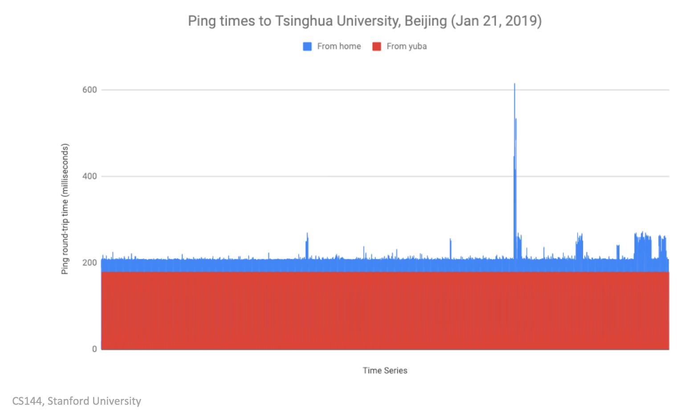

用`ping`和`traceroute`看IP地址; 光纤2/3光速，8637km -> RTT=86ms

##### 1-1 A day in the life of an application
* Networked Applications: connectivity, bidirectional and reliable data stream
* Byte Stream Model: A - Internet - B, server和A、B均可中断连接
* World Wide Web (HTTP: HyperText Transfer Protocol)
  * request: GET, PUT, DELETE, INFO, 400 (bad request) 
  * GET - response(200, OK)  , 200代表有效
  * document-centric: "GET/HTTP/1.1", "HTTP/1.1 200 OK \<contents of the index.html\>"
* BitTorrent: peer-to-peer model
  * breaks files into "pieces" and the clients join and leave "swarms" of clients
  * 先下载 torrent file -- tracker 存储 lists of other clients
  * dynamically exchange data
* Skype: proprietary system, a mixed system
  * two clients： A -- (Internet + Rendezvous server) -- NAT -- B
  
  * NAT(Network Address Translator): 连接的单向性，使得A只能通过Rendezvous server询问B是否直连A =>reverse connection
  
  * Rendezvous server
  
  * 如果模式是A -- NAT-- (Internet + Rendezvous server) -- NAT -- B，Skype用Relay来间接传递信息


##### 1-2 The four layer Internet model
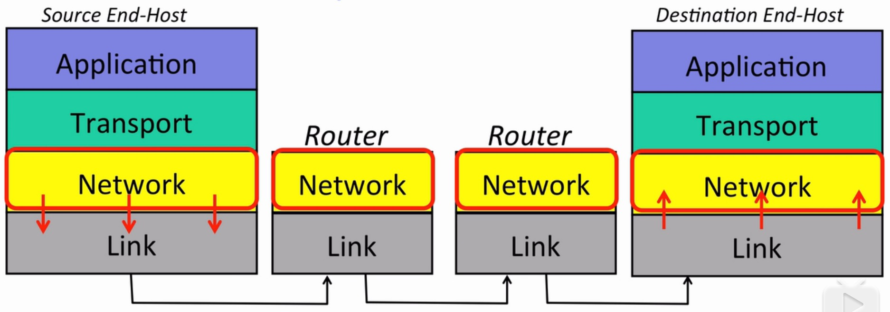

4 layer: 利于reuse

Internet: end-hosts, links and routers
* Link Layer: 利用 link 在 end host和router 或 router和router之间 传输数据, hop-by-hop逐跳转发
  * e.g. Ethernet and WiFi
* Network Layer: datagrams, Packet: (Data, Header(from, to))
  * packets可能失去/损坏/复制，no guarantees
  * must use the IP
  * may be out of order
* Transport Layer: TCP(Transmission Control Protocol) 负责上述Network层的局限性，controls congestion  
  * sequence number -> 保序
  * ACK(acknowledgement of receipt)，如果发信人没收到就resend
  * 比如视频传输不需要TCP，可以用UDP(User Datagram Protocol),不保证传输
* Application Layer

two extra things
* IP is the "thin waist"   ,这一层的选择最少
* the 7-layer OSI Model

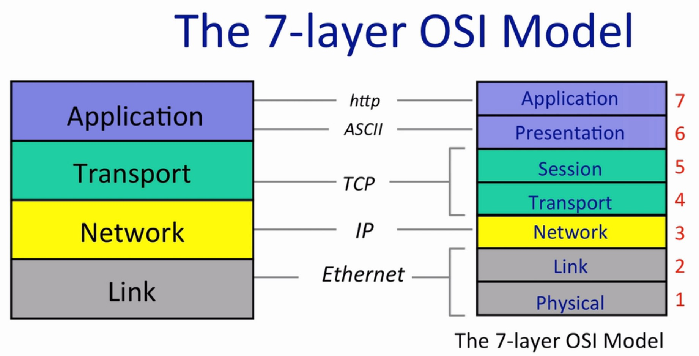

##### 1-3 The IP Service
* Link Frame (IP Datagram(IP Data(Data, Hdr), IP Hdr), Link Hdr )
* The IP Service Model的特点
  * Datagram: (Data, IP SA, IP DA)，每个 router 有 forwarding table，类比为 postal service 中的 letter
  * Unreliable: 失去/损坏/复制，保证只在必要的时候不可靠（比如queue congestion）
  * **Best-effort** attempt
  * Connectionless : no per-flow state, mis-sequenced
* IP设计简单的原因
  * minimal, faster, streamlined
  * end-to-end (在end points implement features)
  * build a variety of reliable/unreliable services on top
  * works over any link layer

* the IP Service Model
  1. tries to prevent packets looping forever (实现：在每个datagram的header加hop-count field: time to live TTL field, 比如从128开始decrement)
  2. will fragment packets if they're too long (e.g. Ethernet, 1500bytes)
  3. header checksum：增强可靠性
  4. allows for new versions of IP
  5. allows for new options to be added to header (由router处理新特性，慎重使用)

##### 1-4 A Day in the Life of a Packet
* 3-way handshake
  1. client: SYN 
  2. server: SYN/ACK
  3. client: ACK
* IP packets
  * IP address + TCP port (web server通常是80)
  * hops, Routers: wireless access point (WiFi的第一次hop)
  * forwarding table
  * default router

##### 1-5 Principle: Packet switching principle
packet: self-contained

packet switching: independently for each arriving packet, pick its outgoing link. If the link is free, send it. Else hold the packet for later.

source packet: (Data, (dest, C, B, A))  发展成只存destination，每个switch有table

two consequences
* simple packet forwarding: No per-flow state required，state不需要store/add/remove
* efficient sharing of links: busty data traffic; statistical multiplexing => 对packet一视同仁，可共享links

##### 1-6 Principle: Layering

* 一种设计理念，layers are functional components, they communicate sequentially 
* edit -> compile -> link -> execute
  
  * compiler: self-contained, e.g. lexical analysis, parsing the code, preprocessing declarations, code generation and optimization
* 有时需要 break layering
  * 比如Linux内核的部分代码C语言直接用汇编 => code不再layer-independent
  * a continual tension to improve the Internet by making cross-layer optimizations and the resulting loss of flexibility. e.g. NATs=>很难加其它类型的传输层
  * epoll这个接口是linux独有的，FreeBSD里是kqueue
  * UDP header 的 checksum 计算用到 IP header
  
* layering的原因：1.modularity 2.well defined service 3.reuse 4.separation of concerns 5.continuous improvement 6.p2p communications

##### 1-7 Principle: Encapsulation

* TCP segment is the **payload** of the IP packet. IP packet encapsulates the TCP segment.

* 一层层，套footer和header

    * 两种写法，底层的写法(switch design)header在右边，software的写法(protocol)header在左边（IETF）
    * VPN: (Eth, (IP, (TCP, (TLS, IP Packet))))，外层的TCP指向VPN gateway

##### 1-8 Byte Order
* 2^32 ~ 4GB ~  0x0100000000
* 1024=0x0400	大端：0x04 0x00；小端: 0x00 0x04. 
* Little endian: x86, big endian: ARM, network byte order
* e.g. `uint16_t http_port=80; if(packet->port==http_port){...}` IPv4的packet_length注意大小端
* 函数：`htons(),ntohs(),htonl(),ntohl()`
  * host/network, short/long
  * `#include<arpa/inet.h>`

##### 1-9 IPv4 addresses

goal:
* stitch many different networks together
* need network-independent, unique address

IPv4:
* layer 3 address
* 4 octets  a.b.c.d
* 子网掩码netmask: 255.128.0.0 前9位，1越少网络越大，same network不需要路由，直接link即可


IPv4 Datagram
* Total Packet Length: 大端，最多65535bytes, 1400 -> 0x0578
* Protocol ID: 6->TCP

Address Structure
* network+host
* class A,B,C: 0,7+24; 10, 14+16; 110, 21+8

Classless Inter-Domain Routing (CIDR，无类别域间路由)
* address block is a pair: address, count
* counts是2的次方? 表示netmask长度
* e.g. Stanford 5/16 blocks `5*2^(32-16)`
* 前缀聚合，防止路由表爆炸
* IANA(Internet Assigned Numbers Authority): give /8s to RIRs

##### 1-10 Longest Prefix Match(LPM)
forwarding table: CIDR entries
* LPM的前提是必须先match，再看prefix
* default: 0.0.0.0/0

##### 1-11 Address Resolution Protocol(ARP)
IP address(host) -> link address(Ethernet card, 48bits)

Addressing Problem: 一个host对应多个IP地址，不容易对应
* 解决方案：gateway两侧ip地址不同，link address确定card，network address确定host
* 这有点历史遗留问题，ip和link address的机制没有完全地分离开，decoupled logically but coupled in practice
* 对于A，ip的目标是B，link的目标是gateway

**ARP，地址解析协议**：由IP得到MAC地址 => 进一步可得到gateway address
* 是一种request-reply protocol
* nodes cache mappings, cache entries expire
* 节点request a link layer broadcast address，然后收到回复，回复的packet有redundant data，看到它的节点都能生成mapping
* reply：原则上unicast，只回传给发送者=>实际实现时更常见broadcast
* No "sharing" of state: bad state will die eventually
* MacOS中保留20min
* gratuitous request: 要求不存在的mapping，推销自己

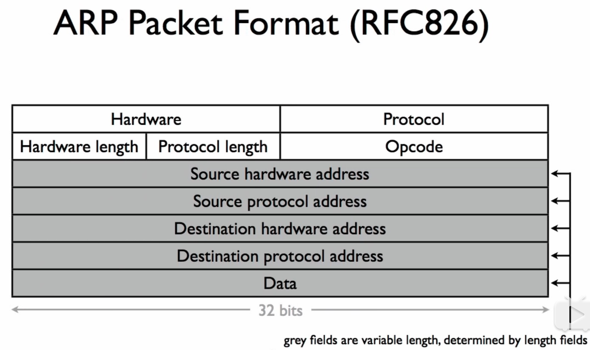

e.g. 

hardware:1(Ethernet)

protocol: 0x0800(IP)

hardware length:6 (48 bit Ethernet)

protocol length:4(32 bit IP)

opcode: 1(request) /2(reply)

Destination: broadcast (ff:ff:ff:ff:ff:ff)

##### 1-12 recap

##### 1-13 SIP, Jon Peterson Interview
the intersection between technology and public policy
* IETF ( The Internet Engineering Task Force)
* ICANN（The Internet Corporation for Assigned Names and Numbers）

SIP（Session Initiation Protocol，会话初始协议）
* end-to-end的设计
* soft switching: 将呼叫控制功能从传输层分离
* PSTN ( Public Switched Telephone Network ) -> VOIP(Voice over Internet Protocol): telephony replacement

SIP的应用场景
* Skype内部协议转换成SIP
* VOIP, FiOS( a telecom service offered over fiber-optic lines)

现代技术
* SDN (Software Defined Network)
* I2RS(interface to the routing system)
* CDN(Content Delivery Network): 1.express coverage areas 2.advertise services that they provide, in order to allow collaboration or peering among CDNs => optimal selections of CDNs
* 识别robo calling

##### 2-0 Transport (intro)

* 关注TCP的correctness
* detect errors的三个算法：checksums, cyclic redundancy checks, message authentication codes
* TCP(Transmission Control Protocol)、UDP(User Datagram Protocol)、ICMP(Internet Control Message Protocol)

##### 2-1 The TCP Service Model
**The TCP Service Model**

* reliable, end-to-end, bi-directional, in-sequence, bytestream service
* Peer TCP layers communicate: connection
* congestion control

**过程**：三次握手和四次挥手（参考2-6的状态转移图理解）

**Techniques to manufacture reliability**

Remedies
* Sequence numbers: detect missing data
* Acknowledgments: correct delivery
  * Acknowledgment (from receiver to sender)  
  * Timer and timeout (at sender)
  * Retransmission (by sender)
* Checksums/MACs: detect corrupted data
  * Header checksum (IP)
  * Data checksum (UDP)
* Window-based Flow-control: prevents overrunning receiver
* Forward error correction (FEC)
* Retransmission
* Heartbeats

Correlated failure

TCP/DNS

Paradox of airplanes


**The TCP Segment Format**
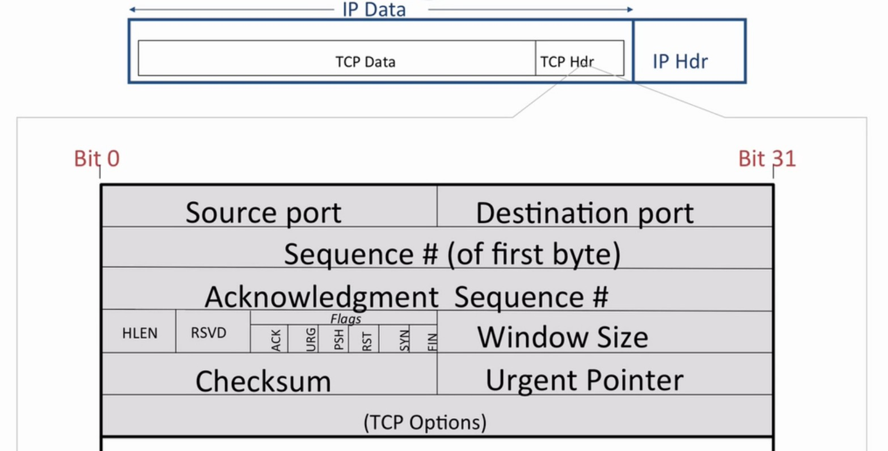

* [IANA port number](https://www.iana.org/assignments/service-names-port-numbers/service-names-port-numbers.xhtml): ssh 22, smtp 23, web 80
* source port: 初始化用不同的port避免冲突
* Flags
  * PSH flag: push，比如键盘敲击
  * URG应该在ACK前面
* HLEN 和 (TCP options) 联系

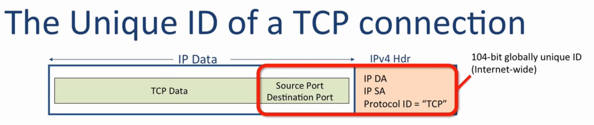
五个部分，104bit

唯一性
* 要求source port initiator每次increment: 64k new connections
* TCP picks ISN to avoid overlap with previous connection with same ID, 多一个域，增加随机性
* ISN的意义在于：1）security，避免自己的window被overlap 2）便于filter out不同类型的包  


##### 2-2 UDP service model
不需要可靠性：app自己控制重传，比如早期版本的NFS (network file system)

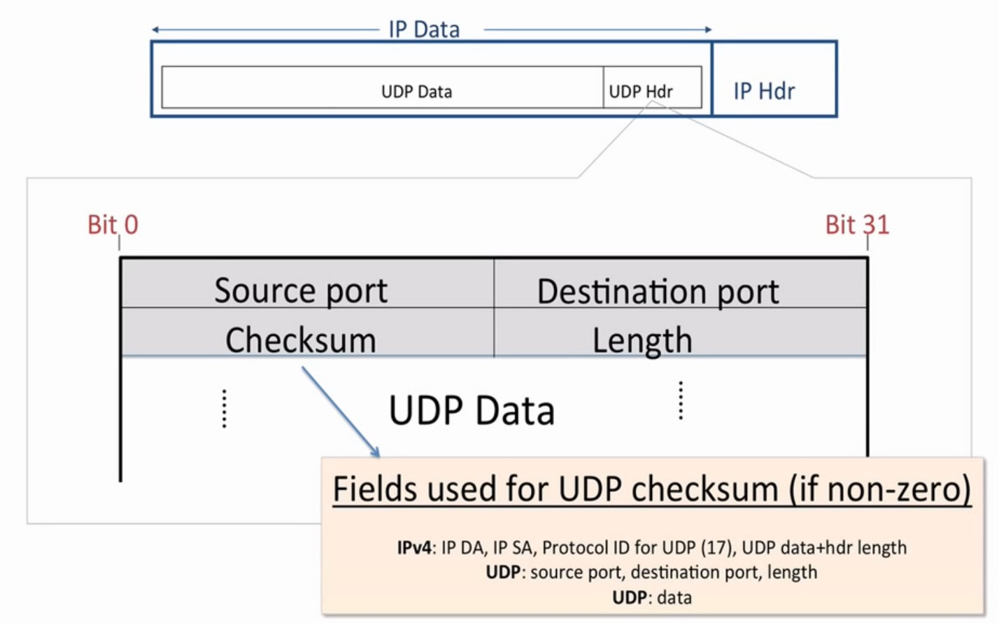
* Checksum 对于 IPv4 可选，可以为全0
* Checksum 用了 IP header，违背 layering principle，是为了能detect错传
* UDP header 有 length 字段，而TCP没有，因为TCP对空间要求高，用隐含的方式计算 length
* port demultiplexing, connectionless, unreliable

**应用**

DNS: domain name system，因为request全在单个datagram里

DHCP: Dynamic Host Configuration Protocol
* new host在join网络时得到IP
* 连WiFi

对重传、拥塞控制、in-sequence delivery 有 special needs 的应用，比如音频，但现在UDP不像以前用的那么多，因为很多是http，基于TCP。

##### 2-3 The Internet Control Message Protocol (ICMP) Service Model
report errors and diagnoise problems about network layer

网络层work的三个因素：IP、Routing Tables、ICMP

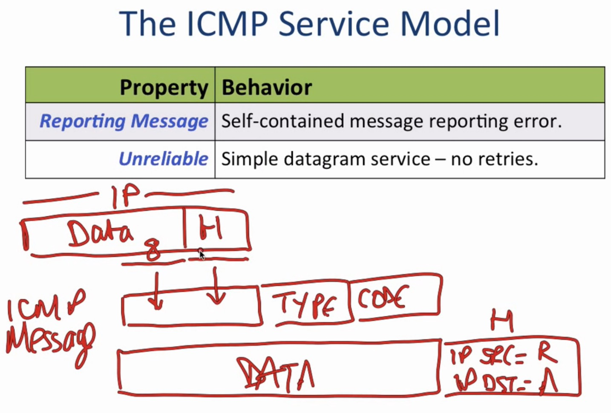

Message的意义见RFC 792

应用于ping：先发送8 0( echo request)，再送回0 0(echo reply)

应用于traceroute: 
* 核心思想：连续发送TTL从1开始递增的UDP，期待回复的11 0(TTL expires)
  * Source is random and different for each; destination starts with a random number and increases by one for each
* 由于路由选择问题，traceroute 无法保证每次到同一个主机经过的路由都是相同的。
* traceroute 发送的 UDP 数据报端口号是大于 30000 的。如果目的主机没有任何程序使用该端口，主机会产生一个 3 3(端口不可达) ICMP报文给源主机。

##### 2-4 End-to-End Principle
**Why Doesn't the Network Help?**
* e.g.：压缩数据、Reformat/translate/improve requests、serve cached data、add security、migrate connections across the network
* end-to-end principle: function的正确完整实现只依赖于通信系统的end points

end-to-end check 
* e.g. File Transfer: link layer的error detection只检测transmission错误，不检测error storage
* e.g. TCP小概率会出错（stack）、BitTorrent
* wireless link相比wire link功能复杂，可靠性低，所以在link layer重传，可提升TCP性能
* RFC1958: "strong" end to end: 不推荐在 middle 实现任何功能，比如在 link layer 重传，假定了reliabilty的提升值得latency的牺牲

##### 2-5 Error Detection: 3 schemes: 3 schemes

* detect errors的三个算法：checksums, CRC(cyclic redundancy checks), MAC(message authentication codes)
* 增补方式
  * append: ethernet CRC, TLS MAC
  * prepend: IP checksum
* Checksum (IP, TCP)
  * not very robust, 只能检1位错
  * fast and cheap even in software
  * IP, UDP, TCP use one's complement算法：16-bit word packet求和，进位加到底部，再取反码（特例：0xffff -> 0xffff，因为在TCP，checksum field 为 0 意味着没有 checksum）
* CRC: computes remainder of a polynomial (Ethernet)，见[通信与网络笔记](https://github.com/huangrt01/CS-Notes/blob/master/Notes/%E9%80%9A%E4%BF%A1%E4%B8%8E%E7%BD%91%E7%BB%9C.md)
  * 虽然more expensive，但支持硬件计算
  * 可对抗2 bits error、奇数error、小于c bits的突发错(burst)
  * 可incrementally计算
  * e.g. USB(CRC-16): $\bf{M} = 0x8005 = x^{16}+x^{15}+x^2+1$，对于generator需要给左边pad 1
* MAC: message authentication code: cryptographic transformation of data(TLS)
  * robust to malicious modifications, but not errors
  * 检错能力有局限，受随机性影响，不如CRC，no error detection guarantee
  * $c=MAC(M,s)$，M + c意味着对方有secret或者replay
  * 对于replay，`ctr++`, 具体见[我的密码学笔记](https://github.com/huangrt01/CS-Notes/blob/master/Notes/Output/Security-Privacy-Cryptography.md)的TLS部分【目前尚未整理】
##### 2-6 Finite State Machines
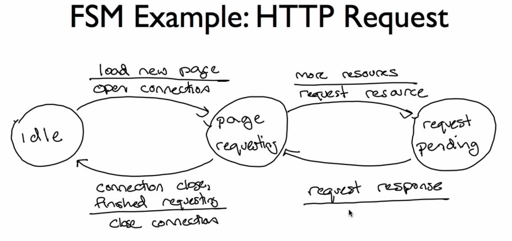

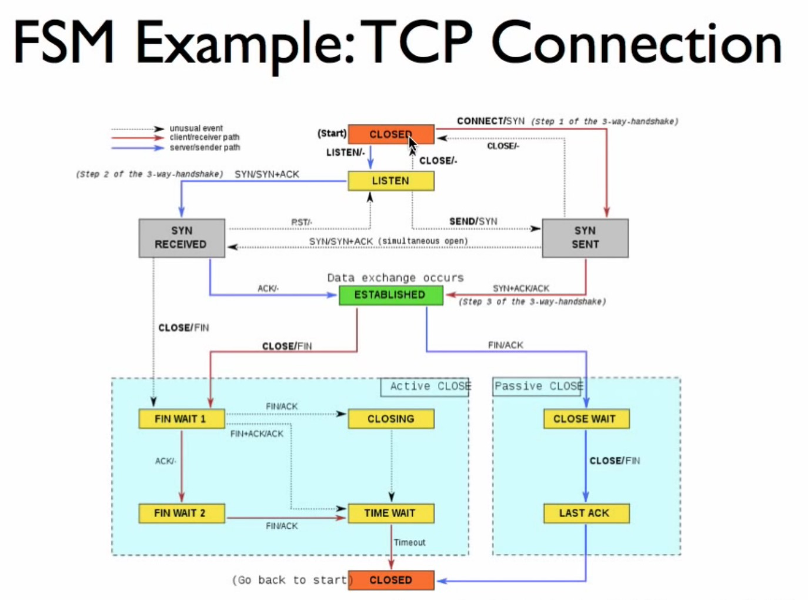

* 非常规路线的处理：比如对于第二个SYN或者FIN信号，接收机选择忽视，具体见`bool TCPReceiver::segment_received(const TCPSegment &seg)`的实现

##### 2-7 Flow Control I: Stop-and-Wait
* 核心是 receiver 给 sender 反馈，让sender不要送太多 packets
* 基本方法
  * 方案一：stop and wait
  * 方案二：sliding window

**stop and wait**
* flight 中最多一个 packet
* 针对 ACK Delay（收到ACK的时间刚好在timeout之后）的情形，会有duplicates
  * 解决方案：用一个1-bit counter 提供信息
  * assumptions：1）网络不产生重复packets；2）不delay multiple timeouts

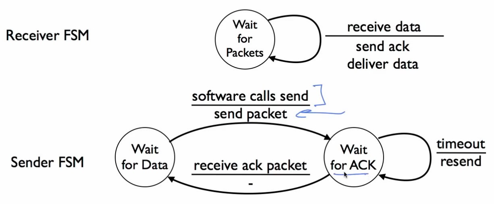

##### 2-8 Flow Control II: Sliding Window
* Stop-and-Wait的性能：RTT=50ms, Bottleneck=10Mbps, Ethernet packet length=12Kb => 性能(2%)远远不到瓶颈
* Sliding Window计算Window size填满性能

**Sliding Window Sender**

* Every segment has a sequence number (SeqNo)
* Maintain 3 variables
  * Send window size(SWS)
  * Last acknowledgment(LAR)
  * Last segment sent(LSS)
* Maintain invariant: $(LSS - LAR) \leq SWS$
* Advance LAR on new acknowledgement 
* Buffer up to SWS segments

**Sliding Window Receiver**
* Maintain 3 variables
  * Receive window size(RWS)
  * Last acceptable segment(LAS)
  * Last segment received(LSR)
* Maintain invariant: $(LAS - LSR) \leq RWS$
* 如果收到的packet比LAS小，则发送ack
  * 发送cumulative acks: 收到1, 2, 3, 5，发送3
  * TCP acks are next expected data，因此要加一，上个例子改为4，初值为0

**RWS, SWS, and Sequence Space**
* $RWS \geq 1, SWS \geq 1, RWS \leq SWS$
* if $RWS = 1$, "go back N" protocol ,need SWS+1 sequence numbers (需要多重传)
* if $RWS = SWS$, need 2SWS sequence numbers
* 通常需要$RWS+SWS$ sequence numbers：考虑临界情况，SWS最左侧的ACK没有成功发送，重传后收到了RWS最右侧的ACK

**TCP Flow Control**

* Receiver advertises RWS using window field
* Sender can only send data up to LAR+SWS

##### 2-9 Retransmission Strategies
protocol可能的运转方式 (ARQ: automatic repeat request)
* Go-back-N: pessimistic，重传ack, ack+1, ack+2 ...
  * e.g. RWS=1的情形
* Selective repeat: optimistic，重传ack, last_sent, last_sent+1, ...
  * e.g. RWS=SWS=N的情形
  * 对burst of losses效果不好

##### 2-10 TCP Header

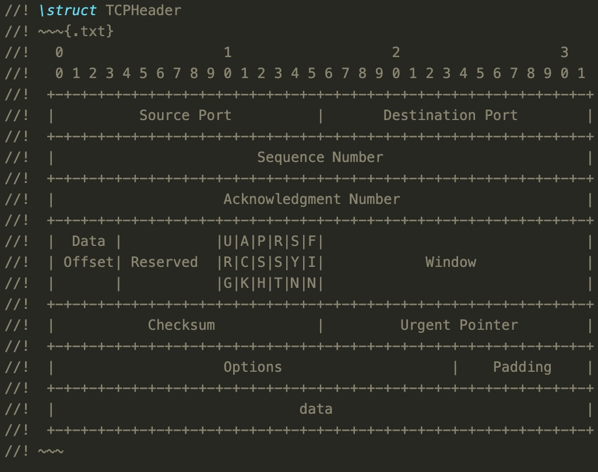


* pseudo header：类似2-2，checksum的计算囊括了IP header
* ack: 如果是bi-directional，也携带data信息；如果是uni-directional，好像不携带
* URG: urgent, PSH: push
* ACK: 除了第一个packet SYN，其它seg的ACK都置换为1  
* RST: reset the connection
* urgent pointer：和URG联系，指出哪里urgent

##### 2-11 TCP Setup and Teardown
状态机的实现很简洁，核心是如何 set up 和 clean up (port number, etc)


**3-way handshake**

Active opener and Passive opener

1. client: SYN, 送base number(syqno) to identify bytes
2. server: SYN+ACK, 也送base number
3. client: ACK

支持“simultaneous open”

传送TCP segment，最小可以1byte，比如在ssh session打字

**connection teardown**

1. client: FIN
2. server: (Data +) ACK
3. server: FIN
4. client: ACK

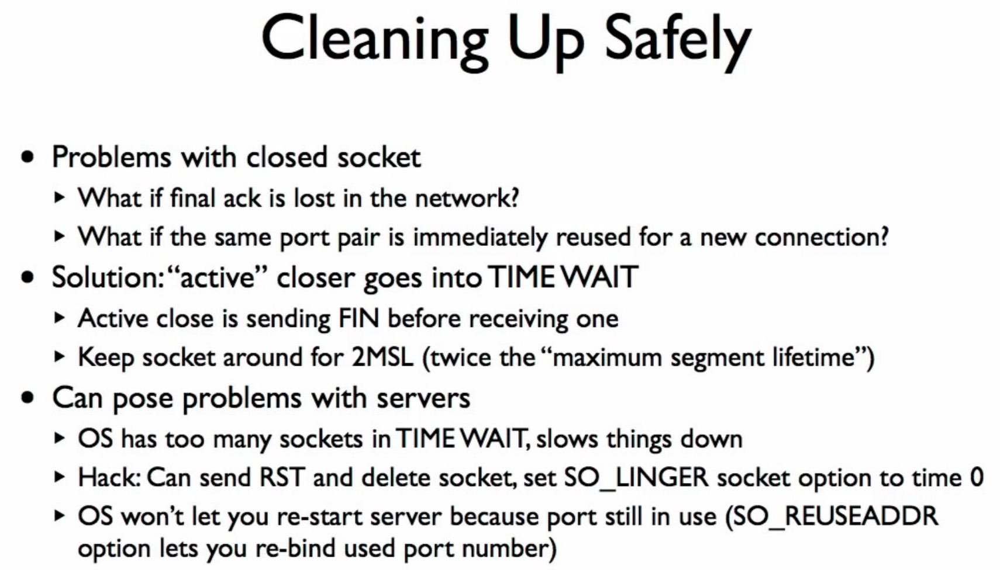

* [为什么 TCP 协议有 TIME_WAIT 状态](https://draveness.me/whys-the-design-tcp-time-wait/)
  * `TIME_WAIT` 仅在主动断开连接的一方出现，被动断开连接的一方会直接进入 `CLOSED` 状态，进入 `TIME_WAIT` 的客户端需要等待 2 MSL 才可以真正关闭连接
  * 不直接关闭连接的原因：
    * 防止延迟的数据段被其他使用相同源地址、源端口、目的地址以及目的端口的 TCP 连接收到
      * RFC 793
      * `#define TCP_TIMEWAIT_LEN (60*HZ) /* how long to wait to destroy TIME-WAIT state, about 60 seconds	*/`
			* 但是如果主机在过去一分钟时间内与目标主机的特定端口创建的 TCP 连接数超过 28,232，那么再创建新的 TCP 连接就会发生错误，也就是说如果我们不调整主机的配置，那么每秒能够建立的最大 TCP 连接数为 ~470
    * 保证 TCP 连接的远程被正确关闭，即等待被动关闭连接的一方收到 `FIN` 对应的 `ACK` 消息
      * 防止TIME-WAIT 较短导致的握手终止，服务端发送`RST`
  * 处理方案：除了上图的两者，还可以：
    * 修改 `net.ipv4.ip_local_port_range` 选项中的可用端口范围，增加可同时存在的 TCP 连接数上限；

* [Scaling Techniques for Servers with High Connection Rates](https://domsch.com/linux/lpc2010/Scaling_techniques_for_servers_with_high_connection%20rates.pdf)
  * problems
    * Servers with high connection/transaction rates
      * TCP servers, e.g. web server
      * UDP servers, e.g. DNS server
    * On multi-core systems, using multiple servicing threads, e.g. one thread per servicing core.
      * The single server socket becomes bottleneck
      * Cache line bounces
      * Hard to achieve load balance
      * Things will only get worse with more cores
  * Single TCP Server Socket
    * solution 1: Use a listener thread to dispatch established connections to server threads
      * The single listener thread becomes bottleneck due to high connection rate
      * Cache misses of the socket structure
      * Load balance is not an issue here
    * solution 2: All server threads accept() on the single server socket
      * Lock contention on the server socket
      * Cache line bouncing of the server socket
      * Loads (number of accepted connections per thread) are usually not balanced 
        * Larger latency on busier CPUs
        * It can almost be achieved by accept() at random intervals, but it is hard to decide the interval value, and may introduce latency
  * Single UDP Server Socket
  * New Socket Option - SO_REUSEPORT
    * Allow multiple sockets bind()/listen() to the same local address and TCP/UDP port 
      * Every thread can have its own server socket
      * No locking contention on the server socket
    * Every thread can have its own server socket No locking contention on the server socket
    * Load balance is achieved by kernel - kernel randomly picks a socket to receive the TCP connection or UDP request
    * For security reason, all these sockets must be opened by the same user, so other users can not "steal" packets
  * How to enable?
    * sysctl net.core.allow_reuseport=1
    * Before bind(), setsockopt SO_REUSEADDR and SO_REUSEPORT
    * Then the same as a normal socket - bind()/listen() /accept()
  * Known Issues
    * Hash
    * Have not solved the cache line bouncing problem completely
      * Solved: The accepting thread is the processing thread
      * Unsolved: The processed packets can be from another CPU
        * Instead of distribute randomly, deliver to the thread/socket on the same CPU （input queue和server thread一一对应）
        * But hardware may not support as many RxQs as CPUs
    * Some scheduler mechanism may harm the performance
      * Affine wakeup - too aggressive in certain conditions, causing cache misses


##### 2-12 TCP Recap

IP和UDP都是best-effort and unreliable，但是我们不需要担心truncation和corruption，因为：
* Header checksum (IP)
* Data checksum (UDP)


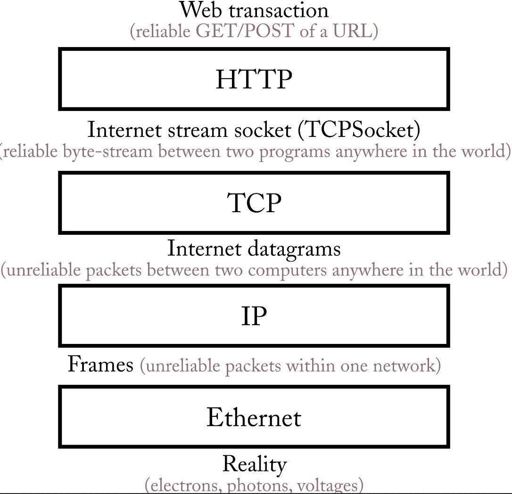

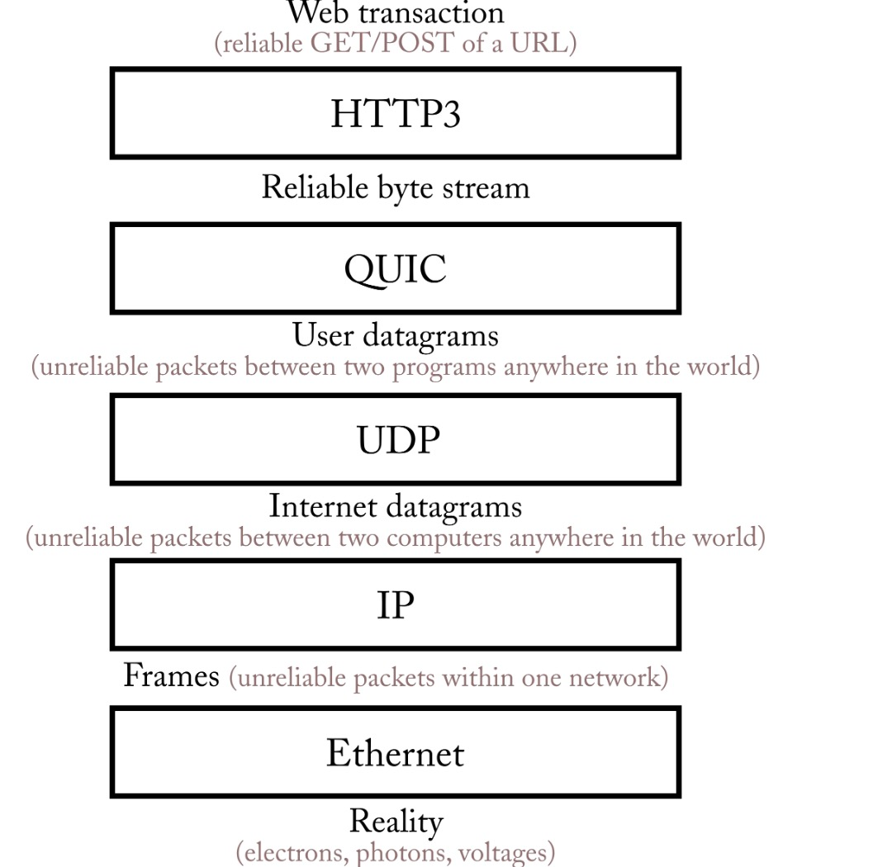


##### 2-13 TCP/IP -- Kevin Fall
《TCP/IP Illustrated》2nd edition 

securites: firewalls;  architectural underpinnings

packets和datagrams是两个核心概念，datagrams为了明确目的地，在设计时有更多的trade-off

3-d printing、枪、DRM(Digital Rights Management)


##### 3-0 Packet Switching

Packet -> self-contained data unit

packet delay

* Packetization delay
* Propagation delay
* Queueing delay

##### 3-1 The History of Networks

Semaphore telegraphs by Chappe (France)，发展出以下概念：

* Codes
* Flow Control
* Synchronization
* Error detection and retransmission
* Encryption

Pre-defined messages -> arbitrary messages -> compression -> control signals "Protocols"

##### 3-2 What is packet switching?

Circuit Switching

* telephone: dedicated wire -> circuit switch -> dedicated wire
* each phone call: 64 kb/s, no share with anybody else (private, guaranteed, isolated data rate from e2e)
* A 10Gb/s trunk line can carry over 150000 calls

Circuit Switching 用于 Internet 的缺点

* Inefficient: bursty communication (images, ssh connection, web pages)
* Diverse Rates
* State Management

Packet Switching 

* Network = end hosts + links + packet switches
* forwarding table (routed individually by looking up)
  * All packets share the full capacity of a link
  * The routers maintain no per-communication state
* have buffers: must send one at a time during periods of congestion
* 有不同 types: routers、ethernet switches

Why Internet uses packet switching

* Efficient use of expensive links
* Resilience to failure of links & routers
  * the Internet was to be a datagram subnet
* Internet was designed to be the interconnection of the existing networks

##### 3-3 Terminology, End to End Delay and Queueing

Propagation Delay: $t_l = \frac{l}{c}$

* single bit to travel over a link
* 1000km, 2*10^8m/s ---> 5ms
* 不受 link rate 影响

Packetization Delay: $t_p=\frac{p}{r}$

* 64byte packet, 100Mb/s link ---> 5.12us
* 1kbit (1024bit) packet, 1kb/s link (1000bit/s) ---> 1.024s

E2E delay $t=\sum_i(\frac{p}{r_i}+\frac{l_i}{c}+Q_i(t))$

* store and forward network

* router 理论上能等到 header 直接开始 packetization (cut through switching)，internet router 通常不这样做，是收到整个 packet 再发送
* queueing delay -> packet delay variation


##### 3-4 Playback Buffers

Real-time applications (e.g. YouTube and Skype) have to cope with variable queueing delay

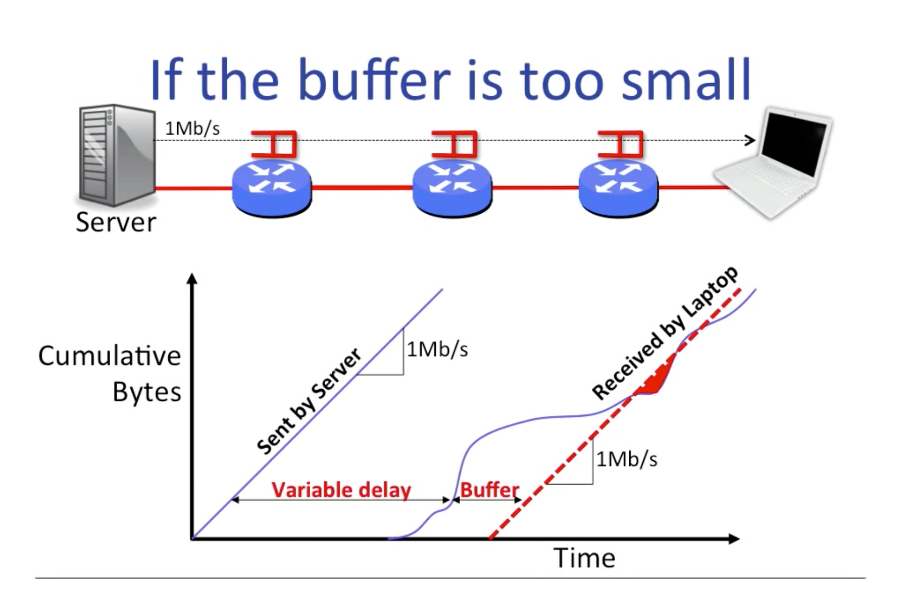

* variable delay 有下界
* receive 曲线斜率有上界


##### 3-5 Simple Deterministic Queue Model

$Q(t) = A(t)-D(t)$

d(t): 水平截距的差，表示单个 byte 的 queueing time

Q: Why not send the entire message in one packet?

A: parallel transmission across all links -> reduce e2e latency

---> Statistical Multiplexing Gain = 2C/R


##### 3-6 Queueing Model Properties

Queues with Random Arrival Processes (Queueing Theory)

* Bustiness increases delay
* Determinism minimizes delay
* Little's Result
  * $L=\lambda d$, where d = average delay, lambda = arival rate, L = average number that are in the queue
* The M/M/1 queue
  * 用 Poisson process 建模 aggregation of many independent random events，lambda = arrival rate
  * network traffic is very bursty => 用 poisson 过程建模 the arrival of new flows
  * M/M/1 Queue: $d=\frac{1}{\mu-\lambda}, L=\lambda d = \frac{\frac{\lambda}{\mu}}{1-\frac{\lambda}{\mu}}$


##### 3-7 Switching and Forwarding

##### Congestion Control

* Why
  * What if the receiver’s window size is really big?
    * Sender transmits too many segments. Most overflow router’s queue and are dropped. We call this “congestion.”
    * Sender must resend the same bytes again and again. Eventually, stream comes out of receiver’s TCP correctly
  * The problem with unlimited sending: collapse and fairness
  * In networking, almost any problem that involves decentralized resource allocation = congestion control.
* What
  *  a **second and tighter** window maintained by sender
    * receiver’s window (advertised from receiver to sender)
    * “congestion window” cwnd (maintained by sender)
  * How much data can be “on the link” at any moment?
    * (5 Mbit/s) x (100 ms) = 62.5 kilobytes
  * Ideal total number of bytes outstanding = bandwidth x delay product (BDP).
  * “No loss” window: anything less than BDP + max queue size.
  * Note: 用 window 不用 rate，误差小
* How
  * “Additive Increase, Multiplicative Decrease” algorithm (AIMD)
  * One possibility: increase on success, decrease on loss
  * Start with cwnd at small value (e.g. 3 segments)
  * On success (segment fully acknowledged), increase by 1 segment per RTT
    * On each byte acknowledged: cwnd += (segment size)/cwnd
  * On loss, assume congestion. Cut cwnd in half!
    * Loss inferred when:
      * segment was sent a long time ago, still not acknowledged
      * or several later-sent segments have been acknowledged
  * Slow-start: exponential growth at the beginning
    * On each byte acknowledged: cwnd++
    * On first loss, cut cwnd in half and revert to AIMD


* rpc框架congestion control可能和tcp congestion control相结合
  *  https://capnproto.org/news/2020-04-23-capnproto-0.8.html
  * it queries the send buffer size of the underlying network socket, and sets that as the “window size” for each stream.
  * But, the TCP socket buffer size only approximates the BDP of the first hop. A better solution would measure the end-to-end BDP using an algorithm like [BBR](https://queue.acm.org/detail.cfm?id=3022184).
* [Oracle STREAMS's Flow Control](https://docs.oracle.com/cd/E37838_01/html/E61060/frmkern7-sect1-flow.html)
  * 状态从后往前propagation的设计，`canputnext()`
  * 阻塞则 `putbq`


### potpourri

#### RFC

* RFC 792: ICMP Message
* RFC 821: SMTP
* [RFC 1958](https://datatracker.ietf.org/doc/rfc1958/?include_text=1):Architectural Principles of the Internet
* [RFC 2606](https://datatracker.ietf.org/doc/rfc2606/): localhost
* [RFC 6298](https://datatracker.ietf.org/doc/rfc6298/?include_text=1): Computing TCP's Retransmission Timer
* [RFC 6335](https://tools.ietf.org/html/rfc6335): port number
* RFC 7414: A Roadmap for TCP


* [TCP backlog: syns queue and accept queue](https://www.cnblogs.com/Orgliny/p/5780796.html)
* [What is a REST API?](https://www.youtube.com/watch?v=Q-BpqyOT3a8)
  * Representational State Transfer (REST)
  * Architecture style
  * Relies on a stateless, client-server protocol, almost alwasys HTTP
    * GET: retrieve data from a specified resource
    * POST: submit data to be processed to a specified resource
    * PUT: update a specified resource
    * DELETE
    * HEAD: same as get but does not return a body
    * OPTIONS: return the supported HTTP methods
    * PATCH: update partial resources
  * Treats server objects as resources that can be created or destroyed
  * GitHub REST API: https://docs.github.com/en/rest
  * 推荐 Postman 工具
* [AF_INET域与AF_UNIX域socket通信原理对比](https://blog.csdn.net/sandware/article/details/40923491)

```c++
#include <sys/types.h>
#include <unistd.h>
#include <sys/un.h>
#include <sys/socket.h>
#include <sys/types.h>
#include <stdlib.h>
#include <stddef.h>

#define UNIX_SOCK_PATH_MAX_LEN (sizeof(((struct sockaddr_un*)0)->sun_path))
#define COMMAND_MAX_LEN 64
//file name format is project_pid.sock
#define SOCK_PATH_FORMAT "/dev/shm/project_%llu.sock"

char control_sock_path[UNIX_SOCK_PATH_MAX_LEN] = {'\0',};

int main(int argc, char *argv[]) {
  int fd = socket(AF_UNIX, SOCK_STREAM, 0);
	if(fd < 0){
		printf("socket error\n");
	}
	snprintf(control_sock_path,
			UNIX_SOCK_PATH_MAX_LEN,
			UNIX_SOCK_PATH_FORMAT,
			(unsigned long long)atoll(argv[1]));
	printf("%s\n", control_sock_path);
	struct sockaddr_un un;
	memset(&un, 0, sizeof(un));
	strncpy(un.sun_path, control_sock_path, sizeof(un.sun_path));
	un.sun_family = AF_UNIX;
	socklen_t len = offsetof(struct sockaddr_un, sun_path) + strlen(un.sun_path);
	if (connect(fd, (struct sockaddr *)&un, len) < 0){
		close(fd);
		printf("connect error\n");
	}
	process(fd);
}
```

* [代理，网关，隧道，有什么区别与联系？ - 知乎](https://www.zhihu.com/question/268204483/answer/334644846)


##### wireshark
[谈谈Linux中的TCP重传抓包分析](https://segmentfault.com/a/1190000019734707)

```
telnet cs144.keithw.org http
GET /hello HTTP/1.1 # path part,第三个slash后面的部分
Host: cs144.keithw.org # host part,`https://`和第三个slash之间的部分

tcp.port == 90 and ip.addr== XXX
tcp.len > 0
ip.ttl == XXX
icmp.code == 0
```

课程作业：

1.Ping

2.SMTP：在TCP上层

3.Traceroute
* VM的第一跳是到laptop，不会decrement the TTL，因此hop 10对应TTL 9


#### WiFi 与 路由器

* WIFI5 的连接速度最高 866.7 Mbps，只有开启 WIFI6 模式，并且启用160MHZ，才能突破 866.7 Mbps
* 路由器 LAN-LAN 级联


### 论文阅读

#### 《Ethane: Taking Control of the Enterprise, SIGCOMM 07》

make networks more manageable and more secure，一种思路是全方位的增加控制，相当于新增一层，只是hide了复杂度；于是提出ethane：

Ethane的思想

* The network should be governed by policies declared over high-level names
* Policy should determine the path that packets follow
* The network should enforce a strong binding between a packet
  and its origin.

Ethane的优势

* Security follows management.
* Incremental deployability.
* Significant deployment experience.

设计思想

* Controllers: 决定是否允许packet传输
* Switches: a simple flow table and a secure channel to the Controller
  * flow是一个重要的属性概念
  * Binding: When machines use DHCP to request an IP address, Ethane assigns it knowing to which switch port the machine is connected, enabling Ethane to attribute an arriving packet to a physical port.


其它细节

* Replicating the Controller: Fault-Tolerance and Scalability
  * cold-standby (having no network binding state) or warm-standby (having network binding state) modes


