[toc]

## Database

### Intro -- 业务场景

#### 选型对比：Redis vs MongoDB vs HBase

| 数据库 | 优势 | 劣势/限制 |
| :--- | :--- | :--- |
| **Redis** | 数据结构丰富，易用，性能极高 | 内存存储，成本较高 |
| **MongoDB** | 数据类型和结构丰富，易用，存储量大，性能尚可 | 需要和业务场景匹配 |
| **HBase** | 吞吐高，存储量大，性能尚可 | 大宽表，数据结构单一，使用相对复杂，用户友好度一般 |

#### 深度对比：MongoDB vs RDS (分布式关系型)

| 维度 | MongoDB | RDS (分布式关系型) |
| :--- | :--- | :--- |
| **定位** | 通用的 Schemaless 文档数据库 | 分片、多副本，分布式关系数据库 |
| **容量上限** | **<= 1PB** (更高) | ~100TB |
| **写入性能** | **10w+ QPS** (20ms) | 5w+ QPS (30ms) |
| **读取性能** | **50w+ QPS** (20ms) | 20w+ QPS (20ms) |
| **一致性** | **最终一致性**<br>(新版可配置强一致，但损耗性能，一般不建议) | **强一致性** |
| **事务** | 支持 (但会牺牲速度和可用性) | ✅ 完善支持 |
| **索引** | ✅ 支持 | ✅ 支持 |

> **总结**：MongoDB 胜在**吞吐量与容量上限**，适合读写并发极高且对一致性要求稍宽容的海量数据场景；RDS 胜在**强一致性与事务**，适合核心金融交易等严谨场景。

#### 典型场景决策

* **复杂查询与动态 Schema**
  * **需求**：字段结构不固定（Dynamic Schema），且需要根据这些动态字段进行复杂反查（Query by arbitrary fields）。
  * **选型**：必须使用 **NoSQL 架构**（如 MongoDB、Elasticsearch 等）。
  * **原因**：RDBMS 难以高效处理未预定义列的索引与查询；NoSQL 原生支持 Schemaless 及深层嵌套字段的灵活索引。

#### 其它

* [从零开始深入理解存储引擎](https://mp.weixin.qq.com/s/sEml0lH2Zj-b_sIFRn2wzQ) TODO
* Data Analytics
  * 图右sql来自tpc-h


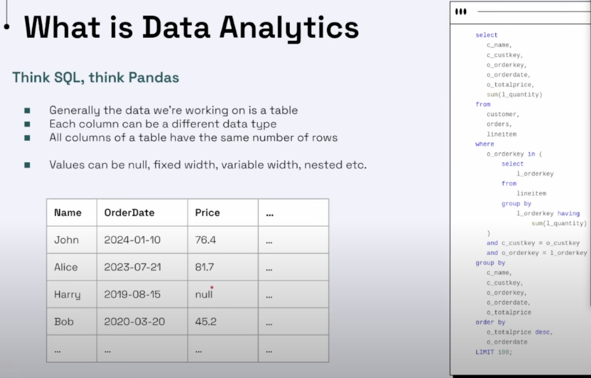

### 存储引擎概览（MongoDB）

- WiredTiger（默认）：压缩（snappy/zstd/none）、文档级并发、checkpoint+journal 持久化；缓存默认≈物理内存的 50%，`storage.wiredTiger.engineConfig.cacheSizeGB` 可调。
  - 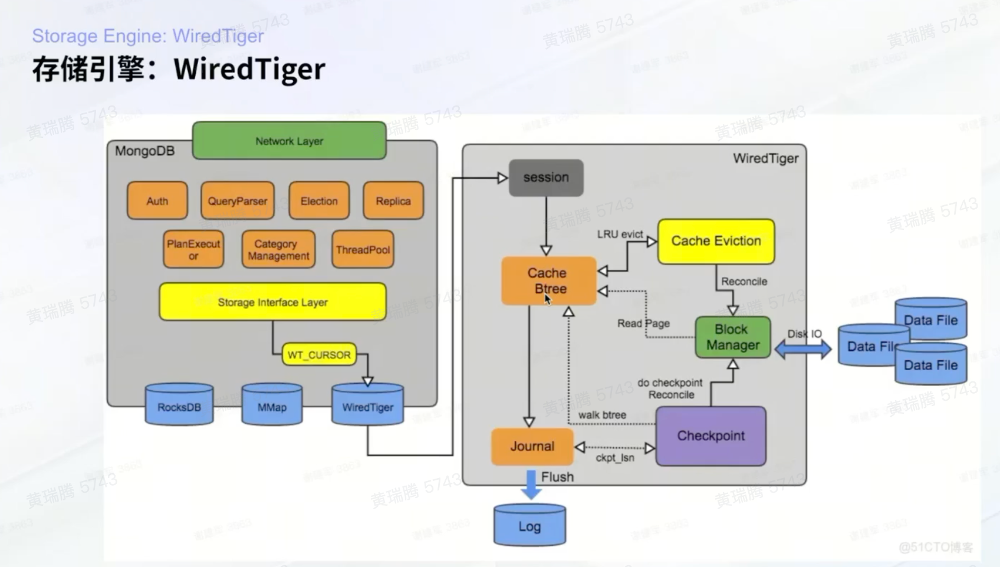
    - WiredTiger 和 mysql 的异同：都用了 Btree，但叶子节点间没有用链表连接

- In-Memory：数据驻内存，重启数据丢失；适合低时延的临时数据。
- MMAPv1：旧引擎，已弃用。
- 机制：
  - Checkpoint 将脏页刷盘形成一致性快照；Journal 写前日志，`j:true` 保障落盘。
  - 集合与索引均为内部表；`_id` 索引必有，压缩与缓存策略可分集合配置。
  - 文档级锁并发；通过 eviction 与写入节流保持稳定。
- 调优：
  - 压缩：通用选 `snappy`；冷数据多选 `zstd`；热写路径可按集合关闭压缩。
  - 缓存：热点溢出时提高 cache 或优化查询/索引；避免单次聚合读取超大文档。
  - 一致性：生产默认 `w:"majority", j:true`；读用 `readConcern: majority`。
- 参考：
  - WiredTiger：https://www.mongodb.com/docs/manual/core/wiredtiger/
  - In-Memory：https://www.mongodb.com/docs/manual/core/inmemory/

### mysql

没学过db。。。极速入门满足日常简单需求

https://www.runoob.com/sql/sql-tutorial.html

https://www.w3schools.com/sql/default.asp

```mysql
CREATE TABLE Persons (
    Personid int NOT NULL AUTO_INCREMENT,
    LastName varchar(255) NOT NULL,
    FirstName varchar(255),
    Age int,
    PRIMARY KEY (Personid)
);
```

* FOREIGN KEY
  * 外键 (Foreign Key) 是一个用于建立和加强两个表数据之间连接的一列或多列。它是一个表中的字段，其值必须在另一个表的主键 (Primary Key) 中存在。
  * 核心作用是保证数据的**引用完整性 (Referential Integrity)**。如果把被引用的表（包含主键）看作“父表”，把引用外部主键的表看作“子表”，那么外键约束确保了：
    * 子表中不能插入父表中不存在的外键值。
    * 不能删除父表中仍被子表引用的记录（除非定义了级联操作如 `ON DELETE CASCADE`）。
  * 外键是 `JOIN` 操作的逻辑基础，通过它可以在多个表之间查询相关数据。

```mysql
-- 接着上面的 Persons 表，创建一个 Orders 表
-- Orders 表中的 PersonID 列是外键，引用 Persons 表的 Personid 主键
CREATE TABLE Orders (
    OrderID int NOT NULL AUTO_INCREMENT,
    OrderNumber int NOT NULL,
    PersonID int,
    PRIMARY KEY (OrderID),
    FOREIGN KEY (PersonID) REFERENCES Persons(Personid)
);
```

* NOT NULL
  * [为什么数据库字段要使用 NOT NULL？](https://mp.weixin.qq.com/s/XyOU6dimeZNjzIYyTv_fPA)

* AUTO INCREMENT


* SELECT
  * max, min, avg
  * GROUP BY
    * [not a group by expression error](https://learnsql.com/blog/not-a-group-by-expression-error/)

```mysql
# 判断范围
select min(record_id),max(record_id) from service_status where service_type='abc' limit 10;
# 精确查询规模
explain select * from  service_status where service_type='abc' and (record_id between 1 and 100000) 
# 从后往前
select * from service_status order by id desc
# 不等于
<>
# 非空
is NOT NULL
```

e.g.

```mysql
SELECT log.uid, info.source, log.action, sum(log.action), COUNT(1) AS count
FROM info, log
WHERE (log.time in LAST_7D) 
    and (log.id = info.id) 
    and (log.action=show)
GROUP by log.uid, info.source
ORDER by log.uid, info.source DESC
LIMIT 1000
```

* WITH AS
* JOIN
  * https://stackoverflow.com/questions/354070/sql-join-where-clause-vs-on-clause

```mysql
with temp as(
	select a,b,c
  where a=.. AND b=.. AND c=..
)
select A.a
from temp A join temp B
on A.a = B.a
group by A.a
```

```mysql
# 高级 JOIN 技巧
# Using the Same Table Twice
SELECT a.account_id, e.emp_id, b_a.name open_branch, b_e.name emp_branch 
FROM account AS a 
INNER JOIN branch AS b_a ON a.open_branch_id = b_a.branch_id 
INNER JOIN employee AS e ON a.open_emp_id = e.emp_id 
INNER JOIN branch b_e ON e.assigned_branch_id = b_e.branch_id WHERE a.product_cd = 'CHK';

# Self-Joins
SELECT e.fname, e.lname, e_mgr.fname mgr_fname, e_mgr.lname mgr_lname
FROM employee AS e INNER JOIN employee AS e_mgr
ON e.superior_emp_id = e_mgr.emp_id;

# Non-Equi-Joins
SELECT e1.fname, e1.lname, 'VS' vs, e2.fname, e2.lname
FROM employee AS e1 INNER JOIN employee AS e2
ON e1.emp_id < e2.emp_id WHERE e1.title = 'Teller' AND e2.title = 'Teller';
```

* OVER PARTITON BY
  * https://learnsql.com/blog/partition-by-with-over-sql/

```mysql
SELECT
    car_make,
    car_model,
    car_price,
    AVG(car_price) OVER() AS "overall average price",
    AVG(car_price) OVER (PARTITION BY car_type) AS "car type average price"
FROM car_list_prices
```

```mysql
WITH year_month_data AS (
  SELECT DISTINCT
       EXTRACT(YEAR FROM scheduled_departure) AS year,
       EXTRACT(MONTH FROM scheduled_departure) AS month,
       SUM(number_of_passengers)
              OVER (PARTITION BY EXTRACT(YEAR FROM scheduled_departure),
                                  EXTRACT(MONTH FROM scheduled_departure)
                   ) AS passengers
   FROM  paris_london_flights
  ORDER BY 1, 2
)
SELECT  year,
        month,
     passengers,
     LAG(passengers) OVER (ORDER BY year, month) passengers_previous_month,
     passengers - LAG(passengers) OVER (ORDER BY year, month) AS passengers_delta
FROM year_month_data;
```

```mysql
AVG(month_delay) OVER (PARTITION BY aircraft_model, year
                               ORDER BY month
                               ROWS BETWEEN 3 PRECEDING AND CURRENT ROW
                           ) AS rolling_average_last_4_months
```

* **Broadcast 技巧 (MAX + OVER)**
  * **场景**：将某一行（如基准组）的值“广播”到所有行，常用于计算相对于基准值的比率或差值，**避免使用低效的 Self-Join**。
  * **原理**：`CASE WHEN` 筛选出基准行的值，配合 `MAX(...) OVER()` 将该特定值聚合（取出非零的那个基准值）并投影到当前窗口的每一行。
  
  ```sql
  SELECT 
      vid, 
      value,
      -- 1. 提取基准值并广播到每一行 (例如 vid='base' 的行的 value)
      MAX(CASE WHEN vid = 'base' THEN value ELSE 0 END) OVER () AS base_val,
      
      -- 2. 直接利用广播值进行计算 (例如计算当前行与基准行的比率)
      value / MAX(CASE WHEN vid = 'base' THEN value ELSE 0 END) OVER () AS ratio
  FROM metrics
  ```

* ALTER TABLE

```mysql
ALTER TABLE
  service_status
ADD
  error_count_avg decimal(10, 5) NOT NULL DEFAULT 0 COMMENT "服务错误量",
MODIFY
  error_code int(11) NOT NULL COMMENT "请求错误类型（取最多的）",
MODIFY
  is_error int(5) NOT NULL COMMENT "是否是错误请求";
  
ALTER TABLE test TABLE (c1 char(1),c2 char(1));
```


* TIMESTAMP

```mysql
`record_time` datetime NOT NULL DEFAULT CURRENT_TIMESTAMP COMMENT '记录产生时间'
```


* [SQL Injection 注入攻击](https://www.w3schools.com/sql/sql_injection.asp)
  * SQL Injection Based on 1=1 is Always True
  * SQL Injection Based on ""="" is Always True
  * SQL Injection Based on Batched SQL Statements
    * 在输入中用分号分隔语句
  * Use SQL Parameters for Protection


#### 函数

* Count、Sum
  * count是行数、sum是求和
* `log(greatest(val,1e-6))`


### db client

#### Redis 常见接口

- put
- get key or keys
- mget
  - Input: keys
  - Output: indices, results
- hset
  - e.g. Redis: https://redis.io/docs/reference/optimization/memory-optimization/#use-hashes-when-possible
  - 存储结构化数据
- remove key or keys
- zcard
  - Returns the sorted set cardinality (number of elements) of the sorted set stored at `key`.
- zremrangebyscore(key, start, end)
  - Removes all elements in the sorted set stored at `key` with a score between `min` and `max` (inclusive).
- sadd、zadd、hset
  - sadd：set
  - zadd：sorted set (element with score)
  - hset：https://redis.io/commands/hset/

### 数据库优化

#### Dictionary Encoding

#### 同时支持 Query 和 Span

* scan：底层存储连续
* query：设计计算缓存层


### 图数据库

#### Gremlin

https://tinkerpop.apache.org/docs/current/reference/#_tinkerpop_documentation

* 建模细节：
  * 对边类型做拆分
  * 边索引：`g.V(A).outE('follow').order().by('age')`
* 基础命令
  * path
  * by
    * 作为Path修饰器，对Path上的元素Element执行投影计算。

```
g.V().has('id', {CityHash32(c)}).has('type', 2).outE('Company2Person').otherV().inE('Company2Person').otherV().outE('Company2Person').otherV().has('type', 1).has('id', {CityHash32(p)}).path().by(properties('name')).by(properties('role'))
```

* 规范
  * 判断点存在性：不能使用g.V().has("id", xxx).has("type", yyy)。原因是点有2种语义分别是属性点和边的端点。
    * 判断属性点存在性： 使用g.V().has("id", xxx).has("type", yyy).properties() 如果返回空，表示不存在。
    * 判断边端点存在性： 使用g.V().has("id",xxx).has("type",yyy).outE(edge_type).count()，如果返回0，表示不存在。
  * 新增(addV)或修改点(Property(key, value))，需要进行点存在性判断。
    * 添加点(addV)是覆盖语义，会把已有的点删除，再重新写入，导致原有的数据丢失。
    * 修改点(Property) 只能修改已存在点，不能新建属性，否则会报错。
  * 使用drop删除addV产生的点，删除点的属性，点并没有真正删除，只能由底层存储进行compact，降低空间占用。
  * 点的update-or-insert不支持原子性，边的update-or-insert并发下只能保证1个记录成功，其他会失败。 如有强需求使用原子性, 建议业务层实现。

```
g.V().has("id",A.id).has("type",A.type)
 .property("age", 28) // 如果A点存在，更新点的属性
 .fold()              // 结果为[]或[Vertex(A)]
 .coalesce(unfold(),  // 如果是[Vertex(A)],直接返回
   g.addV().overwrite(false).property("id",A.id).property("type",A.type)
    .property("age", 28) // 如果是[]，插入A并更新属性
  )              // coalesce 返回结果一定是 Vertex(A)
```

* 多跳查询：
  * 例如1跳出度为n，二跳出度为m。第1跳查询的次数为1，出现记录数为n，第2跳查询次数为n，输出记录为m，所以共需要查询次数为n+1，遍历总记录数为n*m。
* 技巧：
  * 引入虚拟点：
    * A->B
    * A->C
      * 点C的属性：B上要维护的属性
      * 边A->C的属性：B.id、B.type

* 例子：

```
# 插入一条 (1,1) -> (2,1) 的正向边
g.V().addE('follow').from(1,1).to(2,1).property('tsUs', 123)
# 从 (2,1) 出发，做入度查询，也就是反向查询
g.V(vertex(2,1)).inE('follow').count()

# 双向边
g.V(vertex(2,1)).double('follow').count()
```


```
# 关注
g.addE("follow").from(100, 2).to(200, 2).setProperty("tsUs", 1234).setProperty("closeness", 20)
# 取关
g.V(vertex(100, 2)).outE("follow").where(otherV().has("id", 200).has("type", 2)).drop()
# 按关注时间排序
g.V(vertex(100, 2)).outE("follow").order().by("tsUs").limit(10).otherV()
# 判断关系
g.V(vertex(100, 2)).outE("follow").where(otherV().has("id", 200).has("type", 2))
# 粉丝数量
g.V(vertex(100, 2)).in("follow").count()

# 使用local，子查询
g.V(vertex(100, 2)).out("follow").local(out("like").limit(100))
g.V(vertex(100, 2)).out("follow").out("follow").local(in("follow").count().is(le(500)))

# 按边属性筛选点
g.V(vertex(100, 2)).outE("follow").has("closeness", 20).otherV()

# 同时关注
g.V().has("id", C.id).has("type", C.type)
 .out("follow")
 .store("vertices")
 .count()
 .local(
        g.V().has("id", A.id).has("type", A.type)
         .out("follow")
         .where(P.within("vertices")))

# A->C路径
.g.V().has("id", A.id).has("type", A.type)
 .repeat(                              // repeat()表示表示迭代从A找关注or被关注的人
        both("follow")
        .simplePath())                 // simplePath()是过滤条件，出现环则过滤掉
 .until(                               // until()指定repeat步骤的终止条件是:
        or(has("id", C.id).has("type", C.type),  // 1. 找到了用户C，或者
           loops().is(gte(4))))                  // 2. 找了4度还没有找到；
 .emit(has("id", C.id).has("type", C.type))  // emit()表示只保留遍历终点是C的结果
 .path()                                     // path()表示生成起点A到终点C的路径
```


### 数据一致性

* 多版本并发控制(Multiversion concurrency control, MCC 或 **MVCC**)
  * 是数据库管理系统常用的一种并发控制，也用于程序设计语言实现事务内存。MVCC意图解决读写锁造成的多个、长时间的读操作饿死写操作问题。每个事务读到的数据项都是一个历史快照（snapshot)并依赖于实现的隔离级别。写操作不覆盖已有数据项，而是创建一个新的版本，直至所在操作提交时才变为可见。快照隔离使得事物看到它启动时的数据状态


### Hive

* hadoop 生态下的OLAP引擎，将 SQL 查询翻译为 map reduce 任务，特点是稳定，成功率高，但是查询速度慢

* API v.s. mysql

  * `percentile(a, array(0.5,0.9,0.99))` 求分位数（mysql没有这个函数）
  * [Hive Aggregate Functions](http://hadooptutorial.info/hive-aggregate-functions/)

* 用 Spark 做 mysql to Hive 的同步

  * ```
    spark.mysql.remain_delete = true
    ```

* 细节
  * p_date和p_hour是hive分区字段

### MongoDB

#### Intro

* **定位与设计哲学**
  * **定位**：最接近 RDBMS 的 NoSQL。
    * 官方定位偏向 **TP (Transactional Processing)** 场景，以点查询/更新操作为主。
    * **“关系型之实，NoSQL 之壳”**：内核设计（B+ Tree、ACID 事务）接近传统数据库，外层封装了 JSON 文档模型与分布式架构，兼顾了通用性与扩展性。
  * **权衡 (Trade-off)**：
    * 牺牲了严格的范式约束（Schema-less），换取了极致的开发灵活性（JSON）和水平扩展能力。
    * 相比 HBase/RocksDB 等基于 **LSM Tree**（写多读少、大数据吞吐）的系统，MongoDB 默认的 **WiredTiger** 引擎基于 **B+ Tree**，在读写性能上表现更均衡，更适合在线事务型业务。

* 流行度 Top-5
* 文档型、schemaless 的存储：
  * 用户体验好
  * 单条读取时只返回“实际存储在该文档里的键”。即便某字段在你的业务“定义了默认值”，只要没写进该文档，就不会在查询结果里自动出现任何“默认值”。这是数据库层面的行为。
* 性能好
  * 分片架构
  * ReplicaSet 主从结构，元数据和用户数据存储可用性高，但维护成本高，建议使用云托管服务
* 和 AI 天然结合：文档数据库的特点

#### 数据模型 Data Model

* 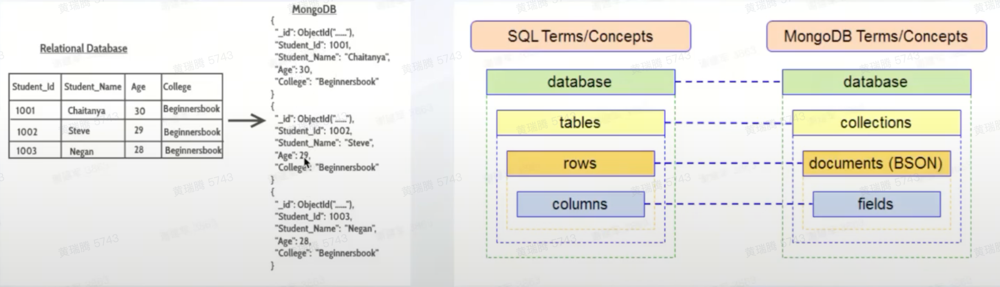
* 和 SQL 的区别，单表灵活拓展 v.s. 多表
  * 主键点查和插入很简单，不用 join
  * 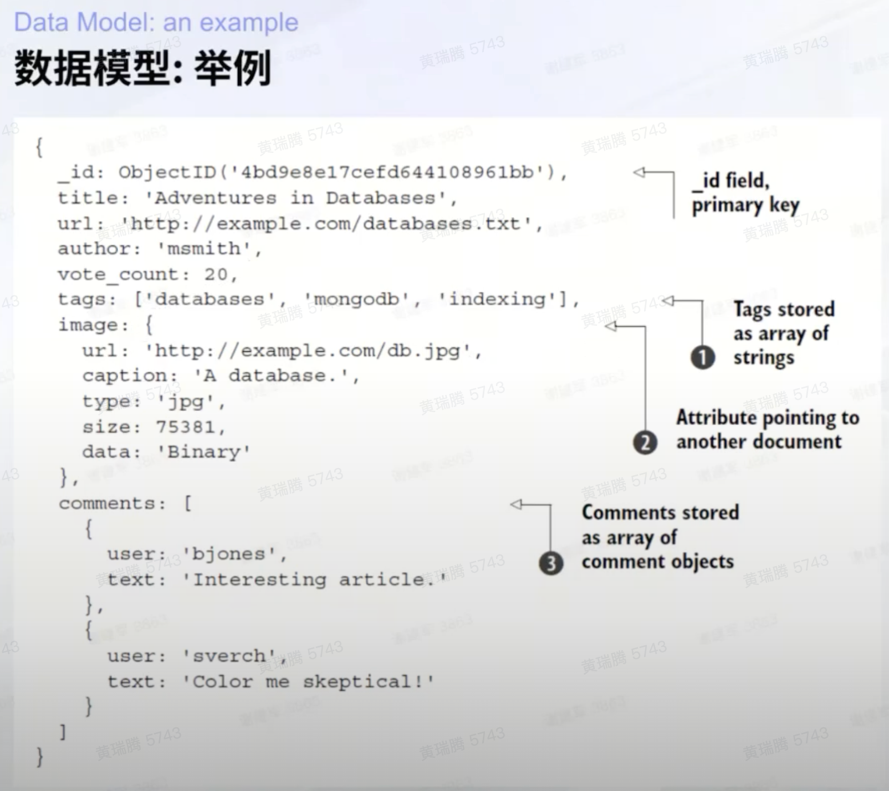

##### BSON 数据类型

- 基本类型：`Double`、`String`、`Object`、`Array`、`Binary`、`Boolean`、`Date`、`Null`。
- 标识与整型：`ObjectId`（默认 `_id` 类型）、`Int32`、`Int64`、`Timestamp`、`MinKey`、`MaxKey`。
- 文本与脚本：`Regex`、`JavaScript`（不推荐在生产中存脚本）。
- Decimal：`Decimal128`，用于金额等精度敏感场景，优于浮点；SQL 的 `DECIMAL` 在 MongoDB 中对应 `Decimal128`。
- 空间类型：GeoJSON（`Point`/`LineString`/`Polygon`），与 `2dsphere` 索引配合做球面几何查询。
- 设计建议：
  - 时间统一用 UTC `Date`（毫秒 since epoch），避免跨时区歧义；仅 `Timestamp` 用于 oplog 场景。
  - 金额/计量用 `Decimal128`，避免 `Double` 的二进制舍入误差。
  - `_id` 默认 `ObjectId` 足够，大多数场景无需改为自定义字符串；若业务唯一键需要外显，可另建唯一索引。
  - 嵌套结构用 `Object/Array`，但避免超大数组导致单文档过大（>16MB）；必要时做子集合拆分。
  - 索引与类型一致性：查询/排序字段类型需稳定，不混用字符串/数值以免索引失效。
  - 字段命名与可空：尽量保持 schema 一致；可空字段用缺失而非 `null`，减少存储与查询分支。
- 参考：https://www.mongodb.com/docs/manual/reference/bson-types/

##### 存储格式：BSON vs JSON

- 选择 BSON 的原因：
  - 类型更丰富：`Decimal128`、`Date`、`Binary`、`ObjectId` 等；避免 JSON 浮点精度与时间字符串歧义。
  - 字段类型与大小前缀：便于解析与随机访问，提高索引与数组元素定位效率。
  - 二进制编码：机器可读，高效序列化/反序列化；配合 Wire 协议更省开销。
- JSON 的作用：
  - 交换/接口友好；MongoDB 提供 Extended JSON 用于表达 BSON 类型。
- 限制：
  - 单文档最大 16MB；避免过度嵌套/超大数组，必要时做子集合与分页。
- 设计要点：
  - 内部存储用 BSON；对外接口用 Extended JSON 映射。
  - 金额/计量用 `Decimal128`，时间统一 `Date`（UTC）。
  - 大对象/二进制用 `Binary` 或 GridFS。
- 参考：
  - BSON 规范：https://bsonspec.org/
  - Extended JSON：https://www.mongodb.com/docs/manual/reference/mongodb-extended-json/
  - 文档大小限制：https://www.mongodb.com/docs/manual/reference/limits/#mongodb-limit-bson-document-size

##### Schema 治理：应对“过度灵活”

针对 MongoDB Schema-less 特性可能导致的“字段失控”问题，业界通用的**“再带一个列”**通常指以下两种设计模式：

*   **Attribute Pattern (属性模式/杂物桶)** —— 解决字段爆炸
    *   **问题**：业务存在大量动态属性（如电商商品的规格：颜色、电压、材质...），若全作为 Root 字段，会导致 Schema 稀疏且难以建立索引（索引数量有限制）。
    *   **方案**：新增一个 `attributes` 数组列，将易变字段收敛其中。
    *   **结构**：`{ "name": "...", "attributes": [ { "k": "color", "v": "red" }, { "k": "size", "v": "M" } ] }`
    *   **优势**：
        *   **索引收敛**：只需建立一个复合索引 `{ "attributes.k": 1, "attributes.v": 1 }` 即可支持任意属性的查询。
        *   **结构清晰**：保持 Root 层级核心字段（如 `id`, `name`, `price`）的稳定性。

*   **Schema Versioning Pattern (版本号模式)** —— 解决演进混乱
    *   **问题**：业务迭代导致文档结构变化（如字段改名、拆分），旧数据与新数据共存处理困难。
    *   **方案**：新增一个 `schema_version` 列。
    *   **结构**：`{ "_id": ..., "schema_version": "2.0", "new_field": ... }`
    *   **优势**：应用层可根据版本号加载不同的 Decoder 处理逻辑，支持平滑升级和后台 Lazy Migration，无需停机全量洗数据。

#### 使用

##### 场景

- 文档数据库：用于存放半结构化或非结构化数据，典型如 CMS 的文章、评论、图片等。
- 位置信息存储：支持二维/地理空间索引，便于移动类应用的定位查询与分析。
- 用户/设备信息存储：存放用户 profile 与设备日志，支持在线密度统计与分析，亦可用于推荐系统构建。
- AI 应用新场景：语义检索、个性化服务、聊天机器人等，可与向量检索协同。

##### CRUD

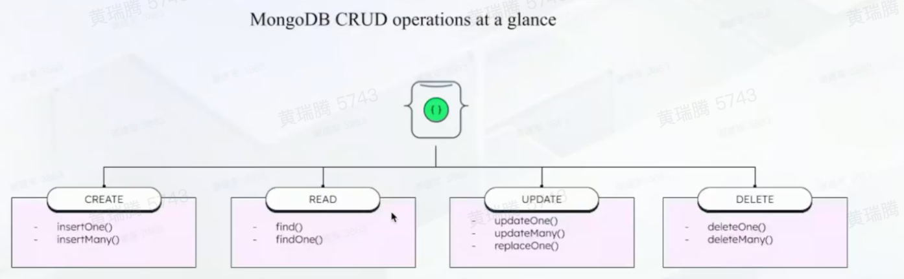

#### 备份与恢复

- 目标：灾备、误删修复、跨环境迁移与审计。
- 逻辑备份（mongodump/mongorestore）：
  - 导出 BSON；适合小体量或子集备份与迁移。
  - `mongodump --oplog` 捕获备份窗口内的变更，提升一致性；恢复用 `mongorestore --oplogReplay`。
  - 导出/导入：`mongoexport/mongoimport` 适合 CSV/JSON 交换。
- 物理快照（文件系统快照）：
  - WiredTiger 推荐使用 LVM/ZFS/EBS 等快照；优先在副本集 secondary 上执行以减小影响。
  - 可用 `db.fsyncLock()` 暂停写入以获得一致性快照，完成后 `db.fsyncUnlock()`。
- 连续备份与时间点恢复（PITR）：
  - 自管：快照+oplog 回放到指定时间点。
  - 托管云通常提供自动快照与 PITR（具体保留窗口因厂商而异）。
- 集群注意事项：
  - 副本集：在 secondary 上备份；确保备份集包含 `system.users/roles`。
  - 分片集群：同时备份各 shard 与 config server；建议备份期间暂停或监控 balancer 迁移；逻辑备份可连接 `mongos` 并携带 `--oplog`。
- 恢复策略：
  - 逻辑恢复：`mongorestore --nsInclude <db.collection>` 支持选择性恢复；必要时重建索引。
  - 快照恢复：将卷回滚至备份点并重启服务；PITR 先恢复快照再回放 oplog 至目标时间。
- 参考：
  - Backups 总览：https://www.mongodb.com/docs/manual/core/backups/
  - mongodump：https://www.mongodb.com/docs/database-tools/mongodump/
  - mongorestore：https://www.mongodb.com/docs/database-tools/mongorestore/
  - 文件系统快照：https://www.mongodb.com/docs/manual/tutorial/backup-with-filesystem-snapshots/

#### 地理空间索引与位置查询

- 索引类型：
  - `2d`：平面坐标索引，适用于小范围、笛卡尔坐标系的矩形/圆形查询。
  - `2dsphere`：球面几何索引，基于 GeoJSON 与 WGS84，支持跨城市/全球的球面距离与拓扑关系。
- 查询算子：
  - `$near` / `$nearSphere`：按距离升序返回邻近点，可设置 `maxDistance`/`minDistance`（米）。
  - `$geoWithin`：查询几何体内部（如多边形/圆）。
  - `$geoIntersects`：查询与给定几何体相交的点/线/面。
- 示例：
  - 建索引：`db.places.createIndex({ location: "2dsphere" })`
  - 邻近查询：
    - `db.places.find({ location: { $near: { $geometry: { type: "Point", coordinates: [lng, lat] }, $maxDistance: 1000 } } })`
- 适配场景：
  - LBS 检索（附近门店/骑手）、地理围栏、路线点归属、POI 命中、热区统计。
- 参考：
  - 官方文档：https://www.mongodb.com/docs/manual/geospatial-queries/ 、https://www.mongodb.com/docs/manual/core/2dsphere/

#### Atlas Vector Search (向量检索)

基于 MongoDB Atlas 的向量检索能力，允许在文档中存储 embeddings 并基于 HNSW 算法执行高效的近似最近邻 (ANN) 搜索，是构建 RAG (检索增强生成) 和语义搜索的核心组件。

- **索引定义 (JSON)**
  - 必须包含 `vector` 类型字段；推荐定义 `filter` 字段以支持高效的预过滤 (Pre-filtering)。
  - ```json
    {
      "fields": [
        {
          "type": "vector",
          "path": "plot_embedding",
          "numDimensions": 1536,
          "similarity": "cosine" // euclidean | cosine | dotProduct
        },
        { "type": "filter", "path": "year" } // 预过滤字段
      ]
    }
    ```
- **查询阶段 (`$vectorSearch`)**
  - 必须作为 Aggregation Pipeline 的**首个阶段**。
  - ```javascript
    {
      "$vectorSearch": {
        "index": "vector_index",
        "path": "plot_embedding",
        "queryVector": [...],      // 待查询向量
        "numCandidates": 100,      // ANN 候选集大小 (>= limit)，越大越准越慢
        "limit": 5,                // 最终返回数
        "filter": { "year": { "$gte": 2023 } } // 利用 filter 索引字段过滤
      }
    }
    ```
- **关键参数**
  - `numDimensions`: 需与模型输出对齐 (e.g., OpenAI `text-embedding-3` 为 1536)。
  - `numCandidates`: 平衡精度与延迟的关键参数 (类似于 HNSW 的 `efSearch`)。
- **获取分数**
  - 通过 `$project` 阶段的 `"$meta": "vectorSearchScore"` 获取相似度得分。

#### Aggregation Framework

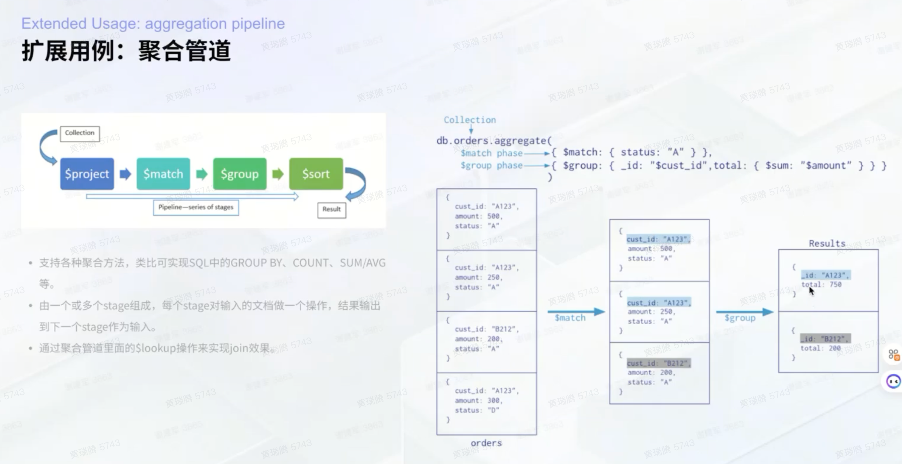

MongoDB 的聚合框架是处理和转换文档集合的强大工具。它通过一个由多个阶段（stage）组成的管道（pipeline）来处理数据。每个阶段对输入的文档进行操作，并将结果传递给下一个阶段。

这对于数据分析和特征工程非常有用。

**常用阶段 (Stages):**

*   `$match`: 过滤文档，类似于 `find()` 查询。通常放在管道的开头以减少后续处理的数据量。
*   `$project`: 重塑文档，可以指定包含/排除字段，或使用表达式创建新字段。
*   `$group`: 按指定的键对文档进行分组，并对每个组应用累加器表达式（如 `$sum`, `$avg`, `$addToSet`）。
*   `$sort`: 对文档进行排序。
*   `$limit`: 限制输出的文档数量。
*   `$unwind`: 将数组字段中的每个元素拆分为一个独立的文档。

**示例：使用聚合管道进行分布式计算**

以下示例展示了如何使用聚合管道计算每个用户的唯一物品交互次数，并支持分布式计算。

```json
// 假设集合中的文档结构为 { user_id: "...", item_id: "...", timestamp: ... }
[
  // 阶段 1: (可选) 按时间范围过滤
  {
    "$match": { "timestamp": { "$gte": 1672531200, "$lt": 1675209600 } }
  },
  // 阶段 2: 按 user_id 分区，用于分布式计算
  // 通过对 user_id 的哈希值取模，可以将数据分散到不同的 worker
  {
    "$match": {
      "$expr": {
        "$eq": [
          { "$mod": [{ "$toLong": { "$toHashedIndexKey": { "field": "$user_id" } } }, 4] }, // world_size = 4
          0 // rank = 0
        ]
      }
    }
  },
  // 阶段 3: 按 user_id 分组，并收集不重复的 item_id
  {
    "$group": {
      "_id": "$user_id",
      "unique_items": { "$addToSet": "$item_id" }
    }
  },
  // 阶段 4: 计算唯一物品的数量
  {
    "$addFields": {
      "unique_item_count": { "$size": "$unique_items" }
    }
  },
  // 阶段 5: 整理输出
  {
    "$project": {
      "user_id": "$_id",
      "unique_item_count": 1,
      "_id": 0
    }
  }
]
```

**关键技巧:**

*   **分布式计算/分区**: 使用 `$toHashedIndexKey` 将字符串字段转换为64位哈希值，然后通过 `$mod` 运算符实现数据分区，以便在多个 worker 上并行处理。`$bitAnd` 与 `0x7FFFFFFFFFFFFFFF` 一起使用可以确保结果为正数。
*   **处理大数据集**: 在执行聚合时，设置 `allowDiskUse=True` 允许 MongoDB 在内存不足时使用磁盘空间，这对于大型数据集至关重要。
*   **游标设置**: 对于可能长时间运行的查询，设置 `no_cursor_timeout=True` 可以防止游标因超时而关闭。

#### 并行分片：rank/world_size 模式

- 目标：在 `world_size` 个 worker 上均匀切分集合，保证每个文档只被一个 worker 处理。
- 分片规则：对稳定键 \(k\) 的 64 位哈希取模，将文档分配到第 \(r\) 个 worker：
  - $$ r = \mathrm{mod}(\mathrm{hash}(k),\ \text{world\_size}) $$
  - 拉取满足：$$ \mathrm{mod}(\mathrm{hash}(k),\ \text{world\_size}) = \text{rank} $$
- Mongo 实现：
  - 若已预存数值型哈希键 `hash_k`：
    - `{"$expr": {"$eq": [{"$mod": ["$hash_k", world_size]}, rank]}}`
  - 若未预存：用 `$toHashedIndexKey` + `$toLong` 现场计算哈希并取模：
    - `{"$expr": {"$eq": [{"$mod": [{"$toLong": {"$toHashedIndexKey": {"field": "$k"}}}, world_size]}, rank]}}`
  - 时间过滤：
    - `{"_event_date": {"exists": true, "$gte": start, "$lt": end}}`（仅给定一端则保留相应约束）；`exists` 可用于清洗脏数据。
- 输出文件防冲突：分布式写本地文件时，文件名附加 `_{rank}` 后缀（如 `items_3.tsv`）。
- 游标与资源：设置 `allowDiskUse=True`、`batch_size(1024)`、`no_cursor_timeout=True`、`maxTimeMS` 以适配长任务。
- 正确性要点：
  - 选用稳定哈希函数，保证跨 worker 分片一致；所有 worker 使用相同的 `world_size`，并校验 `rank < world_size`。
  - 分片键应与业务唯一键一致（如 `item_id`/`user_id`），减少倾斜与重复处理。

参考：[`$expr`](https://www.mongodb.com/docs/manual/reference/operator/aggregation/expr/)、[`$mod`](https://www.mongodb.com/docs/manual/reference/operator/aggregation/mod/)、[`$toHashedIndexKey`](https://www.mongodb.com/docs/manual/reference/operator/aggregation/toHashedIndexKey/)

#### Sharding (分片架构)

Sharding 是 MongoDB 将数据分布到多台机器上的方法，用于支持大数据集和高吞吐量操作。一个分片集群（sharded cluster）主要由以下组件构成：

*   **Shards (分片)**: 每个分片存储了总数据的一个子集。分片本身可以是一个副本集（replica set），以保证高可用。
    *   **Shards规格**: 指的是每个分片服务器的硬件配置，例如 CPU核心数、内存大小。这是数据存储和处理的主要资源。
    *   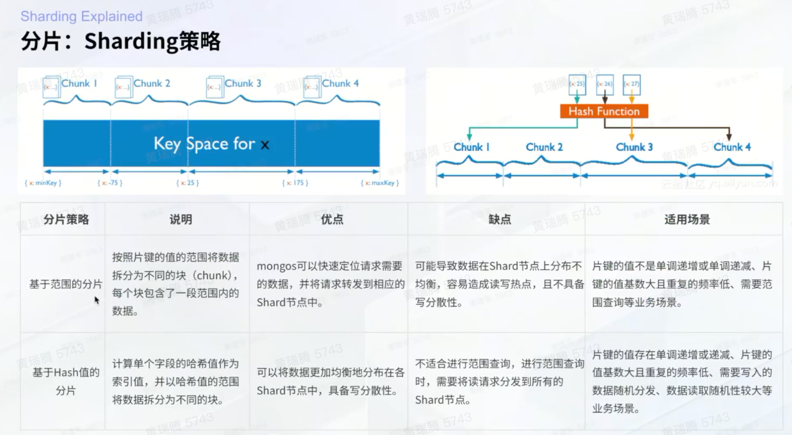
        *   基于范围或Hash的分片策略
    *   如何选择 sharding key
        *   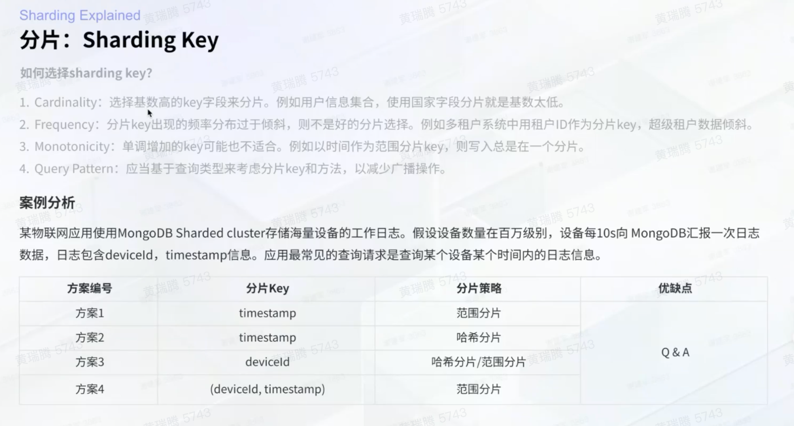

##### Sharding Key 选型案例：IoT 设备日志

**场景背景**
某物联网应用需存储海量设备工作日志：
*   **规模**：百万级设备，每10秒上报一次。
*   **数据**：包含 `deviceId`, `timestamp`。
*   **查询**：查询**某个设备**在**某个时间段**内的日志信息。

**方案分析与对比**

| 方案 | 分片 Key | 分片策略 | 分析与评价 |
| :--- | :--- | :--- | :--- |
| **方案1** | `timestamp` | 范围分片 (Range) | **❌ 写入热点 (Monotonicity)**<br>所有新写入的数据时间戳都是递增的，会导致所有写入请求集中在最后一个 Chunk（即最后一个分片），无法利用集群的并发写入能力。 |
| **方案2** | `timestamp` | 哈希分片 (Hashed) | **❌ 查询低效 (Scatter-Gather)**<br>虽然解决了写入热点，但查询条件包含时间范围。哈希分片将连续时间的数据打散到随机分片，导致查询必须广播到所有分片（Scatter-Gather），效率极低。 |
| **方案3** | `deviceId` | 哈希分片 (Hashed) | **⚠️ 可行但有风险 (Jumbo Chunk)**<br>✅ **写入**：利用设备ID的高基数实现均匀分布。<br>✅ **查询**：查询指定设备，路由精确指向单一分片 (Targeted Query)。<br>⚠️ **风险**：如果单设备数据量巨大（虽然 IoT 场景较少见），可能导致单个 Chunk 过大且无法拆分（因为所有该设备数据都在一个 Key 值下）。 |
| **方案4** | `(deviceId, timestamp)` | 范围分片 (Range) | **✅ 最佳实践 (Best Practice)**<br>✅ **写入**：`deviceId` 作为前缀保证了写入分布到不同分片（只要设备ID离散）。<br>✅ **查询**：查询指定设备+时间范围，路由能精确定位到特定分片及特定 Chunk，支持高效的局部范围扫描。<br>✅ **均衡**：结合了高基数与范围拆分能力，避免了单 Key 数据过大的问题。 |

**选型原则总结**
1.  **Cardinality (基数)**: 必须足够大，以支持数据切分（如 `deviceId`）。
2.  **Frequency (频率)**: 避免某个 Key 出现频率过高导致“数据倾斜”。
3.  **Monotonicity (单调性)**: 避免使用单调递增 Key 进行范围分片（如纯 `timestamp`），防止写入热点。
4.  **Query Pattern (查询模式)**: 分片键应包含核心查询字段，以实现定向查询 (Targeted Query) 而非广播查询。
*   **Mongos (查询路由)**: 这是一个路由服务，负责将客户端的查询和写入操作转发到正确的分片上。客户端直接与 `mongos` 交互，而不是直接连接到分片。`mongos` 本身不存储数据，是无状态的。
    *   **Mongos节点规格**: 指的是 `mongos` 服务器的硬件配置。由于其无状态的路由特性，其资源需求（特别是磁盘）通常低于分片服务器。
    *   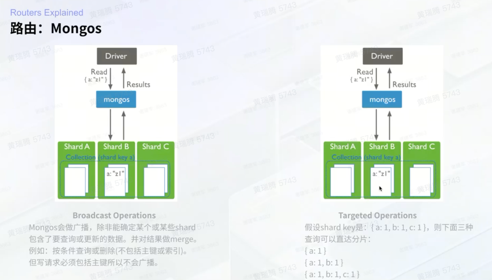
        *   最左匹配原则，决定分片
*   **Config Servers (配置服务器)**: 存储了集群的元数据（metadata）和配置信息，例如数据在各个分片上的分布情况。配置服务器也必须是副本集。

#### ReplicaSet（副本集）

- 角色：primary（写入）、secondary（复制与只读）、hidden/priority0（不参与选举/不成为主但可用于备份与离线任务）、arbiter（仅投票不存数据）。
- 选举与一致性：多数派选举；可通过 `priority`、`votes` 控制；`rs.stepDown()` 主动降主；`rs.freeze()` 暂停成员参选。
- 同步机制：oplog 增量复制，initial sync 首次全量；可启用 chained replication（从非主拉取）。
- 写入保障：`writeConcern`（如 `w:majority`、`j:true`）与 `readConcern: majority` 共同降低回滚风险；`majority commit` 确认多数派持久化。
- 读取路由：`readPreference`（primary/primaryPreferred/secondary/nearest），可配 tag sets 做机房/区域优先读取。
- 维护：滚动升级与索引构建优先在 secondary；备份在 secondary 上进行；`rs.reconfig()` 修改成员（注意多数派在线）。

##### 写关注

* 集群默认写关注设置为 `w: "majority"` 与 `j: true`，确保多数派持久化并落盘，降低主从切换回滚风险。

- 命令：
  - `db.adminCommand({ setDefaultRWConcern: 1, defaultWriteConcern: { w: "majority", j: true } })`
- 说明：驱动默认可能为 `w:1`；在副本集/生产环境，建议统一设置默认写关注为多数派+journal。
- 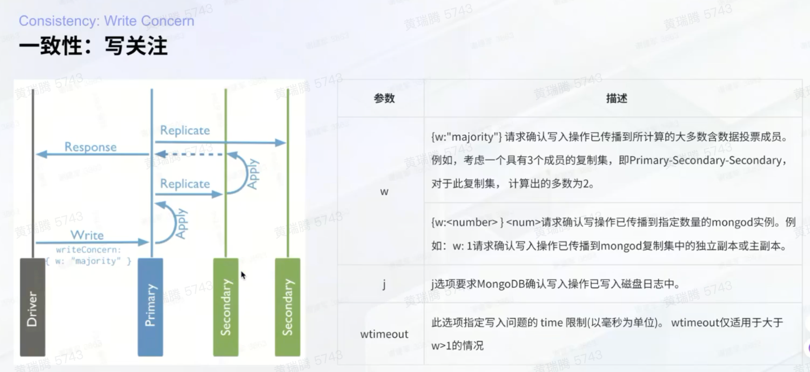
- 参考：
  - 副本集：https://www.mongodb.com/docs/manual/replication/
  - 读写一致性：https://www.mongodb.com/docs/manual/reference/write-concern/ 、https://www.mongodb.com/docs/manual/reference/read-preference/

##### Read Concern（读关注）

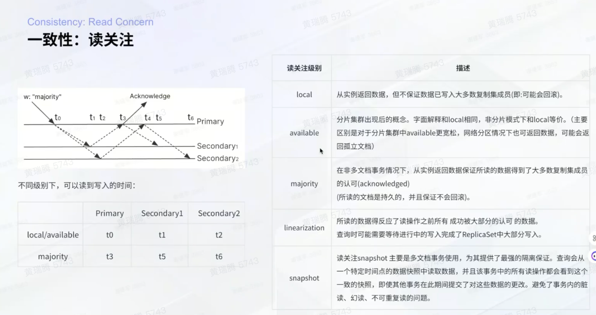

- 级别：
  - `local`：返回当前节点数据，不保证多数派提交，可能回滚。
  - `available`：分片集群的宽松读取，非分片等价于 `local`；部分分片不可用时仍返回其余分片数据，可能出现不一致文档。
  - `majority`：仅返回多数派提交的数据，避免读到可能回滚的数据；与 `w:majority` 写配合。
  - `linearizable`：单文档强一致读取，确保读到 primary 上已被多数派确认的最新值；只适合低延迟的单文档读，成本高。
  - `snapshot`：事务中的一致性视图，跨文档/集合读到同一时间点的快照。
- 默认建议：设置默认读关注为 `majority`（事务内使用 `snapshot`）；驱动默认可能为 `local`。
  - `db.adminCommand({ setDefaultRWConcern: 1, defaultReadConcern: { level: "majority" } })`
- 使用建议：
  - 写入用 `w:majority,j:true`，读取用 `majority`，降低主从切换回滚风险。
  - `linearizable` 仅用于“读后必须看到最近一次已确认写”的单文档场景。
  - 事务使用 `snapshot`，避免跨集合/分片读到不一致视图。
- 参考：https://www.mongodb.com/docs/manual/reference/read-concern/

##### Read Preference（读偏好）

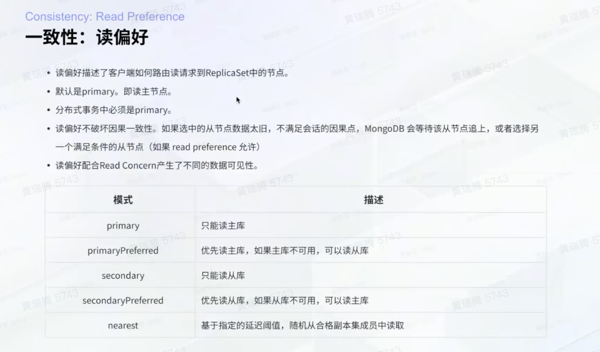

- 作用：客户端从副本集哪个成员读取；与 Read Concern 共同决定可见性与一致性。
- 模式：
  - `primary`：仅读主库；分布式事务必须使用。
  - `primaryPreferred`：优先主库，主库不可用时读从库。
  - `secondary`：仅读从库。
  - `secondaryPreferred`：优先从库，从库不可用时读主库。
  - `nearest`：按延迟最近的合格成员读取。
- 高级：`tag sets`（区域/机房筛选）与 `maxStalenessSeconds`（控制从库数据陈旧度）。
- 建议：
  - 写多读少且强一致：`primary` + `readConcern: majority`。
  - 离线/分析读：`secondaryPreferred` + `readConcern: majority`，并设置 `maxStalenessSeconds`。
  - 跨机房：结合 tag 选择近端从库，减少跨区域延迟。
- 参考：https://www.mongodb.com/docs/manual/core/read-preference/

##### Sharding 实践要点

- shard key 选择：高基数、均匀分布、查询命中率高；避免单调递增热点（可用 `hashed`）；复合键匹配主要查询维度。
- chunk 与 balancer：自动 split/migrate 维持均衡；峰值时段可暂停；`zone/tag aware` 可实现区域分片与法规隔离。
- 路由效率：基于 shard key 的精确/范围查询可做 targeted query；非 shard key 查询可能触发 scatter-gather（跨分片广播）。
- 事务与一致性：跨分片事务需谨慎评估开销；写入用 `w:majority`；读用 `readConcern` 合理设置以避免读到未多数提交的数据。
- 备份与恢复：同时备份各 shard 与 config server；备份期间监控/暂停 balancer；恢复后校验 chunk 元数据一致性。
- 参考：
  - 分片架构：https://www.mongodb.com/docs/manual/sharding/
  - chunk/balancer：https://www.mongodb.com/docs/manual/sharding-chunk-migration/

#### 索引

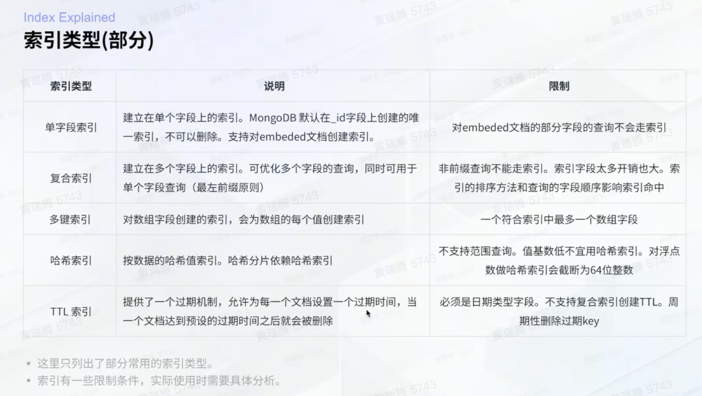

##### 索引优化

* 核心是前缀查询

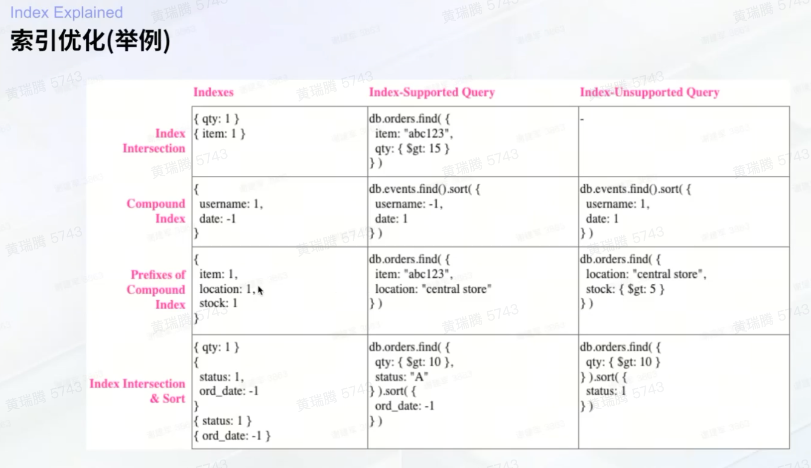

#### Time Series Collections

Time Series 集合是 MongoDB 专门为处理时间序列数据（如日志、物联网传感器数据）设计的，它通过将数据组织到内部的 bucket 中来优化存储和查询性能。

##### 核心查询优化

- **索引与 Bucket 剪枝**
  - **metaField 索引**: 查询应优先利用在 `metaField` 上创建的索引（如 `_meta_data._user_id`）。优化器可在“解包” bucket 前就利用该索引过滤掉大量不相关的 buckets，这是提升性能的关键。
  - **时间窗口过滤**: 时间范围的 `$match` 必须尽量在 bucket 级别表达。这意味着查询条件需要让优化器能够利用 `control.min.<timeField>` 和 `control.max.<timeField>` 这两个 bucket 级别的元数据来快速排除不相关的 buckets（即“剪枝”）。
    - **工作原理**: 将 `timeField` 的范围查询作为聚合管道的第一个 `$match` 阶段，优化器会自动利用 `system.buckets.*` 集合上关于 `control.min/max` 的内置索引，在解包数据前就完成大部分筛选。
    - **反面教材**: 如果时间过滤被放在 `$project` 之后，或在 `eventFilter` 中，或用复杂的 `$expr` 表达式，优化器将无法进行 bucket 剪枝，导致性能急剧下降（退化为全表扫描或大范围索引扫描）。
    - **验证方法**: 通过 `explain()` 查看执行计划，确认是否有效利用了 `TS_BUCKET_SCAN` 等阶段，并观察 `nReturned`（返回的 bucket 数量）是否远小于总数。

- **查询管线与顺序**
  - **推荐顺序**:
    1.  `$match`: 仅保留可高效命中索引的条件，如 `metaField` 字段、时间窗口。
    2.  `$_internalUnpackBucket`: MongoDB 内部阶段，用于解包 bucket。
    3.  `$project`: 统一字段命名，为后续阶段做准备。
    4.  `$match`: 对解包后的数据进行二次过滤，如 `$exists: true` 或 `$ne: null` 等低选择性条件。
    5.  `$sort` / `$group`: 在数据量已显著减少后执行这些聚合操作。
  - **经验法则**: 避免将 `$exists` 或 `$ne: null` 等无法有效利用索引的条件放在管道的最前端，这会干扰查询优化器选择最佳索引。应将这类存在性校验后置。

##### 诊断与分析

- **慢查询日志 (`planSummary`)**
  - 检查 `planSummary` 中是否包含对 `metaField` 或 `control.min/max` 的过滤。如果只看到 `IXSCAN`（没有命中用户定义的 `metaField` 索引）或 `COLLSCAN`，说明查询性能不佳。

- **Explain Plan**
  - 使用 `db.collection.explain().aggregate(...)` 来分析聚合管道的执行计划，确认是否命中了预期索引。

- **Hint 使用**
  - 在某些情况下，可以通过 `hint()` 来强制查询优化器使用特定的索引，以保证查询路径的稳定性。例如：`aggregate(..., hint='my_timeseries_index')`。

##### 分组与分桶（metaField 与时间桶）

- 时序分组：以 `metaField` 为分组键，将相同标签（tags）下不同时间戳的点聚为同一时间序列并共存于相邻 bucket；若 `metaField` 组合过多，会形成大量稀疏 bucket，导致读写效率下降。
- 时间戳分桶：同一时间序列的文档按区间分桶，一个 bucket 仅覆盖固定窗口。通过 `granularity`、`bucketMaxSpanSeconds`、`bucketRoundingSeconds` 控制桶跨度与对齐。
- 选择粒度：
  - 高频写入选细粒度；低频写入（如某个 `metaField` 每 5 分钟才有一个点）选粗粒度至分钟级，以减少桶数量与空桶。
  - 查询需与粒度匹配：大查询查小桶会扫描过多桶；小查询查大桶需遍历大桶过滤。
  - 粒度可从细到粗（秒→天）调整，不能反向；该操作修改集合视图定义，不回溯重写既有 bucket。
- 行为细节：
  - 即使只有一个点也会创建其范围对应的 bucket；旧时间点的 bucket 范围更大（如秒粒度集合的旧时间点 bucket 可扩至 4 小时）。
- 经验映射（granularity → bucket limit）：
  - seconds → 1 hour
  - minutes → 24 hours
  - hours → 30 days

#### 事务支持：建议不用

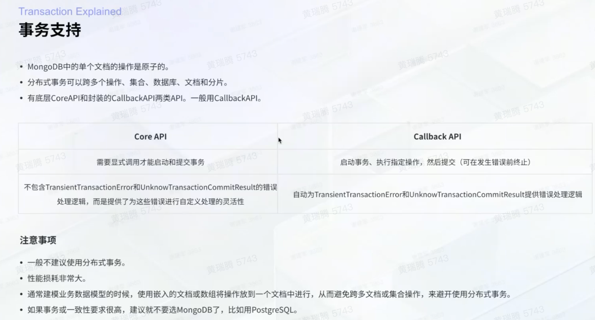

### 特征工程

[滴滴特征工程](https://mp.weixin.qq.com/s/vUP4LAA7gAYDo91Wd5rSQQ)


### OLAP

DSL like ES -> (forward/aggregation/post-aggregation) -> view -> physical table

* 难点是异构数据源查询，使用 query engine 封装收口了所有 olap 引擎的查询，同时用服务聚合多数据源数据，格式化&聚合 后返回给用户，带来的挑战是研发同学需要熟悉各个数据源特性时延精确去重，异构数据源聚合等
* 指标杂乱，一张物理表几万个指标，配置分散在上十个元文件中
* [浅谈数据治理、数据管理、数据资源与数据资产管理内涵及差异点](https://mp.weixin.qq.com/s/B9t1ZdNEl8u0mhxDLyS8-A)

* [滴滴指标体系](https://mp.weixin.qq.com/s/-pLpLD_HMiasyyRxo5oTRQ)

### 论文

#### Spitfire: A Three-Tier Buffer Manager for Volatile and Non-Volatile Memory, SIGMOD 2021

介绍视频：https://www.bilibili.com/video/BV1164y1d7HD

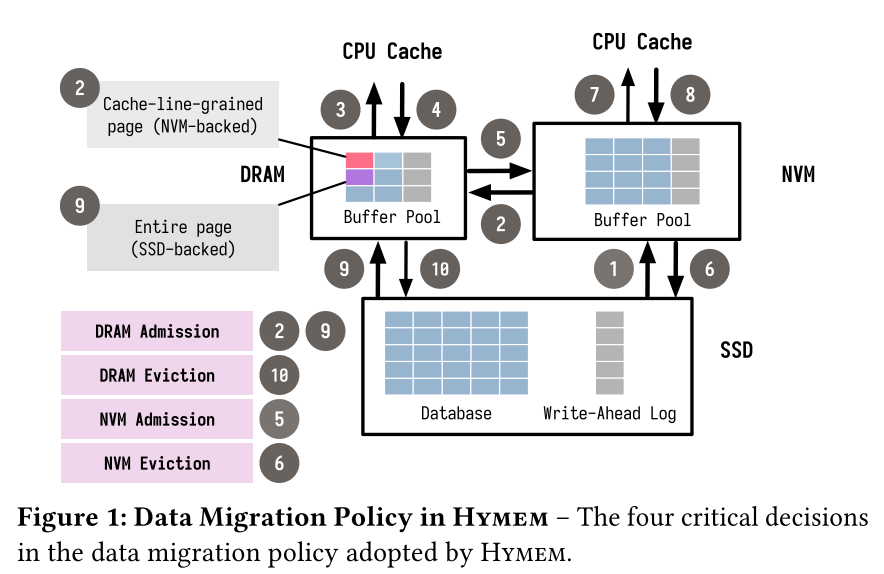


nvm读写性能介于dram和ssd之间，更接近dram

2.Hymem

* 对比Spitfire：Hymem是single-threaded，且是NVM-aware的，对emulation有依赖
* clock algo逐出nvm、ssd
* the cache line-grained loading and mini-page optimizations must be tailored for a real NVM device. We also illustrate that the choice of the data migration policy is significantly more important than these auxiliary optimizations.
* 行为
  * DRAM admission: 如果没在DRAM中找到，eagerly SSD->DRAM，跳过 SSD->NVM
  * DRAM eviction: 用是否在 recent queue 中决定是否进 nvm
  * cache-line-grained page (256 cache lines): resident + dirty bitmap; 指向nvm page的指针
  * mini page (<16 cache lines): dirty bitmap + slots; count; full page

3.NVM-Aware Data Migration

* 目标：利用NVM提供的数据新通路，minimize the performance impact of NVM and to extend the lifetime of the NVM and SSD devices
  * lazy data migration from NVM to DRAM ensures that only hot data is promoted to DRAM.
  * 延续CLOCK策略，引入概率插入来决定migrate到哪一层存储
* 实现策略
  * Bypass DRAM during reads
    * lazily migrate data from NVM to DRAM
      while serving read operations.
    * ensures that warm pages on NVM do not evict hot pages in DRAM
  * bypass DRAM during writes
    * DBMSs use the group commit optimization to reduce this I/O overhead [9]. The DBMS first batches the log records for a group of transactions in the DRAM buffer (❹) and then flushes them together with a single write to SSD
    * Dw，减少hot pages在DRAM上的eviction
  * Bypass NVM during reads
    * a lazy policy for migrating data from NVM to DRAM (Dr = 0.01), and a comparatively eager policy while moving data from SSD to NVM (Nr = 0.2). While this scheme increases the number of writes to NVM compared to the lazy policy, it enables Spitfire to deliver higher performance than Hymem (§6.5)
    * This design reduces data duplication in the NVM buffer.
  * Bypass NVM during writes
    * 不同于hymem用recent queue，spitfire用随机插入来决定进入nvm的页

4.Adaptive Data Migration

* 相关论文：On multi-level exclusive caching: offline optimality and why promotions are better than demotions, FAST 2008
* 用模拟退火来搜索参数

5.System Architecture

5.1 Multi-Tier Buffer Management

* When a page is requested, Spitfire performs a table lookup that returns a shared page descriptor containing the locations (if any) of the logical page in the DRAM and NVM buffers.

* 数据结构：
  * {page_index -> shared_page_descriptor}
    * shared_page_descriptor: {latch_dram, latch_nvm, latch_ssd, dram_pd, nvm_pd}
      * dram_pd: {num_of_users, is_dirty, physical_pointer}

5.2 Concurrency Control and Recovery

* To support concurrent operations, we leverage the following data structures and protocols:
  * a concurrent hash table for managing the mapping from logical page identifiers to shared page descriptors [17]
  * a concurrent bitmap for the cache replacement policy [40]
  * multi-versioned timestamp-ordering (MVTO) concurrency control protocol [39]
  * concurrent B+Tree for indexing with optimistic lock-coupling [24]
  * lightweight latches for thread-safe page migrations
    * [数据库中 lock 和 latch 的区别](https://www.zhihu.com/question/309342903/answer/1699205097)

6.Experimental Evaluation

6.1 workload

* YCSB: Zipfian Distribution
* TPC-C

6.2 Benefits of NVM and App-Direct Mode

* memory-mode requires an upfront NVM capacity at least equal to the size of DRAM. In contrast, with app-direct mode, it could give a higher buffer capacity due to its cost advantage, though the NVM is bit slower. This is especially useful with a large working set.
* with app-direct mode, Spitfire exploits the persistence property of NVM to reduce the overhead of recovery protocol by eliminating the need to flush modified pages in NVM buffer.

6.3 Data Migration Policies

* With eager policies, more pages are updated in DRAM, and they must be flushed down to lower tiers of the storage system (even when the update is localized to a small chunk of the page). In contrast, with a lazy scheme, Spitfire updates page in NVM, thereby reducing write amplification.
* impact of storage hierarchy
  * DRAM/NVM的比例越大，migration probability对吞吐的影响越大。假如DRAM非常小，with the eager policy, the performance improvement brought by adding the comparatively smaller DRAM buffer (1.25 GB) is shadowed by the cost of data migration between DRAM and NVM

6.5 Revisiting Hymem’s Optimizations

* We attribute the 1.1× lower throughput at 64 B granularity (relative to 256B granularity) to the I/O amplification stemming from the mismatch between the device-level block size and loading granularity.

6.6 Storage System Design

* 指标：performance/price numbers

* insights	
  * To achieve the highest absolute performance, the hierarchy usually consists of DRAM (since DRAM has the lowest latency).
  * If the workload is read-intensive, DRAM-NVM-SSD hierarchy is the best choice from a performance/price standpoint, since it is able to ensure the hottest data resides in DRAM.
  * If the workload is write-intensive, NVM-SSD hierarchy is the best choice from a performance/price standpoint, since NVM is able to reduce the recovery protocol overhead.
