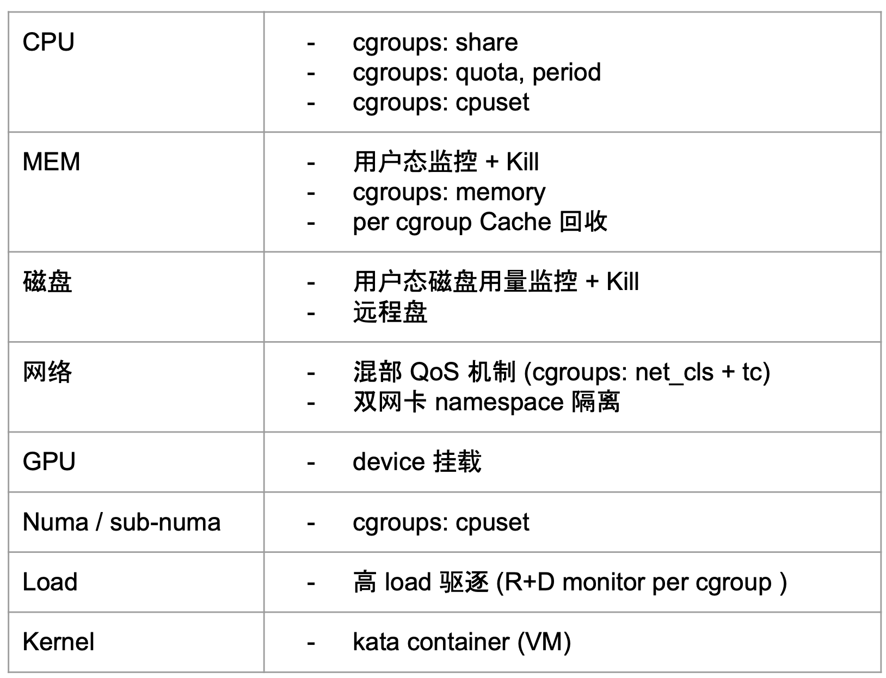

### Distributed Systems

[toc]

**[l01-Introduction and MapReduce](https://github.com/huangrt01/CS-Notes/blob/master/Notes/Distributed-Systems/l01-Introduction%20and%20MapReduce)**

#### 分布式基础

[讲最终一致性的知乎文章](https://zhuanlan.zhihu.com/p/25933039)

最终一致性：系统中的所有分散在不同节点的数据，经过一定时间后，最终能够达到符合业务定义的一致的状态

* 一致性指数据一致性，不是事务一致性（ACID 是事务一致性）

* 存在条件：多个节点/系统

* 不一致可能是暂时的，最终要一致

[CAP theorem](https://en.wikipedia.org/wiki/CAP_theorem)

[PACELC theorem](https://en.wikipedia.org/wiki/PACELC_theorem)

最终一致性解决方案

* 两阶段提交
* 异步确保（无事务消息）
* 异步确保（事务消息）
* [补偿交易 (Compensating Transaction)](https://docs.microsoft.com/en-us/azure/architecture/patterns/compensating-transaction)
* 消息重试
* 幂等（接口支持重入）：数据库唯一键挡重入

#### Apache Hadoop YARN: Yet Another Resource Negotiator

[YARN官网](https://hadoop.apache.org/docs/stable/hadoop-yarn/hadoop-yarn-site/YARN.html)

[YARN 在字节跳动的优化与实践](https://mp.weixin.qq.com/s/9A0z0S9IthG6j8pZe6gCnw)

1.Abstract

解决两大问题：1）依赖特定编程模型 2）中心式管理难以scale

设计核心是 separating resource management functions from the programming model，更彻底地将 platform和framework抽象开

2.History

R1,R2: hadoop community

R3: HoD

R4,R5: HoD -> shared clusters

R6,R7: shared clusters

R8,R9,R10: Apache MapReduce的局限性 -> YARN

3.Architecture

RM是中心，也是连接AM和NM的桥梁

RM还能找AM要回资源

NM: container launch context (CLC)的概念，启动、监控、local service、auxiliary service

AM: late binding, the process spawned is not bound to the request, but to the lease.

fault tolerance: RM对AM有责任、AM责任最重

* YARN only secures its deployment
* RM单点故障，Work is in progress to add sufficient protocol sup-port for AMs to survive RM restart.
* 抽象分离的代价：更多fault tolerance工作交给了frameworks来设计

4.YARN in the real-world

compute resource，分布式计算资源池，跑spark、flink任务等

集群一般会配两个RM、成千上万个NM；多个RM之间用zk选主，同一时间只有一个在工作

e.g. 500000 jobs daily

一些concern：

* HDFS NameNode becomes the bottleneck
* YARN have been observed on a few large clusters with massive amounts of small applications, but recent improvements in heartbeat handling have mitigated some of these issues.

One of the most important architectural differences that partially explains these improvements is the removal of the static split between map and reduce slots.

6.Related Work

和MesOs等类似架构对比，YARN特点是multiple application frameworks、per-job intra-framework scheduler、资源管控、lazy binding等

和基于虚机的任务对比，YARN更适合运行时间短、切换更频繁的任务

理想调度算法

ideal scheduler: Multiple Knapsack Problem(MKP) (NP-C Problem)

经典生产调度算法1 - 吞吐型

* [YARN原生调度策略](https://hadoop.apache.org/docs/current/hadoop-yarn/hadoop-yarn-site/FairScheduler.html)

* with Quota/Priorities/DRF

  

经典生产调度算法1 - 全局视角
* 每次分配按规则对节点进行sort
* 问题1:吞吐效率问题？(scalable)
* 缓存节点排序结果(多次调度一次排序/ 抽样排序)
* 并发多个 {调度队列, 节点分区}（做hash、吞吐提升明显）
* 问题2:同一request内多个节点间的约束很难表达
  * 比如gang性、打散、集中、碎片最少等

[The evolution of cluster scheduler architectures](https://www.cl.cam.ac.uk/research/srg/netos/camsas/blog/2016-03-09-scheduler-architectures.html)

调度策略：队列

* 单集群内的物理节点被划分为多个 label
* Label 的资源总量在逻辑上被划分为多个队列
* 队列配置min/max值（允许一定的超用、max对用户隐藏）

调度策略：DRF

* 队列和应用都同时声明不止一个维度的资源 (eg. CPU, MEM)
* 在进行排序时, 如果只考虑一个维度, 可能导致其它维度碎片严重
* DRF(Dominant Resource Fairness) 将各个维度上已经使用的资源占其维度上的资源总量的百分比中最大的值作为其主资源的代表, 各个队列、应用直接对主资源代表进行比较, 进而得到排序

=> req定制Node的弱约束、req内强/弱约束

Quota管理

* 固定分组 -> 固定分组+池化quota -> 完全quota

* 可抢占任务 & 不可抢占任务
  * 可抢占任务不占用 Quota，填满空闲资源
  * 不可抢占任务占用 Quota，保证 Quota 内的任务所需资源始终可以得到满足

* Quota化带来资源碎片问题

Fragmentation

* 碎片率取决于 max_task_size/node_size，这也是为什么大家追求集群node数量的原因（YARN最多单集群5w nodes）

* 资源碎片可能导致紧急任务的资源不够，这是池化的一个副作用
* 策略：
  * Binpack 算法尽量堆叠任务，优先将一台机器资源占满 => 高优任务堆叠 + 低优任务逆向堆叠
  * 小分组问题（资源本身就少）：整机资源预留，以保证整机资源高可用；预留时可调度低优任务。

资源隔离：物理隔离

方案一：将物理机分别划入不同的集群 

* 场景：
  * 离线&流式机器隔离 
  * 单集群过大拆分
* 优势：完整独立的故障域 
* 缺点：运维成本，需要搭建独立的RM及配置的监控报警

方案二：将物理机划入同个集群内的不同Label中 

* 场景：
  * 核心作业队列隔离
  * 跨POD物理机隔离
* 优势：共用相同RM
* 缺点：共享RM全局配置, 如单心跳分配container数量

资源隔离：共享物理机隔离

* AMD机器跨numa能力弱，因此划分subnuma

#### Mesos: A Platform for Fine-Grained Resource Sharing in the Data Center

1.Introduction

across framework的shared cluster

two-level scheduling mechanism called resource offers. 

* 不同框架接入Mesos很方便，只需要迁移自己的scheduler

和YARN做对比：

* YARN的AM的“影响调度”的能力比Mesos弱，并不具备完全的"two-level scheduling"能力
* Mesos is an offer-based resource manager, whereas YARN has a request-based approach 感觉YARN在框架间对资源的分配会更灵活一些

3.Architecture

rejection mechanism

fault tolerance

* designed the master to be soft state, so that a new master can completely reconstruct its internal state from information held by the slaves and the framework schedulers.

4.Mesos Behavior

5.Implementation

hadoop port实现的local filesystem访问问题：

Hadoop normally writes map output files to the local filesystem, then serves these to reduce tasks using an HTTP server included in the Task-Tracker. However, the TaskTracker within Mesos runs as an executor, which may be terminated if it is not running tasks. This would make map output files unavailable to reduce tasks. We solved this problem by providing a shared file server on each node in the cluster to serve local files

6.Evaluation

overhead < 4%

Mesos 迁移 Yarn 的思路

* 阶段一：Proxy Solution: Big AM 模式，将 Yarn 调度提到一个 AM Proxy 来实现，好处是能复用原先的大部分逻辑，缺点是和 Yarn 生态有冲突，RM 的调度被“剥夺”，不利于后续资源池化推进
* 阶段二：Yarn 池化方案：AM 不再感知所有机器节点信息并独占机器，而是将资源分配交给 RM
* 阶段三：A Big AM -> An AM per Job

#### Design patterns for container-based distributed systems

https://skyscribe.github.io/post/2019/07/21/from-borg-to-kubernetes/

https://kubernetes.io/

single-container patterns for container management, single-node patterns of closely cooperating containers, and multi-node patterns for distributed algorithms

容器是更通用、更贴近底层的分布式抽象手段，是代码开发到生产环境更便捷的通路

容器之于分布式就是对象之于oop，只有用容器化这一抽象把系统和应用分离开，才能基于此做很多更复杂的优化（混布提升利用率、错峰潮汐、更精细的物理资源划分）

3.Single-container management patterns

从upward和downward两方面思考

* upward
* downward
  * scale up
  * For example, Kubernetes uses a “grace-ful deletion” feature of Docker that warns a container, via the SIGTERM signal, that it is going to be termi-nated, an application-defined amount of time before it is sent the SIGKILL signal.

4.Single-node, multi-container application patterns

4.1 Sidecar pattern

可利用 [cgroups](https://www.kernel.org/doc/Documentation/cgroup-v1/cgroups.txt)

4.2 Ambassador pattern

4.3 Adapter pattern

5.Multi-node application patterns

5.1 Leader election pattern

5.2 Work queue pattern

5.3 Scatter/gather pattern

6.Related Work

* Service-oriented architectures (SOA)

#### Ray: 动态可编程分布式计算框架

1.Ray是一个动态可编程的分布式计算框架，支持分布式训练，主要体现在以下几方面：

丰富的本地训练场景（清晰指派local/remote的任务/角色，task无状态，actor有状态）

灵活训练规划pipeline（用户可以在Actor里自定义逻辑，包括循环、计时器等）

灵活数据源（流批处理融合，支持简单的数据处理chain）

One-off system：针对RL任务的特化，1）training, serving, simulation一体化，2）dynamic execution。推荐系统不一定需要，可能跟粗排联系更紧密 3）model serving的时候，更强调client and server colocate的情形，不适合我们的精排场景

2.目前工业界主要使用Ray的方式分两种，一是用Ray的上游生态lib，二是用Ray的底层能力深入自研框架

（1）Ray的上游生态：

- 强化学习库(RLLib)
- 超参调优库(Tune):  支持任意ML框架：PyTorch，XGBoost， MXNet， Keras，集成了很多优化器的库和算法， 通过TensorBoard做显示，可以和Ray Serve无缝结合
- Training with RaySGD: 优势在于能和其它Ray lib无缝结合，并且实现了分布式的dataset

（2）Ray的底层能力：大厂结合Ray自研框架的lecture在这里：[蚂蚁金服Ray Forward推广](https://tech.antfin.com/community/activities/698/review)

3.Ray对应于我们系统中的多个层次，它的底层能力对应于资源管理层REAM (包括Flink, Yarn等)，上游生态对应于我们的LagrangeX

4.最值得我们借鉴的地方有哪些？

底层：

- Ray实现了高效的系统间数据传输， "在底层hack了python的内存对象，和Redis内存共享，实现Numpy、Pandas等数据格式序列化/反序列化时候zero-copy，没有损耗"，是否可以引入这一思想减小我们model serving/training过程中序列化/反序列化的开销
- Ray的结构非常优雅，global scheduler调度全部任务，local scheduler调度同一Node内共享内存的worker，object store支持Node之间的通信。

易用性：

Ray是用户友好的分布式计算框架，具体体现在

1）轻量级的API，几乎不提高代码复杂性。只用在函数前加`@ray.remote`，就能通过remote调用，使task在其它ray集群执行。

2）支持ray dashboard，利于debugging and profiling

官方doc：https://docs.ray.io/en/latest/installation.html

开源史海钩沉系列 [1] Ray：分布式计算框架 - 高策的文章 - 知乎 https://zhuanlan.zhihu.com/p/104022670

**读论文**： 《Ray: A Distributed Framework for Emerging AI Applications》, OSDI 18

结合Bulk-synchronous parallel systems和Task-parallel systems这两类系统

无状态和有状态

- In contrast stateful computations are a good fit for implementing parameter servers, performing repeated computation on GPU-backed data, or running third-party simulators that do not expose their state.

Stateful edges

- embed actors in an otherwise stateless task graph
- enable us to maintain lineage.

The system layer consists of three major components: a global control store, a distributed scheduler, and a distributed object store. 

- GCS让系统的任何成分都是stateless的 ，支持fault tolerance，makes it easy to scale the distributed object store and scheduler independently
- 调度的分层，有助于scaling，先由local scheduler调度，只有overload的情形，才会给global scheduler

**读源码：**https://www.qtmuniao.com/2019/07/28/ray-source-reading-1/

src/ray/common/task/scheduling_resources.cc

- ResourceSet
- ResourceIds
- ResourceIdSet
- SchedulingResources

src/ray/raylet/scheduling_queue.cc

- TaskQueue
- SchedulingQueue

src/ray/raylet/scheduling_policy.cc

#### [Jeff Dean: Achieving Rapid Response Times in Large Online Services](https://storage.googleapis.com/pub-tools-public-publication-data/pdf/44875.pdf)

讨论了分布式服务的通用优化思想，很值得学习！

shared environment 提升资源利用率的同时，也带来不可预测的因素（比如network congestion、background activities、bursts of foreground activity、not just your jobs, but everyone else’s jobs, too），影响服务长尾延时，并且会 exacerbated by large fanout systems

Conclusion

* Tolerating variability
  * important for large-scale online services
  * large fanout magnifies importance
  * makes services more responsive
  * saves significant computing resources
* Collection of techniques
  * general good engineering practices
    * prioritized server queues, careful management of background activities
  * cross-request adaptation
    * load balancing, micro-partitioning
  * within-request adaptation
    * backup requests, backup requests w/ cancellation, tainted results

#### RobinHood: Tail Latency Aware Caching — Dynamic Reallocation from Cache-Rich to Cache-Poor, OSDI 2018

https://www.usenix.org/conference/osdi18/presentation/berger

* 常规的长尾延迟优化思路
  * 负载均衡、动态扩缩容、aggregation server
    * State-of-the-art caching systems focus on hit ratio, fairness — not the P99
  * 以上方法无法解决长尾，本质原因是 p99 latency 有以下特点：
    * 后端间不均衡
    * 可能与请求属性、cache hit rate无关
    * 依赖多变的请求结构
  * 本论文的方法与上述方法是 orthogonal 的

* 常规的cache优化思路倾向于优化hit rate ~ latency avg、miss cost ~ retrieval latency，而本篇论文 Track “request blocking count” (RBC) for each backend，这个 metrics 直接描述长尾 latency p99
  * RBC: 先选定 request set S (延迟在 P98.5 和 P99.5 之间的请求)，再 per backend 地统计大小

* RobinHood Controller
  * ingests RBC
  * calculates / enforces cache allocation
  * fault tolerance
    * not on request path
    * RBC servers store only soft state (aggregated RBC from the last one million requests, in a ring buffer)
* 其它思路
  * delay of reallocating cache space
    * 引申至双层cache：热cache的内存只增不减，概率插入；冷cache有淘汰
* Measurement
  * query hit/miss 时的性能都有不小的损失（Section 5.6）

* Discussion
  * Non-convex miss curves
  * Scaling RobinHood to more backend systems and higher request rates
  * Interdependent backends
  * Multiple webservices with shared backends
  * Scenarios where cache repartitioning is not effective
  * Performance goals beyond the P99

#### 支付架构

##### 业务架构

1.线上标准担保交易支付

* Motivation: 信任问题
* 功能：支付、售中退款、打款、售后退款
* 技术细节：
  * 前置收银台
  * 支付核心
    * 和银行通过银联等间接连接、清算记账
    * 担保交易账号
  * 收银核心----pay-decision
* 18～19年备付金上存改革 => 钱从在某些银行开设的备付金账户到了人行ACS账户中，区别在于后者不能产生利息 => 尽量让钱到网商银行、余额宝中

2.线上合并支付

3.线下支付

* 整体和担保交易大同小异：1）少了前置收银台；2）多了协议支付组件；3）和花呗交互
* 内部支付工具（比如花呗、余额宝）的决策能力强

4.信用卡

* 传统的“卡户卡模式“（储蓄卡通过中间户头还信用卡）
  * 扣款和提现和银行都是异步交互的，流程非常复杂
  * 断直连后，通过网联/银联和银行交互，涉及流量计费，交互两次比较蠢
* 断直连背景下，利用银联能力做的卡到卡交互能力，简称卡卡

5.余额宝

* Motivation: 为什么用户要留钱

* History：

  * 直销余额宝：18年前，天弘基金，规模巨大，“系统性金融风险” => 拆分
    * 监管：ACS上存、断直连、24h监管备查
    * 国家基础设施，No "Too Big To Fall"

  * 代销余额宝：与具有完整银行资质的网商银行交互，支持了更多货币基金种类（博时、中欧等，货币基金比债券、信托产品安全很多）
    * 依托代销余额宝产生的各类工具/业务：至尊宝、质押、大额数米支付等
    * 依托瑜伽项目打通的网商银行交互能力: 互通、五个二类户、阳光化链路等
    * 以及这些能力交叉产生的可以更加方便支撑的财富业务：理财子公司、信托、余额升级、余额升级余额宝等

##### 技术架构

1.大规模并发方案

* 发展：业务数据分离->数据库读写分离->垂直拆分->水平拆分
* 合并部署

  * 1.0: 多个微服务系统部署在同一个cloud engine
    * rpc交互被封装为deepclone + local call
    * 防止误调用，引入门面系统
    * 缺点：合并系统的运维成本高；共享jvm，缺少资源隔离手段；jvm内存占用上涨，调优困难；由于java thread的缺陷，rpc超时设置不可用
  * 2.0: docker容器化技术，物理机部署+linux网桥等来改善rpc性能
    * 同物理机 > 服务名 + 合并部署后缀 > 原服务名
    * 这种寻址方式可能导致新服务加入灰度发布时雪崩
    * 2.0性能比1.0略低，运维成本低很多
* IDL/LDC，蓝绿发布
* [oceanbase](https://www.oceanbase.com/)

  * ob对蚂蚁业务的主要定制点在于：大部分支付数据都是写多读少，并且几乎没有删除操作。针对这类业务特点，ob定义了基准数据和增量数据的概念。历史上的大量基准数据存在于持久化设备上，而增量数据存在于内存等快速访问介质中，并通过定时的“合并”操作将内存数据和基准数据持久化。
* Ob 0.5: UpdateServer是瓶颈；sql语法、数据库特性缺失
    * 参考文件：[OceanBase 0.5 描述.pdf]
  * Ob 1.0: paxos, RootService+PartitionService
    * 同城三机房（服务关键库）、三地五中心（跨城事务耗时）
* 分布式事务
  * “幂等”机制达成一致性，比如A系统重试一遍B系统来检查上一次请求是否成功
  * 流程
    * 一阶段：提交/回滚本地事务
    * 二阶段：只要提交成功，调用方不再感知事务状态，完全由xts利用自身的定时任务，保证**最终一致性**，而非强一致性
  * 经典问题事务悬挂，参与者接收到空回滚，解决方案：
    * 30s空回滚控制，指空回滚30s内，事务号不再接受一阶段请求。账务等系统使用这种xts提供的默认机制
    * 空回滚落一条请求记录，后续同事务号再来一阶段的时候，拒绝服务。paycore等系统自己实现了这套控制方法
  * 参考文件：[XTS-支付宝分布式事务学习指南.pdf]

2.高峰期业务优化手段

* 二阶段异步化：高峰期对xts二阶段降级
* 合并支付优化：将拆单工作移动到了xts二阶段进行

#### 基础架构与人 —— Haiping Zhao

基础架构

* 底层软硬件
* 不含业务逻辑：抽象化；云化
* 四大资源：
  * CPU：计算
  * 内存
  * 网络
  * 磁盘：存储

* 人也是基础架构的一部分

不同的协同方式，不同的工程文化

* 开源社区（Facebook），责 < 权 = 利
* 中台（Alibaba），责 > 权 = 利
* 纵横交织（ByteDance），责 = 权 = 利
  * 需要控制合作的cost

人和机器的矛盾

* 编译器
* 代码共享
* 微服务
* 工具和流程