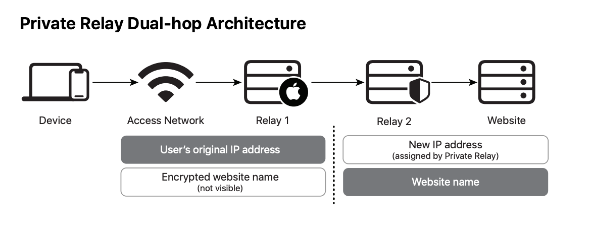

[toc]

### Federated Learning

* 概念
  * Cross-Silo 纵向联邦
  * Cross-Device 横向联邦
* [Google Research: Themes from 2021 and Beyond](https://ai.googleblog.com/2022/01/google-research-themes-from-2021-and.html)
  * Trend 3: ML Is Becoming More Personally and Communally Beneficial
    * 从 ML+产品（Pixel手机） 到 联邦学习 
    * phone cameras
    * live translate/caption
    * [federated analytics](https://ai.googleblog.com/2020/05/federated-analytics-collaborative-data.html) and federated learning
      * 复用 FL 的 evaluating 能力 (without the learning part)
      * Now Playing: on-device database
      * https://arxiv.org/pdf/1902.01046.pdf
      * secure aggregation protocol

#### IOS14

* 概念
  * opt-in：IDFA授权弹窗允许的用户
  * opt-out：弹窗后不允许的用户
  * IDFA：唯一设备标识符，同一设备间不同App可共享
  * mmp：mobile measurement partner，ios14之前，用于APP精确归因convert
    * 可能不稳定。。。需要考虑容灾
    * [iOS 14 and MMPs: Where we stand right now](https://www.singular.net/blog/ios14-mmp/)
      * pros and cons of SKAdNetwork
      * No [view-through attribution](https://www.singular.net/glossary/view-through-attribution/)
        * vta占比高，会使得preconvert低估，需要纠偏萃取label，乘以 (vta+cta)/cta
  * post-click（萃取）：https://instapage.com/blog/post-click-optimization
* 之前：user唯一IDFA，用户设置 Limit Ads Tracking (LAT)
  * LAT主要存在于14.5-的用户中
* 之后：App Tracking Transparency (ATT)，只能获取 IPUA/email
  * 官方 SKAdNetwork 方案 https://developer.apple.com/documentation/storekit/skadnetwork
    * *Ad networks* that sign ads and receive install-validation postbacks after ads result in conversions
    * *Source apps* that display ads provided by the ad networks
    * *Advertised apps* that appear in the signed ads
    * Supports measurement of all ad networks, including self-attributing networks or SANs (Google, Facebook, Twitter, Snap, etc.)
    * SKAd [Code](https://www.singular.net/blog/skadnetwork-code/)
    * 24-72h的兑回延迟
  * [SKAN compaign id 限定100个 —— AppsFlyer](https://support.appsflyer.com/hc/zh-cn/articles/360011502657-SKAdNetwork%E5%B9%BF%E5%91%8A%E5%B9%B3%E5%8F%B0%E5%AF%B9%E6%8E%A5%E6%8C%87%E5%8D%97)
    * 实验越多，分配到每个SKAN id上的convert越少，可能触发隐私阈值
  * [Apple User Data Privacy and Data Use](https://developer.apple.com/app-store/user-privacy-and-data-use/)
  * Fingerprinting and probabilistic matching
    * [关于 IPUA](https://www.ichdata.com/ios-app-tracks-attribution-challenges.html)，ichdata这个网站有许多跟踪匹配方向的文章
      * User Agent https://whatmyuseragent.com/
  * Privacy-preserving attribution with supply-side consent
    * **All these suggestions rely on Apple accepting the concept of single-side consent and assume that supply-side consent is sufficient for attributing user-level installs on the demand-side.** 
* 归因服务
  * [Cryptographically Secure Bloom-Filters](https://dzlp.mk/sites/default/files/255.pdf)

#### Privacy

* [Safari Privacy Overview by Apple](https://www.apple.com/safari/docs/Safari_White_Paper_Nov_2019.pdf)
  * Intelligent Tracking Prevention (ITP) , Protection from cross-site tracking
    * on device学习涉及隐私的domains
    * 阻止tracking social widgets 
      * 2005年起，默认阻止利用 third-party cookies做cross-site tracking
      * ITP开始，阻止利用其它形式的data做cross-site tracking
  * Private Click Measurement：端上完成归因
  * Minimizing data sharing with the Smart Search field: 使用浏览器搜索，而不使用网页搜索栏
  * Secure payments on the Web
    * When a purchase is made on a website using Apple Pay, **a device-specific number and a unique per transaction security code** are sent to the merchant rather than the actual credit card number and security code, so the user’s real credit card information can’t be compromised.
  * Sync and sign-in features that keep the user in control
    * 只会利用icloud keychains帮助登录网站，但切换浏览器不会自动登录它们
* [iCloud Private Relay Overview](https://www.apple.com/privacy/docs/iCloud_Private_Relay_Overview_Dec2021.PDF)
  * for IOS15+
  * sending their requests through two separate internet relays so that no single entity can combine IP address, location, and browsing activity into detailed profile information
  * Private Relay protects all web browsing in Safari and unencrypted activity in apps
  * Private Relay’s dual-hop architecture protects the privacy of users by separating who can observe their IP addresses from who can see the websites they visit. 
  * Transport and Security Protocols
    * These include protocols to proxy internet connections, protect DNS name lookups, and authenticate users when connecting to Private Relay in order to prevent fraud.
    * QUIC (RFC 9000) is a general-purpose transport layer network, standardized by the IETF in May 2021. Connections using QUIC can achieve great performance even in poor network environments by taking advantage of improved loss recovery. QUIC also allows connections to easily switch between network interfaces, allowing connectivity to be maintained as users move between Wi-Fi and cellular networks.
      * TLS 1.3
    * Oblivious DNS over HTTPS (ODoH) ODoH adds a layer of public key encryption, as well as a network proxy between devices and DNS servers. The combination of these two added elements is designed such that only the user has access to both the DNS messages and their original IP address at the same time.
    * Relay access and fraud prevention
      *  blind signature
      *  the server performs device and account attestation using the Basic Attestation Authority (BAA) server prior to vending out tokens
    * Coverage and Compatibility 
      * Cellular services, such as Multimedia Messaging Service (MMS), telephony services (XCAP), Entitlement Server access, tethering traffic, and Visual Voicemail, do not use Private Relay

* 一个苹果隐私相关的例子：IPhone内存满白苹果问题
  * [描述](https://www.zhihu.com/question/432520118/answer/1601795843): 隐私相关的数据校验任务无法执行，导致卡白苹果
  * [民间解决方案](https://zhuanlan.zhihu.com/p/493774509): 怀疑是ROM连带的RAM问题导致卡屏，通过改变电量（用户少有的可操作空间），使校验任务可执行
* user embedding
  * model training outputs might sufficiently constitute "user profiles" to violate PA restrictions
  

#### 《Advances and open problems in federated learning》

##### 1.Introduction

* Federated learning is a machine learning setting where multiple entities (clients) collaborate in solving a machine learning problem, under the coordination of a central server or service provider. Each client’s raw data is stored locally and not exchanged or transferred; instead, focused updates intended for immediate aggregation are used to achieve the learning objective.
  * Focused updates are updates narrowly scoped to contain the minimum information necessary for the specific learning task at hand;
  * aggregation is performed as early as possible in the service of data minimization.
* Learning with privacy
  * https://machinelearning.apple.com/research/learning-with-privacy-at-scale
* Notes
  * Typically a hub-and-spoke topology, with the hub representing a coordi- nating service provider (typically without data) and the spokes connecting to clients.
  * FL 特点
    * Data is generated locally and remains decentralized.
    * A central orchestration server/service organizes the training, but never sees raw data.
    * However, the approach presented above has a substantial advantage in affording a separation of concerns between different lines of research: advances in compression, differential privacy, and secure multi-party computation can be devel-oped for standard primitives like computing sums or means over decentralized updates, and then composed with arbitrary optimization or analytics algorithms, so long as those algorithms are expressed in terms of aggregation primitives.
  * Client 特点
    * Stateless
    * Clients cannot be indexed directly (i.e., no use of client identifiers)
    * Selectable 带来的问题：semi-cyclic data availability and the potential for bias in client selection
  * FL Research
    * be unambiguous about where computation happens as well as what is communicated.

##### 2. Relaxing the Core FL Assumptions: Applications to Emerging Settings and Scenarios

* Fully Decentralized / Peer-to-Peer Distributed Learning
  * graph
    * be sparse with small maximum degree so that each node only needs to send/receive messages to/from a small number of peers
    * that the notion of a round does not need to even make sense in this setting. See for instance the discussion on clock models in [85].
    * multi-agent optimization
      * undirected/directed graph
  * Algorithmic challenges
    * Effect of network topology and asynchrony on decentralized SGD
      * for the special case of generalized linear models, schemes using the duality structure could enable some of these desired robustness properties [231]
    * Local-update decentralized SGD
      * understanding the convergence under non-IID data distributions, not just for the specific scheme based on matching decomposition sampling described above
    * Personalization, and trust mechanisms
    * Gradient compression and quantization methods
    * Privacy
      * 差分隐私
      * local加噪声，通常有损
      * FL的 secure aggregation or secure shuffling 不易 apply
  * practical challenges: 基于 blockchain (a distributed ledger) 讲解
    * A blockchain is a distributed ledger shared among disparate users, making possible digital transactions, including transactions of cryptocurrency, without a central authority. In particular, smart contracts allow execution of arbitrary code on top of the blockchain, essentially a massively replicated eventually-consistent state machine. In terms of federated learning, use of the technology could enable decentralization of the global server by using smart contracts to do model aggregation, where the participating clients executing the smart contracts could be different companies or cloud services.
    * secure aggregation 要 handle dropping out participants [80]，可以利用区块链，用户 stake
* Cross-Silo FL
  * 纵向联邦 (partitioned by features)
    * 数据求交、中心服务；中间信息的传递
  * 横向联邦 (partiioned by examples)
  * Application: 搜 FATE
  * Incentive mechanisms
    * The option to deliver models with performance commensurate to the contributions of each client is especially relevant in collaborative learning situations in which competitions exist among FL participants.
    * Free-rider problem
  * DP
  * Tensor factorization: 中心服务只拿中间结果
    * [272] used an alternating direction method of multipli- ers (ADMM) based approach and [325] improved the efficiency with the elastic averaging SGD (EASGD) algorithm and further ensures differential privacy for the intermediate factors.
* Split Learning
  * Cut layer, smashed data
  * 《Training neural networks using features replay》并行化backward部分
  * One other engineering driven approach to minimize the amount of information communicated in split learning has been via a specifically learnt pruning of channels present in the client side activations [422].

##### 3. Improving Effiency and Effectiveness

* Non-IID Data in Federated Learning
  * non-IIDness 体现在：1）不同client的数据分布不一样；2）client分布及其数据分布随时间变化
  * Non-identical client distributions
    * Feature distribution skew (covariate shift): P(x)
      * 思路是学习 P(y|x)，学习不变的量
    * Label distribution skew (prior probability shift): P(y)
    * Same label, different features (concept drift): P(x|y)
    * Same features, different label (concept shift): P(y|x)
      * some form of personalization (Section 3.3) maybe essential to learning the true labeling function
    * Quantity skew or unbalancedness
  * Violations of indenpendence
    * cross-device FL: a strong geographic bias in the source of the data [171]
  * Dataset shift
  * Strategies for Dealing with Non-IID Data
    * 3.2.2, 一个路子是augment data，构造通用数据来缓解
    * The heterogeneity of client objective functions gives additional importance to the question of how to craft the objective function — it is no-longer clear that treating all examples equally makes sense. Alterna- tives include limiting the contributions of the data from any one user (which is also important for privacy, see Section 4) and introducing other notions of fairness among the clients; see discussion in Section 6.
    * 3.3 multi-model，由client侧的独立model来处理label distribution skew
    * [171] 有一种思路，对不同timezone的人部署不一样的模型iterate版本
* Optimization Algorithms for Federated Learning
  * client 引入的特点：client-sampling, stateless
  * 与其它技术的组合 -> 排除了纯异步更新的技术
    * Optimization algorithms do not run in isolation in a production deployment, but need to be combined with other techniques like cryptographic secure aggregation protocols (Section 4.2.1), differential privacy (DP) (Section 4.2.2), and model and update compression (Section 3.5).
    * Federated Averaging algorithm
  * Performing local updates and communicating less frequently with the central server addresses the core challenges of respecting data locality constraints and of the limited communication capabilities of mobile device clients. However, this family of algorithms also poses several new algorithmic challenges from an optimization theory point of view.
  * Optimization Algorithms and Convergence Rates for IID Datasets
    * 一些假设：H-smooth, gradient约束
    * Comparing these two results, we see that minibatch SGD attains the optimal **‘statistical’ term**, whilst SGD on a single device (ignoring the updates of the other devices) achieves the optimal **‘optimization’ term**
    * These result show that if the number of local steps K is smaller than **T/M^3** then the (optimal) statistical term is dominating the rate. However, for typical cross-device applications we might have T = 10^6 and M = 100 (Table 2), implying K = 1.
      * K: local steps, T: total communication rounds, M: clients per round
      * T*K = constant
    * 调参思路：
      * The costs (at least in wall-clock time) are small for increasing M, and so it may be more natural to increase M sufficiently to match the optimization term, and then tune K to maximize wall-clock optimization performance.
      * How then to choose K? Performing more local updates at the clients will increase the divergence between the resulting local models at the clients, before they are averaged. As a result, the error convergence in terms of training loss versus the total number of sequential SGD steps TK is slower. However, performing more local updates saves significant communication cost and reduces the time spent per iteration.
    * local-update SGD 分析
      * over-provisioning clients [81]
      * fix the number of local updates
        * EASGD
      * A larger challenge in the FL setting, however, is that as discussed at the beginning of Section 3.2, asynchronous approaches may be difficult to combine with complimentary techniques like differential privacy or secure aggregation.
  * Optimization Algorithms and Convergence Rates for Non-IID Datasets
    * the analysis technique can be extended to the non-IID case by **adding an assumption on data dissimilarities**, for example by constraining the difference between client gradients and the global gradient [305, 300, 304, 469, 471] or the difference between client and global optimum values [303, 268].   相应有更差的error bound结果
    * Clarifying the regimes where K > 1 may hurt or help convergence is an important open problem. [303]
* Multi-Task Learning, Personalization, and Meta-Learning
  * Personalization via Featurization
  * Multi-Task Learning
    * 适合 cross-silo 场景的 MOCHA 算法
    * task 对应 client subset 的思路：4.4.4
  * Local Fine Tuning and Meta-Learning
    * In the standard learning-to-learn (LTL) setup [56], one has a meta-distribution over tasks, samples from which are used to learn a learning algorithm, for example by finding a good restriction of the hypothesis space.
    * FL and MAML(model-agnostic meta-learning)
    * LML (lifelong ML)
  * When is a Global FL-trained Model Better?
    * Loss factorization tricks can be used in supervised learning to alleviate up to the vertical partition assumption itself, but the practical benefits depend on the distribution of data and the number of parties [373].
* Adapting ML Workflows for Federated Learning
  * Hyperparameter Tuning
    * Federated learning adds potentially more hyperparameters — separate tuning of the aggregation / global model update rule and local client optimizer, number of clients selected per round, number of local steps per round, configuration of update compression algorithms, and more.
  
  * Neural Architecture Design
    * Neural architecture search (NAS) in the federated learning setting
      * Among these, the gradient-based method leverages efficient gradient back-propagation with weight sharing, reducing the architecture search process from over 3000 GPU days to only 1 GPU day.
  
  * Debugging and Interpretability for FL
  
* Communication and Compression
  * 
  

#### Papers

##### 《Federated Evaluation and Tuning for On-Device Personalization: System Design & Applications》, Apple

https://analyticsindiamag.com/how-apple-tuned-up-federated-learning-for-its-iphones/

Differentiating between FL and FT, they write that Federated Learning(FL) requires model evaluation on held-out federated data. FL learns the parameters of, at times large global neural models. Whereas in Federated Tuning(FT), learning primarily occurs on the central server and is limited to a comparatively small set of personalization algorithm parameters that are evaluated across federated data.

* 场景：ASR system
* federated tuning + DP guarantees (private FL)

2.Related Work

与“Towards”论文的对比

* on-device ML systems and their evaluation and tuning/personalization in a federated setting was the initial goal，重心放在调度、端云交互方式上
* FT的参数大部分在云端共享，device侧只是tuning（可降低攻击风险）

元学习、个性化学习，论文 7、11

which shows that federated model averaging [1] is equivalent to an algorithm called Reptile [12]. Reptile is a form of model-agnostic meta learning (MAML) [13].

3.FE&T of ML Systems

3.1 Motivation

* 一个原则：only ‘sufficiently anonymized’ and ‘siloed’ ML data are available to us. 匿名的含义是不能从特征反推用户身份；siloed含义是无法从多个data silos聚合出单用户的完整数据
* The consideration of federated evaluation (FE) and the attached server side aggregation of individual evaluation results was driven by the fact that on-device evaluation data is non-IID and often rather limited per device. Hence, individual evaluation results suffer from large quantities of uncertainty and only global results, aggregated across many devices
  offer meaningful insight.

3.2 The Challenge of Ground Truth

* 一种解决方案是预估label（新模型输入特征输出word confidences）
* 用户调研满意度：highly dependent on and may be inconsistent across user

4. System Description

4.1 High Level System Design

client: task agnostic

4.2 Device Participation & Data Handling

* device participation: 训练条件包括用户opt-in以及设备条件，可能引入bias，通过AB来判断
* on-device data handling
* results data handling

4.3 Core System

* On-Device components
  * Task descriptor download occurs in random order on a per registered plug-in basis to more evenly distribute the globally available compute. Once all task descriptors for a plug-in are downloaded, the scheduler samples exactly one matching (more details below)
  * 和SysBon的对比：
    * SysBon：devices周期check in，服务端去准入，比如利用reservoir sampling。这一机制称作'pace steering'，是训练推进以及secure aggragation protocol的基础
    * 本文：Task specific sample likelihood approach, configured in server side

* server components
  * SysBon performs aggregation of results in memory.
  * 本文: persist per-device results

4.4 FL specific additions

DP guarantees: 

* individual model updates are encrypted on-device with a training round specific public key

5. On-Device Personalization Applications

* The problem of optimizing n parameters can be implemented as an n-dimensional clustering problem with clusters of size k, where k can be optimized

* word error rate (WER) = #mininum_word_edits/#reference_words
  * 引入 word confidence model (semi-supervised)

##### 《Towards Federated Learning at Scale: System Design》, 2019

1.Introduction

* FL 架构选型：同步/异步训练
  * Federated Averaging algorithm
* 隐私技术：DP、Secure Aggragation

Our work addresses numerous practical issues, these issues are addressed at the communication protocol, de-vice, and server levels:

* device availability that correlates with the local data distribution in complex ways (e.g., time zone dependency);
* unreliable device connectivity and interrupted execution;
* orchestration of lock-step execution across devices with varying availability;
* limited device storage and compute resources. 

2.Protocol

device + server

2.2 Phases: selection -> configuration -> reporting

2.3 Pace Steering

* For large FL populations, pace steering is used to randomize device check-in times, avoiding the “thundering herd” problem, and instructing devices to connect as frequently as needed to run all scheduled FL tasks, but not more.

3.Device

* example store：存label的db，考虑expiration、security

* conf: An application configures the FL runtime by providing an FL population name and registering its example stores. This schedules a periodic FL runtime job using Android’s JobScheduler.

* Communication between the application, the FL runtime, and the application’s example store is implemented via Android’s AIDL IPC mechanism

设备验证：

https://developer.android.com/training/safetynet

4.Server

* The FL server is designed around the Actor Programming Model (Hewitt et al., 1973). Actors are universal primitives of concurrent computation which use message passing as the sole communication mechanism.

* actor：串行执行任务，和其它actor通信，动态创建更多actor

* In-memory aggregation also removes the possibility of attacks within the data center that target persistent logs of per-device updates, because no such logs exist.

6.Secure Aggregation

2017年的隐私技术，不同于DP(differential privacy)

server性能消耗大，支持至多几百个用户，因此在aggregator级别做一次secure aggregation生成中间结果，master aggragator不需要做secure aggregation

7.Tools and Workflow

7.1 Modeling and Simulation

The configuration of tasks is also written in Python and includes runtime parameters such as the optimal number of devices in a round as well as model hyperparameters like learning rate.

7.2 Plan Generation

FL plan: 

* device: device portion, the TensorFlow graph itself, selection criteria for training data in the example store, instructions on how to batch data and how many epochs to run on the device, labels for the nodes in the graph which represent certain computations like loading and saving weights, and so on
* server: the aggregation logic, which is encoded in a similar way

7.3 Versioning, Testing, and Deployment

* For example, the old runtime may be missing a particular TensorFlow in an incompatible way. The FL infrastructure deals with this problem by generating versioned FL plans for each task.

一些数据：

* round completion rate曲线，峰值在凌晨
* 一轮一次训几百个设备，再多会影响效果
* drop out rate: 6~10%，因此select时选130%的设备

10.Related Work

11.Future Work

* Bias
* Convergence Time: 更大规模的device并行训练; online tuning protocol configuration
* Device Scheduling: device上训练哪个具体train session，考虑结合app相关的信息
* Bandwidth
* Federated Computation