[toc]

[Cuda-Downloads](https://developer.nvidia.com/cuda-downloads)

[Cuda-C-Best-Practices](https://docs.nvidia.com/cuda/cuda-c-best-practices-guide/index.html#who-should-read-this-guide)

https://docs.nvidia.com/cuda/cuda-c-programming-guide/


### Intro

> * GPU Mode
>   * Youtube: https://www.youtube.com/channel/UCJgIbYl6C5no72a0NUAPcTA
>   * lecture: https://github.com/gpu-mode/lectures
>   * Blog: https://christianjmills.com/blog.html#listing-listing-page=1
>
> * 书：Programming Massively Parallel Processors (PMPP) 3rd edition
>   * 视频：https://www.youtube.com/@pmpp-book/videos?view=0&sort=dd&shelf_id=2
> * [Nvidia’s CUDA C++ Programming Guide](https://docs.nvidia.com/cuda/cuda-c-programming-guide/index.html)
> * [How GPU Computing Works (YouTube)](https://www.youtube.com/watch?v=3l10o0DYJXg)
> * [GPU Programming: When, Why and How?](https://enccs.github.io/gpu-programming/)

* Intro
  * 科普小视频，绘画形象说明GPU和CPU区别：https://www.bilibili.com/video/BV1ry4y1y7KZ

* Amdahl's Law
  * achievable speedup is limited by the parallelizable portion **p** of programs
    * speedup<1/(1-**p**)
    * e.g., if **p** is 90%, speedup < 10×
  * Fortunately, for many real applications, **p** > 99% especially for large datasets, and speedups >100× are attainable


### GPU

#### Intro

* launch many threads, 每个output element一个thread是合理的
* Op开发流程
  * If it's not fast enough, `torch.compile` it.
  * If it's not fast enough, check if you can rewrite your code to make it more suitable for `torch.compile`.
  * If it's not fast enough, check which parts are slow and write custom Triton kernel(s) for those.
  * If it's not fast enough, check which parts are slow and write custom CUDA kernel(s) for those.

#### GPU vs CPU

* GPU 101
  * https://blog.codingconfessions.com/p/gpu-computing

* GPU 的设计目标，GPU v.s CPU：
  - 并行&串行
    - GPU 侧重并行计算
    - CPU侧重串行计算（[instruction pipelining](https://en.wikipedia.org/wiki/Instruction_pipelining), [out of order execution](https://en.wikipedia.org/wiki/Out-of-order_execution), [speculative execution](https://en.wikipedia.org/wiki/Speculative_execution) and multilevel caches）
  - 吞吐&延迟
    - GPU: throughput-optimized high throughput processor
      - designed for massive levels of parallelism and high throughput, at the cost of medium to high instruction latency
    - CPU: latency-optimized low latency processor
      - 前端消耗大
  - 吞吐数据 (these numbers are from 2021)：
    - The Nvidia Ampere A100: 9.5 TFLOPS for 32-bit precision
    - Intel 24-core processor: 0.66 TFLOPS for 32-bit precision 
  - Scaling Law
    - GPU: Huang's law
    - CPU: Moore's law
      - higher clock rate trend for CPU slowed in 2003: energy consumption & heat dissipation
      - 


* GPU and CPU
  * sequential parts on CPU, numerical intensive parts on GPU


#### GPU Architecture

##### Intro

* SM之上的高层封装
  * GPC、TPC（纹理处理clusters）
  * V100: 6 GPC * 14 SM = 84 SM
  * A100: 8 GPC * 16 SM = 128 SM


##### GPU Compute Architecture

* GPU内部很多functional units:
  * SMs(Streaming Multiprocessors)，一个SM可以schedule多个block，但同一时间只能执行一个
  * 
  
* SP (Streaming Processor) <-> CUDA Core<->Thread

  * 资源：
    * registers & local memory

    * cuda core

    * tensor core

  * Tensor core相比CUDA core，实现了MMA operations，支持2:4 sparsity，支持in8和int4，更高效

* SM <-> Thread Block pool

  * 资源：
    * N*SP
    * warp scheduler
    * control unit resources
    * register
    * shared memory(scratchpad)
  * A set of CUDA cores
  * thread之间可同步，可通过shared memory通信

* Device <-> Grid

  * 资源：Global memory

  * subpartition

* SM可以看做GPU的心脏（对比CPU核心），register和shared memory是SM的稀缺资源。CUDA将这些资源分配给所有驻留在SM中的threads。因此，这些有限的资源就使每个SM中active warps有非常严格的限制，也就限制了并行能力。

  * 每个SM包含的SP数量依据GPU架构而不同，Fermi架构GF100是32个，GF10X架构是48个，Kepler架构是192个，Maxwell架构是128个，Turing架构是64个。相同架构的GPU包含的SM数量则根据GPU的中高低端来定。


###### TensorCore

* Intro
  * **Nvidia Tensor cores are dedicated to performing general matrix multiplication (GEMM) and half-precision matrix multiplication and accumulation (HMMA) operations.** In short, GEMM performs matrix operations in the format of A*B + C, and HMMA converts the operation into the half-precision format.
  * https://resources.nvidia.com/en-us-tensor-core
  * 相比CUDA core，实现了MMA operations，支持2:4 sparsity，支持in8和int4，更高效
    * https://www.wevolver.com/article/tensor-cores-vs-cuda-cores

* paper

  * [NVIDIA Tensor Core Programmability, Performance & Precision](https://arxiv.org/pdf/1803.04014)

  * [Analyzing GPU Tensor Core Potential for Fast Reductions](https://arxiv.org/pdf/1903.03640)

* Guide:
  * https://leimao.github.io/blog/NVIDIA-Tensor-Core-Programming/


##### GPU Memory Architecture


* Registers
  * 65536 per SM (A100/H100)
    * 256KB Register File for GA10x、A100 (65536 * 4B)
    * 512KB Register File for H100
  * allocated to cores dynamically depending on the requirement of the threads
  * private to the threads
* Constant Caches
  * cache constant data used by the code executing on the SM
* **Shared Memory (SRAM)**
  * a small amount of fast and low latency on-chip programmable SRAM memory
  * 192KB of on-chip SRAM per each of 108 SMs (A100)
    * 192*108=20MB
    * 128*82=10,496  for GA10x
  * Usage: 优化threads共享的访存、as a synchronization mechanism between threads executing within a block
* L1 Cache
  * each SM
  * cache frequently accessed data from L2 cache
* L2 Cache
  * shared by all SMs
  * 作为Global Memory的Cache
* **Global Memory (HBM)**
  * SMs share a high capacity and high bandwidth DRAM
  * 80 GB high bandwidth memory (HBM) with bandwidth of 3000 GB/s (H100)


* More registers than L1 cache
  * half gemm用32位寄存器做累加，input/output用16位寄存器


* SM片上单元比L2快3倍，比Global Memory快几十倍 

```c++
cudaMallocManaged()     不注意的话开销大
cudaMalloc()       分配显存
cudaMemcpyHostToDevice
```

* 编译器决定kernel内定义的变量是分配在寄存器上（**没有超过上限的标量**）还是per-thread local memory上
* 寄存器之间的值不一定是私有的，可以shuffle


###### CUDA视角


##### GPU Execution Model

> GPU-Mode Lecture 4 https://www.youtube.com/watch?v=lTmYrKwjSOU

* Grid
  * kernel launch grid of threads
  * All threads execute the same code: Single program multiple-data (SPMD)
  * Threads are hierarchically organized into **grid blocks** & **thread blocks**
  * threads in same block
    * can access **the same shared mem**
    * up to 1024 threads can be in a thread block
      * Hopper架构：每个维度上的最大线程数分别是 1024（x 维度）、1024（y 维度）和 64（z 维度），且乘积不能超过1024
    * threads can be scheduled in any order


**A warp is the basic schedule unit in kernel execution**

* block按32 cdiv，由多个warps执行
  * 一个warp是successive 32 threads in a block
  * Threads如果不能被32整除，余数占据one more warp
* SIMT，一个时钟周期内，一个warp被调度到一个SM上，内部32个线程执行相同的指令

  * execution on a set of cores called a **processing block**.

> AMD wavefronts: 64 threads (可 配置为更低）

* Instructions are SIMD synchronous within a warp

  * 一个warp中的线程执行同一指令

    * e.g. 【code/reduce.cu】`reduce3()`
      * 各种优化技巧，包括unrolling、algorithm cascading
      * each thread should sum O(log n) elements
    * [Independent Thread Scheduling](https://docs.nvidia.com/cuda/cuda-c-programming-guide/index.html#simt-architecture): Volta架构之后，可以执行不同指令，但不同时

  * **Latency hiding: having multiple warps on the SM allows warps to compute while others wait**

    (i.e. the memory transfer “+” compute becomes a max(…, …))

    → roofline model

  * 对于control flow，可能是周期T一半的线程执行if语句，周期T+1另一半的线程执行else语句

* Instructions will be issued to execution units by warp.

  * warp scheduler: Decode and schedule the next instructions
  * Latency is caused by not able to issue next instruction to execution unit

* threading blocks、warp、processing units、SM的关系
  * threading blocks映射到SM
  * warp由一个processing unit执行
  * 一个threading block的thread数量通常是32的倍数（对应N个warp）
  * thread block从x维开始按顺序分配给多个warp
    * 
* 限制：
  * **Nvidia H100**:
    * each SM can handle 32 blocks, 64 warps (i.e., 2048 threads), and 1024 threads per block.
    * max 1536 threads assignable to one SM

* 一个SM有一个thread block pool，一个thread block有多个warp，一个warp scheduler 16个warp
  * [How to choose how many threads/blocks to have?](https://forums.developer.nvidia.com/t/how-to-choose-how-many-threads-blocks-to-have/55529)
  * The only thing that really matters for occupancy and if performance depends on occupancy is warps. You want to have as close to 64 active warps as possible, all other factors being equal.
  * very small block sizes (e.g. 32 threads per block) may limit performance due to occupancy.
  * Very large block sizes for example **1024 threads per block, may also limit performance**
    * if there are resource limits (e.g. registers per thread usage, or shared memory usage) which prevent 2 threadblocks (in this example of 1024 threads per block) from being resident on a SM
    * **不能整除1536**
  * 推荐值：one thread block, **128~512 threads**
* 一些单元：
  * SFU: special function unit
  * Load/Store memory

###### warp divergence

* if、loop可能导致divergence

* 
  * divergence时，不能做sync操作
* 

* 

##### GPU Network

* 内存通常是显存的2倍以上比较合理
* 内存 - pin memory - 显存 - GPU
  * 通常由CPU负责调度
  * pin memory和内存的传输：由GPU上的DMA负责调度
* 硬盘 - 显存：
  * GPU Direct Storage

* 网络 - 显存： RDMA
* PCIe / NVLINk 与CPU Chipset交互


#### Execution of a Kernel on the GPU

* H2D
  * 有可能直接从host memory读：[EMOGI: Efficient Memory-access for Out-of-memory Graph-traversal in GPUs](https://arxiv.org/pdf/2006.06890.pdf)
* Scheduling thread blocks on SMs
  * 
  * waitlisted blocks
  * Compute Capability 3.x (Kepler)
    - **4 warp schedulers per SM**  ([Why only one of the warps is executed by a SM in cuda?](https://stackoverflow.com/questions/13463440/why-only-one-of-the-warps-is-executed-by-a-sm-in-cuda))
    -  those SHARE one instruction (but Volta+ does have per-thread program counter)
    - Dispatch 1 or 2 instructions per warp scheduler
* Single Instruction Multiple Threads (SIMT) and Warps
  * 参考 「GPU Execution Model」
* Warp Scheduling and Latency Tolerance
  * **Zero-overhead Scheduling**
    * As each thread in each warp has its own set of registers, there is no overhead for the SM to switch from executing one warp to another. 
    * context switching in CPU is expensive because the CPU needs to save the registers into main memory, and restore the state of the other process
    * --> 通过大量warp来hide memory latency
* Copying of Result Data From Device to Host Memory

#### 显卡驱动

* 英伟达的显卡驱动程序通常会随CUDA Toolkit一起安装。但是，这个驱动程序是为了开发目的而安装的。这意味着它主要用于开发和调试CUDA应用程序，以帮助开发人员在其工作站上进行开发和测试。这个驱动程序不建议在生产环境中与英伟达的GPU一起使用。在生产环境中，通常需要专门的、经过验证的驱动程序以确保系统的稳定性和性能。

#### 通信：NVLink等

* NVLink
  * 高速、低延迟的通用串行总线接口技术，GPU卡间通信，带宽很高
  * H100:
    * 50GB/link
    * 18links
* 多机
  * Ethernet
  * InfiniBand
  * OmniPath
  * RoCE（RDMA over Converged Ethernet）

#### cuDNN

* Intro

  * cuDNN全称NVIDIA CUDA® Deep Neural Network library， 是一个用于深度神经网络的GPU加速库。

  * cuDNN包含了为神经网络中常见的计算任务提供高度优化的实现。包括前向卷积、反向卷积、注意力机制、矩阵乘法（matmul）、池化（pooling）和归一化（normalization）等。

  * cuDNN的最常见用途是在深度学习框架（如TensorFlow或PyTorch）的开发中。深度学习框架开发者在编写框架时，通常会调用cuDNN，从而几乎不直接与CUDA进行交互。而对于我们使用PyTorch做AI应用的终端用户来说，更没有机会使用cuDNN的。

* cuDNN和CUDA Toolkit的关系

  * CUDA Toolkit不包含cuDNN。CUDA Toolkit是一个更底层的工具包，其中的库是针对的是更基础的操作，比如线性代数中各种矩阵和向量的运算，还有用于文件I/O，支持在GPU上进行高性能文件操作等。而cuDNN是专门为深度学习的各种运算所设计的库，它需要使用CUDA Toolkit中的一些库。


#### 共享卡 —— 如何实现算力和显存隔离

* 隔离方式：时间片 vs 空间
* 隔离级别：不隔离 vs 强隔离 vs 弹性
* 几种隔离技术对比：
  * vGPU(Grid)(Nvidia)：虚拟化；容器化支持不好，license
  * vCuda(腾讯)：cuda hook；性能损耗严重
  * cGPU(Alibaba)：ioctl；损耗小，硬隔离，侵入内核（机器容易坏）
  * MPS(Nvidia)：thread；显存隔离，故障隔离不好
    * 进程级别，进程数量会受限于显存
  * MIG(~A100)：sm/global memory；硬件层面隔离


* 3 ways to accelerate applications:
  * Libraries    
  * OpenACC (add directive, for applications like HPC)
  * Programming Languages


#### DCGM

https://developer.nvidia.com/dcgm

https://on-demand.gputechconf.com/gtc/2018/presentation/s8505-gpu-monitoring-and-management-with-nvidia-data-center-gpu-manager-dcgm-v2.pdf

* Note:
  * 监控 PCIE-RX ---> H2D 带宽
  * Health Check

##### nvidia-smi

```shell
nvidia-smi
nvidia-smi --query-gpu=name --format=csv,noheader
```

#### OAM

* OAM是一种异构计算设备的接口协议，对标nvlink.   nvlink是封闭的协议，OAM是若干大厂共建的一个开放协议。
  * 目的：避免每一种卡都有自己的卡间通信标准，尽量做到 （除了NV的卡之外）任何厂家的计算卡都兼容
  * 技术层面， OAM 和 NVSWITCH （对应A100 这代） 基本是对等的 
    - OAM：是 full connect 模式， 各卡独享约 ~80GB/s 带宽 
      - full connect 的结构更为简单，有一些散热和能耗的优势
    - NV switch: 整个switch提供 600GB/s 带宽 
    - 单机八卡时，OAM 和 NV switch 差不多；卡数少时 nvsiwtch 效率高

### 机型 & 硬件 & 精度 & 吞吐

#### 精度支持

* Blackwell GPUs will [no longer support int4 tensor cores](https://www.nvidia.com/en-us/data-center/tensor-cores/).

#### 浮点计算精度

* 浮点计算
  * 硬件机制：结合律可能不适用，大量累加的顺序，会有精度差异
    * python: `1.0 + (-1.0 + 1e-17 )`
  * cuDNN：
    * deterministic=True：尽量消除算子底层实现的随机性
    * benchmark=False：仅使用同一种卷积算法
  * 算子实现：随机采样

#### 吞吐

* 

* INT8加速比：
  * https://github.com/pytorch/ao/pull/748
  * a100加速比2，
  * 

#### Engegy Model


* 《1.1 computing’s energy problem (and what we can do about it)》
* 《PokeBNN: A binary pursuit of lightweight accuracy.》


#### 机型基础

* Nvidia GPU的算力([Compute Capability](https://docs.nvidia.com/cuda/cuda-c-programming-guide/index.html#compute-capability)), 只是一个版本号, 用来表示核心架构. 一般用`X.X`的方式表示, 第一位是主版本号, 第二位是次版本号, 如下:

| 架构                                                         | 算力 | 上市时间 | 产品                                                         | NVLink                                                       | NVSwitch                     | PCIe              |
| ------------------------------------------------------------ | ---- | -------- | ------------------------------------------------------------ | ------------------------------------------------------------ | ---------------------------- | ----------------- |
| [Blackwell](https://resources.nvidia.com/en-us-blackwell-architecture/blackwell-architecture-technical-brief) |      |          |                                                              |                                                              |                              |                   |
| [Ada](https://images.nvidia.com/aem-dam/Solutions/Data-Center/l4/nvidia-ada-gpu-architecture-whitepaper-V2.02.pdf) |      |          | L40、L4                                                      |                                                              |                              |                   |
| Hopper architecture (霍普)                                   | 9    |          | H100, 训练卡                                                 | 3td-NVLink, SXM2/SXM4900GB/s最多18个                         | 3td-NVSwitch: 900GB/s最多8个 |                   |
| [Ampere architecture ](https://images.nvidia.com/aem-dam/en-zz/Solutions/data-center/nvidia-ampere-architecture-whitepaper.pdf) | 8    | 2020     | A100, 训练卡, 80G HBM2e 显存 19.5 TFLOPS Cuda Cores: 6912 Tensor Cores: 432, 108 SMs; | 3td-NVLink, SXM2/SXM3 600GB/s最多12个                        | 2nd-NVSwitch: 600GB/s最多8个 | PCIe Gen4 64 GB/s |
| Turing architecture (图灵)                                   | 7.5  | 2018     | T4, 推理卡, 16GB GDDR6 显存 8.1 TFLOPS Cuda Cores: 2560 Tensor Cores: 320 |                                                              |                              | PCIe Gen332 GB/s  |
| Volta architecture (伏特)                                    | 7    | 2017     | V100, 训练卡, 24G HBM2显存14~16.4 TFLOPSCuda Cores: 5120Tensor Cores: 640 | 2nd-NVLink, SXM2300GB/s最多6个                               | 1st-NVSwitch: 300GB/s最多8个 | PCIe Gen332 GB/s  |
| Pascal architecture (帕斯卡)                                 | 6    | 2016     | P100, 训练卡, 16G HBM2显存 9.3 ~ 10.6 TFLOPSCuda Cores: 3840P40, 训练卡, 24G GDDR5 显存P4, 推理卡, 8G GDDR5 显存 | 1st-NVLink, SXMP100: 732 GB/s160 GB/sP40: 346 GB/sP4: 192 GB/s |                              | PCIe Gen332 GB/s  |
| Maxwell architecture (麦克斯韦)                              | 5    | 2014     | M40, M60                                                     |                                                              |                              |                   |
| Kepler architecture (开普勒)                                 | 3    | 2010     | K10, K20, K40, K80                                           |                                                              |                              |                   |
| Fermi architecture (费米)                                    | 2    | 2010     |                                                              |                                                              |                              |                   |
| Tesla architecture (特斯拉)                                  | 1    | ~        |                                                              |                                                              |                              |                   |

* V100
  * https://datacrunch.io/blog/nvidia-v100-gpu-specs

* A100
  * https://developer.nvidia.com/blog/nvidia-ampere-architecture-in-depth/
  * 192KB of on-chip SRAM per each of 108 SMs
  * Float32 Tensor Core：156 TFlops
  * Float16 Tensor Core：314 TFlops
  * Float32 CUDA Core：19.5 TFlops
  * GPU Memory：80 GB
  * GPU Memory Bandwidth：2039 GB/s
  * Interconnect：
    * NVLink：600GB/s （50GB/s，12 links）
    * PCIe Gen4: 64GB/s

  * 《Dissecting the Ampere GPU architecture via microbenchmarking》
  * 《Nvidia A100 tensor core GPU architecture》

* H20
  * 132 SMs
  
* H100 GPU
  * 132 SMs with 64 cores per SM, totalling a whopping 8448 cores.
  * each SM can handle 32 blocks, 64 warps (i.e., 2048 threads), and 1024 threads per block.

* GA10x：RTX 3090, has 82 SMs.

  * Each SM in GA10x GPUs contain 128 CUDA Cores, 4 third-generation Tensor Cores, 2 FP64 Cores
  * a 256 KB Register File, and 128 KB of L1/Shared Memory
  * 4*32 FP32 units (one per thread), half  of which know INT32
  * L1 cache and shared memory share hardware (128KB) directly on the SM shmem can be 0/8/16/32/64/100KB
    * L1 Cache the remainder (>=28KB)

  * 


Nvidia GPU 产品根据使用场景不同分为不同的序列:

- GeForce: 用于家庭和个人电脑，包括游戏和娱乐等;
  - **前缀**: 显卡档次与代号. GT: 频率提升版本; GS: GT的缩减版，级别在GT之后; GTX: 一般可以理解为GT eXtreme，代表了极端、极致的意思; GTS: GTX的缩减版，级别在GTX之后. RTX-> GTX > GTS > GT > GS
  - **数字**: 例如1060, 10代表的是第几代, 6代表显卡性能档次的定位
  - **后缀**: SE的意思是阉割版, TI表示增强版, M表示移动端, LE表示
- Quadro: 用于工业渲染、艺术设计，工作站等场合
- Tesla: 用于科学计算，深度学习加速等场景, 对于15年以后的产品, 一般或以省去Tesla, 或用NVIDIA代替, 如P100, T4, V100, A100等.

GPU的Compute Capability与CUDA版本不是同一回事, 后者是开发套件的版本. 


* [A10 v.s. A10G](https://www.baseten.co/blog/nvidia-a10-vs-a10g-for-ml-model-inference/)
  * The A10 is an Ampere-series datacenter GPU well-suited to many model inference tasks, such as running seven billion parameter LLMs. However, AWS users run those same workloads on the A10G, a variant of the graphics card created specifically for AWS. The A10 and A10G have somewhat different specs — most notably around tensor compute — but are interchangeable for most model inference tasks because they share the same GPU memory and bandwidth, and most model inference is memory bound.
  * the A10 prioritizes tensor compute, while the A10G has a higher CUDA core performance
  * 根据ops_to_byte分析是compute bound还是memory bound
    * arithmetic_intensity (Llama 2 7B, Single-Headed Attention Operation)
          ~= total compute / total memory movement
          = 4d(N^2) + 3N^2 ops / 8N^2 + 8Nd bytes
          = 62 ops/byte
  * [A guide to LLM inference and performance](https://www.baseten.co/blog/llm-transformer-inference-guide/) TODO

#### 硬件降频

* 聊一聊英伟达GPU的降频问题 https://zhuanlan.zhihu.com/p/13866293937


### CUDA

#### Intro

* CUDA：Compute Unified Device Architect
* CUDA C: extends ANSI C with minimal new  syntax

#### Programming Model

* thread：uniquely identified by threadIdx和blockIdx
  * Idea: map threads to multi-dimensional data


#### Host and Device Code


#### CUDA Compiler

* nvcc (NVIDIA C compiler) is used to compile kernels into PTX
* Parallel Thread Execution (PTX) is a low-level VM & instruction set
* graphics driver translates PTX into executable binary code (SASS)

#### Hopper

* Thread Block Group的概念


### Triton

#### Intro

* Triton v.s. CUDA
  * pythonish
  * easy to write and debug
  * 二者均生成PTX

* Triton是OpenAI 推出的以python为编程语言基础，专门为深度学习研发和高性能计算而设计的编程语言和编译器，旨在简化和优化GPU编程的复杂操作，降低高性能优化的门槛。它允许开发者在Triton框架内更灵活地编写和优化自定义的算子（operators）或处理复杂的数据流程。
  * 生成PTX（Cuda Assembly）而不是cuda
  * Triton的初期版本以CUDA为起点而开发，为没有CUDA基础的编程者提供快速编写高效CUDA kernel的方案，而随着迭代已逐渐支持其他芯片和编程工具，如AMD的ROCm，并在继续支持其他的芯片，如Intel的CPU。
  * During the compilation, the Triton compiler tries to use clever tricks to **rearrange the parts of your program**
  * 利用ptx汇编可以将triton降级为ptx代码，在cuda上直接运行以达到极致计算性能的优化，Triton提供了块指针非常便捷的实现FA，对GPU IO感知类的实现进行了充分的支持。

#### Basic

>  snippets/gpu-triton.py

* Square

> Snippets/gpu-triton-ops.py

* Matmul

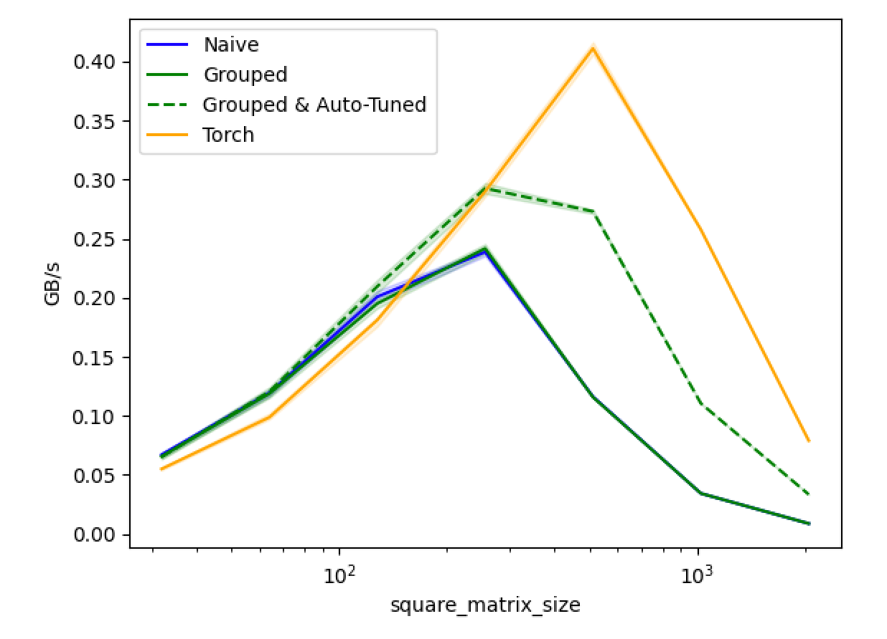

#### Programming Model

* Triton v.s. CUDA
  * 只感知 blocks <-> CUDA两层抽象，blocks 、threads
    * Note on jargon: In triton lingo, each kernel (which processes a block) is called a "program". Therefore, "block_id" is often called "pid" (short for "program id"), but it's the same.
  * 处理tensor <-> 处理scalar
    * **All** operations in triton kernels are vectorized: Loading data, operating on data, storing data, and creating masks.
  * 不感知shared memory


#### Debugging

> snippets/gpu-triton-debugging.py

* `TRITON_INTERPRET=1 python interpret_triton_square.py`
  * 原理：CPU上运行，模拟GPU运行

* crash the kernel then get all the information

#### 经验和细节

* triton autotune目前对dynamic shape的支持不好，性能较差，原因是autotune会对每个新shape重新tune


### GPU优化

#### Overview

> Getting good occupancy – balance resources

##### Roofline Model

* H20: 
  * 4.8 TB/s
  * FP32: 672 TFLOPS
  * FLOPS/Byte = 140


##### 细节

● Have 82 SM → many blocks = good

​	(for comparison Jetson Xavier has 8 Volta SM)

● Can schedule up to 1536 threads per SM

​	→ power of two block size <512 desirable

​	(some other GPUs 2048)

● Avoid divergence to execute an entire warp (32 threads) at each cycle

● Avoid FP64/INT64 if you can on Gx102 (GeForce / Workstation GPUs)

● Shared Memory and Register File → limits number of scheduled on SM

(use __launch_bounds__ / C10_LAUNCH_BOUNDS to advise compiler of # of threads for register allocation, but register spill makes things slow) 

● Use `torch.cuda.get_device_properties(<gpu_num>)` to get properties (e.g. max_threads_per_multi_processor)

​	[even more in CUDA than in PyTorch](https://developer.download.nvidia.com/compute/DevZone/docs/html/C/doc/html/group__CUDART__DEVICE_g5aa4f47938af8276f08074d09b7d520c.html)

#### Literature Review

* 访存瓶颈
  * compute speed has out-paced memory speed [61, 62, 63], and most operations in Transformers are bottlenecked by memory accesses [43]. 【FlashAttention】

#### 写好GPU程序的难点

* "if you do not care about performance, parallel programming is very easy"
* designing parallel algorithms in practice harder than sequential algorithms
  * e.g. parallelizing recurrent computations requires nonintuitive thinking (like prefix sum)
* speed is often limited by memory latency/throughput (memory bound)
  * e.g. llm token by token效率低，需要batching
* perf of parallel programs can vary dramatically based on input data characteristics
* not all apps are "embarassingly parallel" - synchronization imposes overhead (waits)

#### SM效率

* **SM Occupancy：the ratio of the number of warps assigned to an SM to the maximum number it can support**
* 限制因素：主要是资源约束
  *  **SM能够同时处理的线程块数量**
    - block size太小的情形
      - block size=32，总共需要执行 2048 个线程。因此总共需要 2048/32 = 64 个线程块来容纳这 2048 个线程
      - 每个 SM 在同一时刻最多只能处理 32 个线程块
      - --> 50% SM Occupancy
  * **每个thread的register数量**
    - each SM has 65536 registers. To execute 2048 threads simultaneously, each thread can have a maximum of 32 registers (65536/2048 = 32). If a kernel needs 64 registers per thread, we can only run 1024 threads per SM,
    - --> resulting in 50% occupancy.
  *  每个SM的共享内存 / **Shared Memory per Block**

#### Warp效率

* coalesce memory access
  * 在CUDA中，如果一个线程束（warp，通常由32个线程组成）中的线程按顺序访问连续的内存地址，那么这些访问就可以被合并成一个内存事务

* 如果 warp 内的线程执行不同的分支，会出现分支分歧，显著降低性能
  * 线程块的线程数量是 32 的倍数，更好地组织线程能减少分支分歧的发生概率

#### Shared Memory利用 —— Tiling

* 本质：In Matmul, each of the n² outputs uses 2n inputs
  * n^2 * 2n / (2n^2) = n，每个input重复读n次
  * 优化后：read each input only n/TILE_SIZE times from main memory


### PMPP: Programming Massively Parallel Processors

> * 书：Programming Massively Parallel Processors (PMPP) 3rd edition
>
> * 视频：https://www.youtube.com/@pmpp-book/videos?view=0&sort=dd&shelf_id=2

* Main Goals
  * Parallel programming & computational thinking
  * Correct & reliable: debugging function & performance 
  * Scalability: regularize and localize memory access

#### Ch1-3 PPT

> GPU-Mode Lecture 2: https://www.youtube.com/watch?v=NQ-0D5Ti2dc

* Intro
  * motivation: GPU go brrr, more FLOPS please
    * Why? Simulation & world-models (games, weather, proteins, robotics)
    * Bigger models are smarter -> AGI (prevent wars, fix climate, cure cancer)
    * GPUs are the backbone of modern deep learning
  * classic software: sequential programs
    * higher clock rate trend for CPU slowed in 2003: energy consumption & heat dissipation
  * multi-core CPU came up
    * developers had to learn multi-threading (deadlocks, races etc.)
* Heterogeneous data parallel computing
  * Heterogeneous：GPU + CPU
  * CUDA C: extends ANSI C with minimal new syntax

* Multidimensional grids and data

#### Ch4-5 Compute and Memory Basics

> GPU-Mode Lecture 4: https://www.youtube.com/watch?v=lTmYrKwjSOU

* Chapter 4: Compute Architecture and Scheduling
  * aka: How to keep all of the GPU busy
* Chapter 5: Memory architecture and data locality
  * aka the basics of getting fast kernels

### Torch.compile

#### Intro

* `torch.compile` makes your model faster by trying to **use existing kernels more effectively and creating simple new kernels.** 
* 什么情况下torch.compile性能差
  * 不能编译成一个cuda graph，有graph breaks

#### 为什么 Square 算子性能差

> snippets/gpu-triton.py

* Triton（Autotune）和 Triton（No Autotune Large Block Size）性能差不多，且最好
  - Triton（No Autotune Large Block Size）: `BLOCK_SIZE = triton.next_power_of_2(n_cols)`
  - --> H20机器，大Block Size效果好？
* torch原生实现 和 Triton（No Autotune Fixed Block Size）性能相当
  - Triton（No Autotune Fixed Block Size）：固定Block Size为1024
* Torch(compiled) 性能最差
  * torch.compile的实现用一个kernel处理整个矩阵数据
  * 主要差异是，手写代码按行生成多个kernel实例，每个实例并行处理一行数据

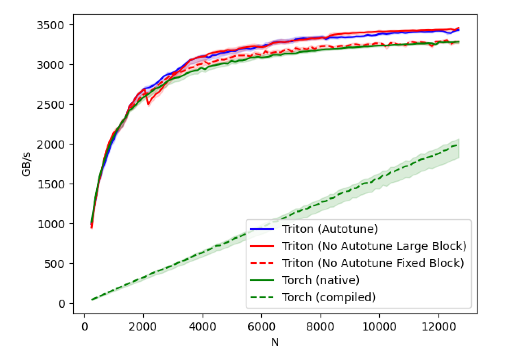

- 考虑到矩阵内存连续，对于element-wise任务，可以将2d-matrix视为1d-tensor，因此torch.compile将这一任务抽象成1d并行任务是合理的
  - 为什么性能有损呢，本质是生成的kernel实例数量影响了性能（这个例子中，每行一个kernel实例，性能有优化）
  - Q：kernel实例数量影响性能，原理是什么？ 取舍是什么？kernel launch代价？
  - Q：triton能否自动优化这个？

### GPU Profiling

> [tf-timeline](https://zhuanlan.zhihu.com/p/40156908)
>
> [nsight-systems](https://developer.nvidia.cn/nsight-systems)
>
> [nsight-compute](https://developer.nvidia.com/nsight-compute)

* Intro
  * cuda是async，因此用python的time模块，测的包含kernel launch时间，不包含execute时间


#### Nvidia Lecture 5: Introduction to Nsight Profiling Tools


```shell
nsys profile -t cuda,osrt,nvtx -o baseline -w true python main.py
```

Support:

* OS Thread state and CPU utilization, pthread, file I/O, etc.
* User annotations API (NVTX)
* Compute
  * CUDA API: Kernel launch and execution correlation
  * Libraries and directive: cuBLAS, cuDNN, OpenACC
* Graphics
  * Vulkan, OpenGL, DX11, DX12, DXR, V-sync


* nvtx记录kernel信息
  * "//tensorflow/core/profiler:nvtx_utils"
  * nvtxDomainRangeStartEx 和 nvtxDomainRangeEnd
  * export TF_ENABLE_NVTX_RANGES=1、export TF_ENABLE_NVTX_RANGES_DETAILED=1


* Key features
  * section is a group of metrics


### Nvidia Lectures

#### Nvidia Lecture 1: Accelerating Applications with CUDA C/C++

[课程网页](https://courses.nvidia.com/courses/course-v1:DLI+C-AC-01+V1/courseware/85f2a3ac16a0476685257996b84001ad/9ef2f68fb10d40c5b54b783392938d04/?activate_block_id=block-v1%3ADLI%2BC-AC-01%2BV1%2Btype%40sequential%2Bblock%409ef2f68fb10d40c5b54b783392938d04)

##### Writing Application Code for the GPU

* CUDA accelerates applications drastically with little effort, has an ecosystem of highly optimized libraries for [DNN](https://developer.nvidia.com/cudnn), [BLAS](https://developer.nvidia.com/cublas), [graph analytics](https://developer.nvidia.com/nvgraph), [FFT](https://developer.nvidia.com/cufft), and more, and also ships with powerful [command line](http://docs.nvidia.com/cuda/profiler-users-guide/index.html#nvprof-overview) and [visual profilers](http://docs.nvidia.com/cuda/profiler-users-guide/index.html#visual).

* CUDA supports many, if not most, of the [world's most performant applications](https://www.nvidia.com/en-us/data-center/gpu-accelerated-applications/catalog/?product_category_id=58,59,60,293,98,172,223,227,228,265,487,488,114,389,220,258,461&search=) in, [Computational Fluid Dynamics](https://www.nvidia.com/en-us/data-center/gpu-accelerated-applications/catalog/?product_category_id=10,12,16,17,19,51,53,71,87,121,124,156,157,195,202,203,204,312,339,340,395,407,448,485,517,528,529,541,245,216,104,462,513,250,492,420,429,490,10,12,16,17,19,51,53,71,87,121,124,156,157,195,202,203,204,312,339,340,395,407,448,485,517,528,529,541,245,216,104,462,513,250,492,420,429,490,10,12,16,17,19,51,53,71,87,121,124,156,157,195,202,203,204,312,339,340,395,407,448,485,517,528,529,541,245,216,104,462,513,250,492,420,429,490&search=), [Molecular Dynamics](https://www.nvidia.com/en-us/data-center/gpu-accelerated-applications/catalog/?product_category_id=8,57,92,123,211,213,237,272,274,282,283,307,325,337,344,345,351,362,365,380,396,398,400,435,507,508,519,8,57,92,123,211,213,237,272,274,282,283,307,325,337,344,345,351,362,365,380,396,398,400,435,507,508,519,8,57,92,123,211,213,237,272,274,282,283,307,325,337,344,345,351,362,365,380,396,398,400,435,507,508,519,8,57,92,123,211,213,237,272,274,282,283,307,325,337,344,345,351,362,365,380,396,398,400,435,507,508,519&search=), [Quantum Chemistry](https://www.nvidia.com/en-us/data-center/gpu-accelerated-applications/catalog/?product_category_id=8,57,92,123,211,213,237,272,274,282,283,307,325,337,344,345,351,362,365,380,396,398,400,435,507,508,519,8,57,92,123,211,213,237,272,274,282,283,307,325,337,344,345,351,362,365,380,396,398,400,435,507,508,519&search=), [Physics](https://www.nvidia.com/en-us/data-center/gpu-accelerated-applications/catalog/?product_category_id=6,24,116,118,119,135,229,231,372,373,392,393,489,493,494,495,496,497,498,67,170,216,281,6,24,116,118,119,135,229,231,372,373,392,393,489,493,494,495,496,497,498,67,170,216,281,6,24,116,118,119,135,229,231,372,373,392,393,489,493,494,495,496,497,498,67,170,216,281,6,24,116,118,119,135,229,231,372,373,392,393,489,493,494,495,496,497,498,67,170,216,281,6,24,116,118,119,135,229,231,372,373,392,393,489,493,494,495,496,497,498,67,170,216,281&search=) and HPC.

```c++
nvidia-smi
cudaMallocManaged()
cudaDeviceSynchronize()
  
nvcc -arch=sm_70 -o hello-gpu 01-hello/01-hello-gpu.cu -run
```

* code executed on the CPU is referred to as **host** code, and code running on the GPU is referred to as **device** code
  * [cudaDeviceSynchronize只需要在使用cudaStream时使用](https://stackoverflow.com/questions/11888772/when-to-call-cudadevicesynchronize)，平时“Although CUDA kernel launches are asynchronous, all GPU-related tasks placed in one stream (which is the default behavior) are executed sequentially.”

```c++
void CPUFunction()
{
  printf("This function is defined to run on the CPU.\n");
}

__global__ void GPUFunction()
{
  printf("This function is defined to run on the GPU.\n");
}
// __global__表示CPU/GPU均可执行，必须返回void

int main()
{
  CPUFunction();
	// launch a kernel, provide an execution configuration
  GPUFunction<<<1, 1>>>();
  cudaDeviceSynchronize();
  // CPU等待GPU
}
```

At a high level, execution configuration allows programmers to specify the **thread hierarchy** for a kernel launch, which defines the number of thread groupings (called **blocks**), as well as how many **threads** to execute in each block.

[**NVIDIA CUDA Compiler**](http://docs.nvidia.com/cuda/cuda-compiler-driver-nvcc/index.html), [documentation](http://docs.nvidia.com/cuda/cuda-compiler-driver-nvcc/index.html)

[`arch` flag](http://docs.nvidia.com/cuda/cuda-compiler-driver-nvcc/index.html#options-for-steering-gpu-code-generation), [virtual architecture features](http://docs.nvidia.com/cuda/cuda-compiler-driver-nvcc/index.html#gpu-feature-list) 


##### CUDA Thread Hierarchy

* Programming model: SIMT
  * 三层抽象：grid, block, thread

* Kernel Execution

  * configuration ~ grid
  * Each block is executed by one SM and does not migrate.

  * Several concurrent blocks can reside on one SM depending on block’s memory requirement and the SM’s memory resources.


* CUDA-Provided Thread Hierarchy Variables，可以在`__global__`函数里直接用，作为标识来实现并行

* 并行是无序的
* `threadIdx.x + blockIdx.x * blockDim.x`

```c++
gridDim.x: num of blocks
blockDim.x: num of threads in a block
blockIdx.x: block index
threadIdx.x: thread index
```

```c++
// e.g.
__global__ void vecAddKernel(const float* A, const float* B, float* C, int n) {
 int i = blockDim.x * blockIdx.x + threadIdx.x;
 if (i < n) {
 	C[i] = A[i] + B[i];
 }
}

#define THREADS_PER_BLOCK 512
void vecAdd(const float* A, const float* B, float* C, int n) {
 float *d_A, *d_B, *d_C;
 int size = n * sizeof(float);
 cudaMalloc((void **) &d_A, size);
 cudaMemcpy(d_A, A, size, cudaMemcpyHostToDevice);
 cudaMalloc((void **) &d_B, size);
 cudaMemcpy(d_B, B, size, cudaMemcpyHostToDevice);
 cudaMalloc((void **) &d_C, size);
 int nblocks = (n + THREADS_PER_BLOCK - 1) / THREADS_PER_BLOCK;
 vecAddKernel<<<nblocks, THREADS_PER_BLOCK>>>(d_A, d_B, d_C, n);
 cudaMemcpy(C, d_C, size, cudaMemcpyDeviceToHost);
 cudaFree(d_A); cudaFree(d_B); cudaFree(d_C);
}
```

* 如果不同的线程在不同的Warp里，他们的执行顺序会有所不同（但如果执行的操作非常简单，那么它们执行的先后时间也相差非常小），因为硬件（SM）是以Warp为单位调度线程运行的，每个Warp有32个线程

##### Allocating Memory to be accessed on the GPU and the CPU
```c++
// CPU-only

int N = 2<<20;
size_t size = N * sizeof(int);

int *a;
a = (int *)malloc(size);

// Use `a` in CPU-only program.

free(a);
// Accelerated

int N = 2<<20;
size_t size = N * sizeof(int);

int *a;
// Note the address of `a` is passed as first argument.
cudaMallocManaged(&a, size);

// Use `a` on the CPU and/or on any GPU in the accelerated system.

cudaFree(a);
```

* 这个地址在统一的内存空间里，GPU和CPU都可以使用，但物理上数据可以不在它被访问的设备里，这时会产生page fault（缺页错误），对这个错误的处理就是把数据拷贝到需要访问它的设备或主机内存里，这个操作是透明的（自动执行）。

https://on-demand.gputechconf.com/gtc/2018/presentation/s8430-everything-you-need-to-know-about-unified-memory.pdf
https://developer.nvidia.com/blog/unified-memory-cuda-beginners/

* 精讲UnifiedMemory的博客 https://blog.csdn.net/weixin_41172895/article/details/115403922
  * 使用了虚拟内存(cudaMallocManaged)，降低代码复杂度，系统会将大于gpu内存的空间自动放到cpu上，内存申请cudaMemPrefetchAsync
  * cudaMemAdvise
  	* cudaMemAdviseSetReadMostly 及 cudaMemAdviseUnSetReadMostly
  	  这两个是cudaMemAdvise的Flag，用来为某个device设定/解除内存空间ReadMostly的特性，device所指的设备可以有一个只读副本而不发生数据迁移，当两端没有写入时，两个副本的数据是一致的。
  	* cudaMemAdvise(cudaMemAdviseSetAccessedBy), gpu上有的直接使用，cpu上就直接pci访问，什么时候搬运到gpu可以自行指定

```c++
#define GPU_DEVICE 0
{
	char * array = nullptr;       
	cudaMallocManaged(&array, N)  //分配内存
	fill_data(array);
	cudaMemAdvise(array, N, cudaMemAdviseSetReadMostly, GPU_DEVICE); //提示GPU端几乎仅用于读取这片数据
	cudaMemPrefetchAsync(array, N, GPU_DEVICE, NULL); // GPU prefetch
	qsort<<<...>>>(array);        //GPU 无缺页中断，产生read-only副本
	//cudaDeviceSynchronize();  
	use_data(array);              //CPU process 没有page-fault.
	cudaFree(array);
}
```


##### Grid Size Work 

* Amount Mismatch

  * `size_t number_of_blocks = (N + threads_per_block - 1) / threads_per_block;`

  * threads_per_block最大为1024


* [Grid-Stride Loops](https://developer.nvidia.com/blog/cuda-pro-tip-write-flexible-kernels-grid-stride-loops/)

  * By using a loop with stride equal to the grid size, we ensure that all addressing within warps is unit-stride, so we get [maximum memory coalescing](https://developer.nvidia.com/blog/parallelforall/how-access-global-memory-efficiently-cuda-c-kernels/), just as in the monolithic version.
  * 所有warp同步寻址都是在一个grid里，这是最大显存聚合


```cpp
__global__ void kernel(int *a, int N)
{
  int indexWithinTheGrid = threadIdx.x + blockIdx.x * blockDim.x;
  int gridStride = gridDim.x * blockDim.x;

  for (int i = indexWithinTheGrid; i < N; i += gridStride)
  {
    // do work on a[i];
  }
}
```

##### Error Handling

```c++
cudaError_t err;
err = cudaMallocManaged(&a, N)                    // Assume the existence of `a` and `N`.

if (err != cudaSuccess)                           // `cudaSuccess` is provided by CUDA.
{
  printf("Error: %s\n", cudaGetErrorString(err)); // `cudaGetErrorString` is provided by CUDA.
}

someKernel<<<1, -1>>>();  // -1 is not a valid number of threads.

cudaError_t err;
err = cudaGetLastError(); // `cudaGetLastError` will return the error from above.
if (err != cudaSuccess)
{
  printf("Error: %s\n", cudaGetErrorString(err));
}
```

```c++
#include <stdio.h>
#include <assert.h>

inline cudaError_t checkCuda(cudaError_t result)
{
  if (result != cudaSuccess) {
    fprintf(stderr, "CUDA Runtime Error: %s\n", cudaGetErrorString(result));
    assert(result == cudaSuccess);
  }
  return result;
}

int main()
{

/*
 * The macro can be wrapped around any function returning
 * a value of type `cudaError_t`.
 */

  checkCuda(cudaDeviceSynchronize())
}
```


利用dim3完成2d、3d任务

```c++
dim3 threads_per_block(16, 16, 1);
dim3 number_of_blocks(16, 16, 1);
someKernel<<<number_of_blocks, threads_per_block>>>()
```

##### Environments and Projects

https://github.com/NVIDIA/nvidia-docker

GPU加速[Mandelbrot Set Simulator](https://github.com/sol-prog/Mandelbrot_set)

Peruse [*GPU-Accelerated Libraries for Computing*](https://developer.nvidia.com/gpu-accelerated-libraries) to learn where you can use highly optimized CUDA libraries for tasks like [basic linear algebra solvers](https://developer.nvidia.com/cublas) (BLAS), [graph analytics](https://developer.nvidia.com/nvgraph), [fast fourier transforms](https://developer.nvidia.com/cufft) (FFT), [random number generation](https://developer.nvidia.com/curand) (RNG), and [image and signal processing](https://developer.nvidia.com/npp), to name a few.

#### 2.Course: Managing Accelerated Application Memory with CUDA Unified Memory and nsys

Assess, Parallelize, Optimize, Deploy(APOD) design cycle

##### Iterative Optimizations with the NVIDIA Command Line Profiler

Profile configuration details, Report file(s) generation details, CUDA API Statistics, CUDA Kernel Statistics, CUDA Memory Operation Statistics (time and size), OS Runtime API Statistics

```shell
nvcc -o single-thread-vector-add 01-vector-add/01-vector-add.cu -run
nsys profile --stats=true -o output-report ./single-thread-vector-add
```


* block size的选择，最小取64，通常取128、256

  * SM的倍数

  * 32的倍数， [in depth coverage of SMs and warps](http://docs.nvidia.com/cuda/cuda-c-programming-guide/index.html#hardware-implementation)


```c++
#include <stdio.h>

int main()
{
  int deviceId;
  cudaGetDevice(&deviceId);                  
  cudaDeviceProp props;
  cudaGetDeviceProperties(&props, deviceId); 

  int computeCapabilityMajor = props.major;
  int computeCapabilityMinor = props.minor;
  int multiProcessorCount = props.multiProcessorCount;
  int warpSize = props.warpSize;

  printf("Device ID: %d\nNumber of SMs: %d\nCompute Capability Major: %d\nCompute Capability Minor: %d\nWarp Size: %d\n", deviceId, multiProcessorCount, computeCapabilityMajor, computeCapabilityMinor, warpSize);
}
```


**dynamic parallelism in cuda**: kernel内执行kernel，但launch kernel开销较大，有几微秒


##### CPU-GPU Interaction Optimization

* Host<->device data transfer has much lower bandwidth than global memory access.

  * 16 GB/s (PCIe x16 Gen3) vs 250 GB/s & 10.6 T inst/s (GP100) 

* Minimize transfer

  * Intermediate data can be allocated, operated, de-allocated directly on GPU

  * Sometimes it’s even better to re-compute on GPU

* Group transfer
  * One large transfer much better than many small ones
  * Overlap memory transfer with computation


#### 3.Course: Optimization Workflow

unmanaged memory allocation and migration; pinning, or page-locking host memory; and non-default concurrent CUDA streams.


优化思路：

* NVVP & nvprof (legacy)
* Nsight System & Nsight Compute
* Use existing libraries, which are highly optimized, e.g. cublas, cudnn. 
* Use high level language to write GPU kernels.


* Choose the right metric:
  * GFLOP/s: for compute-bound kernels
  * Bandwidth: for memory-bound kernels
    * Will use G80 GPU for this example
    * 384-bit memory interface（数据总线位数）, 900 MHz DDR
    * 384 * 1800 / 8 = 86.4 GB/s
      * 由于DDR的时钟脉冲上升沿和下降沿都传输数据，因此倍增系数为2


* Understand CUDA performance characteristics
  * Memory coalescing
  * Divergent branching
  * Bank conflicts
  * Latency hiding


* prefetch: 减少HtoD耗时（因为larger chunks），大幅减少kernel耗时（不再page fault）

* init-kernel: 不再有HtoD，OS耗时也没了

https://developer.nvidia.com/blog/maximizing-unified-memory-performance-cuda/


##### CUDA Streams
* Kernels within any single stream must execute in order
* Kernels in different, non-default streams can interact concurrently
* The default stream is special: it blocks all kernels in all other streams 
  * 这一规则有副作用，因此推荐用non-default streams

```c++
cudaStream_t stream;       // CUDA streams are of type `cudaStream_t`.
cudaStreamCreate(&stream); // Note that a pointer must be passed to `cudaCreateStream`.

someKernel<<<number_of_blocks, threads_per_block, 0, stream>>>(); // `stream` is passed as 4th EC argument.
// 3th argument: the number of bytes in shared memory

cudaStreamDestroy(stream); // Note that a value, not a pointer, is passed to `cudaDestroyStream`.


for (int i = 0; i < 5; ++i){
  cudaStream_t stream;
  cudaStreamCreate(&stream);
  printNumber<<<1, 1, 0, stream>>>(i);
  cudaStreamDestroy(stream);
}
cudaDeviceSynchronize();
```


* Exericise: Accelerate and Optimize an N-Body Simulator
  * nbody-raw.cu -> nbody-optimized.cu


##### Memory Optimization

* Improve memory access pattern to reduce wasted transactions，提高bus utilization
  * per warp (coalesced, 32/64/128B)
    * 线程访问可以不连续，但内存需要连续
  * in discrete chunks (transported in segments: L2 cache line, 32B)
    * 长度和index均需对齐
* Reduce redundant access: shared memory
  * Inter-block communication
  * User-managed cache to reduce redundant global memory accesses
  * Avoid non-coalesced access: shared memory没有cache line的概念，e.g. matrix-transposition.cu


* Shared memory应用于矩阵乘法，见【code/gemm.cu】
  * 双buffer的思路：prefetch和计算并行
* Reduction优化，见【code/reduction.pdf】
  * Parallel Reduction
  * Problem: Global Synchronization
    * Solution: decompose into multiple kernels Kernel launch serves as a global synchronization point
    * Kernel launch has negligible HW overhead, low SW overhead
  * Solution: Kernel Decomposition
    * Recursive kernel invocation


* Manual Device Memory Allocation and Copying

```c++
int *host_a, *device_a;        // Define host-specific and device-specific arrays.
cudaMalloc(&device_a, size);   // `device_a` is immediately available on the GPU.
cudaMallocHost(&host_a, size); // `host_a` is immediately available on CPU, and is page-locked, or pinned.

initializeOnHost(host_a, N);   // No CPU page faulting since memory is already allocated on the host.

// `cudaMemcpy` takes the destination, source, size, and a CUDA-provided variable for the direction of the copy.
cudaMemcpy(device_a, host_a, size, cudaMemcpyHostToDevice);

kernel<<<blocks, threads, 0, someStream>>>(device_a, N);

// `cudaMemcpy` can also copy data from device to host.
cudaMemcpy(host_a, device_a, size, cudaMemcpyDeviceToHost);

verifyOnHost(host_a, N);

cudaFree(device_a);
cudaFreeHost(host_a);          // Free pinned memory like this.
```

cudaHostAlloc: Pinned(Non-pageable) Memory, very expensive


##### Latency Optimization

**Warp State**

* Active: warps inside the pool which has non-exiting threads
* Eligible: active warps that are not stalled
* Issued: a single eligible warp that the warp scheduler choose to issue one or more instructions on this cycle

**Latency**

* bound: for many cycles, lack of eligible warps to issue instructions

* hiding: switching warp
* technique: increase active warps

**Occupancy & Active Warps**

* Occupancy: ratio of active warps per SM to the maximum number of allowed warps
  * Hardware limit: 64 in Volta GV100 Per SM(16 per sub-partition), but **32** in Turing
* We need the occupancy to be high enough to hide latency
* Theoretical occupancy is limited by resource usage (shared memory/registers/blocks per SM)

**Achieved occupancy can be significantly lower than theoretical occupancy when:** 

*  Unbalanced workload within blocks
* Unbalanced workload across blocks
* Too few blocks launched

**Occupancy Optimization**

* Know the occupancy: NVIDIA Visual profiler / Nsight Compute 
* Adjust resource usage to increase theoretical occupancy
  * Change block size
  * Limit register usage

    * Compiler option –maxregcount=n: per file

    * `__launch_bounds__`: per kernel 
  * Limit shared memory usage.

* Launch enough load-balanced blocks to increase achieved occupancy

```c++
__global__ void
__launch_bounds__(maxThreadsPerBlock, minBlocksPerMultiprocessor)
MyKernel(...){
  ...
}
```


Using Streams to Overlap Data Transfers and Code Execution

* cudaMemcpyAsync: `manual-malloc.cu`, `memcpy-async.cu`


##### Instruction Optimization

* Use float if precision allow
  * Adding “f” to floating literals (e.g. 1.0f) because the default is double 

* Fast math functions
  * Two types of runtime math library functions
    * func(): slower but higher accuracy (5 ulp or less)
    * __func(): fast but lower accuracy (SFU做，see prog. guide for full details) 
    *  -use_fast_math: forces every func() to __func ()

* High-throughput function:
  * DP4A and DP2A for int8 and int16 dot productions 
  * Warp matrix function for tensor core operations


##### CUDA cooperative group 协作线程组


```c++
namespace cooperative_groups{
class thread_group{
public:
  __device__ unsigned int size() const;
  __device__ unsigned int thread_rank() const;
  __device__ void sync() const;
};
  
thread_block myblock = this_thread_block();
// intra-block groups
thread_group tile32 = tiled_partition(myblock, 32);
thread_group tile4 = tiled_partition(tile32, 4);
thread_block_tile<8> tile8 = tiled_partition<8>(this_thread_block());


// Warp collectives

template <unsigned int Size>
class thread_block_tile : public thread_group{
public:
  __device__ unsigned int size() const;
  __device__ unsigned int thread_rank() const;
  __device__ void sync() const;
  
  // Shuffle collectives
  __device__ int shfl(int var, int srcRank) const;
  __device__ int shfl_down(int var, unsigned int delta) const;
  __device__ int shfl_up(int var, unsigned int delta) const;
  __device__ int shfl_xor(int var, unsigned int laneMask);
  
  // Vote collectives
  __device__ int any(int predicate) const;
  __device__ int all(int predicate) const;
  __device__ unsigned int ballot(int predicate) const;
  
  // Match collectives
  __device__ unsigned int match_any(int val);
  __device__ unsigned int match_all(int val, int &pred);
}; 
}
```


#### 4.Course: Accelerating CUDA C++ Applications with Multiple GPUs

目标：

* 使 GPU 计算与 GPU 上的内存传输重叠

* 在多个 GPU 上并发执行计算


#### 6.Lecture: NVIDIA GPU通用推理加速及部署SDK

线上推理加速的思路
* 模型本身的加速，TensorRT、DL complier
  * [Layer & Tensor Fusion](https://docs.nvidia.com/deeplearning/tensorrt/best-practices/): 横向/纵向的融合，减少copy显存; layer merge (concatforward)
  * Weights & Activation Precision Calibration
    * Symmetric quantization: 超参threshold，超过会截断，提高转换精度
    * 用KL-divergence来衡量threshold

  * Kernel Auto-Tuning: 找当前硬件下最优的卷积算法、kernels、tensor layouts
  * Dynamic Tensor Memory: 给层加引用计数 

```c++
  IBuilderConfig * config = builder->createBuilderConfig(); 
  config->setFlag(BuilderFlag::kFP16); //INT8 and FP16 can be both set
```

* 部署服务，CPU or GPU

* Model Parser 解析TensorFlow/Caffe模型
  * [ONNX Parser](https://github.com/onnx)
* TensorRT Network Definition API
  * 自定义算子需要自己写

```c++
IBuilder* builder = createInferBuilder(gLogger.getTRTLogger());
INetworkDefinition* network = builder->createNetwork();
ITensor* data = network->addInput(INPUT_BLOB_NAME, dt, Dims3{1, INPUT_H, INPUT_W});
IScaleLayer* scale_1 = network->addScale(*data, ScaleMode::kUNIFORM, shift, scale, power);
IConvolutionLayer* conv2 = network->addConvolution(*scale_1->getOutput(0), 50, DimsHW{5, 5}, weightMap["conv2filter"], weightMap["conv2bias"]);
conv2->setStride(DimsHW{1, 1});
ISoftMaxLayer* prob = network->addSoftMax(*conv2->getOutput(0));
prob->getOutput(0)->setName(OUTPUT_BLOB_NAME); // set output 
network->markOutput(*prob->getOutput(0)); // mark output

//序列化反序列化
IHostMemory* trtModelStream = engine->serialize(); //store model to disk
//<...>
IRuntime* runtime = createInferRuntime(gLogger.getTRTLogger());
ICudaEngine* engine = runtime->deserializeCudaEngine(trtModelStream->data(), trtModelStream->size(), nullptr);
IExecutionContext* context = engine->createExecutionContext();
```


TF-TRT (TensorFlow integration with TensorRT) parses the frozen TF graph or saved model, and **converts each supported subgraph to a TRT optimized node** (TRTEngineOp), allowing TF to execute the remaining graph.

```c++
# Set Precision
conversion_params = trt.DEFAULT_TRT_CONVERSION_PARAMS._replace(
precision_mode=trt.TrtPrecisionMode.INT8)
# Convert to TF-TRT Graph
converter = trt.TrtGraphConverterV2(input_saved_model_dir=input_saved_model_dir, conversion_params=conversion_params)
# INT8 Calibration
converter.convert(calibration_input_fn=my_calibration_fn)
# Run Inference 
converter.save(output_saved_model_dir)
```


Triton Inference Server

* Client/server在本地：Inputs/outputs needed to be passed to/from Triton are stored in system/CUDA shared memory. Reduces HTTP/gRPC overhead

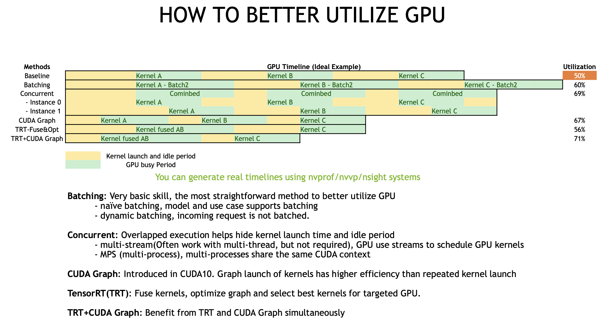

```
dynamic_batching {
	preferred_batch_size:[4,8],
	max_queue_delay_microseconds: 100,
}
```

Case Study: NVIDA BERT Solution: [FasterTransformer2.0](https://github.com/NVIDIA/DeepLearningExamples/tree/master/FasterTransformer) and [TensorRT](https://github.com/NVIDIA/DeepLearningExamples/tree/master/TensorFlow/LanguageModeling/BERT/trt)


#### 7.Lecture: NVIDIA ASR & TTS SOLUTIONS

#####  ASR WFST decoding on GPU

ASR Pipeline
* 多级的转换：speech -> phoneme -> character -> word -> sentence
  * 即使是深度学习兴起，工业界少有用e2e
  * 多级带来海量choices，需要构建一个decoder解决识别任务(a search problem)
* ASR system overview

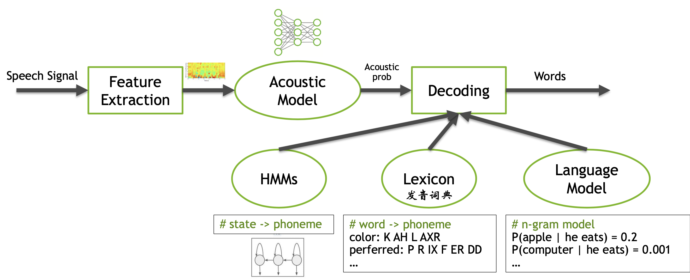

*Q: How do we combine HMM, Lexicon & LM together?*

*A: WFST (Weighted Finite State Transducer)*


WFST是一种图的表示方式，能通用地表示上述三种模型，然后这三张图可以合并。

* HMM的输出是phoneme的输入，phoneme的输出是language model的输入

* WFST Decoding: 图的最短路径问题，Token Pathing，Traverse the graph by copying token

Kaldi CUDA decoding pipeline

* WFST Decoding逻辑判断和对象copy较多，之前很长时间之后CPU实现
* GPU DECODE CHALLENGES
  * Dynamic workload
    * Amount of parallelism varies greatly throughout decode process
    * Can have few or many candidates moving from frame to frame
  * Limited parallelism
    * Even with many candidates, the amount of parallelism is still far smaller to saturate a GPU
  * Complex data structure
    * Need a GPU-friendly data layout to obtain high performance on GPU
* CUDA DECODER
  * Operate FST on GPU
    * CudaFst takes ~1/3 of its original size
  * Accelerate decoding by parallelization
    * Batch processing: batch不同语句的chunks，支持context switch
    * Token Passing in parallel
  * Process in streaming manner
* ASR GPU PIPELINE: e2e acceleration, feature extraction + Acoustic Model + Language Model
  * 结合Triton Inference Server


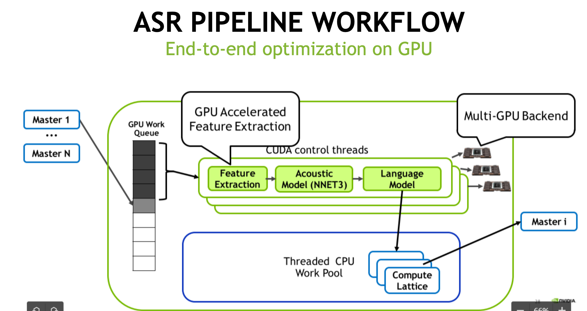


Reference:

- Blogs: https://developer.nvidia.com/blog/gpu-accelerated-speech-to-text-with-kaldi-a-tutorial-on-getting-started/
- Kaldi integration with Triton: https://github.com/NVIDIA/DeepLearningExamples/tree/master/Kaldi/SpeechRecognition
- Kaldi GPU decoder
  - NGC: nvcr.io/nvidia/kaldi:20.08-py3
  - Kaldi github: github.com/kaldi-asr/src/cudadecoder


##### Text To Speech(TTS) Synthesis

Modern TTS Solution

* Synthesizer: TACOTRON 2模型，合成发音特征
* Vocoder：声码器 WAVENET、WAVEGLOW
  * 思路：利用可逆网络生成声音, affine coupling layer很关键

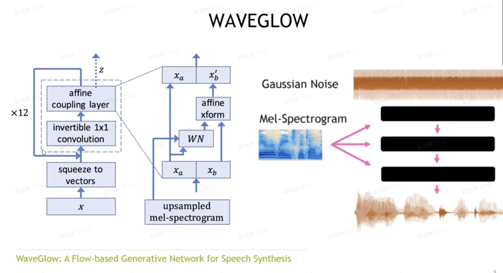


APEX ～ Mixed Precision Training

BERT

* Challenge: polyphone disambiguation, prodisic structure prediction

* BERT Optimization: 对self-attention layer做kernel fusion


#### 8.Lecture: 基于GPU的大数据处理和机器学习加速

用于Apache Spark的RAPIDS加速器

* 不适合GPU大数据处理的场景
  * 数据规模小：仅百兆
  * 高缓存一致性的操作
  * 数据移动：缓慢I/O，与CPU的不断交互(UDFs)，Shuffle
  * 有限的GPU内存
* SQL plugin擅长于
  * 高散列度数据的joins、aggregates、sort
  * Window operations、复杂计算、数据编码（创建Parquet和ORC文件，读取CSV）

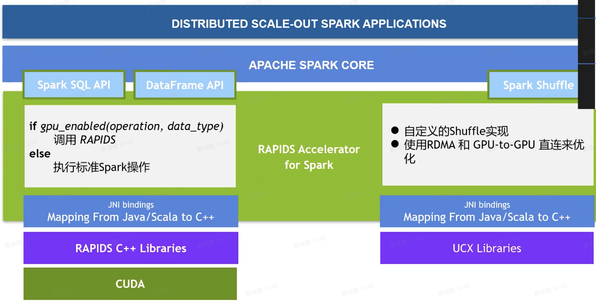


Spark Shuffle: 前后stages间的数据交换

* CPU-Centric Data Movement: GPU0->CPU->GPU1；PCIe总线(GPU and CPU)、Network(远端CPU)，CPU参与调度
* GPU-Centric Data Movement: NVLink(同节点GPU), RDMA(远端GPU), GPU Direct Storage(落盘)
* Shuffling Spilled Data: 溢出到cpu的host memory；如果无法满足，host memory内数据落盘或者通过RDMA传输到远端
* UCX Library: https://www.openucx.org/

Spark 0.2的亮点

* 支持原生Spark、Databricks 7.0ML、Dataproc 2.0
* 读取大量小的Parquet文件的优化：并行化处理文件Buffer，CPU与GPU无缝衔接
* 初步支持SCALA UDF
* 加速PANDAS UDFs
  * 实现对Python进程的GPU资源管理，使JVM进程与Python进程共享一个GPU，以安全地在Pandas UDF里使用GPU
  * 优化JVM与Python之间的数据交换，避免不必要的行列转换


#### 9.Lecture: Merlin -- GPU-accelerated Recommendation Framework

[NVTabular](https://github.com/NVIDIA/NVTabular)，基于RAPIDS的Recommendation ETL，底层是RAPIDS

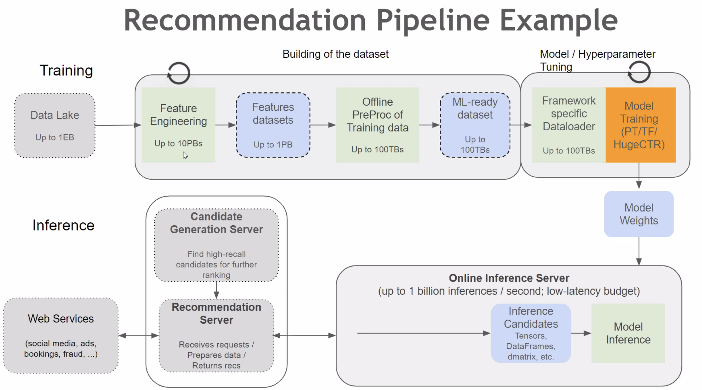

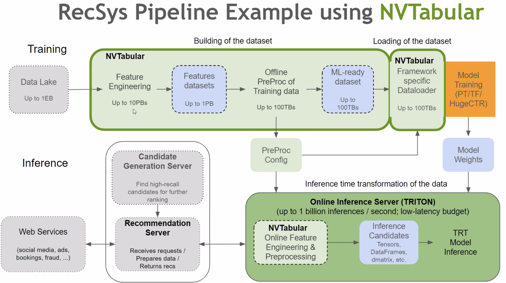

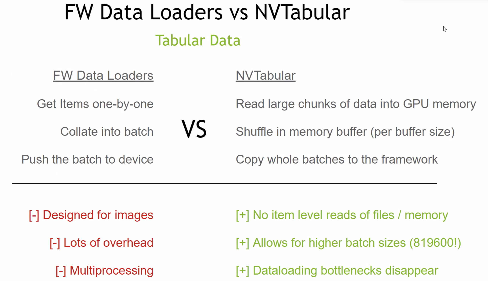


[HugeCTR](https://github.com/NVIDIA/HugeCTR)

* Embedding Table入显存：unified memory management，节点间交换不再layer by layer，可以一次交换所有PS
  * 高效的GPU HashTable实现，解决冲突
* Multi-nodes Model Parallel

* Model Subscription: per req load PS to Embedding Cache in GPU

#### 10.Lecture: NLP领域的GPU加速案例，Faster Transformer


* decoder和decoding两层抽象，适用于不同灵活性的场景

* GPT-2 model

  * Only one attention block
  * No beam search
  * Support sequence length <= 4096

* encoder和decoder的讨论

  * encoder一次输入的词多、运行次数少、对GPU更友好
  * decoder和上述相反，但依据Amdahl's Law，在encoder和decoder共用的场景，decoder是瓶颈
  * Faster Transformer的实现：encoder参考BERT、decoder和decoding参考OpenNMT-tf (Attention is all you need)、GPT-2

* 优化的讨论

  * encoder：瓶颈是kernel launch bound，kernels are too small
    * Fused Encoder: Fuse the kernels except GEMMs (General Matrix Multiplication)  as much as possible，GEMM用tensorcore优化。更进一步可以利用cutlass工具fuse multi-head attention
  * decoder：更多small kernels
    * Fuse multi-head attention：原因是decoder的batch size是1，不必要对GEMM优化
  * decoding : 
    * fuse the softmax and top k operations by [online-softmax](https://github.com/NVIDIA/online-softmax)
    * use [CUB](https://nvlabs.github.io/cub/#sec5sec4) to accelerate the reduce operations
    * [beam search](https://towardsdatascience.com/an-intuitive-explanation-of-beam-search-9b1d744e7a0f) 之前要 FP16 转 FP32
      * Beam width
    * [effective_transformer by ByteDance](https://github.com/bytedance/effective_transformer): 记录每个sentence的padding前缀和，矩阵计算前移除无用的padding，做attention时再映射回来，本质上是追求tensor的紧致组织。
  * INT8 optimization：QAT + without quantizing residuals => 精度损失少
  
  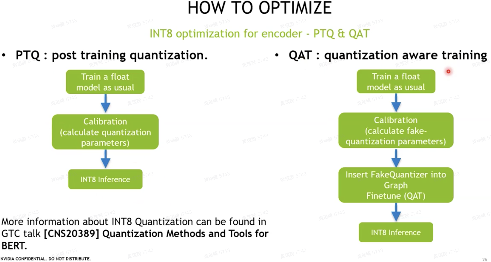

### 应用

#### 矩阵乘法

* Cutlass implementation of matrix multiplication on A100
  * https://developer.download.nvidia.com/video/gputechconf/gtc/2020/presentations/s21745-developing-cuda-kernels-to-push-tensor-cores-to-the-absolute-limit-on-nvidia-a100.pdf

#### 图像处理

* GPU做图像处理pipeline自动优化
  * Halide: a language and compiler for optimizing parallelism, locality, and recomputation in
    image processing pipelines.


