[toc]

[Cuda-Downloads](https://developer.nvidia.com/cuda-downloads)

[Cuda-C-Best-Practices](https://docs.nvidia.com/cuda/cuda-c-best-practices-guide/index.html#who-should-read-this-guide)

https://docs.nvidia.com/cuda/cuda-c-programming-guide/


### Intro

> * GPU Mode
>   * Youtube: https://www.youtube.com/channel/UCJgIbYl6C5no72a0NUAPcTA
>   * lecture: https://github.com/gpu-mode/lectures
>   * Blog: https://christianjmills.com/blog.html#listing-listing-page=1
>
> * 书：Programming Massively Parallel Processors (PMPP) 3rd edition
>   * 视频：https://www.youtube.com/@pmpp-book/videos?view=0&sort=dd&shelf_id=2
> * [Nvidia’s CUDA C++ Programming Guide](https://docs.nvidia.com/cuda/cuda-c-programming-guide/index.html)
> * [How GPU Computing Works (YouTube)](https://www.youtube.com/watch?v=3l10o0DYJXg)
> * [GPU Programming: When, Why and How?](https://enccs.github.io/gpu-programming/)

* Intro
  * 科普小视频，绘画形象说明GPU和CPU区别：https://www.bilibili.com/video/BV1ry4y1y7KZ

* Amdahl's Law
  * achievable speedup is limited by the parallelizable portion **p** of programs
    * speedup<1/(1-**p**)
    * e.g., if **p** is 90%, speedup < 10×
  * Fortunately, for many real applications, **p** > 99% especially for large datasets, and speedups >100× are attainable


### GPU

#### Intro

* launch many threads, 每个output element一个thread是合理的
* Op开发流程
  * If it's not fast enough, `torch.compile` it.
  * If it's not fast enough, check if you can rewrite your code to make it more suitable for `torch.compile`.
  * If it's not fast enough, check which parts are slow and write custom Triton kernel(s) for those.
  * If it's not fast enough, check which parts are slow and write custom CUDA kernel(s) for those.

#### GPU vs CPU

* GPU 101
  * https://blog.codingconfessions.com/p/gpu-computing

* GPU 的设计目标，GPU v.s CPU：
  - 并行&串行
    - GPU 侧重并行计算
    - CPU侧重串行计算（[instruction pipelining](https://en.wikipedia.org/wiki/Instruction_pipelining), [out of order execution](https://en.wikipedia.org/wiki/Out-of-order_execution), [speculative execution](https://en.wikipedia.org/wiki/Speculative_execution) and multilevel caches）
  - 吞吐&延迟
    - GPU: throughput-optimized high throughput processor
      - designed for massive levels of parallelism and high throughput, at the cost of medium to high instruction latency
    - CPU: latency-optimized low latency processor
      - 前端消耗大
  - 吞吐数据 (these numbers are from 2021)：
    - The Nvidia Ampere A100: 9.5 TFLOPS for 32-bit precision
    - Intel 24-core processor: 0.66 TFLOPS for 32-bit precision 
  - Scaling Law
    - GPU: Huang's law
    - CPU: Moore's law
      - higher clock rate trend for CPU slowed in 2003: energy consumption & heat dissipation
      - 


* GPU and CPU
  * sequential parts on CPU, numerical intensive parts on GPU


#### GPU Architecture

##### Intro

* SM之上的高层封装
  * GPC、TPC（纹理处理clusters）
  * V100: 6 GPC * 14 SM = 84 SM
  * A100: 8 GPC * 16 SM = 128 SM

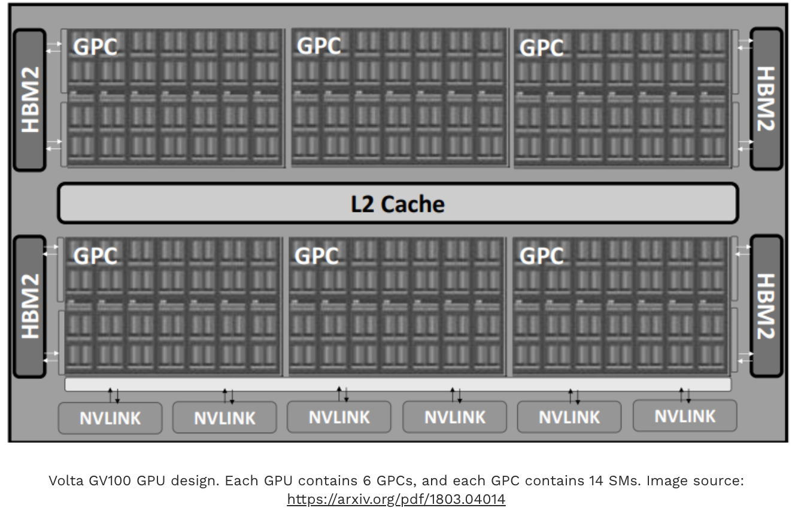


##### GPU Compute Architecture

* GPU内部很多functional units:
  * SMs(Streaming Multiprocessors)，一个SM可以schedule多个block，但同一时间只能执行一个
  * 
  
* SP (Streaming Processor) <-> CUDA Core<->Thread

  * 资源：
    * registers & local memory

    * cuda core

    * tensor core

  * Tensor core相比CUDA core，实现了MMA operations，支持2:4 sparsity，支持in8和int4，更高效

* SM <-> Thread Block pool

  * 资源：
    * N*SP
    * warp scheduler
    * control unit resources
    * register
    * shared memory(scratchpad)
  * A set of CUDA cores
  * thread之间可同步，可通过shared memory通信

* Device <-> Grid

  * 资源：Global memory

  * subpartition

* SM可以看做GPU的心脏（对比CPU核心），register和shared memory是SM的稀缺资源。CUDA将这些资源分配给所有驻留在SM中的threads。因此，这些有限的资源就使每个SM中active warps有非常严格的限制，也就限制了并行能力。

  * 每个SM包含的SP数量依据GPU架构而不同，Fermi架构GF100是32个，GF10X架构是48个，Kepler架构是192个，Maxwell架构是128个，Turing架构是64个。相同架构的GPU包含的SM数量则根据GPU的中高低端来定。


##### GPU Memory Architecture


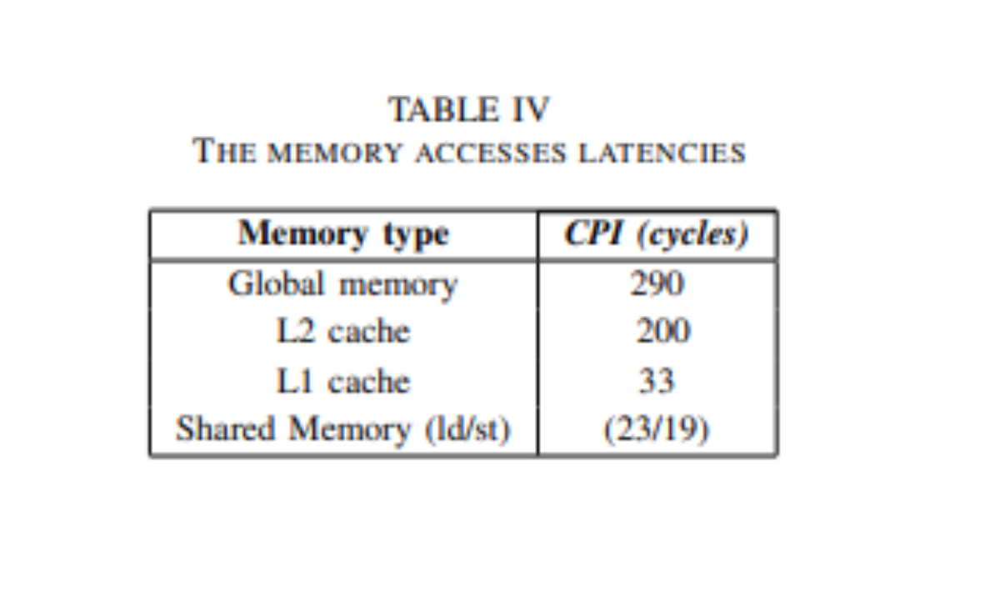

* Registers
  * 65536 per SM (A100/H100)
    * 256KB Register File for GA10x、A100 (65536 * 4B)
    * 512KB Register File for H100
  * allocated to cores dynamically depending on the requirement of the threads
  * private to the threads
* Constant Caches
  * cache constant data used by the code executing on the SM
* **Shared Memory (SRAM)**
  * a small amount of fast and low latency on-chip programmable SRAM memory
  * 192KB of on-chip SRAM per each of 108 SMs (A100)
    * 192*108=20MB
    * 128*82=10,496  for GA10x
  * Usage: 优化threads共享的访存、as a synchronization mechanism between threads executing within a block
* L1 Cache
  * each SM
  * cache frequently accessed data from L2 cache
* L2 Cache
  * shared by all SMs
  * 作为Global Memory的Cache
* **Global Memory (HBM)**
  * SMs share a high capacity and high bandwidth DRAM
  * 80 GB high bandwidth memory (HBM) with bandwidth of 3000 GB/s (H100)


* More registers than L1 cache
  * half gemm用32位寄存器做累加，input/output用16位寄存器


* SM片上单元比L2快3倍，比Global Memory快几十倍 

```c++
cudaMallocManaged()     不注意的话开销大
cudaMalloc()       分配显存
cudaMemcpyHostToDevice
```

* 编译器决定kernel内定义的变量是分配在寄存器上（**没有超过上限的标量**）还是per-thread local memory上
* 寄存器之间的值不一定是私有的，可以shuffle


###### CUDA视角


###### Unified/Pinned Memory

- GPU Memory 基础
  - 原始：cudaMalloc + cudaMalloc + cudaMemcpyAsync
  - 常见：cudaMallocManaged + cudaMemPrefetchAsync(A, size, **gpuId**, s);
  - 进阶：cudaMemAdvise (**cudaMemAdviseSetReadMostly** 及 cudaMemAdviseUnSetReadMostly)


--->


* Pascal之后有硬件支持
* 解决cpu&gpu空间均需访问某一tensor的问题
  * 本质上是通过地址映射，让GPU可以访问某块CPU Memory

* 两种实现：
  * 基于page fault
    * 这个地址在统一的内存空间里，GPU和CPU都可以使用，但物理上数据可以不在它被访问的设备里，这时会产生page fault（缺页错误），对这个错误的处理就是把数据拷贝到需要访问它的设备或主机内存里，这个操作是透明的（自动执行）。
    * https://on-demand.gputechconf.com/gtc/2018/presentation/s8430-everything-you-need-to-know-about-unified-memory.pdf
    * https://developer.nvidia.com/blog/unified-memory-cuda-beginners/
    * 
  * 用load/store，UVA（Unified Virtual Addressing）或者zero copy access
* e.g. bitsandbytes paged optimizer
  * https://github.com/bitsandbytes-foundation/bitsandbytes/blob/main/docs/source/explanations/optimizers.mdx
  * https://github.com/bitsandbytes-foundation/bitsandbytes/issues/962
  * Compared to CPU offloading, a paged optimizer has zero overhead if all the memory fits onto the device and only some overhead if some of memory needs to be evicted. For offloading, you usually offload fixed parts of the model and need to off and onload all this memory with each iteration through the model (sometimes twice for both forward and backward pass).

* 精讲UnifiedMemory的博客 https://blog.csdn.net/weixin_41172895/article/details/115403922
  * 使用了虚拟内存(cudaMallocManaged)，降低代码复杂度，系统会将大于gpu内存的空间自动放到cpu上，内存申请**cudaMemPrefetchAsync**
  * **cudaMemAdvise**
    * cudaMemAdviseSetReadMostly 及 cudaMemAdviseUnSetReadMostly
      这两个是cudaMemAdvise的Flag，用来为某个device设定/解除内存空间ReadMostly的特性，device所指的设备可以有一个只读副本而不发生数据迁移，当两端没有写入时，两个副本的数据是一致的。
    * cudaMemAdvise(cudaMemAdviseSetAccessedBy), gpu上有的直接使用，cpu上就直接pci访问，什么时候搬运到gpu可以自行指定


##### GPU Execution Model

> GPU-Mode Lecture 4 https://www.youtube.com/watch?v=lTmYrKwjSOU

* Grid
  * kernel launch grid of threads
  * All threads execute the same code: Single program multiple-data (SPMD)
  * Threads are hierarchically organized into **grid blocks** & **thread blocks**
  * threads in same block
    * can access **the same shared mem**
    * up to 1024 threads can be in a thread block
      * Hopper架构：每个维度上的最大线程数分别是 1024（x 维度）、1024（y 维度）和 64（z 维度），且乘积不能超过1024
    * threads can be scheduled in any order


**A warp is the basic schedule unit in kernel execution**

* block按32 cdiv，由多个warps执行
  * 一个warp是successive 32 threads in a block
  * Threads如果不能被32整除，余数占据one more warp
* SIMT，一个时钟周期内，一个warp被调度到一个SM上，内部32个线程执行相同的指令

  * execution on a set of cores called a **processing block**.

> AMD wavefronts: 64 threads (可 配置为更低）

* Instructions are SIMD synchronous within a warp

  * 一个warp中的线程执行同一指令

    * e.g. 【code/reduce.cu】`reduce3()`
      * 各种优化技巧，包括unrolling、algorithm cascading
      * each thread should sum O(log n) elements
    * [Independent Thread Scheduling](https://docs.nvidia.com/cuda/cuda-c-programming-guide/index.html#simt-architecture): Volta架构之后，可以执行不同指令，但不同时

  * **Latency hiding: having multiple warps on the SM allows warps to compute while others wait**

    (i.e. the memory transfer “+” compute becomes a max(…, …))

    → roofline model

  * 对于control flow，可能是周期T一半的线程执行if语句，周期T+1另一半的线程执行else语句

* Instructions will be issued to execution units by warp.

  * warp scheduler: Decode and schedule the next instructions
  * Latency is caused by not able to issue next instruction to execution unit

* **Warp State**

  * Active: warps inside the pool which has non-exiting threads
  * Eligible: active warps that are not stalled
  * Issued: a single eligible warp that the warp scheduler choose to issue one or more instructions on this cycle

* threading blocks、warp、processing units、SM的关系
  * threading blocks映射到SM
  * warp由一个processing unit执行
  * 一个threading block的thread数量通常是32的倍数（对应N个warp）
  * thread block从x维开始按顺序分配给多个warp
    * 
  
* 限制：
  * **Nvidia H100**:
    * each SM can handle 32 blocks, 64 warps (i.e., 2048 threads), and 1024 threads per block.
    * max 1536 threads assignable to one SM

* 一个SM有一个thread block pool，一个thread block有多个warp，一个warp scheduler 16个warp
  * [How to choose how many threads/blocks to have?](https://forums.developer.nvidia.com/t/how-to-choose-how-many-threads-blocks-to-have/55529)
  * The only thing that really matters for occupancy and if performance depends on occupancy is warps. You want to have as close to 64 active warps as possible, all other factors being equal.
  * very small block sizes (e.g. 32 threads per block) may limit performance due to occupancy.
  * Very large block sizes for example **1024 threads per block, may also limit performance**
    * if there are resource limits (e.g. registers per thread usage, or shared memory usage) which prevent 2 threadblocks (in this example of 1024 threads per block) from being resident on a SM
    * **不能整除1536**
  * 推荐值：one thread block, **128~512 threads**
    * 最小取64，通常取128、256
  
      * SM的倍数
  
      * 32的倍数， [in depth coverage of SMs and warps](http://docs.nvidia.com/cuda/cuda-c-programming-guide/index.html#hardware-implementation)
  
* 一些单元：
  * SFU: special function unit
  * Load/Store memory

###### warp divergence

* if、loop可能导致divergence

* 
  * divergence时，不能做sync操作
* 

* 

* 相关优化kernel例子：
  * scan
  * reduce

###### Pipeline

* ASYNC in SMEM and ILP in RMEM
  * 

* Hopper
  * 
  * 


##### GPU Network

> 基于 [ICI(tpu)](https://cloud.google.com/tpu/docs/system-architecture-tpu-vm)/[RoCE](https://en.wikipedia.org/wiki/InfiniBand)/IB 实现高速网络互联
>
> nvlink 2025现状介绍 https://zhuanlan.zhihu.com/p/28229263860
>
> IB介绍：https://network.nvidia.com/pdf/whitepapers/Intro_to_IB_for_End_Users.pdf

* NVLink offers a bandwidth of 160 GB/s, roughly 3.2 times that of IB
  (50 GB/s).
* 内存 - pin memory - 显存 - GPU
  * 通常由CPU负责调度
  * pin memory和内存的传输：由GPU上的DMA负责调度
  * 内存通常是显存的2倍以上比较合理
* 硬盘 - 显存：
  * GPU Direct Storage
* 网络 - 显存： RDMA
* PCIe / NVLINk 与CPU Chipset交互
  * nvlink的带宽 > GPU-CPU offload带宽


#### Execution of a Kernel on the GPU

* H2D
  * 有可能直接从host memory读：[EMOGI: Efficient Memory-access for Out-of-memory Graph-traversal in GPUs](https://arxiv.org/pdf/2006.06890.pdf)
* Scheduling thread blocks on SMs
  * 
  * waitlisted blocks
  * Compute Capability 3.x (Kepler)
    - **4 warp schedulers per SM**  ([Why only one of the warps is executed by a SM in cuda?](https://stackoverflow.com/questions/13463440/why-only-one-of-the-warps-is-executed-by-a-sm-in-cuda))
    -  those SHARE one instruction (but Volta+ does have per-thread program counter)
    - Dispatch 1 or 2 instructions per warp scheduler
* Single Instruction Multiple Threads (SIMT) and Warps
  * 参考 「GPU Execution Model」
* Warp Scheduling and Latency Tolerance
  * **Zero-overhead Scheduling**
    * As each thread in each warp has its own set of registers, there is no overhead for the SM to switch from executing one warp to another. 
    * context switching in CPU is expensive because the CPU needs to save the registers into main memory, and restore the state of the other process
    * --> 通过大量warp来hide memory latency
* Copying of Result Data From Device to Host Memory

#### 计算：TensorCore

* Intro

  * Volta, Turing, Ampere 开始的GPU架构
  * **Nvidia Tensor cores are dedicated to performing general matrix multiplication (GEMM) and half-precision matrix multiplication and accumulation (HMMA) operations.** In short, GEMM performs matrix operations in the format of A*B + C, and HMMA converts the operation into the half-precision format.
  * https://resources.nvidia.com/en-us-tensor-core
  * 相比CUDA core，实现了MMA operations，支持2:4 sparsity，支持in8和int4，更高效
    * https://www.wevolver.com/article/tensor-cores-vs-cuda-cores

* paper

  * [NVIDIA Tensor Core Programmability, Performance & Precision](https://arxiv.org/pdf/1803.04014)

  * [Analyzing GPU Tensor Core Potential for Fast Reductions](https://arxiv.org/pdf/1903.03640)

  * Demystifying Tensor Cores to Optimize Half-Precision Matrix Multiply

* Guide:

  * GTC 教程：https://developer.nvidia.com/gtc/2020/video/s21745-vid

  * https://leimao.github.io/blog/NVIDIA-Tensor-Core-Programming/

  * Q: Does Matmul involve reduction sum? Why can it be done in FP16?

    * A: In tensor core FP16 MAC (Multiply-Accumulate) unit, the accumulation is always done in full precision, which avoids the problem of arithmetic underflow.
    * Reference: https://devblogs.nvidia.com/programming-tensor-cores-cuda-9/

  * To employ Tensor Cores in [cuBLAS](https://docs.nvidia.com/cuda/cublas/index.html), the dimensions of a GEMM ([M, K] x [K, N] -> [M, N]) must be multiples of 8.

    * convolution没有限制
    * https://github.com/NVIDIA/apex/issues/221#issuecomment-478084841


  


##### [Speaking Tensor Cores —— GPU Mode Lecture 23](https://www.youtube.com/watch?v=hQ9GPnV0-50)

> Vijay Thakkar & Pradeep Ramani (Representing the CUTLASS Team @NVIDIA)

* Intro
  * Hardware block that accelerates MatMul
  * FMAs accelerate vector dot products - O(N) operations
  * Tensor cores accelerate matrix multiplies - O(N3) operations
  * Increases flop / byte ratio – more temporal and spatial reuse


* 时空重用

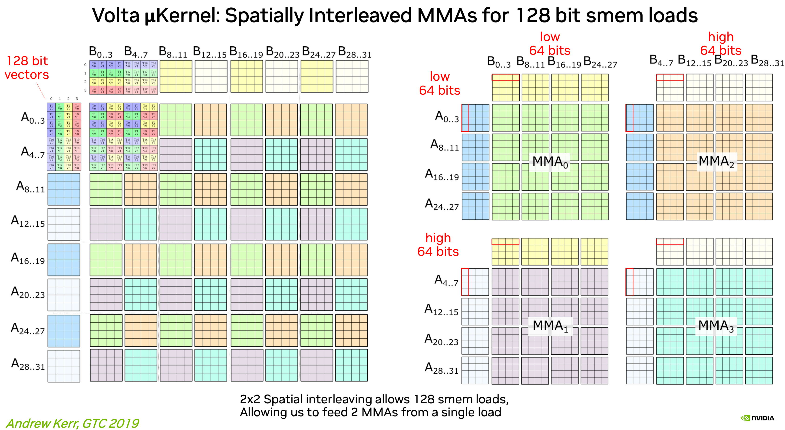

* **问题：Ad-hoc partitioning doesn’t scale**
  * **Problem 1: Complicated Partitioning Patterns**
    * Prevent us from writing canonical loops for all MMAs
  * **Problem 2: Programmer Managed Asynchrony**
    * GPUs require deeply async, managed, producer/consumer software pipelines
    * Feeding the tensor cores constantly is hard – requires managing asynchrony and deep software pipelines
    * With newer architectures like Hopper, even the MMA instruction is asynchronous
    * Concurrency programming - Writing kernels isn’t just about getting the layouts right anymore


##### 从 Ampere 到 Hopper

* WGMMA

  > https://research.colfax-intl.com/cutlass-tutorial-wgmma-hopper/
  >
  > https://docs.nvidia.com/cuda/parallel-thread-execution/index.html#asynchronous-warpgroup-level-matrix-instructions

  * 

  * https://docs.nvidia.com/cuda/parallel-thread-execution/index.html#asynchronous-warpgroup-level-matrix-instructions
    * 

* cute实现

  * 
  * 

* PTX
  * 
  * 


#### 通信：NVLink等

* 见「NCCL」

#### 计算：cuDNN

* Intro

  * cuDNN全称NVIDIA CUDA® Deep Neural Network library， 是一个用于深度神经网络的GPU加速库。

  * cuDNN包含了为神经网络中常见的计算任务提供高度优化的实现。包括前向卷积、反向卷积、注意力机制、矩阵乘法（matmul）、池化（pooling）和归一化（normalization）等。

  * cuDNN的最常见用途是在深度学习框架（如TensorFlow或PyTorch）的开发中。深度学习框架开发者在编写框架时，通常会调用cuDNN，从而几乎不直接与CUDA进行交互。而对于我们使用PyTorch做AI应用的终端用户来说，更没有机会使用cuDNN的。

* cuDNN和CUDA Toolkit的关系

  * CUDA Toolkit不包含cuDNN。CUDA Toolkit是一个更底层的工具包，其中的库是针对的是更基础的操作，比如线性代数中各种矩阵和向量的运算，还有用于文件I/O，支持在GPU上进行高性能文件操作等。而cuDNN是专门为深度学习的各种运算所设计的库，它需要使用CUDA Toolkit中的一些库。

#### 存储：GDS GPUDirect Storage

https://docs.nvidia.com/gpudirect-storage/index.html

https://docs.pytorch.org/tutorials/prototype/gpu_direct_storage.html

https://discuss.pytorch.org/t/feature-request-nvidia-gds-support-for-pytorch-iterabledataset-checkpointing/211945

#### 显卡驱动

* 英伟达的显卡驱动程序通常会随CUDA Toolkit一起安装。但是，这个驱动程序是为了开发目的而安装的。这意味着它主要用于开发和调试CUDA应用程序，以帮助开发人员在其工作站上进行开发和测试。这个驱动程序不建议在生产环境中与英伟达的GPU一起使用。在生产环境中，通常需要专门的、经过验证的驱动程序以确保系统的稳定性和性能。

#### 共享卡 GPU Fractionalization and Virtualization —— 如何实现算力和显存隔离

##### Intro

> GPU虚拟化 Intro https://blog.csdn.net/taxiidriver/article/details/144118627
>
> Running Multiple Models on the Same GPU, on Spot Instances https://www.youtube.com/watch?v=4tHr75KKIeU

* 隔离方式：时间片 vs 空间

  * timeslice sharing的问题在于：一张卡同一时间只能有一个cuda ctx，无法做到空分复用

* 隔离级别：不隔离 vs 强隔离 vs 弹性

* 几种隔离技术对比：
  * vGPU(Grid)(Nvidia)：虚拟化；容器化支持不好，licensing cost
  * vCuda(腾讯)：cuda hook；性能损耗严重
  * cGPU(Alibaba)：ioctl；损耗小，硬隔离，侵入内核（机器容易坏）
  * MPS(Nvidia)：thread；显存隔离、故障隔离不好
    * 进程级别，进程数量会受限于显存
  * MIG(~A100)：sm/global memory；硬件层面隔离

* GPU容器虚拟化技术

  * 阿里云 GPU Share：仅共享，无隔离
  * 火山引擎 mGPU：内核驱动层实现的 GPU 容器虚拟化技术
  * 腾讯云 qGPU

* 一些基础的观察：

  - 推理速度并不和计算资源大小成正比
    - 受限于 服务的并发能力、业务进程对GPU资源的利用能力（比如是否访存瓶颈）

  - GPU利用充分时，显存制约并发能力

    - 显存限制MPS进程数量

    - 模型量化能缓解显存瓶颈，放入更多模型，间接提升并发能力

  - 资源调度制约并发能力
    - e.g. MIG的资源粒度，最多7份

* 3 ways to accelerate applications:
  * Libraries    
  * OpenACC (add directive, for applications like HPC)
  * Programming Languages

##### Timeslicing

> p99延迟高


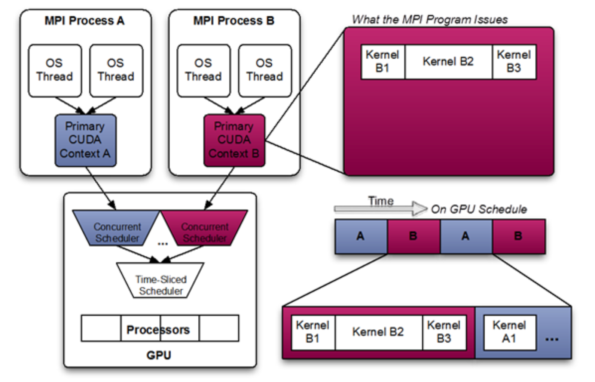

##### MIG

> - 算力隔离，不受相互干扰，相比虚拟化的方案，延迟更低
> - 兼容性
>   - 仅限于Ampere以后的旗舰系列（H100/H20/A100/A800/A30）
>   - 支持VM，容器
>   - 开启后不支持NVlink


* 新的多实例GPU（MIG）功能允许GPU（从NVIDIA Ampere架构开始）安全地划分为**最多七个单独的GPU实例**，用于CUDA应用程序，为多个用户提供单独的GPU资源，以实现最佳的GPU利用率。
  * 此功能对于没有完全饱和GPU计算能力的工作负载特别有益，因此用户可能希望并行运行不同的工作负载以最大限度地提高利用率。
* 对于具有多租户用例的云服务提供商（CSP），MIG除了为客户提供增强的隔离外，还确保一个客户端不会影响其他客户端的工作或调度。
  * 使用MIG，每个实例的处理器在整个内存系统中都有单独和隔离的路径——片上交叉端口、L2缓存库、内存控制器和DRAM地址总线都被唯一地分配给单个实例。这确保了单个用户的工作负载可以以可预测的吞吐量和延迟运行，具有相同的L2缓存分配和DRAM带宽，即使其他任务正在处理自己的缓存或使DRAM接口饱和。MIG可以对可用的GPU计算资源（包括流式多处理器或SM，以及复制引擎或解码器等GPU引擎）进行分区，为VM、容器或进程等不同客户端提供具有故障隔离的定义服务质量（QoS）。MIG使多个GPU实例能够在单个物理NVIDIA Ampere架构GPU上并行运行。
* 使用MIG，用户将能够在新的虚拟GPU实例上查看和安排作业，就像它们是物理GPU一样。MIG适用于Linux操作系统，支持使用Docker引擎的容器，支持使用红帽虚拟化和VMware vSphere等管理程序的Kubernetes和虚拟机。MIG支持以下部署配置：
  * 裸金属，包括容器
  * GPU在受支持的管理程序之上通过虚拟化传递给Linux客户机
  * vGPU位于受支持的管理程序之上

* MIG允许多个vGPU（以及虚拟机）在单个GPU上并行运行，同时保留vGPU提供的隔离保证。
* 收益：
  * 
  * 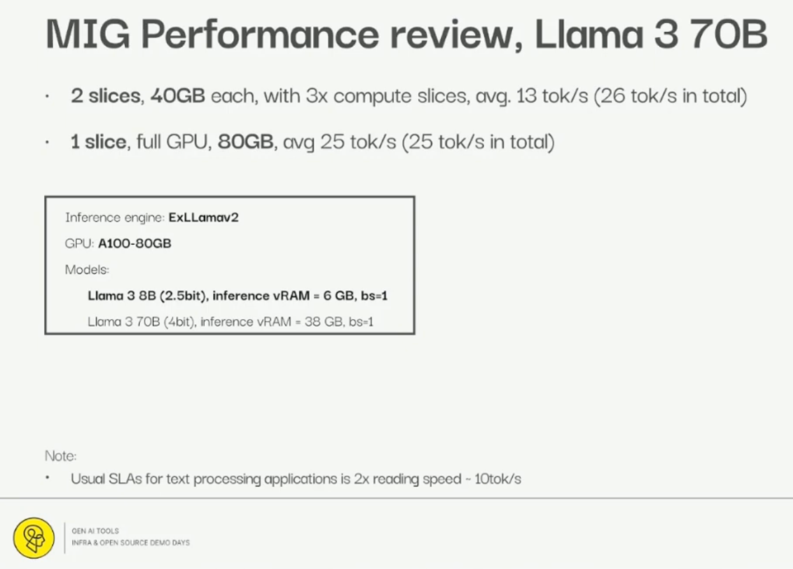

##### 阿里云 GPU Share

> [GPU Share](https://github.com/AliyunContainerService/gpushare-scheduler-extender) 
>
> 仅共享无隔离


##### 火山引擎 mGPU

> https://www.volcengine.com/docs/6460/132501
>
> 内核驱动层实现的 GPU 容器虚拟化技术

* Intro

  * 严格隔离：支持显存和算力的严格隔离，细粒度配置算力大小和算力占比，实现 GPU 资源利用率的最大化。

  - 兼容开放：支持 Volta、Turing、Ampere 等主流架构，适配标准开源的 Kubernetes。

  - 多维监控

  - 更优性能：支持动态调整时间片（timeslice），提高业务进程的吞吐量，进而获取更高的业务性能收益。


- 算力分配

  - 分配限制：0.01 GPU
    - 

  * 分配策略
    * 

- 在离线混布 https://www.volcengine.com/docs/6460/1450262
  - mGPU 在离线混部功能支持将在线任务和离线任务混合部署在同一张 GPU 卡上，在内核与驱动层面，实现离线任务 100% 利用闲置算力、在线任务 100% 抢占离线任务，从而进一步压榨 GPU 资源，把 GPU 使用成本降到最低。

##### 腾讯云 qGPU

> [Elastic GPU](https://github.com/elastic-ai) 项目，包含下列三个组件：

- [Elastic GPU Scheduler](https://github.com/elastic-ai/elastic-gpu-scheduler): GPU 共享调度 Scheduler Extender
- [Elastic GPU Agent](https://github.com/elastic-ai/elastic-gpu-agent): GPU 共享 Device Plugin
- [Elastic GPU Exporter](https://github.com/elastic-ai/elastic-gpu-exporter): 单机上的 GPU 监控采集组件
- [Elastic GPU](https://github.com/elastic-ai/elastic-gpu): 通过 CRD 管理 GPU 资源

##### 华为云 CCE

- [GPU虚拟化概述_云容器引擎 CCE_用户指南_Standard和Turbo集群用户指南_调度_GPU调度_GPU虚拟化](https://support.huaweicloud.com/usermanual-cce/cce_10_0644.html)
  - 单个GPU卡最多虚拟化成20个GPU虚拟设备。

##### MPS

> https://man.archlinux.org/man/extra/nvidia-utils/nvidia-cuda-mps-control.1.en
>
> - MPS的优势：
>   - 空分复用 替代 timeslice sharing
>   - 共享全局 cuda ctx，消除cuda ctx的切换开销、多个cuda ctx的存储开销
> - MPS的劣势：
>   - 显存隔离不好 --> 可通过流量侧限流控制
>   - 故障隔离不好 --> 需要业务侧建设完备的运维机制


* MPS is a binary-compatible client-server runtime implementation of the CUDA API which consists of several components:
  - **Control Daemon Process** – The control daemon is responsible for starting and stopping the server, as well as coordinating connections between clients and servers.
  - **Client Runtime** – The MPS client runtime is **built into the CUDA Driver library** and may be used transparently by any CUDA application.
  - **Server Process** – The server is the clients’ shared connection to the GPU and provides concurrency between clients.
* MPS Server  —— nvidia-cuda-mps-server
  * The MPS server creates the shared GPU context, and manages its clients.
  * An MPS server can support a finite amount of CUDA contexts determined by the hardware architecture it is running on.
* MPS Control —— nvidia-cuda-mps-control
  * When CUDA is first initialized in a program, the CUDA driver attempts to connect to the MPS control daemon. If the connection attempt fails, the program continues to run as it normally would without MPS. If however, the connection attempt to the control daemon succeeds, the CUDA driver then requests the daemon to start an MPS server on its behalf.
  * If there's an MPS server already running, and the user id of that server process matches that of the requesting client process, the control daemon simply notifies the client process of it, which then proceeds to connect to the server.
* 环境变量：
  * CUDA_MPS_PIPE_DIRECTORY
  * CUDA_MPS_ACTIVE_THREAD_PERCENTAGE：**控制sm的比例**
    * A more optimal strategy is to uniformly partition the portion by half of the number of expected clients (i.e., set active thread percentage to **100% / 0.5n**) to give the load balancer more freedom to overlap execution between clients when there are idle resources.
  * [CUDA_MPS_ENABLE_PER_CTX_DEVICE_MULTIPROCESSOR_PARTITIONING](https://docs.nvidia.com/deploy/mps/index.html#cuda-mps-enable-per-ctx-device-multiprocessor-partitioning)
* 运维细节：
  * 监控的时候需要同时监控nvidia-cuda-mps-control和对应的nvidia-cuda-mps-server. 原因如下:
    * Nvidia-cuda-mps-control 挂掉之后, 对应的 nvidia-cuda-mps-server会随着一起结束.
    * Nvidia-cuda-mps-server 出问题的时候, 并不影响nvidia-cuda-mps-control, 这个时候服务是处于不可控状态. 服务是异常的.

* DL Serving框架对MPS的支持
  * 见「snippets/gpu-mps.sh」

##### CUDA Green Context

> [SGLang 支持 CUDA Green Context](https://www.xiaohongshu.com/explore/68757047000000000b02dd21?app_platform=ios&app_version=8.86&share_from_user_hidden=true&xsec_source=app_share&type=normal&xsec_token=CBbLP3TUkUJ2rbc8p2ahs9MMMtK9_OshR_WS-aXR56eEY=&author_share=1&xhsshare=CopyLink&shareRedId=N0lEN0Y6Rk82NzUyOTgwNjc5OTg2NUpP&apptime=1761737262&share_id=6c31a6c4183d43d0b3ccf61d933e92bf)

* Green Contexts 是 CUDA Driver API 的新成员，允许开发者在一张物理 GPU 上，创建多个轻量级的、资源隔离的 CUDA execution contexts，每个 context 拥有一个指定的 SM 子集。 
  * 一个 SM 可以同时驻留多个 block（取决于 block 的资源需求是否允许，比如寄存器数、共享内存需求、warp 数等）
  * 一个 Block 必须完全驻留在单个 SM 上执行。
  * Green Contexts的意义在于，可以保证某些 kernel 永远不会互相抢占同一个 SM，也不会互相干扰，相当于给用户留了一个并发细粒度优化的口子。
* 优化思路： 
  * 不同 Green Contexts 对应的 kernel 可以在不同 stream 中异步提交，从而实现高效并发；
  * 单个 kernel 内部的 block/threads 配置应当匹配分配给 Context 的 SM 数；
  * 尽可能让数据局部性和 SM 绑定一致（如每个 SM 处理的数据块独立，避免全局乱跳）

#### DCGM

https://developer.nvidia.com/dcgm

https://on-demand.gputechconf.com/gtc/2018/presentation/s8505-gpu-monitoring-and-management-with-nvidia-data-center-gpu-manager-dcgm-v2.pdf

* Note:
  * 监控 PCIE-RX ---> H2D 带宽
  * Health Check

##### nvidia-smi

```shell
nvidia-smi
nvidia-smi --query-gpu=name --format=csv,noheader
```

#### OAM

* OAM是一种异构计算设备的接口协议，对标nvlink.   nvlink是封闭的协议，OAM是若干大厂共建的一个开放协议。
  * 目的：避免每一种卡都有自己的卡间通信标准，尽量做到 （除了NV的卡之外）任何厂家的计算卡都兼容
  * 技术层面， OAM 和 NVSWITCH （对应A100 这代） 基本是对等的 
    - OAM：是 full connect 模式， 各卡独享约 ~80GB/s 带宽 
      - full connect 的结构更为简单，有一些散热和能耗的优势
    - NV switch: 整个switch提供 600GB/s 带宽 
    - 单机八卡时，OAM 和 NV switch 差不多；卡数少时 nvsiwtch 效率高

### 机型 & 硬件 & 精度 & 吞吐 & 故障

#### 精度支持

* Int4
  * Blackwell GPUs will [no longer support int4 tensor cores](https://www.nvidia.com/en-us/data-center/tensor-cores/).

* fp8
  * FP8 GEMM Accumulation Precision in Tensor Cores：
    * After aligning 32 mantissa products by right-shifting based on the maximum
      exponent, the Tensor Core only uses the highest 14 bits of each mantissa product for addition, and truncates bits exceeding this range. The accumulation of addition results into registers also
      employs **14-bit mantissa precision**.


#### 浮点计算精度

* 浮点计算
  * 硬件机制：结合律可能不适用，大量累加的顺序，会有精度差异
    * python: `1.0 + (-1.0 + 1e-17 )`
    
    * 比如reduction操作
    
      * ```python
        # We'll use several small numbers that, when added together first, could show a difference
        numbers = [1e-20] * 10 + [1e20, -1e20]  # 10 small numbers followed by a large positive and negative number
        
        # Sum the list from left to right
        sum_left_to_right_adjusted = sum(numbers)
        
        # Sum the list from right to left
        sum_right_to_left_adjusted = sum(reversed(numbers))
        
        # 0.0 9.999999999999997e-20
        print(sum_left_to_right_adjusted, sum_right_to_left_adjusted)
        ```
    
  * cuDNN：
    * deterministic=True：尽量消除算子底层实现的随机性
    * benchmark=False：仅使用同一种卷积算法
    
  * 算子实现：随机采样

#### 吞吐

* 

* INT8加速比：
  * https://github.com/pytorch/ao/pull/748
  * a100加速比2，
  * 

#### Engegy Model


* 《1.1 computing’s energy problem (and what we can do about it)》
* 《PokeBNN: A binary pursuit of lightweight accuracy.》


#### 机型基础

* Nvidia GPU的算力([Compute Capability](https://docs.nvidia.com/cuda/cuda-c-programming-guide/index.html#compute-capability)), 只是一个版本号, 用来表示核心架构. 一般用`X.X`的方式表示, 第一位是主版本号, 第二位是次版本号, 如下:

| 架构                                                         | 算力 | 上市时间 | 产品                                                         | NVLink                                                       | NVSwitch                     | PCIe              |
| ------------------------------------------------------------ | ---- | -------- | ------------------------------------------------------------ | ------------------------------------------------------------ | ---------------------------- | ----------------- |
| [Blackwell](https://resources.nvidia.com/en-us-blackwell-architecture/blackwell-architecture-technical-brief) |      |          |                                                              |                                                              |                              |                   |
| [Ada](https://images.nvidia.com/aem-dam/Solutions/Data-Center/l4/nvidia-ada-gpu-architecture-whitepaper-V2.02.pdf) |      |          | L40、L4                                                      |                                                              |                              |                   |
| Hopper architecture (霍普)                                   | 9    |          | H100, 训练卡                                                 | 3td-NVLink, SXM2/SXM4900GB/s最多18个                         | 3td-NVSwitch: 900GB/s最多8个 |                   |
| [Ampere architecture ](https://images.nvidia.com/aem-dam/en-zz/Solutions/data-center/nvidia-ampere-architecture-whitepaper.pdf) | 8    | 2020     | A100, 训练卡, 80G HBM2e 显存 19.5 TFLOPS Cuda Cores: 6912 Tensor Cores: 432, 108 SMs; | 3td-NVLink, SXM2/SXM3 600GB/s最多12个                        | 2nd-NVSwitch: 600GB/s最多8个 | PCIe Gen4 64 GB/s |
| Turing architecture (图灵)                                   | 7.5  | 2018     | T4, 推理卡, 16GB GDDR6 显存 8.1 TFLOPS Cuda Cores: 2560 Tensor Cores: 320 |                                                              |                              | PCIe Gen332 GB/s  |
| Volta architecture (伏特)                                    | 7    | 2017     | V100, 训练卡, 24G HBM2显存14~16.4 TFLOPSCuda Cores: 5120Tensor Cores: 640 | 2nd-NVLink, SXM2300GB/s最多6个                               | 1st-NVSwitch: 300GB/s最多8个 | PCIe Gen332 GB/s  |
| Pascal architecture (帕斯卡)                                 | 6    | 2016     | P100, 训练卡, 16G HBM2显存 9.3 ~ 10.6 TFLOPSCuda Cores: 3840P40, 训练卡, 24G GDDR5 显存P4, 推理卡, 8G GDDR5 显存 | 1st-NVLink, SXMP100: 732 GB/s160 GB/sP40: 346 GB/sP4: 192 GB/s |                              | PCIe Gen332 GB/s  |
| Maxwell architecture (麦克斯韦)                              | 5    | 2014     | M40, M60                                                     |                                                              |                              |                   |
| Kepler architecture (开普勒)                                 | 3    | 2010     | K10, K20, K40, K80                                           |                                                              |                              |                   |
| Fermi architecture (费米)                                    | 2    | 2010     |                                                              |                                                              |                              |                   |
| Tesla architecture (特斯拉)                                  | 1    | ~        |                                                              |                                                              |                              |                   |

* 大卡和小卡
  
  * 主要差异是显存带宽、互联带宽，因此大卡用于训练，小卡训练+推理
  
  * 大卡：H20/H100/H800/H200/A100/A800
  
  * 小卡：L20/L40S/L40/A30/A10/T4/V100
  
* Nvidia GPU 产品根据使用场景不同分为不同的序列:
  
  - GeForce: 用于家庭和个人电脑，包括游戏和娱乐等;
    - **前缀**: 显卡档次与代号. GT: 频率提升版本; GS: GT的缩减版，级别在GT之后; GTX: 一般可以理解为GT eXtreme，代表了极端、极致的意思; GTS: GTX的缩减版，级别在GTX之后. RTX-> GTX > GTS > GT > GS
    - **数字**: 例如1060, 10代表的是第几代, 6代表显卡性能档次的定位
    - **后缀**: SE的意思是阉割版, TI表示增强版, M表示移动端, LE表示
  - Quadro: 用于工业渲染、艺术设计，工作站等场合
  - Tesla: 用于科学计算，深度学习加速等场景, 对于15年以后的产品, 一般或以省去Tesla, 或用NVIDIA代替, 如P100, T4, V100, A100等.
  
  GPU的Compute Capability与CUDA版本不是同一回事, 后者是开发套件的版本. 
  
  
  
  
  

##### H20

* ```
  * SM Version: 900 (PTX Version: 900)
  * Number of SMs: 78
  * SM Default Clock Rate: 1980 MHz
  * Global Memory: 97149 MiB Free / 97508 MiB Total
  * Global Memory Bus Peak: 4022 GB/sec (6144-bit DDR @2619MHz)
  * Max Shared Memory: 228 KiB/SM, 48 KiB/Block
  * L2 Cache Size: 61440 KiB
  * Maximum Active Blocks: 32/SM
  * Maximum Active Threads: 2048/SM, 1024/Block
  * Available Registers: 65536/SM, 65536/Block
  * ECC Enabled: Yes
  ```

##### H100

* 132 SMs with 64 cores per SM, totalling a whopping 8448 cores.
* each SM can handle 32 blocks, 64 warps (i.e., 2048 threads), and 1024 threads per block.

##### [A10 v.s. A10G](https://www.baseten.co/blog/nvidia-a10-vs-a10g-for-ml-model-inference/)

* The A10 is an Ampere-series datacenter GPU well-suited to many model inference tasks, such as running seven billion parameter LLMs. However, AWS users run those same workloads on the A10G, a variant of the graphics card created specifically for AWS. The A10 and A10G have somewhat different specs — most notably around tensor compute — but are interchangeable for most model inference tasks because they share the same GPU memory and bandwidth, and most model inference is memory bound.
* the A10 prioritizes tensor compute, while the A10G has a higher CUDA core performance
* 根据ops_to_byte分析是compute bound还是memory bound
  * arithmetic_intensity (Llama 2 7B, Single-Headed Attention Operation)
        ~= total compute / total memory movement
        = 4d(N^2) + 3N^2 ops / 8N^2 + 8Nd bytes
        = 62 ops/byte
* [A guide to LLM inference and performance](https://www.baseten.co/blog/llm-transformer-inference-guide/) TODO


##### A100

* GPU
  * GPU Memory：80 GB
  * GPU Memory Bandwidth：2039 GB/s
  * https://developer.nvidia.com/blog/nvidia-ampere-architecture-in-depth/
  * 192KB of on-chip SRAM per each of 108 SMs
  * Float32 Tensor Core：156 TFlops
  * Float16 Tensor Core：314 TFlops
  * Float32 CUDA Core：19.5 TFlops
* CPU：2 socket
  * 内存TB级别
* Interconnect：
  * NVLink：600GB/s （50GB/s，12 links）
  * PCIe Gen4: 64GB/s

* 《Dissecting the Ampere GPU architecture via microbenchmarking》
* 《Nvidia A100 tensor core GPU architecture》

##### V100

* https://datacrunch.io/blog/nvidia-v100-gpu-specs
* roofline: 125/0.9 =139FLOPS/Byte

##### GA10x

RTX 3090, has 82 SMs.

* Each SM in GA10x GPUs contain 128 CUDA Cores, 4 third-generation Tensor Cores, 2 FP64 Cores
  * a 256 KB Register File, and 128 KB of L1/Shared Memory
  * 4*32 FP32 units (one per thread), half  of which know INT32
  * L1 cache and shared memory share hardware (128KB) directly on the SM shmem can be 0/8/16/32/64/100KB
    * L1 Cache the remainder (>=28KB)

* 

##### 晟腾 950

* https://www.toutiao.com/article/7551253505684554278/
  * 950PR 提升推理 Prefill 性能，提升推荐业务性能，搭载自研 HBM——HiBL 1.0
  * 950DT 提升推理 Decode 性能，提升训练性能，提升内存容量和带宽。
  * 
  * 


##### 显存一览


* H20: 96G
* L40: 48G

##### 显存带宽

* NVIDIA H100 (SXM5 with HBM3) 带宽估算:

  - 显存类型 : HBM3
  - 显存位宽 (Memory Interface Width) : 5120-bit
  - HBM3 等效数据速率 (Effective Data Rate per pin) : 约 5.2 GT/s (GigaTransfers per second) 或更高，具体取决于 SKU，以达到约 3.35 TB/s 的总带宽。
  - 带宽计算 :
    带宽 (GB/s) = (显存位宽 (bits) / 8 bits/Byte) * 等效数据速率 (GT/s)

    代入 H100 的数值 (以 5.2 GT/s 为例进行说明)： (5120 bit / 8 bits/Byte) * 5.2 GT/s = 640 Bytes/Transfer_cycle * 5.2 * 10^9 Transfers/sec = 3328 * 10^9 Bytes/sec = 3328 GB/s = 3.328 TB/s

* G80 GPU （2006）

  * 384-bit memory interface（数据总线位数）, 900 MHz DDR
  * 384 * 1800 / 8 = 86.4 GB/s
    * 由于DDR的时钟脉冲上升沿和下降沿都传输数据，因此倍增系数为2

##### 内存带宽

* A30: 400GB/s / 4卡 = 100GB/s
* Ascend 910B：550GB/s / 16卡 = 34GB/s


#### 硬件降频

* 聊一聊英伟达GPU的降频问题 https://zhuanlan.zhihu.com/p/13866293937

#### 故障率 0.5% 以上

* https://www.pugetsystems.com/labs/articles/puget-systems-most-reliable-hardware-of-2024

##### CUDA_ERROR_ECC_UNCORRECTABLE

* nvidia-smi -q -d ECC
* ECC (Error-Correcting Code) 是一种内存技术，常见于服务器和数据中心级的高端 GPU。它能够自动检测并 纠正 内存中发生的轻微数据错误（比如由宇宙射线或电磁干扰导致的比特翻转）。


### 新硬件架构

#### Ampere

* Ampere GPU 新增了 *LDGSTS* 指令，数据块从Global Memory 到Shared Memory 的过程不需要经过中间寄存器，可以进一步的优化SGEMM 的性能

#### Hopper

> [GPU Mode Lecture 23](https://www.youtube.com/watch?v=hQ9GPnV0-50) 的第二部分

##### Thread Block Group

* Intro
  * 

* 硬件视角：Hopper中，每个GPC大概相当于一张Kepler架构的显卡
  * 

* DSHEM
  * 

##### Async Barriers

* 核心是理解"Independent Work" ：
  * 它 不依赖 于其他线程是否完成了它们的 "Produce Data" 阶段
  * 而 "Consume Data" 阶段通常 依赖 于所有线程都完成了 "Produce Data"。
* cuda::barrier
* 硬件支持
  * ampere: spin wait
  * hopper：fast sync


##### Async Transaction Barriers


##### TMA

> TENSOR MEMORY ACCELERATOR UNIT (TMA) FOR ASYNC DATA MOVEMENT

* 历史
  * ampere之前，从global memory到shared memory，需要经过registers
  * Ampere GPU 新增了 *LDGSTS* 指令，数据块从Global Memory 到Shared Memory 的过程不需要经过中间寄存器，可以进一步的优化SGEMM 的性能
* 特点：
  * bi-directional
  * DSMEM相关
  * aware of tensor (strides...)
  * async transaction barrier


##### TensorCore

参考「计算：tensorcore」

##### Case Study: Hopper GEMM

> Reading material :
>
> • https://github.com/NVIDIA/cutlass/blob/main/media/docs/cute/
>
> • https://www.nvidia.com/en-us/on-demand/session/gtcspring23-s51413/
>
> • https://www.nvidia.com/en-us/on-demand/session/gtc24-s61198/
>
> • https://github.com/NVIDIA/cutlass/pull/1578

* 概念
  * 多播 (Multicast) ：多播是一种通信模式，其中数据从单一源发送到一组特定的目标接收者。在GPU上下文中，这意味着从全局内存加载的数据块可以被多个计算单元（如线程块）共享，而不是每个单元都独立去全局内存读取相同的数据。


* deep software pipelining of loads via shared memory
  * 能work的必要因素：1.MMA运算飞快，因此需要加速load data；2.cache足够大
  * 什么是deep or short pipelining？
    * deep ～ 数据多 ～ L2 cache
    * short ～ 数据少 ～ shared memory


* 进阶优化
  * 

* 高阶优化
  * Optimal ThreadBlock rasterization & swizzling
    * Encourages exploitation of locality
    * https://github.com/NVIDIA/cutlass/blob/main/media/docs/efficient_gemm.md#threadblock-rasterization
  * Stream-K scheduling
    * Finding the optimal Trade-off between occupancy and efficiency
    * https://arxiv.org/abs/2301.03598
  * Efficient Input transformations prior to MMA
    * Optimizing for register usage
    * Pipelined RS kernels
    * https://github.com/NVIDIA/cutlass/blob/main/include/cutlass/gemm/collective/sm90_mma_tma_gmma_rs_warpspecialized.hp
  * Optimal instruction sequence generation
    * Prefetching, Cache management

* 

* 


##### Case Study: Persistent Ping-Pong GEMM

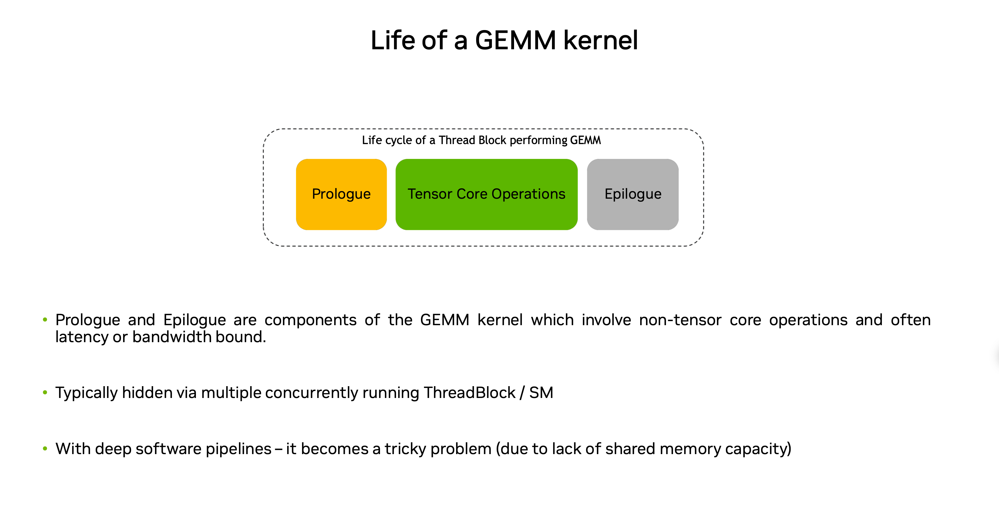


#### Blackwell

https://www.nvidia.com/en-us/data-center/technologies/blackwell-architecture/


### CUDA

> Nvidia Lecture 1: Accelerating Applications with CUDA C/C++
>
> [课程网页](https://courses.nvidia.com/courses/course-v1:DLI+C-AC-01+V1/courseware/85f2a3ac16a0476685257996b84001ad/9ef2f68fb10d40c5b54b783392938d04/?activate_block_id=block-v1%3ADLI%2BC-AC-01%2BV1%2Btype%40sequential%2Bblock%409ef2f68fb10d40c5b54b783392938d04)

#### Intro

* CUDA：Compute Unified Device Architect
  * CUDA C: extends ANSI C with minimal new  syntax

* CUDA accelerates applications drastically with little effort, has an ecosystem of highly optimized libraries for [DNN](https://developer.nvidia.com/cudnn), [BLAS](https://developer.nvidia.com/cublas), [graph analytics](https://developer.nvidia.com/nvgraph), [FFT](https://developer.nvidia.com/cufft), and more, and also ships with powerful [command line](http://docs.nvidia.com/cuda/profiler-users-guide/index.html#nvprof-overview) and [visual profilers](http://docs.nvidia.com/cuda/profiler-users-guide/index.html#visual).
* CUDA supports many, if not most, of the [world's most performant applications](https://www.nvidia.com/en-us/data-center/gpu-accelerated-applications/catalog/?product_category_id=58,59,60,293,98,172,223,227,228,265,487,488,114,389,220,258,461&search=) in, [Computational Fluid Dynamics](https://www.nvidia.com/en-us/data-center/gpu-accelerated-applications/catalog/?product_category_id=10,12,16,17,19,51,53,71,87,121,124,156,157,195,202,203,204,312,339,340,395,407,448,485,517,528,529,541,245,216,104,462,513,250,492,420,429,490,10,12,16,17,19,51,53,71,87,121,124,156,157,195,202,203,204,312,339,340,395,407,448,485,517,528,529,541,245,216,104,462,513,250,492,420,429,490,10,12,16,17,19,51,53,71,87,121,124,156,157,195,202,203,204,312,339,340,395,407,448,485,517,528,529,541,245,216,104,462,513,250,492,420,429,490&search=), [Molecular Dynamics](https://www.nvidia.com/en-us/data-center/gpu-accelerated-applications/catalog/?product_category_id=8,57,92,123,211,213,237,272,274,282,283,307,325,337,344,345,351,362,365,380,396,398,400,435,507,508,519,8,57,92,123,211,213,237,272,274,282,283,307,325,337,344,345,351,362,365,380,396,398,400,435,507,508,519,8,57,92,123,211,213,237,272,274,282,283,307,325,337,344,345,351,362,365,380,396,398,400,435,507,508,519,8,57,92,123,211,213,237,272,274,282,283,307,325,337,344,345,351,362,365,380,396,398,400,435,507,508,519&search=), [Quantum Chemistry](https://www.nvidia.com/en-us/data-center/gpu-accelerated-applications/catalog/?product_category_id=8,57,92,123,211,213,237,272,274,282,283,307,325,337,344,345,351,362,365,380,396,398,400,435,507,508,519,8,57,92,123,211,213,237,272,274,282,283,307,325,337,344,345,351,362,365,380,396,398,400,435,507,508,519&search=), [Physics](https://www.nvidia.com/en-us/data-center/gpu-accelerated-applications/catalog/?product_category_id=6,24,116,118,119,135,229,231,372,373,392,393,489,493,494,495,496,497,498,67,170,216,281,6,24,116,118,119,135,229,231,372,373,392,393,489,493,494,495,496,497,498,67,170,216,281,6,24,116,118,119,135,229,231,372,373,392,393,489,493,494,495,496,497,498,67,170,216,281,6,24,116,118,119,135,229,231,372,373,392,393,489,493,494,495,496,497,498,67,170,216,281,6,24,116,118,119,135,229,231,372,373,392,393,489,493,494,495,496,497,498,67,170,216,281&search=) and HPC.

#### Programming Model

##### CUDA Thread Hierarchy


* Programming model: SIMT
  * 三层抽象：grid, block, thread

* Kernel Execution

  * configuration ~ grid
  * block: Each block is executed by one SM and does not migrate.
    * Several concurrent blocks can reside on one SM depending on block’s memory requirement and the SM’s memory resources.

  * thread：uniquely identified by threadIdx和blockIdx
    * Idea: map threads to multi-dimensional data
    * At a high level, execution configuration allows programmers to specify the **thread hierarchy** for a kernel launch, which defines the number of thread groupings (called **blocks**), as well as how many **threads** to execute in each block.


```
gridDim.x: num of blocks
blockDim.x: num of threads in a block
blockIdx.x: block index
threadIdx.x: thread index
```

* [Grid-Stride Loops](https://developer.nvidia.com/blog/cuda-pro-tip-write-flexible-kernels-grid-stride-loops/)
  * By using a loop with stride equal to the grid size, we ensure that all addressing within warps is unit-stride, so we get [maximum memory coalescing](https://developer.nvidia.com/blog/parallelforall/how-access-global-memory-efficiently-cuda-c-kernels/), just as in the monolithic version.
  * 所有warp同步寻址都是在一个grid里，这是最大显存聚合


```cpp
__global__ void kernel(int *a, int N)
{
  int indexWithinTheGrid = threadIdx.x + blockIdx.x * blockDim.x;
  int gridStride = gridDim.x * blockDim.x;

  for (int i = indexWithinTheGrid; i < N; i += gridStride)
  {
    // do work on a[i];
  }
}
```

##### 


##### Warp Specialization

* 《Singe: Leveraging Warp Specialization for High Performance on GPUs》
* DeepSeek-V3用上了
* pytorch的使用：https://pytorch.org/blog/warp-specialization/


#### Host and Device Code


* 细节：
  * CUDA Kernel argument space has a max limit of 4KB
  * [cudaDeviceSynchronize只需要在使用cudaStream时使用](https://stackoverflow.com/questions/11888772/when-to-call-cudadevicesynchronize)，平时“Although CUDA kernel launches are asynchronous, all GPU-related tasks placed in one stream (which is the default behavior) are executed sequentially.”


##### synchronize的情形

* 

* 


#### CUDA Driver & Runtime

* cuda driver API
  * `libcuda.so`（随驱动安装）
  * driver API更繁琐，但是更加底层
  * OpenAI Triton 直接通过`libcuda.so`调用驱动，直接把Python代码翻译成驱动可执行的cubin程序
    * https://github.com/triton-lang/triton/blob/main/third_party/nvidia/backend/driver.py
* cuda runtime API
  * `libcudart.so`（随cudatoolkit安装）
  * runtime API使用更方便，但是无法控制一些底层细节

#### CUDA Compiler

[**NVIDIA CUDA Compiler**](http://docs.nvidia.com/cuda/cuda-compiler-driver-nvcc/index.html), [documentation](http://docs.nvidia.com/cuda/cuda-compiler-driver-nvcc/index.html)

* nvcc (NVIDIA C compiler) is used to compile kernels into PTX
  * [`arch` flag](http://docs.nvidia.com/cuda/cuda-compiler-driver-nvcc/index.html#options-for-steering-gpu-code-generation)
    * 使用 `-gencode arch=compute_XX,code=sm_YY` 这样的语法，你可以让 nvcc 生成针对虚拟架构 compute_XX 的 PTX 代码，并且同时为真实架构 sm_YY 生成 SASS。
    * PTX用于前向兼容性，SASS用于最佳性能

  * [virtual architecture features](http://docs.nvidia.com/cuda/cuda-compiler-driver-nvcc/index.html#gpu-feature-list) 

* Parallel Thread Execution (PTX) is a low-level VM & instruction set
* graphics driver translates PTX into executable binary code (SASS)

* 编译流程：device & host code separation
  * 
  * 
  * 


#### CUDA Libraries (called from device)

* CUTLASS、Thrust、CUB

#### CUDA Context

> https://zhuanlan.zhihu.com/p/694214348

* 当一个进程在CPU上运行时，操作系统会维护这个进程的状态，包括已经分配的内存及其地址、打开的文件、使用的硬件等资源。相对应的，当一个进程要使用GPU时，GPU也必须为该进程维护这些状态。这就是cuda context。
  * 
* 不同之处在于：
  * 一个进程在操作系统里的状态只有一份（保存在内存中），而一个进程在多个GPU里都可能有一些状态。
  * 更确切地说：**每一个进程在每一个GPU上都可以有多个cuda context，但最多只能有一个current context**。
* cuda API的参数并不包括cuda context，而是依赖于**current context**的概念，所有的cuda API调用，都是针对current context而言的。
  * 在cuda driver API中，我们可以通过`cuCtxCreate/cuCtxDestroy`函数来创建、销毁cuda context，`cuCtxPushCurrent/cuCtxPopCurrent`来操作cuda context stack，`cuCtxSetCurrent`则是直接把栈顶的cuda context进行替换，`cuCtxGetCurrent`是获取栈顶的cuda context。一些小细节：`cuCtxCreate`不仅会创建cuda context，而且会`cuCtxPushCurrent`，也即创建并置于栈顶；同样的，`cuCtxDestroy`不仅会销毁，也会将cuda context从栈中弹出。
  * 为了节省显存，一般来说大家都不会在每个线程创建cuda context，**也不会在一个设备上创建多个cuda context**。于是cuda新增了primary context的概念，**每个进程在每个GPU上最多有一个primary context**。相应的API是`cuDevicePrimaryCtxRetain/cuDevicePrimaryCtxRelease`
    * 实际上一个设备可以多个cuda context
    * runtime API收回了cuda context管理的权限，整个进程在一个设备上最多只有一个primary cuda context。只要没有人调用`cudaDeviceReset`，就不会出现问题。
* cuda context对代码设计细节的影响
  * 由于一个cuda context就要300MB+显存，因此我们需要尽可能减少cuda context。由此带来的重要的设计细节就是：**尽量不要让多个进程操作同一个GPU**。否则会带来频繁的cuda context切换

#### async execution, memory models, unified memory

> https://www.irisa.fr/alf/downloads/collange/cours/hpca2020_gpu_2.pdf

##### async execution

* Direct Memory Access (DMA) copy engine runs CPU-GPU memory transfers in background
  * Requires page-locked memory
    * cudaMallocHost
    * Fixed virtual→physical mapping


##### CUDA Streams

> https://developer.download.nvidia.com/CUDA/training/StreamsAndConcurrencyWebinar.pdf

* 核心是一个GPU stream上执行的kernel，必定**按issue提交的顺序执行**
  * Kernels within any single stream must execute in order
  * Kernels in different, non-default streams can interact concurrently
  * The default stream is special: it blocks all kernels in all other streams 
    * 这一规则有副作用，因此推荐用non-default streams

* concurrency的要求
  * CUDA operations must be in different, **non-0**, streams
  
  * cudaMemcpyAsync with host from 'pinned' memory
    * Page-locked memory
  
    * Allocated using cudaMallocHost() or cudaHostAlloc()
  
  * Sufficient resources must be available
    * cudaMemcpyAsyncs in different directions
    * Device resources (SMEM, registers, blocks, etc.)
  
* Note:
  * Concurrency can be disabled with environment variable CUDA_LAUNCH_BLOCKING

  * It is difficult to get more than 4 kernels to run concurrently

  * `cudaStreamQuery` can be used to separate sequential kernels and prevent delaying signals

  * Kernels using more than 8 textures cannot run concurrently

  * Switching L1/Shared configuration will break concurrency

  * To run concurrently, CUDA operations must have no more than 62 intervening CUDA operations
    * That is, in 'issue order' they must not be separated by more than 62 other issues

    * Further operations are serialized

  * `cudaEvent_t` is useful for timing, but for performance use `cudaEventCreateWithFlags ( &event, cudaEventDisableTiming )`

* 缺点：
  * SM的碎片问题
    * 
  * CPU端编程的issue order会影响并行效果
    * 
  * delaying signal的现象
    * 

* e.g.
  * nbody-raw.cu -> nbody-optimized.cu
* 相关design：
  * one stream one memory pool的设计
    * 内存的“逻辑释放”（返回给分配器池）可以早于其“物理空闲”（GPU上使用它的最后一个操作执行完毕），减小内存碎片


##### Memory Order

> - 官方Doc：https://docs.nvidia.com/cuda/parallel-thread-execution/index.html#memory-consistency-model
> - 从实现角度的详细讲解可参考：
>   - The One-Decade Task: Putting std::atomic in CUDA. - Olivier Giroux - CppCon 2019 https://www.youtube.com/watch?v=VogqOscJYvk

* GPU中的Inter-thread/inter-warp communication
  * 

* atomics
  * 

* **Nvidia GPU默认是relaxed consistency model**
  * 

* thread fence
  * 

* fp下，atomic会导致同一机器+runtime params时的精度差异
  * 

* **Triton Atomic Memory Order 默认是 acquire-release**
  - https://triton-lang.org/main/python-api/generated/triton.language.atomic_add.html
* CCCL
  * The class template `cuda::atomic_ref` is an extended form of [cuda::std::atomic_ref](https://en.cppreference.com/w/cpp/atomic/atomic_ref) that takes an **additional** **[cuda::thread_scope](https://nvidia.github.io/cccl/libcudacxx/extended_api/memory_model.html#libcudacxx-extended-api-memory-model-thread-scopes)** **argument**, defaulted to `cuda::std::thread_scope_system`.
    - https://nvidia.github.io/cccl/libcudacxx/extended_api/synchronization_primitives/atomic_ref.html
* 应用
  * CUDA programming guide says that *atomicAdd has relaxed memory semantics*.
  * 
* 


#### CUDA Graph

* 从events到graph


* **Limitations of scheduling task graphs with streams**
  * **Sub-optimal scheduling : GPU runtime has no vision of tasks ahead**
  * **Must pay various initialization overheads when launching each task**
* New alternative since CUDA 10.0: cudaGraph API
  * **Build an in-memory representation of the dependency graph offline**
  * **Let the CUDA runtime optimize and schedule the task graph**
  * **Launch the optimized graph as needed**
* Two ways we can build the dependency graph
  * Record a sequence of asynchronous CUDA calls Describe the graph explicitly
    * Supports any number of streams (except default stream 0) 
      * Follows dependencies to other streams through events
      * Capture all streams that have dependency with first captured stream
    * Need all recorded calls to be asynchronous and bound to a stream
      * CPU code needs to be asynchronous to be recorded too!
      * `cudaLaunchHostFunc`
  * Describe the graph explicitly

#### 应用：VLLM Piecewise CUDA Graph

> https://mp.weixin.qq.com/s/JCzBtIAMVOiNtisHxZBTUw

* prefill阶段的attn隔离掉（因为变长），对剩下的其它算子做cuda graph


#### CUDA cooperative group 协作线程组


```c++
namespace cooperative_groups{
class thread_group{
public:
  __device__ unsigned int size() const;
  __device__ unsigned int thread_rank() const;
  __device__ void sync() const;
};
  
thread_block myblock = this_thread_block();
// intra-block groups
thread_group tile32 = tiled_partition(myblock, 32);
thread_group tile4 = tiled_partition(tile32, 4);
thread_block_tile<8> tile8 = tiled_partition<8>(this_thread_block());


// Warp collectives

template <unsigned int Size>
class thread_block_tile : public thread_group{
public:
  __device__ unsigned int size() const;
  __device__ unsigned int thread_rank() const;
  __device__ void sync() const;
  
  // Shuffle collectives
  __device__ int shfl(int var, int srcRank) const;
  __device__ int shfl_down(int var, unsigned int delta) const;
  __device__ int shfl_up(int var, unsigned int delta) const;
  __device__ int shfl_xor(int var, unsigned int laneMask);
  
  // Vote collectives
  __device__ int any(int predicate) const;
  __device__ int all(int predicate) const;
  __device__ unsigned int ballot(int predicate) const;
  
  // Match collectives
  __device__ unsigned int match_any(int val);
  __device__ unsigned int match_all(int val, int &pred);
}; 
}
```


#### 关于 Mega Kernel

* 收益：
  * L2 cache传输数据而不是HBM传输
* 难点：
  * SM occupancy
    * register spillover
  * code composability
  * 需要精心编排：cache访问、warp任务
  * 多stage时，单stage的同步：
    * GPU限制，无法一次同步mega kernel的全部threads，只能同步block内的threads
    * --> 需要event-driven的design，比如用一个变量表示stage，会有开销
* nvidia：Persistent Kernel

#### Case Study: Matmul

> Snippets/gpu-ops/triton-matmul.py

* Cutlass implementation of matrix multiplication on A100
  * https://developer.download.nvidia.com/video/gputechconf/gtc/2020/presentations/s21745-developing-cuda-kernels-to-push-tensor-cores-to-the-absolute-limit-on-nvidia-a100.pdf

#### Case Study: Fp8 GEMM

* For fp8 training, follow the CUTLASS FP8 recipe that does higher precision accumulation
* For fp8 quant/dequant, see CUTLASS epilogues fusing amax and aux tensors

- amax :
- amax 是 "absolute maximum" 的缩写，即 绝对最大值 。
- aux tensors (auxiliary tensors) : 在 fp8 量化/反量化以及 CUTLASS epilogue（尾声）的上下文中，这些辅助张量可能包含多种数据，用于支持量化过程或与 GEMM 结果相关的其他融合操作。例如：
  - 缩放因子 (Scale factors) : 可能直接存储预计算的或根据 amax 动态计算出的缩放因子。这些缩放因子可能是逐张量、逐通道或更细粒度的。
  - 零点 (Zero-points) : 某些量化方案除了缩放因子外，还会使用零点偏移。这些零点值可以存储在辅助张量中。
  - 偏置张量 (Bias tensors) : 如果偏置加法操作被融合到 epilogue 中，偏置项会存储在这里。
  - 其他元数据或中间结果 : 对于更复杂的 epilogue 操作（例如，反量化后立即进行激活函数计算，然后再量化），可能需要辅助张量来存储中间计算结果或下一阶段操作所需的参数。


#### Case Study: Reduce

> GPU Mode Lecture 9: Reductions https://www.youtube.com/watch?v=09wntC6BT5o
>
> cuda lecture：https://www.youtube.com/watch?v=D4l1YMsGNlU&t=1763s

* 什么是reduction

  * min, max, argmax, argmin, norm, sum, prod, mean, unique

  * ```python
    def reduce(data, identity, op):
        result = identity
        for element in data:
            result = op(result, element)
        return result
    ```

  * 应用：
    * Mean/Max pooling
    * Classification: Argmax
    * Loss calculations
    * Softmax、normalization

* parallel reduction tree
  * inactive warps
  
* resources/cuda-reduction.pdf
  
  * Parallel Reduction
  * Problem: Global Synchronization
    * Solution: decompose into multiple kernels
      * Kernel launch serves as a global synchronization point
      * Kernel launch has negligible HW overhead, low SW overhead
    * Solution: Kernel Decomposition
      * Recursive kernel invocation
  
* use [CUB](https://nvidia.github.io/cccl/cub/) to accelerate the reduce operations

#### Case Study: Scan

> GPU Mode Lecture 20、21、24

##### Intro

* 定义
  * 

* 意义：
  * 
* 应用：
  * exclusive scan的应用：partition split
  * min/max的应用：heap结构
* 结论：
  * 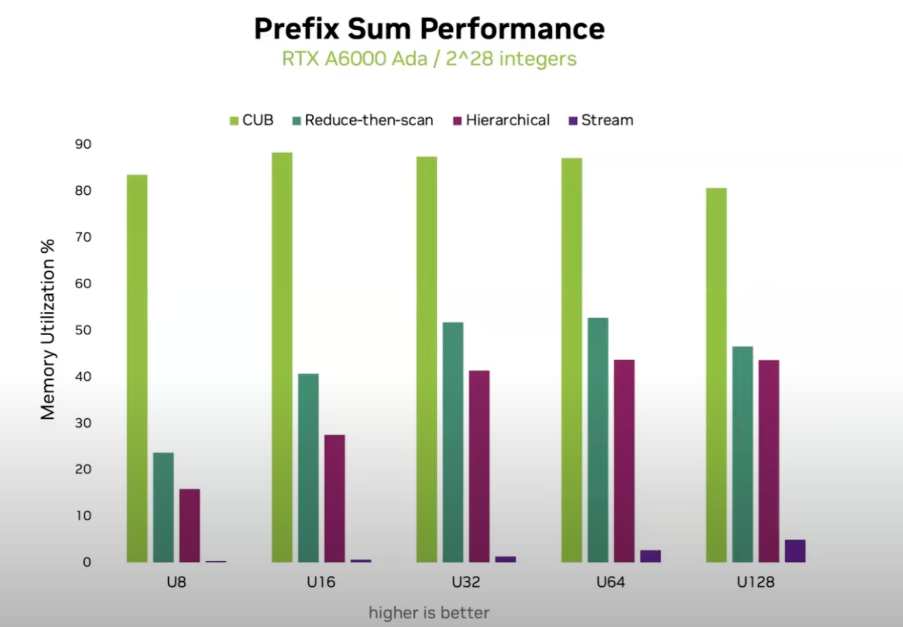
  

##### Segmented Scan

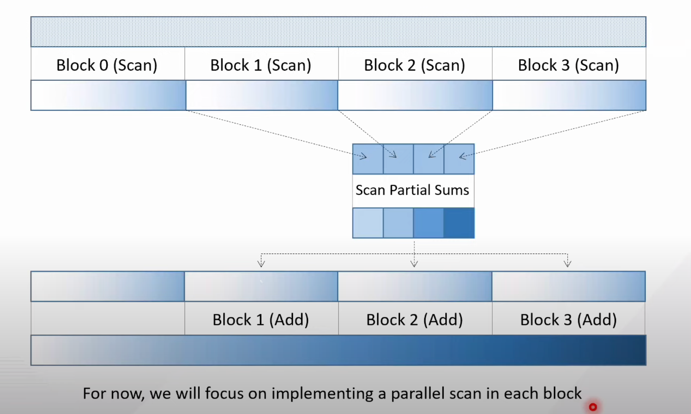

##### Kogge-Stone Parallel Scan

* 多次执行reduction tree


* Kogge-Stone Parallel Scan
  * 细节：避免同步读写，需要先读再sync再写再sync
  * 优化：True and False Dependencies
    * true：先写后读
    * false：先读后写
      * 优化：double buffering


* work efficiency分析


##### Brent-Kung Parallel Scan

* 分析：
  * 也很朴素
  * control divergence更严重
    * --> 重新排布thread，避免warp divergence
  * While the Brent - Kung algorithm has a higher theoretical work-efficiency than the Kogge - Stone algorithm, in practice, **due to the computation being latency-bound, the reduced workload is replaced by idle pipeline cycles.**
    * The performance of the Brent - Kung algorithm on GPUs is comparable to or may even be worse than that of the Kogge - Stone algorithm. 


##### Thread Coarsening


##### 优化 Multiple Kernel Calls


##### Scan at the Speed of Light

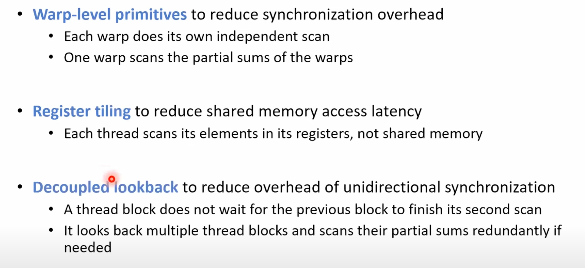


##### Reduce-Then-Scan

* 相比上面的segmented方法，少一次全局内存读取
  * 第一次主要数据移动 (约 n)：读取原始输入数据进行规约 (Reduction)
    * (中间步骤：扫描块总和 - 数据移动可忽略)
  * 第二次主要数据移动 (约 n)：再次读取原始输入数据以进行最终计算
  * 第三次主要数据移动 (约 n)：写入最终的前缀和结果

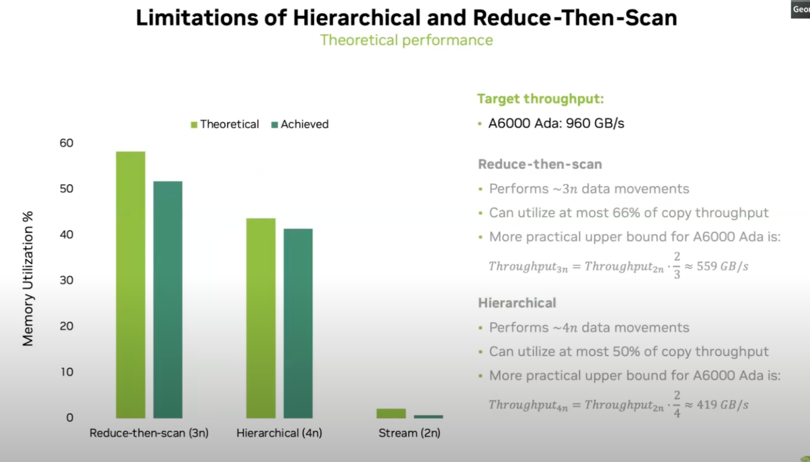

##### Stream Scan (Chained-Scan)


###### **Message Passing Latency**

* tile bytes = 512 threads * 4B


* 

* 优化到不需要memory ordering


* 增大tile bytes


##### CUB BlockScan实现


* 受限于block shared memory
  * L20 Max Shared Memory: 228 KiB/SM, **48 KiB/Block**


##### Decoupled Look Back


* CTA以polling的方式look back

  * CTA 代表 Cooperative Thread Array，即 CUDA 中的线程块（thread block）。

  * 

  * 问题：轮训的contention过大
  * 解法：delay
    * 比如最近的架构，L2 latency增加，backoff策略的重要性增加
  * 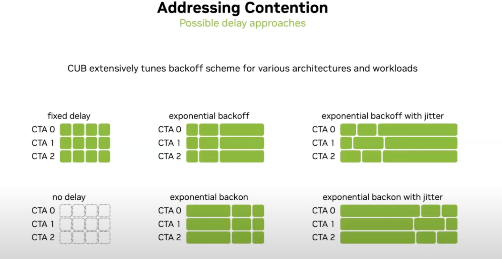
  * 

* 

##### Autotune


#### Case Study: Unique

* 在A800 GPU上，对10亿个int32类型的随机整数进行`torch.unique(return_inverse=True)`操作需要320ms的时间

* [torch.unique在GPU上的性能优化](https://zhuanlan.zhihu.com/p/3921184972)
  * Radix Sort: 下标数组采用int32来降低访存开销，这个可以将排序的时间从130ms优化到80ms左右。
  * Scatter：通过Radix Sort来替换掉scatter计算，提升访存友好性，这个可以将inverse indices的计算从160ms优化到80ms左右。
    * 本质上应该是radix sort的随机写入的访存，比scatter更友好


### CUTLASS

> Open source: https://github.com/NVIDIA/cutlass
>
> • Documentation: https://github.com/NVIDIA/cutlass#documentation
>
> • Presented: [GTC’18](https://on-demand.gputechconf.com/gtc/2018/presentation/s8854-cutlass-software-primitives-for-dense-linear-algebra-at-all-levels-and-scales-within-cuda.pdf), [GTC’19](https://developer.download.nvidia.com/video/gputechconf/gtc/2019/presentation/s9593-cutensor-high-performance-tensor-operations-in-cuda-v2.pdf), [GTC’20](https://developer.download.nvidia.com/video/gputechconf/gtc/2020/presentations/s21745-developing-cuda-kernels-to-push-tensor-cores-to-the-absolute-limit-on-nvidia-a100.pdf), [GTC’21](https://www.nvidia.com/en-us/on-demand/session/gtcspring21-s31883/), [GTC'22](https://www.nvidia.com/en-us/on-demand/session/gtcspring22-s41996/) , [GTC’22](https://www.nvidia.com/en-us/on-demand/session/gtcfall22-a41131/), [GTC’23](https://www.nvidia.com/en-us/on-demand/session/gtcspring23-s51413/), [GTC’24](https://www.nvidia.com/en-us/on-demand/session/gtc24-s61198/)
>
> • Come join the CUTLASS channel in our discord: https://discord.gg/CVEJqWtU

> [GPU Mode Lecture 15](https://www.youtube.com/watch?v=G6q719ck7ww&t=4s) by Eric Auld

#### Intro

* cutlass v.s. triton
  * jit编译慢，某些场景serving难
  * 易用性差一些
  * 性能上限高一点
  * 先triton再cutlass是趋势


##### [Speaking Tensor Cores —— GPU Mode Lecture 23](https://www.youtube.com/watch?v=hQ9GPnV0-50)

* Intro
  * CUDA C++ Template Library for High Performance Linear Algebra
  * Tensor core computations at all scopes and scales, **decomposed into their “moving parts”**
  * **Provides a native tile-based programming model for GPU kernels**
  * 

* 特点：

  * Public Tensor Core programming model for NVIDIA GPUs
    * Serve as a production grade example for the world
  * Extreme focus on developer productivity for custom kernels
    * Allow customizing any layer in the hierarchy while preserving composability with other layers
  * If it compiles, it will be correct – actionable static assert messages otherwise
    * **Static asserts** at every layer to ensure layout and dispatch compatibilities
  * Single, clear points of customization and dispatch to flatten the learning curve
    * Reduce API surface area with fewer named types
  * 

  * 


#### 概念、结构、API


##### Collective API


 ###### Collective Builder


##### Kernel API

* Kernel layer

  * collective mainloop: MMA

  * collective epilogue: post-processing (GEMM的general的体现，alpha*AB + c)


#### 编程模型

##### Layout

* layout
  * shape
  * Stride
  * 支持multi-modal: 比如 (4, (2,2)):(2, (1,8))，嵌套，是multi-modal
* 


##### Tile: Data and Computing Resource


##### CuTe

> CuTe包含于CUTLASS 3
>
> https://github.com/NVIDIA/cutlass/tree/main/include/cute


#### Writing Custom Kernels

* Write custom mainloops (micro-kernels), compose with existing schedule (outer loops) via dispatch policies
* Write custom schedules (outer loops), compose with existing mainloops (micro-kernels) via dispatch policies
* Kernel layer totally agnostic of # of in/out tensors and the semantics of the computation itself
* Kernel is a composition of a mainloop, epilogue, and tile scheduler: compose them freely


##### fusion


##### mixed input

* Mixed input: fused dequant
  * 新增一个collective做upcast即可


##### pipeline


##### epilogue fusion

> Gpu-cutlass.cc


* python interface


* optimized loop


##### Profiler

* CUTLASS has a python based kernel emitter and a manifest to hold a bunch of kernels
* Autotuning strategy is to stamp out a set of candidates kernels and then …
* Use the CUTLASS profiler to pick the best kernel for your problems of interest
* It is also possible to dump ptx of the best performing kernel with `cuobjdump` or –DCUTLASS_NVCC_KEEP


#### Case Study: GEMM、GETT

> GETT paper https://arxiv.org/abs/1607.00145

https://docs.nvidia.com/cutlass/media/docs/cpp/cute/0x_gemm_tutorial.html

#### Case Study: WGMMA

https://research.colfax-intl.com/cutlass-tutorial-wgmma-hopper/


### CCCL

#### Intro


* Note：
  * 各种GPU上的性能都比较好


#### CUB

* Block load/Scan


#### 应用：[llm.cccl —— GPU Mode Bonus Lecture](https://www.youtube.com/watch?v=WiB_3Csfj_Q)

> 是对 llm.c 的重构，性能打平，无优化


### Triton

#### Intro

> https://openai.com/index/triton/

* Triton v.s. CUDA
  * pythonish
  
  * easy to write and debug

  * 二者均生成PTX
  
  * triton的核心思路：block操作，而不是SIMT
  
  * |                          | **CUDA** | **TRITON** |
    | ------------------------ | -------- | ---------- |
    | Memory Coalescing        | Manual   | Automatic  |
    | Shared Memory Management | Manual   | Automatic  |
    | Scheduling (Within SMs)  | Manual   | Automatic  |
    | Scheduling (Across SMs)  | Manual   | Manual     |
  
* Triton是OpenAI 推出的以python为编程语言基础，专门为深度学习研发和高性能计算而设计的编程语言和编译器，旨在简化和优化GPU编程的复杂操作，降低高性能优化的门槛。它允许开发者在Triton框架内更灵活地编写和优化自定义的算子（operators）或处理复杂的数据流程。
  * 生成PTX（Cuda Assembly）而不是cuda
  * Triton的初期版本以CUDA为起点而开发，为没有CUDA基础的编程者提供快速编写高效CUDA kernel的方案，而随着迭代已逐渐支持其他芯片和编程工具，如AMD的ROCm，并在继续支持其他的芯片，如Intel的CPU。
  * During the compilation, the Triton compiler tries to use clever tricks to **rearrange the parts of your program**
  * 利用ptx汇编可以将triton降级为ptx代码，在cuda上直接运行以达到极致计算性能的优化，Triton提供了块指针非常便捷的实现FA，对GPU IO感知类的实现进行了充分的支持。

##### 和 numba 对比

* numba：
  * python
  * 可以传入矩阵shape
  * debug
  * NUMBA_ENABLE_CUDASIM=1

#### Programming Model

* Triton v.s. CUDA
  * 只感知 blocks <-> CUDA两层抽象，blocks 、threads
    * Note on jargon: In triton lingo, each kernel (which processes a block) is called a "program". Therefore, "block_id" is often called "pid" (short for "program id"), but it's the same.
  * 处理tensor <-> 处理scalar
    * **All** operations in triton kernels are vectorized: Loading data, operating on data, storing data, and creating masks.
  * 不感知shared memory


* one important limitation of Triton is that **each block must have a power-of-two number of elements**, so we need to internally “pad” each row and guard the memory operations properly if we want to handle any possible input shapes:

#### 优化原理

* shared memory
  * data can be automatically **stashed to shared memory by looking at the operands of computationally intensive block-level operations** (e.g., `tl.dot`)—and **allocated/synchronized using standard liveness analysis techniques.**
  * 

* parallel
  * (1) across SMs by executing different kernel instances concurrently
  * (2) within SMs by analyzing the iteration space of each block-level operation and partitioning it adequately across different SIMD units
  * 


#### 结合 Compiling 理解

* [实现Baby Triton](https://zhuanlan.zhihu.com/p/709844371?share_code=1zPzTKwsDAJN&utm_psn=1910488935282479202)

##### Triton Internals —— GPU Mode Lecture 29 看到 09:54

> https://www.youtube.com/watch?v=njgow_zaJMw
>
> Kapil Sharma @Meta
>
> https://www.kapilsharma.dev/posts/deep-dive-into-triton-internals/ 1、2、3系列
>
> Cuda Compilation
> ->Triton Compilation
> ->Example
> ->Jit Compilation
> ->Triton and MLIR
> ->IR Walkthrough
> ->Example MLIR Pass
> ->If Time Permits: Add a new compiler pass

* Intro
  * cuda compilation -> 「CUDA Compiler」
  * The `@triton.jit` decorator works by walking the Abstract Syntax Tree (AST) of the provided Python function so as to generate Triton-IR on-the-fly using a common SSA construction algorithm.
    * [Simple and efficient construction of static single assignment form](https://link.springer.com/chapter/10.1007/978-3-642-37051-9_6)
  * The resulting IR code is then simplified, optimized and automatically parallelized by our compiler backend, before being converted into high-quality LLVM-IR—and eventually PTX—for execution on recent NVIDIA GPUs.
  * 
  * 


#### Debugging

> snippets/gpu-triton-debugging.py

* `TRITON_INTERPRET=1 python interpret_triton_square.py`
  * 原理：CPU上运行，模拟GPU运行

* crash the kernel then get all the information

#### 经验和细节

* triton autotune目前对dynamic shape的支持不好，性能较差，原因是autotune会对每个新shape重新tune
  * 考虑AOT方法
  * GemLite


### NCCL

> GPU Mode Lecture 17 NCCL: https://www.youtube.com/watch?v=T22e3fgit-A

#### Intro

> https://docs.nvidia.com/deeplearning/nccl/user-guide/docs/usage/collectives.html

* 单机：NVLink
  * 高速、低延迟的通用串行总线接口技术，GPU卡间通信，带宽很高
  * H100:
    * 50GB/link
    * 18links
* 多机
  * Ethernet
  * InfiniBand
  * OmniPath
  * RoCE（RDMA over Converged Ethernet）

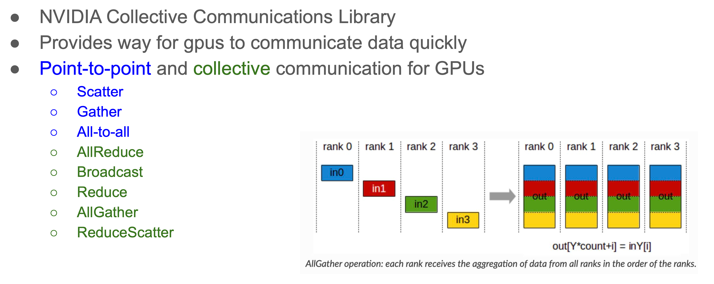

* 应用于DDP
  * AllReduce gradients


#### 通信库

* allreduce && reducescatter ops are not actually implemented via ring reductions in NCCL in 2024. 
  * [double binary trees](https://developer.nvidia.com/blog/massively-scale-deep-learning-training-nccl-2-4/) are used for sufficiently large allreduce ops
  * more recently a variant of Bruck’s algorithm is used for reduce-scatter calls in the [most recent release of NCCL](https://docs.nvidia.com/deeplearning/nccl/release-notes/rel_2-23-4.html#rel_2-23-4).
  * the use of [SHArP](https://network.nvidia.com/pdf/solutions/hpc/paperieee_copyright.pdf) in infiniband switches produces [indeterministic garbage](https://github.com/NVIDIA/nccl/issues/1497) under a scope I am ill-equipped to elaborate on.

* Also, none of this paragraph applies for any serious frontier lab, because all of them use more efficient collective communications libraries, e.g. [HFReduce](https://arxiv.org/pdf/2408.14158#page=6), [MSCCL++](https://github.com/microsoft/mscclpp), [NCCLX](https://www.reddit.com/r/MachineLearning/comments/1eb4xn4/p_ncclx_mentioned_in_llama3_paper/), etc. So, you know, I am just making unprincipled simplifications here, don’t read too hard into the assumptions or you’ll crack them like eggshells.

### GPU优化

#### Overview

> Nvidia Guide: https://docs.nvidia.com/deeplearning/performance/dl-performance-fully-connected/index.html
>
> Getting good occupancy – balance resources


##### Roofline Model

* H20: 
  * 4.8 TB/s
  * FP32: 672 TFLOPS
  * FLOPS/Byte = 140


##### optimization workflow


##### 细节

● Have 82 SM → many blocks = good

​	(for comparison Jetson Xavier has 8 Volta SM)

● Can schedule up to 1536 threads per SM

​	→ power of two block size <512 desirable

​	(some other GPUs 2048)

● Avoid divergence to execute an entire warp (32 threads) at each cycle

● Avoid FP64/INT64 if you can on Gx102 (GeForce / Workstation GPUs)

● Shared Memory and Register File → limits number of scheduled on SM

(use __launch_bounds__ / C10_LAUNCH_BOUNDS to advise compiler of # of threads for register allocation, but register spill makes things slow) 

● Use `torch.cuda.get_device_properties(<gpu_num>)` to get properties (e.g. max_threads_per_multi_processor)

​	[even more in CUDA than in PyTorch](https://developer.download.nvidia.com/compute/DevZone/docs/html/C/doc/html/group__CUDART__DEVICE_g5aa4f47938af8276f08074d09b7d520c.html)

#### Literature Review

* 访存瓶颈
  * compute speed has out-paced memory speed [61, 62, 63], and most operations in Transformers are bottlenecked by memory accesses [43]. 【FlashAttention】

#### 写好GPU程序的难点

* 思路

  * "if you do not care about performance, parallel programming is very easy"

    * designing parallel algorithms in practice harder than sequential algorithms
      * e.g. parallelizing recurrent computations requires nonintuitive thinking (like prefix sum)

    * speed is often limited by memory latency/throughput (memory bound)
      * e.g. llm token by token效率低，需要batching


  * perf of parallel programs can vary dramatically based on input data characteristics

  * not all apps are "embarassingly parallel" - synchronization imposes overhead (waits)

* 性能

  * Memory transfers from DRAM must be *coalesced* into large transactions to leverage the large bus width of modern memory interfaces.
  * Data must be manually stashed to SRAM prior to being re-used, and managed so as to minimize shared memory bank conflicts upon retrieval.
  * Computations must be partitioned and scheduled carefully, both across and within Streaming Multiprocessors (SMs), so as to promote instruction/thread-level parallelism and leverage special-purpose ALUs (e.g., tensor cores).

#### [CUDA Performance Checklist (GPU Mode Lecture 8)](https://www.youtube.com/watch?v=SGhfUhlowB4)

> https://docs.google.com/presentation/d/1cvVpf3ChFFiY4Kf25S4e4sPY6Y5uRUO-X-A4nJ7IhFE/edit?slide=id.p#slide=id.p

* Coalesced Global Memory Access
* Maximize occupancy
* *Understand if memory or compute bound*
* Minimize control divergence
* Tiling of reused data
* Privatization
  * local copy, avoid hitting global memory
* Thread Coarsening
  * 适用于：work balance的场景 + memory bound的场景 + per thread register不bound的场景
    * compute bound通常每个thread做尽可能少的事情
    * memory bound每个thread做更多事情
  
  * coarsening factor的选择原则：减少thread block数量后，仍在GPU的SM数量附近
  
* Bank conflicts
  * 新一代GPU影响变小

* Latency hiding
* *Rewrite your algorithm using better math*
  * Use high level language to write GPU kernels.


* Nsight System & Nsight Compute
* Use existing libraries, which are highly optimized, e.g. cublas, cudnn. 

* Choose the right metric:
  * GFLOP/s: for compute-bound kernels
  * Bandwidth: for memory-bound kernels

#### SM Occupancy

* **SM Occupancy：the ratio of the number of warps assigned to an SM to the maximum number it can support**
  * 提升 SM 占用率的关键通常在于 降低每个 Block 对 SM 资源的（寄存器、共享内存）需求 ，使得 SM 能够同时调度运行更多的 Block（以及更多的 Warp）。

* 限制因素：主要是资源约束
  *  **每个thread的register数量**
    - each SM has 65536 registers. To execute 2048 threads simultaneously, each thread can have a maximum of 32 registers (65536/2048 = 32). If a kernel needs 64 registers per thread, we can only run 1024 threads per SM,
    - --> resulting in 50% occupancy.
  *  每个SM的共享内存 / **Shared Memory per Block**
  *  **SM能够同时处理的线程块数量**
     - block size太小的情形
       - block size=32，总共需要执行 2048 个线程。因此总共需要 2048/32 = 64 个线程块来容纳这 2048 个线程
       - **每个 SM 在同一时刻最多只能处理 32 个 thread block**
       - --> 50% SM Occupancy

> https://docs.nvidia.com/deeplearning/performance/dl-performance-matrix-multiplication/index.html


* 充分利用 SM
  * cuda occupancy calculator
  * 增大batch size

##### Latency Optimization

**Warp State**

* Active: warps inside the pool which has non-exiting threads
* Eligible: active warps that are not stalled
* Issued: a single eligible warp that the warp scheduler choose to issue one or more instructions on this cycle

**Latency**

* bound: for many cycles, lack of eligible warps to issue instructions

* hiding: switching warp
* technique: increase active warps

**Occupancy & Active Warps**

* Occupancy: ratio of active warps per SM to the maximum number of allowed warps
  * Hardware limit: 64 in Volta GV100 Per SM(16 per sub-partition), but **32** in Turing
* We need the occupancy to be high enough to hide latency
* Theoretical occupancy is limited by resource usage (shared memory/registers/blocks per SM)

**Achieved occupancy can be significantly lower than theoretical occupancy when:** 

*  Unbalanced workload within blocks
*  Unbalanced workload across blocks
*  Too few blocks launched

**Occupancy Optimization**

* Know the occupancy: NVIDIA Visual profiler / Nsight Compute 
* Adjust resource usage to increase theoretical occupancy
  * Change block size
  * **Limit register usage**
    * **Compiler option –maxregcount=n: per file**

    * **`__launch_bounds__`: per kernel** 
  * Limit shared memory usage.

* Launch enough load-balanced blocks to increase achieved occupancy

```c++
__global__ void
__launch_bounds__(maxThreadsPerBlock, minBlocksPerMultiprocessor)
MyKernel(...){
  ...
}
```

#### Warp效率

##### coalesce memory access

>  Improve memory access pattern to reduce wasted transactions，提高bus utilization

* per warp (coalesced, 32/64/128B)
  * 线程访问可以不连续，但内存需要连续
* in discrete chunks (transported in segments: L2 cache line, 32B or 128B)
  * 长度和index均需对齐

##### Warp Divergence

* 如果 warp 内的线程执行不同的分支，会出现分支分歧，显著降低性能
  * 线程块的线程数量是 32 的倍数，更好地组织线程能减少分支分歧的发生概率

##### intra-warp data sharing


#### Shared Memory利用 —— Tiling

* Reduce redundant access: shared memory
  * Inter-block communication
  * User-managed cache to reduce redundant global memory accesses
  * Avoid non-coalesced access: shared memory没有cache line的概念，e.g. matrix-transposition.cu


* 本质：In Matmul, each of the n² outputs uses 2n inputs
  * n^2 * 2n / (2n^2) = n，每个input重复读n次
  * 优化后：read each input only n/TILE_SIZE times from main memory
  * cuda技巧：双buffer的思路，prefetch和计算并行
    * cuda-sgemm.cu


#### TensorCore利用

https://developer.download.nvidia.com/video/gputechconf/gtc/2019/presentation/s9926-tensor-core-performance-the-ultimate-guide.pdf

#### H2D Optimization

> https://developer.nvidia.com/blog/maximizing-unified-memory-performance-cuda/

* Host<->device data transfer has much lower bandwidth than global memory access.

  * 16 GB/s (PCIe x16 Gen3) vs 250 GB/s & 10.6 T inst/s (GP100) 

* Minimize transfer

  * Intermediate data can be allocated, operated, de-allocated directly on GPU

  * Sometimes it’s even better to re-compute on GPU

* Group transfer
  * One large transfer much better than many small ones
  * Overlap memory transfer with computation

#### kernel fusion

* --> 「LLM-MLSys」-「POD-Attention」-「现有kernel fusion技术的局限性」

##### SM Aware CTA Scheduling

* 
* 


#### Instruction Optimization

* Use float if precision allow
  * Adding “f” to floating literals (e.g. 1.0f) because the default is double 

* Fast math functions
  * Two types of runtime math library functions
    * func(): slower but higher accuracy (5 ulp or less)
    * __func(): fast but lower accuracy (SFU做，see prog. guide for full details) 
    * -use_fast_math: forces every func() to __func ()

* High-throughput function:
  * DP4A and DP2A  for int8 and int16 dot productions
    * Dot Product of 4/2 elements and Accumulate
  * Warp matrix function(WMMA) for tensor core operations


#### Register Spilling


#### 新硬件比如 Hopper 特性

参考「Hopper」


### PMPP: Programming Massively Parallel Processors

> * 书：Programming Massively Parallel Processors (PMPP) 3rd edition
>
> * 视频：https://www.youtube.com/@pmpp-book/videos?view=0&sort=dd&shelf_id=2

* Main Goals
  * Parallel programming & computational thinking
  * Correct & reliable: debugging function & performance 
  * Scalability: regularize and localize memory access

#### Ch1-3 PPT

> GPU-Mode Lecture 2: https://www.youtube.com/watch?v=NQ-0D5Ti2dc

* Intro
  * motivation: GPU go brrr, more FLOPS please
    * Why? Simulation & world-models (games, weather, proteins, robotics)
    * Bigger models are smarter -> AGI (prevent wars, fix climate, cure cancer)
    * GPUs are the backbone of modern deep learning
  * classic software: sequential programs
    * higher clock rate trend for CPU slowed in 2003: energy consumption & heat dissipation
  * multi-core CPU came up
    * developers had to learn multi-threading (deadlocks, races etc.)
* Heterogeneous data parallel computing
  * Heterogeneous：GPU + CPU
  * CUDA C: extends ANSI C with minimal new syntax

* Multidimensional grids and data

#### Ch4-5 Compute and Memory Basics

> GPU-Mode Lecture 4: https://www.youtube.com/watch?v=lTmYrKwjSOU

* Chapter 4: Compute Architecture and Scheduling
  * aka: How to keep all of the GPU busy
* Chapter 5: Memory architecture and data locality
  * aka the basics of getting fast kernels

### GPU Profiling

> [tf-timeline](https://zhuanlan.zhihu.com/p/40156908)
>
> [nsight-systems](https://developer.nvidia.cn/nsight-systems)
>
> [nsight-compute](https://developer.nvidia.com/nsight-compute)

* Intro
  * cuda是async，因此用python的time模块，测的包含kernel launch时间，不包含execute时间

#### SOL (Speed of Light)


#### Dissecting the NVIDIA Volta GPU Architecture via Microbenchmarking

https://arxiv.org/pdf/1804.06826

#### Demystifying the Nvidia Ampere Architecture through Microbenchmarking and Instruction-level Analysis

microbenchmark using ptx

#### Nvidia HPC Benchmarks

https://catalog.ngc.nvidia.com/orgs/nvidia/containers/hpc-benchmarks

https://docs.nvidia.com/nvidia-hpc-benchmarks/overview.html


#### Nvidia Lecture 5: Introduction to Nsight Profiling Tools

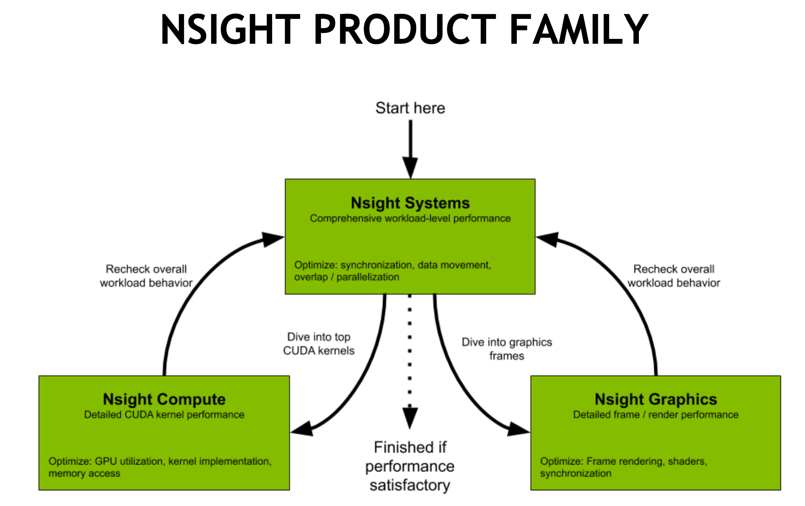

Support:

* OS Thread state and CPU utilization, pthread, file I/O, etc.
* User annotations API (NVTX)
* Compute
  * CUDA API: Kernel launch and execution correlation
  * Libraries and directive: cuBLAS, cuDNN, OpenACC
* Graphics
  * Vulkan, OpenGL, DX11, DX12, DXR, V-sync


* nvtx记录kernel信息
  * "//tensorflow/core/profiler:nvtx_utils"
  * nvtxDomainRangeStartEx 和 nvtxDomainRangeEnd
  * export TF_ENABLE_NVTX_RANGES=1、export TF_ENABLE_NVTX_RANGES_DETAILED=1


* Key features
  * section is a group of metrics


### Prod Ready GPU Library

#### Intro

#### [Build a Prod Ready CUDA library —— GPU Mode Lecture 10](https://www.youtube.com/watch?v=FHsEW0HpuoU)

* 讲了一些故事：
  * 没什么人懂gpu
  * GPU优化，不同的步骤放在不同的GPU上


* prod ready cuda library
  * 均衡抽象和性能

##### GPU communication utility

> nccl: https://developer.nvidia.com/nccl
>
> https://developer.nvidia.com/deepstream-sdk

* 图像处理的场景：3GPU、输入60 frames/s * 4 cameras，输出6 * 60 frames/s
  * **soft realtime**：可接受延时
  * 由于driver等原因，只能windows，很坑
* 要点1：Pre-allocate all your memory
* 要点2:
  * h2d，经过pinned memory
  * 


* delay buffer + Iterative memory manager
  * 管理数据ownership，类似unique_ptr


```C++
struct DataInfo {
  int numElements;
  int elemSizeInBytes;
  MemorySpace memSpace;
};
DataInfo producerDataInfo{1024, 4, HostPageable};
DataInfo consumerDataInfo{1024, 4, Device_1};

Data ptrToProduce(producerDataInfo);
Data ptrToConsume(consumerDataInfo);

enum Actions { ProducerProvides, ProducerTakes, ConsumerProvides, ConsumerTakes};

//Initialization
MemoryManager<ProducerProvides, ConsumerProvides> manager(producerDataInfo, consumerDataInfo);

int delay = manager.getTotalDelay(); // Query delay generated by the manager

manager.manage(ptrToProduce, ptrToConsume); // Usage

// Initialization
MemoryManager<ProducerTakes, ConsumerTakes> manager(producerDataInfo, consumerDataInfo);
auto [ptrToProduce, ptrToConsume] = manager.manage(); // Usage

// Initialization
MemoryManager<ProducerProvides, ConsumerTakes> manager(producerDataInfo, consumerDataInfo);
ptrToConsume = manager.manage(ptrToProduce); // Usage
```


#### GemLite —— Low-Bit Triton Kernels

> /code-reading-gem-lite

* Intro

  - Support for various activation data types: fp16, int8 and fp8

  - Compatibility: works seamlessly with non-packed (e.g., int8, fp8) and packed formats (e.g., uint4, uint2, uint1)

  - Performance Optimization: includes optimized kernels and autotuning tools to achieve high performance across different hardware and batch sizes

  - Integration: Compatible with torch.compile and CUDA graphs, ensuring support for advanced features like tensor parallelism

* Kernel Selection
  * For batch size = 1, a GEMV kernel performs best,
    * for packed data, our experiments indicate that **loading scales and zero points only once per two consecutive blocks minimizes redundant operations**. Since these blocks share the same metadata, this approach results in:
      - 5–8% end-to-end inference speedup compared to the default GEMV kernel
      - 30–40% improvement over the traditional Split-K method
    * for non packed: GEMV_SPLITK
  * for larger batch sizes, GEMM kernels are more efficient.
  * For batch sizes between 2 and 64, when matrices are “skinny,” a GEMM-SPLITK kernel is used to enable better GPU utilization ([arXiv](https://arxiv.org/abs/2402.00025)).

* autotuning
  * [Autotuning](https://triton-lang.org/main/python-api/generated/triton.autotune.html) is critical for achieving optimal kernel performance. Since this process can be time-intensive, GemLite **provides tools to automatically save and load autotuning results for all kernels**. This ensures that the autotuning process is performed only once per GPU device, minimizing runtime, reducing repetitive overhead, and maintaining consistent performance across runs.
* Overcoming **Bit-Unpacking Bottlenecks**
  * To mitigate these, various bit-packing configurations were explored, including **packing along columns** versus rows and experimenting with different bit-packing widths (e.g., 8-bit vs. 32-bit). Notably, **transitioning from 32-bit to 8-bit packing** delivered performance improvements of up to 18% on the A100 and 6% on the H100

### 应用

#### Intro


* use [*GPU-Accelerated Libraries for Computing*](https://developer.nvidia.com/gpu-accelerated-libraries) to learn where you can use highly optimized CUDA libraries for tasks like:
  *  [basic linear algebra solvers](https://developer.nvidia.com/cublas) (BLAS)
  * [graph analytics](https://developer.nvidia.com/nvgraph)
  * [fast fourier transforms](https://developer.nvidia.com/cufft) (FFT)
  * [random number generation](https://developer.nvidia.com/curand) (RNG)

#### 图像处理

* [image and signal processing](https://developer.nvidia.com/npp)

* GPU做图像处理pipeline自动优化
  * Halide: a language and compiler for optimizing parallelism, locality, and recomputation in
    image processing pipelines.

#### [Data Analytics and Processing —— GPU Mode Lecture 19](https://www.youtube.com/watch?v=FUBrIgdIuh0)

> by Devavret Makkar
>
> Voltron Data

* cuDF and Theseus
  * dataframe存在GPU HBM中，如果要修改，需要内存能放下两份dataframe


* Spark性能受限于CPU性能
  * TPC-H 10TB Benchmark


* 1 Billion Row Challenge 以及 solution


##### cuDF

* General Solution
  * 
  * cuDF实现，参考snippets

* table view and table
  * 

##### hashmap实现GroupBy

* 思路：
  * 实现一个row comparator
  * 「gpu-cudf.py」


##### cuDF Other uses


##### Thesus —— Scaling the cuDF solution


### AMD GPU

[为什么除了CSP，几乎没人用AMD的GPU？--SemiAnalysis](https://mp.weixin.qq.com/s/y-fCljKIuWZou_2OYYUDGQ)

### 晟腾 NPU

* 知乎相关讨论，活成了华为的测试团队 https://www.zhihu.com/question/1952365913941729630/answer/1954950015760966264

* CANN（Compute Architecture for Neural Networks）算子库
  - https://www.hiascend.com/document/detail/zh/canncommercial/83RC1/API/aolapi/operatorlist_00097.html