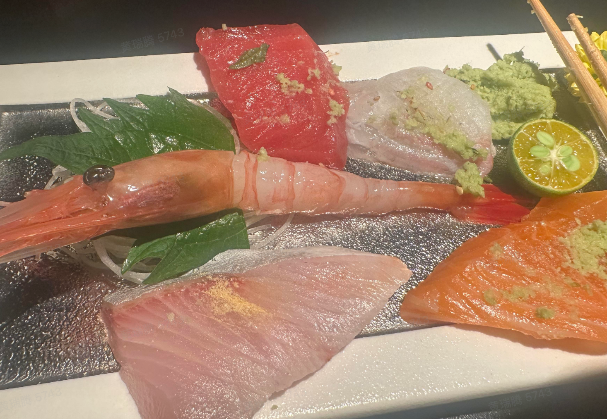

[toc]

### 海味

#### 乌鱼子 (Karasumi)
> https://inews.ifeng.com/mip/47530362/news.shtml
*   **产地**: 台湾的著名特产，尤其以屏东东港为最佳，被誉为世界三大美食之一。
*   **原料**: 由雌性乌鱼的卵巢，经过盐渍、脱水、曝晒、阴干等多道工序制成。
*   **品尝**: 口感黏糯，风味咸香浓郁。
    *   **经典吃法**: 微烤后切片，搭配白萝卜片或大葱片，利用辛辣味来平衡其浓郁的海味。
    *   **创新吃法**: 可切丁用于炒饭，或磨粉用于意面等。

#### 鲍鱼

* “头” 是鲍鱼特有的**重量 - 数量对应规则**： **“一斤（司马斤，约 604.79 克 ）内有几只鲍鱼，就是几头”** 。
* 所以 “4 头鲍” 指 **4 只鲍鱼加起来约 604.79 克** ，单只重量近 150 克（远超普通鲍鱼）。头数越少，单只个头越大、生长周期越长，价格和档次越高（比如 “双头鲍” 单只超 300 克，属顶级稀缺品 ）。
* 问产地：
  * 日本网鲍（椭圆、边细肉厚，溏心软糯）、南非青边鲍（外壳泛青，肉质紧实弹牙 ）、中国福建东山鲍（国家地理标志，品种多、性价比高 ）
* 问做法：鲜鲍适合清蒸（吃本味）、干鲍可问 “是不是溏心鲍”（溏心是干鲍顶级标准 ）；红烧、煲汤则适合入味。
* 品细节： “肉质厚弹牙，溏心黏糯，火候刚好”

#### 红魔虾 (Carabineros / Scarlet Shrimp)

*   **产地**: 主要产自西班牙（地中海、大西洋东部深海），是世界上最昂贵的红虾之一。
*   **特点**:
    *   **色泽**: 全身绯红，烹饪后颜色更艳丽。
    *   **虾脑**: **灵魂所在**。虾头巨大，蕴含极其浓郁鲜美的虾膏，鲜味（Umami）是普通虾的数倍。
    *   **虾肉**: 肉质比牡丹虾更软糯，甜度极高。
*   **烹饪**:
    *   **刺身**: 最顶级的吃法，感受极致的软糯与清甜。
    *   **虾头**: 熬制虾油或高汤（如 *曲廊院* 的做法），能把整道菜的鲜味提升一个维度。

### 河鲜 (River Delicacies)

#### 太湖小银鱼 (Taihu Silver Fish)

*   **产地**: “太湖三白”之一（白鱼、银鱼、白虾）。
*   **特点**: 色泽如银，体长细小，**无鳞无骨**（骨极软），肉质细嫩洁白。
*   **时令**: 春季（清明前后）最为肥美。
*   **烹饪**:
    *   **银鱼跑蛋**: 经典家常做法。
    *   **羹汤/蒸蛋**: 如 *曲廊院* 的香椿浓汤茶碗蒸，利用其细嫩口感与蛋羹融合，提鲜而不抢味。

#### 江团 (Longsnout Catfish / Leiocassis Longirostris)

*   **别名**: 长吻鮠、肥沱。
*   **特点**:
    *   **无鳞少刺**: 仅有一根主骨，无肌间小刺，食用极为方便。
    *   **肉质**: 脂肪含量适中，肉质**细嫩软糯**且富有**弹性 (Q弹)**，皮层富含胶质。
    *   **风味**: 鲜美且通常无明显土腥味（尤其是流动水域生长的）。
*   **水煮鱼选鱼指南**:
    *   **江团**: **顶级之选**。肉质最细嫩肥美，久煮不老，能极好地吸收麻辣汤汁且保持形态，口感滑嫩软糯。
    *   **清江鱼 (鮰鱼)**: **性价比之选**。大多指斑点叉尾鮰，无鳞少刺，肉质鲜嫩接近江团，但细腻度和胶质感略逊一筹。
    *   **黑鱼 (Snakehead)**: **口感劲道**。少刺，肉质紧实Q弹，不易煮散，适合喜欢有嚼劲口感的人。但入味速度稍慢。
    *   **草鱼 (Grass Carp)**: **家常/大排档**。刺多（有细小Y型刺），肉质相对较老，易有土腥味，但价格便宜。

### 禽肉 (Poultry)

#### 京郊油鸡 (Beijing Youji / Beijing Oil Chicken)

*   **产地**: 北京特产，国家地理标志农产品。曾是清宫御膳贡鸟。
*   **特点**:
    *   **外形**: “三毛”（凤头、毛腿、胡子嘴）。
    *   **肉质**: 皮下脂肪（鸡油）丰富且呈金黄色，肉质细嫩，风味浓郁。
*   **烹饪**:
    *   **釜饭/焖饭**: 利用其丰富的**黄金鸡油**直接焖煮米饭（如 *曲廊院*），无需额外油脂，香气扑鼻。
    *   **白切/炖汤**: 只有优质的鸡肉才敢于使用最简单的烹饪方式。

### 鱼生 (Sashimi)

#### 金枪鱼 (Tuna / Maguro)

金枪鱼的不同部位因脂肪含量和肉质的差异，风味和价值也大不相同。

*   **赤身 (Akami)**
    *   **部位**: 鱼背内部，运动量大，脂肪最少。
    *   **特点**: 呈深宝石红色，肉质紧实，具有独特的**酸味 (Sourness)** 和铁质香气，最能体现金枪鱼的本味。
    *   **料理**: 
        *   **酱油渍 (Zuke)**: 传统江户前做法。通过酱油腌制，排出多余水分，浓缩鲜味，并赋予软糯口感（Mochi-like texture）。

*   **中腹 (Chutoro)**
    *   **部位**: 分布较广，主要位于背部（Senaka）的皮下部分以及腹部的中后段（Haranaka/Harashimo）。
    *   **特点**: 兼具赤身的酸味（鲜味来源）与大腹的甘甜油脂。脂肪含量适中，既不似赤身般清瘦，也不像大腹般油腻，被许多饕客视为**平衡感最佳**的部位。
    *   **熟成 (Aging)**: 顶级的中腹通常需要熟成（Jukusei）。对于大体型的蓝鳍金枪鱼，熟成 10-14 天能软化筋膜，分解 ATP 产生肌苷酸（Inosinic Acid），最大化鲜味。
    *   **搭配**: 
        *   **舍利 (Shari)**: 推荐搭配**赤醋饭 (Akazu)**。赤醋的醇厚酸度与香气能“切开”油脂，提升余韵。
        *   **温度**: 最佳食用温度并非冰冷，而是接近体温或室温（约 18-20°C），此时油脂开始微微融化，香气最盛。

*   **大腹 (Otoro)**
    *   **部位**: 鱼腹前部（Harakami），脂肪最多。
    *   **特点**: 呈粉红色，油脂如雪花般分布，入口即化，香气最为浓郁。
    *   **霜降 (Shimofuri)**: 靠近中腹的部分，油脂网状分布，细腻优雅。
    *   **蛇腹 (Jabara)**: 最靠近腹底的部位，红白相间如蛇腹。筋膜较多且硬，但油脂爆发力最强。通常需要**熟成**或**炙烤 (Aburi)** 来软化筋膜，或者通过特殊的**切断筋膜 (Sujime)** 刀法处理。

#### 真鲷 (Madai / Sea Bream)

*   **类别**: 白身鱼 (White-fleshed fish)
*   **特点**: 鱼肉呈淡白色，纹理细腻，肉质紧实且带有清甜鲜味。是日料中常见的高级白身鱼。
*   **用途**: 刺身、握寿司。

#### 黄狮鱼 (Hiramasa / Yellowtail Amberjack)

*   **类别**: 青物 (Blue-skinned fish)
*   **特点**: 鱼肉呈粉白色，脂肪分布均匀，口感弹嫩且脂香柔和，在刺身拼盘里辨识度较高。

### 牛肉 (Beef)

#### 常见部位 (Common Cuts)

*   **菲力 (Tenderloin / Filet Mignon)**
    *   **部位**: 腰内肉，运动量极少，一头牛身上最稀少的部分。
    *   **特点**: **肉质最嫩**，脂肪含量极低（精瘦），但牛肉特有的风味相对较淡。
    *   **适合**: 追求极致嫩度的人；制作**威灵顿牛排 (Wellington)**（如 *Aqualand*），酥皮包裹能弥补其脂肪较少的缺憾。
*   **眼肉 (Ribeye / Scotch Fillet)**
    *   **部位**: 肋脊部（6-12肋），中心通常有一块明显的油脂（Eye）。
    *   **特点**: **油脂丰富 (Marbling)**，肉质细嫩，牛肉风味浓郁，是平衡度极佳的部位。（如 *MORTON'S*、*Wolfgang* 的招牌部位）。
    *   **战斧 (Tomahawk)**: 带长肋骨的肉眼牛排，视觉效果震撼。
*   **西冷 (Sirloin / Striploin)**
    *   **部位**: 后腰脊肉，运动量稍多于肋脊。
    *   **特点**: 边缘通常有一圈**脂肪盖 (Fat Cap)**，肉质更有**嚼劲 (Chewy)**，肉味浓郁。
*   **牛小排 (Short Rib)**
    *   **部位**: 胸腹部肋骨部位（前几根肋骨）。
    *   **特点**: **油花 (Marbling) 极其丰富**，结缔组织和筋膜较多。
    *   **烹饪**:
        *   **薄切**: 适合日式/韩式烧烤（如 *牛者烧肉*），高温炙烤下油脂爆发力强。
        *   **慢煮/炖**: 适合**低温慢煮 (Sous-vide)** 或红酒炖煮（如 *和木*、*宴锦堂*），长时间加热能将坚硬的结缔组织转化为软糯的明胶，实现“全熟但不柴”的独特口感。

#### 分级系统 (Grading)

*   **日本和牛 (Wagyu)**: 采用 **A1-A5** 分级。
    *   **字母 (A/B/C)**: 步留率（Yield Grade），指可食用肉比例，A为最高。
    *   **数字 (1-5)**: 肉质等级（Quality Grade），综合BMS（霜降度）、肉色、脂肪色、紧实度。**A5** 为最高级，油脂如雪花般密集分布，入口即化。
*   **澳洲和牛**: 采用 **M1-M9+** 分级（M=Marbling）。M9 相当于日本 A3-A4 水平，相比日本和牛的极致油腻，澳洲和牛保留了更多肉感，口感在浓郁与耐吃之间平衡（如 *TRB* 的 Jura M9 和牛）。
*   **美国 USDA**:
    *   **Prime (极佳)**: 最高等级，仅占总产量 2-3%，大理石纹丰富。
    *   **Choice (特选)**: 常见的优质牛排等级。

#### 烹饪科学

*   **干式熟成 (Dry Aging)**
    *   **原理**: 将牛肉置于恒温恒湿（0-4°C，80%湿度）环境中存放（通常 21-45 天）。
    *   **效果**:
        *   **嫩化**: 自身酵素（酶）分解肌肉纤维和结缔组织。
        *   **风味浓缩**: 水分蒸发（损失约 30%），让肉味更浓郁。
        *   **风味转化**: 脂肪氧化和酶解产生坚果、奶酪、火腿般的特殊香气（如 *TRB* 的 M9 和牛熟成 20 天）。
*   **低温慢煮 (Sous-vide)**
    *   **原理**: 真空密封后在恒定低温（通常 55-65°C）下长时间加热。
    *   **优势**:
        *   **精准熟度**: 确保从里到外熟度一致，避免传统煎烤出现的“灰圈”（外老里生）。
        *   **软化筋膜**: 长时间加热可使胶原蛋白水解为明胶，特别适合牛小排等结缔组织丰富的部位（如 *和木* 的慢煮牛小排，解决了筋膜硬的问题，同时保留汁水）。
*   **美拉德反应 (Maillard Reaction)**
    *   高温（140°C+）下氨基酸与还原糖反应，产生褐色外壳和复杂的焦香风味（牛排表面的“焦脆感”）。

### 菌菇 (Mushrooms & Fungi)

#### 绣球菌 (Cauliflower Mushroom)

*   **别名**: “万菇之王”。
*   **特点**:
    *   **外形**: 子实体瓣片曲折，形似巨大的白色或奶黄色绣球花。
    *   **口感**: 与普通蘑菇的软烂不同，绣球菌**口感脆嫩**，嚼劲十足，带有淡淡的菌香。
*   **烹饪**:
    *   **吸味**: 瓣片结构使其极易吸附汤汁（如 *曲廊院* 用其吸附红魔虾汤），是极佳的“载体”食材。
    *   **凉拌/清炒**: 保持其独特的脆感。

# 美食品鉴

> https://www.dianping.com/member/2267779286/reviews

* 综合
  * 赵胤胤
* 鲁菜
  * 师傅陪我做鲁菜

* 西餐
  * 安妮大厨

## 一些感悟

* 味型的数量决定了美食的上限，比如潮州菜，有独特的腌料、卤水、偏门食材，理论上限更高

* 食材的几个层次

  * 理解

    * 搭配
      * 创意菜

    * 深入理解
      * 雪崴天妇罗
      * 富临鲍鱼
      * 紫薇厅西湖醋鱼

  * 改造
    * 爱媛县橘子鲷

# 黑珍珠 & 米其林

## Intro

* 八大菜系：鲁菜、川菜、苏菜、粤菜、浙菜、闽菜、湘菜和徽菜
  * 

* 米其林：https://guide.michelin.com/hk/zh_HK

## 鲁菜

## 川菜

### Intro

川菜以“一菜一格，百菜百味”著称，味型极为丰富，远不止麻辣。

*   **三大流派**:
    *   **上河帮 (蓉派)**: 以成都、乐山为中心，菜品精致、口味温和，是川菜的主流。
    *   **下河帮 (渝派)**: 以重庆为中心，风格大方、口味偏重，麻辣味浓，江湖菜、火锅是其代表。
    *   **小河帮 (盐帮菜)**: 以自贡为中心，以“香、辣、鲜”和味厚闻名，善用鲜椒和仔姜。

*   **经典味型**:
    *   **麻辣味**: 麻婆豆腐、水煮牛肉。
    *   **鱼香味**: 泡椒、葱、姜、蒜、糖、醋等调和，如鱼香肉丝。
    *   **怪味**: 麻、辣、甜、咸、酸、鲜、香并存，如怪味鸡。
    *   **糊辣味**: 干辣椒节在油中炸至棕红色后制成，如宫保鸡丁。
    *   **红油味**: 咸鲜微辣，香气浓郁，如红油水饺、夫妻肺片。

### 荣袍

荣袍的“拾年铁板”套餐体现了川菜元素与现代烹饪的融合。菜单设计完成度很高，在深刻理解川菜“一菜一格，百菜百味”精髓的基础上，结合高级食材和现代烹饪理念进行了再创作。

*   **前菜**: `水豆豉拌木耳菜`, `泡椒黑鸡爪金佛山方竹笋`, `大红袍花椒热炝顺风`
    *   三道前菜分别展现了川味的**酵香/豉香**、**泡椒酸辣**和**麻香/炝香**。其中“顺风”加入了**自贡小葱**，带有鲜明的盐帮菜烙印，开场即点明川菜内核。
*   **承转**: `鲜笋宜宾芽菜包子`
    *   将川菜灵魂辅料**宜宾芽菜**与鲜笋做成馅料，是对川式面点的一种创新演绎。
*   **汤品**: `小蜜豆鸡豆花鱼丸汤` / `简阳羊肉羊杂汤`
    *   **鸡豆花**是川菜“吃鸡不见鸡”的顶级清汤菜，考验制茸和扫汤的功夫，展现了川菜清鲜的一面。与“喜舍”的“松茸菊花瑶柱汤”有异曲同工之妙。
    *   **简阳羊肉汤**则是浓郁醇厚的红汤代表，一清一浓，关照了不同口味偏好。
*   **主菜**:
    *   `松哥清油甲鱼锅`: 选用**江西上饶的多年甲鱼**，以**菜籽油**为底的清油锅，加入**干辣椒**和**藿香**，香气清雅又能有效去腥，更好地衬托甲鱼的鲜美。
    *   `藤椒锅涮鲜黄牛肉`: 在**牛骨汤底**中加入藤椒，用其清香之麻激发高品质牛肉的鲜甜。搭配**凤尾（莴笋尖）**同涮，口感更佳，做法细腻高级。
    *   `生拆早秋蟹蟹粉麻婆豆腐`: **体验极佳、特别好吃的一道菜**。它完美体现了川菜“百味”的复合与层次，是一道豪华版的家常菜。其味型融合了：
        *   **十二年老豆豉**的醇厚酱香。
        *   **浙江富阳微发酵臭豆腐**的独特酵香。
        *   **蟹粉蟹肉**的顶级咸鲜。
        *   以及经典的**麻婆味**。
        *   多种风味交织，将一道菜的味觉体验推向了极致。
*   **收尾**: `炝炒莲白`
    *   经典的锅气小炒，清脆爽口，用以平衡主菜的厚重味道。
*   **甜品**: `青花椒板栗冰淇淋` / `红糖手搓冰粉`
    *   **青花椒冰淇淋**是最大胆的创意，用花椒的清香微麻搭配板栗的甜糯和冰淇淋的乳脂感，打破了传统甜品框架。
    *   **红糖冰粉**则是最经典的川式甜品，清凉解辣，回归传统。
*   **川茶配餐 (Sichuan Tea Pairing)**:
    *   **餐前**: 成都·大地茶场 野花起泡茶
    *   **餐中**: 雅安·藏茶, 峨眉山·高山红茶
    *   **餐后**: 宜宾·碧潭飘雪

### 龙人居·水煮鱼

> 北京

*   **水煮四川眉山灰江团鱼**
    *   **食材**: 选用苏东坡故乡——四川眉山的**灰江团**。相比普通江团，生活在活水中的灰江团运动量更大，肉质更为**紧实细嫩**，且完全没有土腥味。
    *   **口感**: 鱼肉洁白如蒜瓣，入口**滑嫩软糯**，鱼皮部分**Q弹**，胶质感极强。
    *   **烹饪**:
        *   **一次性用油**: 坚持使用一次性植物油，油色清亮，闻起来是纯正的油香，吃完不腻。
        *   **味型**: 选用顶级**四川汉源花椒**和**贵州辣椒**，麻辣味醇厚浓郁，香而不燥，完美衬托出鱼肉的鲜美而不喧宾夺主。
    *   **服务**: 吃完后的**辣椒和油可以打包**，或者由餐厅**免费加工成辣椒酱**，这点非常贴心，也侧面证明了其用料的好。

## 苏菜

### Intro

一、历史脉络：从 “四大” 到 “八大”，淮扬菜是核心根基

- **四大菜系阶段**：清初形成**鲁菜、川菜、粤菜、淮扬菜（苏菜雏形）** 四大基础菜系，淮扬菜凭借刀工精细、口味清鲜，与其他三地菜系并列，奠定中国饮食风味框架。
- **八大菜系扩容**：清末 - 现代，四大菜系进一步融合地方特色，细分出**浙菜、闽菜、湘菜、徽菜** ，共同组成 “八大菜系”。此时，**淮扬菜成为 “苏菜” 的核心代表分支** ，苏菜作为八大菜系之一，涵盖淮扬菜（淮安、扬州、镇江）、金陵菜（南京）、徐海菜（徐州、连云港）、苏锡菜（苏州、无锡、常州）等风味，淮扬菜是苏菜的精髓与招牌 。

二、菜系体系中：淮扬菜是苏菜的 “灵魂担当”

在八大菜系的 “苏菜” 范畴内，淮扬菜占据关键地位：

- **风味标杆**：苏菜追求 “清鲜平和、浓淡适中”，淮扬菜以刀工（如文思豆腐的精细切丝）、火工（清炖狮子头的慢炖技法 ）、本味呈现（大煮干丝的鲜醇 ），成为苏菜风味的典型体现，代表菜品（清炖蟹粉狮子头、扬州炒饭 ）更是苏菜对外传播的名片。
- **文化底蕴**：淮扬菜历史可追溯至春秋，兴于隋唐、盛于明清，是 “东南第一佳味”，其 “不时不食”（依季节选食材）、“雅俗共赏”（国宴与市井皆适配 ）的理念，深度影响苏菜乃至中国饮食文化，让苏菜在八大菜系中独具 “文人雅趣与民生烟火融合” 的气质 。

三、总结：淮扬菜是八大菜系中苏菜的核心分支

简单说，**八大菜系包含苏菜，苏菜以淮扬菜为核心代表** 。淮扬菜从 “四大菜系元老”，到融入八大菜系成为苏菜灵魂，既见证中国菜系从基础到丰富的演变，也凭借自身技艺与文化，成为八大菜系中 “精致、平和、底蕴深厚” 的独特存在，是理解苏菜乃至中国饮食体系绕不开的关键板块 。

### [米1黑1] [淮扬府(安定门店)](http://www.dianping.com/shop/G5leUTaSm4qGOalp)

* 偏甜口
* 鳝糊
* 鱼头
* 大闸蟹

### [黑1] [肆月河豚·新淮扬(中关村店)](http://www.dianping.com/shop/l9sibUqml16dyURz)

* 河豚手办

* TODO

## 粤菜

### [米3] 潮上潮(正大店)

> 北京

* 小吃
  * 黄皮豉绿豆糕、三种水果（莲雾蜜瓜等）
  * 佛手柑蜜饯
  * 梅菜花生米
  * 大芥菜腌切丝炒
* 前菜
  * 潮汕冻马友鱼饭：
    * 马友鱼=午笋鱼，刺少肉多，脂肪含量高；
    * 先盐水泡20min再蒸再冰块冻；配普宁豆酱；
    * 冻肉弹牙，咸鲜带甜回味香
  * 生拆蟹肉双色卷
  * 凤尾鱿拌夜来香：凤尾是鱿鱼的一种刀法
* 卤水
  * 卤水鹅掌拼嫩肝：
    * 鹅肝，先卤鹅肉再卤肝，醋搭配鹅肝，卤汁搭配鹅掌；
    * 广东澄海狮头鹅。先尝原味，再蘸汁，鹅肝绵密醇厚
* 主菜
  * 烟熏黄皮豉叉烧：黄皮豉是潮州三宝之一；叉烧选用梅肉，先黄皮豉烧，再香樟木烟熏；配凤凰单丛气泡茶+莲雾果汁
  * 潮州青榄炖花胶：配了三片角螺（响螺），用料足
  * 润烧脆皮妙龄鸽：润烧先卤再烤，17天，一点腥味没有，吃过最好吃的石岐乳鸽
  * 老菜脯扣酿辽参：陈年萝卜干，但只有酱，没有菜脯吃
  * 潮汕咸柠海上鲜（大黄鱼）
  * 南澳凉瓜酿鲜肉：凉瓜口感偏软
* 主食
  * 明炉酸汤星斑饺
* 甜品
  * 高烧双色冰淇淋（红薯脆片）
* 配酒
  * 贝尔维尼白中白香槟（100%霞多丽），清甜开胃
  * 罗纳酒庄红葡萄 四种葡萄 多汁甜美
  * 文森拉图 百变女王（葡萄品种）
  * 中华小芒森

### [黑1] [富临饭店](http://www.dianping.com/shop/Ha59fknixkpAMDOX)

> 北京
>
> 粵菜人物系列：楊貫一 https://guide.michelin.com/hk/zh_HK/article/people/Cantonese-cuisine-figures-Ah-Yat-Abalone
>
> * 炒飯至今仍是最受歡迎的堂弄菜式，而最能體現一哥的烹飪哲學：「味美型潔」——「味」和「美」是味道和外貌，在客人面前炒飯屬「型」，而「潔」則是清潔、整齊、「企理」。滔哥說：「一哥當時帶起了堂弄的潮流，因為中菜通常是一道道上，很少會來到客人面前即席烹調，這種現場表演的方式，大受食客歡迎， 亦開展了一哥提倡的中菜西食，以刀叉吃鮑魚等等的潮流。」
> * **清香陳皮咕嚕肉**
>   * 一定要用**未入過雪櫃**、每天交貨來的新鮮脢頭肉去做，每天大概賣多少份，就得把分量計算好。他說這肉因為沒有入過雪櫃，肉質很鬆軟、很彈牙，咬也不必出力。
> * 廣式薑蔥煎魚雲
> * 隱藏版的蝦米蒸腸粉
> * 鲍鱼大王：炭烤+砂锅
>   * 不管是產地、特質等構成鮑魚素質差別的原因，皆被楊貫一參透：「不要說不同產地有不同差別，即便同樣是同一批的野生吉品鮑，也會有參差！為什麼？原來，有的鮑魚困在夾縫裏生長沒有空間，肉質就會特別韌，怎麼煮都煮不軟！」而鮑魚買了回來，怎樣處理，也是成菜味道的一大關鍵。楊貫一說，鮑魚還是得要自己拿出來曬。「勤力點曬，鮑魚就會被曬得很舒服，舊水都要曬。」他說。而曬鮑魚的步驟，跟烹煮時能否誘發糖心環環相扣，這些都是靠經驗摸索而來，毫無捷徑可言。
>   * 鮑魚要做得成功，當然得要掌握到一套方法：例如，老母雞和排骨熬製一個上湯，雞的比例一定要多過豬肉，因為豬肉多會膩。然後要加入火腿，火腿的質素很重要，也楊貫一有自屬的手法，那就是試味試到夠味了，就把火腿撈起來，這火腿還是可以用在另一鍋上湯的製作。楊貫一說：「因為材料的味道不會永遠一致，即便比例不變，所以得要靠自己去試。」「這上湯用來煨鮑魚兩日，讓鮑魚入曬味，又不會掩蓋了鮑魚的鮮味。」
>   * 楊貫一的另一個堅持是用砂鍋去煨鮑魚：「以前能用**炭火**當然用炭火，現在就沒辦法了。」
>   * 楊貫一做事夠堅持，但從不墨守成規。「我去法國為總統做菜時，融入了法式飲食文化，那就是將煨好的鮑魚切片，用牛油把兩面煎得微焦香脆，結果非常好吃，人人都大讚。」可見思考前衛、善於觀察和變通，他沒有刻意 fusion，卻在上個世紀自然而然地做到了 fusion。

> https://guide.michelin.com/mo/zh_HK/article/dining-out/what-order-forum-other-than-abalone

* 波龙两吃

* 燕窝鱼翅
* 蒜蓉虾钳
* 鸡蛋清鱼子酱蒸虾肉；沙葛做泡菜
* 葱烧辽参

* TODO：下次吃富临鲍鱼。 

### [黑1] [鹏瑞莱佛士酒店·云璟 Yun Jing](http://www.dianping.com/shop/H6r9HbkYst3H1Xtv)

> 深圳
>
> 环境：70层，可观海，环境优雅 

* 前菜
  * 火焰低温柱贝山楂啫喱·鱼子酱：多种口感融合，考验味觉
  * 5J黑豚叉烧·配烧椒青茄：叉烧+青茄+烧椒，口味搭配不错
* 汤品
  * 中谷柱脯黄油菌炖花胶汤：鲜美！
* 主菜
  * 红花汁花雕水晶太子龙虾球·嫩豌豆：招牌菜，太子龙虾替换蓝龙虾
  * 沙巴利汁照烧深海鳕鱼配茄汁藜麦
  * 樱花虾酱炒台湾山苏菜
* 主食
  * 黑松露捞手工山药面
* 甜品
  * 老香黄枇杷慕斯·捞金丝官燕：精致甜品
  * 环球时令生果拼

### [黑1] [北京泰富酒店-柏景轩中餐厅](http://www.dianping.com/shop/G3VtQnk9NMvqeSFf)

* 醉蟹
* 果汁浸梨

### [黑1] [富春居](http://www.dianping.com/shop/HaOHo6riMq5txBL0)

* 这家主打品尝不同食材的口味口感，整体中规中矩
* 雪花黑牛的牛舌口感不错
* 老鼠斑
* 羊肉
* 麻黄鸡
* 海蜇

### [黑1] [利苑酒家(华熙国际店)](http://www.dianping.com/shop/EoVWA6uQ5um0NIaz)

> 北京

* 冰烧三层肉
* 鲍汁凤爪
* 老火靓汤
* 炸蟹

### [米1] 和苑酒家

> 广州
>
> 尝预制菜

* 豉油鸡
* 石岐乳鸽
* 上等牙拣翅
  * 来自深海蓝鲨，翅针软糯甘香、肉膜薄，翅皮滑、而带胶口、味道浓郁
  * 金汤配料：水、鸡肉、鸡脚、南瓜、猪骨、猪瘦肉、猪皮、马铃薯淀粉、食用盐

### [黑1] [洋房汤馆(武汉天地店)](http://www.dianping.com/shop/G42n8YkpMbQ6i2DK)

> 武汉

### [黑1] [官也街澳门火锅(新源里店)](http://www.dianping.com/shop/G7ShKhuqX0GibqT1)

> 北京
>
> http://m.ce.cn/bwzg/202506/t20250608_2319746.shtml
>
> 澳门火锅，特点是吃浓香锅底、海鲜蘸酱油、其它食材蘸酱

* 猪蹄猪肚锅，分量很足，可以少点一些别的菜
* 大龙趸，肉质细腻Q弹
* 响铃，吸收汤汁之后非常好吃
* 生蚝扇贝蛏子王
* 花牛腱
* 鸭血墨鱼滑
* 山苏
* 甜品

### [火锅] [黑1] 珍滋味海鲜火锅酒家（蓝色港湾店）

* 汤底：瑶柱粥
* 海鲜拼盘
  * 龙趸石斑鱼
  * 赤贝
  * 鱿鱼
  * 竹节虾
* 花雕牛舌
* 猪肚菌

### [黑1] [兰亭潮禧荟·潮州菜(香蜜湖店)](http://www.dianping.com/shop/l3CFesrYZZonWfrf)

> 深圳

* 卤水鹅掌
* 黄焖鱼翅
* 肉饼松叶蟹
* 龙头鱼蚝仔烙
* 乳鸽

### [金悦(金融街购物中心店)](http://www.dianping.com/shop/FPcwD2D5x1QfVFoQ)

> 北京
>
> 过去黑1
>
> 潮汕菜

* 鹅掌扣鲍鱼，主菜是鹅掌，鲍汁给鹅掌增鲜；
* 芥蓝口味醇厚；
* 牛展（牛腱）以及蚝仔煎都很嫩；
* 几种点心不错。
  * 鲜虾龙皇饺

### [金桂皇朝(新世界百货店)](http://www.dianping.com/shop/G624IR7VkGGWjBI7)

> 北京
>
> 关了

* 乳鸽、鱼头，比较正宗

### [万丽轩·粤菜(王府井金茂万丽酒店)](http://www.dianping.com/shop/irdxPTojjSGgpzZe)

> 北京

* 和室友吃双人自助，性价比还行

## 浙菜

### [黑2] [西湖国宾馆·紫薇厅](http://www.dianping.com/shop/l3diMq4HohXdFcyo)

> 杭州
>
> 黑珍珠套餐外加点两个菜，印象比较深刻的：

* 西湖醋鱼：名不虚传，肉质细腻绵软，入口即化
* 菜心焖笋：特别好吃，笋既有本味的清甜又有油焖的咸香，口味综合
* 酥皮茄子：不错，适合喜欢吃茄子的人
* 松茸饭：份量少，性价比低，只有两小碗。。。 
* 梅酱排骨
* 其它菜省略

### [杭宴1999·钱塘鱼鲜(未来科技城店)](http://www.dianping.com/shop/iuMwTEG1AFGYAzPO)

> 杭州

* 团建10人餐，素菜好吃，有些创意菜，性价比高

### [茶人村·只此江南(西湖总店)](http://www.dianping.com/shop/G5xiGHiPTDXcIH0k)

> 杭州

* 性价比不错，有西湖风味

### [康乐渔港·传统台州味道(未来科技城店)](http://www.dianping.com/shop/l1gkiRLklNO77xAz)

> 杭州

* 沙蒜豆面、雪花牛肉粒

## 闽菜

## 湘菜

### Intro

* 湘菜发展的讨论：https://www.sohu.com/a/546349387_112453

### [米1黑1] 新长福

一家将传统湘菜精髓与现代烹饪理念结合的高级湘菜馆。菜单既包含了对火候要求极高的经典小炒，也展现了融合创新和高级食材的“新派湘菜”思路。

*   **长沙肉炒肉**: 经典的湘菜小炒，考验厨师对火候和“锅气”的掌控。其中，**猪油渣**的加入是地道做法的点睛之笔，能极大提升油脂香气，是其“配饭一流”的关键所在。

*   **青椒紫苏炒黄鳝**: 湘菜“鲜辣”风味的绝佳代表。紫苏的独特香气与高品质黄鳝的鲜甜构成了**天作之合**。这道菜的成功，说明餐厅在食材选择（如从湖南常德空运的新鲜黄鳝）和味型拿捏上都非常出色，完美诠释了“好食材需有好做法”。

*   **干锅肥肠**: 对湖南干锅技法的精准还原。此菜的一大特点是其**“生炒”般的软韧口感**，这与市面上许多餐厅为追求酥脆而先炸后炒的做法截然不同。新长福的版本通过保留部分油脂，更注重肥肠本身的糯软和油脂香气，并通过豆瓣酱、干辣椒、紫苏等辅料**突出调料的层次感**，忠实还原了“香辣干香”的地道风味。

*   **鱼子酱拼绿竹笋**: 新派湘菜的创意体现，思路与“京季”等餐厅的鱼子酱菜品有异曲同工之妙。这道菜的巧思在于，**将竹笋先行腌制**，其微酸的口感恰好能平衡鱼子酱的咸鲜和油脂感，让整道菜清新开胃，层次分明。

*   **酸辣绣球菌猪肚汤**: 传统汤品的精致化升级。以湘菜经典的“酸辣”味型为基底，选用口感爽脆的绣球菌，与软韧的猪肚形成有趣的口感对比，使风味和体验都更为丰富。

*   **其它菜品**:
    *   `甜口树番茄`: 作为味觉转换的清口小菜。
    *   `虾汤海螺`: 展现菜单中不限于陆禽河鲜的“海味”部分。
    *   `长沙臭豆腐`: 体现餐厅对传统风味的坚守和自信。
    *   `清炒油菜苔`: 简单的时令蔬菜，用以平衡整餐的味觉。

### [黑1] [芙蓉无双荣派湘菜](http://www.dianping.com/shop/H4qtBiN1rLAeo27d)

> 北京
>
> 多款招牌菜甚具水准：酸萝卜煲鲜牛肝菌猪肚汤采用炭火新鲜熬煮，剁椒蒸千岛湖大鱼头咸香鲜辣，两者均须提前预留。

* 剁椒蒸千岛湖大鱼头
  * 好吃，细腻、不辣、量大

### [米1黑1] [湘爱(凤凰汇店)](http://www.dianping.com/shop/l5fupRPOQN1Nv3lN)

* 干锅吮牛蛙
* 一品当家土猪肉
* 剁椒蒸千岛湖大鱼头

### [米选] 湘彬萱

> 湘西、娄底地区“土菜”风格，地道家常，锅气十足。

这家餐厅与“新长福”的精致创新和“芙蓉无双”的大气不同，它主打地道、朴实的湖南地方风味，尤其侧重于湘西和娄底地区的“土菜”风格，更接地气，也更“下饭”。

*   **核心风味：酸、辣、香**
    *   `酸萝卜炒仔鸡/肥肠`、`白辣椒卜豆角炒肉`: 典型的**酸辣开胃**菜。酸味多来自于发酵的酸萝卜、酸豆角，“白辣椒”则提供了一种独特的鲜辣和发酵风味，层次比纯粹的麻辣更丰富。
    *   `剁椒鱼头`: 经典湘菜，做法更偏家常，风味醇厚直接。

*   **匪气/锅气小炒**
    *   `土匪猪肝`、`18秒小炒黄牛肉`、`白椒炒鸡胗`: 湘西“土匪菜”的代表，精髓在于**猛火快炒，追求极致的锅气和食材的脆嫩口感**。这与“新长福”的`长沙肉炒肉`一样，都是对厨师火候掌控能力的极致考验。

*   **地方特色与食材本味**
    *   `新化三合汤`: **娄底新化的招牌菜**，通常由牛（或本地黑山羊）的血、肚、肉组成，以鲜辣滚烫的风味著称，是餐厅地域特色的鲜明标签。
    *   `湘潭花石香干`、`口味土猪蹄`: 突出**食材的产地和本味**。
    *   `杂菌炒肉`、`木耳肉炒肉`: 看似家常，实则考验食材的新鲜度和厨师的功底。

*   **其它菜品**: `香芋蒸排骨`, `湘式蒸水蛋`, `清炒红菜苔`, `麻辣牛肉米粉`。

### 潇湘阁

* 干锅鱼杂、干锅肥肠
* 茶油蒸腊鸡
* 小炒肉、爆炒猪肝、酸辣鸡胗、酸萝卜牛肉、蒜苗回锅肉
* 酸辣牛肚、野山椒炒牛肉、小炒黄牛肉、油豆腐拆骨肉、砂锅牛蹄筋
* 家常豆腐、井冈山豆皮
* 空心菜

## 徽菜

## 京菜

### [黑2] [京艷·翰林书院](http://www.dianping.com/shop/k1pdH7Z1dL4X5HLJ)

> 北京，性价比不错

* 前菜
  * 白芦笋捞拌皮皮虾
  * 京葱冷吃带皮羊肉
  * 姜蓉沙窝萝卜
  * 鱼子酱皮蛋脆皮豆腐
* 一鸭三吃，味道不错
  * 皮蘸桂花蜜
  * 鱼子酱+鸭肉
  * 卷饼
* 主菜
  * 猪花胶干煎蟹肉
  * 葵花鸡
  * 陈皮酱煮东星斑
* 其它
  * 油冬菜
  * 红枣鸡汤
* 主食
  * 醋椒面

### [黑3] [烤鸭] [大董(融科店)](http://www.dianping.com/shop/l84gM47m9P6pNehB)

> 北京

* 烤鸭不油
* 外卖
  * 烤鸭饭
* 预制菜售卖

### 小大董

* 豉椒炒嫩滑鸡丁

### [黑1] [烤鸭] [1949-全鸭季(金宝街店)](http://www.dianping.com/shop/l6jqjReBWRVHZ4Ou)

> 北京
>
> https://woman.udn.com/woman/story/123162/8034626
>
> 主廚精選北京白鴨與英國櫻桃谷鴨混血品種鴨子（皇帝鸭），重量約5斤風味最好，澆淋完鴨醋水後風乾，再放入以40年棗木燒製窯爐，攝氏260度烤至表皮金黃，色澤光彩耀人，薄片鴨皮蘸上一點白糖，入口爽脆異常，鴨皮油脂與白糖在舌尖融化，油香滋味令人難忘

* 烤鸭不腻、虾球嫩

### 新京熹 北京涮肉

* 阿尔巴斯白绒山羊雪花肩
* 锡盟草饲180天羔羊肉拼高钙羊肉
* 蘸酱
  * 麻酱：二八酱 + 榛子酱调制
  * 椒麻沙葱酱

## 沪菜

### [米2黑1] [屋里厢上海菜馆](http://www.dianping.com/shop/k1SFangFje74jJcT)

* 味道正宗，量大管饱。 红烧肉和熏鱼是典型的上海特色，元宵节吃了汤圆

## 鄂菜

### [黑1] [湖滨客舍(东湖店)](http://www.dianping.com/shop/lamShbOvbga3p4bl)

> 武汉
>
> 湖北菜的天花板，也有少量其它菜系。鱼丸和粉蒸鱼腩味道很好。

* 鱼丸
* 粉蒸肉
* 前菜
* 大白刁
* 粉蒸武昌鱼腩
* 波龙
* 江南文火小牛肉
* 甲鱼包子

### [融合粤菜] [黑1] [丹青宴(武汉天地店)](http://www.dianping.com/shop/H3RK48ynrNYG2zWn)

* 粤菜和湖北融合，四人套餐的几个菜比较有湖北菜的风味
* 黄贡椒低温笋壳鱼
* 大管鱿鱼
* 麻城带皮羊排
* 家烧九孔野藕很好吃

### [融合粤菜] [黑1] 喜舍

* 前菜
  * 鱼子酱蜜豆塔塔
    * 虾仁垫底
  * 黑松露芋头拌海螺片
    * 芋头做成丝
* 文火和牛扣鲜鲍
* 松茸菊花瑶柱汤
  * 豆腐刀工好
* 红汤甲鱼配油条
* 西班牙肋排烧牛肝菌
  * 牛肝菌特别肥美
* 黄椒酱蒸笋壳鱼/老鼠斑：常规味道
* 凤尾芥蓝羊肚菌
  * 炫刀工
* 陈皮青提羹

### [黑1] 粗茶淡饭 · 壹号餐房

> 武汉

* 前菜：
  * 鸭舌、猪蹄
* 主菜
  * 椒香翘壳王：活鱼+青椒，一起蒸，极香
  * 黄贡椒蒸波龙
  * 青柠脆皮牛肉
  * 三丝鱼翅盅
  * 清炒藕带
  * 甲鱼裙边泡饭

### [黑1] [水樂棠江景餐厅](https://www.dianping.com/shop/G3jsOqUGBo7sLSN7)

> 武汉

* 吃的四人餐
* 「葱烧雪花牛肉」和「宫廷御膳鸭」口味不错，清淡口
* 焗菜心 和 生炒莴苣尖 两道青菜，口味做到了最好 
* 食谱石磨老豆腐
* 鮰鱼炖松茸
* 手工大馄饨
* 葱白炒九年百合

* TODO

### 熊太婆 老武汉小吃

* 面、粉
  * 热干面、牛肉热干面
  * 红油牛肉粉、面
  * 热干粉、牛肉热干粉
* 武汉名小吃
  * 武汉藕汤
  * 老武汉重油烧麦
  * 三鲜豆皮
  * 韭菜鲜肉煎饺
* 非遗水饺
  * 原汤、麻辣、酸辣、香油馄饨
  * 麻辣干拌馄饨
* 配餐
  * 卤鸡蛋
  * 卤方干
* 饮料
  * 绿豆汤
  * 蛋酒
  * 冰米酒
  * 老万成酸梅汤
  * 武汉清酒（热）
  * 桂花藕粉糊米酒
* 烧烤
  * 土猪肉串
  * 吊龙牛肉串
  * 武汉臭干子
  * 烤黄瓜片
  * 烤凤爪
* 凉菜
  * 凉拌毛豆、皮蛋、黄瓜、藕片
  * 皮蛋拌豆腐

## 新疆菜

### 品质伊骊

* 土豆牛腩好吃
* 羊腿肉手抓饭、大盘鸡拌面、羊肉串、烤羊肝、沙葱拌豆腐等，都不错
* 黄面烤肉、爆炒羊杂、辣皮子肉拌面、过油肉拌面

## 中餐创意菜

### [米2黑2] 京季荣派官府菜

> 北京
>
> 粤京鲁风格 官府菜
>
> 荣派官府菜·经典食单
>
> 通过沉淀和学习，寻觅国内外珍稀食材，以养生，时令，美味，创新为料理宗旨，抛石引玉，以飨食家。

* 前菜
  * 生炝大连赤贝
  * 油泼鲜鲍（4头）
  * 小菜：海瓜子（黄蚬）
* 烧卤
  * 干巴菌昆明烧乳鸭
  * 沙葱猪手
* 汤羹
  * 官府黄焖鱼翅
    * 海虎翅
    * 花雕酒激发黄焖汤底
* 主菜
  * 老北京烧海钓带鱼 
  * 北方虾酱蛋羹大花虾球
    * 产地南海；虾酱用虾壳、虾脑熬
  * 云腿浸时蔬
  * 脆皮牛胸配咖喱汁
  * 鸡油菌支竹咸猪骨煲淋时蔬
* 主食 PASTRY 
  * 风干羊肉北方炒饼 / 韭菜盒子
* 甜品
  * 甘葛枣桃胶蔗浆宫奶冻

### [黑1] [和木The Home·私厨(鼓楼汤公胡同店)](http://www.dianping.com/shop/l8xdPHNXPyK7V72C)

> 创意菜，鲁菜风格较多

> 第一次

- 四时和木餐前
  - 酸甜苦辣咸，峨眉苦笋作苦味
- 厚切蓝莓啫喱鹅肝
- 汤：碧水山珍金莲花
- 石炙松露牛肉
  - 低温慢炙，全熟但色泽红嫩
  - 搭配赠的新西兰黑皮诺红酒，口感不错
  - 配 璀璨夺目
- 秃黄油蒸蛋
  - 经典菜，鱼子酱的酸搭配秃黄油的咸腥，再用鸡蛋冲淡
  - 配 万物生
  - 口味有中和作用的菜品应该确保一起上，比如秃黄油和与之搭配的青菜豌豆酱，这样保证顾客有需要时能主动中和口味
- 翡翠扣白玉
  - 配 蟹之趣
- 主食
  - 三春油泼面
- 沉鱼落燕
- 水果
- TODO：再尝尝

> 第二次
>
> 咏夏・迎宾宴 988 元 / 位

* 五味
  * 酸：五香蛰头
  * 甜：胭脂甜虾
  * 苦：凤尾苦瓜
  * 辣：皮蛋茄子
    * 酸浆草+皮蛋
* 魁首家传统海参：葱烧海参，下面铺藜麦
* 夏日慢煮牛小排
  * “全熟”≠“干柴”
  * 低温慢煮的全熟牛小排，能避免传统高温煎烤的“干柴”问题，靠2点实现：
    * 汁水锁留：真空密封+低温环境，让牛肉汁水不流失，即使全熟也保持湿润。
    * 纤维软化：长时间慢煮（尤其针对牛小排的筋膜），让结缔组织分解为明胶，增加嫩度（比如牛小排的筋，高温会变硬，低温慢煮却能变糯 ）
  * 简单说，低温慢煮牛小排的“全熟”，是 精准控温+时长 共同作用的结果——既满足熟度安全，又靠技术保留了牛肉的嫩度和汁水，和传统“煎全熟牛排”的干柴口感完全不同

- 油浸野游大黄鱼
  - 油浸技法，口味类似水煮鱼
  - 野游因为跟着游轮
  - 配 薄荷、薄荷汁 Paired with Mint juice

* 頭盤 Appetizer
  * 琥珀玫瑰醋蟹：味道偏酸了，放在后面好点
  * 金丝扇贝、素翅
  
* 松茸茉莉冬瓜盅
* 夜香花兰州九年百合
  * 墨鱼汁脆盏

* 夏日一口鲜
  * 蔬菜、鲅鱼、虾、米

* 甜品
  * 杏汁黑芝麻 

### [黑1] [宴锦堂](http://www.dianping.com/shop/jpzTTmzT4Ksm0W8x)

> 北京
>
> https://www.thetigerhood.com/yan-jin-tang/
>
> TODO：豪华双人餐可吃

> 隆福寺店

* 脆葱慢煮鲍鱼
* 独头蒜烧江鳗
* 伊豆辣椒黑蒜松板肉
* 酸萝卜海蜇皮
* 小黄鱼面
* 炝拌丝瓜苗

> 人大附近

* 熟醉小龙虾
* 椒香卤味乳鸽腿
* 焙火老陈皮丝瓜尖
* 古法鲍汁扣南非鲍鱼（20头）
* 独头蒜烧江鳗
* 石斛花红酒煨极佳级牛小排
* 西院油泼面

## 中西创意菜

### [黑1] [Ling Long](http://www.dianping.com/shop/G7rIp3ZLgyw2NZ5x)

> 北京
>
> 中餐西式服务，理论上可以全程不用刀叉。

* 真鲷鱼生清甜
* 蚝牛口感细腻
* 贵州酸菜鱼木姜味浓
* 酱制白菜作甜品有趣。 
* 有配酒
* TODO

### [黑1] [曲廊院(东四十一条店)](http://www.dianping.com/shop/H2R0vlF69ryIjaax)

> 北京
>
> 2021.6.27
>
> 2021.12.11
>
> 中餐西做，整体还是比较正。

* 主菜系列1
  * 杂菌：牦牛肉丝的香气衬托菌类，而非相反，有创意。 
  * 佛手香黄鸡：入口回甘浓厚。 
  * 和牛小排：老树乌龙，口味中和 m9和牛的油花 
* 主菜系列2
  * 和牛小排、鱼、菌、螺、双脆、鸡、茴香头
* 配茶配酒
  * 白牡丹茶
  * 四款国产大牌酒
* TODO

> 第三次：2025 Winter Menu
>
> 依旧延续了“中餐西做”的风格，将北京在地小吃（芥末墩、二八酱）与高级食材（金枪鱼、红魔虾）进行了更有趣的融合。

* **开胃小吃 (Welcome Snacks)**
  * `甘蔗汁`：搭配橄榄油与松针油，清甜中带有草木香气。
  * `草莓番茄`: 搭配**豆腐脆片**，酸甜开胃，脆片增加豆香与口感。
  * `烟熏12年鱼子酱`: 搭配**混合谷物脆片**与柿子。柿子的甜糯中和了鱼子酱的咸鲜，脆片增加口感。
  * `带子`: 搭配山葵油与**发菜脆片**，微辛开胃。
* **前菜 (Starters)**
  * `金枪鱼中腹`：非常有创意的搭配。用老北京**芥末墩**的酸辣冲劲去平衡 Chutoro 的油脂，再辅以秋月梨的清甜和梅子酒的香气，层次感极强。
  * `烟熏腊肉 & 腊肠布里欧修`: **布里欧修**中嵌入了烟熏腊肉与腊肠粒，咸鲜的油脂香气渗透入松软的面包组织中。最妙的是**二八酱**（芝麻花生酱）被处理成了轻盈的**慕斯**形态，既保留了老北京麻酱的浓郁坚果香，又去除了厚重的糊嘴感，与黄油面包形成了完美的“中式致敬”。
  * `太湖小银鱼`: 以**香椿浓汤茶碗蒸**的形式呈现。春季限定的香椿香气霸道而独特，被封存在柔滑的蛋羹与浓汤中，太湖小银鱼的鲜嫩与茶碗蒸的温润相得益彰，仿佛一口吞下了整个春天。
* **主菜 (Main Courses)**
  * `红魔虾`: 红魔虾的鲜甜被**辣椒油**微微激发出层次，底部铺垫的**绣球菌**吸满了**龙虾高汤**的精华，脆嫩多汁。点缀的**白芦笋丁**带来了清爽的脆感，平衡了浓郁的海洋风味。
  * `和牛牛柳`: 选用**熟成**过的和牛牛柳，肉质更为凝练醇厚。佐以**黄贡椒汤汁**，发酵辣椒的酸辣风味极具穿透力，不仅解腻，更瞬间点亮了味蕾，打破了传统黑椒或红酒汁的沉闷，是一次大胆而成功的调味尝试。
* **主食 (Rice Dish)**
  * `京郊油鸡釜饭`: 选用北京特色的**油鸡**，搭配腊肉、石耳和笋干。整锅饭未加额外油脂，米粒上闪耀的油光完全来自于**油鸡**本身充沛的黄油与**腊肉**的脂香，每一粒米都吸饱了复合的肉香与菌鲜，锅气十足，返璞归真。
* **甜品 & 饮品 (Dessert & Drinks)**
  * `饮品`: **白松皮泡过的红茶**。茶汤中带有独特的木质香气与松脂的清凉感，温润回甘，作为整餐的佐餐饮品，既解腻又风雅。
  * `山楂`: 搭配咖啡与巧克力，酸苦甜的平衡。
  * `巧克力松露`: 搭配**束砂黑花生**（老北京小吃）与黑枣，收尾呼应了在地文化。

### [黑1] 青岚

> 杭州

* 前菜
  * 蔬菜：花菜+蔬菜汤+孔泰芝士
  * 脆：竹笙+菌菇+棕榈芯
  * 亚洲：牛蛙+墨鱼+亚洲酱汁
  * 章鱼：章鱼+土豆+京葱
* 主菜：
  * 甘鲷鱼鳞烧（油淋+炭烤）+桃子+乳清芝士
  * 5日熟成绍兴麻鸭+莲藕+藤椒
* 饭
  * 腌笃鲜饭

## 西餐

### [黑1] [Ambre Ciel 珀餐厅](https://www.dianping.com/review/2598000304)

> 杭州

Spanish Bluefin Tuna
Bluefin Tuna Tartare, 10Yrs Caviar, Dashi Gelee
西班牙金枪鱼塔塔，10 年鱼子酱，鲣鱼清汤啫喱

------

Mozambique Langoustine
Char-grilled, Iberico Ham Crumbles, White Peach Sabayon
炭烤莫桑比克鳌虾，伊比利亚火腿末，白水蜜桃香槟沙巴雍

------

Pan Seared Sea Bream
Olive Oil Confit Baby Calamari, Bonito Yuzu Jus
香煎东海真鲷鱼，油封小鱿鱼，柚子胡椒汁

------

Paccheri Pasta
Beef Bolognese Stuffed, Pesto Sauce, Aged Parmesan Cheese
意大利管面，茄牛肉酱，罗勒酱，陈年帕玛森芝士

------

Iberico Pork Secreto
Roasted Foie Gras, House-made Sausages, White Port Raisin Sauce
伊比利亚猪排，煎鸭肝，自制香肠，白波特提子汁

### [黑1] [The Georg(东华门店)](http://www.dianping.com/shop/H1VxDTW6es76OBCP)

> 北京，性价比一般

* 坚果乳+刁草油+金枪鱼+白萝卜+昆布
* 鱼子酱+根芹+洋葱牛肉汁+芝士泡沫
  * 根芹地中海特有，口感绵密
* 扇贝+白味增+蟹子异香汁
* 海螯虾+辣白菜+舞茸菌
  * 舞茸菌蘸酱味道有点重
* 羊肩
* 鸭肉
* 和牛
* 面包味道不错

### [牛排] [黑1] [沃夫冈牛排馆Wolfgang’s Steakhouse(三里屯店)](http://www.dianping.com/shop/k7E6uNvgkc3J1hcs)

> 北京

* 五分熟肉脸，肥嫩多汁

### [牛排] [黑1] [Aqualand源(好百年店)](http://www.dianping.com/shop/l1WO0VASIPcLRMST)

> 武汉

* 菲力惠灵顿牛排：招牌美国极佳CAB冰鲜
* 鲜活波士顿龙虾（香草黄油焗/芝士焗）
* 鹅肝
* 火腿意面

### [牛排] [黑1] [MORTON'S 莫尔顿牛排坊(北京丽晶酒店)](http://www.dianping.com/shop/H1OqHY6vJGDAwjht)

> 北京
>
> 两次

* 五分熟肉眼，真的很难一口气吃掉一整块
  * 鹰牌黑醋调味汁
* 和沃夫冈对比：
  * 沃夫冈腻一点
  * 这边搭配的其它菜多一点。 

* TODO：T骨套餐

## 法餐

### [黑1] [LES MORILLES樂·墨瑞](http://www.dianping.com/shop/k3fFH2HheBakU1uq)

> 北京

* 第一次
  * 香煎鸭胸肉
  * 海胆鱼子酱慕斯
* 第二次
  * 帝王蟹三吃：
    * 海胆奶冻+蔬菜；
    * 墨鱼汁粉+沙拉+鱼子酱+香菜；
    * 炭烤+贵州木姜子油
  * 卤水鹅肝+糖渍金桔胡萝卜
  * 炭烤芦笋+沙拉+柚子汁+藕片+芝麻菜+冰叶
  * 炭烤大连鲍鱼 黑松露鲍鱼肝酱
  * 炭烤东星斑 青黄节瓜 马赛鱼汤
  * 鸽子 柑橘汁 玉兰菜 黑莓 紫薯慕斯
  * 百合奶冻

### [黑1] [啫啫021法式铁板烧(金色华府店)](http://www.dianping.com/shop/H4LP208ejW38vjop)

> 武汉

### [黑1] [AZUR聚(香格里拉饭店)](http://www.dianping.com/shop/l4Ghd9CQ7WOp7Kse)

> 北京，去过两次

* 海鲜的拼盘与前菜，口味上重复了，有点难受
* 主菜（两种选一）
  * 牛排肉质嫩
  *  鳕鱼主菜和鹅肝前菜都比较标准。
* 鱼汤略带苦味点缀，还不错（苦味源自用于去腥的白兰地）

### [米1] TRB Hutong

> 法式甄选菜单 A French Journey
>
> 融合了法国各地区（阿尔萨斯、诺曼底、布列塔尼等）特色与本土食材（如普洱、绍兴花雕）。

* **Escabeche Oyster (西班牙风味腌渍生蚝)**
  * 食材：烟熏鳗鱼, 红菜头, 鱼子酱, 香菜油, **姜黄汁**
  * **品鉴**：生蚝以腌汁和香菜油处理，**清凉爽口**，酸度明亮开胃；烟熏鳗鱼混入**温热慕斯**，冷热交替，有效平衡油脂。红菜头提供泥土甜香，鱼子酱增加咸鲜爆破感。虽只两口，却蕴含**“海洋之味”**。
  * **配饮**：**康普茶**，加入百香果汁柠檬汁，酸甜开胃。
* **Pâté En Croûte (酥皮肉派)**
  * 灵感源自勃艮第小镇 **Campagne**。
  * 猪肉以香草香料腌制，**文火慢煮**，并用自身析出的明胶定型，切薄片呈上。
  * 搭配**腌渍迷你蔬菜**与**籽**，以保留蔬菜的色泽与口感。
* **Alsace Foie Gras (阿尔萨斯鹅肝)**
  * 食材：搭配发酵山楂果酱、巴纽尔斯(甜红酒)、可可、杏仁、**腌制的白萝卜碎块**
  * **品鉴**：灵感源自阿尔萨斯。鹅肝以**甜酒烹制**，细腻丰腴；山楂的果酸是点睛之笔，完美解腻；白萝卜带来清爽口感，可可与杏仁提供微苦坚果香与脆口感。兼顾了**鲜甜爽脆**和**余韵悠长**，是**“传统与新奇的初次邂逅”**。
* **Normandy Brown Crab (诺曼底褐蟹)**
  * 食材：苹果西打啫喱, 白巴萨米克醋, 龙蒿油, 榛子酱, 酱油渍萝卜
  * **品鉴**：灵感源自**埃特勒塔悬崖**的漫步，带着“咸涩与雨水的气息”。清蒸褐蟹鲜甜，苹果西打啫喱带来诺曼底风情的果酸，如**“暴风雨后湿润花园”**般清新。酱油渍萝卜则勾起一丝**东方韵味**。
* **Brittany Blue Lobster (布列塔尼蓝龙虾)**
  * 食材：龙虾浓汤, 干巴菌, 西班牙米, 椰子, 山苏, 莳萝
  * **品鉴**：致敬布列塔尼海岸（风、森林、盐）。蓝龙虾**炭火炙烤**并以自身汁液上光，肉质弹牙；浓汤与西班牙米鲜味浓郁，椰子带来独特奶香。古巴蘑菇与山苏的加入，让口感跃现**“潮汐之上的松林气息”**。
* **Cote D'Azur Red Mullet (蔚蓝海岸红鲻鱼)**
  * 食材：索布拉萨达酱汁, 普洱茶, 甜薯, 腌渍花椰菜, 榨菜
  * **品鉴**：源自童年夏日记忆。鱼肉**精心填馅后炙烤**，宛如**“一艘小船”**。酱汁微辣肉香浓郁，普洱茶的陈香与涩感巧妙去腥解腻，红薯泥柔化口感，中西融合的典范。
* **Jura M9 Wagyu Beef (汝拉 M9 和牛)**
  * 食材：绍兴花雕, 花椰菜泥, 孢子甘蓝, 舞茸菌
  * **品鉴**：和牛在**店内熟成20天**，油脂感发生了奇妙转化：
    *   **不腻的原因**：干式熟成过程中，**酶解作用**将大分子脂肪转化为带有**坚果/奶酪香**的脂肪酸，风味更复杂高级，从味觉上“去油”；同时**水分流失**（约30%）使肉质紧缩，脂肪纹理更细密地融入肌肉纤维，不再是独立的油块，入口即化，只觉“润”而不觉“腻”。
    *   **风味**：绍兴花雕呼应Jura黄酒风味，散发**氧化后的坚果香气**；烤花椰菜带来大地的质朴气息，舞茸菌增添秋日芬芳。
  * **配饮**：**无酒精西柚饮料**，清新酸苦，进一步解腻。
* **Loire Rabbit “A LA ROYALE” (卢瓦尔河皇家兔肉)** (没选)
  * 鹅肝, 松露, 卷心菜, 乌龙
* **甜品**
  * **Pre-Dessert**: **中法风味融合**。梨子在焦糖与香草中**慢炖**，热食。以东加豆替代杏仁，搭配轻盈的香缇鲜奶油，口感柔和，专为抚慰人心。
  * **Nouvelle Aquitaine Hazelnut**: **致敬童年**。以**焦糖牛奶酱**为核心，外层格拉沃特卷包裹榛子奶油，内藏咖啡焦糖布蕾，顶部点缀亚麻籽与金色巧克力。看上去宛如秋日，尝起来满是回忆。

### [米1] 福楼法餐厅

* 生蚝拼盘（大小从大到小）
  * 吉娜朵2号
  * 粉钻1号
  * 马奥伦5号
* 莳萝腌制三文鱼 + 三文鱼塔塔与鱼籽塔 + 百香果油醋汁
  * 搭配挺花哨的，刻意体现多种味道组合，辅助呈现三文鱼的鲜美，味道不错
* 香煎法国“露杰”鹅肝 + 大黄泥 + 莓果焦糖汁
  * （或 香酥蟹肉饼+鱼子酱+番茄香茅汁）
* 16小时低温慢炖法国猪蹄 + 松露鹅肝馅料 + 黑松露汁 
  * 猪蹄包在馅料外面，比较有趣
  * （或 炭烤比目鱼 珍珠蔬菜，海鲜奶油汁）
  * （或 香料慢烤新西兰羊腿 土豆泥，彩椒烩时蔬） 
  * （或 芝士焗波士顿龙虾（半只） 龙虾浓汤手工扁面，珍珠蔬菜）
  * （或 罗西尼牛排 香煎鹅肝，松露羊肚菌吐司）
* 柚子慕斯 茉莉花冰霜，柑橘
  * （或 树莓流心熔岩巧克力 树莓雪芭，英式香草汁）

### [黑1] [Oyster Talks 四度蚝法餐厅](http://www.dianping.com/shop/l42L2I9zaySEztQN)

> 北京

* 皇御生蚝
  * 黑珍珠套餐生蚝只有一只，最好先吃一只，中途再点一两只，解腻
* 鸽子五成熟，马德拉酒调味酱
* 虎虾
* 扇贝酿虾肉慕斯
* 金丝蛙腿

### [米1] [王府半岛酒店Jing法餐厅]

> 北京

* **欢迎饮品**: 可乐葡萄酒
* **开胃小吃**
  * **巴斯克甜椒番茄塔**: 搭配**火腿碎**，咸鲜开胃。
  * **鸭肝棒棒糖**: 鸭肝慕斯细腻，外层包裹**百香果泡沫**，酸甜解腻。
  * **鹌鹑蛋**: 搭配土豆慕斯与焦糖洋葱，点缀**诺邓24月火腿**与**云南黑松露**，风味浓郁。
* **扇贝**: 香煎秦皇岛昌黎扇贝（黄油煎制），搭配梨的清甜与棕黄油的坚果香。**牛肝菌炖鱼高汤**提供厚重底味，**四川雅安9年青鳍鲟鱼子酱**与云南黑松露增添奢华感。
* **湿式熟成M5级和牛牛柳**: 
  * 产自澳大利亚新南威尔士 Rangers Valley。
  * **配菜**: 双重番茄、烟熏茄子泥、洋葱及味噌，丰富了酸甜与烟熏风味。红酒汁调味，搭配鸭油烤土豆片与马铃薯泥。
* **牛头肉配牛舌**: 香浓高汤慢炖，口感软烂。搭配云南黑松露与红酒汁，**Mahigroni浸渍葡萄**带来独特的酒香与果味。
* **甜品 (热带风情)**: 椰子冰淇淋与芒果雪芭，搭配百香果焦糖卡仕达，清新热带风味。

## 意餐

### [黑1] [北京四季酒店·MIO](http://www.dianping.com/shop/H5CfTveZDODlyj5m)

> 北京

* 黄鳍吞拿鱼：水瓜柳 凤尾鱼酱汁 肉质相比金枪鱼鲜甜
  * **水瓜柳**：源自地中海的酸渍小黄瓜，味道酸、咸且带草本清香，能**解腻提鲜**，中和黄鳍吞拿鱼的油脂感（若轻煎 / 炙烤），增添清爽层次，也赋予 “异域风味标签” 。
  * **凤尾鱼酱汁**：凤尾鱼（银鱼柳）经熬煮、打碎制成酱汁，自带浓郁咸鲜、海洋发酵风味，可**强化整体鲜味浓度**，让黄鳍吞拿鱼的本味更突出，同时衔接水瓜柳的酸香，形成 “酸 - 鲜 - 咸” 的味觉递进 。
* 千层茄子 罗勒叶和番茄 最后清蒸一下
* 柠檬芝士烩饭，黑蒜酱 罗勒油 薏米
* 海虹（青口贝）鹰嘴豆
* 意式小牛肉 低温慢煮牛里脊
* 意大利饺子：mortadella火腿 猪牛里脊

### [米1] IL Ristorante Niko Romito

> 北京
>
> 「前菜→意面→鱼类主菜→肉类主菜→甜点」的经典西餐品鉴流程

* 番茄汤：龙舌兰酒橄榄油 胡椒粉
* 扇贝配百里香，马郁兰及粉红虾酱
  * 低温慢煮的加拿大扇贝，口感很嫩
* 西瓜，杏仁酱，番茄，烤乳清芝士及油浸黑橄榄
  * 西瓜气泡抽真空
* 螺旋意面配文蛤，欧芹酱及辣椒
  * 味道偏咸
  * Fusilloni 粗螺旋意面
* 黄鱼配白葡萄酒酱汁
* 和牛里脊配葡萄，水瓜柳及黑胡椒
* 蜂蜜慕斯配罗勒，杜松子蜜桃冰霜

### [黑1] [融合日料] [Amico BJ](http://www.dianping.com/shop/k8Mc2bXDIpzys87H)

> 北京
>
> https://www.sohu.com/a/554341553_121119038

* 牛里脊M5有香气，配猪肚菌不错
* 辣味橄榄油
* TODO：长白山蚂蚁

### [黑1] [Opera Bombana](http://www.dianping.com/shop/ilSl6fhaKxVKsgAK)

> 北京，已关门

SCAMPI
ROASTED SCAMPI, CELERY ROOT EMULSION,
FRESH CORIANDER & LOBSTER JUS

* 香烤螯虾，芹菜根乳，新鲜香菜，龙虾汁

------

Fettuccine **传统意式长面**
EGG YOLK FRESH PASTA, KING CRAB, SHELLFISH EMULSION,
MORINGA LEAF

* 手工自制意式帝王蟹宽面，贝类浓汁，清香木
  * 意式帝王蟹宽面口味不错

------

GNOCCHI
HOMEMADE POTATO GNOCCHI, OXTAIL STEW, AROMATIC ALPS
CHEESE

* 手工意式土豆面团配牛尾，芳香芝士

------

LAMB
ROASTED NEW ZEALAND LAMB, BRAISED SPRING VEGETABLES,
FRESH BLACK TRUFFLE

* 香烤新西兰羊排，慢炖春季蔬菜，新鲜黑松露

------

BEEF
SHORT RIB & TENDERLOIN, ROASTED YUNNAN PUMPKIN,
RED WINE & PLUM SAUCE

* 慢炖牛小排及烤牛里脊，香烤云南南瓜，红酒李子汁

------

CHERRY AND PISTACHIO

* 手工自制樱桃开心果冰淇淋

------

HAZELNUT
HAZELNUT AND CHOCOLATE CREAM

## 日料

### Intro

* 怀石料理
* 寿司的本质是 **“醋饭（寿司饭）+ 配料（鱼生 / 海鲜 / 其他食材）”** 的组合。一贯完美的寿司，是“舍利”（Shari，寿司饭）与“种”（Neta，饭上食材）在味道、温度、质感上达成精妙平衡的艺术品。
  * **温度的艺术**：顶级的寿司讲究入口的瞬间体验。**舍利**需保持在接近人体的37°C，以激发米饭的香气；而**种**则保持在15-20°C的冰鲜状态。温热的饭团与冰凉的鱼生结合，能瞬间将鱼肉的油脂香气在口中引爆。
  * **舍利的灵魂——醋**：寿司饭的调味是各家店的秘方，核心在于醋的选择。
    * **赤醋 (Akazu)**：由清酒酒糟发酵，风味醇厚，旨味（Umami）浓郁。适合搭配同样风味浓郁、油脂丰富的鱼生，如金枪鱼大腹（Otoro）、小肌鱼（Kohada）等。
    * **米醋 (Komezu)**：风味清爽，酸度明亮。适合搭配味道细腻的白身鱼（如鲷鱼、比目鱼）和贝类，以衬托其本身的清甜。
  * **质感的交响乐**：舍利的米粒需颗粒分明又相互粘连，入口即散。与种的质感形成对比，如大腹的入口即化、赤贝的爽脆弹牙、或是经过“隐し包丁”（隐藏刀工）处理后乌贼的绵密粘糯。
  * **看不见的细节**：师傅会根据不同鱼料的油脂含量，在舍利与种之间放入不同分量的新鲜山葵；或为星鳗（Anago）等食材刷上秘制的“煮切”（Nikiri）酱油，这些都是平衡风味的点睛之笔。

### [黑1] [雪崴(中国红街店)](http://www.dianping.com/shop/k9xaveZ0Dg3RXZTI)

> 北京
>
> https://zhuanlan.zhihu.com/p/27318266
>
> https://m.mingchu.co/newsview?id=1705
>
> 美食评论家山本益博说：「把炸鱼称为天妇罗是对天妇罗最大的误会。」
>
> 料理人根据不同食材的特性，用不同手法加工处理，突出其优势特点，包括挂浆程度、油温、时间的掌握，都是为了更好的将食材中多余的水分除去，带走不好的异味，让最纯正的本味保留下来
>
> 雪崴说制作天妇罗的第一步是用过滤水、鸡蛋与低筋面粉调制面糊。
>
> **流派与用油**：
> 承袭早乙女哲哉的**江户前 (Edomae)** 风格，使用**芝麻油**（混合油）进行炸制。这赋予了天妇罗标志性的金黄色泽与浓郁的芝麻香气，与清淡派天妇罗形成鲜明对比。
>
> **温度、时间与味觉**
>
> 制作基围虾天妇罗时，将虾身裹好浆后，在200℃的油中炸制24秒左右捞出，此时**虾芯的温度最接近45℃，呈半透明状态，而人的舌头在这个温度时味觉最为敏锐，也最能尝出虾肉极致的鲜与甜**。虾身和鱿鱼非常适合这种短炸的方式，虾头需要炸2-3分钟。而薯类、蔬菜因含水量较大，炸制的时间需要相对长一些，以便将多余的水分彻底排除，此时芯的温度约为80-90℃。

作为“技术专精派”的代表，雪崴将天妇罗从“炸物”升华到“蒸”的烹饪科学。其核心在于通过精准的油温和时间控制，实现外层酥脆、内部多汁的完美口感，与追求“立鳞”的油淋火工（如涵Kan的白甘鲷）形成有趣的技术对比。

* 第一次吃高端的天妇罗日料，感觉天妇罗相比其它日料更贴近中国人的口感，裹上一层的食材口感层次更丰富，“外酥里嫩”，口感轻盈、内部汁水充盈、新鲜嫩滑
  * 天妇罗蘸料两种：萝卜泥酱汁、海盐
* 前菜松叶蟹刺身
* 唐扬河豚鱼（额外加的）：河豚肉没有腥味，是最好吃的炸鱼
* 虾头：招牌菜，别有风味
* 虾虎鱼：肉质柔嫩
* 鱿墨鱼：高端的鱿鱼，韧性足
* 甲鱼清汤：裙边柔嫩有嚼劲
* （绿）紫苏叶包海胆：招牌菜
* 银杏 冬笋 芦笋 香菇 板栗
* 带鱼
* 河豚鱼白：口感不错
* 星鳗：一鱼两吃
  * 鱼尾蘸盐
  * 鱼身蘸汁
* 盖饭：配扇贝味增汤

### [黑1] [鱼新(体育场东路小区店)](http://www.dianping.com/shop/H7SjsPhtwJgdQGeL)

> 北京，日本赤坂鱼新（1887年创立的米其林一星餐厅）唯一海外分店

* 醋啫哩赤贝加拿大海胆
* 深海苔鲍鱼蒸蛋
* 金枪鱼天身、大腹、大竹荚鱼 …
* 859套餐多了和牛鹅肝银鳕鱼
* 鲍鱼刺身鱼子酱
* 天妇罗
* 手握寿司：
  * 扇贝、鲷鱼、金枪鱼中腹和大腹连接部位、各种海胆寿司

### [黑1] [晴空·日本料理(万象城店)](http://www.dianping.com/shop/l1sUqGz2scb3VsVo)

> 深圳

与鮨藤本一样，晴空是“传统正统派”的代表，遵循“不时不食”的原则，核心在于顶级时令食材的本味呈现，考验的是师傅的经验与处理手法的正宗性。从食材选取到制作手法，充分考虑了时令、食客口味、材料价值等因素。

* 盐水海胆：海胆作为配菜的思路，玉米汁为主材，配莼菜
* 松叶蟹肉丸子：搭配茗荷
* 平目鱼刺身
* 金枪鱼中腩：海苔酱
* 松茸天妇罗：香格里拉松茸
* 鳗鱼卷
* 和牛寿喜烧
* 水蜜桃甜品

### 涵 Kan

这份“秋季限定会席”菜单是“创意融合派”的佳作，设计颇具巧思，从清爽的开胃菜到温热的烧物，再到经典的寿司收尾，整体节奏感很好。它擅长在细节中融入创意，比如用中式的**花雕酒**来渍甜虾，或是在`金枪鱼塔塔`中追求“甜+脆+鲜”的复合口感，都体现了对味觉层次的精妙探索。

*   **金枪鱼海胆脆皮海苔塔塔**：这道菜显然是为追求丰富口感层次而设计的。海苔的酥脆、海胆的甘甜、金枪鱼泥的绵密，三者结合，完美创造出“甜+脆+鲜”的复合口感。
*   **无花果鹅肝**：秋季的无花果清甜多汁，与肥腴的鹅肝是天作之合，能很好地中和油脂感。搭配的夏威夷果碎则在口感上增加了又一重变化。
*   **花雕酒渍甜虾海胆**：一道中日合璧的创意菜。用中式的花雕酒来“熟醉”甜虾，酒的醇香能极大地激发虾的鲜甜，再搭配海胆的浓郁，风味饱满。
*   **白甘鲷立鳞烧**：一道极其考验火工的菜，通过反复淋浇热油，使鱼鳞片片立起，达到极致酥脆，而鱼肉本身又能保持鲜嫩。搭配的出汁（昆布海带汤底）则更添鲜美。
*   **刺身**：当日精选包括扇贝、大竹荚鱼、以及来自西班牙的蓝鳍金枪鱼大腩。西班牙的蓝鳍相比日本的，纤维感更足，含铁量高，风味也更浓郁。
*   **盐烤午鱼**：午鱼（马友鱼）油脂丰富，简单的盐烤最能激发其自身的油脂香气。搭配的萝卜泥和七味粉，能利用烤鱼的油脂激发辣味，平衡口感。
*   **和牛黑松露寿喜烧**：菜单中的一道奢华暖菜，和牛的顶级油脂香气与黑松露的独特芬芳相结合，风味浓郁，能带来极大的满足感。
*   **食事 - 寿司**：当日包含赤贝、北极贝、金目鲷、金枪鱼、金枪鱼中腩、小竹荚鱼（搭配葱泥姜泥）、鲑鱼子等。其中小竹荚鱼的处理方式很见功底，是制作鱼露的绝佳原料，本身鲜味极重。
*   **甜品**：自制甜品很惊艳，风格类似芭喜冰淇淋，融入了抹茶、蜜瓜和坚果的风味。
*   **粤式鲜鲍**：赠送的粤式鲜鲍，其汤汁是经典的“鲍汁”风味。这种风味源自长时间的慢火熬煮，通常以老母鸡、猪骨和金华火腿吊出浓郁醇厚的底汤，再将鲍鱼煨入其中，汤汁咸鲜，回味甘醇，口感略带粘稠。

### [黑1] [鮨藤本 Sushi Fujimoto(北京店)](http://www.dianping.com/shop/l8SlZi09HViAhZ6T)

> 北京

作为“传统正统派”的集大成者，鮨藤本在寿司“舍利”与“种”的搭配上极具深度，是对食材本味与手握技艺的极致尊重。

* 胡麻豆腐松叶蟹、苹果酱小白菜章鱼、牡丹虾绍兴酒鱼子酱、鳗鱼小黄瓜、喉黑鱼九条葱、太刀鱼蚕豆天妇罗配紫苏
* 寿司：
  * 金目鲷
  * 金枪鱼中腹
  * 大腹
  * 蛇腹
  * 北极贝
  * 小竹筴鱼
  * 车虾
  * 海胆
* 卤豆皮包星鳗

### [烤肉] [黑1] 牛者烧肉

> 日式烤肉：**“食材本味至上 + 炭火炙烤技艺 + 简约调味”**

与雪崴类似，牛者烧肉也是“技术专精派”的代表，但其焦点在于“炭火炙烤”的技艺，追求在简约调味下激发食材的本味。

### [米选] 东煦炉端酒场

*   **第一次：炉端烧与酒肴**
    *   `松叶蟹海胆鱼子酱醋冻`: 结合了蟹肉、海胆与鱼子酱的开胃菜。
    *   `八寸拼盘`:
        *   **鮟鱇鱼肝**、**乌鱼子**、**黑松露鲍鱼柔煮**。
        *   **熟醉罗氏虾**: 醉得很入味，酒香沁入虾肉，不同于网购熟醉的浮于表面。
        *   **味増柿饼奶酪**: 甜咸交织，极佳的下酒菜。
    *   `松茸土瓶蒸`: 鲜美暖胃。
    *   `刺身五点拼`:
        *   **真鲷**: 图中右上、色泽偏白且纹理细腻，口感清甜。
        *   **黄狮鱼**: 左下方、色泽粉白、肉质纹理清晰，脂香浓郁。
        *   
    *   `鱼子酱鳗鱼白烧`: 白烧考验鳗鱼品质，鱼子酱增添咸鲜。
    *   `海胆山药细面`: 清爽解腻。
    *   `紫苏海胆扇贝天妇罗`、`鹅肝茶碗蒸`、`松子龙须大虎虾`、`寿司三贯`。

*   **第二次：天喜 · 天妇罗板前 (Tianxi Tempura Omakase)**
    *   **菜单概览**:
        *   **酒肴**: `松叶蟹肉果醋冻`、`金枪鱼海胆塔塔`
        *   **刺身**: `狮鱼腹`、`蓝鳍金枪鱼`、`甜虾`、`三文鱼腹`
        *   **甘物**: `酱油冰淇淋`（咸甜交织的独特风味）
    *   **天妇罗品鉴 (Tempura)**:
        *   **风格对比 (vs 雪崴)**: 相比雪崴（江户前派）标志性的**芝麻油浓香**和金黄酥脆的“硬核”口感，天喜的风格更**现代轻盈**。
            *   **用油**: 推测使用了太白胡麻油或色拉油等**清淡油**，成品色泽偏白，油香内敛，不抢食材本味。
            *   **面衣**: 更加**薄透松软**，追求“空气感”，对食材的包裹感更轻柔。
        *   **蘸料**: 提供了丰富的味觉选择，包括 `芥末胡椒盐`（提辛）、`柚子盐`（提香）以及 `萝卜泥天妇罗汁`（萝卜味增汁，提鲜解腻）。
        *   **鲜虾两吃**:
            *   **鲜虾 (Rare)**: 推荐**蘸盐**。虾芯半熟，最大程度保留了虾肉的原始鲜甜与软糯口感，盐粒能瞬间激发甜味。
            *   **熟虾 (Well-done)**: 推荐**蘸汁**。全熟虾肉紧实弹牙，面衣酥脆，吸满萝卜泥酱汁后，口感饱满多汁。
        *   **芦笋**:
            *   **身子**: **蘸盐**。芦笋中段清脆多汁，盐能衬托其蔬菜本味的清甜。
            *   **尖尖**: **蘸汁**。笋尖细嫩且结构复杂，易吸附酱汁，带来更丰富的复合鲜味。
        *   **其他精品**:
            *   `紫苏海胆`: 紫苏的异香与海胆的浓郁是绝配。
            *   `鱿墨鱼` : 口感弹韧，鲜味十足。
            *   `溏心扇贝`、`舞茸`、`鳗鱼`、`星鳗`、`蜜薯`。

### 龙之介 鮨・割烹 (美爵店)

> 杭州

* 金枪鱼大腹
* 赤贝牡丹虾
* 金吉鱼、红姜芽
* 天妇罗
* 松叶蟹 蟹拐（钳子肉条？）
* 枪鱿鱼

### 霧 bistro

一家风格现代、注重食材和创意的日式小馆（Bistro）。菜单虽简洁，但核心菜品“虾类四重奏”的设计非常精巧，展现了主厨对“虾”这一食材的深度理解和多维度创作能力，是“创意融合派”的代表。

*   **虾类四重奏**: 围绕单一核心食材进行多重演绎，横跨中、日、法三种烹饪体系，是一场完整的味觉交响乐。
    *   `花雕酒熟醉大头虾.醋啫喱`: 典型的中式“熟醉”技法与西式“啫喱”形态的结合。花雕酒的醇香衬托出大头虾的鲜甜和虾脑的丰腴，而醋啫喱的酸度则起到了解腻和提升清爽感的点睛作用。这与“宴锦堂”的`熟醉小龙虾`思路相似，但更富巧思。
    *   `夏涌虾`: 一道考验食材极致新鲜度的菜品，在四重奏中扮演着“清口”和“承上启下”的角色，让味蕾回归本真。
    *   `姬之雪昆布斑节虾海胆天妇罗`: 四重奏中的“重头戏”，融合多种高级元素。斑节虾被高级昆布（姬之雪）包裹后进行炸制，外壳酥脆，虾肉在保留弹嫩的同时吸收了昆布的咸鲜（Umami）。海胆的加入更添奢华浓郁的复合风味，堪比“雪崴”的`紫苏叶包海胆`，是对天妇罗形式的创新升华。
    *   `牛肉.甜虾塔塔`: 经典的法式“Tartare”做法，但组合非常有趣。生牛肉的鲜嫩与甜虾的软糯甘甜在口感和风味上形成互补，是一道充满创意的海陆组合收尾。
*   **其它菜品**:
    *   `斑节虾天妇罗`
    *   `常规的烧鸟`: 提供烧鸟（Yakitori），说明餐厅兼具居酒屋的轻松氛围，让客人在品尝创意菜之余，也有更“接地气”的下酒小食选择。
    *   `松叶蟹蛋羹青豆`: 鲜甜柔和，青豆增添清新感。
    *   `牛肉乌冬面`
    *   `思比特无醇起泡桃红葡萄汁`: Pierre Chavin，仪式感佐餐。
*   `海胆紫苏热狗`: 创意十足。紫苏叶炸成天妇罗脆壳代替面包，夹入海胆。紫苏的**草本异香**完美解腻，外脆内润，口感对比强烈。
*   `牛肉鱼子酱塔塔`: 特色在于**脆壳糯米烤制**的底托，米香浓郁且口感扎实。牛肉鲜嫩，搭配鱼子酱的咸鲜爆珠，层次丰富。
*   `刺身拼盘`: 鲷鱼、三文鱼、甜虾。
    *   **关于三文鱼的刀工**: 表面切了纹理（花刀）。这是为了**切断筋膜**（特别是肥厚部位）保证口感软嫩，同时增加表面积**吸附酱油**，并加速油脂在口中融化释放香气。
*   `不知名鱼刺身`: 搭配**柚子胡椒酱**。柚子胡椒的辛香与微咸通常用于搭配白身鱼或油脂丰富的鱼类，能有效提鲜解腻。
*   `寿司系列`:
    *   `鲷鱼寿司`: 搭配**昆布盐**，以盐引鲜，无需蘸酱油，更能尝出鲷鱼的清甜。
    *   `金枪鱼红酒鹅肝寿司`: 典型的“海陆融合”创意。红酒酱汁的果酸平衡了鹅肝的油润和金枪鱼的铁味。
    *   `比目鱼寿司` / `星鳗寿司`

## 韩式料理

### [黑1] [爱江山(西四环店)](http://www.dianping.com/shop/Haka81OFpmFRr07W)

> 武汉

* 烤肉

## 素菜

### [米2黑2] 兰斋 Lamdre

一份展现了极高思考深度和技术自信的创意素食菜单。它并非简单地模仿荤菜，而是深入挖掘植物本身的味型、质地与可能性，构建了一场完整且富有叙事性的味觉体验。菜单融合了中、日、法等多种烹饪理念，但根基深植于对本土食材的理解。

**秋冬绿色星期一菜单 (790/位) - 逐道品鉴**

*   **紫菜・榛蘑・栗子 (Seaweed, Nut-tree Mushroom, Chestnut)**: 经典的秋冬开场，一道菜呈现了三种独立的风味组合。紫菜搭配牛肝菌和脆片，提供深邃的 **Umami（鲜味）**；腌制过的榛蘑搭配荆芥，带来大地气息；栗子则配以红米曲和柴火熏制的豆干，呈现温润的甜糯。整道菜旨在用温暖、醇厚的复合香气打开味蕾。

*   **根芹 (Celeriac, Celery, Buckwheat)**: 现代西式素食手法，一菜两吃。第一吃是根芹搭配发酵萝卜，探索**同一色系食材的不同质地对比**，根芹提供类似土豆的绵密质感和独特清香。第二吃是用荞麦饼皮搭配根芹酱汁，体验不同风味。

*   **棕榈芯 (Palm tree heart, Yuzu, Marigold)**: 棕榈芯本身味淡清甜，用**柚子 (Yuzu)** 的明亮酸度来提鲜，是成熟的现代烹饪搭配。配以小叶菜、万寿菊和万寿菊精油，增添了清逸的花香与草本层次，让风味更复杂。
  - 类似「LES MORILLES」炭烤芦笋+沙拉+柚子汁

*   **百合 (Lily bulb, Ginko, Yellow fungus)**: 百合两吃，展现了食材的不同质感。一种是百合泥，口感绵密；一种是脆爽的百合块。搭配香草姜黄椰汁，将百合的清甜、银杏的微苦软糯、黄耳的胶质感融合在一起，是一首纯粹的“白色食材交响曲”，考验的是食材的顶级品质。

*   **茄子 (Eggplant, Basil, Okra, Green Pepper)**: 风味转向浓郁。采用炭火炙烤的做法，搭配豆豉辣椒饼磨碎作为调料，并配以炙烤的豆苗脆片和小土豆。上菜时会一同展示作为原料的核桃、秋葵与豆豉辣椒饼，体现了对食材本源的尊重。茄子与罗勒带有地中海风情，秋葵的加入则引入了独特的滑润质感，让整道菜的口感变得更加有趣。

*   **豆腐 (Tofu, Seaweed, Lettuce, Tamarillo)**: 将卤水豆腐进行冷冻风干处理，使其产生独特的质地，与主菜分开盛放。创意核心在于汤底，它由 **树番茄 (Tamarillo)**、酸木瓜和木姜子一同熬制，带来类似新化三合汤的辛辣风味，汤中点缀着旱金莲与绿叶。树番茄强烈的果酸和独特香气，会像一枚“风味炸弹”，瞬间击穿豆腐和海藻构成的咸鲜基底，带来极大的味觉冲击和记忆点。

*   **萝卜 (Radish, Coriander, Kombu)**: 一菜两吃，呈现萝卜的不同形态。一道是晶莹剔透的萝卜饺子，一道是煮萝卜，搭配马蹄甜椒米曲酱汁。昆布（Kombu）提供纯粹的海洋鲜味，白萝卜提供清爽和微辣，芫荽（香菜）则带来穿透性的香气，用于清理味蕾。

*   **红芽芋 (Taro, Cabbage, Chaozhou Salted Mustard Greens)**: 以潮汕“戈饭”的形式呈现，是一道充满在地风味的创意主食。上菜时附上多个装有红葱酥、甘露子、海苔丝等小料的配碟，由食客自行拌入饭中。直接使用**潮州咸菜**，用其强烈的咸、酸、酵香，与红芽芋的粉糯形成剧烈对撞与融合，非常考验主厨对风味平衡的驾驭能力。

*   **防风根 (Parsnip, Yuba, Koji)**: 充满智慧的收尾，将主菜与甜品融为一体。防风根自带甜味和坚果香气，加入了可可粉，搭配银杏和腐竹皮。点睛之笔是 **米曲 (Koji)** 制成的泡沫，作为鲜味的发酵之源，它能为素食创造出类似肉食的醇厚感和满足感，是现代烹饪技术的绝佳体现。

### [黑1] [山河万朵中国素食VEGE WONDER(王府中环店)](http://www.dianping.com/shop/k9Cm4GwWvYZHv5sO)

> 北京，已关门
>
> 餐厅的装饰：灯好好看！原料是喜马拉雅粉盐，盐的外侧涂了一层蜡防止化掉，每个灯的纹路都有不一样的美，以后家里也想有这样的灯！

* 整体评价：中餐创意菜的风格，符合定位；素菜分量足，适合午餐吃。位于王府中环，北京高端商业区。
* 前菜
  * 秉承了高级中餐厅前菜“五味”调和的设计思路，先甘甜、再清香、后咸辣、最后回归酸甜开味，顺序地给人味觉体验。 
  * 番茄：配茉莉花茶和沙棘啫喱，味甘甜
  * 紫菜：选用福建福鼎头次采割紫菜，配青瓜橄榄油，突出一个清香
  * 茄子：配脆片和豆腐，咸辣口
  * 向日葵：用紫苏子作为“葵花”的籽，寓意不错，忘拍照了呜呜呜
* 松茸竹荪汤
  * 松茸+竹荪+马蹄+油菜花，油菜花的选用非常惊艳。前三者或是香气十足，或是口感绝佳，而油菜花略带涩味的香味，能从前几大食材中脱味而出。 
* 花园
  * 菜如其名，缤纷的花园。
  * 樱桃萝卜、拇指萝卜、胡萝卜、羊肚菌、鸡枞菌、厚菇焗芝士、鹌鹑蛋、小土豆、节瓜。
* 紫菜
  * 原料采用日本紫菜，烤制而成。整体的制作方式和口感有点像春卷。
* 鸡头米
  * 原料口感较淡，用酱料增味，算是尝鲜养生了。
* 牛肝菌
  * 牛肝菌因其肥美，更像是素材中的大荤菜。这道菜的制作方式也很有意思，先在盘子里模拟牛肝菌的生长环境，周围放上松果、香料，现场用喷枪烤制。另外蔬菜饼会用竹炭素上色，新材料get。
* 萝卜糕+百合
  * 萝卜糕搭配素的xo酱（原料香菇），从这可以联系到，香菇+鹅肝也是一种很好的食材搭配。
  * 百合配雪燕，口感搭配适宜。
* 松茸烩饭
  * 香，不只有松茸的香，米饭中加入了秘制杂菌香菇酱，也比较香。
* 佛手瓜：餐后小点

### [黑1] [朴竺·植物料理](http://www.dianping.com/shop/G3Mtz61eCAQlonh9)

> 杭州，茶、菜、景 

* 小吃：
  * 蘑菇脆片（腌制、蘑菇酱）
  * 水果：梦幻泡影（燕窝果、大连樱桃、菠萝蜜、蓝莓）
* 前菜
  * 春卷石耳（咸味，卤水）
  * 百合核桃（兰州九年百合）沙核桃仁酱
  * 柠檬菠菜盏：比海苔清甜，柠檬酸
  * 甜豆（脆片和酱）：甜，比菠菜香
  * 棕榈芯：更香
* 汤
  * 松茸菊花汤（菊花是娃娃菜雕刻） 七宝琉璃勺
* 主菜
  * 烟熏猴头菇黑虎掌菌：迷迭香苏子叶孜然桂皮
  * 根芹汁（口味像高级版土豆泥）、节瓜做洋蓟造型、底部洋蓟泥（清甘和润）
  * 茭白脆片、茭白饺子包裹西芹、越式咖喱（更温和） 
  * 藕饼、藕粉面皮、旱金莲、可食用碳粉、番茄黑胡椒酱汁
  * 白松露烩珍仁米
  * 南瓜笋菌烩饭 
* 饮品
  * 石斛汁 酸奶
  * 餐后老六堡茶