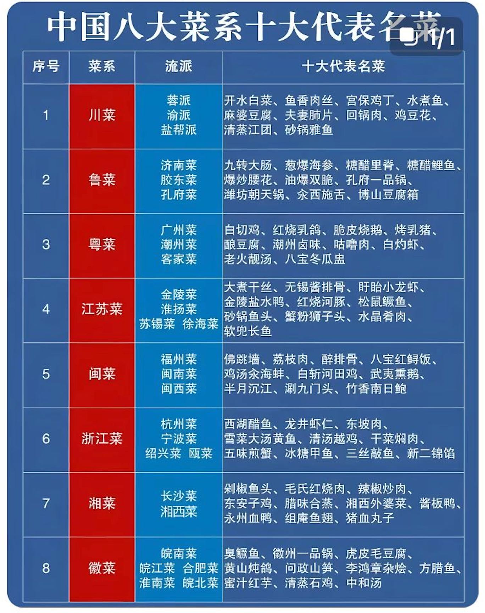

[toc]

# 美食品鉴

> https://www.dianping.com/member/2267779286/reviews

* 综合
  * 赵胤胤
* 鲁菜
  * 师傅陪我做鲁菜

* 西餐
  * 安妮大厨

## 食材

* 鲍鱼
  * “头” 是鲍鱼特有的**重量 - 数量对应规则**： **“一斤（司马斤，约 604.79 克 ）内有几只鲍鱼，就是几头”** 。
  * 所以 “4 头鲍” 指 **4 只鲍鱼加起来约 604.79 克** ，单只重量近 150 克（远超普通鲍鱼）。头数越少，单只个头越大、生长周期越长，价格和档次越高（比如 “双头鲍” 单只超 300 克，属顶级稀缺品 ）。
  * 问产地：
    * 日本网鲍（椭圆、边细肉厚，溏心软糯）、南非青边鲍（外壳泛青，肉质紧实弹牙 ）、中国福建东山鲍（国家地理标志，品种多、性价比高 ）
  * 问做法：鲜鲍适合清蒸（吃本味）、干鲍可问 “是不是溏心鲍”（溏心是干鲍顶级标准 ）；红烧、煲汤则适合入味。
  * 品细节： “肉质厚弹牙，溏心黏糯，火候刚好”

## 一些感悟

* 味型的数量决定了美食的上限，比如潮州菜，有独特的腌料、卤水、偏门食材，理论上限更高

* 食材的几个层次

  * 理解

    * 搭配
      * 创意菜

    * 深入理解
      * 雪崴天妇罗
      * 富临鲍鱼
      * 紫薇厅西湖醋鱼

  * 改造
    * 爱媛县橘子鲷

# 黑珍珠 & 米其林

## Intro

* 八大菜系：鲁菜、川菜、苏菜、粤菜、浙菜、闽菜、湘菜和徽菜
  * 

* 米其林：https://guide.michelin.com/hk/zh_HK

## 鲁菜

## 川菜

## 苏菜

### Intro

一、历史脉络：从 “四大” 到 “八大”，淮扬菜是核心根基

- **四大菜系阶段**：清初形成**鲁菜、川菜、粤菜、淮扬菜（苏菜雏形）** 四大基础菜系，淮扬菜凭借刀工精细、口味清鲜，与其他三地菜系并列，奠定中国饮食风味框架。
- **八大菜系扩容**：清末 - 现代，四大菜系进一步融合地方特色，细分出**浙菜、闽菜、湘菜、徽菜** ，共同组成 “八大菜系”。此时，**淮扬菜成为 “苏菜” 的核心代表分支** ，苏菜作为八大菜系之一，涵盖淮扬菜（淮安、扬州、镇江）、金陵菜（南京）、徐海菜（徐州、连云港）、苏锡菜（苏州、无锡、常州）等风味，淮扬菜是苏菜的精髓与招牌 。

二、菜系体系中：淮扬菜是苏菜的 “灵魂担当”

在八大菜系的 “苏菜” 范畴内，淮扬菜占据关键地位：

- **风味标杆**：苏菜追求 “清鲜平和、浓淡适中”，淮扬菜以刀工（如文思豆腐的精细切丝）、火工（清炖狮子头的慢炖技法 ）、本味呈现（大煮干丝的鲜醇 ），成为苏菜风味的典型体现，代表菜品（清炖蟹粉狮子头、扬州炒饭 ）更是苏菜对外传播的名片。
- **文化底蕴**：淮扬菜历史可追溯至春秋，兴于隋唐、盛于明清，是 “东南第一佳味”，其 “不时不食”（依季节选食材）、“雅俗共赏”（国宴与市井皆适配 ）的理念，深度影响苏菜乃至中国饮食文化，让苏菜在八大菜系中独具 “文人雅趣与民生烟火融合” 的气质 。

三、总结：淮扬菜是八大菜系中苏菜的核心分支

简单说，**八大菜系包含苏菜，苏菜以淮扬菜为核心代表** 。淮扬菜从 “四大菜系元老”，到融入八大菜系成为苏菜灵魂，既见证中国菜系从基础到丰富的演变，也凭借自身技艺与文化，成为八大菜系中 “精致、平和、底蕴深厚” 的独特存在，是理解苏菜乃至中国饮食体系绕不开的关键板块 。

### [米1黑1] [淮扬府(安定门店)](http://www.dianping.com/shop/G5leUTaSm4qGOalp)

* 偏甜口
* 鳝糊
* 鱼头
* 大闸蟹

### [黑1] [肆月河豚·新淮扬(中关村店)](http://www.dianping.com/shop/l9sibUqml16dyURz)

* 河豚手办

* TODO

## 粤菜

### [米3] 潮上潮(正大店)

> 北京

* 小吃
  * 黄皮豉绿豆糕、三种水果（莲雾蜜瓜等）
  * 佛手柑蜜饯
  * 梅菜花生米
  * 大芥菜腌切丝炒
* 前菜
  * 潮汕冻马友鱼饭：
    * 马友鱼=午笋鱼，刺少肉多，脂肪含量高；
    * 先盐水泡20min再蒸再冰块冻；配普宁豆酱；
    * 冻肉弹牙，咸鲜带甜回味香
  * 生拆蟹肉双色卷
  * 凤尾鱿拌夜来香：凤尾是鱿鱼的一种刀法
* 卤水
  * 卤水鹅掌拼嫩肝：
    * 鹅肝，先卤鹅肉再卤肝，醋搭配鹅肝，卤汁搭配鹅掌；
    * 广东澄海狮头鹅。先尝原味，再蘸汁，鹅肝绵密醇厚
* 主菜
  * 烟熏黄皮豉叉烧：黄皮豉是潮州三宝之一；叉烧选用梅肉，先黄皮豉烧，再香樟木烟熏；配凤凰单丛气泡茶+莲雾果汁
  * 潮州青榄炖花胶：配了三片角螺（响螺），用料足
  * 润烧脆皮妙龄鸽：润烧先卤再烤，17天，一点腥味没有，吃过最好吃的石岐乳鸽
  * 老菜脯扣酿辽参：陈年萝卜干，但只有酱，没有菜脯吃
  * 潮汕咸柠海上鲜（大黄鱼）
  * 南澳凉瓜酿鲜肉：凉瓜口感偏软
* 主食
  * 明炉酸汤星斑饺
* 甜品
  * 高烧双色冰淇淋（红薯脆片）
* 配酒
  * 贝尔维尼白中白香槟（100%霞多丽），清甜开胃
  * 罗纳酒庄红葡萄 四种葡萄 多汁甜美
  * 文森拉图 百变女王（葡萄品种）
  * 中华小芒森

### [融合鄂菜] [黑1] [丹青宴(武汉天地店)](http://www.dianping.com/shop/H3RK48ynrNYG2zWn)

* 粤菜和湖北融合，四人套餐的几个菜比较有湖北菜的风味
* 黄贡椒低温笋壳鱼
* 大管鱿鱼
* 麻城带皮羊排
* 家烧九孔野藕很好吃

### [黑1] [富临饭店](http://www.dianping.com/shop/Ha59fknixkpAMDOX)

> 北京
>
> 粵菜人物系列：楊貫一 https://guide.michelin.com/hk/zh_HK/article/people/Cantonese-cuisine-figures-Ah-Yat-Abalone
>
> * 炒飯至今仍是最受歡迎的堂弄菜式，而最能體現一哥的烹飪哲學：「味美型潔」——「味」和「美」是味道和外貌，在客人面前炒飯屬「型」，而「潔」則是清潔、整齊、「企理」。滔哥說：「一哥當時帶起了堂弄的潮流，因為中菜通常是一道道上，很少會來到客人面前即席烹調，這種現場表演的方式，大受食客歡迎， 亦開展了一哥提倡的中菜西食，以刀叉吃鮑魚等等的潮流。」
> * **清香陳皮咕嚕肉**
>   * 一定要用**未入過雪櫃**、每天交貨來的新鮮脢頭肉去做，每天大概賣多少份，就得把分量計算好。他說這肉因為沒有入過雪櫃，肉質很鬆軟、很彈牙，咬也不必出力。
> * 廣式薑蔥煎魚雲
> * 隱藏版的蝦米蒸腸粉
> * 鲍鱼大王：炭烤+砂锅
>   * 不管是產地、特質等構成鮑魚素質差別的原因，皆被楊貫一參透：「不要說不同產地有不同差別，即便同樣是同一批的野生吉品鮑，也會有參差！為什麼？原來，有的鮑魚困在夾縫裏生長沒有空間，肉質就會特別韌，怎麼煮都煮不軟！」而鮑魚買了回來，怎樣處理，也是成菜味道的一大關鍵。楊貫一說，鮑魚還是得要自己拿出來曬。「勤力點曬，鮑魚就會被曬得很舒服，舊水都要曬。」他說。而曬鮑魚的步驟，跟烹煮時能否誘發糖心環環相扣，這些都是靠經驗摸索而來，毫無捷徑可言。
>   * 鮑魚要做得成功，當然得要掌握到一套方法：例如，老母雞和排骨熬製一個上湯，雞的比例一定要多過豬肉，因為豬肉多會膩。然後要加入火腿，火腿的質素很重要，也楊貫一有自屬的手法，那就是試味試到夠味了，就把火腿撈起來，這火腿還是可以用在另一鍋上湯的製作。楊貫一說：「因為材料的味道不會永遠一致，即便比例不變，所以得要靠自己去試。」「這上湯用來煨鮑魚兩日，讓鮑魚入曬味，又不會掩蓋了鮑魚的鮮味。」
>   * 楊貫一的另一個堅持是用砂鍋去煨鮑魚：「以前能用**炭火**當然用炭火，現在就沒辦法了。」
>   * 楊貫一做事夠堅持，但從不墨守成規。「我去法國為總統做菜時，融入了法式飲食文化，那就是將煨好的鮑魚切片，用牛油把兩面煎得微焦香脆，結果非常好吃，人人都大讚。」可見思考前衛、善於觀察和變通，他沒有刻意 fusion，卻在上個世紀自然而然地做到了 fusion。

> https://guide.michelin.com/mo/zh_HK/article/dining-out/what-order-forum-other-than-abalone

* 波龙两吃

* 燕窝鱼翅
* 蒜蓉虾钳
* 鸡蛋清鱼子酱蒸虾肉；沙葛做泡菜
* 葱烧辽参

* TODO：下次吃富临鲍鱼。 

### [黑1] [鹏瑞莱佛士酒店·云璟 Yun Jing](http://www.dianping.com/shop/H6r9HbkYst3H1Xtv)

> 深圳
>
> 环境：70层，可观海，环境优雅 

* 前菜
  * 火焰低温柱贝山楂啫喱·鱼子酱：多种口感融合，考验味觉
  * 5J黑豚叉烧·配烧椒青茄：叉烧+青茄+烧椒，口味搭配不错
* 汤品
  * 中谷柱脯黄油菌炖花胶汤：鲜美！
* 主菜
  * 红花汁花雕水晶太子龙虾球·嫩豌豆：招牌菜，太子龙虾替换蓝龙虾
  * 沙巴利汁照烧深海鳕鱼配茄汁藜麦
  * 樱花虾酱炒台湾山苏菜
* 主食
  * 黑松露捞手工山药面
* 甜品
  * 老香黄枇杷慕斯·捞金丝官燕：精致甜品
  * 环球时令生果拼

### [黑1] [北京泰富酒店-柏景轩中餐厅](http://www.dianping.com/shop/G3VtQnk9NMvqeSFf)

* 醉蟹
* 果汁浸梨

### [黑1] [富春居](http://www.dianping.com/shop/HaOHo6riMq5txBL0)

* 这家主打品尝不同食材的口味口感，整体中规中矩
* 雪花黑牛的牛舌口感不错
* 老鼠斑
* 羊肉
* 麻黄鸡
* 海蜇

### [黑1] [利苑酒家(华熙国际店)](http://www.dianping.com/shop/EoVWA6uQ5um0NIaz)

> 北京

* 冰烧三层肉
* 鲍汁凤爪
* 老火靓汤
* 炸蟹

### [米1] 和苑酒家

> 广州
>
> 尝预制菜

* 豉油鸡
* 石岐乳鸽
* 上等牙拣翅
  * 来自深海蓝鲨，翅针软糯甘香、肉膜薄，翅皮滑、而带胶口、味道浓郁
  * 金汤配料：水、鸡肉、鸡脚、南瓜、猪骨、猪瘦肉、猪皮、马铃薯淀粉、食用盐

### [黑1] [洋房汤馆(武汉天地店)](http://www.dianping.com/shop/G42n8YkpMbQ6i2DK)

> 武汉

### [黑1] [官也街澳门火锅(新源里店)](http://www.dianping.com/shop/G7ShKhuqX0GibqT1)

> 北京
>
> http://m.ce.cn/bwzg/202506/t20250608_2319746.shtml
>
> 澳门火锅，特点是吃浓香锅底、海鲜蘸酱油、其它食材蘸酱

* 猪蹄猪肚锅，分量很足，可以少点一些别的菜
* 大龙趸，肉质细腻Q弹
* 响铃，吸收汤汁之后非常好吃
* 生蚝扇贝蛏子王
* 花牛腱
* 鸭血墨鱼滑
* 山苏
* 甜品

### [火锅] [黑1] 珍滋味海鲜火锅酒家（蓝色港湾店）

* 汤底：瑶柱粥
* 海鲜拼盘
  * 龙趸石斑鱼
  * 赤贝
  * 鱿鱼
  * 竹节虾
* 花雕牛舌
* 猪肚菌

### [黑1] [兰亭潮禧荟·潮州菜(香蜜湖店)](http://www.dianping.com/shop/l3CFesrYZZonWfrf)

> 深圳

* 卤水鹅掌
* 黄焖鱼翅
* 肉饼松叶蟹
* 龙头鱼蚝仔烙
* 乳鸽

### [金悦(金融街购物中心店)](http://www.dianping.com/shop/FPcwD2D5x1QfVFoQ)

> 北京
>
> 过去黑1
>
> 潮汕菜

* 鹅掌扣鲍鱼，主菜是鹅掌，鲍汁给鹅掌增鲜；
* 芥蓝口味醇厚；
* 牛展（牛腱）以及蚝仔煎都很嫩；
* 几种点心不错。
  * 鲜虾龙皇饺

### [金桂皇朝(新世界百货店)](http://www.dianping.com/shop/G624IR7VkGGWjBI7)

> 北京
>
> 关了

* 乳鸽、鱼头，比较正宗

### [万丽轩·粤菜(王府井金茂万丽酒店)](http://www.dianping.com/shop/irdxPTojjSGgpzZe)

> 北京

* 和室友吃双人自助，性价比还行

## 浙菜

### [黑2] [西湖国宾馆·紫薇厅](http://www.dianping.com/shop/l3diMq4HohXdFcyo)

> 杭州
>
> 黑珍珠套餐外加点两个菜，印象比较深刻的：

* 西湖醋鱼：名不虚传，肉质细腻绵软，入口即化
* 菜心焖笋：特别好吃，笋既有本味的清甜又有油焖的咸香，口味综合
* 酥皮茄子：不错，适合喜欢吃茄子的人
* 松茸饭：份量少，性价比低，只有两小碗。。。 
* 梅酱排骨
* 其它菜省略

### [杭宴1999·钱塘鱼鲜(未来科技城店)](http://www.dianping.com/shop/iuMwTEG1AFGYAzPO)

> 杭州

* 团建10人餐，素菜好吃，有些创意菜，性价比高

### [茶人村·只此江南(西湖总店)](http://www.dianping.com/shop/G5xiGHiPTDXcIH0k)

> 杭州

* 性价比不错，有西湖风味

### [康乐渔港·传统台州味道(未来科技城店)](http://www.dianping.com/shop/l1gkiRLklNO77xAz)

> 杭州

* 沙蒜豆面、雪花牛肉粒

## 闽菜

## 湘菜

### Intro

* 湘菜发展的讨论：https://www.sohu.com/a/546349387_112453

### [黑1] [芙蓉无双荣派湘菜](http://www.dianping.com/shop/H4qtBiN1rLAeo27d)

> 北京
>
> 多款招牌菜甚具水准：酸萝卜煲鲜牛肝菌猪肚汤采用炭火新鲜熬煮，剁椒蒸千岛湖大鱼头咸香鲜辣，两者均须提前预留。

* 剁椒蒸千岛湖大鱼头
  * 好吃，细腻、不辣、量大

### [米1黑1] [湘爱(凤凰汇店)](http://www.dianping.com/shop/l5fupRPOQN1Nv3lN)

* 干锅吮牛蛙
* 一品当家土猪肉
* 剁椒蒸千岛湖大鱼头

### 潇湘阁

* 干锅鱼杂、干锅肥肠
* 茶油蒸腊鸡
* 小炒肉、爆炒猪肝、酸辣鸡胗、酸萝卜牛肉、蒜苗回锅肉
* 酸辣牛肚、野山椒炒牛肉、小炒黄牛肉、油豆腐拆骨肉、砂锅牛蹄筋
* 家常豆腐、井冈山豆皮
* 空心菜

## 徽菜

## 京菜

### [黑2] [京艷·翰林书院](http://www.dianping.com/shop/k1pdH7Z1dL4X5HLJ)

> 北京，性价比不错

* 前菜
  * 白芦笋捞拌皮皮虾
  * 京葱冷吃带皮羊肉
  * 姜蓉沙窝萝卜
  * 鱼子酱皮蛋脆皮豆腐
* 一鸭三吃，味道不错
  * 皮蘸桂花蜜
  * 鱼子酱+鸭肉
  * 卷饼
* 主菜
  * 猪花胶干煎蟹肉
  * 葵花鸡
  * 陈皮酱煮东星斑
* 其它
  * 油冬菜
  * 红枣鸡汤
* 主食
  * 醋椒面

### [黑3] [烤鸭] [大董(融科店)](http://www.dianping.com/shop/l84gM47m9P6pNehB)

> 北京

* 烤鸭不油
* 外卖
  * 烤鸭饭
* 预制菜售卖

### [黑1] [烤鸭] [1949-全鸭季(金宝街店)](http://www.dianping.com/shop/l6jqjReBWRVHZ4Ou)

> 北京
>
> https://woman.udn.com/woman/story/123162/8034626
>
> 主廚精選北京白鴨與英國櫻桃谷鴨混血品種鴨子（皇帝鸭），重量約5斤風味最好，澆淋完鴨醋水後風乾，再放入以40年棗木燒製窯爐，攝氏260度烤至表皮金黃，色澤光彩耀人，薄片鴨皮蘸上一點白糖，入口爽脆異常，鴨皮油脂與白糖在舌尖融化，油香滋味令人難忘

* 烤鸭不腻、虾球嫩

### 新京熹 北京涮肉

* 阿尔巴斯白绒山羊雪花肩
* 锡盟草饲180天羔羊肉拼高钙羊肉
* 蘸酱
  * 麻酱：二八酱 + 榛子酱调制
  * 椒麻沙葱酱

## 沪菜

### [米2黑1] [屋里厢上海菜馆](http://www.dianping.com/shop/k1SFangFje74jJcT)

* 味道正宗，量大管饱。 红烧肉和熏鱼是典型的上海特色，元宵节吃了汤圆

## 鄂菜

### [黑1] [湖滨客舍(东湖店)](http://www.dianping.com/shop/lamShbOvbga3p4bl)

> 武汉
>
> 湖北菜的天花板，也有少量其它菜系。鱼丸和粉蒸鱼腩味道很好。

* 鱼丸
* 粉蒸肉
* 前菜
* 大白刁
* 粉蒸武昌鱼腩
* 波龙
* 江南文火小牛肉
* 甲鱼包子

### [黑1] 粗茶淡饭 · 壹号餐房

> 武汉

* 前菜：
  * 鸭舌、猪蹄
* 主菜
  * 椒香翘壳王：活鱼+青椒，一起蒸，极香
  * 黄贡椒蒸波龙
  * 青柠脆皮牛肉
  * 三丝鱼翅盅
  * 清炒藕带
  * 甲鱼裙边泡饭

### [黑1] [水樂棠江景餐厅](https://www.dianping.com/shop/G3jsOqUGBo7sLSN7)

> 武汉

* 吃的四人餐
* 「葱烧雪花牛肉」和「宫廷御膳鸭」口味不错，清淡口
* 焗菜心 和 生炒莴苣尖 两道青菜，口味做到了最好 
* 食谱石磨老豆腐
* 鮰鱼炖松茸
* 手工大馄饨
* 葱白炒九年百合

* TODO
  * 

## 新疆菜

### 品质伊骊

* 土豆牛腩好吃
* 羊腿肉手抓饭、大盘鸡拌面、羊肉串、烤羊肝、沙葱拌豆腐等，都不错
* 黄面烤肉、爆炒羊杂、辣皮子肉拌面、过油肉拌面

## 中餐创意菜

### [米2黑2] 京季荣派官府菜

> 北京
>
> 粤京鲁风格 官府菜
>
> 荣派官府菜·经典食单
>
> 通过沉淀和学习，寻觅国内外珍稀食材，以养生，时令，美味，创新为料理宗旨，抛石引玉，以飨食家。

* 前菜
  * 生炝大连赤贝
  * 油泼鲜鲍（4头）
  * 小菜：海瓜子（黄蚬）
* 烧卤
  * 干巴菌昆明烧乳鸭
  * 沙葱猪手
* 汤羹
  * 官府黄焖鱼翅
    * 海虎翅
    * 花雕酒激发黄焖汤底
* 主菜
  * 老北京烧海钓带鱼 
  * 北方虾酱蛋羹大花虾球
    * 产地南海；虾酱用虾壳、虾脑熬
  * 云腿浸时蔬
  * 脆皮牛胸配咖喱汁
  * 鸡油菌支竹咸猪骨煲淋时蔬
* 主食 PASTRY 
  * 风干羊肉北方炒饼 / 韭菜盒子
* 甜品
  * 甘葛枣桃胶蔗浆宫奶冻

### [黑1] [和木The Home·私厨(鼓楼汤公胡同店)](http://www.dianping.com/shop/l8xdPHNXPyK7V72C)

> 创意菜，鲁菜风格较多

> 第一次

- 四时和木餐前
  - 酸甜苦辣咸，峨眉苦笋作苦味
- 厚切蓝莓啫喱鹅肝
- 汤：碧水山珍金莲花
- 石炙松露牛肉
  - 低温慢炙，全熟但色泽红嫩
  - 搭配赠的新西兰黑皮诺红酒，口感不错
  - 配 璀璨夺目
- 秃黄油蒸蛋
  - 经典菜，鱼子酱的酸搭配秃黄油的咸腥，再用鸡蛋冲淡
  - 配 万物生
  - 口味有中和作用的菜品应该确保一起上，比如秃黄油和与之搭配的青菜豌豆酱，这样保证顾客有需要时能主动中和口味
- 翡翠扣白玉
  - 配 蟹之趣
- 主食
  - 三春油泼面
- 沉鱼落燕
- 水果
- TODO：再尝尝

> 第二次
>
> 咏夏・迎宾宴 988 元 / 位

* 五味
  * 酸：五香蛰头
  * 甜：胭脂甜虾
  * 苦：凤尾苦瓜
  * 辣：皮蛋茄子
    * 酸浆草+皮蛋

* 頭盤 Appetizer
  * 琥珀玫瑰醋蟹：味道偏酸了，放在后面好点
  * 金丝扇贝、素翅

* 松茸茉莉冬瓜盅

* 主菜 Main course
  * 魁首家传统海参：葱烧海参，下面铺藜麦
  * 夏日慢煮牛小排
    * “全熟”≠“干柴”
    * 低温慢煮的全熟牛小排，能避免传统高温煎烤的“干柴”问题，靠2点实现：
      * 汁水锁留：真空密封+低温环境，让牛肉汁水不流失，即使全熟也保持湿润。
      * 纤维软化：长时间慢煮（尤其针对牛小排的筋膜），让结缔组织分解为明胶，增加嫩度（比如牛小排的筋，高温会变硬，低温慢煮却能变糯 ）
    * 简单说，低温慢煮牛小排的“全熟”，是 精准控温+时长 共同作用的结果——既满足熟度安全，又靠技术保留了牛肉的嫩度和汁水，和传统“煎全熟牛排”的干柴口感完全不同

- 油浸野游大黄鱼
  - 油浸技法，口味类似水煮鱼
  - 野游因为跟着游轮
  - 配 薄荷、薄荷汁 Paired with Mint juice

* 夜香花兰州九年百合
  * 墨鱼汁脆盏

* 夏日一口鲜
  * 蔬菜、鲅鱼、虾、米

* 甜品
  * 杏汁黑芝麻 

### [黑1] [宴锦堂(隆福寺店)](http://www.dianping.com/shop/jpzTTmzT4Ksm0W8x)

> 北京
>
> https://www.thetigerhood.com/yan-jin-tang/
>
> TODO：豪华双人餐可吃

* 脆葱慢煮鲍鱼
* 独头蒜烧江鳗
* 伊豆辣椒黑蒜松板肉
* 酸萝卜海蜇皮
* 小黄鱼面
* 炝拌丝瓜苗

## 中西创意菜

### [黑1] [Ling Long](http://www.dianping.com/shop/G7rIp3ZLgyw2NZ5x)

> 北京
>
> 中餐西式服务，理论上可以全程不用刀叉。

* 真鲷鱼生清甜
* 蚝牛口感细腻
* 贵州酸菜鱼木姜味浓
* 酱制白菜作甜品有趣。 
* 有配酒
* TODO

### [黑1] [曲廊院(东四十一条店)](http://www.dianping.com/shop/H2R0vlF69ryIjaax)

> 北京
>
> 2021.6.27
>
> 2021.12.11
>
> 中餐西做，整体还是比较正。

* 主菜系列1
  * 杂菌：牦牛肉丝的香气衬托菌类，而非相反，有创意。 
  * 佛手香黄鸡：入口回甘浓厚。 
  * 和牛小排：老树乌龙，口味中和 m9和牛的油花 
* 主菜系列2
  * 和牛小排、鱼、菌、螺、双脆、鸡、茴香头
* 配茶配酒
  * 白牡丹茶
  * 四款国产大牌酒
* TODO

### [黑1] 青岚

> 杭州

* 前菜
  * 蔬菜：花菜+蔬菜汤+孔泰芝士
  * 脆：竹笙+菌菇+棕榈芯
  * 亚洲：牛蛙+墨鱼+亚洲酱汁
  * 章鱼：章鱼+土豆+京葱
* 主菜：
  * 甘鲷鱼鳞烧（油淋+炭烤）+桃子+乳清芝士
  * 5日熟成绍兴麻鸭+莲藕+藤椒
* 饭
  * 腌笃鲜饭

## 西餐

### [黑1] [Ambre Ciel 珀餐厅](https://www.dianping.com/review/2598000304)

> 杭州

Spanish Bluefin Tuna
Bluefin Tuna Tartare, 10Yrs Caviar, Dashi Gelee
西班牙金枪鱼塔塔，10 年鱼子酱，鲣鱼清汤啫喱

------

Mozambique Langoustine
Char-grilled, Iberico Ham Crumbles, White Peach Sabayon
炭烤莫桑比克鳌虾，伊比利亚火腿末，白水蜜桃香槟沙巴雍

------

Pan Seared Sea Bream
Olive Oil Confit Baby Calamari, Bonito Yuzu Jus
香煎东海真鲷鱼，油封小鱿鱼，柚子胡椒汁

------

Paccheri Pasta
Beef Bolognese Stuffed, Pesto Sauce, Aged Parmesan Cheese
意大利管面，茄牛肉酱，罗勒酱，陈年帕玛森芝士

------

Iberico Pork Secreto
Roasted Foie Gras, House-made Sausages, White Port Raisin Sauce
伊比利亚猪排，煎鸭肝，自制香肠，白波特提子汁

### [黑1] [The Georg(东华门店)](http://www.dianping.com/shop/H1VxDTW6es76OBCP)

> 北京，性价比一般

* 坚果乳+刁草油+金枪鱼+白萝卜+昆布
* 鱼子酱+根芹+洋葱牛肉汁+芝士泡沫
  * 根芹地中海特有，口感绵密
* 扇贝+白味增+蟹子异香汁
* 海螯虾+辣白菜+舞茸菌
  * 舞茸菌蘸酱味道有点重
* 羊肩
* 鸭肉
* 和牛
* 面包味道不错

### [牛排] [黑1] [沃夫冈牛排馆Wolfgang’s Steakhouse(三里屯店)](http://www.dianping.com/shop/k7E6uNvgkc3J1hcs)

> 北京

* 五分熟肉脸，肥嫩多汁

### [牛排] [黑1] [Aqualand源(好百年店)](http://www.dianping.com/shop/l1WO0VASIPcLRMST)

> 武汉

* 菲力惠灵顿牛排：招牌美国极佳CAB冰鲜
* 鲜活波士顿龙虾（香草黄油焗/芝士焗）
* 鹅肝
* 火腿意面

### [牛排] [黑1] [MORTON'S 莫尔顿牛排坊(北京丽晶酒店)](http://www.dianping.com/shop/H1OqHY6vJGDAwjht)

> 北京
>
> 两次

* 五分熟肉眼，真的很难一口气吃掉一整块
  * 鹰牌黑醋调味汁
* 和沃夫冈对比：
  * 沃夫冈腻一点
  * 这边搭配的其它菜多一点。 

* TODO：T骨套餐

## 法餐

### [黑1] [LES MORILLES樂·墨瑞](http://www.dianping.com/shop/k3fFH2HheBakU1uq)

> 北京

* 第一次
  * 香煎鸭胸肉
  * 海胆鱼子酱慕斯
* 第二次
  * 帝王蟹三吃：
    * 海胆奶冻+蔬菜；
    * 墨鱼汁粉+沙拉+鱼子酱+香菜；
    * 炭烤+贵州木姜子油
  * 卤水鹅肝+糖渍金桔胡萝卜
  * 炭烤芦笋+沙拉+柚子汁+藕片+芝麻菜+冰叶
  * 炭烤大连鲍鱼 黑松露鲍鱼肝酱
  * 炭烤东星斑 青黄节瓜 马赛鱼汤
  * 鸽子 柑橘汁 玉兰菜 黑莓 紫薯慕斯
  * 百合奶冻

### [黑1] [啫啫021法式铁板烧(金色华府店)](http://www.dianping.com/shop/H4LP208ejW38vjop)

> 武汉

### [黑1] [AZUR聚(香格里拉饭店)](http://www.dianping.com/shop/l4Ghd9CQ7WOp7Kse)

> 北京，去过两次

* 海鲜的拼盘与前菜，口味上重复了，有点难受
* 主菜（两种选一）
  * 牛排肉质嫩
  *  鳕鱼主菜和鹅肝前菜都比较标准。
* 鱼汤略带苦味点缀，还不错（苦味源自用于去腥的白兰地）

### [黑1] [Oyster Talks 四度蚝法餐厅](http://www.dianping.com/shop/l42L2I9zaySEztQN)

> 北京

* 皇御生蚝
  * 黑珍珠套餐生蚝只有一只，最好先吃一只，中途再点一两只，解腻
* 鸽子五成熟，马德拉酒调味酱
* 虎虾
* 扇贝酿虾肉慕斯
* 金丝蛙腿

## 意餐

### [黑1] [北京四季酒店·MIO](http://www.dianping.com/shop/H5CfTveZDODlyj5m)

> 北京

* 黄鳍吞拿鱼：水瓜柳 凤尾鱼酱汁 肉质相比金枪鱼鲜甜
  * **水瓜柳**：源自地中海的酸渍小黄瓜，味道酸、咸且带草本清香，能**解腻提鲜**，中和黄鳍吞拿鱼的油脂感（若轻煎 / 炙烤），增添清爽层次，也赋予 “异域风味标签” 。
  * **凤尾鱼酱汁**：凤尾鱼（银鱼柳）经熬煮、打碎制成酱汁，自带浓郁咸鲜、海洋发酵风味，可**强化整体鲜味浓度**，让黄鳍吞拿鱼的本味更突出，同时衔接水瓜柳的酸香，形成 “酸 - 鲜 - 咸” 的味觉递进 。
* 千层茄子 罗勒叶和番茄 最后清蒸一下
* 柠檬芝士烩饭，黑蒜酱 罗勒油 薏米
* 海虹（青口贝）鹰嘴豆
* 意式小牛肉 低温慢煮牛里脊
* 意大利饺子：mortadella火腿 猪牛里脊

### [黑1] [融合日料] [Amico BJ](http://www.dianping.com/shop/k8Mc2bXDIpzys87H)

> 北京
>
> https://www.sohu.com/a/554341553_121119038

* 牛里脊M5有香气，配猪肚菌不错
* 辣味橄榄油
* TODO：长白山蚂蚁

### [黑1] [Opera Bombana](http://www.dianping.com/shop/ilSl6fhaKxVKsgAK)

> 北京，已关门

SCAMPI
ROASTED SCAMPI, CELERY ROOT EMULSION,
FRESH CORIANDER & LOBSTER JUS

* 香烤螯虾，芹菜根乳，新鲜香菜，龙虾汁

------

Fettuccine **传统意式长面**
EGG YOLK FRESH PASTA, KING CRAB, SHELLFISH EMULSION,
MORINGA LEAF

* 手工自制意式帝王蟹宽面，贝类浓汁，清香木
  * 意式帝王蟹宽面口味不错

------

GNOCCHI
HOMEMADE POTATO GNOCCHI, OXTAIL STEW, AROMATIC ALPS
CHEESE

* 手工意式土豆面团配牛尾，芳香芝士

------

LAMB
ROASTED NEW ZEALAND LAMB, BRAISED SPRING VEGETABLES,
FRESH BLACK TRUFFLE

* 香烤新西兰羊排，慢炖春季蔬菜，新鲜黑松露

------

BEEF
SHORT RIB & TENDERLOIN, ROASTED YUNNAN PUMPKIN,
RED WINE & PLUM SAUCE

* 慢炖牛小排及烤牛里脊，香烤云南南瓜，红酒李子汁

------

CHERRY AND PISTACHIO

* 手工自制樱桃开心果冰淇淋

------

HAZELNUT
HAZELNUT AND CHOCOLATE CREAM

## 日料

### Intro

* 怀石料理
* 寿司的本质是 **“醋饭（寿司饭）+ 配料（鱼生 / 海鲜 / 其他食材）”** 的组合。

### [黑1] [雪崴(中国红街店)](http://www.dianping.com/shop/k9xaveZ0Dg3RXZTI)

> 北京
>
> https://zhuanlan.zhihu.com/p/27318266
>
> https://m.mingchu.co/newsview?id=1705
>
> 美食评论家山本益博说：「把炸鱼称为天妇罗是对天妇罗最大的误会。」
>
> 料理人根据不同食材的特性，用不同手法加工处理，突出其优势特点，包括挂浆程度、油温、时间的掌握，都是为了更好的将食材中多余的水分除去，带走不好的异味，让最纯正的本味保留下来
>
> 雪崴说制作天妇罗的第一步是用过滤水、鸡蛋与低筋面粉调制面糊。
>
> **温度、时间与味觉**
>
> 制作基围虾天妇罗时，将虾身裹好浆后，在200℃的油中炸制24秒左右捞出，此时**虾芯的温度最接近45℃，呈半透明状态，而人的舌头在这个温度时味觉最为敏锐，也最能尝出虾肉极致的鲜与甜**。虾身和鱿鱼非常适合这种短炸的方式，虾头需要炸2-3分钟。而薯类、蔬菜因含水量较大，炸制的时间需要相对长一些，以便将多余的水分彻底排除，此时芯的温度约为80-90℃。

* 第一次吃高端的天妇罗日料，感觉天妇罗相比其它日料更贴近中国人的口感，裹上一层的食材口感层次更丰富，“外酥里嫩”，口感轻盈、内部汁水充盈、新鲜嫩滑
  * 天妇罗蘸料两种：萝卜泥酱汁、海盐
* 前菜松叶蟹刺身
* 唐扬河豚鱼（额外加的）：河豚肉没有腥味，是最好吃的炸鱼
* 虾头：招牌菜，别有风味
* 虾虎鱼：肉质柔嫩
* 鱿墨鱼：高端的鱿鱼，韧性足
* 甲鱼清汤：裙边柔嫩有嚼劲
* （绿）紫苏叶包海胆：招牌菜
* 银杏 冬笋 芦笋 香菇 板栗
* 带鱼
* 河豚鱼白：口感不错
* 星鳗：一鱼两吃
  * 鱼尾蘸盐
  * 鱼身蘸汁
* 盖饭：配扇贝味增汤

### [黑1] [鱼新(体育场东路小区店)](http://www.dianping.com/shop/H7SjsPhtwJgdQGeL)

> 北京，日本赤坂鱼新（1887年创立的米其林一星餐厅）唯一海外分店

* 醋啫哩赤贝加拿大海胆
* 深海苔鲍鱼蒸蛋
* 金枪鱼天身、大腹、大竹荚鱼 …
* 859套餐多了和牛鹅肝银鳕鱼
* 鲍鱼刺身鱼子酱
* 天妇罗
* 手握寿司：
  * 扇贝、鲷鱼、金枪鱼中腹和大腹连接部位、各种海胆寿司

### [黑1] [晴空·日本料理(万象城店)](http://www.dianping.com/shop/l1sUqGz2scb3VsVo)

> 深圳

很正统的店，从食材选取到制作手法充分考虑了时令、食客口味、材料价值等因素

* 盐水海胆：海胆作为配菜的思路，玉米汁为主材，配莼菜
* 松叶蟹肉丸子：搭配茗荷
* 平目鱼刺身
* 金枪鱼中腩：海苔酱
* 松茸天妇罗：香格里拉松茸
* 鳗鱼卷
* 和牛寿喜烧
* 水蜜桃甜品

### [黑1] [鮨藤本 Sushi Fujimoto(北京店)](http://www.dianping.com/shop/l8SlZi09HViAhZ6T)

> 北京

* 胡麻豆腐松叶蟹、苹果酱小白菜章鱼、牡丹虾绍兴酒鱼子酱、鳗鱼小黄瓜、喉黑鱼九条葱、太刀鱼蚕豆天妇罗配紫苏
* 寿司：
  * 金目鲷
  * 金枪鱼中腹
  * 大腹
  * 蛇腹
  * 北极贝
  * 小竹筴鱼
  * 车虾
  * 海胆
* 卤豆皮包星鳗

### [烤肉] [黑1] 牛者烧肉

> 日式烤肉：**“食材本味至上 + 炭火炙烤技艺 + 简约调味”**

### 龙之介 鮨・割烹 (美爵店)

> 杭州

* 金枪鱼大腹
* 赤贝牡丹虾
* 金吉鱼、红姜芽
* 天妇罗
* 松叶蟹 蟹拐（钳子肉条？）
* 枪鱿鱼

## 韩式料理

### [黑1] [爱江山(西四环店)](http://www.dianping.com/shop/Haka81OFpmFRr07W)

> 武汉

* 烤肉

## 素菜

### [黑1] [山河万朵中国素食VEGE WONDER(王府中环店)](http://www.dianping.com/shop/k9Cm4GwWvYZHv5sO)

> 北京，已关门
>
> 餐厅的装饰：灯好好看！原料是喜马拉雅粉盐，盐的外侧涂了一层蜡防止化掉，每个灯的纹路都有不一样的美，以后家里也想有这样的灯！

* 整体评价：中餐创意菜的风格，符合定位；素菜分量足，适合午餐吃。位于王府中环，北京高端商业区。
* 前菜
  * 秉承了高级中餐厅前菜“五味”调和的设计思路，先甘甜、再清香、后咸辣、最后回归酸甜开味，顺序地给人味觉体验。 
  * 番茄：配茉莉花茶和沙棘啫喱，味甘甜
  * 紫菜：选用福建福鼎头次采割紫菜，配青瓜橄榄油，突出一个清香
  * 茄子：配脆片和豆腐，咸辣口
  * 向日葵：用紫苏子作为“葵花”的籽，寓意不错，忘拍照了呜呜呜
* 松茸竹荪汤
  * 松茸+竹荪+马蹄+油菜花，油菜花的选用非常惊艳。前三者或是香气十足，或是口感绝佳，而油菜花略带涩味的香味，能从前几大食材中脱味而出。 
* 花园
  * 菜如其名，缤纷的花园。
  * 樱桃萝卜、拇指萝卜、胡萝卜、羊肚菌、鸡枞菌、厚菇焗芝士、鹌鹑蛋、小土豆、节瓜。
* 紫菜
  * 原料采用日本紫菜，烤制而成。整体的制作方式和口感有点像春卷。
* 鸡头米
  * 原料口感较淡，用酱料增味，算是尝鲜养生了。
* 牛肝菌
  * 牛肝菌因其肥美，更像是素材中的大荤菜。这道菜的制作方式也很有意思，先在盘子里模拟牛肝菌的生长环境，周围放上松果、香料，现场用喷枪烤制。另外蔬菜饼会用竹炭素上色，新材料get。
* 萝卜糕+百合
  * 萝卜糕搭配素的xo酱（原料香菇），从这可以联系到，香菇+鹅肝也是一种很好的食材搭配。
  * 百合配雪燕，口感搭配适宜。
* 松茸烩饭
  * 香，不只有松茸的香，米饭中加入了秘制杂菌香菇酱，也比较香。
* 佛手瓜：餐后小点

### [黑1] [朴竺·植物料理](http://www.dianping.com/shop/G3Mtz61eCAQlonh9)

> 杭州，茶、菜、景 

* 小吃：
  * 蘑菇脆片（腌制、蘑菇酱）
  * 水果：梦幻泡影（燕窝果、大连樱桃、菠萝蜜、蓝莓）
* 前菜
  * 春卷石耳（咸味，卤水）
  * 百合核桃（兰州九年百合）沙核桃仁酱
  * 柠檬菠菜盏：比海苔清甜，柠檬酸
  * 甜豆（脆片和酱）：甜，比菠菜香
  * 棕榈芯：更香
* 汤
  * 松茸菊花汤（菊花是娃娃菜雕刻） 七宝琉璃勺
* 主菜
  * 烟熏猴头菇黑虎掌菌：迷迭香苏子叶孜然桂皮
  * 根芹汁（口味像高级版土豆泥）、节瓜做洋蓟造型、底部洋蓟泥（清甘和润）
  * 茭白脆片、茭白饺子包裹西芹、越式咖喱（更温和） 
  * 藕饼、藕粉面皮、旱金莲、可食用碳粉、番茄黑胡椒酱汁
  * 白松露烩珍仁米
  * 南瓜笋菌烩饭 
* 饮品
  * 石斛汁 酸奶
  * 餐后老六堡茶