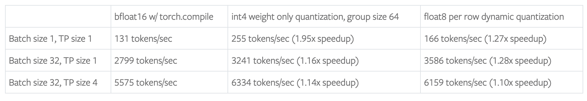
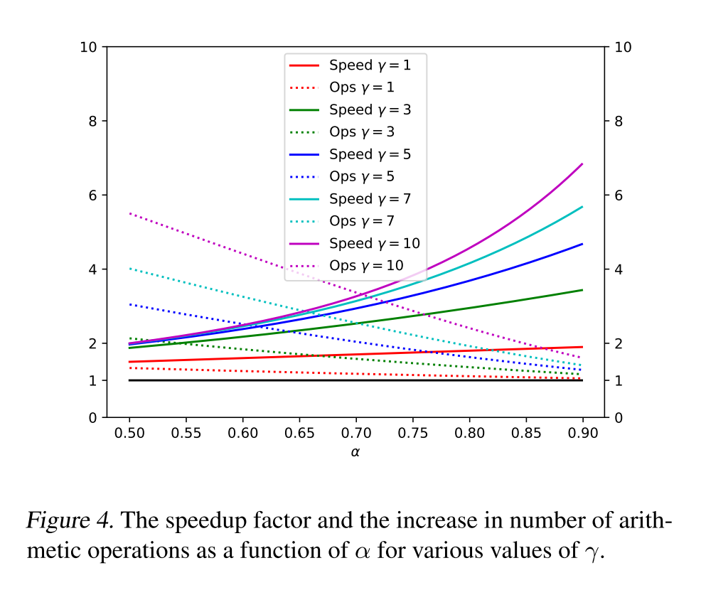
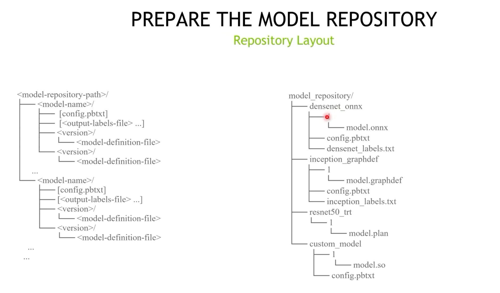
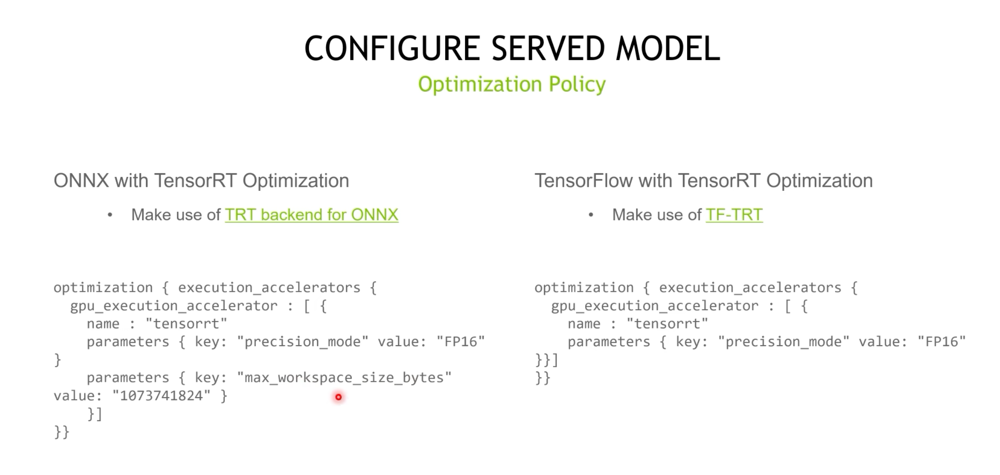
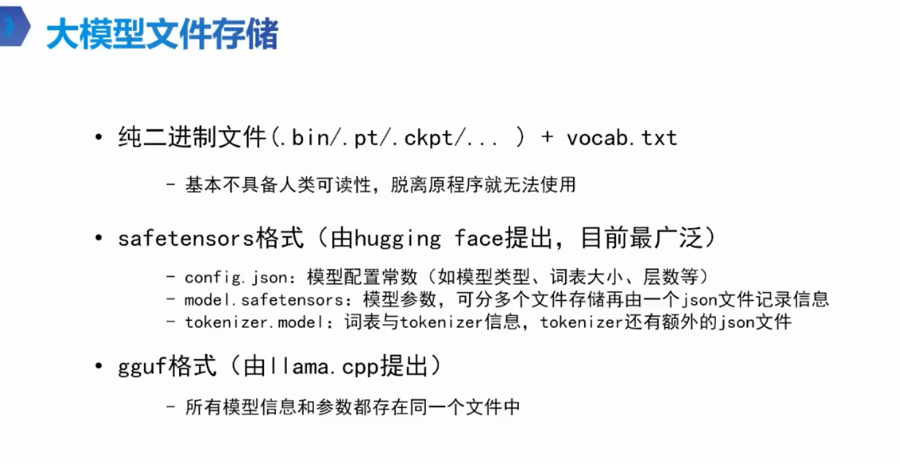

# LLM MLSys

[toc]

> https://cs.stanford.edu/~chrismre/#papers

## 训推系统

### Intro

#### 推理系统 Overview


#### 系统、算法、数据的共同演进

* **研究即工程**：Gemini 3 负责人指出，大模型研发已不再是单纯训练一个网络，而是构建一个围绕神经网络的**复杂系统**（System）。
* 算法与系统的边界日益模糊，硬件架构（如 TPU Pods）与模型架构（如 MoE）需协同设计。


#### 硬件，内存互连、异构协同很关键

* LLM推理到底需要什么样的芯片？ https://wallstreetcn.com/articles/3709523


### 技术发展

* Memory Efficient Attention with Online Softmax (2021) -> FlashAttention in Megatron-LM (2022) 
* Continuous Batching (2022), Paged Attention (2023) -> vLLM, TensorRT-LLM (2023) 
* Speculative Sampling (2023) -> Everywhere in LLM Serving (2023)
* Sequence Parallel (2023) ->  Megatron-LLM (2023) 

### 业务目标：MFU、故障率等

> https://mp.weixin.qq.com/s/llalxX6miJRxy0-Vk8Ezpg

* MFU（Model FLOPs Utilization）
* 故障率：在大规模的集群中，推理请求的故障率，因为在一万张卡的集群中，如果每几分钟就有一张卡挂掉，那么这会影响整体效率，或者说看故障时间占在整个有效训练时间的占比，如果说是故障的时间占训练时间比例超过30%，也非常影响效率；

### LLM模型&资源决策

> * 微调的显存消耗小
> * 对于许多不需要 H 系列所有高级功能（如最高带宽的 NVLink、全面的 ECC 内存、特定的虚拟化支持或单卡最大显存）的场景，4090 是一个更经济的选择
>   * 注意4090功耗&散热吃亏，32B+ 模型需高功率电源（1000W+）和散热系统


* **低配使用（计算资源有限）**
  * Int4量化，约2K上下文

<table align="left">
<thead>
<tr>
<th style="text-align:center">模型（int4）</th>
<th style="text-align:center">所需显存GB</th>
<th>推荐GPU</th>
<th>参考模型</th>
</tr>
</thead>
<tbody>
<tr>
<td style="text-align:center">0.5B</td>
<td style="text-align:center">&lt;5G</td>
<td></td>
<td>Qwen2-0.5B-Instruct</td>
</tr>
<tr>
<td style="text-align:center">1.5B</td>
<td style="text-align:center">&lt;3G</td>
<td></td>
<td>Qwen-1_8B-Chat, Qwen2-1.5B-Instruct</td>
</tr>
<tr>
<td style="text-align:center">6B</td>
<td style="text-align:center">4G</td>
<td></td>
<td>Yi-6B-Chat-4bits</td>
</tr>
<tr>
<td style="text-align:center">7B</td>
<td style="text-align:center">&lt;11G</td>
<td></td>
<td>Qwen2-7B-Instruct，Qwen-7B-Chat-Int4</td>
</tr>
<tr>
<td style="text-align:center">14B</td>
<td style="text-align:center">13G</td>
<td></td>
<td>Qwen-14B-Chat-Int4</td>
</tr>
<tr>
<td style="text-align:center">34B</td>
<td style="text-align:center">20G</td>
<td></td>
<td>Yi-34B-Chat-4bits</td>
</tr>
<tr>
<td style="text-align:center">57B</td>
<td style="text-align:center">&lt;35G</td>
<td></td>
<td>Qwen2-57B-A14B-Instruct</td>
</tr>
<tr>
<td style="text-align:center">72B</td>
<td style="text-align:center">&lt;47G</td>
<td></td>
<td>Qwen2-72B-Instruct</td>
</tr>
<tr>
<td style="text-align:center">130B</td>
<td style="text-align:center">-</td>
<td>8 * RTX 2080 Ti(11G) <br> 4 * RTX 3090(24G)</td>
<td>GLM-130B</td>
</tr>
<tr>
<td style="text-align:center">236B</td>
<td style="text-align:center">130G</td>
<td>8xA100(80G)</td>
<td>DeepSeek-V2-Chat</td>
</tr>
</tbody>
</table>


* 中配
  * int8、4k/6k上下文

<table align="left">
<thead>
<tr>
<th style="text-align:center">模型（int8）</th>
<th style="text-align:center">所需显存GB</th>
<th>推荐GPU</th>
<th>参考模型</th>
</tr>
</thead>
<tbody>
<tr>
<td style="text-align:center">0.5B</td>
<td style="text-align:center">6G</td>
<td></td>
<td>Qwen2-0.5B-Instruct</td>
</tr>
<tr>
<td style="text-align:center">1.5B</td>
<td style="text-align:center">8G</td>
<td></td>
<td>Qwen2-1.5B-Instruct</td>
</tr>
<tr>
<td style="text-align:center">6B</td>
<td style="text-align:center">8G</td>
<td></td>
<td>Yi-6B-Chat-8bits</td>
</tr>
<tr>
<td style="text-align:center">7B</td>
<td style="text-align:center">14G</td>
<td></td>
<td>Qwen2-7B-Instruct</td>
</tr>
<tr>
<td style="text-align:center">14B</td>
<td style="text-align:center">27G</td>
<td></td>
<td>Qwen-14B-Chat-Int8</td>
</tr>
<tr>
<td style="text-align:center">34B</td>
<td style="text-align:center">38G</td>
<td></td>
<td>Yi-34B-Chat-8bits</td>
</tr>
<tr>
<td style="text-align:center">57B</td>
<td style="text-align:center">117G (bf16)</td>
<td></td>
<td>Qwen2-57B-A14B-Instruct</td>
</tr>
<tr>
<td style="text-align:center">72B</td>
<td style="text-align:center">80G</td>
<td></td>
<td>Qwen2-72B-Instruct</td>
</tr>
<tr>
<td style="text-align:center">130B</td>
<td style="text-align:center">-</td>
<td>8xRTX3090 (24G)</td>
<td>GLM-130B</td>
</tr>
<tr>
<td style="text-align:center">236B</td>
<td style="text-align:center">490G(bf16)</td>
<td>8xA100 (80G)</td>
<td>DeepSeek-V2-Chat</td>
</tr>
<tr>
<td style="text-align:center">340B</td>
<td style="text-align:center">-</td>
<td>16xA100(80G) <br>  16xH100(80G) <br>  8xH200</td>
<td>Nemotron-4-340B-Instruct</td>
</tr>
</tbody>
</table>


* 高配
  * Bf16，32K上下文

<table align="left">
<thead>
<tr>
<th style="text-align:center">模型（fb16）</th>
<th style="text-align:center">所需显存GB</th>
<th>推荐GPU</th>
<th>参考模型</th>
</tr>
</thead>
<tbody>
<tr>
<td style="text-align:center">0.5B</td>
<td style="text-align:center">27G</td>
<td></td>
<td>Qwen2-0.5B-Instruct</td>
</tr>
<tr>
<td style="text-align:center">1.5B</td>
<td style="text-align:center">30G</td>
<td></td>
<td>Qwen2-1.5B-Instruct</td>
</tr>
<tr>
<td style="text-align:center">6B</td>
<td style="text-align:center">20G</td>
<td></td>
<td>Yi-6B-200K</td>
</tr>
<tr>
<td style="text-align:center">7B</td>
<td style="text-align:center">43G</td>
<td></td>
<td>Qwen2-7B-Instruct</td>
</tr>
<tr>
<td style="text-align:center">14B</td>
<td style="text-align:center">39G(8k)</td>
<td></td>
<td>Qwen-14B-Chat</td>
</tr>
<tr>
<td style="text-align:center">34B</td>
<td style="text-align:center">200G(200k)</td>
<td>4 x A800 (80 GB)</td>
<td>Yi-34B-200K</td>
</tr>
<tr>
<td style="text-align:center">57B</td>
<td style="text-align:center">117G</td>
<td></td>
<td>Qwen2-57B-A14B-Instruct</td>
</tr>
<tr>
<td style="text-align:center">72B</td>
<td style="text-align:center">209G</td>
<td></td>
<td>Qwen2-72B-Instruct</td>
</tr>
</tbody>
</table>


### DeepSeek-V3 (MoE)

* prefill
  * The minimum deployment unit of the prefilling stage consists of 4 nodes with 32 GPUs. The
    attention part employs 4-way Tensor Parallelism (TP4) with Sequence Parallelism (SP), com-
    bined with 8-way Data Parallelism (DP8). Its small TP size of 4 limits the overhead of TP
    communication. For the MoE part, we use 32-way Expert Parallelism (EP32), which ensures that
    each expert processes a sufficiently large batch size, thereby enhancing computational efficiency.
    For the MoE all-to-all communication, we use the same method as in training: first transferring
    tokens across nodes via IB, and then forwarding among the intra-node GPUs via NVLink. In
    particular, we use 1-way Tensor Parallelism for the dense MLPs in shallow layers to save TP
    communication.
    * **redundant experts**：For each GPU, besides the original 8 experts it
      hosts, it will also host one additional redundant expert
  * simultaneously process two micro-batches with similar computational workloads, **overlapping the attention and MoE of one micro-batch with the dispatch and combine of another.**
    * exploring a dynamic redundancy strategy for experts, where each GPU hosts
      more experts (e.g., 16 experts), but only 9 will be activated during each inference step

* decoding
  * The minimum deployment unit of the decoding stage consists of 40 nodes with 320 GPUs.
  * The attention part employs TP4 with SP, combined with DP80,
  * the MoE part uses EP320.
    * each GPU hosts only one expert, and 64 GPUs
      are responsible for hosting redundant experts and shared experts
    * the batch size per expert is relatively small (usually within 256 tokens), and the bottleneck is memory access rather than computation
      * **allocate only a small portion of SMs to dispatch+MoE+combine.**
  * 通信优化
    * DeepEp：leverage the IBGDA (NVIDIA, 2022) technology to further minimize latency and enhance communication efficiency.
    * **overlap the attention of one micro-batch with the dispatch+MoE+combine of another.**

## 成本和性能评估

* Intro
  * AIGC是大国的游戏
    * 欧洲受欧盟法案影响，ai发展没跟上

  * AI系统：记录数据、与人交互、机器学习分析、预测、干预人的决策

### MFU、HFU

* Hardware FLOPS Utilization

  * 考虑了计算换空间

* MFU（Model FLOPs Utilization）：

  * 评估GPU算力的有效利用率

* | 模型          | 参数规模 | MFU    | 硬件配置   |
  | ------------- | -------- | ------ | ---------- |
  | PaLM          | 540B     | 46.2%  | 6144 TPUv4 |
  | Megatron-LM   | 530B     | 56.0％ | 3072 A100  |
  | Mosaic ML     | 70B      | 43.36% | 128 H100   |
  | 字节MegaScale | 175B     | 55.2%  | 12,288 GPU |

### FLOPS

* Am,k * Bk,n : `2*m*n*k` FLOPS
  * 乘和加各算一次
* transformer
  * 设C为emb size、T为seq len
  * 一层Transformer
    * FLOPS： `24BTC^2 + 4BCT^2` 
    * Params：`12C^2+13C`
  
  * attn的计算占比是$$\frac{4BCT^2}{24BTC^2+4BCT^2} = \frac{T}{6C+T}$$
    * 在$$T < 6 \times C$$时，整体计算压力在 FFN+QKVO Proj 部分；在 $$T > 6 \times C$$时，整体计算压力在Attention 部分。
    * GPT3-175B C = 12288, T = 8192
  

```Python
# x : [B, T, C]
# B : batch_size
# T : seq_len
# C : dimension

x = layernorm(x)
q, k, v = qkv_proj(x).split()
# [B, T, C] x [C, 3C] -> [B, T, 3C]: 6BTC^2 FLOPS
attn = q @ k.T
# [B, T, C] x [B, C, T] = [B, T, T] : 2BT^2C FLOPS
attn = softmax(attn)
# 3BT^2*n_h, softmax计算量被忽略
y = attn @ v
# [B, T, T] x [B, T, C] -> [B,T, C] : 2BT^2C FLOPS
y = proj(y)
# [B, T, C] x [C, C] -> [B, T, C] : 2BTC^2
y = layernorm(y)
y = fc1(y)
# [B, T, C] x [C, 4C] -> [B, T, 4C] : 8BTC^2
y = gelu(y)
y = fc2(y)
# [B, T, 4C] x [4C, C] -> [B, T, C] : 8BTC^2
```

* GPT decoder推理
  * 结合GPU的FLOPS和DRAM内存带宽，容易计算得到GPT的训练是compute bound，推理是MBW bound

```Python
# qkv_cache : [B, T-1, 3C]
# x : [B, 1, C]
# B : batch_size
# T : seq_len
# C : dimension

x = layernorm(x)
qkv = qkv_proj(x)
# [B, 1, C] x [C, 3C] -> [B, 1, 3C]: 6BC^2 FLOPS
qkv = concat(qkv, qkv_cache)
# [B, 1, 3C], [B, T-1, 3C] -> [B, T, 3C]
q, k, v = qkv.split()
attn = q[:, -1, :] @ k.T
# [B, 1, C] x [B, C, T] = [B, 1, T] : 2BTC FLOPS
attn = softmax(attn)
y = attn @ v
# [B, 1, T] x [B, T, C] -> [B,1, C] : 2BTC FLOPS
y = proj(y)
# [B, 1, C] x [C, C] -> [B, 1, C] : 2BC^2
y = layernorm(y)
y = fc1(y)
# [B, 1, C] x [C, 4C] -> [B, 1, 4C] : 8BC^2
y = gelu(y)
y = fc2(y)
# [B, 1, 4C] x [4C, C] -> [B, 1, C] : 8BC^2
```


### 显存

#### 训练显存


* 7B模型：
  
  * float32: 70*10^8 * 4B = 26.7GB
  * 微调：考虑中间结果，100GB以上
* gpt-3：
  * Fp32参数：175B * 4 = 700GB
    * Fp16参数：326GB
  * 算上adam优化器2100GB
  * 混合精度训练：
    * fp16参数、fp32参数copy、fp16梯度、fp32梯度、fp32历史梯度滑动平均、fp32历史梯度平方和滑动平均
      * fp16梯度 在转换为 fp32梯度 后可以被释放
      * fp16参数 在fwd之后可以释放（事实上PyTorch的amp实现并不会这样）
    * 保守估计：`(1+2+1+2+2+2)*2*175=20*175=3500 GB`
    * 激进估计：`(2+2+2+2)*2*175=16*175GB`
  
* the 1.5B parameter GPT-2 model trained with sequence length of 1K and batch size of 32 requires about 60 GB of memory. 
  
  * Activation checkpointing reduce the activation memory by approximately the square root of the total activations. -> 8GB
  
  * For a GPT-2 like architecture the total activations is about 12 × hidden dim × batch × seq length × transformer layers.

#### 推理显存


* 8bit量化模型： 参数量1B 占用 1G 显存以上

### Token

```python
import tiktoken

def count_tokens(prompt):
    encoding = tiktoken.get_encoding("cl100k_base")
    num_tokens = len(encoding.encode(prompt))
    return num_tokens

prompt_text = "这是一个示例prompt"
token_count = count_tokens(prompt_text)
print(f"Prompt的token数量为: {token_count}")
```

### 性能、延时

* TTFT：time to first token，和input token长度相关
* TPOT / ITL
* TBT: time between tokens


### 训练成本

* O(10k) 规模的 GPU / TPU 集群
* LLaMA：2048 A100 21d
  * a100一个月几十刀，训一个几十万
* 人力成本：训练基础大模型，团队20人
  * 6个月准备、6个月训练、6个月微调，18个月训模型
  * 上下文能力提升之后，时效性会显著增强

* Note
  * 和芯片的对比：This “growth” is strikingly similar to the one involved in chip evolution where as the number of transistors increases (higher density on a chip) the cost for plants manufacturing  those chips skyrocket.  In  the case of chip manufacturing  the economics remained viable because new plants did cost more but they also produced many more chips so that till the middle lf the last decade the cost per chip was actually  decreasing generation over generation (one effect captured in the Moore’s law).
  * As with chips one may  wonder if there is a limit to the economic affordability (there sure is, it is just difficult  to pinpoint!).
  * TODO: https://www.wired.com/story/openai-ceo-sam-altman-the-age-of-giant-ai-models-is-already-over/

### 全球GPU供给

* 存量和增量


* 分布：


### 能源

* 一张H100 = 700W * 61% 年利用率 = 2.51个人的美国家庭


### 售价

* https://tiktoken.aigc2d.com/
  * 统计token数量
  * GPT-4o
    * output：15刀/1M token
    * input：5刀/1M token

## AI对话系统

### Intro


### 从故事续写到AI对话

#### Chat Template


#### 会话记忆 = kv cache

* 

#### 「调度优化」

## Long-Context优化

### Intro


### Linear/Sparse Attention 工程

#### Intro

> [为什么M2是FullAttention](https://www.xiaohongshu.com/explore/69018843000000000703bb85?app_platform=ios&app_version=8.86&share_from_user_hidden=true&xsec_source=app_share&type=normal&xsec_token=CBeHBH61bxaVIZ4pyF_-YomNi6kafK79CLuiuoWHO9E9w=&author_share=1&xhsshare=CopyLink&shareRedId=N0lEN0Y6Rk82NzUyOTgwNjc5OTg2NUpP&apptime=1761736838&share_id=9f706ecf4b8f49f48240b83852de05d3)


### 分布式并行注意力

#### Ring Attention —— Sequence Parallel Attention Across Devices

> GPU Mode Lecture 13 https://www.youtube.com/watch?v=ws7angQYIxI

* 显存：flash-attn的显存随seq-len线性增长
  * flash-attn将显存从O(s^2)降到了O(s)
  * 

* 长上下文FLOPS
  * 

* blockwise attn
  * 动画：https://www.youtube.com/watch?v=JhR_xo9S0_E
  * 

* SP
  * 参考「MLSys.md ——并行训练 —— SP」

* ring-attn

  * 
  * 

  * ring attention的问题：idle worker
    * 
    * 

#### Striped Attention (Reorder QKV)


### 算子SM利用率优化

#### Flash-Decoding (For Long-Context)

> 思路：parallelize KV计算，用满GPU

* 解决的问题：
  * **FlashAttention is Sub-optimal for Long-Context Inference**
    * parallelizes across blocks of queries and batch size only, and does not manage to occupy the entire GPU during token-by-token decoding.

* https://crfm.stanford.edu/2023/10/12/flashdecoding.html 有动画

#### POD-Attention: Unlocking Full Prefill-Decode Overlap

* Intro
  * 动机：hybrid batching时，放在一起的prefill attn和decode attn没有任何重用，是跨请求各自独立的，能否有优化空间？
  * Goal: Overlap compute-heavy prefill with memory-banedwidth-heavy
    decode to fully utilize GPU resources.
    * 让prefill kernel和decode kernel共享同一个SM的资源


##### 现有kernel fusion技术的局限性


* CTA-parallel和kernel-parallel：无法保证同一SM执行
  * 
* warp-parallel：负载不均衡比较严重
* intra-thread：同步开销大

##### POD-Attention

* POD-Attention: Combines prefills and decodes into a single kernel with guaranteed SM co-location.
* Key idea: SM-aware CTA scheduling
  * Guarantees each SM runs prefill and decode CTAs in parallel
  * Enables the CTA scheduler to overlap the two operations
  * Utilizes compute and memory bandwidth simultaneously.


* 结论：
  * 
  * 


## 训练调度

### 异构GPU集群调度器

#### Metis: Heterogeneous GPUs + DP + TP + PP

> InfiniTensor Paper讲解：https://www.bilibili.com/video/BV1oEZ1Y6EBv

* Today's Practice: Auto-parallelier to find optimal parallelissm plans on homogeneous GPUs (e.g., **Alpa**)
* 

* 

* 异构（A100/V100）需要考虑的事情：
  * load balancing，比如PP更多layer放到A100上
  * break 2d-abstraction，比如4 V100 = 2 A100
* 解法：planner规划器
  * 
  * 


## 推理调度

### Continuous Batching: Orca

> Orca: A distributed serving system for transformer-based generative model
>
> Continuous Batching解决的是「请求调度问题」，可以和varlen flash attn相结合

* 背景：AI Chatbot中的batching
  * 计算浪费、延迟、中断
  * 

* Orca
  * 
  * 核心思路
    * 可以进行batching的计算同时进行
      * qkv linear
      * out linear
    * 无法batching的计算分请求进行
      * attn

### LLM Hybrid Batching

> 用TTFT换TPOT
>
> 和chunked prefill形成配合


- Prefill and decode inputs of multiple requests are batched as a single input
- Improves throughput by reducing scheduling latencies.


### Prefill-Decode Disaggregating (PD分离)

> DistServe、Splitwise、TetriInfer
>
> TODO [zartbot: 再来谈谈大模型的分离式推理架构](https://mp.weixin.qq.com/s/oRQMEsAj3LoD8UbVtST3Lw)

#### Intro

* (semi-PD)
  * 小计算量的decode，占满GPU资源，导致大计算量的prefill进行wait

####  Mooncake: 以KV Cache为中心，PD分离推理架构

> TODO Mooncake：将 P / D 分离进行到底 https://zhuanlan.zhihu.com/p/1711346141
>
> TODO https://www.zhihu.com/question/649192998/answer/3546745976

##### Intro: PD分离 + KV Cache Pool


* 核心思路：
  * prefill和decode用异构集群
  * KVCache Pool，集群间构成一个大的KV Cache Pool
* 挑战：KV Cache占内存大，且需要尽快传输
  * 于是考虑用廉价CPU DRAM存储

##### KV Cache多级缓存池、Transfer Engine


* transfer engine
  * 核心是RDMA zero copy


##### 开源框架融合：vLLM(LMCache)/SGLang(deepseek-v3、NVL72超节点)/Dynamo

> vllm PR #12957


* SGLang + Mooncacke: deepseek-v3/r1吞吐5倍提升、超节点NVL72支持


* Dynamo + Mooncake


##### 和强化学习结合

* RL Infra的挑战：
  * ckpt，快速从训练节点update到推理节点
  * long cot的RL，prompt长度不均衡，长尾请求
    * 解决方案：partial rollout，截断特别长的长尾，放进下一轮
    * 核心要点：暂存kv cache，放到下一轮


#### semi-PD: 分阶段解耦计算 + 统一存储

> https://github.com/infinigence/Semi-PD

* Intro
  * 现有 LLM 服务系统分为**统一系统**（prefill 与 decode 阶段同 GPU，存在延迟干扰）和**解耦系统**（两阶段分属不同 GPU，存在存储失衡、KV 缓存传输开销、资源调整成本高、权重冗余四大问题）
  * 为此提出**semi-PD**系统，通过**分阶段解耦计算**（基于 MPS 实现 SM 级资源分配，消除两阶段延迟干扰）与**统一存储**（用统一内存管理器协调权重与 KV 缓存访问，解决存储痛点），搭配**低开销资源切换机制**和**SLO-aware 动态分区算法**，最终在 DeepSeek 系列模型上降低单请求平均端到端延迟**1.27-2.58×**，在 Llama 系列模型上满足 SLO 约束的请求量提升**1.55-1.72×**。
  * 


* | 系统类型 | 代表方案                         | 核心特点                           | 关键问题                                                     |
  | -------- | -------------------------------- | ---------------------------------- | ------------------------------------------------------------ |
  | 统一系统 | vLLM、SGLang、FasterTransformer  | prefill 与 decode 同 GPU，共享资源 | 1. **延迟干扰**：优先 prefill 会恶化 TPOT，优先 decode 会恶化 TTFT； 2. 无法同时满足 TTFT 与 TPOT 的 SLO |
  | 解耦系统 | DistServe、Splitwise、TetriInfer | prefill 与 decode 分属不同 GPU     | 1. **存储失衡**：decode 需存完整 KV 缓存，prefill 仅存部分，最高浪费 89.33% GPU 内存； 2. **KV 缓存传输开销**：跨 GPU 传输耗时，低端 GPU 无 NVLink 时开销显著； 3. **资源调整成本高**：GPU 级粗粒度调整，DistServe 重载权重需分钟级； 4. **权重冗余**：两阶段各存完整权重，Llama3.1-405B 需额外翻倍 GPU |

* **计算资源控制器**：

  - 解耦计算实现：基于**NVIDIA MPS**（多进程服务），支持 SM 级资源分配，通过 (x,y) 配置 prefill/decode 的 SM 占比（如 x=60、y=40 表示 prefill 用 60% SM）；
  - 低开销资源切换：保证当配比变化时，服务不抖动
    1. **常驻进程**：持有关键weight与 KV 缓存，通过 IPC 共享内存指针，避免进程重启时的权重重载与 KV 复制；
    2. **延迟切换**：新 (x,y) 配置准备完成后再生效，隐藏 IPC 与初始化延迟；
    3. **异步切换**：仅终止完成当前迭代的 worker，确保系统始终有 worker 运行，避免空闲。
  - 

* **统一内存管理器**：

  - 权重管理：利用权重 “只读” 特性，支持 prefill/decode worker 共享访问，消除权重冗余；
  - KV 缓存管理：
    1. 基于 vLLM 的**分页存储**，通过块表索引访问 KV 缓存；
    2. 用**原子操作**（包裹 query-get-update 三步）解决 prefill/decode 异步分配导致的 WAR（写后读）冲突，确保内存利用率准确。

* SLO-aware 动态调整方法

  * TTFT：结合 M/M/1 排队模型，考虑等待延迟 + 处理延迟


### Attention-FFN Disaggregation (AFD)

> kimi、火山MegaScale-Infer、阶跃，都是类似思路

#### Intro


#### 要点是通信优化


#### Mooncake

* 和火山引擎有合作


## 推理优化&算子优化

### Intro

> https://developer.nvidia.com/blog/mastering-llm-techniques-inference-optimization/
>
> InfiniTensor 入门材料 https://www.bilibili.com/video/BV1zifEYMELb
>
> [InfiniTensor 章明星 - 从同构走向分离的大模型推理系统](https://www.bilibili.com/video/BV11aYfz3EPC)

### Literature Review

* Many approximate attention methods have aimed to reduce the compute and memory requirements of attention. 【FlashAttention】
  * These methods range from sparse-approximation [51, 74] to low-rank approximation [12, 50, 84],
    and their combinations [3, 9, 92].
  * 核心问题：they focus on FLOP reduction (which may not
    correlate with wall-clock speed) and tend to ignore overheads from memory access (IO).

* Efficient ML Models with Structured Matrices. 【FlashAttention】
  * Matrix multiply is the core computational bottleneck of most machine learning models. To reduce the computational complexity, there have been numerous approaches to learn over a more efficient set of matrices. These matrices are called structured matrices, which have subquadratic (𝑜(𝑛2) for dimension 𝑛 × 𝑛) number of parameters and runtime. Most common examples of structured matrices are sparse and low-rank matrices, along with fast transforms commonly encountered in signal processing (Fourier, Chebyshev, sine/cosine, orthogonal polynomials). There have been several more general classes of structured matrices proposed in machine learning: Toeplitz-like [78], low-displacement rank [49], quasi-separable [25]). The butterfly pattern we use for our block-sparse attention is motivated
    by the fact that butterfly matrices [15, 64] and their products have been shown to be able to express any structured matrices with almost optimal runtime and number of parameters [16, 20]. However, even though structured matrices are efficient in theory, they have not seen wide adoption since it is hard to translate their efficiency to wall-clock speedup since dense unconstrained matrix multiply has very optimize implementation, a phenomenon known as the hardware lottery [41]. Extensions of butterfly matrices [17, 18] aimed to make butterfly matrices more hardware-friendly.
* Sparse Training【FlashAttention】
  * Our block-sparse FlashAttention can be seen as a step towards making sparse model
    training more efficient. Sparse models have seen success in compressing models for inference (pruning) by sparsifying the weight matrices [23, 38, 39, 55, 76]. For model training, the lottery tickets hypothesis [28, 29, 30] suggests that there are a set of small sub-networks derived from a larger dense network that performs as well as the original dense network.
* Efficient Transformer.【FlashAttention】
  * Transformer-based models have become the most widely-used architecture in
    natural language processing [22] and computer vision [24, 91]. However, one of their computational bottlenecks is that their time and memory scales quadratic in the sequence length. There are numerous approaches to overcome this bottleneck, including approximation with hashing (i.e., sparse) such as Reformer [51] and Smyrf [19] and with low-rank approximation such as Performer [12, 54]. One can even combine sparse and low-rank approximation for better accuracy (e.g., Longformer [3], BigBird [92], Scatterbrain [9], Long-short transformer [94], Combiner [73]). Other approaches include compressing along the sequence dimension to attend to multiple tokens at once [52, 57, 79, 89]. One can also attend over the states from previous sequences
    to help lengthen the context (e.g., Transformer-XL [14] and Compressive Transformer [69]). We recommend the survey [81] for more details.
    There are several lines of work on developing other modules instead of attention to model longer context. HiPPO [35] and its extensions, most notably S4 [31, 36, 37] projects the history on a polynomial basis, allowing accurate reconstruction of the history through state-space models. They combine the strengths of CNNs (efficient training), RNNs (efficient inference), and continuous models (robust to change in sampling rates). LambdaNetworks [2], AFT [93] and FLASH [42] are other attempts at replacing attention in the context of image classification and language modeling.

### 算法工程co-design

* 参考「AI-Algorithm」：「KV压缩」「Q压缩」等、「MoE」

### Best Practices

#### 使用 GemLite、TorchAO 和 SGLang 加速 LLM 推理

> https://pytorch.org/blog/accelerating-llm-inference/
>
> 选型：int4 weight only quantization (both tinygemm and GemLite version), float8 dynamic quantization

* 现有的低精度推理方案在小 batch size 场景下表现良好，但存在以下问题：

  - 当 batch size 增大时，性能下降

  - 对量化类型的限制，例如，一些计算核（kernels）仅支持对称量化，这可能会影响模型在较低比特下的准确性

  - 量化、序列化和张量并行（TP）的相互影响，使得加载量化模型变得困难，并且可能需要对用户模型进行修改

* 集成：

  * GemLite ：一个基于 Triton 的计算核（kernel）库，解决了大 batch size 场景下的性能瓶颈，并支持更灵活的量化方式。
  * TorchAO ：一个原生 PyTorch 库，为量化、稀疏性和张量并行（与 DTensor 结合使用）提供了简化的用户体验。
  * SGLang ：一个快速、高效且可扩展的 LLM 和视觉语言模型（VLM）推理框架，支持广泛的模型类型。

* a summary of the results in **8xH100 machine on Llama 3.1-8B for decode**. 

  * **int4 Weight-Only Quantization**: This method significantly reduces memory footprint and **accelerates decode for memory-bound workloads**, with minimal impact on performance in compute-intensive scenarios like prefill or larger batch sizes. We present results for bf16, GemLite, and tinygemm kernels below, across various batch sizes and tensor parallel configurations
  * **float8 Dynamic Quantization**: While offering less memory savings, this method often provides higher accuracy and balanced speedups for both memory-bound and compute-bound tasks. With Hopper-grade hardware and native fp8 support, the efficient cutlass/cuBLAS kernels used by AO contribute to a significant speedup



> 更详细的实验结论：https://developers.redhat.com/articles/2024/10/17/we-ran-over-half-million-evaluations-quantized-llms#real_world_benchmark_performance

### KV Cache

> 本质和 casual mask 有密切关系，full mask下无法使用 KV cache
>
> 大模型推理性能优化之KV Cache解读 https://zhuanlan.zhihu.com/p/630832593
>
> llama3源码

#### Intro

* Intro
  * 缓存当前轮可重复利用的计算结果，下一轮计算时直接读取缓存结果
  * 每轮推理对应的 cache 数据量为 2∗b∗s∗h∗n_layers ，这里 s 值等于当前轮次值。以GPT3-175B为例，假设以 float16 来保存 KV cache，senquence长度为100，batchsize=1，则 KV cache占用显存为 2×100×12288×96×2 Byte= 472MB。
  * LLM模型预测的时候使用的是KV cache的技术，也就是缓存已经推理出的前t-1个token的KV matrix，那么在第t个token开始就无需再计算这部分KV，直接调用缓存的KV就可以。具体而言，整个MHA在casual mask下，可以表示为： $$Logit_{t_h} = \sum_{i \leq t}softmax(\frac{Q_{t_h}K^T_{i_h}}{\sqrt d})V_{i_h}$$,因此预测第t个token的时候，query的multi head（h表示）需要重新计算，以及第t个key和query的multi head（h表示）表示需要重新计算，其余的就可以直接用预测t-1个token缓存的KV进行计算。整体上会大大节省预测时间。附：但是这部分的KV需要占用GPU缓存，而大模型中缓存占用过多，会导致预测的时候Batch size过小，那么整体的预测吞吐率会降低，所以后续很多工作都在对于KV cache做优化。
  * 
  

#### prefill和decode


* prefill：发生在计算第一个输出token过程中，这时Cache是空的，FLOPs同KV Cache关闭一致，存在大量gemm操作，推理速度慢。
* Decode：
  * 发生在计算第二个输出token至最后一个token过程中，这时Cache是有值的，每轮推理只需读取Cache，同时将当前轮计算出的新的Key、Value追加写入至Cache；
  * FLOPs降低，gemm变为gemv操作，推理速度相对第一阶段变快，这时属于Memory-bound类型计算。


#### Prefix Caching

> https://docs.vllm.ai/en/latest/automatic_prefix_caching/apc.html

##### Intro


### 访存优化

#### FlashAttention: IO-Awareness
> https://github.com/HazyResearch/flash-attention
>
> **flashattn + flash-decoding https://zhuanlan.zhihu.com/p/685020608**
>
> FlashAttn V1/V2/V3论文精读 https://www.bilibili.com/video/BV1ExFreTEYa
>
> 动画：https://www.bilibili.com/video/BV1HJWZeSEF4
>
> 核心洞察：attention矩阵N^2太大了，无法利用192KB的SRAM缓存
>
> 直观理解：分块计算注意力，前面块的注意力是一个局部注意力，当进一步计算后面注意力时，需要对前面的局部注意力加权，和后面的注意力权重相加

##### Attn计算

* 1 SM: “1 head + no batch dimension"
  * 因此attn的head dim较小，否则无法map到一个SM完成
* tiling优化思路
  * 对contraction axis做tiling

```
for t_tile:
    load(Q[t_tile]) to shared, init O[t, d] = o
    for s_tile:
        load(K[s_tile], V[stile]) to shared;
        compute I[t, s] = Q[t_tile] @ Kᵀ[s_tile] (compute p[t, s])
        O[t, d] += p[t_tile, s_tile] @ V[s_tile]
    write O[t, d] 
```

##### FlashAttn

* Intro
  * uses tiling to reduce the number of memory reads/writes
    between GPU high bandwidth memory (HBM) and GPU on-chip SRAM
  * also extend FlashAttention to block-sparse attention
  * 15% end-to-end wall-clock speedup on BERT-large (seq. length 512) compared to the MLPerf 1.1 training speed record, 3× speedup on
    GPT-2 (seq. length 1K), and 2.4× speedup on long-range arena (seq. length 1K-4K).


* 思路

  * Our main goal is to avoid reading and writing the attention matrix to and from HBM.
    This requires
    *  (i) computing the softmax reduction without access to the whole input
    *  (ii) not storing the large intermediate attention matrix for the backward pass.

  * (i) We restructure the attention computation to split the input into blocks and make several
    passes over input blocks, thus incrementally performing the softmax reduction (also known as **tiling**).
  * (ii) We store the softmax normalization factor from the forward pass to quickly recompute attention on-chip in the backward pass, which is faster than the standard approach of reading the intermediate attention matrix from HBM.

* 结论：
  * in sub-quadratic HBM accesses
  * seq-len 512，比任何算法快
  * seq-len 1000以上，approximate算法更快
* 3.1 An Efficient Attention Algorithm With Tiling and Recomputation
  * The main challenge in making attention memory-efficient is **the softmax that couples the columns of K (and columns of V).**
  * online softmax
    * Reformer: The efficient transformer
    * **Online normalizer calculation for softmax.**
    * Self-attention does not need 𝑂 (𝑛2) memory
  * recomputation
    * This can be seen as a form of **selective gradient checkpointing** [10, 34]. While gradient checkpointing has been suggested to reduce the maximum amount of memory required [66],


* **IO复杂度对比：**
  * 
  * For typical values of 𝑑 (64-128) and 𝑀 (around 100KB), 𝑑2 is many times smaller than 𝑀,
  * $$N^2d^2M^{-1}=(Nd)*N/(M/d)$$
* 

* Evaluation
  * Path-X and Path-256: 像素预测，两个黑点是否相连
    * 256*256
    * Block-sparse FlashAttention: 64k seq len
  * 性能相比其它transformer

##### Online Softmax

> 《From Online Softmax to FlashAttention》、《Online normalizer calculation for softmax》

* (Safe) Softmax

  * 问题：SRAM存不下N^2的logit，因此**need to access Q and K three times**
  * **3 read + 1 store per element**
  * 

* Online Softmax
  * $$ \sum_{j} \left( \exp(l_j - m_{\text{new}}) \right) = \exp(m - m_{\text{new}}) \sum_{j} \left( \exp(l_j - m) \right) $$ 
    * can also do this for partial sum $\to$ do summing and max in one go 
  
  * **2 read + 1 store per element**
  * 理解：di'是注意力权重的累积和
  * 
  
  * 
  

#### FlashAttention-2: Better Parallelism and Work Partitioning

> 核心：先遍历Q再遍历KV
>
> - FAv1还是没有办法接近GEMM,仅能达到硬件FLOPS的理论上限的30%,仍有优化空间。
> - 主要原因是FA在GPU上线程块和warp之间的工作分配不佳,导致不能发挥硬件效率。
> - 通过三个做法来解决上述的问题
>   - **改写算法，减少非矩阵乘法的FLOPS**
>     - 非矩阵乘在总计算量中占比较少，但耗时很高，GPU对矩阵乘做了很多优化通常能快16X，因此减少非矩阵乘的计算量非常重要。
>   - **更好的并行性**，即使只有一个头也可以在多个线程块之间并行计算。
>     - 除了batch和head维度，序列长度也要支持并行化，这样能提高GPU占用率。
>   - 线程块内部，通过合理的编排warp来减少共享内存不必要的访问以及通信。
> - 经过上面三个改造点，性能上v2比v1提升来2倍，效率接近GEMM,达到理论FLOPS的70%
> - 使用了cutlass


* 计算重排序：将外循环改为遍历Q的块内循环遍历K,V的块，提高了数据局部性和并行性。
  * Q比KV在SRAM可以驻留更长的时间，缓存的存活时间更长，更能减少HBM的访问次数。
* 归一化操作：放在循环外， GPU 线程之间的并行性得到了极大的提升。

* 对于前向计算:
  1. 改成了先遍历Q在遍历kv，这样做则是在使其在行块实现了并行。 每个行块分配给一个GPU的thread block，从共享内存的视角看S可以被更好的复用，从并行度上将，可以利用序列维度的并行性来加速计算。
  2. 对于每个work内部的warp，尽可能的减少其对共享内存的读写可以获得可观的加速，fa1 是共享kv，但是q需要被所有warp访问和读写，主要是频繁的更新共享内存。
  3. 而 fa2，共享了q，每个warp读取自己分块内的kv，不需要更新与通信，获得了加速。
* 对于反向计算:
  1. 还是按照列块进行并行，这样并行的组块之间有最小的通信行为，否则dk和dv也要共享通信了。
  2. 尽管按列分块后，dq，dk，dv之间的相互依赖很复杂，但避免切k，也依旧可以减少warp内部的共享内存读写的开销。

#### FlashAttention-3: Asynchrony and Low-precision

**洞察**:  没有充分利用最新硬件中的新功能(tensor core 与 TMA)

1. 异步化: 利用专用warp重叠计算，matmul和softmax。
2. 低精度: 应用FP8量化，更好的利用tensor core特性。

挑战: 重写FA2来适配异构硬件，最小化FP8/4的量化误差。

**方案**: 

1. 专用warp异步化: 通过拆解生产者/消费者warp模式，移动数据来实现指令与访存的重叠
2. 隐藏softmax计算:通过优化依赖关系，将非GEMM的计算隐藏在GEMM的可异步化阶段
3. 块量化/非相干处理:  补偿FP8量化造成的精度损失。

* Triton实现：显存上实现ringbuffer

#### FlashMask: Rich Mask Extension

https://arxiv.org/pdf/2410.01359


### Decoding优化

* Speculative Decoding, Lookahead Decoding, Flash-Decoding, Flash-decoding++, Deja Vu, Atom, Continunous Batching，Prefill-Decode Disaggregating

#### Speculative Decoding

> * [GPU Mode Lecture 22: Hacker's Guide to Speculative Decoding in VLLM](https://www.youtube.com/watch?v=9wNAgpX6z_4)【1】
>   * Cade Daniel
>   * Working on LLM inference in vLLM
>   * Software Engineer at [Anyscale](https://www.anyscale.com/)
>   * Previously, model parallelism systems at AWS 
>     - https://arxiv.org/abs/2111.05972 
>   * https://x.com/cdnamz 
> * Recommended reading: Andrej Karpathy’s tweet on speculative decoding 【2】
>   - https://x.com/karpathy/status/1697318534555336961 
> * 《Accelerating LLM Inference with Staged Speculative Decoding》【3】
> * 《Speculative Decoding: Exploiting Speculative Execution for Accelerating Seq2seq Generation》【4】
>
> * 《Fast Inference from Transformers via Speculative Decoding》【5】

##### Intro


- Memory-boundedness
  - In memory-bound LLM inference, the full GPU compute capacity is underutilized
  - The unused compute can be used, if we can find a way to use it
- Not all parameters required for every token
  - Do we really need 70B parameters to answer “What is the capital of California”? Probably not…
- Idea:
  - Try to predict what large model will say
  - Get probabilities of predictions
  - Use heuristic to accept or rejection the predictions based on probabilities

* Draft model
  * use a small and cheap draft model to first **generate a candidate sequence of K tokens - a "draft"**. 
* large model
  * Then we feed all of these together through the big model in a batch. 
  * This is almost as fast as feeding in just one token, per the above. Then we go from left to right over the logits predicted by the model and sample tokens. Any sample that agrees with the draft allows us to immediately skip forward to the next token. 
  * If there is a disagreement then we throw the draft away and eat the cost of doing some throwaway work (sampling the draft and the forward passing for all the later tokens).

ã€3】

ã€3】

##### 结论




- γ (gamma) : 推测步数或候选Token数量 。它很可能表示小型的“草稿模型”（draft model）一次提议的候选Token的数量。
  - 更大的 γ 意味着草稿模型一次会生成更多的候选Token，供大型的“目标模型”（target model）并行验证。
- α (alpha) : 推测解码的效率或接受率相关的指标 。它可能与草稿模型提议的Token被目标模型接受的平均比例或质量有关。
  - 更高的 α 通常意味着草稿模型的提议更准确，或者推测过程更有效，导致更多的候选Token被接受。
- 推测解码的潜力 : 当 α 较高时（例如 α > 0.8），即使 γ 较大（如 γ=10），运算量的增加也相对可控（例如小于2倍），同时能获得显著的加速效果（例如5-7倍）。


##### Losslessness --> rejection sampling

> (proof of losslessness): [Accelerating Large Language Model Decoding with Speculative Sampling](https://arxiv.org/pdf/2302.01318) 

- Is the output of speculative decoding different than the target model?

  - TL;DR No if using rejection sampling, subject to hardware numerics
  - Diagram https://github.com/vllm-project/vllm/pull/2336 
  - Yes if using lossly sampling technique, e.g. Medusa’s typical acceptance (but higher acceptance rate!)

- 拒绝采样的标准方法规定：

  - 对于草稿模型提出的词元 d ，我们以概率 min(1, P_target(d) / P_draft(d)) 接受它。其中 P_target(d) 是目标模型认为词元 d 的概率， P_draft(d) 是草稿模型认为词元 d 的概率。

    - 情况一： P_target(d) <= P_draft(d)

      - 接受概率 alpha = min(1, P_target(d) / P_draft(d)) = P_target(d) / P_draft(d) 。
        - 这意味着草稿模型对于词元 d 的预测要么是“过于自信”（即 P_draft(d) 远大于 P_target(d) ），要么是恰好符合或略微高估了目标模型的概率。
      - 当草稿模型提出词元 d 时（以概率 P_draft(d) 发生），我们以 alpha 的概率接受它。
      - 通过这条路径（草稿提议 d 并被接受）,确保了词元 d 的输出概率恰好等于目标模型希望的概率是 P_draft(d) * alpha = P_draft(d) * (P_target(d) / P_draft(d)) = P_target(d) 。

  - 如果词元 d 被拒绝（即上述接受条件未满足），为了仍然从目标分布 P_target 中采样，我们需要从一个调整后的“剩余”概率分布中采样。这个分布正比于 max(0, P_target(x) - P_draft(x)) ，其中 x 是词汇表中的任意词元。

  - **Recovered token:** If all tokens are rejected, we can use math trick to sample a correct token from the target model distribution

    - → We always get >=1 token

    - **恢复词元**就是从这个调整后的“剩余”概率分布中采样得到的词元 。

  - 通过这种方式（接受草稿词元，或在拒绝时使用恢复词元），算法确保了在每个解码步骤中选出的词元都严格遵循目标模型 P_target 的概率分布。这是恢复词元最根本的意义。

- **Bonus token:** All speculative tokens may be accepted. We can sample from target model distribution normally in this case

  - → we get an additional token in the happy-path!
  - 

##### top1 vs top-k “tree attention”

> - https://sites.google.com/view/medusa-llm 
> - https://arxiv.org/pdf/2305.09781 
> - https://www.together.ai/blog/sequoia 

- Top-1: proposal method suggests 1 token per sequence per slot
- Top-k: proposal method suggests k tokens per sequence per slot
- Currently only top-1 proposal and scoring is supported
  - Top-k is a future work
  - Most aggressive speedups require top-k attention masking
  - FlashInfer going to support masking
  - https://github.com/vllm-project/vllm/issues/3960 

##### 工程实现


* How to evaluate speedup?

  - Simplified version:

    - Inter-token latency = step time / number of tokens per step in expectation
    - Example without speculative decoding: 30ms / 1 → 1 token per 30ms
    - Example with speculative decoding: 40ms / 2.5 → 1 token per 16ms

    - Key factors
      - How long does it take to propose?
      - How accurate are the proposals?
      - How long does it take to verify / other spec framework overheads?

  - In practice:
    - https://github.com/vllm-project/vllm/blob/main/vllm/v1/spec_decode/metrics.py
      - Acceptance rate – “How aligned is the proposal method with the target model?”
      - System efficiency – “How efficient is the deployment compared to 100% acceptance rate?”

##### Lookahead scheduling

- Problem: Scoring speculative tokens generates KV. How can we save accepted KV to skip regeneration and reduce FLOPs requirements?
- Recommended reading: [What is lookahead scheduling in vLLM?](https://docs.google.com/document/d/1Z9TvqzzBPnh5WHcRwjvK2UEeFeq5zMZb5mFE8jR0HCs/edit#heading=h.1fjfb0donq5a)
- TL;DR:
  - vLLM’s scheduler allocates additional space for KV
  - The SpecDecodeWorker uses the space to store KV of speculative tokens
  - Accepted token KV is stored correctly

##### Dynamic speculative decoding

- Problem: As batch size increases, spare FLOPs is reduced. How can we ensure spec decode performs no worse than no spec decode?
- Recommended reading: https://github.com/vllm-project/vllm/issues/4565 
  - Work by Lily Liu and Cody Yu
- TL;DR
  - Based on the batch size, adjust which sequences have speculations (or disable spec dec altogether)
  - Future work: per-sequence speculation length


##### Batch expansion

- Problem: How to support scoring when **PagedAttention only supports 1 query token per sequence**?
- Recommended reading: [Optimizing attention for spec decode can reduce latency / increase throughput](https://docs.google.com/document/d/1T-JaS2T1NRfdP51qzqpyakoCXxSXTtORppiwaj5asxA/edit#heading=h.kk7dq05lc6q8)
- TL;DR
  - We create “virtual sequences” in SpecDecodeWorker each with 1 query token
  - This expands the batch (and duplicates KV loads in the attention layers)
  - We can remove this with an attention kernel which supports PagedAttention + multiple query tokens per sequence
  - Contact https://github.com/LiuXiaoxuanPKU for more information

##### Future Contribution Ideas

- More engineering
  - Retrieval-acceleration https://arxiv.org/html/2401.14021v1 
  - Chunked prefill + spec decode
  - Prefix caching + spec decode
  - Guided decoding + spec decode
  - Inferentia / TPU / CPU support
- More modeling
  - Meta-model for speculation length
  - Meta-model for speculation type
- Large / mixed engineering+modeling
  - Multi-LoRA draft model (specialize to domains)
  - Online learning draft model https://arxiv.org/abs/2310.07177 
  - Batched parallel decoding https://github.com/vllm-project/vllm/issues/4303 

#### 树状投机

##### Sequoia: 基础树状


##### EAGLE: 高速树状投机，用于DeepSeek MTP


##### FR-Spec: 优化EAGLE的起草模型的词表效率


### MoE 推理 —— Expert Parallelism

#### Intro


* Arctic、DeepSeek-V3


#### Seed Paper

https://arxiv.org/abs/2504.02263

#### DeepSeek解法


## 推理框架

> 范式：预训练Embedding+轻量化线上模型

### Intro

* MLLM推理
  * SGLang
  * LMDeploy
  * vLLM
* 
* 模型加速：TensorRT、DL complier
  * Layer & Tensor Fusion: 横向/纵向的融合，减少copy显存; layer merge
  * Weights & Activation Precision Calibration
    * Symmetric quantization: 超参threshold，超过会截断，提高转换精度
    * 用KL-divergence来衡量threshold

  * Kernel Auto-Tuning: 找当前硬件下最优的卷积算法、kernels、tensor layouts
  * Dynamic Tensor Memory: 给层加引用计数 

#### vLLM v.s. Sarathi v.s. Sarathi + POD


#### Triton v.s. In-house inference server


### Triton Inference Server

> https://developer.nvidia.com/blog/power-your-ai-inference-with-new-nvidia-triton-and-nvidia-tensorrt-features/#multi-gpu_multi-node_inference
>
> b站质量比较高的入门教学视频 https://www.bilibili.com/video/BV1KS4y1v7zd
>
> https://docs.nvidia.com/deeplearning/triton-inference-server/release-notes/overview.html#overview

#### Intro

* 本图：推理服务的要素齐全


##### 推理框架的设计


* 模型分为三类
  * 独立的
  * ensembled with a model pipeline
  * stateful model，比如LLM
    * oldest是一种允许打sequence batch的策略，只要保证顺序即可
  * 

#### 应用


#### scheduling、batching、streaming

* 默认是default scheduler

* dynamic_batching


```
dynamic_batching {
	preferred_batch_size:[4,8],
	max_queue_delay_microseconds: 100,
}
```

* streaming


##### 优化细节

* Client/server在本地：
  * Reduces HTTP/gRPC overhead: Inputs/outputs needed to be passed to/from Triton are stored in system/CUDA shared memory. 

#### multi model serving、instance-group

* [instance-group](https://docs.nvidia.com/deeplearning/triton-inference-server/archives/triton_inference_server_1140/user-guide/docs/model_configuration.html#section-instance-groups)
  * 
  * 
  
* 使用 multi streams 实现
  * 

#### Stateful model


#### Model Pipelines

##### Ensemble model

https://docs.nvidia.com/deeplearning/triton-inference-server/user-guide/docs/user_guide/ensemble_models.html


##### BLS(Business Logic Scripting)

https://docs.nvidia.com/deeplearning/triton-inference-server/user-guide/docs/user_guide/bls.html


#### Step-by-step

##### Prepare the Model Repository




##### Configure the Served Model


* version policy


* instance groups


* Scheduling

###### warmup


###### TensorRT优化



##### 

##### Launch Triton Server


##### Configure an Ensemble Model

* [AI 推理入门必看 | Triton Inference Server 编程实战入门教程四](https://www.bilibili.com/video/BV1tt4y1h75i)

##### Send Requests to Triton Server

* 三种：http、grpc、capi


#### 更多能力

##### Metrics


##### Model Analyzer

> https://www.bilibili.com/video/BV1R3411g7VR?spm_id_from=333.788.videopod.sections&vd_source=65f5ae8ea74e17ab3f49a362930881e1

* Performance&memory analysis 

##### PyTriton

https://github.com/triton-inference-server/pytriton

##### Triton Management Service

NVIDIA Triton Management Service provides model orchestration functionality for efficient multimodel inference. This functionality, which runs as a production service, loads models on demand and unloads models when not in use. 

It efficiently allocates GPU resources by placing as many models as possible on a single GPU server and helps to optimally group models from different frameworks for efficient memory use. It now supports autoscaling of NVIDIA Triton instances based on high utilization from inference and encrypted (AES-256) communication with applications. [Apply for early access to NVIDIA Triton Management Service.](https://developer.nvidia.com/tms-early-access)

### TensorRT

> https://developer.nvidia.com/blog/power-your-ai-inference-with-new-nvidia-triton-and-nvidia-tensorrt-features

#### Intro

* Model Parser 解析TensorFlow/Caffe模型
  * [ONNX Parser](https://github.com/onnx)
* TensorRT Network Definition API
  * 自定义算子需要自己写
* TF-TRT (TensorFlow integration with TensorRT) parses the frozen TF graph or saved model, and **converts each supported subgraph to a TRT optimized node** (TRTEngineOp), allowing TF to execute the remaining graph.

#### 优化原理

> https://zhuanlan.zhihu.com/p/667727749

* Hardware Aware Optimazation
  * 不同硬件，模拟kernel最优解`trtexec --timingCacheFile=`
  * Type of hardware（DLA/Hardware capability...）
  * Memory footprint（Share, Cache, Global...）
  * Input and output shape
  * Weight shapes
  * Weight sparsity
  * Level of quantization （so, reconsider memory)
* 强制选择kernel：`AlgorithmSelector`

#### Torch-TensorRT

https://github.com/pytorch/TensorRT/releases/tag/v2.8.0

> https://docs.pytorch.org/TensorRT/
>
> https://docs.pytorch.org/TensorRT/dynamo/dynamo_export.html
>
> https://docs.pytorch.org/TensorRT/fx/getting_started_with_fx_path.html

#### 更多能力

* Multi-GPU multi-node inference


### Nvidia Dynamo

> https://github.com/ai-dynamo

* Core Framework
* **[LLM Optimized Components](https://github.com/ai-dynamo/dynamo/tree/main/lib/llm)**
  - Disaggregated Serving Engine: Decoupling of prefill and decode to optimize for throughput at latency SLOs
  - Intelligent Routing System: Prefix-based and load-aware request distribution
  - KV Cache Management: Distributed KV Cache management
* NIXL
  * *NVIDIA Inference Xfer Library* (*NIXL*) is targeted for accelerating point to point communications in AI inference frameworks such as NVIDIA Dynamo.


### Faster Transformer


* 设计思路

  * decoder和decoding两层抽象，适用于不同灵活性的场景

* 模型结构

  * GPT-2 model
    * Only one attention block
    * No beam search
    * Support sequence length <= 4096
  * Faster Transformer的实现：
    * encoder参考BERT
    * decoder和decoding参考OpenNMT-tf (Attention is all you need)、GPT-2

* encoder和decoder的讨论

  * encoder一次输入的词多、运行次数少、对GPU更友好
  * decoder和上述相反，但依据Amdahl's Law，在encoder和decoder共用的场景，decoder是瓶颈

* 优化的讨论

  * encoder：瓶颈是kernel launch bound，kernels are too small
    * Fused Encoder: Fuse the kernels except GEMMs (General Matrix Multiplication)  as much as possible，GEMM用tensorcore优化。更进一步可以利用cutlass工具fuse multi-head attention
  * decoder：更多small kernels
    * **Fuse multi-head attention：原因是decoder的batch size是1，不必要对GEMM优化**
  * decoding : 
    * fuse the softmax and top k operations by [online-softmax](https://github.com/NVIDIA/online-softmax)
    * use [CUB](https://nvidia.github.io/cccl/cub/) to accelerate the reduce operations
    * [beam search](https://towardsdatascience.com/an-intuitive-explanation-of-beam-search-9b1d744e7a0f) 之前要 FP16 转 FP32
      * Beam width
    * [effective_transformer by ByteDance](https://github.com/bytedance/effective_transformer): 记录每个sentence的padding前缀和，矩阵计算前移除无用的padding，做attention时再映射回来，本质上是追求tensor的紧致组织。
  * INT8 optimization：QAT + **without quantizing residuals** => 精度损失少

  


### SGLang

* Intro
  * known for its almost [zero-overhead batch scheduler](https://lmsys.org/blog/2024-12-04-sglang-v0-4/) and fast [constrained decoding](https://lmsys.org/blog/2024-02-05-compressed-fsm/)

#### 性能优化

* [SGLang 性能优化知识点2025-9月月报](https://mp.weixin.qq.com/s/6AVsx9FavxCjVmnmzVyoLw)
  * 许多细节性能优化，适合走读源码


### vLLM

#### Intro

* core principles
  * Ease-of-use
  * Great performance
    * 演进路线是优先优化throughput，后优化latency
  * Hardware agnosticity

* 优化特性
  * PagedAttention/tensor parallelism
  * Optimized multi-LoRA
  * Chunked prefill
  * Automatic prefix caching
    * block level实现
  * Guided decoding
    * 限制token类型，比如json语法
  * Quantization (fp8 WIP, and others)
  * Pipeline-parallelism (WIP)
  * Prefill disaggregation (WIP)

* Hardware agnosticity
  * NVIDIA, AMD, Inferentia, TPU (WIP), CPU 


### ollama

* 更适合本地实验
* [ollama deepseek-r1](https://ollama.com/library/deepseek-r1:8b)
* open-webui 版本：dyrnq/open-webui:latest

### NVIDIA ASR & TTS SOLUTIONS

#### ASR WFST decoding

* ASR Pipeline

  * 多级的转换：speech -> phoneme -> character -> word -> sentence
    * 即使是深度学习兴起，工业界少有用e2e
    * 多级带来海量choices，需要构建一个decoder解决识别任务(a search problem)

  * ASR system overview


> *Q: How do we combine HMM, Lexicon & LM together?*
>
> *A: WFST (Weighted Finite State Transducer)*

* WFST是一种图的表示方式，能通用地表示上述三种模型，然后这三张图可以合并。

  * 模型级联 :

    - HMM (声学模型) 的输出是音素phoneme。
    - 词典将音素序列映射到词语。
    - 语言模型评估词语序列的合理性。在 WFST 框架下，这些模型的输出和输入可以自然地连接起来。

  * WFST Decoding: 
    * 图的最短路径问题 : 在组合后的 HCLG 图中，从起点到终点的路径代表了一个可能的识别结果，路径上的权重累积代表了这个结果的可能性。解码的目标就是在这个图中找到权重最小（或概率最大）的路径。
    * 令牌传递 (Token Passing) : 这是一种动态规划算法，用于在 WFST 图中进行搜索。解码器逐帧处理音频，将“令牌 (token)” 在图中的状态间传递和扩展，每个令牌记录了到达当前状态的路径和累积得分。

#### Kaldi CUDA decoding pipeline

> - Blogs: https://developer.nvidia.com/blog/gpu-accelerated-speech-to-text-with-kaldi-a-tutorial-on-getting-started/
> - Kaldi integration with Triton: https://github.com/NVIDIA/DeepLearningExamples/tree/master/Kaldi/SpeechRecognition
> - Kaldi GPU decoder
>   - NGC: nvcr.io/nvidia/kaldi:20.08-py3
>   - Kaldi github: github.com/kaldi-asr/src/cudadecoder

* WFST Decoding逻辑判断和对象copy较多，之前很长时间CPU实现
* GPU DECODE CHALLENGES
  * Dynamic workload
    * Amount of parallelism varies greatly throughout decode process
    * Can have few or many candidates moving from frame to frame
  * Limited parallelism
    * Even with many candidates, the amount of parallelism is still far smaller to saturate a GPU
  * Complex data structure
    * Need a GPU-friendly data layout to obtain high performance on GPU
* CUDA DECODER
  * Operate FST on GPU
    * CudaFst takes ~1/3 of its original size
  * Accelerate decoding by parallelization
    * Batch processing: batch不同语句的chunks，支持context switch
    * Token Passing in parallel
  * Process in streaming manner
* ASR GPU PIPELINE: e2e acceleration, feature extraction + Acoustic Model + Language Model
  * 结合Triton Inference Server


#### Text To Speech(TTS) Synthesis

* Modern TTS Solution

  * Synthesizer: TACOTRON 2模型，合成发音特征

  * Vocoder：声码器 WAVENET、WAVEGLOW
    * 思路：利用可逆网络生成声音, affine coupling layer很关键


* BERT
  * 挑战 (在 TTS 或相关声学/韵律建模中) :
    - 多音字消歧 (Polyphone disambiguation) : 确定多音字在特定上下文中的正确发音。
    - 韵律结构预测 (Prosodic structure prediction) : 预测语音的停顿、重音、语调等韵律特征，使合成语音更自然。

* BERT Optimization: 
  * 对self-attention layer做kernel fusion
  * Amp

## 模型训练

> 并行训练参考 MLSys.md

### 大规模集群

- [Meta LIama 3](https://engineering.fb.com/2024/03/12/data-center-engineering/building-metas-genai-infrastructure/)，16k GPU 并行训练，背靠（独立的）两个规模达24K 的 H100 集群，分别基于 RoCE 和 IB 构建单链路带宽400Gbps的节点互联。
- [Google Gemini 1.5](https://storage.googleapis.com/deepmind-media/gemini/gemini_v1_5_report.pdf)，基于数十个 4k TPUv4 Pod 并行训练，Pod 内部 3D-Torus ICI 互联，单链路带宽 800Gbps。
  - TPU有SuperPod大规模ICI的优势
- [字节 MegaScale](https://arxiv.org/abs/2402.15627)，12k GPU 并行训练。

### 多模态训练

#### VeOmni

> https://mp.weixin.qq.com/s/A1CdiEiSaGrh_aH_ggBINg
>
> **arXiv：**https://arxiv.org/pdf/2508.02317
>
> **GitHub：**https://github.com/ByteDance-Seed/VeOmni

* 以模型为中心的分布式训练
  * VeOmni 将模型定义与底层分布式训练代码解耦，使 FSDP、SP、EP 等分布式策略，可灵活组合应用于不同的模型组件（如编码器、MoE 层），无需修改模型代码。
  * 同时，VeOmni 提供轻量接口，支持新模态无缝集成，解决了现有框架因模型与并行逻辑耦合而导致的扩展性差、工程成本高等问题。
  * 


### Ckpt

#### Intro

* safetensors
  * config.json
  * model.safetensors
  * tokenizer.model




* 细节：
  * 存储时是W，计算时W^T

#### ByteCheckpoint

* 字节Ckpt https://mp.weixin.qq.com/s/4pIAZqH01Ib_OGGGD9OWQg
  * ByteCheckpoint ，一个 PyTorch 原生，兼容多个训练框架，支持 Checkpoint 的高效读写和自动重新切分的大模型 Checkpointing 系统。

#### [阿里大模型创作平台 MuseAI 极速模型切换](https://mp.weixin.qq.com/s?__biz=Mzg4NTczNzg2OA==&mid=2247507136&idx=1&sn=4a3f589481aa8b9808e4e37cd13684d9&scene=21&poc_token=HHa65GijwfEt24fRL4yDooJWlGzE7F3NfBC3qFKb)

* 本文主要分析了平台由于频繁切换 Diffusion Pipeline 引起的用户体验与资源浪费问题，并从网络传输、内存管理、Host-to-Device、模型量化等方面着手优化。


## 通信优化 -> MLSys+RecSys.md

## 软硬协同

### [Trends in Deep Learning Hardware: Bill Dally (NVIDIA)](https://www.youtube.com/watch?v=kLiwvnr4L80)

### DeepSeek-V3 的硬件畅想

* the **SMs** primarily perform the following tasks for **all-to-all communication:** （ 20/132 SMs for H800）
  • Forwarding data between the IB (InfiniBand) and NVLink domain while aggregating IB
  traffic destined for multiple GPUs within the same node from a single GPU.
  • Transporting data between RDMA buffers (registered GPU memory regions) and in-
  put/output buffers.
  • Executing reduce operations for all-to-all combine.
  • Managing fine-grained memory layout during chunked data transferring to multiple
  experts across the IB and NVLink domain.
  * 期望用类似 NVIDIA SHARP Graham et al. (2016). 来做
  * aim for this hardware to unify the IB (scale-out) and NVLink
    (scale-up) networks from the perspective of the computation units
* ScaleUP和ScaleOut语义的融合是一个非常重要的工作, 准确的来说在ScaleOut使用RDMA就是一个错误, 并且想简单的在ScaleUP使用RDMA也是一个错误.
  * [《HotChip2024后记: 谈谈加速器互联及ScaleUP为什么不能用RDMA》](https://mp.weixin.qq.com/s?__biz=MzUxNzQ5MTExNw==&mid=2247492300&idx=1&sn=8a239883c831233e7e06659ec3425ea2&scene=21#wechat_redirect)

### Fire-Flyer AI-HPC: **A Cost-Effective** Software-Hardware Co-Design for Deep Learning

> https://blog.csdn.net/m0_59163425/article/details/143349082

* 使用了Pcle接口的A100芯片（便宜版本，而非更昂贵的NVIDIA DGX），比原来AI训练的专用芯片直接少了一半的成本。在10,000 GPU集群上，实现了DGX-A100 80%的性能，同时降低50%成本和40%能耗，证明了该设计的成本效益。
* 核心技术包括：
  * 自研**HFReduce 通信库**提升 AllReduce 效率，通过 CPU 异步处理减少 PCIe 带宽占用；
  * 优化**HaiScale 框架**支持数据、流水线、张量并行等多种并行策略；
  * 设计**两层 Fat-Tree 网络**整合计算与存储流量，通过 3FS 分布式文件系统实现 8TB/s 读取吞吐量；HAI 平台提供任务调度与故障恢复，保障大规模集群稳定性。
* HF Reduce
  * **异步梯度聚合**：通过 CPU 预处理梯度（D2H 传输 + 节点内 Reduce），再经 IB 网络跨节点 AllReduce，较 NCCL 提升 2-3 倍带宽利用率（图 7a）。
  * **NVLink 增强**：集成 NVLink 桥接后，跨区通信带宽突破 10GB/s（图 7b），支持张量并行高效计算。
  * 
* **HaiScale 训练框架**：
  - 多并行策略
    - 数据并行（DDP）：异步 AllReduce 重叠计算通信，VGG16 训练时间较 PyTorch DDP 减半（图 8a）。
    - 流水线并行（PP）：通过节点内 GPU 分属不同 DP 组，减少网络拥塞，LLaMA-13B 训练并行效率达 91%（图 9a）。
  - **FSDP 优化**：内存管理更高效，GPT2-Medium 训练并行 scalability 达 95%（图 8b）。
* **3FS 分布式文件系统**：
  - **硬件配置**：180 节点 ×16 NVMe SSD，提供**8TB/s 读取吞吐量**与 20PiB 存储容量。
  - 技术亮点
    - 链式复制（CRAQ）保证数据一致性，请求 - 发送控制机制避免网络拥塞。
    - 集成 3FS-KV 支持键值存储，降低 LLM 服务成本一个数量级。
* **HAI 平台**：
  - **时间共享调度**：按节点粒度分配资源，利用率达 99%，支持任务断点续传。
  - **故障恢复**：Checkpoint Manager 每 5 分钟异步保存，仅丢失最新 5 分钟数据；Validator 工具周检硬件状态，提前识别 GPU Xid 错误（表 VI）。

### 其它

MTP ~ [**Zen5的2-Ahead Branch Predictor**](https://chipsandcheese.com/p/zen-5s-2-ahead-branch-predictor-unit-how-30-year-old-idea-allows-for-new-tricks)

## Agent 系统优化

> https://zhuanlan.zhihu.com/p/1931375587781501201

- **算法层面优化方法：**
  - 文章提出 Local Attention 方法，即通过 LightTransfer、LoLCATs 等方法，将 Transformer 的全局注意力替换为局部或低秩机制，大幅降低复杂度至近线性，且性能损失极小；
  - 文章利用 Layer Collapse、SlimGPT 等结构化剪枝技术，删减冗余层、注意力头或通道，在无需大规模重训练的情况下压缩模型参数，并保持几乎相同的效果。
- **架构层面优化方法：**
  - 缩短输出长度（Output Length Reduction）
  - 语义缓存（Semantic Caching）
  - 量化（Quantization）
  - 预填充与解码分离（Prefill-Decode Separation）
  - 投机解码（Speculative Decoding）


## Vision Model 推理

* Swin：microsoft/swinv2-large-patch4-window12-192-22k
  * pytorch基础使用
  * 1*V100
    * Batch_size=4, qps=32： 显存瓶颈 24G/32G，150W/300W
    * Batch_size=8, qps=20： 显存瓶颈 26G/32G，115W/300W
    * Batch_size=2, qps=27： 显存瓶颈 30G/32G，W/300W
  * 注：qps已经考虑了batch_size

* Dinov2
  * Batch_size=4, qps=50: 显存 14G，120W


## 分布式 Agent

* [蚂蚁 Ray](https://mp.weixin.qq.com/s/TFxzMJyQVoffV4SpiTh9AQ?open_in_browser=true)

  * 解决的问题：agent的负载、形式多样，从POC到上线的gap
  * Ray-Agent （ragent）
    * 主要考虑点如下：①该框架需提供 Agent 的 API；②利用 Ray 实现从本地代码到支持异构资源的分布式代码的扩展；③在多 Agent 场景中，每个 Agent 都是一个分布式进程，我们需要一个框架来协调这些进程，即所谓的 environment；④要兼容不同的库，如 MetaGPT 和 AutoGen；⑤希望利用 Ray 的沙箱（sandbox）、批处理能力和跨源调度功能。

  * 

  * 

  * 
  * 

  * 

  * 
  * 未来期望：
    * Agent Mesh/Agent Protocol
    * 离在线一体架构：可以用 Ray Data pipeline 完成离线工作

## LLMOps

[Observability in LLMOps pipeline - Different Levels of Scale](https://www.newsletter.swirlai.com/p/observability-in-llmops-pipeline)