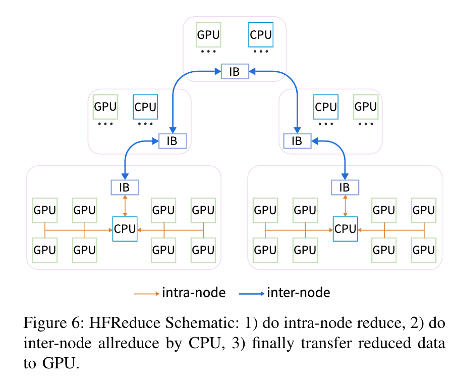

# LLM MLSys

[toc]

## 资源

* https://cs.stanford.edu/~chrismre/#papers

## Intro

* Intro
  * 未来硬件，内存互连很关键
* 技术发展
  * Memory Efficient Attention with Online Softmax (2021) -> FlashAttention in Megatron-LM (2022) 
  * Continuous Batching (2022), Paged Attention (2023) -> vLLM, TensorRT-LLM (2023) 
  * Speculative Sampling (2023) -> Everywhere in LLM Serving (2023)
  * Sequence Parallel (2023) ->  Megatron-LLM (2023) 
* 业务目标：https://mp.weixin.qq.com/s/llalxX6miJRxy0-Vk8Ezpg
  * MFU（Model FLOPs Utilization）
  * 故障率：在大规模的集群中，推理请求的故障率，因为在一万张卡的集群中，如果每几分钟就有一张卡挂掉，那么这会影响整体效率，或者说看故障时间占在整个有效训练时间的占比，如果说是故障的时间占训练时间比例超过30%，也非常影响效率；
  

## 成本和性能评估

* Intro
  * AIGC是大国的游戏
    * 欧洲受欧盟法案影响，ai发展没跟上

  * AI系统：记录数据、与人交互、机器学习分析、预测、干预人的决策

### MFU、HFU

* Hardware FLOPS Utilization

  * 考虑了计算换空间

* MFU（Model FLOPs Utilization）：

  * 评估GPU算力的有效利用率

* | 模型          | 参数规模 | MFU    | 硬件配置   |
  | ------------- | -------- | ------ | ---------- |
  | PaLM          | 540B     | 46.2%  | 6144 TPUv4 |
  | Megatron-LM   | 530B     | 56.0％ | 3072 A100  |
  | Mosaic ML     | 70B      | 43.36% | 128 H100   |
  | 字节MegaScale | 175B     | 55.2%  | 12,288 GPU |

### FLOPS

* Am,k * Bk,n : `2*m*n*k` FLOPS
  * 乘和加各算一次
* transformer
  * 设C为emb size、T为seq len
  * 一层Transformer
    * FLOPS： `24BTC^2 + 4BCT^2` 
    * Params：`12C^2+13C`
  
  * attn的计算占比是$$\frac{4BCT^2}{24BTC^2+4BCT^2} = \frac{T}{6C+T}$$
  * GPT3-175B C = 12288, T = 8192
  

```Python
# x : [B, T, C]
# B : batch_size
# T : seq_len
# C : dimension

x = layernorm(x)
q, k, v = qkv_proj(x).split()
# [B, T, C] x [C, 3C] -> [B, T, 3C]: 6BTC^2 FLOPS
attn = q @ k.T
# [B, T, C] x [B, C, T] = [B, T, T] : 2BT^2C FLOPS
attn = softmax(attn)
# 3BT^2*n_h, softmax计算量被忽略
y = attn @ v
# [B, T, T] x [B, T, C] -> [B,T, C] : 2BT^2C FLOPS
y = proj(y)
# [B, T, C] x [C, C] -> [B, T, C] : 2BTC^2
y = layernorm(y)
y = fc1(y)
# [B, T, C] x [C, 4C] -> [B, T, 4C] : 8BTC^2
y = gelu(y)
y = fc2(y)
# [B, T, 4C] x [4C, C] -> [B, T, C] : 8BTC^2
```

* GPT decoder推理
  * 结合GPU的FLOPS和DRAM内存带宽，容易计算得到GPT的训练是compute bound，推理是MBW bound

```Python
# qkv_cache : [B, T-1, 3C]
# x : [B, 1, C]
# B : batch_size
# T : seq_len
# C : dimension

x = layernorm(x)
qkv = qkv_proj(x)
# [B, 1, C] x [C, 3C] -> [B, 1, 3C]: 6BC^2 FLOPS
qkv = concat(qkv, qkv_cache)
# [B, 1, 3C], [B, T-1, 3C] -> [B, T, 3C]
q, k, v = qkv.split()
attn = q[:, -1, :] @ k.T
# [B, 1, C] x [B, C, T] = [B, 1, T] : 2BTC FLOPS
attn = softmax(attn)
y = attn @ v
# [B, 1, T] x [B, T, C] -> [B,1, C] : 2BTC FLOPS
y = proj(y)
# [B, 1, C] x [C, C] -> [B, 1, C] : 2BC^2
y = layernorm(y)
y = fc1(y)
# [B, 1, C] x [C, 4C] -> [B, 1, 4C] : 8BC^2
y = gelu(y)
y = fc2(y)
# [B, 1, 4C] x [4C, C] -> [B, 1, C] : 8BC^2
```


### 显存


* 7B模型：
  
  * float32: 70*10^8 * 4B = 26.7GB
  * 微调：考虑中间结果，100GB以上
* gpt-3：
  * 175B 700GB
    * Fp16 326GB
  * 算上adam优化器2100GB
  * 混合精度训练：
    * fp16参数、fp32参数copy、fp16梯度、fp32梯度、fp32历史梯度滑动平均、fp32历史梯度平方和滑动平均
    * `(1+2+1+2+2+2)*2*175=3,500 GB`

* the 1.5B parameter GPT-2 model trained with sequence length of 1K and batch size of
  
  32 requires about 60 GB of memory. 
  
  * Activation checkpointing reduce the activation memory by approximately the square root of the total activations. -> 8GB
  
  * For a GPT-2 like architecture the total activations is about 12 × hidden dim × batch × seq length × transformer layers.

### Token

```python
import tiktoken

def count_tokens(prompt):
    encoding = tiktoken.get_encoding("cl100k_base")
    num_tokens = len(encoding.encode(prompt))
    return num_tokens

prompt_text = "这是一个示例prompt"
token_count = count_tokens(prompt_text)
print(f"Prompt的token数量为: {token_count}")
```

### 性能、延时

* TTFT：time to first token，和input token长度相关
* TPOT


### 训练成本

* O(10k) 规模的 GPU / TPU 集群
* LLaMA：2048 A100 21d
  * a100一个月几十刀，训一个几十万
* 人力成本：训练基础大模型，团队20人
  * 6个月准备、6个月训练、6个月微调，18个月训模型
  * 上下文能力提升之后，时效性会显著增强

* Note
  * 和芯片的对比：This “growth” is strikingly similar to the one involved in chip evolution where as the number of transistors increases (higher density on a chip) the cost for plants manufacturing  those chips skyrocket.  In  the case of chip manufacturing  the economics remained viable because new plants did cost more but they also produced many more chips so that till the middle lf the last decade the cost per chip was actually  decreasing generation over generation (one effect captured in the Moore’s law).
  * As with chips one may  wonder if there is a limit to the economic affordability (there sure is, it is just difficult  to pinpoint!).
  * TODO: https://www.wired.com/story/openai-ceo-sam-altman-the-age-of-giant-ai-models-is-already-over/

### GPU

* 存量和增量


* 分布：


### 售价

* https://tiktoken.aigc2d.com/
  * 统计token数量
  * GPT-4o
    * output：15刀/1M token
    * input：5刀/1M token

## 推理部署

### DeepSeek-V3 (MoE)

* prefill
  * The minimum deployment unit of the prefilling stage consists of 4 nodes with 32 GPUs. The
    attention part employs 4-way Tensor Parallelism (TP4) with Sequence Parallelism (SP), com-
    bined with 8-way Data Parallelism (DP8). Its small TP size of 4 limits the overhead of TP
    communication. For the MoE part, we use 32-way Expert Parallelism (EP32), which ensures that
    each expert processes a sufficiently large batch size, thereby enhancing computational efficiency.
    For the MoE all-to-all communication, we use the same method as in training: first transferring
    tokens across nodes via IB, and then forwarding among the intra-node GPUs via NVLink. In
    particular, we use 1-way Tensor Parallelism for the dense MLPs in shallow layers to save TP
    communication.
    * **redundant experts**：For each GPU, besides the original 8 experts it
      hosts, it will also host one additional redundant expert
  * simultaneously process two micro-batches with similar computational workloads, **overlapping the attention and MoE of one micro-batch with the dispatch and combine of another.**
    * exploring a dynamic redundancy strategy for experts, where each GPU hosts
      more experts (e.g., 16 experts), but only 9 will be activated during each inference step

* decoding
  * The minimum deployment unit of the decoding stage consists of 40 nodes with 320 GPUs.
  * The attention part employs TP4 with SP, combined with DP80,
  * the MoE part uses EP320.
    * each GPU hosts only one expert, and 64 GPUs
      are responsible for hosting redundant experts and shared experts
    * the batch size per expert is relatively small (usually within 256 tokens), and the bottleneck is memory access rather than computation
      * **allocate only a small portion of SMs to dispatch+MoE+combine.**
  * 通信优化
    * leverage the IBGDA (NVIDIA, 2022) technology to further
      minimize latency and enhance communication efficiency.
    * **overlap the attention of one micro-batch with**
      **the dispatch+MoE+combine of another.**

## 推理优化

### Intro

> https://developer.nvidia.com/blog/mastering-llm-techniques-inference-optimization/

* KV cache
  * LLM模型预测的时候使用的是KV cache的技术，也就是缓存已经推理出的前t-1个token的KV matrix，那么在第t个token开始就无需再计算这部分KV，直接调用缓存的KV就可以。具体而言，整个MHA在casual mask下，可以表示为： $$Logit_{t_h} = \sum_{i \leq t}softmax(\frac{Q_{t_h}K^T_{i_h}}{\sqrt d})V_{i_h}$$,因此预测第t个token的时候，query的multi head（h表示）需要重新计算，以及第t个key和query的multi head（h表示）表示需要重新计算，其余的就可以直接用预测t-1个token缓存的KV进行计算。整体上会大大节省预测时间。附：但是这部分的KV需要占用GPU缓存，而大模型中缓存占用过多，会导致预测的时候Batch size过小，那么整体的预测吞吐率会降低，所以后续很多工作都在对于KV cache做优化。
* Prefix Cache
  * https://docs.vllm.ai/en/latest/automatic_prefix_caching/apc.html
  
* Mooncake：将 P / D 分离进行到底 https://zhuanlan.zhihu.com/p/1711346141

### Literature Review

* Many approximate attention methods have aimed to reduce the compute and memory requirements of attention. 【FlashAttention】
  * These methods range from sparse-approximation [51, 74] to low-rank approximation [12, 50, 84],
    and their combinations [3, 9, 92].
  * 核心问题：they focus on FLOP reduction (which may not
    correlate with wall-clock speed) and tend to ignore overheads from memory access (IO).

* Efficient ML Models with Structured Matrices. 【FlashAttention】
  * Matrix multiply is the core computational bottleneck of most machine learning models. To reduce the computational complexity, there have been numerous approaches to learn over a more efficient set of matrices. These matrices are called structured matrices, which have subquadratic (𝑜(𝑛2) for dimension 𝑛 × 𝑛) number of parameters and runtime. Most common examples of structured matrices are sparse and low-rank matrices, along with fast transforms commonly encountered in signal processing (Fourier, Chebyshev, sine/cosine, orthogonal polynomials). There have been several more general classes of structured matrices proposed in machine learning: Toeplitz-like [78], low-displacement rank [49], quasi-separable [25]). The butterfly pattern we use for our block-sparse attention is motivated
    by the fact that butterfly matrices [15, 64] and their products have been shown to be able to express any structured matrices with almost optimal runtime and number of parameters [16, 20]. However, even though structured matrices are efficient in theory, they have not seen wide adoption since it is hard to translate their efficiency to wall-clock speedup since dense unconstrained matrix multiply has very optimize implementation, a phenomenon known as the hardware lottery [41]. Extensions of butterfly matrices [17, 18] aimed to make butterfly matrices more hardware-friendly.
* Sparse Training【FlashAttention】
  * Our block-sparse FlashAttention can be seen as a step towards making sparse model
    training more efficient. Sparse models have seen success in compressing models for inference (pruning) by sparsifying the weight matrices [23, 38, 39, 55, 76]. For model training, the lottery tickets hypothesis [28, 29, 30] suggests that there are a set of small sub-networks derived from a larger dense network that performs as well as the original dense network.
* Efficient Transformer.【FlashAttention】
  * Transformer-based models have become the most widely-used architecture in
    natural language processing [22] and computer vision [24, 91]. However, one of their computational bottlenecks is that their time and memory scales quadratic in the sequence length. There are numerous approaches to overcome this bottleneck, including approximation with hashing (i.e., sparse) such as Reformer [51] and Smyrf [19] and with low-rank approximation such as Performer [12, 54]. One can even combine sparse and low-rank approximation for better accuracy (e.g., Longformer [3], BigBird [92], Scatterbrain [9], Long-short transformer [94], Combiner [73]). Other approaches include compressing along the sequence dimension to attend to multiple tokens at once [52, 57, 79, 89]. One can also attend over the states from previous sequences
    to help lengthen the context (e.g., Transformer-XL [14] and Compressive Transformer [69]). We recommend the survey [81] for more details.
    There are several lines of work on developing other modules instead of attention to model longer context. HiPPO [35] and its extensions, most notably S4 [31, 36, 37] projects the history on a polynomial basis, allowing accurate reconstruction of the history through state-space models. They combine the strengths of CNNs (efficient training), RNNs (efficient inference), and continuous models (robust to change in sampling rates). LambdaNetworks [2], AFT [93] and FLASH [42] are other attempts at replacing attention in the context of image classification and language modeling.

### Best Practices：使用 GemLite、TorchAO 和 SGLang 加速 LLM 推理

> https://pytorch.org/blog/accelerating-llm-inference/
>
> 选型：int4 weight only quantization (both tinygemm and GemLite version), float8 dynamic quantization

* 现有的低精度推理方案在小 batch size 场景下表现良好，但存在以下问题：

  - 当 batch size 增大时，性能下降

  - 对量化类型的限制，例如，一些计算核（kernels）仅支持对称量化，这可能会影响模型在较低比特下的准确性

  - 量化、序列化和张量并行（TP）的相互影响，使得加载量化模型变得困难，并且可能需要对用户模型进行修改

* 集成：

  * GemLite ：一个基于 Triton 的计算核（kernel）库，解决了大 batch size 场景下的性能瓶颈，并支持更灵活的量化方式。
  * TorchAO ：一个原生 PyTorch 库，为量化、稀疏性和张量并行（与 DTensor 结合使用）提供了简化的用户体验。
  * SGLang ：一个快速、高效且可扩展的 LLM 和视觉语言模型（VLM）推理框架，支持广泛的模型类型。

* a summary of the results in **8xH100 machine on Llama 3.1-8B for decode**. 

  * **int4 Weight-Only Quantization**: This method significantly reduces memory footprint and **accelerates decode for memory-bound workloads**, with minimal impact on performance in compute-intensive scenarios like prefill or larger batch sizes. We present results for bf16, GemLite, and tinygemm kernels below, across various batch sizes and tensor parallel configurations
  * **float8 Dynamic Quantization**: While offering less memory savings, this method often provides higher accuracy and balanced speedups for both memory-bound and compute-bound tasks. With Hopper-grade hardware and native fp8 support, the efficient cutlass/cuBLAS kernels used by AO contribute to a significant speedup


> 更详细的实验结论：https://developers.redhat.com/articles/2024/10/17/we-ran-over-half-million-evaluations-quantized-llms#real_world_benchmark_performance


### 访存优化

#### FlashAttention: Fast and Memory-Efficient Exact Attention
with IO-Awareness

> https://github.com/HazyResearch/flash-attention
>
> FlashAttn V1/V2/V3论文精读 https://www.bilibili.com/video/BV1ExFreTEYa
>
> 动画：https://www.bilibili.com/video/BV1HJWZeSEF4
>
> 核心洞察：attention矩阵N^2太大了，无法利用192KB的SRAM缓存
>
> 直观理解：分块计算注意力，前面块的注意力是一个局部注意力，当进一步计算后面注意力时，需要对前面的局部注意力加权，和后面的注意力权重相加

* Intro
  * uses tiling to reduce the number of memory reads/writes
    between GPU high bandwidth memory (HBM) and GPU on-chip SRAM
  * also extend FlashAttention to block-sparse attention
  * 15% end-to-end wall-clock speedup on BERT-large (seq. length 512) compared to the MLPerf 1.1 training speed record, 3× speedup on
    GPT-2 (seq. length 1K), and 2.4× speedup on long-range arena (seq. length 1K-4K).


* 思路

  * Our main goal is to avoid reading and writing the attention matrix to and from HBM.
    This requires
    *  (i) computing the softmax reduction without access to the whole input
    *  (ii) not storing the large intermediate attention matrix for the backward pass.

  * (i) We restructure the attention computation to split the input into blocks and make several
    passes over input blocks, thus incrementally performing the softmax reduction (also known as **tiling**).
  * (ii) We store the softmax normalization factor from the forward pass to quickly recompute attention on-chip in the backward pass, which is faster than the standard approach of reading the intermediate attention matrix from HBM.

* 结论：
  * in sub-quadratic HBM accesses
  * seq-len 512，比任何算法快
  * seq-len 1000以上，approximate算法更快
* 3.1 An Efficient Attention Algorithm With Tiling and Recomputation
  * The main challenge in making attention memory-efficient is **the softmax that couples the columns of K (and columns of V).**
  * online softmax
    * Reformer: The efficient transformer
    * **Online normalizer calculation for softmax.**
    * Self-attention does not need 𝑂 (𝑛2) memory
  * recomputation
    * This can be seen as a form of **selective gradient checkpointing** [10, 34]. While gradient checkpointing has been suggested to reduce the maximum amount of memory required [66],


* **IO复杂度对比：**
  * 
  * For typical values of 𝑑 (64-128) and 𝑀 (around 100KB), 𝑑2 is many times smaller than 𝑀,
  * $$N^2d^2M^{-1}=(Nd)*N/(M/d)$$
* 

* Evaluation
  * Path-X and Path-256: 像素预测，两个黑点是否相连
    * 256*256
    * Block-sparse FlashAttention: 64k seq len
  * 性能相比其它transformer

##### 《From Online Softmax to FlashAttention》、《Online normalizer calculation for softmax》

* (Safe) Softmax

  * 问题：SRAM存不下N^2的logit，因此**need to access Q and K three times**
  * **3 read + 1 store per element**
  * 

* Online Softmax
  * **2 read + 1 store per element**
  * 理解：di'是注意力权重的累积和
  * 

  * 
  

#### FlashAttention-2: Faster Attention with Better Parallelism and Work Partitioning

> 核心：先遍历Q再遍历KV
>
> - FAv1还是没有办法接近GEMM,仅能达到硬件FLOPS的理论上限的30%,仍有优化空间。
> - 主要原因是FA在GPU上线程块和warp之间的工作分配不佳,导致不能发挥硬件效率。
> - 通过三个做法来解决上述的问题
>   - **改写算法，减少非矩阵乘法的FLOPS**
>     - 非矩阵乘在总计算量中占比较少，但耗时很高，GPU对矩阵乘做了很多优化通常能快16X，因此减少非矩阵乘的计算量非常重要。
>   - **更好的并行性**，即使只有一个头也可以在多个线程块之间并行计算。
>     - 除了batch和head维度，序列长度也要支持并行化，这样能提高GPU占用率。
>   - 线程块内部，通过合理的编排warp来减少共享内存不必要的访问以及通信。
> - 经过上面三个改造点，性能上v2比v1提升来2倍，效率接近GEMM,达到理论FLOPS的70%

* 计算重排序：将外循环改为遍历Q的块内循环遍历K,V的块，提高了数据局部性和并行性。
  * Q比KV在SRAM可以驻留更长的时间，缓存的存活时间更长，更能减少HBM的访问次数。
* 归一化操作：放在循环外， GPU 线程之间的并行性得到了极大的提升。

* 对于前向计算:
  1. 改成了先遍历Q在遍历kv，这样做则是在使其在行块实现了并行。 每个行块分配给一个GPU的thread block，从共享内存的视角看S可以被更好的复用，从并行度上将，可以利用序列维度的并行性来加速计算。
  2. 对于每个work内部的warp，尽可能的减少其对共享内存的读写可以获得可观的加速，fa1 是共享kv，但是q需要被所有warp访问和读写，主要是频繁的更新共享内存。
  3. 而 fa2，共享了q，每个warp读取自己分块内的kv，不需要更新与通信，获得了加速。
* 对于反向计算:
  1. 还是按照列块进行并行，这样并行的组块之间有最小的通信行为，否则dk和dv也要共享通信了。
  2. 尽管按列分块后，dq，dk，dv之间的相互依赖很复杂，但避免切k，也依旧可以减少warp内部的共享内存读写的开销。

#### FlashAttention-3: Fast and Accurate Attention with Asynchrony and Low-precision

**洞察**:  没有充分利用最新硬件中的新功能(tensor core 与 TMA)

1. 异步化: 利用专用warp重叠计算，matmul和softmax。
2. 低精度: 应用FP8量化，更好的利用tensor core特性。

挑战: 重写FA2来适配异构硬件，最小化FP8/4的量化误差。

**方案**: 

1. 专用warp异步化: 通过拆解生产者/消费者warp模式，移动数据来实现指令与访存的重叠
2. 隐藏softmax计算:通过优化依赖关系，将非GEMM的计算隐藏在GEMM的可异步化阶段
3. 块量化/非相干处理:  补偿FP8量化造成的精度损失。

* Triton实现：显存上实现ringbuffer

### Decoding优化

* Speculative Decoding, Lookahead Decoding, Flash-Decoding, Flash-decoding++, Deja Vu, Atom, Continunous Batching，Prefill-Decode Disaggregating

#### Speculative Decoding

《Speculative Decoding: Exploiting Speculative Execution for Accelerating Seq2seq Generation》

《Fast Inference from Transformers via Speculative Decoding》


### MoE 推理 —— Expert Parallelism

* Seed：https://arxiv.org/abs/2504.02263

## 推理框架

* MLLM推理
  * SGLang
  * LMDeploy
  * vLLM

### SGLang

* Intro
  * known for its almost [zero-overhead batch scheduler](https://lmsys.org/blog/2024-12-04-sglang-v0-4/) and fast [constrained decoding](https://lmsys.org/blog/2024-02-05-compressed-fsm/)


## 模型训练

> 并行训练参考 MLSys.md

### 大规模集群

- [Meta LIama 3](https://engineering.fb.com/2024/03/12/data-center-engineering/building-metas-genai-infrastructure/)，16k GPU 并行训练，背靠（独立的）两个规模达24K 的 H100 集群，分别基于 RoCE 和 IB 构建单链路带宽400Gbps的节点互联。
- [Google Gemini 1.5](https://storage.googleapis.com/deepmind-media/gemini/gemini_v1_5_report.pdf)，基于数十个 4k TPUv4 Pod 并行训练，Pod 内部 3D-Torus ICI 互联，单链路带宽 800Gbps。
  - TPU有SuperPod大规模ICI的优势
- [字节 MegaScale](https://arxiv.org/abs/2402.15627)，12k GPU 并行训练。

### Ckpt

* 字节Ckpt https://mp.weixin.qq.com/s/4pIAZqH01Ib_OGGGD9OWQg
  * ByteCheckpoint ，一个 PyTorch 原生，兼容多个训练框架，支持 Checkpoint 的高效读写和自动重新切分的大模型 Checkpointing 系统。

## 软硬协同

### [Trends in Deep Learning Hardware: Bill Dally (NVIDIA)](https://www.youtube.com/watch?v=kLiwvnr4L80)

### DeepSeek-V3 的硬件畅想

* the **SMs** primarily perform the following tasks for **all-to-all communication:** （ 20/132 SMs for H800）
  • Forwarding data between the IB (InfiniBand) and NVLink domain while aggregating IB
  traffic destined for multiple GPUs within the same node from a single GPU.
  • Transporting data between RDMA buffers (registered GPU memory regions) and in-
  put/output buffers.
  • Executing reduce operations for all-to-all combine.
  • Managing fine-grained memory layout during chunked data transferring to multiple
  experts across the IB and NVLink domain.
  * 期望用类似 NVIDIA SHARP Graham et al. (2016). 来做
  * aim for this hardware to unify the IB (scale-out) and NVLink
    (scale-up) networks from the perspective of the computation units
* ScaleUP和ScaleOut语义的融合是一个非常重要的工作, 准确的来说在ScaleOut使用RDMA就是一个错误, 并且想简单的在ScaleUP使用RDMA也是一个错误.
  * [《HotChip2024后记: 谈谈加速器互联及ScaleUP为什么不能用RDMA》](https://mp.weixin.qq.com/s?__biz=MzUxNzQ5MTExNw==&mid=2247492300&idx=1&sn=8a239883c831233e7e06659ec3425ea2&scene=21#wechat_redirect)

### Fire-Flyer AI-HPC: **A Cost-Effective** Software-Hardware Co-Design for Deep Learning

> https://blog.csdn.net/m0_59163425/article/details/143349082

* 使用了Pcle接口的A100芯片（便宜版本，而非更昂贵的NVIDIA DGX），比原来AI训练的专用芯片直接少了一半的成本。在10,000 GPU集群上，实现了DGX-A100 80%的性能，同时降低50%成本和40%能耗，证明了该设计的成本效益。
* 核心技术包括：
  * 自研**HFReduce 通信库**提升 AllReduce 效率，通过 CPU 异步处理减少 PCIe 带宽占用；
  * 优化**HaiScale 框架**支持数据、流水线、张量并行等多种并行策略；
  * 设计**两层 Fat-Tree 网络**整合计算与存储流量，通过 3FS 分布式文件系统实现 8TB/s 读取吞吐量；HAI 平台提供任务调度与故障恢复，保障大规模集群稳定性。
* HF Reduce
  * **异步梯度聚合**：通过 CPU 预处理梯度（D2H 传输 + 节点内 Reduce），再经 IB 网络跨节点 AllReduce，较 NCCL 提升 2-3 倍带宽利用率（图 7a）。
  * **NVLink 增强**：集成 NVLink 桥接后，跨区通信带宽突破 10GB/s（图 7b），支持张量并行高效计算。
  * 
* **HaiScale 训练框架**：
  - 多并行策略
    - 数据并行（DDP）：异步 AllReduce 重叠计算通信，VGG16 训练时间较 PyTorch DDP 减半（图 8a）。
    - 流水线并行（PP）：通过节点内 GPU 分属不同 DP 组，减少网络拥塞，LLaMA-13B 训练并行效率达 91%（图 9a）。
  - **FSDP 优化**：内存管理更高效，GPT2-Medium 训练并行 scalability 达 95%（图 8b）。
* **3FS 分布式文件系统**：
  - **硬件配置**：180 节点 ×16 NVMe SSD，提供**8TB/s 读取吞吐量**与 20PiB 存储容量。
  - 技术亮点
    - 链式复制（CRAQ）保证数据一致性，请求 - 发送控制机制避免网络拥塞。
    - 集成 3FS-KV 支持键值存储，降低 LLM 服务成本一个数量级。
* **HAI 平台**：
  - **时间共享调度**：按节点粒度分配资源，利用率达 99%，支持任务断点续传。
  - **故障恢复**：Checkpoint Manager 每 5 分钟异步保存，仅丢失最新 5 分钟数据；Validator 工具周检硬件状态，提前识别 GPU Xid 错误（表 VI）。

### 其它

MTP ~ [**Zen5的2-Ahead Branch Predictor**](https://chipsandcheese.com/p/zen-5s-2-ahead-branch-predictor-unit-how-30-year-old-idea-allows-for-new-tricks)

## Vision Model 推理

* Swin：microsoft/swinv2-large-patch4-window12-192-22k
  * pytorch基础使用
  * 1*V100
    * Batch_size=4, qps=32： 显存瓶颈 24G/32G，150W/300W
    * Batch_size=8, qps=20： 显存瓶颈 26G/32G，115W/300W
    * Batch_size=2, qps=27： 显存瓶颈 30G/32G，W/300W
  * 注：qps已经考虑了batch_size

* Dinov2
  * Batch_size=4, qps=50: 显存 14G，120W

## 分布式 Agent

* [蚂蚁 Ray](https://mp.weixin.qq.com/s/TFxzMJyQVoffV4SpiTh9AQ?open_in_browser=true)

  * 解决的问题：agent的负载、形式多样，从POC到上线的gap
  * Ray-Agent （ragent）
    * 主要考虑点如下：①该框架需提供 Agent 的 API；②利用 Ray 实现从本地代码到支持异构资源的分布式代码的扩展；③在多 Agent 场景中，每个 Agent 都是一个分布式进程，我们需要一个框架来协调这些进程，即所谓的 environment；④要兼容不同的库，如 MetaGPT 和 AutoGen；⑤希望利用 Ray 的沙箱（sandbox）、批处理能力和跨源调度功能。

  * 

  * 

  * 
  * 

  * 

  * 
  * 未来期望：
    * Agent Mesh/Agent Protocol
    * 离在线一体架构：可以用 Ray Data pipeline 完成离线工作

## LLMOps

[Observability in LLMOps pipeline - Different Levels of Scale](https://www.newsletter.swirlai.com/p/observability-in-llmops-pipeline)