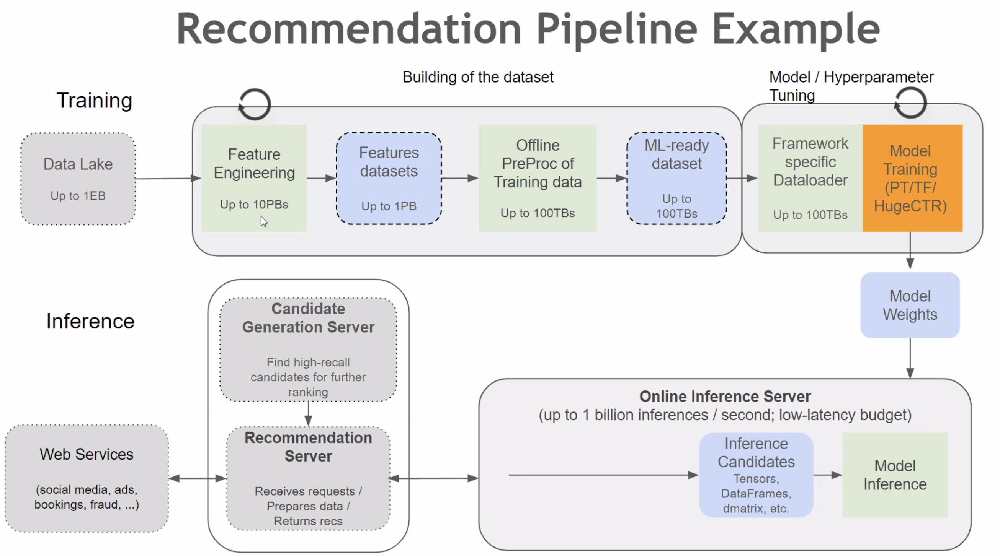
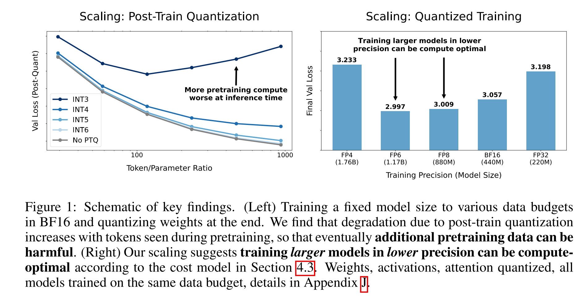
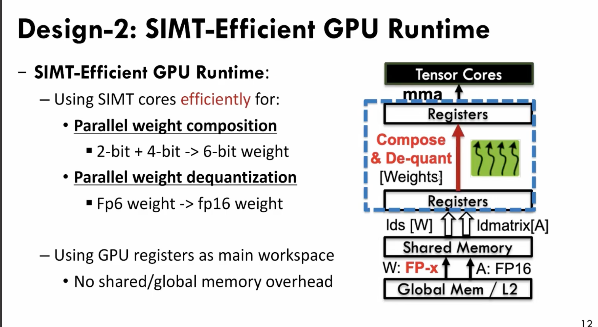
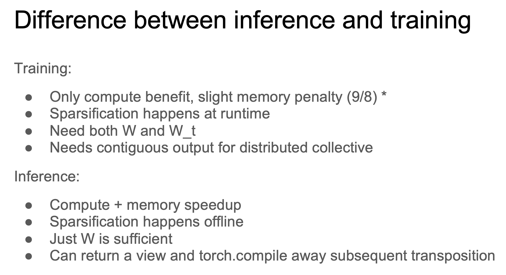

[toc]

plethora of ML frameworks：NCCL, Horovod, BytePS, Mesh-TensorFlow, Gpipe, Ray, HugeCTR, DALI

### 资料搜集

* RecSys2024 https://recsys.acm.org/recsys24/accepted-contributions/
* 美团：https://space.bilibili.com/18937923

### Intro

#### Intro

* 100TB model = 50万亿参数
  * 1万亿=1000B=1T，参数存储用 fp16
* MLSys历史
  * 前大模型时代MLSys的节奏：  
    * Ring AllReuce, Hovord (2017) -> PyTorch (2020) 
    * Activation Checkpoint (2014) -> PyTorch (2019) 
    * Automatic Mixed Precision (2017) -> PyTorch (2019) 
    * Int8 Quant (2015) -> TensorRT (2018)

  * 大模型时代：
    * Memory Efficient Attention with Online Softmax (2021) -> FlashAttention in Megatron-LM (2022) 
    * Continuous Batching (2022), Paged Attention (2023) -> vLLM, TensorRT-LLM (2023) 
    * Speculative Sampling (2023) -> Everywhere in LLM Serving (2023)
    * Sequence Parallel (2023) ->  Megatron-LLM (2023) 

#### MLSys 要点

* MLSys走向何方
  * 无论是NV内部NVLink党和Mellanox党的争论,还是其他很多企业都面临相同的问题, 计算/网络/存储/服务器/芯片等多个团队如何紧耦合, 更进一步的扩展到上层的算子/并行策略/算法等多个团队的协同. —— zartbot
  * 现在这些模型的Tensor传输量来看, 尽量的做好Overlap和提升带宽就够了. 是否还要Load/Store. 如果稀疏模型是一条路,那么就一定要. 
    * 例如一个集群通过一些网络拓扑把Allreduce的问题解决干净了, MoE等其它结构一来,AlltoAll又不行了.

  * 这一次人工智能革命的数学基础是：范畴论/代数拓扑/代数几何这些二十世纪的数学第一次登上商用计算的舞台。
* 超前建设
  * Large Scaling，以 *1000 的能力解决 *100 和 *10的问题
  * 与业务需求形成流水线的节奏


* RecSys中工程与理论之间的均衡
  * end2end：强调模型一致性的收益
  * two stages：强调模型实时性的收益

#### [The Bitter Lesson](http://www.incompleteideas.net/IncIdeas/BitterLesson.html)

> Rich Sutton, March 13, 2019

* human-knowledge approach 和 leveraging of computation，一定程度是互相counter的，体现在资源、人力投入等方面，e.g.:

  * chess, 1997
    * Search
  * Go
    * Search
    * self play to learn a value function 

   * speech recognition
     * special methods that took advantage of human knowledge---knowledge of words, of phonemes, of the human vocal tract
     * <->
     * the statistical methods---hidden Markov models (HMMs)
   * CV
     * searching for edges, or generalized cylinders, or in terms of SIFT features
     * <->
     * CNN

* The bitter lesson is based on the historical observations that:

  * AI researchers have often tried to build knowledge into their agents,
  * this always helps in the short term, and is personally satisfying to the researcher, but
  * in the long run it plateaus and even inhibits further progress
  * breakthrough progress eventually arrives by an opposing **approach based on scaling computation by search and learning.**

* The second general point to be learned from the bitter lesson is that:

  * the actual contents of minds are tremendously, irredeemably complex; **we should stop trying to find simple ways to think about the contents of minds, such as simple ways to think about space, objects, multiple agents, or symmetries.** 
  * All these are part of the arbitrary, intrinsically-complex, outside world. They are not what should be built in, as their complexity is endless; instead **we should build in only the meta-methods that can find and capture this arbitrary complexity**. Essential to these methods is that they can find good approximations, but the search for them should be by our methods, not by us. We want AI agents that can discover like we can, not which contain what we have discovered. Building in our discoveries only makes it harder to see how the discovering process can be done.


#### 成本和性能评估：参考 「LLM-MLSys」


#### [Google Research: Themes from 2021 and Beyond](https://ai.googleblog.com/2022/01/google-research-themes-from-2021-and.html)

  * Trend 1: More Capable, General-Purpose ML Models
    * CoTrain models: PolyViT https://arxiv.org/abs/2111.12993
    * Pathways: https://blog.google/technology/ai/introducing-pathways-next-generation-ai-architecture/
      * 本质是增强神经网络结构的稀疏性，不仅仅是参数的稀疏性
      * Discussion: https://www.zhihu.com/question/495386434/answer/2199374013
  * Trend 2: Continued Efficiency Improvements for ML
    * Continued Improvements in ML Accelerator Performance
      * TPUv4
      * Device-ML: https://ai.googleblog.com/2021/11/improved-on-device-ml-on-pixel-6-with.html
    * Continued Improvements in ML Compilation and Optimization of ML Workloads
      * XLA: https://www.tensorflow.org/xla
      * https://mangpo.net/papers/xla-autotuning-pact2021.pdf
      * GSPMD: https://ai.googleblog.com/2021/12/general-and-scalable-parallelization.html
    * Human-Creativity–Driven Discovery of More Efficient Model Architectures
      * Transformer、ViT
    * Machine-Driven Discovery of More Efficient Model Architectures
      * NAS -> Primer、EfficientNetV2
      * RL: https://ai.googleblog.com/2020/07/automl-zero-evolving-code-that-learns.html
    * Use of Sparsity
      * Switch Transformer
  * Trend 3: ML Is Becoming More Personally and Communally Beneficial
    * 从 ML+产品（Pixel手机） 到 联邦学习 
    * phone cameras
    * live translate/caption
    * [federated analytics](https://ai.googleblog.com/2020/05/federated-analytics-collaborative-data.html) and federated learning
      * 复用 FL 的 evaluating 能力 (without the learning part)
      * Now Playing: on-device database
      * https://arxiv.org/pdf/1902.01046.pdf
      * secure aggregation protocol
  * Trend 4: Growing Impact of ML in Science, Health and Sustainability
      * Large-Scale Application of Computer Vision for New Insights
          * [large-scale study of synaptic connectivity in the human cortex](https://ai.googleblog.com/2021/06/a-browsable-petascale-reconstruction-of.html)
          * [deep-learning–based approach to weather forecasting](https://ai.googleblog.com/2021/11/metnet-2-deep-learning-for-12-hour.html)
    * Automated Design Space Exploration
      * a Transformer-based variational autoencoder learns to [create aesthetically-pleasing and useful document layouts](https://ai.googleblog.com/2021/06/using-variational-transformer-networks.html)
      * [automates the exploration of the huge design space of tweaks for computer game rules](https://ai.googleblog.com/2021/03/leveraging-machine-learning-for-game.html)
    * Application to Health
      * Our [ML-based phenotyping](https://www.sciencedirect.com/science/article/pii/S0002929721001889) method improves the scalability of converting large imaging and text datasets into phenotypes usable for genetic association studies, and our [DeepNull](https://www.biorxiv.org/content/10.1101/2021.05.26.445783v2) method better leverages large phenotypic data for genetic discovery. We are happy to release both as [open-source methods](https://github.com/Google-Health/genomics-research) for the scientific community.
    * ML Applications for the Climate Crisis
      * [eco-friendly routing in Google Maps](https://blog.google/products/maps/3-new-ways-navigate-more-sustainably-maps/)
      * making our [Maps products smarter about electric vehicles](https://ai.googleblog.com/2021/01/addressing-range-anxiety-with-smart.html) can help alleviate range anxiety, encouraging people to switch to emissions-free vehicles
        * the fear that the car will run out of power before reaching a charging station
        * the charging time can be a significant fraction of the total travel time and can vary widely by station, vehicle model, and battery level. In addition, the charging time is non-linear — e.g., it takes longer to charge a battery from 90% to 100% than from 20% to 30%.
        * this high density implies that a trip between two stations that are relatively far apart will undoubtedly pass through multiple other stations. In this case, maintaining information about the long edge is redundant, making it possible to simply add the smaller edges (*[spanners](https://en.wikipedia.org/wiki/Geometric_spanner)*) in the graph, resulting in sparser, more computationally feasible, graphs.
      * On a longer time scale, **fusion** holds promise as a game-changing renewable energy source. In a long-standing collaboration with TAE Technologies, we have [used ML to help maintain stable plasmas](https://ai.googleblog.com/2021/11/another-step-towards-breakeven-fusion.html) in their fusion reactor by suggesting settings of the more than 1000 relevant control parameters. With our collaboration, TAE achieved their major goals for their [Norman](https://en.wikipedia.org/wiki/TAE_Technologies#C-2W/Norman) reactor, which brings us a step closer to the goal of [breakeven fusion](https://en.wikipedia.org/wiki/Fusion_energy_gain_factor#Breakeven). The machine maintains a stable plasma at 30 million Kelvin (don’t touch!) for 30 milliseconds, which is the extent of available power to its systems. They have completed a design for an even more powerful machine, which they hope will demonstrate the conditions necessary for breakeven fusion before the end of the decade.
      * [wildfire boundary map](https://blog.google/products/search/mapping-wildfires-with-satellite-data/)
        * https://arxiv.org/abs/2111.02780
      * carbon neutral
        * https://arxiv.org/abs/2104.10350

* Trend 5: Deeper and Broader Understanding of ML
  * [Marian Croak’s vision for responsible AI at Google](https://blog.google/technology/ai/marian-croak-responsible-ai/)
  * RecSys
    * [Recent work has helped to better understand these relationships of the individual components](https://research.google/pubs/pub49284/)
    * [learn in an unbiased manner](https://storage.googleapis.com/pub-tools-public-publication-data/pdf/54a3b73ea1e85e94e5d5bb5a9df821a1f32aa783.pdf)
  * Political Correctness
    *  [reducing gender bias in our translation systems](https://ai.googleblog.com/2020/04/a-scalable-approach-to-reducing-gender.html)
    *   [designing for digital wellbeing](https://design.google/library/designing-for-digital-wellbeing/#normalizing-compassion) and [addressing racial equity issues in ML systems](https://design.google/library/racial-equity-everyday-products/), including [improving our understanding of the experience of Black Americans using ASR systems](https://www.frontiersin.org/articles/10.3389/frai.2021.725911/full?&utm_source=Email_to_authors_&utm_medium=Email&utm_content=T1_11.5e1_author&utm_campaign=Email_publication&field=&journalName=Frontiers_in_Artificial_Intelligence&id=725911)
  * distributional shift
    * [Deep Bootstrap framework](https://ai.googleblog.com/2021/03/a-new-lens-on-understanding.html)
  * [data cascades in ML](https://ai.googleblog.com/2021/06/data-cascades-in-machine-learning.html)
	  * [PAIR Guidebook](https://pair.withgoogle.com/guidebook/)
		* 
	* [Know Your Data](https://knowyourdata.withgoogle.com/)
	  *  [finding and investigating anomalous data](https://ai.googleblog.com/2021/09/discovering-anomalous-data-with-self.html)
	  * [methods to better understand the influence that particular training examples](https://ai.googleblog.com/2021/02/tracin-simple-method-to-estimate.html) can have on an ML model
	  * a [case study of how to use the Know Your Data tool](https://ai.googleblog.com/2021/08/a-dataset-exploration-case-study-with.html) to explore issues like gender bias and age bias in a dataset.
	* more inclusive and less biased public datasets
	  * [Dataset Search](https://datasetsearch.research.google.com/)
	  * [Perspective API](https://www.perspectiveapi.com/case-studies/) tool
	* we introduced a comprehensive taxonomy to reason about [the changing landscape of online hate and harassment](https://research.google/pubs/pub49786/). We also investigated [how to detect covert forms of toxicity](https://aclanthology.org/2021.hcinlp-1.3), such as microaggressions, that are often ignored in online abuse interventions, studied how conventional approaches to deal with disagreements in data annotations of such subjective concepts might [marginalize minority perspectives](https://arxiv.org/abs/2110.05699), and proposed a new [disaggregated modeling approach that uses a multi-task framework](https://arxiv.org/abs/2110.05719) to tackle this issue
	* 可解释性
	  * [understanding the acquisition of human chess concepts](https://arxiv.org/abs/2111.09259)
	  * [Language Interpretability Tool](https://pair-code.github.io/lit/)
	* Sociotechnical aspects
	  * [supporting family caregiving.](https://research.google/pubs/pub49916/)
	* ML and privacy
	  * highlighting that[ training data can sometimes be extracted from large models](https://www.usenix.org/system/files/sec21-carlini-extracting.pdf) and pointing to how privacy can be achieved in large models, e.g., as in[ differentially private BERT](https://arxiv.org/abs/2108.01624).
	  * federated learning and analytics
	  * other techniques: [ private clustering](https://ai.googleblog.com/2021/10/practical-differentially-private.html),[ private personalization](https://proceedings.neurips.cc/paper/2021/hash/f8580959e35cb0934479bb007fb241c2-Abstract.html),[ private matrix completion](http://proceedings.mlr.press/v139/chien21a/chien21a.pdf),[ private weighted sampling](http://proceedings.mlr.press/v130/cohen21b.html),[ private quantiles](http://proceedings.mlr.press/v139/gillenwater21a.html),[ private robust learning of halfspaces,](http://proceedings.mlr.press/v130/ghazi21a.html) and in general,[ sample-efficient private PAC learning](https://dl.acm.org/doi/10.1145/3406325.3451028)
	  * privacy notions: [label privacy](https://proceedings.neurips.cc/paper/2021/file/e3a54649aeec04cf1c13907bc6c5c8aa-Paper.pdf) and[ user](https://proceedings.neurips.cc/paper/2021/file/67e235e7f2fa8800d8375409b566e6b6-Paper.pdf) versus[ item level privacy](https://proceedings.neurips.cc/paper/2021/file/a89cf525e1d9f04d16ce31165e139a4b-Paper.pdf).
	* Other Work
	  * Quantun AI: https://blog.google/technology/research/2021-year-review-google-quantum-ai/、https://quantumai.google/learn/map
	    * the Noisy, Intermediate Scale Quantum (NISQ) computing era
	    * Qubit 和 Bit 的区别，在于前者的不确定性，给存储、计算、算法的形式都带来剧变
	    * 100 qubits to build a prototype of a error-corrected **logical qubit**
	      * 1000 qubits make a logical qubit long-live
	      * 10000 qubits => complex softwares requires significant work on fabrication technology, control software, and more
	      * 100000 qubits ~ 100 logical qubits: a quantum computer
	    * TFQ: https://www.tensorflow.org/quantum

### 成本和性能评估

* [MFU与FLOPs计算](https://zhuanlan.zhihu.com/p/690804699?utm_psn=1830997251394240513)
  * 模型算力利用率（Model FLOPs Utilization， MFU）和硬件算力利用率（Hardware FLOPs Utilization， HFU）
  * 模型算力利用率是指 模型一次前反向计算消耗的矩阵算力 与机器算力的比值
  * 硬件算力利用率是指 考虑重计算后，模型一次前反向计算消耗的矩阵算力 与机器算力的比值
  * llm的flops：https://xffxff.github.io/posts/flops

### 训练框架

#### Intro



* 流程：
  * 数据加载
    * prefetch
  * 数据预处理
    * 离线
  * forward
  * backward
  * （节点通信）
  * optimize

* spark MLlib
  * 参考「深度学习推荐系统」6.2.1
  * 分布式 + DAG
  * 内部并行、边界消耗资源shuffle/reduce
  * 缺点：
    * 参数全局广播
    * 同步阻断式的梯度下降
    * 不支持复杂DL网络

* tf
* pytorch

#### PyTorch: An Imperative Style, High-Performance Deep Learning Library

> 参考「pytorch.md」、「snippets」

#### Go+Torch

https://github.com/wangkuiyi/gotorch

* Q: TensorFlow为什么需要引入图这个概念？

  * A1: backward自动求导，需要定义前向的数据结构
  * A2: python执行速度慢，决定执行效率的是图的解释器。图是python代码的另一种表示形式，开始包括前向计算过程，通过调用TensorFlow API，加入其它op包括反向计算过程和模型更新过程。构造图本质上是在编译。

  * [TFRT](https://github.com/tensorflow/runtime)


* 调用libtorch内部的native function类比tf的op，但native function是函数，而不是一个class，每一个function可以用HLO（一种古老的适用于数值计算的语言）写一遍。gotorch调libtorch调pytorch XLA里的HLO程序，翻译成特定设备优化的代码

  * native function有YAML描述，可自动生成Go Wrapper

  * torchscripts：用到的python语法的子集 => python高层api可翻译成torchscripts再翻译


* 如果 Go+Torch 在未来一年里孕育成熟，有望优化以下核心应用场景:
  * 统一训练和预测系统(目前训练用 Python 写，预测用 C++)
  * 统一云和端系统(目前云上用 TensorFlow，端上比如 xNN 调用 TensorFlow Lite)
  * 统一训练和预测时的数据处理流程(目前需要用 Python和C++分别做两套，开销大，而且容易出错)
  * 统一搜索、推荐、广告、金融核心、移动智能和端智能、无人驾驶等多个领域的基础架构
  * 能支持新的机器学习模式——online learning、GAN、reinforcement learning、imitation learning等。

#### OneFlow: 大规模分布式深度学习框架

数据并行：allreduce + PS

模型并行：参数如何划分？复杂的通信模式


横向拓展：片间高速互联，e.g. TPU

纵向拓展：单个芯片从通用到专用


静态调度与流式执行系统


OneFlow架构

* actor及流水线
  * 内存槽，用类似rust的ownership解决内存冲突问题，ownership随状态转移


* node placement: consistent view
  * SBP, 在op层面实现数据和模型并行 
    

#### HugeCTR

* Embedding Table入显存：unified memory management，节点间交换不再layer by layer，可以一次交换所有PS
  * 高效的GPU HashTable实现，解决冲突
* Multi-nodes Model Parallel

* Model Subscription: per req load PS to Embedding Cache in GPU

### 算法工程协同

* embedding和特征带来的在线内存成本：
  * ftrl -> 稀疏性、全0 Embedding
  * lasso
  * sparseNAS

### 分布式调度框架

* 模型+数据+资源+调度
  * 资源：池化/槽位，混部/潮汐/异构/多机房/新网络架构
    * 混部：离线/近线，弹性计算
  * 数据：batch/stream，stream数据语义更贴近在线语义
    * 物理数据（行间数据处理）、逻辑数据（行内数据处理）
* 多角色生命周期管理
  * 需求：角色依赖数据（promise->actor）、角色依赖角色（actor->actor）、多角色生命周期方法执行的同步
    * checkpoint/failover
  * 思路：
    * 全局状态机 （将最重的数据相关有状态角色抽象为全局状态机）/ 全局多个独立定时任务
    *  无状态op
      * 全局状态机（root AM）+局部状态机（role AM）过于复杂
    * Op 涉及的数据层面：1）metadata；<-- 2）resource or data；<-- 3）business logic

开源框架

* TFX on kubeflow, MLOps的实践
	
	* 各组件独立性更强，数据落盘环节多
	* kubeflow pipeline: DSL描述组件拓扑、每个组件打包成docker独立输入输出，提供了基于DAG与k8s的工作流调度
	  * https://cloud.google.com/blog/products/ai-machine-learning/getting-started-kubeflow-pipelines
	* 工作流拓扑和工作负载高度客制化
	  * 工作流调度 <- Argo
	  * 工作负载容器化
	* kubeflow pipeline组件
	  * 轻量级： [`kfp.components.func_to_container_op`](https://www.kubeflow.org/docs/components/pipelines/sdk/sdk-overview/)
	  * [可重复使用的component](https://www.kubeflow.org/docs/components/pipelines/v1/sdk/component-development/)
	  * Google Cloud TFX......
	
	
	
	
	* [TFX.periodic_training](https://github.com/tensorflow/community/blob/master/rfcs/20210115-tfx-periodic-training.md)
	
	
	    * ExampleGen processes and outputs one Span
	    
	        * span有version的概念
	    
	    * Frontfill/Backfill:
	    
	        * If an older Span needs to be updated, a new version of the Span is generated by **a backfill pipeline run** with specified Span id.
	        * 不建议热更，建议新version+backfill机制
	    
	    * 不建议concurrent执行，因为The execution of TFX Components depends on the ML Metadata status before executing
	    
	        * killandrun,allowtocomplete
	
	* Preprocessing: 数据校验、schema生成
	
	
	    * range config: 1）模型span与数据span对应；2）warmup start；3）输出模型的metadata
	
	* Metadata: 实现了数据、模型的上下游血缘追踪，比如模型性能变化的因果推理、更加精密的垃圾回收
	
	* 问题：
	
	
	  * user cost和system cost的折中，比如Workflow层面的调度如何与底层调度统一
	  * 兼顾核心场景（搜广推）和长尾场景（无监督、MAB）
	
	  
	
	  
	
	  
	


  * Flink ML
    * 难以描述复杂的多角色拓扑关系

  * Ray: 参考【Distributed-Systems笔记】

```java
// Flink ML
val trainingData: DataSet[LabeledVector] = ...
val testingData: DataSet[Vector] = ...

val scaler = StandardScaler()
val polyFeatures = PolynomialFeatures().setDegree(3)
val mlr = MultipleLinearRegression()

// Construct pipeline of standard scaler, polynomial features and multiple linear regression
val pipeline = scaler.chainTransformer(polyFeatures).chainPredictor(mlr)

// Train pipeline
pipeline.fit(trainingData)

// Calculate predictions
val predictions: DataSet[LabeledVector] = pipeline.predict(testingData)
```

### Dataset

* Criteo Dataset
  * Training dataset with 24 days of ad display and click data (positive: clicked and negatives: non-clicked)
  * 13 features taking integer values (mostly count features)
  * 26 anonymized categorical features
  * Corresponding Kaggle competition: https://www.kaggle.com/c/criteo-display-ad-challenge

### 数据流、数据存储

> 可利用大模型

* 数据清洗
  * 无标签：低分辨率、高噪声、高曝光；奇怪符号标点
* 数据离线预处理
  * 数值范围标准化：min-max scaling
  * 数据编码：one-hot
  * 数据分布不均衡
    * 升降采样
    * 数据增强：
      * 图片：改变亮度、对比度、旋转、翻转、随机crop
      * 文本：同义词替换、句子重排
  * 特征提取：
    * e.g. stable diffusion，先VAE提取64*64特征

#### 数据格式


#### 数据流

* 分布式存储：
  * HDFS
  * NFS： Network File System
    * 私有化
    * 手动备份数据
  * 云存储：对象存储服务
    * 公有云
    * 扩展性、持久性高，自动副本、多区域存储

* 数据流，四种架构：批处理、流计算、Lambda、Kappa
  * 批处理：分布式文件系统（HDFS）+Map Reduce
  * 流计算：
    * 滑动窗口分钟级，Flink
    * 缺点：
      * 数据合法性检查、数据回放、全量数据分析
      * 时间窗口较短时，日志乱序、join操作会导致数据误差累计

  * Lambda: 实时流+离线处理
    * 流计算以增量计算为主，批处理进行全量计算；
    * 存入数据库之前，对实时流和离线层数据合并，利用离线层数据对实时流数据进行校验和检错
    * 缺点：浪费资源

  * Kappa
    * Everything is streaming
    * 思路：数据存储+数据重播
    * 缺点：回放效率，批处理和流处理操作不一定能完全共享
    * 


* 推荐系统的数据流
  * 训练数据处理 + 特征的预计算

### 特征工程

> 参考【tensorflow笔记】的python/data部分

* 特征转换
  * 无转换，适用于**int、float**或者对应类型的**定长列表**的特征，可以直接输入神经网络。为了保持统一，我们将这一类命名为PretrainEmbedding。
  * 转换为ont-hot或者multi-hot类型，适用于**int、string**，或对应定类型的**定长、变长列表**的特征。这种转换方式适合处理小规模类别型特征，其特征转换后的可理解性，以及不同特征值之间的差异都是可衡量的，在训练数据不够大时，是可以优先考虑的类型。这种转换方式，我们命名为Encoding。
  * 转换为embedding类型，适用于**int、string**，或对应定类型的**定长、变长列表**的特征。这种方式适合大规模的id类特征，需要通过大规模的样本训练来找出当前特征值的最优空间位置。这种转换方式，我们命名为Embedding。
    * 还有一些诸如embedding加权、多值embedding聚合，共享embedding table等等更细节的优化方式
* 多次哈希：不论是Encoding还是Embedding，都可能需要对特征值进行哈希，而这就面临哈希冲突的问题，常见有两种处理手段
  * 增加哈希空间大小。哈希空间大小的配置首先必然受特征值空间的影响，如果哈希空间小于特征值空间，则哈希冲突概率很大；如果远远大于特征值空间，则会产生内存浪费。因此，在合理范围内，通过增加哈希空间来减少哈希冲突概率是非常直觉的做法。
  * 多次哈希。即一个特征值由多个不同哈希种子的结果来表达，这样只需要任意一种哈希的结果不冲突，则最终哈希结果不会冲突。但是多次哈希会显著提升计算量，因此也也需要在合理范围内选择哈希次数。

#### [NVTabular](https://github.com/NVIDIA/NVTabular)

* 基于RAPIDS的Recommendation ETL，底层是RAPIDS


#### RAPIDS: 基于GPU的Spark大数据处理和机器学习加速

> 基于Apache Spark的RAPIDS加速器

* Spark 0.2的亮点

  * 支持原生Spark、Databricks 7.0ML、Dataproc 2.0

  * 读取大量小的Parquet文件的优化：并行化处理文件Buffer，CPU与GPU无缝衔接

  * 初步支持SCALA UDF

  * 加速PANDAS UDFs
    * 实现对Python进程的GPU资源管理，使JVM进程与Python进程共享一个GPU，以安全地在Pandas UDF里使用GPU
      * 优化JVM与Python之间的数据交换，避免不必要的行列转换

* Apache Spark不适合GPU大数据处理的场景

  * 数据规模小：仅百兆

  * 高缓存一致性的操作

  * 数据移动：缓慢I/O，与CPU的不断交互(UDFs)，Shuffle

  * 有限的GPU内存

* SQL plugin擅长于
  * 高散列度数据的joins、aggregates、sort
  * Window operations、复杂计算、数据编码（创建Parquet和ORC文件，读取CSV）


* Spark Shuffle: 前后stages间的数据交换

  * CPU-Centric Data Movement: GPU0->CPU->GPU1；PCIe总线(GPU and CPU)、Network(远端CPU)，CPU参与调度

  * GPU-Centric Data Movement: NVLink(同节点GPU), RDMA(远端GPU), GPU Direct Storage(落盘)

  * Shuffling Spilled Data: 溢出到cpu的host memory；如果无法满足，host memory内数据落盘或者通过RDMA传输到远端

  * UCX Library: https://www.openucx.org/

#### 快手统一特征抽取框架 KaiFG

> 来源：[快手统一特征抽取框架KaiFG，用Python的优雅，唤醒C++般的性能狂潮！](https://mp.weixin.qq.com/s/GxRHOyHMESkJb3PdmU1hRw)

*   **背景与痛点**: 快手内部曾存在多套异构的C++特征抽取框架，导致算法工程师重复开发、迭代效率低下（编译、上线流程长达1-2天）。
*   **核心价值**: KaiFG 作为一个统一的特征抽取框架，旨在建立算法与工程的标准化接口，核心是**让算法工程师可以用熟悉的 Python 编写特征逻辑，同时通过底层优化达到原生 C++ 级别的执行性能**。
*   **关键技术**: 
    *   **万用数据接口 (Unified Interface)**: 抽象并统一了不同业务（推荐、商业化、搜索）和平台（在线/离线）的数据访问方式，算法工程师只需面向这个标准化接口编程，无需关心底层数据来源的差异。
    *   **Codon 编译器**: 引入开源的 Python 编译器 Codon 作为后端，将 Python 代码编译成高性能的机器码。
    *   **底层性能优化**:
        *   **强化向量化推导**: 在 Codon IR 和 LLVM IR 层级进行深度定制开发，对 Python 循环等结构进行自动向量化（SIMD），在不改变用户编程习惯的前提下，压榨硬件性能。
        *   **内存管理**: 将 Codon 原生的垃圾回收（GC）机制替换为对线上服务更友好的**引用计数（RefCount）**，解决了并发性能瓶颈和 GC 导致的 P99 延迟飙升问题。
*   **效果**: 
    *   **开发效率**: 迭代周期从天级缩短至分钟级，支持本地调试和源码直接部署。
    *   **运行性能**: 与原生 C++ 性能相当。
    *   **系统稳定性**: 编译速度提升10倍，代码出错时抛出异常而非服务崩溃。

### 召回

* 索引方式
  * BF (BruteForce): 秒级到分钟级构建，十万到百万量级
  * IVF (Inverted File System): 分钟级到小时级构建，百万到亿级
    * GPU 对聚类进行加速
  * HNSW: 分钟级到天级构建，千万到百亿级实时性
    * 可能会 sharding
* 量化方式
  * Int8 
  * PQ

### 检索加速

* 基于树
  * KD Tree
  * Annoy: https://github.com/spotify/annoy
* Hash
  * Local Sensitive Hashing: https://falconn-lib.org/
    * 分桶的“与”、“或”策略
    * “与”策略可能漏掉边界点
  
* PQ
  * https://github.com/facebookresearch/faiss
* Learning to hash

#### Semantic search

* [OpenAI Embedding Model](https://openai.com/blog/new-and-improved-embedding-model/)

  * text search, code search, sentence similarity, text classification

  * Unification of capabilities

  * **Longer context.** The context length of the new model is increased by a factor of four, from 2048 to 8192, making it more convenient to work with long documents.

  * **Smaller embedding size.** The new embeddings have only 1536 dimensions, one-eighth the size of `davinci-001` embeddings, making the new embeddings more cost effective in working with vector databases.

  * **Reduced price.** We have reduced the price of new embedding models by 90% compared to old models of the same size. The new model achieves better or similar performance as the old Davinci models at a 99.8% lower price.

* [VantageDiscovery的科普](https://www.vantagediscovery.com/post/semantic-101)

  * `text-embedding-3-large` model with 2048 dimensions

* [Semantic Search using Matryoshka Embedding Vectors](https://www.vantagediscovery.com/post/semantic-search-using-matryoshka-embedding-vectors)

  * Unlike traditional embeddings, LLMs produce embeddings that consider the entire context in which a word or phrase appears, leading to more precise search results.
  * 常规优化思路：reduced vector precision, and ANN (approximate nearest neighbors).
  * 新优化思路：reduced RAM footprint by storing only parts of the embedding vectors in RAM
  * **Matryoshka Representation Learning (MRL)** constructs embedding vectors by embedding information at multiple granularity levels within such vectors.
    * https://arxiv.org/abs/2205.13147
    * inspired by the nesting concept of Russian Matryoshka dolls.
    * 思路是从低维开始往高维训
  * 使用：text-embedding-3-large的dimension接口
  * OpenAI：https://openai.com/index/new-embedding-models-and-api-updates/
  * e.g. text-embedding-3-small
    * 1536=512 + 1024
    * retain the top 5000 results from the 1st tier, and process only these 5000 results for the 2nd tier, finally retaining the top 120 results based on their full score computation
    * 最终效果：
      * 查询时间减半，效果差不多
    * With a Tiering split of (512, 1024), without locking Tier 2 in RAM, and preloading Tier 2 Pages，这样耗时很稳
  * Note：
    * 要遵守官方split

#### HNSW

* [The Hush-Hush Secret of Accuracy of HNSW and Vector Databases](https://www.vantagediscovery.com/post/the-hush-hush-secret-of-accuracy-of-hnsw-and-vector-databases)
  * The key advantage of HNSW is its ability to perform approximate nearest neighbor (ANN) searches quickly in high-dimensional spaces.
  * 缺点：
    * The 'Loss-eee-ness' Phenomenon： approximate的实现，可能忽略最准确的结果，尤其是skewed数据下
    * Lack of Real-time Tunability： 无法在线tune，只能reindex
    * Precision-Recall Trade-off
    * Sensitivity to Data Distribution
    * Complexity in High-dimensional Spaces

  * Dynamic Precision-Recall Curve
    * We leverage the precision-recall curve in what we consider a novel way. Users can visualize and manipulate this curve, allowing them to prioritize either precision or recall based on their immediate needs. We believe this dynamic approach ensures that the search can be optimized for various contexts without sacrificing overall performance.
  * Addressing 'Loss-eee-ness'
    * By allowing fine-tuning of search parameters, our algorithm directly tackles the 'loss-eee-ness' issue. Users can enhance recall without a proportional increase in latency, maintaining speed while mitigating accuracy loss.
  * Improved ANN Searches
    * We employ advanced techniques for approximate nearest neighbor searches in high-dimensional spaces. By utilizing the inner product to measure similarity, we aim to ensure that results align closely with the user's intent, even in complex semantic contexts.
  * Adaptive to Data Distribution
    * Our algorithm is designed to be more robust to varying data distributions. We believe this adaptability ensures more consistent performance across different types of datasets and query patterns.
  * Balancing Act Between Speed and Accuracy
    * While HNSW often requires choosing between speed and accuracy, our approach aims to provide a more nuanced balance. Users can change this balance based on their specific needs, without drastic trade-offs.

### 粗排

#### COLD : Towards the Next Generation of Pre-Ranking System

阿里定向广告最新突破：面向下一代的粗排排序系统COLD - 萧瑟的文章 - 知乎
https://zhuanlan.zhihu.com/p/186320100

Computing power cost-aware Online and Lightweight Deep pre-ranking system

小精排支持复杂算法探索

* SENet: 模型训练时获取特征重要性数据
* 并行化：在取PS之后做模型并行预估，能比论文中的实现更高效
* 列存：全链路列存
* fp16
  * mix precision: fp32 BN + fp16 fully-connected layers
  * parameter-free normalization

#### Towards a Better Tradeoff between Effectiveness and Efficiency in Pre-Ranking: A Learnable Feature Selection based Approach, SIGIR 2021

Feature Selection method based on feature Complexity and variational Dropout (FSCD)

2.1 FSCD for Pre-Ranking Model，核心思想是 variational dropout

* 特征选取概率与特征复杂度负相关
* 特征复杂度的因素：特征类型、embedding size、key size (能类比于候选数量)
* 数学手段：
  * 公式(3)，损失函数，参数z的正则化
    * 特征复杂度越大，正则项系数越大
    * 损失函数及正则化系数的推导（见附录）
  * 公式(5)，Bernoulli 分布的平滑化

2.2 Fine-Tuning the Pre-Ranking Model

* 用精排模型参数来初始化参数，fine-tune 加速训练
* $\gamma_3=10^{-7}$ 描述候选数量，也是一个衡量特征复杂度的参数

### 性能优化 Performance Tuning

https://pytorch.org/tutorials/recipes/recipes/tuning_guide.html

https://huggingface.co/docs/transformers/v4.15.0/performance

https://docs.nvidia.com/deeplearning/performance/index.html

### 混合精度训练、量化推理

#### Intro: 低精度的目标

* 低精度的目标是什么？ —— 多目标优化

  - 优化计算
    - tensorcore，Int8/fp8/fp16/bf16 matmul
  - 优化显存
    - 显存包括 params、grads、activations（存储用于backward）等
      - The activation memory of a transformer-based model is proportional to the number of transformer layers × hidden dimensions × sequence length × batch size. For a GPT-2 like architecture the total activations is about 12 × hidden dim × batch × seq length × transformer layers.
  - 优化内存带宽
    - small-batch inference is bandwidth-bound by model weights; 
    - long-sequence decoding is bandwidth-bound by KV cache
      - e.g. Increasing the speed at which **the user receives generated results** is challenging, as compute is **dominated by matrix-vector products**. Unlike matrix-matrix products, these are primarily limited by memory bandwidth.
  - 减少精度损失：先决条件

#### Intro: 浮点数精度

* 浮点数
  * $$number = (-1)^{sign\ bit}*(1.mantissa)*2^{(exponent-bias)}$$
  * 概念 [denormalized numbers](https://cs.stackexchange.com/questions/101632/understanding-denormalized-numbers-in-floating-point-representation)
    * **指数固定为 - 126**（规格化数的指数通过 `exponent - 127` 计算）。
    * **尾数无隐含的 1**（直接使用尾数位的二进制小数部分）
    * FP32 can represent precision up to 2^(-23)*2^(-126)=2^(-149)
    * FP16 can represent precision up to 2^(-10)*2^(-14)=2^(-24)
    * BF16: 2^(-7) * 2^(-126) = 2^(-133)

* 

* FP64: 8个字节, 1位符号, 11位指数, 52位小数，**有效位数为16位**. 常用于科学计算, 例如: 计算化学, 分子建模, 流体动力学

* FP32: 4个字节, 1位符号, 8位指数, 23位小数，**有效位数为7位**. 常用于多媒体和图形处理计算、深度学习、人工智能等领域
  * FP32 = (-1)^(sign) × 2^(decimal exponent **-127** ) × (implicit leading 1 + decimal mantissa), [where](https://en.wikipedia.org/wiki/Exponent_bias) 127 is the biased exponent value.

  * the value range for FP32 is approximately [-2¹²⁷, 2¹²⁷] ~[-1.7*1e38, 1.7*1e38]

  * excluding the largest value 0xFF as it represents NAN

  * 精度：1e-23，对应6.9位，所以在1e-6~1e-7

* TF32:

  * 精度：1e-10，对应3位，所以在1e-3

* FP16: 2个字节 1位符号, 5位指数, 10位小数，**有效位数为3位**. 常用于精度更低的机器学习等

  *  For FP16, the formula becomes (-1)^(sign) × 2^(decimal exponent **– 15**) × (implicit leading 1 + decimal mantissa), where 15 is the corresponding biased exponent value
  * the value range for FP16 is approximately [-2¹⁵, 2¹⁵]=[-32768, 32768]
  * 

* 精度范围：
  * 

* fp4

  * | 符号（S） | 指数（E） | 尾数（M） | 数值（十进制）               | 相邻数间隔（与前一个正数的差） |
    | --------- | --------- | --------- | ---------------------------- | ------------------------------ |
    | 0         | -1        | 0         | $$1.0 \times 2^{-1} = 0.5$$  | -                              |
    | 0         | -1        | 1         | $$1.1 \times 2^{-1} = 0.75$$ | 0.25                           |
    | 0         | 0         | 0         | $$1.0 \times 2^{0} = 1$$     | 0.25                           |
    | 0         | 0         | 1         | $$1.1 \times 2^{0} = 1.5$$   | 0.5                            |
    | 0         | 1         | 0         | $$1.0 \times 2^{1} = 2$$     | 0.5                            |
    | 0         | 1         | 1         | $$1.1 \times 2^{1} = 3$$     | 1                              |

* 硬件支持：参考「GPU.md —— 硬件精度支持」

* eXmY https://arxiv.org/abs/2405.13938

##### Fp8 v.s. Int8

> Integer or Floating Point? New Outlooks for Low-Bit Quantization on Large Language Models https://arxiv.org/abs/2305.12356
>
> [Seed] INT v.s. FP: A Comprehensive Study of Fine-Grained Low-bit Quantization Formats https://arxiv.org/abs/2510.25602

* 相对来说，INT8量化更适合于权重，FP8-E4量化更适合于大多数层的激活值，具体需要根据数值分布来定 
* 
* 


#### Intro: [学术]模型量化介绍

* 神经网络：多函数的嵌套表示
  * 越来越不规则
* 训练量化和推理量化的异同
  - 训练量化：用于计算的模型量化
    - 权重和输入都有delta（预估时认为权重delta为零）
    - 偏微分公式 -> 每层的输出到下一层的输入很重要
      - 同样的量化方式，相同量化精度给不同层的输入带来不同的误差
      - 存储量化 v.s 计算量化，后者更强调在存储约束下求解最优精度
    - 核心：控制梯度噪音的范数
    - 一种可求闭式解（分层量化模型）：量化标准排序、梯度排序，一一对应，排序不等式证明
      * e.g. **HAWQ-v2**
  - 推理量化：用于存储的模型量化
    - 传统问题局限性：求解量化误差最小，不面向loss函数，面向策略，不可解
  - 量化训练和预测是两个目标，训练结果应该恢复成全精度再用预测压缩的过程压缩一遍


* Training 量化

  * 量化感知训练的原理：李沐的ps文章《communication efficient distributed machine learning with the parameter server》https://www.cs.cmu.edu/~muli/file/parameter_server_nips14.pdf

  * 结论：控制梯度噪音的范数
    * 小结论：量化训练完后要恢复全精度进行计算，再用训练后量化手段进行量化
    * 实现上：量化的正传，量化/全精度的反传，量化的更新
      * 全精度反传，与自动求导模块的实现有关，可能存在


* 总结：

  * 量化问题本质是NP-hard问题，部分情况下可转换成指数规划问题

  * 量化训练和预测是两个目标，训练结果应该恢复成全精度再用预测压缩的过程压缩一遍

##### 神经网络误差公式推导

* $$\Delta y \approx W\Delta x + \Delta W x + \Delta b$$
  * 输入误差经权重 “放大” $$W\Delta x$$，对参数进行kernel norm或clip可以减少这种放大作用
  * 参数误差与输入的 “乘积”$$\Delta W x$$，对activation进行layernorm可以缓解这种误差
  * 偏置误差$$\Delta b$$
* 考虑激活函数对误差的影响：
  * ReLU截断负误差
  * Sigmoid压缩误差
  * GELU误差传递稳定
* 多层误差：
  * ${\Delta y_l = J_l \cdot \Delta x_l + G_l \cdot \Delta \theta_l}$ ，其中：
    - $J_l = \frac{\partial y_l}{\partial x_l} \in \mathbb{R}^{d_l \times d_{l-1}}$ 为第 $l$ 层的雅可比矩阵（输入对输出的导数矩阵）
    - $G_l = \frac{\partial y_l}{\partial \theta_l} \in \mathbb{R}^{d_l \times p_l}$ 为参数对输出的导数矩阵（$p_l$ 为第 $l$ 层参数数量）
  * 由于 $x_{l+1} = y_l$，故 $\Delta x_{l+1} = \Delta y_l$，递归可得第 L 层的总误差：
    * $\Delta y_L = \left( \prod_{l=L}^1 J_l \right) \Delta x_1 + \sum_{l=1}^L \left( \prod_{k=L}^{l+1} J_k \right) G_l \Delta \theta_l$
  * 常用谱范数（最大奇异值）衡量：$||\prod_{l=L}^1 J_l||_2 \leq \prod_{l=1}^L ||J_l||_2$ （谱范数的次可乘性）。
  * 残差网络 (ResNet) 的误差分析:
    * 残差块的定义为 $y_l = F_l(x_l) + x_l$。
    * 其雅可比矩阵为 $J_l = \frac{\partial y_l}{\partial x_l} = \frac{\partial F_l}{\partial x_l} + I = J_{F_l} + I$。
    * 多层网络的雅可比矩阵乘积变为 $\prod_{l=L}^1 (J_{F_l} + I)$，为误差/梯度提供了一条“恒等路径 (Identity Path)”
  * **层条件数 (Condition Number) 分析**:
    *  $\kappa(J) = ||J||_2 \cdot ||J^{-1}||_2 = \frac{\sigma_{max}(J)}{\sigma_{min}(J)}$。它衡量了矩阵对输入扰动的敏感度，即最大拉伸与最大压缩的比率。
  * **谱范数 vs. 条件数**: 两者相辅相成。**谱范数**主要回答“误差幅度是否会爆炸或消失”的问题；**条件数**主要回答“误差传播过程是否稳定、是否会导致训练困难”的问题。一个完整的分析需要同时考虑两者。


##### [Stochastic Rounding: Deep Learning with Limited Numerical Precision](https://arxiv.org/abs/1502.02551)

* 当前大规模深度学习系统**未充分利用神经网络的容错性**。
* 本文 **发现采用随机舍入时，16 位定点数表示训练深度网络分类精度几乎无下降**。
  * 通过 MNIST 和 CIFAR10 数据集实验验证了该方法
  * 设计了基于 FPGA 的硬件加速器
    * 利用大量定点运算单元、数据流架构和随机舍入模块，实现高吞吐量和低功耗，为软硬件协同设计的机器学习系统发展提供了思路。
* 结论：
  * 8位fractional length，MNIST + DNN精度下降小
  * CIFAR10，FL14精度都不够......但随机舍入很有用
  * FPGA：**脉动阵列架构**：每个节点含 DSP 单元，实现乘积累加操作。结果经随机舍入和截断处理后存储。随机舍入硬件开销小于 4%。
* 理论 Setting
  * 定点数表示：标准深度学习训练常用 32 位浮点数，本文采用广义定点数表示 [QI.QF]，用⟨IL, FL⟩表示，其精度为 FL 位，范围是$$[-2^{IL - 1}, 2^{IL - 1} - 2^{-FL}]$$ ，最小正数$$\epsilon = 2^{-FL}$$。
  * 舍入模式
    - **就近舍入**：根据数与相邻整数倍$$\epsilon$$的距离决定舍入值。
    - **随机舍入**：数舍入到$$\lfloor x\rfloor$$的概率与它和$$\lfloor x\rfloor$$的接近程度成正比，是无偏舍入，预期舍入误差为 0。
    - **饱和处理**：若数超出⟨IL, FL⟩范围，将结果饱和到上下限。
  * **乘积累加（MACC）操作**：分两步，先计算向量内积和$$z=\sum_{i = 1}^{d}a_{i}b_{i}$$ ，再将z转换为目标定点格式$$c_{0}=Convert(z,<\tilde{IL}, \tilde{IF}>)$$。该方法模拟硬件行为，减少随机舍入硬件开销，便于使用 CPU/GPU 和 BLAS 库模拟定点计算。

* 对比就近舍入：

  * 梯度统计信息保留

    * 传统舍入将 $$\Delta W \in (-\epsilon/2, \epsilon/2)$$ 强制归零，完全丢失梯度信息。
    * 随机舍入通过概率机制（如 $$p = \frac{\Delta W}{\epsilon}$$）保留非零更新的可能性，确保梯度方向的统计正确性。

  * 噪声正则化效应

    - 随机舍入引入的噪声等价于在训练过程中注入随机扰动，类似于 Dropout 或数据增强，可提升模型泛化能力。
    - 数学上，噪声使优化过程更易跳出局部极小值，增强鲁棒性（参考 Bishop, 1995）

  * 传统舍入的误差方向固定，可能导致误差累积（如梯度消失或爆炸）。

  * 浮点格式的局限性

    - 浮点数（如 32 位）的精度由尾数决定，低精度定点数的舍入误差可能更显著。

    - 随机舍入通过概率机制将误差均匀分布在量化步长 $$\epsilon$$ 内，减少对模型的系统性干扰。

* 应用

  * **前向传播中的 Activation 计算**
    * “混合”精度训练：
      * 在 CIFAR10 数据集训练时，低精度定点运算（如 16 位定点数）结合随机舍入，前期训练能保持一定稳定性，但随着精度降低（如 12 位），收敛速度会变慢，学习效果变差。此时切换到更高精度（如 20 位），网络性能可快速提升。这是因为前期低精度训练能利用其计算优势，后期高精度训练可弥补低精度带来的梯度信息损失，提高最终性能。
  * 用于梯度更新

##### Scaling Laws for Precision [ICLR 2025 Oral]

> GPU Mode Lecture 52: https://www.youtube.com/watch?v=YCfzf0TunOM
>
> https://openreview.net/forum?id=wg1PCg3CUP

* 问题：
  * Scientific question; 1b with INT4 weights vs 500m in BF16, which wins?
  * noise with variance O(2^{-P})

* 要点:
  * 
  * lower precision reduces the model’s effective parameter count
  * **training larger models in lower precision may be compute optimal**
  * overtrained models，受量化影响更大（参数少、数据多）
    * overtrain的定义：参考chinchilla paper，tokens seen
    * 和QLoRa的观察相符，这也是QLoRa为什么提出NF4
* 理论分析：
  * 
  * $$\delta_{\mathrm{PTQ}}(N, D, P_{\mathrm{post}}) = C_T \left( \frac{D^{\gamma_D}}{N^{\gamma_N}} \right) e^{-P_{\mathrm{post}} / \gamma_{\mathrm{post}}}$$
    * 由于指数超参近似，类似于 D/N 的 power law
  * Quantized training: $$L(N, D) = A[N(1 - e^{-P_{\mathrm{w}} / \gamma_{\mathrm{w}}})]^{-\alpha} + B D^{-\beta} + E$$
  * 

* SCALING LAWS FOR PTQ
  * 
  * 一种解释：D越大，N会学到越多信息，因此量化的损失增加
  * 对GPTQ、AWQ、普通量化，均有效

* Scaling law for quantized training
  * 
  * 模型越大，量化可以越激进
  * 
    * 敏感程度：a > w > kv cache
* Guidance
  * 4.3.1 IF YOU MUST TRAIN IN LOW PRECISION, INCREASE PARAMETERS BEFORE DATA
    * 
  * 4.3.2 COMPUTE-OPTIMAL PRETRAINING PRECISION IS IN GENERAL INDEPENDENT OF
    COMPUTE
  * 4.3.3 BUT COMPUTE-OPTIMAL PRETRAINING PRECISION CAN INCREASE IN COMPUTE IF
    MODEL SIZE N IS CONSTRAINED
    * 计算参考 E.2 COMPUTE-OPTIMALITY CALCULATIONS
* 细节、例子：
  * 对Q + KV cache量化和仅对KV cache量化区别不大
  * llama3量化比llama2更难，原因是llama3 overtrained
  * per channel会改变系数，但不会改变scaling law
* Literature Review
  * On the theoretical front, work on scaling laws (Bahri et al., 2024; Bordelon et al., 2024; Lin et al., 2024b) finds that noise to various parts of model or data affects loss in a predictable way. While previous works have explored the scaling behavior of post-training quantization in terms of total model bits (Dettmers & Zettle-moyer, 2023) and knowledge capacity (Allen-Zhu & Li, 2024), we focus instead on data scaling.
  * We note that in general the exact fitted values of all coefficients and exponents can vary drastically
    based on **small implementation differences**: Besiroglu et al. (2024) find different constants when
    attempting to replicate (Hoffmann et al., 2022), Sardana & Frankle (2023) fit coefficients A,B of
    different orders of magnitude.
  * **Overtraining.** In practice, accounting for inference costs means training smaller models for sub-
    stantially longer than Chinchilla-optimal (Sardana & Frankle, 2023; Gadre et al., 2024). For in-
    stance, Llama-3-8B is trained to **D/N ≈ 2000** (Dubey et al., 2024) and the Gemma-2 series up
    to **D/N > 1000** (Team et al., 2024). We refer to such models as “overtrained” in this paper, with
    the token/parameter ratio D/N being a key quantity throughout. Work on inference-time compute
    (Snell et al., 2024; Brown et al., 2024) and on synthetic and multimodal data (Yang et al., 2024; Fan
    et al., 2024; Bauer et al., 2024) suggests future models may be even more overtrained.
* 实验setting
  * dataset：dolma https://huggingface.co/datasets/allenai/dolma


#### Intro: 量化技术分类

> * PTQ v.s. QAT
>
> * 在线量化 v.s. 离线量化
>   * 在线量化:实时统计 inputs 的 max，算出scale具有实时性高，精度好等优点，实时统计input数据，会带来一定的性能开销
>   * 离线量化: 计算好inputs 的max，在量化时直接使用，性能好，但需要预先计算的max和实际input不一致，导致量化误差

* Mixed Precision Training
  * weight/activation量化
  * weight update用fp32/bf16
  * quantization lattice is non-uniform
* Post Training Quantization (PTQ)
  * weight/activation量化，推理精度和性能的最优解，但可能精度下降大
  * 决策点：
    * clipping error and the rounding error的平衡
    * 最小误差的求解方法
    * ...
  * 常见思路：
    - W8A8: smoothQuant、DeepSeek Fp8
    - W4A16: DecoupleQ、AWQ、GPTQ
* Quantization Aware Training (QAT)
  * 训练用全精度，并模拟量化，以优化推理量化精度，PTQ的效果升级版，但成本高
* Quantized Training (QT)
  * 全部步骤量化，包括weight/activation/weight update

  * only seen success up to 8-bits, whereas QAT is effective even at lower bit-widths.
    * https://cloud.google.com/blog/products/compute/accurate-quantized-training-aqt-for-tpu-v5e


* Q-Lora
  * Quantize base weight to NF4, while LoRA weights are in high precision (FP32 or BF16)
  *  Quantized base weights are not trained.

#### 模型结构相关

* Attn
  * rope、softmax、rmsnorm，对精度比较敏感

#### Literature Review

* PTQ（训练后量化） 【GPTQ】
  * GPTQ 虽用二阶信息补偿误差，但重建过程易过拟合校准集，影响模型泛化能力。
  * AdaRound method (Nagel et al., 2020) computes a data-dependent rounding by annealing a penalty term, which encourages weights to move towards grid points corresponding to quantization levels
  * BRECQ (Li et al., 2021) introduces Fisher information into the objective, and optimizes layers within a single residual block jointly.
  * Optimal Brain Quantization (OBQ) (Frantar et al., 2022) generalizes the classic
    Optimal Brain Surgeon (OBS) second-order weight pruning framework to apply to quantization.
    * OBQ quantizes weights one-by-one, in order of quantization error, always adjusting the remaining weights.
    * While these approaches can produce good results for models up to ≈ 100 million parameters in a few GPU hours, scaling them to networks orders of magnitude larger is challenging.
  * 研究Outlier
    * Gobo: Quantizing attention-
      based nlp models for low latency and energy efficient inference
      * introduce centroid-based quantization method, where outlier numbers use FP32 format and the rest numbers are quantized using non-uniform quantization.
      * As such, it is hard to get the real inference latency benefit on general compute accelerators, e.g., CPU and GPU, because the parallel processing units in these hardware do not support efficient computation of mixed data types.
  * expensive hidden-states knowledge distillation [2, 36] is used for ultra-low precision quantization to close the accuracy gap【ZeroQuant】
    * (1) KD needs to hold a teacher and a student model together during the training, which dramatically increases the memory and compute cost;
    * (2) KD usually requires full training of the student model. Therefore, several copies (gradient, first/second order momentum) of the weight parameters need to be stored in memory to update the model;
    * (3) KD generally requires original training data, which sometimes are not accessible due to privacy/confidential issues.
    * --> ZeroQuant LKD
  * 其它：
    * 《Post-training quantization for vision transformer》（NIPS 2021）
    * 《Up or down? adaptive rounding for post-training quantization》
  
* QAT
  * Q-Bert and 《Q8BERT: Quantized 8bit bert》 are the first few works to quantize BERT models using integer numbers for both weight and activations.
    * Q-Bert utilizes Hessian information to push the weight bit-precision to even INT2/INT4, and it also proposes group-wise quantization to quantize the weight matrix in a more fine-grained granularity compared to single matrix quantization.

  * 《Training with quantization noise for extreme fixed-point compression》 introduces quantization noise to alleviate the variations of QAT.

* Quantized Training
  * 《Pareto-Optimal Quantized ResNet Is Mostly 4-bit》
    * INT8 ResNet outperforms BF16 ResNet (at the same params count)
    * INT4 ResNet is the best (for a given model size in MB/GB)

  * Binarized Neural Machine Translation
    * Inspired BitNet

  * Jetfire: Efficient and Accurate Transformer Pretraining with INT8 Data Flow and Per-Block Quantization
    * Tile-wise quantization, with quantized matmul outputs
    * INT8 LayerNorm and INT8 GELU

* Zero-shot Quantization
  * 《Zeroq: A novel zero shot quantization framework.》
  * 《Data-free quantization through weight equalization and bias correction》

* Weight Only Quant
  * developing a quantized-matrix full-precision-vector product kernel which performs a matrix vector product by dynamically dequantizing weights when needed. Most notably, this does not require any activation quantization. While dequantization consumes extra compute, the kernel has to access a lot less memory, leading to significant speedups, as shown in Table 6 【GPTQ】
* Large-model Quantization
  * While all existing works—ZeroQuant (Yao et al., 2022), LLM.int8() (Dettmers et al., 2022), and nuQmm (Park et al., 2022)— carefully select quantization granularity, e.g., vector-wise, they ultimately just round weights to the nearest (RTN) quantization level, in order to maintain acceptable runtimes for very large models.
  * **ZeroQuant further proposes layer-wise knowledge distillation**, similar to AdaQuant, but the largest model it can apply this approach to has only 1.3 billion parameters. At this scale, **ZeroQuant already takes ≈ 3 hours of compute; GPTQ quantizes models 100× larger in ≈ 4 hours**.
  * LLM.int8() observes that **activation outliers in a few feature dimensions break the quantization of larger models**, and proposes to fix this problem by keeping those dimensions in higher precision. Lastly, nuQmm develops efficient GPU kernels for a specific **binary-coding based quantization scheme**.
* 学术向分类
  * both PTQ and QAT were susceptible to outliers. In addition to simple clamping and regularization during fine-tuning, we can explore techniques that allow the network to learn how to control these outliers (e.g. [learned quantization ranges](https://arxiv.org/pdf/1902.08153), [clipped softmax](https://arxiv.org/pdf/2306.12929), and [gated attention](https://arxiv.org/pdf/2306.12929)), or possibly even borrow outlier suppression techniques from post-training settings (e.g. [SpinQuant](https://arxiv.org/pdf/2405.16406), [SmoothQuant](https://arxiv.org/pdf/2211.10438)) and apply them sparingly throughout the fine-tuning process.

* 在线量化 vs delayed量化
  * Delayed quantization is employed in tensor-wise quantization frame-
    works (NVIDIA, 2024b; Peng et al., 2023b), which maintains a history of the maximum absolute values across prior iterations to infer the current value 【DeepSeek-v3】

* 模型结构分类
  * KV Cache
    * [LLM-QAT](https://arxiv.org/pdf/2305.17888) explored quantizing the KV cache alongside activations and weights.

  * Embedding Layer
    * [Prior work](https://arxiv.org/pdf/2109.12948) has also had success with quantizing the embedding layer down to 2-bits in other transformer-based models.

#### Fp16-Mixed-Precision-Training (ICLR 2018)

> - 技术：
>   - 梯度更新用fp32, an FP32 master copy of weights is used for updates -> **针对梯度累加时被视作0**
>   - Loss Scaling -> **针对****梯度****的表示下溢**
>   - FP16 arithmetic used Tensor Core operations with accumulation into FP32 for convolutions
> - 局限性：
>   - 不是所有层都量化
>   - 只能优化compute，显存的优化有限（取决于activation优化情况，且额外存fp16 copy）
>   - 只优化到fp16
>   - fp16的精度局限性，尽管有loss scaling解决underflow的问题，bf16-pretrained models会overflow

* Baseline (FP32) : Single-precision storage is used for activations, weights and gradients. All arithmetic is also in FP32. 
* Mixed Precision (MP): 
  * 
  * bf16训练时，一般需要保留一份fp32的W，用来做累加
* Loss Scaling

  * if gradient statistics are available, directly by choosing a factor so that its product with the maximum absolute gradient value is below 65,504 (the maximum value representable in FP16).
  * 只要没有overflow，就没有副作用
* 解决的问题：

  * fp16训练，梯度被忽略：
    1. updates (weight gradients multiplied by the learning rate) become too small to be represented in FP16 - any value whose magnitude is smaller than 2−24 becomes zero in FP16.
    2. when the magnitude of a normalized weight value is at least 2048 times larger that of the weight update. Since FP16 has 10 bits of mantissa, the implicit bit must be right-shifted by 11 or more positions to potentially create a zero

  * 同上：侧重利用fp16的exponential位数
  * 累加、reduce等操作的梯度噪声大
* Arithmetic precision的分析
  * three categories: vector dot-products, reductions,
    and point-wise operations
  * To maintain model accuracy, we found that some networks require that FP16 vector dot-product accumulates the partial products into an FP32 value, which is converted to FP16 before writing to memory.
  * Large reductions (sums across elements of a vector) should be carried out in FP32. Such reductions mostly come up in batch-normalization layers when accumulating statistics and softmax layers.
    Both of the layer types in our implementations still read and write FP16 tensors from memory, performing the arithmetic in FP32. **This did not slow down the training process since these layers are memory-bandwidth limited and not sensitive to arithmetic speed**
  * Point-wise operations, such as non-linearities and element-wise matrix products, are memory-bandwidth limited. Since arithmetic precision does not impact the speed of these operations, either
    FP16 or FP32 math can be used
* 实现：scale系数8，实现时在forward scale，在backward之后、gradient clipping之前rescale。 确保weight decay不受影响
* 结论：
  * 技术1保住CV CNN backbone精度
  * Loss Scaling
    * Scaling factor of 8 保住Faster R-CNN、Multibox SSD精度
    * Scaling factor of 128 保住 LSTM 精度
    * 语音模型场景 the half-precision storage format may act as a regularizer during training
    * gan不需要scaling

#### Bf16-Mixed-Precision-Training

https://arxiv.org/pdf/1905.12322


#### Fp8-Mixed-Precision-Training


##### Literature Review

* per tensor scale
  * tensor scaling techniques are proposed (Sun et al., 2019;
    Micikevicius et al., 2022)【FP8-LM】

##### FP8-LM by 微软

> FP8-LM: Training FP8 Large Language Models

* **three levels** gradually incorporate
  * FP8 communication
  * FP8 optimizer
  * FP8 distributed training.

* 精度技术
  * **precision decoupling**
    * decoupling the influence of data precision
      on parameters such as weights, gradients, optimizer states, and assigning reduced precision to components that are not precision sensitive

* FP8 communication
  * **automatic scaling**
    * to preserve gradient values within the representation range
      of FP8 data formats through the dynamic adjustment of tensor scaling factors, thereby alleviating underflow and overflow occurrences during all-reduce communication.
    * pre-scaling and post-scaling
      * pre-scaling underflow，post-scaling overflow
      * 
    * auto-scaling
      * 这个简化有点离谱，直接取global scaling最小值，可能造成精度损失
      * 
* fp8 optimizer
  * the gradient statistics can use lower precision, while the master weights necessitate high precision
    * 仅限first order，因为second-order代表方向更敏感
    * 存fp32 master weights等价为存fp16+scaling
    * 
* 结论：
  * 显存：29% reduction for GPT-7B while 39% for GPT-175B
  * weight-related communication: -63%~65%
  * E2e: during the training of GPT-175B model, our FP8 mix-precision
    framework reduces training time by 37% compared to TE (Nvidia, 2022b), while consuming 42% less memory on H100 GPU platform
  * RLHF：yield a 32% reduction in model weights and a 62% reduction in optimizer states’ memory consumption


##### DeepSeek-V3

* Inspired by recent advances in low-precision training (Dettmers et al., 2022; Noune et al., 2022;
  Peng et al., 2023b), While low-precision training holds great promise, it
  is often limited by the presence of outliers in activations, weights, and gradients (Fishman
  et al., 2024; He et al.; Sun et al., 2024).
* To address this challenge and effectively extend the dynamic
  range of the FP8 format, we introduce **a fine-grained quantization strategy: tile-wise grouping**
  **with 1 × 𝑁𝑐 elements or block-wise grouping with 𝑁𝑐 × 𝑁𝑐 elements**

* Moreover, to further reduce memory and communication overhead in MoE training, we **cache and dispatch activations in FP8, while storing low-precision optimizer states in BF16**


* 收益：
  * compute
  * activation显存
* 稳定性：
  * we maintain the original precision (e.g., BF16 or FP32) for the following components:
    * the embedding module, the output head, MoE gating modules, normalization operators, and attention operators
* 
* 量化方式：
  * (1) for activations, we group and scale elements on a 1x128 tile basis (i.e., **per token per 128 channels**); 
    * the introduction of **per-group scaling factors along the inner dimension of GEMM operations**
    * 思路对齐 《Microscaling data formats for deep learning.》、https://www.nvidia.com/en-us/data-center/technologies/blackwell-architecture/
  * (2) for weights, we group and scale elements on a 128x128 block basis (i.e., **per 128 input channels per 128 output channels**)
  * Bf16 optimizer
  * the master weights (stored by the optimizer) and gradients (used for batch size accumulation) are still retained in FP32 to ensure numerical stability throughout training.
* Increasing Accumulation Precision
  * It is worth noting that **this modification reduces the WGMMA (Warpgroup-level Matrix-Multiply-Accumulate) instruction issue rate for a single warpgroup. However, on the H800**
    **architecture, it is typical for two WGMMA to persist concurrently: while one warpgroup**
    **performs the promotion operation, the other is able to execute the MMA operation.** This design enables overlapping of the two operations, maintaining high utilization of Tensor Cores. Based on our experiments, setting 𝑁𝐶 = 128 elements, equivalent to 4 WGMMAs, represents the
    minimal accumulation interval that can significantly improve precision without introducing substantial overhead.
  * WGMMA 的异步能力 https://research.colfax-intl.com/cutlass-tutorial-wgmma-hopper/
* 其它特点
  * Mantissa over Exponents.
    * In contrast to the hybrid FP8 format adopted by prior work
      (NVIDIA, 2024b; Peng et al., 2023b; Sun et al., 2019b), which uses E4M3 (4-bit exponent and
      3-bit mantissa) in Fprop and E5M2 (5-bit exponent and 2-bit mantissa) in Dgrad and Wgrad,
      **we adopt the E4M3 format on all tensors for higher precision.**
  
  * Online Quantization
  * Activation的量化细节
    * (1) **Inputs of the Linear after the attention operator**. These activations are also
      used in the backward pass of the attention operator, which makes it sensitive to
      precision. We adopt a customized **E5M6** data format exclusively for these activations.
      Additionally, these activations will be converted from an 1x128 quantization tile to
      an 128x1 tile in the backward pass. To avoid introducing extra quantization error,
      all the scaling factors are round scaled, i.e., integral power of 2.
    * (2) **Inputs of the SwiGLU operator in MoE**. To further reduce the memory cost, we
      cache the inputs of the SwiGLU operator and recompute its output in the backward
      pass. These activations are also stored in **FP8** with our fine-grained quantization
      method, striking a balance between memory efficiency and computational accuracy.
  
  * 通信的量化细节：
    * **Fp8**: activation before MoE up-projections、activation gradient before MoE down-projections
    * **Bf16:** both the forward and backward combine components
  
* 硬件提升方向：
  * To address this inefficiency, we recommend that future chips **integrate FP8 cast and TMA (Tensor Memory Accelerator) access into a single fused operation**, so quantization can be completed during the transfer of activations from global memory to shared memory, avoiding frequent memory reads and writes.
  * We also recommend supporting a **warp-level cast instruction** for speedup, which further facilitates the better fusion of layer normalization and FP8 cast. Alternatively, a near-memory computing approach can be adopted, where compute logic is placed near the HBM. In this case, BF16 elements can be cast to FP8 directly as they are read from HBM into the GPU, reducing off-chip memory access by roughly 50%.
  * Support for Transposed GEMM Operations.


#### [TorchAO - Advanced Quantization](https://www.youtube.com/watch?v=1u9xUK3G4VM)

> GPU/Quantization Cuda vs Triton.pdf
>
> GPU Mode Lecture 7


- 迭代路线：

  - dynamic(per tensor/per token/per channel)->weight only->QAT、GPTQ

- TorchAO - https://github.com/pytorch-labs/ao

  - Int8 Dynamic Quantization：W8A8
    - i8i8->i32 vs i8i8->bf16

  - Int 8 Weight Only Quantization：W8A16
    - bf16i8->bf16
  - Int 4 Weight Only Quantization：W4A16
    - bf16i4->bf16

- Techniques：明确量化的目的

  - dynamic: 针对compute bound
  - weight only: 针对memory h2d bound、显存瓶颈的场景，去除了对activation做quantize的系列操作，适合llama等
  - --> dynamic quantize在llama成为瓶颈，内存操作多


* Dynamic Quantization Flow
  * 
  * 问题1：显存增长，原因是int8乘法的accumulation矩阵需要是int32
    * 解法：fusion，直接用bf16作为accumulate矩阵
    * 代码：config.force_fuse_int_mm_with_mul
  * 问题2: 量化精度损失
    * 解法：per-token、per-channel
* INT8 Weight Only Quantization
  * 矩阵计算，fp32和bf16皆可，fp16容易overflow; accumulation也可考虑bf16
  * 
  * 问题：一开始比cublas慢一半
    * 分析1: 额外做了cast、rescale
    * 分析2: The Blocksize is limited to be >= 16, meaning The grid for this launch is configured to execute only 64 blocks, which is less than the GPU's 108 multiprocessors. This can underutilize some multiprocessors. If you do not intend to execute this kernel
      * 解法：config.coordinate_descent_tuning优化
      * 
    * 
  * Side Note:
    * Weight Only Quantization中，Dequantize是可选的，可以int4直接和float的fractional part相乘

* **Int4 Weight Only Quantization**

  * 
  * 问题：no torch dtype
    * 解法：用uint8=int4*2存两个int4
  * 问题：如何unpack/pack
    * 解法：右下角的排布，unpack一列只需要load一列
    * 

  * 问题：性能差
    * 解法：int4 groupwise quant
    * 

* GPT-Q
  * 

* Triton Limitations
  * It runs into trouble when trying to work with complicated operations and nonstandard dtypes
    * Int4
    * batchsize>1 int8/int4 weight only
      * L2 Cache Optimization
  * Config consistency
    * Issues with Heuristics, in some of the tests
    * the best configurations aren’t available or are heuristically discarded.

#### W8A8 - Dynamic Weight and Act

##### SmoothQuant

> 本质上是为了解决GPU计算per-channel activation quantization不高效，所以将outlier平移到weight。 

$$\hat{X} = X \cdot \text{diag}(s)^{-1}, \quad \hat{W} = \text{diag}(s) \cdot W$$

保持数学等价性：$$Y = \hat{X} \cdot \hat{W}$$


* Intro
  * SmoothQuant smooths the activation outliers by offline migrating the quantization difficulty from activations to weights with a mathematically equivalent transformation.
  * SmoothQuant relies on a key observation: even if activations are much harder to quantize than weights due to the presence of outliers (Dettmers et al., 2022), **different tokens exhibit similar variations across their channels.**
* 一些分析：
  * Activations are harder to quantize than weights.
  * Outliers make activation quantization difficult
  * Outliers persist in fixed channels
* 结论
  * 在175B模型，精度优于zeroquant （section5.2）
  * 
  * 
  
* 关于per channel activation quantization的分析

  * per-channel activation quantization（需要对激活值的每个通道进行独立的缩放）与硬件加速的 GEMM kernels（通常利用 Tensor Core 执行 MMA）不太兼容。
  * 原因就在于：
    * Tensor Core MMA 设计用于高速处理 整块矩阵 的乘加运算，形成高效的指令流水线。
    * Per-channel scaling 是一个 粒度更细 的操作，需要在矩阵乘法过程中或之后，对结果矩阵的特定维度（通道维度）进行 逐元素或逐向量 的乘法。
    * 如果试图在 Tensor Core 的 MMA 指令序列 中间 插入这种低吞吐量的、通常由 CUDA Core 执行的 FMA 或其他标量/向量指令（例如，加载缩放因子并进行乘法），就会打断 Tensor Core 的高效流水线，导致性能下降。
    * 因此，硬件加速库通常选择在整个 Tensor Core MMA 计算 完成之后 ，再对输出矩阵的“外部维度”（如 token 维度或输出通道维度）进行统一的缩放，这样可以保持 Tensor Core 的高效率。而 Triton 这样的工具则提供了更灵活的 kernel fusion 能力，允许在 MMA 计算 tile 之后、写回内存之前，融合进这些 per-channel 操作，从而在一定程度上缓解这个问题。


  * 新硬件支持：
    * 《Fused FP8 4-Way Dot Product With Scaling and FP32 Accumulation》 [https://www.ac.uma.es/arith2024/papers/Fused%20FP8%204-Way%20Dot%20Product%20with%20Scaling%20and%20FP32%20Accumulation.pdf](https://www.ac.uma.es/arith2024/papers/Fused FP8 4-Way Dot Product with Scaling and FP32 Accumulation.pdf)

* 方案：

  * 
    * activation outliers are more significant的场景，调大alpha


​    

##### DeepSpeed —— ZeroQuant

> ZeroQuant: Efficient and Affordable Post-Training Quantization for Large-Scale Transformers

* 要点：
  * W8A8（LKD下，FFC支持W4A8）
    * 5.19x/4.16x speedup
    * 3x memory footprint reduction
  * a fine-grained hardware-friendly quantization scheme for both weight and activations;
    * **group-wise quantization for weight and token-wise quantization for activations.** 
  * a novel affordable layer-by-layer knowledge distillation algorithm (LKD) even without the access to the original training data;
  * a highly-optimized quantization system backend support to remove the quantization/dequantization overhead
* 结论：
  * 直接PTQ + GPT-3/Bert：W8A16效果无损，接下来有损 （table1）
    * 
    * 每一层内，不同token的range分布差距大 --> token-wise
    * output attn matrix，不同行的分布差异大
  * generation task比eval task更敏感
  * Table2、Table4:
    * W8A8、W4/8A16效果好
    * W4/8A16在zeroquant+lkd后可用
    * for W4/8, we quantize the MHSA’s weight to INT8 and FFC’s weight to INT4; for A8/16, we use FP16 activation for self-attention calculation (i.e., the GeMM related to Wq/k/v) and use INT8 for the rest calculation
  * table 6: w8a8的加速比，小batch2-3，64batch 4-5
  * 5.6 No Access to The Original Training Data，影响不大

* 4.1 Fine-grained Hardware-friendly Quantization Scheme
  * group-wise quantization for weight
    * 借鉴Q-Bert
  * Token-wise Quantization for Activations
* 工程优化（4.3 Quantization-Optimized Transformer Kernels）
  * 
  * quant：kernel fusion technique to fuse quantization operator with its previous operator, like layer normalization/GeMM, to alleviate the data movement cost from token-wise quantization
    * 每个SM可以quantize one row/token
  * dequant：the dequantization cost of the different GeMMs’ output is alleviated by scaling the INT32 accumulation using both the weight and activation quantization scales, before writing the final FP16 result back to the main memory for the next FP16 operator (like GeLU)
    * 异步读取量化scale
  * CUTLASS INT8 GeMM：相比cudnn的优势是容易和dequant做fuse
    * https://developer.nvidia.com/blog/cutlass-linear-algebra-cuda/
    * use the CUTLASS profiler tool that explores the tiling dimensions on the thread-blocks, WARPs, and WMMA (Tensor cores), as the three compute hierarchies available within the Ampere GPU architecture
  * 开启cuda graph，优化小模型性能
* LKD
  * 


##### PTQ基础


* S的选取
  * weight matrix：max(abs(X))
  * activation：
    * dynamic
    * static：calibrated using training data (e.g., momentum based
      averaging) and fixed during inference [23]
      * 

#### W4A16 - Weight Only

##### AWQ: ACTIVATION-AWARE WEIGHT QUANTIZATION

> 比较实用，策略+观察，暴力计算搜索

* Intro
  * 激活感知权重量化（AWQ）方法，通过保留 1% 显著权重和channel-wise缩放降低量化误差，且不依赖反向传播或重建，泛化性强。
  * 同时设计 TinyChat 推理框架，利用即时反量化、SIMD 感知权重打包和内核融合等技术，在桌面和移动 GPU 上相比 Huggingface FP16 实现有 3 倍以上加速，助力 LLMs 在边缘设备的部署。实验表明，AWQ 在多种任务、模型上性能优于现有方法，在指令调整和多模态模型量化中表现出色
  * **低比特权重量化的困境**：低比特权重量化可减少内存占用，但QAT成本高，PTQ在低比特设置下精度下降大。GPTQ 虽用二阶信息补偿误差，但重建过程易过拟合校准集，影响模型泛化能力。
* 核心思路：
  * **保留 1% 显著权重提升量化性能**：发现 LLMs 中部分（0.1%-1%）显著权重对模型性能影响大，跳过这些权重的量化可减少量化损失。**基于激活幅度而非权重幅度选择显著权重**，能显著提升量化模型性能，但混合精度数据类型会增加系统实现难度。
  * **激活感知缩放保护显著权重**：提出按通道缩放方法降低显著权重的量化误差。通过分析量化误差，得出**缩放显著通道**可减小相对误差的结论。为平衡显著和非显著权重，自动搜索最优缩放因子，采用简单搜索空间和快速网格搜索确定最佳超参数 α，并应用权重裁剪最小化量化均方误差。该方法不依赖回归或反向传播，对校准集依赖小，泛化性强
    * 根据activation决策显著 -> scaling up显著的weight -> 相关input变小 -> 量化误差变小
    * 
    * 基于一个假设：放大显著的channel后，量化scale变化不大
    * 
* 相比GPTQ：
  * 对校准集不敏感
  * 效果好

##### GPTQ: Accurate Post-Training Quantization for Generative Pre-trained Transformers

> PTQ，主要应用于推理场景
>
> 用二阶信息补偿误差，但重建过程易过拟合校准集，影响模型泛化能力。
>
> W4A16

* GPTQ, a new one-shot weight quantization method based on approximate second-order information

  * reducing the bitwidth down to 3 or 4 bits per weight
  * It therefore remains open whether one-shot **post-training quantization** to higher compression rates is generally-feasible.

  * gptq = gpt + ptq
  * LLM量化：参数越多，量化越有效

* 结论：
  * Further, we show that our model can also provide robust results in the extreme quantization regime, in which models are quantized to 2 bits per component, or even ternary values
  * reducing the bitwidth down to 3 or 4 bits per weight
  * **本质上是LLM参数量非常大，存在参数冗余**
  * Practical Speedups. Finally, we study practical applications. As an interesting use-case, we focus on the OPT-175B model: **quantized to 3 bits, this model takes approximately 63GB of memory**, including the embeddings and the output layer, which are kept in full FP16 precision. Additionally, storing the **complete history of keys and values for all layers,** a common optimization for generation tasks, **consumes another ≈ 9GB for the maximum of 2048 tokens**. Hence, we can actually fit the entire quantized model into a single 80GB A100 GPU, which can be executed by dynamically dequantizing layers as they are required during inference (the model would not fully fit using 4 bits). For reference, standard FP16 execution requires 5x80GB GPUs, and the state-of-the-art 8bit LLM.int8() quantizer (Dettmers et al., 2022) requires 3 such GPUs
* 方法：layer-wise
  * 
  * 假设：the quantization grid for W is fixed before the process
* Optimal Brain Quantization
  * 问题分解：将训练后量化的目标转化为最小化损失误差，通过泰勒级数近似，将损失误差表示为与海森矩阵相关的形式，并将其分解为逐层独立的凸问题，进一步按行分解为独立问题。
  * 迭代量化：在每一步中，选择单行中的单个权重进行量化。计算该行中每个权重量化后的损失误差，公式为$$\delta L_{q}=\frac{1}{2}\frac{w_{q}^{2}}{(H^{-1})_{qq}}$$，其中$$w_{q}$$是权重，$$(H^{-1})_{qq}$$是逆海森矩阵的第q个对角元素。贪心地选择具有最小损失误差的权重进行量化。 
  * 权重更新：将选中的权重四舍五入到量化网格上的最近值，然后更新同一行中尚未量化的剩余权重以补偿引入的误差。更新公式通过求解拉格朗日函数得到，量化后的最优权重扰动为$$\delta W^{\top}=-\frac{w_{q}}{(H^{-1})_{qq}}e_{q}^{\top}H^{-1}$$，其中$$e_{q}$$是第q个标准基向量。 
  * 矩阵更新：更新剩余权重的逆海森矩阵，通过移除已量化权重对应的行和列来实现。 
  * 重复迭代：继续上述迭代过程，直到所有权重都被量化。 
* 在实际应用中，为了提高计算效率和防止数值不准确性累积，GPTQ算法对OBQ进行了改进，如采用**固定的非贪心顺序对所有行进行量化**(减少计算量)、**一次保持权重更新在列的块内**(一次128个column，batch操作)、**对海森矩阵的对角项应用轻微阻尼**(增加数值稳定性)以及**利用逆海森矩阵的Cholesky分解**(逆海森矩阵容易inf)等。
  * 

* 算法
  * 


#### W6A16 - Fp6

##### Quant-LLM: FP6 Serving、任意精度Fp-x的框架

> InfiniTensor论文解读 https://www.bilibili.com/video/BV144Q3Y1ECU
>
> 集成到了deepspeed、torchao
>
> Torchao/dtypes/floatx

* Fp6效果折中，是sweet spot
  * 有潜力打平fp16
  * 效果比fine-grained int4好


* 算子性能
  * 
  * 

* TC-FPx 方案
  * 
  * fused dequant
* design 1: Ahead-of-time Pre-packing
  * 
  * 

* design-2：SIMT-Efficient GPU Runtime
  * 
  * 
* dequant如何做：delayed bias
  * 


#### TorchAO - Quantized Training

> [GPU Mode Lecture 30](https://www.youtube.com/watch?v=Br07GsnnvWc&t=798s)
>
> [Quantization-Aware Training for Large Language Models with PyTorch](https://pytorch.org/blog/quantization-aware-training/)

##### Intro

* overview
  * forward
    * weight only
    * dynamic act-weight
    * static act-weight
      * llm通常不会对activations做static quant
  * backward、optimizer
    * fuse gradients + optimizer step
    * activation ckpt
  * distributed通信，也占用显存


##### Low-bit optimizer

* 问题：pytorch optimizer不支持fp32 param + bf16 optimizer，强制要求param-gradients-optimizer三者的dtype一致
* 《Memory Efficient Optimizers with 4-bit States》
* 《8-bit Optimizers via Block-wise Quantization》
  * 8bit: bitandbytes
  * 
* 
  * 思路：fuse kernel，不将中间状态存入gpu的global memory
    * **block-wise**而不是tensor-wise，才能**确保计算scale时在shared memory进行**
    * 可能考虑 TMA （tensor memory accelerator）？

##### Low-bit weight-only training

* 核心问题：Can we train quantized weights without high precision copy?
* 解法：stochastic rounding in optimizer，SR用于梯度更新
* 结论：
  * 1B以上的LLM模型，相比bf16训练的loss差距小
  * finetune某个模型，Lr 1e-5时，bf16训练精度低于int8 SR
    * https://github.com/pytorch/ao/pull/644
    * 

* Bf16 w/ SR

  * https://arxiv.org/abs/2010.06192

  * https://github.com/karpathy/llm.c/blob/7ecd8906afe6ed7a2b2cdb731c042f26d525b820/llmc/adamw.cuh#L19-L46

    https://github.com/gau-nernst/quantized-training/blob/c42a7842ff6a9fe97bea54d00489e597600ae683/other_optim/bf16_sr.py#L108-L122

##### Low-bit mixed-precision training

* 问题：如何int8、fp8训练
* 解法：
  * scaled matmul
    * tensorwise
    * 左乘matrix用row-wise、右乘matrix用column-wise
  * 工程实现：triton kernel
    * torch compile的问题：1）无法fuse两个scaling；2）auto config不好
  * 

* 结论：
  * int8矩阵计算加速比，a100在2左右
  * Comparing BF16 w/ padding and INT8 mixed-precision w/ padding, there is ~20% speedup

##### 讨论

* INT8 weight-only + INT8 matmul?
  * Row-wise scaling in forward pass become column-wise scaling in backward pass
  * Tensor-wise scaling won’t have this issue.
  * Also possible to dequant and re-quant in the other axis, but will incur extra overhead.
  * QLoRA + FP8/INT8 matmul: need to dequant weight before matmul anyway.
* Ideas to explore
  * low-bit allreduce using Stochastic Rounding
  * INT4 Tensor Cores 👀 (requires cutlass)
  * Output low-bit activations from matmul -> low-bit RMSNorm / GELU / SiLU

##### BitNet 支持

* BitNet 1.58-bit https://arxiv.org/abs/2402.17764
  * Weight: tensor-wise abs-mean scaling to ternary (-1, 0, 1)
  * Activation: per-token (row-wise) abs-max scaling to INT8
  * Originally trained with Quantization-Aware Training (QAT)
  * We can use INT8 Tensor Cores! (and 2-bit all-gather for FSDP)
  * https://github.com/pytorch/ao/pull/930
  * 

#### QAT

##### Intro

> 《Quantization and Training of Neural Networks for Efficient
> Integer-Arithmetic-Only Inference》

* Intro:

  * achieved by simulating quantization numerics during training while keeping the weights and/or activations in the original data type, typically float, effectively “fake quantizing” the values instead of actually casting them to lower bit-widths

  * 

  * ```Python
    # PTQ: x_q is quantized and cast to int8
    # scale and zero point (zp) refer to parameters used to quantize x_float
    # qmin and qmax refer to the range of quantized values
    x_q = (x_float / scale + zp).round().clamp(qmin, qmax).cast(int8)
    
    # QAT: x_fq is still in float
    # Fake quantize simulates the numerics of quantize + dequantize
    x_fq = (x_float / scale + zp).round().clamp(qmin, qmax)
    x_fq = (x_fq - zp) * scale
    ```

* 细节techniques：
  * **without quantizing residuals**： F(x) + x，仅对F(x)量化

##### W4A8 + QAT 工程实践

>  [Quantization-Aware Training for Large Language Models with PyTorch](https://pytorch.org/blog/quantization-aware-training/)

* 

  * **W4A8: int8 per token dynamic activations + int4 grouped per channel weights**

* 结论

  * **8da4w**：Table 1
    * QAT achieved 16.8% lower perplexity and unchanged model sizes and on-device inference and generation speeds on the Llama3-8B model lowered to XNNPACK.
  * Lower Bit Weight Only Quantization
    * group size 32
    * **applying QAT while skipping quantization for the first 3 and last 2 layers** 效果可接受

* QAT: **8da4w**, only applied to linear layers

  * > 似乎和 ZeroQuant 的结论对齐

  * int8 per token dynamic activations

  * int4 grouped per channel weights

    - use a group size of 256 for weights

  * 技巧：disable fake quantization for the first 1000 steps

* PTQ

  - embeddings are additionally quantized to int4 using a group size of 32

* QAT overhead

  * ~34% slower
  * 显存增长，开activation checkpointing缓解

#### DeepSpeed —— Mixture-of-Quantization (MoQ)

> https://www.deepspeed.ai/2021/05/04/MoQ.html
>
> https://www.deepspeed.ai/tutorials/MoQ-tutorial/

**MoQ**

* 和Q-Bert结合

  * Q-Bert

    * use **the second-order gradient (eigenvalue) of the parameters** to adjust the quantization schedule during training.

    * **use grouped quantization with a large grouping size (128)** when quantizing a parameter matrix to gain higher accuracy, but they are still inferior to the baseline.

  * To combine this with MoQ, we **cluster the eigenvalues into several regions based on their absolute values and tune the quantization period for each region accordingly**, the higher the magnitude of eigenvalue, the larger the factor and the slower the precision decreases.

* Stochastic Rounding

* 工程技巧：

  * weight only方法，kernel实现dequant
  * **support both symmetric and asymmetric quantization** as the two mostly used schemes. We applied both techniques for QAT and see very similar results, however since symmetric approach is simpler to implement, we implement our inference kernels based on that. Regarding the rounding, we support **stochastic rounding** as another option besides the normal rounding. We have seen that for reducing the precision to as low as 4-bit or lower, stochastic rounding is more helpful as it has an unbiased random behavior during training.

* 结论：

  * 精度比直接用 W8A16 高
  * 不同layer对精度的敏感度有差异，且不同任务不一样
    - Bert + GLUE Task: 0-4层最敏感
    - Bert-Large for SQuAD finetuning： 后面层敏感
  * Enabling eigenvalue doesn’t guarantee better accuracy result, usually it needs tuning with other settings, such as `start_bits`, `quantize_period` and `quantize_groups`.

#### Q-BERT: Hessian Based Ultra Low Precision Quantization of BERT

* **Q-BERT**通过**Hessian 分析**提出了一种针对 BERT 模型的**超低精度量化方法**，结合**混合精度策略**和**分组量化方案**，在保持模型性能的同时实现了**13 倍参数压缩**和**4 倍激活 / 嵌入压缩**。实验表明，在 SST-2、MNLI、CoNLL-03 和 SQuAD 任务中，Q-BERT 的性能损失最大仅为**2.3%**，显著优于直接量化方法。研究发现，SQuAD 任务的性能下降与模型未收敛至局部极小点有关，而分组量化通过精细化调整量化范围有效缓解了精度损失。
  * 首次实现了 BERT 模型在**2-bit 精度下的有效压缩**，为边缘设备部署提供了可行方案。
* **Hessian 矩阵计算与分析**
  - 计算方法
    - 使用**矩阵自由幂迭代法**（Matrix-Free Power Iteration）[39] 估计 Hessian 的最大特征值，无需显式构造 Hessian 矩阵。
      - https://arxiv.org/pdf/1802.08241 分析了Hessian特征值和神经网络扰动的关系
    - 具体步骤：
      1. 随机初始化向量v，与当前层参数维度一致。
      2. 计算梯度$$g_i = \nabla L$$。
      3. 迭代更新$$v = \frac{Hv}{\|Hv\|_2}$$，其中Hv通过反向传播梯度$$g_i^T v$$得到（式 3.1）。
      4. 重复多次迭代后，v近似为最大特征值对应的特征向量。
  - 关键发现
    - BERT 各层 Hessian 特征值分布差异显著（图 2），中间层（4-8 层）均值和方差最大，末层最稳定。
    - SQuAD 任务的 Hessian 存在负特征值（图 3），表明模型未收敛至局部极小点。


* 混合精度量化策略

  - 敏感性指标
    - $$\Omega_i = |\text{mean}(\lambda_i)| + \text{std}(\lambda_i)$$，综合特征值的均值和方差。
    - **示例**：SQuAD 第 7 层$$\lambda_i$$均值为 1.0，但方差高达 61.6，需分配更高精度。

  - 位分配规则
    - 按$$\Omega_i$$降序排列各层，前 50% 分配 3-bit，后 50% 分配 2-bit（2/3-bit 混合）。
    - 针对不同任务调整分配比例（如 SQuAD 更保守）。

  - 消融实验
    - **反向分配（Q-BERTMP-rev）**：将敏感层分配低位，导致性能显著下降（MNLI 准确率下降 2.8%，表 4），验证 Hessian 指导的必要性。

* **分组量化技术**

  - 分组策略

    - **层次分组**：将多头自注意力层的矩阵按头分组（12 组），每组**再按输出神经元划分子组**（每组 6 个神经元，共 128 组）。
    - **动态范围调整**：每组独立计算量化范围，减少跨组数据分布差异的影响（图 4）。
    - group-wise量化在 4-bit 下比layer-wise量化在 SST-2 任务中提升 7% 准确率（表 2）。

  - 

    - d/Nh是每个头的输出维度

  - | **任务** | **压缩比（参数）** | **性能损失（F1 / 准确率）** | **关键观察**                 |
    | -------- | ------------------ | --------------------------- | ---------------------------- |
    | SST-2    | 13×                | ≤1.1%                       | 混合精度（2/3-bit）效果最佳  |
    | MNLI     | 13×                | ≤2.3%                       | 中间层对量化更敏感           |
    | CoNLL-03 | 13×                | ≤1.1%                       | 位置嵌入量化敏感性高于词嵌入 |
    | SQuAD    | 13×                | ≤2.3%                       | 模型未收敛导致性能下降更显著 |

* 算法细节：

  * backward使用Straight-Through Estimators

* 工程实现细节

  - Group-wise的LUT实现：增加**查找表（LUT）**数量，但通过实验发现 128 组时性能增益饱和（表 2），平衡精度与复杂度。
  - dequant：先矩阵计算，再rescale

* 结论：

  - **参数压缩**：权重从 32-bit 降至 2/3-bit，实现 13× 压缩（BERT-Base 从 410MB→30.5MB）。
  - **激活压缩**：激活值量化至 8-bit，减少 4× 内存占用。
  - **嵌入压缩**：词嵌入 4-bit + 位置嵌入 8-bit 混合，嵌入层从 91MB→11.6MB（8× 压缩）。

#### Deep Learning Inference in Facebook Data Centers: Characterization, Performance Optimizations and Hardware Implications

1. Introduction

* general requirements for new DL hardware designs:
  * High memory bandwidth and capacity for embeddings 
  * Support for powerful matrix and vector engines 
  * Large on-chip memory for inference with small batches 
  * Support for half-precision floating-point computation

2. Characterization of DL Inference

* Ranking and Recommendation
  * embedding lookup 硬件层面分析
    * 特点是 low spatial locality，caching 难度高
    * High-bandwidth memory (HBM): 性能高，容量不够
    * Non-volatile memory (NVM): bandwidth低 不可行、成本低
* CV: 图像识别、目标检测、视频理解
  * number of operations per weight 高
  * number of operations per activation 不高
* NLP: NMT(Neural machine translation) uses seq2seq
  * parallelism: 针对 RNN-based approaches 的并行化方案，比如 stacked conv, transformer

* computation kernels 分析
  * 数据中心成本：fc > embedding lookup > tensor manipulation > conv
  * fc layer 分析：图内第一层运算抽象成矩阵乘（当batch size M 较小时，BLAS3 趋近于 BLAS2，matrix multiplication engine 效果削弱）
    * When an M×K matrix activation matrix is multiplied with a K×N weight matrix, we compute 2MKN operations while reading KN weights, leading to 2M operations per weight.
    * Similarly, the number of operations per activation is 2N.

3. Performance Optimizations

* bf16 sum pooling 是优化方向
* intel int8 multiplication with 16-bit accumulation 提升一倍吞吐

* FBGEMM, an algebra engine
  * outlier-aware quantization: $W = W_{main}+W_{outlier}$
    * outlier uses 32-bit accumulation. We find that Woutlier becomes a sparse matrix, often with density less than 0.1%, especially when combined with symmetric quantization [39].

* accuracy challenges
  * Fine-grain Quantization
  * Quantization-aware Training
  * Selective Quantization
  * Outlier-aware Quantization: 更精细、更窄地选取 quantize range
  * Net-aware Quantization: if an operator is only followed by ReLU, we can narrow down the range by excluding negative values

* HPC challenges
  * HPC 习惯 “pack” a block of input matrices into a format friendly for vectorization and cache locality, 但对于DL领域 tall-skinny matrices，pack 会带来 overhead
  * DL不完全是矩阵乘：比如conv op，转化为矩阵乘需要提前做 `im2col` 操作，有 overhead，因此需要专门做 kernel fusion 提供 conv interface
    * This will also enable algorithmic optimizations such as Winograd or FFT-based convolution as in cuDNN with automatic choice of the best algorithm for given tensor shapes.
    * reduced-precision 计算也需要专门的 fusion，一些库未能满足

```c++
template<typename T_PACK_A, typename T_PACK_B, typename T_C, typename OUT_FUNCTOR>
void gemmPacked(
  // packed inputs
  T_PACK_A& packA, T_PACK_B& packedB,
  // output
  T_C* C, uint32_t ldc,
  // post-processing functor, e.g. Relu
  OUT_FUNCTOR& outProcess);
```

* The packing of matrix A can be specialized and fused with memory bandwidth bound operations such as `im2col`, row-wise sum for asymmetric quantization, or depth-wise convolution.

* whole graph optimization
  * 手动 fusion 仍有必要

4. Application Driven HW Co-design Directions

* Recommendation models not only require a huge memory capacity but also high bandwidth.
* 优化的副作用：比如 avx512 降频，见 「Computer-Architecture.md」
* 增加 tiers 的 trade-offs：传输、压缩解压开销，a hypothetical accelerator with 100 TOP/s compute throughput would require a few GB/s PCIe and/or network bandwidth

5. Related Work

* matrix-vector engine、FPGA、TPU

* ML benchmark

#### 量化和并行训练的关系

> FP8-LM paper


* ZeRO，改变了distribution方式


#### Q-Lora


#### 4bit以下

##### OneBit

* 增加了额外的元素乘（本质上是位操作）
* 保留83%左右的效果


##### BitNet b1.58

* 结论：
  * BitNet b1.58 can match full precision (i.e., FP16) baselines in terms of both perplexity and end-task performance, **starting from a 3B size**, when using the same configuration
* 方案：
  * 1.58-bit weights and INT8 activations.
  * activation采用对称量化


### Sparsity —— 模型压缩、稀疏化、剪枝

#### Intro


#### Tensor decomposition

* Matrix decompostion
* "Compression of deep convolutional neural networks for fast and low power mobile applications." ICLR (2016)
  * finetune减小效果损失

#### [Sparsity —— GPU Mode Lecture 11](https://www.youtube.com/watch?v=mGDnOLcfE8g)

> Email: [jessecai@meta.com](mailto:jessecai@meta.com) in PyTorch Core
>
> Github: @jcaip

##### Intro

* 性能：
  * 用于训练，面临更复杂的问题，比如memory无法优化
* 精度：
  * 应用于LLM训练，无法使用retrain的方法，serving的精度下降可能无法接受？


##### Unstructured Sparsity

* COO representation
  * [ 1 2 3 
      0 0 0    ->  index: < (0,0) (0,1) (0,2) >
      0 0 0 ]      data:  < 1 2 3 >

* Sparse matmul
  * Only faster at high sparsity levels (>99%)
* Unstructured sparsity is cool and accuracy preserving but you can’t make it fast on GPUs
  * What if we remove a row instead of just a single param? structured pruning
  * We can reuse dense kernels (yay) 
  * But the accuracy impact is large and difficult to deal with

##### Semi-structured (2:4) sparsity

* Fixed 50% sparsity level, up to 2x theoretical max speedup
* Relatively easy to recover accuracy. 
  * prune一次再retrain
* kernel性能
  * K大、N小时，性能好
    * N大时，load bit indices的相对开销增加


* 结果：精度还是有问题，这里是直接prune没有经过retrain的


##### 2:4 sparse training

[2:4 sparse training](https://docs.google.com/presentation/d/1zDtjQAlAa68q158hiNxgEQn7ZrdjG9YS5usatgnVyAk/edit)

* Can we use 2:4 sparsity for training? Yes!

* Main Idea:
  * Sparsify + sparse_mm < dense_mm
  * Need both W and W_t for forward / backward pass


* 对比training & serving
  * 显存上涨，原因是要存dense copy
  * 
* xFormers ran experiments with DINO show 10-20% e2e speedup with 0.5% acc gap (81.6 -> 80.5) on ImageNet-1k
  * **Applying 2:4 sparsity to activations**

##### Block sparsity

* Block based on block size, speedups of ~3.4x at 90% sparsity
* Requires more advanced algorithms to recover accuracy
  * [DRESS](https://arxiv.org/abs/2207.00670)
  * Use [Superblock](https://github.com/pytorch-labs/superblock) to recover accuracy

* 结论：
  * 


##### Sparsity +  Quantization

* [Performance](https://docs.google.com/document/d/12Qos8RlVuuqs9m8i_dA7r7JkMyVx_HXi2TPj86Hrkd8/edit)
  * 视频 33分钟左右，讲解性能挑战在于operator fusion
    * 问题：缺少 fused dequant + cusparse + bf16
  * 
* [Accuracy](https://docs.google.com/presentation/d/1cWstH6lk3zVntNZ1YCkmtKYkwBIJ8AdM3uVAN9Ir9LY/edit)
  * 

##### Future Work


* 和shuffle结合，很有意思


* 

#### MoE + Sparsity

> 也参考「AI-Algorithm」- 「MoE」

* Megablocks


#### [SparseGPT](https://arxiv.org/abs/2301.00774)

> SparseGPT: Massive Language Models Can Be Accurately Pruned in One-Shot

#### 利用稀疏性做工程上的冷热划分

* PowerInfer-1


* PowerInfer-2


#### Network pruning

* 核心思路：
  * Accuracy: zero out parameters from the model 
  * Performance: how to make multiplying by zero fast
* 历史追溯到：Optimal Brain Damage (1989 by lecun)

* Many types of pruning techniques are known, for example, structured versus unstructured pruning, randomly removing weights versus removing by size or rank, and iterative pruning versus one-shot pruning (Blalock et al., 2018). In case of CNNs, iterative filter pruning is known to achieve state of the art results
* "Deep Compression: Compressing Deep Neural Networks with Pruning, Trained Quantization and Huffman Coding." ICLR (2016)
* 
* 

* Pruning + Quantization
  * pruning + quantization 效果最好（相比两者的单独使用以及SVD），大道至简？
  * XNOR-Net: binary weights/binary input and weights
  * quantize during training
* Smaller model
  * Knowledge distillation: "Fitnets: Hints for thin deep nets." ICLR (2015)
* Others
  * Specialized hardware for sparse models
    * Song Han, et al. “EIE: Efficient Inference Engine on Compressed Deep Neural Network.” ISCA 2016
  * Accuracy and resource trade-off
    * Han, Seungyeop, et al. "MCDNN: An Approximation-Based Execution Framework for Deep Stream Processing Under Resource Constraints." MobiSys (2016).

### 算力优化

* 边缘计算

  * [EdgeRec：揭秘边缘计算在淘宝推荐系统的重要实践](https://developer.aliyun.com/article/742144)
* 弹性近线计算

  * [百度信息流和搜索业务中的弹性近线计算探索与应用](https://mp.weixin.qq.com/s/53KLAPphK9t4G3q-78S9mg)
  * 弹性近线计算系统主要包括几个子系统：

    * 触发控制系统：主要负责根据业务参数，控制近线计算的触发，达到削峰填谷的目的。

    * 动态算力和动态调参系统：它相当于弹性近线计算系统的大脑，根据集群的资源情况，分配近线计算算力；再根据算力情况，计算控制参数，从而控制跟算力匹配的负载。

    * 历史数据中心：保存近线计算历史的计算记录。可以根据资源的情况，复用历史计算结果，来调节对算力的使用。

    * 业务近线计算 & 控制系统：这个主要是和业务接入近线计算相关的一些架构机制设计，比如说输入输出缓存的读写，计算的拆包 / 并包等等，业务计算与失败信号的反馈等等。
      * 实践下来，通过错峰调度，预估资源需求并提前分配计算资源是比较有效的提升算力的办法，可以理解是如果在资源已经紧张的时候，再进行近线计算模块的调度，新的近线计算模块的算力消耗有概率本身就造成局部热点，导致扩展资源被回收，造成调度失败

    * 业务在线接入：部分主要是业务接入近线计算系统上的一些设计。这块主要考虑的是如何高效的接入业务，避免业务接入过高的架构人力成本。
  * 应用场景：

    * Feed 在线 & 近线混合计算架构：将多个推荐算法服务的召回结果进行缓存，再放到近线系统来进行综合打分之后生成一个用户对应的近线计算候选集，作为一路新的召回。之后在线请求来了之后，使用这路新的召回结果，进行轻量的在线计算之后就可以返回给用户，这样就把召回层初步排序打分的计算规模提升了 1 个数量级。

### Caching

* perceptual hashing for images to cache similar input images.

### 并行训练

#### Literature Review

* DDP (PyTorch DDP Paper)

  * Jayarajan et al. [22] proposed to prioritize gradient synchronizations and **parameter updates based on the forward order** instead of the backward order
    * 可能让下一次计算提前

  * ByteScheduler https://i.cs.hku.hk/~cwu/papers/yhpeng-sosp19.pdf
  * the recursive halving and doubling algorithm [30, 37] and the
    bucket algorithm (also known as the ring algorithm) [2]. 【Accurate Large MiniBatch】
    * While the halving/doubling algorithm con-
      sists of 2log2(p) communication steps, the ring algorithm
      consists of 2(p − 1) steps. This generally makes the halv-
      ing/doubling algorithm faster in latency-limited scenarios
      (i.e., for small buffer sizes and/or large server counts).
    * To support non-power-of-two number of servers, we
      used the binary blocks algorithm [30].

* sparse & dense分离

  * Parallax [24] explored a hybrid structure that combines parameter-server [27] and collective communications.
    * Models are partitioned based on sparsity, where
      dense parameters are communicated using AllReduce and
      sparse tensors are placed to parameter servers. This design
      avoids densifying sparse tensors and communicating empty
      values, which is especially helpful for NLP models.
  
* 模型并行
  * TP、PP是MP的特殊形式
  * ZeRO [32] also combines data parallelism with model parallelism, but with minimum model replication to support fast training on super large models. The authors observed that main memory consumption contributors are input data, model parameters, gradients, optimizer states, and activations. Splitting input data is trivial. However, model parameters and activations are compulsory ingredients for backward passes. ZeRO addressed this problem by partitioning parameters, gradients, and optimizer states on each DDP instance.
    * Parameters are broadcast from the owner DDP instance to all
      others when necessary. Activations are recomputed during
      the backward pass. Compared to PyTorch DDP, ZeRO can
      scale to much larger models as each process only needs to
      maintain a small partition of the model. The high scalabil-
      ity is achieved by sacrificing the training speed, as the ad-
      ditional re-computation, broadcast, and gather overhead
    * ZeRO obtains the same or better memory efficiency than PP without incurring functionality, performance and convergence related restrictions of PP. 【ZeRO论文】
  

#### 通信成本对比

| **阶段**                     | **通信量**（单卡 communication volume） | **与 DP 对比** | **与 MP 对比**                                 |
| ---------------------------- | --------------------------------------- | -------------- | ---------------------------------------------- |
| 基线 DP                      | 2Ψ（All-Reduce）                        | 1x             | -                                              |
| ZeRO-DP (P<sub>os+g</sub>)   | 2Ψ（Reduce-Scatter+All-Gather）         | 1x             | 远低于 MP 跨节点通信（如 12.5GB/s vs 300GB/s） |
| ZeRO-DP (P<sub>os+g+p</sub>) | 3Ψ（广播 + All-Gather）                 | 1.5x           | 仍优于 MP（如 3Ψ vs 12Ψ/ 层）                  |

- 激活分片通信
  - **MP 基线**：每 Transformer 层 12×seq×hidden 通信（All-Reduce）。
  - **ZeRO-R**：每激活检查点 1×seq×hidden 通信（All-Gather），仅为 MP 的 1/12。

#### DP

> PyTorch DP
>
> https://zhuanlan.zhihu.com/p/343951042


- 原理：
  - 和PS非常接近
- 过程
  - 过程一（图中红色部分）：各卡分别计算损失和梯度
  - 过程二（图中蓝色部分）：所有梯度整合到 device[0]
  - 过程三（图中绿色部分）：device[0] 进行参数更新，其他卡拉取 device[0] 的参数进行更新


#### Distributed Training and Communication Protocols 通信原语

> MLSys CSE 599W Lecture 11

##### Intro

* 互为反向：
  * Broadcast <-> Reduce Sum互为反向
  * scatter <-> gather
  * All gather <-> all reduce sum 
    * e.g. DDP
* 互相转换：
  * All reduce = reduce + broadcast
  * All gather = gather + broadcast


##### AllReduce

* How to do Synchronization over Network
  * Distributed Gradient Aggregation, Local Update
* The AllReduce operation expects each participating process to provide an equally-sized tensor, collectively applies a given arithmetic operation (**e.g., sum, prod, min, max**) to
  input tensors from all processes, and **returns the same result tensor to each participant**
  * AllReduce = AllGather + LocalReduce
  * with TF: TFOptimizer 的 ApplyGradient 方法更新梯度，易于直接使用TF原生与layerwise的Optimizer


```python
grad = gradient(net, w)
for epoch, data in enumerate(dataset):
  g = net.run(grad, in=data)
  gsum = comm.allreduce(g, op=sum)
  w -= lr * gsum / num_workers 
```


##### Tree AllReduce (Reduce + Broadcast)

* Logically form a reduction tree between nodes
* Aggregate to root then broadcast
* https://developer.nvidia.com/blog/massively-scale-deep-learning-training-nccl-2-4/


##### Ring AllReduce (Scatter Reduce + All Gather)

* Form a logical ring between nodes
* Streaming aggregation
* Scatter Reduce
  * Each node have correctly reduced result of one segment!
* **All Reduce的通信成本为**：$$T=2(N-1)\frac{K}{N}$$
* https://andrew.gibiansky.com/blog/machine-learning/baidu-allreduce/
* https://zhuanlan.zhihu.com/p/72939003
* 

##### 其它

* AllReduce Libraries
  * MPI offers efficient CPU allreduce
  * dmlc/rabit: fault tolerant variant
  * facebookincubator/gloo
  * Parameter Hub: from UW
  * NCCL: Nvidia’ efficient multiGPU collective
* GPUDirect and RMDA
  * 前者不经过网卡
* NCCL: Nvidia’s Efficient Multi-GPU Collective
  * Uses unified GPU direct memory accessing
  * Each GPU launch a working kernel, cooperate with each other to do ring based reduction
  * A single C++ kernel implements intra GPU synchronization and Reduction
* Schedule Allreduce Asynchronously
  * `B = comm.allreduce(A)`
  * `engine.push( lambda: B.data=allreduce(A.data), read=[A.var], mutate=[B.var, comm.var])`

* Discussion: What’s Special about Communication Requirements for Model Parallel Training?
  * Track dependency correctly
  * Resolve resource contention and allocation
  * Some special requirement on channel
    * Allreduce: ordered call

```python
for i in range(num_layers):
  for t in range(num_time_stamp):
    out, state = layer[i].forward(data[i][t], state)
    data[i+1][t] = out.copyto(device[i])
```

#### DDP

##### Intro

* An Introduction to Distributed Deep Learning https://sebarnold.net/dist_blog/

##### PyTorch Distributed: Experiences on Accelerating Data Parallel Training

* Intro

  * bucketing gradients, overlapping compu-
    tation with communication, and skipping gradient synchro-
    nization

  * 要点：Mathematical equivalence、Non-intrusive and interceptive API、High performance

* parameter averaging 技术的问题：

  * 不等价，尤其when the optimizer relies on past local gradients val-
    ues (e.g., momentum)
  * causing conflicting gradient descent directions
  * orchestrates computation (i.e., backward pass) and communication (i.e.,
    computing average) into **non-overlapping phases**,

* 

* **bucketing gradients**

  * motivated by the observation that collective communications are more efficient on large tensors
  * 
  * 实验insight：bucket num比较大的时候，从16 gpu scaling到32gpu，通信速度衰减少

* **overlapping computation with communication**

  * DDP registers one autograd hook for each gradient accumulator. The hook fires after its corresponding accumulator updating the gradients, and will inspect the bucket it pertains. If hooks of all gradients in the same buckets have fired, the last hook will trigger an asynchronous AllReduce on that bucket
  * 
  * using the reverse order of model.parameters() as the bucketing order
  * 解决执行subgraph部分梯度不存在的问题：
    * DDP traverses the autograd graph from the output
      tensors of the forward pass to find all participating param-
      eters.
    * proactively marking them ready at the end of the forward pass

* **skipping gradient synchronization**

  * 问题：上面的algorithm would mark unused pa-
    rameters as ready at the end of every forward pass, while
    those unused parameters in one iteration still could partici-
    pate in subsequent iterations.
  * no_sync

* 结论：

  * near-linear scalability using 256 GPUs.
  * communication is the dominant
    training latency contributor, and its impact increases with
    model sizes; 
    * 
  * bucket sizes considerably affect communica-
    tion efficiency, which could lead to more than 2X speedup if
    configured properly; 
  * skipping synchronizations appropri-
    ately would significantly reduce amortized communication
    overhead without noticeably degrading convergence speed.
  *  round robin process groups，卡多+模型复杂，3-5 groups比较好

* 讨论：
  * keep the DDP group within the same machine，单机N卡，效率最高
  * 提升方向：
    * Gradient Order Prediction
    * Layer Dropping
    * Gradient Compression

#### 大 Batch 训练

分布式SGD在算法方面的挑战

* throughput ~ GPU num
  * 深度学习的大规模训练通常以线性增加的理想情况为基准，Horovod和NCCL库在保持高吞吐量方面做得很好，但是他们的性能与所使用的硬件有着千丝万缕的联系。高带宽和低延迟的要求导致了NVLink互连的开发，它是本课程所使用的服务器用来互连一个节点上的多个GPU的方法。 NVIDIA DGX-2通过NVSwitch将这种互连又推进一步，该互连结构可以300GB/s的峰值双向带宽连接多达16个GPU。

* critical batch size ~ gradient noise scale (openai)
* 对精度的影响：朴素的方法（比如不加data augmentation）会降低精度
  * ImageNet training in minutes. CoRR
  * [Train longer, generalize better: closing the generalization gap in large batch training of neural networks](https://arxiv.org/abs/1705.08741)
  * [On large-batch training for deep learning: Generalization gap and sharp minima](https://arxiv.org/abs/1609.04836)
  * [Visualizing the Loss Landscape of Neural Nets](https://arxiv.org/abs/1712.09913)

* 应对策略

  * 提高学习率：One weird trick for parallelizing convolutional neural networks
  * 早期学习率热身： Accurate, Large Minibatch SGD: Training ImageNet in 1 Hour.
* Batch Normalization
  * BN通过最小化每个层的输入分布中的漂移来改善学习过程
    * 缓解了深层网络中“梯度弥散”的问题（Internal Covariate Shift）
  * 提高学习速度并减少使用 Dropout 的需求
  * 想法是针对每批数据对**所有层**的输入 进行规一化（这比简单地只对输入数据集进行规一化更为复杂）
    * 为了保持模型的表达能力，引入可学习的参数，缩放因子和平移因子
* Ghost BN
  * 计算更小批量的统计数据（“ghost 批量”）
    * 噪声大于 SyncBN；速度快于 SyncBN
    * 本质上是提供了调优BN的batch size的能力
  * 按 GPU 逐个单独执行批量归一化，解决同步 BN 通信开销问题
* 将噪声添加至梯度
  * 确保权重更新的协方差随着批量大小的变动保持不变 
  * 不会改变权重更新的平均值 
  * $$\hat{g}=\frac{1}{M}\sum^{N}_{n\in B}g_n z_n$$
* 更长的高学习率训练时间
* 增加批量大小代替学习率衰减
* LARS – 按层自适应学习率调整
  *  [LARS论文](https://arxiv.org/abs/1904.00962): 大LR -> LR warm-up -> LARS，只是能保证大batch训练能训，关于效果问题，作者认为“increasing the batch does not give much additional gradient information comparing to smaller batches.”
  *  [LARC](https://github.com/NVIDIA/apex/blob/master/apex/parallel/LARC.py): 带梯度裁剪的分层自适应学习率，以具有动力的SGD作为基础优化器
  *  [LAMB](https://arxiv.org/abs/1904.00962): 分层自适应学习率，以 Adam 作为基础优化器，在BERT等语言模型上比LARC更成功
  *  [NovoGrad](https://arxiv.org/abs/1905.11286): 按层计算的移动平均值，在几个不同的领域也有不错的表现


#### ZeRO-DP、ZeRO-R

> * trivial: Reducescatter梯度 + allgather梯度 + apply全部梯度
>
> - Zero1: Reducescatter梯度 + apply部分梯度 + AllGather参数
> - Zero2: 反向传播中ReduceScatter梯度 + apply部分梯度 + AllGather参数
>   - zero2相比zero1，显存和速度都有优势：通信计算并行，并一定程度减小存储grad所需的显存
> - Zero3: 前向/反向中AllGather参数 + 反向传播中ReduceScatter梯度 + apply部分梯度

* Intro
  * **ZeRO**通过**三阶段内存优化**（优化器状态分区、梯度分区、参数分区），显著提升深度学习模型训练的内存效率，支持在现有硬件上训练超大规模模型（如万亿参数级别）。其**ZeRO-DP**消除了数据并行中的冗余内存，结合**ZeRO-R**优化激活内存和碎片管理，实现了**8 倍模型尺寸增长**和**10 倍训练速度提升**，并成功训练出世界最大的 17B 参数语言模型 Turing-NLG，同时保持易用性。

  * Zero3把参数也切了，为啥还说他是一个DP（数据并行）框架，而不是模型并行的框架。是因为，区分数据并行和模型并行的本质，不是模型参数有没有切开存储。而是：
    - 输入数据有没有切分开发送到不同的计算节点，**如果是数据并行，输入就要切开，如果是模型并行，输入就不需要切开。**


* **研究背景与挑战**

  - **模型规模增长**：自然语言处理（NLP）领域模型从 BERT-large（0.3B）发展到 T5（11B），但万亿参数模型训练面临**内存瓶颈**。

  - 现有方法局限性
    - **数据并行（DP）**：内存冗余，无法扩展。
    - **模型并行（MP）**：通信开销大，跨节点效率低（如 40B 模型跨节点效率仅 5% 硬件峰值）。

* 
  * K=12，原因是mixed precision training要保留fp32 copy

* Zero-DP

  * os、g分区
  * 参数p分区：
    * 前向传播时，按层顺序广播参数分片。
    * 反向传播后，All-Gather 参数分片。

* **ZeRO-R（激活与碎片优化）**

  - **激活分区（Pa）**：结合激活检查点，通过 All-Gather 按需重构，内存节省与 MP 度数成正比。
    - **案例**：100B 模型 + 16-way MP，激活内存从 33GB/GPU 降至 2GB/GPU。

  - **CPU 卸载（Pa+cpu）**：极端情况下将激活转移至 CPU，内存接近零。
    - 适用于开启Pa后仍然是通信瓶颈的场景

  - **内存碎片管理（MD）**：预分配连续内存块，减少分配失败。
    - interleaving of short term and long term memory causes memory fragmentation

* **实验数据与配置**

  - 硬件配置
    - 400 NVIDIA V100（32GB），25 DGX-2 节点，800 Gbps Infiniband。

  - 模型配置（示例）

    | **模型大小** | **层数** | **隐藏维度** | **注意力头** | **批大小** | **总批大小** |
    | ------------ | -------- | ------------ | ------------ | ---------- | ------------ |
    | 170B         | 212      | 8192         | 64           | 12         | 300          |
    | 60B          | 75       | 8192         | 32           | 64         | 1600         |

  - 性能结果
    - **吞吐量**：15 PetaFlops（30% 硬件峰值）。
    - **扩展性**：400 GPU vs 64 GPU，速度提升 2.3 倍（超线性）

- 当前限制
  - **参数分区阶段**：通信量增加 50%，可能成为超大规模集群瓶颈。
  - **CPU 卸载开销**：激活传输延迟可能抵消批大小增加的收益。
- 未来计划
  - **万亿参数支持**：实现 ZeRO-DP 全三阶段（P<sub>os+g+p</sub>），结合 MP（如 16-way）和 DP（64-way）。
  - **动态优化策略**：根据硬件条件自动选择 Pa/cpu 模式。
  - **异构支持**：扩展至 CPU/TPU 集群。

#### FSDP

> https://pytorch.org/tutorials/intermediate/FSDP_tutorial.html

#### DP + TP + PP，并行训练组合

* DP + TP + PP
  * 把机器分成N组，组之间用DP
  * 一组机器有M台机器，不同台之间用PP
  * 一台机器有8张卡，不同卡之间用TP
* https://huggingface.co/docs/transformers/v4.15.0/en/parallelism


#### PP: pipeline parallelism

> Pros：实现简单，提升吞吐量
>
> Cons：不能降低延时

* **PP splits a model horizontally across layers** running each partition on a different device and **use micro-batching to hide the pipeline bubble** [10, 11]. Model functionalities such as tied-weights and batch-normalization are difficult to implement due to horizontal splitting and micro-batching, respectively. 
* G-pipe
  * 思路：大batch拆成若干个小batch，这样每个节点可以pipeline执行多个小batch
  * partitions both model parameters and total activations but **requires a batch size proportional to number of pipeline partitions to hide the pipeline bubble**. **The large batch size can affect the convergence rate, while also requiring significant memory to store activations.** 
* PipeDream
  * 思路：每个节点交替进行forward、backward，尽早启动backward的流水线
  * keeps multiple copies of stale parameters to hide the pipeline bubble without increasing the batch size significantly, making it less memory efficient. 
  * the implementation is not equivalent to the standard DL training and has implications on training convergence.
  * 

* DualPipe
  * compared with ZB1P (Qi et al., 2023b) and 1F1B (Harlap et al., 2018), DualPipe significantly reduces the pipeline bubbles
    while only increasing the peak activation memory by 1
    𝑃𝑃 times. Although DualPipe requires
    keeping two copies of the model parameters, this does not significantly increase the memory
    consumption since we use a large EP size during training. Compared with Chimera (Li and
    Hoefler, 2021), DualPipe only requires that the pipeline stages and micro-batches be divisible by
    2, without requiring micro-batches to be divisible by pipeline stages. In addition, for DualPipe,
    neither the bubbles nor activation memory will increase as the number of micro-batches grows.
  * 
  * 

#### SP (sequence parallelism)

> 也参考 LLM-MLSys —— Long Context优化

[2021] Colossal AI 提出了Sequence Parallelsim，论文 https://arxiv.org/pdf/2105.13120

[2022] Megatron-LM 在序列维度拆分 Dropout 和 LayerNorm，论文 https://arxiv.org/abs/2205.05198

[2023] DeepSpeed Ulysses，论文 https://arxiv.org/abs/2309.14509

[2023] UCB Ring Attention，论文 https://arxiv.org/abs/2310.01889

[2024] Megatron-LM 提出了 [Context Parallelism](https://docs.nvidia.com/megatron-core/developer-guide/latest/api-guide/context_parallel.html)。

1/3/4/5是从输入层开始在拆分序列，2 则是在中间层


#### TP: Tensor Parallelism

> Pros: 
>
> * 可以降低延时
> * 单层显存占用低
>
> Cons: 
>
> * 较为复杂，需要同步
> * 传输大量数据，通常只在单机多卡内的nvlink使用

##### tensor切分


##### Trivial形式

* 动机：PP下，单卡无法容纳模型中显存占用最大的层
* 本质：拆分W
  * 按列拆分W：
    * 最后all gather
  * 按行拆分W：
    * X只需要部分
    * 最后all reduce


##### transformer的TP


##### MLP的TP

* 三次matmul，**只用做一次同步**


##### Attn的TP

* 也只需一次同步
  * 利用多头并行


### Parameter Server

#### Intro

* PS Interface for Data Parallel Training
  * Synchronous: bulk synchronous parallel (BSP)
  * Asynchronous
    * gradient staleness
    * 可设置“最大延迟”，N轮迭代内，模型参数必须更新一次
  * Integrate Schedule with Networking using Events
    * Use the callback to notify engine that data receive is finished

```python
grad = gradient(net, w)
for epoch, data in enumerate(dataset):
  g = net.run(grad, in=data)
  ps.push(weight_index, g)
  w = ps.pull(weight_index)
```

* The Cost of PS Model: All to All Pattern
  * Each worker talks to all servers
  * Shard the parameters over different servers

#### Scaling distributed machine learning with the parameter server, OSDI 2014

PS架构的优势主要还是高可用(system efficiency)

* Intro
  * distributed subgradient descent


* 3.6 User-defined Filters

  * signifi-cantly modified filter

  * KKT(见5.1)：特征重要性筛选


* 4.2 Messages

  * key-caching and value-compression can be used jointly.

  * key-cache让sender只需要传key lists的hash

  * 用snappy压缩 zero value


* 4.3 Consistent Hashing
  * 一致性hash和 key-range 的概念紧密相连
  * hash空间等分 nm 个范围
  * 论文 Chord: A scalable peer-to-peer lookup protocol for Internet applications

* 4.5 Server Management

  * 计算节点分为server node和worker node

  * server共同维持全局共享的模型参数

  * workers保留一部分的训练数据，并且执行计算

  * worker只和server有通信，互相之间没有通信


* examples
  * CountMin Sketch Algo 有点像 bloom filter


* PS运维：

  * expectation - current_situation = operations

  * 服务发现、数据发现


* 性能优化：

  * 双buffer + RCU，读不被锁阻碍

  * 简化版读写锁，优化系统态开销

#### HugeCTR SoK

>  https://medium.com/@kuwarkapur/guide-to-embeddings-in-recommender-systems-with-hugectr-fc4f413bd624

* 基于 Model Parallel
* slot的概念
  * To reduce the overhead when looking up multiple embedding tables with identical embedding vector sizes, the embedding combines them as one huge embedding table. Each sub-embedding table is called a slot, which is also known as a feature field. 

* Sparse Emb Layer
  * 类似 **tf.nn.embedding_lookup_sparse** ，增加了MP的设计
  * The distributed sparse embedding scatters keys across GPUs by computing `gpu_id = key % number_of_gpus`

### 显存优化

|              | 单卡              | 多卡      |
| ------------ | ----------------- | --------- |
| 降低静态显存 | offload           | ZeRO/FSDP |
| 降低动态显存 | act recomputation | 模型并行  |

* ZeRO
* 优化activation recomputation：https://arxiv.org/pdf/2205.05198
  * 间隔着存，比如存2、5、8层，选择合适的层（激活值大、计算简单）做重计算
  * deepseek-v3：Recomputation of RMSNorm and MLA Up-Projection.
* 模型并行
  * PP 时的显存优化：
    * deepseek-v3：**Shared Embedding and Output Head for Multi-Token Prediction**. With the DualPipe strategy, we deploy the shallowest layers (including the embedding layer) and deepest layers (including the output head) of the model on the same PP rank. This arrangement enables the physical sharing of parameters and gradients, of the shared embedding and output head, between the MTP module and the main model. This physical sharing mechanism further enhances our memory efficiency.

#### cpu offload

##### Intro

deepseek-v3：Exponential Moving Average in CPU.

##### KTransformers: 基于计算强度的Offload，结合AMX、CUDAGraph

* 难点：
  * prefill：10k-100k token 每个6-8 experts，CPU计算瓶颈
  * decode


* AMX：参考「Computer-Architecture」-「AMX」
* 支持chunked prefill、continuous batching多并发
  * 
* 结论：
  * 
  * 

### 通信优化

* allreduce，参考「并行训练」
* grad acc
* leverage the IBGDA (NVIDIA, 2022) technology to further minimize latency and enhance communication efficiency. 【deepseek-v3】

#### deep-ep [DeepSeek]

> InfiniTensor Paper解读 https://www.bilibili.com/video/BV12YEszkEg2


* All To All在MoE中包含两个关键步骤:dispatch和combine
  * dispatch是把token根据路由信息发送到相应的专家设备中
  * combine是各个专家处理完分配给自己的令牌后,需要将处理结果合并
    起来,通常是求和或求平均
* DeepEP和NCCL AllToAll的不同:
  * 放弃了NCCL, 转而使用更底层的NVSHMEM进行通信, 基本用满了NVLink和IB的带宽
  * 机内通信使用IPC接口,走NVLink。机间通信使用NVSHMEM接口,走IB RDMA.
* customize **efficient cross-node all-to-all communication kernels (including dispatching and combining)** to conserve the number of SMs dedicated to communication.【deepseek-v3】
  * In addition, both dispatching and combining kernels overlap with the computation stream, so we also consider their impact on other SM computation kernels. Specifically, we employ customized PTX (Parallel Thread Execution) instructions and auto-tune the communication chunk size, which significantly reduces the use of the L2 cache and the interference to other SMs.


* 优化IB传输：每个节点有一个代表GPU


* dispatch：多个channel发送数据
  * 
  * In detail, we employ the **warp specialization technique** (Bauer et al., 2014) and partition
    20 SMs into 10 communication channels. 
  * During the dispatching process, (1) IB sending, (2) IB-to-NVLink forwarding, and (3) NVLink receiving are handled by respective warps. The number of warps allocated to each communication task is dynamically adjusted according to the
    actual workload across all SMs.

* combine
  * Similarly, during the combining process, (1) NVLink sending,
    (2) NVLink-to-IB forwarding and accumulation, and (3) IB receiving and accumulation are also
    handled by dynamically adjusted warps.
  * 
  * 

* 低延迟模式：IBGDA
  * 
  * 


### 模型推理 -> 「LLM-MLSys」

### 图优化、AI编译器优化

> * TODO: 【InfiniTensor】大咖课-赵家程-编译器加速 AI，AI 赋能编译器：实践与启示 https://www.bilibili.com/video/BV1BmYfzcE1e
>   * “深融合”、统一抽象表达式、全局分析AI编译器Souffle

* PyTorch JIT – fusing pointwise operations into one kernel has been key
  * e.g. to get LSTMs close to CuDNN perf.
* 2nd gen PyTorch JIT fusers added contractions etc. 
  * NVFuser going beyond PyTorch in https://github.com/NVIDIA/Fuser and learning new things every week
  * NVFuser https://pytorch.org/blog/introducing-nvfuser-a-deep-learning-compiler-for-pytorch/
* Today’s inductor / Triton based optimizations are also partly with that, but supports more complex ops

#### 优化技术

* 静态图：
  * 优势：移除无用op、跨op优化、op fusion

* multi stream
  * torch.compile没做图内算子拆stream

#### XLA

* 常量折叠、公共表达式消除、死代码消除等经典编译优化
* XLA 还支持Kernel Fusion，减少 Kernel Launch 成本和显存 IO 开销


#### Export

> https://forums.developer.nvidia.com/t/best-way-to-convert-pytorch-to-tensorrt-model/291622/7
>
> https://discuss.pytorch.org/t/questions-about-compiling-and-exporting-a-model-to-tensorrt/201885/2
>
> https://zhuanlan.zhihu.com/p/674704795
>
> https://dev-discuss.pytorch.org/t/pytorch-2-x-inference-recommendations/2506


#### Lightning Thunder

https://www.nvidia.com/en-us/on-demand/session/gtc24-s62544/

https://lightning.ai/docs/thunder/latest/

#### Torch.compile

> https://dev-discuss.pytorch.org/t/the-future-of-c-model-deployment/1282/6
>
> https://docs.pytorch.org/docs/2.8/torch.compiler_aot_inductor.html
>
> https://hud.pytorch.org/benchmark/compilers
>
> https://docs.pytorch.org/docs/main/torch.compiler_performance_dashboard.html
>
> 关于aot_inductor中交叉编译相关的功能：
>
> https://github.com/pytorch/pytorch/issues/115965
>
> 关于如何拓展cpp\cuda实现在pytorch中
>
> https://github.com/pytorch/pytorch/issues/152032 

##### Intro

* `torch.compile` makes your model faster by trying to **use existing kernels more effectively and creating simple new kernels.** 
* 什么情况下torch.compile性能差
  * 不能编译成一个cuda graph，有graph breaks
* 能力：
  * 支持dynamic shape
  * 支持optimizer的vertical fusion
    * 编译，没有optimizer IR，编译20s for 几千参数 AdamW
* [以 DiT 模型为例对比 torch.compile 和 TensorRT](https://www.zhihu.com/question/1918670222509994354/answer/1945426163502646299)
  * 动态shape、多样化的module
  

##### Inductor

https://dev-discuss.pytorch.org/t/torchinductor-a-pytorch-native-compiler-with-define-by-run-ir-and-symbolic-shapes/747

#### AI4Science子领域的AI编译器优化

> 【InfiniTensor】大咖课-赵家程-编译器加速 AI，AI 赋能编译器：实践与启示 https://www.bilibili.com/video/BV1BmYfzcE1e


### GPU利用率优化 —— MLSys in the Cloud

#### Intro: 稀疏模型&稠密模型，不同并发场景

* MLflow强调易用性和支持单机环境，而谷歌强调大规模和并行


https://outerbounds.com/blog/modern-data-stack-mlops/ MUSTDO

cs294的三篇推荐论文：MUSTDO

https://arxiv.org/abs/2205.07147

https://arxiv.org/abs/2006.07512

https://www.usenix.org/system/files/osdi21-qiao.pdf

https://www2.eecs.berkeley.edu/Pubs/TechRpts/2009/EECS-2009-28.pdf


#### 多模型部署

* 从 MIG 到 MPS 到 CudaContext 优化


### MLOps

* 磁盘U形故障率 ~ GPU故障率建模


### AWS - SageMaker

#### Sagemaker Immersion Labs

https://sagemaker-immersionday.workshop.aws/

[Github Link](https://github.com/aws-samples/amazon-sagemaker-immersion-day)

* Lab 1. Feature Engineering
* Lab 2. Train, Tune and Deploy XGBoost
  * Hyperparameter tuner
* Lab 3. Bring your own model
  * Bring your own container
  * Bring your own script
* Lab 4. Autopilot, Debugger and Model Monitor
  * Autopilot: generates notebooks for you
  * debug hooks that listen to events
  * class activation maps with SageMaker Debugger
* Lab 5. Bias and Explainability
* Lab 6. SageMaker Pipelines

总体分析

* python SDK, IDE 式的开发体验
* instance per notebook
  * brings elastic, dedicated compute for each person, project, dataset, step in your ML lifecycle
* Train a model
  * Build-in algorithms
  * Script mode
  * Docker container
  * AWS ML marketplace
  * Notebook instance
* use_spot_instances=True

#### SageMaker Debugger

《AMAZON SAGEMAKER DEBUGGER: A SYSTEM FOR REAL-TIME INSIGHTS INTO MACHINE LEARNING MODEL TRAINING》

https://github.com/awslabs/sagemaker-debugger#run-debugger-locally

* 痛点：训练过程长、不透明（训练进程、底层资源情况）
  * e.g. 遇到过拟合，终止训练任务的机制
* 关键特性
  * 数据采集：零代码修改；持久化存储
  * 自动数据检测：检测训练过程、系统瓶颈；提前终止；自定义规则；与 Cloudwatch 事件集成
  * 实时监控：指标调试；通过训练的 step 或时间间隔进行资源利用率分析
    * 算法层面：特征重要性、layer weight/gradient 信息展现、帮助理解 serving/training 一致性 (data drift)
  * 节省时间和成本：原型验证；资源
  * 集成在 Studio 环境中
* 实现
  * 训练容器 ---> 存储 ---> Debugger 容器 ---> actions
    * Actions: [cloudwatch](https://aws.amazon.com/cn/cloudwatch/) + [lambda function](https://aws.amazon.com/cn/lambda/)
  * [smdebug](https://pypi.org/project/smdebug/#description)
  * Profiling
    * 原生框架分析：可能增加 GPU 内存消耗
    * 数据加载分析：调试器收集 DataLoader 事件信息，可能影响训练性能
    * python：cProfile (python operator), Pyinstrument (隔段时间记录堆栈情况)
  * Debugger Hook: 类似 Tensorflow 的 hook，传入 callback 对象，采集指标到存储
  * Rule 集成在 Hook 中: 系统层、模型层（过拟合、梯度消失）

```python
# record tensors
import smdebug.tensorflow as smd
hook = smd.KerasHook("/opt/ml/tensors")
model.fit(x, y, epochs=10, callbacks=[hook])

custom_collection=CollectionConfig(
	name="relu_ouput",
	parameters={
		"include_regex": ".*relu_output",
		"save_interval": "500"
  }
)

# access tensors
from smdebug.trials import create_trial
trial = create_trial("/opt/ml/tensors")
trial.tensor_names(regex=".*")
trial.tensor("conv0").value(step)

# monitor tensors
while not trial.loaded_all_steps:
  steps = trial.steps(mode=modes.EVAL)
	t = trial.tensor("conv1").value(steps[-1])
	plt.hist(t.flatten(), bins=100)
  
# analyze tensors
labels = "CrossEntropyLoss_input_0"
predictions = "CrossEntropyLoss_input_1"
inputs = "ResNet_input_0"
for step in trial.steps():
  l = trial.tensor(labels).value(step)
	p = trial.tensor(predictions).value(step)
	i = trial.tensor(inputs).value(step)
for prediction, label, img in zip(p,l,i):
	if prediction != label:
		plt.imshow(img)
```

* Challenges
  * Scale rule analysis by offloading into separate containers
  * Reduce overhead when recording and fetching tensors
    * optimize data retrieval with the help of index files that store metadata such as name, shape, and step along with the location of tensor objects
  * Separate compute and storage and minimize impact on training
* Rules
  * datasets
  * activation functions: sigmoid's vanishing gradients, dead ReLU
  * poor initialization: 随机 weights 是保证 independently learn


* Deployment Results and Insights
  * latent space + [t-SNE]()
  * Using Debugger for iterative model pruning


### RecSys

#### Intro


* [介绍 Facebook 推荐系统的文章](https://engineering.fb.com/2021/01/26/ml-applications/news-feed-ranking/)
  * 多目标 MMoE、分数融合
  * 相比抖音，社交属性更强
    * unread bumping logic: 未来得及展现的信息
    * action-bumping logic: 交互过的信息有再次交互
  * serving 流程
    * integrity processes
    * pass 0: lightweight model 选出 500 条
    * pass 1: 精排 500 条
      * 《Observational data for heterogeneous treatment effects with application to recommender systems》
      * People with higher correlation gain more value from that specific event, as long as we make this method incremental and control for potential confounding variables.
    * pass 2: 混排，contextual features, such as content-type diversity rules

#### Facebook

##### Tech Stack

* 网站，移动端app -- Product
* Thrift Web API -- Product Infra
* 数据库，消息队列，流批数据系统，文件系统，音视频转码存储 -- Generic Infra
* Ads Ranking，推荐系统
* 机器学习平台（PyTorch）-- Generic Infra
* 虚拟现实，加密货币（Oculus，Libra）-- Cutting Edge, Future Product

#### taobao、爱橙: RecIS，基于torch

> https://mp.weixin.qq.com/s/aLZ79XIdEDvJjrWHwig7_A
>
> http://arxiv.org/abs/2509.20883

##### IO优化

读样本(IO)阶段，预期是样本能够充分供给GPU训练计算，读样本的延迟能够被训练延迟掩盖。具体而言有多个优化目标：a. 样本存储压缩率高；b. 读样本数据吞吐尽量高；c. 处理样本效率高。这主要包括以下优化：

【存储layout - 列存】

列存样本是按列顺序优先存储，由于训练本身就是各列组装成多个Tensor 进行批量计算的，列存样本节省了组装过程从行中拷贝的工作，而且可以通过存储端"选列"，无代价的满足筛选特征的需求，非常适合作为推荐模型的存储结构。另外按列存储有更好的压缩比，一方面释放了更大的容量空间，一方面也减轻了网络带宽的压力。

**【高并发&异步】**

在训练进程内部，通过多线程高并发读取分片数据，压榨分布式存储性能；相比torch的python多进程dataloader，C++多线程的性能更高，对GPU Lauch的影响也更小；我们通过异步化，使IO和训练同时进行，隐藏读样本的延迟。

**【内存layout - CSR】**

和Tensorflow的SparseTensor(COO)相比，RaggedTensor(CSR)的存储表达更高效，特别是对于超长序列特征。

**【GPU打Batch】**

在一些对IO性能要求极致的场景，我们还提供GPU组装Batch的能力，一方面充分利用GPU访存，一方面可以在多线程中提前进行高效的CPU->GPU拷贝。

##### **访存优化**

推荐模型的稀疏部分通常是典型的访存密集型（Memory-bound）场景，我们必须对关键路径上的访存效率进行深入优化。这主要包含以下几个核心策略：

**【GPU Hashtable】**

* offload策略
* 将具有相同维度（embedding dimension）的参数合并成一个大的逻辑表（table）
* 算子优化
  * 稀疏计算并发优化
  * 自动对维度相同的 Embedding 进行合并优化
  *  向量化访存（咋实现的？）
  * 原子操作优化
    * 在推荐模型中，多处涉及 Sparse Reduction 操作。例如，在 Embedding 计算中，多值特征对应的 Embedding 向量通常会通过 Sum 或 Mean 等操作进行池化（pooling），形成一个稠密张量以供后续网络计算。
    * 由于稀疏张量固有的变长特性，这类 Reduction 操作难以进行高效合并。因此，开发者通常会直接采用 atomic_add 等原子操作。然而，这会引发内存碰撞（collision），导致访存效率低下。
    * 为解决这一问题，我们发现，在 Sparse Reduction 中，相邻的 Embedding 向量更有可能进行 Reduction。基于这一观察，RecIS 采取了新的优化方案：通过Warp 级别合并，结合向量化访存，来减少原子操作的碰撞，从而提升访存效率。

#### 快手

* sim 基于embedding聚类

* ppnet：base网络不bp，gate独立网络独立学，不影响base embedding

* 互动特征稀疏怎么办：mmoe由时长主导，改进比较传统，主要方向是稀疏样本加权、task网络设计

* log时间戳 也是 positon embedding 离散化

#### 美团

* 美团优选 张亚峰：推荐系统结合因果推断

##### [TensorFlow 在推荐系统中的分布式训练优化实践](https://tech.meituan.com/2021/12/09/meituan-tensorflow-in-recommender-systems.html)

* tf原生架构的挑战
  * 所有参数都是用 Variable 表达， 对于百亿以上的稀疏参数开辟了大量的内存，造成了资源的浪费；
  * 只支持百级别 Worker 的分布式扩展，对上千 Worker 的扩展性较差；
  * 由于不支持大规模稀疏参数动态添加、删除，增量导出，导致无法支持 Online Learning；
  * 大规模集群运行时，会遇到慢机和宕机；由于框架层不能处理，会导致任务运行异常
* 核心问题：无法一直横向扩PS
  * 增加扇出带来的链路延迟损失超过了加PS算力并发的收益
  * 优化的核心难点在于：**如何在有限的PS实例下，进行分布式计算的优化**。
* 自研HashTable
  * HashTable的大小可以在训练过程中自动伸缩，避免了开辟冗余的存储空间，同时用户无需关注申请大小，从而降低了使用成本。
  * 针对HashTable方案实施了一系列定制优化，训练速度相比Variable有了很大的提高，可以进行千亿规模模型的训练，扩展性较好。
  * 得益于稀疏参数的动态伸缩，我们在此基础上支持了Online Learning。
  * API设计上保持与社区版本兼容，在使用上几乎与原生Variable一致，对接成本极低。
  * 优化
    * 稀疏域参数聚合：emb、momentum、v、cnt共用一张表
    * 在千亿规模下TBBConcurrentHashTable比原生MutableDenseHashTable训练速度上快了3倍
    * HashTable BucketPool
* 分布式负载均衡优化
  * 把所有稀疏参数和大的稠密参数自动、均匀的切分到每个PS上
  * 原生Adam优化器，实现导致PS负载不均衡
* 通信优化（RDMA）
  * https://github.com/tensorflow/networking/pull/38/files
  * Memory Registration优化
    * 在RDMA传输数据时，需要提前开辟内存空间并将其注册到网卡设备上（Memory Registration过程，下称MR），使得这片空间可以被网卡直接操作
    * 10MB ~ 2ms
    * 问题：社区版Tensorflow RDMA实现，Tensor创建依旧沿用了统一的BFC Allocator，并将所有创建的Tensor都注册到MR上
    * 优化：仅对这些跨节点通信的Tensor进行MR注册
  * RDMA静态分配器
    * req间复用MR
    * shape和tensor打包协议，避免了原生实现中因Tensor的Shape变化而产生的多次协商过程
    * Allocation Analysis模块
      * 在训练开始的一段时间，我们会对分配的历史数据进行分析，以得到一个实际预开辟MR大小以及各个Tensor的预留空间大小。然后我们会暂停训练的进程，启动Allocator的构造过程，包括MR的创建以及通信双端的信息同步。利用相关信息构造MR Info Map，这个Map的Key是传输Tensor的唯一标记（ParsedKey，计算图切图时确定），Info结构体中包含了本地地址指针、offset大小、ibv_send_wr相关信息等。然后恢复训练。
  * Multi RequestBuffer与CQ负载均衡
  * Send-Driven & Rendezvous-Bypass


* Embedding Pipeling
  * 这个设计有点厉害。。。完全隐藏embedding fetch的相关延时
  * 前提是staleness损失可控


* Unique&DynamicPartition算子融合
  * unique算子的缺点：内部使用的内存分配策略较为低效。使用了两倍输入参数（Embedding ID）的大小进行内存分配，但由于输入参数较大，而且重复率高，导致HashTable创建过大且非常稀疏。几乎每次插入都会产生一次minor_page_fault，导致HashTable性能下降
  * Unique和Dynamic Partition算子存在冗余数据遍历


##### [TensorFlow在美团外卖推荐场景的GPU训练优化实践](https://tech.meituan.com/2022/03/24/tensorflow-gpu-training-optimization-practice-in-meituan-waimai-recommendation-scenarios.html)

* **GPU服务器特点**
  - **GPU卡算力很强，但显存仍有限**：如果要充分发挥GPU算力，需要把GPU计算用到的各种数据提前放置到显存中。而从2016年~2020年，NVIDIA Tesla GPU卡[5]计算能力提升了10倍以上，但显存大小只提升了3倍左右。
  - **其它维度资源并不是很充足**：相比GPU算力的提升速度，单机的CPU、网络带宽的增长速度较慢，如果遇到这两类资源负荷较重的模型，将无法充分发挥GPU的能力，GPU服务器相比CPU服务器的性价比不会太高。

* 挑战
  * **数据流系统**：如何利用好多网卡、多路CPU，实现高性能的数据流水线，让数据的供给可以跟上GPU的消费速度。
  * **混合参数计算**：对于大规模稀疏参数，GPU显存直接装不下的情况，如何充分利用GPU高算力、GPU卡间的高带宽，实现一套大规模稀疏参数的计算，同时还需要兼顾稠密参数的计算。
* 系统的设计与实现
  * setting：单机多卡、支持100G模型
  * 减少参数的思路
    * **去交叉特征**：交叉特征由单特征间做笛卡尔积产生，这会生成巨大的特征ID取值空间和对应Embedding参数表。深度预估模型发展至今，已经有大量的方法通过模型结构来建模单特征间的交互，避免了交叉特征造成的Embedding规模膨胀，如FM系列[16]、AutoInt[17]、CAN[18]等。
    * **精简特征**：特别是基于NAS的思路，以较低的训练成本实现深度神经网络自适应特征选择，如Dropout Rank[19]和FSCD[20]等工作。
    * **压缩Embedding向量数**：对特征取值进行复合ID编码和Embedding映射，以远小于特征取值空间的Embedding向量数，来实现丰富的特征Embedding表达，如Compositional Embedding[14]、Binary Code Hash Embedding[21]等工作。
    * **压缩Embedding向量维度**：一个特征Embedding向量的维度决定了其表征信息的上限，但是并非所有的特征取值都有那么大的信息量，需要Embedding表达。因此，可以每一个特征值自适应的学习精简Embedding维度，从而压缩参数总量，如AutoDim[22]和AMTL[23]等工作。
    * **量化压缩**：使用半精度甚至int8等更激进的方式，对模型参数做量化压缩，如DPQ[24]和MGQE[25]。


* 系统实现
  * tf + horovod原生
  * 数据、计算、通信解耦
* embedding层：
  * 大的fc用alltoallv
    * 前向时两次卡间alltoall
  * 梯度：小的fc AllGather，dense allreduce
    * 小=稠密="dense sparse"，dense sparse emb table = tf原生variable
  * 在cuCollections的GPU HashTable基础上实现了特殊接口（find_or_insert），对大规模读写性能进行了优化，然后封装到了TensorFlow中，并在其上实现了低频过滤的功能，能力上对齐CPU版本的稀疏参数存储模块
* 数据层优化
  * 样本拉取优化：per numa、多网卡、多卡独立shared memory
  * 特征解析优化：SIMD优化protobuf::CodedInputStream::ReadVarint64Fallback
  * MemcpyH2D流水线：
    * PipelineDataset
    * CPU内存需要使用Pinned Memory
  * 硬件调优
    * 在网络传输方面，为了减少网络协议栈处理开销，提高数据拷贝的效率，我们通过优化网卡配置，开启LRO（Large-Receive-Offload）、TC Flower的硬件卸载、Tx-Nocache-Copy等特性，最终网络带宽提升了17%。
    * 在CPU性能优化方面，经过性能profiling分析，发现内存延迟和带宽是瓶颈。于是我们尝试了3种NPS配置，综合业务场景和NUMA特性，选择了NPS2。此外，结合其他BIOS配置（例如APBDIS，P-state等），可以将内存延迟降低8%，内存带宽提升6%。
* 计算层优化
  * Embedding Pipeline
    * 在GPU场景中，EG、MG是在同一个GPU Stream上执行CUDA Kernel的，我们尝试过EG、MG分别在独立的GPU Stream上执行，性能会变差，深层原因与CUDA底层实现有关，这个问题本身还在等待解决
  * 算子优化及XLA
    * 以Unique算子为例，原生TensorFlow的Unique算子要求输出元素的顺序与输入元素的顺序一致，而在实际场景中，我们并不需要这个限制，我们修改了Unique算子的GPU实现，减少了因输出有序导致的额外执行的GPU Kernel
    * 缓解XLA对动态shape的支持问题
      * **局部优化**：对于我们手动引入的动态shape算子（如Unique），我们进行了子图标记，不执行XLA编译，XLA只优化可以稳定加速的子图。
      * **OOM兜底**：XLA会根据算子的type、input type、shape等信息，缓存编译中间结果，避免重复编译。然而由于稀疏场景以及GPU架构实现的特殊性，天然存在Unique、DynamicPartition等Output shape是动态的算子，这就导致这些算子以及连接在这些算子之后的算子，在执行XLA编译时无法命中XLA缓存而重新编译，新的缓存越来越多，而旧的缓存不会被释放，最终导致CPU内存OOM。我们在XLA内部实现了LRUCache，主动淘汰掉旧的XLA缓存，避免OOM的问题。
      * **Const Memcpy消除**：XLA在使用TF_HLO重写TensorFlow算子时，对一些编译期已固定的数据会打上Const标记，然而这些Const算子的Output只能定义在Host端，为了将Host端的Output送给Device端需要再加一次MemcpyH2D，这就占用了TensorFlow原有的H2D Stream，影响样本数据提前拷贝到GPU端。由于XLA的Const Output在编译期已经固化，因此没有必要每一步都做一次MemcpyH2D，我们将Device端的Output缓存下来，后续使用该Output时，直接从缓存中读取，避免多余的MemcpyH2D。
* 通信层优化
  * 发现卡间通信（AllToAll、AllReduce、AllGather等）协商的时间远远高于数据传输的时间
  * 怀疑不同卡上算子调度的不一致性，导致了各张卡发起通信的时刻不同，并最终导致了通信协商时间过长
  * 解决方案
    * 合并相同dim size的hashtable，减少卡间通信次数
    * Variable Fusion
      * 需要注意的是，TensorFlow的Variable分为两种，一种是每个Step全部参数值都参与训练的Dense Variable，如MLP的Weight；另一种是专门用于embedding_lookup的Variable，每个Step只有部分值参与训练，我们称之为Sparse Variable。对于前者，做Variable合并不会影响到算法效果。而对于后者，它反向梯度是IndexedSlices对象，卡间同步默认走的是AllGather通信，如果业务模型中对于Sparse Variables的优化采用的是Lazy优化器，即每个Step只优化更新Variable中的某些行，此时对Sparse Variables做合并，会导致其反向梯度从IndexedSlices对象转为Tensor对象，卡间同步变成AllReduce过程，就可能会影响到算法效果。对于这种情况，我们提供了一个开关，由业务去控制是否合并Sparse Variables。经过我们的实测，在某推荐模型上合并Sparse Variables会提高5～10%的训练性能，而对实际业务效果的影响在一个千分点以内。
* 训练效果
  * 大Batch下训练超参调优的问题[26,27]：在保证Epoch不变的前提下，扩大Batch Size会导致参数有效更新次数减少，可能导致模型训练的效果变差
  * Linear Scaling Rule[28]的原则指导调整学习率
  * 使用学习率Warmup等更复杂的训练策略[29]


#### DeepRec

[Github](https://github.com/alibaba/DeepRec)

[Doc入口](https://deeprec.readthedocs.io/zh/latest/)

* 稀疏功能
  * 自适应动态弹性特征
  * 特征淘汰及准入
  * 基于特征频率的动态弹性维度（FAE）

* 异步训练框架 StarServer
  * 通信协议、zerocopy
  * 基于图拓扑序的图Fusion
  * Run To Completion and Lockless Graph Execution

* 同步训练框架 hybridbackend
  * embedding层：大的fc用alltoallv，小的fc用allreduce
    * 小=稠密="dense sparse"，dense emb table = tf原生variable
    * 思路参考meituan https://discuss.tf.wiki/t/topic/2341

* prmalloc
  * 池子共享，不再用 TLS cache，因为op可能是不同线程运行

* 业务相关优化
  * user特征优化

* 图优化-smartstage
* embedding store
  * embedding多级混合存储：cpu cache dram pmem ssd
    * 多级混合存储能支持单机serving，主要从ssd读

#### Others

* [当我们在设计推荐场景训练系统](https://zhuanlan.zhihu.com/p/376974245) 讨论了推荐系统标准化的思路
  * 配置驱动与代码驱动，期望尽量结合上述两种方案的优点，即：
    * 工作流整体还是通过配置文件驱动，系统会将解析好的配置文件，根据不同的处理模块，将对应部分的配置传递给过去
    * 对于大部分的任务，基本逻辑都是通用的，如下图中的黄色模块，对于这一部分提供通用的实现。当然，由于代码是内部开源的，即便有少量特殊需求也可以自行开发提交
    * 对于自由度较高的模块，主要指的是上面说的“模型构建”部分，则系统提供抽象父类，包含基础的功能。自定义模型时，通过继承父类，并重写“前向传播”等方法即可
  * 训练环境docker化

### 测试

- PyTorch 单测框架

  - unittest + pytest
  - **Golden Test**

- TensorFlow Extended 的测试模式

  - **Hermetic Testing**：使用 Docker 隔离测试环境
  - **Artifact** **验证链**：对 checkpoint、saved_model 等中间产物进行签名验证

- HuggingFace 的测试实践

  - **Model Zoo 测试**：对每个预训练模型进行前向 / 反向传播验证

  - **精度****容忍度标记**：

    - ```Python
      @require_torch_gpu
      @slow
      @pytest.mark.tolerance(atol=1e-4)
      def test_large_model():
          ...
      ```

#### 确定性推理 Deterministic Inference

#### Intro

* 确定性推理的核心挑战在于深度学习推理过程中存在多个随机性来源：
  * 注意力机制中的随机数生成
  * 采样过程的随机性
  * 不同batch size下的计算顺序差异等
* 也参考「GPU.md」——「浮点计算精度」的cuDNN相关参数

##### SGLang 确定性推理实现

>  https://mp.weixin.qq.com/s/lNWUI52_5T5GGnnKitROLQ

* SGLang引入下列手段
  * batch invariant ops
  * 固定随机数种子
  * 特殊的attention backend配置


### MLSys Courses —— CSE 599W: Systems for ML

[cs294-2022](https://ucbrise.github.io/cs294-ai-sys-sp22/)

[cs294-2019](https://ucbrise.github.io/cs294-ai-sys-fa19/)

http://dlsys.cs.washington.edu/schedule

#### Lecture 1: Introduction to Deep Learning

* Ingredients in DL
  * 模型、目标函数、技巧、数据
  * 技巧包括Regularization, initialization (coupled with modeling)
    * Dropout: Overfitting prevention
    * Xavier Initialization
* 模型结构
  * Fully Connected Layer
  * Convolution = Spatial Locality + Sharing
    * Convolution with Multiple Channels
  * Pooling Layer: Can be replaced by strided convolution
  * LeNet, AlexNet
  * Why ReLU?
    * Cheap to compute
    * It is roughly linear..
  * Dropout
    * Randomly zero out neurons with probability 0.5
    * During prediction, use expectation value (keep all neurons but scale output by 0.5)
  * GoogleNet: Multiple Pathways, Less Parameters
    * Inception Module
    * [1*1 卷积减小channel维数，用于channel融合，减少计算量](https://stats.stackexchange.com/questions/194142/what-does-1x1-convolution-mean-in-a-neural-network)
* Vanishing and Explosive Value Problem
  * In ConvNets, the weight are not tied, but their magnitude matters; Deep nets training was initialization sensitive
  * Batch Normalization: Stabilize the Magnitude
    * Subtract mean -> Divide by standard deviation -> Output is invariant to input scale! -> Scale input by a constant –> Output of BN remains the same
    * Impact: Easy to tune learning rate, less sensitive initialization
    * The Scale Normalization (Assumes zero mean)
  * ResNet: F(x) + x
* [lab1_mnist.ipynb](http://dlsys.cs.washington.edu/pdf/lab1_mnist.ipynb): MXNet入门，包括Gluon API、写模型、训练推理api

#### Lecture 3: Overview of Deep Learning System


* softmax in numpy
  * softmax内蕴了logistic regression
  * 手算梯度 + SGD
    * 梯度推导见【Machine-Learning笔记】
* softmax in tinyflow
* The Declarative Language: Computation Graph
  * Nodes represents the computation (operation)
  * Edge represents the data dependency between operations


* Computation Graph Optimization
  * Deadcode elimination
  * Memory planning and optimization
  * Parallel Scheduling
    * Code need to run parallel on multiple devices and worker threads
    * Detect and schedule parallelizable patterns
  * GPU Acceleration
* Hardware backend
  * Each Hardware backend requires a software stack
  * New Trend: Compiler based Approach

#### Lecture 4: Backpropagation and Automatic Differentiation

* Symbolic Differentiation 基于符号微分
  * 只能处理 closed-form expression
  * For complicated functions, the resultant expression can be exponentially large
  * Wasteful to keep around intermediate symbolic expressions if we only need a numeric value of the gradient in the end
  * Prone to error
  
* Numerical Differentiation 基于有限差分
  * Bad: rounding error, and slow to compute
  * A powerful tool to check the correctness of implementation, usually use h = 1e-6
* Backpropogation 自动微分
  * 思路：
    * 将基础操作梯度公式hardcode在系统中
    * 梯度累加数值，从而能兼容模型结构中的逻辑判断

  * Easy to understand and implement
  * Bad for memory use and schedule optimization
    * You always need to keep intermediate data in the memory during the forward pass in case it will be used in the backpropagation.
    * Lack of flexibility, e.g., compute the gradient of gradient.

* Automatic Differentiation (autodiff)
  * Generate gradient computation to **entire** computation graph，计算过程全图化
  * Better for system optimization
  * 具体算法见【code-reading笔记】-- Tinyflow -- autodiff


##### Paper: 《Automatic differentiation in PyTorch》

* Features:

  * Dynamic, define-by-run execution; Immediate, eager execution
  * In-place operations; No tape; Core logic in C++
    * PyTorch (and Chainer) eschew this tape; instead, every intermediate result records only the subset of the computation graph that was relevant to their computation.

* ```python
  torch.autograd.grad(f(x, y, z), (x, y))
  
  from torch.autograd import Variable
  x, prev_h = Variable(torch.randn(1, 10)), Variable(torch.randn(1, 20))
  W_h, W_x = Variable(torch.randn(20, 20)), Variable(torch.randn(20, 10))
  i2h = torch.matmul(W_x, x.t())
  h2h = torch.matmul(W_h, prev_h.t())
  (i2h + h2h).tanh().sum().backward()
  ```

* API

  * “requires grad” and “volatile” flags
  * hooks:`x.register_hook(lambda grad: print(grad))`
  * Extensions

* Implementation

  * Variable

    * a wrapper around a Tensor
    * holds a reference to a graph of Function objects
    * mutated when an in-place operation occurs

  * Graph: immutable, purely functional representation of the derivative of computed function

  * Function: a closure that has all context necessary to compute vector-Jacobian products

  * 内存管理：PyTorch’s Variable and Function must be designed to work well in a reference counted regime.

    * a Function records pointers to the Function which consumes its result

    * Another challenge is avoiding reference cycles. A naıve implementation of automatic differentiation can easily introduce such cycles (e.g. when a differentiable function would like to save a reference to its output). PyTorch breaks them by recording not a full-fledged variable, but instead a [“saved variable”](https://github.com/pytorch/pytorch/blob/master/torch/csrc/autograd/saved_variable.cpp), which omits a pointer to the Function in such cases.

      * ```c++
        // We want grad_fn here to provide the most helpful debug message to the user
        // if versions don't match
        
        auto grad_fn = is_inplace_on_view_ ? weak_grad_fn_.lock()
          : !hooks_ ? saved_original_ ? data_.grad_fn() : nullptr
            : grad_fn_;
        ```

    * Supporting in-place operations：不兼容Invalidation和Aliasing这两种情况

      * Invalidation: Every underlying storage of a variable is associated with a version counter, which tracks how many in-place operations have been applied to the storage.
      * Aliasing: the in-place addition to x also causes some elements of y to be updated; thus, y’s computational history has changed as well.

##### Paper: 《Automatic differentiation in ML: Where we are and where we should be going》

* Introduction
  * 现状：operator overloading (OO) and source transformation (ST) used for AD
  * drawing insights from functional languages, graph-based IRs, and AD
* Forward mode和Reverse mode
  * Forward mode has constant memory requirements and its runtime complexity scales with the number of inputs.
    * 科学计算场景，计算高阶导数

  * Reverse mode’s runtime complexity scales with the number of outputs, and its memory complexity grows with the number of intermediate variables.
  * In principle, forward and reverse mode can be mixed, but finding the optimal way of doing so is NP-complete [27].
  * Since the number of inputs is significantly larger than the number of outputs, reverse mode AD is to be preferred

* Automatic differentiation: Two methods
  * Operator overloading (OO): record a tape
    * downside: Having an embedded interpreter inside of the host language can complicate debugging and performance analysis.
    * PyTorch, Autograd, and Chainer
  * source transformation (ST)
    * explicitly construct a program with a reversed control flow, which means that it needs transformation rules for function calls and control flow statements such as loops and conditionals 偏静态
    * still ensure that intermediate variables from the forward pass are accessible by the adjoint
      * Tape-based
        * The tape used in ST stores only the intermediate variables, whereas the tape in OO is a program trace that stores the executed primitives as well.
      * Closure-based
        * no AD-specific compiler passes are needed: a functional language compiler will recognize the non-local use of the intermediate variables by the fact that they are free variables in the generated closure or continuation.
* Dataflow programming
  * Theano, TensorFlow, and MXNet
  * follow the dataflow program- ming paradigm [21] and use computation graphs as their **intermediate representation**
  * These graph representations do not have scoping or recursive function calls, which means that AD is much easier to implement with ST
  * 设计取舍
    * Function Calls: TensorFlow and Theano implement a type of subroutine through their Defun and OpFromGraph constructs, but these must be explicitly constructed by the user and don’t support recursion.
    * Scoping: TensorFlow has a concept it refers to as ‘scoping’, but these scopes are not lexical and can be reentered at any time, so the lifetime of a value is not affected by its scope.
* Programming languages and compilers
  * The dataflow graph is an intermediate representation which is optimized using a series of compiler passes. The resulting program is compiled (e.g., XLA) and/or interpreted (e.g., the TensorFlow/Theano runtimes). Similarly, PyTorch has started optimizing its traced Python programs using just-in-time (JIT) compiler approaches.
  * Python because of its flexibility with the need for high performance and speed is an open question. ML frameworks have focused on metaprogramming and using C extensions, but other approaches are possible. For example, Cython [6] is a superset
  * performance and speed is an open question.
* Graph-based direct intermediate representation
  * graph based, purely functional, closure representation, strongly typed
  * IR specification
    * Concretely, our representation represents a function as a graph object with a list of parameter nodes and a single return node (multiple return values are supported through tuples). A node represents a function application and has an ordered list of incoming edges. The first incoming edge is a pointer to the function to apply, and the rest point to the arguments. Constants are represented as nodes with no incoming edges and a value field. Links between nodes are bidirectional, so that graphs can be traversed in either direction. Each non-constant node belongs to a single graph.
  * Source transformation
    * In order to ensure that our transformation can be applied again on the transformed program (so we can use reverse-over-reverse to compute second-order derivatives), it must be able to handle functions with free variables.
* Myia
  * Myia is a functioning proof of concept of a toolchain that uses the proposed graph representation
  * Python front end
    * Myia uses Python’s inspect module to parse the function into an abstract syntax tree (AST), and converts that AST into the graph representation we previously described
  * Type inference
  * Optimization

> Lecture 5: GPU Programming，内容融入【GPU.md】

#### Lecture 6: Optimize for Hardware Backends

* Where are we: gap between computation graph and hardware
  * Goal: High Level Program to Bare Metal Code
  * What are the tricks you can do to make your program run faster on CUDA/x86/any backend?
* Cache Line Aware Tiling
  * Output-tiled
  * cache line aware
  * 收益来源于memory reuse，减少load dram time cost

```c++
dram float A[n/b1][b1][n];
dram float B[n/b2][b2][n];
dram float C[n/b1][n/b2][b1][b2];
for (int i = 0; i < n/b1; ++i) {
  l1cache float a[b1][n] = A[i];
  for (int j = 0; j < n/b2; ++j) {
    l1cache b[b2][n] = B[j];
		for (int x = 0; x < b/v1; ++x) {
     for (int y = 0; x < b/v1; ++y) {
       register float c[v1][v2] = 0;
       for (int k = 0; k < n; ++k) {
         register float ar[v1] = a[x][k];
         register float br[v1] = b[y][k];
         C += dot(ar, br)
       }
 	    }
    }
  }
}
```

* operator fusion
* Optimizations = Too Many Variant of Operators
  * Different tiling patterns
  * Different fuse patterns
  * Different data layout
  * Different hardware backends

#### Lecture 7: Automatic Code Generation --- TVM Stack

https://tvm.apache.org/

https://github.com/apache/tvm

* Computational Graph as IR
  * Approach taken by: TensorFlow XLA, Intel NGraph, Nvidia TensorRT
  * XLA: Tensorflow Compiler
  * TensorRT: Rule based Fusion
    * relu+bias+conv --> CBR
    * Simple Graph-based Element-wise Kernel Generator: Fusion Pass + CodeGen Pass


* The Remaining Gap of "Computational Graph as IR"
  * need to build and optimize operators for each hardware, variant of layout, precision, threading pattern …
  * hardware backend越多，手工优化op的成本越高
* Emerging Tools Using Tensor Expression Language
  * Halide: Image processing language
  * Loopy: python based kernel generator
  * TACO: sparse tensor code generator
  * Tensor Comprehension

* TVM
  * Tensor Level Optimizations (Tensor Expression Language)
    * `C = t.compute((m, n), lambda i, j: t.sum(A[i, k] * B[j, k], axis=k))`
  * Tensor Index Expression

```python
# tvm
# Compute C = dot(A, B.T)
import tvm
m, n, h = tvm.var('m'), tvm.var('n'), tvm.var('h')
A = tvm.placeholder((m, h), name='A')
B = tvm.placeholder((n, h), name=‘B')

k = tvm.reduce_axis((0, h), name=‘k')
C = tvm.compute((m, n), lambda i, j: tvm.sum(A[i, k] * B[j, k], axis=k))
                    
# Convolution
out = tvm.compute((c, h, w), lambda i, x, y: tvm.sum(data[kc,x+kx,y+ky] * w[i,kx,ky], [kx,ky,kc]))
                    
# ReLU
out = tvm.compute(shape, lambda *i: tvm.max(0, out(*i))
```

* Schedule: Tensor Expression to Code
  * 核心思路：Separation of Compute and Schedule, introduced by Halide
* Key Challenge: Good Space of Schedule
  * Should contain any knobs that produces a logically equivalent program that runs well on backend models
  * Must contain the common manual optimization patterns
  * Need to actively evolve to incorporate new techniques

```python
# Example Schedule Transformation
C = tvm.compute((n,), lambda i: A[i] + B[i])
s = tvm.create_schedule(C.op)
xo, xi = s[C].split(s[C].axis[0], factor=32)  # 
s[C].recorder(xi, xo)
s[C].bind(xo, tvm.thread_axis(“blockIdx.x”)
s[C].bind(xi, tvm.thread_axis(“threadIdx.x”)
```

* TVM Schedule Primitives
  * Loop Transformations, Thread Bindings, Cache Locality, Thread Cooperation, Tensorization, Latency Hiding
  * Schedule Space Exploration --> AutoTuner tune多个kernel

```python
# Extending Compute Primitives
# Symbolic Loop: Y = cumsum(X)
import tvm
m = tvm.var("m")
n = tvm.var("n")
X = tvm.placeholder((m, n), name="X")
s_state = tvm.placeholder((m, n))
s_init = tvm.compute((1, n), lambda _, i: X[0, i])
s_update = tvm.compute((m, n), lambda t, i: s_state[t-1, i] + X[t, i])
Y = tvm.scan(s_init, s_update, s_state, inputs=[X])
```

* Hardware designer: declare tensor instruction interface

```python
w, x = t.placeholder((8, 8)), t.placeholder((8, 8))
k = t.reduce_axis((0, 8))
y = t.compute((8, 8), lambda i, j: t.sum(w[i, k] * x[j, k], axis=k))
def gemm_intrin_lower(inputs, outputs):
 ww_ptr = inputs[0].access_ptr(“r")
 xx_ptr = inputs[1].access_ptr("r")
 zz_ptr = outputs[0].access_ptr("w")
 compute = t.hardware_intrin("gemm8x8", ww_ptr, xx_ptr, zz_ptr)
 reset = t.hardware_intrin("fill_zero", zz_ptr)
 update = t.hardware_intrin("fuse_gemm8x8_add", ww_ptr, xx_ptr, zz_ptr)
 return compute, reset, update

gemm8x8 = t.decl_tensor_intrin(y.op, gemm_intrin_lower)
```

* High Level Compilation Frontend

```python
import tvm
import nnvm.frontend
import nnvm.compiler
graph, params = nnvm.frontend.from_keras(keras_resnet50)
target = tvm.target.cuda()
graph, lib, params = nnvm.compiler.build(graph, target) 

module = runtime.create(graph, lib, tvm.gpu(0))
module.set_input(**params)
module.run(data=data_array)
output = tvm.nd.empty(out_shape, ctx=tvm.gpu(0))
module.get_output(0, output)
```


##### Paper: 《TVM: An Automated End-to-End Optimizing Compiler for Deep Learning》

* Abstract/Conclusion
  * TVM solves optimization chal-lenges specific to deep learning, such as high-level operator fusion, mapping to arbitrary hardware primitives, and memory latency hiding.
* Introduction
  * TVM, a compiler that takes a high-level specification of a deep learning program from existing frameworks and generates low-level optimized code for a diverse set of hardware back-ends.
  * Leveraging Specific Hardware Features and Abstractions.
  * Large Search Space for Optimization
    * tensor expression language
    * automated program optimization framework
      * autotune与手工优化，后者解决通用问题，前者解决长尾问题并优化后者参数
    * graph rewriter


* Optimizing Computational Graphs
  * 和IR的区别：the intermediate data items are large, multi-dimensional tensors.
  * Operator Fusion：给op分了四类，不同类型能以不同形式fusion
  * Data Layout Transformation.
  * constant-folding
  * static memory planning pass
* 核心思想：分离compute和schedule，通过各种调度变换搜索出最高效的实现
* Generating Tensor Operations
  * Tensor Expression and Schedule Space
    * Internally, TVM uses a data structure to keep track of the loop structure and other information as we apply schedule transformations. This information can then help generate low-level code for a given final schedule.
  * Nested Parallelism with Cooperation
    * in addition to being useful to GPUs, memory scopes let us tag special memory
      buffers and create special lowering rules when targeting specialized DL accelerators.
  * Tensorization
    * 对普通张量程序（一般就是循环嵌套程序），调用硬件加速器提供的特定指令函数（ intrinsic）进行加速。比如 GPU 里的 Tensor Core 提供的一些 intrinsic 可以直接处理特定大小矩阵的运算
    * We make tensorization extensible by separating the target hardware intrinsic from the schedule with a mechanism for tensor-intrinsic declaration.
  * Explicit Memory Latency Hiding


* Automating Optimization
  * Schedule Space Specification
  * ML-Based Cost Model
    * GDBT, 特征包括 the memory access count and reuse ratio of each memory buffer at each loop level, as well as a one-hot encoding of loop annotations such as “vectorize”, “un-roll”, and “parallel.”
  * Schedule Exploration
    * a parallel simulated annealing algorithm
* Evaluation
* Related Work
  * 重申graph-based approach的缺点：serving多种hardware backends耗费人力
  * More importantly, we provide an end-to-end stack that can take descriptions directly from DL frameworks and jointly optimize together with the graph-level stack.
* 更多tvm后续论文：
  * [Ansor : Generating High-Performance Tensor Programs for Deep Learning](https://arxiv.org/abs/2006.06762)
  * [NIMBLE: EFFICIENTLY COMPILING DYNAMIC NEURAL NETWORKS FOR MODEL INFERENCE](https://arxiv.org/pdf/2006.03031.pdf)

#### Lecture 8: Hardware Specialization in Deep Learning

* Hardware Specialization
  * • Idea: tailor your chip architecture to the characteristics of a **stable** workload


* Specialization Challenge
  * Tape-out costs for ASICs is exorbitant
    * 10x cost gap between 16nm and 65nm
    * 5nm ~ 800M$
  * Risky bet to design hardware accelerators for ever-changing applications
    * Flexibility vs. Efficiency Tradeoffs
    * Microprocessors(0.1) -> DSPs(1) -> Decicated HW(100)   (MOPS/mW)
* TPU: Google’s Entry in the Deep Learning Acceleration Race
  * Highlights (In-Datacenter Performance Analysis of a Tensor Processing Unit, ISCA 2017)
    * Custom ASIC deployed in datacenters since 2015
    * 65k 8-bit matrix multiply that offers peak throughput of 92 TOPS
    * Targets mainstream NN applications (MLPs, CNNs, and LSTMs)
    * Shows 30-80x improved TOPS/Watt over K80
  * Why Efficient
    * Integer inference (saves 6-30x energy over 16bit FP)
    * Large amount of MACs (25x over K80)
    * Large amount of on-chip memory (3.5x over K80)
  * TPU Roofline
    * 1350 Operations per byte of weight memory fetched
    * TPU的内存带宽太小了，34GB/s


* HW/SW Co-Design - #1 Tensorization
* HW/SW Co-Design - #2 Memory Architecting


* HW/SW Co-Design - #3 Data Type

* VTA: Versatile Tensor Accelerator
  * a versatile and extendable deep learning accelerator for software codesign research and the development of next architectures
  * Features
    * Customizable tensor core, memory subsystem and data types based on bandwidth, storage and accuracy needs
    * Flexible CISC/RISC ISA for expressive and compact code
      * Goal: Provide the right tradeoff between expressiveness and code compactness 
      * Use CISC-ness to describe high-level operation (LD, ST, GEMM, ALU)
      * Use RISC-ness to describe low-level memory access patterns
      * Micro-op kernels are stored in a local micro op cache to implement different operators
    * Access-execute decoupling for memory latency hiding

* Latency Hiding: GEMM hide load latency
  * We want to enforce read-after-write (RAW) dependences
  * AND we want to enforce write-after-read (WAR) dependences
  * Takeaway: work partitioning and explicit dependence graph execution (EDGE) unlocks pipeline parallelism to hide the latency of memory accesses


* VTA Design	
  * Instruction fetch stage fetches high-level instructions from DRAM, decodes them, and pushes commands to the relevant queue (LD, EX, ST)
  * The load stage executes load commands to populate activation & kernel memories, the micro-op cache, and a load buffer for loading in values for the register file
  * Compute stage executes compute commands to perform vector ALU operations or GEMM operations to update the register file according to micro-coded kernels
  * Memory store stage executes store commands to store flushed register file values back to DRAM from the store buffer
  * Stages communicate via dependence token queues to indicate that they may proceed to execute the command they’re about to work on
  * Memories that connect pipeline stages follow a strict single producer, single consumer rule (fan-in=1, fan-out=1). This enables data flow execution, and makes this design modular
* TVM DSL allows for separation of schedule and algorithm


* Virtual Threading
  * How do we take advantage of pipeline parallelism with virtual threading?
  * Hardware-centric view: pipeline execution
  * Software-centric view: threaded execution
  * Final step: virtual thread lowering into a single instruction stream
    * Push and pop commands dictate how to interact with the hardware dependence queues


* Programming for VTA in TVM

  * How do we partition work and explicitly manage on-chip memories?

    * ```python
      // Tile
      yo, xo, yi, xi = s[OUT].tile(y, x, 4, 4)
      // Cache read
      INP_L = s.cache_read(INP, vta.act, [OUT])
      s[INP_L].compute_at(s[OUT], xo)
      ```

  * How do we take advantage of tensorization?

    * ```python
      // Tensorize
      s[OUT_L].tensorize(ni)
      ```

  * How do we take advantage of virtual threading?

    * ```python
      // Virtual Threading
      tx, co = s[OUT_L].split(co, factor=2)
      s[OUT_L].bind(tx, thread_axis(“cthread”))
      ```

#### Lecture 9: Memory Optimization

* DL stack 中的 Computational Graph Optimization and Execution 环节
* Question for this lecture:
  * Why do we need automatic differentiation that extends the graph instead of backprop in graph?
* Executor的构建，中间节点分配临时内存，Temporary space linear to number of ops
  * Dynamic Memory Allocation
  * Static Memory Planning
    * Analog: register allocation algorithm in compiler
    * Inplace store the result in the input
      * We can only do inplace if result op is the only consumer of the current value
    * Normal Sharing reuse memory that are no longer needed
* Memory Allocation and Scheduling
  * Memory Planning Algorithm: 维护内存tag，一种实现见【code-reading笔记】-- tvm -- 内存管理
  * Concurrency aware Heuristics:
    * Restrict memory reuse in the same colored path
    * color通过不断地找最长路径生成，比如第一条最长路径用一个颜色
  * Introduces implicit control flow dependencies between ops
    * Solutions:
      * Explicitly add the control flow dependencies
        * Needed in TensorFlow
      * Enable mutation in the scheduler, no extra job needed
        * Both operation “mutate” the same memory, supported in MXNet


* We are still Starved
  * For training, cost is still linear to the number of layers
  * Need to book-keep results for the gradient calculation
* Trade Computation with Memory
  * Only store a few of the intermediate result
  * Recompute the value needed during gradient calculation
  * tf中需要显示添加 control dependency（指向希望执行的op前的节点）
  * **Sublinear Memory Complexity**
    * O(K) + O(N/K) ---> sqrt(N) memory cost plan


#### Lecture 10: Parallel Scheduling

* Questions to be answered
  * What are common patterns of parallelization
  * How can we easily achieve these patterns
  * What about dynamic style program 
* Model Parallel Training
  * Map parts of workload to different devices，主要是解决GPU显存不足的问题
  * Require special dependency patterns (wave style)
    * e.g. LSTM

* Data Parallelism
  * Train replicated version of model in each machine
  * Synchronize the gradient
    * control dependency: weight更新指向device forward（提前load data）
* Goal of Scheduler Interface
  * 串行的方式写程序，内部尽可能并行，有点像 C++ 编译器，只要没有更高层次的并行即可work
  * Schedule any resources
    * Data
    * Random number generator
    * Network communicator
* DAG Graph based scheduler
  * `engine.push(lambda op, deps=[])`
  * tf使用，Useful when all results are immutable
* Discussion: How to schedule the following ops
  * Random number generator
  * Memory recycling，类似的还有 Write After Read Mutation
  * Cross device copy
  * Send data over network channel
* Mutation aware scheduler: solve these problems much easier than DAG based scheduler
  * Tag each Resource
  * Push Operation: 记录read/mutate的资源
* Queue based Implementation of scheduler
  * Like scheduling problem in OS
  * Maintain a pending operation queue，再给每个资源维护一个queue
  * Schedule new operations with event update

> Lecture 11  Distributed Training and Communication Protocols 融入上面的笔记

#### Lecture 12: Model Serving

* Model Compression
  * 见「稀疏化」

* Serving system

  *  Goals:

    * High flexibility for writing applications
    * High efficiency on GPUs
    * Satisfy latency SLA

  * Challenges

    * Provide common abstraction for different frameworks
    * Achieve high efficiency
      * Sub-second latency SLA that limits the batch size
      * Model optimization and multi-tenancy causes long tail

  * 《Nexus: efficient neural network serving system》

    * Frontend runtime library allows arbitrary app logic

    * Packing models to achieve higher utilization

    * A GPU scheduler allows new batching primitives

    * A batch-aware global scheduler allocates GPU cycles for each model

      * For high request rate, high latency SLA workload, saturate GPU efficiency by using large batch size

    * ```python
      class ModelHandler:
        # return output future
        def Execute(input)
      class AppBase:
        # return ModelHandler，传入SLA应该是为了方便调度
        def GetModelHandler(framework, model, version, latency_sla)
        # Load models during setup time, implemented by developer
        def Setup()
        # Process requests, implemented by developer
        def Process(request)
      ```

  * 按model类型分类：

    * 高SLA高QPS：large batch size
    * 低SLA高QPS：optimized split batching
      * 每个op可以有不一样的batch size...... 优化最大吞吐。这样不会增加内存带宽消耗么？   GDR可以减少到一次
    * 高SLA低QPS：execute multiple models on one GPU
      * Execute multiple models in round-robin fashion，可最小化等batch的latency
    * 低SLA低QPS：Solution depends
      * If saturate GPU in temporal domain due to low latency: allocate dedicated GPU(s)
      * If not: can use multi-batching to share GPU cycles with other models

    * 

    * Prefix batching for model specialization：类似于sparse/dense op分离的思路

  * Meet Latency SLA: Global scheduler

    * Best-fit decreasing algorithms


### 论文阅读

#### MLSys: The New Frontier of Machine Learning Systems

#### Monolith: Real Time Recommendation System With Collisionless Embedding Table, RecSys 22

* Abstract & Conclusion
  * a collisionless embedding table with optimizations such as expirable embeddings and frequency filtering to reduce its memory footprint
  * we provide an production-ready online training architecture with high fault-tolerance
  * we proved that system reliability could be traded-off for real-time learning.
  * [BytePlus](https://www.byteplus.com/en/product/recommend)，参考【非技术知识笔记】
* Intro
  * 推荐场景特点
    * The features are mostly sparse, categorical and dynamically changing;
    * The underlying distribution of training data is non-stationary, a.k.a. Concept Drift [8].
  * Sparsity and Dynamism
    * embedding多且持续增长
    * Low-collision hashing不合适（Youtube Recommendations论文）
  * Non-stationary Distribution
    * 解释实时性的收益
* Design
  * HashTable
    * tf.variable的局限性：不好支持动态add/delete variable，不支持指定新variable复用旧variable
    * cuckoo hashmap
    * 优化内存的手段
      * ouccurency/probabilistic filter
      * expire embeddings
  * Online Training
    * The online joiner concatenates features with labels from user actions and produces training examples, which are then written to a Kafka queue.
    * a unique key for each request so that user action and features could correctly pair up
      * 解决样本回流慢的问题：先查in-memory cache再查kv
      * negative sampling：sample bias (log odds correction [19] during serving)
  * Parameter Sync：分钟级sync sparse、天级别dense
    * Sparse parameters are dominating the size of recommendation models;
    * Given a short range of time window, only a small subset of IDs gets trained and their embeddings updated;
    * Dense variables move much slower than sparse embeddings. This is because in momentum-based optimizers, the accumu- lation of momentum for dense variables is magnified by the gigantic size of recommendation training data, while only a few sparse embeddings receives updates in a single data batch.
      * 参考【Machine Learning笔记】-- AdaGrad 的 naturally decaying learning rate本质
  * Fault Tolerance：天级dump
* Evaluation
  * 内部推荐系统workload
    * Each model has around 1000 embedding tables, and distribution of size of embedding tables are very uneven
    * a hashing trick by decomposing to curb the size of embedding table
      * conflict的损失可以缩小为“冷的emb用到了热emb的一部分“，这个对冷的emb学习的影响可能是有限的
  * 实验结论：
    * collisonless提升auc
    * online auc > batch auc （serving auc提升14%？），正常情况training auc大概提升千分位
      * 在线学习的收益看场景：特征实时性的影响、新发文占比
    * 减少sync interval提升auc
  * 分布式PS容错讨论：丢失的sparse有限，机器loss ～ 等比例dau受影响
* Related work：
  * 自研PS：Youtube、Instagram、Grubhub
  * TF's PS：XDL、[美团](https://tech.meituan.com/2021/12/09/meituan-tensorflow-in-recommender-systems.html)、Kraken、AIBox
  * online training：XDL、Persia

#### Persia: A Hybrid System Scaling Deep Learning Based Recommenders up to 100 Trillion Parameters

* 写在前面：关于同步训练和异步训练
  * 同步训练无gradient staleness，可以用更大的batch size

* Intro & Conclusion
  * 100trillion ~ 100万亿参数，fp16下就是200TB
  * 能在google cloud platform运行：https://github.com/PersiaML/tutorials/blob/main/src/kubernetes-integration/index.md


* Preliminaries
  * dense同步 sparse异步
  * It is worth mentioning that while the W_nn involved computation can be 1e7x more than the W_emb involved computation, the size of W_emb can be 1e7× larger than that of W_nn, especially when W_emb contains many cross features
  * [Distributed Learning Systems with First-order Methods](https://arxiv.org/pdf/2104.05245.pdf)

* Hybrid Training Algorithm
  * 权衡sparse access模式下的async update的efficiency和staleness
  * 支持异构资源
  * 算法：
    * W_emb相关的forward和backward不阻塞
    * dense的forward和backward阻塞
      * input: buffered embeddings from W_emb
      * output: activations' gradients


* System Design and Implementation
  * 架构
    * Embedding Worker: async, PS paradigm
    * NN Worker: AllReduce paradigm
  * Design Goals
    * Fill the Async/Sync Gap
      * NN worker buffer mechanism：缓存dense input + label
      * Embedding worker buffer mechanism: 缓存样本
    * Persia Memory Management: array-list based LRU cache
      * hashmap的value存array-list的index
        * Array-list的value存pre-index + post-index + entry
      * 多线程get/put，有锁
    * Communication Optimization
      * Optimized communication among NN workers: hiding communication overhead within the backward computation
        * BAGUA by 快手：《BAGUA: Scaling up Distributed Learning with System Relaxations》
      * Optimized remote procedure call：zero-copy serialization and deserialization mechanism targeting for tensors TODO
      * Workload balance of embedding PS: 对每个feature group内的embedding做shuffle，然后平均分布在PS shards上
      * Communication compression
        * 无损压缩：unique fids + uint16 index的表示
        * 有损压缩：fp32to16
          * Non-uniform mapping: 压缩前scale by $\frac{K}{\lVert v\rVert _{\infty}}$
    * Fault Tolerance
      * insight：ps能丢梯度，重视实时响应；dense不能丢梯度
      * ps存shared-memory方便拉起process


* Theory Analysis
  * Assumptions
    * The assumptions of existence of global minimum, bounded variance,
      and bounded staleness are commonly used ones.
    * Bounded staleness: 经验值为5
  * THEOREM 1: id类特征的低频特性 --> 收敛接近同步训练


* Evaluation
  * 内部cluster set-up：100 * V100 + 100 * 50 CPU cores
  * GCP:
    * 8 a2-highgpu-8g instances (each with 8 Nvidia A100 GPUs) as NN workers;
    * 100 c2-standard-30 instances (each with 30vCPUs, 120GB RAM) as embedding workers;
    * 30 m2-ultramem-416 instances (each with 416vCPUs, 12TB RAM) as embedding PS
  * auc diff
    * sync/hybrid/async: base/-0.1%/-0.5%
  * Throughput diff
    * sync/hybrid/async: 1/2.6/3.1
* Related Work
  * xdl将构造tensor的任务交给cpu nodes，大厂经典设计
  * 百度给ps分层，热的embedding存gpu上，冷的embedding存在ssd里（DeepRec是类似的设计）
    * 《Distributed hierarchical gpu parameter server for massive scale deep learning ads systems》
  * HET: Scaling out Huge Embedding Model Training via Cache-enabled Distributed Framework.
    * GPU cache 热的embedding
  * AWS SageMaker: model parallelism
    * https://arxiv.org/abs/2111.05972

#### Core Modeling at Instagram

https://instagram-engineering.com/core-modeling-at-instagram-a51e0158aa48

* Features
  * N-grams: We select the features by feature importance and smoothness of distribution, because rough distributions are harder to quantize
* Embeddings: 获取embeddings的方式
  * Word2Vec: 社交互动关系学习user embedding，(user1, [user2, user3])，本质类似GNN
  * DL
    * 向量化召回库：https://github.com/facebookresearch/faiss
* Pooling and Hashing
  * pooling的含义：对历史兴趣pooling的结果是兴趣的centroid，推送的新兴趣越靠近越好
  * hashing: a better hashing strategy which took frequency into account，高热embedding均摊
  * dimensionality: automatically perform dimensionality reductions on the learned embeddings , and alert if we are off in terms of dimensionality or hash size.
  * Pooling: bayesian optimization优化pooling超参（max/avg/sum/attention）
* Cold start and bootstrapping
  * At Instagram we monitor feature coverage fed into a model and if it is lower than a threshold we have fallback options that are less accurate but only use high fidelity features
  * user聚类embedding
  * Coming up we will be baking this into our training pipelines where each feature will have a “reliability” score and we will automatically produce fallback models for every model trained.
* Offline vs Online vs Recurring
  * Recurring: 每天重训一个训练前N天数据的模型
    * We usually evaluate against a fixed golden set, and a changing test set, as a good practice
  * model validation：检测不同snapshot之间的预估差异
* Mixture of experts and sub-models
  * 人群差异问题：[Sparse MoE](https://arxiv.org/pdf/1701.06538.pdf)
* Offline analysis and backtesting
  * We have built a cohesive tool that replays past traffic using control and test treatments, and computes a panel of ecosystem and model metrics to help engineers with their project. This allows an engineer to quickly check that the expected results are moving in the intended fashion.
* Ranking-specific practices
  * Multi-stage Ranking
    * LambdaRank
  * Loss function and inverse propensity weighting
    * When the ranked list of items doesn’t have a human-generatable ideal relevant ranking (unlike most information theory cases), most pipelines default to point-wise models instead of Learning-To-Rank framework.
    * For instance, one might rank the Instagram stories by computing P[tapping on the story] for each available medias and sorting by the probability. This works pretty well, albeit the loss function becomes an issue, because in most ranking use-cases the top items are much more impactful than the rest.
    * inverse propensity weighting: weight training examples by their positions
  * Position Bias: 最简单的方法，training时加position feature，serving用默认值全零，会有离在线不一致

#### A Hitchhiker's Guide On Distributed Training Of Deep Neural Networks, JPDC 18

#### TFX: A TensorFlow-based production-scale machine learning platform

#### TensorFlow: A system for large-scale machine learning, OSDI 16

#### Clipper: A Low-Latency Online Prediction Serving System, NSDI 17

* low latencies, high throughputs, and improved accuracy

* prediction cache, batching queue

##### Model abstraction layer

* 用object store存模型，减少初始化开销

* prediction cache：本质上类似SHARED属性（同一batch内的某一特征用相同的预估结果）。两者的区别在于，前者的输入更简单，以模型和req id为标识，易于做cache操作；后者是feature层面，更精细。推荐系统入图的特征输入很难做到完全一致，因此做prediction cache操作难度较大。

* batching：动态选batch size的方式

  * additive-increase-multiplicative-decrease (AIMD) scheme 

  * quantile regression

  * delayed batching：按攒batch的timeout来delay，适合并行优化明显的模型


* model container: 无状态服务
  * Clipper performs adaptive batching independently for each replica


##### Model selection layer

* 动态调整选用模型的策略，推荐系统采用这类技术比CV/NLP难度更大

* Single Model Selection Policy
  * address the trade-off between exploring possible actions and exploiting the estimated best action. 
* Ensemble Model Selection Policies
  * Robust Prediction 
    * agreement衡量prediction confidence 
    * 有针对degraded模型的降级机制
  * Straggler Mitigation
* Contextualization: instantiate a unique model selection state for each user, context, or session.


#### Hidden Technical Debt in Machine Learning Systems, NIPS 15

boundary erosion, entanglement, hidden feedback loops, undeclared consumers, data dependencies, configuration issues, changes in the external world, and a variety of system-level anti-patterns.

2. Complex Models Erode Boundaries
* Entanglement: 即使多模型/超参的配置独立，效果也会互相影响
* Correction Cascade: 模型级联是 hidden debt
* Undeclared Consumers: 需要SLA (service-level agreement)

3. Data Dependencies Cost More than Code Dependencies
* Underutilized dependencies: legacy/bundled/epsilon/correlated, use exhaustive leave-one-feature-out evaluations to detect

4. Feedback Loops
* direct: related to bandit algorithms, costly
* hidden: two independent systems may interact

5. ML-System Anti-Patterns
* Glue Code: hard to achieve a domain-specific goal
* Pipeline Jungle: 特征工程的意义所在，thinking holistically about data collection and feature extraction
* Dead Experimental Codepaths
* Abstraction Debt
* Common Smells

6. Configuration Debts
* Feature A was incorrectly logged from 9/14 to 9/17
* Feature B is not available on data before 10/7
* The code used to compute feature C has to change for data before and after 11/1 because of changes to the logging format
* Feature D is not available in production, so a substitute features D′ and D′′ must be used when querying the model in a live setting
* If feature Z is used, then jobs for training must be given extra memory due to lookup tables or they will train inefficient
* Feature Q precludes the use of feature R because of latency constraints.

7. Dealing with Changes in the External World


#### Ad Click Prediction: a View from the Trenches, KDD 13

FTRL的提出经历了下面几个关键的过程：

1. **从最近简单的SGD到OGD**（online gradient descent），OGD通过引入L1正则化简单解决稀疏性问题；
2. **从OGD到截断梯度法**，通过暴力截断小数值梯度的方法保证模型的稀疏性，但损失了梯度下降的效率和精度；
3. **FOBOS**（Forward-Backward Splitting），google和伯克利对OGD做进一步改进，09年提出了保证精度并兼顾稀疏性的FOBOS方法；
4. **RDA**：微软抛弃了梯度下降这条路，独辟蹊径提出了正则对偶平均来进行online learning的方法，其特点是稀疏性极佳，但损失了部分精度。
5. Google**综合FOBOS在精度上的优势和RDA在稀疏性上的优势**，将二者的形式进行了进一步统一，提出并应用FTRL，使FOBOS和RDA均成为了FTRL在特定条件下的特殊形式。

作者：王喆
链接：https://zhuanlan.zhihu.com/p/61154299


2. Brief System Overview：Google 场景是搜索广告

3. Online Learning and Sparsity

* FTRL-Proximal(Follow The Proximally Regularized Leader): get both the sparsity provided by RDA and the improved accuracy of OGD

* [在线学习（Online Learning）导读 - 吴海波的文章](https://zhuanlan.zhihu.com/p/36410780)
* FTRL的数学本质：SGD（梯度 + L2）+稀疏性（L1）

* 李亦锬大佬的机器学习答题集，很精彩，其中介绍了 FTRL 的实践意义
  https://zhuanlan.zhihu.com/p/20693546

4. Saving Memory at Massive Scale

进一步节省PS内存的方式

* Probabilistic Feature Inclusion
  * 出于效果、回溯性的考量，只考虑在 serving 时省内存
  * Poisson Inclusion, Bloom Filter Inclusion
* Encoding Values with Fewer Bits
  * $\omega_{i,rounded}=2^{-13}\lfloor{2^{13}\omega_i+R}\rfloor$
* Training Many Similar Models
  * savings from not representing the key and the counts per model
* A Single Value Structure
  * 动机是省内存，本质上有点像是对极其相似的 models 的公共参数做 cotrain
  * 用于特征淘汰、特征选择等实验场景 (Fast prediction of new feature utility. ICML, 2012)
* Computing Learning Rates with Counts

* Subsampling Training Data: 然后给负样本的 loss 增加权重，保证“期望上”目标函数的一致性

5. Evaluating Model Performance

* Progressive Validation: online loss, relative changes

6. Confidence Estimates

* 定义并估出了不确定度的 upper bound: 学习率向量点乘输入向量

7. Calibrating Predictions

* 有 Poisson regression、isotonic regression 等手段
* 系统的 inherent feedback loop 不保证理论准确性

8. Automated Feature Management

* 特征平台化

9. Unsuccessful Experiments

* Feature Hashing, Dropout, Feature Bagging, Feature Vector Normalization


机器学习框架易用性

* a high-dimensional visualization tool was used to allow researchers to quickly see effects across many dimensions and slicings
* enables data sources and features to be annotated. Automated checks can then be run to ensure that all dependencies have the appropriate annotations, and dependency trees can be fully resolved.


#### XDL: An industrial deep learning framework for high-dimensional sparse data, KDD 19

MPI (All Reduce) 和 PS，两种分布式计算的发展方向

Sparse + Dense

* SparseNet: Representation learning which captures information from high-dimensional sparse input and embeds them into a low-dimensional space

* DenseNet: Function fitting which models the relationship between dense embedding representation and supervised label

In order to facilitate deployment on various computing platforms, XDL can be scheduled by multiple resource management platform, like Yarn, and provides data I/O interfaces to various data storage systems, like HDFS and Kafka.

* I/O
  * Hierarchical sample compression: prefix tree
    * 用户在同一屏的多条曝光记录，item不同，但是user特征是相同的。基于这个特点，XDL采用多级前缀树来构造训练样本，压缩样本中user特征、ad特征的量（ad特征的压缩是否有必要？）


* Workflow pipeline

  * I/O: read sample and group mini-batch -> prefetch (maybe cudaMemcpyAsync()) -> pull/forward/backward/push
  * SparseNet and DenseNet

* Optimization for Advanced Model Server

  * Network: [Seastar](https://github.com/scylladb/seastar) + zero-copy/CPU-binding

* Online Learning with XDL

  * Feature Entry Filter
  * Incremental Model Export
  * Feature Expire

#### Ethane: Taking control of the enterprise, SIGCOMM 2007

make networks more manageable and more secure，一种思路是全方位的增加控制，相当于新增一层，只是 hide 了复杂度；于是提出 ethane 解决这一问题

ethane的思想：
* The network should be governed by policies declared over high-
level names
* Policy should determine the path that packets follow
* The network should enforce a strong binding between a packet
and its origin.

Ethane的优势：
* Security follows management.

* Incremental deployability.

* Significant deployment experience.
  
#### Serving DNNs like Clockwork: Performance Predictability from the BottomUp, OSDI 2020

[presentation](https://www.usenix.org/conference/osdi20/presentation/gujarati) 挺有意思

model serving: ML system's "narrow waist"

这篇文章尝试解决服务化请求长尾问题

首先分析产生长尾的原因：out-of-order scheduling, interference from concurrency, power saving modes, and network queuing delays.
然后基于以下两个假设：
1) “DNN inference is predictable.”
2) 能限制系统到应用层面的决策能力（减少worker内部的并行）

提出解决方案：
分布式系统常用的思路，request打到worker之前，先过一个中心controller，中心controller掌握全局信息（模型是否load、worker是否pending等），预测latency是否会超过SLA，以决定将请求打到哪个worker

感觉这一系统难以直接应用于大公司的场景，因为：

1.需要和rpc框架做更深的结合

* 长尾问题本身有一部分是来自于服务化带来的网络传输开销，比如thrift worker负担，只有rpc框架能掌握更多信息
* 如果要落地到生产场景，自制的简陋 controller 不易推广

2.自身的优势不明显

* 分业务服务化部署、并且是online learning的场景，显存不是瓶颈，模型本身已经是preload了
* scalable能力未经过验证 (6.6)，controller成为瓶颈

有启发的地方
* 框架内的page cache可以借鉴一下 (https://gitlab.mpi-sws.org/cld/ml/clockwork/-/blob/master/src/clockwork/cache.h)

#### The Hardware Lottery, 2020

https://hardwarelottery.github.io/

* hardware, software and ML research communities evolve in isolation
  * Our own intelligence is both algorithm and machine.
  * Moore's Law ---> The predictable increases in compute and memory every two years meant hardware design became risk-averse.
  * machine learning researchers rationally began to treat hardware as a sunk cost to work around rather than something fluid that could be shaped
* The Hardware Lottery
  * "Happy families are all alike, every unhappy family is unhappy in it’s own way." (Tolstoy & Bartlett, 2016)
  * e.g. Babbage 的构想直到二战 electronic vacuum tubes 的使用才成为现实。"being too early is the same as being wrong."
  * von Neumann Bottleneck — the available compute is restricted by “the lone channel between the CPU and memory along which data has to travel sequentially” (Time, 1985).
  * GPU 并行能力 ---> 高 FLOPS ---> 能做矩阵乘 ---> 训得动深度神经网络
* The Persistence of the Hardware Lottery
  * sparsity ~ Ampere Architecture
  * 较为安全的硬件优化方向：matrix multiplication, unstructured sparsity, weight specific quantization
  * the difficulty of trying to train a new type of image classification architecture called capsule networks on domain specialized hardware
* The Likelyhood of Future Hardware Lotteries
  * how much future algorithms will differ from models like deep neural networks?
    * 许多子领域，参数量对效果提升的边际效应在下降（近似对数关系）
    * 100TB model (fp16) ~ 50T ~ 50万亿参数
    * Our own intelligence relies on decentralized local updates which surface a global signal in ways that are still not well understood
* The Way Forward
  * Producing a next generation chip typically costs $30-80 million dollars and takes 2-3 years to develop
  * A software evolution
    * one way is to focus on the development of domain-specific languages which cater to a narrow domain.
    * another way is to automatically auto-tune the algorithmic parameters of a program based upon the downstream choice of hardware.
* 另一篇强调 General Method + 算力 大力出奇迹的 blog: http://www.incompleteideas.net/IncIdeas/BitterLesson.html

#### DCAF: A Dynamic Computation Allocation Framework for Online Serving System, DLP-KDD 2020

* 加强 召回、粗排、精排 的联动，向统一分配算力的方向发展
* We formulate this resource allocation problem as a knapsack problem and propose a Dynamic Computation Allocation Framework (DCAF).

* 基于背包问题的机制，有限资源最大收益
  * 理论：https://en.wikipedia.org/wiki/Duality_(optimization)，凸优化，证明了在现实算力约束的条件下（有两个直觉的前提），用二分来找 global optimal lambda 即可获取最优解
    * construct the Lagrangian

* 系统有 control 能力，能动态响应流量波动
  * 理论：https://en.wikipedia.org/wiki/PID_controller

* Online Decision Maker
* Information Collection and Monitoring
* lambda 离线计算，Qij 在线预估
* Request Value Estimation.
* Policy Execution: assign j and PID control，我理解 PID controller 是为了给 lambda 更新慢的的情况来兜底
* Offline Estimator
* 感觉是个离线 batch 任务，模型预估不同算力下的ctr

* Experiments：控精排条数，增加条数有明显的边际效益
* TODO: fairness 问题、全链路算力分配

* 一些引用的论文
  * Deep Learning Inference in Facebook Data Centers: Characterization, Performance Optimizations and Hardware Implications
  * RobinHood: Tail latency aware caching–dynamic reallocation from cache-rich to cache-poor


#### A scalable pipeline for designing reconfigurable organisms, PNAS 2020

ML with bioengineering

如何探索更高效的器官组织

* 模拟(silico)：performant + conform to constraints
* 模拟(silico) ->现实(vivo)：noise resistance + build filter
* 目标：见 Object Manipulation 小节
