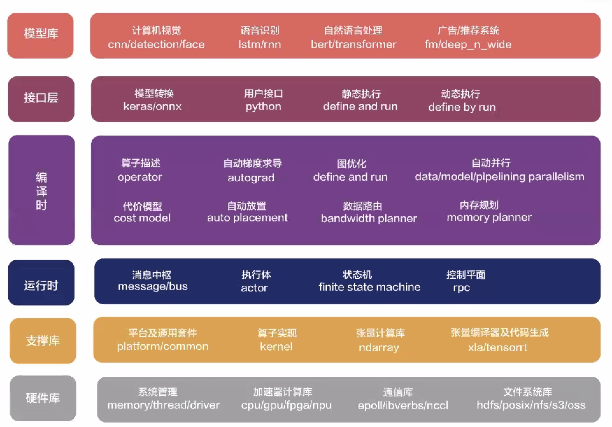
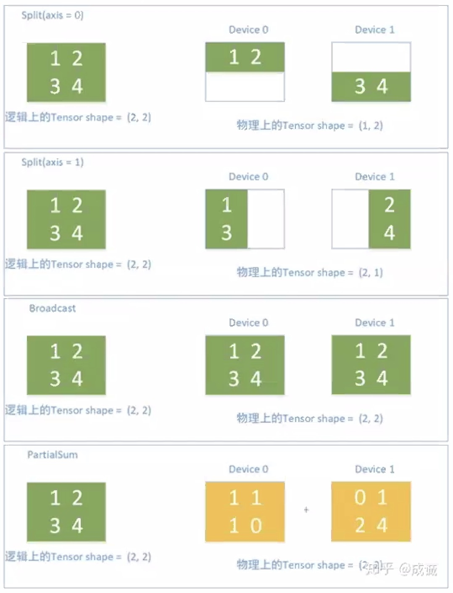

NCCL, Horovod, BytePS, Mesh-TensorFlow, Gpipe, Ray, HugeCTR, DALI

### TensorFlow Internals

[toc]

#### chpt1: 介绍

概念：数据流图、DAG、本地设备集

DistBelief: 异步SGD（model replicas），主从结构

TensorFlow: 延迟计算、原子OP、抽象设备（CPU、GPU、ASIC）、抽象任务（基于任务的PS）

#### chpt2: 编程环境

https://www.tensorflow.org/install/source#ubuntu

#### TensorFlow: Large-Scale Machine Learning on Heterogeneous Distributed Systems [2015]

node对应operation

edge对应tensor

* 也可是control dependencies，应用：控制算法、control the peak memory usage

operations and kernels

* attributes -> make operations polymorphic 
* kernel: a particular implementation of an operation that can be run on a particular type of device (e.g., CPU or GPU)
* 定义operations and kernels: registration mechanism

Sessions: 支持Extend和Run

Variables: a special kind of opera-tion that returns a handle to a persistent mutable tensor
that survives across executions of a graph. Handles to
these persistent mutable tensors can be passed to a handful of special operations, such as `Assign` and `AssignAdd` (equivalent to +=) that mutate the referenced tensor. 

##### 3.Implementation

subgraph ~ devices $\stackrel{\bf{多对一}}{\longrightarrow}$workers $\stackrel{\bf{}}{\longrightarrow}$ master $\stackrel{\bf{session}}{\longleftarrow}$ client 

device信息: the job of "the task of worker" or "localhost"

* `/job:localhost/device:cpu:0` or `/job:worker/task:17/device:gpu:3`

tensors存在backing store buffers

* Single-Device Execution: 每个node存未执行的依赖数，降为0进入ready queue
* Multi-Device Execution
  * Node Placement: cost model估算node在特定device上执行用时，simulated execution, 贪心算法
  * Cross-Device Communication: Send and Receive Nodes, 给特定tensor、特定device限制下的所有users只分配一次空间; scheduling下放给节点执行，而非master

分布式实现：per subgraph per device, TCP or RDMA

* device层面自然地形成CPU和GPU的并行

**4.Extensions**

4.1 Gradient Computation

* extending the TensorFlow graph，使heuristics可能break down
* improvements to memory management, options include:
  * using more sophisticated heuristics to determine the order of graph execution
  * recomputing tensors instead of retaining them in memory
  * swapping out long-lived tensors from GPU memory to
    more plentiful host CPU memory.

4.2 Partial Execution

* First, the Run call accepts inputs, an optional mapping
  of `name:port` names to “fed” tensors values. Second,
  the Run call accepts output names, a list of output
  `name[:port]` specifications indicating which nodes
  should be executed, and, if the port portion is present in a
  name, that that particular output tensor value for the node
  should be returned to the client if the Run call completes
  successfully.
* 根据feed node和fetch node决定partial graph

4.3 Device Constraints

* 限制的范畴：1）GPU/CPU 2)task 3)colocate with some variables
* 实现利用并查集先分析colocation，再缩小devices范围，输入到placement algorithm's simulator

4.4 Control Flow

* The Switch
  and Merge operators allow us to skip the execution of
  an entire subgraph based on the value of a boolean ten-sor. The Enter, Leave, and NextIteration operators allow
  us to express iteration.

4.5 Input Operations

* input nodes，通过文件feed，client到worker需要一个额外的network hop

4.6 Queues

* 存下数据，意义是为了prefetch from disks，或者收集梯度进行更复杂的操作

* FIFO / Shuffling Queues

4.7 Containers

* Using containers, it is possible to share state even across
  completely disjoint computation graphs associated with
  different Sessions.

**5.Optimizations**

5.1 Common Subexpression Elimination

5.2 Controlling Data Communication and Memory Usage

* e.g. 分析critical path，用control edge来delay Receive Nodes

5.3 Asynchronous Kernels

5.4 Optimized Libraries for Kernel Implementations

5.5 Lossy Compression

* 参考"Hitchhiker"论文Arithmetic Precision这节

**7.Common Programming Idioms**

同步/异步SGD

**9.Tools**

9.1 TensorBoard

9.2 Performance Tracing: EEG

#### 附录A：代码阅读

* 发现领域模型
* 抛开细枝末节： `git checkout -b code-reading`
* 适可而止，BFS阅读

#### OneFlow: 大规模分布式深度学习框架

数据并行：allreduce + PS

模型并行：参数如何划分？复杂的通信模式

横向拓展：片间高速互联，e.g. TPU

纵向拓展：单个芯片从通用到专用

静态调度与流式执行系统

OneFlow架构

* actor及流水线
  * 内存槽，用类似rust的ownership解决内存冲突问题，ownership随状态转移

* node placement: consistent view
  * SBP, 在op层面实现数据和模型并行 

#### Ray: 动态可编程分布式计算框架

1.Ray是一个动态可编程的分布式计算框架，支持分布式训练，主要体现在以下几方面：

丰富的本地训练场景（清晰指派local/remote的任务/角色，task无状态，actor有状态）

灵活训练规划pipeline（用户可以在Actor里自定义逻辑，包括循环、计时器等）

灵活数据源（流批处理融合，支持简单的数据处理chain）

2.目前工业界主要使用Ray的方式分两种，一是用Ray的上游生态lib，二是用Ray的底层能力深入自研框架

（1）Ray的上游生态：

* 强化学习库(RLLib)

* 超参调优库(Tune):  支持任意ML框架：PyTorch，XGBoost， MXNet， Keras，集成了很多优化器的库和算法， 通过TensorBoard做显示，可以和Ray Serve无缝结合
* Training with RaySGD: 优势在于能和其它Ray lib无缝结合，并且实现了分布式的dataset

（2）Ray的底层能力：大厂结合Ray自研框架的lecture在这里：[蚂蚁金服Ray Forward推广](https://tech.antfin.com/community/activities/698/review)，还没来得及听

3.Ray对应于我们系统中的多个层次，它的底层能力对应于资源管理层REAM (包括Flink, Yarn等)，上游生态对应于我们的LagrangeX

4.最值得我们借鉴的地方有哪些？

底层：

* Ray实现了高效的系统间数据传输， "在底层hack了python的内存对象，和Redis内存共享，实现Numpy、Pandas等数据格式序列化/反序列化时候zero-copy，没有损耗"，是否可以引入这一思想减小我们model serving/training过程中序列化/反序列化的开销
* Ray的结构非常优雅，global scheduler调度全部任务，local scheduler调度同一Node内共享内存的worker，object store支持Node之间的通信。

易用性：

Ray是用户友好的分布式计算框架，具体体现在

1）轻量级的API，几乎不提高代码复杂性。只用在函数前加`@ray.remote`，就能通过remote调用，使task在其它ray集群执行。

2）支持ray dashboard，利于debugging and profiling

官方doc：https://docs.ray.io/en/latest/installation.html

开源史海钩沉系列 [1] Ray：分布式计算框架 - 高策的文章 - 知乎 https://zhuanlan.zhihu.com/p/104022670