[toc]

plethora of ML frameworks：NCCL, Horovod, BytePS, Mesh-TensorFlow, Gpipe, Ray, HugeCTR, DALI

### 资料搜集

* RecSys2024 https://recsys.acm.org/recsys24/accepted-contributions/
* 美团：https://space.bilibili.com/18937923

### Intro

* 100TB model = 50万亿参数
  * 1万亿=1000B=1T，参数存储用 fp16
* MLSys历史
  * 前大模型时代MLSys的节奏：  
    * Ring AllReuce, Hovord (2017) -> PyTorch (2020) 
    * Activation Checkpoint (2014) -> PyTorch (2019) 
    * Automatic Mixed Precision (2017) -> PyTorch (2019) 
    * Int8 Quant (2015) -> TensorRT (2018)
  
  * 大模型时代：
    * Memory Efficient Attention with Online Softmax (2021) -> FlashAttention in Megatron-LM (2022) 
    * Continuous Batching (2022), Paged Attention (2023) -> vLLM, TensorRT-LLM (2023) 
    * Speculative Sampling (2023) -> Everywhere in LLM Serving (2023)
    * Sequence Parallel (2023) ->  Megatron-LLM (2023) 
  
* MLSys走向何方
  * 无论是NV内部NVLink党和Mellanox党的争论,还是其他很多企业都面临相同的问题, 计算/网络/存储/服务器/芯片等多个团队如何紧耦合, 更进一步的扩展到上层的算子/并行策略/算法等多个团队的协同. —— zartbot
  * 现在这些模型的Tensor传输量来看, 尽量的做好Overlap和提升带宽就够了. 是否还要Load/Store. 如果稀疏模型是一条路,那么就一定要. 
    * 例如一个集群通过一些网络拓扑把Allreduce的问题解决干净了, MoE等其它结构一来,AlltoAll又不行了.

  * 这一次人工智能革命的数学基础是：范畴论/代数拓扑/代数几何这些二十世纪的数学第一次登上商用计算的舞台。


#### [Google Research: Themes from 2021 and Beyond](https://ai.googleblog.com/2022/01/google-research-themes-from-2021-and.html)

  * Trend 1: More Capable, General-Purpose ML Models
    * CoTrain models: PolyViT https://arxiv.org/abs/2111.12993
    * Pathways: https://blog.google/technology/ai/introducing-pathways-next-generation-ai-architecture/
      * 本质是增强神经网络结构的稀疏性，不仅仅是参数的稀疏性
      * Discussion: https://www.zhihu.com/question/495386434/answer/2199374013
  * Trend 2: Continued Efficiency Improvements for ML
    * Continued Improvements in ML Accelerator Performance
      * TPUv4
      * Device-ML: https://ai.googleblog.com/2021/11/improved-on-device-ml-on-pixel-6-with.html
    * Continued Improvements in ML Compilation and Optimization of ML Workloads
      * XLA: https://www.tensorflow.org/xla
      * https://mangpo.net/papers/xla-autotuning-pact2021.pdf
      * GSPMD: https://ai.googleblog.com/2021/12/general-and-scalable-parallelization.html
    * Human-Creativity–Driven Discovery of More Efficient Model Architectures
      * Transformet、ViT
    * Machine-Driven Discovery of More Efficient Model Architectures
      * NAS -> Primer、EfficientNetV2
      * RL: https://ai.googleblog.com/2020/07/automl-zero-evolving-code-that-learns.html
    * Use of Sparsity
      * Switch Transformer
  * Trend 3: ML Is Becoming More Personally and Communally Beneficial
    * 从 ML+产品（Pixel手机） 到 联邦学习 
    * phone cameras
    * live translate/caption
    * [federated analytics](https://ai.googleblog.com/2020/05/federated-analytics-collaborative-data.html) and federated learning
      * 复用 FL 的 evaluating 能力 (without the learning part)
      * Now Playing: on-device database
      * https://arxiv.org/pdf/1902.01046.pdf
      * secure aggregation protocol
  * Trend 4: Growing Impact of ML in Science, Health and Sustainability
      * Large-Scale Application of Computer Vision for New Insights
          * [large-scale study of synaptic connectivity in the human cortex](https://ai.googleblog.com/2021/06/a-browsable-petascale-reconstruction-of.html)
          * [deep-learning–based approach to weather forecasting](https://ai.googleblog.com/2021/11/metnet-2-deep-learning-for-12-hour.html)
    * Automated Design Space Exploration
      * a Transformer-based variational autoencoder learns to [create aesthetically-pleasing and useful document layouts](https://ai.googleblog.com/2021/06/using-variational-transformer-networks.html)
      * [automates the exploration of the huge design space of tweaks for computer game rules](https://ai.googleblog.com/2021/03/leveraging-machine-learning-for-game.html)
    * Application to Health
      * Our [ML-based phenotyping](https://www.sciencedirect.com/science/article/pii/S0002929721001889) method improves the scalability of converting large imaging and text datasets into phenotypes usable for genetic association studies, and our [DeepNull](https://www.biorxiv.org/content/10.1101/2021.05.26.445783v2) method better leverages large phenotypic data for genetic discovery. We are happy to release both as [open-source methods](https://github.com/Google-Health/genomics-research) for the scientific community.
    * ML Applications for the Climate Crisis
      * [eco-friendly routing in Google Maps](https://blog.google/products/maps/3-new-ways-navigate-more-sustainably-maps/)
      * making our [Maps products smarter about electric vehicles](https://ai.googleblog.com/2021/01/addressing-range-anxiety-with-smart.html) can help alleviate range anxiety, encouraging people to switch to emissions-free vehicles
        * the fear that the car will run out of power before reaching a charging station
        * the charging time can be a significant fraction of the total travel time and can vary widely by station, vehicle model, and battery level. In addition, the charging time is non-linear — e.g., it takes longer to charge a battery from 90% to 100% than from 20% to 30%.
        * this high density implies that a trip between two stations that are relatively far apart will undoubtedly pass through multiple other stations. In this case, maintaining information about the long edge is redundant, making it possible to simply add the smaller edges (*[spanners](https://en.wikipedia.org/wiki/Geometric_spanner)*) in the graph, resulting in sparser, more computationally feasible, graphs.
      * On a longer time scale, **fusion** holds promise as a game-changing renewable energy source. In a long-standing collaboration with TAE Technologies, we have [used ML to help maintain stable plasmas](https://ai.googleblog.com/2021/11/another-step-towards-breakeven-fusion.html) in their fusion reactor by suggesting settings of the more than 1000 relevant control parameters. With our collaboration, TAE achieved their major goals for their [Norman](https://en.wikipedia.org/wiki/TAE_Technologies#C-2W/Norman) reactor, which brings us a step closer to the goal of [breakeven fusion](https://en.wikipedia.org/wiki/Fusion_energy_gain_factor#Breakeven). The machine maintains a stable plasma at 30 million Kelvin (don’t touch!) for 30 milliseconds, which is the extent of available power to its systems. They have completed a design for an even more powerful machine, which they hope will demonstrate the conditions necessary for breakeven fusion before the end of the decade.
      * [wildfire boundary map](https://blog.google/products/search/mapping-wildfires-with-satellite-data/)
        * https://arxiv.org/abs/2111.02780
      * carbon neutral
        * https://arxiv.org/abs/2104.10350

* Trend 5: Deeper and Broader Understanding of ML
  * [Marian Croak’s vision for responsible AI at Google](https://blog.google/technology/ai/marian-croak-responsible-ai/)
  * RecSys
    * [Recent work has helped to better understand these relationships of the individual components](https://research.google/pubs/pub49284/)
    * [learn in an unbiased manner](https://storage.googleapis.com/pub-tools-public-publication-data/pdf/54a3b73ea1e85e94e5d5bb5a9df821a1f32aa783.pdf)
  * Political Correctness
    *  [reducing gender bias in our translation systems](https://ai.googleblog.com/2020/04/a-scalable-approach-to-reducing-gender.html)
    *   [designing for digital wellbeing](https://design.google/library/designing-for-digital-wellbeing/#normalizing-compassion) and [addressing racial equity issues in ML systems](https://design.google/library/racial-equity-everyday-products/), including [improving our understanding of the experience of Black Americans using ASR systems](https://www.frontiersin.org/articles/10.3389/frai.2021.725911/full?&utm_source=Email_to_authors_&utm_medium=Email&utm_content=T1_11.5e1_author&utm_campaign=Email_publication&field=&journalName=Frontiers_in_Artificial_Intelligence&id=725911)
  * distributional shift
    * [Deep Bootstrap framework](https://ai.googleblog.com/2021/03/a-new-lens-on-understanding.html)
  * [data cascades in ML](https://ai.googleblog.com/2021/06/data-cascades-in-machine-learning.html)
	  * [PAIR Guidebook](https://pair.withgoogle.com/guidebook/)
		* 
	* [Know Your Data](https://knowyourdata.withgoogle.com/)
	  *  [finding and investigating anomalous data](https://ai.googleblog.com/2021/09/discovering-anomalous-data-with-self.html)
	  * [methods to better understand the influence that particular training examples](https://ai.googleblog.com/2021/02/tracin-simple-method-to-estimate.html) can have on an ML model
	  * a [case study of how to use the Know Your Data tool](https://ai.googleblog.com/2021/08/a-dataset-exploration-case-study-with.html) to explore issues like gender bias and age bias in a dataset.
	* more inclusive and less biased public datasets
	  * [Dataset Search](https://datasetsearch.research.google.com/)
	  * [Perspective API](https://www.perspectiveapi.com/case-studies/) tool
	* we introduced a comprehensive taxonomy to reason about [the changing landscape of online hate and harassment](https://research.google/pubs/pub49786/). We also investigated [how to detect covert forms of toxicity](https://aclanthology.org/2021.hcinlp-1.3), such as microaggressions, that are often ignored in online abuse interventions, studied how conventional approaches to deal with disagreements in data annotations of such subjective concepts might [marginalize minority perspectives](https://arxiv.org/abs/2110.05699), and proposed a new [disaggregated modeling approach that uses a multi-task framework](https://arxiv.org/abs/2110.05719) to tackle this issue
	* 可解释性
	  * [understanding the acquisition of human chess concepts](https://arxiv.org/abs/2111.09259)
	  * [Language Interpretability Tool](https://pair-code.github.io/lit/)
	* Sociotechnical aspects
	  * [supporting family caregiving.](https://research.google/pubs/pub49916/)
	* ML and privacy
	  * highlighting that[ training data can sometimes be extracted from large models](https://www.usenix.org/system/files/sec21-carlini-extracting.pdf) and pointing to how privacy can be achieved in large models, e.g., as in[ differentially private BERT](https://arxiv.org/abs/2108.01624).
	  * federated learning and analytics
	  * other techniques: [ private clustering](https://ai.googleblog.com/2021/10/practical-differentially-private.html),[ private personalization](https://proceedings.neurips.cc/paper/2021/hash/f8580959e35cb0934479bb007fb241c2-Abstract.html),[ private matrix completion](http://proceedings.mlr.press/v139/chien21a/chien21a.pdf),[ private weighted sampling](http://proceedings.mlr.press/v130/cohen21b.html),[ private quantiles](http://proceedings.mlr.press/v139/gillenwater21a.html),[ private robust learning of halfspaces,](http://proceedings.mlr.press/v130/ghazi21a.html) and in general,[ sample-efficient private PAC learning](https://dl.acm.org/doi/10.1145/3406325.3451028)
	  * privacy notions: [label privacy](https://proceedings.neurips.cc/paper/2021/file/e3a54649aeec04cf1c13907bc6c5c8aa-Paper.pdf) and[ user](https://proceedings.neurips.cc/paper/2021/file/67e235e7f2fa8800d8375409b566e6b6-Paper.pdf) versus[ item level privacy](https://proceedings.neurips.cc/paper/2021/file/a89cf525e1d9f04d16ce31165e139a4b-Paper.pdf).
	* Other Work
	  * Quantun AI: https://blog.google/technology/research/2021-year-review-google-quantum-ai/、https://quantumai.google/learn/map
	    * the Noisy, Intermediate Scale Quantum (NISQ) computing era
	    * Qubit 和 Bit 的区别，在于前者的不确定性，给存储、计算、算法的形式都带来剧变
	    * 100 qubits to build a prototype of a error-corrected **logical qubit**
	      * 1000 qubits make a logical qubit long-live
	      * 10000 qubits => complex softwares requires significant work on fabrication technology, control software, and more
	      * 100000 qubits ~ 100 logical qubits: a quantum computer
	    * TFQ: https://www.tensorflow.org/quantum

### 分布式调度框架

* 模型+数据+资源+调度
  * 资源：池化/槽位，混部/潮汐/异构/多机房/新网络架构
    * 混部：离线/近线，弹性计算
  * 数据：batch/stream，stream数据语义更贴近在线语义
    * 物理数据（行间数据处理）、逻辑数据（行内数据处理）
* 多角色生命周期管理
  * 需求：角色依赖数据（promise->actor）、角色依赖角色（actor->actor）、多角色生命周期方法执行的同步
    * checkpoint/failover
  * 思路：
    * 全局状态机 （将最重的数据相关有状态角色抽象为全局状态机）/ 全局多个独立定时任务
    *  无状态op
      * 全局状态机（root AM）+局部状态机（role AM）过于复杂
    * Op 涉及的数据层面：1）metadata；<-- 2）resource or data；<-- 3）business logic

开源框架

* TFX on kubeflow, MLOps的实践
	
	* 各组件独立性更强，数据落盘环节多
	* kubeflow pipeline: DSL描述组件拓扑、每个组件打包成docker独立输入输出，提供了基于DAG与k8s的工作流调度
	  * https://cloud.google.com/blog/products/ai-machine-learning/getting-started-kubeflow-pipelines
	* 工作流拓扑和工作负载高度客制化
	  * 工作流调度 <- Argo
	  * 工作负载容器化
	* kubeflow pipeline组件
	  * 轻量级： [`kfp.components.func_to_container_op`](https://www.kubeflow.org/docs/components/pipelines/sdk/sdk-overview/)
	  * [可重复使用的component](https://www.kubeflow.org/docs/components/pipelines/v1/sdk/component-development/)
	  * Google Cloud TFX......
	
	
	
	
	* [TFX.periodic_training](https://github.com/tensorflow/community/blob/master/rfcs/20210115-tfx-periodic-training.md)
	
	
	    * ExampleGen processes and outputs one Span
	    
	        * span有version的概念
	    
	    * Frontfill/Backfill:
	    
	        * If an older Span needs to be updated, a new version of the Span is generated by **a backfill pipeline run** with specified Span id.
	        * 不建议热更，建议新version+backfill机制
	    
	    * 不建议concurrent执行，因为The execution of TFX Components depends on the ML Metadata status before executing
	    
	        * killandrun,allowtocomplete
	
	* Preprocessing: 数据校验、schema生成
	
	
	    * range config: 1）模型span与数据span对应；2）warmup start；3）输出模型的metadata
	
	* Metadata: 实现了数据、模型的上下游血缘追踪，比如模型性能变化的因果推理、更加精密的垃圾回收
	
	* 问题：
	
	
	  * user cost和system cost的折中，比如Workflow层面的调度如何与底层调度统一
	  * 兼顾核心场景（搜广推）和长尾场景（无监督、MAB）
	
	  
	
	  
	
	  
	


  * Flink ML
    * 难以描述复杂的多角色拓扑关系

  * Ray: 参考【Distributed-Systems笔记】

```java
// Flink ML
val trainingData: DataSet[LabeledVector] = ...
val testingData: DataSet[Vector] = ...

val scaler = StandardScaler()
val polyFeatures = PolynomialFeatures().setDegree(3)
val mlr = MultipleLinearRegression()

// Construct pipeline of standard scaler, polynomial features and multiple linear regression
val pipeline = scaler.chainTransformer(polyFeatures).chainPredictor(mlr)

// Train pipeline
pipeline.fit(trainingData)

// Calculate predictions
val predictions: DataSet[LabeledVector] = pipeline.predict(testingData)
```

### 特征工程

* 参考【tensorflow笔记】的python/data部分
* 特征转换
  * 无转换，适用于**int、float**或者对应类型的**定长列表**的特征，可以直接输入神经网络。为了保持统一，我们将这一类命名为PretrainEmbedding。
  * 转换为ont-hot或者multi-hot类型，适用于**int、string**，或对应定类型的**定长、变长列表**的特征。这种转换方式适合处理小规模类别型特征，其特征转换后的可理解性，以及不同特征值之间的差异都是可衡量的，在训练数据不够大时，是可以优先考虑的类型。这种转换方式，我们命名为Encoding。
  * 转换为embedding类型，适用于**int、string**，或对应定类型的**定长、变长列表**的特征。这种方式适合大规模的id类特征，需要通过大规模的样本训练来找出当前特征值的最优空间位置。这种转换方式，我们命名为Embedding。
    * 还有一些诸如embedding加权、多值embedding聚合，共享embedding table等等更细节的优化方式
* 多次哈希：不论是Encoding还是Embedding，都可能需要对特征值进行哈希，而这就面临哈希冲突的问题，常见有两种处理手段
  * 增加哈希空间大小。哈希空间大小的配置首先必然受特征值空间的影响，如果哈希空间小于特征值空间，则哈希冲突概率很大；如果远远大于特征值空间，则会产生内存浪费。因此，在合理范围内，通过增加哈希空间来减少哈希冲突概率是非常直觉的做法。
  * 多次哈希。即一个特征值由多个不同哈希种子的结果来表达，这样只需要任意一种哈希的结果不冲突，则最终哈希结果不会冲突。但是多次哈希会显著提升计算量，因此也也需要在合理范围内选择哈希次数。

### 召回

* 索引方式
  * BF (BruteForce): 秒级到分钟级构建，十万到百万量级
  * IVF (Inverted File System): 分钟级到小时级构建，百万到亿级
    * GPU 对聚类进行加速
  * HNSW: 分钟级到天级构建，千万到百亿级实时性
    * 可能会 sharding
* 量化方式
  * Int8 
  * PQ

### 检索加速

* 基于树
  * KD Tree
  * Annoy: https://github.com/spotify/annoy
* Hash
  * Local Sensitive Hashing: https://falconn-lib.org/

* PQ
  * https://github.com/facebookresearch/faiss
* Learning to hash

#### Semantic search

* [OpenAI Embedding Model](https://openai.com/blog/new-and-improved-embedding-model/)

  * text search, code search, sentence similarity, text classification

  * Unification of capabilities

  * **Longer context.** The context length of the new model is increased by a factor of four, from 2048 to 8192, making it more convenient to work with long documents.

  * **Smaller embedding size.** The new embeddings have only 1536 dimensions, one-eighth the size of `davinci-001` embeddings, making the new embeddings more cost effective in working with vector databases.

  * **Reduced price.** We have reduced the price of new embedding models by 90% compared to old models of the same size. The new model achieves better or similar performance as the old Davinci models at a 99.8% lower price.

* [VantageDiscovery的科普](https://www.vantagediscovery.com/post/semantic-101)

  * `text-embedding-3-large` model with 2048 dimensions

* [Semantic Search using Matryoshka Embedding Vectors](https://www.vantagediscovery.com/post/semantic-search-using-matryoshka-embedding-vectors)

  * Unlike traditional embeddings, LLMs produce embeddings that consider the entire context in which a word or phrase appears, leading to more precise search results.
  * 常规优化思路：reduced vector precision, and ANN (approximate nearest neighbors).
  * 新优化思路：reduced RAM footprint by storing only parts of the embedding vectors in RAM
  * **Matryoshka Representation Learning (MRL)** constructs embedding vectors by embedding information at multiple granularity levels within such vectors.
    * https://arxiv.org/abs/2205.13147
    * inspired by the nesting concept of Russian Matryoshka dolls.
    * 思路是从低维开始往高维训
  * 使用：text-embedding-3-large的dimension接口
  * OpenAI：https://openai.com/index/new-embedding-models-and-api-updates/
  * e.g. text-embedding-3-small
    * 1536=512 + 1024
    * retain the top 5000 results from the 1st tier, and process only these 5000 results for the 2nd tier, finally retaining the top 120 results based on their full score computation
    * 最终效果：
      * 查询时间减半，效果差不多
    * With a Tiering split of (512, 1024), without locking Tier 2 in RAM, and preloading Tier 2 Pages，这样耗时很稳
  * Note：
    * 要遵守官方split

#### HNSW

* [The Hush-Hush Secret of Accuracy of HNSW and Vector Databases](https://www.vantagediscovery.com/post/the-hush-hush-secret-of-accuracy-of-hnsw-and-vector-databases)
  * The key advantage of HNSW is its ability to perform approximate nearest neighbor (ANN) searches quickly in high-dimensional spaces.
  * 缺点：
    * The 'Loss-eee-ness' Phenomenon： approximate的实现，可能忽略最准确的结果，尤其是skewed数据下
    * Lack of Real-time Tunability： 无法在线tune，只能reindex
    * Precision-Recall Trade-off
    * Sensitivity to Data Distribution
    * Complexity in High-dimensional Spaces

  * Dynamic Precision-Recall Curve
    * We leverage the precision-recall curve in what we consider a novel way. Users can visualize and manipulate this curve, allowing them to prioritize either precision or recall based on their immediate needs. We believe this dynamic approach ensures that the search can be optimized for various contexts without sacrificing overall performance.
  * Addressing 'Loss-eee-ness'
    * By allowing fine-tuning of search parameters, our algorithm directly tackles the 'loss-eee-ness' issue. Users can enhance recall without a proportional increase in latency, maintaining speed while mitigating accuracy loss.
  * Improved ANN Searches
    * We employ advanced techniques for approximate nearest neighbor searches in high-dimensional spaces. By utilizing the inner product to measure similarity, we aim to ensure that results align closely with the user's intent, even in complex semantic contexts.
  * Adaptive to Data Distribution
    * Our algorithm is designed to be more robust to varying data distributions. We believe this adaptability ensures more consistent performance across different types of datasets and query patterns.
  * Balancing Act Between Speed and Accuracy
    * While HNSW often requires choosing between speed and accuracy, our approach aims to provide a more nuanced balance. Users can change this balance based on their specific needs, without drastic trade-offs.

### 粗排

#### COLD : Towards the Next Generation of Pre-Ranking System

阿里定向广告最新突破：面向下一代的粗排排序系统COLD - 萧瑟的文章 - 知乎
https://zhuanlan.zhihu.com/p/186320100

Computing power cost-aware Online and Lightweight Deep pre-ranking system

小精排支持复杂算法探索

* SENet: 模型训练时获取特征重要性数据
* 并行化：在取PS之后做模型并行预估，能比论文中的实现更高效
* 列存：全链路列存
* fp16
  * mix precision: fp32 BN + fp16 fully-connected layers
  * parameter-free normalization

#### Towards a Better Tradeoff between Effectiveness and Efficiency in Pre-Ranking: A Learnable Feature Selection based Approach, SIGIR 2021

Feature Selection method based on feature Complexity and variational Dropout (FSCD)

2.1 FSCD for Pre-Ranking Model，核心思想是 variational dropout

* 特征选取概率与特征复杂度负相关
* 特征复杂度的因素：特征类型、embedding size、key size (能类比于候选数量)
* 数学手段：
  * 公式(3)，损失函数，参数z的正则化
    * 特征复杂度越大，正则项系数越大
    * 损失函数及正则化系数的推导（见附录）
  * 公式(5)，Bernoulli 分布的平滑化

2.2 Fine-Tuning the Pre-Ranking Model

* 用精排模型参数来初始化参数，fine-tune 加速训练
* $\gamma_3=10^{-7}$ 描述候选数量，也是一个衡量特征复杂度的参数


### 成本和性能评估

* [MFU与FLOPs计算](https://zhuanlan.zhihu.com/p/690804699?utm_psn=1830997251394240513)
  * 模型算力利用率（Model FLOPs Utilization， MFU）和硬件算力利用率（Hardware FLOPs Utilization， HFU）
  * 模型算力利用率是指 模型一次前反向计算消耗的矩阵算力 与机器算力的比值
  * 硬件算力利用率是指 考虑重计算后，模型一次前反向计算消耗的矩阵算力 与机器算力的比值


### PyTorch

* 训练
  * 如果追求性能，可以用torch.fx改一下图，把手写op改进去
  * torch.fx symbolic_trace可以变成静态图
* 部署
  * 静态图，会用torchscript trace出来整个图，然后在ir上做一些编译优化
* 读数据
  * https://zhuanlan.zhihu.com/p/376974245
  * Dataset 每次获取一个Part的Dataframe，外部再进行batch_size的划分，这样在整个迭代期间，最多只会有num_worker个Dataset被实例化，事实上也确实不再有内存溢出的问题


```python
class ExpDataset2(Dataset):
    def __init__(self, filenames, features_config): 
        self._filenames = filenames
        
    def __getitem__(self, idx):
        path = self._filenames[idx]
        return preprocess(read_csv(path)
        
def load_data(paths, features_config, num_workers, batch_size):
    dataset = ExpDataset2(paths, features_config)
    data = DataLoader(
        dataset,
        num_workers=num_workers,
        batch_size=1,
        collate_fn=collate_fn2
    )
    for df in data:
        for idx_from in range(0, df.shape[0], batch_size):
            yield examples[idx_from : idx_from + batch_size]
```


### Go+Torch

https://github.com/wangkuiyi/gotorch

* Q: TensorFlow为什么需要引入图这个概念？

  * A1: backward自动求导，需要定义前向的数据结构
  * A2: python执行速度慢，决定执行效率的是图的解释器。图是python代码的另一种表示形式，开始包括前向计算过程，通过调用TensorFlow API，加入其它op包括反向计算过程和模型更新过程。构造图本质上是在编译。

  * [TFRT](https://github.com/tensorflow/runtime)


* 调用libtorch内部的native function类比tf的op，但native function是函数，而不是一个class，每一个function可以用HLO（一种古老的适用于数值计算的语言）写一遍。gotorch调libtorch调pytorch XLA里的HLO程序，翻译成特定设备优化的代码

  * native function有YAML描述，可自动生成Go Wrapper

  * torchscripts：用到的python语法的子集 => python高层api可翻译成torchscripts再翻译


* 如果 Go+Torch 在未来一年里孕育成熟，有望优化以下核心应用场景:
  * 统一训练和预测系统(目前训练用 Python 写，预测用 C++)
  * 统一云和端系统(目前云上用 TensorFlow，端上比如 xNN 调用 TensorFlow Lite)
  * 统一训练和预测时的数据处理流程(目前需要用 Python和C++分别做两套，开销大，而且容易出错)
  * 统一搜索、推荐、广告、金融核心、移动智能和端智能、无人驾驶等多个领域的基础架构
  * 能支持新的机器学习模式——online learning、GAN、reinforcement learning、imitation learning等。

### OneFlow: 大规模分布式深度学习框架

数据并行：allreduce + PS

模型并行：参数如何划分？复杂的通信模式


横向拓展：片间高速互联，e.g. TPU

纵向拓展：单个芯片从通用到专用


静态调度与流式执行系统


OneFlow架构

* actor及流水线
  * 内存槽，用类似rust的ownership解决内存冲突问题，ownership随状态转移


* node placement: consistent view
  * SBP, 在op层面实现数据和模型并行 
  

### MLOps

* 磁盘U形故障率 ~ GPU故障率建模


### AWS - SageMaker

#### Sagemaker Immersion Labs

https://sagemaker-immersionday.workshop.aws/

[Github Link](https://github.com/aws-samples/amazon-sagemaker-immersion-day)

* Lab 1. Feature Engineering
* Lab 2. Train, Tune and Deploy XGBoost
  * Hyperparameter tuner
* Lab 3. Bring your own model
  * Bring your own container
  * Bring your own script
* Lab 4. Autopilot, Debugger and Model Monitor
  * Autopilot: generates notebooks for you
  * debug hooks that listen to events
  * class activation maps with SageMaker Debugger
* Lab 5. Bias and Explainability
* Lab 6. SageMaker Pipelines

总体分析

* python SDK, IDE 式的开发体验
* instance per notebook
  * brings elastic, dedicated compute for each person, project, dataset, step in your ML lifecycle
* Train a model
  * Build-in algorithms
  * Script mode
  * Docker container
  * AWS ML marketplace
  * Notebook instance
* use_spot_instances=True

#### SageMaker Debugger

《AMAZON SAGEMAKER DEBUGGER: A SYSTEM FOR REAL-TIME INSIGHTS INTO MACHINE LEARNING MODEL TRAINING》

https://github.com/awslabs/sagemaker-debugger#run-debugger-locally

* 痛点：训练过程长、不透明（训练进程、底层资源情况）
  * e.g. 遇到过拟合，终止训练任务的机制
* 关键特性
  * 数据采集：零代码修改；持久化存储
  * 自动数据检测：检测训练过程、系统瓶颈；提前终止；自定义规则；与 Cloudwatch 事件集成
  * 实时监控：指标调试；通过训练的 step 或时间间隔进行资源利用率分析
    * 算法层面：特征重要性、layer weight/gradient 信息展现、帮助理解 serving/training 一致性 (data drift)
  * 节省时间和成本：原型验证；资源
  * 集成在 Studio 环境中
* 实现
  * 训练容器 ---> 存储 ---> Debugger 容器 ---> actions
    * Actions: [cloudwatch](https://aws.amazon.com/cn/cloudwatch/) + [lambda function](https://aws.amazon.com/cn/lambda/)
  * [smdebug](https://pypi.org/project/smdebug/#description)
  * Profiling
    * 原生框架分析：可能增加 GPU 内存消耗
    * 数据加载分析：调试器收集 DataLoader 事件信息，可能影响训练性能
    * python：cProfile (python operator), Pyinstrument (隔段时间记录堆栈情况)
  * Debugger Hook: 类似 Tensorflow 的 hook，传入 callback 对象，采集指标到存储
  * Rule 集成在 Hook 中: 系统层、模型层（过拟合、梯度消失）

```python
# record tensors
import smdebug.tensorflow as smd
hook = smd.KerasHook("/opt/ml/tensors")
model.fit(x, y, epochs=10, callbacks=[hook])

custom_collection=CollectionConfig(
	name="relu_ouput",
	parameters={
		"include_regex": ".*relu_output",
		"save_interval": "500"
  }
)

# access tensors
from smdebug.trials import create_trial
trial = create_trial("/opt/ml/tensors")
trial.tensor_names(regex=".*")
trial.tensor("conv0").value(step)

# monitor tensors
while not trial.loaded_all_steps:
  steps = trial.steps(mode=modes.EVAL)
	t = trial.tensor("conv1").value(steps[-1])
	plt.hist(t.flatten(), bins=100)
  
# analyze tensors
labels = "CrossEntropyLoss_input_0"
predictions = "CrossEntropyLoss_input_1"
inputs = "ResNet_input_0"
for step in trial.steps():
  l = trial.tensor(labels).value(step)
	p = trial.tensor(predictions).value(step)
	i = trial.tensor(inputs).value(step)
for prediction, label, img in zip(p,l,i):
	if prediction != label:
		plt.imshow(img)
```

* Challenges
  * Scale rule analysis by offloading into separate containers
  * Reduce overhead when recording and fetching tensors
    * optimize data retrieval with the help of index files that store metadata such as name, shape, and step along with the location of tensor objects
  * Separate compute and storage and minimize impact on training
* Rules
  * datasets
  * activation functions: sigmoid's vanishing gradients, dead ReLU
  * poor initialization: 随机 weights 是保证 independently learn


* Deployment Results and Insights
  * latent space + [t-SNE]()
  * Using Debugger for iterative model pruning
    * Many types of pruning techniques are known, for example, structured versus unstructured prun-ing, randomly removing weights versus removing by size or rank, and iterative pruning versus one-shot pruning (Blalock et al., 2018). In case of CNNs, iterative filter pruning is known to achieve state of the art results


### 搜索电商架构

#### 综述

> 电商搜索全链路（PART I）Overviewhttps://mp.weixin.qq.com/s/8-JtKugK-zf9In2ZdI3lrg

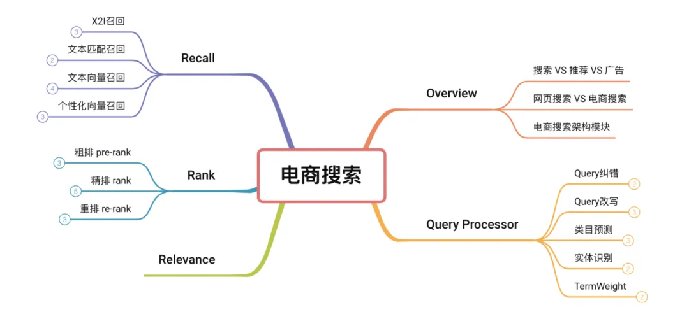

* 电商搜索和网页搜索的区别
  * 亿级 vs 万亿级
  * 数据结构化 vs 非结构化
  * 相关性时效性+CTR/GMV
* 阿里KDD'21的论文：《Embedding-based Product Retrieval in Taobao Search》，经典架构


* 总结：
  - 演进路线：传统lexical matching -> 深度模型 -> NLP-based检索 -> 个性化模型
  - **NLP相关性模型/策略的能力**是发展重点
  - 常见的精排模型结构仍是双塔模型（算法效果依赖 query*doc cross feature）
  - LLM兴起后，可能 **低成本打平甚至超过** 以往基于NLP技术的算法迭代


#### 美团架构

> https://www.bilibili.com/video/BV1gM4m1r7DQ
>
> https://tech.meituan.com/2024/07/05/the-practice-of-search-advertising-recall-technology-in-meituan.html
>
> 从架构演进的角度讲解：
>
> 重点：关键词挖掘技术、用户个性化信息和语义个性化信息分别学习、搜索推荐化解决泛意图弱供给

* 业务特点
  * 搜商品（80%+） + 搜商家 + 猜你喜欢
  * 百万级商家、十亿级别商品
  * 中小商家多，内容质量不高
  * LBS属性，供给不充分，对召回率要求更高

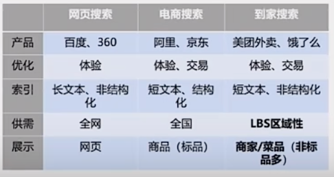


* 阶段一：多策略关键词挖掘
  * SPU通过离线方式，挖掘核心关键词，在线与Query精确匹配
  * **特点**：
    * 只聚焦于通过离线方式覆盖高频流量；
    * 缺乏线上的行为数据，以NLP的挖词技术为主；
    * 为了追求更多的覆盖，采用了多策略并行的方式，不断叠加新的召回策略，以达到更高的流量覆盖
  * 一由于Query很短，我们很容易通过信息抽取，把词或实体核心信息抽取出来；二是因为头部效应比较明显，Top2万的Query覆盖了很多流量，采用这种离线方式能快速拿到大部分收益；三是由于商家没有买词能力，如果用Query直接匹配商品，会涉及到传导文本匹配问题，匹配难度会更高，所以我们最后采用模型从商家商品里挖掘核心词，在线做短串匹配的方式。
  * 第一版：更多采用基于规则的挖掘式策略，把流量分成了商家词、商品词和品类词。商品词通过分词和词频贡献的算法，挖掘核心关键词，由于品类字面没有完全匹配的信息，我们通过互信息，构建词之间的权重去挖掘。但问题一是规则能力较弱；第二是只能挖掘出连续的短词，比如“炒西红柿鸡蛋”，它只能挖掘出“炒西红柿”，挖掘不出“炒鸡蛋”。
  * 第二版：抽取式模型
    * 序列标注模型：只能挖掘出连续短串，好处是挖掘效率比基于规则的挖掘模式高，但会导致很多关键词受限于连续短串的方式而挖掘不出来
    * 标注组合模型和指针组合模型：标注组合模型能够跨越连续短串挖掘，但它有一个顺序概念在里面；指针组合模型可以在原有短串里随机组合词，突破顺序和连续的局限。但抽取式模型的准确率较高，探索空间不足
  * 第三版：生成式模型
    * 深度分类模型：将SPU商品文本直接分类到这2万个Query标签里，做词和Query间的匹配，但这种多分类模型较难优化，也不能泛化出更多的Query，时效性和更新频率也有限
    * 深度生成模型：受限于模型规模和样本丰富度，准确性不太好，所以我们在后面加了标注和生成模型，在具备生成泛化性的同时，尽量控制Query质量


* 阶段二：分层召回体系
  * 特点：
    * 在一个业务范畴内，通过把技术做深能够取得业务效果的极大提升；
    * 随着基建能力的提升，更多的是把召回由离线切换成在线，以此覆盖更多的流量；
    * 在单通路的召回能力上，我们突破了传统单一NLP技术瓶颈，开始大规模使用个性化/图/多模态等新的召回技术。在2022年底，整个分层召回体系取得了不少成效。
  * 第一是强意图有供给，通过关键词就能较好满足，因此在这个象限里，我们更多是在迭代关键词召回技术。
    * 一是通过离线统一到生成式的方式。前面介绍离线关键词挖掘策略可能会有十几个通道，不管迭代哪个通道，策略召回的覆盖面都是有限的，而且团队也没那么多人迭代，但这种情况下，我们把整个离线关键词十多路的挖掘策略通过规模较大的生成式模型做了统一，引入了多模态信息，做到了数据更多、模型更多以及召回目标更多的情况，后期只需要通过优化模型能力，就能取得线上全流量覆盖的效果；
    * 二是通过离线关键词的方式做到了在线。我们并没有采用业界传统的布尔检索，这种方式有两个局限，一是Query改写以及商品分词基于较浅层的模型，整体效果会受限于模型效果。二是它没有做到检索和最终目标的匹配。
      * 在线稀疏化检索方式类似于双塔向量检索，但每个模型出来不是一个稠密的向量，而是一个几万维稀疏的term粒度，通过端到端的建模方式，把Query和商品映射到一个稀疏的几万维槽位的几个槽位里，离线训练时通过槽位端到端的建模，实现目标检索和目标一致性，在线检索时，基于槽位构建倒排检索，具备一定的可解释性。
  * 第二个是泛意图有供给，体现了用户的个性化偏好，通过迭代向量召回模型覆盖这个场景。向量召回经过了三版迭代。
    * 第一版是基于传统语义相关性约束的双塔模型，和业界的做法类似；
    * 第二版将用户个性化提上了日程，但如果只把用户个性化特征和传统语义特征融合在一起，**黑盒式学习很容易被用户个性化信息带偏**，最后我们让**用户个性化信息和语义个性化信息分别学习**，通过显式叠加的方式做端到端的建模。这种检索方式能够兼顾个性化和语义相关性信息；
    * 第三版是基于平台的多样化目标，我们需要对齐后链路的精排目标，在召回阶段考虑整体商业价值。
  * 第三个是泛需求弱供给，比如搜索“汉堡王”，但给TA一个“肯德基”，TA也会下单，通过**搜索推荐化**的方式覆盖和解决。
    * 这个场景比较复杂，从业务来看，它需要做引导和推荐，在结果页里也做偏泛结果的推荐，涉及到搜索前和搜索中，搜索中既有商家也有菜品，既涉及要推荐什么样的菜品，也涉及推荐什么样的商家；
    * 另外推荐本身是一个关系建模。我们最后选择基于图模型的迭代，因为图模型首先是一个基于关系的建模，而且图模型具备多场景海量信息的容纳能力，在图建模里，一是构建了异构的多节点百亿规模图，通过图预训练加微调的方式识别多个场景，我们最近也在尝试做图和大模型训练相结合的方式；
    * 二是我们把整个图检索搬到在线，因为在搜索场景中，用户需求是即时需求，属性较强，只有把检索搬到在线，通过图在线的实时检索聚合到用户当前最有可能的潜在兴趣情况下，才能实现收益最大化。
  * 第四个是没有供给的场景，通过流量结合供给运营化的方式解决。


* 阶段三：生成式召回
  * 核心思路是按照流量和供给特点分类，强意图是直接搜索一个商品；泛意图比如搜索“烧烤”这个品类，泛意图用户虽然表达了需求，但满足需求的候选可以很广，甚至可以替代；供给层面分为有供给、弱供给和没有供给三个象限
  * 核心思路是结合大模型或生成式技术思想，提高召回算法的决策空间，提升模型的匹配能力。经过一段时间迭代，我们抽象出广告子模块结合LLM落地的三类思想及方式，分别是用思想、学能力、用LLM。具体和子模块结合的一些探索如下：
    * 一是离线关键词召回方向。如刚才介绍，我们已经把整个离线关键词召回技术方式统一到了规模不错的生成式模型方式上。大模型出来后，直接用大模型其实还存在着算力及效果的2个挑战。但我们认为大模型的两个核心技术思想：**Cot（Chain-of-thought，能使大型语言模型能够更好地理解人类的语言请求）推理和RLHF（Reinforcement Learning from Human Feedback，一种基于人类偏好的强化学习方法）对齐人类反馈思想**，对我们现有模型的优化也是有帮助的，因此我们使用大模型的这些技术思想来改造离线生成式召回模型。
    * 二是在向量召回方向。我们已经将向量表征升级为多模态模型，进一步我们思考，**LLM语言大模型对于离散Token的信息归纳及表征是有比较大的提升的**，但是在稠密表征领域，一个值得借鉴的方法是扩散模型，因为扩散模型也是通过多步去噪的方式来生成目标，通过扩散多步过程，在其中引入多元信息多步融合的思路，提升整个向量召回的向量表征能力。
    * 三是随着我们探索的深入及对应算法能力的提升，我们构建了美团领域广告大模型，尝试直接把大模型用到美团实际场景里做关键词召回，将离线中等规模的生成式模型直接替换成大模型，并探索大模型在线化。
    * 第四个是蒸馏大模型能力，主要在相关性场景落地，目前蒸馏了两块能力，Cot推理能力和模型隐层知识能力蒸馏
  * 生成式关键词召回
    * 生成式召回主要借鉴大模型思想，我们已经升级为统一的生成式模型，它的工作方式是基于beamsearch的方式，一次生成多个结果，但结果之间是互相看不到的，我们认为这种方式会存在问题，另外，从线上和实际生成结果来看，词之间是有关系的，按照概率方式来看，如果一个关键词能够推理出另一个关键词，大概率前面这个关键词要比下一个关键词的信息含量多，那能否借鉴大模型推理思想，**按照序列生成方式逐步推理出多个关键词**。
    * 我们通过构建概率贡献图的方式，采样得到关键词之间的导出关系，在一次生成时，直接生成多个关键词，这多个关键词之间有推理关系，比如要给“花仙女鲜花店”商家生成关键词，第一个关键词就是相对具象的“鲜花店”，它的含义和商家的商品描述是确定的，在生成“鲜花店”时，可以推理成“花店”，进一步可能会生成新关键词，通过这种序列推理方式，能够很好地利用关键词之间的关系。
    * 在序列推理生成关键词时，比如生成了5个关键词，有一个关键词不相关，剩下的4个关键词是相关的，那如何通过模型识别出这种不一致现象，能否借助人类反馈方式，实现模型序列好坏端到端的判断。模型生成的关键词序列与人工标注是否一致，通过这种反馈对齐的方式喂给模型，提升整个序列生成结果的一致
    * 
* 对于离线关键词，前面是中等规模的模型，我们最近把整个离线关键词替换成大模型，之前没有替换是因为开源通用大模型能力在领域场景里，挖掘词的准确性和通用性有限，我们一直在构建美团广告领域的大模型，通过激发大模型知识，生成更全面准确的模型，我们做了3个阶段的优化。
  * 第一是融合领域知识，比如健身和轻食相关，这是领域知识，通过领域全参数训练得到一个基础的广告领域模型。
  * 第二是融入场景知识，美团有很多店铺和商品名，比如川菜和眉州东坡在店铺里有很多相关数据。通过这种指令微调的方式学习店铺知识，在实际应用时，再学习偏实际的知识，比如搜索“猪手”时，发现他之前检索过很多“猪肘切片”，通过这种检索方式增强大模型当前推理知识能力。
  * 最后通过构建领域大模型和检索增强范式，在一些场景里替换传统大模型，这样，我们发现召回效率明显提升。
  * 

* **多模态生成式向量召回——结合扩散模型，多阶段生成向量表征**
  * 我们改造或优化多模态向量召回，在表征里结合扩散模型做了优化，如下图左边所示，传统的多模态向量召回更多是在item侧表征里，将商品图片和文本模态信息融合在一起，得到一个表征，那能否通过一些方式在Query侧也实现多模态表征。一个用户在美团场景里搜索一个Query时，大概率他的脑海里已经有关于这个Query所对应菜品图片的大致印象。那我们如何通过模型建模的方式还原图片的印象，核心在于还原用户的潜在意识。
    * 我们的做法是，一是把Query历史点击的图片信息汇集在一起，表征Query所代表的通用视觉信息；二是将用户历史点击图片代表用户个性化视觉信息，把这两类视觉信息叠加在一起，可以在一定程度上反映用户在当前搜索框架下，想要得到的流量侧多模态信息，最后通过多模态表征匹配技术，整个离线召回效率也有提升。

* 但这种方式也是基于传统的判别式表征，比如现在大家都在做个性化向量召回，相关性和个性化之间有递进关系，最浅层的需要保证相关性，第二层才需要在相关性里挑选更个性化、更符合用户偏好的候选集，给到下游链路。
  * 但传统的判别式方式一般在特征阶段叠加不同特征，通过建模、多目标落实反向迁移方式，不能很好的显式学习到不同目标间的递进关系，但SD生成模型比较适合这种稠密向量生成，通过多步还原过程，本质上也是一个不断推理的生成式过程。

* 我们希望向量表征具备不同信息的推理能力，SD的多步加噪去噪过程类似于推理过程，可以相结合，在不同步骤中引入不同维度的信息，做到多维信息的显式理解及融合。
  * 在正向编码过程中，先将item通过编码器编码成向量后，逐渐加噪还原成白噪声，在反向去噪还原过程中，在噪声里分阶段添加用户Query以及side info信息，通过多步还原的方式，还原出Query所代表的信息。并有两个对比的操作，一是传统的样本Paiwise学习，通过对比学习方式拉近Query与相似Item的表征；二是我们认为相似item有类似的标准过程，通过对比学习拉近相似item之间在扩散中间过程的表征，这是整个建模过程。
  * 在还原阶段，我们会显式还原中间步骤叠加相关性信息、个性化信息，通过对比方式让模型在还原过程中显式相关性和个性化信息，最后在模型结果里能看到，如下图左边是传统的判别式模型里最好的一个Baseline，它能够较好区分Query和正样本信息，但它在个性化样本和相关性样本里基本是混在一起的，通过这种扩散模型方式，相关性样本和个性化样本就有一定程度区分开来的能力。


#### [京东] Towards Personalized and Semantic Retrieval : An End-to-End Solution for E-commerce Search via Embedding Learning

> https://zhuanlan.zhihu.com/p/465504164


#### [第四范式] 如何构建一个好的电商搜索引擎？

> https://www.infoq.cn/article/ixobeuyc5q0b1dmhrwh7

* 商业逻辑：
  * 搜索，是电商 app 非常重要的一个流量入口，可能很多电商 app 来自搜索的流量都会占过半以上。
  * 搜索行为背后是巨大的UV价值


#### 个性化

* DataSQRL + Flink https://www.datasqrl.com/blog/personalized-ai-search/
  * deduplicate the stream to get the most recent version for each product.


### LLM + Rec/Search MLSys

#### Intro

* https://github.com/WLiK/LLM4Rec-Awesome-Papers
* [LLM+Recommendation大模型推荐近期进展|含WWW, SIGIR, AAAI等顶会文章](https://mp.weixin.qq.com/s/m8DMgSt_r-HVNHHzA8ceVw)
* KDD 2024 工业界搜广推工作整理 https://mp.weixin.qq.com/s/io8bZRMTmt9rQ2pRh1T2pQ

#### Literature Review

* CRS：参考「Recommender AI Agent」的文献综述

  * attribute-based question-answering CRS
    * aims to recom- mend suitable items to users within as few rounds as possible. The interaction between the system and users primarily revolves around question-answering concerning desired item attributes, iteratively refining user interests
    * Key research challenges in this area include developing strategies for selecting queried attributes(Mirzadeh, Ricci, and Bansal 2005; Zhang et al. 2018)
    * addressing the exploration- exploitation trade-off(Christakopoulou, Radlinski, and Hof- mann 2016; Xie et al. 2021).

  * open-ended conversation CRS
    * leveraging pre- trained language models for conversation understanding and response generation
    * incorporated external knowledge

#### Picnic: LLM 增强电商搜索

> https://blog.picnic.nl/enhancing-search-retrieval-with-large-language-models-llms-7c3748b26d72

* 思路：大量的LLM离线预处理+在线缓存
  * 离线：
    * LLM: 商品 -> Query + 描述
    * LLM: Query + List[描述] -> 描述
  * 在线：
    * 描述型 Query -> 相似Query描述 -> 召回需求商品
    * 真 Query -> 缓存 -> 命中Query描述 -> 召回相似商品
* prompt-based product description generation
  * transforming search terms into detailed, actionable queries


#### Amazon:  [基于大语言模型和推荐系统构建电商智能导购机器人](https://aws.amazon.com/cn/blogs/china/build-an-e-commerce-intelligent-shopping-guide-robot-based-on-large-language-model-and-recommendation-system/)

* 基于 Amazon SageMaker、Amazon OpenSearch、AWS Lambda、Amazon Personalize 和 Amazon API Gateway 等基础云服务，结合大语言模型、开源大语言模型应用框架 langchain 以及开源前端架构 Stramlit
* 功能：智能问询、商品推荐、商品个性化营销文案
  * 多轮对话：挖掘用户需求，商品的品牌、价格、材质、用途、使用场景等角度
* 框架：
  * dynamodb存储“用户同session的对话记录”（类似OpenAI的thread概念）
* 测试集：https://github.com/aws-samples/retail-demo-store
  * 2000 多个虚拟商品数据、6000 多个虚拟顾客数据和 2 万多条虚拟交互信息


### 

#### 阿里[**LLM在电商推荐系统的探索与实践**](https://www.53ai.com/news/qianyanjishu/357.html)、LLM4REC综述

> LLM+RS、LLM As RS
>
> 基于LLM知识能力的类目搭配推荐

* 对比RecSys和LLM：
  * 前者是一个数据驱动的系统，依赖电商ID体系来建模用户或物品，缺乏语义和外部知识信息，存在信息茧房、冷启动、多样性不足、无法跨域推荐等问题；
  * 后者缺乏推荐领域内的专有数据信息，不具备传统推荐模型的序列处理和记忆能力，同时计算复杂度高、训练和推理成本大。

* 两种范式：LLM+RS；LLM as RS
* LLM + RS
  * LLM Embedding: U-BERT[2]对用户评论内容进行编码来增强用户的个性化向量表征，最终得到稠密的embedding向量；UniSRec[3]通过对商品title/用户行为序列进行编码，来达成跨域序列推荐的目标。
  * LLM Summary:
    * 生成式新闻推荐框架GENRE[5]
    * GPT4Rec[6]将LLM模型用于用户意图理解，根据用户的行为历史，进行兴趣抽取并生成中间的语义query，用于后续的推荐召回。如下图所示，其主要分为两步：首先根据用户历史交互的商品和它们对应的标题，通过prompt格式化后，使用GPT2来生成可以表征用户多个兴趣的“search query”。然后将GPT2生成的query提供给搜索引擎，以检索要推荐的商品，从而提高推荐召回的相关性和多样性。


* LLM As RS
  * LLM As Ranker
    * 此类工作[7] [8]将推荐问题形式化为给定条件的排序任务，其中用户的历史交互作为条件，推荐系统召回得到的商品作为候选。通过设计合适的prompt模版，结合条件、候选、排序指令，使得LLM为候选的商品进行打分或者排序。
    * 实验证明，LLM在Zero-Shot场景具有较好的零样本排序能力，但在排序时不可避免地有position bias和popularity bias问题。


* 算法方案：受限于LLM模型极大的推理耗时，无法满足在线推荐系统毫秒级的时延限制，短期内不具备将LLM模型用于在线推理的条件。于是我们更多地采用"LLM + 推荐"的方式，去利用大模型的知识和推理能力，提高推荐模型对商品信息、上下文、用户行为序列的知识表达，包括：
  * 借助LLM通用知识信息，构建类目搭配体系，引入推荐系统在推荐召回侧引入搭配I2I、排序侧进行类目兴趣扩展建模，提高推荐的多样性。
  * 借助LLM文本推理能力，辅助商品/用户理解。
    * 我们使用LLM将电商Item冗余文本信息进行去噪提纯和改写；
    * 结合用户行为序列、上下文以及用户画像，进行用户行为sumarry总结。并通过预训练语言模型，将文本知识结果进行embedding向量化表征，与传统的推荐模型进行知识感知嵌入，提高模型的知识表达。


* 基于LLM知识能力的类目搭配推荐
  * 经过多年的沉淀，电商平台已经拥有了一套完整的类目体系。这套类目体系通常采用树状结构，通过层层拆解，最终将一个商品映射到一个末级类目，不同末级类目之间相对独立。现有的类目体系无法体现出这类目之间存在的搭配信息，缺乏跨类目的搭配关系表达。
  * 同时，相较于品牌和卖家，类目可以更加显式地与用户兴趣进行聚合和映射。在推荐场景之中，给用户准确地推荐相关商品的同时，如果能够挖掘不同兴趣之间的隐藏关系，基于搭配进行发散推荐，将给用户带来新的惊喜感、实现用户需求和兴趣的扩展。
  * 类目体系：休闲裤和衬衫分别属于一级类目（男装）下面的不同二级类目，而男帆布鞋又挂载在另一个一级类目（流行男鞋）上
  * 传统的类目关系挖掘往往基于知识图谱，采用距离度量、聚类、行业规则、协同过滤等方法。这些工作大都需要繁杂的数据清洗、算法挖掘和行业专家知识。LLM大模型的出现，让快速、高效的电商知识构建变成了现实。
  * Prompt:"1.用逗号分隔,2.返回格式为'''类目1,类目2,类目3...''',3.不包含【cate_name】这个词,4.搭配类目丰富"
  * 站内类目ID映射：由于LLM模型返回的是通用知识信息，存在与站内的类目体系无法完全对应的情况。为了便于后续推荐各个模块使用，兼容现有的电商推荐链路，我们进一步将LLM搭配类目映射成站内类目ID。站内类目ID映射可以采用以下两种方法：
    * 基于文本相关性的向量召回。将LLM搭配类目和站内类目分别表征成文本embedding向量，然后通过向量召回的方式，选取与LLM搭配类目距离空间最近的top站内类目进行映射。
    * 基于站内后验统计的query2cate映射。将搭配类目作为query，根据电商平台搜索query2cate的统计数据，使用该query下top的点击cate作为映射类目，实现LLM搭配到站内ID的映射。
  * 精排兴趣扩展


* **基于LLM文本能力的商品语义表征**
  * 对于商品类目以及属性信息，通常将其通过multi-hot的方式进行编码转化成特征向量。
    * 容易产生数据稀疏问题。
  * 商品标题语义上并不连贯，信息凌乱（包括“爆款”、“特价”等），直接进行mutli-hot或者文本编码难以得到很好的嵌入表示。
  * 一种可行的解决方案是将对商品零散的信息转换成语义连贯的文本，然后通过pre-train语言模型进行编码。对此，我们借助LLM蕴含的强大的语言表达能力和逻辑推理能力从商品标题中抽取出关键信息，从而实现对商品标题的正则化，得到语义连贯的文本描述，再对其进行编码，从而丰富商品的特征。
  * Prompt：你现在是一个买家。给定商品的描述词【A】以及各种属性【B】，请根据关键词和关键属性描述出商品是什么。要求是只需要回答是什么，不要补充其他内容，尽量从A和B中选出词语进行描述，字数不超过40，回答模版为:这个商品是...。比如当A=['giyo', '公路', '山地车', '专用', '自行车', '单车', '专业', '骑行', '手套', '半指', '夏季', '男', '硅胶', '减震', '女']，B=['尺码': 'XXL', '类目': '自行车手套', '适用对象': '通用', '颜色分类': '弧光半指-黄色-双面透气+GEL硅胶+劲厚掌垫', '上市时间': '2016年夏季', '货号': '1183', '品牌': 'GIYO/集优', '款式': '半指手套']，输出：这个商品是GIYO牌的自行车半指手套。现在A=...,B=...
  * 指标：平均困惑度 https://zhuanlan.zhihu.com/p/114432097

* 商品语义向量-引入排序模型：仅仅是加特征
  * 借助Modelscope的CoROM模型[15]，我们对正则化后的商品标题文本进行了向量化抽取，并作为特征加入基于双塔结构的DSSM粗排模型中[16]
    * https://www.modelscope.cn/models/damo/nlp_corom_sentence-embedding_chinese-base-ecom/summary
  * 特征降维方式是BERT-whitening[18]

* 更多方向：
  * 多模态推荐：利用多模态LLM大模型的多模态信息抽取和表征能力，提取包括图片、文本、视频关键帧，视频语音文字等不同模态的语义化信息，并通过离线特征工程进行表征，使线上推荐模型能够真正完整地感知到各种电商模态信息，并实现对用户不同信息偏好和意图的理解。
  * LLM推理加速：现阶段LLM存在推理时延过高的问题，无法满足推荐系统数十ms级别的rt要求，我们的LLM探索也止步于离线特征编码阶段。后续考虑通过蒸馏、剪枝、量化等手段，用一个小模型蒸馏出LLM的部分能力，从而降低推理的复杂性，使其能线上serving。
  * LLM as 重排: 利用LLM丰富的知识领域扩展能力，在商品已有丰富的语义标签基础上，结合用户历史交互兴趣、选择偏好、序列生成规则 和 prompt template为用户从top排序集合中选取合适的商品或话题，生成推荐列表。

#### 阿里云-施兴-推荐搜索技术的前沿探索

> https://github.com/alibaba/EasyRec/

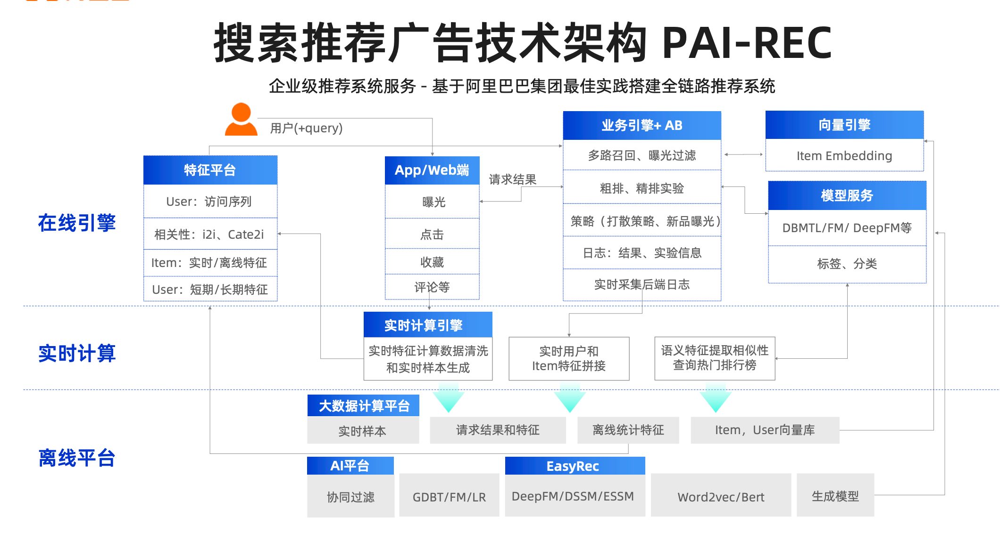

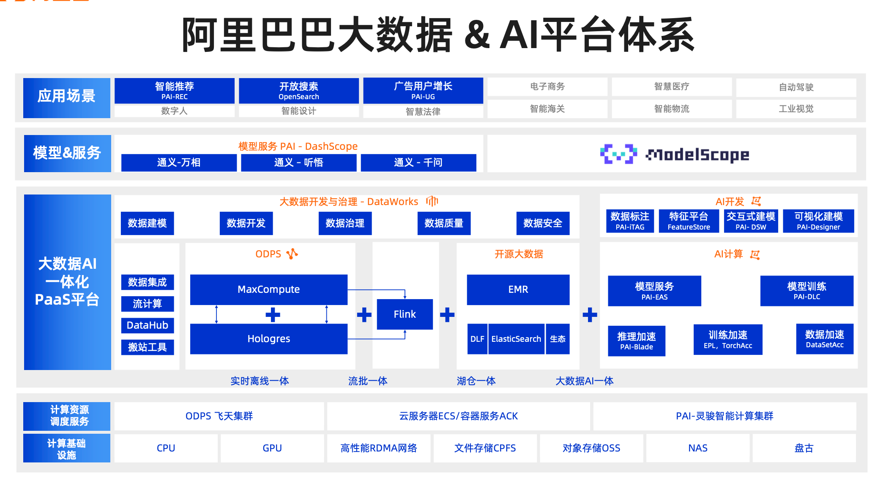

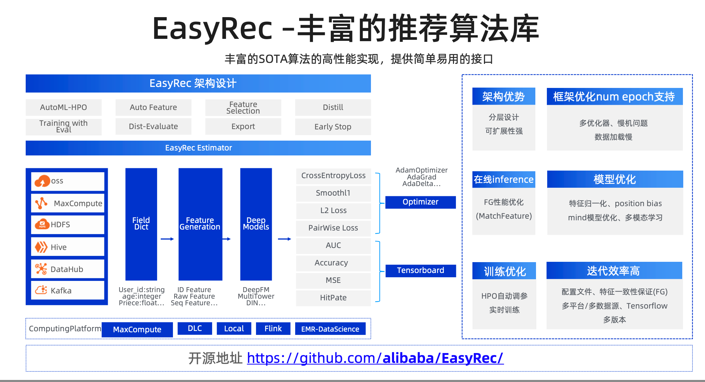


#### [LLMRec] Is ChatGPT a Good Recommender ? A Preliminary Study

> https://github.com/williamliujl/LLMRec

* Intro
  * taobao的尝试，Pretrained Model做推荐
    * M6-Rec: Generative Pretrained Language Models are Open-Ended Recommender Systems.
    * Recommendation as language processing (rlp): A unified pretrain, personalized prompt & predict paradigm (p5)
* 实验结论：
  * 「未经finetune的ChatGPT」 performs well in rating prediction but poorly in sequential and direct recommendation tasks, achieving only similar performance levels to early
    baseline methods on certain metrics.
  * 人工评估结果，Explanation Generation、Review Sumarization效果较好
* 架构：
  * different prompts are constructed based on the specific characteristics of the recommendation tasks (Section 3.1)
  * these prompts are used as inputs for ChatGPT, which generates the recommendation results according to the requirements specified in the prompts
  * the output from ChatGPT is checked and refined by the refinement module, and the refined results are returned to the user as the final recommendation results (Section 3.2).
    * 检查gpt的输出是否符合格式
    * 如果输出item和item pool不匹配，则用BERT做相似度匹配


* 五种task
  * Rating Prediction
  * Sequential Recommendation
  * Direct Recommendation
  * Explanation Generation
  * Review Sumarization
* 实验设置：
  * 10 items、3 shots、gpt-3.5-turbo
  * direct rec：99负例、1正例
  * 指标：top-k Hit Ratio (HR@k), top-k Normalized Discounted Cumulative Gain (NDCG@k)
* 其它：
  * Figure2提供了针对不同recommendation task的一些prompt
* 结果：
  * rating predict效果还行
  * sequential predict效果不好：
    * focus more on semantic similarity rather than the transition relationships between items,
    * 无法把候选都输入prompt，输出了假数据
  * direct rec:
    * gpt有bias，更容易推荐prompt中排在前面和后面的item

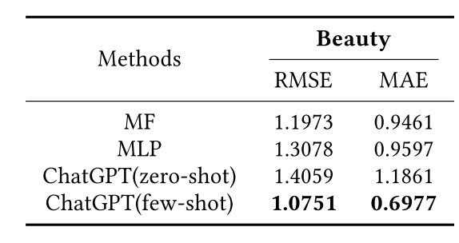


#### [Where to Go Next for Recommender Systems? ID- vs. Modality-based Recommender Models Revisited](https://arxiv.org/pdf/2303.13835)

* Intro：
  * 结论是：MoRec is already comparable to its IDRec counterpart with an expensive end-to-end training method, **even for warm item recommendation**
  * https://github.com/westlake-repl/IDvs.MoRec
  * Q(i): Equipped with strong modality encoders (ME), can
    MoRec be comparable to or even surpass IDRec in regular, especially in warm-start item recommendation scenario?
    * two-tower based DSSM [24, 50] and session-based SASRec [25])，公平的实验setting对比
  * Q(ii): If Q(i) is yes, can the recent technical advances devel-
    oped in NLP and CV fields translate into accuracy improve- ment in MoRec when using text and visual features? 
  * Q(iii): Are the representations learned by these founda-
    tion models as general as claimed? How can we effectively use item modality representations derived from an NLP or CV encoder network?

* 算法：
  * User表征：User Emb、User BHV、User Profile
  * Item表征：Item Emb、模态Emb
  * 基于DSSM和SASREC研究IDRec和MoRec
    * SASRec is a well-known se- quential recommendation model based on multi-head self-attention (MHSA) [59] which describes a user by her interacted item ID sequence.
* 结论：
  * seq2seq训练 + SASREC相比双塔，更能发挥MoRec的能力
  * E2E训练效果比two stage好很多
    * “唯一The good thing” is that by proper adaption (i.e., TS-DNN), TS-based MoRec have some potential to compete with E2E MoRec for text recommendation in the future (16.66 vs 18.23).
    * representation fea- tures are not universal enough, at least for item recommendation.

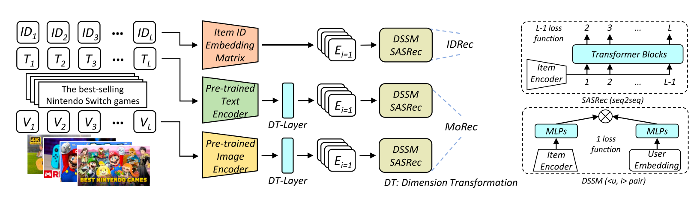

* 关于Training Cost：
  * the best MoRec (with SASRec as user encoder and Swin-B as ME) takes an astonishing more than 100x compute and training time than IDRec
  * inference time差不多
  * 优化思路：
    * 只finetune top-layer

* 其它算法相关：
  * extra pre-training：在e2e morec的基础上，比较难做效果
  * Combing ID & modality features：效果差
  * it is sometimes necessary to set different learning rate for item ME and other modules. This may be because item ME has been pre-trained on NLP and CV datasets before, and its learning stride may be different from other modules trained from scratch.

* 一篇中文科普文章：https://36kr.com/p/2805108795192961
  * LLM MLSys比传统RecSys更通用
    * 传统RecSys涉及的中间件更多、更重
    * Langchain的调用流程通用性强
  * AI Paas引领推荐系统Saas由算法主导到工程主导的转型


#### Exploring the Upper Limits of Text-Based Collaborative Filtering Using Large Language Models: Discoveries and Insights

* Intro
  * Text-based collaborative filtering (TCF)
  * We examine whether these extremely large LMs could enable a universal item representation for the recommendation task.

* 算法：
  * loss：either be a pairwise BPR [38] loss or a cross-entropy classification loss [54].

* 结论
  * Q1: How does the recommender system’s performance respond to the continuous increase in the item encoder’s size? Is the performance limits attainable at the scale of hundreds of billions? 
    * sasrec效果好于DSSM
    * the TCF model with a 175B parameter LM may not have reached its performance ceiling
  * Q2: Can super-large LMs, such as GPT-3 with 175-billion parameters, generate universal text representations?
    * even the item representation learned by an extremely large LM (e.g., GPT-3) may not result in a universal representation, at least not for the text
    * 
    * Finetune LM效果好（top two layers）
  * Q3: Can recommender models with a 175-billion parameter LM as the item encoder easily beat the simplest ID embedding based models (IDCF), especially for warm item recommenda- tion?
    * 
  * Q4: How close is the TCF paradigm to a universal recommender model?
    * while TCF models with large LMs do exhibit a certain degree of transfer learning capability, they still fall significantly short of being a universal recommender model, as we had initially envisioned
    * Table 3
    * For a universal recommender system model, not only should item representations be transferable, **but also the matching relationship between users and items needs to be transferable.** However, the matching relationship is closely related to the exposure strategy of the specific recommender system.
  * Q5: Will the classic TCF paradigm be replaced by a recent prompt engineering based rec- ommendation method that utilizes ChatGPT (called ChatGPT4Rec)?


* 其它：
  * appendix有sasrec在不同数据集的训练超参

#### 对话式搜索架构

* semantic cache优化：https://www.couchbase.com/blog/faster-llm-apps-semantic-cache-langchain-couchbase/

#### [CRS] [Google] [RecLLM] Leveraging Large Language Models in Conversational Recommender Systems

* Intro

  * 难点：a large, evolving item corpus and a lack of conversational data for training.
    * making it challenging for an LLM to memorize the corpus within its parameters.
    * Evaluation of CRSs is difficult in part due to the generative and open-ended nature of the mixed-initiative dialogue [39]
  * we propose new implementations for user preference understanding, flexible dialogue management and explainable recommendations as part of an integrated architecture powered by LLMs. 
    * For improved personalization, we describe how an LLM can consume interpretable natural language user profiles and use them to modulate session-level context.
    * To overcome conversa- tional data limitations in the absence of an existing production CRS, we propose techniques for building a controllable LLM-based user simulator to generate synthetic conversations.
  * 实验设置：In terms of the item corpus, RecLLM recommends from the cor-
    pus of all public YouTube videos
    * there are no logs of users interacting with this system to jumpstart training of the model(s)
  * 对话能力：
    * retaining context
    * handling topic shifts
    * referencing slate items.

* Dialogue Management

  * extra challenges:
    * control
      * preference elicitation—in which the system must figure out when and how to best query the user in order to extract maximal information about their preferences—is an entire subfield of CRS dialogue management [11, 74, 83, 112].
    * ambiguity
      * Short-term satisfaction and long-term coverage: Understanding how users tolerate algorithmic exploration.
    * Grounding
  * **Unified LLM Impl**: one of the distinguishing features of this architecture is that there no longer exists a hardcoded policy graph with fixed dialogue states
    * on a given system turn the LLM generates a sequence of natural language outputs that encapsulate all context tracking, intermediate reasoning, natural language generation, and API calls to the rest of the system
    * System calls Hardcode: "Response: <message>";   "Request: <query>"
    * Other outputs of the LLM can function as chain-of-reasoning steps, instructions to itself to follow, or dialogue state tracking inferences
    * 利用in-context few-shot learning or tuning让LLM掌握新状态的处理，而不是开发新组件增加状态
      * In Section 4.2 we discuss ideas for overcoming this limita- tion by tuning our dialogue manager and recommendation modules with larger amounts of synthetically generated data.
  * 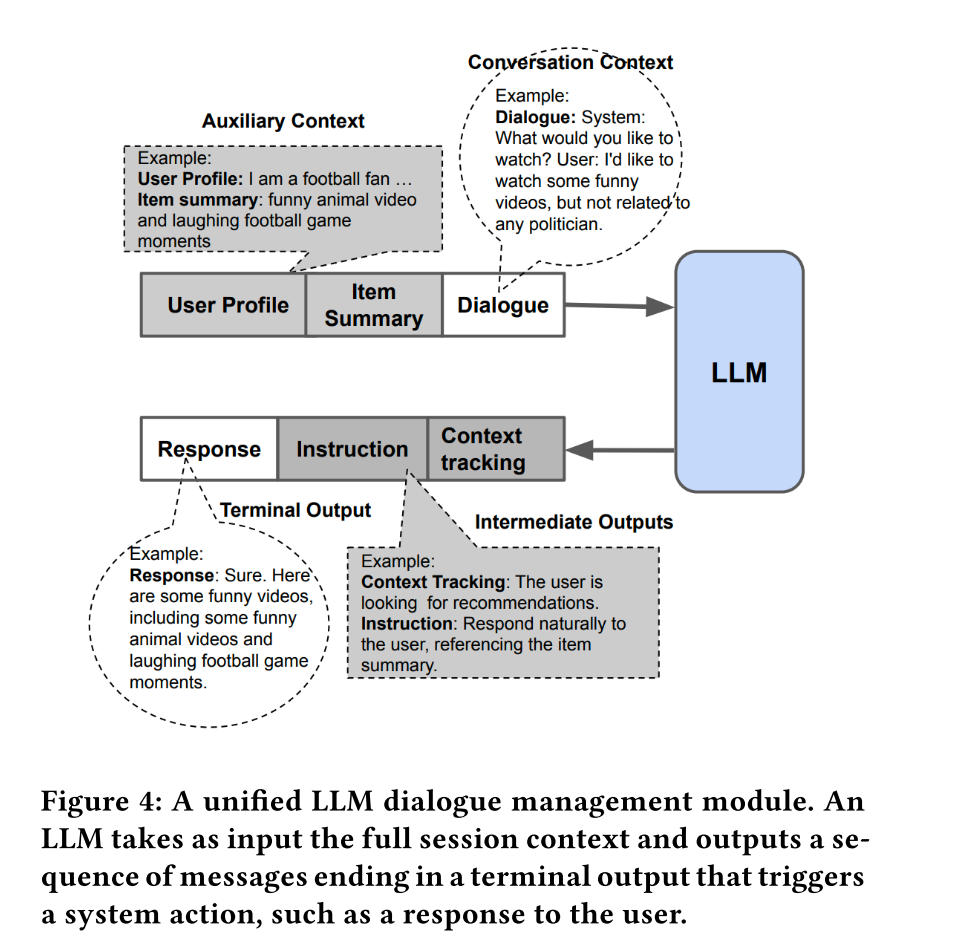

* Recommendations and Refinement - Retrieval

  * Two-stage: with the added twist that the **ranker also jointly generates natural language explanations** for why each item is being selected
  * 

  * Generalized Dual Encoder Model: 
    * using an LLM as a context encoder
      * embedding：generated by extracting and then projecting a suitable activation layer from the model.
    * 缺点：require large amounts of training data to constrain the context tower embeddings to occupy the same subspace as the item tower embedding
      * 为了用上user feature和context feature
  * Direct LLM Search
    * 缺点：记不住全量corpus
  * Concept Based Search
    * In this method the LLM outputs a list of concepts, which are then embedded and aggregated by the recom- mendation engine into a single context embedding
      * Concept Activation Vectors [43]
    * 优势：
      * 让LLM提取concept很简单
      * 无需tuning item embs（可以直接用pretrained emb）
    * 缺点：one limitation is that lists of concepts are often a coarse representation of a conversation and similar to continuous bag-of-words methods [60] are lossy with
      respect to word order and other nuances of language, which can negatively affect retrieval quality.
      * 思考：按信息价值排序
  * Search API Lookup
    * 优势同concept based search
    * 依赖search api的能力

* Rerank
  * within RecLLM we use the simple approach of bucketing the range of possible scores and having the LLM output a semantically meaningful phrase (e.g. "excellent fit") corresponding to a bucket id
  * scores the item using chain-of-thought reasoning[95]

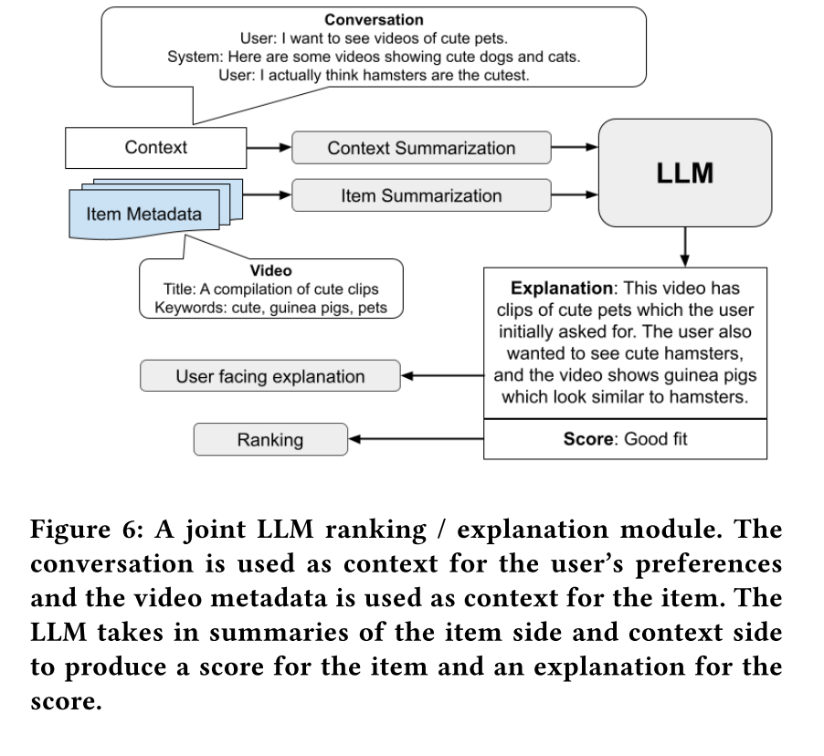

* User Profile
  * 用自然语言表示
    * 《On Natural Language User Profiles for Transparent and Scrutable Recommendation》
  * In RecLLM we build user profiles **based on a user’s repeated interaction** with the system over multiple sessions, although it would be possible to incorporate other data sources as well.
    * Memory Extraction: 用LLM
    * Triggering：用RAG方法，判断上一句和user profile的余弦相似度
    * system integration：
      * For instance, the sys- tem may know that the user is allergic to seafood, but if the user explicitly says they want to see some videos about fish recipes to pass along to a friend it’s important that the system overrides this preference from the user profile and gives the user what they are asking for
      * 交给LLM！

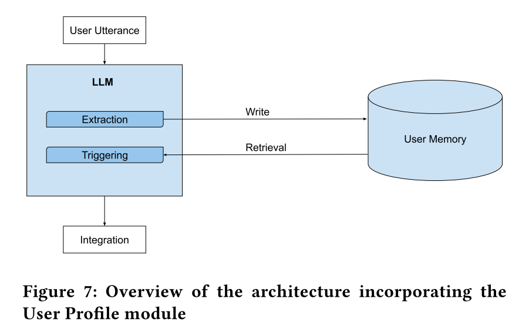

* SIMULATION AND LARGE-SCALE TUNING

  * user simulation:
    * input是之前所有对话
  * 评估realism的方法：众包、模型、ensemble分类的分布
    * diversity：defining a notion of entropy of Q with respect to the classifier ensemble

  * Controlled Simulation：we condition the user simulator on additional latent (to the CRS) variables that allow us to guide its behavior in a certain direction
    * Session-level control：user profile
    * Turn-level control：user intent
  * Generating Synthetic Training Data.
    * 

  * Tuning System Modules

    * Retrieval - tune a Generalized Dual Encoder Model
      * Regardless of whether we choose to tune only the adapter layers of the two tower model or the LLM params as well, the loss is fully differentiable and normal supervised learning with gradient descent suffices
    * Retrieval - tune Search API
      * we can reframe the setup as a contextual bandit problem [5], where the LLM is a policy, the labels are rewards signals, and the black box search algorithm is treated as the environment (see Figure 10b)
      * 

    * Dialog system
      * 方案一：给1000个例子
      * 方案二：RLHF
        * Generate a set of simulated sessions Q using a user simulator as outlined in Section 4.1
        * Have crowdsource workers evaluate our unified LLM by **rating per turn responses** within Q in terms of fluency, interestingness, groundedness etc, as well as giving session level ratings based on overall how effective the system was at helping the user explore the recommendations corpus
        * Train reward models on this rating data (likely also using LLMs with chain-of-thought reasoning).
        * Further tune the unified LLM on simulated sessions through reinforcement learning to optimize for proxy rewards generated by these reward models

* Related Work
  * In [33, 63, 100] a pretrained language model is tuned to process
    documents as part of a dual encoder retrieval model, and in [32] this is extended to full conversations as in the Generalized Dual Encoder proposal from Section 4.2. When the ground truth labels do not enable a fully differentiable loss function (such as in Search API Lookup), [65, 82] show it is still effective to tune LLMs for language generation tasks using techniques derived from reinforce- ment learning. Other works [14, 81] also use reinforcement learning to tune LLMs for open ended or task based dialogue using reward signals inferred from the conversations (e.g. through sentiment analysis or a notion of task completion).


#### [Meta] [HSTU] Actions Speak Louder than Words: Trillion-Parameter Sequential Transducers for Generative Recommendations

https://arxiv.org/pdf/2402.17152v1

> - 算法创新点：改变了特征排列（序列构造方式）将用户行为视作一种新模态、将target item做进了模型底座
> - 工程创新点：序列采样、 M-FALCON、激进的kernel fusion、casual mask（KV cache）

* Intro
  * reformulate recommendation problems as sequential transduction tasks within a generative modeling framework
  * HSTU
  * power-law of training compute
* 分析难以scale的原因
  * heterogeneous features的重要性大
  * A billion-scale dynamic vocabulary，候选多
  * 成本大：recommendation systems need to handle a few orders of magnitude more tokens per day than what language models process over 1-2 months.
    * GPT-3 was trained on a total of 300B tokens over a period of 1-2 months with thousands of GPUs

* In this work, we treat user actions as a new modality in generative modeling
  * core ranking and retrieval tasks in industrial-scale recommenders can be cast as generative modeling problems given an appropriate new feature space
  * this paradigm enables us to systematically leverage redundancies in features, training, and inference to improve efficiency
  * --> **three orders of magnitude more computationally complex** than prior state-of-the-art,

* Recommendation as Sequential Transduction Tasks: From DLRMs to GRs
  * Generative Recommenders (GRs)
    * 本质上似乎是用transformer学一个hidden embedding
  * sparse features：
    * **Target item从底层引入**
  * dense features:
    * an important observation is that the categorical features (e.g., item topics, locations) over which we perform these aggregations are already sequentialized and encoded in GRs. Hence, we can remove numerical features in GRs given a sufficiently expressive sequential transduction architecture coupled with a target-aware formulation
  * 顺序转换任务
    * 按时间merge主序列和user profile序列
  * 辅助时间序列 - 随时间缓慢变化的时间序列
    * 只在变的时候merge进去
  * 当下一个token表示与参与无关的(non-engagement related)分类特征（例如人口统计学特征）时，$$y_i$$ 未定义, 对于这些情况，我们将 $$m_i$$ 设置为 0。
  * 精排：**内容位置的预测**转换为**多任务预测**
    * casual mask: https://zhuanlan.zhihu.com/p/698447429

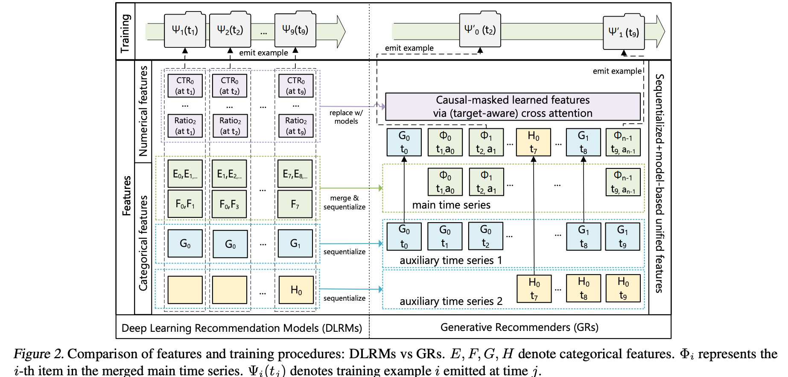

* HSTU
  * Pointwise aggregated attention
    * HSTU在Transformer中采用了一种新的点对点（pointwise）聚集注意力机制，而不是softmax注意力。这是出于两个因素的考虑。
    * 在推荐系统中，与目标相关的先前数据点的**数量**作为一个强大的特征，指示用户偏好的强度，在经过softmax归一化后很难捕捉到。这一点很关键，因为我们需要预测参与度的强度，例如在给定item上花费的时间，以及item的相对顺序，再例如预测候选人的排序以最大化AUC。
    * 虽然softmax激活函数对噪声具有鲁棒性，但它不太适合流式设置中的非平稳词汇表。
  * 通过随机长度（Stochastic Length，SL）进一步从算法上增加用户历史序列的稀疏性
    * 对用户序列做采样：
      * 一种说法：在一个user的request/session结束时，以1/n的概率采样这个user，其中n是这个user的序列长度。
      * 另一种说法：一个session采样一次


* 工程优化
  * 优化activations的内存占用
  * 单kernel
  * M-FALCON 
    * Microbatched-Fast Attention Leveraging Cacheable OperatioNs
    * to perform inference for m candidates with an input sequence size of n
    * We optionally divide the overall m candidates into ⌈m/bm⌉ microbatches of size bm to leverage encoder-level KV caching (Pope et al., 2022) either across forward passes to reduce cost, or across requests to minimize tail latency
* 实验insight
  * 生成式推荐模型与LLM一样遵循scaling law，但传统推荐模型不遵循
  * 同等参数量的情况下，在参数达到一定规模的threshold后，生成式推荐模型才能有比传统推荐模型更好的效果。精排模型需要比召回模型更大的threshold(约100x)
  * Scaling law的最大配置时：8,192 sequence length, 1,024 embedding dimension, 24 layers of HSTU。**对精排模型，约在最大配置的1/10处，GR表现超过传统模型，对应的配置约为：4000 sequence length, 1,024 embedding dimension, 6 layers**
* Question
  * 用户token数量n_i 和用户的时序行为数量（上张图中，老推荐模型的时序样本数量）是什么关系？
  * 为什么在用户session结束时生成样本，相当于做采样？

#### [美团] 用transformer做序列特征交叉

https://tech.meituan.com/2020/04/16/transformer-in-meituan.html

* 用transformer做序列特征交叉
  * 将transformer的输出结果和target item做din

#### SASREC

https://arxiv.org/abs/1808.09781


#### [马坚鑫 阿里M6团队 MLNLP2023大模型与推荐系统论坛](https://www.bilibili.com/video/BV17u4y1N7zY)

* Qwen LLM介绍

  * 7B开源模型
  * ReAct prompting
    * 技巧：处理多轮问答上下文，将ReAct prompting贴在倒数第二个回答前面，而不是最后一个问题前，有助于模型理解上下文
  * 如何训练Agent能力
    * AI aligns AI
      * Step 0: 少量高质量数据，用作SFT和in-context examples
      * Step 1: self-instruct，即通过in-context prompt生成更多样本
      * Step 2: 规则处理，人工审核，（可选）人工改正
      * Step 3: 循环 Step 1-2

* LLM在RecSys的价值 —— 从生产者、平台、消费者视角

  * 

  * LLM + RecSys 有益于内容生产者

    * 核心诉求：流量，尤其是新内容的冷启动
    * 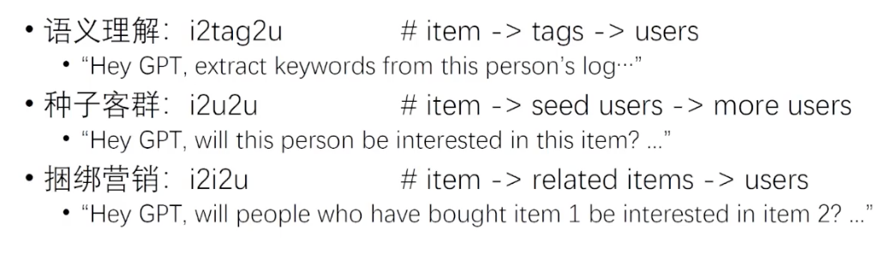

    * ali结果：小模型、少量样本、冷启动优秀

  * LLM + RecSys有益于推荐平台

    * 核心诉求：算法支持平台的运营企划
    * 时事热点：加快对事件的响应速度
      * 快中秋了 -> 推荐月饼，无需从行为学习
    * 人工干预：基于LLM的customized instruction/system prompt

  * LLM + RecSys有益于内容消费者

    * 推荐理由
    * 用户反馈
    * 导购、对话式推荐

* RecSys对LLM的挑战

  * 推理成本
    * 硬件
    * 工程：缓存；投机采样
    * 算法：大模型+小模型+规则；放弃通用；Linear Attn
      * e.g. GPT做数学题非常消耗token（CoT），但调用工具很轻量
    * UI/UX：好的产品设计能避开缺陷
      * e.g. chatGPT流式输出，巧妙地让生成长文的耗时可接受

* 模型结构尝试：

  * 延迟交互（late interaction）
    * 把浅层的cross attention干掉，高层再进行transformer的交互


* 挑战：模型更新 - RecSys每天都有新内容
  * 检索增强RAG的难点1：新知识易检索，新常识难检索
    * e.g. 有没有超过GPT-4的大模型
  * RAG的难点2：检索算法的精度、LLM的长序列支持
  * 预测：1-2年内会出现LLM的online learning


#### GPT4Rec: A Generative Framework for Personalized Recommendation and User Interests Interpretation

> * Beam Search生成多query：似乎可被LLM能力替代

* Intro
  * we present GPT4Rec, a novel and flexible generative framework inspired by search engines.
    It first generates hypothetical "search queries" given item titles in a user’s history, and then retrieves items for recommendation by searching these queries.
  * a multi-query generation technique with beam search.

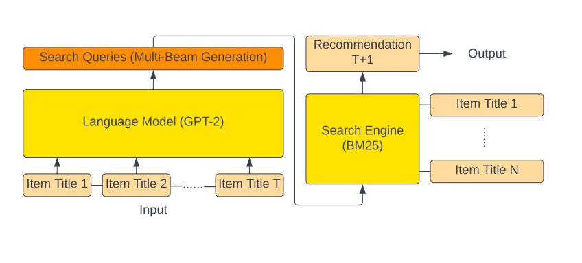

* 架构
  * GPT4Rec formats the item titles with a prompt and uses a generative language model
    to learn both item and user embeddings in the language space.
    The model then generates multiple queries that represent user’s
    interests, which will be fed to a search engine to retrieve items
    for recommendation.
  * prompt: "Previously, the customer has bought: <ITEM TITLE 1>. <ITEM TITLE 2>... In the future, the customer wants to buy"
  * beam search
  * BM25 matching score function [20], as it is one of the most widely used baseline search engines that accounts for the term frequency saturation and the document length with two corresponding parameters
  * **multi generation的算法**
    * 
* 训练细节
  * 基于对比学习的思想，T-1个推测第T个
  * 先训练好backbone，再调BM25的参数
  * 


* 结论
  * The comparison with baseline methods suggests that both item
    content information and modern language modeling are key ingredients for achieving superior performance. One the one hand, while BERT4Rec has the best performance among the baseline methods by leveraging modern language modeling techniques, it fails to fully utilize the item content information by treating items as IDs. On the other hand, ContentRec’s use of item content information with bag- of-words embeddings and mean-pooling modeling is insufficient for achieving comparable performance.
  * In particular, generating K queries and retriev- ing one item per query yields the best performance of Recall@K. This finding suggests that each query contains enough detail to re- trieve a relevant item.
* 定性分析的角度
  * diversity：兴趣模糊时，推送新类别
  * coverage：兴趣固定时，推送固定类别

#### [InteRecAgent] [CRS] Recommender AI Agent: Integrating Large Language Models for Interactive Recommendations

> https://aka.ms/recagent
>
> figure 5: plan-first 和 reflection 最有用
>
> 问题：
>
> * candidate bus怎么做的？

* Intro
  * LLMs lack the knowledge of domain-specific item catalogs and be- havioral patterns, particularly in areas that diverge from gen- eral world knowledge, such as online e-commerce
    * fail to capture fine-grained, domain-specific behavior patterns, especially in domains with massive training data
  * InteRecAgent的介绍
    * employs LLMs as the brain and recommender models as tools
    * a minimal set of essential tools required to transform LLMs into InteRecAgent
    * an efficient workflow within InteRecAgent for task execution, in- corporating key components such as memory components, dynamic demonstration-augmented task planning, and reflec- tion
  * InteRecAgent的设计思路：Interactive Recommender Agent
    * “shared candidate bus”
    * “long-term and short-term user profile”
    * “plan-first execution”(plan-then-tool) strategy
      * InteRecAgent generates all the steps of tool- calling at once and strictly follows the execution plan to ac- complish the task.
      * a reflection strategy
    * 基于GPT-4生成dataset，再finetune LLAMA2

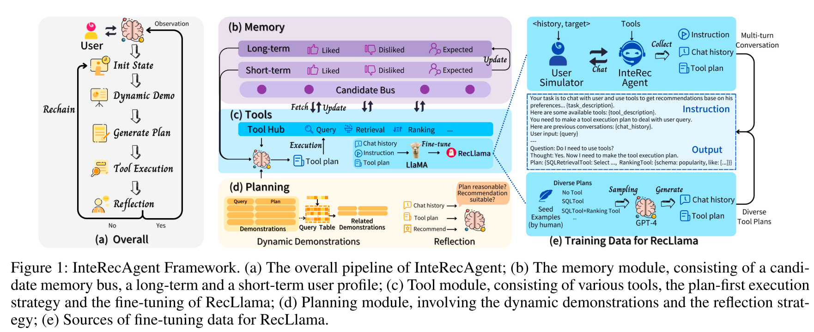

* Methodology
  * hard conditions and soft conditions.
    * Hard conditions refer to explicit demands on items, such as “I want some popular sports games” or “Recommend me some RPG games under $100”.
    * Soft conditions pertain to demands that cannot be explicitly expressed with discrete attributes and require the use of semantic matching models, like “I want some games similar to Call of Duty and Fortnite”.
  * 潜在的Hard conditions：SQL Query Tool → SQL Retrieval Tool → Ranker Tool
    * 想要比xxx贵的
  * 解决ReAct的缺陷
    * To tackle these chal- lenges, we enhance the three critical components of a typical LLM-based agent, namely memory (Section 3.2), task planning (Section 3.3 and 3.4), and tool learning abilities (Section 3.5).

* Framework细节

  * The Candidate Bus, accessible by all tools, comprises two parts: a data bus for storing can- didate items, and a tracker for recording each tool’s output.
  * Which ofthese movies do you think is most suitable for me: [Movie List]?” In this case, the LLM will call a special tool—**the memory initialization tool**—to set the user-specified items as the initial candidate items.
  * User Profile
    * 基于对话历史分析User Profile，有“like”、“dislike”、“expect”三种
      - 为了避免储存太长的对话历史，设定了“long-term"、“short-term”，当超过对话框，就用short-term interest更新long-term interest

* Plan-first Execution with Dynamic Demonstrations

  * 相比step-by-step的优点
    * step-by-step不方便对各种dynamic tool调用做in-context learning
    * 而这个方法可以写很多 ⟨query, plan⟩ pairs
  * 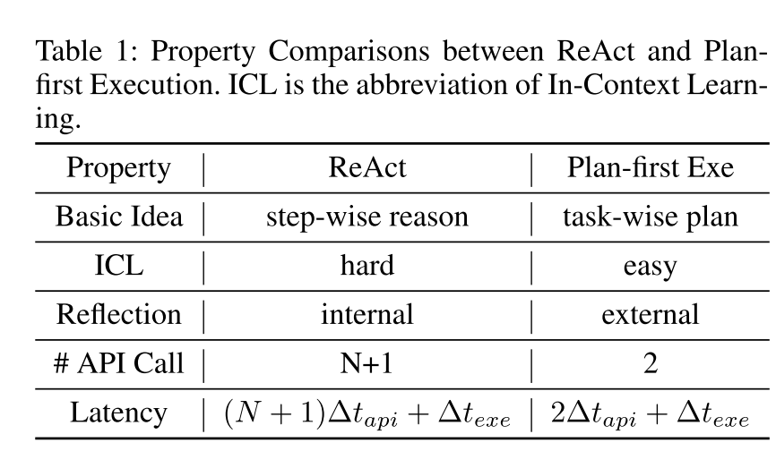

  * To address the challenge, we introduce a dynamic demonstration strategy, where only a few demonstrations that are most simi- lar to current user intent are incorporated into the prompt.
    * **example sampler**
  * LLM生成examples：
    * plan -> intent -> plan
    * The inconsistency indicates that the quality of the generated intent is not high enough, and we only retain those consistent demonstrations. 

* Reflection
  * actor-critic reflection mechanism
* 微调7B小模型
  * [instructions, tool execution plans] pairs
* Evaluation
  * 对话式：Hit@k and AT@k, representing the success of recommending the target item within k turns and the average turns (AT) re- quired for a successful recommendation
  * 比Chat-Rec效果好，可能的优势点有很多
    * SASRec做rerank
    * 更合理的plan
    * reflection
* Cases：Figure 6

* 结论：
  * figure 5: plan-first 和 reflection 最有用

* Prompts

  * User simulator

    * ```
      You are a user chatting with a recommender for {item} rec- ommendation in turn. Your history is {history}. Your tar- get items: {target}. Here is the information about target you could use: {target item info}. You must follow the rules below during chat. If the recommender recommends {target}, you should ac- cept. If the recommender recommends other items, you should refuse them and provide the information about {target}. If the recommender asks for your preference, you should provide the information about {target}. You could provide your history. Your output is only allowed to be the words from the user you act. If you think the con- versation comes to an ending, output a ⟨END⟩. You should never directly tell the target item. Only use the provided in- formation about the target. Never give many details about the target items at one time. Less than 3 conditions is better. Now lets start, you first, act as a user. Here are the previous conversation you have completed: {chat history}.
      ```

  * Task Descriptions： Figure C1
  * Tool Descriptions：Figure C2-C5
  * Reflection：C6
  * Demonstration Generation：
    * generating plan：C7
    * 两种生成intent：C8、C11
  * 大模型做推荐：C9、C10

### Other MLSys

* [介绍 Facebook 推荐系统的文章](https://engineering.fb.com/2021/01/26/ml-applications/news-feed-ranking/)
  * 多目标 MMoE、分数融合
  * 相比抖音，社交属性更强
    * unread bumping logic: 未来得及展现的信息
    * action-bumping logic: 交互过的信息有再次交互
  * serving 流程
    * integrity processes
    * pass 0: lightweight model 选出 500 条
    * pass 1: 精排 500 条
      * 《Observational data for heterogeneous treatment effects with application to recommender systems》
      * People with higher correlation gain more value from that specific event, as long as we make this method incremental and control for potential confounding variables.
    * pass 2: 混排，contextual features, such as content-type diversity rules

#### Facebook

##### Tech Stack

* 网站，移动端app -- Product
* Thrift Web API -- Product Infra
* 数据库，消息队列，流批数据系统，文件系统，音视频转码存储 -- Generic Infra
* Ads Ranking，推荐系统
* 机器学习平台（PyTorch）-- Generic Infra
* 虚拟现实，加密货币（Oculus，Libra）-- Cutting Edge, Future Product

#### 快手

* sim 基于embedding聚类

* ppnet：base网络不bp，gate独立网络独立学，不影响base embedding

* 互动特征稀疏怎么办：mmoe由时长主导，改进比较传统，主要方向是稀疏样本加权、task网络设计

* log时间戳 也是 positon embedding 离散化

#### 美团

* 美团优选 张亚峰：推荐系统结合因果推断

##### [TensorFlow 在推荐系统中的分布式训练优化实践](https://tech.meituan.com/2021/12/09/meituan-tensorflow-in-recommender-systems.html)

* tf原生架构的挑战
  * 所有参数都是用 Variable 表达， 对于百亿以上的稀疏参数开辟了大量的内存，造成了资源的浪费；
  * 只支持百级别 Worker 的分布式扩展，对上千 Worker 的扩展性较差；
  * 由于不支持大规模稀疏参数动态添加、删除，增量导出，导致无法支持 Online Learning；
  * 大规模集群运行时，会遇到慢机和宕机；由于框架层不能处理，会导致任务运行异常
* 核心问题：无法一直横向扩PS
  * 增加扇出带来的链路延迟损失超过了加PS算力并发的收益
  * 优化的核心难点在于：**如何在有限的PS实例下，进行分布式计算的优化**。
* 自研HashTable
  * HashTable的大小可以在训练过程中自动伸缩，避免了开辟冗余的存储空间，同时用户无需关注申请大小，从而降低了使用成本。
  * 针对HashTable方案实施了一系列定制优化，训练速度相比Variable有了很大的提高，可以进行千亿规模模型的训练，扩展性较好。
  * 得益于稀疏参数的动态伸缩，我们在此基础上支持了Online Learning。
  * API设计上保持与社区版本兼容，在使用上几乎与原生Variable一致，对接成本极低。
  * 优化
    * 稀疏域参数聚合：emb、momentum、v、cnt共用一张表
    * 在千亿规模下TBBConcurrentHashTable比原生MutableDenseHashTable训练速度上快了3倍
    * HashTable BucketPool
* 分布式负载均衡优化
  * 把所有稀疏参数和大的稠密参数自动、均匀的切分到每个PS上
  * 原生Adam优化器，实现导致PS负载不均衡
* 通信优化（RDMA）
  * https://github.com/tensorflow/networking/pull/38/files
  * Memory Registration优化
    * 在RDMA传输数据时，需要提前开辟内存空间并将其注册到网卡设备上（Memory Registration过程，下称MR），使得这片空间可以被网卡直接操作
    * 10MB ~ 2ms
    * 问题：社区版Tensorflow RDMA实现，Tensor创建依旧沿用了统一的BFC Allocator，并将所有创建的Tensor都注册到MR上
    * 优化：仅对这些跨节点通信的Tensor进行MR注册
  * RDMA静态分配器
    * req间复用MR
    * shape和tensor打包协议，避免了原生实现中因Tensor的Shape变化而产生的多次协商过程
    * Allocation Analysis模块
      * 在训练开始的一段时间，我们会对分配的历史数据进行分析，以得到一个实际预开辟MR大小以及各个Tensor的预留空间大小。然后我们会暂停训练的进程，启动Allocator的构造过程，包括MR的创建以及通信双端的信息同步。利用相关信息构造MR Info Map，这个Map的Key是传输Tensor的唯一标记（ParsedKey，计算图切图时确定），Info结构体中包含了本地地址指针、offset大小、ibv_send_wr相关信息等。然后恢复训练。
  * Multi RequestBuffer与CQ负载均衡
  * Send-Driven & Rendezvous-Bypass


* Embedding Pipeling
  * 这个设计有点厉害。。。完全隐藏embedding fetch的相关延时
  * 前提是staleness损失可控


* Unique&DynamicPartition算子融合
  * unique算子的缺点：内部使用的内存分配策略较为低效。使用了两倍输入参数（Embedding ID）的大小进行内存分配，但由于输入参数较大，而且重复率高，导致HashTable创建过大且非常稀疏。几乎每次插入都会产生一次minor_page_fault，导致HashTable性能下降
  * Unique和Dynamic Partition算子存在冗余数据遍历


##### [TensorFlow在美团外卖推荐场景的GPU训练优化实践](https://tech.meituan.com/2022/03/24/tensorflow-gpu-training-optimization-practice-in-meituan-waimai-recommendation-scenarios.html)

* **GPU服务器特点**
  - **GPU卡算力很强，但显存仍有限**：如果要充分发挥GPU算力，需要把GPU计算用到的各种数据提前放置到显存中。而从2016年~2020年，NVIDIA Tesla GPU卡[5]计算能力提升了10倍以上，但显存大小只提升了3倍左右。
  - **其它维度资源并不是很充足**：相比GPU算力的提升速度，单机的CPU、网络带宽的增长速度较慢，如果遇到这两类资源负荷较重的模型，将无法充分发挥GPU的能力，GPU服务器相比CPU服务器的性价比不会太高。

* 挑战
  * **数据流系统**：如何利用好多网卡、多路CPU，实现高性能的数据流水线，让数据的供给可以跟上GPU的消费速度。
  * **混合参数计算**：对于大规模稀疏参数，GPU显存直接装不下的情况，如何充分利用GPU高算力、GPU卡间的高带宽，实现一套大规模稀疏参数的计算，同时还需要兼顾稠密参数的计算。
* 系统的设计与实现
  * setting：单机多卡、支持100G模型
  * 减少参数的思路
    * **去交叉特征**：交叉特征由单特征间做笛卡尔积产生，这会生成巨大的特征ID取值空间和对应Embedding参数表。深度预估模型发展至今，已经有大量的方法通过模型结构来建模单特征间的交互，避免了交叉特征造成的Embedding规模膨胀，如FM系列[16]、AutoInt[17]、CAN[18]等。
    * **精简特征**：特别是基于NAS的思路，以较低的训练成本实现深度神经网络自适应特征选择，如Dropout Rank[19]和FSCD[20]等工作。
    * **压缩Embedding向量数**：对特征取值进行复合ID编码和Embedding映射，以远小于特征取值空间的Embedding向量数，来实现丰富的特征Embedding表达，如Compositional Embedding[14]、Binary Code Hash Embedding[21]等工作。
    * **压缩Embedding向量维度**：一个特征Embedding向量的维度决定了其表征信息的上限，但是并非所有的特征取值都有那么大的信息量，需要Embedding表达。因此，可以每一个特征值自适应的学习精简Embedding维度，从而压缩参数总量，如AutoDim[22]和AMTL[23]等工作。
    * **量化压缩**：使用半精度甚至int8等更激进的方式，对模型参数做量化压缩，如DPQ[24]和MGQE[25]。


* 系统实现
  * tf + horovod原生
  * 数据、计算、通信解耦
* embedding层：
  * 大的fc用alltoallv
    * 前向时两次卡间alltoall
  * 梯度：小的fc AllGather，dense allreduce
    * 小=稠密="dense sparse"，dense sparse emb table = tf原生variable
  * 在cuCollections的GPU HashTable基础上实现了特殊接口（find_or_insert），对大规模读写性能进行了优化，然后封装到了TensorFlow中，并在其上实现了低频过滤的功能，能力上对齐CPU版本的稀疏参数存储模块
* 数据层优化
  * 样本拉取优化：per numa、多网卡、多卡独立shared memory
  * 特征解析优化：SIMD优化protobuf::CodedInputStream::ReadVarint64Fallback
  * MemcpyH2D流水线：
    * PipelineDataset
    * CPU内存需要使用Pinned Memory
  * 硬件调优
    * 在网络传输方面，为了减少网络协议栈处理开销，提高数据拷贝的效率，我们通过优化网卡配置，开启LRO（Large-Receive-Offload）、TC Flower的硬件卸载、Tx-Nocache-Copy等特性，最终网络带宽提升了17%。
    * 在CPU性能优化方面，经过性能profiling分析，发现内存延迟和带宽是瓶颈。于是我们尝试了3种NPS配置，综合业务场景和NUMA特性，选择了NPS2。此外，结合其他BIOS配置（例如APBDIS，P-state等），可以将内存延迟降低8%，内存带宽提升6%。
* 计算层优化
  * Embedding Pipeline
    * 在GPU场景中，EG、MG是在同一个GPU Stream上执行CUDA Kernel的，我们尝试过EG、MG分别在独立的GPU Stream上执行，性能会变差，深层原因与CUDA底层实现有关，这个问题本身还在等待解决
  * 算子优化及XLA
    * 以Unique算子为例，原生TensorFlow的Unique算子要求输出元素的顺序与输入元素的顺序一致，而在实际场景中，我们并不需要这个限制，我们修改了Unique算子的GPU实现，减少了因输出有序导致的额外执行的GPU Kernel
    * 缓解XLA对动态shape的支持问题
      * **局部优化**：对于我们手动引入的动态shape算子（如Unique），我们进行了子图标记，不执行XLA编译，XLA只优化可以稳定加速的子图。
      * **OOM兜底**：XLA会根据算子的type、input type、shape等信息，缓存编译中间结果，避免重复编译。然而由于稀疏场景以及GPU架构实现的特殊性，天然存在Unique、DynamicPartition等Output shape是动态的算子，这就导致这些算子以及连接在这些算子之后的算子，在执行XLA编译时无法命中XLA缓存而重新编译，新的缓存越来越多，而旧的缓存不会被释放，最终导致CPU内存OOM。我们在XLA内部实现了LRUCache，主动淘汰掉旧的XLA缓存，避免OOM的问题。
      * **Const Memcpy消除**：XLA在使用TF_HLO重写TensorFlow算子时，对一些编译期已固定的数据会打上Const标记，然而这些Const算子的Output只能定义在Host端，为了将Host端的Output送给Device端需要再加一次MemcpyH2D，这就占用了TensorFlow原有的H2D Stream，影响样本数据提前拷贝到GPU端。由于XLA的Const Output在编译期已经固化，因此没有必要每一步都做一次MemcpyH2D，我们将Device端的Output缓存下来，后续使用该Output时，直接从缓存中读取，避免多余的MemcpyH2D。
* 通信层优化
  * 发现卡间通信（AllToAll、AllReduce、AllGather等）协商的时间远远高于数据传输的时间
  * 怀疑不同卡上算子调度的不一致性，导致了各张卡发起通信的时刻不同，并最终导致了通信协商时间过长
  * 解决方案
    * 合并相同dim size的hashtable，减少卡间通信次数
    * Variable Fusion
      * 需要注意的是，TensorFlow的Variable分为两种，一种是每个Step全部参数值都参与训练的Dense Variable，如MLP的Weight；另一种是专门用于embedding_lookup的Variable，每个Step只有部分值参与训练，我们称之为Sparse Variable。对于前者，做Variable合并不会影响到算法效果。而对于后者，它反向梯度是IndexedSlices对象，卡间同步默认走的是AllGather通信，如果业务模型中对于Sparse Variables的优化采用的是Lazy优化器，即每个Step只优化更新Variable中的某些行，此时对Sparse Variables做合并，会导致其反向梯度从IndexedSlices对象转为Tensor对象，卡间同步变成AllReduce过程，就可能会影响到算法效果。对于这种情况，我们提供了一个开关，由业务去控制是否合并Sparse Variables。经过我们的实测，在某推荐模型上合并Sparse Variables会提高5～10%的训练性能，而对实际业务效果的影响在一个千分点以内。
* 训练效果
  * 大Batch下训练超参调优的问题[26,27]：在保证Epoch不变的前提下，扩大Batch Size会导致参数有效更新次数减少，可能导致模型训练的效果变差
  * Linear Scaling Rule[28]的原则指导调整学习率
  * 使用学习率Warmup等更复杂的训练策略[29]


#### 微软新闻

* msnews.github.io
  * MIND acl2020

* bert noisytune 大模型finetune
* responsible的目标
  * [cprs: objective beyond click](https://www.ijcai.org/proceedings/2020/0418.pdf)
* fairness：fairrec 学习一个serving用的无偏网络，比如让模型估不出来性别


#### DeepRec

[Github](https://github.com/alibaba/DeepRec)

[Doc入口](https://deeprec.readthedocs.io/zh/latest/)

* 稀疏功能
  * 自适应动态弹性特征
  * 特征淘汰及准入
  * 基于特征频率的动态弹性维度（FAE）

* 异步训练框架 StarServer
  * 通信协议、zerocopy
  * 基于图拓扑序的图Fusion
  * Run To Completion and Lockless Graph Execution

* 同步训练框架 hybridbackend
  * embedding层：大的fc用alltoallv，小的fc用allreduce
    * 小=稠密="dense sparse"，dense emb table = tf原生variable
    * 思路参考meituan https://discuss.tf.wiki/t/topic/2341

* prmalloc
  * 池子共享，不再用 TLS cache，因为op可能是不同线程运行

* 业务相关优化
  * user特征优化

* 图优化-smartstage
* embedding store
  * embedding多级混合存储：cpu cache dram pmem ssd
    * 多级混合存储能支持单机serving，主要从ssd读

#### Others

* [当我们在设计推荐场景训练系统](https://zhuanlan.zhihu.com/p/376974245) 讨论了推荐系统标准化的思路
  * 配置驱动与代码驱动，期望尽量结合上述两种方案的优点，即：
    * 工作流整体还是通过配置文件驱动，系统会将解析好的配置文件，根据不同的处理模块，将对应部分的配置传递给过去
    * 对于大部分的任务，基本逻辑都是通用的，如下图中的黄色模块，对于这一部分提供通用的实现。当然，由于代码是内部开源的，即便有少量特殊需求也可以自行开发提交
    * 对于自由度较高的模块，主要指的是上面说的“模型构建”部分，则系统提供抽象父类，包含基础的功能。自定义模型时，通过继承父类，并重写“前向传播”等方法即可
  * 训练环境docker化


### MLSys Courses

[cs294-2022](https://ucbrise.github.io/cs294-ai-sys-sp22/)

[cs294-2019](https://ucbrise.github.io/cs294-ai-sys-fa19/)

#### CSE 599W: Systems for ML

http://dlsys.cs.washington.edu/schedule

##### Lecture 1: Introduction to Deep Learning

* Ingredients in DL
  * 模型、目标函数、技巧、数据
  * 技巧包括Regularization, initialization (coupled with modeling)
    * Dropout: Overfitting prevention
    * Xavier Initialization
* 模型结构
  * Fully Connected Layer
  * Convolution = Spatial Locality + Sharing
    * Convolution with Multiple Channels
  * Pooling Layer: Can be replaced by strided convolution
  * LeNet, AlexNet
  * Why ReLU?
    * Cheap to compute
    * It is roughly linear..
  * Dropout
    * Randomly zero out neurons with probability 0.5
    * During prediction, use expectation value (keep all neurons but scale output by 0.5)
  * GoogleNet: Multiple Pathways, Less Parameters
    * Inception Module
    * [1*1 卷积减小channel维数，用于channel融合，减少计算量](https://stats.stackexchange.com/questions/194142/what-does-1x1-convolution-mean-in-a-neural-network)
* Vanishing and Explosive Value Problem
  * In ConvNets, the weight are not tied, but their magnitude matters; Deep nets training was initialization sensitive
  * Batch Normalization: Stabilize the Magnitude
    * Subtract mean -> Divide by standard deviation -> Output is invariant to input scale! -> Scale input by a constant –> Output of BN remains the same
    * Impact: Easy to tune learning rate, less sensitive initialization
    * The Scale Normalization (Assumes zero mean)
  * ResNet: F(x) + x
* [lab1_mnist.ipynb](http://dlsys.cs.washington.edu/pdf/lab1_mnist.ipynb): MXNet入门，包括Gluon API、写模型、训练推理api

##### Lecture 3: Overview of Deep Learning System


* softmax in numpy
  * softmax内蕴了logistic regression
  * 手算梯度 + SGD
    * 梯度推导见【Machine-Learning笔记】
* softmax in tinyflow
* The Declarative Language: Computation Graph
  * Nodes represents the computation (operation)
  * Edge represents the data dependency between operations


* Computation Graph Optimization
  * Deadcode elimination
  * Memory planning and optimization
  * Parallel Scheduling
    * Code need to run parallel on multiple devices and worker threads
    * Detect and schedule parallelizable patterns
  * GPU Acceleration
* Hardware backend
  * Each Hardware backend requires a software stack
  * New Trend: Compiler based Approach

##### Lecture 4: Backpropagation and Automatic Differentiation

* Symbolic Differentiation
  * For complicated functions, the resultant expression can be exponentially large
  * Wasteful to keep around intermediate symbolic expressions if we only need a numeric value of the gradient in the end
  * Prone to error
* Numerical Differentiation
  * Bad: rounding error, and slow to compute
  * A powerful tool to check the correctness of implementation, usually use h = 1e-6
* Backpropogation
  * Easy to understand and implement
  * Bad for memory use and schedule optimization
    * You always need to keep intermediate data in the memory during the forward pass in case it will be used in the backpropagation.
    * Lack of flexibility, e.g., compute the gradient of gradient.
* Automatic Differentiation (autodiff)
  * Generate gradient computation to **entire** computation graph，计算过程全图化
  * Better for system optimization
  * 具体算法见【code-reading笔记】-- Tinyflow -- autodiff


##### Paper: 《Automatic differentiation in PyTorch》

* Features:

  * Dynamic, define-by-run execution; Immediate, eager execution
  * In-place operations; No tape; Core logic in C++
    * PyTorch (and Chainer) eschew this tape; instead, every intermediate result records only the subset of the computation graph that was relevant to their computation.

* ```python
  torch.autograd.grad(f(x, y, z), (x, y))
  
  from torch.autograd import Variable
  x, prev_h = Variable(torch.randn(1, 10)), Variable(torch.randn(1, 20))
  W_h, W_x = Variable(torch.randn(20, 20)), Variable(torch.randn(20, 10))
  i2h = torch.matmul(W_x, x.t())
  h2h = torch.matmul(W_h, prev_h.t())
  (i2h + h2h).tanh().sum().backward()
  ```

* API

  * “requires grad” and “volatile” flags
  * hooks:`x.register_hook(lambda grad: print(grad))`
  * Extensions

* Implementation

  * Variable

    * a wrapper around a Tensor
    * holds a reference to a graph of Function objects
    * mutated when an in-place operation occurs

  * Graph: immutable, purely functional representation of the derivative of computed function

  * Function: a closure that has all context necessary to compute vector-Jacobian products

  * 内存管理：PyTorch’s Variable and Function must be designed to work well in a reference counted regime.

    * a Function records pointers to the Function which consumes its result

    * Another challenge is avoiding reference cycles. A naıve implementation of automatic differentiation can easily introduce such cycles (e.g. when a differentiable function would like to save a reference to its output). PyTorch breaks them by recording not a full-fledged variable, but instead a [“saved variable”](https://github.com/pytorch/pytorch/blob/master/torch/csrc/autograd/saved_variable.cpp), which omits a pointer to the Function in such cases.

      * ```c++
        // We want grad_fn here to provide the most helpful debug message to the user
        // if versions don't match
        
        auto grad_fn = is_inplace_on_view_ ? weak_grad_fn_.lock()
          : !hooks_ ? saved_original_ ? data_.grad_fn() : nullptr
            : grad_fn_;
        ```

    * Supporting in-place operations：不兼容Invalidation和Aliasing这两种情况

      * Invalidation: Every underlying storage of a variable is associated with a version counter, which tracks how many in-place operations have been applied to the storage.
      * Aliasing: the in-place addition to x also causes some elements of y to be updated; thus, y’s computational history has changed as well.

##### Paper: 《Automatic differentiation in ML: Where we are and where we should be going》

* Introduction
  * 现状：operator overloading (OO) and source transformation (ST) used for AD
  * drawing insights from functional languages, graph-based IRs, and AD
* Background:
  * Forward mode has constant memory requirements and its runtime complexity scales with the number of inputs. Reverse mode’s runtime complexity scales with the number of outputs, and its memory complexity grows with the number of intermediate variables. In principle, forward and reverse mode can be mixed, but finding the optimal way of doing so is NP-complete [27].
  * Since the number of inputs is significantly larger than the number of outputs, reverse mode AD is to be preferred
  * Automatic differentiation: Two methods
    * Operator overloading (OO): record a tape
      * downside: Having an embedded interpreter inside of the host language can complicate debugging and performance analysis.
      * PyTorch, Autograd, and Chainer
    * source transformation (ST)
      * explicitly construct a program with a reversed control flow, which means that it needs transformation rules for function calls and control flow statements such as loops and conditionals 偏静态
      * still ensure that intermediate variables from the forward pass are accessible by the adjoint
        * Tape-based
          * The tape used in ST stores only the intermediate variables, whereas the tape in OO is a program trace that stores the executed primitives as well.
        * Closure-based
          * no AD-specific compiler passes are needed: a functional language compiler will recognize the non-local use of the intermediate variables by the fact that they are free variables in the generated closure or continuation.
  * Dataflow programming
    * Theano, TensorFlow, and MXNet
    * follow the dataflow program- ming paradigm [21] and use computation graphs as their **intermediate representation**
    * These graph representations do not have scoping or recursive function calls, which means that AD is much easier to implement with ST
    * 设计取舍
      * Function Calls: TensorFlow and Theano implement a type of subroutine through their Defun and OpFromGraph constructs, but these must be explicitly constructed by the user and don’t support recursion.
      * Scoping: TensorFlow has a concept it refers to as ‘scoping’, but these scopes are not lexical and can be reentered at any time, so the lifetime of a value is not affected by its scope.
  * Programming languages and compilers
    * The dataflow graph is an intermediate representation which is optimized using a series of compiler passes. The resulting program is compiled (e.g., XLA) and/or interpreted (e.g., the TensorFlow/Theano runtimes). Similarly, PyTorch has started optimizing its traced Python programs using just-in-time (JIT) compiler approaches.
    * Python because of its flexibility with the need for high performance and speed is an open question. ML frameworks have focused on metaprogramming and using C extensions, but other approaches are possible. For example, Cython [6] is a superset
    * performance and speed is an open question.
* Graph-based direct intermediate representation
  * graph based, purely functional, closure representation, strongly typed
  * IR specification
    * Concretely, our representation represents a function as a graph object with a list of parameter nodes and a single return node (multiple return values are supported through tuples). A node represents a function application and has an ordered list of incoming edges. The first incoming edge is a pointer to the function to apply, and the rest point to the arguments. Constants are represented as nodes with no incoming edges and a value field. Links between nodes are bidirectional, so that graphs can be traversed in either direction. Each non-constant node belongs to a single graph.
  * Source transformation
    * In order to ensure that our transformation can be applied again on the transformed program (so we can use reverse-over-reverse to compute second-order derivatives), it must be able to handle functions with free variables.
* Myia
  * Myia is a functioning proof of concept of a toolchain that uses the proposed graph representation
  * Python front end
    * Myia uses Python’s inspect module to parse the function into an abstract syntax tree (AST), and converts that AST into the graph representation we previously described
  * Type inference
  * Optimization

##### Lecture 5: GPU Programming

* 内容融入【nvidia笔记】

##### Lecture 6: Optimize for Hardware Backends

* Where are we: gap between computation graph and hardware
  * Goal: High Level Program to Bare Metal Code
  * What are the tricks you can do to make your program run faster on CUDA/x86/any backend?
* Cache Line Aware Tiling
  * Output-tiled
  * cache line aware
  * 收益来源于memory reuse，减少load dram time cost

```c++
dram float A[n/b1][b1][n];
dram float B[n/b2][b2][n];
dram float C[n/b1][n/b2][b1][b2];
for (int i = 0; i < n/b1; ++i) {
  l1cache float a[b1][n] = A[i];
  for (int j = 0; j < n/b2; ++j) {
    l1cache b[b2][n] = B[j];
		for (int x = 0; x < b/v1; ++x) {
     for (int y = 0; x < b/v1; ++y) {
       register float c[v1][v2] = 0;
       for (int k = 0; k < n; ++k) {
         register float ar[v1] = a[x][k];
         register float br[v1] = b[y][k];
         C += dot(ar, br)
       }
 	    }
    }
  }
}
```

* operator fusion
* Optimizations = Too Many Variant of Operators
  * Different tiling patterns
  * Different fuse patterns
  * Different data layout
  * Different hardware backends

##### Lecture 7: Automatic Code Generation --- TVM Stack

https://tvm.apache.org/

https://github.com/apache/tvm

* Computational Graph as IR
  * Approach taken by: TensorFlow XLA, Intel NGraph, Nvidia TensorRT
  * XLA: Tensorflow Compiler
  * TensorRT: Rule based Fusion
    * relu+bias+conv --> CBR
    * Simple Graph-based Element-wise Kernel Generator: Fusion Pass + CodeGen Pass


* The Remaining Gap of "Computational Graph as IR"
  * need to build and optimize operators for each hardware, variant of layout, precision, threading pattern …
  * hardware backend越多，手工优化op的成本越高
* Emerging Tools Using Tensor Expression Language
  * Halide: Image processing language
  * Loopy: python based kernel generator
  * TACO: sparse tensor code generator
  * Tensor Comprehension

* TVM
  * Tensor Level Optimizations (Tensor Expression Language)
    * `C = t.compute((m, n), lambda i, j: t.sum(A[i, k] * B[j, k], axis=k))`
  * Tensor Index Expression

```python
# tvm
# Compute C = dot(A, B.T)
import tvm
m, n, h = tvm.var('m'), tvm.var('n'), tvm.var('h')
A = tvm.placeholder((m, h), name='A')
B = tvm.placeholder((n, h), name=‘B')

k = tvm.reduce_axis((0, h), name=‘k')
C = tvm.compute((m, n), lambda i, j: tvm.sum(A[i, k] * B[j, k], axis=k))
                    
# Convolution
out = tvm.compute((c, h, w), lambda i, x, y: tvm.sum(data[kc,x+kx,y+ky] * w[i,kx,ky], [kx,ky,kc]))
                    
# ReLU
out = tvm.compute(shape, lambda *i: tvm.max(0, out(*i))
```

* Schedule: Tensor Expression to Code
  * 核心思路：Separation of Compute and Schedule, introduced by Halide
* Key Challenge: Good Space of Schedule
  * Should contain any knobs that produces a logically equivalent program that runs well on backend models
  * Must contain the common manual optimization patterns
  * Need to actively evolve to incorporate new techniques

```python
# Example Schedule Transformation
C = tvm.compute((n,), lambda i: A[i] + B[i])
s = tvm.create_schedule(C.op)
xo, xi = s[C].split(s[C].axis[0], factor=32)  # 
s[C].recorder(xi, xo)
s[C].bind(xo, tvm.thread_axis(“blockIdx.x”)
s[C].bind(xi, tvm.thread_axis(“threadIdx.x”)
```

* TVM Schedule Primitives
  * Loop Transformations, Thread Bindings, Cache Locality, Thread Cooperation, Tensorization, Latency Hiding
  * Schedule Space Exploration --> AutoTuner tune多个kernel

```python
# Extending Compute Primitives
# Symbolic Loop: Y = cumsum(X)
import tvm
m = tvm.var("m")
n = tvm.var("n")
X = tvm.placeholder((m, n), name="X")
s_state = tvm.placeholder((m, n))
s_init = tvm.compute((1, n), lambda _, i: X[0, i])
s_update = tvm.compute((m, n), lambda t, i: s_state[t-1, i] + X[t, i])
Y = tvm.scan(s_init, s_update, s_state, inputs=[X])
```

* Hardware designer: declare tensor instruction interface

```python
w, x = t.placeholder((8, 8)), t.placeholder((8, 8))
k = t.reduce_axis((0, 8))
y = t.compute((8, 8), lambda i, j: t.sum(w[i, k] * x[j, k], axis=k))
def gemm_intrin_lower(inputs, outputs):
 ww_ptr = inputs[0].access_ptr(“r")
 xx_ptr = inputs[1].access_ptr("r")
 zz_ptr = outputs[0].access_ptr("w")
 compute = t.hardware_intrin("gemm8x8", ww_ptr, xx_ptr, zz_ptr)
 reset = t.hardware_intrin("fill_zero", zz_ptr)
 update = t.hardware_intrin("fuse_gemm8x8_add", ww_ptr, xx_ptr, zz_ptr)
 return compute, reset, update

gemm8x8 = t.decl_tensor_intrin(y.op, gemm_intrin_lower)
```

* High Level Compilation Frontend

```python
import tvm
import nnvm.frontend
import nnvm.compiler
graph, params = nnvm.frontend.from_keras(keras_resnet50)
target = tvm.target.cuda()
graph, lib, params = nnvm.compiler.build(graph, target) 

module = runtime.create(graph, lib, tvm.gpu(0))
module.set_input(**params)
module.run(data=data_array)
output = tvm.nd.empty(out_shape, ctx=tvm.gpu(0))
module.get_output(0, output)
```


##### Paper: 《TVM: An Automated End-to-End Optimizing Compiler for Deep Learning》

* Abstract/Conclusion
  * TVM solves optimization chal-lenges specific to deep learning, such as high-level operator fusion, mapping to arbitrary hardware primitives, and memory latency hiding.
* Introduction
  * TVM, a compiler that takes a high-level specification of a deep learning program from existing frameworks and generates low-level optimized code for a diverse set of hardware back-ends.
  * Leveraging Specific Hardware Features and Abstractions.
  * Large Search Space for Optimization
    * tensor expression language
    * automated program optimization framework
      * autotune与手工优化，后者解决通用问题，前者解决长尾问题并优化后者参数
    * graph rewriter


* Optimizing Computational Graphs
  * 和IR的区别：the intermediate data items are large, multi-dimensional tensors.
  * Operator Fusion：给op分了四类，不同类型能以不同形式fusion
  * Data Layout Transformation.
  * constant-folding
  * static memory planning pass
* 核心思想：分离compute和schedule，通过各种调度变换搜索出最高效的实现
* Generating Tensor Operations
  * Tensor Expression and Schedule Space
    * Internally, TVM uses a data structure to keep track of the loop structure and other information as we apply schedule transformations. This information can then help generate low-level code for a given final schedule.
  * Nested Parallelism with Cooperation
    * in addition to being useful to GPUs, memory scopes let us tag special memory
      buffers and create special lowering rules when targeting specialized DL accelerators.
  * Tensorization
    * 对普通张量程序（一般就是循环嵌套程序），调用硬件加速器提供的特定指令函数（ intrinsic）进行加速。比如 GPU 里的 Tensor Core 提供的一些 intrinsic 可以直接处理特定大小矩阵的运算
    * We make tensorization extensible by separating the target hardware intrinsic from the schedule with a mechanism for tensor-intrinsic declaration.
  * Explicit Memory Latency Hiding


* Automating Optimization
  * Schedule Space Specification
  * ML-Based Cost Model
    * GDBT, 特征包括 the memory access count and reuse ratio of each memory buffer at each loop level, as well as a one-hot encoding of loop annotations such as “vectorize”, “un-roll”, and “parallel.”
  * Schedule Exploration
    * a parallel simulated annealing algorithm
* Evaluation
* Related Work
  * 重申graph-based approach的缺点：serving多种hardware backends耗费人力
  * More importantly, we provide an end-to-end stack that can take descriptions directly from DL frameworks and jointly optimize together with the graph-level stack.
* 更多tvm后续论文：
  * [Ansor : Generating High-Performance Tensor Programs for Deep Learning](https://arxiv.org/abs/2006.06762)
  * [NIMBLE: EFFICIENTLY COMPILING DYNAMIC NEURAL NETWORKS FOR MODEL INFERENCE](https://arxiv.org/pdf/2006.03031.pdf)


##### Lecture 8: Hardware Specialization in Deep Learning

* Hardware Specialization
  * • Idea: tailor your chip architecture to the characteristics of a **stable** workload


* Specialization Challenge
  * Tape-out costs for ASICs is exorbitant
    * 10x cost gap between 16nm and 65nm
    * 5nm ~ 800M$
  * Risky bet to design hardware accelerators for ever-changing applications
    * Flexibility vs. Efficiency Tradeoffs
    * Microprocessors(0.1) -> DSPs(1) -> Decicated HW(100)   (MOPS/mW)
* TPU: Google’s Entry in the Deep Learning Acceleration Race
  * Highlights (In-Datacenter Performance Analysis of a Tensor Processing Unit, ISCA 2017)
    * Custom ASIC deployed in datacenters since 2015
    * 65k 8-bit matrix multiply that offers peak throughput of 92 TOPS
    * Targets mainstream NN applications (MLPs, CNNs, and LSTMs)
    * Shows 30-80x improved TOPS/Watt over K80
  * Why Efficient
    * Integer inference (saves 6-30x energy over 16bit FP)
    * Large amount of MACs (25x over K80)
    * Large amount of on-chip memory (3.5x over K80)
  * TPU Roofline
    * 1350 Operations per byte of weight memory fetched
    * TPU的内存带宽太小了，34GB/s


* HW/SW Co-Design - #1 Tensorization
* HW/SW Co-Design - #2 Memory Architecting


* HW/SW Co-Design - #3 Data Type

* VTA: Versatile Tensor Accelerator
  * a versatile and extendable deep learning accelerator for software codesign research and the development of next architectures
  * Features
    * Customizable tensor core, memory subsystem and data types based on bandwidth, storage and accuracy needs
    * Flexible CISC/RISC ISA for expressive and compact code
      * Goal: Provide the right tradeoff between expressiveness and code compactness 
      * Use CISC-ness to describe high-level operation (LD, ST, GEMM, ALU)
      * Use RISC-ness to describe low-level memory access patterns
      * Micro-op kernels are stored in a local micro op cache to implement different operators
    * Access-execute decoupling for memory latency hiding

* Latency Hiding: GEMM hide load latency
  * We want to enforce read-after-write (RAW) dependences
  * AND we want to enforce write-after-read (WAR) dependences
  * Takeaway: work partitioning and explicit dependence graph execution (EDGE) unlocks pipeline parallelism to hide the latency of memory accesses


* VTA Design	
  * Instruction fetch stage fetches high-level instructions from DRAM, decodes them, and pushes commands to the relevant queue (LD, EX, ST)
  * The load stage executes load commands to populate activation & kernel memories, the micro-op cache, and a load buffer for loading in values for the register file
  * Compute stage executes compute commands to perform vector ALU operations or GEMM operations to update the register file according to micro-coded kernels
  * Memory store stage executes store commands to store flushed register file values back to DRAM from the store buffer
  * Stages communicate via dependence token queues to indicate that they may proceed to execute the command they’re about to work on
  * Memories that connect pipeline stages follow a strict single producer, single consumer rule (fan-in=1, fan-out=1). This enables data flow execution, and makes this design modular
* TVM DSL allows for separation of schedule and algorithm


* Virtual Threading
  * How do we take advantage of pipeline parallelism with virtual threading?
  * Hardware-centric view: pipeline execution
  * Software-centric view: threaded execution
  * Final step: virtual thread lowering into a single instruction stream
    * Push and pop commands dictate how to interact with the hardware dependence queues


* Programming for VTA in TVM

  * How do we partition work and explicitly manage on-chip memories?

    * ```python
      // Tile
      yo, xo, yi, xi = s[OUT].tile(y, x, 4, 4)
      // Cache read
      INP_L = s.cache_read(INP, vta.act, [OUT])
      s[INP_L].compute_at(s[OUT], xo)
      ```

  * How do we take advantage of tensorization?

    * ```python
      // Tensorize
      s[OUT_L].tensorize(ni)
      ```

  * How do we take advantage of virtual threading?

    * ```python
      // Virtual Threading
      tx, co = s[OUT_L].split(co, factor=2)
      s[OUT_L].bind(tx, thread_axis(“cthread”))
      ```


##### Lecture 9: Memory Optimization

* DL stack 中的 Computational Graph Optimization and Execution 环节
* Question for this lecture:
  * Why do we need automatic differentiation that extends the graph instead of backprop in graph?
* Executor的构建，中间节点分配临时内存，Temporary space linear to number of ops
  * Dynamic Memory Allocation
  * Static Memory Planning
    * Analog: register allocation algorithm in compiler
    * Inplace store the result in the input
      * We can only do inplace if result op is the only consumer of the current value
    * Normal Sharing reuse memory that are no longer needed
* Memory Allocation and Scheduling
  * Memory Planning Algorithm: 维护内存tag，一种实现见【code-reading笔记】-- tvm -- 内存管理
  * Concurrency aware Heuristics:
    * Restrict memory reuse in the same colored path
    * color通过不断地找最长路径生成，比如第一条最长路径用一个颜色
  * Introduces implicit control flow dependencies between ops
    * Solutions:
      * Explicitly add the control flow dependencies
        * Needed in TensorFlow
      * Enable mutation in the scheduler, no extra job needed
        * Both operation “mutate” the same memory, supported in MXNet


* We are still Starved
  * For training, cost is still linear to the number of layers
  * Need to book-keep results for the gradient calculation
* Trade Computation with Memory
  * Only store a few of the intermediate result
  * Recompute the value needed during gradient calculation
  * tf中需要显示添加 control dependency（指向希望执行的op前的节点）
  * **Sublinear Memory Complexity**
    * O(K) + O(N/K) ---> sqrt(N) memory cost plan


##### Lecture 10: Parallel Scheduling

* Questions to be answered
  * What are common patterns of parallelization
  * How can we easily achieve these patterns
  * What about dynamic style program 
* Model Parallel Training
  * Map parts of workload to different devices，主要是解决GPU显存不足的问题
  * Require special dependency patterns (wave style)
    * e.g. LSTM

* Data Parallelism
  * Train replicated version of model in each machine
  * Synchronize the gradient
    * control dependency: weight更新指向device forward（提前load data）
* Goal of Scheduler Interface
  * 串行的方式写程序，内部尽可能并行，有点像 C++ 编译器，只要没有更高层次的并行即可work
  * Schedule any resources
    * Data
    * Random number generator
    * Network communicator
* DAG Graph based scheduler
  * `engine.push(lambda op, deps=[])`
  * tf使用，Useful when all results are immutable
* Discussion: How to schedule the following ops
  * Random number generator
  * Memory recycling，类似的还有 Write After Read Mutation
  * Cross device copy
  * Send data over network channel
* Mutation aware scheduler: solve these problems much easier than DAG based scheduler
  * Tag each Resource
  * Push Operation: 记录read/mutate的资源
* Queue based Implementation of scheduler
  * Like scheduling problem in OS
  * Maintain a pending operation queue，再给每个资源维护一个queue
  * Schedule new operations with event update

##### Lecture 11: Distributed Training and Communication Protocols

* Recap: Parallel Scheduling Engine
* How to do Synchronization over Network
  * Distributed Gradient Aggregation, Local Update


```python
grad = gradient(net, w)
for epoch, data in enumerate(dataset):
  g = net.run(grad, in=data)
  gsum = comm.allreduce(g, op=sum)
  w -= lr * gsum / num_workers 
```


* How to implement AllReduce
  * Tree-Shape
    * Logically form a reduction tree between nodes
    * Aggregate to root then broadcast
  * Ring
    * Form a logical ring between nodes
    * Streaming aggregation
    * 算法：
      * 先 reduce_scatter：Each node have correctly reduced result of one segment!
      * 再 all_gather
* with TF: TFOptimizer 的 ApplyGradient 方法更新梯度，易于直接使用TF原生与layerwise的Optimizer

* AllReduce Libraries
  * MPI offers efficient CPU allreduce
  * dmlc/rabit: fault tolerant variant
  * facebookincubator/gloo
  * Parameter Hub: from UW
  * NCCL: Nvidia’ efficient multiGPU collective
* GPUDirect and RMDA
  * 前者不经过网卡
* NCCL: Nvidia’s Efficient Multi-GPU Collective
  * Uses unified GPU direct memory accessing
  * Each GPU launch a working kernel, cooperate with each other to do ring based reduction
  * A single C++ kernel implements intra GPU synchronization and Reduction
* Schedule Allreduce Asynchronously
  * `B = comm.allreduce(A)`
  * `engine.push( lambda: B.data=allreduce(A.data), read=[A.var], mutate=[B.var, comm.var])`
* PS Interface for Data Parallel Training
  * Synchronous: bulk synchronous parallel (BSP)
  * Asynchronous
    * gradient staleness
  * Integrate Schedule with Networking using Events
    * Use the callback to notify engine that data receive is finished

```python
grad = gradient(net, w)
for epoch, data in enumerate(dataset):
  g = net.run(grad, in=data)
  ps.push(weight_index, g)
  w = ps.pull(weight_index)
```

* The Cost of PS Model: All to All Pattern
  * Each worker talks to all servers
  * Shard the parameters over different servers
* Discussion: What’s Special about Communication Requirements for Model Parallel Training?
  * Track dependency correctly
  * Resolve resource contention and allocation
  * Some special requirement on channel
    * Allreduce: ordered call

```python
for i in range(num_layers):
  for t in range(num_time_stamp):
    out, state = layer[i].forward(data[i][t], state)
    data[i+1][t] = out.copyto(device[i])
```


##### Lecture 12: Model Serving

* Model Compression
  * Tensor decomposition
    * Matrix decompostion
    * "Compression of deep convolutional neural networks for fast and low power mobile applications." ICLR (2016)
      * finetune减小效果损失
  * Network pruning
    * "Deep Compression: Compressing Deep Neural Networks with Pruning, Trained Quantization and Huffman Coding." ICLR (2016)
    * 
    * 
  * Quantization
    * pruning + quantization 效果最好（相比两者的单独使用以及SVD），大道至简？
    * XNOR-Net: binary weights/binary input and weights
    * quantize during training
  * Smaller model
    * Knowledge distillation: "Fitnets: Hints for thin deep nets." ICLR (2015)
  * Others
    * Specialized hardware for sparse models
      * Song Han, et al. “EIE: Efficient Inference Engine on Compressed Deep Neural Network.” ISCA 2016
    * Accuracy and resource trade-off
      * Han, Seungyeop, et al. "MCDNN: An Approximation-Based Execution Framework for Deep Stream Processing Under Resource Constraints." MobiSys (2016).

* Serving system

  *  Goals:

    * High flexibility for writing applications
    * High efficiency on GPUs
    * Satisfy latency SLA

  * Challenges

    * Provide common abstraction for different frameworks
    * Achieve high efficiency
      * Sub-second latency SLA that limits the batch size
      * Model optimization and multi-tenancy causes long tail

  * "Nexus: efficient neural network serving system"

    * Frontend runtime library allows arbitrary app logic

    * Packing models to achieve higher utilization

    * A GPU scheduler allows new batching primitives

    * A batch-aware global scheduler allocates GPU cycles for each model

      * For high request rate, high latency SLA workload, saturate GPU efficiency by using large batch size

    * ```python
      class ModelHandler:
        # return output future
        def Execute(input)
      class AppBase:
        # return ModelHandler，传入SLA应该是为了方便调度
        def GetModelHandler(framework, model, version, latency_sla)
        # Load models during setup time, implemented by developer
        def Setup()
        # Process requests, implemented by developer
        def Process(request)
      ```

  * 按model类型分类：

    * 高SLA高QPS：large batch size
    * 低SLA高QPS：optimized split batching
      * 每个op可以有不一样的batch size...... 优化最大吞吐。这样不会增加内存带宽消耗么？   GDR可以减少到一次
    * 高SLA低QPS：execute multiple models on one GPU
      * Execute multiple models in round-robin fashion，可最小化等batch的latency
    * 低SLA低QPS：Solution depends
      * If saturate GPU in temporal domain due to low latency: allocate dedicated GPU(s)
      * If not: can use multi-batching to share GPU cycles with other models

    * 

    * Prefix batching for model specialization：类似于sparse/dense op分离的思路

  * Meet Latency SLA: Global scheduler

    * Best-fit decreasing algorithms


### MLSys in the Cloud

* MLflow强调易用性和支持单机环境，而谷歌强调大规模和并行


https://outerbounds.com/blog/modern-data-stack-mlops/ MUSTDO

cs294的三篇推荐论文：MUSTDO

https://arxiv.org/abs/2205.07147

https://arxiv.org/abs/2006.07512

https://www.usenix.org/system/files/osdi21-qiao.pdf


https://www2.eecs.berkeley.edu/Pubs/TechRpts/2009/EECS-2009-28.pdf


### 论文阅读

#### MLSys: The New Frontier of Machine Learning Systems

#### Monolith: Real Time Recommendation System With Collisionless Embedding Table, RecSys 22

* Abstract & Conclusion
  * a collisionless embedding table with optimizations such as expirable embeddings and frequency filtering to reduce its memory footprint
  * we provide an production-ready online training architecture with high fault-tolerance
  * we proved that system reliability could be traded-off for real-time learning.
  * [BytePlus](https://www.byteplus.com/en/product/recommend)，参考【非技术知识笔记】
* Intro
  * 推荐场景特点
    * The features are mostly sparse, categorical and dynamically
      changing;
    * The underlying distribution of training data is non-stationary, a.k.a. Concept Drift [8].
  * Sparsity and Dynamism
    * embedding多且持续增长
    * Low-collision hashing不合适（Youtube Recommendations论文）
  * Non-stationary Distribution
    * 解释实时性的收益
* Design
  * HashTable
    * tf.variable的局限性：不好支持动态add/delete variable，不支持指定新variable复用旧variable
    * cuckoo hashmap
    * 优化内存的手段
      * ouccurency/probabilistic filter
      * expire embeddings
  * Online Training
    * The online joiner concatenates features with labels from user actions and produces training examples, which are then written to a Kafka queue.
    * a unique key for each request so that user action and features could correctly pair up
      * 解决样本回流慢的问题：先查in-memory cache再查kv
      * negative sampling：sample bias (log odds correction [19] during serving)
  * Parameter Sync：分钟级sync sparse、天级别dense
    * Sparse parameters are dominating the size of recommendation models;
    * Given a short range of time window, only a small subset of IDs gets trained and their embeddings updated;
    * Dense variables move much slower than sparse embeddings. This is because in momentum-based optimizers, the accumu- lation of momentum for dense variables is magnified by the gigantic size of recommendation training data, while only a few sparse embeddings receives updates in a single data batch.
      * 参考【Machine Learning笔记】-- AdaGrad 的 naturally decaying learning rate本质
  * Fault Tolerance：天级dump
* Evaluation
  * 内部推荐系统workload
    * Each model has around 1000 embedding tables, and distribution of size of embedding tables are very uneven
    * a hashing trick by decomposing to curb the size of embedding table
      * conflict的损失可以缩小为“冷的emb用到了热emb的一部分“，这个对冷的emb学习的影响可能是有限的
  * 实验结论：
    * collisonless提升auc
    * online auc > batch auc （serving auc提升14%？），正常情况training auc大概提升千分位
      * 在线学习的收益看场景：特征实时性的影响、新发文占比
    * 减少sync interval提升auc
  * 分布式PS容错讨论：丢失的sparse有限，机器loss ～ 等比例dau受影响
* Related work：
  * 自研PS：Youtube、Instagram、Grubhub
  * TF's PS：XDL、[美团](https://tech.meituan.com/2021/12/09/meituan-tensorflow-in-recommender-systems.html)、Kraken、AIBox
  * online training：XDL、Persia

#### Persia: A Hybrid System Scaling Deep Learning Based Recommenders up to 100 Trillion Parameters

* 写在前面：关于同步训练和异步训练
  * 同步训练无gradient staleness，可以用更大的batch size

* Intro & Conclusion
  * 100trillion ~ 100万亿参数，fp16下就是200TB
  * 能在google cloud platform运行：https://github.com/PersiaML/tutorials/blob/main/src/kubernetes-integration/index.md


* Preliminaries
  * dense同步 sparse异步
  * It is worth mentioning that while the W_nn involved computation can be 1e7x more than the W_emb involved computation, the size of W_emb can be 1e7× larger than that of W_nn, especially when W_emb contains many cross features
  * [Distributed Learning Systems with First-order Methods](https://arxiv.org/pdf/2104.05245.pdf)

* Hybrid Training Algorithm
  * 权衡sparse access模式下的async update的efficiency和staleness
  * 支持异构资源
  * 算法：
    * W_emb相关的forward和backward不阻塞
    * dense的forward和backward阻塞
      * input: buffered embeddings from W_emb
      * output: activations' gradients


* System Design and Implementation
  * 架构
    * Embedding Worker: async, PS paradigm
    * NN Worker: AllReduce paradigm
  * Design Goals
    * Fill the Async/Sync Gap
      * NN worker buffer mechanism：缓存dense input + label
      * Embedding worker buffer mechanism: 缓存样本
    * Persia Memory Management: array-list based LRU cache
      * hashmap的value存array-list的index
        * Array-list的value存pre-index + post-index + entry
      * 多线程get/put，有锁
    * Communication Optimization
      * Optimized communication among NN workers: hiding communication overhead within the backward computation
        * BAGUA by 快手：《BAGUA: Scaling up Distributed Learning with System Relaxations》
      * Optimized remote procedure call：zero-copy serialization and deserialization mechanism targeting for tensors TODO
      * Workload balance of embedding PS: 对每个feature group内的embedding做shuffle，然后平均分布在PS shards上
      * Communication compression
        * 无损压缩：unique fids + uint16 index的表示
        * 有损压缩：fp32to16
          * Non-uniform mapping: 压缩前scale by $\frac{K}{\lVert v\rVert _{\infty}}$
    * Fault Tolerance
      * insight：ps能丢梯度，重视实时响应；dense不能丢梯度
      * ps存shared-memory方便拉起process


* Theory Analysis
  * Assumptions
    * The assumptions of existence of global minimum, bounded variance,
      and bounded staleness are commonly used ones.
    * Bounded staleness: 经验值为5
  * THEOREM 1: id类特征的低频特性 --> 收敛接近同步训练


* Evaluation
  * 内部cluster set-up：100 * V100 + 100 * 50 CPU cores
  * GCP:
    * 8 a2-highgpu-8g instances (each with 8 Nvidia A100 GPUs) as NN workers;
    * 100 c2-standard-30 instances (each with 30vCPUs, 120GB RAM) as embedding workers;
    * 30 m2-ultramem-416 instances (each with 416vCPUs, 12TB RAM) as embedding PS
  * auc diff
    * sync/hybrid/async: base/-0.1%/-0.5%
  * Throughput diff
    * sync/hybrid/async: 1/2.6/3.1
* Related Work
  * xdl将构造tensor的任务交给cpu nodes，大厂经典设计
  * 百度给ps分层，热的embedding存gpu上，冷的embedding存在ssd里（DeepRec是类似的设计）
    * 《Distributed hierarchical gpu parameter server for massive scale deep learning ads systems》
  * HET: Scaling out Huge Embedding Model Training via Cache-enabled Distributed Framework.
    * GPU cache 热的embedding
  * AWS SageMaker: model parallelism
    * https://arxiv.org/abs/2111.05972

#### Core Modeling at Instagram

https://instagram-engineering.com/core-modeling-at-instagram-a51e0158aa48

* Features
  * N-grams: We select the features by feature importance and smoothness of distribution, because rough distributions are harder to quantize
* Embeddings: 获取embeddings的方式
  * Word2Vec: 社交互动关系学习user embedding，(user1, [user2, user3])，本质类似GNN
  * DL
    * 向量化召回库：https://github.com/facebookresearch/faiss
* Pooling and Hashing
  * pooling的含义：对历史兴趣pooling的结果是兴趣的centroid，推送的新兴趣越靠近越好
  * hashing: a better hashing strategy which took frequency into account，高热embedding均摊
  * dimensionality: automatically perform dimensionality reductions on the learned embeddings , and alert if we are off in terms of dimensionality or hash size.
  * Pooling: bayesian optimization优化pooling超参（max/avg/sum/attention）
* Cold start and bootstrapping
  * At Instagram we monitor feature coverage fed into a model and if it is lower than a threshold we have fallback options that are less accurate but only use high fidelity features
  * user聚类embedding
  * Coming up we will be baking this into our training pipelines where each feature will have a “reliability” score and we will automatically produce fallback models for every model trained.
* Offline vs Online vs Recurring
  * Recurring: 每天重训一个训练前N天数据的模型
    * We usually evaluate against a fixed golden set, and a changing test set, as a good practice
  * model validation：检测不同snapshot之间的预估差异
* Mixture of experts and sub-models
  * 人群差异问题：[Sparse MoE](https://arxiv.org/pdf/1701.06538.pdf)
* Offline analysis and backtesting
  * We have built a cohesive tool that replays past traffic using control and test treatments, and computes a panel of ecosystem and model metrics to help engineers with their project. This allows an engineer to quickly check that the expected results are moving in the intended fashion.
* Ranking-specific practices
  * Multi-stage Ranking
    * LambdaRank
  * Loss function and inverse propensity weighting
    * When the ranked list of items doesn’t have a human-generatable ideal relevant ranking (unlike most information theory cases), most pipelines default to point-wise models instead of Learning-To-Rank framework.
    * For instance, one might rank the Instagram stories by computing P[tapping on the story] for each available medias and sorting by the probability. This works pretty well, albeit the loss function becomes an issue, because in most ranking use-cases the top items are much more impactful than the rest.
    * inverse propensity weighting: weight training examples by their positions
  * Position Bias: 最简单的方法，training时加position feature，serving用默认值全零，会有离在线不一致


#### Deep Neural Networks for Youtube Recommendations, RecSys 16

* Intro: three major perspectives

  * scale
  * freshness: reponsive, exploitation
  * noise

  * DL在推荐系统中的应用：recommending news or music, citations, review ratings, collaborative filtering, autoencoders

* System Overview
  * candidate generation + ranking，一个two-staged的机制，本质上是对数据和用户行为细粒度做分层
  * 训练时利用offline信息，但测试是用A/B testing

* Candidate generation：Figure 2.

  * Recommendation as Classification
    * collaborative filtering
    * a non-linear generalization of factorization techniques，用分类的方法做推荐
      * 输出经过softmax处理，输入的是video向量和user向量的内积
      * user向量的学习：利用implicit feedback
    * 对类别数过多的处理
      * sample负样本再correct via importance weighting[10]，损失函数只涉及true label和sampled negative classes
      * hierachical softmax效果不好
      * serving阶段
        * approximate scoring scheme sublinear in the number of classes 
        * softmax对serving没用，转化为nearest neighbor search问题
  * Model Architecture：Figure 3.
    * watch和search vector是对variable-length vectors求平均

  * Heterogeneous Signals
    * DL的优势是能方便地cat各种信息，性别、登入状态、年龄等作为[0,1]变量输入
    * 输入"Example Age" Feature，用来fresh信息，用户喜欢，可能有viral效应[11]
  * Label and Context Selection 
    * generate a fixed number of training examples per user，每个user的权重一致
    * training examples包括用户看的所有视频，而不仅仅是推荐给用户的视频
    * withhold information from the classifier，问题的来源：推荐用户刚搜索的视频很蠢 => 
      discarding sequence information and representing search queries with an unordered bag of tokens
      * 感觉更多地适用于搜索+推荐综合场景（用户主动+被动接受信息）
    * asymmetric consumption patterns => Figure 5. predicting future watch
    * 总结：There is more art than science in selecting the surrogate problem for recommendations

  * Experiements with Features and Depth

* Ranking
  * The primary role of ranking is to use impression data to specialize and calibrate candidate predictions for the particular user interface.
  * Feature Representation
    * 引入univalent和multivalent的概念对变量分类
    * whether they describe properties of the item (“impression”) or properties of the user/context (“query”), Query features are computed once per request while impres- sion features are computed for each item scored.
  * feature engineering
    * 主要的挑战是1）时序动作 2）与impression相关的时序动作如何处理
  * Embedding Categorical Features
    * 维度压缩，对数关系
    * categorical features in the same ID space also share underlying emeddings
    * 占据了模型大部分参数
  * Normalizing Continuous Features Neural
    * 线性插值估算CDF来归一化
    * 输入x的次方和开方，获取非线性特性
  * Modeling Expected Watch Time
    * logistic regression

* 思考
  * 特征长度的可变性：在输入特征之前再加可变长的神经网络？

* 资料
  * [Youtube推荐系统的变迁](http://www.datagrand.com/blog/youtube.html)

#### Wide & Deep learning for Recommender Systems, RecSys 17

1.Introduction

* Wide ~ Memorization: 模型直接学习并利用历史数据中物品或者特征的“共现频率”的能力
* Deep ~ Generalization: 模型传递特征的相关性，以及发掘稀疏甚至从未出现过的稀有特征与最终标签相关性的能力
* Generalized linear models with nonlinear feature transformations
* cross-product transformations: 特征工程的概念，交叉积变换，缺点是无法 generalize 没出现过的 query-item feature pairs

问题：输入是稀疏高秩矩阵，缺少 interactions，难以利用它学到合适的低维 embedding

3.WIDE & DEEP Learning

3.1 The Wide Component

利用 cross-product transformation 提供多个特征的非线性

<->  对比：[Deep Neural Networks for YouTube Recommendations ] 用平方 和 平方根项 提供单个特征的非线性

3.3 Joint Training of Wide & Deep Model

注意辨析 joint training 和 ensemble 的区别
* 前者是共同训练，后者不是
* 后者模型可以更大
* 前者，Wide 只需要给 Deep 补少量 cross-product feature transformations

4.System Implementation

4.2 Model Training

* warm-starting system
* dry run
* sanity check

Appendix

* 概念：AUC：ROC曲线下方的面积，ROC横坐标FPR，纵坐标TPR
* 资源：
  * 这个大佬的专栏很实用，讲解tensorflow和推荐系统，https://zhuanlan.zhihu.com/learningdeep
* 思考：可否联系到IRLS方法，最优化稀疏矩阵的秩，用一个类似的矩阵学习秩的表示

**改进：Deep&Cross模型 (DCN)**

* 多层交叉层: $x_{l+1}=x_0x_l^Tw_l+b_l+x_l$ 
  * 参数引入较为克制，增强模型的非线性学习能力
  * 解决了Wide&Deep模型人工组合特征的问题

#### A Hitchhiker's Guide On Distributed Training Of Deep Neural Networks, JPDC 18

#### TFX: A TensorFlow-based production-scale machine learning platform

#### TensorFlow: A system for large-scale machine learning, OSDI 16

#### Clipper: A Low-Latency Online Prediction Serving System, NSDI 17

low latencies, high throughputs, and improved accuracy

prediction cache, batching queue

##### Model abstraction layer

用object store存模型，减少初始化开销

prediction cache：本质上类似SHARED属性（同一batch内的某一特征用相同的预估结果）。两者的区别在于，前者的输入更简单，以模型和req id为标识，易于做cache操作；后者是feature层面，更精细。推荐系统入图的特征输入很难做到完全一致，因此做prediction cache操作难度较大。

batching：动态选batch size的方式
* additive-increase-multiplicative-decrease (AIMD) scheme 
* quantile regression
* delayed batching：按攒batch的timeout来delay，适合并行优化明显的模型

model container: 无状态服务
* Clipper performs adaptive batching independently for each replica

##### Model selection layer

动态调整选用模型的策略，推荐系统采用这类技术比CV/NLP难度更大

* Single Model Selection Policy
  * address the trade-off between exploring possible actions and exploiting the estimated best action. 
* Ensemble Model Selection Policies
  * Robust Prediction 
    * agreement衡量prediction confidence 
    * 有针对degraded模型的降级机制
  * Straggler Mitigation
* Contextualization: instantiate a unique model selection state for each user, context, or session.


#### Hidden Technical Debt in Machine Learning Systems, NIPS 15

boundary erosion, entanglement, hidden feedback loops, undeclared consumers, data dependencies, configuration issues, changes in the external world, and a variety of system-level anti-patterns.

2. Complex Models Erode Boundaries
* Entanglement: 即使多模型/超参的配置独立，效果也会互相影响
* Correction Cascade: 模型级联是 hidden debt
* Undeclared Consumers: 需要SLA (service-level agreement)

3. Data Dependencies Cost More than Code Dependencies
* Underutilized dependencies: legacy/bundled/epsilon/correlated, use exhaustive leave-one-feature-out evaluations to detect

4. Feedback Loops
* direct: related to bandit algorithms, costly
* hidden: two independent systems may interact

5. ML-System Anti-Patterns
* Glue Code: hard to achieve a domain-specific goal
* Pipeline Jungle: 特征工程的意义所在，thinking holistically about data collection and feature extraction
* Dead Experimental Codepaths
* Abstraction Debt
* Common Smells

6. Configuration Debts
* Feature A was incorrectly logged from 9/14 to 9/17
* Feature B is not available on data before 10/7
* The code used to compute feature C has to change for data before and after 11/1 because of changes to the logging format
* Feature D is not available in production, so a substitute features D′ and D′′ must be used when querying the model in a live setting
* If feature Z is used, then jobs for training must be given extra memory due to lookup tables or they will train inefficient
* Feature Q precludes the use of feature R because of latency constraints.

7. Dealing with Changes in the External World


#### Ad Click Prediction: a View from the Trenches, KDD 13
2. Brief System Overview：Google 场景是搜索广告

3. Online Learning and Sparsity

* FTRL-Proximal(Follow The Proximally Regularized Leader): get both the sparsity provided by RDA and the improved accuracy of OGD

* [在线学习（Online Learning）导读 - 吴海波的文章](https://zhuanlan.zhihu.com/p/36410780)
* FTRL的数学本质：SGD（梯度 + L2）+稀疏性（L1）

* 李亦锬大佬的机器学习答题集，很精彩，其中介绍了 FTRL 的实践意义
  https://zhuanlan.zhihu.com/p/20693546

4. Saving Memory at Massive Scale

进一步节省PS内存的方式

* Probabilistic Feature Inclusion
  * 出于效果、回溯性的考量，只考虑在 serving 时省内存
  * Poisson Inclusion, Bloom Filter Inclusion
* Encoding Values with Fewer Bits
  * $\omega_{i,rounded}=2^{-13}\lfloor{2^{13}\omega_i+R}\rfloor$
* Training Many Similar Models
  * savings from not representing the key and the counts per model
* A Single Value Structure
  * 动机是省内存，本质上有点像是对极其相似的 models 的公共参数做 cotrain
  * 用于特征淘汰、特征选择等实验场景 (Fast prediction of new feature utility. ICML, 2012)
* Computing Learning Rates with Counts

* Subsampling Training Data: 然后给负样本的 loss 增加权重，保证“期望上”目标函数的一致性

5. Evaluating Model Performance

* Progressive Validation: online loss, relative changes

6. Confidence Estimates

* 定义并估出了不确定度的 upper bound: 学习率向量点乘输入向量

7. Calibrating Predictions

* 有 Poisson regression、isotonic regression 等手段
* 系统的 inherent feedback loop 不保证理论准确性

8. Automated Feature Management

* 特征平台化

9. Unsuccessful Experiments

* Feature Hashing, Dropout, Feature Bagging, Feature Vector Normalization


机器学习框架易用性

* a high-dimensional visualization tool was used to allow researchers to quickly see effects across many dimensions and slicings
* enables data sources and features to be annotated. Automated checks can then be run to ensure that all dependencies have the appropriate annotations, and dependency trees can be fully resolved.


#### XDL: An industrial deep learning framework for high-dimensional sparse data, KDD 19

MPI (All Reduce) 和 PS，两种分布式计算的发展方向

Sparse + Dense

* SparseNet: Representation learning which captures information from high-dimensional sparse input and embeds them into a low-dimensional space

* DenseNet: Function fitting which models the relationship between dense embedding representation and supervised label

In order to facilitate deployment on various computing platforms, XDL can be scheduled by multiple resource management platform, like Yarn, and provides data I/O interfaces to various data storage systems, like HDFS and Kafka.

* I/O
  * Hierarchical sample compression: prefix tree
    * 用户在同一屏的多条曝光记录，item不同，但是user特征是相同的。基于这个特点，XDL采用多级前缀树来构造训练样本，压缩样本中user特征、ad特征的量（ad特征的压缩是否有必要？）


* Workflow pipeline

  * I/O: read sample and group mini-batch -> prefetch (maybe cudaMemcpyAsync()) -> pull/forward/backward/push
  * SparseNet and DenseNet

* Optimization for Advanced Model Server

  * Network: [Seastar](https://github.com/scylladb/seastar) + zero-copy/CPU-binding

* Online Learning with XDL

  * Feature Entry Filter
  * Incremental Model Export
  * Feature Expire

#### Ethane: Taking control of the enterprise, SIGCOMM 2007

make networks more manageable and more secure，一种思路是全方位的增加控制，相当于新增一层，只是 hide 了复杂度；于是提出 ethane 解决这一问题

ethane的思想：
* The network should be governed by policies declared over high-
level names
* Policy should determine the path that packets follow
* The network should enforce a strong binding between a packet
and its origin.

Ethane的优势：
* Security follows management.

* Incremental deployability.

* Significant deployment experience.
  
  
#### Scaling distributed machine learning with the parameter server, OSDI 2014

PS架构的优势主要还是高可用(system efficiency)

2.2
* distributed subgradient descent

3.6 User-defined Filters
* signifi-cantly modified filter
* KKT(见5.1)：特征重要性筛选

4.Implementation

4.2 Messages
* key-caching and value-compression can be used jointly.
* key-cache让sender只需要传key lists的hash
* 用snappy压缩 zero value

4.3 Consistent Hashing
一致性hash和 key-range 的概念紧密相连，论文 Chord: A scalable peer-to-peer lookup protocol for Internet applications

4.5 Server Management
* 计算节点分为server node和worker node
* server共同维持全局共享的模型参数
* workers保留一部分的训练数据，并且执行计算
* worker只和server有通信，互相之间没有通信

examples
* CountMin Sketch Algo 有点像 bloom filter

PS运维：
* expectation - current_situation = operations
* 服务发现、数据发现

性能优化：
* 双buffer + RCU，读不被锁阻碍
* 简化版读写锁，优化系统态开销

#### Serving DNNs like Clockwork: Performance Predictability from the BottomUp, OSDI 2020

[presentation](https://www.usenix.org/conference/osdi20/presentation/gujarati) 挺有意思

model serving: ML system's "narrow waist"

这篇文章尝试解决服务化请求长尾问题

首先分析产生长尾的原因：out-of-order scheduling, interference from concurrency, power saving modes, and network queuing delays.
然后基于以下两个假设：
1) “DNN inference is predictable.”
2) 能限制系统到应用层面的决策能力（减少worker内部的并行）

提出解决方案：
分布式系统常用的思路，request打到worker之前，先过一个中心controller，中心controller掌握全局信息（模型是否load、worker是否pending等），预测latency是否会超过SLA，以决定将请求打到哪个worker

感觉这一系统难以直接应用于大公司的场景，因为：

1.需要和rpc框架做更深的结合

* 长尾问题本身有一部分是来自于服务化带来的网络传输开销，比如thrift worker负担，只有rpc框架能掌握更多信息
* 如果要落地到生产场景，自制的简陋 controller 不易推广

2.自身的优势不明显

* 分业务服务化部署、并且是online learning的场景，显存不是瓶颈，模型本身已经是preload了
* scalable能力未经过验证 (6.6)，controller成为瓶颈

有启发的地方
* 框架内的page cache可以借鉴一下 (https://gitlab.mpi-sws.org/cld/ml/clockwork/-/blob/master/src/clockwork/cache.h)

#### The Hardware Lottery, 2020

https://hardwarelottery.github.io/

* hardware, software and ML research communities evolve in isolation
  * Our own intelligence is both algorithm and machine.
  * Moore's Law ---> The predictable increases in compute and memory every two years meant hardware design became risk-averse.
  * machine learning researchers rationally began to treat hardware as a sunk cost to work around rather than something fluid that could be shaped
* The Hardware Lottery
  * "Happy families are all alike, every unhappy family is unhappy in it’s own way." (Tolstoy & Bartlett, 2016)
  * e.g. Babbage 的构想直到二战 electronic vacuum tubes 的使用才成为现实。"being too early is the same as being wrong."
  * von Neumann Bottleneck — the available compute is restricted by “the lone channel between the CPU and memory along which data has to travel sequentially” (Time, 1985).
  * GPU 并行能力 ---> 高 FLOPS ---> 能做矩阵乘 ---> 训得动深度神经网络
* The Persistence of the Hardware Lottery
  * sparsity ~ Ampere Architecture
  * 较为安全的硬件优化方向：matrix multiplication, unstructured sparsity, weight specific quantization
  * the difficulty of trying to train a new type of image classification architecture called capsule networks on domain specialized hardware
* The Likelyhood of Future Hardware Lotteries
  * how much future algorithms will differ from models like deep neural networks?
    * 许多子领域，参数量对效果提升的边际效应在下降（近似对数关系）
    * 100TB model (fp16) ~ 50T ~ 50万亿参数
    * Our own intelligence relies on decentralized local updates which surface a global signal in ways that are still not well understood
* The Way Forward
  * Producing a next generation chip typically costs $30-80 million dollars and takes 2-3 years to develop
  * A software evolution
    * one way is to focus on the development of domain-specific languages which cater to a narrow domain.
    * another way is to automatically auto-tune the algorithmic parameters of a program based upon the downstream choice of hardware.
* 另一篇强调 General Method + 算力 大力出奇迹的 blog: http://www.incompleteideas.net/IncIdeas/BitterLesson.html


#### Deep Learning Inference in Facebook Data Centers: Characterization, Performance Optimizations and Hardware Implications

1. Introduction

* general requirements for new DL hardware designs:
  * High memory bandwidth and capacity for embeddings 
  * Support for powerful matrix and vector engines 
  * Large on-chip memory for inference with small batches 
  * Support for half-precision floating-point computation

2. Characterization of DL Inference

* Ranking and Recommendation
  * embedding lookup 硬件层面分析
    * 特点是 low spatial locality，caching 难度高
    * High-bandwidth memory (HBM): 性能高，容量不够
    * Non-volatile memory (NVM): bandwidth低 不可行、成本低
* CV: 图像识别、目标检测、视频理解
  * number of operations per weight 高
  * number of operations per activation 不高
* NLP: NMT(Neural machine translation) uses seq2seq
  * parallelism: 针对 RNN-based approaches 的并行化方案，比如 stacked conv, transformer

* computation kernels 分析
  * 数据中心成本：fc > embedding lookup > tensor manipulation > conv
  * fc layer 分析：图内第一层运算抽象成矩阵乘（当batch size M 较小时，BLAS3 趋近于 BLAS2，matrix multiplication engine 效果削弱）
    * When an M×K matrix activation matrix is multiplied with a K×N weight matrix, we compute 2MKN operations while reading KN weights, leading to 2M operations per weight.
    * Similarly, the number of operations per activation is 2N.

3. Performance Optimizations

* bf16 sum pooling 是优化方向
* intel int8 multiplication with 16-bit accumulation 提升一倍吞吐

* FBGEMM, an algebra engine
  * outlier-aware quantization: $W = W_{main}+W_{outlier}$
    * outlier uses 32-bit accumulation. We find that Woutlier becomes a sparse matrix, often with density less than 0.1%, especially when combined with sym-metric quantization [39].

* accuracy challenges
  * Fine-grain Quantization
  * Quantization-aware Training
  * Selective Quantization
  * Outlier-aware Quantization: 更精细、更窄地选取 quantize range
  * Net-aware Quantization: if an operator is only followed by ReLU, we can narrow down the range by excluding negative values

* HPC challenges
  * HPC 习惯 “pack” a block of input matrices into a format friendly for vectorization and cache locality, 但对于DL领域 tall-skinny matrices，pack 会带来 overhead
  * DL不完全是矩阵乘：比如conv op，转化为矩阵乘需要提前做 `im2col` 操作，有 overhead，因此需要专门做 kernel fusion 提供 conv interface
    * This will also enable algorithmic optimizations such as Winograd or FFT-based convolution as in cuDNN with automatic choice of the best algorithm for given tensor shapes.
    * reduced-precision 计算也需要专门的 fusion，一些库未能满足

```c++
template<typename T_PACK_A, typename T_PACK_B, typename T_C, typename OUT_FUNCTOR>
void gemmPacked(
  // packed inputs
  T_PACK_A& packA, T_PACK_B& packedB,
  // output
  T_C* C, uint32_t ldc,
  // post-processing functor, e.g. Relu
  OUT_FUNCTOR& outProcess);
```

* The packing of matrix A can be specialized and fused with memory bandwidth bound operations such as `im2col`, row-wise sum for asymmetric quantization, or depth-wise convolution.

* whole graph optimization
  * 手动 fusion 仍有必要

4. Application Driven HW Co-design Directions

* Recommendation models not only require a huge memory capacity but also high bandwidth.
* 优化的副作用：比如 avx512 降频，见 Computer-Architecture.md
* 增加 tiers 的 trade-offs：传输、压缩解压开销，a hypothetical accelerator with 100 TOP/s compute throughput would require a few GB/s PCIe and/or network bandwidth

5. Related Work

* matrix-vector engine、FPGA、TPU

* ML benchmark


#### Practical Lessons from Predicting Clicks on Ads at Facebook, KDD 2014

2.指标

* Normalized Entropy: the average log loss per impression divided by what the average log loss per impression would be if a model predicted the background click through rate (CTR) for every impression. 
  * 用 background CTR 给 loss 做 normalize
* RIG (Relative Information Gain) = 1 - NE
* Calibration: the ratio of the average estimated CTR and empirical CTR
* AUC(Area-Under-ROC): 衡量排序， 忽略低估与高估

3.Prediction Model Structure

* BOPR (Bayesian online learning scheme for probit regression): 假定高斯分布，在线学习分布的参数
  * Both SGD-based LR and BOPR described above are stream learners as they adapt to training data one by one.
  * BOPR 相比 SGD-based LR 的区别在于，梯度下降的 step-size 由 belief uncertainty $\sigma$ 控制，也是在线更新的参数3
* 3.1 Decision tree feature transforms
  * bin the feature
  * build tuple input features
    *  joint binning, using for example a k-d tree
    * boosted decision trees
  * follow the Gradient Boosting Machine (GBM) [5], where the classic L2-TreeBoost algorithm is used
  * We can understand boosted decision tree based transformation as a supervised feature encoding that converts a real-valued vector into a compact binary-valued vector.

* 3.2 Data freshness
  * The boosted decision trees can be trained daily or every couple of days, but the linear classifier can be trained in near real-time by using some flavor of online learning.

* Experiment result for different learning rate schmeas for LR with SGD
  * NE: per weight > global > constant > per weight sqrt > per coordinate

* BOPR 与 LR 对比
  * LR's model size is half
  * BOPR provides a full predictive distribution over the probability of click. This can be used to compute percentiles of the predictive distribution, which can be used for explore/exploit learning schemes

4.Online Data Joiner

* length of waiting time window: 定义"no click"，需要 tune
  * 过长会增加buffer、影响"recency"
  * 过短会影响"click coverage" => the empirical CTR that is somewhat lower than the ground truth

* 数据结构：HashQueue
  * consisting of a First-In-First-Out queue as a buffer window and a hash map for fast random access to label impressions.
  * operations: enqueue, dequeue, lookup

* Anomaly detection mechanisms
  * 监测到数据剧烈变化，断流训练器

5.Containing Memory and Latency

* number of boosting trees: 500个比较折中
* boosting feature importance
  * the cumulative loss reduction attributable to a feature
  * 对多个 trees 的 reduction 相加
* features
  * contextual features: local time of day, day of week, device, current page
  * historical features: ctr of the ad in lask week, avg ctr of the user
  * historical features 明显比 contextual features 重要
  * contextual features 更需要 data freshness

6.Coping with Massive Training Data

* Uniform subsampling: sample rate 10% 

* Negative down sampling: sample rate 2.5%

* Model Re-Calibration: $q=\frac{p}{p+\frac{1-p}{w}}$

#### DCAF: A Dynamic Computation Allocation Framework for Online Serving System, DLP-KDD 2020

* 加强 召回、粗排、精排 的联动，向统一分配算力的方向发展
* We formulate this resource allocation problem as a knapsack problem and propose a Dynamic Computation Allocation Framework (DCAF).

* 基于背包问题的机制，有限资源最大收益
  * 理论：https://en.wikipedia.org/wiki/Duality_(optimization)，凸优化，证明了在现实算力约束的条件下（有两个直觉的前提），用二分来找 global optimal lambda 即可获取最优解
    * construct the Lagrangian

* 系统有 control 能力，能动态响应流量波动
  * 理论：https://en.wikipedia.org/wiki/PID_controller

* Online Decision Maker
* Information Collection and Monitoring
* lambda 离线计算，Qij 在线预估
* Request Value Estimation.
* Policy Execution: assign j and PID control，我理解 PID controller 是为了给 lambda 更新慢的的情况来兜底
* Offline Estimator
* 感觉是个离线 batch 任务，模型预估不同算力下的ctr

* Experiments：控精排条数，增加条数有明显的边际效益
* TODO: fairness 问题、全链路算力分配

* 一些引用的论文
  * Deep Learning Inference in Facebook Data Centers: Characterization, Performance Optimizations and Hardware Implications
  * RobinHood: Tail latency aware caching–dynamic reallocation from cache-rich to cache-poor


#### A scalable pipeline for designing reconfigurable organisms, PNAS 2020

ML with bioengineering

如何探索更高效的器官组织

* 模拟(silico)：performant + conform to constraints
* 模拟(silico) ->现实(vivo)：noise resistance + build filter
* 目标：见 Object Manipulation 小节
