[toc]

plethora of ML frameworks：NCCL, Horovod, BytePS, Mesh-TensorFlow, Gpipe, Ray, HugeCTR, DALI

### 资料æœé›†

* RecSys2024 https://recsys.acm.org/recsys24/accepted-contributions/
* ç¾å›¢ï¼šhttps://space.bilibili.com/18937923

### Intro

* 100TB model = 50万亿å‚æ•°
  * 1万亿=1000B=1T，å‚数存储用 fp16
* MLSyså†å²
  * å‰å¤§æ¨¡å‹æ—¶ä»£MLSys的节å¥ï¼š  
    * Ring AllReuce, Hovord (2017) -> PyTorch (2020) 
    * Activation Checkpoint (2014) -> PyTorch (2019) 
    * Automatic Mixed Precision (2017) -> PyTorch (2019) 
    * Int8 Quant (2015) -> TensorRT (2018)
  
  * 大模å‹æ—¶ä»£ï¼š
    * Memory Efficient Attention with Online Softmax (2021) -> FlashAttention in Megatron-LM (2022) 
    * Continuous Batching (2022), Paged Attention (2023) -> vLLM, TensorRT-LLM (2023) 
    * Speculative Sampling (2023) -> Everywhere in LLM Serving (2023)
    * Sequence Parallel (2023) ->  Megatron-LLM (2023) 
  
* MLSysèµ°å‘何方
  * 无论是NV内部NVLinkå…šå’ŒMellanox党的争论,还是其他很多ä¼ä¸šéƒ½é¢ä¸´ç›¸åŒçš„问题, 计算/网络/存储/æœåŠ¡å™¨/芯片等多个团队如何紧耦åˆ, 更进一步的扩展到上层的算å­/并行策略/算法等多个团队的ååŒ. —— zartbot
  * ç°åœ¨è¿™äº›æ¨¡å‹çš„Tensor传输é‡æ¥çœ‹, å°½é‡çš„åšå¥½Overlapå’Œæå‡å¸¦å®½å°±å¤Ÿäº†. 是å¦è¿˜è¦Load/Store. 如æœç¨€ç–模å‹æ˜¯ä¸€æ¡è·¯,那么就一定è¦. 
    * 例如一个集群通过一些网络拓扑把Allreduce的问题解决干净了, MoE等其它结æ„一æ¥,AlltoAllåˆä¸è¡Œäº†.

  * 这一次人工智能é©å‘½çš„数学基础是：范畴论/代数拓扑/代数几何这些二å世纪的数学第一次登上商用计算的èˆå°ã€‚

* Parameter Server

  * Spark MLlib: åŒæ­¥é˜»æ–­å¼

  * Parameter Server: 异步é阻断å¼
  * 两者区别在äºæ¨¡å‹å‚数的分å‘是å¦åŒæ­¥


* RecSys中工程ä¸ç†è®ºä¹‹é—´çš„å‡è¡¡
  * end2end：强调模å‹ä¸€è‡´æ€§çš„收益
  * two stages：强调模å‹å®æ—¶æ€§çš„收益

#### æˆæœ¬å’Œæ€§èƒ½è¯„ä¼°

å‚考 「LLM-MLSysã€


#### [Google Research: Themes from 2021 and Beyond](https://ai.googleblog.com/2022/01/google-research-themes-from-2021-and.html)

  * Trend 1: More Capable, General-Purpose ML Models
    * CoTrain models: PolyViT https://arxiv.org/abs/2111.12993
    * Pathways: https://blog.google/technology/ai/introducing-pathways-next-generation-ai-architecture/
      * 本质是å¢å¼ºç¥ç»ç½‘络结æ„的稀ç–性，ä¸ä»…仅是å‚数的稀ç–性
      * Discussion: https://www.zhihu.com/question/495386434/answer/2199374013
  * Trend 2: Continued Efficiency Improvements for ML
    * Continued Improvements in ML Accelerator Performance
      * TPUv4
      * Device-ML: https://ai.googleblog.com/2021/11/improved-on-device-ml-on-pixel-6-with.html
    * Continued Improvements in ML Compilation and Optimization of ML Workloads
      * XLA: https://www.tensorflow.org/xla
      * https://mangpo.net/papers/xla-autotuning-pact2021.pdf
      * GSPMD: https://ai.googleblog.com/2021/12/general-and-scalable-parallelization.html
    * Human-Creativity–Driven Discovery of More Efficient Model Architectures
      * Transformetã€ViT
    * Machine-Driven Discovery of More Efficient Model Architectures
      * NAS -> Primerã€EfficientNetV2
      * RL: https://ai.googleblog.com/2020/07/automl-zero-evolving-code-that-learns.html
    * Use of Sparsity
      * Switch Transformer
  * Trend 3: ML Is Becoming More Personally and Communally Beneficial
    * ä» ML+产å“（Pixel手机） 到 è”邦学习 
    * phone cameras
    * live translate/caption
    * [federated analytics](https://ai.googleblog.com/2020/05/federated-analytics-collaborative-data.html) and federated learning
      * å¤ç”¨ FL çš„ evaluating 能力 (without the learning part)
      * Now Playing: on-device database
      * https://arxiv.org/pdf/1902.01046.pdf
      * secure aggregation protocol
  * Trend 4: Growing Impact of ML in Science, Health and Sustainability
      * Large-Scale Application of Computer Vision for New Insights
          * [large-scale study of synaptic connectivity in the human cortex](https://ai.googleblog.com/2021/06/a-browsable-petascale-reconstruction-of.html)
          * [deep-learning–based approach to weather forecasting](https://ai.googleblog.com/2021/11/metnet-2-deep-learning-for-12-hour.html)
    * Automated Design Space Exploration
      * a Transformer-based variational autoencoder learns to [create aesthetically-pleasing and useful document layouts](https://ai.googleblog.com/2021/06/using-variational-transformer-networks.html)
      * [automates the exploration of the huge design space of tweaks for computer game rules](https://ai.googleblog.com/2021/03/leveraging-machine-learning-for-game.html)
    * Application to Health
      * Our [ML-based phenotyping](https://www.sciencedirect.com/science/article/pii/S0002929721001889) method improves the scalability of converting large imaging and text datasets into phenotypes usable for genetic association studies, and our [DeepNull](https://www.biorxiv.org/content/10.1101/2021.05.26.445783v2) method better leverages large phenotypic data for genetic discovery. We are happy to release both as [open-source methods](https://github.com/Google-Health/genomics-research) for the scientific community.
    * ML Applications for the Climate Crisis
      * [eco-friendly routing in Google Maps](https://blog.google/products/maps/3-new-ways-navigate-more-sustainably-maps/)
      * making our [Maps products smarter about electric vehicles](https://ai.googleblog.com/2021/01/addressing-range-anxiety-with-smart.html) can help alleviate range anxiety, encouraging people to switch to emissions-free vehicles
        * the fear that the car will run out of power before reaching a charging station
        * the charging time can be a significant fraction of the total travel time and can vary widely by station, vehicle model, and battery level. In addition, the charging time is non-linear — e.g., it takes longer to charge a battery from 90% to 100% than from 20% to 30%.
        * this high density implies that a trip between two stations that are relatively far apart will undoubtedly pass through multiple other stations. In this case, maintaining information about the long edge is redundant, making it possible to simply add the smaller edges (*[spanners](https://en.wikipedia.org/wiki/Geometric_spanner)*) in the graph, resulting in sparser, more computationally feasible, graphs.
      * On a longer time scale, **fusion** holds promise as a game-changing renewable energy source. In a long-standing collaboration with TAE Technologies, we have [used ML to help maintain stable plasmas](https://ai.googleblog.com/2021/11/another-step-towards-breakeven-fusion.html) in their fusion reactor by suggesting settings of the more than 1000 relevant control parameters. With our collaboration, TAE achieved their major goals for their [Norman](https://en.wikipedia.org/wiki/TAE_Technologies#C-2W/Norman) reactor, which brings us a step closer to the goal of [breakeven fusion](https://en.wikipedia.org/wiki/Fusion_energy_gain_factor#Breakeven). The machine maintains a stable plasma at 30 million Kelvin (don’t touch!) for 30 milliseconds, which is the extent of available power to its systems. They have completed a design for an even more powerful machine, which they hope will demonstrate the conditions necessary for breakeven fusion before the end of the decade.
      * [wildfire boundary map](https://blog.google/products/search/mapping-wildfires-with-satellite-data/)
        * https://arxiv.org/abs/2111.02780
      * carbon neutral
        * https://arxiv.org/abs/2104.10350

* Trend 5: Deeper and Broader Understanding of ML
  * [Marian Croak’s vision for responsible AI at Google](https://blog.google/technology/ai/marian-croak-responsible-ai/)
  * RecSys
    * [Recent work has helped to better understand these relationships of the individual components](https://research.google/pubs/pub49284/)
    * [learn in an unbiased manner](https://storage.googleapis.com/pub-tools-public-publication-data/pdf/54a3b73ea1e85e94e5d5bb5a9df821a1f32aa783.pdf)
  * Political Correctness
    *  [reducing gender bias in our translation systems](https://ai.googleblog.com/2020/04/a-scalable-approach-to-reducing-gender.html)
    *   [designing for digital wellbeing](https://design.google/library/designing-for-digital-wellbeing/#normalizing-compassion) and [addressing racial equity issues in ML systems](https://design.google/library/racial-equity-everyday-products/), including [improving our understanding of the experience of Black Americans using ASR systems](https://www.frontiersin.org/articles/10.3389/frai.2021.725911/full?&utm_source=Email_to_authors_&utm_medium=Email&utm_content=T1_11.5e1_author&utm_campaign=Email_publication&field=&journalName=Frontiers_in_Artificial_Intelligence&id=725911)
  * distributional shift
    * [Deep Bootstrap framework](https://ai.googleblog.com/2021/03/a-new-lens-on-understanding.html)
  * [data cascades in ML](https://ai.googleblog.com/2021/06/data-cascades-in-machine-learning.html)
	  * [PAIR Guidebook](https://pair.withgoogle.com/guidebook/)
		* 
	* [Know Your Data](https://knowyourdata.withgoogle.com/)
	  *  [finding and investigating anomalous data](https://ai.googleblog.com/2021/09/discovering-anomalous-data-with-self.html)
	  * [methods to better understand the influence that particular training examples](https://ai.googleblog.com/2021/02/tracin-simple-method-to-estimate.html) can have on an ML model
	  * a [case study of how to use the Know Your Data tool](https://ai.googleblog.com/2021/08/a-dataset-exploration-case-study-with.html) to explore issues like gender bias and age bias in a dataset.
	* more inclusive and less biased public datasets
	  * [Dataset Search](https://datasetsearch.research.google.com/)
	  * [Perspective API](https://www.perspectiveapi.com/case-studies/) tool
	* we introduced a comprehensive taxonomy to reason about [the changing landscape of online hate and harassment](https://research.google/pubs/pub49786/). We also investigated [how to detect covert forms of toxicity](https://aclanthology.org/2021.hcinlp-1.3), such as microaggressions, that are often ignored in online abuse interventions, studied how conventional approaches to deal with disagreements in data annotations of such subjective concepts might [marginalize minority perspectives](https://arxiv.org/abs/2110.05699), and proposed a new [disaggregated modeling approach that uses a multi-task framework](https://arxiv.org/abs/2110.05719) to tackle this issue
	* å¯è§£é‡Šæ€§
	  * [understanding the acquisition of human chess concepts](https://arxiv.org/abs/2111.09259)
	  * [Language Interpretability Tool](https://pair-code.github.io/lit/)
	* Sociotechnical aspects
	  * [supporting family caregiving.](https://research.google/pubs/pub49916/)
	* ML and privacy
	  * highlighting that[ training data can sometimes be extracted from large models](https://www.usenix.org/system/files/sec21-carlini-extracting.pdf) and pointing to how privacy can be achieved in large models, e.g., as in[ differentially private BERT](https://arxiv.org/abs/2108.01624).
	  * federated learning and analytics
	  * other techniques: [ private clustering](https://ai.googleblog.com/2021/10/practical-differentially-private.html),[ private personalization](https://proceedings.neurips.cc/paper/2021/hash/f8580959e35cb0934479bb007fb241c2-Abstract.html),[ private matrix completion](http://proceedings.mlr.press/v139/chien21a/chien21a.pdf),[ private weighted sampling](http://proceedings.mlr.press/v130/cohen21b.html),[ private quantiles](http://proceedings.mlr.press/v139/gillenwater21a.html),[ private robust learning of halfspaces,](http://proceedings.mlr.press/v130/ghazi21a.html) and in general,[ sample-efficient private PAC learning](https://dl.acm.org/doi/10.1145/3406325.3451028)
	  * privacy notions: [label privacy](https://proceedings.neurips.cc/paper/2021/file/e3a54649aeec04cf1c13907bc6c5c8aa-Paper.pdf) and[ user](https://proceedings.neurips.cc/paper/2021/file/67e235e7f2fa8800d8375409b566e6b6-Paper.pdf) versus[ item level privacy](https://proceedings.neurips.cc/paper/2021/file/a89cf525e1d9f04d16ce31165e139a4b-Paper.pdf).
	* Other Work
	  * Quantun AI: https://blog.google/technology/research/2021-year-review-google-quantum-ai/ã€https://quantumai.google/learn/map
	    * the Noisy, Intermediate Scale Quantum (NISQ) computing era
	    * Qubit å’Œ Bit 的区别，在äºå‰è€…çš„ä¸ç¡®å®šæ€§ï¼Œç»™å­˜å‚¨ã€è®¡ç®—ã€ç®—法的形å¼éƒ½å¸¦æ¥å‰§å˜
	    * 100 qubits to build a prototype of a error-corrected **logical qubit**
	      * 1000 qubits make a logical qubit long-live
	      * 10000 qubits => complex softwares requires significant work on fabrication technology, control software, and more
	      * 100000 qubits ~ 100 logical qubits: a quantum computer
	    * TFQ: https://www.tensorflow.org/quantum

### æˆæœ¬å’Œæ€§èƒ½è¯„ä¼°

* [MFUä¸FLOPs计算](https://zhuanlan.zhihu.com/p/690804699?utm_psn=1830997251394240513)
  * 模å‹ç®—力利用ç‡ï¼ˆModel FLOPs Utilization， MFU）和硬件算力利用ç‡ï¼ˆHardware FLOPs Utilization， HFU）
  * 模å‹ç®—力利用ç‡æ˜¯æŒ‡ 模å‹ä¸€æ¬¡å‰åå‘计算消耗的矩阵算力 ä¸æœºå™¨ç®—力的比值
  * 硬件算力利用ç‡æ˜¯æŒ‡ 考虑é‡è®¡ç®—å，模å‹ä¸€æ¬¡å‰åå‘计算消耗的矩阵算力 ä¸æœºå™¨ç®—力的比值
  * llm的flops：https://xffxff.github.io/posts/flops

### 算法工程ååŒ

* embedding和特å¾å¸¦æ¥çš„在线内存æˆæœ¬ï¼š
  * ftrl -> 稀ç–性ã€å…¨0 Embedding
  * lasso
  * sparseNAS


### 分布å¼è°ƒåº¦æ¡†æ¶

* 模å‹+æ•°æ®+资æº+调度
  * 资æºï¼šæ± åŒ–/槽ä½ï¼Œæ··éƒ¨/æ½®æ±/异æ„/多机房/新网络æ¶æ„
    * 混部：离线/近线，弹性计算
  * æ•°æ®ï¼šbatch/stream，streamæ•°æ®è¯­ä¹‰æ›´è´´è¿‘在线语义
    * 物ç†æ•°æ®ï¼ˆè¡Œé—´æ•°æ®å¤„ç†ï¼‰ã€é€»è¾‘æ•°æ®ï¼ˆè¡Œå†…æ•°æ®å¤„ç†ï¼‰
* 多角色生命周期管ç†
  * 需求：角色ä¾èµ–æ•°æ®ï¼ˆpromise->actor）ã€è§’色ä¾èµ–角色（actor->actor）ã€å¤šè§’色生命周期方法执行的åŒæ­¥
    * checkpoint/failover
  * æ€è·¯ï¼š
    * 全局状æ€æœº （将最é‡çš„æ•°æ®ç›¸å…³æœ‰çŠ¶æ€è§’色抽象为全局状æ€æœºï¼‰/ 全局多个独立定时任务
    *  无状æ€op
      * 全局状æ€æœºï¼ˆroot AM）+局部状æ€æœºï¼ˆrole AM）过äºå¤æ‚
    * Op 涉åŠçš„æ•°æ®å±‚é¢ï¼š1）metadataï¼›<-- 2）resource or dataï¼›<-- 3）business logic

å¼€æºæ¡†æ¶

* TFX on kubeflow, MLOpsçš„å®è·µ
	
	* å„组件独立性更强，数æ®è½ç›˜ç¯èŠ‚多
	* kubeflow pipeline: DSLæ述组件拓扑ã€æ¯ä¸ªç»„件打包æˆdocker独立输入输出，æ供了基äºDAGä¸k8s的工作æµè°ƒåº¦
	  * https://cloud.google.com/blog/products/ai-machine-learning/getting-started-kubeflow-pipelines
	* 工作æµæ‹“扑和工作负载高度客制化
	  * 工作æµè°ƒåº¦ <- Argo
	  * 工作负载容器化
	* kubeflow pipeline组件
	  * è½»é‡çº§ï¼š [`kfp.components.func_to_container_op`](https://www.kubeflow.org/docs/components/pipelines/sdk/sdk-overview/)
	  * [å¯é‡å¤ä½¿ç”¨çš„component](https://www.kubeflow.org/docs/components/pipelines/v1/sdk/component-development/)
	  * Google Cloud TFX......
	
	
	
	
	* [TFX.periodic_training](https://github.com/tensorflow/community/blob/master/rfcs/20210115-tfx-periodic-training.md)
	
	
	    * ExampleGen processes and outputs one Span
	    
	        * span有version的概念
	    
	    * Frontfill/Backfill:
	    
	        * If an older Span needs to be updated, a new version of the Span is generated by **a backfill pipeline run** with specified Span id.
	        * ä¸å»ºè®®çƒ­æ›´ï¼Œå»ºè®®æ–°version+backfill机制
	    
	    * ä¸å»ºè®®concurrent执行，因为The execution of TFX Components depends on the ML Metadata status before executing
	    
	        * killandrun,allowtocomplete
	
	* Preprocessing: æ•°æ®æ ¡éªŒã€schema生æˆ
	
	
	    * range config: 1）模å‹spanä¸æ•°æ®span对应；2）warmup startï¼›3）输出模å‹çš„metadata
	
	* Metadata: å®ç°äº†æ•°æ®ã€æ¨¡å‹çš„上下游血缘追踪，比如模å‹æ€§èƒ½å˜åŒ–çš„å› æœæ¨ç†ã€æ›´åŠ ç²¾å¯†çš„åƒåœ¾å›æ”¶
	
	* 问题：
	
	
	  * user costå’Œsystem cost的折中，比如Workflow层é¢çš„调度如何ä¸åº•å±‚调度统一
	  * 兼顾核心场景（æœå¹¿æ¨ï¼‰å’Œé•¿å°¾åœºæ™¯ï¼ˆæ— ç›‘ç£ã€MAB）
	
	  
	
	  
	
	  
	


  * Flink ML
    * 难以æè¿°å¤æ‚的多角色拓扑关系

  * Ray: å‚考ã€Distributed-Systems笔记】

```java
// Flink ML
val trainingData: DataSet[LabeledVector] = ...
val testingData: DataSet[Vector] = ...

val scaler = StandardScaler()
val polyFeatures = PolynomialFeatures().setDegree(3)
val mlr = MultipleLinearRegression()

// Construct pipeline of standard scaler, polynomial features and multiple linear regression
val pipeline = scaler.chainTransformer(polyFeatures).chainPredictor(mlr)

// Train pipeline
pipeline.fit(trainingData)

// Calculate predictions
val predictions: DataSet[LabeledVector] = pipeline.predict(testingData)
```

### æ•°æ®æµã€æ•°æ®å­˜å‚¨

> å¯åˆ©ç”¨å¤§æ¨¡å‹

* æ•°æ®æ¸…æ´—
  * 无标签：ä½åˆ†è¾¨ç‡ã€é«˜å™ªå£°ã€é«˜æ›å…‰ï¼›å¥‡æ€ªç¬¦å·æ ‡ç‚¹
* æ•°æ®ç¦»çº¿é¢„处ç†
  * 数值范围标准化：min-max scaling
  * æ•°æ®ç¼–ç ï¼šone-hot
  * æ•°æ®åˆ†å¸ƒä¸å‡è¡¡
    * å‡é™é‡‡æ ·
    * æ•°æ®å¢å¼ºï¼š
      * 图片：改å˜äº®åº¦ã€å¯¹æ¯”度ã€æ—‹è½¬ã€ç¿»è½¬ã€éšæœºcrop
      * 文本：åŒä¹‰è¯æ›¿æ¢ã€å¥å­é‡æ’
  * 特å¾æå–：
    * e.g. stable diffusion，先VAEæå–64*64特å¾

#### æ•°æ®æ ¼å¼


#### æ•°æ®æµ

* 分布å¼å­˜å‚¨ï¼š
  * HDFS
  * NFS： Network File System
    * ç§æœ‰åŒ–
    * 手动备份数æ®
  * 云存储：对象存储æœåŠ¡
    * 公有云
    * 扩展性ã€æŒä¹…性高，自动副本ã€å¤šåŒºåŸŸå­˜å‚¨

* æ•°æ®æµï¼Œå››ç§æ¶æ„：批处ç†ã€æµè®¡ç®—ã€Lambdaã€Kappa
  * 批处ç†ï¼šåˆ†å¸ƒå¼æ–‡ä»¶ç³»ç»Ÿï¼ˆHDFS）+Map Reduce
  * æµè®¡ç®—：
    * 滑动窗å£åˆ†é’Ÿçº§ï¼ŒFlink
    * 缺点：
      * æ•°æ®åˆæ³•æ€§æ£€æŸ¥ã€æ•°æ®å›æ”¾ã€å…¨é‡æ•°æ®åˆ†æ
      * 时间窗å£è¾ƒçŸ­æ—¶ï¼Œæ—¥å¿—ä¹±åºã€joinæ“作会导致数æ®è¯¯å·®ç´¯è®¡

  * Lambda: å®æ—¶æµ+离线处ç†
    * æµè®¡ç®—以å¢é‡è®¡ç®—为主，批处ç†è¿›è¡Œå…¨é‡è®¡ç®—ï¼›
    * 存入数æ®åº“之å‰ï¼Œå¯¹å®æ—¶æµå’Œç¦»çº¿å±‚æ•°æ®åˆå¹¶ï¼Œåˆ©ç”¨ç¦»çº¿å±‚æ•°æ®å¯¹å®æ—¶æµæ•°æ®è¿›è¡Œæ ¡éªŒå’Œæ£€é”™
    * 缺点：浪费资æº

  * Kappa
    * Everything is streaming
    * æ€è·¯ï¼šæ•°æ®å­˜å‚¨+æ•°æ®é‡æ’­
    * 缺点：å›æ”¾æ•ˆç‡ï¼Œæ‰¹å¤„ç†å’Œæµå¤„ç†æ“作ä¸ä¸€å®šèƒ½å®Œå…¨å…±äº«
    * 


* æ¨è系统的数æ®æµ
  * 训练数æ®å¤„ç† + 特å¾çš„预计算

### 特å¾å·¥ç¨‹

* å‚考ã€tensorflow笔记】的python/data部分
* 特å¾è½¬æ¢
  * 无转æ¢ï¼Œé€‚用äº**intã€float**或者对应类å‹çš„**定长列表**的特å¾ï¼Œå¯ä»¥ç›´æ¥è¾“å…¥ç¥ç»ç½‘络。为了ä¿æŒç»Ÿä¸€ï¼Œæˆ‘们将这一类命å为PretrainEmbedding。
  * 转æ¢ä¸ºont-hot或者multi-hotç±»å‹ï¼Œé€‚用äº**intã€string**，或对应定类å‹çš„**定长ã€å˜é•¿åˆ—表**的特å¾ã€‚è¿™ç§è½¬æ¢æ–¹å¼é€‚åˆå¤„ç†å°è§„模类别å‹ç‰¹å¾ï¼Œå…¶ç‰¹å¾è½¬æ¢åçš„å¯ç†è§£æ€§ï¼Œä»¥åŠä¸åŒç‰¹å¾å€¼ä¹‹é—´çš„差异都是å¯è¡¡é‡çš„，在训练数æ®ä¸å¤Ÿå¤§æ—¶ï¼Œæ˜¯å¯ä»¥ä¼˜å…ˆè€ƒè™‘çš„ç±»å‹ã€‚è¿™ç§è½¬æ¢æ–¹å¼ï¼Œæˆ‘们命å为Encoding。
  * 转æ¢ä¸ºembeddingç±»å‹ï¼Œé€‚用äº**intã€string**，或对应定类å‹çš„**定长ã€å˜é•¿åˆ—表**的特å¾ã€‚è¿™ç§æ–¹å¼é€‚åˆå¤§è§„模的id类特å¾ï¼Œéœ€è¦é€šè¿‡å¤§è§„模的样本训练æ¥æ‰¾å‡ºå½“å‰ç‰¹å¾å€¼çš„最优空间ä½ç½®ã€‚è¿™ç§è½¬æ¢æ–¹å¼ï¼Œæˆ‘们命å为Embedding。
    * 还有一些诸如embedding加æƒã€å¤šå€¼embeddingèšåˆï¼Œå…±äº«embedding table等等更细节的优化方å¼
* 多次哈希：ä¸è®ºæ˜¯Encoding还是Embedding，都å¯èƒ½éœ€è¦å¯¹ç‰¹å¾å€¼è¿›è¡Œå“ˆå¸Œï¼Œè€Œè¿™å°±é¢ä¸´å“ˆå¸Œå†²çªçš„问题，常è§æœ‰ä¸¤ç§å¤„ç†æ‰‹æ®µ
  * å¢åŠ å“ˆå¸Œç©ºé—´å¤§å°ã€‚哈希空间大å°çš„é…置首先必然å—特å¾å€¼ç©ºé—´çš„å½±å“，如æœå“ˆå¸Œç©ºé—´å°äºç‰¹å¾å€¼ç©ºé—´ï¼Œåˆ™å“ˆå¸Œå†²çªæ¦‚ç‡å¾ˆå¤§ï¼›å¦‚æœè¿œè¿œå¤§äºç‰¹å¾å€¼ç©ºé—´ï¼Œåˆ™ä¼šäº§ç”Ÿå†…存浪费。因此，在åˆç†èŒƒå›´å†…，通过å¢åŠ å“ˆå¸Œç©ºé—´æ¥å‡å°‘哈希冲çªæ¦‚ç‡æ˜¯é常直觉的åšæ³•ã€‚
  * 多次哈希。å³ä¸€ä¸ªç‰¹å¾å€¼ç”±å¤šä¸ªä¸åŒå“ˆå¸Œç§å­çš„结æœæ¥è¡¨è¾¾ï¼Œè¿™æ ·åªéœ€è¦ä»»æ„一ç§å“ˆå¸Œçš„结æœä¸å†²çªï¼Œåˆ™æœ€ç»ˆå“ˆå¸Œç»“æœä¸ä¼šå†²çªã€‚但是多次哈希会显著æå‡è®¡ç®—é‡ï¼Œå› æ­¤ä¹Ÿä¹Ÿéœ€è¦åœ¨åˆç†èŒƒå›´å†…选择哈希次数。

### å¬å›

* 索引方å¼
  * BF (BruteForce): 秒级到分钟级æ„建，å万到百万é‡çº§
  * IVF (Inverted File System): 分钟级到å°æ—¶çº§æ„建，百万到亿级
    * GPU 对èšç±»è¿›è¡ŒåŠ é€Ÿ
  * HNSW: 分钟级到天级æ„建，åƒä¸‡åˆ°ç™¾äº¿çº§å®æ—¶æ€§
    * å¯èƒ½ä¼š sharding
* é‡åŒ–æ–¹å¼
  * Int8 
  * PQ

### 检索加速

* 基äºæ ‘
  * KD Tree
  * Annoy: https://github.com/spotify/annoy
* Hash
  * Local Sensitive Hashing: https://falconn-lib.org/
    * 分桶的“ä¸â€ã€â€œæˆ–â€ç­–ç•¥
    * “ä¸â€ç­–ç•¥å¯èƒ½æ¼æ‰è¾¹ç•Œç‚¹
  
* PQ
  * https://github.com/facebookresearch/faiss
* Learning to hash

#### Semantic search

* [OpenAI Embedding Model](https://openai.com/blog/new-and-improved-embedding-model/)

  * text search, code search, sentence similarity, text classification

  * Unification of capabilities

  * **Longer context.** The context length of the new model is increased by a factor of four, from 2048 to 8192, making it more convenient to work with long documents.

  * **Smaller embedding size.** The new embeddings have only 1536 dimensions, one-eighth the size of `davinci-001` embeddings, making the new embeddings more cost effective in working with vector databases.

  * **Reduced price.** We have reduced the price of new embedding models by 90% compared to old models of the same size. The new model achieves better or similar performance as the old Davinci models at a 99.8% lower price.

* [VantageDiscovery的科普](https://www.vantagediscovery.com/post/semantic-101)

  * `text-embedding-3-large` model with 2048 dimensions

* [Semantic Search using Matryoshka Embedding Vectors](https://www.vantagediscovery.com/post/semantic-search-using-matryoshka-embedding-vectors)

  * Unlike traditional embeddings, LLMs produce embeddings that consider the entire context in which a word or phrase appears, leading to more precise search results.
  * 常规优化æ€è·¯ï¼šreduced vector precision, and ANN (approximate nearest neighbors).
  * 新优化æ€è·¯ï¼šreduced RAM footprint by storing only parts of the embedding vectors in RAM
  * **Matryoshka Representation Learning (MRL)** constructs embedding vectors by embedding information at multiple granularity levels within such vectors.
    * https://arxiv.org/abs/2205.13147
    * inspired by the nesting concept of Russian Matryoshka dolls.
    * æ€è·¯æ˜¯ä»ä½ç»´å¼€å§‹å¾€é«˜ç»´è®­
  * 使用：text-embedding-3-largeçš„dimensionæ¥å£
  * OpenAI：https://openai.com/index/new-embedding-models-and-api-updates/
  * e.g. text-embedding-3-small
    * 1536=512 + 1024
    * retain the top 5000 results from the 1st tier, and process only these 5000 results for the 2nd tier, finally retaining the top 120 results based on their full score computation
    * 最终效æœï¼š
      * 查询时间å‡åŠï¼Œæ•ˆæœå·®ä¸å¤š
    * With a Tiering split of (512, 1024), without locking Tier 2 in RAM, and preloading Tier 2 Pages，这样耗时很稳
  * Note：
    * è¦éµå®ˆå®˜æ–¹split

#### HNSW

* [The Hush-Hush Secret of Accuracy of HNSW and Vector Databases](https://www.vantagediscovery.com/post/the-hush-hush-secret-of-accuracy-of-hnsw-and-vector-databases)
  * The key advantage of HNSW is its ability to perform approximate nearest neighbor (ANN) searches quickly in high-dimensional spaces.
  * 缺点：
    * The 'Loss-eee-ness' Phenomenon： approximateçš„å®ç°ï¼Œå¯èƒ½å¿½ç•¥æœ€å‡†ç¡®çš„结æœï¼Œå°¤å…¶æ˜¯skewedæ•°æ®ä¸‹
    * Lack of Real-time Tunability： 无法在线tune，åªèƒ½reindex
    * Precision-Recall Trade-off
    * Sensitivity to Data Distribution
    * Complexity in High-dimensional Spaces

  * Dynamic Precision-Recall Curve
    * We leverage the precision-recall curve in what we consider a novel way. Users can visualize and manipulate this curve, allowing them to prioritize either precision or recall based on their immediate needs. We believe this dynamic approach ensures that the search can be optimized for various contexts without sacrificing overall performance.
  * Addressing 'Loss-eee-ness'
    * By allowing fine-tuning of search parameters, our algorithm directly tackles the 'loss-eee-ness' issue. Users can enhance recall without a proportional increase in latency, maintaining speed while mitigating accuracy loss.
  * Improved ANN Searches
    * We employ advanced techniques for approximate nearest neighbor searches in high-dimensional spaces. By utilizing the inner product to measure similarity, we aim to ensure that results align closely with the user's intent, even in complex semantic contexts.
  * Adaptive to Data Distribution
    * Our algorithm is designed to be more robust to varying data distributions. We believe this adaptability ensures more consistent performance across different types of datasets and query patterns.
  * Balancing Act Between Speed and Accuracy
    * While HNSW often requires choosing between speed and accuracy, our approach aims to provide a more nuanced balance. Users can change this balance based on their specific needs, without drastic trade-offs.

### ç²—æ’

#### COLD : Towards the Next Generation of Pre-Ranking System

阿里定å‘广告最新çªç ´ï¼šé¢å‘下一代的粗æ’æ’åºç³»ç»ŸCOLD - è§ç‘Ÿçš„文章 - 知ä¹
https://zhuanlan.zhihu.com/p/186320100

Computing power cost-aware Online and Lightweight Deep pre-ranking system

å°ç²¾æ’支æŒå¤æ‚算法æ¢ç´¢

* SENet: 模å‹è®­ç»ƒæ—¶è·å–特å¾é‡è¦æ€§æ•°æ®
* 并行化：在å–PS之ååšæ¨¡å‹å¹¶è¡Œé¢„估，能比论文中的å®ç°æ›´é«˜æ•ˆ
* 列存：全链路列存
* fp16
  * mix precision: fp32 BN + fp16 fully-connected layers
  * parameter-free normalization

#### Towards a Better Tradeoff between Effectiveness and Efficiency in Pre-Ranking: A Learnable Feature Selection based Approach, SIGIR 2021

Feature Selection method based on feature Complexity and variational Dropout (FSCD)

2.1 FSCD for Pre-Ranking Model，核心æ€æƒ³æ˜¯ variational dropout

* 特å¾é€‰å–概ç‡ä¸ç‰¹å¾å¤æ‚度负相关
* 特å¾å¤æ‚度的因素：特å¾ç±»å‹ã€embedding sizeã€key size (能类比äºå€™é€‰æ•°é‡)
* 数学手段：
  * å…¬å¼(3)，æŸå¤±å‡½æ•°ï¼Œå‚æ•°z的正则化
    * 特å¾å¤æ‚度越大，正则项系数越大
    * æŸå¤±å‡½æ•°åŠæ­£åˆ™åŒ–系数的æ¨å¯¼ï¼ˆè§é™„录）
  * å…¬å¼(5)，Bernoulli 分布的平滑化

2.2 Fine-Tuning the Pre-Ranking Model

* 用精æ’模å‹å‚æ•°æ¥åˆå§‹åŒ–å‚数，fine-tune 加速训练
* $\gamma_3=10^{-7}$ æ述候选数é‡ï¼Œä¹Ÿæ˜¯ä¸€ä¸ªè¡¡é‡ç‰¹å¾å¤æ‚度的å‚æ•°

### 性能优化 Performance Tuning

https://pytorch.org/tutorials/recipes/recipes/tuning_guide.html

https://huggingface.co/docs/transformers/v4.15.0/performance

https://docs.nvidia.com/deeplearning/performance/index.html

### é‡åŒ–ã€æ··åˆç²¾åº¦è®­ç»ƒæ¨ç†

#### Intro - é‡åŒ–目标ã€ç²¾åº¦ä»‹ç»

* é‡åŒ–的目标是什么？ —— 多目标优化

  - 优化计算
    - tensorcore，Int8/fp8/fp16/bf16 matmul
  - 优化显存
    - 显存包括 paramsã€gradsã€activations（存储用äºbackward）等
      - The activation memory of a transformer-based model is proportional to the number of transformer layers × hidden dimensions × sequence length × batch size. For a GPT-2 like architecture the total activations is about 12 × hidden dim × batch × seq length × transformer layers.
  - 优化内存带宽
    - small-batch inference is bandwidth-bound by model weights; 
    - long-sequence decoding is bandwidth-bound by KV cache
      - e.g. Increasing the speed at which **the user receives generated results** is challenging, as compute is **dominated by matrix-vector products**. Unlike matrix-matrix products, these are primarily limited by memory bandwidth.
  - å‡å°‘精度æŸå¤±ï¼šå…ˆå†³æ¡ä»¶

* é‡åŒ–精度

* 

  * [denormalized numbers](https://cs.stackexchange.com/questions/101632/understanding-denormalized-numbers-in-floating-point-representation)
    * **指数固定为 - 126**（规格化数的指数通过 `exponent - 127` 计算）。
    * **尾数无éšå«çš„ 1**（直æ¥ä½¿ç”¨å°¾æ•°ä½çš„二进制å°æ•°éƒ¨åˆ†ï¼‰
    * FP32 can represent precision up to 2^(-23)*2^(-126)=2^(-149)
    * FP16 can represent precision up to 2^(10)*2^(-14)=2^(-24)

  * FP64: 8个字节, 1ä½ç¬¦å·, 11ä½æŒ‡æ•°, 52ä½å°æ•°ï¼Œ**有效ä½æ•°ä¸º16ä½**. 常用äºç§‘学计算, 例如: 计算化学, 分å­å»ºæ¨¡, æµä½“动力学

  * FP32: 4个字节, 1ä½ç¬¦å·, 8ä½æŒ‡æ•°, 23ä½å°æ•°ï¼Œ**有效ä½æ•°ä¸º7ä½**. 常用äºå¤šåª’体和图形处ç†è®¡ç®—ã€æ·±åº¦å­¦ä¹ ã€äººå·¥æ™ºèƒ½ç­‰é¢†åŸŸ
    * FP32 = (-1)^(sign) × 2^(decimal exponent -127 ) × (implicit leading 1 + decimal mantissa), [where](https://en.wikipedia.org/wiki/Exponent_bias) 127 is the biased exponent value.

    * the value range for FP32 is approximately [-2¹²â·, 2¹²â·] ~[-1.7*1e38, 1.7*1e38]

    * excluding the largest value 0xFF as it represents NAN

  * FP16: 2个字节 1ä½ç¬¦å·, 5ä½æŒ‡æ•°, 10ä½å°æ•°ï¼Œ**有效ä½æ•°ä¸º3ä½**. 常用äºç²¾åº¦æ›´ä½çš„机器学习等
    *  For FP16, the formula becomes (-1)^(sign) × 2^(decimal exponent – 15) × (implicit leading 1 + decimal mantissa), where 15 is the corresponding biased exponent value
    * the value range for FP16 is approximately [-2¹âµ, 2¹âµ]=[-32768, 32768]

* 精度范围：
  * 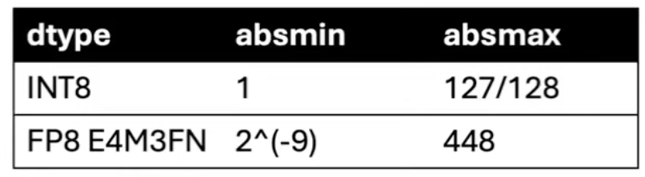

* fp4

  * | 符å·ï¼ˆS） | 指数（E） | 尾数（M） | 数值（å进制）               | 相邻数间隔（ä¸å‰ä¸€ä¸ªæ­£æ•°çš„差） |
    | --------- | --------- | --------- | ---------------------------- | ------------------------------ |
    | 0         | -1        | 0         | $$1.0 \times 2^{-1} = 0.5$$  | -                              |
    | 0         | -1        | 1         | $$1.1 \times 2^{-1} = 0.75$$ | 0.25                           |
    | 0         | 0         | 0         | $$1.0 \times 2^{0} = 1$$     | 0.25                           |
    | 0         | 0         | 1         | $$1.1 \times 2^{0} = 1.5$$   | 0.5                            |
    | 0         | 1         | 0         | $$1.0 \times 2^{1} = 2$$     | 0.5                            |
    | 0         | 1         | 1         | $$1.1 \times 2^{1} = 3$$     | 1                              |

* 硬件支æŒï¼šå‚考「GPU.md —— 硬件精度支æŒã€

* eXmY https://arxiv.org/abs/2405.13938

#### é‡åŒ–技术分类

> * PTQ v.s. QAT
>
> * 在线é‡åŒ– v.s. 离线é‡åŒ–
>   * 在线é‡åŒ–:å®æ—¶ç»Ÿè®¡ inputs çš„ max，算出scale具有å®æ—¶æ€§é«˜ï¼Œç²¾åº¦å¥½ç­‰ä¼˜ç‚¹ï¼Œå®æ—¶ç»Ÿè®¡inputæ•°æ®ï¼Œä¼šå¸¦æ¥ä¸€å®šçš„性能开销
>   * 离线é‡åŒ–: 计算好inputs çš„max，在é‡åŒ–时直æ¥ä½¿ç”¨ï¼Œæ€§èƒ½å¥½ï¼Œä½†éœ€è¦é¢„先计算的maxå’Œå®é™…inputä¸ä¸€è‡´ï¼Œå¯¼è‡´é‡åŒ–误差

* Mixed Precision Training
  * weight/activationé‡åŒ–
  * weight update用fp32/bf16
  * quantization lattice is non-uniform
* Post Training Quantization (PTQ)
  * weight/activationé‡åŒ–，æ¨ç†ç²¾åº¦å’Œæ€§èƒ½çš„最优解，但å¯èƒ½ç²¾åº¦ä¸‹é™å¤§
  * 决策点：
    * clipping error and the rounding error的平衡
    * 最å°è¯¯å·®çš„求解方法
    * ...
  * 常è§æ€è·¯ï¼š
    - W8A8: smoothQuantã€DeepSeek Fp8
    - W4A16: DecoupleQã€AWQã€GPTQ
* Quantization Aware Training (QAT)
  * 训练用全精度，并模拟é‡åŒ–，以优化æ¨ç†é‡åŒ–精度，PTQ的效æœå‡çº§ç‰ˆï¼Œä½†æˆæœ¬é«˜
* Quantized Training (QT)
  * 全部步骤é‡åŒ–，包括weight/activation/weight update

  * only seen success up to 8-bits, whereas QAT is effective even at lower bit-widths.
    * https://cloud.google.com/blog/products/compute/accurate-quantized-training-aqt-for-tpu-v5e


* Q-Lora
  * Quantize base weight to NF4, while LoRA weights are in high precision (FP32 or BF16)
  *  Quantized base weights are not trained.

#### Literature Review

* PTQ（训练åé‡åŒ–） ã€GPTQ】
  * GPTQ 虽用二阶信æ¯è¡¥å¿è¯¯å·®ï¼Œä½†é‡å»ºè¿‡ç¨‹æ˜“过拟åˆæ ¡å‡†é›†ï¼Œå½±å“模å‹æ³›åŒ–能力。
  * AdaRound method (Nagel et al., 2020) computes a data-dependent rounding by annealing a penalty term, which encourages weights to move towards grid points corresponding to quantization levels
  * BRECQ (Li et al., 2021) introduces Fisher information into the objective, and optimizes layers within a single residual block jointly.
  * Optimal Brain Quantization (OBQ) (Frantar et al., 2022) generalizes the classic
    Optimal Brain Surgeon (OBS) second-order weight pruning framework to apply to quantization.
    * OBQ quantizes weights one-by-one, in order of quantization error, always adjusting the remaining weights.
    * While these approaches can
      produce good results for models up to ≈ 100 million parameters in a few GPU hours, scaling them to networks orders of magnitude larger is challenging.
  * 研究Outlier
    * Gobo: Quantizing attention-
      based nlp models for low latency and energy efficient inference
      * introduce centroid-based quantization method, where outlier numbers use FP32 format and the rest numbers are quantized using non-uniform quantization.
      * As such, it is hard to get the real inference latency benefit on general compute accelerators, e.g., CPU and GPU, because the parallel processing units in these hardware do not support efficient computation of mixed data types.
  * expensive hidden-states knowledge distillation [2, 36] is used
    for ultra-low precision quantization to close the accuracy gapã€ZeroQuant】
    * (1) KD needs to hold a teacher and a student model together during the training, which dramatically increases the memory and compute cost;
    * (2) KD usually requires full training of the student model. Therefore, several copies (gradient, first/second order momentum) of the weight parameters need to be stored in memory to update the model;
    * (3) KD generally requires original training data, which sometimes are not accessible due to privacy/confidential issues.
    * --> ZeroQuant LKD
  * 其它：
    * 《Post-training quantization for vision transformer》（NIPS 2021）
    * 《Up or down? adaptive rounding for post-training quantization》
  
* QAT
  * Q-Bert and 《Q8BERT: Quantized 8bit bert》 are the first few works to quantize BERT models using integer numbers for both weight and activations.
    * Q-Bert utilizes Hessian information to push the weight bit-precision to even INT2/INT4, and it also proposes group-wise quantization to quantize the weight matrix in a more fine-grained granularity compared to single matrix quantization.

  * 《Training with quantization noise for extreme ï¬xed-point compression》 introduces quantization noise to alleviate the variations of QAT.

* Quantized Training
  * 《Pareto-Optimal Quantized ResNet Is Mostly 4-bit》
    * INT8 ResNet outperforms BF16 ResNet (at the same params count)
    * INT4 ResNet is the best (for a given model size in MB/GB)

  * Binarized Neural Machine Translation
    * Inspired BitNet

  * Jetfire: Efficient and Accurate Transformer Pretraining with INT8 Data Flow and Per-Block Quantization
    * Tile-wise quantization, with quantized matmul outputs
    * INT8 LayerNorm and INT8 GELU

* Zero-shot Quantization
  * 《Zeroq: A novel zero shot quantization framework.》
  * 《Data-free quantization through weight equalization and bias correction》

* Weight Only Quant
  * developing a quantized-matrix full-precision-vector product kernel which performs a matrix vector product by dynamically dequantizing weights when needed. Most notably, this does not require any activation quantization. While dequantization consumes extra compute, the kernel has to access a lot less memory, leading to significant speedups, as shown in Table 6 ã€GPTQ】
* Large-model Quantization
  * While all existing works—ZeroQuant (Yao et al., 2022), LLM.int8() (Dettmers et al., 2022), and nuQmm (Park et al., 2022)— carefully select quantization granularity, e.g., vector-wise, they ultimately just round weights to the nearest (RTN) quantization level, in order to maintain acceptable runtimes for very large models.
  * **ZeroQuant further proposes layer-wise knowledge distillation**, similar to AdaQuant, but the largest model it can apply this approach to has only 1.3 billion parameters. At this scale, **ZeroQuant already takes ≈ 3 hours of compute; GPTQ quantizes models 100× larger in ≈ 4 hours**.
  * LLM.int8() observes that **activation outliers in a few feature dimensions break the quantization of larger models**, and proposes to fix this problem by keeping those dimensions in higher precision. Lastly, nuQmm develops efficient GPU kernels for a specific **binary-coding based quantization scheme**.
* 学术å‘分类
  * both PTQ and QAT were susceptible to outliers. In addition to simple clamping and regularization during fine-tuning, we can explore techniques that allow the network to learn how to control these outliers (e.g. [learned quantization ranges](https://arxiv.org/pdf/1902.08153), [clipped softmax](https://arxiv.org/pdf/2306.12929), and [gated attention](https://arxiv.org/pdf/2306.12929)), or possibly even borrow outlier suppression techniques from post-training settings (e.g. [SpinQuant](https://arxiv.org/pdf/2405.16406), [SmoothQuant](https://arxiv.org/pdf/2211.10438)) and apply them sparingly throughout the fine-tuning process.

* 在线é‡åŒ– vs delayedé‡åŒ–
  * Delayed quantization is employed in tensor-wise quantization frame-
    works (NVIDIA, 2024b; Peng et al., 2023b), which maintains a history of the maximum absolute values across prior iterations to infer the current value ã€DeepSeek-v3】

* 模å‹ç»“æ„分类
  * KV Cache
    * [LLM-QAT](https://arxiv.org/pdf/2305.17888) explored quantizing the KV cache alongside activations and weights.

  * Embedding Layer
    * [Prior work](https://arxiv.org/pdf/2109.12948) has also had success with quantizing the embedding layer down to 2-bits in other transformer-based models.

#### Mixed Precision Training (ICLR 2018)

> - 技术：
>   - 梯度更新用fp32, an FP32 master copy of weights is used for updates -> **针对梯度累加时被视作0**
>   - Loss Scaling -> **针对****梯度****的表示下溢**
>   - FP16 arithmetic used Tensor Core operations with accumulation into FP32 for convolutions
> - å±€é™æ€§ï¼š
>   - ä¸æ˜¯æ‰€æœ‰å±‚都é‡åŒ–
>   - åªèƒ½ä¼˜åŒ–compute，显存的优化有é™ï¼ˆå–决äºactivation优化情况，且é¢å¤–å­˜fp16 copy）
>   - åªä¼˜åŒ–到fp16
>   - fp16的精度局é™æ€§ï¼Œå°½ç®¡æœ‰loss scaling解决underflow的问题，bf16-pretrained models会overflow

* Baseline (FP32) : Single-precision storage is used for activations, weights and gradients. All arithmetic is also in FP32. 
* Mixed Precision (MP): 
  * 
  * bf16训练时，一般需è¦ä¿ç•™ä¸€ä»½fp32çš„W，用æ¥åšç´¯åŠ 
* Loss Scaling

  * if gradient statistics are available, directly by choosing a factor so that its product with the maximum absolute gradient value is below 65,504 (the maximum value representable in FP16).
  * åªè¦æ²¡æœ‰overflow，就没有副作用
* 解决的问题：

  * fp16训练，梯度被忽略：
    1. updates (weight gradients multiplied by the learning rate) become too small to be represented in FP16 - any value whose magnitude is smaller than 2−24 becomes zero in FP16.
    2. when the magnitude of a normalized weight value is at least 2048 times larger that of the weight update. Since FP16 has 10 bits of mantissa, the implicit bit must be right-shifted by 11 or more positions to potentially create a zero

  * åŒä¸Šï¼šä¾§é‡åˆ©ç”¨fp16çš„exponentialä½æ•°
  * 累加ã€reduceç­‰æ“作的梯度噪声大
* Arithmetic precision的分æ
  * three categories: vector dot-products, reductions,
    and point-wise operations
  * To maintain model accuracy, we found that some networks require that FP16 vector dot-product accumulates the partial products into an FP32 value, which is converted to FP16 before writing to memory.
  * Large reductions (sums across elements of a vector) should be carried out in FP32. Such reductions mostly come up in batch-normalization layers when accumulating statistics and softmax layers.
    Both of the layer types in our implementations still read and write FP16 tensors from memory, performing the arithmetic in FP32. **This did not slow down the training process since these layers are memory-bandwidth limited and not sensitive to arithmetic speed**
  * Point-wise operations, such as non-linearities and element-wise matrix products, are memory-bandwidth limited. Since arithmetic precision does not impact the speed of these operations, either
    FP16 or FP32 math can be used
* å®ç°ï¼šscale系数8，å®ç°æ—¶åœ¨forward scale，在backward之åã€gradient clipping之å‰rescale。 ç¡®ä¿weight decayä¸å—å½±å“
* 结论：
  * 技术1ä¿ä½CV CNN backbone精度
  * Loss Scaling
    * Scaling factor of 8 ä¿ä½Faster R-CNNã€Multibox SSD精度
    * Scaling factor of 128 ä¿ä½ LSTM 精度
    * 语音模å‹åœºæ™¯ the half-precision storage format may act as a regularizer during training
    * ganä¸éœ€è¦scaling

#### Bf16-Mixed-Precision-Training

https://arxiv.org/pdf/1905.12322

#### Fp8-Mixed-Precision-Training


##### Literature Review

* per tensor scale
  * tensor scaling techniques are proposed (Sun et al., 2019;
    Micikevicius et al., 2022)ã€FP8-LM】

##### FP8-LM by 微软

> FP8-LM: Training FP8 Large Language Models

* **three levels** gradually incorporate
  * FP8 communication
  * FP8 optimizer
  * FP8 distributed training.

* 精度技术
  * **precision decoupling**
    * decoupling the influence of data precision
      on parameters such as weights, gradients, optimizer states, and assigning reduced precision to components that are not precision sensitive

* FP8 communication
  * **automatic scaling**
    * to preserve gradient values within the representation range
      of FP8 data formats through the dynamic adjustment of tensor scaling factors, thereby alleviating underflow and overflow occurrences during all-reduce communication.
    * pre-scaling and post-scaling
      * pre-scaling underflow，post-scaling overflow
      * 
    * auto-scaling
      * 这个简化有点离谱，直æ¥å–global scaling最å°å€¼ï¼Œå¯èƒ½é€ æˆç²¾åº¦æŸå¤±
      * 
* fp8 optimizer
  * the gradient statistics can use lower precision, while the master weights necessitate high precision
    * ä»…é™first order，因为second-order代表方å‘æ›´æ•æ„Ÿ
    * 存fp32 master weights等价为存fp16+scaling
    * 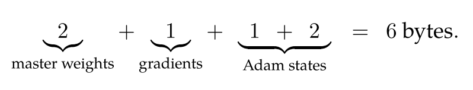
* 结论：
  * 显存：29% reduction for GPT-7B while 39% for GPT-175B
  * weight-related communication: -63%~65%
  * E2e: during the training of GPT-175B model, our FP8 mix-precision
    framework reduces training time by 37% compared to TE (Nvidia, 2022b), while consuming 42% less memory on H100 GPU platform
  * RLHF：yield a 32% reduction in model weights and a 62% reduction in optimizer states’ memory consumption


##### DeepSeek-V3

* Inspired by recent advances in low-precision training (Dettmers et al., 2022; Noune et al., 2022;
  Peng et al., 2023b), While low-precision training holds great promise, it
  is often limited by the presence of outliers in activations, weights, and gradients (Fishman
  et al., 2024; He et al.; Sun et al., 2024).
* To address this challenge and effectively extend the dynamic
  range of the FP8 format, we introduce **a fine-grained quantization strategy: tile-wise grouping**
  **with 1 × ğ‘ğ‘ elements or block-wise grouping with ğ‘ğ‘ × ğ‘ğ‘ elements**

* Moreover, to further reduce memory and communication overhead in MoE training, we **cache and dispatch activations in FP8, while storing low-precision optimizer states in BF16**


* 收益：
  * compute
  * activation显存
* 稳定性：
  * we maintain the original precision (e.g., BF16 or FP32) for the following components:
    * the embedding module, the output head, MoE gating modules, normalization operators, and attention operators
* 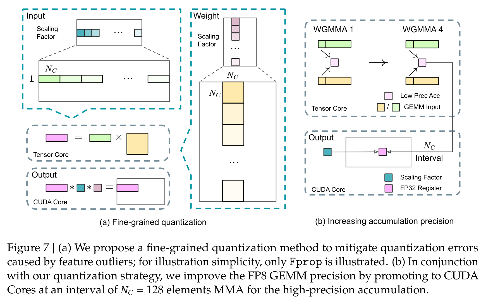
* é‡åŒ–æ–¹å¼ï¼š
  * (1) for activations, we group and scale elements on a 1x128 tile basis (i.e., **per token per 128 channels**); 
    * the introduction of **per-group scaling factors along the inner dimension of GEMM operations**
    * æ€è·¯å¯¹é½ 《Microscaling data formats for deep learning.》ã€https://www.nvidia.com/en-us/data-center/technologies/blackwell-architecture/
  * (2) for weights, we group and scale elements on a 128x128 block basis (i.e., **per 128 input channels per 128 output channels**)
  * Bf16 optimizer
  * the master weights (stored by the optimizer) and gradients (used for batch size accumulation) are still retained in FP32 to ensure numerical stability throughout training.
* Increasing Accumulation Precision
  * It is worth noting that **this modification reduces the WGMMA (Warpgroup-level Matrix-Multiply-Accumulate) instruction issue rate for a single warpgroup. However, on the H800**
    **architecture, it is typical for two WGMMA to persist concurrently: while one warpgroup**
    **performs the promotion operation, the other is able to execute the MMA operation.** This design enables overlapping of the two operations, maintaining high utilization of Tensor Cores. Based on our experiments, setting ğ‘ğ¶ = 128 elements, equivalent to 4 WGMMAs, represents the
    minimal accumulation interval that can significantly improve precision without introducing substantial overhead.
  * WGMMA 的异步能力 https://research.colfax-intl.com/cutlass-tutorial-wgmma-hopper/
* 其它特点
  * Mantissa over Exponents.
    * In contrast to the hybrid FP8 format adopted by prior work
      (NVIDIA, 2024b; Peng et al., 2023b; Sun et al., 2019b), which uses E4M3 (4-bit exponent and
      3-bit mantissa) in Fprop and E5M2 (5-bit exponent and 2-bit mantissa) in Dgrad and Wgrad,
      **we adopt the E4M3 format on all tensors for higher precision.**
  
  * Online Quantization
  * Activationçš„é‡åŒ–细节
    * (1) **Inputs of the Linear after the attention operator**. These activations are also
      used in the backward pass of the attention operator, which makes it sensitive to
      precision. We adopt a customized **E5M6** data format exclusively for these activations.
      Additionally, these activations will be converted from an 1x128 quantization tile to
      an 128x1 tile in the backward pass. To avoid introducing extra quantization error,
      all the scaling factors are round scaled, i.e., integral power of 2.
    * (2) **Inputs of the SwiGLU operator in MoE**. To further reduce the memory cost, we
      cache the inputs of the SwiGLU operator and recompute its output in the backward
      pass. These activations are also stored in **FP8** with our fine-grained quantization
      method, striking a balance between memory efficiency and computational accuracy.
  
  * 通信的é‡åŒ–细节：
    * **Fp8**: activation before MoE up-projectionsã€activation gradient before MoE down-projections
    * **Bf16:** both the forward and backward combine components
  

* 硬件æå‡æ–¹å‘：
  * To address this inefficiency, we recommend that future chips **integrate FP8 cast and TMA (Tensor Memory Accelerator) access into a single fused operation**, so quantization can be completed during the transfer of activations from global memory to shared memory, avoiding frequent memory reads and writes.
  * We also recommend supporting a **warp-level cast instruction** for speedup, which further facilitates the better fusion of layer normalization and FP8 cast. Alternatively, a near-memory computing approach can be adopted, where compute logic is placed near the HBM. In this case, BF16 elements can be cast to FP8 directly as they are read from HBM into the GPU, reducing off-chip memory access by roughly 50%.
  * Support for Transposed GEMM Operations.


#### [TorchAO - Advanced Quantization](https://www.youtube.com/watch?v=1u9xUK3G4VM)

> GPU/Quantization Cuda vs Triton.pdf
>
> GPU Mode Lecture 7

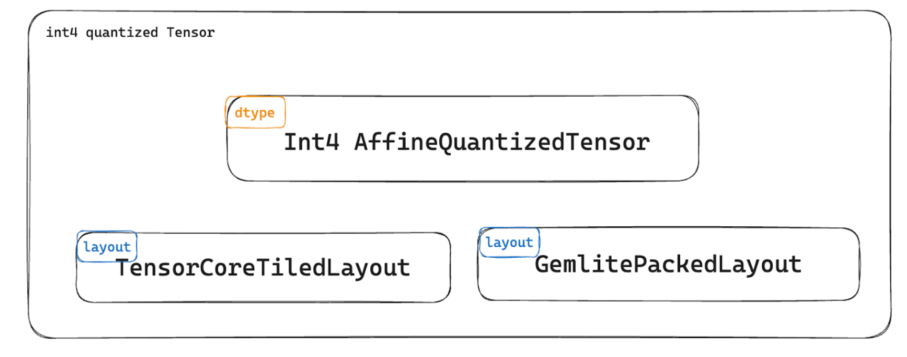

- 迭代路线：

  - dynamic(per tensor/per token/per channel)->weight only->QATã€GPTQ

- TorchAO - https://github.com/pytorch-labs/ao

  - Int8 Dynamic Quantization：W8A8
    - i8i8->i32 vs i8i8->bf16

  - Int 8 Weight Only Quantization：W8A16
    - bf16i8->bf16
  - Int 4 Weight Only Quantization：W4A16
    - bf16i4->bf16

- Techniques：æ˜ç¡®é‡åŒ–的目的

  - dynamic: 针对compute bound
  - weight only: 针对memory h2d boundã€æ˜¾å­˜ç“¶é¢ˆçš„场景，å»é™¤äº†å¯¹activationåšquantize的系列æ“作，适åˆllamaç­‰
  - --> dynamic quantize在llamaæˆä¸ºç“¶é¢ˆï¼Œå†…å­˜æ“作多


* Dynamic Quantization Flow
  * 
  * 问题1：显存å¢é•¿ï¼ŒåŸå› æ˜¯int8乘法的accumulation矩阵需è¦æ˜¯int32
    * 解法：fusion，直æ¥ç”¨bf16作为accumulate矩阵
    * 代ç ï¼šconfig.force_fuse_int_mm_with_mul
  * 问题2: é‡åŒ–精度æŸå¤±
    * 解法：per-tokenã€per-channel
* INT8 Weight Only Quantization
  * 矩阵计算，fp32å’Œbf16皆å¯ï¼Œfp16容易overflow; accumulation也å¯è€ƒè™‘bf16
  * 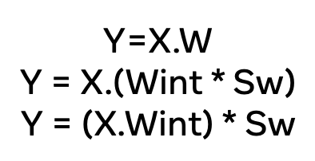
  * 问题：一开始比cublas慢一åŠ
    * 分æ1: é¢å¤–åšäº†castã€rescale
    * 分æ2: The Blocksize is limited to be >= 16, meaning The grid for this launch is configured to execute only 64 blocks, which is less than the GPU's 108 multiprocessors. This can underutilize some multiprocessors. If you do not intend to execute this kernel
      * 解法：config.coordinate_descent_tuning优化
      * 
    * 
  * Side Note:
    * Weight Only Quantization中，Dequantize是å¯é€‰çš„，å¯ä»¥int4ç›´æ¥å’Œfloatçš„fractional part相乘

* **Int4 Weight Only Quantization**

  * 
  * 问题：no torch dtype
    * 解法：用uint8=int4*2存两个int4
  * 问题：如何unpack/pack
    * 解法：å³ä¸‹è§’çš„æ’布，unpack一列åªéœ€è¦load一列
    * 

  * 问题：性能差
    * 解法：int4 groupwise quant
    * 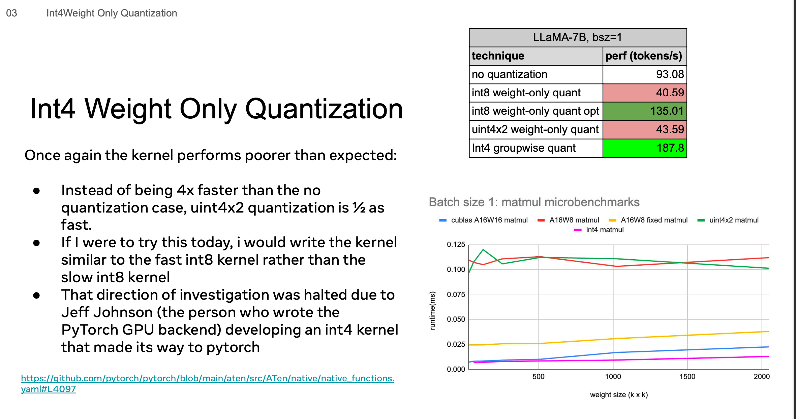

* GPT-Q
  * 

* Triton Limitations
  * It runs into trouble when trying to work with complicated operations and nonstandard dtypes
    * Int4
    * batchsize>1 int8/int4 weight only
      * L2 Cache Optimization
  * Config consistency
    * Issues with Heuristics, in some of the tests
    * the best configurations aren’t available or are heuristically discarded.

#### W8A8 - Dynamic Weight and Act

##### SmoothQuant

> 本质上是为了解决GPU计算per-channel activation quantizationä¸é«˜æ•ˆï¼Œæ‰€ä»¥å°†outlier平移到weight。 

$$\hat{X} = X \cdot \text{diag}(s)^{-1}, \quad \hat{W} = \text{diag}(s) \cdot W$$

ä¿æŒæ•°å­¦ç­‰ä»·æ€§ï¼š$$Y = \hat{X} \cdot \hat{W}$$

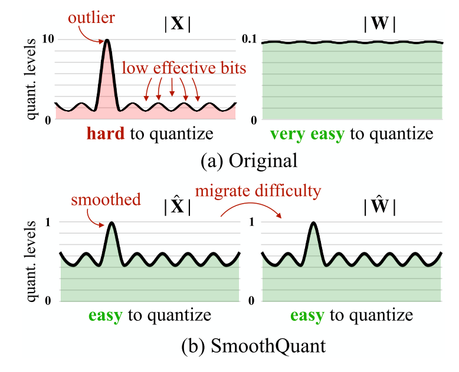


* Intro
  * SmoothQuant smooths the activation outliers by offline migrating the quantization difficulty from activations to weights with a mathematically equivalent transformation.
  * SmoothQuant relies on a key observation: even if activations are much harder to quantize than weights due to the presence of outliers (Dettmers et al., 2022), **different tokens exhibit similar variations across their channels.**
* 一些分æ：
  * Activations are harder to quantize than weights.
  * Outliers make activation quantization difficult
  * Outliers persist in fixed channels
* 结论
  * 在175B模å‹ï¼Œç²¾åº¦ä¼˜äºzeroquant （section5.2）
  * 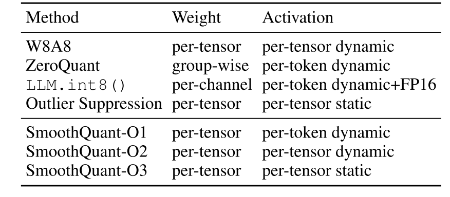
  * 
  
* å…³äºper channel activation quantization的分æ

  * per-channel activation quantization（需è¦å¯¹æ¿€æ´»å€¼çš„æ¯ä¸ªé€šé“进行独立的缩放）ä¸ç¡¬ä»¶åŠ é€Ÿçš„ GEMM kernels（通常利用 Tensor Core 执行 MMA）ä¸å¤ªå…¼å®¹ã€‚
  * åŸå› å°±åœ¨äºï¼š
    * Tensor Core MMA 设计用äºé«˜é€Ÿå¤„ç† æ•´å—矩阵 的乘加è¿ç®—，形æˆé«˜æ•ˆçš„指令æµæ°´çº¿ã€‚
    * Per-channel scaling 是一个 粒度更细 çš„æ“作，需è¦åœ¨çŸ©é˜µä¹˜æ³•è¿‡ç¨‹ä¸­æˆ–之å，对结æœçŸ©é˜µçš„特定维度（通é“维度）进行 é€å…ƒç´ æˆ–é€å‘é‡ çš„ä¹˜æ³•ã€‚
    * 如æœè¯•å›¾åœ¨ Tensor Core çš„ MMA 指令åºåˆ— 中间 æ’入这ç§ä½ååé‡çš„ã€é€šå¸¸ç”± CUDA Core 执行的 FMA 或其他标é‡/å‘é‡æŒ‡ä»¤ï¼ˆä¾‹å¦‚，加载缩放因å­å¹¶è¿›è¡Œä¹˜æ³•ï¼‰ï¼Œå°±ä¼šæ‰“æ–­ Tensor Core 的高效æµæ°´çº¿ï¼Œå¯¼è‡´æ€§èƒ½ä¸‹é™ã€‚
    * 因此，硬件加速库通常选择在整个 Tensor Core MMA 计算 完æˆä¹‹å ，å†å¯¹è¾“出矩阵的“外部维度â€ï¼ˆå¦‚ token 维度或输出通é“维度）进行统一的缩放，这样å¯ä»¥ä¿æŒ Tensor Core 的高效ç‡ã€‚而 Triton 这样的工具则æ供了更çµæ´»çš„ kernel fusion 能力，å…许在 MMA 计算 tile 之åã€å†™å›å†…存之å‰ï¼Œèåˆè¿›è¿™äº› per-channel æ“作，ä»è€Œåœ¨ä¸€å®šç¨‹åº¦ä¸Šç¼“解这个问题。


  * 新硬件支æŒï¼š
    * 《Fused FP8 4-Way Dot Product With Scaling and FP32 Accumulation》 [https://www.ac.uma.es/arith2024/papers/Fused%20FP8%204-Way%20Dot%20Product%20with%20Scaling%20and%20FP32%20Accumulation.pdf](https://www.ac.uma.es/arith2024/papers/Fused FP8 4-Way Dot Product with Scaling and FP32 Accumulation.pdf)

* 方案：

  * 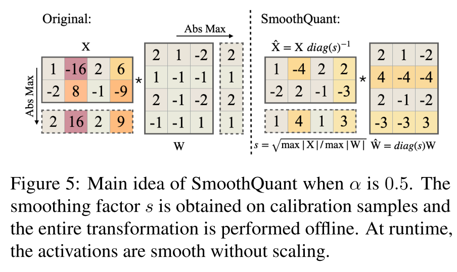
    * activation outliers are more significant的场景，调大alpha


​    

##### DeepSpeed —— ZeroQuant

> ZeroQuant: Efficient and Affordable Post-Training Quantization for Large-Scale Transformers

* è¦ç‚¹ï¼š
  * W8A8（LKD下，FFC支æŒW4A8）
    * 5.19x/4.16x speedup
    * 3x memory footprint reduction
  * a fine-grained hardware-friendly quantization scheme for both weight and activations;
    * **group-wise quantization for weight and token-wise quantization for activations.** 
  * a novel affordable layer-by-layer knowledge distillation algorithm (LKD) even without the access to the original training data;
  * a highly-optimized quantization system backend support to remove the quantization/dequantization overhead
* 结论：
  * ç›´æ¥PTQ + GPT-3/Bert：W8A16效æœæ— æŸï¼Œæ¥ä¸‹æ¥æœ‰æŸ （table1）
    * 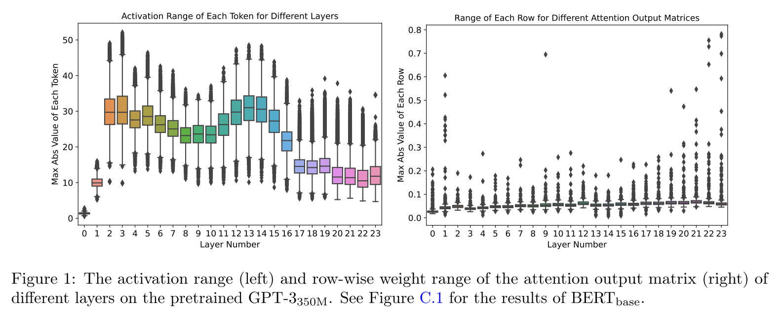
    * æ¯ä¸€å±‚内，ä¸åŒtokençš„range分布差è·å¤§ --> token-wise
    * output attn matrix，ä¸åŒè¡Œçš„分布差异大
  * generation task比eval taskæ›´æ•æ„Ÿ
  * Table2ã€Table4:
    * W8A8ã€W4/8A16效æœå¥½
    * W4/8A16在zeroquant+lkdåå¯ç”¨
    * for W4/8, we quantize the MHSA’s weight to INT8 and FFC’s weight to INT4; for A8/16, we use FP16 activation for self-attention calculation (i.e., the GeMM related to Wq/k/v) and use INT8 for the rest calculation
  * table 6: w8a8的加速比，å°batch2-3，64batch 4-5
  * 5.6 No Access to The Original Training Data，影å“ä¸å¤§

* 4.1 Fine-grained Hardware-friendly Quantization Scheme
  * group-wise quantization for weight
    * 借鉴Q-Bert
  * Token-wise Quantization for Activations
* 工程优化（4.3 Quantization-Optimized Transformer Kernels）
  * 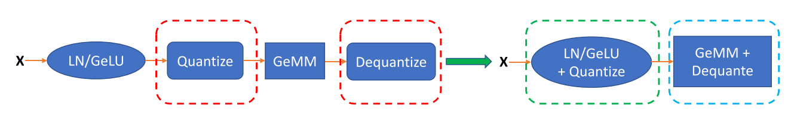
  * quant：kernel fusion technique to fuse quantization operator with its previous operator, like layer normalization, to alleviate the data movement cost from token-wise quantization
    * æ¯ä¸ªSMå¯ä»¥quantize one row/token
  * dequant：the dequantization cost of the different GeMMs’ output is alleviated by scaling the INT32 accumulation using both the weight and activation quantization scales, before writing the final FP16 result back to the main memory for the next FP16 operator (like GeLU)
    * 异步读å–é‡åŒ–scale
  * CUTLASS INT8 GeMM：相比cudnn的优势是容易和dequantåšfuse
    * https://developer.nvidia.com/blog/cutlass-linear-algebra-cuda/
    * use the CUTLASS profiler tool that explores the tiling dimensions on the thread-blocks, WARPs, and WMMA (Tensor cores), as the three compute hierarchies available within the Ampere GPU architecture
  * å¼€å¯cuda graph，优化å°æ¨¡å‹æ€§èƒ½
* LKD
  * 


##### PTQ基础

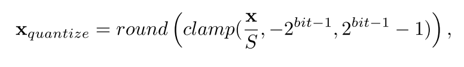

* S的选å–
  * weight matrix：max(abs(X))
  * activation：
    * dynamic
    * static：calibrated using training data (e.g., momentum based
      averaging) and ï¬xed during inference [23]
      * 

#### W4A16 - Weight Only

##### AWQ: ACTIVATION-AWARE WEIGHT QUANTIZATION

> 比较å®ç”¨ï¼Œç­–ç•¥+观察，暴力计算æœç´¢

* Intro
  * 激活感知æƒé‡é‡åŒ–（AWQ）方法，通过ä¿ç•™ 1% 显著æƒé‡å’Œchannel-wise缩放é™ä½é‡åŒ–误差，且ä¸ä¾èµ–åå‘传播或é‡å»ºï¼Œæ³›åŒ–性强。
  * åŒæ—¶è®¾è®¡ TinyChat æ¨ç†æ¡†æ¶ï¼Œåˆ©ç”¨å³æ—¶åé‡åŒ–ã€SIMD 感知æƒé‡æ‰“包和内核èåˆç­‰æŠ€æœ¯ï¼Œåœ¨æ¡Œé¢å’Œç§»åŠ¨ GPU 上相比 Huggingface FP16 å®ç°æœ‰ 3 å€ä»¥ä¸ŠåŠ é€Ÿï¼ŒåŠ©åŠ› LLMs 在边缘设备的部署。å®éªŒè¡¨æ˜ï¼ŒAWQ 在多ç§ä»»åŠ¡ã€æ¨¡å‹ä¸Šæ€§èƒ½ä¼˜äºç°æœ‰æ–¹æ³•ï¼Œåœ¨æŒ‡ä»¤è°ƒæ•´å’Œå¤šæ¨¡æ€æ¨¡å‹é‡åŒ–中表ç°å‡ºè‰²
  * **ä½æ¯”特æƒé‡é‡åŒ–的困境**：ä½æ¯”特æƒé‡é‡åŒ–å¯å‡å°‘内存å ç”¨ï¼Œä½†QATæˆæœ¬é«˜ï¼ŒPTQ在ä½æ¯”特设置下精度下é™å¤§ã€‚GPTQ 虽用二阶信æ¯è¡¥å¿è¯¯å·®ï¼Œä½†é‡å»ºè¿‡ç¨‹æ˜“过拟åˆæ ¡å‡†é›†ï¼Œå½±å“模å‹æ³›åŒ–能力。
* 核心æ€è·¯ï¼š
  * **ä¿ç•™ 1% 显著æƒé‡æå‡é‡åŒ–性能**：å‘ç° LLMs 中部分（0.1%-1%）显著æƒé‡å¯¹æ¨¡å‹æ€§èƒ½å½±å“大，跳过这些æƒé‡çš„é‡åŒ–å¯å‡å°‘é‡åŒ–æŸå¤±ã€‚**基äºæ¿€æ´»å¹…度而éæƒé‡å¹…度选择显著æƒé‡**，能显著æå‡é‡åŒ–模å‹æ€§èƒ½ï¼Œä½†æ··åˆç²¾åº¦æ•°æ®ç±»å‹ä¼šå¢åŠ ç³»ç»Ÿå®ç°éš¾åº¦ã€‚
  * **激活感知缩放ä¿æŠ¤æ˜¾è‘—æƒé‡**：æ出按通é“缩放方法é™ä½æ˜¾è‘—æƒé‡çš„é‡åŒ–误差。通过分æé‡åŒ–误差，得出**缩放显著通é“**å¯å‡å°ç›¸å¯¹è¯¯å·®çš„结论。为平衡显著和é显著æƒé‡ï¼Œè‡ªåŠ¨æœç´¢æœ€ä¼˜ç¼©æ”¾å› å­ï¼Œé‡‡ç”¨ç®€å•æœç´¢ç©ºé—´å’Œå¿«é€Ÿç½‘æ ¼æœç´¢ç¡®å®šæœ€ä½³è¶…å‚æ•° α，并应用æƒé‡è£å‰ªæœ€å°åŒ–é‡åŒ–å‡æ–¹è¯¯å·®ã€‚该方法ä¸ä¾èµ–å›å½’或åå‘传播，对校准集ä¾èµ–å°ï¼Œæ³›åŒ–性强
    * æ ¹æ®activation决策显著 -> scaling up显著的weight -> 相关inputå˜å° -> é‡åŒ–误差å˜å°
    * 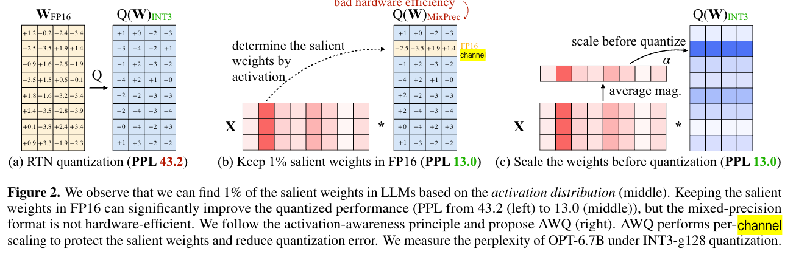
    * 基äºä¸€ä¸ªå‡è®¾ï¼šæ”¾å¤§æ˜¾è‘—çš„channelå，é‡åŒ–scaleå˜åŒ–ä¸å¤§
    * 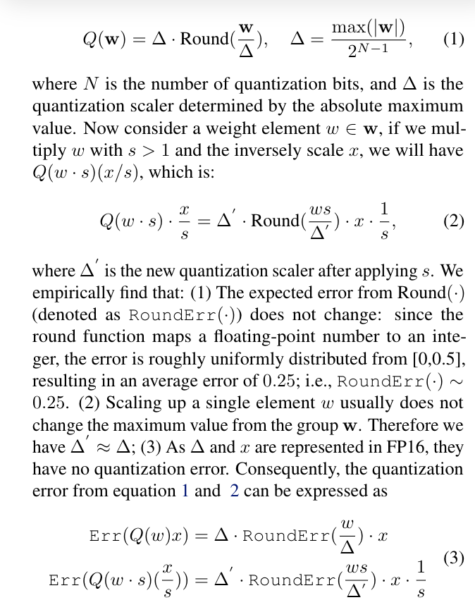
* 相比GPTQ：
  * 对校准集ä¸æ•æ„Ÿ
  * 效æœå¥½

##### GPTQ: Accurate Post-Training Quantization for Generative Pre-trained Transformers

> PTQ，主è¦åº”用äºæ¨ç†åœºæ™¯
>
> 用二阶信æ¯è¡¥å¿è¯¯å·®ï¼Œä½†é‡å»ºè¿‡ç¨‹æ˜“过拟åˆæ ¡å‡†é›†ï¼Œå½±å“模å‹æ³›åŒ–能力。
>
> W4A16

* GPTQ, a new one-shot weight quantization method based on approximate second-order information

  * reducing the bitwidth down to 3 or 4 bits per weight
  * It therefore remains open whether one-shot **post-training quantization** to higher compression rates is generally-feasible.

  * gptq = gpt + ptq
  * LLMé‡åŒ–：å‚数越多，é‡åŒ–越有效

* 结论：
  * Further, we show that our model can also provide robust results in the extreme quantization regime, in which models are quantized to 2 bits per component, or even ternary values
  * reducing the bitwidth down to 3 or 4 bits per weight
  * **本质上是LLMå‚æ•°é‡é常大，存在å‚数冗余**
  * Practical Speedups. Finally, we study practical applications. As an interesting use-case, we focus on the OPT-175B model: **quantized to 3 bits, this model takes approximately 63GB of memory**, including the embeddings and the output layer, which are kept in full FP16 precision. Additionally, storing the **complete history of keys and values for all layers,** a common optimization for generation tasks, **consumes another ≈ 9GB for the maximum of 2048 tokens**. Hence, we can actually fit the entire quantized model into a single 80GB A100 GPU, which can be executed by dynamically dequantizing layers as they are required during inference (the model would not fully fit using 4 bits). For reference, standard FP16 execution requires 5x80GB GPUs, and the state-of-the-art 8bit LLM.int8() quantizer (Dettmers et al., 2022) requires 3 such GPUs
* 方法：layer-wise
  * 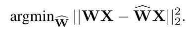
  * å‡è®¾ï¼šthe quantization grid for W is ï¬xed before the process
* Optimal Brain Quantization
  * 问题分解：将训练åé‡åŒ–的目标转化为最å°åŒ–æŸå¤±è¯¯å·®ï¼Œé€šè¿‡æ³°å‹’级数近似，将æŸå¤±è¯¯å·®è¡¨ç¤ºä¸ºä¸æµ·æ£®çŸ©é˜µç›¸å…³çš„å½¢å¼ï¼Œå¹¶å°†å…¶åˆ†è§£ä¸ºé€å±‚独立的凸问题，进一步按行分解为独立问题。
  * 迭代é‡åŒ–：在æ¯ä¸€æ­¥ä¸­ï¼Œé€‰æ‹©å•è¡Œä¸­çš„å•ä¸ªæƒé‡è¿›è¡Œé‡åŒ–。计算该行中æ¯ä¸ªæƒé‡é‡åŒ–åçš„æŸå¤±è¯¯å·®ï¼Œå…¬å¼ä¸º$$\delta L_{q}=\frac{1}{2}\frac{w_{q}^{2}}{(H^{-1})_{qq}}$$，其中$$w_{q}$$是æƒé‡ï¼Œ$$(H^{-1})_{qq}$$是逆海森矩阵的第q个对角元素。贪心地选择具有最å°æŸå¤±è¯¯å·®çš„æƒé‡è¿›è¡Œé‡åŒ–。 
  * æƒé‡æ›´æ–°ï¼šå°†é€‰ä¸­çš„æƒé‡å››èˆäº”入到é‡åŒ–网格上的最近值，然åæ›´æ–°åŒä¸€è¡Œä¸­å°šæœªé‡åŒ–的剩余æƒé‡ä»¥è¡¥å¿å¼•å…¥çš„误差。更新公å¼é€šè¿‡æ±‚解拉格朗日函数得到，é‡åŒ–å的最优æƒé‡æ‰°åŠ¨ä¸º$$\delta W^{\top}=-\frac{w_{q}}{(H^{-1})_{qq}}e_{q}^{\top}H^{-1}$$，其中$$e_{q}$$是第q个标准基å‘é‡ã€‚ 
  * 矩阵更新：更新剩余æƒé‡çš„逆海森矩阵，通过移除已é‡åŒ–æƒé‡å¯¹åº”的行和列æ¥å®ç°ã€‚ 
  * é‡å¤è¿­ä»£ï¼šç»§ç»­ä¸Šè¿°è¿­ä»£è¿‡ç¨‹ï¼Œç›´åˆ°æ‰€æœ‰æƒé‡éƒ½è¢«é‡åŒ–。 
* 在å®é™…应用中，为了æ高计算效ç‡å’Œé˜²æ­¢æ•°å€¼ä¸å‡†ç¡®æ€§ç´¯ç§¯ï¼ŒGPTQ算法对OBQ进行了改进，如采用**固定的é贪心顺åºå¯¹æ‰€æœ‰è¡Œè¿›è¡Œé‡åŒ–**(å‡å°‘计算é‡)ã€**一次ä¿æŒæƒé‡æ›´æ–°åœ¨åˆ—çš„å—内**(一次128个column，batchæ“作)ã€**对海森矩阵的对角项应用轻微阻尼**(å¢åŠ æ•°å€¼ç¨³å®šæ€§)以åŠ**利用逆海森矩阵的Cholesky分解**(逆海森矩阵容易inf)等。
  * 

* 算法
  * 


#### 

#### TorchAO - Quantized Training

> [GPU Mode Lecture 30](https://www.youtube.com/watch?v=Br07GsnnvWc&t=798s)
>
> [Quantization-Aware Training for Large Language Models with PyTorch](https://pytorch.org/blog/quantization-aware-training/)

##### Intro

* overview
  * forward
    * weight only
    * dynamic act-weight
    * static act-weight
      * llm通常ä¸ä¼šå¯¹activationsåšstatic quant
  * backwardã€optimizer
    * fuse gradients + optimizer step
    * activation ckpt
  * distributed通信，也å ç”¨æ˜¾å­˜


##### Low-bit optimizer

* 问题：pytorch optimizerä¸æ”¯æŒfp32 param + bf16 optimizer，强制è¦æ±‚param-gradients-optimizer三者的dtype一致
* 《Memory Efficient Optimizers with 4-bit States》
* 《8-bit Optimizers via Block-wise Quantization》
  * 8bit: bitandbytes
  * 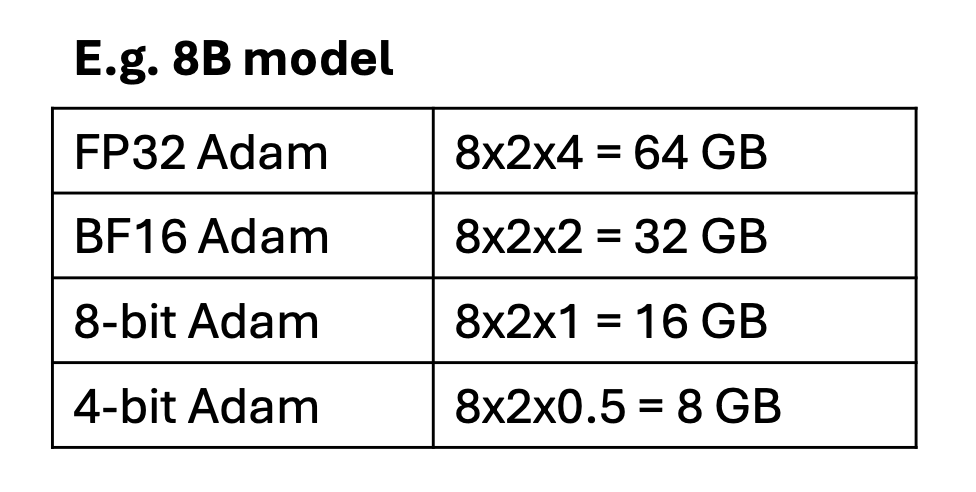
* 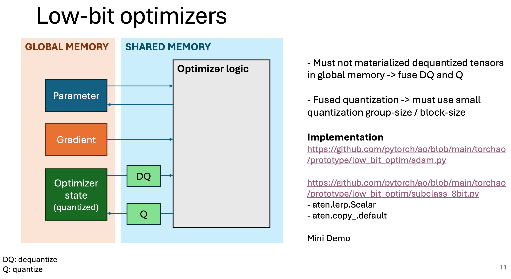
  * æ€è·¯ï¼šfuse kernel，ä¸å°†ä¸­é—´çŠ¶æ€å­˜å…¥gpuçš„global memory
    * **block-wise**而ä¸æ˜¯tensor-wise，æ‰èƒ½**ç¡®ä¿è®¡ç®—scale时在shared memory进行**
    * å¯èƒ½è€ƒè™‘ TMA （tensor memory accelerator）？

##### Low-bit weight-only training

* 核心问题：Can we train quantized weights without high precision copy?
* 解法：stochastic rounding in optimizer，SR用äºæ¢¯åº¦æ›´æ–°
* 结论：
  * 1B以上的LLM模å‹ï¼Œç›¸æ¯”bf16训练的losså·®è·å°
  * finetuneæŸä¸ªæ¨¡å‹ï¼ŒLr 1e-5时，bf16训练精度ä½äºint8 SR
    * https://github.com/pytorch/ao/pull/644
    * 

* Bf16 w/ SR

  * https://arxiv.org/abs/2010.06192

  * https://github.com/karpathy/llm.c/blob/7ecd8906afe6ed7a2b2cdb731c042f26d525b820/llmc/adamw.cuh#L19-L46

    https://github.com/gau-nernst/quantized-training/blob/c42a7842ff6a9fe97bea54d00489e597600ae683/other_optim/bf16_sr.py#L108-L122

##### Low-bit mixed-precision training

* 问题：如何int8ã€fp8训练
* 解法：
  * scaled matmul
    * tensorwise
    * 左乘matrix用row-wiseã€å³ä¹˜matrix用column-wise
  * 工程å®ç°ï¼štriton kernel
    * torch compile的问题：1）无法fuse两个scalingï¼›2）auto configä¸å¥½
  * 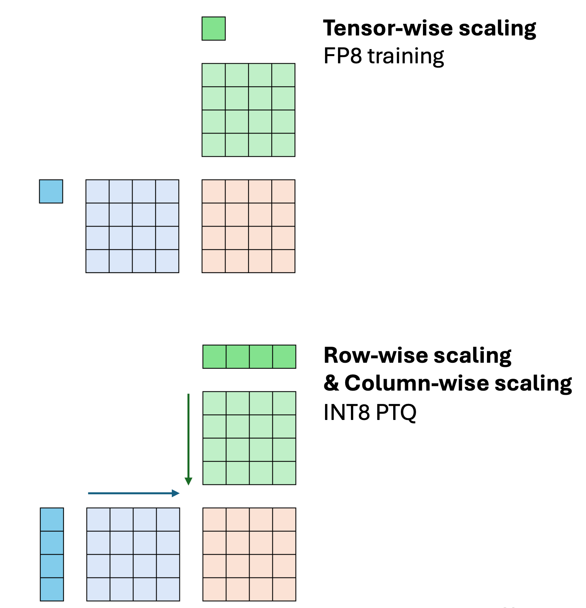

* 结论：
  * int8矩阵计算加速比，a100在2å·¦å³
  * Comparing BF16 w/ padding and INT8 mixed-precision w/ padding, there is ~20% speedup

##### 讨论

* INT8 weight-only + INT8 matmul?
  * Row-wise scaling in forward pass become column-wise scaling in backward pass
  * Tensor-wise scaling won’t have this issue.
  * Also possible to dequant and re-quant in the other axis, but will incur extra overhead.
  * QLoRA + FP8/INT8 matmul: need to dequant weight before matmul anyway.
* Ideas to explore
  * low-bit allreduce using Stochastic Rounding
  * INT4 Tensor Cores 👀 (requires cutlass)
  * Output low-bit activations from matmul -> low-bit RMSNorm / GELU / SiLU

##### BitNet 支æŒ

* BitNet 1.58-bit https://arxiv.org/abs/2402.17764
  * Weight: tensor-wise abs-mean scaling to ternary (-1, 0, 1)
  * Activation: per-token (row-wise) abs-max scaling to INT8
  * Originally trained with Quantization-Aware Training (QAT)
  * We can use INT8 Tensor Cores! (and 2-bit all-gather for FSDP)
  * https://github.com/pytorch/ao/pull/930
  * 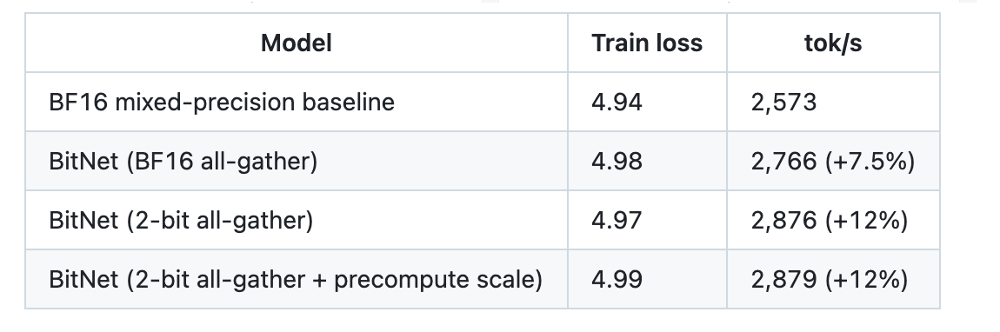

##### W4A8 + QAT

>  [Quantization-Aware Training for Large Language Models with PyTorch](https://pytorch.org/blog/quantization-aware-training/)

* 

  * **W4A8: int8 per token dynamic activations + int4 grouped per channel weights**

* 结论

  * **8da4w**：Table 1
    * QAT achieved 16.8% lower perplexity and unchanged model sizes and on-device inference and generation speeds on the Llama3-8B model lowered to XNNPACK.
  * Lower Bit Weight Only Quantization
    * group size 32
    * **applying QAT while skipping quantization for the first 3 and last 2 layers** 效æœå¯æ¥å—

* QAT: **8da4w**, only applied to linear layers

  * > ä¼¼ä¹å’Œ ZeroQuant 的结论对é½

  * int8 per token dynamic activations

  * int4 grouped per channel weights

    - use a group size of 256 for weights

  * 技巧：disable fake quantization for the first 1000 steps

* PTQ

  - embeddings are additionally quantized to int4 using a group size of 32

* QAT overhead
  * ~34% slower
  * 显存å¢é•¿ï¼Œå¼€activation checkpointing缓解

#### DeepSpeed —— Mixture-of-Quantization (MoQ)

> https://www.deepspeed.ai/2021/05/04/MoQ.html
>
> https://www.deepspeed.ai/tutorials/MoQ-tutorial/

**MoQ**

* å’ŒQ-Bert结åˆ

  * Q-Bert

    * use **the second-order gradient (eigenvalue) of the parameters** to adjust the quantization schedule during training.

    * **use grouped quantization with a large grouping size (128)** when quantizing a parameter matrix to gain higher accuracy, but they are still inferior to the baseline.

  * To combine this with MoQ, we **cluster the eigenvalues into several regions based on their absolute values and tune the quantization period for each region accordingly**, the higher the magnitude of eigenvalue, the larger the factor and the slower the precision decreases.

* Stochastic Rounding

* 工程技巧：

  * weight only方法，kernelå®ç°dequant
  * **support both symmetric and asymmetric quantization** as the two mostly used schemes. We applied both techniques for QAT and see very similar results, however since symmetric approach is simpler to implement, we implement our inference kernels based on that. Regarding the rounding, we support **stochastic rounding** as another option besides the normal rounding. We have seen that for reducing the precision to as low as 4-bit or lower, stochastic rounding is more helpful as it has an unbiased random behavior during training.

* 结论：

  * 精度比直æ¥ç”¨ W8A16 高
  * ä¸åŒlayer对精度的æ•æ„Ÿåº¦æœ‰å·®å¼‚，且ä¸åŒä»»åŠ¡ä¸ä¸€æ ·
    - Bert + GLUE Task: 0-4层最æ•æ„Ÿ
    - Bert-Large for SQuAD finetuning： åé¢å±‚æ•æ„Ÿ
  * Enabling eigenvalue doesn’t guarantee better accuracy result, usually it needs tuning with other settings, such as `start_bits`, `quantize_period` and `quantize_groups`.

#### [学术]模å‹é‡åŒ–介ç»

* ç¥ç»ç½‘络：多函数的嵌套表示
  * 越æ¥è¶Šä¸è§„则
* 训练é‡åŒ–å’Œæ¨ç†é‡åŒ–的异åŒ
  - 训练é‡åŒ–：用äºè®¡ç®—的模å‹é‡åŒ–
    - æƒé‡å’Œè¾“入都有delta（预估时认为æƒé‡delta为零）
    - åå¾®åˆ†å…¬å¼ -> æ¯å±‚的输出到下一层的输入很é‡è¦
      - åŒæ ·çš„é‡åŒ–æ–¹å¼ï¼Œç›¸åŒé‡åŒ–精度给ä¸åŒå±‚的输入带æ¥ä¸åŒçš„误差
      - 存储é‡åŒ– v.s 计算é‡åŒ–，å者更强调在存储约æŸä¸‹æ±‚解最优精度
    - 核心：æ§åˆ¶æ¢¯åº¦å™ªéŸ³çš„范数
    - 一ç§å¯æ±‚é—­å¼è§£ï¼ˆåˆ†å±‚é‡åŒ–模å‹ï¼‰ï¼šé‡åŒ–标准æ’åºã€æ¢¯åº¦æ’åºï¼Œä¸€ä¸€å¯¹åº”，æ’åºä¸ç­‰å¼è¯æ˜
      * e.g. HAWQ-v2
  - æ¨ç†é‡åŒ–：用äºå­˜å‚¨çš„模å‹é‡åŒ–
    - 传统问题局é™æ€§ï¼šæ±‚解é‡åŒ–误差最å°ï¼Œä¸é¢å‘loss函数，é¢å‘策略，ä¸å¯è§£
  - é‡åŒ–训练和预测是两个目标，训练结æœåº”该æ¢å¤æˆå…¨ç²¾åº¦å†ç”¨é¢„测å‹ç¼©çš„过程å‹ç¼©ä¸€é


* Training é‡åŒ–

  * é‡åŒ–感知训练的åŸç†ï¼šææ²çš„ps文章《communication efficient distributed machine learning with the parameter server》https://www.cs.cmu.edu/~muli/file/parameter_server_nips14.pdf

  * 结论：æ§åˆ¶æ¢¯åº¦å™ªéŸ³çš„范数
    * å°ç»“论：é‡åŒ–训练完åè¦æ¢å¤å…¨ç²¾åº¦è¿›è¡Œè®¡ç®—，å†ç”¨è®­ç»ƒåé‡åŒ–手段进行é‡åŒ–
    * å®ç°ä¸Šï¼šé‡åŒ–的正传，é‡åŒ–/全精度的å传，é‡åŒ–çš„æ›´æ–°
      * 全精度å传，ä¸è‡ªåŠ¨æ±‚导模å—çš„å®ç°æœ‰å…³ï¼Œå¯èƒ½å­˜åœ¨


* 总结：

  * é‡åŒ–问题本质是NP-hard问题，部分情况下å¯è½¬æ¢æˆæŒ‡æ•°è§„划问题

  * é‡åŒ–训练和预测是两个目标，训练结æœåº”该æ¢å¤æˆå…¨ç²¾åº¦å†ç”¨é¢„测å‹ç¼©çš„过程å‹ç¼©ä¸€é

##### [(Stochastic Rounding): Deep Learning with Limited Numerical Precision](https://arxiv.org/abs/1502.02551)

* 当å‰å¤§è§„模深度学习系统**未充分利用ç¥ç»ç½‘络的容错性**。
* 本文 **å‘ç°é‡‡ç”¨éšæœºèˆå…¥æ—¶ï¼Œ16 ä½å®šç‚¹æ•°è¡¨ç¤ºè®­ç»ƒæ·±åº¦ç½‘络分类精度几ä¹æ— ä¸‹é™**。
  * 通过 MNIST å’Œ CIFAR10 æ•°æ®é›†å®éªŒéªŒè¯äº†è¯¥æ–¹æ³•
  * è®¾è®¡äº†åŸºäº FPGA 的硬件加速器
    * 利用大é‡å®šç‚¹è¿ç®—å•å…ƒã€æ•°æ®æµæ¶æ„å’Œéšæœºèˆå…¥æ¨¡å—，å®ç°é«˜ååé‡å’Œä½åŠŸè€—，为软硬件ååŒè®¾è®¡çš„机器学习系统å‘展æ供了æ€è·¯ã€‚
* 结论：
  * 8ä½fractional length，MNIST + DNN精度下é™å°
  * CIFAR10，FL14精度都ä¸å¤Ÿ......但éšæœºèˆå…¥å¾ˆæœ‰ç”¨
  * FPGA：**脉动阵列æ¶æ„**：æ¯ä¸ªèŠ‚ç‚¹å« DSP å•å…ƒï¼Œå®ç°ä¹˜ç§¯ç´¯åŠ æ“作。结æœç»éšæœºèˆå…¥å’Œæˆªæ–­å¤„ç†å存储。éšæœºèˆå…¥ç¡¬ä»¶å¼€é”€å°äº 4%。
* ç†è®º Setting
  * 定点数表示：标准深度学习训练常用 32 ä½æµ®ç‚¹æ•°ï¼Œæœ¬æ–‡é‡‡ç”¨å¹¿ä¹‰å®šç‚¹æ•°è¡¨ç¤º [QI.QF]，用⟨IL, FL⟩表示，其精度为 FL ä½ï¼ŒèŒƒå›´æ˜¯$$[-2^{IL - 1}, 2^{IL - 1} - 2^{-FL}]$$ ，最å°æ­£æ•°$$\epsilon = 2^{-FL}$$。
  * èˆå…¥æ¨¡å¼
    - **就近èˆå…¥**：根æ®æ•°ä¸ç›¸é‚»æ•´æ•°å€$$\epsilon$$çš„è·ç¦»å†³å®šèˆå…¥å€¼ã€‚
    - **éšæœºèˆå…¥**：数èˆå…¥åˆ°$$\lfloor x\rfloor$$的概ç‡ä¸å®ƒå’Œ$$\lfloor x\rfloor$$çš„æ¥è¿‘程度æˆæ­£æ¯”，是无åèˆå…¥ï¼Œé¢„期èˆå…¥è¯¯å·®ä¸º 0。
    - **饱和处ç†**：若数超出⟨IL, FL⟩范围，将结æœé¥±å’Œåˆ°ä¸Šä¸‹é™ã€‚
  * **乘积累加（MACC）æ“作**：分两步，先计算å‘é‡å†…积和$$z=\sum_{i = 1}^{d}a_{i}b_{i}$$ ，å†å°†z转æ¢ä¸ºç›®æ ‡å®šç‚¹æ ¼å¼$$c_{0}=Convert(z,<\tilde{IL}, \tilde{IF}>)$$。该方法模拟硬件行为，å‡å°‘éšæœºèˆå…¥ç¡¬ä»¶å¼€é”€ï¼Œä¾¿äºä½¿ç”¨ CPU/GPU å’Œ BLAS 库模拟定点计算。

* 对比就近èˆå…¥ï¼š

  * 梯度统计信æ¯ä¿ç•™

    * 传统èˆå…¥å°† $$\Delta W \in (-\epsilon/2, \epsilon/2)$$ 强制归零，完全丢失梯度信æ¯ã€‚
    * éšæœºèˆå…¥é€šè¿‡æ¦‚ç‡æœºåˆ¶ï¼ˆå¦‚ $$p = \frac{\Delta W}{\epsilon}$$）ä¿ç•™é零更新的å¯èƒ½æ€§ï¼Œç¡®ä¿æ¢¯åº¦æ–¹å‘的统计正确性。

  * 噪声正则化效应

    - éšæœºèˆå…¥å¼•å…¥çš„噪声等价äºåœ¨è®­ç»ƒè¿‡ç¨‹ä¸­æ³¨å…¥éšæœºæ‰°åŠ¨ï¼Œç±»ä¼¼äº Dropout 或数æ®å¢å¼ºï¼Œå¯æå‡æ¨¡å‹æ³›åŒ–能力。
    - 数学上，噪声使优化过程更易跳出局部æå°å€¼ï¼Œå¢å¼ºé²æ£’性（å‚考 Bishop, 1995）

  * 传统èˆå…¥çš„误差方å‘固定，å¯èƒ½å¯¼è‡´è¯¯å·®ç´¯ç§¯ï¼ˆå¦‚梯度消失或爆炸）。

  * 浮点格å¼çš„å±€é™æ€§

    - 浮点数（如 32 ä½ï¼‰çš„精度由尾数决定，ä½ç²¾åº¦å®šç‚¹æ•°çš„èˆå…¥è¯¯å·®å¯èƒ½æ›´æ˜¾è‘—。

    - éšæœºèˆå…¥é€šè¿‡æ¦‚ç‡æœºåˆ¶å°†è¯¯å·®å‡åŒ€åˆ†å¸ƒåœ¨é‡åŒ–步长 $$\epsilon$$ 内，å‡å°‘对模å‹çš„系统性干扰。

* 应用

  * **å‰å‘传播中的 Activation 计算**
    * “混åˆâ€ç²¾åº¦è®­ç»ƒï¼š
      * 在 CIFAR10 æ•°æ®é›†è®­ç»ƒæ—¶ï¼Œä½ç²¾åº¦å®šç‚¹è¿ç®—（如 16 ä½å®šç‚¹æ•°ï¼‰ç»“åˆéšæœºèˆå…¥ï¼Œå‰æœŸè®­ç»ƒèƒ½ä¿æŒä¸€å®šç¨³å®šæ€§ï¼Œä½†éšç€ç²¾åº¦é™ä½ï¼ˆå¦‚ 12 ä½ï¼‰ï¼Œæ”¶æ•›é€Ÿåº¦ä¼šå˜æ…¢ï¼Œå­¦ä¹ æ•ˆæœå˜å·®ã€‚此时切æ¢åˆ°æ›´é«˜ç²¾åº¦ï¼ˆå¦‚ 20 ä½ï¼‰ï¼Œç½‘络性能å¯å¿«é€Ÿæå‡ã€‚这是因为å‰æœŸä½ç²¾åº¦è®­ç»ƒèƒ½åˆ©ç”¨å…¶è®¡ç®—优势，å期高精度训练å¯å¼¥è¡¥ä½ç²¾åº¦å¸¦æ¥çš„梯度信æ¯æŸå¤±ï¼Œæ高最终性能。
  * 用äºæ¢¯åº¦æ›´æ–°

##### QAT

> 《Quantization and Training of Neural Networks for Efï¬cient
> Integer-Arithmetic-Only Inference》

* Intro:

  * achieved by simulating quantization numerics during training while keeping the weights and/or activations in the original data type, typically float, effectively “fake quantizing†the values instead of actually casting them to lower bit-widths

  * 

  * ```Python
    # PTQ: x_q is quantized and cast to int8
    # scale and zero point (zp) refer to parameters used to quantize x_float
    # qmin and qmax refer to the range of quantized values
    x_q = (x_float / scale + zp).round().clamp(qmin, qmax).cast(int8)
    
    # QAT: x_fq is still in float
    # Fake quantize simulates the numerics of quantize + dequantize
    x_fq = (x_float / scale + zp).round().clamp(qmin, qmax)
    x_fq = (x_fq - zp) * scale
    ```

##### Scaling Laws for Precision [ICLR 2025 Oral]

> GPU Mode Lecture 52: https://www.youtube.com/watch?v=YCfzf0TunOM
>
> https://openreview.net/forum?id=wg1PCg3CUP

* 问题：
  * Scientific question; 1b with INT4 weights vs 500m in BF16, which wins?
  * noise with variance O(2^{-P})

* è¦ç‚¹:
  * 
  * lower precision reduces the model’s effective parameter count
  * **training larger models in lower precision may be compute optimal**
  * overtrained models，å—é‡åŒ–å½±å“更大（å‚æ•°å°‘ã€æ•°æ®å¤šï¼‰
    * overtrain的定义：å‚考chinchilla paper，tokens seen
    * å’ŒQLoRa的观察相符，这也是QLoRa为什么æ出NF4
* ç†è®ºåˆ†æ：
  * 
  * $$\delta_{\mathrm{PTQ}}(N, D, P_{\mathrm{post}}) = C_T \left( \frac{D^{\gamma_D}}{N^{\gamma_N}} \right) e^{-P_{\mathrm{post}} / \gamma_{\mathrm{post}}}$$
    * ç”±äºæŒ‡æ•°è¶…å‚è¿‘ä¼¼ï¼Œç±»ä¼¼äº D/N çš„ power law
  * Quantized training: $$L(N, D) = A[N(1 - e^{-P_{\mathrm{w}} / \gamma_{\mathrm{w}}})]^{-\alpha} + B D^{-\beta} + E$$
  * 

* SCALING LAWS FOR PTQ
  * 
  * 一ç§è§£é‡Šï¼šD越大，N会学到越多信æ¯ï¼Œå› æ­¤é‡åŒ–çš„æŸå¤±å¢åŠ 
  * 对GPTQã€AWQã€æ™®é€šé‡åŒ–，å‡æœ‰æ•ˆ

* Scaling law for quantized training
  * 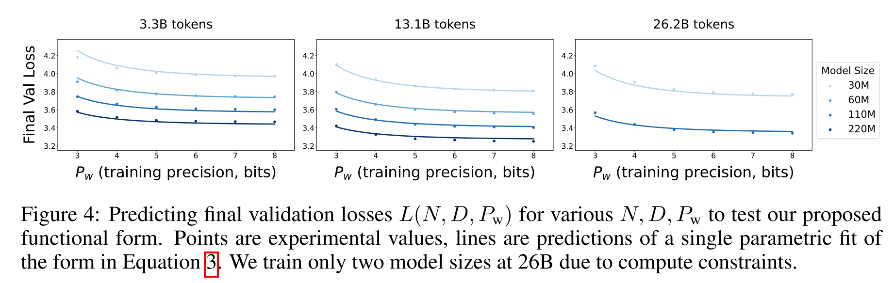
  * 模å‹è¶Šå¤§ï¼Œé‡åŒ–å¯ä»¥è¶Šæ¿€è¿›
  * 
    * æ•æ„Ÿç¨‹åº¦ï¼ša > w > kv cache
* Guidance
  * 4.3.1 IF YOU MUST TRAIN IN LOW PRECISION, INCREASE PARAMETERS BEFORE DATA
    * 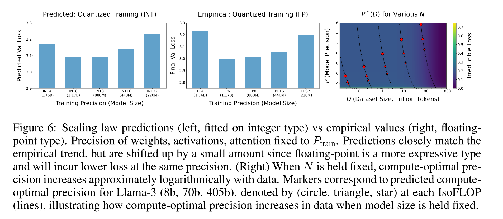
  * 4.3.2 COMPUTE-OPTIMAL PRETRAINING PRECISION IS IN GENERAL INDEPENDENT OF
    COMPUTE
  * 4.3.3 BUT COMPUTE-OPTIMAL PRETRAINING PRECISION CAN INCREASE IN COMPUTE IF
    MODEL SIZE N IS CONSTRAINED
    * 计算å‚考 E.2 COMPUTE-OPTIMALITY CALCULATIONS
* 细节ã€ä¾‹å­ï¼š
  * 对Q + KV cacheé‡åŒ–和仅对KV cacheé‡åŒ–区别ä¸å¤§
  * llama3é‡åŒ–比llama2更难，åŸå› æ˜¯llama3 overtrained
  * per channel会改å˜ç³»æ•°ï¼Œä½†ä¸ä¼šæ”¹å˜scaling law
* Literature Review
  * On the theoretical front, work on scaling laws (Bahri et al., 2024; Bordelon et al., 2024; Lin et al., 2024b) finds that noise to various parts of model or data affects loss in a predictable way. While previous works have explored the scaling behavior of post-training quantization in terms of total model bits (Dettmers & Zettle-moyer, 2023) and knowledge capacity (Allen-Zhu & Li, 2024), we focus instead on data scaling.
  * We note that in general the exact fitted values of all coefficients and exponents can vary drastically
    based on **small implementation differences**: Besiroglu et al. (2024) find different constants when
    attempting to replicate (Hoffmann et al., 2022), Sardana & Frankle (2023) fit coefficients A,B of
    different orders of magnitude.
  * **Overtraining.** In practice, accounting for inference costs means training smaller models for sub-
    stantially longer than Chinchilla-optimal (Sardana & Frankle, 2023; Gadre et al., 2024). For in-
    stance, Llama-3-8B is trained to **D/N ≈ 2000** (Dubey et al., 2024) and the Gemma-2 series up
    to **D/N > 1000** (Team et al., 2024). We refer to such models as “overtrained†in this paper, with
    the token/parameter ratio D/N being a key quantity throughout. Work on inference-time compute
    (Snell et al., 2024; Brown et al., 2024) and on synthetic and multimodal data (Yang et al., 2024; Fan
    et al., 2024; Bauer et al., 2024) suggests future models may be even more overtrained.
* å®éªŒsetting
  * dataset：dolma https://huggingface.co/datasets/allenai/dolma


#### Q-BERT: Hessian Based Ultra Low Precision Quantization of BERT

* **Q-BERT**通过**Hessian 分æ**æ出了一ç§é’ˆå¯¹ BERT 模å‹çš„**超ä½ç²¾åº¦é‡åŒ–方法**，结åˆ**æ··åˆç²¾åº¦ç­–ç•¥**å’Œ**分组é‡åŒ–方案**，在ä¿æŒæ¨¡å‹æ€§èƒ½çš„åŒæ—¶å®ç°äº†**13 å€å‚æ•°å‹ç¼©**å’Œ**4 å€æ¿€æ´» / 嵌入å‹ç¼©**。å®éªŒè¡¨æ˜ï¼Œåœ¨ SST-2ã€MNLIã€CoNLL-03 å’Œ SQuAD 任务中，Q-BERT 的性能æŸå¤±æœ€å¤§ä»…为**2.3%**，显著优äºç›´æ¥é‡åŒ–方法。研究å‘ç°ï¼ŒSQuAD 任务的性能下é™ä¸æ¨¡å‹æœªæ”¶æ•›è‡³å±€éƒ¨æå°ç‚¹æœ‰å…³ï¼Œè€Œåˆ†ç»„é‡åŒ–通过精细化调整é‡åŒ–范围有效缓解了精度æŸå¤±ã€‚
  * 首次å®ç°äº† BERT 模å‹åœ¨**2-bit 精度下的有效å‹ç¼©**，为边缘设备部署æ供了å¯è¡Œæ–¹æ¡ˆã€‚
* **Hessian 矩阵计算ä¸åˆ†æ**
  - 计算方法
    - 使用**矩阵自由幂迭代法**（Matrix-Free Power Iteration）[39] 估计 Hessian 的最大特å¾å€¼ï¼Œæ— éœ€æ˜¾å¼æ„造 Hessian 矩阵。
      - https://arxiv.org/pdf/1802.08241 分æ了Hessian特å¾å€¼å’Œç¥ç»ç½‘络扰动的关系
    - 具体步骤：
      1. éšæœºåˆå§‹åŒ–å‘é‡v，ä¸å½“å‰å±‚å‚数维度一致。
      2. 计算梯度$$g_i = \nabla L$$。
      3. 迭代更新$$v = \frac{Hv}{\|Hv\|_2}$$，其中Hv通过åå‘传播梯度$$g_i^T v$$å¾—åˆ°ï¼ˆå¼ 3.1）。
      4. é‡å¤å¤šæ¬¡è¿­ä»£å，v近似为最大特å¾å€¼å¯¹åº”的特å¾å‘é‡ã€‚
  - 关键å‘ç°
    - BERT å„层 Hessian 特å¾å€¼åˆ†å¸ƒå·®å¼‚显著（图 2），中间层（4-8 层）å‡å€¼å’Œæ–¹å·®æœ€å¤§ï¼Œæœ«å±‚最稳定。
    - SQuAD 任务的 Hessian 存在负特å¾å€¼ï¼ˆå›¾ 3），表æ˜æ¨¡å‹æœªæ”¶æ•›è‡³å±€éƒ¨æå°ç‚¹ã€‚

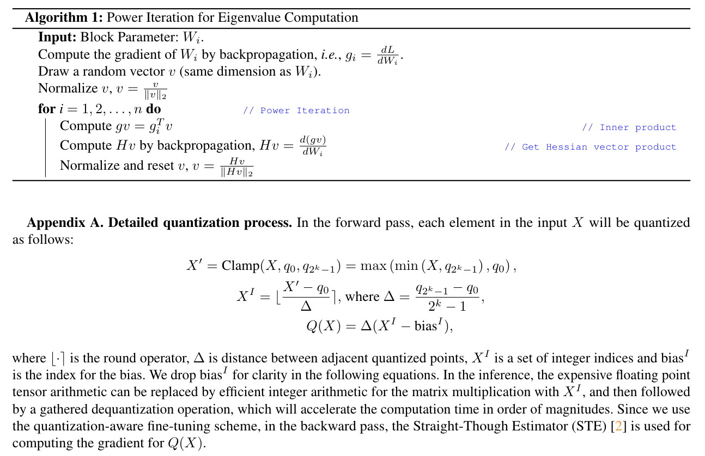

* æ··åˆç²¾åº¦é‡åŒ–ç­–ç•¥

  - æ•æ„Ÿæ€§æŒ‡æ ‡
    - $$\Omega_i = |\text{mean}(\lambda_i)| + \text{std}(\lambda_i)$$，综åˆç‰¹å¾å€¼çš„å‡å€¼å’Œæ–¹å·®ã€‚
    - **示例**：SQuAD 第 7 层$$\lambda_i$$å‡å€¼ä¸º 1.0，但方差高达 61.6，需分é…更高精度。

  - ä½åˆ†é…规则
    - 按$$\Omega_i$$é™åºæ’列å„å±‚ï¼Œå‰ 50% åˆ†é… 3-bit，å 50% åˆ†é… 2-bit（2/3-bit æ··åˆï¼‰ã€‚
    - 针对ä¸åŒä»»åŠ¡è°ƒæ•´åˆ†é…比例（如 SQuAD æ›´ä¿å®ˆï¼‰ã€‚

  - 消èå®éªŒ
    - **åå‘分é…（Q-BERTMP-rev）**：将æ•æ„Ÿå±‚分é…ä½ä½ï¼Œå¯¼è‡´æ€§èƒ½æ˜¾è‘—下é™ï¼ˆMNLI 准确ç‡ä¸‹é™ 2.8%，表 4ï¼‰ï¼ŒéªŒè¯ Hessian 指导的必è¦æ€§ã€‚

* **分组é‡åŒ–技术**

  - 分组策略

    - **层次分组**：将多头自注æ„力层的矩阵按头分组（12 组），æ¯ç»„**å†æŒ‰è¾“出ç¥ç»å…ƒåˆ’分å­ç»„**（æ¯ç»„ 6 个ç¥ç»å…ƒï¼Œå…± 128 组）。
    - **动æ€èŒƒå›´è°ƒæ•´**：æ¯ç»„独立计算é‡åŒ–范围，å‡å°‘跨组数æ®åˆ†å¸ƒå·®å¼‚çš„å½±å“（图 4）。
    - group-wiseé‡åŒ–在 4-bit 下比layer-wiseé‡åŒ–在 SST-2 任务中æå‡ 7% 准确ç‡ï¼ˆè¡¨ 2）。

  - 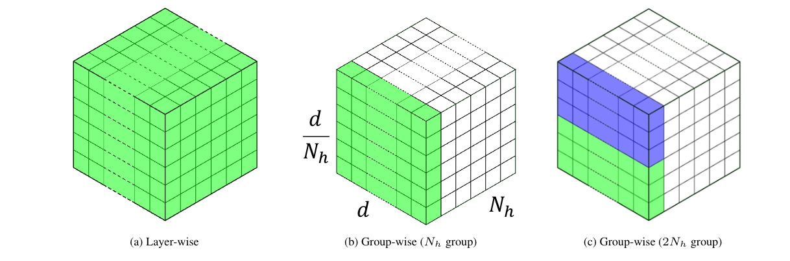

    - d/Nh是æ¯ä¸ªå¤´çš„输出维度

  - | **任务** | **å‹ç¼©æ¯”（å‚数）** | **性能æŸå¤±ï¼ˆF1 / 准确ç‡ï¼‰** | **关键观察**                 |
    | -------- | ------------------ | --------------------------- | ---------------------------- |
    | SST-2    | 13×                | ≤1.1%                       | æ··åˆç²¾åº¦ï¼ˆ2/3-bit）效æœæœ€ä½³  |
    | MNLI     | 13×                | ≤2.3%                       | 中间层对é‡åŒ–æ›´æ•æ„Ÿ           |
    | CoNLL-03 | 13×                | ≤1.1%                       | ä½ç½®åµŒå…¥é‡åŒ–æ•æ„Ÿæ€§é«˜äºè¯åµŒå…¥ |
    | SQuAD    | 13×                | ≤2.3%                       | 模å‹æœªæ”¶æ•›å¯¼è‡´æ€§èƒ½ä¸‹é™æ›´æ˜¾è‘— |

* 算法细节：

  * backward使用Straight-Through Estimators

* 工程å®ç°ç»†èŠ‚

  - Group-wiseçš„LUTå®ç°ï¼šå¢åŠ **查找表（LUT）**æ•°é‡ï¼Œä½†é€šè¿‡å®éªŒå‘ç° 128 组时性能å¢ç›Šé¥±å’Œï¼ˆè¡¨ 2），平衡精度ä¸å¤æ‚度。
  - dequant：先矩阵计算，å†rescale

* 结论：

  - **å‚æ•°å‹ç¼©**：æƒé‡ä» 32-bit é™è‡³ 2/3-bit，å®ç° 13× å‹ç¼©ï¼ˆBERT-Base ä» 410MB→30.5MB）。
  - **激活å‹ç¼©**：激活值é‡åŒ–至 8-bit，å‡å°‘ 4× 内存å ç”¨ã€‚
  - **嵌入å‹ç¼©**：è¯åµŒå…¥ 4-bit + ä½ç½®åµŒå…¥ 8-bit æ··åˆï¼ŒåµŒå…¥å±‚ä» 91MB→11.6MB（8× å‹ç¼©ï¼‰ã€‚

#### Deep Learning Inference in Facebook Data Centers: Characterization, Performance Optimizations and Hardware Implications

1. Introduction

* general requirements for new DL hardware designs:
  * High memory bandwidth and capacity for embeddings 
  * Support for powerful matrix and vector engines 
  * Large on-chip memory for inference with small batches 
  * Support for half-precision floating-point computation

2. Characterization of DL Inference

* Ranking and Recommendation
  * embedding lookup 硬件层é¢åˆ†æ
    * 特点是 low spatial locality，caching 难度高
    * High-bandwidth memory (HBM): 性能高，容é‡ä¸å¤Ÿ
    * Non-volatile memory (NVM): bandwidthä½ ä¸å¯è¡Œã€æˆæœ¬ä½
* CV: 图åƒè¯†åˆ«ã€ç›®æ ‡æ£€æµ‹ã€è§†é¢‘ç†è§£
  * number of operations per weight 高
  * number of operations per activation ä¸é«˜
* NLP: NMT(Neural machine translation) uses seq2seq
  * parallelism: 针对 RNN-based approaches 的并行化方案，比如 stacked conv, transformer

* computation kernels 分æ
  * æ•°æ®ä¸­å¿ƒæˆæœ¬ï¼šfc > embedding lookup > tensor manipulation > conv
  * fc layer 分æ：图内第一层è¿ç®—抽象æˆçŸ©é˜µä¹˜ï¼ˆå½“batch size M 较å°æ—¶ï¼ŒBLAS3 è¶‹è¿‘äº BLAS2，matrix multiplication engine 效æœå‰Šå¼±ï¼‰
    * When an M×K matrix activation matrix is multiplied with a K×N weight matrix, we compute 2MKN operations while reading KN weights, leading to 2M operations per weight.
    * Similarly, the number of operations per activation is 2N.

3. Performance Optimizations

* bf16 sum pooling 是优化方å‘
* intel int8 multiplication with 16-bit accumulation æå‡ä¸€å€åå

* FBGEMM, an algebra engine
  * outlier-aware quantization: $W = W_{main}+W_{outlier}$
    * outlier uses 32-bit accumulation. We find that Woutlier becomes a sparse matrix, often with density less than 0.1%, especially when combined with symmetric quantization [39].

* accuracy challenges
  * Fine-grain Quantization
  * Quantization-aware Training
  * Selective Quantization
  * Outlier-aware Quantization: 更精细ã€æ›´çª„åœ°é€‰å– quantize range
  * Net-aware Quantization: if an operator is only followed by ReLU, we can narrow down the range by excluding negative values

* HPC challenges
  * HPC 习惯 “pack†a block of input matrices into a format friendly for vectorization and cache locality, 但对äºDL领域 tall-skinny matrices，pack ä¼šå¸¦æ¥ overhead
  * DLä¸å®Œå…¨æ˜¯çŸ©é˜µä¹˜ï¼šæ¯”如conv op，转化为矩阵乘需è¦æå‰åš `im2col` æ“作，有 overhead，因此需è¦ä¸“é—¨åš kernel fusion æä¾› conv interface
    * This will also enable algorithmic optimizations such as Winograd or FFT-based convolution as in cuDNN with automatic choice of the best algorithm for given tensor shapes.
    * reduced-precision 计算也需è¦ä¸“门的 fusion，一些库未能满足

```c++
template<typename T_PACK_A, typename T_PACK_B, typename T_C, typename OUT_FUNCTOR>
void gemmPacked(
  // packed inputs
  T_PACK_A& packA, T_PACK_B& packedB,
  // output
  T_C* C, uint32_t ldc,
  // post-processing functor, e.g. Relu
  OUT_FUNCTOR& outProcess);
```

* The packing of matrix A can be specialized and fused with memory bandwidth bound operations such as `im2col`, row-wise sum for asymmetric quantization, or depth-wise convolution.

* whole graph optimization
  * 手动 fusion ä»æœ‰å¿…è¦

4. Application Driven HW Co-design Directions

* Recommendation models not only require a huge memory capacity but also high bandwidth.
* 优化的副作用：比如 avx512 é™é¢‘ï¼Œè§ ã€ŒComputer-Architecture.mdã€
* å¢åŠ  tiers çš„ trade-offs：传输ã€å‹ç¼©è§£å‹å¼€é”€ï¼Œa hypothetical accelerator with 100 TOP/s compute throughput would require a few GB/s PCIe and/or network bandwidth

5. Related Work

* matrix-vector engineã€FPGAã€TPU

* ML benchmark

#### é‡åŒ–和并行训练的关系

> FP8-LM paper

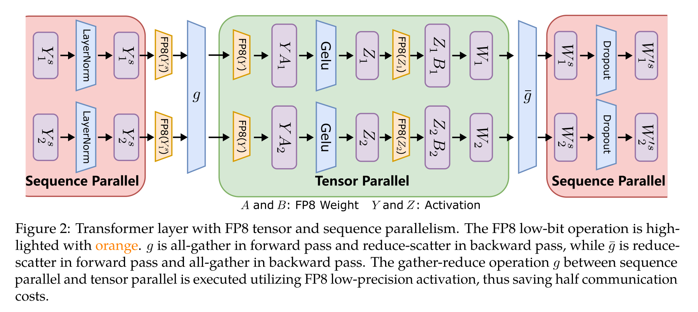

* ZeRO，改å˜äº†distributionæ–¹å¼

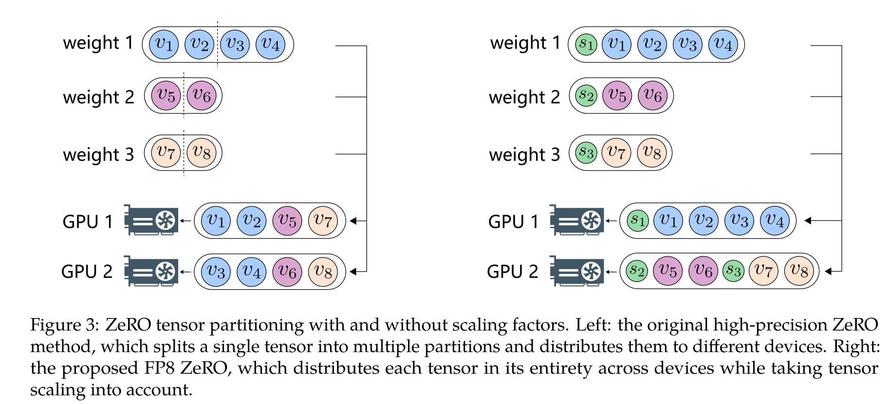


#### Q-Lora


#### 4bit以下

##### BitNet b1.58

* 结论：
  * BitNet b1.58 can match full precision (i.e., FP16) baselines in terms of both perplexity and end-task performance, **starting from a 3B size**, when using the same configuration
* 方案：
  * 1.58-bit weights and INT8 activations.
  * activation采用对称é‡åŒ–


### 算力优化

* 边缘计算

  * [EdgeRec：æ­ç§˜è¾¹ç¼˜è®¡ç®—在淘å®æ¨è系统的é‡è¦å®è·µ](https://developer.aliyun.com/article/742144)
* 弹性近线计算

  * [百度信æ¯æµå’Œæœç´¢ä¸šåŠ¡ä¸­çš„弹性近线计算æ¢ç´¢ä¸åº”用](https://mp.weixin.qq.com/s/53KLAPphK9t4G3q-78S9mg)
  * 弹性近线计算系统主è¦åŒ…括几个å­ç³»ç»Ÿï¼š

    * 触å‘æ§åˆ¶ç³»ç»Ÿï¼šä¸»è¦è´Ÿè´£æ ¹æ®ä¸šåŠ¡å‚数，æ§åˆ¶è¿‘线计算的触å‘，达到削峰填谷的目的。

    * 动æ€ç®—力和动æ€è°ƒå‚系统：它相当äºå¼¹æ€§è¿‘线计算系统的大脑，根æ®é›†ç¾¤çš„资æºæƒ…况，分é…近线计算算力；å†æ ¹æ®ç®—力情况，计算æ§åˆ¶å‚数，ä»è€Œæ§åˆ¶è·Ÿç®—力匹é…的负载。

    * å†å²æ•°æ®ä¸­å¿ƒï¼šä¿å­˜è¿‘线计算å†å²çš„计算记录。å¯ä»¥æ ¹æ®èµ„æºçš„情况，å¤ç”¨å†å²è®¡ç®—结æœï¼Œæ¥è°ƒèŠ‚对算力的使用。

    * 业务近线计算 & æ§åˆ¶ç³»ç»Ÿï¼šè¿™ä¸ªä¸»è¦æ˜¯å’Œä¸šåŠ¡æ¥å…¥è¿‘线计算相关的一些æ¶æ„机制设计，比如说输入输出缓存的读写，计算的拆包 / 并包等等，业务计算ä¸å¤±è´¥ä¿¡å·çš„å馈等等。
      * å®è·µä¸‹æ¥ï¼Œé€šè¿‡é”™å³°è°ƒåº¦ï¼Œé¢„估资æºéœ€æ±‚并æå‰åˆ†é…计算资æºæ˜¯æ¯”较有效的æå‡ç®—力的åŠæ³•ï¼Œå¯ä»¥ç†è§£æ˜¯å¦‚æœåœ¨èµ„æºå·²ç»ç´§å¼ çš„时候，å†è¿›è¡Œè¿‘线计算模å—的调度，新的近线计算模å—的算力消耗有概ç‡æœ¬èº«å°±é€ æˆå±€éƒ¨çƒ­ç‚¹ï¼Œå¯¼è‡´æ‰©å±•èµ„æºè¢«å›æ”¶ï¼Œé€ æˆè°ƒåº¦å¤±è´¥

    * 业务在线æ¥å…¥ï¼šéƒ¨åˆ†ä¸»è¦æ˜¯ä¸šåŠ¡æ¥å…¥è¿‘线计算系统上的一些设计。这å—主è¦è€ƒè™‘的是如何高效的æ¥å…¥ä¸šåŠ¡ï¼Œé¿å…业务æ¥å…¥è¿‡é«˜çš„æ¶æ„人力æˆæœ¬ã€‚
  * 应用场景：

    * Feed 在线 & 近线混åˆè®¡ç®—æ¶æ„：将多个æ¨è算法æœåŠ¡çš„å¬å›ç»“æœè¿›è¡Œç¼“存，å†æ”¾åˆ°è¿‘线系统æ¥è¿›è¡Œç»¼åˆæ‰“分之å生æˆä¸€ä¸ªç”¨æˆ·å¯¹åº”的近线计算候选集，作为一路新的å¬å›ã€‚之å在线请求æ¥äº†ä¹‹å，使用这路新的å¬å›ç»“æœï¼Œè¿›è¡Œè½»é‡çš„在线计算之åå°±å¯ä»¥è¿”å›ç»™ç”¨æˆ·ï¼Œè¿™æ ·å°±æŠŠå¬å›å±‚åˆæ­¥æ’åºæ‰“分的计算规模æå‡äº† 1 个数é‡çº§ã€‚

### Caching

* perceptual hashing for images to cache similar input images.

### 并行训练

#### Literature Review

* DDP (PyTorch DDP Paper)

  * Jayarajan et al. [22] proposed to prioritize gradient synchronizations and **parameter updates based on the forward order** instead of the backward order
    * å¯èƒ½è®©ä¸‹ä¸€æ¬¡è®¡ç®—æå‰

  * ByteScheduler https://i.cs.hku.hk/~cwu/papers/yhpeng-sosp19.pdf
  * the recursive halving and doubling algorithm [30, 37] and the
    bucket algorithm (also known as the ring algorithm) [2]. ã€Accurate Large MiniBatch】
    * While the halving/doubling algorithm con-
      sists of 2log2(p) communication steps, the ring algorithm
      consists of 2(p − 1) steps. This generally makes the halv-
      ing/doubling algorithm faster in latency-limited scenarios
      (i.e., for small buffer sizes and/or large server counts).
    * To support non-power-of-two number of servers, we
      used the binary blocks algorithm [30].

* sparse & dense分离

  * Parallax [24] explored a hybrid structure that combines parameter-server [27] and collective communications.
    * Models are partitioned based on sparsity, where
      dense parameters are communicated using AllReduce and
      sparse tensors are placed to parameter servers. This design
      avoids densifying sparse tensors and communicating empty
      values, which is especially helpful for NLP models.
  
* 模å‹å¹¶è¡Œ
  * TPã€PP是MP的特殊形å¼
  * ZeRO [32] also combines data parallelism with model parallelism, but with minimum model replication to support fast training on su-
    per large models. The authors observed that main memory
    consumption contributors are input data, model parame-
    ters, gradients, optimizer states, and activations. Splitting
    input data is trivial. However, model parameters and ac-
    tivations are compulsory ingredients for backward passes.
    ZeRO addressed this problem by partitioning parameters,
    gradients, and optimizer states on each DDP instance.
    * Parameters are broadcast from the owner DDP instance to all
      others when necessary. Activations are recomputed during
      the backward pass. Compared to PyTorch DDP, ZeRO can
      scale to much larger models as each process only needs to
      maintain a small partition of the model. The high scalabil-
      ity is achieved by sacriï¬cing the training speed, as the ad-
      ditional re-computation, broadcast, and gather overhead
    * ZeRO obtains the same or better memory efficiency than PP without incurring functionality, performance and convergence related restrictions of PP. ã€ZeRO论文】
  

#### 通信æˆæœ¬å¯¹æ¯”

| **阶段**                     | **通信é‡**（å•å¡ communication volume） | **ä¸ DP 对比** | **ä¸ MP 对比**                                 |
| ---------------------------- | --------------------------------------- | -------------- | ---------------------------------------------- |
| 基线 DP                      | 2Ψ（All-Reduce）                        | 1x             | -                                              |
| ZeRO-DP (P<sub>os+g</sub>)   | 2Ψ（Reduce-Scatter+All-Gather）         | 1x             | è¿œä½äº MP 跨节点通信（如 12.5GB/s vs 300GB/s） |
| ZeRO-DP (P<sub>os+g+p</sub>) | 3Ψ（广播 + All-Gather）                 | 1.5x           | ä»ä¼˜äº MP（如 3Ψ vs 12Ψ/ 层）                  |

- 激活分片通信
  - **MP 基线**ï¼šæ¯ Transformer 层 12×seq×hidden 通信（All-Reduce）。
  - **ZeRO-R**：æ¯æ¿€æ´»æ£€æŸ¥ç‚¹ 1×seq×hidden 通信（All-Gather），仅为 MP çš„ 1/12。

#### DP

> PyTorch DP
>
> https://zhuanlan.zhihu.com/p/343951042


- åŸç†ï¼š
  - å’ŒPSé常æ¥è¿‘
- 过程
  - 过程一（图中红色部分）：å„å¡åˆ†åˆ«è®¡ç®—æŸå¤±å’Œæ¢¯åº¦
  - 过程二（图中è“色部分）：所有梯度整åˆåˆ° device[0]
  - 过程三（图中绿色部分）：device[0] 进行å‚数更新，其他å¡æ‹‰å– device[0] çš„å‚数进行更新

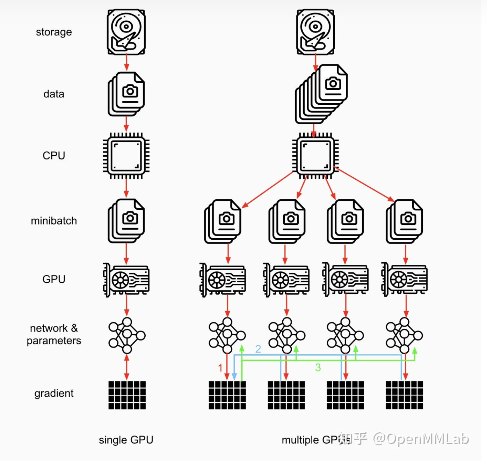


#### Distributed Training and Communication Protocols 通信åŸè¯­

> MLSys CSE 599W Lecture 11

##### Intro

* 互为åå‘：
  * Broadcast <-> Reduce Sum互为åå‘
  * scatter <-> gather
  * All gather <-> all reduce sum 
    * e.g. DDP
* 互相转æ¢ï¼š
  * All reduce = reduce + broadcast
  * All gather = scatter + gather


##### AllReduce

* How to do Synchronization over Network
  * Distributed Gradient Aggregation, Local Update
* The AllReduce operation expects each participating process to provide an equally-sized tensor, collectively applies a given arithmetic operation (**e.g., sum, prod, min, max**) to
  input tensors from all processes, and **returns the same result tensor to each participant**
  * AllReduce = AllGather + LocalReduce
  * with TF: TFOptimizer çš„ ApplyGradient 方法更新梯度，易äºç›´æ¥ä½¿ç”¨TFåŸç”Ÿä¸layerwiseçš„Optimizer


```python
grad = gradient(net, w)
for epoch, data in enumerate(dataset):
  g = net.run(grad, in=data)
  gsum = comm.allreduce(g, op=sum)
  w -= lr * gsum / num_workers 
```


* How to implement AllReduce
  * Tree-Shape
    * Logically form a reduction tree between nodes
    * Aggregate to root then broadcast
    * https://developer.nvidia.com/blog/massively-scale-deep-learning-training-nccl-2-4/
  * Ring
    * Form a logical ring between nodes
    * Streaming aggregation
    * 分为两个步骤：Scatter Reduce和All Gather
      * Scatter Reduce
        * Each node have correctly reduced result of one segment!
      * All Reduce的通信æˆæœ¬ä¸ºï¼š$$T=2(N-1)\frac{K}{N}$$
      * https://andrew.gibiansky.com/blog/machine-learning/baidu-allreduce/
      * https://zhuanlan.zhihu.com/p/72939003
    * 

* AllReduce Libraries
  * MPI offers efficient CPU allreduce
  * dmlc/rabit: fault tolerant variant
  * facebookincubator/gloo
  * Parameter Hub: from UW
  * NCCL: Nvidia’ efficient multiGPU collective
* GPUDirect and RMDA
  * å‰è€…ä¸ç»è¿‡ç½‘å¡
* NCCL: Nvidia’s Efficient Multi-GPU Collective
  * Uses unified GPU direct memory accessing
  * Each GPU launch a working kernel, cooperate with each other to do ring based reduction
  * A single C++ kernel implements intra GPU synchronization and Reduction
* Schedule Allreduce Asynchronously
  * `B = comm.allreduce(A)`
  * `engine.push( lambda: B.data=allreduce(A.data), read=[A.var], mutate=[B.var, comm.var])`

* Discussion: What’s Special about Communication Requirements for Model Parallel Training?
  * Track dependency correctly
  * Resolve resource contention and allocation
  * Some special requirement on channel
    * Allreduce: ordered call

```python
for i in range(num_layers):
  for t in range(num_time_stamp):
    out, state = layer[i].forward(data[i][t], state)
    data[i+1][t] = out.copyto(device[i])
```

#### DDP

##### Intro

* An Introduction to Distributed Deep Learning https://sebarnold.net/dist_blog/

##### PyTorch Distributed: Experiences on Accelerating Data Parallel Training

* Intro

  * bucketing gradients, overlapping compu-
    tation with communication, and skipping gradient synchro-
    nization

  * è¦ç‚¹ï¼šMathematical equivalenceã€Non-intrusive and interceptive APIã€High performance

* parameter averaging 技术的问题：

  * ä¸ç­‰ä»·ï¼Œå°¤å…¶when the optimizer relies on past local gradients val-
    ues (e.g., momentum)
  * causing conflicting gradient descent directions
  * orchestrates computation (i.e., backward pass) and communication (i.e.,
    computing average) into **non-overlapping phases**,

* 

* **bucketing gradients**

  * motivated by the observation that collective communications are more efficient on large tensors
  * 
  * å®éªŒinsight：bucket num比较大的时候，ä»16 gpu scaling到32gpu，通信速度衰å‡å°‘

* **overlapping computation with communication**

  * DDP registers one autograd hook for each gradient accumulator. The hook fires after its corresponding accumulator updating the gradients, and will inspect the bucket it pertains. If hooks of all gradients in the same buckets have fired, the last hook will trigger an asynchronous AllReduce on that bucket
  * 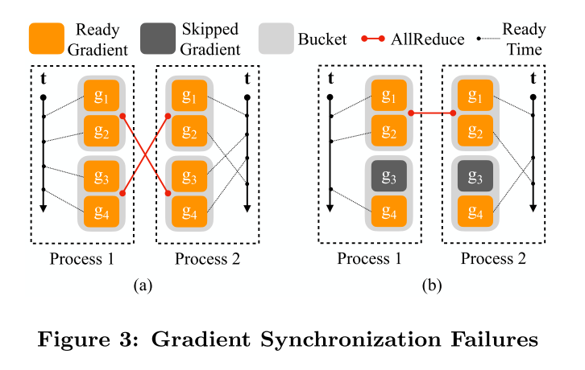
  * using the reverse order of model.parameters() as the bucketing order
  * 解决执行subgraph部分梯度ä¸å­˜åœ¨çš„问题：
    * DDP traverses the autograd graph from the output
      tensors of the forward pass to ï¬nd all participating param-
      eters.
    * proactively marking them ready at the end of the forward pass

* **skipping gradient synchronization**

  * 问题：上é¢çš„algorithm would mark unused pa-
    rameters as ready at the end of every forward pass, while
    those unused parameters in one iteration still could partici-
    pate in subsequent iterations.
  * no_sync

* 结论：

  * near-linear scalability using 256 GPUs.
  * communication is the dominant
    training latency contributor, and its impact increases with
    model sizes; 
    * 
  * bucket sizes considerably affect communica-
    tion efficiency, which could lead to more than 2X speedup if
    conï¬gured properly; 
  * skipping synchronizations appropri-
    ately would signiï¬cantly reduce amortized communication
    overhead without noticeably degrading convergence speed.
  *  round robin process groups，å¡å¤š+模å‹å¤æ‚，3-5 groups比较好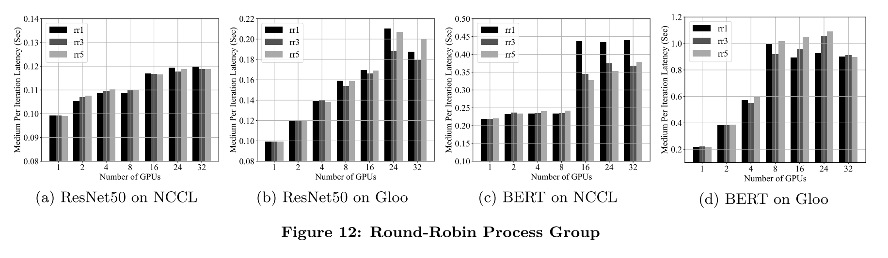

* 讨论：
  * keep the DDP group within the same machine，å•æœºNå¡ï¼Œæ•ˆç‡æœ€é«˜
  * æå‡æ–¹å‘：
    * Gradient Order Prediction
    * Layer Dropping
    * Gradient Compression

#### 大 Batch 训练

分布å¼SGD在算法方é¢çš„挑战

* throughput ~ GPU num
  * 深度学习的大规模训练通常以线性å¢åŠ çš„ç†æƒ³æƒ…况为基准，Horovodå’ŒNCCL库在ä¿æŒé«˜ååé‡æ–¹é¢åšå¾—很好，但是他们的性能ä¸æ‰€ä½¿ç”¨çš„硬件有ç€åƒä¸ä¸‡ç¼•çš„è”系。高带宽和ä½å»¶è¿Ÿçš„è¦æ±‚导致了NVLink互è¿çš„å¼€å‘，它是本课程所使用的æœåŠ¡å™¨ç”¨æ¥äº’è¿ä¸€ä¸ªèŠ‚点上的多个GPU的方法。 NVIDIA DGX-2通过NVSwitch将这ç§äº’è¿åˆæ¨è¿›ä¸€æ­¥ï¼Œè¯¥äº’è¿ç»“æ„å¯ä»¥300GB/s的峰值åŒå‘带宽è¿æ¥å¤šè¾¾16个GPU。

* critical batch size ~ gradient noise scale (openai)
* 对精度的影å“：朴素的方法（比如ä¸åŠ data augmentation）会é™ä½ç²¾åº¦
  * ImageNet training in minutes. CoRR
  * [Train longer, generalize better: closing the generalization gap in large batch training of neural networks](https://arxiv.org/abs/1705.08741)
  * [On large-batch training for deep learning: Generalization gap and sharp minima](https://arxiv.org/abs/1609.04836)
  * [Visualizing the Loss Landscape of Neural Nets](https://arxiv.org/abs/1712.09913)

* 应对策略

  * æ高学习ç‡ï¼šOne weird trick for parallelizing convolutional neural networks
  * 早期学习ç‡çƒ­èº«ï¼š Accurate, Large Minibatch SGD: Training ImageNet in 1 Hour.
* Batch Normalization
  * BN通过最å°åŒ–æ¯ä¸ªå±‚的输入分布中的漂移æ¥æ”¹å–„学习过程
    * 缓解了深层网络中“梯度弥散â€çš„问题（Internal Covariate Shift）
  * æ高学习速度并å‡å°‘使用 Dropout 的需求
  * 想法是针对æ¯æ‰¹æ•°æ®å¯¹**所有层**的输入 进行规一化（这比简å•åœ°åªå¯¹è¾“入数æ®é›†è¿›è¡Œè§„一化更为å¤æ‚）
    * 为了ä¿æŒæ¨¡å‹çš„表达能力，引入å¯å­¦ä¹ çš„å‚数，缩放因å­å’Œå¹³ç§»å› å­
* Ghost BN
  * 计算更å°æ‰¹é‡çš„统计数æ®ï¼ˆâ€œghost 批é‡â€ï¼‰
    * 引入其他噪声
  * 按 GPU é€ä¸ªå•ç‹¬æ‰§è¡Œæ‰¹é‡å½’一化，解决åŒæ­¥ BN 通信开销问题
* 将噪声添加至梯度
  * ç¡®ä¿æƒé‡æ›´æ–°çš„å方差éšç€æ‰¹é‡å¤§å°çš„å˜åŠ¨ä¿æŒä¸å˜ 
  * ä¸ä¼šæ”¹å˜æƒé‡æ›´æ–°çš„å¹³å‡å€¼ 
  * $$\hat{g}=\frac{1}{M}\sum^{N}_{n\in B}g_n z_n$$
* 更长的高学习ç‡è®­ç»ƒæ—¶é—´
* å¢åŠ æ‰¹é‡å¤§å°ä»£æ›¿å­¦ä¹ ç‡è¡°å‡
* LARS – 按层自适应学习ç‡è°ƒæ•´
  *  [LARS论文](https://arxiv.org/abs/1904.00962): 大LR -> LR warm-up -> LARS，åªæ˜¯èƒ½ä¿è¯å¤§batch训练能训，关äºæ•ˆæœé—®é¢˜ï¼Œä½œè€…认为“increasing the batch does not give much additional gradient information comparing to smaller batches.â€
  *  [LARC](https://github.com/NVIDIA/apex/blob/master/apex/parallel/LARC.py): 带梯度è£å‰ªçš„分层自适应学习ç‡ï¼Œä»¥å…·æœ‰åŠ¨åŠ›çš„SGD作为基础优化器
  *  [LAMB](https://arxiv.org/abs/1904.00962): 分层自适应学习ç‡ï¼Œä»¥ Adam 作为基础优化器，在BERT等语言模å‹ä¸Šæ¯”LARCæ›´æˆåŠŸ
  *  [NovoGrad](https://arxiv.org/abs/1905.11286): 按层计算的移动平å‡å€¼ï¼Œåœ¨å‡ ä¸ªä¸åŒçš„领域也有ä¸é”™çš„表ç°

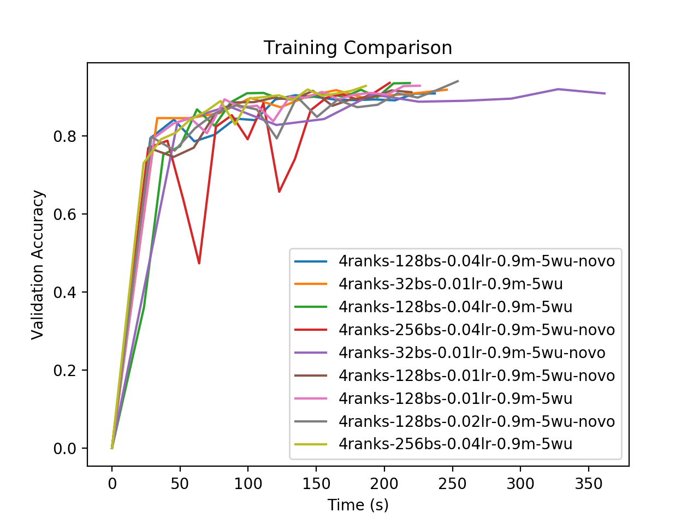

#### ZeRO-DPã€ZeRO-R

> * trivial: Reducescatter梯度 + allgather梯度 + apply全部梯度
>
> - Zero1: Reducescatter梯度 + apply部分梯度 + AllGatherå‚æ•°
> - Zero2: åå‘传播中ReduceScatter梯度 + apply部分梯度 + AllGatherå‚æ•°
>   - zero2相比zero1，显存和速度都有优势：通信计算并行，并一定程度å‡å°å­˜å‚¨grad所需的显存
> - Zero3: å‰å‘/åå‘中AllGatherå‚æ•° + åå‘传播中ReduceScatter梯度 + apply部分梯度

* Intro
  * **ZeRO**通过**三阶段内存优化**（优化器状æ€åˆ†åŒºã€æ¢¯åº¦åˆ†åŒºã€å‚数分区），显著æå‡æ·±åº¦å­¦ä¹ æ¨¡å‹è®­ç»ƒçš„内存效ç‡ï¼Œæ”¯æŒåœ¨ç°æœ‰ç¡¬ä»¶ä¸Šè®­ç»ƒè¶…大规模模å‹ï¼ˆå¦‚万亿å‚数级别）。其**ZeRO-DP**消除了数æ®å¹¶è¡Œä¸­çš„冗余内存，结åˆ**ZeRO-R**优化激活内存和ç¢ç‰‡ç®¡ç†ï¼Œå®ç°äº†**8 å€æ¨¡å‹å°ºå¯¸å¢é•¿**å’Œ**10 å€è®­ç»ƒé€Ÿåº¦æå‡**，并æˆåŠŸè®­ç»ƒå‡ºä¸–界最大的 17B å‚æ•°è¯­è¨€æ¨¡å‹ Turing-NLG，åŒæ—¶ä¿æŒæ˜“用性。

  * Zero3把å‚数也切了，为啥还说他是一个DP（数æ®å¹¶è¡Œï¼‰æ¡†æ¶ï¼Œè€Œä¸æ˜¯æ¨¡å‹å¹¶è¡Œçš„框æ¶ã€‚是因为，区分数æ®å¹¶è¡Œå’Œæ¨¡å‹å¹¶è¡Œçš„本质，ä¸æ˜¯æ¨¡å‹å‚数有没有切开存储。而是：
    - 输入数æ®æœ‰æ²¡æœ‰åˆ‡åˆ†å¼€å‘é€åˆ°ä¸åŒçš„计算节点，**如æœæ˜¯æ•°æ®å¹¶è¡Œï¼Œè¾“入就è¦åˆ‡å¼€ï¼Œå¦‚æœæ˜¯æ¨¡å‹å¹¶è¡Œï¼Œè¾“入就ä¸éœ€è¦åˆ‡å¼€ã€‚**


* **研究背景ä¸æŒ‘战**

  - **模å‹è§„模å¢é•¿**：自然语言处ç†ï¼ˆNLP）领域模å‹ä» BERT-large（0.3B）å‘展到 T5（11B），但万亿å‚数模å‹è®­ç»ƒé¢ä¸´**内存瓶颈**。

  - ç°æœ‰æ–¹æ³•å±€é™æ€§
    - **æ•°æ®å¹¶è¡Œï¼ˆDP）**：内存冗余，无法扩展。
    - **模å‹å¹¶è¡Œï¼ˆMP）**：通信开销大，跨节点效ç‡ä½ï¼ˆå¦‚ 40B 模å‹è·¨èŠ‚点效ç‡ä»… 5% 硬件峰值）。

* 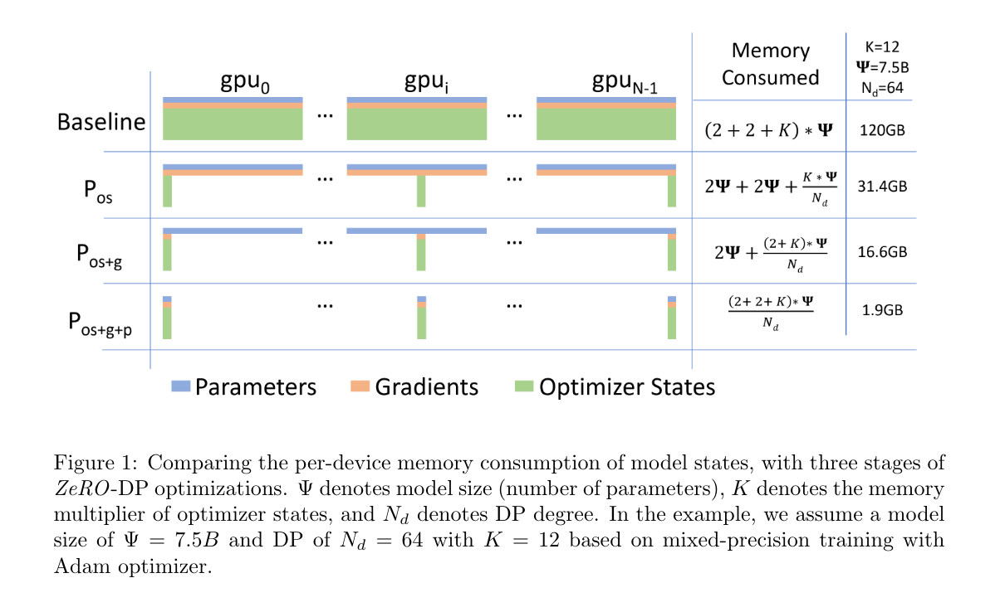
  * K=12，åŸå› æ˜¯mixed precision trainingè¦ä¿ç•™fp32 copy

* Zero-DP

  * osã€g分区
  * å‚æ•°p分区：
    * å‰å‘传播时，按层顺åºå¹¿æ’­å‚数分片。
    * åå‘ä¼ æ’­å，All-Gather å‚数分片。

* **ZeRO-R（激活ä¸ç¢ç‰‡ä¼˜åŒ–）**

  - **激活分区（Pa）**：结åˆæ¿€æ´»æ£€æŸ¥ç‚¹ï¼Œé€šè¿‡ All-Gather 按需é‡æ„，内存节çœä¸ MP 度数æˆæ­£æ¯”。
    - **案例**：100B æ¨¡å‹ + 16-way MPï¼Œæ¿€æ´»å†…å­˜ä» 33GB/GPU é™è‡³ 2GB/GPU。

  - **CPU å¸è½½ï¼ˆPa+cpu）**：æ端情况下将激活转移至 CPU，内存æ¥è¿‘零。
    - 适用äºå¼€å¯Paåä»ç„¶æ˜¯é€šä¿¡ç“¶é¢ˆçš„场景

  - **内存ç¢ç‰‡ç®¡ç†ï¼ˆMD）**：预分é…è¿ç»­å†…å­˜å—，å‡å°‘分é…失败。
    - interleaving of short term and long term memory causes memory fragmentation

* **å®éªŒæ•°æ®ä¸é…ç½®**

  - 硬件é…ç½®
    - 400 NVIDIA V100（32GB），25 DGX-2 节点，800 Gbps Infiniband。

  - 模å‹é…置（示例）

    | **模å‹å¤§å°** | **层数** | **éšè—维度** | **注æ„力头** | **批大å°** | **总批大å°** |
    | ------------ | -------- | ------------ | ------------ | ---------- | ------------ |
    | 170B         | 212      | 8192         | 64           | 12         | 300          |
    | 60B          | 75       | 8192         | 32           | 64         | 1600         |

  - 性能结æœ
    - **ååé‡**：15 PetaFlops（30% 硬件峰值）。
    - **扩展性**：400 GPU vs 64 GPU，速度æå‡ 2.3 å€ï¼ˆè¶…线性）

- 当å‰é™åˆ¶
  - **å‚数分区阶段**：通信é‡å¢åŠ  50%，å¯èƒ½æˆä¸ºè¶…大规模集群瓶颈。
  - **CPU å¸è½½å¼€é”€**：激活传输延迟å¯èƒ½æŠµæ¶ˆæ‰¹å¤§å°å¢åŠ çš„收益。
- 未æ¥è®¡åˆ’
  - **万亿å‚数支æŒ**：å®ç° ZeRO-DP 全三阶段（P<sub>os+g+p</sub>ï¼‰ï¼Œç»“åˆ MP（如 16-way）和 DP（64-way）。
  - **动æ€ä¼˜åŒ–ç­–ç•¥**：根æ®ç¡¬ä»¶æ¡ä»¶è‡ªåŠ¨é€‰æ‹© Pa/cpu 模å¼ã€‚
  - **异æ„支æŒ**：扩展至 CPU/TPU 集群。

#### FSDP

> https://pytorch.org/tutorials/intermediate/FSDP_tutorial.html

#### DP + TP + PP，并行训练组åˆ

* DP + TP + PP
  * 把机器分æˆN组，组之间用DP
  * 一组机器有Må°æœºå™¨ï¼Œä¸åŒå°ä¹‹é—´ç”¨PP
  * 一å°æœºå™¨æœ‰8å¼ å¡ï¼Œä¸åŒå¡ä¹‹é—´ç”¨TP
* https://huggingface.co/docs/transformers/v4.15.0/en/parallelism

#### PP

* **PP splits a model horizontally across layers** running each partition on a different device and **use micro-batching to hide the pipeline bubble** [10, 11]. Model functionalities such as tied-weights and batch-normalization are difficult to implement due to horizontal splitting and micro-batching, respectively. 
* G-pipe
  * æ€è·¯ï¼šå¤§batch拆æˆè‹¥å¹²ä¸ªå°batch，这样æ¯ä¸ªèŠ‚点å¯ä»¥pipeline执行多个å°batch
  * partitions both model parameters and total activations but **requires a batch size proportional to number of pipeline partitions to hide the pipeline bubble**. **The large batch size can affect the convergence rate, while also requiring significant memory to store activations.** 
* PipeDream
  * æ€è·¯ï¼šæ¯ä¸ªèŠ‚点交替进行forwardã€backward，尽早å¯åŠ¨backwardçš„æµæ°´çº¿
  * keeps multiple copies of stale parameters to hide the pipeline bubble without increasing the batch size significantly, making it less memory efficient. 
  * the implementation is not equivalent to the standard DL training and has implications on training convergence.
  * 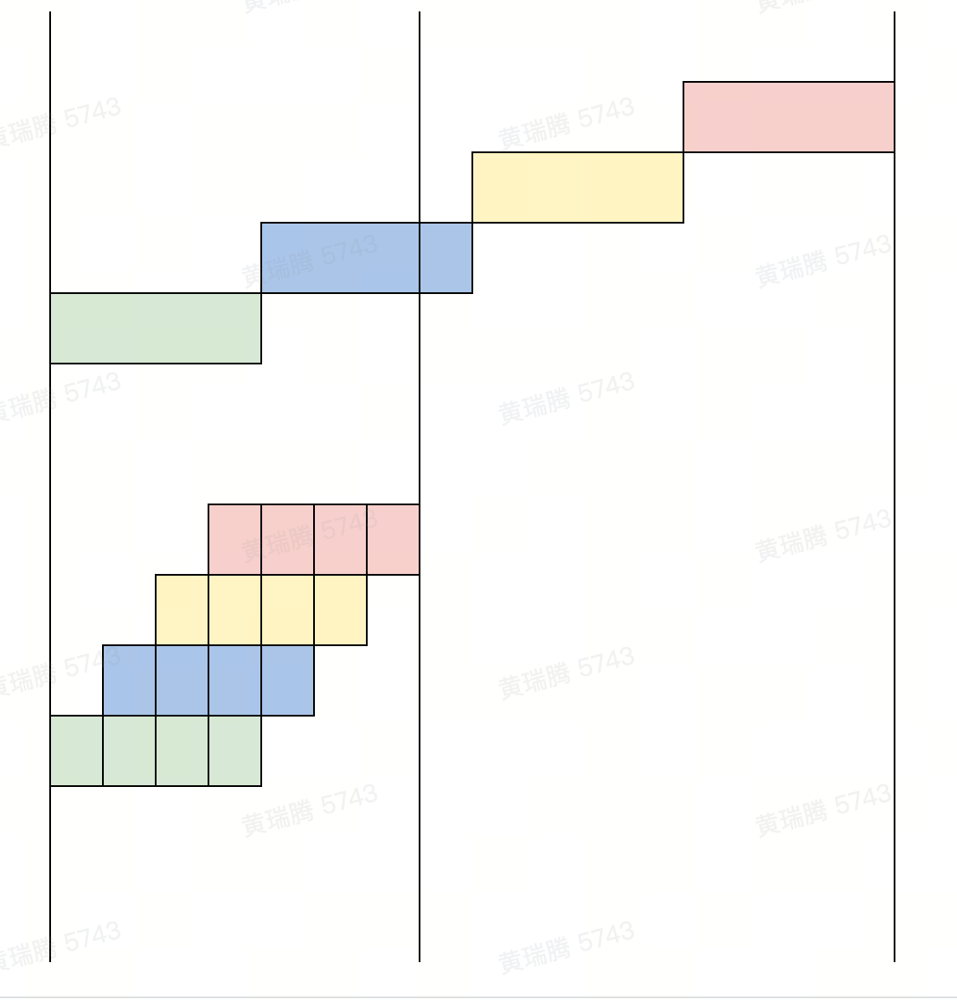

* DualPipe
  * compared with ZB1P (Qi et al., 2023b) and 1F1B (Harlap et al., 2018), DualPipe significantly reduces the pipeline bubbles
    while only increasing the peak activation memory by 1
    ğ‘ƒğ‘ƒ times. Although DualPipe requires
    keeping two copies of the model parameters, this does not significantly increase the memory
    consumption since we use a large EP size during training. Compared with Chimera (Li and
    Hoefler, 2021), DualPipe only requires that the pipeline stages and micro-batches be divisible by
    2, without requiring micro-batches to be divisible by pipeline stages. In addition, for DualPipe,
    neither the bubbles nor activation memory will increase as the number of micro-batches grows.
  * 
  * 

#### SP (sequence parallelism)

[2021] Colossal AI æ出了Sequence Parallelsim，论文 https://arxiv.org/pdf/2105.13120

[2022] Megatron-LM 在åºåˆ—维度拆分 Dropout å’Œ LayerNorm，论文 https://arxiv.org/abs/2205.05198

[2023] DeepSpeed Ulysses，论文 https://arxiv.org/abs/2309.14509

[2023] UCB Ring Attention，论文 https://arxiv.org/abs/2310.01889

[2024] Megatron-LM æ出了 [Context Parallelism](https://docs.nvidia.com/megatron-core/developer-guide/latest/api-guide/context_parallel.html)。

1/3/4/5是ä»è¾“入层开始在拆分åºåˆ—，2 则是在中间层


#### TP

* 动机：PP下，å•å¡æ— æ³•å®¹çº³æ¨¡å‹ä¸­æ˜¾å­˜å ç”¨æœ€å¤§çš„层
* 本质：拆分W
  * 按列拆分W：
    * 最åall gather
  * 按行拆分W：
    * Xåªéœ€è¦éƒ¨åˆ†
    * 最åall reduce
* å±€é™æ€§ï¼šä¼ è¾“大é‡æ•°æ®ï¼Œé€šå¸¸åªåœ¨å•æœºå¤šå¡å†…çš„nvlink使用


### Parameter Server

#### Intro

* PS Interface for Data Parallel Training
  * Synchronous: bulk synchronous parallel (BSP)
  * Asynchronous
    * gradient staleness
    * å¯è®¾ç½®â€œæœ€å¤§å»¶è¿Ÿâ€ï¼ŒN轮迭代内，模å‹å‚数必须更新一次
  * Integrate Schedule with Networking using Events
    * Use the callback to notify engine that data receive is finished

```python
grad = gradient(net, w)
for epoch, data in enumerate(dataset):
  g = net.run(grad, in=data)
  ps.push(weight_index, g)
  w = ps.pull(weight_index)
```

* The Cost of PS Model: All to All Pattern
  * Each worker talks to all servers
  * Shard the parameters over different servers

#### Scaling distributed machine learning with the parameter server, OSDI 2014

PSæ¶æ„的优势主è¦è¿˜æ˜¯é«˜å¯ç”¨(system efficiency)

* Intro
  * distributed subgradient descent


* 3.6 User-defined Filters

  * signifi-cantly modified filter

  * KKT(è§5.1)：特å¾é‡è¦æ€§ç­›é€‰


* 4.2 Messages

  * key-caching and value-compression can be used jointly.

  * key-cache让senderåªéœ€è¦ä¼ key listsçš„hash

  * 用snappyå‹ç¼© zero value


* 4.3 Consistent Hashing
  * 一致性hashå’Œ key-range 的概念紧密相è¿
  * hash空间等分 nm 个范围
  * 论文 Chord: A scalable peer-to-peer lookup protocol for Internet applications

* 4.5 Server Management

  * 计算节点分为server node和worker node

  * serverå…±åŒç»´æŒå…¨å±€å…±äº«çš„模å‹å‚æ•°

  * workersä¿ç•™ä¸€éƒ¨åˆ†çš„训练数æ®ï¼Œå¹¶ä¸”执行计算

  * workeråªå’Œserver有通信，互相之间没有通信


* examples
  * CountMin Sketch Algo æœ‰ç‚¹åƒ bloom filter


* PSè¿ç»´ï¼š

  * expectation - current_situation = operations

  * æœåŠ¡å‘ç°ã€æ•°æ®å‘ç°


* 性能优化：

  * åŒbuffer + RCU，读ä¸è¢«é”阻ç¢

  * 简化版读写é”，优化系统æ€å¼€é”€

#### HugeCTR SoK

>  https://medium.com/@kuwarkapur/guide-to-embeddings-in-recommender-systems-with-hugectr-fc4f413bd624

* åŸºäº Model Parallel
* slot的概念
  * To reduce the overhead when looking up multiple embedding tables with identical embedding vector sizes, the embedding combines them as one huge embedding table. Each sub-embedding table is called a slot, which is also known as a feature field. 

* Sparse Emb Layer
  * 类似 **tf.nn.embedding_lookup_sparse** ，å¢åŠ äº†MP的设计
  * The distributed sparse embedding scatters keys across GPUs by computing `gpu_id = key % number_of_gpus`

### 显存优化

|              | å•å¡              | å¤šå¡      |
| ------------ | ----------------- | --------- |
| é™ä½é™æ€æ˜¾å­˜ | offload           | ZeRO/FSDP |
| é™ä½åŠ¨æ€æ˜¾å­˜ | act recomputation | 模å‹å¹¶è¡Œ  |

* ZeRO
* 优化activation recomputation：https://arxiv.org/pdf/2205.05198
  * é—´éš”ç€å­˜ï¼Œæ¯”如存2ã€5ã€8层，选择åˆé€‚的层（激活值大ã€è®¡ç®—简å•ï¼‰åšé‡è®¡ç®—
  * deepseek-v3：Recomputation of RMSNorm and MLA Up-Projection.
* cpu offload
  * deepseek-v3：Exponential Moving Average in CPU.
* 模å‹å¹¶è¡Œ
  * PP 时的显存优化：
    * deepseek-v3：**Shared Embedding and Output Head for Multi-Token Prediction**. With the DualPipe strategy, we deploy the shallowest layers (including the embedding layer) and deepest layers (including the output head) of the model on the same PP rank. This arrangement enables the physical sharing of parameters and gradients, of the shared embedding and output head, between the MTP module and the main model. This physical sharing mechanism further enhances our memory efficiency.

### 通信优化

* allreduce，å‚考「并行训练ã€
* grad acc
* leverage the IBGDA (NVIDIA, 2022) technology to further minimize latency and enhance communication efficiency. ã€deepseek-v3】
* customize **efficient cross-node all-to-all communication kernels (including dispatching and combining)** to conserve the number of SMs dedicated to communication.ã€deepseek-v3】
  * In detail, we employ the **warp specialization technique** (Bauer et al., 2014) and partition
    20 SMs into 10 communication channels. 
  * During the dispatching process, (1) IB sending, (2)
    IB-to-NVLink forwarding, and (3) NVLink receiving are handled by respective warps. The
    number of warps allocated to each communication task is dynamically adjusted according to the
    actual workload across all SMs. Similarly, during the combining process, (1) NVLink sending,
    (2) NVLink-to-IB forwarding and accumulation, and (3) IB receiving and accumulation are also
    handled by dynamically adjusted warps.
  * In addition, both dispatching and combining kernels overlap with the computation stream, so we also consider their impact on other SM computation kernels. Specifically, we employ customized PTX (Parallel Thread Execution) instructions and auto-tune the communication chunk size, which significantly reduces the use of the L2 cache and the interference to other SMs.


### è®­ç»ƒæ¡†æ¶ Intro

* æµç¨‹ï¼š
  * æ•°æ®åŠ è½½
    * prefetch
  * æ•°æ®é¢„处ç†
    * 离线
  * forward
  * backward
  * （节点通信）
  * optimize

* spark MLlib
  * å‚考「深度学习æ¨è系统ã€6.2.1
  * åˆ†å¸ƒå¼ + DAG
  * 内部并行ã€è¾¹ç•Œæ¶ˆè€—资æºshuffle/reduce
  * 缺点：
    * å‚数全局广播
    * åŒæ­¥é˜»æ–­å¼çš„梯度下é™
    * ä¸æ”¯æŒå¤æ‚DL网络

* tf
* pytorch


### PyTorch: An Imperative Style, High-Performance Deep Learning Library

> å‚考「pytorch.mdã€ã€ã€Œsnippetsã€

* PyTorch builds on these trends by providing an **array-based programming model accelerated by GPUs**
  **and differentiable via automatic differentiation integrated in the Python ecosystem.**
* PyTorch foregoes the potential beneï¬ts of a graph-metaprogramming based approach to preserve the imperative programming model of Python

```Python
class LinearLayer(Module):
  def __init__(self, in_sz, out_sz):
    super().__init__()
    t1 = torch.randn(in_sz, out_sz)
    self.w = nn.Parameter(t1)
    t2 = torch.randn(out_sz)
    self.b = nn.Parameter(t2)
  def forward(self, activations):
    t = torch.mm(activations, self.w)
    return t + self.b
  
class FullBasicModel(nn.Module):
  def __init__(self):
    super().__init__()
    self.conv = nn.Conv2d(1, 128, 3)
    self.fc = LinearLayer(128, 10)
  def forward(self, x):
    t1 = self.conv(x)
    t2 = nn.functional.relu(t1)
    t3 = self.fc(t1)
    return nn.functional.softmax(t3)
```

* autograd
  * PyTorch uses the operator overloading approach, which builds up a representation of the computed function every
    time it is executed.
  * In its current implementation [30], PyTorch performs **reverse-mode automatic differentiation**, which computes the gradient of a scalar output with respect to a multivariate input.
    Differentiating functions with more outputs than inputs is more efï¬ciently executed using forward-mode automatic differentiation, but this use case is less common for machine learning applications.
    PyTorch can be easily extended to perform forward-mode differentiation using array-level dual
    numbers [31, 32].

* 性能优化：

  * An efï¬cient C++ core
    * Python bindings are generated using YAML meta-data ï¬les.
    * 比如å¯ä»¥ç”¨torchscriptå•ç‹¬è·‘ https://pytorch.org/docs/stable/jit.html
  * Separate control and data flow
    * PyTorch is designed to execute operators asynchronously on GPU by leveraging the CUDA stream mechanism [38] to queue CUDA kernel invocations to the GPUs hardware FIFO
  * Custom caching tensor allocator
    * cache cuda memory
      * rounds up allocations to multiples of 512 bytes to avoid fragmentation issues.
    * One-pool-per-stream Design：
      * Moreover, it maintains a distinct pool of memory for every CUDA stream (work queue).
      * åªè¦æ–°çš„内存分é…æ“作ä¸ä¹‹å‰é‡Šæ”¾çš„内存区域使用在åŒä¸€ä¸ªæµä¸­ï¼Œå†…存分é…器就å¯ä»¥ç«‹å³é‡æ–°åˆ†é…è¿™å—å·²ç»åœ¨ CPU 端释放的内存
        * 利用CPU释放更快的特点ã€æµçš„åºåˆ—化执行特性
      * limit：the allocations end up fragmented per stream
        * 很少用多æµï¼ŒData loading and distributed computing utilities are exceptions，精心å®ç°
  * multiprocessing：
    * PyTorch extends the Python multiprocessing module into torch.multiprocessing, which is a drop-in replacement for the built in package and automatically moves the data of tensors sent to other processes to shared memory instead of sending it over the communication channel.
    * Another unique feature of this system is that it transparently handles sharing of CUDA tensors, making it easy to implement techniques like Hogwild [42].
    
  * ref count
    * PyTorch tracks both references internal to the libtorch library and external references made by
    users in their Python code by integrating with Python’s own reference counting mechanism

### Go+Torch

https://github.com/wangkuiyi/gotorch

* Q: TensorFlow为什么需è¦å¼•å…¥å›¾è¿™ä¸ªæ¦‚念？

  * A1: backward自动求导，需è¦å®šä¹‰å‰å‘çš„æ•°æ®ç»“æ„
  * A2: python执行速度慢，决定执行效ç‡çš„是图的解释器。图是python代ç çš„å¦ä¸€ç§è¡¨ç¤ºå½¢å¼ï¼Œå¼€å§‹åŒ…括å‰å‘计算过程，通过调用TensorFlow API，加入其它op包括åå‘计算过程和模å‹æ›´æ–°è¿‡ç¨‹ã€‚æ„造图本质上是在编译。

  * [TFRT](https://github.com/tensorflow/runtime)


* 调用libtorch内部的native function类比tfçš„op，但native function是函数，而ä¸æ˜¯ä¸€ä¸ªclass，æ¯ä¸€ä¸ªfunctionå¯ä»¥ç”¨HLO（一ç§å¤è€çš„适用äºæ•°å€¼è®¡ç®—的语言）写一é。gotorchè°ƒlibtorchè°ƒpytorch XLA里的HLO程åºï¼Œç¿»è¯‘æˆç‰¹å®šè®¾å¤‡ä¼˜åŒ–的代ç 

  * native function有YAMLæ述，å¯è‡ªåŠ¨ç”ŸæˆGo Wrapper

  * torchscripts：用到的python语法的å­é›† => python高层apiå¯ç¿»è¯‘æˆtorchscriptså†ç¿»è¯‘


* å¦‚æœ Go+Torch 在未æ¥ä¸€å¹´é‡Œå­•è‚²æˆç†Ÿï¼Œæœ‰æœ›ä¼˜åŒ–以下核心应用场景:
  * 统一训练和预测系统(ç›®å‰è®­ç»ƒç”¨ Python 写，预测用 C++)
  * 统一云和端系统(ç›®å‰äº‘上用 TensorFlow，端上比如 xNN 调用 TensorFlow Lite)
  * 统一训练和预测时的数æ®å¤„ç†æµç¨‹(ç›®å‰éœ€è¦ç”¨ Pythonå’ŒC++分别åšä¸¤å¥—，开销大，而且容易出错)
  * 统一æœç´¢ã€æ¨èã€å¹¿å‘Šã€é‡‘è核心ã€ç§»åŠ¨æ™ºèƒ½å’Œç«¯æ™ºèƒ½ã€æ— äººé©¾é©¶ç­‰å¤šä¸ªé¢†åŸŸçš„基础æ¶æ„
  * 能支æŒæ–°çš„机器学习模å¼â€”—online learningã€GANã€reinforcement learningã€imitation learning等。

### OneFlow: 大规模分布å¼æ·±åº¦å­¦ä¹ æ¡†æ¶

æ•°æ®å¹¶è¡Œï¼šallreduce + PS

模å‹å¹¶è¡Œï¼šå‚数如何划分？å¤æ‚的通信模å¼


横å‘拓展：片间高速互è”，e.g. TPU

纵å‘拓展：å•ä¸ªèŠ¯ç‰‡ä»é€šç”¨åˆ°ä¸“用


é™æ€è°ƒåº¦ä¸æµå¼æ‰§è¡Œç³»ç»Ÿ


OneFlowæ¶æ„

* actoråŠæµæ°´çº¿
  * 内存槽，用类似rustçš„ownership解决内存冲çªé—®é¢˜ï¼ŒownershipéšçŠ¶æ€è½¬ç§»


* node placement: consistent view
  * SBP, 在op层é¢å®ç°æ•°æ®å’Œæ¨¡å‹å¹¶è¡Œ 
  

### 模å‹æ¨ç†

* 范å¼ï¼š
  * 预训练Embedding+è½»é‡åŒ–线上模å‹

### 图优化

* é™æ€å›¾çš„优势：
  * 移除无用opã€è·¨op优化ã€op fusion

#### XLA

* 常é‡æŠ˜å ã€å…¬å…±è¡¨è¾¾å¼æ¶ˆé™¤ã€æ­»ä»£ç æ¶ˆé™¤ç­‰ç»å…¸ç¼–译优化
* XLA 还支æŒKernel Fusion，å‡å°‘ Kernel Launch æˆæœ¬å’Œæ˜¾å­˜ IO 开销

#### PyTorch 图优化

* PyTorch JIT – fusing pointwise operations into one kernel has been key
  * e.g. to get LSTMs close to CuDNN perf.
* 2nd gen PyTorch JIT fusers added contractions etc. 
  * NVFuser going beyond PyTorch in https://github.com/NVIDIA/Fuser and learning new things every week
  * NVFuser https://pytorch.org/blog/introducing-nvfuser-a-deep-learning-compiler-for-pytorch/
* Today’s inductor / Triton based optimizations are also partly with that, but supports more complex ops

##### Inductor

https://dev-discuss.pytorch.org/t/torchinductor-a-pytorch-native-compiler-with-define-by-run-ir-and-symbolic-shapes/747

##### Lightning Thunder

https://www.nvidia.com/en-us/on-demand/session/gtc24-s62544/

https://lightning.ai/docs/thunder/latest/


### MLOps

* ç£ç›˜Uå½¢æ•…éšœç‡ ~ GPUæ•…éšœç‡å»ºæ¨¡


### AWS - SageMaker

#### Sagemaker Immersion Labs

https://sagemaker-immersionday.workshop.aws/

[Github Link](https://github.com/aws-samples/amazon-sagemaker-immersion-day)

* Lab 1. Feature Engineering
* Lab 2. Train, Tune and Deploy XGBoost
  * Hyperparameter tuner
* Lab 3. Bring your own model
  * Bring your own container
  * Bring your own script
* Lab 4. Autopilot, Debugger and Model Monitor
  * Autopilot: generates notebooks for you
  * debug hooks that listen to events
  * class activation maps with SageMaker Debugger
* Lab 5. Bias and Explainability
* Lab 6. SageMaker Pipelines

总体分æ

* python SDK, IDE å¼çš„å¼€å‘体验
* instance per notebook
  * brings elastic, dedicated compute for each person, project, dataset, step in your ML lifecycle
* Train a model
  * Build-in algorithms
  * Script mode
  * Docker container
  * AWS ML marketplace
  * Notebook instance
* use_spot_instances=True

#### SageMaker Debugger

《AMAZON SAGEMAKER DEBUGGER: A SYSTEM FOR REAL-TIME INSIGHTS INTO MACHINE LEARNING MODEL TRAINING》

https://github.com/awslabs/sagemaker-debugger#run-debugger-locally

* 痛点：训练过程长ã€ä¸é€æ˜ï¼ˆè®­ç»ƒè¿›ç¨‹ã€åº•å±‚资æºæƒ…况）
  * e.g. é‡åˆ°è¿‡æ‹Ÿåˆï¼Œç»ˆæ­¢è®­ç»ƒä»»åŠ¡çš„机制
* 关键特性
  * æ•°æ®é‡‡é›†ï¼šé›¶ä»£ç ä¿®æ”¹ï¼›æŒä¹…化存储
  * 自动数æ®æ£€æµ‹ï¼šæ£€æµ‹è®­ç»ƒè¿‡ç¨‹ã€ç³»ç»Ÿç“¶é¢ˆï¼›æå‰ç»ˆæ­¢ï¼›è‡ªå®šä¹‰è§„åˆ™ï¼›ä¸ Cloudwatch 事件集æˆ
  * å®æ—¶ç›‘æ§ï¼šæŒ‡æ ‡è°ƒè¯•ï¼›é€šè¿‡è®­ç»ƒçš„ step 或时间间隔进行资æºåˆ©ç”¨ç‡åˆ†æ
    * 算法层é¢ï¼šç‰¹å¾é‡è¦æ€§ã€layer weight/gradient ä¿¡æ¯å±•ç°ã€å¸®åŠ©ç†è§£ serving/training 一致性 (data drift)
  * 节çœæ—¶é—´å’Œæˆæœ¬ï¼šåŸå‹éªŒè¯ï¼›èµ„æº
  * 集æˆåœ¨ Studio ç¯å¢ƒä¸­
* å®ç°
  * 训练容器 ---> 存储 ---> Debugger 容器 ---> actions
    * Actions: [cloudwatch](https://aws.amazon.com/cn/cloudwatch/) + [lambda function](https://aws.amazon.com/cn/lambda/)
  * [smdebug](https://pypi.org/project/smdebug/#description)
  * Profiling
    * åŸç”Ÿæ¡†æ¶åˆ†æ：å¯èƒ½å¢åŠ  GPU 内存消耗
    * æ•°æ®åŠ è½½åˆ†æ：调试器收集 DataLoader 事件信æ¯ï¼Œå¯èƒ½å½±å“训练性能
    * python：cProfile (python operator), Pyinstrument (隔段时间记录堆栈情况)
  * Debugger Hook: 类似 Tensorflow 的 hook，传入 callback 对象，采集指标到存储
  * Rule 集æˆåœ¨ Hook 中: 系统层ã€æ¨¡å‹å±‚（过拟åˆã€æ¢¯åº¦æ¶ˆå¤±ï¼‰

```python
# record tensors
import smdebug.tensorflow as smd
hook = smd.KerasHook("/opt/ml/tensors")
model.fit(x, y, epochs=10, callbacks=[hook])

custom_collection=CollectionConfig(
	name="relu_ouput",
	parameters={
		"include_regex": ".*relu_output",
		"save_interval": "500"
  }
)

# access tensors
from smdebug.trials import create_trial
trial = create_trial("/opt/ml/tensors")
trial.tensor_names(regex=".*")
trial.tensor("conv0").value(step)

# monitor tensors
while not trial.loaded_all_steps:
  steps = trial.steps(mode=modes.EVAL)
	t = trial.tensor("conv1").value(steps[-1])
	plt.hist(t.flatten(), bins=100)
  
# analyze tensors
labels = "CrossEntropyLoss_input_0"
predictions = "CrossEntropyLoss_input_1"
inputs = "ResNet_input_0"
for step in trial.steps():
  l = trial.tensor(labels).value(step)
	p = trial.tensor(predictions).value(step)
	i = trial.tensor(inputs).value(step)
for prediction, label, img in zip(p,l,i):
	if prediction != label:
		plt.imshow(img)
```

* Challenges
  * Scale rule analysis by offloading into separate containers
  * Reduce overhead when recording and fetching tensors
    * optimize data retrieval with the help of index files that store metadata such as name, shape, and step along with the location of tensor objects
  * Separate compute and storage and minimize impact on training
* Rules
  * datasets
  * activation functions: sigmoid's vanishing gradients, dead ReLU
  * poor initialization: éšæœº weights 是ä¿è¯ independently learn


* Deployment Results and Insights
  * latent space + [t-SNE]()
  * Using Debugger for iterative model pruning
    * Many types of pruning techniques are known, for example, structured versus unstructured prun-ing, randomly removing weights versus removing by size or rank, and iterative pruning versus one-shot pruning (Blalock et al., 2018). In case of CNNs, iterative filter pruning is known to achieve state of the art results


### æœç´¢ç”µå•†æ¶æ„

#### 综述

> 电商æœç´¢å…¨é“¾è·¯ï¼ˆPART I）Overviewhttps://mp.weixin.qq.com/s/8-JtKugK-zf9In2ZdI3lrg


* 电商æœç´¢å’Œç½‘页æœç´¢çš„区别
  * 亿级 vs 万亿级
  * æ•°æ®ç»“æ„化 vs é结æ„化
  * 相关性时效性+CTR/GMV
* 阿里KDD'21的论文：《Embedding-based Product Retrieval in Taobao Search》，ç»å…¸æ¶æ„


* 总结：
  - 演进路线：传统lexical matching -> æ·±åº¦æ¨¡å‹ -> NLP-based检索 -> 个性化模å‹
  - **NLP相关性模å‹/策略的能力**是å‘展é‡ç‚¹
  - 常è§çš„ç²¾æ’模å‹ç»“æ„ä»æ˜¯åŒå¡”模å‹ï¼ˆç®—法效æœä¾èµ– query*doc cross feature）
  - LLMå…´èµ·å，å¯èƒ½ **ä½æˆæœ¬æ‰“平甚至超过** 以往基äºNLP技术的算法迭代


#### ç¾å›¢æ¶æ„

> https://www.bilibili.com/video/BV1gM4m1r7DQ
>
> https://tech.meituan.com/2024/07/05/the-practice-of-search-advertising-recall-technology-in-meituan.html
>
> ä»æ¶æ„演进的角度讲解：
>
> é‡ç‚¹ï¼šå…³é”®è¯æŒ–æ˜æŠ€æœ¯ã€ç”¨æˆ·ä¸ªæ€§åŒ–ä¿¡æ¯å’Œè¯­ä¹‰ä¸ªæ€§åŒ–ä¿¡æ¯åˆ†åˆ«å­¦ä¹ ã€æœç´¢æ¨è化解决泛æ„图弱供给

* 业务特点
  * æœå•†å“（80%+） + æœå•†å®¶ + 猜你喜欢
  * 百万级商家ã€å亿级别商å“
  * 中å°å•†å®¶å¤šï¼Œå†…容质é‡ä¸é«˜
  * LBSå±æ€§ï¼Œä¾›ç»™ä¸å……分，对å¬å›ç‡è¦æ±‚更高


* 阶段一：多策略关键è¯æŒ–æ˜
  * SPU通过离线方å¼ï¼ŒæŒ–æ˜æ ¸å¿ƒå…³é”®è¯ï¼Œåœ¨çº¿ä¸Query精确匹é…
  * **特点**：
    * åªèšç„¦äºé€šè¿‡ç¦»çº¿æ–¹å¼è¦†ç›–高频æµé‡ï¼›
    * 缺ä¹çº¿ä¸Šçš„行为数æ®ï¼Œä»¥NLP的挖è¯æŠ€æœ¯ä¸ºä¸»ï¼›
    * 为了追求更多的覆盖，采用了多策略并行的方å¼ï¼Œä¸æ–­å åŠ æ–°çš„å¬å›ç­–略，以达到更高的æµé‡è¦†ç›–
  * 一由äºQuery很短，我们很容易通过信æ¯æŠ½å–，把è¯æˆ–å®ä½“核心信æ¯æŠ½å–出æ¥ï¼›äºŒæ˜¯å› ä¸ºå¤´éƒ¨æ•ˆåº”比较æ˜æ˜¾ï¼ŒTop2万的Query覆盖了很多æµé‡ï¼Œé‡‡ç”¨è¿™ç§ç¦»çº¿æ–¹å¼èƒ½å¿«é€Ÿæ‹¿åˆ°å¤§éƒ¨åˆ†æ”¶ç›Šï¼›ä¸‰æ˜¯ç”±äºå•†å®¶æ²¡æœ‰ä¹°è¯èƒ½åŠ›ï¼Œå¦‚æœç”¨Queryç›´æ¥åŒ¹é…商å“，会涉åŠåˆ°ä¼ å¯¼æ–‡æœ¬åŒ¹é…问题，匹é…难度会更高，所以我们最å采用模å‹ä»å•†å®¶å•†å“里挖æ˜æ ¸å¿ƒè¯ï¼Œåœ¨çº¿åšçŸ­ä¸²åŒ¹é…çš„æ–¹å¼ã€‚
  * 第一版：更多采用基äºè§„则的挖æ˜å¼ç­–略，把æµé‡åˆ†æˆäº†å•†å®¶è¯ã€å•†å“è¯å’Œå“ç±»è¯ã€‚商å“è¯é€šè¿‡åˆ†è¯å’Œè¯é¢‘贡献的算法，挖æ˜æ ¸å¿ƒå…³é”®è¯ï¼Œç”±äºå“类字é¢æ²¡æœ‰å®Œå…¨åŒ¹é…çš„ä¿¡æ¯ï¼Œæˆ‘们通过互信æ¯ï¼Œæ„建è¯ä¹‹é—´çš„æƒé‡å»æŒ–æ˜ã€‚但问题一是规则能力较弱；第二是åªèƒ½æŒ–æ˜å‡ºè¿ç»­çš„短è¯ï¼Œæ¯”如“炒西红柿鸡蛋â€ï¼Œå®ƒåªèƒ½æŒ–æ˜å‡ºâ€œç‚’西红柿â€ï¼ŒæŒ–æ˜ä¸å‡ºâ€œç‚’鸡蛋â€ã€‚
  * 第二版：抽å–å¼æ¨¡å‹
    * åºåˆ—标注模å‹ï¼šåªèƒ½æŒ–æ˜å‡ºè¿ç»­çŸ­ä¸²ï¼Œå¥½å¤„是挖æ˜æ•ˆç‡æ¯”基äºè§„则的挖æ˜æ¨¡å¼é«˜ï¼Œä½†ä¼šå¯¼è‡´å¾ˆå¤šå…³é”®è¯å—é™äºè¿ç»­çŸ­ä¸²çš„æ–¹å¼è€ŒæŒ–æ˜ä¸å‡ºæ¥
    * 标注组åˆæ¨¡å‹å’ŒæŒ‡é’ˆç»„åˆæ¨¡å‹ï¼šæ ‡æ³¨ç»„åˆæ¨¡å‹èƒ½å¤Ÿè·¨è¶Šè¿ç»­çŸ­ä¸²æŒ–æ˜ï¼Œä½†å®ƒæœ‰ä¸€ä¸ªé¡ºåºæ¦‚念在里é¢ï¼›æŒ‡é’ˆç»„åˆæ¨¡å‹å¯ä»¥åœ¨åŸæœ‰çŸ­ä¸²é‡Œéšæœºç»„åˆè¯ï¼Œçªç ´é¡ºåºå’Œè¿ç»­çš„å±€é™ã€‚但抽å–å¼æ¨¡å‹çš„准确ç‡è¾ƒé«˜ï¼Œæ¢ç´¢ç©ºé—´ä¸è¶³
  * 第三版：生æˆå¼æ¨¡å‹
    * 深度分类模å‹ï¼šå°†SPU商å“文本直æ¥åˆ†ç±»åˆ°è¿™2万个Query标签里，åšè¯å’ŒQuery间的匹é…，但这ç§å¤šåˆ†ç±»æ¨¡å‹è¾ƒéš¾ä¼˜åŒ–，也ä¸èƒ½æ³›åŒ–出更多的Query，时效性和更新频ç‡ä¹Ÿæœ‰é™
    * 深度生æˆæ¨¡å‹ï¼šå—é™äºæ¨¡å‹è§„模和样本丰富度，准确性ä¸å¤ªå¥½ï¼Œæ‰€ä»¥æˆ‘们在åé¢åŠ äº†æ ‡æ³¨å’Œç”Ÿæˆæ¨¡å‹ï¼Œåœ¨å…·å¤‡ç”Ÿæˆæ³›åŒ–性的åŒæ—¶ï¼Œå°½é‡æ§åˆ¶Queryè´¨é‡


* 阶段二：分层å¬å›ä½“ç³»
  * 特点：
    * 在一个业务范畴内，通过把技术åšæ·±èƒ½å¤Ÿå–得业务效æœçš„æ大æå‡ï¼›
    * éšç€åŸºå»ºèƒ½åŠ›çš„æå‡ï¼Œæ›´å¤šçš„是把å¬å›ç”±ç¦»çº¿åˆ‡æ¢æˆåœ¨çº¿ï¼Œä»¥æ­¤è¦†ç›–更多的æµé‡ï¼›
    * 在å•é€šè·¯çš„å¬å›èƒ½åŠ›ä¸Šï¼Œæˆ‘们çªç ´äº†ä¼ ç»Ÿå•ä¸€NLP技术瓶颈，开始大规模使用个性化/图/多模æ€ç­‰æ–°çš„å¬å›æŠ€æœ¯ã€‚在2022年底，整个分层å¬å›ä½“ç³»å–得了ä¸å°‘æˆæ•ˆã€‚
  * 第一是强æ„图有供给，通过关键è¯å°±èƒ½è¾ƒå¥½æ»¡è¶³ï¼Œå› æ­¤åœ¨è¿™ä¸ªè±¡é™é‡Œï¼Œæˆ‘们更多是在迭代关键è¯å¬å›æŠ€æœ¯ã€‚
    * 一是通过离线统一到生æˆå¼çš„æ–¹å¼ã€‚å‰é¢ä»‹ç»ç¦»çº¿å…³é”®è¯æŒ–æ˜ç­–ç•¥å¯èƒ½ä¼šæœ‰å几个通é“，ä¸ç®¡è¿­ä»£å“ªä¸ªé€šé“，策略å¬å›çš„覆盖é¢éƒ½æ˜¯æœ‰é™çš„，而且团队也没那么多人迭代，但这ç§æƒ…况下，我们把整个离线关键è¯å多路的挖æ˜ç­–略通过规模较大的生æˆå¼æ¨¡å‹åšäº†ç»Ÿä¸€ï¼Œå¼•å…¥äº†å¤šæ¨¡æ€ä¿¡æ¯ï¼Œåšåˆ°äº†æ•°æ®æ›´å¤šã€æ¨¡å‹æ›´å¤šä»¥åŠå¬å›ç›®æ ‡æ›´å¤šçš„情况，å期åªéœ€è¦é€šè¿‡ä¼˜åŒ–模å‹èƒ½åŠ›ï¼Œå°±èƒ½å–得线上全æµé‡è¦†ç›–的效æœï¼›
    * 二是通过离线关键è¯çš„æ–¹å¼åšåˆ°äº†åœ¨çº¿ã€‚我们并没有采用业界传统的布尔检索，这ç§æ–¹å¼æœ‰ä¸¤ä¸ªå±€é™ï¼Œä¸€æ˜¯Query改写以åŠå•†å“分è¯åŸºäºè¾ƒæµ…层的模å‹ï¼Œæ•´ä½“效æœä¼šå—é™äºæ¨¡å‹æ•ˆæœã€‚二是它没有åšåˆ°æ£€ç´¢å’Œæœ€ç»ˆç›®æ ‡çš„匹é…。
      * 在线稀ç–化检索方å¼ç±»ä¼¼äºåŒå¡”å‘é‡æ£€ç´¢ï¼Œä½†æ¯ä¸ªæ¨¡å‹å‡ºæ¥ä¸æ˜¯ä¸€ä¸ªç¨ å¯†çš„å‘é‡ï¼Œè€Œæ˜¯ä¸€ä¸ªå‡ ä¸‡ç»´ç¨€ç–çš„term粒度，通过端到端的建模方å¼ï¼ŒæŠŠQuery和商å“映射到一个稀ç–的几万维槽ä½çš„几个槽ä½é‡Œï¼Œç¦»çº¿è®­ç»ƒæ—¶é€šè¿‡æ§½ä½ç«¯åˆ°ç«¯çš„建模，å®ç°ç›®æ ‡æ£€ç´¢å’Œç›®æ ‡ä¸€è‡´æ€§ï¼Œåœ¨çº¿æ£€ç´¢æ—¶ï¼ŒåŸºäºæ§½ä½æ„建倒æ’检索，具备一定的å¯è§£é‡Šæ€§ã€‚
  * 第二个是泛æ„图有供给，体ç°äº†ç”¨æˆ·çš„个性化å好，通过迭代å‘é‡å¬å›æ¨¡å‹è¦†ç›–这个场景。å‘é‡å¬å›ç»è¿‡äº†ä¸‰ç‰ˆè¿­ä»£ã€‚
    * 第一版是基äºä¼ ç»Ÿè¯­ä¹‰ç›¸å…³æ€§çº¦æŸçš„åŒå¡”模å‹ï¼Œå’Œä¸šç•Œçš„åšæ³•ç±»ä¼¼ï¼›
    * 第二版将用户个性化æ上了日程，但如æœåªæŠŠç”¨æˆ·ä¸ªæ€§åŒ–特å¾å’Œä¼ ç»Ÿè¯­ä¹‰ç‰¹å¾èåˆåœ¨ä¸€èµ·ï¼Œ**黑盒å¼å­¦ä¹ å¾ˆå®¹æ˜“被用户个性化信æ¯å¸¦å**，最å我们让**用户个性化信æ¯å’Œè¯­ä¹‰ä¸ªæ€§åŒ–ä¿¡æ¯åˆ†åˆ«å­¦ä¹ **，通过显å¼å åŠ çš„æ–¹å¼åšç«¯åˆ°ç«¯çš„建模。这ç§æ£€ç´¢æ–¹å¼èƒ½å¤Ÿå…¼é¡¾ä¸ªæ€§åŒ–和语义相关性信æ¯ï¼›
    * 第三版是基äºå¹³å°çš„多样化目标，我们需è¦å¯¹é½å链路的精æ’目标，在å¬å›é˜¶æ®µè€ƒè™‘整体商业价值。
  * 第三个是泛需求弱供给，比如æœç´¢â€œæ±‰å ¡ç‹â€ï¼Œä½†ç»™TA一个“肯德基â€ï¼ŒTA也会下å•ï¼Œé€šè¿‡**æœç´¢æ¨è化**çš„æ–¹å¼è¦†ç›–和解决。
    * 这个场景比较å¤æ‚，ä»ä¸šåŠ¡æ¥çœ‹ï¼Œå®ƒéœ€è¦åšå¼•å¯¼å’Œæ¨è，在结æœé¡µé‡Œä¹Ÿåšå泛结æœçš„æ¨è，涉åŠåˆ°æœç´¢å‰å’Œæœç´¢ä¸­ï¼Œæœç´¢ä¸­æ—¢æœ‰å•†å®¶ä¹Ÿæœ‰èœå“，既涉åŠè¦æ¨è什么样的èœå“，也涉åŠæ¨è什么样的商家；
    * å¦å¤–æ¨è本身是一个关系建模。我们最å选择基äºå›¾æ¨¡å‹çš„迭代，因为图模å‹é¦–先是一个基äºå…³ç³»çš„建模，而且图模å‹å…·å¤‡å¤šåœºæ™¯æµ·é‡ä¿¡æ¯çš„容纳能力，在图建模里，一是æ„建了异æ„的多节点百亿规模图，通过图预训练加微调的方å¼è¯†åˆ«å¤šä¸ªåœºæ™¯ï¼Œæˆ‘们最近也在å°è¯•åšå›¾å’Œå¤§æ¨¡å‹è®­ç»ƒç›¸ç»“åˆçš„æ–¹å¼ï¼›
    * 二是我们把整个图检索æ¬åˆ°åœ¨çº¿ï¼Œå› ä¸ºåœ¨æœç´¢åœºæ™¯ä¸­ï¼Œç”¨æˆ·éœ€æ±‚是å³æ—¶éœ€æ±‚，å±æ€§è¾ƒå¼ºï¼Œåªæœ‰æŠŠæ£€ç´¢æ¬åˆ°åœ¨çº¿ï¼Œé€šè¿‡å›¾åœ¨çº¿çš„å®æ—¶æ£€ç´¢èšåˆåˆ°ç”¨æˆ·å½“å‰æœ€æœ‰å¯èƒ½çš„潜在兴趣情况下，æ‰èƒ½å®ç°æ”¶ç›Šæœ€å¤§åŒ–。
  * 第四个是没有供给的场景，通过æµé‡ç»“åˆä¾›ç»™è¿è¥åŒ–çš„æ–¹å¼è§£å†³ã€‚


* 阶段三：生æˆå¼å¬å›
  * 核心æ€è·¯æ˜¯æŒ‰ç…§æµé‡å’Œä¾›ç»™ç‰¹ç‚¹åˆ†ç±»ï¼Œå¼ºæ„图是直æ¥æœç´¢ä¸€ä¸ªå•†å“；泛æ„图比如æœç´¢â€œçƒ§çƒ¤â€è¿™ä¸ªå“类，泛æ„图用户虽然表达了需求，但满足需求的候选å¯ä»¥å¾ˆå¹¿ï¼Œç”šè‡³å¯ä»¥æ›¿ä»£ï¼›ä¾›ç»™å±‚é¢åˆ†ä¸ºæœ‰ä¾›ç»™ã€å¼±ä¾›ç»™å’Œæ²¡æœ‰ä¾›ç»™ä¸‰ä¸ªè±¡é™
  * 核心æ€è·¯æ˜¯ç»“åˆå¤§æ¨¡å‹æˆ–生æˆå¼æŠ€æœ¯æ€æƒ³ï¼Œæ高å¬å›ç®—法的决策空间，æå‡æ¨¡å‹çš„匹é…能力。ç»è¿‡ä¸€æ®µæ—¶é—´è¿­ä»£ï¼Œæˆ‘们抽象出广告å­æ¨¡å—结åˆLLMè½åœ°çš„三类æ€æƒ³åŠæ–¹å¼ï¼Œåˆ†åˆ«æ˜¯ç”¨æ€æƒ³ã€å­¦èƒ½åŠ›ã€ç”¨LLM。具体和å­æ¨¡å—结åˆçš„一些æ¢ç´¢å¦‚下：
    * 一是离线关键è¯å¬å›æ–¹å‘。如刚æ‰ä»‹ç»ï¼Œæˆ‘们已ç»æŠŠæ•´ä¸ªç¦»çº¿å…³é”®è¯å¬å›æŠ€æœ¯æ–¹å¼ç»Ÿä¸€åˆ°äº†è§„模ä¸é”™çš„生æˆå¼æ¨¡å‹æ–¹å¼ä¸Šã€‚大模å‹å‡ºæ¥å，直æ¥ç”¨å¤§æ¨¡å‹å…¶å®è¿˜å­˜åœ¨ç€ç®—力åŠæ•ˆæœçš„2个挑战。但我们认为大模å‹çš„两个核心技术æ€æƒ³ï¼š**Cot（Chain-of-thought，能使大å‹è¯­è¨€æ¨¡å‹èƒ½å¤Ÿæ›´å¥½åœ°ç†è§£äººç±»çš„语言请求）æ¨ç†å’ŒRLHF（Reinforcement Learning from Human Feedback，一ç§åŸºäºäººç±»å好的强化学习方法）对é½äººç±»å馈æ€æƒ³**，对我们ç°æœ‰æ¨¡å‹çš„优化也是有帮助的，因此我们使用大模å‹çš„这些技术æ€æƒ³æ¥æ”¹é€ ç¦»çº¿ç”Ÿæˆå¼å¬å›æ¨¡å‹ã€‚
    * 二是在å‘é‡å¬å›æ–¹å‘。我们已ç»å°†å‘é‡è¡¨å¾å‡çº§ä¸ºå¤šæ¨¡æ€æ¨¡å‹ï¼Œè¿›ä¸€æ­¥æˆ‘们æ€è€ƒï¼Œ**LLM语言大模å‹å¯¹äºç¦»æ•£Tokençš„ä¿¡æ¯å½’纳åŠè¡¨å¾æ˜¯æœ‰æ¯”较大的æå‡çš„**，但是在稠密表å¾é¢†åŸŸï¼Œä¸€ä¸ªå€¼å¾—借鉴的方法是扩散模å‹ï¼Œå› ä¸ºæ‰©æ•£æ¨¡å‹ä¹Ÿæ˜¯é€šè¿‡å¤šæ­¥å»å™ªçš„æ–¹å¼æ¥ç”Ÿæˆç›®æ ‡ï¼Œé€šè¿‡æ‰©æ•£å¤šæ­¥è¿‡ç¨‹ï¼Œåœ¨å…¶ä¸­å¼•å…¥å¤šå…ƒä¿¡æ¯å¤šæ­¥èåˆçš„æ€è·¯ï¼Œæå‡æ•´ä¸ªå‘é‡å¬å›çš„å‘é‡è¡¨å¾èƒ½åŠ›ã€‚
    * 三是éšç€æˆ‘们æ¢ç´¢çš„深入åŠå¯¹åº”算法能力的æå‡ï¼Œæˆ‘们æ„建了ç¾å›¢é¢†åŸŸå¹¿å‘Šå¤§æ¨¡å‹ï¼Œå°è¯•ç›´æ¥æŠŠå¤§æ¨¡å‹ç”¨åˆ°ç¾å›¢å®é™…场景里åšå…³é”®è¯å¬å›ï¼Œå°†ç¦»çº¿ä¸­ç­‰è§„模的生æˆå¼æ¨¡å‹ç›´æ¥æ›¿æ¢æˆå¤§æ¨¡å‹ï¼Œå¹¶æ¢ç´¢å¤§æ¨¡å‹åœ¨çº¿åŒ–。
    * 第四个是蒸é¦å¤§æ¨¡å‹èƒ½åŠ›ï¼Œä¸»è¦åœ¨ç›¸å…³æ€§åœºæ™¯è½åœ°ï¼Œç›®å‰è’¸é¦äº†ä¸¤å—能力，Cotæ¨ç†èƒ½åŠ›å’Œæ¨¡å‹éšå±‚知识能力蒸é¦
  * 生æˆå¼å…³é”®è¯å¬å›
    * 生æˆå¼å¬å›ä¸»è¦å€Ÿé‰´å¤§æ¨¡å‹æ€æƒ³ï¼Œæˆ‘们已ç»å‡çº§ä¸ºç»Ÿä¸€çš„生æˆå¼æ¨¡å‹ï¼Œå®ƒçš„工作方å¼æ˜¯åŸºäºbeamsearchçš„æ–¹å¼ï¼Œä¸€æ¬¡ç”Ÿæˆå¤šä¸ªç»“æœï¼Œä½†ç»“æœä¹‹é—´æ˜¯äº’相看ä¸åˆ°çš„，我们认为这ç§æ–¹å¼ä¼šå­˜åœ¨é—®é¢˜ï¼Œå¦å¤–，ä»çº¿ä¸Šå’Œå®é™…生æˆç»“æœæ¥çœ‹ï¼Œè¯ä¹‹é—´æ˜¯æœ‰å…³ç³»çš„，按照概ç‡æ–¹å¼æ¥çœ‹ï¼Œå¦‚æœä¸€ä¸ªå…³é”®è¯èƒ½å¤Ÿæ¨ç†å‡ºå¦ä¸€ä¸ªå…³é”®è¯ï¼Œå¤§æ¦‚ç‡å‰é¢è¿™ä¸ªå…³é”®è¯è¦æ¯”下一个关键è¯çš„ä¿¡æ¯å«é‡å¤šï¼Œé‚£èƒ½å¦å€Ÿé‰´å¤§æ¨¡å‹æ¨ç†æ€æƒ³ï¼Œ**按照åºåˆ—生æˆæ–¹å¼é€æ­¥æ¨ç†å‡ºå¤šä¸ªå…³é”®è¯**。
    * 我们通过æ„建概ç‡è´¡çŒ®å›¾çš„æ–¹å¼ï¼Œé‡‡æ ·å¾—到关键è¯ä¹‹é—´çš„导出关系，在一次生æˆæ—¶ï¼Œç›´æ¥ç”Ÿæˆå¤šä¸ªå…³é”®è¯ï¼Œè¿™å¤šä¸ªå…³é”®è¯ä¹‹é—´æœ‰æ¨ç†å…³ç³»ï¼Œæ¯”如è¦ç»™â€œèŠ±ä»™å¥³é²œèŠ±åº—â€å•†å®¶ç”Ÿæˆå…³é”®è¯ï¼Œç¬¬ä¸€ä¸ªå…³é”®è¯å°±æ˜¯ç›¸å¯¹å…·è±¡çš„“鲜花店â€ï¼Œå®ƒçš„å«ä¹‰å’Œå•†å®¶çš„商å“æ述是确定的，在生æˆâ€œé²œèŠ±åº—â€æ—¶ï¼Œå¯ä»¥æ¨ç†æˆâ€œèŠ±åº—â€ï¼Œè¿›ä¸€æ­¥å¯èƒ½ä¼šç”Ÿæˆæ–°å…³é”®è¯ï¼Œé€šè¿‡è¿™ç§åºåˆ—æ¨ç†æ–¹å¼ï¼Œèƒ½å¤Ÿå¾ˆå¥½åœ°åˆ©ç”¨å…³é”®è¯ä¹‹é—´çš„关系。
    * 在åºåˆ—æ¨ç†ç”Ÿæˆå…³é”®è¯æ—¶ï¼Œæ¯”如生æˆäº†5个关键è¯ï¼Œæœ‰ä¸€ä¸ªå…³é”®è¯ä¸ç›¸å…³ï¼Œå‰©ä¸‹çš„4个关键è¯æ˜¯ç›¸å…³çš„，那如何通过模å‹è¯†åˆ«å‡ºè¿™ç§ä¸ä¸€è‡´ç°è±¡ï¼Œèƒ½å¦å€ŸåŠ©äººç±»å馈方å¼ï¼Œå®ç°æ¨¡å‹åºåˆ—好å端到端的判断。模å‹ç”Ÿæˆçš„关键è¯åºåˆ—ä¸äººå·¥æ ‡æ³¨æ˜¯å¦ä¸€è‡´ï¼Œé€šè¿‡è¿™ç§å馈对é½çš„æ–¹å¼å–‚给模å‹ï¼Œæå‡æ•´ä¸ªåºåˆ—生æˆç»“æœçš„一致
    * 
* 对äºç¦»çº¿å…³é”®è¯ï¼Œå‰é¢æ˜¯ä¸­ç­‰è§„模的模å‹ï¼Œæˆ‘们最近把整个离线关键è¯æ›¿æ¢æˆå¤§æ¨¡å‹ï¼Œä¹‹å‰æ²¡æœ‰æ›¿æ¢æ˜¯å› ä¸ºå¼€æºé€šç”¨å¤§æ¨¡å‹èƒ½åŠ›åœ¨é¢†åŸŸåœºæ™¯é‡Œï¼ŒæŒ–æ˜è¯çš„准确性和通用性有é™ï¼Œæˆ‘们一直在æ„建ç¾å›¢å¹¿å‘Šé¢†åŸŸçš„大模å‹ï¼Œé€šè¿‡æ¿€å‘大模å‹çŸ¥è¯†ï¼Œç”Ÿæˆæ›´å…¨é¢å‡†ç¡®çš„模å‹ï¼Œæˆ‘们åšäº†3个阶段的优化。
  * 第一是èåˆé¢†åŸŸçŸ¥è¯†ï¼Œæ¯”如å¥èº«å’Œè½»é£Ÿç›¸å…³ï¼Œè¿™æ˜¯é¢†åŸŸçŸ¥è¯†ï¼Œé€šè¿‡é¢†åŸŸå…¨å‚数训练得到一个基础的广告领域模å‹ã€‚
  * 第二是è入场景知识，ç¾å›¢æœ‰å¾ˆå¤šåº—铺和商å“å，比如å·èœå’Œçœ‰å·ä¸œå¡åœ¨åº—铺里有很多相关数æ®ã€‚通过这ç§æŒ‡ä»¤å¾®è°ƒçš„æ–¹å¼å­¦ä¹ åº—铺知识，在å®é™…应用时，å†å­¦ä¹ åå®é™…的知识，比如æœç´¢â€œçŒªæ‰‹â€æ—¶ï¼Œå‘ç°ä»–之å‰æ£€ç´¢è¿‡å¾ˆå¤šâ€œçŒªè‚˜åˆ‡ç‰‡â€ï¼Œé€šè¿‡è¿™ç§æ£€ç´¢æ–¹å¼å¢å¼ºå¤§æ¨¡å‹å½“å‰æ¨ç†çŸ¥è¯†èƒ½åŠ›ã€‚
  * 最å通过æ„建领域大模å‹å’Œæ£€ç´¢å¢å¼ºèŒƒå¼ï¼Œåœ¨ä¸€äº›åœºæ™¯é‡Œæ›¿æ¢ä¼ ç»Ÿå¤§æ¨¡å‹ï¼Œè¿™æ ·ï¼Œæˆ‘们å‘ç°å¬å›æ•ˆç‡æ˜æ˜¾æå‡ã€‚
  * 

* **多模æ€ç”Ÿæˆå¼å‘é‡å¬å›â€”—结åˆæ‰©æ•£æ¨¡å‹ï¼Œå¤šé˜¶æ®µç”Ÿæˆå‘é‡è¡¨å¾**
  * 我们改造或优化多模æ€å‘é‡å¬å›ï¼Œåœ¨è¡¨å¾é‡Œç»“åˆæ‰©æ•£æ¨¡å‹åšäº†ä¼˜åŒ–，如下图左边所示，传统的多模æ€å‘é‡å¬å›æ›´å¤šæ˜¯åœ¨item侧表å¾é‡Œï¼Œå°†å•†å“图片和文本模æ€ä¿¡æ¯èåˆåœ¨ä¸€èµ·ï¼Œå¾—到一个表å¾ï¼Œé‚£èƒ½å¦é€šè¿‡ä¸€äº›æ–¹å¼åœ¨Query侧也å®ç°å¤šæ¨¡æ€è¡¨å¾ã€‚一个用户在ç¾å›¢åœºæ™¯é‡Œæœç´¢ä¸€ä¸ªQuery时，大概ç‡ä»–的脑海里已ç»æœ‰å…³äºè¿™ä¸ªQuery所对应èœå“图片的大致å°è±¡ã€‚那我们如何通过模å‹å»ºæ¨¡çš„æ–¹å¼è¿˜åŸå›¾ç‰‡çš„å°è±¡ï¼Œæ ¸å¿ƒåœ¨äºè¿˜åŸç”¨æˆ·çš„潜在æ„识。
    * 我们的åšæ³•æ˜¯ï¼Œä¸€æ˜¯æŠŠQueryå†å²ç‚¹å‡»çš„图片信æ¯æ±‡é›†åœ¨ä¸€èµ·ï¼Œè¡¨å¾Query所代表的通用视觉信æ¯ï¼›äºŒæ˜¯å°†ç”¨æˆ·å†å²ç‚¹å‡»å›¾ç‰‡ä»£è¡¨ç”¨æˆ·ä¸ªæ€§åŒ–视觉信æ¯ï¼ŒæŠŠè¿™ä¸¤ç±»è§†è§‰ä¿¡æ¯å åŠ åœ¨ä¸€èµ·ï¼Œå¯ä»¥åœ¨ä¸€å®šç¨‹åº¦ä¸Šå映用户在当å‰æœç´¢æ¡†æ¶ä¸‹ï¼Œæƒ³è¦å¾—到的æµé‡ä¾§å¤šæ¨¡æ€ä¿¡æ¯ï¼Œæœ€å通过多模æ€è¡¨å¾åŒ¹é…技术，整个离线å¬å›æ•ˆç‡ä¹Ÿæœ‰æå‡ã€‚

* 但这ç§æ–¹å¼ä¹Ÿæ˜¯åŸºäºä¼ ç»Ÿçš„判别å¼è¡¨å¾ï¼Œæ¯”如ç°åœ¨å¤§å®¶éƒ½åœ¨åšä¸ªæ€§åŒ–å‘é‡å¬å›ï¼Œç›¸å…³æ€§å’Œä¸ªæ€§åŒ–之间有递进关系，最浅层的需è¦ä¿è¯ç›¸å…³æ€§ï¼Œç¬¬äºŒå±‚æ‰éœ€è¦åœ¨ç›¸å…³æ€§é‡ŒæŒ‘选更个性化ã€æ›´ç¬¦åˆç”¨æˆ·å好的候选集，给到下游链路。
  * 但传统的判别å¼æ–¹å¼ä¸€èˆ¬åœ¨ç‰¹å¾é˜¶æ®µå åŠ ä¸åŒç‰¹å¾ï¼Œé€šè¿‡å»ºæ¨¡ã€å¤šç›®æ ‡è½å®åå‘è¿ç§»æ–¹å¼ï¼Œä¸èƒ½å¾ˆå¥½çš„显å¼å­¦ä¹ åˆ°ä¸åŒç›®æ ‡é—´çš„递进关系，但SD生æˆæ¨¡å‹æ¯”较适åˆè¿™ç§ç¨ å¯†å‘é‡ç”Ÿæˆï¼Œé€šè¿‡å¤šæ­¥è¿˜åŸè¿‡ç¨‹ï¼Œæœ¬è´¨ä¸Šä¹Ÿæ˜¯ä¸€ä¸ªä¸æ–­æ¨ç†çš„生æˆå¼è¿‡ç¨‹ã€‚

* 我们希望å‘é‡è¡¨å¾å…·å¤‡ä¸åŒä¿¡æ¯çš„æ¨ç†èƒ½åŠ›ï¼ŒSD的多步加噪å»å™ªè¿‡ç¨‹ç±»ä¼¼äºæ¨ç†è¿‡ç¨‹ï¼Œå¯ä»¥ç›¸ç»“åˆï¼Œåœ¨ä¸åŒæ­¥éª¤ä¸­å¼•å…¥ä¸åŒç»´åº¦çš„ä¿¡æ¯ï¼Œåšåˆ°å¤šç»´ä¿¡æ¯çš„显å¼ç†è§£åŠèåˆã€‚
  * 在正å‘ç¼–ç è¿‡ç¨‹ä¸­ï¼Œå…ˆå°†item通过编ç å™¨ç¼–ç æˆå‘é‡å，é€æ¸åŠ å™ªè¿˜åŸæˆç™½å™ªå£°ï¼Œåœ¨åå‘å»å™ªè¿˜åŸè¿‡ç¨‹ä¸­ï¼Œåœ¨å™ªå£°é‡Œåˆ†é˜¶æ®µæ·»åŠ ç”¨æˆ·Query以åŠside infoä¿¡æ¯ï¼Œé€šè¿‡å¤šæ­¥è¿˜åŸçš„æ–¹å¼ï¼Œè¿˜åŸå‡ºQuery所代表的信æ¯ã€‚并有两个对比的æ“作，一是传统的样本Paiwise学习，通过对比学习方å¼æ‹‰è¿‘Queryä¸ç›¸ä¼¼Item的表å¾ï¼›äºŒæ˜¯æˆ‘们认为相似item有类似的标准过程，通过对比学习拉近相似item之间在扩散中间过程的表å¾ï¼Œè¿™æ˜¯æ•´ä¸ªå»ºæ¨¡è¿‡ç¨‹ã€‚
  * 在还åŸé˜¶æ®µï¼Œæˆ‘们会显å¼è¿˜åŸä¸­é—´æ­¥éª¤å åŠ ç›¸å…³æ€§ä¿¡æ¯ã€ä¸ªæ€§åŒ–ä¿¡æ¯ï¼Œé€šè¿‡å¯¹æ¯”æ–¹å¼è®©æ¨¡å‹åœ¨è¿˜åŸè¿‡ç¨‹ä¸­æ˜¾å¼ç›¸å…³æ€§å’Œä¸ªæ€§åŒ–ä¿¡æ¯ï¼Œæœ€å在模å‹ç»“æœé‡Œèƒ½çœ‹åˆ°ï¼Œå¦‚下图左边是传统的判别å¼æ¨¡å‹é‡Œæœ€å¥½çš„一个Baseline，它能够较好区分Query和正样本信æ¯ï¼Œä½†å®ƒåœ¨ä¸ªæ€§åŒ–样本和相关性样本里基本是混在一起的，通过这ç§æ‰©æ•£æ¨¡å‹æ–¹å¼ï¼Œç›¸å…³æ€§æ ·æœ¬å’Œä¸ªæ€§åŒ–样本就有一定程度区分开æ¥çš„能力。


#### [京东] Towards Personalized and Semantic Retrieval : An End-to-End Solution for E-commerce Search via Embedding Learning

> https://zhuanlan.zhihu.com/p/465504164


#### [第四范å¼] 如何æ„建一个好的电商æœç´¢å¼•æ“？

> https://www.infoq.cn/article/ixobeuyc5q0b1dmhrwh7

* 商业逻辑：
  * æœç´¢ï¼Œæ˜¯ç”µå•† app é常é‡è¦çš„一个æµé‡å…¥å£ï¼Œå¯èƒ½å¾ˆå¤šç”µå•† app æ¥è‡ªæœç´¢çš„æµé‡éƒ½ä¼šå è¿‡åŠä»¥ä¸Šã€‚
  * æœç´¢è¡Œä¸ºèƒŒå是巨大的UV价值

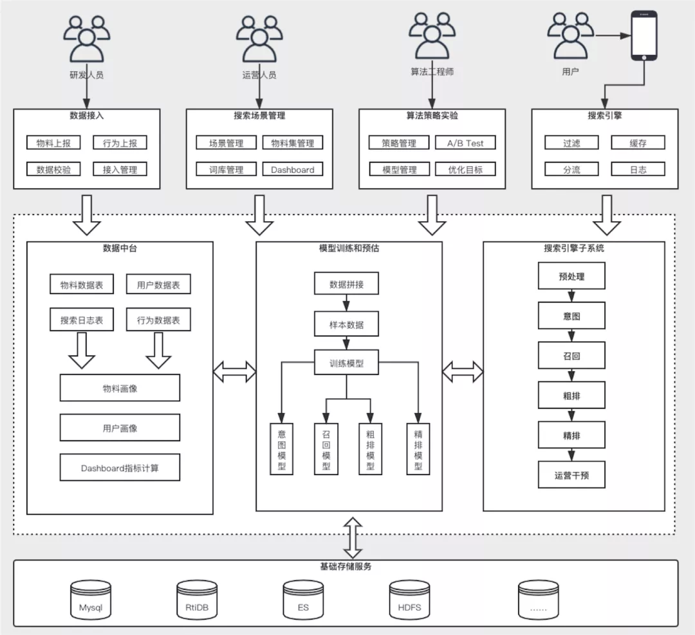

#### 个性化

* DataSQRL + Flink https://www.datasqrl.com/blog/personalized-ai-search/
  * deduplicate the stream to get the most recent version for each product.


* * 

### Other MLSys

* [ä»‹ç» Facebook æ¨è系统的文章](https://engineering.fb.com/2021/01/26/ml-applications/news-feed-ranking/)
  * 多目标 MMoEã€åˆ†æ•°èåˆ
  * 相比抖音，社交å±æ€§æ›´å¼º
    * unread bumping logic: 未æ¥å¾—åŠå±•ç°çš„ä¿¡æ¯
    * action-bumping logic: 交互过的信æ¯æœ‰å†æ¬¡äº¤äº’
  * serving æµç¨‹
    * integrity processes
    * pass 0: lightweight model 选出 500 æ¡
    * pass 1: ç²¾æ’ 500 æ¡
      * 《Observational data for heterogeneous treatment effects with application to recommender systems》
      * People with higher correlation gain more value from that specific event, as long as we make this method incremental and control for potential confounding variables.
    * pass 2: æ··æ’，contextual features, such as content-type diversity rules

#### Facebook

##### Tech Stack

* 网站，移动端app -- Product
* Thrift Web API -- Product Infra
* æ•°æ®åº“，消æ¯é˜Ÿåˆ—，æµæ‰¹æ•°æ®ç³»ç»Ÿï¼Œæ–‡ä»¶ç³»ç»Ÿï¼ŒéŸ³è§†é¢‘转ç å­˜å‚¨ -- Generic Infra
* Ads Ranking，æ¨è系统
* 机器学习平å°ï¼ˆPyTorch）-- Generic Infra
* 虚拟ç°å®ï¼ŒåŠ å¯†è´§å¸ï¼ˆOculus，Libra）-- Cutting Edge, Future Product

#### 快手

* sim 基äºembeddingèšç±»

* ppnet：base网络ä¸bp，gate独立网络独立学，ä¸å½±å“base embedding

* 互动特å¾ç¨€ç–æ€ä¹ˆåŠï¼šmmoe由时长主导，改进比较传统，主è¦æ–¹å‘是稀ç–样本加æƒã€task网络设计

* log时间戳 也是 positon embedding 离散化

#### ç¾å›¢

* ç¾å›¢ä¼˜é€‰ 张亚峰：æ¨è系统结åˆå› æœæ¨æ–­

##### [TensorFlow 在æ¨è系统中的分布å¼è®­ç»ƒä¼˜åŒ–å®è·µ](https://tech.meituan.com/2021/12/09/meituan-tensorflow-in-recommender-systems.html)

* tfåŸç”Ÿæ¶æ„的挑战
  * 所有å‚数都是用 Variable 表达， 对äºç™¾äº¿ä»¥ä¸Šçš„稀ç–å‚数开辟了大é‡çš„内存，造æˆäº†èµ„æºçš„浪费；
  * åªæ”¯æŒç™¾çº§åˆ« Worker 的分布å¼æ‰©å±•ï¼Œå¯¹ä¸Šåƒ Worker 的扩展性较差；
  * ç”±äºä¸æ”¯æŒå¤§è§„模稀ç–å‚数动æ€æ·»åŠ ã€åˆ é™¤ï¼Œå¢é‡å¯¼å‡ºï¼Œå¯¼è‡´æ— æ³•æ”¯æŒ Online Learningï¼›
  * 大规模集群è¿è¡Œæ—¶ï¼Œä¼šé‡åˆ°æ…¢æœºå’Œå®•æœºï¼›ç”±äºæ¡†æ¶å±‚ä¸èƒ½å¤„ç†ï¼Œä¼šå¯¼è‡´ä»»åŠ¡è¿è¡Œå¼‚常
* 核心问题：无法一直横å‘扩PS
  * å¢åŠ æ‰‡å‡ºå¸¦æ¥çš„链路延迟æŸå¤±è¶…过了加PS算力并å‘的收益
  * 优化的核心难点在äºï¼š**如何在有é™çš„PSå®ä¾‹ä¸‹ï¼Œè¿›è¡Œåˆ†å¸ƒå¼è®¡ç®—的优化**。
* 自研HashTable
  * HashTable的大å°å¯ä»¥åœ¨è®­ç»ƒè¿‡ç¨‹ä¸­è‡ªåŠ¨ä¼¸ç¼©ï¼Œé¿å…了开辟冗余的存储空间，åŒæ—¶ç”¨æˆ·æ— éœ€å…³æ³¨ç”³è¯·å¤§å°ï¼Œä»è€Œé™ä½äº†ä½¿ç”¨æˆæœ¬ã€‚
  * 针对HashTable方案å®æ–½äº†ä¸€ç³»åˆ—定制优化，训练速度相比Variable有了很大的æ高，å¯ä»¥è¿›è¡Œåƒäº¿è§„模模å‹çš„训练，扩展性较好。
  * 得益äºç¨€ç–å‚数的动æ€ä¼¸ç¼©ï¼Œæˆ‘们在此基础上支æŒäº†Online Learning。
  * API设计上ä¿æŒä¸ç¤¾åŒºç‰ˆæœ¬å…¼å®¹ï¼Œåœ¨ä½¿ç”¨ä¸Šå‡ ä¹ä¸åŸç”ŸVariable一致，对æ¥æˆæœ¬æä½ã€‚
  * 优化
    * 稀ç–域å‚æ•°èšåˆï¼šembã€momentumã€vã€cnt共用一张表
    * 在åƒäº¿è§„模下TBBConcurrentHashTable比åŸç”ŸMutableDenseHashTable训练速度上快了3å€
    * HashTable BucketPool
* 分布å¼è´Ÿè½½å‡è¡¡ä¼˜åŒ–
  * 把所有稀ç–å‚数和大的稠密å‚数自动ã€å‡åŒ€çš„切分到æ¯ä¸ªPS上
  * åŸç”ŸAdam优化器，å®ç°å¯¼è‡´PSè´Ÿè½½ä¸å‡è¡¡
* 通信优化（RDMA）
  * https://github.com/tensorflow/networking/pull/38/files
  * Memory Registration优化
    * 在RDMA传输数æ®æ—¶ï¼Œéœ€è¦æå‰å¼€è¾Ÿå†…存空间并将其注册到网å¡è®¾å¤‡ä¸Šï¼ˆMemory Registration过程，下称MR），使得这片空间å¯ä»¥è¢«ç½‘å¡ç›´æ¥æ“作
    * 10MB ~ 2ms
    * 问题：社区版Tensorflow RDMAå®ç°ï¼ŒTensor创建ä¾æ—§æ²¿ç”¨äº†ç»Ÿä¸€çš„BFC Allocator，并将所有创建的Tensor都注册到MR上
    * 优化：仅对这些跨节点通信的Tensor进行MR注册
  * RDMAé™æ€åˆ†é…器
    * reqé—´å¤ç”¨MR
    * shapeå’Œtensor打包å议，é¿å…了åŸç”Ÿå®ç°ä¸­å› Tensorçš„Shapeå˜åŒ–而产生的多次å商过程
    * Allocation Analysis模å—
      * 在训练开始的一段时间，我们会对分é…çš„å†å²æ•°æ®è¿›è¡Œåˆ†æ，以得到一个å®é™…预开辟MR大å°ä»¥åŠå„个Tensor的预留空间大å°ã€‚然å我们会暂åœè®­ç»ƒçš„进程，å¯åŠ¨Allocatorçš„æ„造过程，包括MR的创建以åŠé€šä¿¡åŒç«¯çš„ä¿¡æ¯åŒæ­¥ã€‚利用相关信æ¯æ„造MR Info Map，这个Mapçš„Key是传输Tensor的唯一标记（ParsedKey，计算图切图时确定），Info结æ„体中包å«äº†æœ¬åœ°åœ°å€æŒ‡é’ˆã€offset大å°ã€ibv_send_wr相关信æ¯ç­‰ã€‚然åæ¢å¤è®­ç»ƒã€‚
  * Multi RequestBufferä¸CQè´Ÿè½½å‡è¡¡
  * Send-Driven & Rendezvous-Bypass


* Embedding Pipeling
  * 这个设计有点å‰å®³ã€‚。。完全éšè—embedding fetch的相关延时
  * å‰æ是stalenessæŸå¤±å¯æ§


* Unique&DynamicPartitionç®—å­èåˆ
  * uniqueç®—å­çš„缺点：内部使用的内存分é…策略较为ä½æ•ˆã€‚使用了两å€è¾“å…¥å‚数（Embedding ID）的大å°è¿›è¡Œå†…存分é…，但由äºè¾“å…¥å‚数较大，而且é‡å¤ç‡é«˜ï¼Œå¯¼è‡´HashTable创建过大且é常稀ç–。几ä¹æ¯æ¬¡æ’入都会产生一次minor_page_fault，导致HashTable性能下é™
  * Uniqueå’ŒDynamic Partitionç®—å­å­˜åœ¨å†—余数æ®éå†


##### [TensorFlow在ç¾å›¢å¤–å–æ¨è场景的GPU训练优化å®è·µ](https://tech.meituan.com/2022/03/24/tensorflow-gpu-training-optimization-practice-in-meituan-waimai-recommendation-scenarios.html)

* **GPUæœåŠ¡å™¨ç‰¹ç‚¹**
  - **GPUå¡ç®—力很强，但显存ä»æœ‰é™**：如æœè¦å……分å‘挥GPU算力，需è¦æŠŠGPU计算用到的å„ç§æ•°æ®æå‰æ”¾ç½®åˆ°æ˜¾å­˜ä¸­ã€‚而ä»2016å¹´~2020年，NVIDIA Tesla GPUå¡[5]计算能力æå‡äº†10å€ä»¥ä¸Šï¼Œä½†æ˜¾å­˜å¤§å°åªæå‡äº†3å€å·¦å³ã€‚
  - **其它维度资æºå¹¶ä¸æ˜¯å¾ˆå……足**：相比GPU算力的æå‡é€Ÿåº¦ï¼Œå•æœºçš„CPUã€ç½‘络带宽的å¢é•¿é€Ÿåº¦è¾ƒæ…¢ï¼Œå¦‚æœé‡åˆ°è¿™ä¸¤ç±»èµ„æºè´Ÿè·è¾ƒé‡çš„模å‹ï¼Œå°†æ— æ³•å……分å‘挥GPU的能力，GPUæœåŠ¡å™¨ç›¸æ¯”CPUæœåŠ¡å™¨çš„性价比ä¸ä¼šå¤ªé«˜ã€‚

* 挑战
  * **æ•°æ®æµç³»ç»Ÿ**：如何利用好多网å¡ã€å¤šè·¯CPU，å®ç°é«˜æ€§èƒ½çš„æ•°æ®æµæ°´çº¿ï¼Œè®©æ•°æ®çš„供给å¯ä»¥è·Ÿä¸ŠGPU的消费速度。
  * **æ··åˆå‚数计算**：对äºå¤§è§„模稀ç–å‚数，GPU显存直æ¥è£…ä¸ä¸‹çš„情况，如何充分利用GPU高算力ã€GPUå¡é—´çš„高带宽，å®ç°ä¸€å¥—大规模稀ç–å‚数的计算，åŒæ—¶è¿˜éœ€è¦å…¼é¡¾ç¨ å¯†å‚数的计算。
* 系统的设计ä¸å®ç°
  * setting：å•æœºå¤šå¡ã€æ”¯æŒ100G模å‹
  * å‡å°‘å‚æ•°çš„æ€è·¯
    * **å»äº¤å‰ç‰¹å¾**：交å‰ç‰¹å¾ç”±å•ç‰¹å¾é—´åšç¬›å¡å°”积产生，这会生æˆå·¨å¤§çš„特å¾IDå–值空间和对应Embeddingå‚数表。深度预估模å‹å‘展至今，已ç»æœ‰å¤§é‡çš„方法通过模å‹ç»“æ„æ¥å»ºæ¨¡å•ç‰¹å¾é—´çš„交互，é¿å…了交å‰ç‰¹å¾é€ æˆçš„Embedding规模膨胀，如FM系列[16]ã€AutoInt[17]ã€CAN[18]等。
    * **精简特å¾**：特别是基äºNASçš„æ€è·¯ï¼Œä»¥è¾ƒä½çš„训练æˆæœ¬å®ç°æ·±åº¦ç¥ç»ç½‘络自适应特å¾é€‰æ‹©ï¼Œå¦‚Dropout Rank[19]å’ŒFSCD[20]等工作。
    * **å‹ç¼©Embeddingå‘é‡æ•°**：对特å¾å–值进行å¤åˆIDç¼–ç å’ŒEmbedding映射，以远å°äºç‰¹å¾å–值空间的Embeddingå‘é‡æ•°ï¼Œæ¥å®ç°ä¸°å¯Œçš„特å¾Embedding表达，如Compositional Embedding[14]ã€Binary Code Hash Embedding[21]等工作。
    * **å‹ç¼©Embeddingå‘é‡ç»´åº¦**：一个特å¾Embeddingå‘é‡çš„维度决定了其表å¾ä¿¡æ¯çš„上é™ï¼Œä½†æ˜¯å¹¶é所有的特å¾å–值都有那么大的信æ¯é‡ï¼Œéœ€è¦Embedding表达。因此，å¯ä»¥æ¯ä¸€ä¸ªç‰¹å¾å€¼è‡ªé€‚应的学习精简Embedding维度，ä»è€Œå‹ç¼©å‚数总é‡ï¼Œå¦‚AutoDim[22]å’ŒAMTL[23]等工作。
    * **é‡åŒ–å‹ç¼©**：使用åŠç²¾åº¦ç”šè‡³int8等更激进的方å¼ï¼Œå¯¹æ¨¡å‹å‚æ•°åšé‡åŒ–å‹ç¼©ï¼Œå¦‚DPQ[24]å’ŒMGQE[25]。


* 系统å®ç°
  * tf + horovodåŸç”Ÿ
  * æ•°æ®ã€è®¡ç®—ã€é€šä¿¡è§£è€¦
* embedding层：
  * 大的fc用alltoallv
    * å‰å‘时两次å¡é—´alltoall
  * 梯度：å°çš„fc AllGather，dense allreduce
    * å°=稠密="dense sparse"，dense sparse emb table = tfåŸç”Ÿvariable
  * 在cuCollectionsçš„GPU HashTable基础上å®ç°äº†ç‰¹æ®Šæ¥å£ï¼ˆfind_or_insert），对大规模读写性能进行了优化，然åå°è£…到了TensorFlow中，并在其上å®ç°äº†ä½é¢‘过滤的功能，能力上对é½CPU版本的稀ç–å‚数存储模å—
* æ•°æ®å±‚优化
  * 样本拉å–优化：per numaã€å¤šç½‘å¡ã€å¤šå¡ç‹¬ç«‹shared memory
  * 特å¾è§£æ优化：SIMD优化protobuf::CodedInputStream::ReadVarint64Fallback
  * MemcpyH2Dæµæ°´çº¿ï¼š
    * PipelineDataset
    * CPU内存需è¦ä½¿ç”¨Pinned Memory
  * 硬件调优
    * 在网络传输方é¢ï¼Œä¸ºäº†å‡å°‘网络å议栈处ç†å¼€é”€ï¼Œæ高数æ®æ‹·è´çš„效ç‡ï¼Œæˆ‘们通过优化网å¡é…置，开å¯LRO（Large-Receive-Offload）ã€TC Flower的硬件å¸è½½ã€Tx-Nocache-Copy等特性，最终网络带宽æå‡äº†17%。
    * 在CPU性能优化方é¢ï¼Œç»è¿‡æ€§èƒ½profiling分æ，å‘ç°å†…存延迟和带宽是瓶颈。äºæ˜¯æˆ‘们å°è¯•äº†3ç§NPSé…置，综åˆä¸šåŠ¡åœºæ™¯å’ŒNUMA特性，选择了NPS2。此外，结åˆå…¶ä»–BIOSé…置（例如APBDIS，P-state等），å¯ä»¥å°†å†…存延迟é™ä½8%，内存带宽æå‡6%。
* 计算层优化
  * Embedding Pipeline
    * 在GPU场景中，EGã€MG是在åŒä¸€ä¸ªGPU Stream上执行CUDA Kernel的，我们å°è¯•è¿‡EGã€MG分别在独立的GPU Stream上执行，性能会å˜å·®ï¼Œæ·±å±‚åŸå› ä¸CUDA底层å®ç°æœ‰å…³ï¼Œè¿™ä¸ªé—®é¢˜æœ¬èº«è¿˜åœ¨ç­‰å¾…解决
  * ç®—å­ä¼˜åŒ–åŠXLA
    * 以Uniqueç®—å­ä¸ºä¾‹ï¼ŒåŸç”ŸTensorFlowçš„Uniqueç®—å­è¦æ±‚输出元素的顺åºä¸è¾“入元素的顺åºä¸€è‡´ï¼Œè€Œåœ¨å®é™…场景中，我们并ä¸éœ€è¦è¿™ä¸ªé™åˆ¶ï¼Œæˆ‘们修改了Uniqueç®—å­çš„GPUå®ç°ï¼Œå‡å°‘了因输出有åºå¯¼è‡´çš„é¢å¤–执行的GPU Kernel
    * 缓解XLA对动æ€shape的支æŒé—®é¢˜
      * **局部优化**：对äºæˆ‘们手动引入的动æ€shapeç®—å­ï¼ˆå¦‚Unique），我们进行了å­å›¾æ ‡è®°ï¼Œä¸æ‰§è¡ŒXLA编译，XLAåªä¼˜åŒ–å¯ä»¥ç¨³å®šåŠ é€Ÿçš„å­å›¾ã€‚
      * **OOM兜底**：XLA会根æ®ç®—å­çš„typeã€input typeã€shape等信æ¯ï¼Œç¼“存编译中间结æœï¼Œé¿å…é‡å¤ç¼–译。然而由äºç¨€ç–场景以åŠGPUæ¶æ„å®ç°çš„特殊性，天然存在Uniqueã€DynamicPartitionç­‰Output shape是动æ€çš„ç®—å­ï¼Œè¿™å°±å¯¼è‡´è¿™äº›ç®—å­ä»¥åŠè¿æ¥åœ¨è¿™äº›ç®—å­ä¹‹åçš„ç®—å­ï¼Œåœ¨æ‰§è¡ŒXLA编译时无法命中XLA缓存而é‡æ–°ç¼–译，新的缓存越æ¥è¶Šå¤šï¼Œè€Œæ—§çš„缓存ä¸ä¼šè¢«é‡Šæ”¾ï¼Œæœ€ç»ˆå¯¼è‡´CPU内存OOM。我们在XLA内部å®ç°äº†LRUCache，主动淘汰æ‰æ—§çš„XLA缓存，é¿å…OOM的问题。
      * **Const Memcpy消除**：XLA在使用TF_HLOé‡å†™TensorFlowç®—å­æ—¶ï¼Œå¯¹ä¸€äº›ç¼–译期已固定的数æ®ä¼šæ‰“上Const标记，然而这些Constç®—å­çš„Outputåªèƒ½å®šä¹‰åœ¨Host端，为了将Host端的Outputé€ç»™Device端需è¦å†åŠ ä¸€æ¬¡MemcpyH2D，这就å ç”¨äº†TensorFlowåŸæœ‰çš„H2D Stream，影å“样本数æ®æå‰æ‹·è´åˆ°GPU端。由äºXLAçš„Const Output在编译期已ç»å›ºåŒ–，因此没有必è¦æ¯ä¸€æ­¥éƒ½åšä¸€æ¬¡MemcpyH2D，我们将Device端的Output缓存下æ¥ï¼Œå续使用该Output时，直æ¥ä»ç¼“存中读å–，é¿å…多余的MemcpyH2D。
* 通信层优化
  * å‘ç°å¡é—´é€šä¿¡ï¼ˆAllToAllã€AllReduceã€AllGather等）å商的时间远远高äºæ•°æ®ä¼ è¾“的时间
  * 怀疑ä¸åŒå¡ä¸Šç®—å­è°ƒåº¦çš„ä¸ä¸€è‡´æ€§ï¼Œå¯¼è‡´äº†å„å¼ å¡å‘起通信的时刻ä¸åŒï¼Œå¹¶æœ€ç»ˆå¯¼è‡´äº†é€šä¿¡å商时间过长
  * 解决方案
    * åˆå¹¶ç›¸åŒdim sizeçš„hashtable，å‡å°‘å¡é—´é€šä¿¡æ¬¡æ•°
    * Variable Fusion
      * 需è¦æ³¨æ„的是，TensorFlowçš„Variable分为两ç§ï¼Œä¸€ç§æ˜¯æ¯ä¸ªStep全部å‚数值都å‚ä¸è®­ç»ƒçš„Dense Variable，如MLPçš„Weightï¼›å¦ä¸€ç§æ˜¯ä¸“门用äºembedding_lookupçš„Variable，æ¯ä¸ªStepåªæœ‰éƒ¨åˆ†å€¼å‚ä¸è®­ç»ƒï¼Œæˆ‘们称之为Sparse Variable。对äºå‰è€…，åšVariableåˆå¹¶ä¸ä¼šå½±å“到算法效æœã€‚而对äºå者，它åå‘梯度是IndexedSlices对象，å¡é—´åŒæ­¥é»˜è®¤èµ°çš„是AllGather通信，如æœä¸šåŠ¡æ¨¡å‹ä¸­å¯¹äºSparse Variables的优化采用的是Lazy优化器，å³æ¯ä¸ªStepåªä¼˜åŒ–æ›´æ–°Variable中的æŸäº›è¡Œï¼Œæ­¤æ—¶å¯¹Sparse Variablesåšåˆå¹¶ï¼Œä¼šå¯¼è‡´å…¶åå‘梯度ä»IndexedSlices对象转为Tensor对象，å¡é—´åŒæ­¥å˜æˆAllReduce过程，就å¯èƒ½ä¼šå½±å“到算法效æœã€‚对äºè¿™ç§æƒ…况，我们æ供了一个开关，由业务å»æ§åˆ¶æ˜¯å¦åˆå¹¶Sparse Variables。ç»è¿‡æˆ‘们的å®æµ‹ï¼Œåœ¨æŸæ¨è模å‹ä¸Šåˆå¹¶Sparse Variables会æ高5ï½10%的训练性能，而对å®é™…业务效æœçš„å½±å“在一个åƒåˆ†ç‚¹ä»¥å†…。
* 训练效æœ
  * 大Batch下训练超å‚调优的问题[26,27]：在ä¿è¯Epochä¸å˜çš„å‰æ下，扩大Batch Size会导致å‚数有效更新次数å‡å°‘，å¯èƒ½å¯¼è‡´æ¨¡å‹è®­ç»ƒçš„效æœå˜å·®
  * Linear Scaling Rule[28]çš„åŸåˆ™æŒ‡å¯¼è°ƒæ•´å­¦ä¹ ç‡
  * 使用学习ç‡Warmup等更å¤æ‚的训练策略[29]


#### DeepRec

[Github](https://github.com/alibaba/DeepRec)

[Docå…¥å£](https://deeprec.readthedocs.io/zh/latest/)

* 稀ç–功能
  * 自适应动æ€å¼¹æ€§ç‰¹å¾
  * 特å¾æ·˜æ±°åŠå‡†å…¥
  * 基äºç‰¹å¾é¢‘ç‡çš„动æ€å¼¹æ€§ç»´åº¦ï¼ˆFAE）

* å¼‚æ­¥è®­ç»ƒæ¡†æ¶ StarServer
  * 通信åè®®ã€zerocopy
  * 基äºå›¾æ‹“扑åºçš„图Fusion
  * Run To Completion and Lockless Graph Execution

* åŒæ­¥è®­ç»ƒæ¡†æ¶ hybridbackend
  * embedding层：大的fc用alltoallv，å°çš„fc用allreduce
    * å°=稠密="dense sparse"，dense emb table = tfåŸç”Ÿvariable
    * æ€è·¯å‚考meituan https://discuss.tf.wiki/t/topic/2341

* prmalloc
  * æ± å­å…±äº«ï¼Œä¸å†ç”¨ TLS cache，因为opå¯èƒ½æ˜¯ä¸åŒçº¿ç¨‹è¿è¡Œ

* 业务相关优化
  * user特å¾ä¼˜åŒ–

* 图优化-smartstage
* embedding store
  * embedding多级混åˆå­˜å‚¨ï¼šcpu cache dram pmem ssd
    * 多级混åˆå­˜å‚¨èƒ½æ”¯æŒå•æœºserving，主è¦ä»ssd读

#### Others

* [当我们在设计æ¨è场景训练系统](https://zhuanlan.zhihu.com/p/376974245) 讨论了æ¨è系统标准化的æ€è·¯
  * é…置驱动ä¸ä»£ç é©±åŠ¨ï¼ŒæœŸæœ›å°½é‡ç»“åˆä¸Šè¿°ä¸¤ç§æ–¹æ¡ˆçš„优点，å³ï¼š
    * 工作æµæ•´ä½“还是通过é…置文件驱动，系统会将解æ好的é…置文件，根æ®ä¸åŒçš„处ç†æ¨¡å—，将对应部分的é…置传递给过å»
    * 对äºå¤§éƒ¨åˆ†çš„任务，基本逻辑都是通用的，如下图中的黄色模å—，对äºè¿™ä¸€éƒ¨åˆ†æ供通用的å®ç°ã€‚当然，由äºä»£ç æ˜¯å†…部开æºçš„，å³ä¾¿æœ‰å°‘é‡ç‰¹æ®Šéœ€æ±‚也å¯ä»¥è‡ªè¡Œå¼€å‘æ交
    * 对äºè‡ªç”±åº¦è¾ƒé«˜çš„模å—，主è¦æŒ‡çš„是上é¢è¯´çš„“模å‹æ„建â€éƒ¨åˆ†ï¼Œåˆ™ç³»ç»Ÿæ供抽象父类，包å«åŸºç¡€çš„功能。自定义模å‹æ—¶ï¼Œé€šè¿‡ç»§æ‰¿çˆ¶ç±»ï¼Œå¹¶é‡å†™â€œå‰å‘ä¼ æ’­â€ç­‰æ–¹æ³•å³å¯
  * 训练ç¯å¢ƒdocker化

### 测试

- PyTorch å•æµ‹æ¡†æ¶

  - unittest + pytest
  - **Golden Test**

- TensorFlow Extended 的测试模å¼

  - **Hermetic Testing**：使用 Docker 隔离测试ç¯å¢ƒ
  - **Artifact** **验è¯é“¾**：对 checkpointã€saved_model 等中间产物进行签å验è¯

- HuggingFace 的测试å®è·µ

  - **Model Zoo 测试**：对æ¯ä¸ªé¢„训练模å‹è¿›è¡Œå‰å‘ / åå‘传播验è¯

  - **精度****容å¿åº¦æ ‡è®°**：

    - ```Python
      @require_torch_gpu
      @slow
      @pytest.mark.tolerance(atol=1e-4)
      def test_large_model():
          ...
      ```

### MLSys Courses —— CSE 599W: Systems for ML

[cs294-2022](https://ucbrise.github.io/cs294-ai-sys-sp22/)

[cs294-2019](https://ucbrise.github.io/cs294-ai-sys-fa19/)

http://dlsys.cs.washington.edu/schedule

#### Lecture 1: Introduction to Deep Learning

* Ingredients in DL
  * 模å‹ã€ç›®æ ‡å‡½æ•°ã€æŠ€å·§ã€æ•°æ®
  * 技巧包括Regularization, initialization (coupled with modeling)
    * Dropout: Overfitting prevention
    * Xavier Initialization
* 模å‹ç»“æ„
  * Fully Connected Layer
  * Convolution = Spatial Locality + Sharing
    * Convolution with Multiple Channels
  * Pooling Layer: Can be replaced by strided convolution
  * LeNet, AlexNet
  * Why ReLU?
    * Cheap to compute
    * It is roughly linear..
  * Dropout
    * Randomly zero out neurons with probability 0.5
    * During prediction, use expectation value (keep all neurons but scale output by 0.5)
  * GoogleNet: Multiple Pathways, Less Parameters
    * Inception Module
    * [1*1 å·ç§¯å‡å°channel维数，用äºchannelèåˆï¼Œå‡å°‘计算é‡](https://stats.stackexchange.com/questions/194142/what-does-1x1-convolution-mean-in-a-neural-network)
* Vanishing and Explosive Value Problem
  * In ConvNets, the weight are not tied, but their magnitude matters; Deep nets training was initialization sensitive
  * Batch Normalization: Stabilize the Magnitude
    * Subtract mean -> Divide by standard deviation -> Output is invariant to input scale! -> Scale input by a constant –> Output of BN remains the same
    * Impact: Easy to tune learning rate, less sensitive initialization
    * The Scale Normalization (Assumes zero mean)
  * ResNet: F(x) + x
* [lab1_mnist.ipynb](http://dlsys.cs.washington.edu/pdf/lab1_mnist.ipynb): MXNet入门，包括Gluon APIã€å†™æ¨¡å‹ã€è®­ç»ƒæ¨ç†api

#### Lecture 3: Overview of Deep Learning System


* softmax in numpy
  * softmax内蕴了logistic regression
  * 手算梯度 + SGD
    * 梯度æ¨å¯¼è§ã€Machine-Learning笔记】
* softmax in tinyflow
* The Declarative Language: Computation Graph
  * Nodes represents the computation (operation)
  * Edge represents the data dependency between operations


* Computation Graph Optimization
  * Deadcode elimination
  * Memory planning and optimization
  * Parallel Scheduling
    * Code need to run parallel on multiple devices and worker threads
    * Detect and schedule parallelizable patterns
  * GPU Acceleration
* Hardware backend
  * Each Hardware backend requires a software stack
  * New Trend: Compiler based Approach

#### Lecture 4: Backpropagation and Automatic Differentiation

* Symbolic Differentiation 基äºç¬¦å·å¾®åˆ†
  * åªèƒ½å¤„ç† closed-form expression
  * For complicated functions, the resultant expression can be exponentially large
  * Wasteful to keep around intermediate symbolic expressions if we only need a numeric value of the gradient in the end
  * Prone to error
  
* Numerical Differentiation 基äºæœ‰é™å·®åˆ†
  * Bad: rounding error, and slow to compute
  * A powerful tool to check the correctness of implementation, usually use h = 1e-6
* Backpropogation 自动微分
  * æ€è·¯ï¼š
    * 将基础æ“作梯度公å¼hardcode在系统中
    * 梯度累加数值，ä»è€Œèƒ½å…¼å®¹æ¨¡å‹ç»“æ„中的逻辑判断

  * Easy to understand and implement
  * Bad for memory use and schedule optimization
    * You always need to keep intermediate data in the memory during the forward pass in case it will be used in the backpropagation.
    * Lack of flexibility, e.g., compute the gradient of gradient.

* Automatic Differentiation (autodiff)
  * Generate gradient computation to **entire** computation graph，计算过程全图化
  * Better for system optimization
  * 具体算法è§ã€code-reading笔记】-- Tinyflow -- autodiff


##### Paper: 《Automatic differentiation in PyTorch》

* Features:

  * Dynamic, define-by-run execution; Immediate, eager execution
  * In-place operations; No tape; Core logic in C++
    * PyTorch (and Chainer) eschew this tape; instead, every intermediate result records only the subset of the computation graph that was relevant to their computation.

* ```python
  torch.autograd.grad(f(x, y, z), (x, y))
  
  from torch.autograd import Variable
  x, prev_h = Variable(torch.randn(1, 10)), Variable(torch.randn(1, 20))
  W_h, W_x = Variable(torch.randn(20, 20)), Variable(torch.randn(20, 10))
  i2h = torch.matmul(W_x, x.t())
  h2h = torch.matmul(W_h, prev_h.t())
  (i2h + h2h).tanh().sum().backward()
  ```

* API

  * “requires grad†and “volatile†flags
  * hooks:`x.register_hook(lambda grad: print(grad))`
  * Extensions

* Implementation

  * Variable

    * a wrapper around a Tensor
    * holds a reference to a graph of Function objects
    * mutated when an in-place operation occurs

  * Graph: immutable, purely functional representation of the derivative of computed function

  * Function: a closure that has all context necessary to compute vector-Jacobian products

  * 内存管ç†ï¼šPyTorch’s Variable and Function must be designed to work well in a reference counted regime.

    * a Function records pointers to the Function which consumes its result

    * Another challenge is avoiding reference cycles. A naıve implementation of automatic differentiation can easily introduce such cycles (e.g. when a differentiable function would like to save a reference to its output). PyTorch breaks them by recording not a full-fledged variable, but instead a [“saved variableâ€](https://github.com/pytorch/pytorch/blob/master/torch/csrc/autograd/saved_variable.cpp), which omits a pointer to the Function in such cases.

      * ```c++
        // We want grad_fn here to provide the most helpful debug message to the user
        // if versions don't match
        
        auto grad_fn = is_inplace_on_view_ ? weak_grad_fn_.lock()
          : !hooks_ ? saved_original_ ? data_.grad_fn() : nullptr
            : grad_fn_;
        ```

    * Supporting in-place operations：ä¸å…¼å®¹Invalidationå’ŒAliasing这两ç§æƒ…况

      * Invalidation: Every underlying storage of a variable is associated with a version counter, which tracks how many in-place operations have been applied to the storage.
      * Aliasing: the in-place addition to x also causes some elements of y to be updated; thus, y’s computational history has changed as well.

##### Paper: 《Automatic differentiation in ML: Where we are and where we should be going》

* Introduction
  * ç°çŠ¶ï¼šoperator overloading (OO) and source transformation (ST) used for AD
  * drawing insights from functional languages, graph-based IRs, and AD
* Forward modeå’ŒReverse mode
  * Forward mode has constant memory requirements and its runtime complexity scales with the number of inputs.
    * 科学计算场景，计算高阶导数

  * Reverse mode’s runtime complexity scales with the number of outputs, and its memory complexity grows with the number of intermediate variables.
  * In principle, forward and reverse mode can be mixed, but finding the optimal way of doing so is NP-complete [27].
  * Since the number of inputs is significantly larger than the number of outputs, reverse mode AD is to be preferred

* Automatic differentiation: Two methods
  * Operator overloading (OO): record a tape
    * downside: Having an embedded interpreter inside of the host language can complicate debugging and performance analysis.
    * PyTorch, Autograd, and Chainer
  * source transformation (ST)
    * explicitly construct a program with a reversed control flow, which means that it needs transformation rules for function calls and control flow statements such as loops and conditionals åé™æ€
    * still ensure that intermediate variables from the forward pass are accessible by the adjoint
      * Tape-based
        * The tape used in ST stores only the intermediate variables, whereas the tape in OO is a program trace that stores the executed primitives as well.
      * Closure-based
        * no AD-specific compiler passes are needed: a functional language compiler will recognize the non-local use of the intermediate variables by the fact that they are free variables in the generated closure or continuation.
* Dataflow programming
  * Theano, TensorFlow, and MXNet
  * follow the dataflow program- ming paradigm [21] and use computation graphs as their **intermediate representation**
  * These graph representations do not have scoping or recursive function calls, which means that AD is much easier to implement with ST
  * 设计å–èˆ
    * Function Calls: TensorFlow and Theano implement a type of subroutine through their Defun and OpFromGraph constructs, but these must be explicitly constructed by the user and don’t support recursion.
    * Scoping: TensorFlow has a concept it refers to as ‘scoping’, but these scopes are not lexical and can be reentered at any time, so the lifetime of a value is not affected by its scope.
* Programming languages and compilers
  * The dataflow graph is an intermediate representation which is optimized using a series of compiler passes. The resulting program is compiled (e.g., XLA) and/or interpreted (e.g., the TensorFlow/Theano runtimes). Similarly, PyTorch has started optimizing its traced Python programs using just-in-time (JIT) compiler approaches.
  * Python because of its flexibility with the need for high performance and speed is an open question. ML frameworks have focused on metaprogramming and using C extensions, but other approaches are possible. For example, Cython [6] is a superset
  * performance and speed is an open question.
* Graph-based direct intermediate representation
  * graph based, purely functional, closure representation, strongly typed
  * IR specification
    * Concretely, our representation represents a function as a graph object with a list of parameter nodes and a single return node (multiple return values are supported through tuples). A node represents a function application and has an ordered list of incoming edges. The first incoming edge is a pointer to the function to apply, and the rest point to the arguments. Constants are represented as nodes with no incoming edges and a value field. Links between nodes are bidirectional, so that graphs can be traversed in either direction. Each non-constant node belongs to a single graph.
  * Source transformation
    * In order to ensure that our transformation can be applied again on the transformed program (so we can use reverse-over-reverse to compute second-order derivatives), it must be able to handle functions with free variables.
* Myia
  * Myia is a functioning proof of concept of a toolchain that uses the proposed graph representation
  * Python front end
    * Myia uses Python’s inspect module to parse the function into an abstract syntax tree (AST), and converts that AST into the graph representation we previously described
  * Type inference
  * Optimization

> Lecture 5: GPU Programming，内容èå…¥ã€GPU.md】

#### Lecture 6: Optimize for Hardware Backends

* Where are we: gap between computation graph and hardware
  * Goal: High Level Program to Bare Metal Code
  * What are the tricks you can do to make your program run faster on CUDA/x86/any backend?
* Cache Line Aware Tiling
  * Output-tiled
  * cache line aware
  * 收益æ¥æºäºmemory reuse，å‡å°‘load dram time cost

```c++
dram float A[n/b1][b1][n];
dram float B[n/b2][b2][n];
dram float C[n/b1][n/b2][b1][b2];
for (int i = 0; i < n/b1; ++i) {
  l1cache float a[b1][n] = A[i];
  for (int j = 0; j < n/b2; ++j) {
    l1cache b[b2][n] = B[j];
		for (int x = 0; x < b/v1; ++x) {
     for (int y = 0; x < b/v1; ++y) {
       register float c[v1][v2] = 0;
       for (int k = 0; k < n; ++k) {
         register float ar[v1] = a[x][k];
         register float br[v1] = b[y][k];
         C += dot(ar, br)
       }
 	    }
    }
  }
}
```

* operator fusion
* Optimizations = Too Many Variant of Operators
  * Different tiling patterns
  * Different fuse patterns
  * Different data layout
  * Different hardware backends

#### Lecture 7: Automatic Code Generation --- TVM Stack

https://tvm.apache.org/

https://github.com/apache/tvm

* Computational Graph as IR
  * Approach taken by: TensorFlow XLA, Intel NGraph, Nvidia TensorRT
  * XLA: Tensorflow Compiler
  * TensorRT: Rule based Fusion
    * relu+bias+conv --> CBR
    * Simple Graph-based Element-wise Kernel Generator: Fusion Pass + CodeGen Pass


* The Remaining Gap of "Computational Graph as IR"
  * need to build and optimize operators for each hardware, variant of layout, precision, threading pattern …
  * hardware backend越多，手工优化opçš„æˆæœ¬è¶Šé«˜
* Emerging Tools Using Tensor Expression Language
  * Halide: Image processing language
  * Loopy: python based kernel generator
  * TACO: sparse tensor code generator
  * Tensor Comprehension

* TVM
  * Tensor Level Optimizations (Tensor Expression Language)
    * `C = t.compute((m, n), lambda i, j: t.sum(A[i, k] * B[j, k], axis=k))`
  * Tensor Index Expression

```python
# tvm
# Compute C = dot(A, B.T)
import tvm
m, n, h = tvm.var('m'), tvm.var('n'), tvm.var('h')
A = tvm.placeholder((m, h), name='A')
B = tvm.placeholder((n, h), name=‘B')

k = tvm.reduce_axis((0, h), name=‘k')
C = tvm.compute((m, n), lambda i, j: tvm.sum(A[i, k] * B[j, k], axis=k))
                    
# Convolution
out = tvm.compute((c, h, w), lambda i, x, y: tvm.sum(data[kc,x+kx,y+ky] * w[i,kx,ky], [kx,ky,kc]))
                    
# ReLU
out = tvm.compute(shape, lambda *i: tvm.max(0, out(*i))
```

* Schedule: Tensor Expression to Code
  * 核心æ€è·¯ï¼šSeparation of Compute and Schedule, introduced by Halide
* Key Challenge: Good Space of Schedule
  * Should contain any knobs that produces a logically equivalent program that runs well on backend models
  * Must contain the common manual optimization patterns
  * Need to actively evolve to incorporate new techniques

```python
# Example Schedule Transformation
C = tvm.compute((n,), lambda i: A[i] + B[i])
s = tvm.create_schedule(C.op)
xo, xi = s[C].split(s[C].axis[0], factor=32)  # 
s[C].recorder(xi, xo)
s[C].bind(xo, tvm.thread_axis(“blockIdx.xâ€)
s[C].bind(xi, tvm.thread_axis(“threadIdx.xâ€)
```

* TVM Schedule Primitives
  * Loop Transformations, Thread Bindings, Cache Locality, Thread Cooperation, Tensorization, Latency Hiding
  * Schedule Space Exploration --> AutoTuner tune多个kernel

```python
# Extending Compute Primitives
# Symbolic Loop: Y = cumsum(X)
import tvm
m = tvm.var("m")
n = tvm.var("n")
X = tvm.placeholder((m, n), name="X")
s_state = tvm.placeholder((m, n))
s_init = tvm.compute((1, n), lambda _, i: X[0, i])
s_update = tvm.compute((m, n), lambda t, i: s_state[t-1, i] + X[t, i])
Y = tvm.scan(s_init, s_update, s_state, inputs=[X])
```

* Hardware designer: declare tensor instruction interface

```python
w, x = t.placeholder((8, 8)), t.placeholder((8, 8))
k = t.reduce_axis((0, 8))
y = t.compute((8, 8), lambda i, j: t.sum(w[i, k] * x[j, k], axis=k))
def gemm_intrin_lower(inputs, outputs):
 ww_ptr = inputs[0].access_ptr(“r")
 xx_ptr = inputs[1].access_ptr("r")
 zz_ptr = outputs[0].access_ptr("w")
 compute = t.hardware_intrin("gemm8x8", ww_ptr, xx_ptr, zz_ptr)
 reset = t.hardware_intrin("fill_zero", zz_ptr)
 update = t.hardware_intrin("fuse_gemm8x8_add", ww_ptr, xx_ptr, zz_ptr)
 return compute, reset, update

gemm8x8 = t.decl_tensor_intrin(y.op, gemm_intrin_lower)
```

* High Level Compilation Frontend

```python
import tvm
import nnvm.frontend
import nnvm.compiler
graph, params = nnvm.frontend.from_keras(keras_resnet50)
target = tvm.target.cuda()
graph, lib, params = nnvm.compiler.build(graph, target) 

module = runtime.create(graph, lib, tvm.gpu(0))
module.set_input(**params)
module.run(data=data_array)
output = tvm.nd.empty(out_shape, ctx=tvm.gpu(0))
module.get_output(0, output)
```


##### Paper: 《TVM: An Automated End-to-End Optimizing Compiler for Deep Learning》

* Abstract/Conclusion
  * TVM solves optimization chal-lenges specific to deep learning, such as high-level operator fusion, mapping to arbitrary hardware primitives, and memory latency hiding.
* Introduction
  * TVM, a compiler that takes a high-level specification of a deep learning program from existing frameworks and generates low-level optimized code for a diverse set of hardware back-ends.
  * Leveraging Specific Hardware Features and Abstractions.
  * Large Search Space for Optimization
    * tensor expression language
    * automated program optimization framework
      * autotuneä¸æ‰‹å·¥ä¼˜åŒ–，å者解决通用问题，å‰è€…解决长尾问题并优化å者å‚æ•°
    * graph rewriter


* Optimizing Computational Graphs
  * 和IR的区别：the intermediate data items are large, multi-dimensional tensors.
  * Operator Fusion：给op分了四类，ä¸åŒç±»å‹èƒ½ä»¥ä¸åŒå½¢å¼fusion
  * Data Layout Transformation.
  * constant-folding
  * static memory planning pass
* 核心æ€æƒ³ï¼šåˆ†ç¦»computeå’Œschedule，通过å„ç§è°ƒåº¦å˜æ¢æœç´¢å‡ºæœ€é«˜æ•ˆçš„å®ç°
* Generating Tensor Operations
  * Tensor Expression and Schedule Space
    * Internally, TVM uses a data structure to keep track of the loop structure and other information as we apply schedule transformations. This information can then help generate low-level code for a given final schedule.
  * Nested Parallelism with Cooperation
    * in addition to being useful to GPUs, memory scopes let us tag special memory
      buffers and create special lowering rules when targeting specialized DL accelerators.
  * Tensorization
    * 对普通张é‡ç¨‹åºï¼ˆä¸€èˆ¬å°±æ˜¯å¾ªç¯åµŒå¥—程åºï¼‰ï¼Œè°ƒç”¨ç¡¬ä»¶åŠ é€Ÿå™¨æ供的特定指令函数（ intrinsic）进行加速。比如 GPU 里的 Tensor Core æ供的一些 intrinsic å¯ä»¥ç›´æ¥å¤„ç†ç‰¹å®šå¤§å°çŸ©é˜µçš„è¿ç®—
    * We make tensorization extensible by separating the target hardware intrinsic from the schedule with a mechanism for tensor-intrinsic declaration.
  * Explicit Memory Latency Hiding


* Automating Optimization
  * Schedule Space Specification
  * ML-Based Cost Model
    * GDBT, 特å¾åŒ…括 the memory access count and reuse ratio of each memory buffer at each loop level, as well as a one-hot encoding of loop annotations such as “vectorizeâ€, “un-rollâ€, and “parallel.â€
  * Schedule Exploration
    * a parallel simulated annealing algorithm
* Evaluation
* Related Work
  * é‡ç”³graph-based approach的缺点：serving多ç§hardware backends耗费人力
  * More importantly, we provide an end-to-end stack that can take descriptions directly from DL frameworks and jointly optimize together with the graph-level stack.
* 更多tvmå续论文：
  * [Ansor : Generating High-Performance Tensor Programs for Deep Learning](https://arxiv.org/abs/2006.06762)
  * [NIMBLE: EFFICIENTLY COMPILING DYNAMIC NEURAL NETWORKS FOR MODEL INFERENCE](https://arxiv.org/pdf/2006.03031.pdf)

#### Lecture 8: Hardware Specialization in Deep Learning

* Hardware Specialization
  * • Idea: tailor your chip architecture to the characteristics of a **stable** workload


* Specialization Challenge
  * Tape-out costs for ASICs is exorbitant
    * 10x cost gap between 16nm and 65nm
    * 5nm ~ 800M$
  * Risky bet to design hardware accelerators for ever-changing applications
    * Flexibility vs. Efficiency Tradeoffs
    * Microprocessors(0.1) -> DSPs(1) -> Decicated HW(100)   (MOPS/mW)
* TPU: Google’s Entry in the Deep Learning Acceleration Race
  * Highlights (In-Datacenter Performance Analysis of a Tensor Processing Unit, ISCA 2017)
    * Custom ASIC deployed in datacenters since 2015
    * 65k 8-bit matrix multiply that offers peak throughput of 92 TOPS
    * Targets mainstream NN applications (MLPs, CNNs, and LSTMs)
    * Shows 30-80x improved TOPS/Watt over K80
  * Why Efficient
    * Integer inference (saves 6-30x energy over 16bit FP)
    * Large amount of MACs (25x over K80)
    * Large amount of on-chip memory (3.5x over K80)
  * TPU Roofline
    * 1350 Operations per byte of weight memory fetched
    * TPU的内存带宽太å°äº†ï¼Œ34GB/s


* HW/SW Co-Design - #1 Tensorization
* HW/SW Co-Design - #2 Memory Architecting


* HW/SW Co-Design - #3 Data Type

* VTA: Versatile Tensor Accelerator
  * a versatile and extendable deep learning accelerator for software codesign research and the development of next architectures
  * Features
    * Customizable tensor core, memory subsystem and data types based on bandwidth, storage and accuracy needs
    * Flexible CISC/RISC ISA for expressive and compact code
      * Goal: Provide the right tradeoff between expressiveness and code compactness 
      * Use CISC-ness to describe high-level operation (LD, ST, GEMM, ALU)
      * Use RISC-ness to describe low-level memory access patterns
      * Micro-op kernels are stored in a local micro op cache to implement different operators
    * Access-execute decoupling for memory latency hiding

* Latency Hiding: GEMM hide load latency
  * We want to enforce read-after-write (RAW) dependences
  * AND we want to enforce write-after-read (WAR) dependences
  * Takeaway: work partitioning and explicit dependence graph execution (EDGE) unlocks pipeline parallelism to hide the latency of memory accesses


* VTA Design	
  * Instruction fetch stage fetches high-level instructions from DRAM, decodes them, and pushes commands to the relevant queue (LD, EX, ST)
  * The load stage executes load commands to populate activation & kernel memories, the micro-op cache, and a load buffer for loading in values for the register file
  * Compute stage executes compute commands to perform vector ALU operations or GEMM operations to update the register file according to micro-coded kernels
  * Memory store stage executes store commands to store flushed register file values back to DRAM from the store buffer
  * Stages communicate via dependence token queues to indicate that they may proceed to execute the command they’re about to work on
  * Memories that connect pipeline stages follow a strict single producer, single consumer rule (fan-in=1, fan-out=1). This enables data flow execution, and makes this design modular
* TVM DSL allows for separation of schedule and algorithm


* Virtual Threading
  * How do we take advantage of pipeline parallelism with virtual threading?
  * Hardware-centric view: pipeline execution
  * Software-centric view: threaded execution
  * Final step: virtual thread lowering into a single instruction stream
    * Push and pop commands dictate how to interact with the hardware dependence queues


* Programming for VTA in TVM

  * How do we partition work and explicitly manage on-chip memories?

    * ```python
      // Tile
      yo, xo, yi, xi = s[OUT].tile(y, x, 4, 4)
      // Cache read
      INP_L = s.cache_read(INP, vta.act, [OUT])
      s[INP_L].compute_at(s[OUT], xo)
      ```

  * How do we take advantage of tensorization?

    * ```python
      // Tensorize
      s[OUT_L].tensorize(ni)
      ```

  * How do we take advantage of virtual threading?

    * ```python
      // Virtual Threading
      tx, co = s[OUT_L].split(co, factor=2)
      s[OUT_L].bind(tx, thread_axis(“cthreadâ€))
      ```

#### Lecture 9: Memory Optimization

* DL stack 中的 Computational Graph Optimization and Execution ç¯èŠ‚
* Question for this lecture:
  * Why do we need automatic differentiation that extends the graph instead of backprop in graph?
* Executorçš„æ„建，中间节点分é…临时内存，Temporary space linear to number of ops
  * Dynamic Memory Allocation
  * Static Memory Planning
    * Analog: register allocation algorithm in compiler
    * Inplace store the result in the input
      * We can only do inplace if result op is the only consumer of the current value
    * Normal Sharing reuse memory that are no longer needed
* Memory Allocation and Scheduling
  * Memory Planning Algorithm: 维护内存tag，一ç§å®ç°è§ã€code-reading笔记】-- tvm -- 内存管ç†
  * Concurrency aware Heuristics:
    * Restrict memory reuse in the same colored path
    * color通过ä¸æ–­åœ°æ‰¾æœ€é•¿è·¯å¾„生æˆï¼Œæ¯”如第一æ¡æœ€é•¿è·¯å¾„用一个颜色
  * Introduces implicit control flow dependencies between ops
    * Solutions:
      * Explicitly add the control flow dependencies
        * Needed in TensorFlow
      * Enable mutation in the scheduler, no extra job needed
        * Both operation “mutate†the same memory, supported in MXNet


* We are still Starved
  * For training, cost is still linear to the number of layers
  * Need to book-keep results for the gradient calculation
* Trade Computation with Memory
  * Only store a few of the intermediate result
  * Recompute the value needed during gradient calculation
  * tf中需è¦æ˜¾ç¤ºæ·»åŠ  control dependency（指å‘希望执行的opå‰çš„节点）
  * **Sublinear Memory Complexity**
    * O(K) + O(N/K) ---> sqrt(N) memory cost plan


#### Lecture 10: Parallel Scheduling

* Questions to be answered
  * What are common patterns of parallelization
  * How can we easily achieve these patterns
  * What about dynamic style program 
* Model Parallel Training
  * Map parts of workload to different devices，主è¦æ˜¯è§£å†³GPU显存ä¸è¶³çš„问题
  * Require special dependency patterns (wave style)
    * e.g. LSTM

* Data Parallelism
  * Train replicated version of model in each machine
  * Synchronize the gradient
    * control dependency: weight更新指å‘device forward（æå‰load data）
* Goal of Scheduler Interface
  * 串行的方å¼å†™ç¨‹åºï¼Œå†…部尽å¯èƒ½å¹¶è¡Œï¼Œæœ‰ç‚¹åƒ C++ 编译器，åªè¦æ²¡æœ‰æ›´é«˜å±‚次的并行å³å¯work
  * Schedule any resources
    * Data
    * Random number generator
    * Network communicator
* DAG Graph based scheduler
  * `engine.push(lambda op, deps=[])`
  * tf使用，Useful when all results are immutable
* Discussion: How to schedule the following ops
  * Random number generator
  * Memory recycling，类似的还有 Write After Read Mutation
  * Cross device copy
  * Send data over network channel
* Mutation aware scheduler: solve these problems much easier than DAG based scheduler
  * Tag each Resource
  * Push Operation: 记录read/mutate的资æº
* Queue based Implementation of scheduler
  * Like scheduling problem in OS
  * Maintain a pending operation queue，å†ç»™æ¯ä¸ªèµ„æºç»´æŠ¤ä¸€ä¸ªqueue
  * Schedule new operations with event update

> Lecture 11  Distributed Training and Communication Protocols è入上é¢çš„笔记

#### Lecture 12: Model Serving

* Model Compression
  * Tensor decomposition
    * Matrix decompostion
    * "Compression of deep convolutional neural networks for fast and low power mobile applications." ICLR (2016)
      * finetuneå‡å°æ•ˆæœæŸå¤±
  * Network pruning
    * "Deep Compression: Compressing Deep Neural Networks with Pruning, Trained Quantization and Huffman Coding." ICLR (2016)
    * 
    * 
  * Quantization
    * pruning + quantization 效æœæœ€å¥½ï¼ˆç›¸æ¯”两者的å•ç‹¬ä½¿ç”¨ä»¥åŠSVD），大é“至简？
    * XNOR-Net: binary weights/binary input and weights
    * quantize during training
  * Smaller model
    * Knowledge distillation: "Fitnets: Hints for thin deep nets." ICLR (2015)
  * Others
    * Specialized hardware for sparse models
      * Song Han, et al. “EIE: Efficient Inference Engine on Compressed Deep Neural Network.†ISCA 2016
    * Accuracy and resource trade-off
      * Han, Seungyeop, et al. "MCDNN: An Approximation-Based Execution Framework for Deep Stream Processing Under Resource Constraints." MobiSys (2016).

* Serving system

  *  Goals:

    * High flexibility for writing applications
    * High efficiency on GPUs
    * Satisfy latency SLA

  * Challenges

    * Provide common abstraction for different frameworks
    * Achieve high efficiency
      * Sub-second latency SLA that limits the batch size
      * Model optimization and multi-tenancy causes long tail

  * 《Nexus: efficient neural network serving system》

    * Frontend runtime library allows arbitrary app logic

    * Packing models to achieve higher utilization

    * A GPU scheduler allows new batching primitives

    * A batch-aware global scheduler allocates GPU cycles for each model

      * For high request rate, high latency SLA workload, saturate GPU efficiency by using large batch size

    * ```python
      class ModelHandler:
        # return output future
        def Execute(input)
      class AppBase:
        # return ModelHandler，传入SLA应该是为了方便调度
        def GetModelHandler(framework, model, version, latency_sla)
        # Load models during setup time, implemented by developer
        def Setup()
        # Process requests, implemented by developer
        def Process(request)
      ```

  * 按modelç±»å‹åˆ†ç±»ï¼š

    * 高SLA高QPS：large batch size
    * ä½SLA高QPS：optimized split batching
      * æ¯ä¸ªopå¯ä»¥æœ‰ä¸ä¸€æ ·çš„batch size...... 优化最大åå。这样ä¸ä¼šå¢åŠ å†…存带宽消耗么？   GDRå¯ä»¥å‡å°‘到一次
    * 高SLAä½QPS：execute multiple models on one GPU
      * Execute multiple models in round-robin fashion，å¯æœ€å°åŒ–ç­‰batchçš„latency
    * ä½SLAä½QPS：Solution depends
      * If saturate GPU in temporal domain due to low latency: allocate dedicated GPU(s)
      * If not: can use multi-batching to share GPU cycles with other models

    * 

    * Prefix batching for model specialization：类似äºsparse/dense op分离的æ€è·¯

  * Meet Latency SLA: Global scheduler

    * Best-fit decreasing algorithms


### MLSys in the Cloud

* MLflow强调易用性和支æŒå•æœºç¯å¢ƒï¼Œè€Œè°·æ­Œå¼ºè°ƒå¤§è§„模和并行


https://outerbounds.com/blog/modern-data-stack-mlops/ MUSTDO

cs294的三篇æ¨è论文：MUSTDO

https://arxiv.org/abs/2205.07147

https://arxiv.org/abs/2006.07512

https://www.usenix.org/system/files/osdi21-qiao.pdf


https://www2.eecs.berkeley.edu/Pubs/TechRpts/2009/EECS-2009-28.pdf


### 论文阅读

#### MLSys: The New Frontier of Machine Learning Systems

#### Monolith: Real Time Recommendation System With Collisionless Embedding Table, RecSys 22

* Abstract & Conclusion
  * a collisionless embedding table with optimizations such as expirable embeddings and frequency filtering to reduce its memory footprint
  * we provide an production-ready online training architecture with high fault-tolerance
  * we proved that system reliability could be traded-off for real-time learning.
  * [BytePlus](https://www.byteplus.com/en/product/recommend)，å‚考ã€é技术知识笔记】
* Intro
  * æ¨è场景特点
    * The features are mostly sparse, categorical and dynamically
      changing;
    * The underlying distribution of training data is non-stationary, a.k.a. Concept Drift [8].
  * Sparsity and Dynamism
    * embedding多且æŒç»­å¢é•¿
    * Low-collision hashingä¸åˆé€‚（Youtube Recommendations论文）
  * Non-stationary Distribution
    * 解释å®æ—¶æ€§çš„收益
* Design
  * HashTable
    * tf.variableçš„å±€é™æ€§ï¼šä¸å¥½æ”¯æŒåŠ¨æ€add/delete variable，ä¸æ”¯æŒæŒ‡å®šæ–°variableå¤ç”¨æ—§variable
    * cuckoo hashmap
    * 优化内存的手段
      * ouccurency/probabilistic filter
      * expire embeddings
  * Online Training
    * The online joiner concatenates features with labels from user actions and produces training examples, which are then written to a Kafka queue.
    * a unique key for each request so that user action and features could correctly pair up
      * 解决样本å›æµæ…¢çš„问题：先查in-memory cacheå†æŸ¥kv
      * negative sampling：sample bias (log odds correction [19] during serving)
  * Parameter Sync：分钟级sync sparseã€å¤©çº§åˆ«dense
    * Sparse parameters are dominating the size of recommendation models;
    * Given a short range of time window, only a small subset of IDs gets trained and their embeddings updated;
    * Dense variables move much slower than sparse embeddings. This is because in momentum-based optimizers, the accumu- lation of momentum for dense variables is magnified by the gigantic size of recommendation training data, while only a few sparse embeddings receives updates in a single data batch.
      * å‚考ã€Machine Learning笔记】-- AdaGrad çš„ naturally decaying learning rate本质
  * Fault Tolerance：天级dump
* Evaluation
  * 内部æ¨è系统workload
    * Each model has around 1000 embedding tables, and distribution of size of embedding tables are very uneven
    * a hashing trick by decomposing to curb the size of embedding table
      * conflictçš„æŸå¤±å¯ä»¥ç¼©å°ä¸ºâ€œå†·çš„emb用到了热emb的一部分“，这个对冷的emb学习的影å“å¯èƒ½æ˜¯æœ‰é™çš„
  * å®éªŒç»“论：
    * collisonlessæå‡auc
    * online auc > batch auc （serving aucæå‡14%？），正常情况training auc大概æå‡åƒåˆ†ä½
      * 在线学习的收益看场景：特å¾å®æ—¶æ€§çš„å½±å“ã€æ–°å‘æ–‡å æ¯”
    * å‡å°‘sync intervalæå‡auc
  * 分布å¼PS容错讨论：丢失的sparse有é™ï¼Œæœºå™¨loss ï½ ç­‰æ¯”ä¾‹dauå—å½±å“
* Related work：
  * 自研PS：Youtubeã€Instagramã€Grubhub
  * TF's PS：XDLã€[ç¾å›¢](https://tech.meituan.com/2021/12/09/meituan-tensorflow-in-recommender-systems.html)ã€Krakenã€AIBox
  * online training：XDLã€Persia

#### Persia: A Hybrid System Scaling Deep Learning Based Recommenders up to 100 Trillion Parameters

* 写在å‰é¢ï¼šå…³äºåŒæ­¥è®­ç»ƒå’Œå¼‚步训练
  * åŒæ­¥è®­ç»ƒæ— gradient staleness，å¯ä»¥ç”¨æ›´å¤§çš„batch size

* Intro & Conclusion
  * 100trillion ~ 100万亿å‚数，fp16下就是200TB
  * 能在google cloud platformè¿è¡Œï¼šhttps://github.com/PersiaML/tutorials/blob/main/src/kubernetes-integration/index.md


* Preliminaries
  * denseåŒæ­¥ sparse异步
  * It is worth mentioning that while the W_nn involved computation can be 1e7x more than the W_emb involved computation, the size of W_emb can be 1e7× larger than that of W_nn, especially when W_emb contains many cross features
  * [Distributed Learning Systems with First-order Methods](https://arxiv.org/pdf/2104.05245.pdf)

* Hybrid Training Algorithm
  * æƒè¡¡sparse access模å¼ä¸‹çš„async updateçš„efficiencyå’Œstaleness
  * 支æŒå¼‚æ„资æº
  * 算法：
    * W_emb相关的forwardå’Œbackwardä¸é˜»å¡
    * denseçš„forwardå’Œbackward阻å¡
      * input: buffered embeddings from W_emb
      * output: activations' gradients


* System Design and Implementation
  * æ¶æ„
    * Embedding Worker: async, PS paradigm
    * NN Worker: AllReduce paradigm
  * Design Goals
    * Fill the Async/Sync Gap
      * NN worker buffer mechanism：缓存dense input + label
      * Embedding worker buffer mechanism: 缓存样本
    * Persia Memory Management: array-list based LRU cache
      * hashmapçš„valueå­˜array-listçš„index
        * Array-listçš„valueå­˜pre-index + post-index + entry
      * 多线程get/put，有é”
    * Communication Optimization
      * Optimized communication among NN workers: hiding communication overhead within the backward computation
        * BAGUA by 快手：《BAGUA: Scaling up Distributed Learning with System Relaxations》
      * Optimized remote procedure call：zero-copy serialization and deserialization mechanism targeting for tensors TODO
      * Workload balance of embedding PS: 对æ¯ä¸ªfeature group内的embeddingåšshuffle，然åå¹³å‡åˆ†å¸ƒåœ¨PS shards上
      * Communication compression
        * æ— æŸå‹ç¼©ï¼šunique fids + uint16 index的表示
        * 有æŸå‹ç¼©ï¼šfp32to16
          * Non-uniform mapping: å‹ç¼©å‰scale by $\frac{K}{\lVert v\rVert _{\infty}}$
    * Fault Tolerance
      * insight：ps能丢梯度，é‡è§†å®æ—¶å“应；denseä¸èƒ½ä¸¢æ¢¯åº¦
      * ps存shared-memory方便拉起process


* Theory Analysis
  * Assumptions
    * The assumptions of existence of global minimum, bounded variance,
      and bounded staleness are commonly used ones.
    * Bounded staleness: ç»éªŒå€¼ä¸º5
  * THEOREM 1: id类特å¾çš„ä½é¢‘特性 --> 收敛æ¥è¿‘åŒæ­¥è®­ç»ƒ


* Evaluation
  * 内部cluster set-up：100 * V100 + 100 * 50 CPU cores
  * GCP:
    * 8 a2-highgpu-8g instances (each with 8 Nvidia A100 GPUs) as NN workers;
    * 100 c2-standard-30 instances (each with 30vCPUs, 120GB RAM) as embedding workers;
    * 30 m2-ultramem-416 instances (each with 416vCPUs, 12TB RAM) as embedding PS
  * auc diff
    * sync/hybrid/async: base/-0.1%/-0.5%
  * Throughput diff
    * sync/hybrid/async: 1/2.6/3.1
* Related Work
  * xdlå°†æ„造tensor的任务交给cpu nodes，大å‚ç»å…¸è®¾è®¡
  * 百度给ps分层，热的embedding存gpu上，冷的embedding存在ssd里（DeepRec是类似的设计）
    * 《Distributed hierarchical gpu parameter server for massive scale deep learning ads systems》
  * HET: Scaling out Huge Embedding Model Training via Cache-enabled Distributed Framework.
    * GPU cache 热的embedding
  * AWS SageMaker: model parallelism
    * https://arxiv.org/abs/2111.05972

#### Core Modeling at Instagram

https://instagram-engineering.com/core-modeling-at-instagram-a51e0158aa48

* Features
  * N-grams: We select the features by feature importance and smoothness of distribution, because rough distributions are harder to quantize
* Embeddings: è·å–embeddingsçš„æ–¹å¼
  * Word2Vec: 社交互动关系学习user embedding，(user1, [user2, user3])，本质类似GNN
  * DL
    * å‘é‡åŒ–å¬å›åº“：https://github.com/facebookresearch/faiss
* Pooling and Hashing
  * poolingçš„å«ä¹‰ï¼šå¯¹å†å²å…´è¶£pooling的结æœæ˜¯å…´è¶£çš„centroid，æ¨é€çš„新兴趣越é è¿‘越好
  * hashing: a better hashing strategy which took frequency into account，高热embeddingå‡æ‘Š
  * dimensionality: automatically perform dimensionality reductions on the learned embeddings , and alert if we are off in terms of dimensionality or hash size.
  * Pooling: bayesian optimization优化pooling超å‚（max/avg/sum/attention）
* Cold start and bootstrapping
  * At Instagram we monitor feature coverage fed into a model and if it is lower than a threshold we have fallback options that are less accurate but only use high fidelity features
  * userèšç±»embedding
  * Coming up we will be baking this into our training pipelines where each feature will have a “reliability†score and we will automatically produce fallback models for every model trained.
* Offline vs Online vs Recurring
  * Recurring: æ¯å¤©é‡è®­ä¸€ä¸ªè®­ç»ƒå‰N天数æ®çš„模å‹
    * We usually evaluate against a fixed golden set, and a changing test set, as a good practice
  * model validation：检测ä¸åŒsnapshot之间的预估差异
* Mixture of experts and sub-models
  * 人群差异问题：[Sparse MoE](https://arxiv.org/pdf/1701.06538.pdf)
* Offline analysis and backtesting
  * We have built a cohesive tool that replays past traffic using control and test treatments, and computes a panel of ecosystem and model metrics to help engineers with their project. This allows an engineer to quickly check that the expected results are moving in the intended fashion.
* Ranking-specific practices
  * Multi-stage Ranking
    * LambdaRank
  * Loss function and inverse propensity weighting
    * When the ranked list of items doesn’t have a human-generatable ideal relevant ranking (unlike most information theory cases), most pipelines default to point-wise models instead of Learning-To-Rank framework.
    * For instance, one might rank the Instagram stories by computing P[tapping on the story] for each available medias and sorting by the probability. This works pretty well, albeit the loss function becomes an issue, because in most ranking use-cases the top items are much more impactful than the rest.
    * inverse propensity weighting: weight training examples by their positions
  * Position Bias: 最简å•çš„方法，training时加position feature，serving用默认值全零，会有离在线ä¸ä¸€è‡´

#### A Hitchhiker's Guide On Distributed Training Of Deep Neural Networks, JPDC 18

#### TFX: A TensorFlow-based production-scale machine learning platform

#### TensorFlow: A system for large-scale machine learning, OSDI 16

#### Clipper: A Low-Latency Online Prediction Serving System, NSDI 17

low latencies, high throughputs, and improved accuracy

prediction cache, batching queue

##### Model abstraction layer

用object store存模å‹ï¼Œå‡å°‘åˆå§‹åŒ–开销

prediction cache：本质上类似SHAREDå±æ€§ï¼ˆåŒä¸€batch内的æŸä¸€ç‰¹å¾ç”¨ç›¸åŒçš„预估结æœï¼‰ã€‚两者的区别在äºï¼Œå‰è€…的输入更简å•ï¼Œä»¥æ¨¡å‹å’Œreq id为标识，易äºåšcacheæ“作；å者是feature层é¢ï¼Œæ›´ç²¾ç»†ã€‚æ¨è系统入图的特å¾è¾“入很难åšåˆ°å®Œå…¨ä¸€è‡´ï¼Œå› æ­¤åšprediction cacheæ“作难度较大。

batching：动æ€é€‰batch sizeçš„æ–¹å¼
* additive-increase-multiplicative-decrease (AIMD) scheme 
* quantile regression
* delayed batching：按攒batchçš„timeoutæ¥delay，适åˆå¹¶è¡Œä¼˜åŒ–æ˜æ˜¾çš„模å‹

model container: 无状æ€æœåŠ¡
* Clipper performs adaptive batching independently for each replica

##### Model selection layer

动æ€è°ƒæ•´é€‰ç”¨æ¨¡å‹çš„策略，æ¨è系统采用这类技术比CV/NLP难度更大

* Single Model Selection Policy
  * address the trade-off between exploring possible actions and exploiting the estimated best action. 
* Ensemble Model Selection Policies
  * Robust Prediction 
    * agreementè¡¡é‡prediction confidence 
    * 有针对degraded模å‹çš„é™çº§æœºåˆ¶
  * Straggler Mitigation
* Contextualization: instantiate a unique model selection state for each user, context, or session.


#### Hidden Technical Debt in Machine Learning Systems, NIPS 15

boundary erosion, entanglement, hidden feedback loops, undeclared consumers, data dependencies, configuration issues, changes in the external world, and a variety of system-level anti-patterns.

2. Complex Models Erode Boundaries
* Entanglement: å³ä½¿å¤šæ¨¡å‹/超å‚çš„é…置独立，效æœä¹Ÿä¼šäº’相影å“
* Correction Cascade: 模å‹çº§è”是 hidden debt
* Undeclared Consumers: 需è¦SLA (service-level agreement)

3. Data Dependencies Cost More than Code Dependencies
* Underutilized dependencies: legacy/bundled/epsilon/correlated, use exhaustive leave-one-feature-out evaluations to detect

4. Feedback Loops
* direct: related to bandit algorithms, costly
* hidden: two independent systems may interact

5. ML-System Anti-Patterns
* Glue Code: hard to achieve a domain-specific goal
* Pipeline Jungle: 特å¾å·¥ç¨‹çš„æ„义所在，thinking holistically about data collection and feature extraction
* Dead Experimental Codepaths
* Abstraction Debt
* Common Smells

6. Configuration Debts
* Feature A was incorrectly logged from 9/14 to 9/17
* Feature B is not available on data before 10/7
* The code used to compute feature C has to change for data before and after 11/1 because of changes to the logging format
* Feature D is not available in production, so a substitute features D′ and D′′ must be used when querying the model in a live setting
* If feature Z is used, then jobs for training must be given extra memory due to lookup tables or they will train inefficient
* Feature Q precludes the use of feature R because of latency constraints.

7. Dealing with Changes in the External World


#### Ad Click Prediction: a View from the Trenches, KDD 13

FTRLçš„æ出ç»å†äº†ä¸‹é¢å‡ ä¸ªå…³é”®çš„过程：

1. **ä»æœ€è¿‘简å•çš„SGD到OGD**（online gradient descent），OGD通过引入L1正则化简å•è§£å†³ç¨€ç–性问题；
2. **ä»OGD到截断梯度法**，通过暴力截断å°æ•°å€¼æ¢¯åº¦çš„方法ä¿è¯æ¨¡å‹çš„稀ç–性，但æŸå¤±äº†æ¢¯åº¦ä¸‹é™çš„效ç‡å’Œç²¾åº¦ï¼›
3. **FOBOS**（Forward-Backward Splitting），google和伯克利对OGDåšè¿›ä¸€æ­¥æ”¹è¿›ï¼Œ09å¹´æ出了ä¿è¯ç²¾åº¦å¹¶å…¼é¡¾ç¨€ç–性的FOBOS方法；
4. **RDA**：微软抛弃了梯度下é™è¿™æ¡è·¯ï¼Œç‹¬è¾Ÿè¹Šå¾„æ出了正则对å¶å¹³å‡æ¥è¿›è¡Œonline learning的方法，其特点是稀ç–性æ佳，但æŸå¤±äº†éƒ¨åˆ†ç²¾åº¦ã€‚
5. Google**综åˆFOBOS在精度上的优势和RDA在稀ç–性上的优势**，将二者的形å¼è¿›è¡Œäº†è¿›ä¸€æ­¥ç»Ÿä¸€ï¼Œæ出并应用FTRL，使FOBOSå’ŒRDAå‡æˆä¸ºäº†FTRL在特定æ¡ä»¶ä¸‹çš„特殊形å¼ã€‚

作者：ç‹å–†
链æ¥ï¼šhttps://zhuanlan.zhihu.com/p/61154299


2. Brief System Overview：Google 场景是æœç´¢å¹¿å‘Š

3. Online Learning and Sparsity

* FTRL-Proximal(Follow The Proximally Regularized Leader): get both the sparsity provided by RDA and the improved accuracy of OGD

* [在线学习（Online Learning）导读 - å´æµ·æ³¢çš„文章](https://zhuanlan.zhihu.com/p/36410780)
* FTRL的数学本质：SGD（梯度 + L2）+稀ç–性（L1）

* æ亦锬大佬的机器学习答题集，很精彩，其中介ç»äº† FTRL çš„å®è·µæ„义
  https://zhuanlan.zhihu.com/p/20693546

4. Saving Memory at Massive Scale

进一步节çœPS内存的方å¼

* Probabilistic Feature Inclusion
  * 出äºæ•ˆæœã€å›æº¯æ€§çš„考é‡ï¼Œåªè€ƒè™‘在 serving æ—¶çœå†…å­˜
  * Poisson Inclusion, Bloom Filter Inclusion
* Encoding Values with Fewer Bits
  * $\omega_{i,rounded}=2^{-13}\lfloor{2^{13}\omega_i+R}\rfloor$
* Training Many Similar Models
  * savings from not representing the key and the counts per model
* A Single Value Structure
  * 动机是çœå†…存，本质上有点åƒæ˜¯å¯¹æ其相似的 models 的公共å‚æ•°åš cotrain
  * 用äºç‰¹å¾æ·˜æ±°ã€ç‰¹å¾é€‰æ‹©ç­‰å®éªŒåœºæ™¯ (Fast prediction of new feature utility. ICML, 2012)
* Computing Learning Rates with Counts

* Subsampling Training Data: 然å给负样本的 loss å¢åŠ æƒé‡ï¼Œä¿è¯â€œæœŸæœ›ä¸Šâ€ç›®æ ‡å‡½æ•°çš„一致性

5. Evaluating Model Performance

* Progressive Validation: online loss, relative changes

6. Confidence Estimates

* 定义并估出了ä¸ç¡®å®šåº¦çš„ upper bound: 学习ç‡å‘é‡ç‚¹ä¹˜è¾“å…¥å‘é‡

7. Calibrating Predictions

* 有 Poisson regressionã€isotonic regression 等手段
* 系统的 inherent feedback loop ä¸ä¿è¯ç†è®ºå‡†ç¡®æ€§

8. Automated Feature Management

* 特å¾å¹³å°åŒ–

9. Unsuccessful Experiments

* Feature Hashing, Dropout, Feature Bagging, Feature Vector Normalization


机器学习框æ¶æ˜“用性

* a high-dimensional visualization tool was used to allow researchers to quickly see effects across many dimensions and slicings
* enables data sources and features to be annotated. Automated checks can then be run to ensure that all dependencies have the appropriate annotations, and dependency trees can be fully resolved.


#### XDL: An industrial deep learning framework for high-dimensional sparse data, KDD 19

MPI (All Reduce) å’Œ PS，两ç§åˆ†å¸ƒå¼è®¡ç®—çš„å‘展方å‘

Sparse + Dense

* SparseNet: Representation learning which captures information from high-dimensional sparse input and embeds them into a low-dimensional space

* DenseNet: Function fitting which models the relationship between dense embedding representation and supervised label

In order to facilitate deployment on various computing platforms, XDL can be scheduled by multiple resource management platform, like Yarn, and provides data I/O interfaces to various data storage systems, like HDFS and Kafka.

* I/O
  * Hierarchical sample compression: prefix tree
    * 用户在åŒä¸€å±çš„多æ¡æ›å…‰è®°å½•ï¼Œitemä¸åŒï¼Œä½†æ˜¯user特å¾æ˜¯ç›¸åŒçš„。基äºè¿™ä¸ªç‰¹ç‚¹ï¼ŒXDL采用多级å‰ç¼€æ ‘æ¥æ„造训练样本，å‹ç¼©æ ·æœ¬ä¸­user特å¾ã€ad特å¾çš„é‡ï¼ˆad特å¾çš„å‹ç¼©æ˜¯å¦æœ‰å¿…è¦ï¼Ÿï¼‰


* Workflow pipeline

  * I/O: read sample and group mini-batch -> prefetch (maybe cudaMemcpyAsync()) -> pull/forward/backward/push
  * SparseNet and DenseNet

* Optimization for Advanced Model Server

  * Network: [Seastar](https://github.com/scylladb/seastar) + zero-copy/CPU-binding

* Online Learning with XDL

  * Feature Entry Filter
  * Incremental Model Export
  * Feature Expire

#### Ethane: Taking control of the enterprise, SIGCOMM 2007

make networks more manageable and more secure，一ç§æ€è·¯æ˜¯å…¨æ–¹ä½çš„å¢åŠ æ§åˆ¶ï¼Œç›¸å½“äºæ–°å¢ä¸€å±‚，åªæ˜¯ hide 了å¤æ‚度；äºæ˜¯æ出 ethane 解决这一问题

ethaneçš„æ€æƒ³ï¼š
* The network should be governed by policies declared over high-
level names
* Policy should determine the path that packets follow
* The network should enforce a strong binding between a packet
and its origin.

Ethane的优势：
* Security follows management.

* Incremental deployability.

* Significant deployment experience.
  
#### Serving DNNs like Clockwork: Performance Predictability from the BottomUp, OSDI 2020

[presentation](https://www.usenix.org/conference/osdi20/presentation/gujarati) 挺有æ„æ€

model serving: ML system's "narrow waist"

这篇文章å°è¯•è§£å†³æœåŠ¡åŒ–请求长尾问题

首先分æ产生长尾的åŸå› ï¼šout-of-order scheduling, interference from concurrency, power saving modes, and network queuing delays.
然å基äºä»¥ä¸‹ä¸¤ä¸ªå‡è®¾ï¼š
1) “DNN inference is predictable.â€
2) 能é™åˆ¶ç³»ç»Ÿåˆ°åº”用层é¢çš„决策能力（å‡å°‘worker内部的并行）

æ出解决方案：
分布å¼ç³»ç»Ÿå¸¸ç”¨çš„æ€è·¯ï¼Œrequest打到worker之å‰ï¼Œå…ˆè¿‡ä¸€ä¸ªä¸­å¿ƒcontroller，中心controlleræŒæ¡å…¨å±€ä¿¡æ¯ï¼ˆæ¨¡å‹æ˜¯å¦loadã€worker是å¦pending等），预测latency是å¦ä¼šè¶…过SLA，以决定将请求打到哪个worker

感觉这一系统难以直æ¥åº”用äºå¤§å…¬å¸çš„场景，因为：

1.需è¦å’Œrpc框æ¶åšæ›´æ·±çš„结åˆ

* 长尾问题本身有一部分是æ¥è‡ªäºæœåŠ¡åŒ–带æ¥çš„网络传输开销，比如thrift worker负担，åªæœ‰rpc框æ¶èƒ½æŒæ¡æ›´å¤šä¿¡æ¯
* 如æœè¦è½åœ°åˆ°ç”Ÿäº§åœºæ™¯ï¼Œè‡ªåˆ¶çš„简陋 controller ä¸æ˜“æ¨å¹¿

2.自身的优势ä¸æ˜æ˜¾

* 分业务æœåŠ¡åŒ–部署ã€å¹¶ä¸”是online learning的场景，显存ä¸æ˜¯ç“¶é¢ˆï¼Œæ¨¡å‹æœ¬èº«å·²ç»æ˜¯preload了
* scalable能力未ç»è¿‡éªŒè¯ (6.6)，controlleræˆä¸ºç“¶é¢ˆ

有å¯å‘的地方
* 框æ¶å†…çš„page cacheå¯ä»¥å€Ÿé‰´ä¸€ä¸‹ (https://gitlab.mpi-sws.org/cld/ml/clockwork/-/blob/master/src/clockwork/cache.h)

#### The Hardware Lottery, 2020

https://hardwarelottery.github.io/

* hardware, software and ML research communities evolve in isolation
  * Our own intelligence is both algorithm and machine.
  * Moore's Law ---> The predictable increases in compute and memory every two years meant hardware design became risk-averse.
  * machine learning researchers rationally began to treat hardware as a sunk cost to work around rather than something fluid that could be shaped
* The Hardware Lottery
  * "Happy families are all alike, every unhappy family is unhappy in it’s own way." (Tolstoy & Bartlett, 2016)
  * e.g. Babbage çš„æ„想直到二战 electronic vacuum tubes 的使用æ‰æˆä¸ºç°å®ã€‚"being too early is the same as being wrong."
  * von Neumann Bottleneck — the available compute is restricted by “the lone channel between the CPU and memory along which data has to travel sequentially†(Time, 1985).
  * GPU 并行能力 ---> 高 FLOPS ---> 能åšçŸ©é˜µä¹˜ ---> 训得动深度ç¥ç»ç½‘络
* The Persistence of the Hardware Lottery
  * sparsity ~ Ampere Architecture
  * 较为安全的硬件优化方å‘：matrix multiplication, unstructured sparsity, weight specific quantization
  * the difficulty of trying to train a new type of image classification architecture called capsule networks on domain specialized hardware
* The Likelyhood of Future Hardware Lotteries
  * how much future algorithms will differ from models like deep neural networks?
    * 许多å­é¢†åŸŸï¼Œå‚æ•°é‡å¯¹æ•ˆæœæå‡çš„边际效应在下é™ï¼ˆè¿‘似对数关系）
    * 100TB model (fp16) ~ 50T ~ 50万亿å‚æ•°
    * Our own intelligence relies on decentralized local updates which surface a global signal in ways that are still not well understood
* The Way Forward
  * Producing a next generation chip typically costs $30-80 million dollars and takes 2-3 years to develop
  * A software evolution
    * one way is to focus on the development of domain-specific languages which cater to a narrow domain.
    * another way is to automatically auto-tune the algorithmic parameters of a program based upon the downstream choice of hardware.
* å¦ä¸€ç¯‡å¼ºè°ƒ General Method + 算力 大力出奇迹的 blog: http://www.incompleteideas.net/IncIdeas/BitterLesson.html

#### DCAF: A Dynamic Computation Allocation Framework for Online Serving System, DLP-KDD 2020

* 加强 å¬å›ã€ç²—æ’ã€ç²¾æ’ çš„è”动，å‘统一分é…算力的方å‘å‘展
* We formulate this resource allocation problem as a knapsack problem and propose a Dynamic Computation Allocation Framework (DCAF).

* 基äºèƒŒåŒ…问题的机制，有é™èµ„æºæœ€å¤§æ”¶ç›Š
  * ç†è®ºï¼šhttps://en.wikipedia.org/wiki/Duality_(optimization)，凸优化，è¯æ˜äº†åœ¨ç°å®ç®—力约æŸçš„æ¡ä»¶ä¸‹ï¼ˆæœ‰ä¸¤ä¸ªç›´è§‰çš„å‰æ），用二分æ¥æ‰¾ global optimal lambda å³å¯è·å–最优解
    * construct the Lagrangian

* 系统有 control 能力，能动æ€å“应æµé‡æ³¢åŠ¨
  * ç†è®ºï¼šhttps://en.wikipedia.org/wiki/PID_controller

* Online Decision Maker
* Information Collection and Monitoring
* lambda 离线计算，Qij 在线预估
* Request Value Estimation.
* Policy Execution: assign j and PID control，我ç†è§£ PID controller 是为了给 lambda 更新慢的的情况æ¥å…œåº•
* Offline Estimator
* 感觉是个离线 batch 任务，模å‹é¢„ä¼°ä¸åŒç®—力下的ctr

* Experiments：æ§ç²¾æ’æ¡æ•°ï¼Œå¢åŠ æ¡æ•°æœ‰æ˜æ˜¾çš„边际效益
* TODO: fairness 问题ã€å…¨é“¾è·¯ç®—力分é…

* 一些引用的论文
  * Deep Learning Inference in Facebook Data Centers: Characterization, Performance Optimizations and Hardware Implications
  * RobinHood: Tail latency aware caching–dynamic reallocation from cache-rich to cache-poor


#### A scalable pipeline for designing reconfigurable organisms, PNAS 2020

ML with bioengineering

如何æ¢ç´¢æ›´é«˜æ•ˆçš„器官组织

* 模拟(silico)：performant + conform to constraints
* 模拟(silico) ->ç°å®(vivo)：noise resistance + build filter
* ç›®æ ‡ï¼šè§ Object Manipulation å°èŠ‚
