[toc]

## Machine Learning

Materials

* http://neuralnetworksanddeeplearning.com/

### Intro

> 三要素

* 特征
* 结构
  * 多层：提取深层特征
  * 非线性变换
* 参数
  * Optimizer
  * 人工设计：
    * 差分
    * 空洞卷积
    * 非线性变换
  * e.g. 图片边缘提取

* 现代算法是策略和模型的融合：人工设计参数、特征提取、模型结构，有相似之处
  * 特征提取：图像处理中的一阶、二阶特征
    * 一阶特征主要关注图像的亮度和颜色信息，二阶特征则侧重于图像的纹理结构信息
  * 人工设计参数：
    * 比如MNIST768维像素，压缩到28维（每一行多少个点 / 每一列多少个点）
  * 模型结构：
    * ResNet

### Deep Learning Classification Architectures

#### MLP (Multilayer Perceptron)

*   最基础的深度学习模型，由多个全连接层（Fully Connected Layers）组成。
*   缺点：参数量大，忽略了数据的空间（图像）或时间（序列）结构信息。

#### CNN Families (Convolutional Neural Networks)

*   **LeNet-5 (1998)**: Yann LeCun 提出。开山之作，引入卷积层和池化层，成功用于 MNIST 手写数字识别。
*   **AlexNet (2012)**: Alex Krizhevsky 等人提出。深度学习爆发点。
    *   创新点：使用 ReLU 激活函数、Dropout 防止过拟合、LRN (Local Response Normalization)、双 GPU 加速。在 ImageNet 上大幅领先传统方法。
    *   **历史意义**：AlexNet 在 ImageNet 竞赛中的突破性成功表明了 DNN 巨大潜力。
*   **VGG (2014)**: Simonyan & Zisserman 提出。
    *   核心：**Small filters, Deep networks**。使用连续的 3x3 小卷积核代替大卷积核（如 5x5, 7x7），在保持感受野的同时减少参数量并增加非线性。结构规整（VGG-16, VGG-19）。
*   **GoogLeNet (Inception v1, 2014)**: Szegedy 等人提出。
    *   核心：**Inception Module**。并行使用不同尺寸的卷积核（1x1, 3x3, 5x5）和池化，增加网络宽度和对不同尺度特征的适应性。
    *   引入 **1x1 Convolution** 进行降维（Bottleneck），控制参数量。
*   **ResNet (2015)**: He Kaiming 等人提出。
    *   **背景**：随着网络加深，出现**退化问题 (Degradation Problem)**，即准确率饱和甚至下降（非过拟合）。
        *   **梯度相关**：
            *   梯度的意义：方向导数最大。
            *   
            *   **灾难遗忘现象**：[Catastrophic Interference](https://en.wikipedia.org/wiki/Catastrophic_interference)。
            *   **梯度消失和梯度爆炸**：网络太深，网络权值更新不稳定造成的。本质上是因为梯度反向传播中的连乘效应。
    *   **核心思想**：引入**残差连接 (Residual Connection)** / Skip Connection。
        *   ResNet 提出假设：“增加一个层至少不应该比之前更差”。
        *   即每层映射至少应为恒等映射 $f(x)=x$。假设 L1 层到 L2 层间有完美映射函数 $H(x)$，不会丢失 x 的任何信息，梯度不会消失；
        *   而实际训练出的是不完美映射 $F(x)$，$F(x)=H(x) - x$（输出减去输入剩下的就是映射丢失的部分），所以完美映射是 $H(x)=F(x)+x$。
    *   **梯度传播**：$x_{L} = x_l + \sum F(x_i)$，提供了梯度的“高速公路”。
        *   从梯度反向传播角度看，在残差网络中，通过恒等映射 $F(x)+x$，除给模型添加跳跃连接外，还为梯度反向传播提供直接通道，使梯度能从输出层直接反向传播到输入层，避免联乘效应，大大缓解了梯度消失问题。
        *   这使得训练成百上千层的网络成为可能。
*   **DenseNet (2016)**: Huang 等人提出。
    *   核心：**Dense Connection**。每一层都接受前面所有层的特征作为输入（Concat），实现极致的**特征复用 (Feature Reuse)**。缓解梯度消失，参数效率高，但显存占用较大。
*   **MobileNet / ShuffleNet**: 轻量级网络。
    *   引入 **深度可分离卷积 (Depthwise Separable Convolution)** = Depthwise Conv + Pointwise Conv (1x1)，大幅减少计算量。
*   **EfficientNet (2019)**: Tan & Le 提出。
    *   核心：**Compound Scaling**。系统地探究了网络深度 (Depth)、宽度 (Width)、分辨率 (Resolution) 对性能的影响，提出混合缩放系数，达到性能和效率的最优平衡。

#### Transformer Families (Vision Transformers)

*   **ViT (Vision Transformer, 2020)**: Google 提出。
    *   **做法**：将图像切分为固定大小的 Patches (e.g. 16x16)，线性映射为向量序列，加上位置编码，直接输入 Transformer Encoder。
    *   **意义**：证明了纯 Transformer 架构在 CV 领域的有效性，在大规模数据预训练 (JFT-300M) 下表现优异。缺少归纳偏置 (Inductive Bias，如平移不变性、局部性)，需要大量数据。
*   **Swin Transformer (2021)**: MSRA 提出。
    *   **核心**：**Hierarchical (层级结构)** + **Shifted Window (滑动窗口)**。
    *   **解决问题**：ViT 的计算量与图像分辨率平方成正比。Swin 在局部窗口内做 Self-Attention，并通过 Shift 操作实现窗口间交互。复杂度与分辨率线性相关，适合做通用的视觉 Backbone (如检测、分割)。

#### Sequence Classification (RNNs)

*   主要用于文本分类、时间序列分类。
*   **RNN / LSTM / GRU**: 详见下文 `RNN/LSTM/GRU` 章节。
*   **BERT / RoBERTa**: 基于 Transformer Encoder 的预训练模型，是目前 NLP 分类任务的主流 Backbone。

#### Loss Functions

*   分类任务常用损失函数详见下文 `损失函数 (Loss Functions)` 章节。
    *   **Cross-Entropy**: 标准多分类。
    *   **Focal Loss**: 解决类别不平衡，关注难分样本。

### Optimizer

> https://speech.ee.ntu.edu.tw/~tlkagk/courses/ML2020/Optimization.pdf

#### Optimization Problem

* Total Error = Optimization Error + Representation Error
* $F(w_{alg}) = F(w_{alg})-F(w_*) + F(w_*)$
* $F(w_*) \equiv \frac{1}{n} \sum_{i \in [n]} l(h_{w}(x_i), y_i) $
  * 模型预估误差均值，取决于模型结构

#### GD: 1st-order method

* 梯度下降：$w_t \leftarrow w_{t-1} - \eta \nabla F(w_{t-1})$
* Explanation: 一阶泰勒展开
* 性质：$$\mu \leq \frac{\|\nabla f(a) - \nabla f(b)\|}{\|a-b\|} \leq L, \forall a,b \in \R^d$$
  * 强凸：梯度变化率有下界
  * Lipchitz continuous gradient：梯度变化率有上界
* Note:
  * 令下标趋近，这个上下界本质是Hessian: f''(b) 的上下界
  * "linear convergence" means: $$F(w_{t+1}) - F(w_*) \leq (1-\frac{\mu}{L}) \left( F(w_t) - F(w_*) \right)^1$$
  * This convergence is for the function value $$F(w)$$ (there are other types of convergence)

#### Newton's method: 2nd-order method

* Gradient descent: $$w_t \leftarrow w_{t-t} - \eta (\nabla^2 F(w_{t-1}))^{-1} \nabla F(w_{t-1})$$

* $$ F(w) = \frac{1}{2} w^\top D w$$ , D is a diagonal matrix with all positive diagonal elements

  * 举一个例子，对比GD和Newton法的收敛速度
  * GD: 计算 $$F(w_{t+1})\le F(w_t)$$ 的恒成立条件是 $$\eta \lt \frac{2}{max_iD_{ii}}$$
  * Newton法，在例子中一步收敛了
  * 类似于在不同维度使用 Adaptive Learning Rate（D^-1，反映gradient的变化率）的效果
  * Quadratic Convergence

* Convergence

  * Strong convexity $$\mu$$ and Lipschtiz hessian $$H$$

  * Quadratic convergence: 

    * $$\|w_{t+1} - w_*\| \leq \frac{H}{\mu} \|w_t - w_*\|^2$$

    - Also needs a "good" initial value: $$\|w_0-w_*\| \leq \frac{\mu}{2H}$$

#### Polyak Momentum (Heavy Ball Method)

* $$w_t \leftarrow w_{t-1} - \eta \nabla F(w_{t-1}) + \beta(w_{t-1} - w_{t-2})$$
* The formula above is equivalent to
  - $$v_t \leftarrow \eta \nabla F(w_{t-1}) + \beta v_{t-1}$$, $$w_t \leftarrow w_{t-1} - v_t$$
  - learning rate $$\eta$$ inside momentum variable $$v$$

- But we can also put learning rate outside the momentum:
  - $$v_t \leftarrow \nabla F(w_{t-1}) + \beta v_{t-1}$$, $$w_t \leftarrow w_{t-1} - \eta v_t$$
  - Caution: these 2 formulas will be different if the learning rate changes (warmup, decay)

#### Nesterov Momentum

- Concept: **lookahead** to get a better gradient estimation

- 理论上是两步，本方法基于最新model计算gradient，解决半步的staleness

* pytorch实际实现中，保留的是lookhead model

#### SGD: stochastic methods

* $$\min_{t} E\left[ \|\nabla F(w_{t-1})\|^2\right] \leq \frac{1}{T} \sum_{t=1}^T E\left[ \|\nabla F(w_{t-1})\|^2 \right] \leq \frac{2E[F(w_{0}) - F(w_*)]}{\eta T} + \frac{L\eta V_1}{b}$$
* 2 parts of error:
  - Escape from initial point to optimal
  - Variance (reduced by batch size)
* Typically, we take $$\eta\propto\frac{1}{\sqrt{T}}$$
  - so that $$\frac{1}{T} \sum_{t=1}^T E\left[ \|\nabla F(w_{t-1})\|^2 \right] \leq O(\frac{1}{\sqrt{T}})$$

- Implies learning rate **decay** for convergence: $$\eta_t \propto \frac{1}{\sqrt{t}}$$

- Converges to a point where $$\nabla F(w) = 0$$, could be a saddle point or local minimum, not necessarily a global minimum

#### Polyak Averaging (Polyak-Ruppert Averaging)

*   **Origin**: Boris Polyak & David Ruppert. (Categorized in **Convex Optimization** / **Stochastic Approximation**)
*   **Concept**:
    *   在 SGD 中，最后一次迭代的参数 $w_T$ 通常受到随机梯度的噪声影响，方差较大。
    *   Polyak Averaging 建议使用迭代过程中参数的**平均值**作为最终结果：
        $$ \bar{w}_T = \frac{1}{T} \sum_{t=1}^T w_t $$
*   **Theoretical Properties**:
    *   **Optimal Asymptotic Variance**: 证明了在凸优化中，Polyak Averaging 可以达到 Cramer-Rao 下界（即统计估计的理论最优方差），收敛速度达到 $O(1/t)$。
    *   **Robustness**: 允许使用较大的学习率（slower decay），从而加速收敛，同时通过平均化消除震荡。
*   **Deep Learning Practice: Exponential Moving Average (EMA)**
    *   在深度学习（非凸优化）中，直接平均所有参数并不合适（初期参数很差）。
    *   通常使用**指数移动平均 (EMA)** 来近似 Polyak Averaging，仅关注最近的参数轨迹：
        $$ w_{\text{EMA}}^{(t)} = \beta \cdot w_{\text{EMA}}^{(t-1)} + (1-\beta) \cdot w^{(t)} $$
        *   $\beta$ 通常接近 1（如 0.999, 0.9999）。
    *   **Usage**:
        *   训练时维护两套参数：一套用于梯度更新（fast weights），一套用于 EMA 累积（slow weights）。
        *   Inference / Evaluation 时使用 EMA 参数。
    *   **Applications**:
        *   GANs (Training stability).
        *   Self-Supervised Learning (e.g., BYOL, MoCo uses EMA for target encoder).
        *   Transformers (improves generalization).
    *   **Distinction from Polyak Momentum**:
        *   **Polyak Momentum** (Optimization): 修改优化路径，引入“惯性”加速收敛。
        *   **Polyak Averaging** (Estimation): 不改变优化路径，仅对路径上的参数取平均以减小方差。
        *   **Usage**: 常组合使用——优化器用 Momentum 加速，推理模型用 Averaging (EMA) 提升鲁棒性。

#### Federated Averaging

《Advances and open problems in federated learning》p22

#### AdaGrad: a natural learning rate decay

- Algorithm:

  - In step $$t$$
  - Compute gradient: $$g_t \equiv \nabla f(w_{t-1})$$
    - Note：g可以保留一部分当前emb值
  - Update "2nd moment": $$v_t \leftarrow v_{t-1} + g_t \circ g_t$$
  - Update model: $$w_{t} \leftarrow w_{t-1} - \eta \frac{g_t}{\sqrt{v_t + \epsilon}} $$

- 本质：

  - using the average $$\frac{1}{t}\sum_t g_t \circ g_t$$ to estimate hessian 

  - a **naturally decay learning rate** $$\frac{\eta}{\sqrt{t}}$$

- Note:

  - 工程实现时，手动给 v 设置一个上界

#### Adam

* Intro
  * adaptive moment estimation
  * Momentum 善于处理梯度的方向和大小，而 RMSProp 善于调整学习率以应对数据的稀疏性。Adam 的提出是为了结合这两种算法的优点，同时减少它们的缺点，提供一种更加鲁棒的优化解决方案。
  * AdamW
    - AdamW 主要改进在于对权重衰减（weight decay）的处理方式。在传统的 Adam 中，权重衰减和 L2 正则化是等价的，但在 Adam 优化器中，这种等价性会导致一些问题，AdamW 就是为了解决这些问题而设计的。
    - AdamW 对权重衰减的处理更加合理，它将权重衰减操作从梯度计算中分离出来，直接应用于权重本身，避免了 Adam 中权重衰减与梯度二阶矩估计的相互作用，从而在许多任务中取得更好的泛化性能。

- Algorithm:
  - In step $$t$$
  - Compute gradient: $$g_t \equiv \nabla f(w_{t-1})$$
  - Update 1st moment: $$m_t \leftarrow \beta_1 m_{t-1} + (1-\beta_1) g_t$$
  - Update 2nd moment: $$v_t \leftarrow \beta_2 v_{t-1} + (1-\beta_2) g_t \circ g_t$$
  - Bias-corrected 1st moment: $$\hat{m}_t \leftarrow \frac{m_t}{1-\beta_1^t}$$
    - 动机是没有 learning rate decay
    - 可尝试去掉，等价于learning rate warmup，会有点接近AdaGrad
  - Bias-corrected 2nd moment: $$\hat{v}_t \leftarrow \frac{v_t}{1-\beta_2^t}$$
  - Adam Update model: $$w_{t} \leftarrow w_{t-1} - \eta \frac{\hat{m}_t}{\sqrt{\hat{v}_t} + \epsilon}$$
  - AdamW Update model: 在 Adam 的基础上，增加了权重衰减的步骤。设权重衰减系数为 $$\lambda$$，则更新公式变为 $$w_{t} \leftarrow w_{t-1}(1 - \eta\lambda)- \eta \frac{\hat{m}_t}{\sqrt{\hat{v}_t} + \epsilon}$$
  - Note: 
    - bias correction could be ignored
    - AdaGrad uses **uniformly weighted** average, while Adam assigns **larger weights for later** items
      - Intuition: 哪一种近似 Hessian 的方式在模型上更合适，需要考虑旧的 sparse item 的期望更新方式
    - AdaGrad has learning rate decay, while Adam doesn't have learning rate decay
      - Intuition: 结合同/异步训练方式思考，动机是训练后期减少lr让模型收敛更稳定（比如 W&D model 的 dense）
- Intuition
  - 1st momentum: 类似 Polyak Momentum
    - Also see SAG: https://arxiv.org/pdf/1309.2388v2.pdf
  - 2nd momentum
    - 用外积矩阵近似 Hessian 矩阵
  - 后期$$\hat{m}_t$$近似为梯度，此时等效学习率为 $$\frac{\eta }{\sqrt{\hat{v}_t} + \epsilon}$$
    - 如果二阶矩小，需要配合learning rate decay
- 不保证理论收敛
  - 2 ways to fix:
    - Use $$\max\{\hat{v}_t, \hat{v}_{t-1}, \ldots \hat{v}_1\}$$instead of $$\hat{v}_t$$to guarantee decreasing $$\frac{\eta_t}{\sqrt{\hat{v}_t} + \epsilon}$$: AMSGrad
    - Take $$\beta_2 \propto 1-\frac{1}{t}$$, approaches 1 when $$t$$ approaches infinity,  $$v_t$$barely changes at the end
- Note：
  - sparse 部分不适用 Adam：滑动平均用到了历史信息，可能导致很旧的信息引入
  - 配合 slow start 技术，前期并发数缓慢增大

##### SparseAdam

> https://docs.pytorch.org/docs/stable/generated/torch.optim.SparseAdam.html

* optimizer仅对非0的embedding更新动量
* 倾向于仅对二阶动量而非一阶动量生效
  * 一阶动量 m_t 的目的 ：找到梯度的 平均方向 。方向是有时效性的，混合不同时间点的方向是危险的。
  * 二阶动量 v_t 的目的 ：统计参数被更新的 总频率/总强度 。这是一个累加计数器，它的值代表“这个参数总共被更新了多少次”。

#### RMSProp

* Intro

  * RMSProp 善于调整学习率以应对数据的稀疏性

  * 本质：Adam with $$\beta_1=0$$, without any bias correction

#### Lookahead Optimizer: k steps forward, 1 step back, NIPS 2019

* 本文是SGD场景，slow weights + 主要提升训练稳定性、减小优化器的variance
* mini-batch 异步SGD场景也可以应用，提升模型效果
  * CV、NLP场景可以重复训同一批样本，这样的手段更有意义
  * 推荐、广告场景，假如照搬，感觉会丢失 fine-grained gradients 信息，但在异步训练场景，多worker更新参数天然构成了slow weights

* Method
  * Slow weights trajectory: We can characterize the trajectory of the slow weights as an exponential moving average (EMA) of the final fast weights within each inner-loop, regardless of the inner optimizer.
  * Proposition 1 (Optimal slow weights step size)

* 分析convergence
  * Proposition 2 (Lookahead steady-state risk): Lookahead has a variance fixed point that is strictly smaller than that of the SGD inner-loop optimizer for the same learning rate
  * Deterministic quadratic convergence: underdamped系统提升稳定性，overdamped系统略有损收敛

#### LAMB

- Algorithm:
  - In step $$t$$:
  - Compute update based on any optimizer: $$u_t$$
    - SGD: $$u_t = g_t$$
    - Adam: $$u_t = \frac{\hat{m}_t}{\sqrt{\hat{v}_t} + \epsilon} $$
    - RMSProp: $$u_t=\frac{g_t}{\sqrt{v_t + \epsilon}} $$
  - Layer-wise normalization:
    - $$\hat{u}_t \leftarrow \frac{\|w_{t-1}\|}{\|u_t\|} u_t$$
  - Update model:
    - $$w_t \leftarrow w_{t-1} - \eta \hat{u}_t$$

- Intuition:
  - In large-batch training:
    - $$\|u_t\|$$ is unstable
  - Using large learning rate: diverge for large $$\|u_t\|$$
  - Using small learning rate: slow convergence for small $$\|u_t\|$$
  - LAMB: 
    - Adaptive learning rate: $$ \frac{\eta \|w_{t-1}\|}{\|u_t\|}$$
  - Smaller when $$\|u_t\|$$is large
  - Larger when $$\|u_t\|$$is small
  - Normalize $$\|u_t\|$$to the same scale of $$\|w\|$$

- Note:
  - We can apply LAMB normalization to any base optimizer
  - But the learning rate must be re-tuned

### Online Optimizer

> https://aeyoo.net/pdf/Online_Optimization.pdf

#### FTRL: AdaGrad + L1 reg + L2 reg

* Related Paper: 《Ad Click Prediction: a View from the Trenches, KDD 13》

* Online Learning and Sparsity
  * FTRL-Proximal(Follow The Proximally Regularized Leader): get both the sparsity provided by RDA and the improved accuracy of OGD

  * [在线学习（Online Learning）导读 - 吴海波的文章](https://zhuanlan.zhihu.com/p/36410780)
  * FTRL的数学本质：SGD（梯度 + L2）+稀疏性（L1）

  * 李亦锬大佬的机器学习答题集，很精彩，其中介绍了 FTRL 的实践意义
    https://zhuanlan.zhihu.com/p/20693546

#### FTRL with Group Lasso

* Paper: https://dl.acm.org/doi/pdf/10.1145/3357384.3358114
  * 注意 Group Lasso 项是 L2 范数的一次幂
* Lasso: https://en.wikipedia.org/wiki/Lasso_(statistics)
* 应用：
  * 优化 sparse feature embedding layer (fid -> embedding vector layer) 的 model sparsity，将每个特征的 vector 当作一个 group

#### [Google] AdaGrad Clippy

> https://zhuanlan.zhihu.com/p/661609678 石塔西

* 问题：“**损失函数曲面陡峭的地方，步长太大了**”
  * CV模型很多时候是针对一个静态的样本集反复训练，训练数据分布保持不变，而推荐模型必须针对源源而来的样本流在线学习，样本的分布迁移是家常便钣。面对时刻变化着的数据分布，优化算法沿着之前的方向迈过了头，也不足为奇了。
  * 现在大厂的排序模型几乎都是多目标的。多个目标之间可能“翘翘板”，相同的步长，对于一个任务可能收敛过慢，对另一个任务却可能导致不收敛。
* 

### 学习率 Learning Rate 相关

#### Examples

* Transformer
  * Optimizer：AdamW
  * 第一阶段是warmup阶段，第二阶段则是逆平方根衰减阶段，通过减低学习率防止模型在最优解附近震荡。


* LLaMA 2:
  * 前2000步warmup至峰值学习率，然后采用余弦退火衰减至峰值学习率的10%

#### LARS – 按层自适应学习率调整

*  [LARS论文](https://arxiv.org/abs/1904.00962): 
   *  大LR -> LR warm-up -> LARS，只是能保证大batch训练能训，关于效果问题，作者认为“increasing the batch does not give much additional gradient information comparing to smaller batches.”
*  [LARC](https://github.com/NVIDIA/apex/blob/master/apex/parallel/LARC.py): 带梯度裁剪的分层自适应学习率，以具有动力的SGD作为基础优化器
*  [LAMB](https://arxiv.org/abs/1904.00962): 分层自适应学习率，以 Adam 作为基础优化器，在BERT等语言模型上比LARC更成功
*  [NovoGrad](https://arxiv.org/abs/1905.11286): 按层计算的移动平均值，在几个不同的领域也有不错的表现


### 反向传播技巧

#### (STE) Straight-Through Estimators

> [《Estimating or Propagating Gradients Through Stochastic Neurons for Conditional Computation》](https://arxiv.org/pdf/1308.3432)

https://hassanaskary.medium.com/intuitive-explanation-of-straight-through-estimators-with-pytorch-implementation-71d99d25d9d0

#### Gumbel-Max trick

> 如何理解Gumbel-Max trick？ - SleepyBag的回答 - 知乎
> https://www.zhihu.com/question/62631725/answer/507940806

* 一种从离散分布取样的方法，它的形式可以允许我们定义一种可微分的，离散分布的近似取样，这种取样方式不像「干脆以各类概率值的概率向量替代取样」这么粗糙，也不像直接取样一样不可导（因此没办法应对可能的 bp ）


### 激活函数

#### Intro

* 各种激活函数
  * 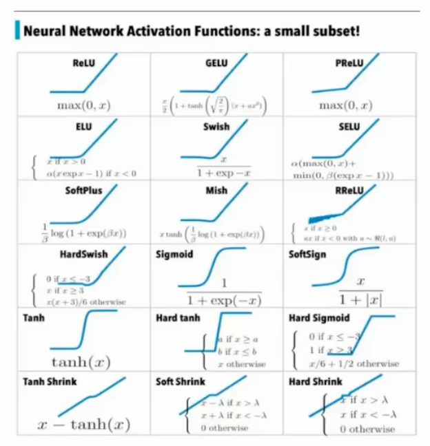

* 选激活函数 https://machinelearningmastery.com/choose-an-activation-function-for-deep-learning/
  * When using the ReLU function for hidden layers, it is a good practice to use a “*He Normal*” or “*He Uniform*” weight initialization and scale input data to the range 0-1 (normalize) prior to training.
* 典型问题：XOR问题
* 


* sigmoid函数
  * 1/(1+e^(-x))
  * 非常适合作为模型的输出函数用于输出一个0~1范围内的概率值
  * 已经不太受欢迎，实际中很少作为激活函数
    * 容易造成梯度消失。我们从导函数图像中了解到sigmoid的导数都是小于0.25的，那么在进行反向传播的时候，梯度相乘结果会慢慢的趋向于0。这样几乎就没有梯度信号通过神经元传递到前面层的梯度更新中，因此这时前面层的权值几乎没有更新，这就叫梯度消失。除此之外，为了防止饱和，必须对于权重矩阵的初始化特别留意。如果初始化权重过大，可能很多神经元得到一个比较小的梯度，致使神经元不能很好的更新权重提前饱和，神经网络就几乎不学习。
    * 函数输出不是以 0 为中心的，梯度可能就会向特定方向移动，从而降低权重更新的效率
    * 指数计算消耗资源
* Tanh(x)=2Sigmoid(2x)−1
  * 相比sigmoid，以0为中心

##### LLM中的各种激活函数

https://sathvikjoel.github.io/posts/tech/05032024_activationfunctions/

#### ReLU系列

* ReLU
  * 优点：
    * ReLU解决了梯度消失的问题，当输入值为正时，神经元不会饱和
    * 由于ReLU线性、非饱和的性质，在SGD中能够快速收敛
    * 计算复杂度低，不需要进行指数运算
  * 缺点：
    * 输出不是以0为中心的
    * Dead ReLU 问题：要设置一个合适的较小的学习率
* Leaky ReLU：解决了ReLU输入值为负时神经元出现的死亡的问题
  * 函数中的α，需要通过先验知识人工赋值（一般设为0.01）
  * 有些近似线性，导致在复杂分类中效果不好。
* Parametric ReLU：alpha可学习
* ELU：
  * 

#### GELU

* 高斯误差线性单元（Gaussian Error Linear Unit，GELU）是一种在深度学习领域广泛应用的激活函数，是一种非线性激活函数
  * 其精确的数学表达式为： $$ \text{GELU}(x)=x \cdot \Phi(x) $$ 其中，$$\Phi(x)$$ 是标准正态分布的累积分布函数，其表达式为： $$ \Phi(x)=\frac{1}{2}\left[1 + \text{erf}\left(\frac{x}{\sqrt{2}}\right)\right] $$ 这里的 $$\text{erf}(x)$$ 是误差函数，定义为： $$ \text{erf}(x)=\frac{2}{\sqrt{\pi}}\int_{0}^{x}e^{-t^{2}}dt $$ 
  * 在实际应用中，为了提高计算效率，通常使用近似公式来计算 GELU，常见的近似公式有： - 近似公式一： $$ \text{GELU}(x) \approx 0.5x\left(1 + \tanh\left[\sqrt{\frac{2}{\pi}}\left(x + 0.044715x^{3}\right)\right]\right) $$ - 近似公式二： $$ \text{GELU}(x) \approx x \cdot \sigma(1.702x) $$ 其中 $$\sigma(x)$$ 是 sigmoid 函数，$$\sigma(x)=\frac{1}{1 + e^{-x}}$$。 


### 损失函数 (Loss Functions)

损失函数（或成本函数）用于衡量模型预测值与真实值之间的差异。模型训练的目标是最小化损失函数。

#### BPR Loss (Bayesian Personalized Ranking)

BPR Loss 是一种在推荐系统中广泛应用的**成对排序损失 (Pairwise Ranking Loss)**，尤其适用于处理隐式反馈数据（如点击、购买、观看等）。

它的核心思想不是直接预测用户对物品的评分（pointwise），而是对物品进行排序（pairwise）。它试图最大化用户对“正样本”（用户交互过的物品 `i`）的预测分数高于“负样本”（用户未交互过的物品 `j`）的预测分数的概率。

*   **数据假设**：BPR 假设用户对他们交互过的物品的偏好程度，要高于他们未交互过的物品。
*   **训练数据**：训练数据由三元组 `(u, i, j)` 构成，其中 `u` 代表用户，`i` 是该用户交互过的正样本，`j` 是为该用户采样的、他未交互过的负样本。
*   **损失函数**：
    $ \mathcal{L}_{\text{BPR}} = \sum_{(u,i,j) \in D_S} -\ln \sigma(\hat{x}_{ui} - \hat{x}_{uj}) + \lambda ||\Theta||^2 $
    *   $\hat{x}_{ui}$ 是模型预测的用户 `u` 对物品 `i` 的分数。在矩阵分解模型中，这通常是用户和物品隐向量的内积：$\hat{x}_{ui} = \mathbf{v}_u^T \mathbf{v}_i$。
    *   我们希望正样本的分数高于负样本，即 $\hat{x}_{ui} > \hat{x}_{uj}$。当这个差值越大，$\sigma(\hat{x}_{ui} - \hat{x}_{uj})$ 越接近1，损失 $-\ln(\cdot)$ 越接近0。

#### 交叉熵 (Cross-Entropy)

*   交叉熵源于信息论，衡量两个概率分布之间的差异。在机器学习中，它常用于分类任务。
*   **定义**: $H(p, q) = - \sum_{x} p(x) \log(q(x))$
    *   `p`: 真实分布 (true distribution)
    *   `q`: 预测分布 (predicted distribution)
*   **分类任务中的应用**:
    *   **二元交叉熵 (Binary Cross-Entropy)**: 用于二分类问题。对于单个样本，损失为 $L = -(y \log(\hat{y}) + (1-y) \log(1-\hat{y}))$，其中 `y` 是真实标签 (0或1)，$$\hat{y}$$ 是模型预测为类别1的概率。
    *   **分类交叉熵 (Categorical Cross-Entropy)**: 用于多分类问题。对于单个样本，损失为 $L = - \sum_{c=1}^{M} y_c \log(\hat{y}_c)$，其中 `M` 是类别数，`y_c` 是一个 one-hot 向量，表示真实类别，$$\hat{y}_c$$ 是模型对类别 `c` 的预测概率。

#### 均方误差 (Mean Squared Error, MSE)

*   MSE 主要用于回归任务，计算预测值与真实值之差的平方的均值。
*   **定义**: $MSE = \frac{1}{n} \sum_{i=1}^{n} (y_i - \hat{y}_i)^2$
*   对异常值（outliers）非常敏感，因为误差被平方了。

#### 平均绝对误差 (Mean Absolute Error, MAE)

*   MAE 也用于回归任务，计算预测值与真实值之差的绝对值的均值。
*   **定义**: $MAE = \frac{1}{n} \sum_{i=1}^{n} |y_i - \hat{y}_i|$
*   相比 MSE，MAE 对异常值的鲁棒性更好。

#### Hinge Loss

*   主要用于“最大间隔”分类，特别是支持向量机 (SVM)。
*   它会惩罚那些不仅被错误分类，而且离决策边界不够远的样本。
*   **定义**: $L(y, \hat{y}) = \max(0, 1 - y \cdot \hat{y})$
    *   `y` 是真实标签，取值为 `{-1, 1}`。
    *   `\hat{y}` 是分类器的原始输出（不是概率）。当 `y` 和 `\hat{y}` 同号且 $$|\hat{y}| \ge 1$$ 时，损失为0。

#### Huber Loss

*   结合了 MSE 和 MAE 的优点，对异常值具有鲁棒性。当误差较小时，它像 MSE 一样是二次的；当误差较大时，它像 MAE 一样是线性的。
*   **定义**:
    $
    L_{\delta}(y, \hat{y}) =
    \begin{cases}
    \frac{1}{2}(y - \hat{y})^2 & \text{for } |y - \hat{y}| \le \delta \\
    \delta (|y - \hat{y}| - \frac{1}{2}\delta) & \text{otherwise}
    \end{cases}
    $
    *   `\delta` 是一个超参数，用于区分“小误差”和“大误差”。

#### Focal Loss

*   对标准交叉熵的改进，旨在解决类别不平衡问题（如目标检测）。
*   它通过降低已正确分类样本的权重，使模型更专注于学习难分类的样本。
*   **定义**: $FL(p_t) = -\alpha_t (1-p_t)^\gamma \log(p_t)$
    *   `p_t` 是模型对真实类别的预测概率。
    *   `\gamma` (gamma) 是聚焦参数 (`\gamma > 0`)，`\gamma` 越大，对易分类样本的降权效果越明显。
    *   `\alpha_t` 是一个平衡因子，用于平衡正负样本的重要性。

### Tuning

https://github.com/google-research/tuning_playbook

### Visualization 可视化

#### t-SNE：可视化高维向量

* 科普文章 https://medium.com/@sachinsoni600517/mastering-t-sne-t-distributed-stochastic-neighbor-embedding-0e365ee898ea

#### k-means clustering

* k个初值，means方法归类，N次迭代

#### Partial Dependency Plots (PDP, 部分依赖图)


### Evalutaion/Validation

* Metrics
  * **Mean Absolute Error** (MAE)
  * Normalized Discounted Cumulative Gain (NDCG)
  * Root Mean Square Error 

* holdout validation, cross-validation, leave-one-out validation, etc
  * “leave-one-out” 将数据分割为训练集、验证集和测试集。具体操作是对于每个用户，将其一个交互行为数据留出作为测试集，其余的作为训练集和验证集。例如，对于有N个交互行为的用户，选择其中第N个行为作为测试数据，其余N-1个行为用于训练和验证。

```python
train_data, validation_data, test_data = np.split(model_data.sample(frac=1, random_state=1729), [int(0.7 * len(model_data)), int(0.9 * len(model_data))])   # Randomly sort the data then split out first 70%, second 20%, and last 10%
```

#### 衡量相关性

* cosine similarity
* Pearson correlation
  * 


### 训练采样

* Intro
  * https://www.tensorflow.org/extras/candidate_sampling.pdf


### 模型训练技巧

#### Loss 设计和算法技巧

* crossentropy、KL散度、logistic regression、softmax
  * KL散度 ---> CE loss: [看得见的信息论-为什么用交叉熵作为逻辑回归的代价函数](https://zhuanlan.zhihu.com/p/31207556)
  * logistic regression ---> softmax
  * CE loss + softmax ---> 极其简洁的梯度形式
    * [求导推导](https://zhuanlan.zhihu.com/p/27223959)
    * $\frac{\partial l_{CE}}{\partial a_j}=y_j -t_j$
* Feature Bagging

  * offering a potentially useful way of managing the bias-variance tradeoff

  * We were also interested in this as a potentially useful way to further parallelize training

  * 《An experimental comparison of three methods for constructing ensembles of decision trees: Bagging, boosting, and randomization》


* Dropout
  * 保证training/serving一致性：training或serving时scale
  * In the dense setting, dropout serves to separate effects from strongly correlated features, resulting in a more robust classifier. But in our sparse, noisy setting adding in dropout appears to simply reduce the amount of data available for learning. 《Ad Click Prediction: a View from the Trenches》
* Initialization
  
  * Xavier Initialization
  * 
  * Kaiming Initialization主要用于激活函数为ReLU（Rectified Linear Unit）的神经网络。
* 过拟合

  * 过拟合问题存在其他更深刻的原因。例如，将 28 × 28 的图片实施扁平化操作，将其变换为一个长度为 784 的一维向量，这将完全丢失了像素的空间排列信息

  * [为什么过多的特征（feature）导致过拟合（over-fitting)？ - Dr.Shiki的回答 - 知乎](https://www.zhihu.com/question/47375421/answer/306771331)

#### Hard Negative Mining (难负样本挖掘)

*   **核心思想**：在训练中，不使用全部的负样本，而是专注于挑选那些模型最容易误判为正样本的“困难”负样本（Hard Negatives）来进行训练。
*   **动机**：在物体检测、图文匹配等任务中，负样本（如背景）数量远超正样本，造成样本失衡。
    1.  **梯度被简单样本主导**：若使用全部样本，大量简单的、损失小的负样本会主导梯度计算，导致模型把精力浪费在已经学得很好的知识上。
    2.  **训练效率低下**：反复学习简单样本会减慢模型的收敛速度。
*   **定义“困难”负样本**：指那些**模型预测为正样本的概率很高，但真实标签却是负样本**的例子。它们是模型最容易犯错的、位于决策边界附近的样本，其损失值（Loss）通常最高。
*   **在线困难样本挖掘 (Online Hard Negative Mining, OHEM)** 流程：
    1.  **前向传播**：在一个 mini-batch 中，对所有正样本和大量候选负样本进行前向计算，得到每个样本的损失。
    2.  **筛选样本**：保留所有正样本，然后从所有负样本中，根据损失值从高到低排序，选出损失最高的 Top-K 个作为困难负样本（通常会维持一个固定的正负样本比例，如 1:3）。
    3.  **反向传播**：只用筛选出的正样本和困难负样本来计算总损失，并进行反向传播，更新模型参数。
*   **应用场景**：
    *   **物体检测** (Object Detection)，如 SSD 算法。
    *   **图像检索/度量学习** (Metric Learning)，如 Triplet Loss。
    *   **图文匹配** (Image-Text Matching)，如 BLIP-2 的 ITM 任务。

#### 提升生成多样性/防止模式坍塌

为防止生成模型输出单一、固定的结果（模式坍塌），可在损失函数中引入正则化技巧：

*   **标签平滑 (Label Smoothing)**
    *   **核心**: 将 one-hot 硬标签转换为软标签，防止模型对预测过于自信。
    *   **效果**: 降低过拟合，使输出概率分布更平滑。

*   **熵正则化 (Entropy Regularization)**
    *   **核心**: 在损失中加入惩罚项，鼓励模型输出的概率分布熵更大（更均匀）。
    *   **效果**: 直接提升输出多样性，缓解 Beam Search 等解码策略中的趋同问题。
    *   **实现**: 可通过最小化 `-log_probs.mean()` 实现，这等价于最小化输出分布与均匀分布的KL散度。

*   **Logits 方差损失 (Variance Loss on Logits)**
    *   **核心**: 直接惩罚 logits 的方差，当 logits 数值分布两极分化时施加损失。
    *   **效果**: 迫使 logits 分布更平坦，降低模型对少数选项的“极端自信”。

### ML Theory

* 参考「mathematics.md」


### Learning To Rank

#### Pairwise 方法与损失函数

在排序学习（Learning to Rank, LTR）中，**Pairwise** 方法是一种主流思想，它将排序问题转化为对“物品对”的偏序关系的判断。其核心目标是学习一个排序函数 `f(x)`，使得对于任意一个正样本 `d+` 和负样本 `d-`，模型打分满足 `f(d+) > f(d-)`。以下是实现这一目标的两种核心损失函数。

| 特性         | 交叉熵损失 (Cross-Entropy Loss)  | 铰链损失 (Hinge Loss)           |
| :----------- | :------------------------------- | :------------------------------ |
| **核心思想** | 概率最大化 (Maximize Likelihood) | 间隔最大化 (Maximize Margin)    |
| **优化目标** | `s+` 远大于 `s-`                 | `s+` 至少比 `s-` 大一个间隔 `m` |
| **损失特性** | 平滑，理论上永不为0              | 非平滑，当间隔满足时为0         |
| **关注点**   | 所有序对                         | 违反间隔的“困难”序对            |

##### 1. 交叉熵损失 (Cross-Entropy Loss) for Ranking

这种方法将排序问题看作一个**概率问题**，核心是最大化模型正确预测偏序关系的概率。著名的 **RankNet** 算法就采用了这种损失。

*   **概率建模**: 模型对正负样本的打分分别为 `s+` 和 `s-`。`d+` 排在 `d-` 前面的概率可以通过 Sigmoid 函数建模：
    $ P(d^+ \succ d^-) = \sigma(s^+ - s^-) = \frac{1}{1 + e^{-(s^+ - s^-)}} $
*   **损失函数**: 最小化正确排序概率的负对数，即交叉熵损失：
    $ L_{CE} = -\log(\sigma(s^+ - s^-)) = \log(1 + e^{-(s^+ - s^-)}) $
*   **直觉**: 这是一个“软”损失。它总是试图无限拉大正负样本的分数差距，因为即使 `s+ > s-`，只要差距不是无穷大，损失就不会为0。

##### 2. 铰链损失 (Hinge Loss) for Ranking

这种方法源于支持向量机 (SVM)，将排序问题看作一个**带间隔 (Margin) 的分类问题**。它追求的目标是正样本的分数要比负样本高出一个指定的间隔 `m`。著名的 **RankSVM** 算法采用了此损失。

*   **间隔目标**: `s+ - s- ≥ m` (通常 `m` 设为1)。
*   **损失函数**: 只有当间隔目标未被满足时，才产生损失：
    $ L_{Hinge} = \max(0, m - (s^+ - s^-)) $
*   **直觉**: 这是一个“硬”损失。一旦分数差满足了间隔要求，损失就降为0。这使得模型更专注于学习那些“难分的”或“排错的”样本对，而对已经“足够好”的样本对不再进行优化。GBDT（Gradient Boosting Decision Tree）

* 通过拟合残差，生成第N颗子树

#### XGBoost

https://xgboost.readthedocs.io/en/stable/tutorials/model.html

XGBoost stands for “Extreme Gradient Boosting”, where the term “Gradient Boosting” originates from the paper *Greedy Function Approximation: A Gradient Boosting Machine*, by Friedman.


#### LTR

https://xgboost.readthedocs.io/en/stable/tutorials/learning_to_rank.html

* Intro
  * The default objective is `rank:ndcg` based on the `LambdaMART` [[2$$](https://xgboost.readthedocs.io/en/stable/tutorials/learning_to_rank.html#references) algorithm, which in turn is an adaptation of the `LambdaRank` [[3$$](https://xgboost.readthedocs.io/en/stable/tutorials/learning_to_rank.html#references) framework to gradient boosting trees. For a history and a summary of the algorithm, see [[5$$](https://xgboost.readthedocs.io/en/stable/tutorials/learning_to_rank.html#references)
  * 《Unbiased LambdaMART: An Unbiased Pairwise Learning-to-Rank Algorithm》
* 调参
  * lambdarank_num_pair_per_sample

### Position Bias

* Intro

  * Obtaining real relevance degrees for query results is an expensive and strenuous, requiring human labelers to label all results one by one. When such labeling task is infeasible, we might want to train the learning-to-rank model on user click data instead, as it is relatively easy to collect. Another advantage of using click data directly is that it can reflect the most up-to-date user preferences [[1$$](https://xgboost.readthedocs.io/en/stable/tutorials/learning_to_rank.html#references). However, user clicks are often biased, as users tend to choose results that are displayed in higher positions. User clicks are also noisy, where users might accidentally click on irrelevant documents. To ameliorate these issues, XGBoost implements the `Unbiased LambdaMART` [[4$$](https://xgboost.readthedocs.io/en/stable/tutorials/learning_to_rank.html#references) algorithm to debias the position-dependent click data. The feature can be enabled by the `lambdarank_unbiased` parameter; see [Parameters for learning to rank (rank:ndcg, rank:map, rank:pairwise)](https://xgboost.readthedocs.io/en/stable/parameter.html#ltr-param) for related options and [Getting started with learning to rank](https://xgboost.readthedocs.io/en/stable/python/examples/learning_to_rank.html#sphx-glr-python-examples-learning-to-rank-py) for a worked example with simulated user clicks.

  

### RNN/LSTM/GRU

* Intro
  * GRU解决了RNN的梯度消失问题，参数量比LSTM小


### Contrastive Learning

> Weng, Lilian. (May 2021). Contrastive representation learning. Lil’Log. https://lilianweng.github.io/posts/2021-05-31-contrastive/.

#### Intro

* [Constrastive Learning: MoCo and SimCLR](https://mp.weixin.qq.com/s/v5p9QA3vDl-WTF3-7shp4g)
* batch size比较重要，增加batch size可以增加正负样本对的数量

#### Contrastive Training Objectives

* In early versions of loss functions for contrastive learning, only one positive and one negative sample are involved. The trend in recent training objectives is to **include multiple positive and negative pairs in one batch**.

##### Common Setup

* 分布与假设：设数据边缘分布为 $$p_{\text{data}}(x)$$，正样本对分布为 $$p_{\text{pos}}(x, x^+)$$，满足：
  * 对称：$$\forall x, x^+\!,\; p_{\text{pos}}(x, x^+) = p_{\text{pos}}(x^+, x)$$。
  * 边缘匹配：$$\forall x\!,\; \int p_{\text{pos}}(x, x^+)\,\mathrm{d}x^+ = p_{\text{data}}(x)$$。
* 目标：学习 L2 归一化编码器 $$f(x)$$，用内积衡量相似度；每个锚点采样 $$M$$ 个负例 $$\{x_i^-\}_{i=1}^M\overset{\text{i.i.d.}}\sim p_{\text{data}}$$。
* 对比学习损失（InfoNCE 形式）：
  $$\mathcal{L} = -\mathbb{E}\Bigg[\log\frac{\exp\big(f(x)^\top f(x^+)/\tau\big)}{\exp\big(f(x)^\top f(x^+)/\tau\big) + \sum_{i=1}^{M} \exp\big(f(x)^\top f(x_i^-)/\tau\big)}\Bigg]$$
* 近似分解（负例数量大，分母由负例主导；用 LLN 近似）：
  $$\mathcal{L}\;\approx\; -\frac{1}{\tau}\,\mathbb{E}_{(x,x^+)\sim p_{\text{pos}}}\big[f(x)^\top f(x^+)\big]\; +\; \mathbb{E}_{x\sim p_{\text{data}}}\Big[\log\, \mathbb{E}_{x^-\sim p_{\text{data}}}\big[\exp\big(f(x)^\top f(x^-)/\tau\big)\big]\Big] \; + \; \text{const}$$
  * 前项是 Alignment（拉近正对）；后项是 Uniformity（鼓励在球面上均匀，抑制塌缩）。
* 参考：Understanding Contrastive Representation Learning through Alignment and Uniformity — https://arxiv.org/abs/2005.10242 （Wang & Isola, 2020）

##### Contrastive Loss

**Contrastive loss** (Chopra et al. 2005) is one of the earliest training objectives used for deep metric learning in a contrastive fashion.

Given a list of input samples \(\{\mathbf{x}_i\}\), each has a corresponding label \(y_i \in \{1, \dots, L\}\) among L classes. We would like to learn a function \(f_\theta(.) : \mathcal{X} \rightarrow \mathbb{R}^d\) that encodes \(x_i\) into an embedding vector such that examples from the same class have similar embeddings and samples from different classes have very different ones. Thus, contrastive loss takes a pair of inputs \((\mathbf{x}_i, \mathbf{x}_j)\) and minimizes the embedding distance when they are from the same class but maximizes the distance otherwise.

\(\mathcal{L}_{\text{cont}}(\mathbf{x}_i, \mathbf{x}_j, \theta) = \mathbb{I}[y_i = y_j] \| f_\theta(\mathbf{x}_i) - f_\theta(\mathbf{x}_j) \|_2^2 + \mathbb{I}[y_i \neq y_j] \max(0, \epsilon - \| f_\theta(\mathbf{x}_i) - f_\theta(\mathbf{x}_j) \|_2)^2\)

where \(\epsilon\) is a hyperparameter, defining the lower bound distance between samples of different classes.

##### Triplet loss

Triplet loss was originally proposed in the FaceNet (Schroff et al. 2015) paper and was used to learn face recognition of the same person at different poses and angles.

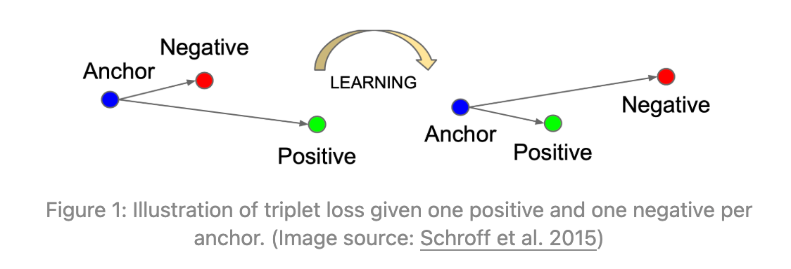

Given one anchor input \(\mathbf{x}\), we select one positive sample \(\mathbf{x}^+\) and one negative \(\mathbf{x}^-\), meaning that \(\mathbf{x}^+\) and \(\mathbf{x}\) belong to the same class and \(\mathbf{x}^-\) is sampled from another different class. Triplet loss learns to minimize the distance between the anchor \(\mathbf{x}\) and positive \(\mathbf{x}^+\) and maximize the distance between the anchor \(\mathbf{x}\) and negative \(\mathbf{x}^-\) at the same time with the following equation:

\(\mathcal{L}_{\text{triplet}}(\mathbf{x}, \mathbf{x}^+, \mathbf{x}^-) = \sum_{\mathbf{x} \in \mathcal{X}} \max \left( 0, \left\| f(\mathbf{x}) - f(\mathbf{x}^+) \right\|_2^2 - \left\| f(\mathbf{x}) - f(\mathbf{x}^-) \right\|_2^2 + \epsilon \right)\)

where the margin parameter \(\epsilon\) is configured as the minimum offset between distances of similar vs dissimilar pairs.

* 难负例很重要：It is crucial to select **challenging \(\mathbf{x}^-\)** to truly improve the model.

##### Lifted Structured Loss

> Deep Metric Learning via Lifted Structured Feature Embedding — https://arxiv.org/abs/1511.06452

Lifted Structured Loss (Song et al. 2015) utilizes all the pairwise edges within one training batch for better computational efficiency.

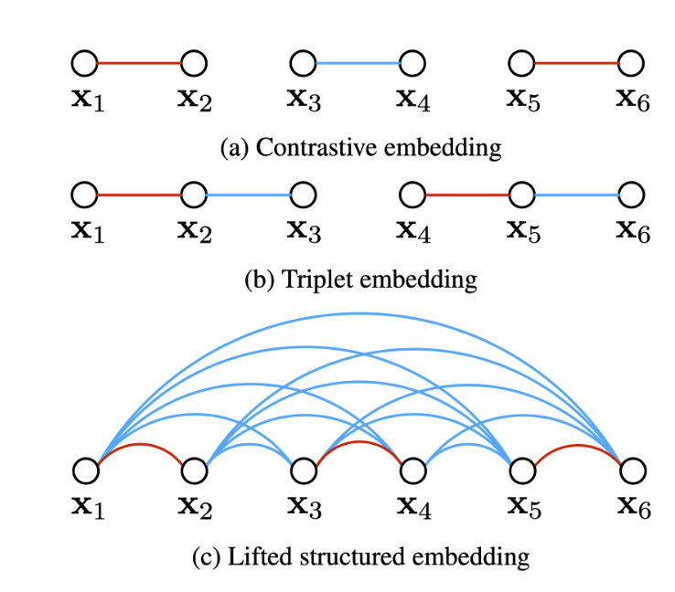

Let $$D_{ij} = \| f(\mathbf{x}_i) - f(\mathbf{x}_j) \|_2$$, a structured loss function is defined as

$$
\mathcal{L}_{\text{struct}} = \frac{1}{2|\mathcal{P}|} \sum_{(i,j) \in \mathcal{P}} \max\big(0, 
\, \mathcal{L}_{\text{struct}}^{(ij)}\big)^2
$$

where

$$
\mathcal{L}_{\text{struct}}^{(ij)} = D_{ij} + \max\Big( \max_{(i,k) \in \mathcal{N}} \epsilon - D_{ik},\; \max_{(j,l) \in \mathcal{N}} \epsilon - D_{jl} \Big)
$$

where $$\mathcal{P}$$ contains the set of positive pairs and $$\mathcal{N}$$ is the set of negative pairs. Note that the dense pairwise squared distance matrix can be easily computed per training batch.

The red part in $$\mathcal{L}_{\text{struct}}^{(ij)}$$ is used for mining hard negatives. However, it is not smooth and may cause the convergence to a bad local optimum in practice. Thus, it is relaxed to be:

$$
\mathcal{L}_{\text{struct}}^{(ij)} = D_{ij} + \log \Big( \sum_{(i,k) \in \mathcal{N}} \exp(\epsilon - D_{ik}) + \sum_{(j,l) \in \mathcal{N}} \exp(\epsilon - D_{jl}) \Big)
$$

In the paper, they also proposed to enhance the quality of negative samples in each batch by actively incorporating difficult negative samples given a few random positive pairs.

##### N-pair Loss

> Improved Deep Metric Learning with Multi-class N-pair Loss Objective — https://proceedings.neurips.cc/paper/2016/file/6b180037abbebea991d8b1232f8a8ca9-Paper.pdf

Multi-Class N-pair loss (Sohn 2016) generalizes triplet loss to include comparison with multiple negative samples.

Given a $$(N + 1)$$-tuplet of training samples, $$\{\mathbf{x}, \mathbf{x}^+, \mathbf{x}_1^-, \dots, \mathbf{x}_{N-1}^-\}$$, including one positive and $$N - 1$$ negative ones, N-pair loss is defined as:

$$
\mathcal{L}_{\text{N-pair}}(\mathbf{x}, \mathbf{x}^+, \{\mathbf{x}_i^-\}_{i=1}^{N-1})
= \log \Big( 1 + \sum_{i=1}^{N-1} \exp\big( f(\mathbf{x})^\top f(\mathbf{x}_i^-) - f(\mathbf{x})^\top f(\mathbf{x}^+) \big) \Big)
$$

$$
= - \log \frac{\exp\big(f(\mathbf{x})^\top f(\mathbf{x}^+)\big)}{\exp\big(f(\mathbf{x})^\top f(\mathbf{x}^+)\big) + \sum_{i=1}^{N-1} \exp\big(f(\mathbf{x})^\top f(\mathbf{x}_i^-)\big)}
$$

If we only sample one negative sample per class, it is equivalent to the softmax loss for multi-class classification.

##### NCE

**Noise Contrastive Estimation**, short for **NCE**, is a method for estimating parameters of a statistical model, proposed by [Gutmann & Hyvarinen](http://proceedings.mlr.press/v9/gutmann10a.html) in 2010. The idea is to run logistic regression to tell apart the target data from noise. Read more on how NCE is used for learning word embedding [here](https://lilianweng.github.io/posts/2017-10-15-word-embedding/#noise-contrastive-estimation-nce).

Let $$\mathbf{x}$$ be the target sample $$\sim P(\mathbf{x}\,|\,C=1;\,\theta)=p_{\theta}(\mathbf{x})$$ and $$\tilde{\mathbf{x}}$$ be the noise sample $$\sim P(\tilde{\mathbf{x}}\,|\,C=0)=q(\tilde{\mathbf{x}})$$. Note that the logistic regression models the logit (i.e., log-odds) and in this case we would like to model the logit of a sample $$\mathbf{u}$$ from the target data distribution instead of the noise distribution:

$$\ell_{\theta}(\mathbf{u}) = \log \frac{p_{\theta}(\mathbf{u})}{q(\mathbf{u})} = \log p_{\theta}(\mathbf{u}) - \log q(\mathbf{u})$$

After converting logits into probabilities with sigmoid $$\sigma(\cdot)$$, we can apply cross entropy loss:

$$\mathcal{L}_{\text{NCE}} = -\frac{1}{N} \sum_{i=1}^{N} \Big[ \log \sigma\big( \ell_{\theta}(\mathbf{x}_i) \big) + \log \big( 1 - \sigma\big( \ell_{\theta}(\tilde{\mathbf{x}}_i) \big) \big) \Big]$$

where $$\sigma(\ell) = \frac{1}{1+\exp(-\ell)} = \frac{p_{\theta}}{p_{\theta}+q}$$.

Here I listed the original form of NCE loss which works with only one positive and one noise sample. In many follow-up works, contrastive loss incorporating multiple negative samples is also broadly referred to as NCE.

* 与对比学习目标的关系：
  * 视角：NCE做“密度估计”二分类；Contrastive/Triplet/N-pair做“嵌入几何”判别。
  * 负例：NCE来自显式噪声分布 $$q(x)$$；前述损失由标签或难负例挖掘得到。
  * 打分：NCE使用对数密度比 $$\ell_\theta(u)=\log p_\theta(u)-\log q(u)$$ 并以二分类交叉熵优化；Contrastive/Triplet使用距离+margin；N-pair/InfoNCE使用 softmax 交叉熵，其中 InfoNCE 的打分满足 $$f(x,c)\propto \frac{p(x\mid c)}{p(x)}$$。
  * 场景：拟合未归一化模型且可采样噪声分布时用 NCE；表征学习更常用 N-pair/InfoNCE。

##### InfoNCE

* The **InfoNCE loss** in CPC ([Contrastive Predictive Coding](https://lilianweng.github.io/posts/2019-11-10-self-supervised/#contrastive-predictive-coding); [van den Oord, et al. 2018](https://arxiv.org/abs/1807.03748)), inspired by [NCE](https://lilianweng.github.io/posts/2021-05-31-contrastive/#NCE), uses categorical cross-entropy loss to identify the positive sample amongst a set of unrelated noise samples.

* **The probability of we detecting the positive sample correctly is:** $$ p(C = \text{pos}|\mathcal{X}, \boldsymbol{c}) = \frac{p(\boldsymbol{x}_{\text{pos}}|\boldsymbol{c}) \prod_{\substack{i=1, \dots, N; i \neq \text{pos}}} p(\boldsymbol{x}_i)}{\sum_{j=1}^N \left[ p(\boldsymbol{x}_j|\boldsymbol{c}) \prod_{\substack{i=1, \dots, N; i \neq j}} p(\boldsymbol{x}_i) \right]} = \frac{\frac{p(\boldsymbol{x}_{\text{pos}}|\boldsymbol{c})}{p(\boldsymbol{x}_{\text{pos}})}}{\sum_{j=1}^N \frac{p(\boldsymbol{x}_j|\boldsymbol{c})}{p(\boldsymbol{x}_j)}} = \frac{f(\boldsymbol{x}_{\text{pos}}, \boldsymbol{c})}{\sum_{j=1}^N f(\boldsymbol{x}_j, \boldsymbol{c})} $$ where the scoring function is $$ f(\boldsymbol{x}, \boldsymbol{c}) \propto \frac{p(\boldsymbol{x}|\boldsymbol{c})}{p(\boldsymbol{x})} $$.
  * Given a context vector $$ \boldsymbol{c} $$, the positive sample should be drawn from the conditional distribution $$ p(\boldsymbol{x}|\boldsymbol{c}) $$, while $$ N - 1 $$ negative samples are drawn from the proposal distribution $$ p(\boldsymbol{x}) $$, independent from the context $$ \boldsymbol{c} $$. For brevity, let us label all the samples as $$ \mathcal{X} = \{\boldsymbol{x}_i\}_{i=1}^N $$, among which only one of them $$ \boldsymbol{x}_{\text{pos}} $$ is a positive sample. 
* The InfoNCE loss optimizes the negative log probability of classifying the positive sample correctly: $$ \mathcal{L}_{\text{InfoNCE}} = -\mathbb{E} \left[ \log \frac{f(\boldsymbol{x}, \boldsymbol{c})}{\sum_{\boldsymbol{x}' \in \mathcal{X}} f(\boldsymbol{x}', \boldsymbol{c})} \right] $$ 
* The fact that $$ f(\boldsymbol{x}, \boldsymbol{c}) $$ estimates the density ratio $$ \frac{p(\boldsymbol{x}|\boldsymbol{c})}{p(\boldsymbol{x})} $$ has a connection with mutual information optimization. To maximize the mutual information between input $$ \boldsymbol{x} $$ and context vector $$ \boldsymbol{c} $$, we have: $$ I(\boldsymbol{x}; \boldsymbol{c}) = \sum_{\boldsymbol{x}, \boldsymbol{c}} p(\boldsymbol{x}, \boldsymbol{c}) \log \frac{p(\boldsymbol{x}, \boldsymbol{c})}{p(\boldsymbol{x})p(\boldsymbol{c})} = \sum_{\boldsymbol{x}, \boldsymbol{c}} p(\boldsymbol{x}, \boldsymbol{c}) \log \frac{p(\boldsymbol{x}|\boldsymbol{c})}{p(\boldsymbol{x})} $$ where the logarithmic term is estimated by $$ f $$.
  * 最小化 InfoNCE Loss，实际上是在 最大化锚点 c 和正样本 x_i 之间互信息 (Mutual Information) 的一个下界

* 与 N-pair 的关系：两者形式同为 softmax 交叉熵，差异在打分含义与负例采样假设：
  * 形式：$$\mathcal{L}=-\log\frac{\exp(s(x_{pos},c))}{\sum_j \exp(s(x_j,c))}$$。
  * InfoNCE：$$s(x,c)=\log f(x,c)\approx \log\frac{p(x\mid c)}{p(x)}$$（密度比，需负例来自 $$p(x)$$）。
  * N-pair：$$s(x,c)=f(x)^\top f(c)$$（几何相似度，负例为其他标签样本）。
  * 选择：自监督/互信息目标优先 InfoNCE；监督度量学习优先 N-pair。

* For sequence prediction tasks, rather than modeling the future observations $$ p_k(\boldsymbol{x}_{t + k}|\boldsymbol{c}_t) $$ directly (which could be fairly expensive), CPC models a density function to preserve the mutual information between $$ \boldsymbol{x}_{t + k} $$ and $$ \boldsymbol{c}_t $$: $$ f_k(\boldsymbol{x}_{t + k}, \boldsymbol{c}_t) = \exp\left( \boldsymbol{z}_{t + k}^\top \mathbf{W}_k \boldsymbol{c}_t \right) \propto \frac{p(\boldsymbol{x}_{t + k}|\boldsymbol{c}_t)}{p(\boldsymbol{x}_{t + k})} $$ where $$ \boldsymbol{z}_{t + k} $$ is the encoded input and $$ \mathbf{W}_k $$ is a trainable weight matrix. 


##### Soft-Nearest Neighbors (SNN)

* 定义：给定一个批次样本 $$\{(\mathbf{x}_i, y_i)\}_{i=1}^B$$ 和相似度函数 $$f(\cdot,\cdot)$$，在温度 $$\tau$$ 下，损失为：
  $$\mathcal{L}_{\mathrm{snn}}=-\frac{1}{B}\sum_{i=1}^{B}\log\frac{\sum_{\substack{j\neq i,\\ y_j=y_i}}\exp\!\left(-\,f(\mathbf{x}_i,\mathbf{x}_j)/\tau\right)}{\sum_{\substack{k\neq i}}\exp\!\left(-\,f(\mathbf{x}_i,\mathbf{x}_k)/\tau\right)}$$
* 作用：鼓励同类样本在表征空间更近、异类更远，允许多个正样本。
* 温度 $$\tau$$：调节聚集程度；当 $$\tau$$ 较低时更关注小距离，远距离贡献变小。
* 参考：[Frosst et al., 2019](https://arxiv.org/abs/1902.01896)

#### 训练技巧

##### Heavy Data Augmentation

Given a training sample, data augmentation techniques are needed for creating noise versions of itself to feed into the loss as positive samples. Proper data augmentation setup is critical for learning good and generalizable embedding features. It introduces the non-essential variations into examples without modifying semantic meanings and thus encourages the model to learn the essential part of the representation. For example, experiments in [SimCLR](https://lilianweng.github.io/posts/2021-05-31-contrastive/#simclr) showed that the composition of random cropping and random color distortion is crucial for good performance on learning visual representation of images.

##### Large Batch Size

Using a large batch size during training is another key ingredient in the success of many contrastive learning methods (e.g. [SimCLR](https://lilianweng.github.io/posts/2021-05-31-contrastive/#simclr), [CLIP](https://lilianweng.github.io/posts/2021-05-31-contrastive/#clip)), especially when it relies on in-batch negatives. Only when the batch size is big enough, the loss function can cover a diverse enough collection of negative samples, challenging enough for the model to learn meaningful representation to distinguish different examples.

##### Hard Negative Mining —— Sampling Bias 分析

Hard negative samples should have different labels from the anchor sample, but have embedding features very close to the anchor embedding. With access to ground truth labels in supervised datasets, it is easy to identify task-specific hard negatives. For example when learning sentence embedding, we can treat sentence pairs labelled as “contradiction” in NLI datasets as hard negative pairs (e.g. [SimCSE](https://lilianweng.github.io/posts/2021-05-31-contrastive/#dropout-and-cutoff), or use top incorrect candidates returned by BM25 with most keywords matched as hard negative samples ([DPR](https://lilianweng.github.io/posts/2020-10-29-odqa/#DPR); [Karpukhin et al., 2020](https://arxiv.org/abs/2004.04906)).

However, it becomes tricky to do hard negative mining when we want to remain unsupervised. Increasing training batch size or [memory bank](https://lilianweng.github.io/posts/2021-05-31-contrastive/#memory-bank) size implicitly introduces more hard negative samples, but it leads to a heavy burden of large memory usage as a side effect.

[Chuang et al. (2020)](https://arxiv.org/abs/2007.00224) studied the sampling bias in contrastive learning and proposed debiased loss. In the unsupervised setting, since we do not know the ground truth labels, we may accidentally sample false negative samples. Sampling bias can lead to significant performance drop.

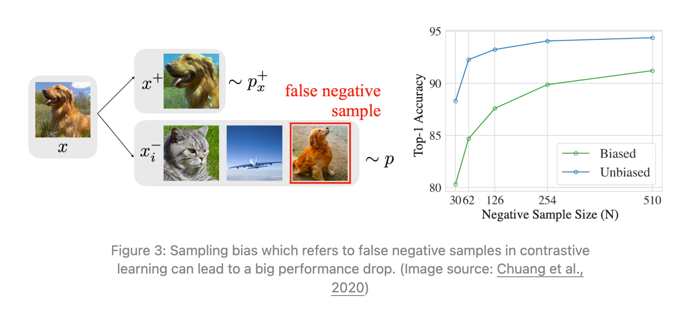


Let us assume the probability of anchor class \(c\) is uniform $$\rho(c)=\eta^+$$ and the probability of observing a different class is $$\eta^- = 1 - \eta^+$$.

- The probability of observing a positive example for \(\mathbf{x}\) is $$p_{\mathbf{x}}^+(\mathbf{x}')=p(\mathbf{x}'\mid h_{\mathbf{x}'}=h_{\mathbf{x}})$$;
- The probability of getting a negative sample for \(\mathbf{x}\) is $$p_{\mathbf{x}}^-(\mathbf{x}')=p(\mathbf{x}'\mid h_{\mathbf{x}'}\neq h_{\mathbf{x}})$$.

When we are sampling \(\mathbf{x}^-\), we cannot access the true $$p_{\mathbf{x}}^-(\mathbf{x}^-)$$ and thus \(\mathbf{x}^-\) may be sampled from the (undesired) anchor class \(c\) with probability $$\eta^+$$. The actual sampling data distribution becomes:

$$p(\mathbf{x}') = \eta^+\, p_{\mathbf{x}}^+(\mathbf{x}') + \eta^-\, p_{\mathbf{x}}^-(\mathbf{x}')$$

Thus we can use

$$p_{\mathbf{x}}^-(\mathbf{x}') = \frac{p(\mathbf{x}') - \eta^+\, p_{\mathbf{x}}^+(\mathbf{x}')}{\eta^-}$$

for sampling \(\mathbf{x}^-\) to debias the loss. With \(N\) samples \(\{\mathbf{u}_i\}_{i=1}^N\) from \(p\) and \(M\) samples \(\{\mathbf{v}_i\}_{i=1}^M\) from \(p_{\mathbf{x}}^+\), we can estimate the expectation of the second term $$\mathbb{E}_{\mathbf{x}^-\sim p_{\mathbf{x}}^-}[\exp(f(\mathbf{x})^\top f(\mathbf{x}^-))]$$ in the denominator of contrastive learning loss:

$$
g\big(\mathbf{x}, \{\mathbf{u}_i\}_{i=1}^N, \{\mathbf{v}_i\}_{i=1}^M\big) = \max\left\{ 
\frac{1}{\eta^-}\left( \frac{1}{N}\sum_{i=1}^N \exp\big(f(\mathbf{x})^\top f(\mathbf{u}_i)\big) - \frac{\eta^+}{M}\sum_{i=1}^M \exp\big(f(\mathbf{x})^\top f(\mathbf{v}_i)\big) \right),\; \exp(-1/\tau) \right\}
$$

where \(\tau\) is the temperature and $$\exp(-1/\tau)$$ is the theoretical lower bound of $$\mathbb{E}_{\mathbf{x}^-\sim p_{\mathbf{x}}^-}[\exp(f(\mathbf{x})^\top f(\mathbf{x}^-))]$$.

The final debiased contrastive loss looks like:

$$
\mathcal{L}_{\mathrm{debias}}^{N,M}(\mathbf{x}) = \mathbb{E}_{\mathbf{x},\{\mathbf{u}_i\}_{i=1}^N\sim p;\; \mathbf{x}^+,\{\mathbf{v}_i\}_{i=1}^M\sim p_{\mathbf{x}}^+} \left[ - \log \frac{\exp\big(f(\mathbf{x})^\top f(\mathbf{x}^+)\big)}{\exp\big(f(\mathbf{x})^\top f(\mathbf{x}^+)\big) + N\, g\big(\mathbf{x}, \{\mathbf{u}_i\}_{i=1}^N, \{\mathbf{v}_i\}_{i=1}^M\big)} \right]
$$

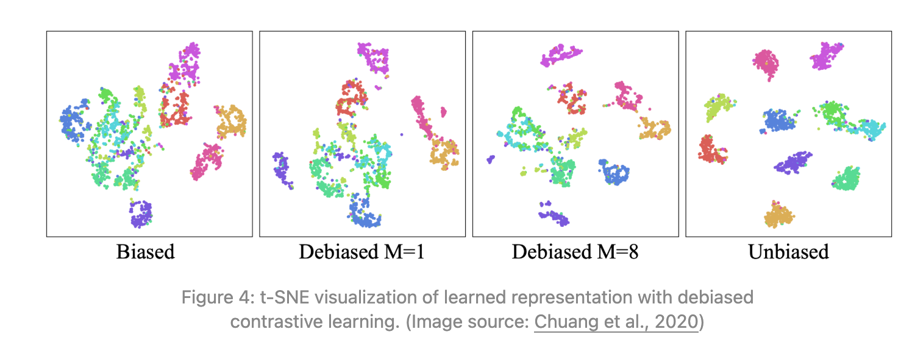

##### Hard Negative Mining —— Reweight


* 思路（Robinson et al., 2021）：通过相似度重加权负采样分布，聚焦“难负例”。设相似度为 $$\mathrm{sim}(\mathbf{x},\mathbf{x}^-) = f(\mathbf{x})^\top f(\mathbf{x}^-)$$，则新的负采样概率为：

  $$ q_{\beta}(\mathbf{x}^-) \propto \exp\big(\beta\, f(\mathbf{x})^\top f(\mathbf{x}^-)\big)\cdot p(\mathbf{x}^-) $$

  其中 \(\beta\) 为浓度参数。

* 重要性采样估计分母期望：设分区函数 \(Z_\beta, Z_\beta^+\) 可经验估计，有

  $$ \mathbb{E}_{\mathbf{u}\sim q_\beta}\big[\exp(f(\mathbf{x})^\top f(\mathbf{u}))\big] = \mathbb{E}_{\mathbf{u}\sim p}\Big[\tfrac{q_\beta}{p}\,\exp(f(\mathbf{x})^\top f(\mathbf{u}))\Big] = \frac{1}{Z_\beta}\, \mathbb{E}_{\mathbf{u}\sim p}\big[\exp\big((\beta+1) f(\mathbf{x})^\top f(\mathbf{u})\big)\big] $$

  $$ \mathbb{E}_{\mathbf{v}\sim q_\beta^+}\big[\exp(f(\mathbf{x})^\top f(\mathbf{v}))\big] = \mathbb{E}_{\mathbf{v}\sim p_{\mathbf{x}}^+}\Big[\tfrac{q_\beta^+}{p_{\mathbf{x}}^+}\,\exp(f(\mathbf{x})^\top f(\mathbf{v}))\Big] = \frac{1}{Z_\beta^+}\, \mathbb{E}_{\mathbf{v}\sim p_{\mathbf{x}}^+}\big[\exp\big((\beta+1) f(\mathbf{x})^\top f(\mathbf{v})\big)\big] $$

* 伪代码（设 `pos`/`neg` 为正负样本的 `exp(sim)` 向量，`N` 为负例数，`t` 为温度，`tau_plus` 为类概率，`beta` 为浓度参数）：

  ```
  # Original objective
  standard_loss = -log( pos.sum() / (pos.sum() + neg.sum()) )

  # Debiased objective
  Neg = max(((-N*tau_plus*pos + neg).sum() / (1 - tau_plus), e**(-1/t))
  debiased_loss = -log( pos.sum() / (pos.sum() + Neg))

  # Hard sampling objective (Ours)
  reweight = (beta*neg) / neg.mean()
  Neg = max(((-N*tau_plus*pos + reweight*neg).sum() / (1 - tau_plus), e**(-1/t))
  hard_loss = -log( pos.sum() / (pos.sum() + Neg))
  ```

* 参考：Contrastive Learning with Hard Negative Samples — https://arxiv.org/abs/2010.06682

#### [Vision: Image Embedding](https://lilianweng.github.io/posts/2021-05-31-contrastive/#vision-image-embedding)

Most approaches for contrastive representation learning in the vision domain rely on creating a noise version of a sample by applying a sequence of data augmentation techniques. The augmentation should significantly change its visual appearance but keep the semantic meaning unchanged.

##### Image Augmentation

###### Basic Image Augmentation

There are many ways to modify an image while retaining its semantic meaning. We can use any one of the following augmentation or a composition of multiple operations.

- Random cropping and then resize back to the original size.
- Random color distortions
- Random Gaussian blur
- Random color jittering
- Random horizontal flip
- Random grayscale conversion
- Multi-crop augmentation: Use two standard resolution crops and sample a set of additional low resolution crops that cover only small parts of the image. Using low resolution crops reduces the compute cost. ([SwAV](https://lilianweng.github.io/posts/2021-05-31-contrastive/#swav))
- And many more …

###### Augmentation Strategies

Many frameworks are designed for learning good data augmentation strategies (i.e. a composition of multiple transforms). Here are a few common ones.

- [AutoAugment](https://lilianweng.github.io/posts/2019-05-05-domain-randomization/#AutoAugment) ([Cubuk, et al. 2018](https://arxiv.org/abs/1805.09501)): Inspired by [NAS](https://lilianweng.github.io/posts/2020-08-06-nas/), AutoAugment frames the problem of learning best data augmentation operations (i.e. shearing, rotation, invert, etc.) for image classification as an RL problem and looks for the combination that leads to the highest accuracy on the evaluation set.
- RandAugment ([Cubuk et al., 2019](https://arxiv.org/abs/1909.13719)): RandAugment greatly reduces the search space of AutoAugment by controlling the magnitudes of different transformation operations with a single magnitude parameter.
- PBA (Population based augmentation; [Ho et al., 2019](https://arxiv.org/abs/1905.05393)): PBA combined PBT ([Jaderberg et al, 2017](https://arxiv.org/abs/1711.09846)) with AutoAugment, using the evolutionary algorithm to train a population of children models in parallel to evolve the best augmentation strategies.
- UDA (Unsupervised Data Augmentation; [Xie et al., 2019](https://arxiv.org/abs/1904.12848)): Among a set of possible augmentation strategies, UDA selects those to minimize the KL divergence between the predicted distribution over an unlabelled example and its unlabelled augmented version.

###### Image Mixture

- 定义：通过“图像混合”构造新样本，提升数据多样性与鲁棒性。
- [Mixup（Zhang et al., 2018）](https://arxiv.org/abs/1710.09412)
  - 像素级加权混合，设两图像为 \(I_1, I_2\)，参数 \(\alpha\in[0,1]\)，则：
    - $$I_{\text{mixup}} \leftarrow \alpha I_1 + (1-\alpha) I_2$$
  - 可配合标签线性混合，用于分类与表示学习。
- [Cutmix（Yun et al., 2019）](https://arxiv.org/abs/1905.04899)
  - 区域级混合，设二值掩码 \(\mathbf{M}_b\in\{0,1\}^I\)，逐元素乘法 \(\odot\)：
    - $$I_{\text{cutmix}} \leftarrow \mathbf{M}_b \odot I_1 + (\mathbf{1}-\mathbf{M}_b) \odot I_2$$
  - 等价于在 \(I_1\) 的某区域填入 \(I_2\) 的对应区域（类似 Cutout 的补全）。
- [MoCHi](https://arxiv.org/abs/2004.02731)（Mixing of Contrastive Hard Negatives; Kalantidis et al., 2020）
  - 在对比学习中维护负例队列 \(Q=\{\mathbf{n}_1,\dots,\mathbf{n}_K\}\)，按与查询 \(\mathbf{q}\) 的相似度排序，取前 \(N\) 个为难负例 \(Q^N\)。
  - 合成更难样本：对两负例 \(\mathbf{n}_i,\mathbf{n}_j\) 混合，\(\alpha\in(0,1)\)：
    - $$\tilde{\mathbf{h}}=\alpha\,\mathbf{n}_i+(1-\alpha)\,\mathbf{n}_j$$
  - 与查询再混合得到更难负例，\(\beta\in(0,0.5)\)：
    - $$\mathbf{h}'=\tilde{\mathbf{h}}'\!/\|\tilde{\mathbf{h}}'\|,\ \ \tilde{\mathbf{h}}'=\beta\,\mathbf{q}+(1-\beta)\,\mathbf{n}_j$$
  - 通过难负例合成提高 InfoNCE 训练张力。

##### Parallel Augmentation

This category of approaches produce two noise versions of one anchor image and aim to learn representation such that these two augmented samples share the same embedding.

###### SimCLR

**SimCLR** ([Chen et al, 2020](https://arxiv.org/abs/2002.05709)) proposed a simple framework for contrastive learning of visual representations. It learns representations for visual inputs by maximizing agreement between differently augmented views of the same sample via a contrastive loss in the latent space.

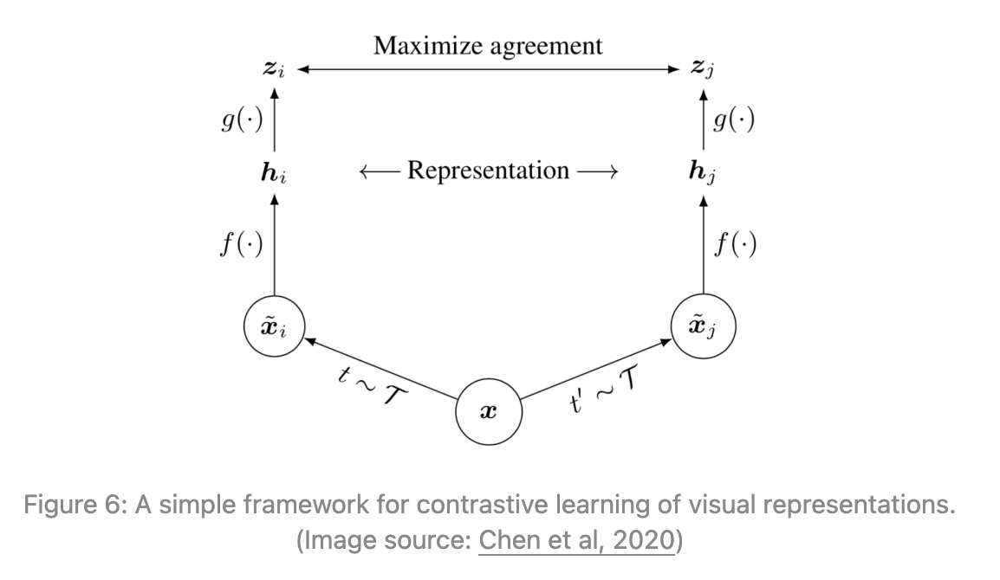

1. Randomly sample a minibatch of $N$ samples and each sample is applied with two different data augmentation operations, resulting in $2N$ augmented samples in total.
   $$ \tilde{\mathbf{x}}_i = t(\mathbf{x}), \quad \tilde{\mathbf{x}}_j = t'(\mathbf{x}), \quad t, t' \sim \mathcal{T} $$
   where two separate data augmentation operators, $t$ and $t'$, are sampled from the same family of augmentations $\mathcal{T}$. Data augmentation includes random crop, resize with random flip, color distortions, and Gaussian blur.

2. Given one positive pair, other $2(N-1)$ data points are treated as negative samples. The representation is produced by a base encoder $f(\cdot)$:
   $$ \mathbf{h}_i = f(\tilde{\mathbf{x}}_i), \quad \mathbf{h}_j = f(\tilde{\mathbf{x}}_j) $$

3. The contrastive learning loss is defined using cosine similarity $\text{sim}(\cdot, \cdot)$. Note that the loss operates on an extra projection layer of the representation $g(\cdot)$ rather than on the representation space directly. But only the representation $\mathbf{h}$ is used for downstream tasks.
   $$ \mathbf{z}_i = g(\mathbf{h}_i), \quad \mathbf{z}_j = g(\mathbf{h}_j) $$
   $$ \mathcal{L}_{\text{SimCLR}}^{(i,j)} = -\log \frac{\exp(\text{sim}(\mathbf{z}_i, \mathbf{z}_j)/\tau)}{\sum_{k=1}^{2N} \mathbb{1}_{[k \neq i]} \exp(\text{sim}(\mathbf{z}_i, \mathbf{z}_k)/\tau)} $$
   where $\mathbb{1}_{[k \neq i]}$ is an indicator function: 1 if $k \neq i$ 0 otherwise.

SimCLR needs a large batch size to incorporate enough negative samples to achieve good performance.


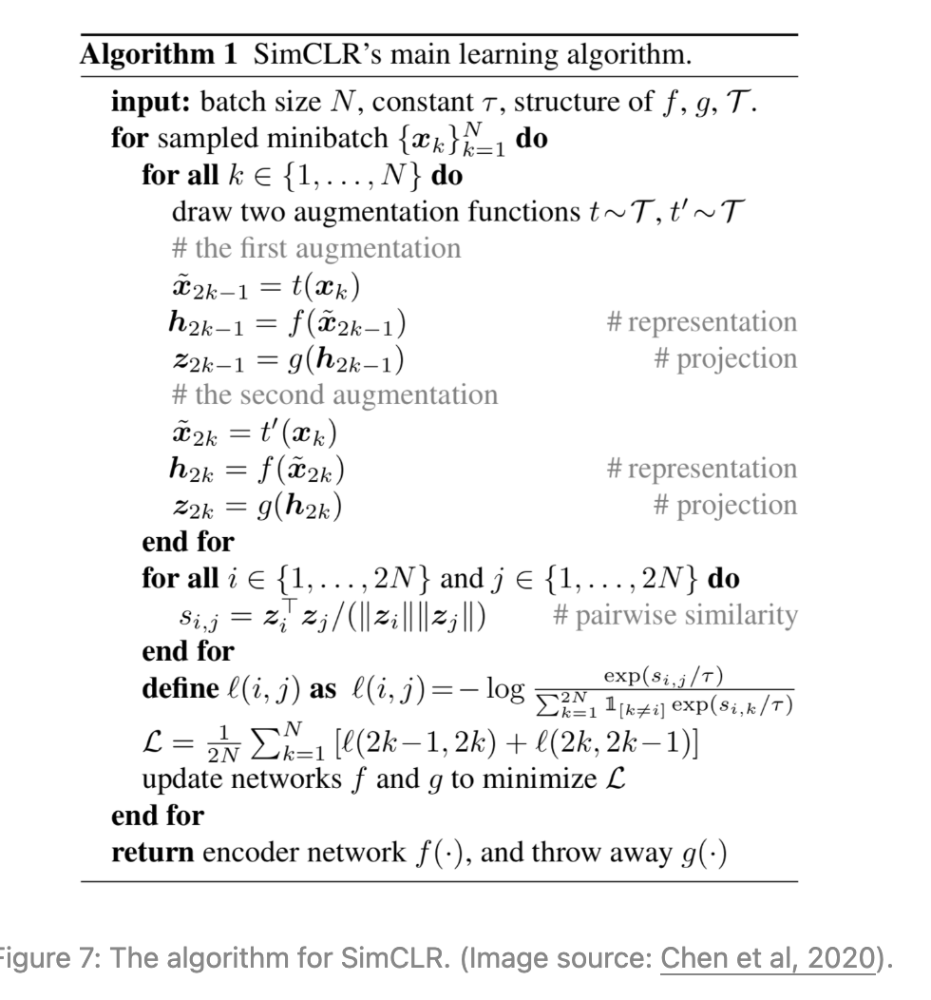

###### Barlow Twins

**Barlow Twins** ([Zbontar et al. 2021](https://arxiv.org/abs/2103.03230)) feeds two distorted versions of samples into the same network to extract features and learns to make the *cross-correlation matrix* between these two groups of output features close to the identity. The goal is to keep the representation vectors of different distorted versions of one sample similar, while minimizing the redundancy between these vectors.

Let $\mathcal{C}$ be a cross-correlation matrix computed between outputs from two identical networks along the batch dimension. $\mathcal{C}$ is a square matrix with the size same as the feature network's output dimensionality. Each entry in the matrix $\mathcal{C}_{ij}$ is the cosine similarity between network output vector dimension at index $i, j$ and batch index $b$, $\mathbf{z}_{b,i}^A$ and $\mathbf{z}_{b,j}^B$, with a value between -1 (i.e. perfect anti-correlation) and 1 (i.e. perfect correlation).

$$ \mathcal{L}_{\text{BT}} = \underbrace{\sum_i (1 - \mathcal{C}_{ii})^2}_{\text{invariance term}} + \lambda \underbrace{\sum_i \sum_{i \neq j} \mathcal{C}_{ij}^2}_{\text{redundancy reduction term}} $$

$$ \text{where } \mathcal{C}_{ij} = \frac{\sum_b \mathbf{z}_{b,i}^A \mathbf{z}_{b,j}^B}{\sqrt{\sum_b (\mathbf{z}_{b,i}^A)^2} \sqrt{\sum_b (\mathbf{z}_{b,j}^B)^2}} $$

Barlow Twins is competitive with SOTA methods for self-supervised learning. It naturally avoids trivial constants (i.e. collapsed representations), and is robust to different training batch sizes.

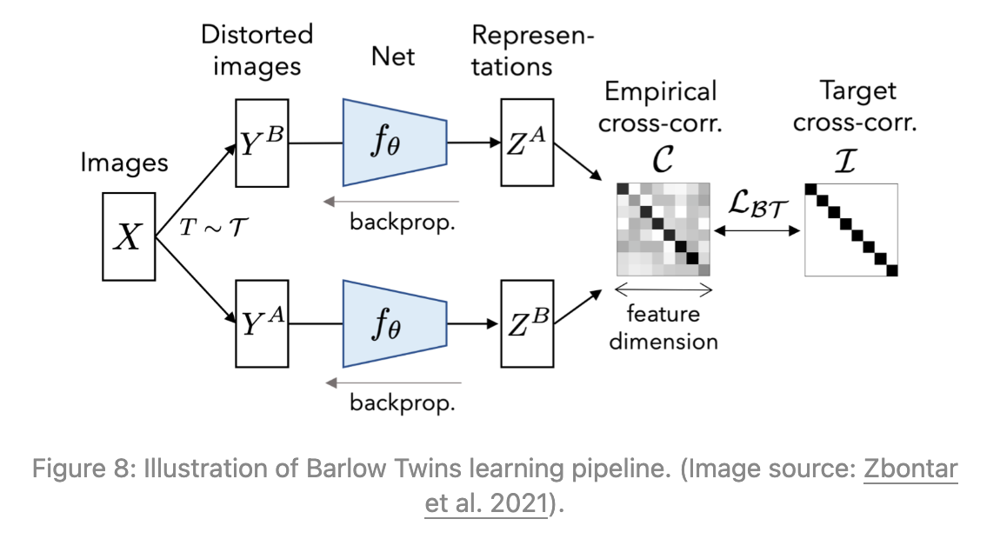

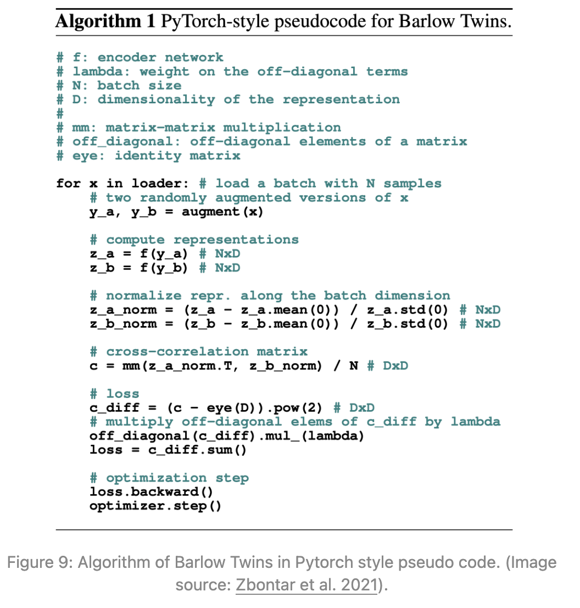

###### SimCLR vs Barlow Twins

| 特性 | SimCLR | Barlow Twins |
| :--- | :--- | :--- |
| **核心机制** | **Contrastive (Sample-wise)** | **Redundancy Reduction (Feature-wise)** |
| **负样本** | **必须** (依赖 Batch 内负样本) | **不需要** (无显式负样本) |
| **Loss 对象** | 样本间的相似度矩阵 ($N \times N$) | 特征间的互相关矩阵 ($D \times D$) |
| **Collapse 避免** | 通过排斥负样本 (Contrastive Loss) | 通过特征解耦 (Redundancy Reduction) |
| **Batch Size** | **敏感** (需大 Batch 保证负例多样性) | **鲁棒** (小 Batch 依然有效) |
| **特征维度** | 投影层维度不宜过大 | **受益于高维投影** (维度越高效果越好) |

* **本质区别**：
  * **SimCLR** 做的是**样本(Instance)级别**的对比：拉近同一张图的 Augmentations，推开不同图的 Augmentations。
    - **SimCLR** 依赖 Batch 提供**负样本**。Batch 小 $\rightarrow$ 负样本少 $\rightarrow$ 对比学习效果差（容易坍塌或学不到细粒度特征）。
  * **Barlow Twins** 做的是**特征(Feature)级别**的去冗余：让同一维度的特征在 Augmentations 间不变 (Invariance)，让不同维度的特征去相关 (Decorrelation)。它把 Batch 维度看作样本统计的维度，而在 Feature 维度上做文章。
    - **Barlow Twins** 依赖 Batch 提供**统计稳定性**。Batch 仅用于估算相关性系数，只要 Batch 大到足以统计出特征是否相关即可（通常比“提供足够负样本”所需的 Batch 小得多）。因此它在较小 Batch 下依然能稳健工作。

###### BYOL

Different from the above approaches, interestingly, **BYOL** (Bootstrap Your Own Latent; [Grill, et al 2020](https://arxiv.org/abs/2006.07733)) claims to achieve a new state-of-the-art results *without using negative samples*. It relies on two neural networks, referred to as *online* and *target* networks that interact and learn from each other. The target network (parameterized by $\xi$) has the same architecture as the online one (parameterized by $\theta$), but with polyak averaged weights, $\xi \leftarrow \tau\xi + (1 - \tau)\theta$.

The goal is to learn a presentation $y$ that can be used in downstream tasks. The online network parameterized by $\theta$ contains:

* An encoder $f_\theta$;
* A projector $g_\theta$;
* A predictor $q_\theta$.

The target network has the same network architecture, but with different parameter $\xi$, updated by polyak averaging $\theta$: $\xi \leftarrow \tau\xi + (1 - \tau)\theta$.

Given an image $\mathbf{x}$, the BYOL loss is constructed as follows:

* Create two augmented views: $\mathbf{v} = t(\mathbf{x}); \mathbf{v}' = t'(\mathbf{x})$ with augmentations sampled $t \sim \mathcal{T}, t' \sim \mathcal{T}'$;
* Then they are encoded into representations, $\mathbf{y}_\theta = f_\theta(\mathbf{v}), \mathbf{y}' = f_\xi(\mathbf{v}')$;
* Then they are projected into latent variables, $\mathbf{z}_\theta = g_\theta(\mathbf{y}_\theta), \mathbf{z}' = g_\xi(\mathbf{y}')$;
* The online network outputs a prediction $q_\theta(\mathbf{z}_\theta)$;
* Both $q_\theta(\mathbf{z}_\theta)$ and $\mathbf{z}'$ are L2-normalized, giving us $\bar{q}_\theta(\mathbf{z}_\theta) = q_\theta(\mathbf{z}_\theta) / \|q_\theta(\mathbf{z}_\theta)\|$ and $\bar{\mathbf{z}}' = \mathbf{z}' / \|\mathbf{z}'\|$;
* The loss $\mathcal{L}_{\theta}^{\text{BYOL}}$ is MSE between L2-normalized prediction $\bar{q}_\theta(\mathbf{z})$ and $\bar{\mathbf{z}}'$;
* The other symmetric loss $\tilde{\mathcal{L}}_{\theta}^{\text{BYOL}}$ can be generated by switching $\mathbf{v}'$ and $\mathbf{v}$; that is, feeding $\mathbf{v}'$ to online network and $\mathbf{v}$ to target network.
* The final loss is $\mathcal{L}_{\theta}^{\text{BYOL}} + \tilde{\mathcal{L}}_{\theta}^{\text{BYOL}}$ and only parameters $\theta$ are optimized.

Unlike most popular contrastive learning based approaches, BYOL does not use negative pairs. Most bootstrapping approaches rely on pseudo-labels or cluster indices, but BYOL directly bootstraps the latent representation.

It is quite interesting and surprising that *without* negative samples, BYOL still works well. Later I ran into this [post](https://arxiv.org/pdf/2510.10572) by Abe Fetterman & Josh Albrecht, they highlighted two surprising findings while were trying to reproduce BYOL:

1. **BYOL generally performs no better than random when *batch normalization is removed*.**
2. The presence of batch normalization implicitly causes a form of contrastive learning. They believe that using negative samples is important for avoiding model collapse (i.e. what if you use all-zeros representation for every data point?). **Batch normalization injects dependency on negative samples *inexplicitly*** because no matter how similar a batch of inputs are, the values are re-distributed (spread out $\sim \mathcal{N}(0, 1)$) and therefore batch normalization prevents model collapse. Strongly recommend you to read the [full article](https://arxiv.org/pdf/2510.10572) if you are working in this area.


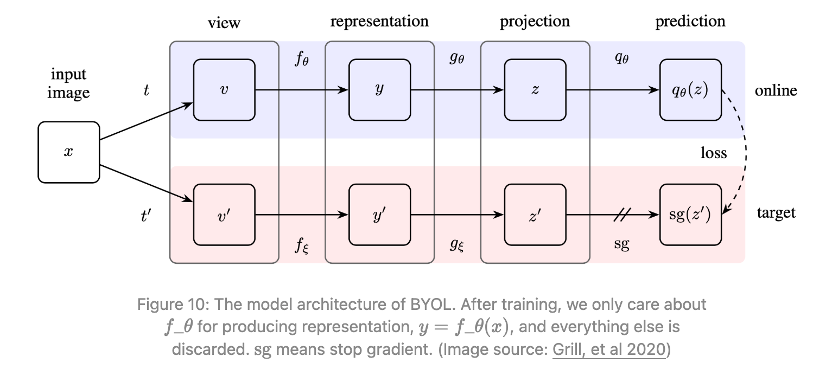


##### Memory Bank

Computing embeddings for a large number of negative samples in every batch is extremely expensive. One common approach is to store the representation in memory to trade off data staleness for cheaper compute.

###### Instance Discrimination with Memoy Bank

**Instance contrastive learning** ([Wu et al, 2018](https://arxiv.org/abs/1805.01978v1)) pushes the class-wise supervision to the extreme by considering each instance as *a distinct class of its own*. It implies that the number of “classes” will be the same as the number of samples in the training dataset. Hence, it is unfeasible to train a softmax layer with these many heads, but instead it can be approximated by [NCE](https://lilianweng.github.io/posts/2021-05-31-contrastive/#nce).

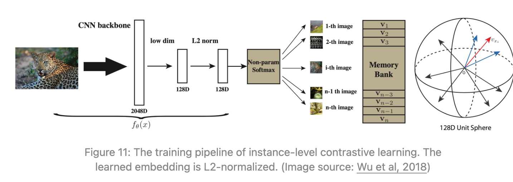

Let $\mathbf{v} = f_\theta(x)$ be an embedding function to learn and the vector is normalized to have $|\mathbf{v}| = 1$. A non-parametric classifier predicts the probability of a sample $\mathbf{v}$ belonging to class $i$ with a temperature parameter $\tau$:
$$ P(C=i|\mathbf{v}) = \frac{\exp(\mathbf{v}_i^\top \mathbf{v}/\tau)}{\sum_{j=1}^n \exp(\mathbf{v}_j^\top \mathbf{v}/\tau)} $$

Instead of computing the representations for all the samples every time, they implement an **Memory Bank** for storing sample representation in the database from past iterations. Let $V = \{\mathbf{v}_i\}$ be the memory bank and $\mathbf{f}_i = f_\theta(\mathbf{x}_i)$ be the feature generated by forwarding the network. We can use the representation from the memory bank $\mathbf{v}_i$ instead of the feature forwarded from the network $\mathbf{f}_i$ when comparing pairwise similarity.

The denominator theoretically requires access to the representations of all the samples, but that is too expensive in practice. Instead we can estimate it via Monte Carlo approximation using a random subset of $M$ indices $\{j_k\}_{k=1}^M$.
$$ P(i|\mathbf{v}) = \frac{\exp(\mathbf{v}^\top \mathbf{f}_i/\tau)}{\sum_{j=1}^N \exp(\mathbf{v}_j^\top \mathbf{f}_i/\tau)} \simeq \frac{\exp(\mathbf{v}^\top \mathbf{f}_i/\tau)}{\frac{N}{M} \sum_{k=1}^M \exp(\mathbf{v}_{j_k}^\top \mathbf{f}_i/\tau)} $$

Because there is only one instance per class, the training is unstable and fluctuates a lot. To improve the training smoothness, they introduced an extra term for positive samples in the loss function based on the [proximal optimization method](https://web.stanford.edu/~boyd/papers/prox_algs.html). The final NCE loss objective looks like:
$$ \mathcal{L}_{\text{instance}} = -\mathbb{E}_{P_d}[\log h(i, \mathbf{v}_i^{(t-1)}) - \lambda \|\mathbf{v}_i^{(t)} - \mathbf{v}_i^{(t-1)}\|_2^2] - M \mathbb{E}_{P_n}[\log(1 - h(i, \mathbf{v}'^{(t-1)})] $$
$$ h(i, \mathbf{v}) = \frac{P(i|\mathbf{v})}{P(i|\mathbf{v}) + M P_n(i)} \quad \text{where the noise distribution is uniform } P_n = 1/N $$

where $\{\mathbf{v}^{(t-1)}\}$ are embeddings stored in the memory bank from the previous iteration. The difference between iterations $|\mathbf{v}_i^{(t)} - \mathbf{v}_i^{(t-1)}|_2^2$ will gradually vanish as the learned embedding converges.

###### MoCo & MoCo-V2

> * Momentum Contrast for Unsupervised Visual Representation Learning — https://arxiv.org/abs/1911.05722
> * Improved Baselines with Momentum Contrastive Learning (MoCo v2) — https://arxiv.org/abs/2003.04297

**Momentum Contrast** (**MoCo**; [He et al, 2019](https://arxiv.org/abs/1911.05722)) provides a framework of unsupervised learning visual representation as a *dynamic dictionary look-up*. The dictionary is structured as a large FIFO queue of encoded representations of data samples.

* 核心思想：动量编码器 + 大型负例字典（FIFO 队列）近似负例来自 $$p(x)$$，配合 InfoNCE 进行表征学习。

* 结构：查询编码器 $$f_q$$、关键编码器 $$f_k$$；仅对 $$f_q$$ 反向传播，$$f_k$$ 用动量更新：
  * $$\boldsymbol{\theta}_k \leftarrow m\,\boldsymbol{\theta}_k + (1 - m)\,\boldsymbol{\theta}_q$$
    * The MoCo dictionary is not differentiable as a queue, so we cannot rely on back-propagation to update the key encoder $f_k$. One naive way might be to use the same encoder for both $f_q$ and $f_k$. Differently, MoCo proposed to use a momentum-based update with a momentum coefficient $m \in [0, 1)$. Say, the parameters of $f_q$ and $f_k$ are labeled as $\theta_q$ and $\theta_k$, respectively.
  * 队列作为字典：当前 batch 的键入队，最旧样本出队。
    * Compared to the memory bank, a queue-based dictionary in MoCo enables us to reuse representations of immediately preceding mini-batches of data.
* 损失（温度缩放 $$\tau$$）：
  * Given a query sample $\mathbf{x}_q$, we get a query representation through an encoder $\mathbf{q} = f_q(\mathbf{x}_q)$. A list of key representations $\{\mathbf{k}_1, \mathbf{k}_2, \dots\}$ in the dictionary are encoded by a momentum encoder $\mathbf{k}_i = f_k(\mathbf{x}_i^k)$. Let's assume among them there is a single *positive* key $\mathbf{k}^+$ in the dictionary that matches $\mathbf{q}$. In the paper, they create $\mathbf{k}^+$ using a noise copy of $\mathbf{x}_q$ with different augmentation. Then the InfoNCE contrastive loss with temperature $\tau$ is used over one positive and $N-1$ negative samples:
  * $$\mathcal{L}_{\text{MoCo}}(q, k^+, \{k_i\}) = -\log \frac{\exp\big( \mathrm{sim}(q, k^+)/\tau \big)}{\exp\big( \mathrm{sim}(q, k^+)/\tau \big) + \sum_i \exp\big( \mathrm{sim}(q, k_i)/\tau \big)}$$
* 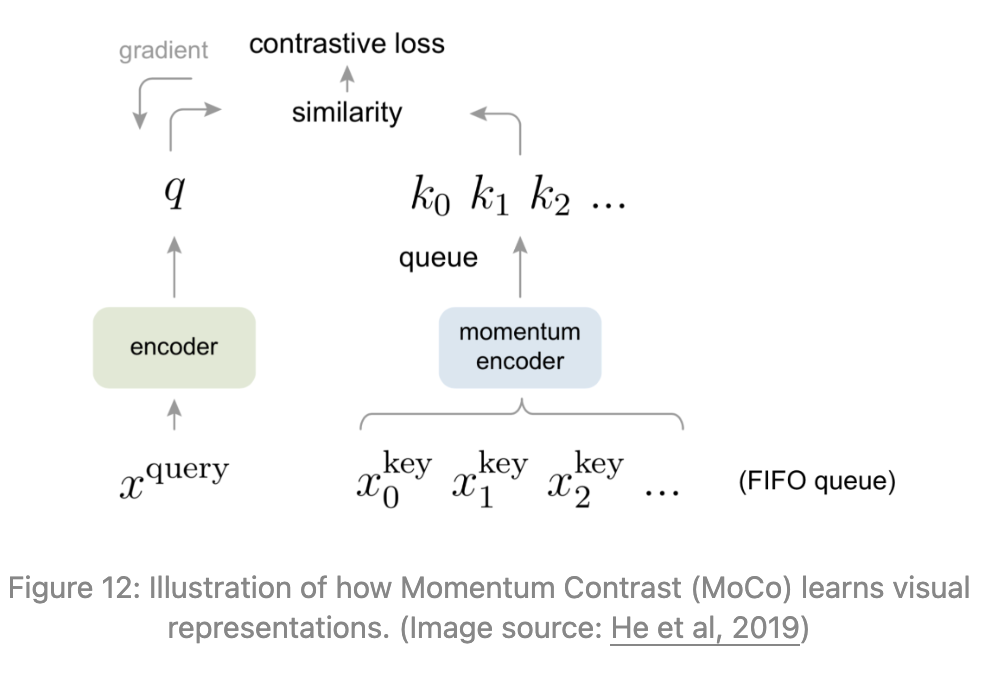
* 采样假设：正样本来自 $$p(x\mid c)$$（同实例的另一视图），负样本近似来自 $$p(x)$$（批内随机 + 队列），保证与上下文 $$c$$ 独立。
* 实操建议：
  * 队列长度常取 `[16k, 65k]`；动量 $$m\approx 0.999$$；温度 $$\tau\in[0.05, 0.2]$$。
  * 批内负例与队列负例混合；屏蔽同实例负例；随机增强生成两视图。
  * 仅对 $$f_q$$ 计算梯度，$$f_k$$ 动量更新以稳定字典特征。
* 与 in-batch negatives 的关系：
  * 仅用批内负例对 $$p(x)$$ 的覆盖不足，MoCo 通过队列扩大负例集合、提升稳定性与效果。
  * The advantage of MoCo compared to [SimCLR](https://lilianweng.github.io/posts/2021-05-31-contrastive/#simclr) is that MoCo decouples the batch size from the number of negatives, but SimCLR requires a large batch size in order to have enough negative samples and suffers performance drops when their batch size is reduced.
* MoCo V2
  * Two designs in SimCLR, namely, (1) an MLP projection head and (2) stronger data augmentation, are proved to be very efficient. **MoCo V2** ([Chen et al, 2020](https://arxiv.org/abs/2003.04297)) combined these two designs, achieving even better transfer performance with no dependency on a very large batch size.
* 为什么队列更拟合 $$p(x)$$：
  * Monte Carlo 近似更好：InfoNCE 分母近似期望 $$\mathbb{E}_{x\sim p(x)}[\exp(\mathrm{sim}(q,f(x))/\tau)]$$，用队列得更大的负例集合，方差更低：
    $$\hat{Z}(q)=\sum_{i=1}^{N}\exp(\mathrm{sim}(q,k_i)/\tau)\approx N\,\mathbb{E}_{x\sim p(x)}[\exp(\mathrm{sim}(q,f(x))/\tau)]$$
  * 更接近独立同分布采样：队列跨多个 batch 累积样本，弱化与当前上下文 $$c$$ 的相关性，负例更像来自边缘分布 $$p(x)$$。
  * 特征更稳定：关键编码器动量更新使字典特征缓慢变化，缓解“陈旧特征”偏差，从而使队列分布更接近数据的稳态映射。
  * 资源友好：在固定显存下扩大负例规模，避免仅用小 batch 导致对 $$p(x)$$ 覆盖不足。

###### CURL

**CURL** ([Srinivas, et al. 2020](https://arxiv.org/abs/2004.04136)) applies the above ideas in [Reinforcement Learning](https://lilianweng.github.io/posts/2018-02-19-rl-overview/). It learns a visual representation for RL tasks by matching embeddings of two data-augmented versions, $$o_q$$ and $$o_k$$, of the raw observation $$o$$ via contrastive loss. CURL primarily relies on random crop data augmentation. The key encoder is implemented as a momentum encoder with weights as EMA of the query encoder weights, same as in [MoCo](https://lilianweng.github.io/posts/2021-05-31-contrastive/#moco--moco-v2).

One significant difference between RL and supervised visual tasks is that RL depends on *temporal consistency* between consecutive frames. Therefore, CURL applies augmentation consistently on each stack of frames to retain information about the temporal structure of the observation.

> **解读：Temporal Consistency 与 RL 中的帧堆叠**
>
> 这里的核心难点在于理解 RL 中**State (状态)** 的定义方式以及**Augmentation (增强)** 可能带来的破坏。
>
> 1.  **Frame Stacking (帧堆叠) 与 物理信息**
>     *   在 CV 任务（如 ImageNet 分类）中，一张静态图片足以判断是“猫”还是“狗”。
>     *   但在 RL 任务（如 Atari Pong 游戏）中，单张静态图片是不够的。看着一张球的图片，Agent 无法判断球是**向左飞**还是**向右飞**。
>     *   **解决方案**：通常将连续的 $k$ 帧（例如 $k=4$）堆叠在一起作为一个 State $S_t = \{f_t, f_{t-1}, f_{t-2}, f_{t-3}\}$。Agent 通过对比帧与帧之间像素的位移，隐式地推断出物体的**速度**和**加速度**。这就是所谓的 **Temporal Structure**。
>
> 2.  **为什么需要 Consistent Augmentation?**
>     *   **Inconsistent (错误做法)**：如果对 $S_t$ 中的 $f_t$ 做左上角裁切，对 $f_{t-1}$ 做右下角裁切。那么在 Agent 看来，物体在 $t-1$ 到 $t$ 的瞬间发生了剧烈的、不符合物理规律的位移。这种增强破坏了帧间的相对几何关系，导致 Agent 无法正确学习物理动态。
>     *   **Consistent (CURL 做法)**：CURL 提出，必须对同一个 Stack 中的所有帧应用**完全相同**的增强操作（例如：使用**同一个**随机裁剪框 $(x, y, w, h)$ 去裁剪 $f_t, \dots, f_{t-3}$）。
>     *   这样做的结果是：虽然整个视野发生了平移，但物体在帧与帧之间的**相对位移**保持不变。Agent 依然可以从中提取出正确的速度和运动模式，从而保证了 **Temporal Consistency**。

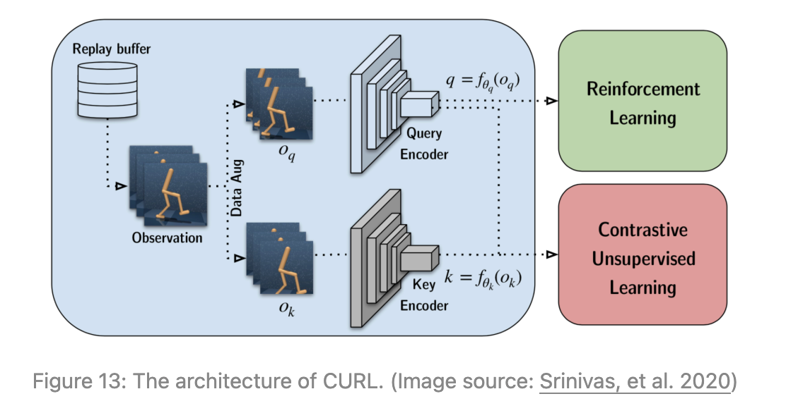


###### 与推荐系统负例池的对比

* 目标分布不同：MoCo 负例近似边缘分布 $$p(x)$$；推荐召回常需对齐曝光分布或采样分布 $$p(i\mid u)$$ 与流行度分布 $$p(i)$$，并倾向采 hard negatives（高相似但未点击）。
  * 难负样本定义依赖用户：hard negatives 满足 $$\mathrm{sim}(\mathbf{e}_u,\mathbf{e}_i)$$ 高但未点击，必然以用户向量 $$\mathbf{e}_u$$ 为条件；常由 ANN 检索得到 `Top-K(u)` 再去除正样本与同实例。
  * 分布一致性：线上召回面对具体用户 $$u$$ 的曝光分布，若用全局 $$p(i)$$ 训练，离线/在线分布失配（SSB），梯度被易负例主导，效果差。
  * 数据来源即用户相关：曝光未点、同类兴趣群体候选、历史共现物品等都以用户行为/画像构建，天然依赖 $$u$$。
* 独立性假设：MoCo 要求负例与上下文 $$c$$ 独立；推荐的负例池依赖用户 $$u$$ 构造，通常不独立（难负例来自 ANN 检索或曝光日志）。
* 损失与校正：MoCo 用 InfoNCE/softmax；推荐常用 sampled softmax 或 BPR，需对采样偏差作校正（如 importance weighting、sampled-softmax 校正项）。
* 机制实现：MoCo 用 FIFO 队列 + 动量编码器稳定特征；推荐负例池多为缓存/索引，定期刷新、融合曝光/热门/ANN 候选以兼顾难度与覆盖。
* 风险与缓解：MoCo 关注字典陈旧与分布漂移（用动量与滑窗刷新）；推荐侧关注流行度偏置与曝光偏置（用重采样、去重、时间衰减与加权）。
* 共同点：均通过扩大负例集合、降低估计方差提高训练稳定性与效果，但 MoCo 更强调无监督密度比估计，推荐更强调与线上分布一致性与面向用户的难负例。

##### 谱表示学习


> 来源：http://xhslink.com/o/9eEu7AzYcHN（小红书）
>
> **arXiv**：2601.20154 (Spectral Ghost in Representation Learning: from Component Analysis to Self-Supervised Learning)
> **公司**：Google DeepMind、Georgia Tech、Harvard University、University of Alberta
> **作者**：Bo Dai, Na Li, Dale Schuurmans

**核心判断**：成功的表示学习方法，本质上都在学习"谱表示（Spectral Representation）"——所有这些算法都在提取样本对互信息的谱表示。

* **充分表示的谱判据**：
  * 论文首次从条件分布算子的谱分解出发，严格定义了"充分表示"
  * 只要学到的表示能张成所有下游任务所需的谱子空间，就可以用轻量线性或简单非线性头完成任意预测任务，而无需回到原始数据
  * 具体推导：
    - 从预测任务开始，目标是估计 $E[y|x]$
    - 对条件算子 $P(y|x)$ 做奇异值分解 (SVD)：$P(y|x) = \langle \phi(x), \mu(y) \rangle$
    - 则最优线性解为：$E[y|x] = \langle \phi(x), \int y \mu(y) dy \rangle$
    - 即只要有 $\phi(x)$，下游任务只需线性头即可完成

* **从无标签数据中提取谱表示**：
  * 关键洞察：可以仅从无标签数据的 $P(x'|x)$ 中提取完整的谱表示，不需要标签！
  * 推导：
    - 考虑 $P(x'|x) = P(x') \langle \psi(x'), A \psi(x) \rangle$（Bayes 规则）
    - 进一步得到：$\frac{P(x, x')}{P(x) P(x')} = \langle \phi(x'), \phi(x) \rangle$（点互信息的谱分解）
    - 这意味着可以通过优化 $\frac{P(x, x')}{P(x) P(x')}$ 与 $\langle \phi(x'), \phi(x) \rangle$ 的匹配来学习谱表示

* **SSL 的统一解释**：
  * SimCLR、BYOL、VICReg、Barlow Twins、MoCo、DINO、SwAV、DeepCluster、Word2Vec、CLIP 等方法，被统一解释为：在不同参数化与优化策略下，对同一谱分解目标的近似求解
  * 对比 vs 非对比的差异，本质来自梯度估计是否有偏、是否依赖大 batch，而非目标本身

* **四大谱表示范式**：
  1. **线性谱表示（Section 3）**：直接矩阵/算子分解（理论清晰，下游线性）
     - Square Contrastive (HaoChen et al., 2021)：均方匹配归一化转移算子
     - Barlow Twins (Zbontar et al., 2021)：线性投影谱表示
     - VICReg (Bardes et al., 2021)：方差-不变性-协方差正则化
     - BYOL (Grill et al., 2020) &amp; MINC (Guo et al., 2025)：幂迭代实现
  2. **能量模型谱表示（Section 4）**：指数内积、对比学习、CLIP、Word2Vec
     - SimCLR (Chen et al., 2020)：能量模型 + 排序 NCE
     - Word2Vec (Mikolov et al., 2013)：能量模型 + 二元 NCE
     - MoCo (He et al., 2020)：能量模型 + 幂迭代
     - Diffusion Spectral Representation (Shribak et al., 2024)：扩散模型视角
  3. **潜变量谱表示（Section 5）**：DeepCluster、SwAV、DINO、SeLa
     - DeepCluster (Caron et al., 2018)：EM 算法 + 聚类
     - SeLa (Asano et al., 2019)：变分 ELBO + 最优传输
     - DINO (Caron et al., 2021) &amp; SwAV (Caron et al., 2020)：幂迭代 + 多视图
  4. **进一步推广**：非线性谱表示（Section 6）与多模态谱表示（Section 7）
     - SimSiam (Chen and He, 2021)：非线性不对称投影
     - CLIP (Radford et al., 2021) &amp; SigLIP (Zhai et al., 2023)：多模态能量模型

* **揭示哪些方法"理论上就不友好"**：
  * Barlow Twins、VICReg 虽然非对比，但目标函数的梯度估计天然有偏
  * 因此仍然依赖大 batch，本质问题不在是否 contrastive
  * 这为算法设计提供了明确的理论避坑指南

* **历史统一（Section 8）**：
  * 从 PCA、MDS、Isomap、CCA、Laplacian Embedding、Locality Preserving Projections，到现代 SSL，本质都是在学习样本对的"谱结构"或"互信息算子"，只是数据规模、参数化和优化方式不同
  * 例如：
    - PCA：线性谱表示 + 线性核
    - MDS：线性谱表示 + 欧氏距离核
    - Isomap：线性谱表示 + 测地线距离核
    - Laplacian Embedding：图拉普拉斯谱分解

* **应用（Section 9）**：
  * 回归与分类（Section 9.1）：谱表示足以线性表示 $E[y|x]$ 和后验概率
  * 因果推断（Section 9.2）：工具变量回归、代理因果推断
  * 控制与强化学习（Section 9.3）：MDP 值函数的线性表示、高效规划与探索
##### Feature Cluster

###### K-Means

K-Means是无监督学习中最基础的聚类算法之一。

*   **核心思想**: 将数据集划分为K个不同的、非重叠的簇，使得每个数据点都属于离它最近的均值（簇中心）所代表的簇。

*   **算法步骤**:
    1.  **初始化**: 随机选择K个数据点作为初始的簇中心。
        *   **改进 (K-Means++)**: 为避免随机初始化选点不佳，K-Means++ 采用一种更智能的策略：第一个中心点随机选择，后续每个中心点的选择概率与其离最近已有中心的距离成正比。这倾向于让初始中心点互相远离，从而获得更好的聚类效果和更快的收敛速度。
    2.  **分配(Assignment)**: 计算每个数据点到各个簇中心的距离，并将其分配给距离最近的簇。
    3.  **更新(Update)**: 对每个簇，重新计算其中心点（即簇内所有数据点的均值）。
    4.  **迭代**: 重复步骤2和3，直到簇中心不再发生显著变化或达到最大迭代次数。

*   **应用**:
    *   在深度学习中，常用于初始化向量量化（Vector Quantization）模型中的码本（Codebook）。通过K-Means提供一个比随机初始化更好的起点，有助于模型稳定训练，缓解码本崩塌问题。 

###### Deep Cluster

**DeepCluster** ([Caron et al. 2018](https://arxiv.org/abs/1807.05520)) iteratively clusters features via k-means and uses cluster assignments as pseudo labels to provide supervised signals.

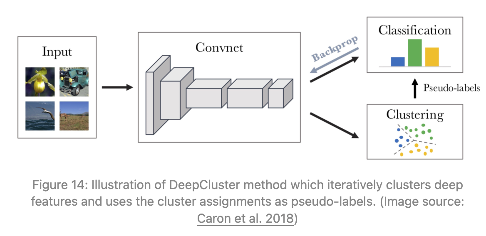

In each iteration, DeepCluster clusters data points using the prior representation and then produces the new cluster assignments as the classification targets for the new representation. However this iterative process is prone to trivial solutions. While avoiding the use of negative pairs, it requires a costly clustering phase and specific precautions to avoid collapsing to trivial solutions.

###### SwAV TODO

**SwAV** (*Swapping Assignments between multiple Views*; [Caron et al. 2020](https://arxiv.org/abs/2006.09882)) is an online contrastive learning algorithm. It computes a code from an augmented version of the image and tries to predict this code using another augmented version of the same image.

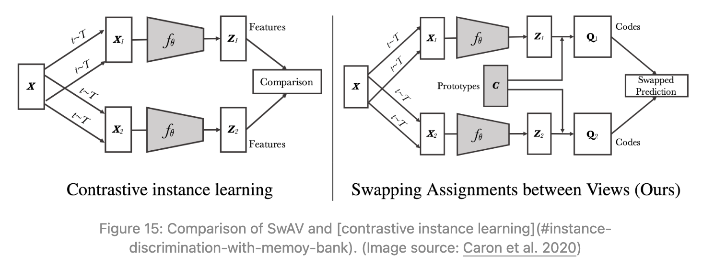

Given features of images with two different augmentations, $\mathbf{z}_t$ and $\mathbf{z}_s$, SwAV computes corresponding codes $\mathbf{q}_t$ and $\mathbf{q}_s$ and the loss quantifies the fit by swapping two codes using $\ell(\cdot)$ to measure the fit between a feature and a code.

$$ \mathcal{L}_{\text{SwAV}}(\mathbf{z}_t, \mathbf{z}_s) = \ell(\mathbf{z}_t, \mathbf{q}_s) + \ell(\mathbf{z}_s, \mathbf{q}_t) $$

The swapped fit prediction depends on the cross entropy between the predicted code and a set of $K$ trainable prototype vectors $\mathbf{C} = \{\mathbf{c}_1, \dots, \mathbf{c}_K\}$. The prototype vector matrix is shared across different batches and represents *anchor clusters* that each instance should be clustered to.

$$ \ell(\mathbf{z}_t, \mathbf{q}_s) = - \sum_k \mathbf{q}_s^{(k)} \log \mathbf{p}_t^{(k)} \quad \text{where } \mathbf{p}_t^{(k)} = \frac{\exp(\mathbf{z}_t^\top \mathbf{c}_k / \tau)}{\sum_{k'} \exp(\mathbf{z}_t^\top \mathbf{c}_{k'} / \tau)} $$

In a mini-batch containing $B$ feature vectors $\mathbf{Z} = [\mathbf{z}_1, \dots, \mathbf{z}_B]$, the mapping matrix between features and prototype vectors is defined as $\mathbf{Q} = [\mathbf{q}_1, \dots, \mathbf{q}_B] \in \mathbb{R}_{+}^{K \times B}$. We would like to maximize the similarity between the features and the prototypes:

$$ \max_{\mathbf{Q} \in \mathcal{Q}} \text{Tr}(\mathbf{Q}^\top \mathbf{C}^\top \mathbf{Z}) + \varepsilon \mathcal{H}(\mathbf{Q}) $$
$$ \text{where } \mathcal{Q} = \left\{ \mathbf{Q} \in \mathbb{R}_{+}^{K \times B} \mid \mathbf{Q}\mathbf{1}_B = \frac{1}{K}\mathbf{1}_K, \mathbf{Q}^\top \mathbf{1}_K = \frac{1}{B}\mathbf{1}_B \right\} $$

where $\mathcal{H}$ is the entropy, $\mathcal{H}(\mathbf{Q}) = - \sum_{ij} \mathbf{Q}_{ij} \log \mathbf{Q}_{ij}$, controlling the smoothness of the code. The coefficient $\varepsilon$ should not be too large; otherwise, all the samples will be assigned uniformly to all the clusters. The candidate set of solutions for $\mathbf{Q}$ requires every mapping matrix to have each row sum up to $1/K$ and each column to sum up to $1/B$, enforcing that each prototype gets selected at least $B/K$ times on average.

SwAV relies on the iterative Sinkhorn-Knopp algorithm (Cuturi 2013) to find the solution for $\mathbf{Q}$.

> **深度解析：SwAV 的精妙之处 (The Ingenuity of SwAV)**
>
> SwAV 的核心贡献在于巧妙地解决了 Contrastive Learning 中 "Negative Sampling" 的痛点，同时避免了传统 Deep Clustering 必须 "Offline Clustering" 的低效。
>
> 1.  **从“特征对比”到“聚类指派预测” (Swapped Prediction)**
>     *   **传统对比学习 (SimCLR/MoCo)**：直接拉近两个视图 $z_t, z_s$ 的特征距离。这通常需要大量的负样本（Negative Pairs）来防止模型输出常数解（Collapse）。
>     *   **SwAV**：不直接比特征，而是比“代码” (Code/Assignment)。我用视图 A 的特征去预测视图 B 所属的聚类中心，反之亦然。这迫使网络学习到的特征具有**语义一致性**——无论怎么增强，它们都应该属于同一个“类”。
>
> 2.  **Q 的优化：在线生成的“软标签” (Online Soft Labels)**
>     *   SwAV 最精妙的设计在于如何计算目标 $\mathbf{Q}$（即 Code）。它没有使用固定的 One-hot 标签，而是通过求解一个**最优传输问题 (Optimal Transport)** 来动态生成。
>     *   **Equipartition Constraint (均分约束)**：公式中的约束集合 $\mathcal{Q}$ 强制要求：
>         *   **行和固定**：每个样本必须分配出去。
>         *   **列和固定**：每个聚类中心 (Prototype) 必须接收到大致相同数量的样本。
>     *   **作用**：这个“列和约束”天然地**防止了 Mode Collapse**（即所有样本都分给同一个 Cluster 的平凡解）。在不需要显式负样本的情况下，通过强制让 Cluster 负载均衡，隐式地利用了负样本信息（如果我都分给了 Cluster 1，你就不能再分给 Cluster 1 了）。
>     *   **Sinkhorn-Knopp 算法**：这是一个极其高效的迭代算法（矩阵行归一化 -> 列归一化 -> 行归一化...），能在 GPU 上快速并行计算。它使得 SwAV 可以在每个 Batch 内实时生成高质量的“聚类标签”，实现了真正的 **Online Clustering**。

###### Sinkhorn-Knopp Algorithm

Sinkhorn-Knopp 算法是一种经典的矩阵缩放算法，用于将非负矩阵变换为具有指定行和列和的**双随机矩阵 (Doubly Stochastic Matrix)**。在 SwAV 中，它被用于快速求解最优传输问题以获得软标签 $\mathbf{Q}$。

*   **核心原理**：交替归一化 (Alternating Normalization)。
    *   给定矩阵 $\mathbf{M}$，我们希望找到对角矩阵 $\mathbf{D}_r$ 和 $\mathbf{D}_c$，使得 $\mathbf{Q} = \mathbf{D}_r \mathbf{M} \mathbf{D}_c$ 满足目标行和 $\mathbf{r}$ 与目标列和 $\mathbf{c}$。
    *   **步骤**：
        1.  **行归一化**：缩放每行，使其和为 $\mathbf{r}$。
        2.  **列归一化**：缩放每列，使其和为 $\mathbf{c}$。
        3.  重复上述步骤直到收敛（通常只需 3-5 次迭代即可获得足够好的近似）。

*   **PyTorch 实现 (SwAV 简化版)**：
    ```python
    def sinkhorn(out, epsilon=0.05, sinkhorn_iterations=3):
        Q = torch.exp(out / epsilon).t() # Q is K x B
        B = Q.shape[1] # number of samples to assign
        K = Q.shape[0] # how many prototypes
    
        # make the matrix sums to 1
        sum_Q = torch.sum(Q)
        Q /= sum_Q
    
        for _ in range(sinkhorn_iterations):
            # normalize each row: total weight per prototype must be 1/K
            sum_of_rows = torch.sum(Q, dim=1, keepdim=True)
            Q /= sum_of_rows
            Q /= K
    
            # normalize each column: total weight per sample must be 1/B
            Q /= torch.sum(Q, dim=0, keepdim=True)
            Q /= B
    
        Q *= B # the colomns must sum to 1 so that Q is an assignment
        return Q.t()
    ```

###### **对比分析：SwAV vs. RQ-VAE (FORGE)**

Sinkhorn 算法不仅用于对比学习，在推荐系统的 **Vector Quantization (VQ)** 任务中也有重要应用（如阿里 FORGE 模型）。两者虽然都用了 Sinkhorn，但动机和细节有所不同：

| 维度         | SwAV (Contrastive Learning)                                  | FORGE (RQ-VAE for RecSys)                                    |
| :----------- | :----------------------------------------------------------- | :----------------------------------------------------------- |
| **核心目标** | **Feature Learning**：防止 Feature Collapse，强迫图片特征聚类均匀。 | **Quantization**：防止 **Codebook Collapse**，强迫 Code 利用率均匀，最大化离散编码的熵。 |
| **分配对象** | **Prototypes**：作为临时的聚类中心，随 Batch 动态变化。      | **Codebook Vectors**：作为固定的离散码本，随训练逐渐稳定。   |
| **输入矩阵** | 特征与 Prototype 的点积相似度 (Logits)。                     | 特征与 Codebook 的 L2/Cosine 距离 (经过标准化处理)。         |
| **作用阶段** | 训练全过程，作为 Loss 计算的一部分 (Swapped Prediction)。    | 仅在 Training 阶段用于生成 Index，Inference 时直接取 Argmin。 |
| **实现细节** | 通常对 Logits 做 Softmax 前处理。                            | 往往对 Distances 做归一化 (`(d - mean) / std`) 后再 Sinkhorn，效果更稳。 |


##### Working with Supervised Datasets

###### CLIP

参考「AI-Algorithms」

从公式推导来看，CLIP 的 Cross Entropy Loss 等价于 InfoNCE Loss。

*   **InfoNCE 公式**：
    给定 Query $q$ 和正样本 Key $k^+$ 以及一组负样本 Key $\{k^-\}$，InfoNCE Loss 定义为：
    $$ \mathcal{L}_{\text{InfoNCE}} = -\log \frac{\exp(sim(q, k^+) / \tau)}{\sum_{i} \exp(sim(q, k_i) / \tau)} $$
    其中 $\tau$ 是温度系数。

*   **CLIP 中的 Cross Entropy**：
    在代码中，`logits` 矩阵存储了所有 Image-Text 对的余弦相似度并乘以了温度系数（`np.exp(t)` 对应 $1/\tau$）。
    对于第 $i$ 行（Image $I_i$ 作为 Query），`cross_entropy_loss(logits, labels, axis=0)` 计算的是：
    $$ \mathcal{L}_i = -\log \frac{\exp(I_i \cdot T_i \cdot e^t)}{\sum_{j} \exp(I_i \cdot T_j \cdot e^t)} $$
    这完全符合 InfoNCE 的形式：分子是正样本对 $(I_i, T_i)$ 的相似度指数，分母是 $I_i$ 与 Batch 内所有 Text $T_j$ 的相似度指数之和（即把 Batch 内其他 Text 视为负样本）。

因此，CLIP 的 Symmetric Cross Entropy Loss 本质上就是对 Image-to-Text 和 Text-to-Image 两个方向分别计算 InfoNCE Loss 并取平均。

###### Supervised Contrastive Learning

There are several known issues with cross entropy loss, such as the lack of robustness to noisy labels and the possibility of poor margins. Existing improvement for cross entropy loss involves the curation of better training data, such as label smoothing and data augmentation. **Supervised Contrastive Loss** ([Khosla et al. 2021](https://arxiv.org/abs/2004.11362)) aims to leverage label information more effectively than cross entropy, **imposing that normalized embeddings from the same class are closer together than embeddings from different classes.**

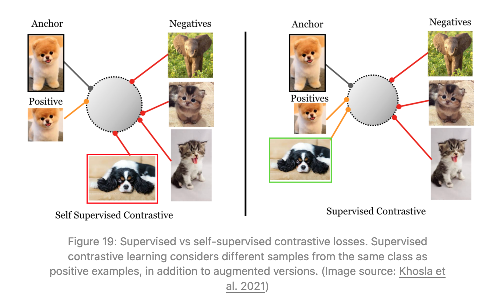

Given a set of randomly sampled $n$ (image, label) pairs, $\{\mathbf{x}_i, y_i\}_{i=1}^n$, $2n$ training pairs can be created by applying two random augmentations of every sample, $\{\tilde{\mathbf{x}}_i, \tilde{y}_i\}_{i=1}^{2n}$.

Supervised contrastive loss $\mathcal{L}_{\text{supcon}}$ utilizes multiple positive and negative samples, very similar to soft nearest-neighbor loss]:

$$
\mathcal{L}_{\text{supcon}} = - \sum_{i=1}^{2n} \frac{1}{2|N_i| - 1} \sum_{j \in N(y_i), j \neq i} \log \frac{\exp(\mathbf{z}_i \cdot \mathbf{z}_j / \tau)}{\sum_{k \in I, k \neq i} \exp(\mathbf{z}_i \cdot \mathbf{z}_k / \tau)}
$$

where $\mathbf{z}_k = P(E(\tilde{\mathbf{x}}_k))$, in which $E(\cdot)$ is an encoder network (augmented image mapped to vector) $P(\cdot)$ is a projection network (one vector mapped to another). $N_i = \{j \in I : \tilde{y}_j = \tilde{y}_i\}$ contains a set of indices of samples with label $y_i$. Including more positive samples into the set $N_i$ leads to improved results.

According to their experiments, supervised contrastive loss:

*   does outperform the base cross entropy, but only by a small amount.
*   outperforms the cross entropy on robustness benchmark (ImageNet-C, which applies common naturally occuring perturbations such as noise, blur and contrast changes to the ImageNet dataset).
*   is less sensitive to hyperparameter changes.

#### Language: Sentence Embedding

##### Text Augmentation

Most contrastive methods in vision applications depend on creating an augmented version of each image. However, it is more challenging to construct text augmentation which does not alter the semantics of a sentence. In this section we look into three approaches for augmenting text sequences, including lexical edits, back-translation and applying cutoff or dropout.

###### Lexical Edits

**EDA** (*Easy Data Augmentation*; [Wei & Zou 2019](https://arxiv.org/abs/1901.11196)) defines a set of simple but powerful operations for text augmentation. Given a sentence, EDA randomly chooses and applies one of four simple operations:

1. Synonym replacement (SR): Replace $$n$$ random non-stop words with their synonyms.
2. Random insertion (RI): Place a random synonym of a randomly selected non-stop word in the sentence at a random position.
3. Random swap (RS): Randomly swap two words and repeat $$n$$ times.
4. Random deletion (RD): Randomly delete each word in the sentence with probability $$p$$ .

where $p = \alpha$ and $n = \alpha \times \text{sentence\_length}$, with the intuition that longer sentences can absorb more noise while maintaining the original label. The hyperparameter $\alpha$ roughly indicates the percent of words in one sentence that may be changed by one augmentation.

EDA is shown to improve the classification accuracy on several classification benchmark datasets compared to baseline without EDA. The performance lift is more significant on a smaller training set. All the four operations in EDA help improve the classification accuracy, but get to optimal at different $\alpha$'s.

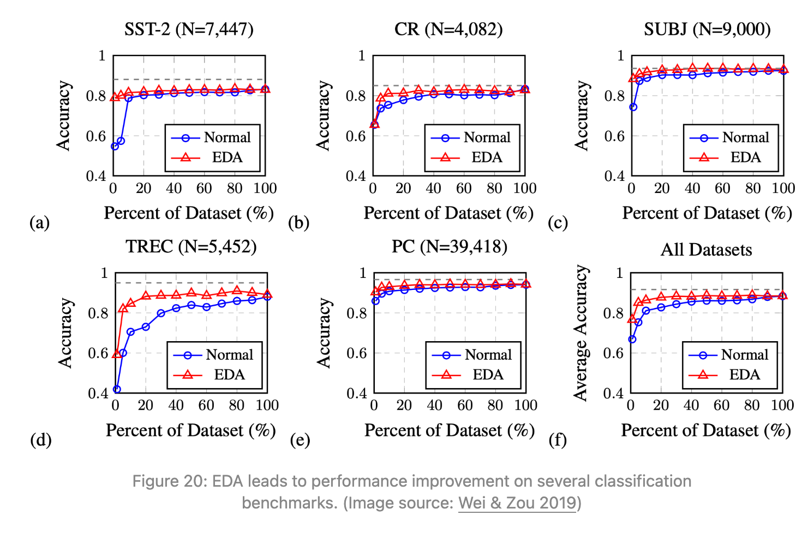

In **Contextual Augmentation** ([Sosuke Kobayashi, 2018](https://arxiv.org/abs/1805.06201)), new substitutes for word $w_i$ at position $i$ can be smoothly sampled from a given probability distribution, $p(\cdot \mid S \setminus \{w_i\})$, which is predicted by a bidirectional LM like BERT.

###### Back-translation

**CERT** (*Contrastive self-supervised Encoder Representations from Transformers*; [Fang et al. (2020)](https://arxiv.org/abs/2005.12766); [code](https://github.com/UCSD-AI4H/CERT)) generates augmented sentences via **back-translation**. Various translation models for different languages can be employed for creating different versions of augmentations. Once we have a noise version of text samples, many contrastive learning frameworks introduced above, such as [MoCo](https://lilianweng.github.io/posts/2021-05-31-contrastive/#moco--moco-v2), can be used to learn sentence embedding.

###### Dropout and Cutoff

[Shen et al. (2020)](https://arxiv.org/abs/2009.13818) proposed to apply **Cutoff** to text augmentation, inspired by [cross-view training](https://lilianweng.github.io/posts/2019-01-31-lm/#cross-view-training). They proposed three cutoff augmentation strategies:

1. *Token cutoff* removes the information of a few selected tokens. To make sure there is no data leakage, corresponding tokens in the input, positional and other relevant embedding matrices should all be zeroed out.,
2. *Feature cutoff* removes a few feature columns.
3. *Span cutoff* removes a continuous chunk of texts.

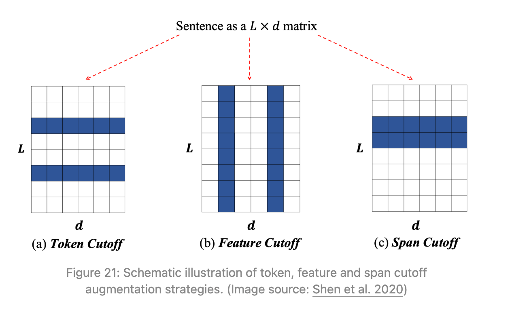

Multiple augmented versions of one sample can be created. When training, [Shen et al. (2020)](https://arxiv.org/abs/2009.13818) applied an additional KL-divergence term to measure the consensus between predictions from different augmented samples.

**SimCSE** ([Gao et al. 2021](https://arxiv.org/abs/2104.08821); [code](https://github.com/princeton-nlp/SimCSE)) learns from unsupervised data by predicting a sentence from itself with only **dropout** noise. In other words, they treat dropout as data augmentation for text sequences. A sample is simply fed into the encoder twice with different dropout masks and these two versions are the positive pair where the other in-batch samples are considered as negative pairs. It feels quite similar to the cutoff augmentation, but dropout is more flexible with less well-defined semantic meaning of what content can be masked off.


They ran experiments on 7 STS (Semantic Text Similarity) datasets and computed cosine similarity between sentence embeddings. They also tried out an optional MLM auxiliary objective loss to help avoid catastrophic forgetting of token-level knowledge. This aux loss was found to help improve performance on transfer tasks, but a consistent drop on the main STS tasks.

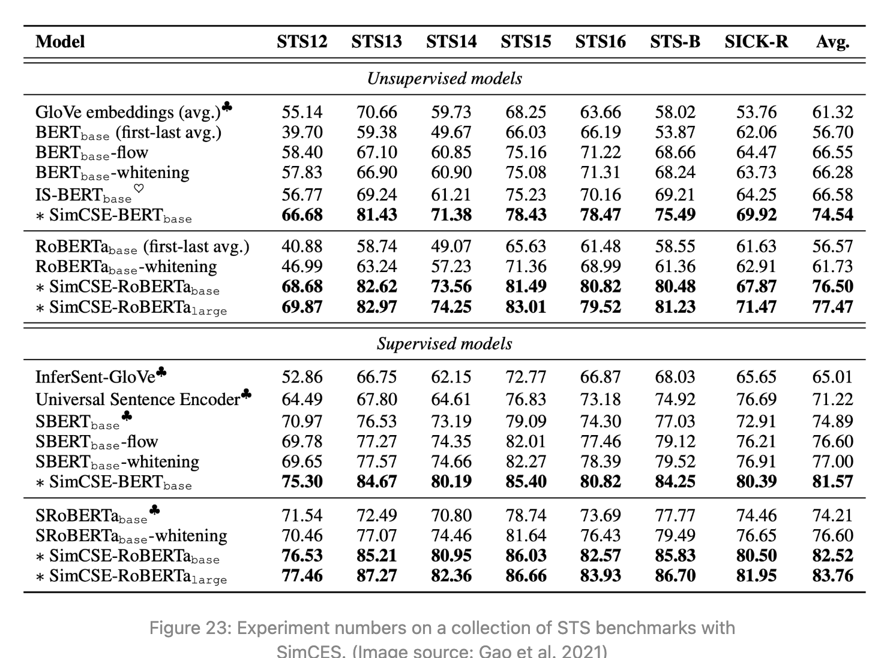

##### Supervision from NLI

**The pre-trained BERT sentence embedding without any fine-tuning has been found to have poor performance for semantic similarity tasks**. Instead of using the raw embeddings directly, we need to refine the embedding with further fine-tuning.

**Natural Language Inference (NLI)** tasks are the main data sources to provide supervised signals for learning sentence embedding; such as [SNLI](https://nlp.stanford.edu/projects/snli/), [MNLI](https://cims.nyu.edu/~sbowman/multinli/), and [QQP](https://www.kaggle.com/c/quora-question-pairs).

###### Sentence-BERT

**SBERT (Sentence-BERT)** ([Reimers & Gurevych, 2019](https://arxiv.org/abs/1908.10084)) relies on siamese and triplet network architectures to learn sentence embeddings such that the sentence similarity can be estimated by cosine similarity between pairs of embeddings. Note that learning SBERT depends on supervised data, as it is fine-tuned on several NLI datasets.

They experimented with a few different prediction heads on top of BERT model:

* **Softmax classification objective**: The classification head of the siamese network is built on the concatenation of two embeddings $f(\mathbf{x})$, $f(\mathbf{x}')$ and $|f(\mathbf{x}) - f(\mathbf{x}')|$. The predicted output is $\hat{y} = \text{softmax}(\mathbf{W}_t [f(\mathbf{x}); f(\mathbf{x}'); |f(\mathbf{x}) - f(\mathbf{x}')|])$. They showed that the most important component is the element-wise difference $|f(\mathbf{x}) - f(\mathbf{x}')|$.

* **Regression objective**: 对应图片右侧的架构，主要用于**语义文本相似度 (STS)** 等回归任务。
    *   **架构流程**:
        1.  **Siamese 结构**: 两个句子 $x$ 和 $x'$ 分别输入到两个共享参数的 BERT 网络中。
        2.  **Pooling**: 经过 BERT 输出后，通过 Pooling 层（通常是 **Mean Pooling**，实验证明比 Max Pooling 或 CLS token 效果更好）得到定长的句子向量 $u = f(x)$ 和 $v = f(x')$。
        3.  **相似度计算**: 计算两个向量的**余弦相似度 (Cosine Similarity)**:
            $$ \hat{y} = \cos(u, v) = \frac{u \cdot v}{\|u\| \cdot \|v\|} $$
            输出值范围在 $[-1, 1]$ 之间。
    *   **Loss 公式**: 使用**均方误差 (Mean Squared Error, MSE)** 作为损失函数，计算预测相似度 $\hat{y}$ 与真实标签相似度 $y$ 之间的差异：
        $$ J = \frac{1}{N} \sum_{i=1}^{N} (\hat{y}_i - y_i)^2 = \frac{1}{N} \sum_{i=1}^{N} (\cos(f(x_i), f(x'_i)) - y_i)^2 $$
        其中 $y_i$ 是数据集中标注的相似度分数（通常也归一化到 $[-1, 1]$ 或 $[0, 1]$）。

* **Triplet objective**: $\max(0, |f(\mathbf{x}) - f(\mathbf{x}^+)| - |f(\mathbf{x}) - f(\mathbf{x}^-)| + \epsilon)$, where $\mathbf{x}, \mathbf{x}^+, \mathbf{x}^-$ are embeddings of the anchor, positive and negative sentences.

In the experiments, which objective function works the best depends on the datasets, so there is no universal winner.

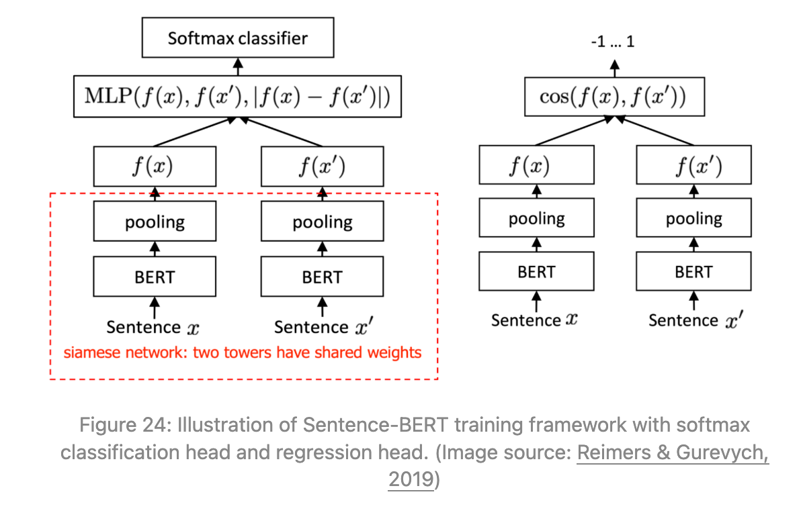

The [SentEval](https://github.com/facebookresearch/SentEval) library ([Conneau and Kiela, 2018](https://arxiv.org/abs/1803.05449)) is commonly used for evaluating the quality of learned sentence embedding. SBERT outperformed other baselines at that time (Aug 2019) on 5 out of 7 tasks.

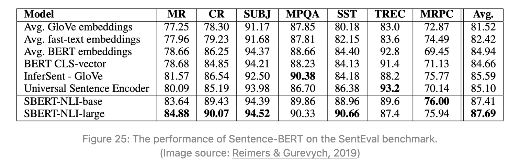

###### BERT-flow

**Anisotropy Problem (各向异性问题)**

预训练 BERT 学习到的 Embedding 空间通常表现出显著的**各向异性 (Anisotropy)**，即向量分布在一个狭窄的锥形 (Cone) 区域内，而不是均匀分布。这导致计算出的余弦相似度区分度不高。

[Li et al. (2020)](https://arxiv.org/abs/2011.05864) 指出这与**词频偏差**密切相关：
*   **高频词**: 聚集在**原点附近**。
    *   *High-frequency words are close to the origin.*
    *   原因：高频词出现在各种不同的上下文中，更新次数多且方向杂，导致其向量趋向于所有方向的平均（即原点）。
*   **低频词**: 分布在**远离原点**的稀疏区域。
    *   *Low-frequency ones are far away from the origin.*
    *   原因：低频词往往存在“语义空洞”，即离自己语义相似的词也比较远。

这种不均匀分布导致：即便两个词语义无关，只要词频相似，它们的距离也可能很近。

The embedding representation space is deemed *isotropic* if embeddings are uniformly distributed on each dimension; otherwise, it is *anisotropic*. [Li et al, (2020)](https://arxiv.org/abs/2011.05864) showed that a pre-trained BERT learns a non-smooth *anisotropic* semantic space of sentence embeddings and thus leads to poor performance for text similarity tasks without fine-tuning. Empirically, they observed two issues with BERT sentence embedding: Word frequency biases the embedding space. High-frequency words are close to the origin, but low-frequency ones are far away from the origin. Low-frequency words scatter sparsely. The embeddings of low-frequency words tend to be farther to their $$k$$-NN neighbors, while the embeddings of high-frequency words concentrate more densely.

**Solution**:
**BERT-flow** ([Li et al, 2020](https://arxiv.org/abs/2011.05864); [code](https://github.com/bohanli/BERT-flow)) 通过引入 [normalizing flows](https://lilianweng.github.io/posts/2018-10-13-flow-models/#what-is-normalizing-flows).，将 BERT 的输出空间映射到一个标准的各向同性高斯分布 (Isotropic Gaussian Distribution)，从而校正空间分布，显著提升语义相似度计算的效果。

Let $\mathcal{U}$ be the observed BERT sentence embedding space and $\mathcal{Z}$ be the desired latent space which is a standard Gaussian. Thus, $p_{\mathcal{Z}}$ is a Gaussian density function and $f_{\phi}: \mathcal{Z} \rightarrow \mathcal{U}$ is an invertible transformation:
$$ \mathbf{z} \sim p_{\mathcal{Z}}(\mathbf{z}) \quad \mathbf{u} = f_{\phi}(\mathbf{z}) \quad \mathbf{z} = f_{\phi}^{-1}(\mathbf{u}) $$

A flow-based generative model learns the invertible mapping function by maximizing the likelihood of $\mathcal{U}$'s marginal:
$$ \max_{\phi} \mathbb{E}_{\mathbf{u}=\text{BERT}(s), s \sim \mathcal{D}} \left[ \log p_{\mathcal{Z}}(f_{\phi}^{-1}(\mathbf{u})) + \log \left| \det \frac{\partial f_{\phi}^{-1}(\mathbf{u})}{\partial \mathbf{u}} \right| \right] $$
where $s$ is a sentence sampled from the text corpus $\mathcal{D}$. Only the flow parameters $\phi$ are optimized while parameters in the pretrained BERT stay unchanged.

*   **Loss Function Analysis**:
    The objective is to maximize the log-likelihood of the observed data: $\log p_{\mathcal{U}}(\mathbf{u})$. By change of variables formula:
    $$ \log p_{\mathcal{U}}(\mathbf{u}) = \log p_{\mathcal{Z}}(f_{\phi}^{-1}(\mathbf{u})) + \log \left| \det \frac{\partial f_{\phi}^{-1}(\mathbf{u})}{\partial \mathbf{u}} \right| $$
    *   **Prior Term ($\log p_{\mathcal{Z}}$)**: Since $p_{\mathcal{Z}}$ is a standard Gaussian $\mathcal{N}(0, I)$, this term is proportional to $-\frac{1}{2} \| \mathbf{z} \|^2$. Maximizing it encourages the mapped latent vectors $\mathbf{z}$ to be close to the origin (compact).
    *   **Jacobian Term ($\log |\det J|$)**: This term accounts for the change in volume/density caused by the transformation. In architectures like **Glow** (used in BERT-flow), **the transformation is designed such that the Jacobian matrix is triangular**, making the determinant easy to compute (product of diagonal elements).
    *   **Motivation**:
        *   **Anisotropy Correction**: It forces the irregular BERT embedding distribution to match a smooth, isotropic Gaussian distribution.
        *   **Unsupervised**: No labels are needed; it purely optimizes the distribution shape.

*   **Why Triangular Jacobian Matters?**
    *   **Computational Efficiency**: Calculating the determinant of a general $D \times D$ matrix has a time complexity of $O(D^3)$. In high-dimensional spaces (like BERT embeddings with $D=768$), this is prohibitively expensive.
    *   **Triangular Property**: If the Jacobian matrix $J$ is triangular (upper or lower), its determinant is simply the product of its diagonal elements: $\det J = \prod_{i} J_{ii}$.
    *   **Log-Determinant**: $\log |\det J| = \sum_{i} \log |J_{ii}|$. This reduces the complexity to $O(D)$, making the training of deep flow models feasible.

*   **Implementation with Affine Coupling (RealNVP/Glow)**
    The **Affine Coupling Layer** is the key component that ensures the Jacobian is triangular. It splits the input dimensions into two parts ($x_a, x_b$) and applies an affine transformation to one part conditioned on the other.

    **PyTorch Implementation**:
    ```python
    import torch
    import torch.nn as nn
    
    class AffineCoupling(nn.Module):
        def __init__(self, dim, hidden_dim=512):
            super().__init__()
            # Neural network to predict scale (s) and translation (t)
            # Input: x_a (dim/2), Output: s, t (dim/2 each)
            self.net = nn.Sequential(
                nn.Linear(dim // 2, hidden_dim),
                nn.ReLU(),
                nn.Linear(hidden_dim, dim) # Outputs concatenated s and t
            )
    
        def forward(self, x):
            # x: [batch_size, dim]
            # 1. Split input
            x_a, x_b = x.chunk(2, dim=1)
    
            # 2. Predict parameters (s, t) based on x_a
            # s and t can be arbitrarily complex functions of x_a
            params = self.net(x_a)
            log_s, t = params.chunk(2, dim=1)
            s = torch.sigmoid(log_s + 2) # Sigmoid+offset for stability
    
            # 3. Affine Transformation on x_b
            # y_a = x_a (Identity)
            # y_b = s * x_b + t
            y_a = x_a
            y_b = s * x_b + t
            y = torch.cat([y_a, y_b], dim=1)
    
            # 4. Log Determinant (Sum of log diagonal elements)
            # Jacobian is triangular, diagonal contains 1s (for y_a) and s (for y_b)
            # log_det = sum(log(1)) + sum(log(s)) = sum(log(s))
            log_det = torch.sum(torch.log(s), dim=1) 
            
            return y, log_det
    
    # Loss Calculation
    def loss_function(z, log_det):
        # 1. Prior Log-Likelihood: log p_Z(z)
        # z ~ N(0, I) => log p(z) = -0.5 * z^2 - const
        prior_ll = -0.5 * torch.sum(z ** 2, dim=1)
        
        # 2. Flow Log-Likelihood: log p_X(x) = log p_Z(z) + log_det
        log_likelihood = prior_ll + log_det
        
        # 3. Minimize Negative Log-Likelihood
        loss = -torch.mean(log_likelihood)
        return loss
    ```

BERT-flow was shown to improve the performance on most STS tasks either with or without supervision from NLI datasets. Because learning normalizing flows for calibration does not require labels, it can utilize the entire dataset including validation and test sets.

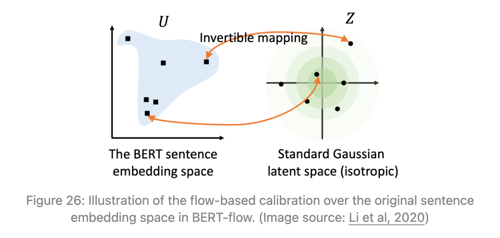

###### Whitening Operation

[Su et al. (2021)](https://arxiv.org/abs/2103.15316) applied **whitening** operation to improve the [isotropy](https://lilianweng.github.io/posts/2021-05-31-contrastive/#isotropy) of the learned representation and also to reduce the dimensionality of sentence embedding.

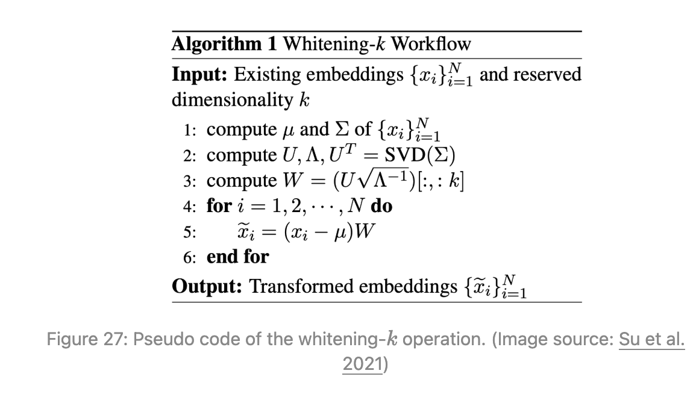

They transform the mean value of the sentence vectors to 0 and the covariance matrix to the identity matrix. Given a set of samples $\{\mathbf{x}_i\}_{i=1}^N$, let $\tilde{\mathbf{x}}_i$ and $\tilde{\Sigma}$ be the transformed samples and corresponding covariance matrix:

$$
\mu = \frac{1}{N} \sum_{i=1}^N \mathbf{x}_i \quad \Sigma = \frac{1}{N} \sum_{i=1}^N (\mathbf{x}_i - \mu)^\top (\mathbf{x}_i - \mu)
$$

$$
\tilde{\mathbf{x}}_i = (\mathbf{x}_i - \mu)W \quad \tilde{\Sigma} = W^\top \Sigma W = I \text{ thus } \Sigma = (W^{-1})^\top W^{-1}
$$

If we get SVD decomposition of $\Sigma = U \Lambda U^\top$, we will have $W^{-1} = \sqrt{\Lambda} U^\top$ and $W = U \sqrt{\Lambda^{-1}}$. Note that within SVD, $U$ is an orthogonal matrix with column vectors as eigenvectors and $\Lambda$ is a diagonal matrix with all positive elements as sorted eigenvalues.

A dimensionality reduction strategy can be applied by only taking the first $k$ columns of $W$, named `Whitening -k`.

Whitening operations were shown to outperform BERT-flow and achieve SOTA with 256 sentence dimensionality on many STS benchmarks, either with or without NLI supervision.

##### Query2Doc

* For training **dense retrievers**, several factors can influence the final performance:
  * **Hard negative mining** (Xiong et al., 2021)
  * **Intermediate pretraining** (Gao and Callan, 2021)
  * **Knowledge distillation** from a cross-encoder based re-ranker (Qu et al., 2021)
* In this paper, we investigate two settings to gain a more comprehensive understanding of our method.
  * The first setting is training **DPR** (Karpukhin et al., 2020) models initialized from BERTbase with BM25 hard negatives only.
* 

### 无监督学习

#### Contrastive Self-Supervised Learning (对比自监督学习)

对比学习（Contrastive Learning）通过构建正负样本对，利用 InfoNCE 等损失函数拉近正样本、推开负样本，从而在无监督或自监督的情况下学习高质量的特征表示。这种范式已成为无监督学习的主流方法。

##### Vision: SimCLR & MoCo

*   **核心思想**: 利用数据增强（Data Augmentation）构造正样本对（同一图片的不同视图），将其他图片作为负样本。
*   **SimCLR**: 强调强数据增强（Strong Augmentation）和大 Batch Size 的重要性，直接在当前 Batch 内计算负例。
*   **MoCo (Momentum Contrast)**: 引入动量更新的 Encoder 和 Memory Bank（队列）来维护大量的负样本，解决了 Batch Size 的限制，使负例分布更平滑。
*   *详细原理与损失函数推导请参考上文 [Contrastive Learning](#contrastive-learning) 章节。*

##### Multimodal: CLIP (Contrastive Language-Image Pre-training)

*   **简介**: OpenAI 提出的多模态预训练模型，在大规模（4亿对）图文数据集上进行训练。
*   **机制**: 联合训练图像编码器和文本编码器，将图像和对应的文本描述映射到共享的嵌入空间。使用 InfoNCE Loss 最大化正确图文对的余弦相似度。
*   **意义**: 虽然利用了文本作为弱监督信号，但其无需人工标注类别标签（Zero-shot），具有极强的泛化能力，是连接视觉与语言的重要桥梁。

##### Recommendation: Semantic-aware Contrastive Learning (SCL)

*   **场景**: 推荐系统中的召回/预训练阶段。
*   **方法**: 利用用户的自然行为序列（如点击、购买）构建正样本对（Query-Item），利用 MoCo 策略维护负样本队列。
*   **优化**: 引入 Triplet Loss 挖掘难负例（Hard Negative Mining），例如外观相似但品类不同的商品，提升表征的判别性。

##### NLP: Unsupervised Sentence Embedding

###### Context Prediction: Quick-Thought

**Quick-Thought (QT) vectors** ([Logeswaran & Lee, 2018](https://arxiv.org/abs/1803.02893)) formulate sentence representation learning as a *classification* problem: Given a sentence and its context, a classifier distinguishes context sentences from other contrastive sentences based on their vector representations ([“cloze test”](https://lilianweng.github.io/posts/2019-01-31-lm/#MLM)). 

**传统瓶颈**：生成式模型（如 Skip-Thought）需逐词重建句子，每一步都要在庞大的**词表空间（Vocabulary Size）**上计算 Softmax，计算量巨大。

*   **QT 改进**：将任务转化为**判别式（Discriminative）**问题，即从当前 Batch 的候选中识别正确的上下文句子。
*   **加速原理**：分类类别数从词表大小（数万）降低为 **Batch Size**（几百），从而移除了高维 Softmax 带来的计算瓶颈。

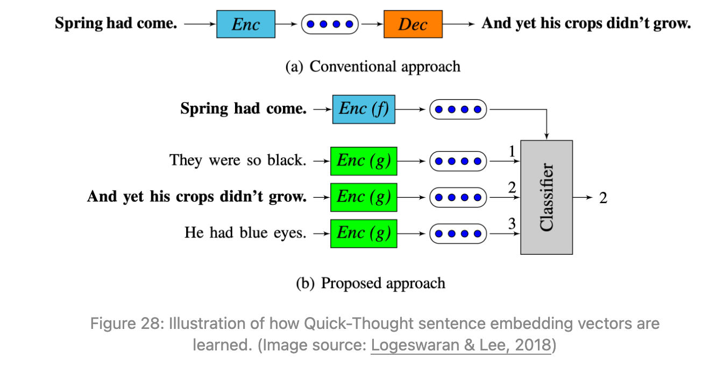

Let $f(.)$ and $g(.)$ be two functions that encode a sentence $s$ into a fixed-length vector. Let $C(s)$ be the set of sentences in the context of $s$ and $S(s)$ be the set of candidate sentences including only one sentence $s_c \in C(s)$ and many other non-context negative sentences. Quick Thoughts model learns to optimize the probability of predicting the only true context sentence $s_c \in S(s)$. It is essentially NCE loss when considering the sentence $(s, s_c)$ as the positive pairs while other pairs $(s, s')$ where $s' \in S(s), s' \neq s_c$ as negatives.

$$
\mathcal{L}_{\text{QT}} = - \sum_{s \in \mathcal{D}} \sum_{s_c \in C(s)} \log p(s_c|s, S(s)) = - \sum_{s \in \mathcal{D}} \sum_{s_c \in C(s)} \log \frac{\exp(f(s)^\top g(s_c))}{\sum_{s' \in S(s)} \exp(f(s)^\top g(s'))}
$$

###### Mutual Information Maximization: IS-BERT

**IS-BERT (Info-Sentence BERT)** ([Zhang et al. 2020](https://arxiv.org/abs/2009.12061); [code](https://github.com/yanzhangnlp/IS-BERT)) adopts a self-supervised learning objective based on *mutual information maximization* to learn good sentence embeddings in the *unsupervised* manners.

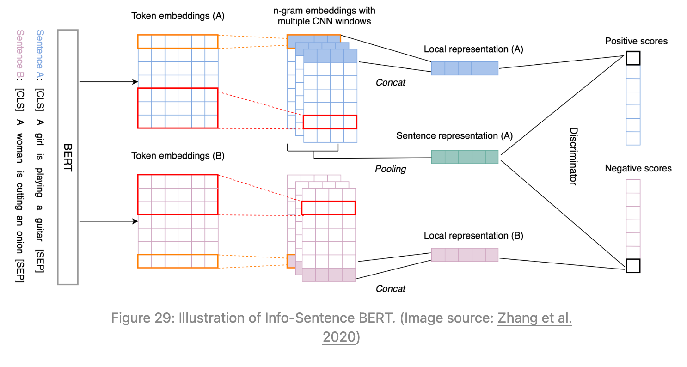

IS-BERT works as follows:

1. Use BERT to encode an input sentence $s$ to a token embedding of length $l$, $\mathbf{h}_{1:l}$.
2. Then apply 1-D conv net with different kernel sizes (e.g. 1, 3, 5) to process the token embedding sequence to capture the n-gram local contextual dependencies: $\mathbf{c}_i = \text{ReLU}(\mathbf{w} \cdot \mathbf{h}_{i:i+k-1} + \mathbf{b})$. The output sequences are padded to stay the same sizes of the inputs.
3. The final local representation of the $i$-th token $\mathcal{F}_{\theta}^{(i)}(\mathbf{x})$ is the concatenation of representations of different kernel sizes.
4. The global sentence representation $\mathcal{E}_{\theta}(\mathbf{x})$ is computed by applying a mean-over-time pooling layer on the token representations $\mathcal{F}_{\theta}(\mathbf{x}) = \{\mathcal{F}_{\theta}^{(i)}(\mathbf{x}) \in \mathbb{R}^d\}_{i=1}^l$.

Since the mutual information estimation is generally intractable for continuous and high-dimensional random variables, IS-BERT relies on the Jensen-Shannon estimator ([Nowozin et al., 2016](https://arxiv.org/abs/1606.00709), [Hjelm et al., 2019](https://arxiv.org/abs/1808.06670)) to maximize the mutual information between $\mathcal{E}_{\theta}(\mathbf{x})$ and $\mathcal{F}_{\theta}^{(i)}(\mathbf{x})$.

$$
I_{\omega}^{\text{JSD}}(\mathcal{F}_{\theta}^{(i)}(\mathbf{x}); \mathcal{E}_{\theta}(\mathbf{x})) = \mathbb{E}_{\mathbf{x} \sim P}[-\text{sp}(-T_{\omega}(\mathcal{F}_{\theta}^{(i)}(\mathbf{x}); \mathcal{E}_{\theta}(\mathbf{x})))] - \mathbb{E}_{\mathbf{x} \sim P, \mathbf{x}' \sim \tilde{P}}[\text{sp}(T_{\omega}(\mathcal{F}_{\theta}^{(i)}(\mathbf{x}'); \mathcal{E}_{\theta}(\mathbf{x})))]
$$

where $T_{\omega} : \mathcal{F} \times \mathcal{E} \to \mathbb{R}$ is a learnable network with parameters $\omega$, generating discriminator scores. The negative sample $\mathbf{x}'$ is sampled from the distribution $\tilde{P} = P$. And $\text{sp}(x) = \log(1 + e^x)$ is the softplus activation function.

The unsupervised numbers on SentEval with IS-BERT outperforms most of the unsupervised baselines (Sep 2020), but unsurprisingly weaker than supervised runs. When using labelled NLI datasets, IS-BERT produces results comparable with SBERT (See Fig. 25 & 30).

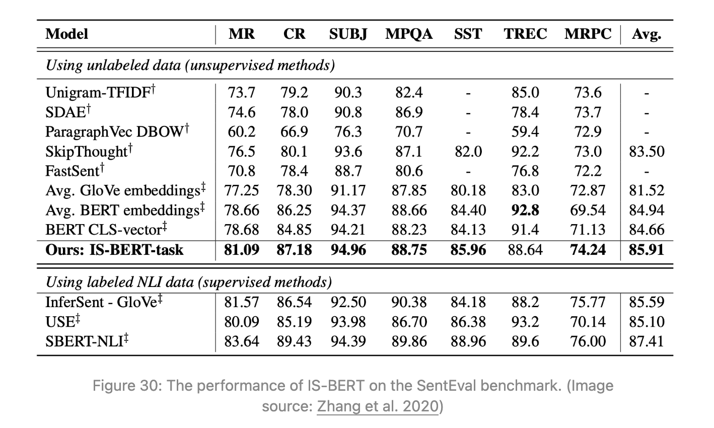

### NLP

#### Intro

* 概念：语言模型

  * [Bag-of-words(BoW) model](https://en.wikipedia.org/wiki/Bag-of-words_model) 可作为一种信息模型，表示句子或图片，用于衡量相似度或别的用途

  * stop words: 停用词

  * [Tokenization and text normalization](https://www.analyticsvidhya.com/blog/2021/03/tokenization-and-text-normalization/)


#### Embedding

* Intro
  * Embedding从入门到专家必读的十篇论文 - 王喆的文章 - 知乎
    https://zhuanlan.zhihu.com/p/58805184

* one-hot的缺点：
  * 过于稀疏
  * 无法体现距离
  * 没有数学或逻辑关系
    * e.g. 国王 - 男人 + 女人 = 女王

* NLP Embedding
  * Word2Vec
  * CLIP
  * OpenAI Embedding
* 每个Token对应一个embedding
  * GPT-3: 每个token **12228维**
  * 经典的transformer，每个向量只有512维
* 向量空间模型（Vector Space Model，以下简称VSM），主要基于两个假说：
  * 词袋假说（Bag of Words Hypothesis）和分布假说（Distributional Hypothesis）。
  * 前者是说，一篇文档的词频（而不是词序）代表了文档的主题；
  * 后者是说，上下文环境相似的两个词有着相近的语义。

##### 高维空间维度灾难（Curse of Dimensionality）和测度集中（Concentration of Measure）

- 高维空间的反直觉特性：**向量几乎总是近乎正交的**
  - 假设向量 $$q$$ 和 $$v$$ 的每个分量 $$q_i, v_i$$ 都是从均值为 $$0$$、方差为 $$1$$ 的分布中独立随机抽取的。
  - 点积的期望值：$$E[q \cdot v] = E\left[\sum_{i=1}^{D} q_i v_i\right] = \sum_{i=1}^{D} E[q_i v_i] = \sum_{i=1}^{D} E[q_i]E[v_i] = 0$$
  - 点积的方差： $$Var(q \cdot v) = Var\left(\sum_{i=1}^{D} q_i v_i\right) = \sum_{i=1}^{D} Var(q_i v_i) = \sum_{i=1}^{D} E[q_i^2]E[v_i^2] - (E[q_i]E[v_i])^2 = \sum_{i=1}^{D} (1 \cdot 1 - 0) = D$$
  - $$\cos(\theta) = \frac{q \cdot v}{||q|| \cdot ||v||}$$，其分子 $$q \cdot $$ 的标准差为 $$\sqrt{D}$$，而分母 $$||q|| \cdot ||v|$$ 的期望值约为 $$\sqrt{D} \cdot \sqrt{D} =D $$。因此，$$\cos(\theta)$$ 的值会随着 $$D$$ 的增大而向 $$0$$ 集中。

- Avg Pooling的数值分析: $$V_p = \frac{1}{N} \sum_{k=1}^{N} v_k$$
  - 背景：Attention和各种模型的核心计算
  - 分析目标: 单个向量 $$v_k$$ 对最终池化向量 $$V_p$$ 几何稳定性的影响。鲁棒性体现为 $$V_p$$ 长度的相对波动性。
  - 假设: $$v_k$$ 的分量为 i.i.d.，均值为0，方差为1。
  - 推导:
    - 期望能量: $$E[||V_p||^2] = D/N$$
      - $$E[||V_p||^2] = \frac{1}{N^2} E[\sum_{k,j} (v_k \cdot v_j)] = \frac{1}{N^2} N E[||v_k||^2] = \frac{D}{N}$$
    - 能量方差: $$Var(||V_p||^2) \approx \frac{2D}{N^2}$$
      - $$Var(||V_p||^2) = \frac{1}{N^4}Var(||\sum v_k||^2) \approx \frac{1}{N^4} D \cdot Var((Normal(0,N))^2) = \frac{1}{N^4} D \cdot 2N^2 = \frac{2D}{N^2}$$
    - 变异系数 (衡量相对稳定性):
      $$CV(||V_p||^2) = \frac{StdDev(||V_p||^2)}{E[||V_p||^2]} = \frac{\sqrt{2D/N^2}}{D/N} = \frac{\sqrt{2}}{\sqrt{D}}$$
  - 结论:
    - 池化向量 $$V_p$$ 能量的相对波动与 $$\sqrt{D}$$ 成反比。
    - $$D$$ 越大，池化结果的几何性质（如长度）越稳定，不易受单个异常向量的干扰。
    - 数学上证明了高维Embedding在Pooling时更鲁棒，是测度集中现象 (Concentration of Measure) 的直接体现
- 点积求和的数学分析：
  - 定义: $$Score = \sum_{k=1}^{N} (q \cdot v_k)$$，结果为标量。
  - 分析: 单个标量贡献 $$q \cdot v_k$$ 对最终标量和 $$Score$$ 的相对影响。
  - 假设: $$q$$, $$v_k$$ 的分量为 i.i.d.，均值为0，方差为1。
  - 推导:
    - 单项方差: $$Var(q \cdot v_k) = D$$
    - 总和方差: $$Var(Score) = Var(\sum (q \cdot v_k)) = N \cdot Var(q \cdot v_k) = ND$$
    - 相对贡献 (标准差比率): $$StdDev(q \cdot v_k) / StdDev(Score) = \sqrt{D} / \sqrt{ND} = 1 / \sqrt{N}$$
  - 结论:
    - 单项对总和的相对贡献仅与 $$N$$ 有关
    - 解释了Attention中 $$\sqrt{d_k}$$ 缩放的必要性
  - Insight：点积求和相当于将高维向量投影到了q，类似于点积结果被映射到了单维，于是稳定性不受D的影响
- 对应用的启发：
  - 点积建模：`Pool(LLM_EMB(side_info) for side_info in side_infos)` 这种做法，side info越多越好，越多则系统鲁棒性越强
  - 模型建模：如长序列建模
    - 序列越长（N越大），预估分的鲁棒性越好
    - D越大，模型learning鲁棒性越好，但D大则容易模型learning不充分，二者存在一个折中

#### 利用 Embedding 的 Feature-based 方法

* 历史方法
  * non-neural (Brown et al., 1992; Ando and Zhang, 2005; Blitzer et al., 2006)
  * neural (Collobert and Weston, 2008; Mikolov et al., 2013; Pennington et al., 2014) methods.
* 多种运用
  * BERT
  * 
* 应用
  * These approaches have been generalized to
    coarser granularities, such as sentence embed-
    dings (Kiros et al., 2015; Logeswaran and Lee, 2018) or paragraph embeddings (Le and Mikolov, 2014). [BERT]


#### Word2Vec: Distributed Representations of Words and Phrases and their Compositionality

#### Word2Vec: Efficient Estimation of Word Representations in Vector Space

> https://www.cnblogs.com/sandwichnlp/p/11596848.html
>
> * CBOW和NNLM的区别：
>   * 移除NNLM模型中的Hidden layer结构；
>   * 直接将Embedding layer的查表之后累加求和（NNLM是将输出结果拼接）
>   * 将下文单词纳入上、下文环境，真正考虑了Context（NNLM的输入严格来说为上文文本）

* Intro
  * 为什么之前流行 N-gram model
    * simplicity, robustness and the observation that simple models trained on huge amounts of data outperform complex systems trained on less data
  * 改进路线：distributed representations of words [10]
  * datasets with billions of words, and with millions of words in the vocabulary
    * multiple degrees of similarity
    * vector(”King”) - vector(”Man”) + vector(”Woman”)   -- **syntactic/semantic relationships**

* 模型

  * Feedforward Neural Net Language Model (NNLM)
    * 效率优化：Huffman tree based **hierarchical softmax**
  * Recurrent Neural Net Language Model (RNNLM)
  * Continuous Bag-of-Words Model
    * 去除hidden layer
    * 
  * Continuous Skip-gram Model
    * Since the more distant words are usually less related to the current
      word than those close to it, we give less weight to the distant words by sampling less from those words in our training examples.
  * 

* 训练：

  * trained in two steps:

    * first, continuous word vectors are learned using simple model
    * and then the N-gram NNLM is trained on top of these distributed representations of words.

  * Noise-Contrastive Estimation

    * https://www.cnblogs.com/sandwichnlp/p/11596848.html

  * 模型训练过程

    * 输入向量的权重矩阵 = 词向量查找表

    * 负采样方法减轻训练负担

      * $E=-log\sigma({v^{'}_{w_o}}^Th)-\sum_{w_j\in W_{neg}}log\sigma(-{v^{'}_{w_j}}^Th)$

      * 采样到10个以内负样本

    * 还有Hierarchical softmax方法加速训练，实际效果没有负采样好

* 结论：

  * Skip-gram 在语义任务表现出色，CBOW 在句法任务较好
  * **微软研究句子完成挑战**：Skip-gram 模型与 RNNLMs 结合在该任务中取得新的最优结果。

* MLSys

  * DistBelief：异步训练 + adagrad

* [word2vec的局限性](https://www.cnblogs.com/sandwichnlp/p/11596848.html#4144593371)

  总的来说，word2vec通过嵌入一个线性的投影矩阵（projection matrix），将原始的one-hot向量映射为一个稠密的连续向量，并通过一个语言模型的任务去学习这个向量的权重，而这个过程可以看作是无监督或称为自监督的，其词向量的训练结果与语料库是紧密相关的，因此通常不同的应用场景需要用该场景下的语料库去训练词向量才能在下游任务中获得最好的效果。这一思想后来被广泛应用于包括word2vec在内的各种NLP模型中，从此之后不单单是词向量，我们也有了句向量、文档向量，从Word Embedding走向了World Embedding的新时代。word2vec非常经典，但也有其明显的局限性，其主要在以下几个方面：

  1. 在模型训练的过程中仅仅考虑context中的局部语料，没有考虑到全局信息；
  2. 对于英文语料，对于什么是词，怎样分词并不是问题（单个词就是独立的个体）。而对于中文而言，我们在训练词向量之前首先要解决分词的问题，而分词的效果在很多情况下将会严重影响词向量的质量（如分词粒度等），因此，从某些方面来说word2vec对中文不是那么的友好；
  3. 在2018年以前，对于word2vec及其一系列其他的词向量模型都有一个相同的特点：其embedding矩阵在训练完成后便已经是固定了的，这样我们可以轻易从网上获取到大量预训练好的词向量并快速应用到我们自己任务中。但从另一个角度来说，对于同一个词，在任意一个句子，任意一个环境下的词向量都是固定的，这对于一些歧义词来说是存在较大问题的，这也是限制类似word2vec、Glove等词向量工具性能的一个很重要的问题。

#### GloVe(Globel Vectors)算法

* Intro
  * SVD分解与Word2Vec的结合。
  * 现矩阵X，该矩阵中的Xij表示第j个单词出现在以第i个单词为中心，长度为n的窗口中的次数。将长度为n的窗口遍历整个语料库，则得到了共现矩阵X。
  * 考虑全局信息
* 推导
  * 

#### Evaluation

##### 词之间的相似度

* Embedding-based
  * SentenceEmbedding

```python
from sentence_transformers import SentenceTransformer, util

model = SentenceTransformer('...')

field_embeddings = model.encode(fields)

def find_most_similar(input_word):
    input_embedding = model.encode(input_word)
    similarities = util.cos_sim(input_embedding, field_embeddings)
    best_index = similarities.argmax()
    return fields[best_index]
```


* 编辑距离
  * Levenshtein
  * fuzzywuzzy

```python
from fuzzywuzzy import process
def find_most_similar(input_word):
    match, score = process.extractOne(input_word, fields)
    return match
```

##### 句子之间的相似度

* 编辑距离

* BLEU（Bilingual Evaluation Understudy）

  - **定义**：BLEU 是一种用于评估机器翻译质量的指标。它通过比较机器生成的翻译文本与参考（人工翻译）文本之间的 n - gram（n 个连续单词的序列）重叠情况来衡量翻译的准确性。
    - 工作原理
      - 计算生成文本和参考文本之间的 n - gram（如 1 - gram、2 - gram、3 - gram 和 4 - gram）的匹配数量。例如，对于一个句子，1 - gram 是单个单词的匹配，2 - gram 是两个连续单词的匹配，以此类推。
      - BLEU 得分是这些 n - gram 匹配率的几何平均值，并且会**考虑简短回答的惩罚因子**。如果生成的句子过短，会受到惩罚，以避免系统总是生成非常简短但可能部分匹配的句子来获取高分。
      - 在整个测试集上平均下述值
      - 完整计算公式：$\mathrm{BLEU}_4=\min\left(1,\frac{output-length}{reference-length}\right)\left(\prod_{i=1}^4 precision_i\right)^{\frac{1}{4}}$

  - **应用场景**：广泛应用于机器翻译系统的评估，帮助比较不同翻译模型或算法的性能，确定哪种模型能够生成更接近人工翻译质量的译文。

* ROUGE（Recall-Oriented Understudy for Gisting Evaluation）

  - **定义**：ROUGE 是一组用于评估自动文本摘要和机器翻译质量的指标，主要侧重于召回率（Recall），即衡量系统生成的文本能够包含参考文本中多少重要信息。
    - Rouge-N：将模型生成的结果和标准结果按 N-gram 拆分后，只计算召回率；
    - Rouge-L: 利用了最长公共子序列（Longest Common Sequence），计算：$P=\frac{LCS(c,r)}{len(c)}$, $R=\frac{LCS(c,r)}{len(r)}$, $F=\frac{(1+\beta^2)PR}{R+\beta^2P}$
    - 函数库：https://pypi.org/project/rouge-score/
    - 对比 BLEU 与 ROUGE：
      - BLEU 能评估流畅度，但指标偏向于较短的翻译结果（brevity penalty 没有想象中那么强）
      - ROUGE 不管流畅度，所以只适合深度学习的生成模型：结果都是流畅的前提下，ROUGE 反应参照句中多少内容被生成的句子包含（召回）

  - **应用场景**：在文本摘要领域，用于评估自动生成的摘要是否能够准确地捕捉原始文本的主要内容；在机器翻译中，也可以帮助评估翻译后的文本是否完整地传达了原文的关键信息。

* METEOR（Metric for Evaluation of Translation with Explicit ORdering）

  - **定义**：METEOR 是一种综合考虑了精确率（Precision）、召回率（Recall）和词序（Word Order）的文本生成质量评估指标，用于评估机器翻译和其他文本生成任务。
    - 工作原理
      - 首先计算生成文本和参考文本之间的精确率和召回率，类似于 BLEU 和 ROUGE 的部分计算。
      - 然后，METEOR 引入了一个基于词序的 F-measure（调和平均数）来综合评估匹配质量。它通过考虑单词的匹配、同义词匹配（通过预定义的词表）和词序的连贯性来计算得分。
      - 还包括一个对齐模块，用于找到生成文本和参考文本之间单词的最佳匹配，考虑了多种匹配类型，如完全匹配、同义词匹配和词根匹配等。
    - 对语言学和语义词表有依赖，所以对语言依赖强。

  - **应用场景**：在机器翻译和文本生成任务中，METEOR 能够提供一个更全面的评估，因为它不仅仅关注单词或短语的匹配，还考虑了词序和语义相似性，能够更好地反映生成文本的自然度和准确性。

##### 指标

* 困惑度(perplexity)的基本概念及多种模型下的计算（N-gram, 主题模型, 神经网络）https://zhuanlan.zhihu.com/p/114432097


### CV

#### 卷积网络

* Intro

  * 过滤器常使用一个 4 维的张量表示，前两维表示过滤器的大小，第三维表示输入的通道数，第四维表示输出的通道数
    * 卷积核的深度或层数与输入图片的通道数目应保持一致。这是pytorch底层实现的，开发人员不需要考虑。
    * 卷积操作之后输出的通道数目是由卷积核个数所决定的。
  * 理解卷积
    * 函数拟合
    * 模式匹配：卷积核定义了某种模式，卷积运算是在计算每个位置与该模式的相似程度，或者说每个位置具有该模式的分量有多少，当前位置与该模式越像，响应越强。
  * 感受野：第一层卷积层的输出特征图像素的感受野的大小等于卷积核的大小。
  * Feature Map大小：
    * 

* 特点

  * 局部连接

  * 权值共享：所有神经元共享filter的参数，filters可以有多个

  * 下采样
    * L2 pooling
    * Local Contrast Normalization


* Local feature map
  * CNN（卷积神经网络）中的局部特征图（Local Feature Maps）
    - 生成原理
      - 在 CNN 中，卷积层通过卷积核（filter）在输入图像（或上一层的特征图）上滑动进行卷积操作来生成局部特征图。例如，对于一个大小为的卷积核在一个的图像上滑动，卷积核每次覆盖的区域就是一个局部区域。卷积操作会对这个局部区域内的像素值进行加权求和等计算，得到新的特征值，这些特征值组成了输出特征图中的一个元素。当卷积核遍历完整个输入图像后，就生成了一个完整的局部特征图。
    - 特征表示意义
      - 这些局部特征图能够捕捉图像中不同位置的局部特征，如边缘、纹理等。例如，在一个用于图像分类的 CNN 中，较低层的局部特征图可能主要捕捉简单的边缘和纹理信息。随着网络层数的增加，局部特征图会逐渐组合这些简单特征，形成更复杂的局部特征，如物体的局部形状等，最终用于识别图像中的物体类别。
    - 应用场景
      - **图像分类**：通过提取局部特征图中的特征来区分不同类别的图像。例如，在识别猫和狗的图像时，CNN 可以通过局部特征图捕捉猫和狗的不同面部特征、毛发纹理等局部信息，进而判断图像类别。
      - **目标检测**：用于定位图像中的目标物体。局部特征图可以帮助确定目标物体的位置和大致形状，例如在检测汽车时，局部特征图可以捕捉汽车的轮廓、车窗等局部特征，从而找到汽车在图像中的位置。
  * ViT（Vision Transformer）中的局部特征图
    - 与 CNN 的区别
      - ViT 主要基于 Transformer 架构，其处理图像的方式与 CNN 有所不同。它将图像分割成一系列的图像块（patches），这些图像块可以看作是一种局部特征的表示，但与 CNN 的局部特征图在概念和生成方式上有差异。在 ViT 中，每个图像块经过线性投影等操作后，类似于序列中的一个元素，而不是像 CNN 那样通过卷积操作生成特征图。
    - 类似的局部特征提取方式（以图像块为基础）
      - ViT 把图像划分为固定大小的图像块，例如的图像块。这些图像块可以被视为局部特征的载体。每个图像块经过线性嵌入（linear embedding）后，被转化为一个向量，所有这些向量组成一个序列输入到 Transformer 的编码器（encoder）中。在这个过程中，虽然没有像 CNN 那样传统意义上的局部特征图，但这些图像块在某种程度上起到了局部特征提取的作用，并且通过 Transformer 的自注意力机制（self - attention mechanism），能够学习到图像块之间的全局关系，从而综合考虑局部和全局特征进行图像理解。
    - 应用场景
      - **图像分类与 CNN 类似**：在图像分类任务中，ViT 通过对图像块组成的序列进行处理，学习到图像的整体特征表示，用于区分不同的图像类别。由于 Transformer 架构的自注意力机制能够捕捉长距离的依赖关系，ViT 在一些大规模图像分类任务中表现出色。
      - **多模态融合等新兴场景**：在与其他模态（如文本）结合的多模态任务中，ViT 的图像块表示方式可以更容易地与其他模态的特征进行融合。例如，在图像 - 文本匹配任务中，图像块的特征可以和文本的词向量特征通过合适的方式结合，用于判断图像和文本是否相关。


* group convolution
  * only the input channels in the same group are used for computing a given output channel. A group convolution with total Ci input, Co output channels and G groups is essentially G independent convolutions each with d=Ci/G input and Co/G output channels. 
  * depth-wise convolution: Ci=Co=G and consequently group size d=1
* 1x1卷积核
  * 《Network-in-Network》论文中首次介绍了1x1卷积层用于“跨信道下采样”或“跨信道池池化”。
  * 1x1卷积用于减少信道数量
    * 伴随ReLU引入非线性

  * 


* 反卷积
  * 上采样
  * DCGAN
  * 转置卷积先将卷积核转为稀疏矩阵的形式，然后正向传播的时候左乘这个稀疏矩阵的转置，反向传播的时候左乘这个稀疏矩阵

#### 空洞卷积

* Dilated Convolution
  * dilation rate
  * 扩大了感受野，而不增加参数量
    * 降低过拟合
* Multi-astrous Convolution
  * 多尺度提取

#### 池化层

* Intro
  * 

* 降维
  * 对卷积层输出的特征图进行特征选择和信息的过滤，提取主要特征
  * 能够实现对特征图的下采样，从而减少下一层的参数和计算量
  * 通过减小特征图的维度，池化层有助于减少模型的参数数量，从而减小了过拟合的风险，提高了模型的泛化能力
  * 保持特征的不变性（平移、旋转、尺度）
* 常见分类
  * 平均池化：背景信息
  * max pooling：纹理特征信息

#### 注意力

* 通常将CV领域中注意力机制中的模型结构分为三大注意力域来分析，主要是：空间域(spatial domain)，通道域(channel domain)，混合域(mixed domain)。

  - 空间域——将图片中的的空间域信息做对应的空间变换，从而能将关键的信息提取出来。对空间进行掩码的生成，进行打分，代表是Spatial Attention Module。

  - 通道域——类似于给每个通道上的信号都增加一个权重，来代表该通道与关键信息的相关度的话，这个权重越大，则表示相关度越高。对通道生成掩码mask，进行打分，代表是Channel Attention Module。

  - 混合域——空间域的注意力是忽略了通道域中的信息，将每个通道中的图片特征同等处理，这种做法会将空间域变换方法局限在原始图片特征提取阶段，应用在神经网络层其他层的可解释性不强。

#### 传统图像处理

* [LBP (local binary patterns)](https://en.wikipedia.org/wiki/Local_binary_patterns)
  * resize到固定大小：大小越大则越准但有噪声，大小越小则误召回率高
  * hamming 距离度量
* NMS算法
  * 非极大值抑制
  * 1、对所有的框，通过一个置信度阈值将置信度低的框滤除。
  * 2、接着，选出置信度最高的框，将其保存进输出列表中。
  * 3、依次计算该框与其他剩余的框的IOU值。然后通过一个IOU阈值将和这个置信度最高的框拥有较大IOU的框（即和这个框相近的框）去除。
  * 4、 继续对剩余的框进行2，3操作，直到遍历完毕

#### 自回归图像生成

##### PixelCNN


### RL —— Reinforcement Learning

> 见 RL.md


### AutoML

* [为什么基于Bayesian Optimization的自动搜参没有大规模运用？](https://www.zhihu.com/question/33711002)
  * 无法并行化
  * automl的收益问题
  * 不太适合离散输入
* [AutoTVM 探秘（二）](https://reku1997.gitee.io/2019/12/31/autotvm-2/)

### 特征压缩、降维

#### Intro

* **Different from random projections, the hashing-trick**：
  * preserves sparsity
  * introduces no additional overhead to store projection matrices

* According to [JL-lemma](https://en.wikipedia.org/wiki/Johnson–Lindenstrauss_lemma), [random projection](https://en.wikipedia.org/wiki/Random_projection) reduces the dimensionality of data while approximately preserving the pairwise distances between data points.

  * 压缩 feature num 而非压缩 embedding size (PCA, SVD)

  * 输入 feature，输出 concated_compressed_embedding + dot_products

  * 变种：instance-wise (Y adaptive to X), implicit-order, GroupCDot, CDotFlex

  * 对比：比[AutoInt](https://arxiv.org/pdf/1810.11921.pdf)计算量小；比[DCN-V2](https://arxiv.org/pdf/2008.13535.pdf)线上效果好

  * 应用：
    * Random projection in dimensionality reduction: Applications to image and text data

* Q-Former

#### Feature Hashing

> https://arxiv.org/pdf/0902.2206 Feature Hashing for Large Scale Multitask Learning

##### Kernel Trick

* **目标**: 在低维空间中计算高维特征空间的内积，以避免显式的高维映射带来的巨大计算量。
* **核心思想**: 存在一个核函数 $$K(x_i, x_j)$$，它等于将向量 $$x_i, x_j$$ 映射到高维空间后的内积。
  * 设 $$\phi(x)$$ 是一个从低维输入空间到高维特征空间的映射函数。
  * 核技巧的关键在于，许多算法（如SVM）的计算只依赖于特征空间中样本的内积，即 $$<\phi(x_i), \phi(x_j)>$$。
  * 我们可以直接定义核函数 $$K(x_i, x_j) = <\phi(x_i), \phi(x_j)>$$，从而无需计算高维映射 $$\phi(x)$$。
* **示例 (多项式核)**:
  * 设 $$x = (x_1, x_2)$$，映射 $$\phi(x) = (x_1^2, \sqrt{2}x_1x_2, x_2^2)$$
  * 高维内积: $$<\phi(x), \phi(z)> = x_1^2z_1^2 + 2x_1x_2z_1z_2 + x_2^2z_2^2 = (x_1z_1 + x_2z_2)^2 = (<x, z>)^2$$。
  *   这里的核函数就是 $K(x, z) = (<x, z>)^2$。我们只需在原始低维空间计算内积再平方，就等价于高维空间的内积结果。

*   **局限性：核矩阵的存储**
    *   **为何要存储**: 许多核方法（如SVM）的优化求解过程需要用到所有样本对之间的核函数值，即完整的 $n \times n$ 核矩阵（Gram matrix）$K$，其中 $K_{ij} = K(x_i, x_j)$。
    *   **为何不可行**: 存储核矩阵的内存复杂度为 $O(n^2)$，其中 $n$ 是样本数。
        *   当 $n$ 很大时，$n^2$ 会导致内存爆炸。例如，对于 $n=10^5$ 个样本，使用单精度浮点数（4字节），存储核矩阵需要 $(10^5)^2 \times 4 \text{ bytes} = 40 \text{ GB}$ 内存，这对于单机尤其是GPU来说是不可行的。
    *   因此，核方法不适用于样本规模（$n$）极大的场景。

##### Hashing Trick

*   **核心思想**: 将高维、稀疏的类别特征（如单词、ID）通过哈希函数映射到一个固定长度的低维向量中，从而在不创建和维护巨大词典的情况下，直接将类别特征数值化。
*   **与Feature Hashing的关系**: Hashing Trick是Feature Hashing思想在更广义特征工程中的应用，两者经常被混用。Feature Hashing通常指将整个特征向量降维的方法，而Hashing Trick更侧重于处理单个或多个离散特征的编码问题。
*   **工作流程**:
    1.  选择一个哈希函数 `h` 和一个目标维度 `m`（哈希桶的数量）。
    2.  对于一个类别特征（如单词 `"apple"`），计算其哈希值：`index = h("apple") % m`。
    3.  将这个特征在最终的输入向量中的第 `index` 个位置上置为1（或使用带符号的哈希增加数值稳定性）。
*   **优缺点**:
    *   **优点**: 无需预先构建词典、内存占用固定、可处理在线学习中出现的新特征。
    *   **缺点**: 哈希碰撞。不同的原始特征可能被映射到同一个索引，导致信息损失。但实践证明，在推荐、广告等大规模稀疏场景下，适度的碰撞对模型效果影响有限，甚至有时能起到正则化的作用。
*   **应用**: 广泛应用于计算广告（CTR预估）、推荐系统等需要处理海量ID类特征的场景。

```Python
class UserIdEmbedder(nn.Module):
    def __init__(self, num_buckets, embedding_dim) -> None:
        super().__init__()
        self.num_buckets = num_buckets
        self.emb = nn.Embedding(num_buckets, embedding_dim)
    
    def forward(self, x: Tensor) -> Tensor:
        hashed_indices = x % self.num_buckets
        # hashed_indices = torch.tensor([hash(token) % self.num_buckets for token in x], device=x.device)
        return self.emb(hashed_indices)
```


##### Feature Hashing 应用于 Multitask Learning

* **目标**: 低维空间处理高维数据，规避核矩阵 O (n²) 存储 / 计算瓶颈，支持大规模多任务学习（如十万级用户垃圾过滤）。
  * 核心思想: 设计无偏哈希函数，将高维输入映射到低维空间，用哈希内积近似原始内积，多任务独立哈希抑制参数干扰。
* 设哈希函数对：h:ℕ→{1,...,m}（索引映射至 m 个哈希桶），ξ:ℕ→{±1}（符号随机化），高维 x→低维 φ(x)∈ℝ^m，满足$$\phi_i(x)=\sum_{j:h(j)=i}\xi(j)x_j$$。
  - 注1：尽管定义1中的哈希函数是在自然数集N上定义的，但在实践中，我们通常考虑对任意字符串使用哈希函数。这两者是等价的，因为每个有限长度的字符串都可以用一个唯一的自然数来表示
  - 注2： 二进制哈希值 $$\xi$$的目的是消除偏差
  - 理解：x是高维特征，x_j是数值，0<=i<m,  $$\phi_i(x)$$是数值，φ(x) m维
* 性质：
  * 线性运算
  * 流式计算
    * $$\begin{array}{rcl} \phi_i^{(h, \xi)}(x \| \Delta x) &=& \phi_i^{(h, \xi)}(x \| 0 + 0 \| \Delta x) \\\\ &=& \phi_i^{(h, \xi)}(x \| 0) + \phi_i^{(h, \xi)}(0 \| \Delta x) \\\\ &=& \phi_i^{(h, \xi)}(x) + \phi_i^{(h, \xi)}(\Delta x) \end{array}$$
* 无偏性：
  * 哈希内积定义：$$\left<x,x'\right>_\phi = \left<\phi(x),\phi(x')\right>$$
  * **定义 1**下**，**哈希核是无偏的，并且有：
    * $$\begin{array}{rcl} \mathbf{E}_\phi\left[\langle x, x' \rangle_\phi\right] &=& \langle x, x' \rangle \\\\ \sigma_{x,x'}^2 &=& \frac{1}{m} \left( \sum_{i \neq j} x_i^2 x_j'^2 + x_i x_i' x_j x_j' \right) \\ \end{array}$$
      * -> 替代核函数$$K(x,x')$$
    * 因此，特别地，当$$\|x\|_2 = \|x'\|_2 = 1$$时，有$$\ \sigma_{x,x'}^2 = O( \frac{1}{m})$$。
    * 注：这表明，哈希核的典型值应集中在目标值的 $$O(\sqrt{1/m})$$ 范围内。 
    * 注：使用切比雪夫不等式证明，所有观测值中有一半落在 $$\sqrt{2}\sigma$$ 的范围内
* Concentration of Measure Bounds
  * 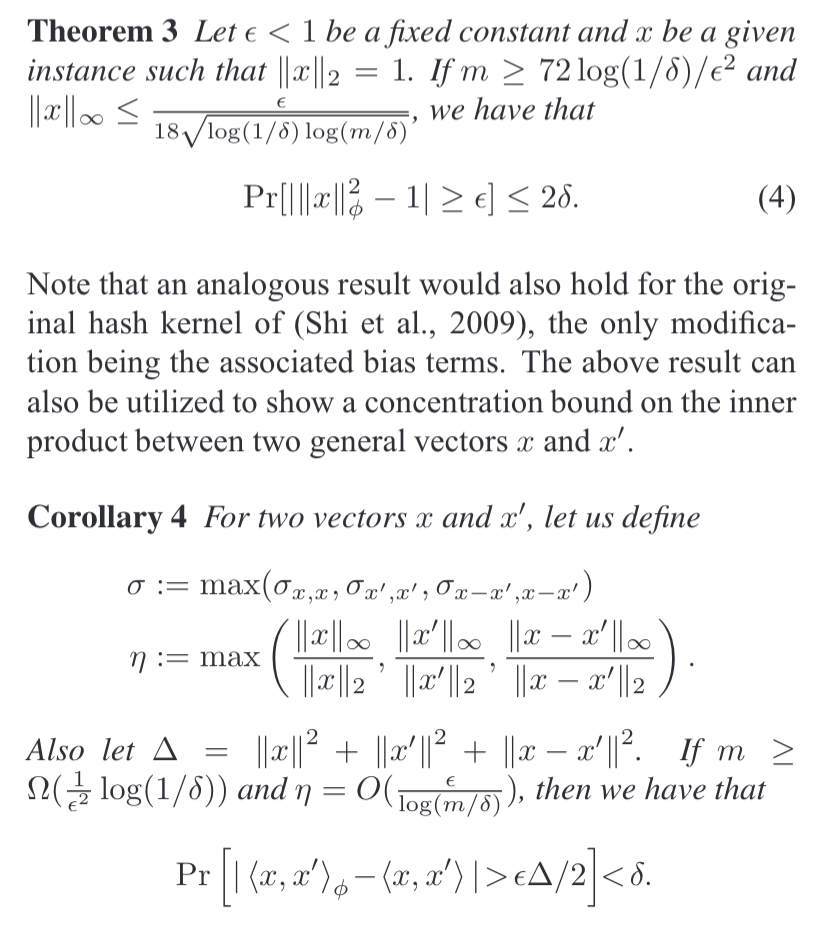
* 多任务适配：对任务 u∈U，映射$$\phi_u(x)=\phi(x,u)$$（输入扩展为 (x,u)），参数合并为$$w_h=\phi_0(w_0)+\sum_{u∈U}\phi_u(w_u)$$，存储量从 O (d×|U|) 降至 O (m)。
* 示例 (个性化哈希): collaborative email spam filtering
  - 设 x 为邮件词向量（d=4×10⁷），u 为用户 ID，$$\phi_u(x)=\phi(\text{concat}(x_j,u))$$（词 - 用户对哈希）。
  - 预测内积：$$\left<\phi_0(x)+\phi_u(x),w_h\right> \approx \left<x,w_0\right>+\left<(x,u),w_u\right>$$，等价原始多任务预测。
  - 仅需 m=2²²（≈4×10⁶）存储$$w_h$$，无需 O (4×10⁷×4×10⁵) 原始参数。
* 局限性：哈希误差
  - **误差来源**: 
    - ①失真误差$$\epsilon_d=\sum_{v∈\{u,0\}}|\left<\phi_v(x),\phi_v(w_v)\right> - \left<x,w_v\right>|$$（内积偏差）；
    - ②干扰误差$$\epsilon_i=\sum_{v≠0}\left<\phi_0(x),\phi_v(w_v)\right>+\sum_{v≠u}\left<\phi_u(x),\phi_v(w_v)\right>$$（多任务参数干扰）。
  - **控制条件**: 需满足$$m≥\Omega(\frac{1}{\epsilon^2}\log(\frac{1}{\delta}))$$（定理 3），过小 m 会加剧哈希碰撞，导致误差超出阈值。

##### 无偏性的数学证明和分析

根据定义，哈希内积为： $$\left<x,x'\right>_\phi = \left<\phi(x),\phi(x')\right> = \sum_{i=1}^m \phi_i(x) \phi_i(x')$$ 其中 $$\phi_i(x)=\sum_{j:h(j)=i}\xi(j)x_j$$ 。

$$E_\phi[\left<x,x'\right>_\phi] = E_{h,\xi}\left[\sum_{i=1}^m \left(\sum_{j:h(j)=i}\xi(j)x_j\right) \left(\sum_{k:h(k)=i}\xi(k)x'_k\right)\right]$$

利用期望的线性性质，将求和移到外面： $$= \sum_{i=1}^m E_{h,\xi}\left[\sum_{j:h(j)=i}\sum_{k:h(k)=i} \xi(j)\xi(k)x_j x'_k\right]$$ $$= \sum_{j,k} x_j x'_k E_{h,\xi}\left[\xi(j)\xi(k) \cdot \mathbf{1}_{h(j)=h(k)}\right]$$ 其中 $\mathbf{1}_{h(j)=h(k)}$ 是指示函数，当 $h(j)=h(k)$ 时为1，否则为0。

分情况讨论 $j$ 和 $k$ ，即可证明： $$E_\phi[\left<x,x'\right>_\phi] = \sum_{j=1}^d x_j x'_j \cdot 1 = \sum_{j=1}^d x_j x'_j = \langle x, x' \rangle$$ 


* 数学意义：期望上的等价性

  - “无偏性”意味着，虽然单次哈希映射得到的内积 $\langle\phi(x), \phi(x')\rangle$ 是一个随机值，它会因为哈希碰撞而偏离真实的内积 $\langle x, x' \rangle$ ，但如果我们进行无穷多次哈希（每次都用一组新的随机哈希函数），然后取所有结果的平均值，这个平均值会精确地收敛到真实的内积。
  - --> Deep Hash Embedding 的思路，多组哈希函数的价值

  - 这为Feature Hashing提供了理论上的正确性保证。它告诉我们，哈希映射不是一个随意的、破坏性的过程，而是一个在统计期望上保持了原始几何关系的变换。

* 无偏性是Feature Hashing的灵魂。它保证了我们用一个计算上可行（低维、稀疏）的随机过程，去近似一个计算上不可行（超高维）的确定性过程时，在统计意义上是正确的。


#### [DHE] Learning to Embed Categorical Features without Embedding Tables for Recommendation

* Intro
  * 挑战1: Highly-skewed data distribution: The categorical features
    in recommendation data usually follow highly skewed power-
    law distributions. The small number of training examples on
    infrequent feature values hurts the embedding quality for the
    tail items significantly.


* 思路：
  * 解决one-hot hashing的collision问题，兼顾压缩+唯一性
  * 一种思路是concat多个hash embedding
* 编码设计原则
  - **唯一性**：确保每个特征值的编码唯一，避免冲突影响模型性能。
  - **等相似性**：避免引入错误的归纳偏差，使任意两个编码在相似性上无差异。
  - **高维度**：便于后续解码函数区分不同特征值，高维空间可分性更强。
  - **高香农熵**：从信息论角度防止冗余维度，最大化每个维度的熵。

- **密集哈希编码** Dense Hash Encoding：
  - 使用 $$k$$ 个独立的通用哈希函数 $$\{H^{(i)}\}_{i=1}^k$$ 将单个特征值 $$s$$ 映射为一个 $$k$$ 维的密集整数向量。

  - 编码函数: $$E(s) = [H^{(1)}(s), H^{(2)}(s), \dots, H^{(k)}(s)] \in \mathbb{R}^k$$
  
  - 其中每个哈希函数 $$H^{(i)}: \mathbb{N} \to \{1, 2, \dots, m\}$$。
  
  - $$m$$ 是一个与Embedding Table无关的足够大的数（如 $$10^6$$），以保证哈希值在 $$\{1, ..., m\}$$ 上近似均匀分布。
  
  - 此过程无需存储，可并行计算，生成的向量再通过后续网络（如MLP）学习为实值Embedding。
  
- **Deep Embedding Network**
  - 发现 Mish 激活函数和批量归一化（BN）能提高性能。网络结构上，约五层隐藏层的效果较好，且简单等宽 MLP 架构表现最佳
  - side feature enhanced encodings for DHE
    - directly concatenating the generalizable features and the hash encodings.
    - the hash encoding provides a unique identifier for memorization while the other features enable the generalization ability.

* 结论：
  * 1024个hash function效果最好
  * RQ4: 批量归一化（BN）能显著稳定和加速训练并提高性能，在激活函数方面，Mish 激活函数优于 ReLU
  * 4.8 简单等宽 MLP 表现最佳，添加残差连接反而略降性能

### AI4Science

* [AlphaFold开发者获2024诺贝尔化学奖，AI抢夺科学家的最重要荣誉](https://mp.weixin.qq.com/s/BqO1-UN3hQ4Bagcp206_uw)
  * 从围棋到蛋白质结构预测
  * AlphaFold2 成功解决蛋白质折叠问题
  * AlphaFold 3 具备了药物设计的能力，可以预测药物中常用的分子（如配体和抗体），这些分子可与蛋白质结合，改变蛋白质在人类健康和疾病中的相互作用方式。
  * 方向：构建虚拟细胞
  * 基于AlphaFold 3 推出了免费平台AlphaFold Server，供全世界的科学家利用它进行非商业性研究，预测蛋白质如何与细胞中的其他分子相互作用。
  * 鲜为人知的是，AlphaFold一直存在诸多竞争者，其中最为知名的莫过于华盛顿大学的David Baker团队。
    * Baker是预测和设计蛋白质三维结构方法的开创者
  * “癌症、气候变迁、能源、基因组学、宏观经济学、金融系统、物理学等，太多我们想掌握的系统知识正变得极其复杂,如此巨大的信息量让最聪明的人穷其一生也无法完全掌握。如何才能从如此庞大的数据量中筛选出正确的见解呢？” 未来超级智能机器将与人类专家合作解决一切问题，一种通用人工智能可以自动将非结构化信息转换为可使用知识，这是一种针对任何问题的元解决方法（meta-solution）。
* ChemCrow


### Fundamentals of Deep Learning -- nvidia

[MNIST](http://yann.lecun.com/exdb/mnist/)

```python
from tensorflow.keras.datasets import mnist
# the data, split between train and test sets
(x_train, y_train), (x_test, y_test) = mnist.load_data()

import matplotlib.pyplot as plt
image = x_train[0]
plt.imshow(image, cmap='gray')

# Flattening the Image Data
x_train = x_train.reshape(60000, 784)
x_test = x_test.reshape(10000, 784)

# Normalization
x_train = x_train / 255
x_test = x_test / 255 

import tensorflow.keras as keras
num_categories = 10
y_train = keras.utils.to_categorical(y_train, num_categories)
y_test = keras.utils.to_categorical(y_test, num_categories)

# instantiating the model
from tensorflow.keras.models import Sequential
model = Sequential()
from tensorflow.keras.layers import Dense
model.add(Dense(units=512, activation='relu', input_shape=(784,)))
model.add(Dense(units = 512, activation='relu'))
model.add(Dense(units = 10, activation='softmax'))
model.summary()
model.compile(loss='categorical_crossentropy', metrics=['accuracy'])
history = model.fit(x_train, y_train,
                    epochs=5,
                    verbose=1,
                    validation_data=(x_test, y_test))
```

One-hot编码

```python
def label2OH(y, D_out):
  N = y.shape[0]
  OH = np.zeros((N, D_out))
  OH[np.arange(N), y] = 1
  return OH

def OH2label(OH):
  if(torch.is_tensor(OH)):
  	y = OH.argmax(dim=1)
  else:
  	y = OH.argmax(axis=1)
  return y
```


Image Classification of an American Sign Language Dataset

```python
import pandas as pd
train_df = pd.read_csv("asl_data/sign_mnist_train.csv")
test_df = pd.read_csv("asl_data/sign_mnist_test.csv")
train_df.head()

y_train = train_df['label']
y_test = test_df['label']
del train_df['label']
del test_df['label']

x_train = train_df.values
x_test = test_df.values

import matplotlib.pyplot as plt
plt.figure(figsize=(40,40))

num_images = 20
for i in range(num_images):
    row = x_train[i]
    label = y_train[i]
    
    image = row.reshape(28,28)
    plt.subplot(1, num_images, i+1)
    plt.title(label, fontdict={'fontsize': 30})
    plt.axis('off')
    plt.imshow(image, cmap='gray')
    
x_train = x_train / 255
x_test = x_test / 255

import tensorflow.keras as keras
num_classes = 25
```

CNN

```python
x_train = x_train.reshape(-1,28,28,1)
x_test = x_test.reshape(-1,28,28,1)

from tensorflow.keras.models import Sequential
from tensorflow.keras.layers import Dense, Conv2D , MaxPool2D , Flatten , Dropout , BatchNormalization

num_classes = 25

model = Sequential()
model.add(Conv2D(75 , (3,3) , strides = 1 , padding = 'same' , activation = 'relu' , input_shape = (28,28,1)))
model.add(BatchNormalization())
model.add(MaxPool2D((2,2) , strides = 2 , padding = 'same'))
model.add(Conv2D(50 , (3,3) , strides = 1 , padding = 'same' , activation = 'relu'))
model.add(Dropout(0.2))
model.add(BatchNormalization())
model.add(MaxPool2D((2,2) , strides = 2 , padding = 'same'))
model.add(Conv2D(25 , (3,3) , strides = 1 , padding = 'same' , activation = 'relu'))
model.add(BatchNormalization())
model.add(MaxPool2D((2,2) , strides = 2 , padding = 'same'))
model.add(Flatten())
model.add(Dense(units = 512 , activation = 'relu'))
model.add(Dropout(0.3))
model.add(Dense(units = num_classes , activation = 'softmax'))
```

data augmentation

```python
from tensorflow.keras.preprocessing.image import ImageDataGenerator
datagen = ImageDataGenerator(
        rotation_range=10,  # randomly rotate images in the range (degrees, 0 to 180)
        zoom_range = 0.1, # Randomly zoom image 
        width_shift_range=0.1,  # randomly shift images horizontally (fraction of total width)
        height_shift_range=0.1,  # randomly shift images vertically (fraction of total height)
        horizontal_flip=True,  # randomly flip images horizontally
        vertical_flip=False)  # Don't randomly flip images vertically

datagen.fit(x_train)
model.compile(loss='categorical_crossentropy', metrics=['accuracy'])
model.fit(datagen.flow(x_train,y_train, batch_size=32), # Default batch_size is 32. We set it here for clarity.
          epochs=20,
          steps_per_epoch=len(x_train)/32, # Run same number of steps we would if we were not using a generator.
          validation_data=(x_test, y_test))

model.save('asl_model')
model = keras.models.load_model('asl_model')

from tensorflow.keras.preprocessing import image as image_utils
import matplotlib.pyplot as plt
import matplotlib.image as mpimg

def show_image(image_path):
    image = mpimg.imread(image_path)
    plt.imshow(image)
def predict_letter(file_path):
    show_image(file_path)
    image = load_and_scale_image(file_path)
    image = image_utils.img_to_array(image)
    image = image.reshape(1,28,28,1) 
    image = image/255
    prediction = model.predict(image)
    # convert prediction to letter
    predicted_letter = dictionary[np.argmax(prediction)]
    return predicted_letter

from tensorflow.keras.applications.vgg16 import preprocess_input
image = preprocess_input(image)
from tensorflow.keras.applications.vgg16 import decode_predictions
print('Predicted:', decode_predictions(predictions, top=3))
```


**Transfer Learning**

[NGC](https://ngc.nvidia.com/catalog/models?orderBy=modifiedDESC&pageNumber=0&query=&quickFilter=models&filters=)

[Keras Application](https://keras.io/api/applications/#available-models)

```python
from tensorflow import keras
base_model = keras.applications.VGG16(
    weights='imagenet',  # Load weights pre-trained on ImageNet.
    input_shape=(224, 224, 3),
    include_top=False)
base_model.trainable = False
inputs = keras.Input(shape=(224, 224, 3))
# Separately from setting trainable on the model, we set training to False 
x = base_model(inputs, training=False)
x = keras.layers.GlobalAveragePooling2D()(x)
# A Dense classifier with a single unit (binary classification)
outputs = keras.layers.Dense(1)(x)
model = keras.Model(inputs, outputs)
# Important to use binary crossentropy and binary accuracy as we now have a binary classification problem
model.compile(loss=keras.losses.BinaryCrossentropy(from_logits=True), metrics=[keras.metrics.BinaryAccuracy()])

from tensorflow.keras.preprocessing.image import ImageDataGenerator
# create a data generator
datagen = ImageDataGenerator(
        samplewise_center=True,  # set each sample mean to 0
        rotation_range=10,  # randomly rotate images in the range (degrees, 0 to 180)
        zoom_range = 0.1, # Randomly zoom image 
        width_shift_range=0.1,  # randomly shift images horizontally (fraction of total width)
        height_shift_range=0.1,  # randomly shift images vertically (fraction of total height)
        horizontal_flip=True,  # randomly flip images
        vertical_flip=False) # we don't expect Bo to be upside-down so we will not flip vertically

# load and iterate training dataset
train_it = datagen.flow_from_directory('presidential_doggy_door/train/', 
                                       target_size=(224, 224), 
                                       color_mode='rgb', 
                                       class_mode='binary', 
                                       batch_size=8)
# load and iterate test dataset
test_it = datagen.flow_from_directory('presidential_doggy_door/test/', 
                                      target_size=(224, 224), 
                                      color_mode='rgb', 
                                      class_mode='binary', 
                                      batch_size=8)

model.fit(train_it, steps_per_epoch=12, validation_data=test_it, validation_steps=4, epochs=20)
```

finetune

```python
# Unfreeze the base model
base_model.trainable = True

# It's important to recompile your model after you make any changes
# to the `trainable` attribute of any inner layer, so that your changes
# are taken into account
model.compile(optimizer=keras.optimizers.RMSprop(learning_rate = .00001),  # Very low learning rate
              loss=keras.losses.BinaryCrossentropy(from_logits=True),
              metrics=[keras.metrics.BinaryAccuracy()])
model.fit(train_it, steps_per_epoch=12, validation_data=test_it, validation_steps=4, epochs=10)
```


**headline generator**

[embedding layer](https://machinelearningmastery.com/use-word-embedding-layers-deep-learning-keras/)

[LSTM](https://colah.github.io/posts/2015-08-Understanding-LSTMs/)

[Adam optimizer](https://medium.com/datadriveninvestor/overview-of-different-optimizers-for-neural-networks-e0ed119440c3)

[pretrained word embedding](https://blog.keras.io/using-pre-trained-word-embeddings-in-a-keras-model.html), [GPT2](https://openai.com/blog/better-language-models/), [BERT](https://ai.googleblog.com/2018/11/open-sourcing-bert-state-of-art-pre.html)

```python
import os 
import pandas as pd

nyt_dir = 'nyt_dataset/articles/'

all_headlines = []
for filename in os.listdir(nyt_dir):
    if 'Articles' in filename:
        # Read in all of the data from the CSV file
        headlines_df = pd.read_csv(nyt_dir + filename)
        # Add all of the headlines to our list
        all_headlines.extend(list(headlines_df.headline.values))
# Remove all headlines with the value of "Unknown"
all_headlines = [h for h in all_headlines if h != "Unknown"]
len(all_headlines)

from tensorflow.keras.preprocessing.text import Tokenizer
# Tokenize the words in our headlines
tokenizer = Tokenizer()
tokenizer.fit_on_texts(all_headlines)
total_words = len(tokenizer.word_index) + 1
print('Total words: ', total_words)

# Print a subset of the word_index dictionary created by Tokenizer
subset_dict = {key: value for key, value in tokenizer.word_index.items() \
               if key in ['a','man','a','plan','a','canal','panama']}
print(subset_dict)
tokenizer.texts_to_sequences(['a','man','a','plan','a','canal','panama'])

# Convert data to sequence of tokens 
input_sequences = []
for line in all_headlines:
    # Convert our headline into a sequence of tokens
    token_list = tokenizer.texts_to_sequences([line])[0]
    
    # Create a series of sequences for each headline
    for i in range(1, len(token_list)):
        partial_sequence = token_list[:i+1]
        input_sequences.append(partial_sequence)
print(tokenizer.sequences_to_texts(input_sequences[:5]))
input_sequences[:5]

# Convert data to sequence of tokens 
input_sequences = []
for line in all_headlines:
    # Convert our headline into a sequence of tokens
    token_list = tokenizer.texts_to_sequences([line])[0]
    
    # Create a series of sequences for each headline
    for i in range(1, len(token_list)):
        partial_sequence = token_list[:i+1]
        input_sequences.append(partial_sequence)

print(tokenizer.sequences_to_texts(input_sequences[:5]))
input_sequences[:5]
input_sequences

# padding sequences
from tensorflow.keras.preprocessing.sequence import pad_sequences
import numpy as np
# Determine max sequence length
max_sequence_len = max([len(x) for x in input_sequences])
# Pad all sequences with zeros at the beginning to make them all max length
input_sequences = np.array(pad_sequences(input_sequences, maxlen=max_sequence_len, padding='pre'))
input_sequences[0]

from tensorflow.keras import utils
# Predictors are every word except the last
predictors = input_sequences[:,:-1]
# Labels are the last word
labels = input_sequences[:,-1]
labels = utils.to_categorical(labels, num_classes=total_words)


from tensorflow.keras.layers import Embedding, LSTM, Dense, Dropout
from tensorflow.keras.models import Sequential

# Input is max sequence length - 1, as we've removed the last word for the label
input_len = max_sequence_len - 1 
model = Sequential()
# Add input embedding layer
model.add(Embedding(total_words, 10, input_length=input_len))
# Add LSTM layer with 100 units
model.add(LSTM(100))
model.add(Dropout(0.1))
# Add output layer
model.add(Dense(total_words, activation='softmax'))

model.compile(loss='categorical_crossentropy', optimizer='adam')

```

```python
tf.keras.preprocessing.text.Tokenizer(
    num_words=None, filters='!"#$%&()*+,-./:;<=>?@[\$$^_`{|}~\t\n', lower=True,
    split=' ', char_level=False, oov_token=None, document_count=0, **kwargs
)
```

```python
def predict_next_token(seed_text):
    token_list = tokenizer.texts_to_sequences([seed_text])[0]
    token_list = pad_sequences([token_list], maxlen=max_sequence_len-1, padding='pre')
    prediction = model.predict_classes(token_list, verbose=0)
    return prediction

prediction = predict_next_token("today in new york")
prediction
tokenizer.sequences_to_texts([prediction])

def generate_headline(seed_text, next_words=1):
    for _ in range(next_words):
        # Predict next token
        prediction = predict_next_token(seed_text)
        # Convert token to word
        next_word = tokenizer.sequences_to_texts([prediction])[0]
        # Add next word to the headline. This headline will be used in the next pass of the loop.
        seed_text += " " + next_word
    # Return headline as title-case
    return seed_text.title()
  
seed_texts = [
    'washington dc is',
    'today in new york',
    'the school district has',
    'crime has become']
for seed in seed_texts:
    print(generate_headline(seed, next_words=5))
```


### Fundamentals of Deep Learning for MultiGPUs -- Nvidia

* 与梯度下降法不同，随机梯度下降法并不使用整个数据集而是使用较小的数据子集（称为一个批次，即batch；其大小称为 batch size）来计算损失函数。这对我们算法的性能有着深远的影响。由于每个批次里的数据是从数据集里随机抽取的，所以每个批次的数据集都不相同。即使对于同一组权重，这些批次的数据集也会提供不同的梯度，引入一定程度的噪声
* 这种噪声实际上是非常有益的，因为它所产生的极小值的数学特性与梯度下降大相径庭。这在多 GPU 训练问题中之所以重要，是因为通过增加参与训练过程的 GPU 数量，我们实际上加大了批量（batch size），而这会导致减少有益的噪声

```python
# This section generates the training dataset as defined by the variables in the section above.
x = np.random.uniform(0, 10, n_samples)
y = np.array([w_gen * (x + np.random.normal(loc=mean_gen, scale=std_gen, size=None)) + b_gen for x in x])

# Create the placeholders for the data to be used.
X = tf.placeholder(tf.float32, name="X")
Y = tf.placeholder(tf.float32, name="Y")

# Create our model variables w (weights; this is intended to map to the slope, w_gen) and b (bias; this maps to the intercept, b_gen).
# For simplicity, we initialize the data to zero.
w = tf.Variable(0.0, name="weights")
b = tf.Variable(0.0, name="bias")

# Define our model. We are implementing a simple linear neuron as per the diagram shown above.
Y_predicted = w * X + b

# Define a gradient descent optimizer
optimizer = tf.train.GradientDescentOptimizer(learning_rate=0.001).minimize(loss)

# Define the maximum number of times we want to process the entire dataset (the number of epochs).
# In practice we won't run this many because we'll implement an early stopping condition that
# detects when the training process has converged.
max_number_of_epochs = 1000

# We still store information about the optimization process here.
loss_array = []
b_array = []
w_array = []
    
with tf.Session() as sess:
    # Initialize the necessary variables
    sess.run(tf.global_variables_initializer())
    # Print out the parameters and loss before we do any training
    w_value, b_value, loss_value = sess.run([w, b, loss], feed_dict={X: x, Y: y})
    print("Before training: w = {:4.3f}, b = {:4.3f}, loss = {:7.3f}".format(w_value, b_value, loss_value))
    print("")
    print("Starting training")
    print("")
    # Start the training process
    for i in range(max_number_of_epochs):
        # Use the entire dataset to calculate the gradient and update the parameters
        sess.run(optimizer, feed_dict={X: x, Y: y})
        # Capture the data that we will use in our visualization
        w_value, b_value, loss_value = sess.run([w, b, loss], feed_dict={X: x, Y: y})
        w_array.append(w_value)
        b_array.append(b_value)
        loss_array.append(loss_value)
        # At the end of every few epochs print out the learned weights
        if (i + 1) % 5 == 0:
            print("Epoch = {:2d}: w = {:4.3f}, b = {:4.3f}, loss = {:7.3f}".format(i+1, w_value, b_value, loss_value))
        # Implement your convergence check here, and exit the training loop if
        # you detect that we are converged:
        if FIXME: # TODO
            break
    print("")
    print("Training finished after {} epochs".format(i+1))
    print("")
    
    print("After training: w = {:4.3f}, b = {:4.3f}, loss = {:7.3f}".format(w_value, b_value, loss_value))
```

```python
# adjust batch size
batch_size = 32
num_batches_in_epoch = (n_samples + batch_size - 1) // batch_size
```


研究训练速度和 batch_size 的关系

* 非常小或非常大的批量对于模型训练的收敛来说可能不是的最佳选择（非常小的批量带来的噪声往往过于嘈杂而无法使模型充分收敛到损失函数的最小值，而非常大的批量则往往造成训练的早期阶段就发散）
* 观察到大batch size的val_acc和acc很接近，不容易过拟合，但后期准确度效果提升缓慢
* Machine-Learning/GPU_training_batch_size.py 


多GPU训练

```shell
# CPU training
CUDA_VISIBLE_DEVICES= python fashion_mnist.py --epochs 3 --batch-size 512
# GPU training
horovodrun -np $num_gpus python fashion_mnist.py --epochs 3 --batch-size 512
```

* [Horovod](https://github.com/horovod/horovod)是一种最初由[Uber开发](https://eng.uber.com/horovod/)的开源工具，旨在满足他们许多工程团队对更快的深度学习模型训练的需求。它是跨框架的分布式深度学习库，支持多种框架、高性能算法、高性能网络（RDMA、GPUDirect），也是分布式训练方法不断发展的生态系统（包括[Distributed TensorFlow](https://github.com/tensorflow/examples/blob/master/community/en/docs/deploy/distributed.md)) 的一部分。Uber开发的这种解决方案利用[MPI](https://en.wikipedia.org/wiki/Message_Passing_Interface)进行分布式进程间通信，并利用[NVIDIA联合通信库（NCCL）](https://developer.nvidia.com/nccl)，以高度优化的方式实现跨分布式进程和节点的平均值计算。 由此产生的Horovod软件包实现了它的目标：仅需进行少量代码修改和直观的调试即可在多个GPU和多个节点上扩展深度学习模型的训练。

  自2017年开始实施以来，Horovod已显著成熟，将其支持范围从TensorFlow扩展到了Keras，PyTorch和Apache MXNet。 Horovod经过了广泛的测试，迄今已用于一些最大的深度学习训练当中。例如，在[Summit系统上支持 **exascale** 深度学习，可扩展到 **27,000多个V100 GPU**](https://arxiv.org/pdf/1810.01993.pdf)

  * 支持多种框架

```python
import horovod.tensorflow as hvd
import horovod.keras as hvd
import horovod.tensorflow.keras as hvd
import horovod.torch as hvd
import horovod.mxnet as hvd
```

Horovod与MPI的渊源

* Horovod与MPI具有非常深厚的联系。对于熟悉MPI编程的程序员来说，您对通过Horovod实现的分布式模型训练会感到非常熟悉。对于那些不熟悉MPI编程的人来说，简短地讨论一下Horovod或MPI分布式进程所需的一些约定和注意事项是值得的。
* 与MPI一样，Horovod严格遵循[单程序多数据（SPMD）范例](https://en.wikipedia.org/wiki/SPMD)，即在同一文件或程序中实现多个进程的指令流。由于多个进程并行执行代码，因此我们必须注意[竞赛条件](https://en.wikipedia.org/wiki/Race_condition)以及这些进程间的同步。
  * [Horovod and Model Parallelism](https://github.com/horovod/horovod/issues/96)
* Horovod为执行程序的每个进程分配一个唯一的数字ID或**rank**（来自MPI的概念）。rank是可以通过编程的方式获得的。通过以编程方式在代码中标识进程的rank，我们可以进一步采取以下步骤：

  * 将该进程固定到自己的专属GPU上。
  * 使用单个rank来广播需要所有ranks统一使用的值。
  * 利用单个rank收集所有ranks产生的值和/或计算它们的均值。
  * 利用一个rank来记录或写入磁盘。


```python
# 同步初始状态的几种方式
# Method 1
callbacks.append(hvd.callbacks.BroadcastGlobalVariablesCallback(0))
model.fit_generator(train_iter,
                    steps_per_epoch=len(train_iter) // hvd.size(),
                    callbacks=callbacks, ...)
# Method 2
hooks = [hvd.BroadcastGlobalVariablesHook(0)]
with tf.train.MonitoredTrainingSession(hooks=hooks, …) as sess:
# Method 3
bcast_op = hvd.broadcast_global_variables(0) sess.run(bcast_op)

# 只由一个worker保留检查点
ckpt_dir = "/tmp/train_logs" if hvd.rank() == 0 else None
with tf.train.MonitoredTrainingSession(checkpoint_dir=ckpt_dir, …) as sess:
```

* 数据分区的方式：先洗牌再分区，workers按分区顺序读取；先洗牌，单worker从整个数据集随机读取

```shell
在 4 个有 4 块 GPU 卡的节点上运行:
$ mpirun -np 16 -H server1:4,server2:4,server3:4,server4:4 -bind-to none -map-by slot -mca pml ob1 -mca btl openib -mca btl_tcp_if_include eth0 \
-x NCCL_DEBUG=INFO -x NCCL_SOCKET_IFNAME=eth0 -x LD_LIBRARY_PATH -x ...\
python train.py
```


### 术语

NLU: Natural Language Understanding

### TODO

* 调参
  * https://github.com/google-research/tuning_playbook

* 传统关键词检索
  * https://www.elastic.co/cn/blog/implementing-academic-papers-lessons-learned-from-elasticsearch-and-lucene
* 对比学习
  * [Constrastive Learning: MoCo and SimCLR](https://mp.weixin.qq.com/s/v5p9QA3vDl-WTF3-7shp4g)
