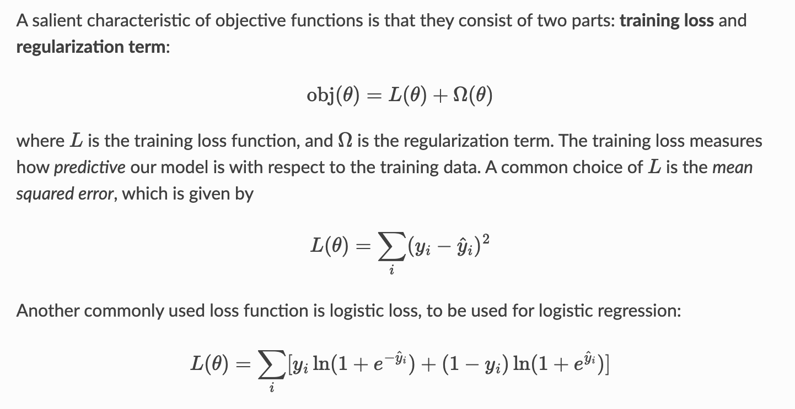

[toc]

## Machine Learning

Materials

* http://neuralnetworksanddeeplearning.com/

### Intro

> 三要素

* 特征
* 结构
  * 多层：提取深层特征
  * 非线性变换
* 参数
  * Optimizer
  * 人工设计：
    * 差分
    * 空洞卷积
    * 非线性变换
  * e.g. 图片边缘提取

* 现代算法是策略和模型的融合：人工设计参数、特征提取、模型结构，有相似之处
  * 特征提取：图像处理中的一阶、二阶特征
    * 一阶特征主要关注图像的亮度和颜色信息，二阶特征则侧重于图像的纹理结构信息
  * 人工设计参数：
    * 比如MNIST768维像素，压缩到28维（每一行多少个点 / 每一列多少个点）
  * 模型结构：
    * ResNet

### Algorithms

* crossentropy、KL散度、logistic regression、softmax
  * KL散度 ---> CE loss: [看得见的信息论-为什么用交叉熵作为逻辑回归的代价函数](https://zhuanlan.zhihu.com/p/31207556)
  * logistic regression ---> softmax
  * CE loss + softmax ---> 极其简洁的梯度形式
    * [求导推导](https://zhuanlan.zhihu.com/p/27223959)
    * $\frac{\partial l_{CE}}{\partial a_j}=y_j -t_j$

* XGBoost: gradient boosted trees works by combining predictions from many simple models, each of which tries to address the weaknesses of the previous models. By doing this the collection of simple models can actually outperform large, complex models.

* Feature Bagging

  * offering a potentially useful way of managing the bias-variance tradeoff

  * We were also interested in this as a potentially useful way to further parallelize training

  * 《An experimental comparison of three methods for constructing ensembles of decision trees: Bagging, boosting, and randomization》


* Dropout
  * 保证training/serving一致性：training或serving时scale
  * In the dense setting, dropout serves to separate effects from strongly correlated features, resulting in a more robust classifier. But in our sparse, noisy setting adding in dropout appears to simply reduce the amount of data available for learning. 《Ad Click Prediction: a View from the Trenches》
* Initialization
  
  * Xavier Initialization
  * 
  * Kaiming Initialization主要用于激活函数为ReLU（Rectified Linear Unit）的神经网络。
* 过拟合

  * 过拟合问题存在其他更深刻的原因。例如，将 28 × 28 的图片实施扁平化操作，将其变换为一个长度为 784 的一维向量，这将完全丢失了像素的空间排列信息

  * [为什么过多的特征（feature）导致过拟合（over-fitting)？ - Dr.Shiki的回答 - 知乎](https://www.zhihu.com/question/47375421/answer/306771331)

#### ResNet

* 梯度相关

  * 梯度的意义：

    * 方向导数最大

    * 


  * [灾难遗忘现象](https://en.wikipedia.org/wiki/Catastrophic_interference)


  * 梯度消失和梯度爆炸：网络太深，网络权值更新不稳定造成的。本质上是因为梯度反向传播中的连乘效应

*  为解决该问题，ResNet提出假设：“增加一个层至少不应该比之前更差”，
  * 即每层映射至少应为恒等映射f(x)=x。假设L1层到L2层间有完美映射函数H(x)，不会丢失x的任何信息，梯度不会消失；
  * 而实际训练出的是不完美映射F(x)，F(x)=H(x) - x（输出减去输入剩下的就是映射丢失的部分），所以完美映射是H(x)=F(x)+x。 
* 从梯度反向传播角度看，在残差网络中，通过恒等映射F(x)+x，除给模型添加跳跃连接外，还为梯度反向传播提供直接通道，使梯度能从输出层直接反向传播到输入层，避免联乘效应，大大缓解了梯度消失问题。 

### Optimizer

> https://speech.ee.ntu.edu.tw/~tlkagk/courses/ML2020/Optimization.pdf

#### Optimization Problem

* Total Error = Optimization Error + Representation Error
* $F(w_{alg}) = F(w_{alg})-F(w_*) + F(w_*)$
* $F(w_*) \equiv \frac{1}{n} \sum_{i \in [n]} l(h_{w}(x_i), y_i) $
  * 模型预估误差均值，取决于模型结构

#### GD: 1st-order method

* 梯度下降：$w_t \leftarrow w_{t-1} - \eta \nabla F(w_{t-1})$
* Explanation: 一阶泰勒展开
* 性质：$$\mu \leq \frac{\|\nabla f(a) - \nabla f(b)\|}{\|a-b\|} \leq L, \forall a,b \in \R^d$$
  * 强凸：梯度变化率有下界
  * Lipchitz continuous gradient：梯度变化率有上界
* Note:
  * 令下标趋近，这个上下界本质是Hessian: f''(b) 的上下界
  * "linear convergence" means: $$F(w_{t+1}) - F(w_*) \leq (1-\frac{\mu}{L}) \left( F(w_t) - F(w_*) \right)^1$$
  * This convergence is for the function value $$F(w)$$ (there are other types of convergence)

#### Newton's method: 2nd-order method

* Gradient descent: $$w_t \leftarrow w_{t-t} - \eta (\nabla^2 F(w_{t-1}))^{-1} \nabla F(w_{t-1})$$

* $$ F(w) = \frac{1}{2} w^\top D w$$ , D is a diagonal matrix with all positive diagonal elements

  * 举一个例子，对比GD和Newton法的收敛速度
  * GD: 计算 $$F(w_{t+1})\le F(w_t)$$ 的恒成立条件是 $$\eta \lt \frac{2}{max_iD_{ii}}$$
  * Newton法，在例子中一步收敛了
  * 类似于在不同维度使用 Adaptive Learning Rate（D^-1，反映gradient的变化率）的效果
  * Quadratic Convergence

* Convergence

  * Strong convexity $$\mu$$ and Lipschtiz hessian $$H$$

  * Quadratic convergence: 

    * $$\|w_{t+1} - w_*\| \leq \frac{H}{\mu} \|w_t - w_*\|^2$$

    - Also needs a "good" initial value: $$\|w_0-w_*\| \leq \frac{\mu}{2H}$$

#### Polyak Momentum

* $$w_t \leftarrow w_{t-1} - \eta \nabla F(w_{t-1}) + \beta(w_{t-1} - w_{t-2})$$
* The formula above is equivalent to
  - $$v_t \leftarrow \eta \nabla F(w_{t-1}) + \beta v_{t-1}$$, $$w_t \leftarrow w_{t-1} - v_t$$
  - learning rate $$\eta$$ inside momentum variable $$v$$

- But we can also put learning rate outside the momentum:
  - $$v_t \leftarrow \nabla F(w_{t-1}) + \beta v_{t-1}$$, $$w_t \leftarrow w_{t-1} - \eta v_t$$
  - Caution: these 2 formulas will be different if the learning rate changes (warmup, decay)

#### Nesterov Momentum

- Concept: **lookahead** to get a better gradient estimation

- 理论上是两步，本方法基于最新model计算gradient，解决半步的staleness

* pytorch实际实现中，保留的是lookhead model

#### SGD: stochastic methods

* $$\min_{t} E\left[ \|\nabla F(w_{t-1})\|^2\right] \leq \frac{1}{T} \sum_{t=1}^T E\left[ \|\nabla F(w_{t-1})\|^2 \right] \leq \frac{2E[F(w_{0}) - F(w_*)]}{\eta T} + \frac{L\eta V_1}{b}$$
* 2 parts of error:
  - Escape from initial point to optimal
  - Variance (reduced by batch size)
* Typically, we take $$\eta\propto\frac{1}{\sqrt{T}}$$
  - so that $$\frac{1}{T} \sum_{t=1}^T E\left[ \|\nabla F(w_{t-1})\|^2 \right] \leq O(\frac{1}{\sqrt{T}})$$

- Implies learning rate **decay** for convergence: $$\eta_t \propto \frac{1}{\sqrt{t}}$$

- Converges to a point where $$\nabla F(w) = 0$$, could be a saddle point or local minimum, not necessarily a global minimum

#### Federated Averaging

《Advances and open problems in federated learning》p22

#### AdaGrad: a natural learning rate decay

- Algorithm:

  - In step $$t$$
  - Compute gradient: $$g_t \equiv \nabla f(w_{t-1})$$
    - Note：g可以保留一部分当前emb值
  - Update "2nd moment": $$v_t \leftarrow v_{t-1} + g_t \circ g_t$$
  - Update model: $$w_{t} \leftarrow w_{t-1} - \eta \frac{g_t}{\sqrt{v_t + \epsilon}} $$

- 本质：

  - using the average $$\frac{1}{t}\sum_t g_t \circ g_t$$ to estimate hessian 

  - a **naturally decay learning rate** $$\frac{\eta}{\sqrt{t}}$$

- Note:

  - 工程实现时，手动给 v 设置一个上界

#### Adam

* Intro
  * adaptive moment estimation
  * Momentum 善于处理梯度的方向和大小，而 RMSProp 善于调整学习率以应对数据的稀疏性。Adam 的提出是为了结合这两种算法的优点，同时减少它们的缺点，提供一种更加鲁棒的优化解决方案。
  * AdamW
    - AdamW 主要改进在于对权重衰减（weight decay）的处理方式。在传统的 Adam 中，权重衰减和 L2 正则化是等价的，但在 Adam 优化器中，这种等价性会导致一些问题，AdamW 就是为了解决这些问题而设计的。
    - AdamW 对权重衰减的处理更加合理，它将权重衰减操作从梯度计算中分离出来，直接应用于权重本身，避免了 Adam 中权重衰减与梯度二阶矩估计的相互作用，从而在许多任务中取得更好的泛化性能。

- Algorithm:
  - In step $$t$$
  - Compute gradient: $$g_t \equiv \nabla f(w_{t-1})$$
  - Update 1st moment: $$m_t \leftarrow \beta_1 m_{t-1} + (1-\beta_1) g_t$$
  - Update 2nd moment: $$v_t \leftarrow \beta_2 v_{t-1} + (1-\beta_2) g_t \circ g_t$$
  - Bias-corrected 1st moment: $$\hat{m}_t \leftarrow \frac{m_t}{1-\beta_1^t}$$
    - 动机是没有 learning rate decay
    - 可尝试去掉，等价于learning rate warmup，会有点接近AdaGrad
  - Bias-corrected 2nd moment: $$\hat{v}_t \leftarrow \frac{v_t}{1-\beta_2^t}$$
  - Adam Update model: $$w_{t} \leftarrow w_{t-1} - \eta \frac{\hat{m}_t}{\sqrt{\hat{v}_t} + \epsilon}$$
  - AdamW Update model: 在 Adam 的基础上，增加了权重衰减的步骤。设权重衰减系数为 $$\lambda$$，则更新公式变为 $$w_{t} \leftarrow w_{t-1}(1 - \eta\lambda)- \eta \frac{\hat{m}_t}{\sqrt{\hat{v}_t} + \epsilon}$$
  - Note: 
    - bias correction could be ignored
    - AdaGrad uses **uniformly weighted** average, while Adam assigns **larger weights for later** items
      - Intuition: 哪一种近似 Hessian 的方式在模型上更合适，需要考虑旧的 sparse item 的期望更新方式
    - AdaGrad has learning rate decay, while Adam doesn't have learning rate decay
      - Intuition: 结合同/异步训练方式思考，动机是训练后期减少lr让模型收敛更稳定（比如 W&D model 的 dense）
- Intuition
  - 1st momentum: 类似 Polyak Momentum
    - Also see SAG: https://arxiv.org/pdf/1309.2388v2.pdf
  - 2nd momentum
    - 用外积矩阵近似 Hessian 矩阵
  - 后期$$\hat{m}_t$$近似为梯度，此时等效学习率为 $$\frac{\eta }{\sqrt{\hat{v}_t} + \epsilon}$$
    - 如果二阶矩小，需要配合learning rate decay
- 不保证理论收敛
  - 2 ways to fix:
    - Use $$\max\{\hat{v}_t, \hat{v}_{t-1}, \ldots \hat{v}_1\}$$instead of $$\hat{v}_t$$to guarantee decreasing $$\frac{\eta_t}{\sqrt{\hat{v}_t} + \epsilon}$$: AMSGrad
    - Take $$\beta_2 \propto 1-\frac{1}{t}$$, approaches 1 when $$t$$ approaches infinity,  $$v_t$$barely changes at the end
- Note：
  - sparse 部分不适用 Adam：滑动平均用到了历史信息，可能导致很旧的信息引入
  - 配合 slow start 技术，前期并发数缓慢增大

##### SparseAdam

> https://docs.pytorch.org/docs/stable/generated/torch.optim.SparseAdam.html

* optimizer仅对非0的embedding更新动量
* 倾向于仅对二阶动量而非一阶动量生效
  * 一阶动量 m_t 的目的 ：找到梯度的 平均方向 。方向是有时效性的，混合不同时间点的方向是危险的。
  * 二阶动量 v_t 的目的 ：统计参数被更新的 总频率/总强度 。这是一个累加计数器，它的值代表“这个参数总共被更新了多少次”。

#### RMSProp

* Intro

  * RMSProp 善于调整学习率以应对数据的稀疏性

  * 本质：Adam with $$\beta_1=0$$, without any bias correction

#### Lookahead Optimizer: k steps forward, 1 step back, NIPS 2019

* 本文是SGD场景，slow weights + 主要提升训练稳定性、减小优化器的variance
* mini-batch 异步SGD场景也可以应用，提升模型效果
  * CV、NLP场景可以重复训同一批样本，这样的手段更有意义
  * 推荐、广告场景，假如照搬，感觉会丢失 fine-grained gradients 信息，但在异步训练场景，多worker更新参数天然构成了slow weights

* Method
  * Slow weights trajectory: We can characterize the trajectory of the slow weights as an exponential moving average (EMA) of the final fast weights within each inner-loop, regardless of the inner optimizer.
  * Proposition 1 (Optimal slow weights step size)

* 分析convergence
  * Proposition 2 (Lookahead steady-state risk): Lookahead has a variance fixed point that is strictly smaller than that of the SGD inner-loop optimizer for the same learning rate
  * Deterministic quadratic convergence: underdamped系统提升稳定性，overdamped系统略有损收敛

#### LAMB

- Algorithm:
  - In step $$t$$:
  - Compute update based on any optimizer: $$u_t$$
    - SGD: $$u_t = g_t$$
    - Adam: $$u_t = \frac{\hat{m}_t}{\sqrt{\hat{v}_t} + \epsilon} $$
    - RMSProp: $$u_t=\frac{g_t}{\sqrt{v_t + \epsilon}} $$
  - Layer-wise normalization:
    - $$\hat{u}_t \leftarrow \frac{\|w_{t-1}\|}{\|u_t\|} u_t$$
  - Update model:
    - $$w_t \leftarrow w_{t-1} - \eta \hat{u}_t$$

- Intuition:
  - In large-batch training:
    - $$\|u_t\|$$ is unstable
  - Using large learning rate: diverge for large $$\|u_t\|$$
  - Using small learning rate: slow convergence for small $$\|u_t\|$$
  - LAMB: 
    - Adaptive learning rate: $$ \frac{\eta \|w_{t-1}\|}{\|u_t\|}$$
  - Smaller when $$\|u_t\|$$is large
  - Larger when $$\|u_t\|$$is small
  - Normalize $$\|u_t\|$$to the same scale of $$\|w\|$$

- Note:
  - We can apply LAMB normalization to any base optimizer
  - But the learning rate must be re-tuned

### Online Optimizer

> https://aeyoo.net/pdf/Online_Optimization.pdf

#### FTRL: AdaGrad + L1 reg + L2 reg

* Related Paper: 《Ad Click Prediction: a View from the Trenches, KDD 13》

* Online Learning and Sparsity
  * FTRL-Proximal(Follow The Proximally Regularized Leader): get both the sparsity provided by RDA and the improved accuracy of OGD

  * [在线学习（Online Learning）导读 - 吴海波的文章](https://zhuanlan.zhihu.com/p/36410780)
  * FTRL的数学本质：SGD（梯度 + L2）+稀疏性（L1）

  * 李亦锬大佬的机器学习答题集，很精彩，其中介绍了 FTRL 的实践意义
    https://zhuanlan.zhihu.com/p/20693546

#### FTRL with Group Lasso

* Paper: https://dl.acm.org/doi/pdf/10.1145/3357384.3358114
  * 注意 Group Lasso 项是 L2 范数的一次幂
* Lasso: https://en.wikipedia.org/wiki/Lasso_(statistics)
* 应用：
  * 优化 sparse feature embedding layer (fid -> embedding vector layer) 的 model sparsity，将每个特征的 vector 当作一个 group

#### [Google] AdaGrad Clippy

> https://zhuanlan.zhihu.com/p/661609678 石塔西

* 问题：“**损失函数曲面陡峭的地方，步长太大了**”
  * CV模型很多时候是针对一个静态的样本集反复训练，训练数据分布保持不变，而推荐模型必须针对源源而来的样本流在线学习，样本的分布迁移是家常便钣。面对时刻变化着的数据分布，优化算法沿着之前的方向迈过了头，也不足为奇了。
  * 现在大厂的排序模型几乎都是多目标的。多个目标之间可能“翘翘板”，相同的步长，对于一个任务可能收敛过慢，对另一个任务却可能导致不收敛。
* 

### 学习率 Learning Rate 相关

#### Examples

* Transformer
  * Optimizer：AdamW
  * 第一阶段是warmup阶段，第二阶段则是逆平方根衰减阶段，通过减低学习率防止模型在最优解附近震荡。


* LLaMA 2:
  * 前2000步warmup至峰值学习率，然后采用余弦退火衰减至峰值学习率的10%

#### LARS – 按层自适应学习率调整

*  [LARS论文](https://arxiv.org/abs/1904.00962): 
   *  大LR -> LR warm-up -> LARS，只是能保证大batch训练能训，关于效果问题，作者认为“increasing the batch does not give much additional gradient information comparing to smaller batches.”
*  [LARC](https://github.com/NVIDIA/apex/blob/master/apex/parallel/LARC.py): 带梯度裁剪的分层自适应学习率，以具有动力的SGD作为基础优化器
*  [LAMB](https://arxiv.org/abs/1904.00962): 分层自适应学习率，以 Adam 作为基础优化器，在BERT等语言模型上比LARC更成功
*  [NovoGrad](https://arxiv.org/abs/1905.11286): 按层计算的移动平均值，在几个不同的领域也有不错的表现


### 反向传播技巧

#### (STE) Straight-Through Estimators

> [《Estimating or Propagating Gradients Through Stochastic Neurons for Conditional Computation》](https://arxiv.org/pdf/1308.3432)

https://hassanaskary.medium.com/intuitive-explanation-of-straight-through-estimators-with-pytorch-implementation-71d99d25d9d0

#### Gumbel-Max trick

> 如何理解Gumbel-Max trick？ - SleepyBag的回答 - 知乎
> https://www.zhihu.com/question/62631725/answer/507940806

* 一种从离散分布取样的方法，它的形式可以允许我们定义一种可微分的，离散分布的近似取样，这种取样方式不像「干脆以各类概率值的概率向量替代取样」这么粗糙，也不像直接取样一样不可导（因此没办法应对可能的 bp ）


### 激活函数

* Intro
  * 选激活函数 https://machinelearningmastery.com/choose-an-activation-function-for-deep-learning/
    * When using the ReLU function for hidden layers, it is a good practice to use a “*He Normal*” or “*He Uniform*” weight initialization and scale input data to the range 0-1 (normalize) prior to training.
  * 典型问题：XOR问题
  * 


* sigmoid函数
  * 1/(1+e^(-x))
  * 非常适合作为模型的输出函数用于输出一个0~1范围内的概率值
  * 已经不太受欢迎，实际中很少作为激活函数
    * 容易造成梯度消失。我们从导函数图像中了解到sigmoid的导数都是小于0.25的，那么在进行反向传播的时候，梯度相乘结果会慢慢的趋向于0。这样几乎就没有梯度信号通过神经元传递到前面层的梯度更新中，因此这时前面层的权值几乎没有更新，这就叫梯度消失。除此之外，为了防止饱和，必须对于权重矩阵的初始化特别留意。如果初始化权重过大，可能很多神经元得到一个比较小的梯度，致使神经元不能很好的更新权重提前饱和，神经网络就几乎不学习。
    * 函数输出不是以 0 为中心的，梯度可能就会向特定方向移动，从而降低权重更新的效率
    * 指数计算消耗资源
* Tanh(x)=2Sigmoid(2x)−1
  * 相比sigmoid，以0为中心
* ReLU
  * 优点：
    * ReLU解决了梯度消失的问题，当输入值为正时，神经元不会饱和
    * 由于ReLU线性、非饱和的性质，在SGD中能够快速收敛
    * 计算复杂度低，不需要进行指数运算
  * 缺点：
    * 输出不是以0为中心的
    * Dead ReLU 问题：要设置一个合适的较小的学习率

* Leaky ReLU：解决了ReLU输入值为负时神经元出现的死亡的问题
  * 函数中的α，需要通过先验知识人工赋值（一般设为0.01）
  * 有些近似线性，导致在复杂分类中效果不好。
* Parametric ReLU：alpha可学习
* ELU：
  * 

#### GELU

* 高斯误差线性单元（Gaussian Error Linear Unit，GELU）是一种在深度学习领域广泛应用的激活函数，是一种非线性激活函数
  * 其精确的数学表达式为： $$ \text{GELU}(x)=x \cdot \Phi(x) $$ 其中，$$\Phi(x)$$ 是标准正态分布的累积分布函数，其表达式为： $$ \Phi(x)=\frac{1}{2}\left[1 + \text{erf}\left(\frac{x}{\sqrt{2}}\right)\right] $$ 这里的 $$\text{erf}(x)$$ 是误差函数，定义为： $$ \text{erf}(x)=\frac{2}{\sqrt{\pi}}\int_{0}^{x}e^{-t^{2}}dt $$ 
  * 在实际应用中，为了提高计算效率，通常使用近似公式来计算 GELU，常见的近似公式有： - 近似公式一： $$ \text{GELU}(x) \approx 0.5x\left(1 + \tanh\left[\sqrt{\frac{2}{\pi}}\left(x + 0.044715x^{3}\right)\right]\right) $$ - 近似公式二： $$ \text{GELU}(x) \approx x \cdot \sigma(1.702x) $$ 其中 $$\sigma(x)$$ 是 sigmoid 函数，$$\sigma(x)=\frac{1}{1 + e^{-x}}$$。 


### Tuning

https://github.com/google-research/tuning_playbook

### Visualization 可视化

#### t-SNE：可视化高维向量

* 科普文章 https://medium.com/@sachinsoni600517/mastering-t-sne-t-distributed-stochastic-neighbor-embedding-0e365ee898ea

#### k-means clustering

* k个初值，means方法归类，N次迭代

#### Partial Dependency Plots (PDP, 部分依赖图)


#### Evalutaion/Validation

* Metrics
  * **Mean Absolute Error** (MAE)
  * Normalized Discounted Cumulative Gain (NDCG)
  * Root Mean Square Error 

* holdout validation, cross-validation, leave-one-out validation, etc
  * “leave-one-out” 将数据分割为训练集、验证集和测试集。具体操作是对于每个用户，将其一个交互行为数据留出作为测试集，其余的作为训练集和验证集。例如，对于有N个交互行为的用户，选择其中第N个行为作为测试数据，其余N-1个行为用于训练和验证。

```python
train_data, validation_data, test_data = np.split(model_data.sample(frac=1, random_state=1729), [int(0.7 * len(model_data)), int(0.9 * len(model_data))])   # Randomly sort the data then split out first 70%, second 20%, and last 10%
```

### 衡量相关性

* cosine similarity
* Pearson correlation
  * 


### 训练采样

* Intro
  * https://www.tensorflow.org/extras/candidate_sampling.pdf

### ML Theory

* 参考「mathematics.md」


### Learning To Rank

#### GBDT（Gradient Boosting Decision Tree）

* 通过拟合残差，生成第N颗子树

#### XGBoost

https://xgboost.readthedocs.io/en/stable/tutorials/model.html

XGBoost stands for “Extreme Gradient Boosting”, where the term “Gradient Boosting” originates from the paper *Greedy Function Approximation: A Gradient Boosting Machine*, by Friedman.




#### LTR

https://xgboost.readthedocs.io/en/stable/tutorials/learning_to_rank.html

* Intro
  * The default objective is `rank:ndcg` based on the `LambdaMART` [[2$$](https://xgboost.readthedocs.io/en/stable/tutorials/learning_to_rank.html#references) algorithm, which in turn is an adaptation of the `LambdaRank` [[3$$](https://xgboost.readthedocs.io/en/stable/tutorials/learning_to_rank.html#references) framework to gradient boosting trees. For a history and a summary of the algorithm, see [[5$$](https://xgboost.readthedocs.io/en/stable/tutorials/learning_to_rank.html#references)
  * 《Unbiased LambdaMART: An Unbiased Pairwise Learning-to-Rank Algorithm》
* 调参
  * lambdarank_num_pair_per_sample

### Position Bias

* Intro

  * Obtaining real relevance degrees for query results is an expensive and strenuous, requiring human labelers to label all results one by one. When such labeling task is infeasible, we might want to train the learning-to-rank model on user click data instead, as it is relatively easy to collect. Another advantage of using click data directly is that it can reflect the most up-to-date user preferences [[1$$](https://xgboost.readthedocs.io/en/stable/tutorials/learning_to_rank.html#references). However, user clicks are often biased, as users tend to choose results that are displayed in higher positions. User clicks are also noisy, where users might accidentally click on irrelevant documents. To ameliorate these issues, XGBoost implements the `Unbiased LambdaMART` [[4$$](https://xgboost.readthedocs.io/en/stable/tutorials/learning_to_rank.html#references) algorithm to debias the position-dependent click data. The feature can be enabled by the `lambdarank_unbiased` parameter; see [Parameters for learning to rank (rank:ndcg, rank:map, rank:pairwise)](https://xgboost.readthedocs.io/en/stable/parameter.html#ltr-param) for related options and [Getting started with learning to rank](https://xgboost.readthedocs.io/en/stable/python/examples/learning_to_rank.html#sphx-glr-python-examples-learning-to-rank-py) for a worked example with simulated user clicks.

  

### RNN/LSTM/GRU

* Intro
  * GRU解决了RNN的梯度消失问题，参数量比LSTM小


### Contrastive Learning

> https://lilianweng.github.io/posts/2021-05-31-contrastive/#infonce

#### Intro

* [Constrastive Learning: MoCo and SimCLR](https://mp.weixin.qq.com/s/v5p9QA3vDl-WTF3-7shp4g)
* batch size比较重要，增加batch size可以增加正负样本对的数量

#### InfoNCE

* The **InfoNCE loss** in CPC ([Contrastive Predictive Coding](https://lilianweng.github.io/posts/2019-11-10-self-supervised/#contrastive-predictive-coding); [van den Oord, et al. 2018](https://arxiv.org/abs/1807.03748)), inspired by [NCE](https://lilianweng.github.io/posts/2021-05-31-contrastive/#NCE), uses categorical cross-entropy loss to identify the positive sample amongst a set of unrelated noise samples.

* **The probability of we detecting the positive sample correctly is:** $$ p(C = \text{pos}|\mathcal{X}, \boldsymbol{c}) = \frac{p(\boldsymbol{x}_{\text{pos}}|\boldsymbol{c}) \prod_{\substack{i=1, \dots, N; i \neq \text{pos}}} p(\boldsymbol{x}_i)}{\sum_{j=1}^N \left[ p(\boldsymbol{x}_j|\boldsymbol{c}) \prod_{\substack{i=1, \dots, N; i \neq j}} p(\boldsymbol{x}_i) \right]} = \frac{\frac{p(\boldsymbol{x}_{\text{pos}}|\boldsymbol{c})}{p(\boldsymbol{x}_{\text{pos}})}}{\sum_{j=1}^N \frac{p(\boldsymbol{x}_j|\boldsymbol{c})}{p(\boldsymbol{x}_j)}} = \frac{f(\boldsymbol{x}_{\text{pos}}, \boldsymbol{c})}{\sum_{j=1}^N f(\boldsymbol{x}_j, \boldsymbol{c})} $$ where the scoring function is $$ f(\boldsymbol{x}, \boldsymbol{c}) \propto \frac{p(\boldsymbol{x}|\boldsymbol{c})}{p(\boldsymbol{x})} $$.
  * Given a context vector $$ \boldsymbol{c} $$, the positive sample should be drawn from the conditional distribution $$ p(\boldsymbol{x}|\boldsymbol{c}) $$, while $$ N - 1 $$ negative samples are drawn from the proposal distribution $$ p(\boldsymbol{x}) $$, independent from the context $$ \boldsymbol{c} $$. For brevity, let us label all the samples as $$ \mathcal{X} = \{\boldsymbol{x}_i\}_{i=1}^N $$, among which only one of them $$ \boldsymbol{x}_{\text{pos}} $$ is a positive sample. 
* The InfoNCE loss optimizes the negative log probability of classifying the positive sample correctly: $$ \mathcal{L}_{\text{InfoNCE}} = -\mathbb{E} \left[ \log \frac{f(\boldsymbol{x}, \boldsymbol{c})}{\sum_{\boldsymbol{x}' \in \mathcal{X}} f(\boldsymbol{x}', \boldsymbol{c})} \right] $$ 
* The fact that $$ f(\boldsymbol{x}, \boldsymbol{c}) $$ estimates the density ratio $$ \frac{p(\boldsymbol{x}|\boldsymbol{c})}{p(\boldsymbol{x})} $$ has a connection with mutual information optimization. To maximize the mutual information between input $$ \boldsymbol{x} $$ and context vector $$ \boldsymbol{c} $$, we have: $$ I(\boldsymbol{x}; \boldsymbol{c}) = \sum_{\boldsymbol{x}, \boldsymbol{c}} p(\boldsymbol{x}, \boldsymbol{c}) \log \frac{p(\boldsymbol{x}, \boldsymbol{c})}{p(\boldsymbol{x})p(\boldsymbol{c})} = \sum_{\boldsymbol{x}, \boldsymbol{c}} p(\boldsymbol{x}, \boldsymbol{c}) \log \frac{p(\boldsymbol{x}|\boldsymbol{c})}{p(\boldsymbol{x})} $$ where the logarithmic term in blue is estimated by $$ f $$. For sequence prediction tasks, rather than modeling the future observations $$ p_k(\boldsymbol{x}_{t + k}|\boldsymbol{c}_t) $$ directly (which could be fairly expensive), CPC models a density function to preserve the mutual information between $$ \boldsymbol{x}_{t + k} $$ and $$ \boldsymbol{c}_t $$: $$ f_k(\boldsymbol{x}_{t + k}, \boldsymbol{c}_t) = \exp\left( \boldsymbol{z}_{t + k}^\top \mathbf{W}_k \boldsymbol{c}_t \right) \propto \frac{p(\boldsymbol{x}_{t + k}|\boldsymbol{c}_t)}{p(\boldsymbol{x}_{t + k})} $$ where $$ \boldsymbol{z}_{t + k} $$ is the encoded input and $$ \mathbf{W}_k $$ is a trainable weight matrix. 
  * 最小化 InfoNCE Loss，实际上是在 最大化锚点 c 和正样本 x_i 之间互信息 (Mutual Information) 的一个下界


#### 训练 Dense Retriever

* Query2Doc paper
  * For training dense retrievers, several factors can influence the final performance, such as hard negative mining (Xiong et al., 2021), intermediate pretraining (Gao and Callan, 2021), and knowledge distillation from a cross-encoder based re-ranker (Qu et al., 2021). In this paper, we investigate two settings to gain a more comprehensive understand- ing of our method. The first setting is training DPR (Karpukhin et al., 2020) models initialized from BERTbase with BM25 hard negatives only
  * 


### NLP

#### Intro

* 概念：语言模型

  * [Bag-of-words(BoW) model](https://en.wikipedia.org/wiki/Bag-of-words_model) 可作为一种信息模型，表示句子或图片，用于衡量相似度或别的用途

  * stop words: 停用词

  * [Tokenization and text normalization](https://www.analyticsvidhya.com/blog/2021/03/tokenization-and-text-normalization/)


#### Embedding

* Intro
  * Embedding从入门到专家必读的十篇论文 - 王喆的文章 - 知乎
    https://zhuanlan.zhihu.com/p/58805184

* one-hot的缺点：
  * 过于稀疏
  * 无法体现距离
  * 没有数学或逻辑关系
    * e.g. 国王 - 男人 + 女人 = 女王

* NLP Embedding
  * Word2Vec
  * CLIP
  * OpenAI Embedding
* 每个Token对应一个embedding
  * GPT-3: 每个token **12228维**
  * 经典的transformer，每个向量只有512维
* 向量空间模型（Vector Space Model，以下简称VSM），主要基于两个假说：
  * 词袋假说（Bag of Words Hypothesis）和分布假说（Distributional Hypothesis）。
  * 前者是说，一篇文档的词频（而不是词序）代表了文档的主题；
  * 后者是说，上下文环境相似的两个词有着相近的语义。

#### 利用 Embedding 的 Feature-based 方法

* 历史方法
  * non-neural (Brown et al., 1992; Ando and Zhang, 2005; Blitzer et al., 2006)
  * neural (Collobert and Weston, 2008; Mikolov et al., 2013; Pennington et al., 2014) methods.
* 多种运用
  * BERT
  * 
* 应用
  * These approaches have been generalized to
    coarser granularities, such as sentence embed-
    dings (Kiros et al., 2015; Logeswaran and Lee, 2018) or paragraph embeddings (Le and Mikolov, 2014). [BERT]


#### Word2Vec: Distributed Representations of Words and Phrases and their Compositionality

#### Word2Vec: Efficient Estimation of Word Representations in Vector Space

> https://www.cnblogs.com/sandwichnlp/p/11596848.html
>
> * CBOW和NNLM的区别：
>   * 移除NNLM模型中的Hidden layer结构；
>   * 直接将Embedding layer的查表之后累加求和（NNLM是将输出结果拼接）
>   * 将下文单词纳入上、下文环境，真正考虑了Context（NNLM的输入严格来说为上文文本）

* Intro
  * 为什么之前流行 N-gram model
    * simplicity, robustness and the observation that simple models trained on huge amounts of data outperform complex systems trained on less data
  * 改进路线：distributed representations of words [10]
  * datasets with billions of words, and with millions of words in the vocabulary
    * multiple degrees of similarity
    * vector(”King”) - vector(”Man”) + vector(”Woman”)   -- **syntactic/semantic relationships**

* 模型

  * Feedforward Neural Net Language Model (NNLM)
    * 效率优化：Huffman tree based **hierarchical softmax**
  * Recurrent Neural Net Language Model (RNNLM)
  * Continuous Bag-of-Words Model
    * 去除hidden layer
    * 
  * Continuous Skip-gram Model
    * Since the more distant words are usually less related to the current
      word than those close to it, we give less weight to the distant words by sampling less from those words in our training examples.
  * 

* 训练：

  * trained in two steps:

    * first, continuous word vectors are learned using simple model
    * and then the N-gram NNLM is trained on top of these distributed representations of words.

  * Noise-Contrastive Estimation

    * https://www.cnblogs.com/sandwichnlp/p/11596848.html

  * 模型训练过程

    * 输入向量的权重矩阵 = 词向量查找表

    * 负采样方法减轻训练负担

      * $E=-log\sigma({v^{'}_{w_o}}^Th)-\sum_{w_j\in W_{neg}}log\sigma(-{v^{'}_{w_j}}^Th)$

      * 采样到10个以内负样本

    * 还有Hierarchical softmax方法加速训练，实际效果没有负采样好

* 结论：

  * Skip-gram 在语义任务表现出色，CBOW 在句法任务较好
  * **微软研究句子完成挑战**：Skip-gram 模型与 RNNLMs 结合在该任务中取得新的最优结果。

* MLSys

  * DistBelief：异步训练 + adagrad

* [word2vec的局限性](https://www.cnblogs.com/sandwichnlp/p/11596848.html#4144593371)

  总的来说，word2vec通过嵌入一个线性的投影矩阵（projection matrix），将原始的one-hot向量映射为一个稠密的连续向量，并通过一个语言模型的任务去学习这个向量的权重，而这个过程可以看作是无监督或称为自监督的，其词向量的训练结果与语料库是紧密相关的，因此通常不同的应用场景需要用该场景下的语料库去训练词向量才能在下游任务中获得最好的效果。这一思想后来被广泛应用于包括word2vec在内的各种NLP模型中，从此之后不单单是词向量，我们也有了句向量、文档向量，从Word Embedding走向了World Embedding的新时代。word2vec非常经典，但也有其明显的局限性，其主要在以下几个方面：

  1. 在模型训练的过程中仅仅考虑context中的局部语料，没有考虑到全局信息；
  2. 对于英文语料，对于什么是词，怎样分词并不是问题（单个词就是独立的个体）。而对于中文而言，我们在训练词向量之前首先要解决分词的问题，而分词的效果在很多情况下将会严重影响词向量的质量（如分词粒度等），因此，从某些方面来说word2vec对中文不是那么的友好；
  3. 在2018年以前，对于word2vec及其一系列其他的词向量模型都有一个相同的特点：其embedding矩阵在训练完成后便已经是固定了的，这样我们可以轻易从网上获取到大量预训练好的词向量并快速应用到我们自己任务中。但从另一个角度来说，对于同一个词，在任意一个句子，任意一个环境下的词向量都是固定的，这对于一些歧义词来说是存在较大问题的，这也是限制类似word2vec、Glove等词向量工具性能的一个很重要的问题。

#### GloVe(Globel Vectors)算法

* Intro
  * SVD分解与Word2Vec的结合。
  * 现矩阵X，该矩阵中的Xij表示第j个单词出现在以第i个单词为中心，长度为n的窗口中的次数。将长度为n的窗口遍历整个语料库，则得到了共现矩阵X。
  * 考虑全局信息
* 推导
  * 

#### Evaluation

##### 词之间的相似度

* Embedding-based
  * SentenceEmbedding

```python
from sentence_transformers import SentenceTransformer, util

model = SentenceTransformer('...')

field_embeddings = model.encode(fields)

def find_most_similar(input_word):
    input_embedding = model.encode(input_word)
    similarities = util.cos_sim(input_embedding, field_embeddings)
    best_index = similarities.argmax()
    return fields[best_index]
```


* 编辑距离
  * Levenshtein
  * fuzzywuzzy

```python
from fuzzywuzzy import process
def find_most_similar(input_word):
    match, score = process.extractOne(input_word, fields)
    return match
```

##### 句子之间的相似度

* 编辑距离

* BLEU（Bilingual Evaluation Understudy）

  - **定义**：BLEU 是一种用于评估机器翻译质量的指标。它通过比较机器生成的翻译文本与参考（人工翻译）文本之间的 n - gram（n 个连续单词的序列）重叠情况来衡量翻译的准确性。
    - 工作原理
      - 计算生成文本和参考文本之间的 n - gram（如 1 - gram、2 - gram、3 - gram 和 4 - gram）的匹配数量。例如，对于一个句子，1 - gram 是单个单词的匹配，2 - gram 是两个连续单词的匹配，以此类推。
      - BLEU 得分是这些 n - gram 匹配率的几何平均值，并且会**考虑简短回答的惩罚因子**。如果生成的句子过短，会受到惩罚，以避免系统总是生成非常简短但可能部分匹配的句子来获取高分。
      - 在整个测试集上平均下述值
      - 完整计算公式：$\mathrm{BLEU}_4=\min\left(1,\frac{output-length}{reference-length}\right)\left(\prod_{i=1}^4 precision_i\right)^{\frac{1}{4}}$

  - **应用场景**：广泛应用于机器翻译系统的评估，帮助比较不同翻译模型或算法的性能，确定哪种模型能够生成更接近人工翻译质量的译文。

* ROUGE（Recall-Oriented Understudy for Gisting Evaluation）

  - **定义**：ROUGE 是一组用于评估自动文本摘要和机器翻译质量的指标，主要侧重于召回率（Recall），即衡量系统生成的文本能够包含参考文本中多少重要信息。
    - Rouge-N：将模型生成的结果和标准结果按 N-gram 拆分后，只计算召回率；
    - Rouge-L: 利用了最长公共子序列（Longest Common Sequence），计算：$P=\frac{LCS(c,r)}{len(c)}$, $R=\frac{LCS(c,r)}{len(r)}$, $F=\frac{(1+\beta^2)PR}{R+\beta^2P}$
    - 函数库：https://pypi.org/project/rouge-score/
    - 对比 BLEU 与 ROUGE：
      - BLEU 能评估流畅度，但指标偏向于较短的翻译结果（brevity penalty 没有想象中那么强）
      - ROUGE 不管流畅度，所以只适合深度学习的生成模型：结果都是流畅的前提下，ROUGE 反应参照句中多少内容被生成的句子包含（召回）

  - **应用场景**：在文本摘要领域，用于评估自动生成的摘要是否能够准确地捕捉原始文本的主要内容；在机器翻译中，也可以帮助评估翻译后的文本是否完整地传达了原文的关键信息。

* METEOR（Metric for Evaluation of Translation with Explicit ORdering）

  - **定义**：METEOR 是一种综合考虑了精确率（Precision）、召回率（Recall）和词序（Word Order）的文本生成质量评估指标，用于评估机器翻译和其他文本生成任务。
    - 工作原理
      - 首先计算生成文本和参考文本之间的精确率和召回率，类似于 BLEU 和 ROUGE 的部分计算。
      - 然后，METEOR 引入了一个基于词序的 F-measure（调和平均数）来综合评估匹配质量。它通过考虑单词的匹配、同义词匹配（通过预定义的词表）和词序的连贯性来计算得分。
      - 还包括一个对齐模块，用于找到生成文本和参考文本之间单词的最佳匹配，考虑了多种匹配类型，如完全匹配、同义词匹配和词根匹配等。
    - 对语言学和语义词表有依赖，所以对语言依赖强。

  - **应用场景**：在机器翻译和文本生成任务中，METEOR 能够提供一个更全面的评估，因为它不仅仅关注单词或短语的匹配，还考虑了词序和语义相似性，能够更好地反映生成文本的自然度和准确性。

##### 指标

* 困惑度(perplexity)的基本概念及多种模型下的计算（N-gram, 主题模型, 神经网络）https://zhuanlan.zhihu.com/p/114432097


### CV

#### 卷积网络

* Intro

  * 过滤器常使用一个 4 维的张量表示，前两维表示过滤器的大小，第三维表示输入的通道数，第四维表示输出的通道数
    * 卷积核的深度或层数与输入图片的通道数目应保持一致。这是pytorch底层实现的，开发人员不需要考虑。
    * 卷积操作之后输出的通道数目是由卷积核个数所决定的。
  * 理解卷积
    * 函数拟合
    * 模式匹配：卷积核定义了某种模式，卷积运算是在计算每个位置与该模式的相似程度，或者说每个位置具有该模式的分量有多少，当前位置与该模式越像，响应越强。
  * 感受野：第一层卷积层的输出特征图像素的感受野的大小等于卷积核的大小。
  * Feature Map大小：
    * 

* 特点

  * 局部连接

  * 权值共享：所有神经元共享filter的参数，filters可以有多个

  * 下采样
    * L2 pooling
    * Local Contrast Normalization


* Local feature map
  * CNN（卷积神经网络）中的局部特征图（Local Feature Maps）
    - 生成原理
      - 在 CNN 中，卷积层通过卷积核（filter）在输入图像（或上一层的特征图）上滑动进行卷积操作来生成局部特征图。例如，对于一个大小为的卷积核在一个的图像上滑动，卷积核每次覆盖的区域就是一个局部区域。卷积操作会对这个局部区域内的像素值进行加权求和等计算，得到新的特征值，这些特征值组成了输出特征图中的一个元素。当卷积核遍历完整个输入图像后，就生成了一个完整的局部特征图。
    - 特征表示意义
      - 这些局部特征图能够捕捉图像中不同位置的局部特征，如边缘、纹理等。例如，在一个用于图像分类的 CNN 中，较低层的局部特征图可能主要捕捉简单的边缘和纹理信息。随着网络层数的增加，局部特征图会逐渐组合这些简单特征，形成更复杂的局部特征，如物体的局部形状等，最终用于识别图像中的物体类别。
    - 应用场景
      - **图像分类**：通过提取局部特征图中的特征来区分不同类别的图像。例如，在识别猫和狗的图像时，CNN 可以通过局部特征图捕捉猫和狗的不同面部特征、毛发纹理等局部信息，进而判断图像类别。
      - **目标检测**：用于定位图像中的目标物体。局部特征图可以帮助确定目标物体的位置和大致形状，例如在检测汽车时，局部特征图可以捕捉汽车的轮廓、车窗等局部特征，从而找到汽车在图像中的位置。
  * ViT（Vision Transformer）中的局部特征图
    - 与 CNN 的区别
      - ViT 主要基于 Transformer 架构，其处理图像的方式与 CNN 有所不同。它将图像分割成一系列的图像块（patches），这些图像块可以看作是一种局部特征的表示，但与 CNN 的局部特征图在概念和生成方式上有差异。在 ViT 中，每个图像块经过线性投影等操作后，类似于序列中的一个元素，而不是像 CNN 那样通过卷积操作生成特征图。
    - 类似的局部特征提取方式（以图像块为基础）
      - ViT 把图像划分为固定大小的图像块，例如的图像块。这些图像块可以被视为局部特征的载体。每个图像块经过线性嵌入（linear embedding）后，被转化为一个向量，所有这些向量组成一个序列输入到 Transformer 的编码器（encoder）中。在这个过程中，虽然没有像 CNN 那样传统意义上的局部特征图，但这些图像块在某种程度上起到了局部特征提取的作用，并且通过 Transformer 的自注意力机制（self - attention mechanism），能够学习到图像块之间的全局关系，从而综合考虑局部和全局特征进行图像理解。
    - 应用场景
      - **图像分类与 CNN 类似**：在图像分类任务中，ViT 通过对图像块组成的序列进行处理，学习到图像的整体特征表示，用于区分不同的图像类别。由于 Transformer 架构的自注意力机制能够捕捉长距离的依赖关系，ViT 在一些大规模图像分类任务中表现出色。
      - **多模态融合等新兴场景**：在与其他模态（如文本）结合的多模态任务中，ViT 的图像块表示方式可以更容易地与其他模态的特征进行融合。例如，在图像 - 文本匹配任务中，图像块的特征可以和文本的词向量特征通过合适的方式结合，用于判断图像和文本是否相关。


* group convolution
  * only the input channels in the same group are used for computing a given output channel. A group convolution with total Ci input, Co output channels and G groups is essentially G independent convolutions each with d=Ci/G input and Co/G output channels. 
  * depth-wise convolution: Ci=Co=G and consequently group size d=1
* 1x1卷积核
  * 《Network-in-Network》论文中首次介绍了1x1卷积层用于“跨信道下采样”或“跨信道池池化”。
  * 1x1卷积用于减少信道数量
    * 伴随ReLU引入非线性

  * 


* 反卷积
  * 上采样
  * DCGAN
  * 转置卷积先将卷积核转为稀疏矩阵的形式，然后正向传播的时候左乘这个稀疏矩阵的转置，反向传播的时候左乘这个稀疏矩阵

#### 空洞卷积

* Dilated Convolution
  * dilation rate
  * 扩大了感受野，而不增加参数量
    * 降低过拟合
* Multi-astrous Convolution
  * 多尺度提取

#### 池化层

* Intro
  * 

* 降维
  * 对卷积层输出的特征图进行特征选择和信息的过滤，提取主要特征
  * 能够实现对特征图的下采样，从而减少下一层的参数和计算量
  * 通过减小特征图的维度，池化层有助于减少模型的参数数量，从而减小了过拟合的风险，提高了模型的泛化能力
  * 保持特征的不变性（平移、旋转、尺度）
* 常见分类
  * 平均池化：背景信息
  * max pooling：纹理特征信息

#### 注意力

* 通常将CV领域中注意力机制中的模型结构分为三大注意力域来分析，主要是：空间域(spatial domain)，通道域(channel domain)，混合域(mixed domain)。

  - 空间域——将图片中的的空间域信息做对应的空间变换，从而能将关键的信息提取出来。对空间进行掩码的生成，进行打分，代表是Spatial Attention Module。

  - 通道域——类似于给每个通道上的信号都增加一个权重，来代表该通道与关键信息的相关度的话，这个权重越大，则表示相关度越高。对通道生成掩码mask，进行打分，代表是Channel Attention Module。

  - 混合域——空间域的注意力是忽略了通道域中的信息，将每个通道中的图片特征同等处理，这种做法会将空间域变换方法局限在原始图片特征提取阶段，应用在神经网络层其他层的可解释性不强。

#### 传统图像处理

* [LBP (local binary patterns)](https://en.wikipedia.org/wiki/Local_binary_patterns)
  * resize到固定大小：大小越大则越准但有噪声，大小越小则误召回率高
  * hamming 距离度量
* NMS算法
  * 非极大值抑制
  * 1、对所有的框，通过一个置信度阈值将置信度低的框滤除。
  * 2、接着，选出置信度最高的框，将其保存进输出列表中。
  * 3、依次计算该框与其他剩余的框的IOU值。然后通过一个IOU阈值将和这个置信度最高的框拥有较大IOU的框（即和这个框相近的框）去除。
  * 4、 继续对剩余的框进行2，3操作，直到遍历完毕

### RL —— Reinforcement Learning

> 见 RL.md


### AutoML

* [为什么基于Bayesian Optimization的自动搜参没有大规模运用？](https://www.zhihu.com/question/33711002)
  * 无法并行化
  * automl的收益问题
  * 不太适合离散输入
* [AutoTVM 探秘（二）](https://reku1997.gitee.io/2019/12/31/autotvm-2/)

### 特征压缩、降维

* According to [JL-lemma](https://en.wikipedia.org/wiki/Johnson–Lindenstrauss_lemma), [random projection](https://en.wikipedia.org/wiki/Random_projection) reduces the dimensionality of data while approximately preserving the pairwise distances between data points.

  * 压缩 feature num 而非压缩 embedding size (PCA, SVD)

  * 输入 feature，输出 concated_compressed_embedding + dot_products

  * 变种：instance-wise (Y adaptive to X), implicit-order, GroupCDot, CDotFlex

  * 对比：比[AutoInt](https://arxiv.org/pdf/1810.11921.pdf)计算量小；比[DCN-V2](https://arxiv.org/pdf/2008.13535.pdf)线上效果好

* Q-Former

* Random projection
  * Random projection in dimensionality reduction: Applications to image and text data

### AI4Science

* [AlphaFold开发者获2024诺贝尔化学奖，AI抢夺科学家的最重要荣誉](https://mp.weixin.qq.com/s/BqO1-UN3hQ4Bagcp206_uw)
  * 从围棋到蛋白质结构预测
  * AlphaFold2 成功解决蛋白质折叠问题
  * AlphaFold 3 具备了药物设计的能力，可以预测药物中常用的分子（如配体和抗体），这些分子可与蛋白质结合，改变蛋白质在人类健康和疾病中的相互作用方式。
  * 方向：构建虚拟细胞
  * 基于AlphaFold 3 推出了免费平台AlphaFold Server，供全世界的科学家利用它进行非商业性研究，预测蛋白质如何与细胞中的其他分子相互作用。
  * 鲜为人知的是，AlphaFold一直存在诸多竞争者，其中最为知名的莫过于华盛顿大学的David Baker团队。
    * Baker是预测和设计蛋白质三维结构方法的开创者
  * “癌症、气候变迁、能源、基因组学、宏观经济学、金融系统、物理学等，太多我们想掌握的系统知识正变得极其复杂,如此巨大的信息量让最聪明的人穷其一生也无法完全掌握。如何才能从如此庞大的数据量中筛选出正确的见解呢？” 未来超级智能机器将与人类专家合作解决一切问题，一种通用人工智能可以自动将非结构化信息转换为可使用知识，这是一种针对任何问题的元解决方法（meta-solution）。
* ChemCrow


### Fundamentals of Deep Learning -- nvidia

[MNIST](http://yann.lecun.com/exdb/mnist/)

```python
from tensorflow.keras.datasets import mnist
# the data, split between train and test sets
(x_train, y_train), (x_test, y_test) = mnist.load_data()

import matplotlib.pyplot as plt
image = x_train[0]
plt.imshow(image, cmap='gray')

# Flattening the Image Data
x_train = x_train.reshape(60000, 784)
x_test = x_test.reshape(10000, 784)

# Normalization
x_train = x_train / 255
x_test = x_test / 255 

import tensorflow.keras as keras
num_categories = 10
y_train = keras.utils.to_categorical(y_train, num_categories)
y_test = keras.utils.to_categorical(y_test, num_categories)

# instantiating the model
from tensorflow.keras.models import Sequential
model = Sequential()
from tensorflow.keras.layers import Dense
model.add(Dense(units=512, activation='relu', input_shape=(784,)))
model.add(Dense(units = 512, activation='relu'))
model.add(Dense(units = 10, activation='softmax'))
model.summary()
model.compile(loss='categorical_crossentropy', metrics=['accuracy'])
history = model.fit(x_train, y_train,
                    epochs=5,
                    verbose=1,
                    validation_data=(x_test, y_test))
```

One-hot编码

```python
def label2OH(y, D_out):
  N = y.shape[0]
  OH = np.zeros((N, D_out))
  OH[np.arange(N), y] = 1
  return OH

def OH2label(OH):
  if(torch.is_tensor(OH)):
  	y = OH.argmax(dim=1)
  else:
  	y = OH.argmax(axis=1)
  return y
```


Image Classification of an American Sign Language Dataset

```python
import pandas as pd
train_df = pd.read_csv("asl_data/sign_mnist_train.csv")
test_df = pd.read_csv("asl_data/sign_mnist_test.csv")
train_df.head()

y_train = train_df['label']
y_test = test_df['label']
del train_df['label']
del test_df['label']

x_train = train_df.values
x_test = test_df.values

import matplotlib.pyplot as plt
plt.figure(figsize=(40,40))

num_images = 20
for i in range(num_images):
    row = x_train[i]
    label = y_train[i]
    
    image = row.reshape(28,28)
    plt.subplot(1, num_images, i+1)
    plt.title(label, fontdict={'fontsize': 30})
    plt.axis('off')
    plt.imshow(image, cmap='gray')
    
x_train = x_train / 255
x_test = x_test / 255

import tensorflow.keras as keras
num_classes = 25
```

CNN

```python
x_train = x_train.reshape(-1,28,28,1)
x_test = x_test.reshape(-1,28,28,1)

from tensorflow.keras.models import Sequential
from tensorflow.keras.layers import Dense, Conv2D , MaxPool2D , Flatten , Dropout , BatchNormalization

num_classes = 25

model = Sequential()
model.add(Conv2D(75 , (3,3) , strides = 1 , padding = 'same' , activation = 'relu' , input_shape = (28,28,1)))
model.add(BatchNormalization())
model.add(MaxPool2D((2,2) , strides = 2 , padding = 'same'))
model.add(Conv2D(50 , (3,3) , strides = 1 , padding = 'same' , activation = 'relu'))
model.add(Dropout(0.2))
model.add(BatchNormalization())
model.add(MaxPool2D((2,2) , strides = 2 , padding = 'same'))
model.add(Conv2D(25 , (3,3) , strides = 1 , padding = 'same' , activation = 'relu'))
model.add(BatchNormalization())
model.add(MaxPool2D((2,2) , strides = 2 , padding = 'same'))
model.add(Flatten())
model.add(Dense(units = 512 , activation = 'relu'))
model.add(Dropout(0.3))
model.add(Dense(units = num_classes , activation = 'softmax'))
```

data augmentation

```python
from tensorflow.keras.preprocessing.image import ImageDataGenerator
datagen = ImageDataGenerator(
        rotation_range=10,  # randomly rotate images in the range (degrees, 0 to 180)
        zoom_range = 0.1, # Randomly zoom image 
        width_shift_range=0.1,  # randomly shift images horizontally (fraction of total width)
        height_shift_range=0.1,  # randomly shift images vertically (fraction of total height)
        horizontal_flip=True,  # randomly flip images horizontally
        vertical_flip=False)  # Don't randomly flip images vertically

datagen.fit(x_train)
model.compile(loss='categorical_crossentropy', metrics=['accuracy'])
model.fit(datagen.flow(x_train,y_train, batch_size=32), # Default batch_size is 32. We set it here for clarity.
          epochs=20,
          steps_per_epoch=len(x_train)/32, # Run same number of steps we would if we were not using a generator.
          validation_data=(x_test, y_test))

model.save('asl_model')
model = keras.models.load_model('asl_model')

from tensorflow.keras.preprocessing import image as image_utils
import matplotlib.pyplot as plt
import matplotlib.image as mpimg

def show_image(image_path):
    image = mpimg.imread(image_path)
    plt.imshow(image)
def predict_letter(file_path):
    show_image(file_path)
    image = load_and_scale_image(file_path)
    image = image_utils.img_to_array(image)
    image = image.reshape(1,28,28,1) 
    image = image/255
    prediction = model.predict(image)
    # convert prediction to letter
    predicted_letter = dictionary[np.argmax(prediction)]
    return predicted_letter

from tensorflow.keras.applications.vgg16 import preprocess_input
image = preprocess_input(image)
from tensorflow.keras.applications.vgg16 import decode_predictions
print('Predicted:', decode_predictions(predictions, top=3))
```


**Transfer Learning**

[NGC](https://ngc.nvidia.com/catalog/models?orderBy=modifiedDESC&pageNumber=0&query=&quickFilter=models&filters=)

[Keras Application](https://keras.io/api/applications/#available-models)

```python
from tensorflow import keras
base_model = keras.applications.VGG16(
    weights='imagenet',  # Load weights pre-trained on ImageNet.
    input_shape=(224, 224, 3),
    include_top=False)
base_model.trainable = False
inputs = keras.Input(shape=(224, 224, 3))
# Separately from setting trainable on the model, we set training to False 
x = base_model(inputs, training=False)
x = keras.layers.GlobalAveragePooling2D()(x)
# A Dense classifier with a single unit (binary classification)
outputs = keras.layers.Dense(1)(x)
model = keras.Model(inputs, outputs)
# Important to use binary crossentropy and binary accuracy as we now have a binary classification problem
model.compile(loss=keras.losses.BinaryCrossentropy(from_logits=True), metrics=[keras.metrics.BinaryAccuracy()])

from tensorflow.keras.preprocessing.image import ImageDataGenerator
# create a data generator
datagen = ImageDataGenerator(
        samplewise_center=True,  # set each sample mean to 0
        rotation_range=10,  # randomly rotate images in the range (degrees, 0 to 180)
        zoom_range = 0.1, # Randomly zoom image 
        width_shift_range=0.1,  # randomly shift images horizontally (fraction of total width)
        height_shift_range=0.1,  # randomly shift images vertically (fraction of total height)
        horizontal_flip=True,  # randomly flip images
        vertical_flip=False) # we don't expect Bo to be upside-down so we will not flip vertically

# load and iterate training dataset
train_it = datagen.flow_from_directory('presidential_doggy_door/train/', 
                                       target_size=(224, 224), 
                                       color_mode='rgb', 
                                       class_mode='binary', 
                                       batch_size=8)
# load and iterate test dataset
test_it = datagen.flow_from_directory('presidential_doggy_door/test/', 
                                      target_size=(224, 224), 
                                      color_mode='rgb', 
                                      class_mode='binary', 
                                      batch_size=8)

model.fit(train_it, steps_per_epoch=12, validation_data=test_it, validation_steps=4, epochs=20)
```

finetune

```python
# Unfreeze the base model
base_model.trainable = True

# It's important to recompile your model after you make any changes
# to the `trainable` attribute of any inner layer, so that your changes
# are taken into account
model.compile(optimizer=keras.optimizers.RMSprop(learning_rate = .00001),  # Very low learning rate
              loss=keras.losses.BinaryCrossentropy(from_logits=True),
              metrics=[keras.metrics.BinaryAccuracy()])
model.fit(train_it, steps_per_epoch=12, validation_data=test_it, validation_steps=4, epochs=10)
```


**headline generator**

[embedding layer](https://machinelearningmastery.com/use-word-embedding-layers-deep-learning-keras/)

[LSTM](https://colah.github.io/posts/2015-08-Understanding-LSTMs/)

[Adam optimizer](https://medium.com/datadriveninvestor/overview-of-different-optimizers-for-neural-networks-e0ed119440c3)

[pretrained word embedding](https://blog.keras.io/using-pre-trained-word-embeddings-in-a-keras-model.html), [GPT2](https://openai.com/blog/better-language-models/), [BERT](https://ai.googleblog.com/2018/11/open-sourcing-bert-state-of-art-pre.html)

```python
import os 
import pandas as pd

nyt_dir = 'nyt_dataset/articles/'

all_headlines = []
for filename in os.listdir(nyt_dir):
    if 'Articles' in filename:
        # Read in all of the data from the CSV file
        headlines_df = pd.read_csv(nyt_dir + filename)
        # Add all of the headlines to our list
        all_headlines.extend(list(headlines_df.headline.values))
# Remove all headlines with the value of "Unknown"
all_headlines = [h for h in all_headlines if h != "Unknown"]
len(all_headlines)

from tensorflow.keras.preprocessing.text import Tokenizer
# Tokenize the words in our headlines
tokenizer = Tokenizer()
tokenizer.fit_on_texts(all_headlines)
total_words = len(tokenizer.word_index) + 1
print('Total words: ', total_words)

# Print a subset of the word_index dictionary created by Tokenizer
subset_dict = {key: value for key, value in tokenizer.word_index.items() \
               if key in ['a','man','a','plan','a','canal','panama']}
print(subset_dict)
tokenizer.texts_to_sequences(['a','man','a','plan','a','canal','panama'])

# Convert data to sequence of tokens 
input_sequences = []
for line in all_headlines:
    # Convert our headline into a sequence of tokens
    token_list = tokenizer.texts_to_sequences([line])[0]
    
    # Create a series of sequences for each headline
    for i in range(1, len(token_list)):
        partial_sequence = token_list[:i+1]
        input_sequences.append(partial_sequence)
print(tokenizer.sequences_to_texts(input_sequences[:5]))
input_sequences[:5]

# Convert data to sequence of tokens 
input_sequences = []
for line in all_headlines:
    # Convert our headline into a sequence of tokens
    token_list = tokenizer.texts_to_sequences([line])[0]
    
    # Create a series of sequences for each headline
    for i in range(1, len(token_list)):
        partial_sequence = token_list[:i+1]
        input_sequences.append(partial_sequence)

print(tokenizer.sequences_to_texts(input_sequences[:5]))
input_sequences[:5]
input_sequences

# padding sequences
from tensorflow.keras.preprocessing.sequence import pad_sequences
import numpy as np
# Determine max sequence length
max_sequence_len = max([len(x) for x in input_sequences])
# Pad all sequences with zeros at the beginning to make them all max length
input_sequences = np.array(pad_sequences(input_sequences, maxlen=max_sequence_len, padding='pre'))
input_sequences[0]

from tensorflow.keras import utils
# Predictors are every word except the last
predictors = input_sequences[:,:-1]
# Labels are the last word
labels = input_sequences[:,-1]
labels = utils.to_categorical(labels, num_classes=total_words)


from tensorflow.keras.layers import Embedding, LSTM, Dense, Dropout
from tensorflow.keras.models import Sequential

# Input is max sequence length - 1, as we've removed the last word for the label
input_len = max_sequence_len - 1 
model = Sequential()
# Add input embedding layer
model.add(Embedding(total_words, 10, input_length=input_len))
# Add LSTM layer with 100 units
model.add(LSTM(100))
model.add(Dropout(0.1))
# Add output layer
model.add(Dense(total_words, activation='softmax'))

model.compile(loss='categorical_crossentropy', optimizer='adam')

```

```python
tf.keras.preprocessing.text.Tokenizer(
    num_words=None, filters='!"#$%&()*+,-./:;<=>?@[\$$^_`{|}~\t\n', lower=True,
    split=' ', char_level=False, oov_token=None, document_count=0, **kwargs
)
```

```python
def predict_next_token(seed_text):
    token_list = tokenizer.texts_to_sequences([seed_text])[0]
    token_list = pad_sequences([token_list], maxlen=max_sequence_len-1, padding='pre')
    prediction = model.predict_classes(token_list, verbose=0)
    return prediction

prediction = predict_next_token("today in new york")
prediction
tokenizer.sequences_to_texts([prediction])

def generate_headline(seed_text, next_words=1):
    for _ in range(next_words):
        # Predict next token
        prediction = predict_next_token(seed_text)
        # Convert token to word
        next_word = tokenizer.sequences_to_texts([prediction])[0]
        # Add next word to the headline. This headline will be used in the next pass of the loop.
        seed_text += " " + next_word
    # Return headline as title-case
    return seed_text.title()
  
seed_texts = [
    'washington dc is',
    'today in new york',
    'the school district has',
    'crime has become']
for seed in seed_texts:
    print(generate_headline(seed, next_words=5))
```


### Fundamentals of Deep Learning for MultiGPUs -- Nvidia

* 与梯度下降法不同，随机梯度下降法并不使用整个数据集而是使用较小的数据子集（称为一个批次，即batch；其大小称为 batch size）来计算损失函数。这对我们算法的性能有着深远的影响。由于每个批次里的数据是从数据集里随机抽取的，所以每个批次的数据集都不相同。即使对于同一组权重，这些批次的数据集也会提供不同的梯度，引入一定程度的噪声
* 这种噪声实际上是非常有益的，因为它所产生的极小值的数学特性与梯度下降大相径庭。这在多 GPU 训练问题中之所以重要，是因为通过增加参与训练过程的 GPU 数量，我们实际上加大了批量（batch size），而这会导致减少有益的噪声

```python
# This section generates the training dataset as defined by the variables in the section above.
x = np.random.uniform(0, 10, n_samples)
y = np.array([w_gen * (x + np.random.normal(loc=mean_gen, scale=std_gen, size=None)) + b_gen for x in x])

# Create the placeholders for the data to be used.
X = tf.placeholder(tf.float32, name="X")
Y = tf.placeholder(tf.float32, name="Y")

# Create our model variables w (weights; this is intended to map to the slope, w_gen) and b (bias; this maps to the intercept, b_gen).
# For simplicity, we initialize the data to zero.
w = tf.Variable(0.0, name="weights")
b = tf.Variable(0.0, name="bias")

# Define our model. We are implementing a simple linear neuron as per the diagram shown above.
Y_predicted = w * X + b

# Define a gradient descent optimizer
optimizer = tf.train.GradientDescentOptimizer(learning_rate=0.001).minimize(loss)

# Define the maximum number of times we want to process the entire dataset (the number of epochs).
# In practice we won't run this many because we'll implement an early stopping condition that
# detects when the training process has converged.
max_number_of_epochs = 1000

# We still store information about the optimization process here.
loss_array = []
b_array = []
w_array = []
    
with tf.Session() as sess:
    # Initialize the necessary variables
    sess.run(tf.global_variables_initializer())
    # Print out the parameters and loss before we do any training
    w_value, b_value, loss_value = sess.run([w, b, loss], feed_dict={X: x, Y: y})
    print("Before training: w = {:4.3f}, b = {:4.3f}, loss = {:7.3f}".format(w_value, b_value, loss_value))
    print("")
    print("Starting training")
    print("")
    # Start the training process
    for i in range(max_number_of_epochs):
        # Use the entire dataset to calculate the gradient and update the parameters
        sess.run(optimizer, feed_dict={X: x, Y: y})
        # Capture the data that we will use in our visualization
        w_value, b_value, loss_value = sess.run([w, b, loss], feed_dict={X: x, Y: y})
        w_array.append(w_value)
        b_array.append(b_value)
        loss_array.append(loss_value)
        # At the end of every few epochs print out the learned weights
        if (i + 1) % 5 == 0:
            print("Epoch = {:2d}: w = {:4.3f}, b = {:4.3f}, loss = {:7.3f}".format(i+1, w_value, b_value, loss_value))
        # Implement your convergence check here, and exit the training loop if
        # you detect that we are converged:
        if FIXME: # TODO
            break
    print("")
    print("Training finished after {} epochs".format(i+1))
    print("")
    
    print("After training: w = {:4.3f}, b = {:4.3f}, loss = {:7.3f}".format(w_value, b_value, loss_value))
```

```python
# adjust batch size
batch_size = 32
num_batches_in_epoch = (n_samples + batch_size - 1) // batch_size
```


研究训练速度和 batch_size 的关系

* 非常小或非常大的批量对于模型训练的收敛来说可能不是的最佳选择（非常小的批量带来的噪声往往过于嘈杂而无法使模型充分收敛到损失函数的最小值，而非常大的批量则往往造成训练的早期阶段就发散）
* 观察到大batch size的val_acc和acc很接近，不容易过拟合，但后期准确度效果提升缓慢
* Machine-Learning/GPU_training_batch_size.py 


多GPU训练

```shell
# CPU training
CUDA_VISIBLE_DEVICES= python fashion_mnist.py --epochs 3 --batch-size 512
# GPU training
horovodrun -np $num_gpus python fashion_mnist.py --epochs 3 --batch-size 512
```

* [Horovod](https://github.com/horovod/horovod)是一种最初由[Uber开发](https://eng.uber.com/horovod/)的开源工具，旨在满足他们许多工程团队对更快的深度学习模型训练的需求。它是跨框架的分布式深度学习库，支持多种框架、高性能算法、高性能网络（RDMA、GPUDirect），也是分布式训练方法不断发展的生态系统（包括[Distributed TensorFlow](https://github.com/tensorflow/examples/blob/master/community/en/docs/deploy/distributed.md)) 的一部分。Uber开发的这种解决方案利用[MPI](https://en.wikipedia.org/wiki/Message_Passing_Interface)进行分布式进程间通信，并利用[NVIDIA联合通信库（NCCL）](https://developer.nvidia.com/nccl)，以高度优化的方式实现跨分布式进程和节点的平均值计算。 由此产生的Horovod软件包实现了它的目标：仅需进行少量代码修改和直观的调试即可在多个GPU和多个节点上扩展深度学习模型的训练。

  自2017年开始实施以来，Horovod已显著成熟，将其支持范围从TensorFlow扩展到了Keras，PyTorch和Apache MXNet。 Horovod经过了广泛的测试，迄今已用于一些最大的深度学习训练当中。例如，在[Summit系统上支持 **exascale** 深度学习，可扩展到 **27,000多个V100 GPU**](https://arxiv.org/pdf/1810.01993.pdf)

  * 支持多种框架

```python
import horovod.tensorflow as hvd
import horovod.keras as hvd
import horovod.tensorflow.keras as hvd
import horovod.torch as hvd
import horovod.mxnet as hvd
```

Horovod与MPI的渊源

* Horovod与MPI具有非常深厚的联系。对于熟悉MPI编程的程序员来说，您对通过Horovod实现的分布式模型训练会感到非常熟悉。对于那些不熟悉MPI编程的人来说，简短地讨论一下Horovod或MPI分布式进程所需的一些约定和注意事项是值得的。
* 与MPI一样，Horovod严格遵循[单程序多数据（SPMD）范例](https://en.wikipedia.org/wiki/SPMD)，即在同一文件或程序中实现多个进程的指令流。由于多个进程并行执行代码，因此我们必须注意[竞赛条件](https://en.wikipedia.org/wiki/Race_condition)以及这些进程间的同步。
  * [Horovod and Model Parallelism](https://github.com/horovod/horovod/issues/96)
* Horovod为执行程序的每个进程分配一个唯一的数字ID或**rank**（来自MPI的概念）。rank是可以通过编程的方式获得的。通过以编程方式在代码中标识进程的rank，我们可以进一步采取以下步骤：

  * 将该进程固定到自己的专属GPU上。
  * 使用单个rank来广播需要所有ranks统一使用的值。
  * 利用单个rank收集所有ranks产生的值和/或计算它们的均值。
  * 利用一个rank来记录或写入磁盘。


```python
# 同步初始状态的几种方式
# Method 1
callbacks.append(hvd.callbacks.BroadcastGlobalVariablesCallback(0))
model.fit_generator(train_iter,
                    steps_per_epoch=len(train_iter) // hvd.size(),
                    callbacks=callbacks, ...)
# Method 2
hooks = [hvd.BroadcastGlobalVariablesHook(0)]
with tf.train.MonitoredTrainingSession(hooks=hooks, …) as sess:
# Method 3
bcast_op = hvd.broadcast_global_variables(0) sess.run(bcast_op)

# 只由一个worker保留检查点
ckpt_dir = "/tmp/train_logs" if hvd.rank() == 0 else None
with tf.train.MonitoredTrainingSession(checkpoint_dir=ckpt_dir, …) as sess:
```

* 数据分区的方式：先洗牌再分区，workers按分区顺序读取；先洗牌，单worker从整个数据集随机读取

```shell
在 4 个有 4 块 GPU 卡的节点上运行:
$ mpirun -np 16 -H server1:4,server2:4,server3:4,server4:4 -bind-to none -map-by slot -mca pml ob1 -mca btl openib -mca btl_tcp_if_include eth0 \
-x NCCL_DEBUG=INFO -x NCCL_SOCKET_IFNAME=eth0 -x LD_LIBRARY_PATH -x ...\
python train.py
```


### 术语

NLU: Natural Language Understanding

### TODO

* 调参
  * https://github.com/google-research/tuning_playbook

* 传统关键词检索
  * https://www.elastic.co/cn/blog/implementing-academic-papers-lessons-learned-from-elasticsearch-and-lucene
* 对比学习
  * [Constrastive Learning: MoCo and SimCLR](https://mp.weixin.qq.com/s/v5p9QA3vDl-WTF3-7shp4g)