# Reinforcement-Learning

[toc]

## Intro

todo [深度强化学习（一）强化学习概述 - iker peng的文章 - 知乎](https://zhuanlan.zhihu.com/p/22542101)

todo [深度强化学习系列（二）强化学习基础 - iker peng的文章 - 知乎](https://zhuanlan.zhihu.com/p/23436744)

### RL理论

* 长期以来，出于工程和算法原因，人们认为用强化学习训练 LM 是不可能的。而目前多个组织找到的可行方案是：
  * 使用策略梯度强化学习 (Policy Gradient RL) 算法
  * 近端策略优化 (Proximal Policy Optimization，PPO) 微调
  * 微调 LM 的部分参数
    * 因为微调整个 10B～100B+ 参数的成本过高 (相关工作参考低秩适应 LoRA 和 DeepMind 的 Sparrow LM)

* RL 有个众所周知的问题：当 action space 变得极大、历史信息过长，且问题本身趋于复杂时，它就解决不了。比如，如果 LLM 完全跳过 Pre-training 阶段，只靠一个 Reward function 从零开始训练模型，即使函数设计得再好，模型也几乎不可能达到当前 LLM 的能力水平。原因在于探索空间过大，模型在找到有效策略前就可能迷失或崩溃。这是现在有 Pre-training 到 Post-training 到 Reinforcement fine tuning 多步训练的核心原因。通过巨长无比的 Pre-training 去预热策略模型，在一定程度上解决 exploration 问题，再用 RL 进行优化是有效的。
  * 但这套体系也存在核心问题：模型的 plasticity（可塑性）有限。训练时间一旦过长、模型结构达到饱和，就会出现 catastrophic forgetting（灾难性遗忘），也就是模型无法再学习新知识，甚至丢失旧知识。这就像一块海绵吸满了水，再强行注水只会把原来的水挤出去。这也意味着，模型的训练能力不可能无限提升。如果数据集持续增长，Pre-training 阶段纳入无限量的原始数据，模型规模也得不断扩大才能适配，以记住任何事情。但人类知识的增长是指数级的，GPU 支撑能力的算力和模型扩展能力却是线性的。最终，这种线性与指数之间的不匹配会形成无法逾越的瓶颈。

## RL基础理论

### 核心概念：Bias, Variance, Bootstrapping

在强化学习（特别是 Value-based 方法）中，估计价值函数（Value Function）的方式决定了算法的性质。

* **Bootstrapping (自举)**
  * **定义**：利用后续状态的**估计值**来更新当前状态的估计值。
  * **例子**：TD(0) 更新 $$V(S_t) \leftarrow V(S_t) + \alpha [R_{t+1} + \gamma V(S_{t+1}) - V(S_t)]$$。这里 $$V(S_{t+1})$$ 本身就是个猜测（估计），用它来更新 $$V(S_t)$$ 就是 Bootstrapping。
  * **对比**：Monte Carlo (MC) 方法不使用 Bootstrapping，它等到 Episode 结束，用真实的累积回报 $$G_t$$ 来更新。

* **Bias (偏差) vs Variance (方差)**
  * **Monte Carlo (MC)**：
    * **无偏差 (Unbiased)**：目标是真实回报 $$G_t$$，期望等于真实价值。
    * **高方差 (High Variance)**：$$G_t$$ 依赖于整个轨迹上的所有随机动作和状态转移，随机性累积导致方差大。
  * **Temporal Difference (TD)**：
    * **有偏差 (Biased)**：目标包含估计值 $$V(S_{t+1})$$，初始时估计不准，导致更新有偏差。随着训练进行，偏差会减小。
    * **低方差 (Low Variance)**：只依赖一步的随机性（一步转移和奖励），比 MC 方差小得多。
  * **权衡**：$$TD(\lambda)$$ 或 n-step TD 可以在二者之间权衡。

### TD Error Accumulation (TD 误差累积)

* **现象**：由于 Bootstrapping 的存在，如果 $$V(S_{t+1})$$ 估计偏高，这个误差会回传给 $$V(S_t)$$，导致 $$V(S_t)$$ 也偏高。误差会在状态之间传播和累积。
* **致命三要素 (The Deadly Triad)**：当以下三个条件同时满足时，强化学习训练极其容易不稳定甚至发散：
  1. **Function Approximation (函数近似)**：如使用深度神经网络（Deep RL）。
  2. **Bootstrapping (自举)**：如 TD learning, Q-learning。
  3. **Off-policy Training (异策略)**：训练数据的分布与当前策略分布不一致（如 Replay Buffer）。
* **后果**：值函数可能无法收敛，误差无限放大。
* **解决方案**：Target Network（固定目标网络）、Double Q-learning（解耦选择和评估）、Clipped Double Q-learning (TD3) 等技术旨在缓解这些问题。

## Algorithm

> TODO Reinforcement Learning An Overview

### PPO

* 核心思路是clipping
  * 限制了每次参数更新的幅度，确保新的策略（更新后的模型）与旧的策略（更新前的模型）不会相差太远

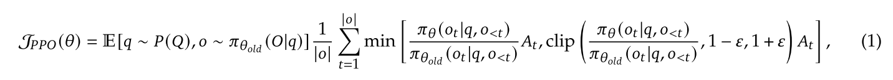

### DeepSeek-R1

> 收敛到简单的思路，复杂的奖励模型不work
>
> rule-based reward即可，比如数学题和coding，不需要模型判断结论是否正确
>
> rediscover OpenAI-o1 的工作

* R1-Zero 相比 R1: 没有SFT
* Reward Modeling
  * The reward is the source of the training signal, which decides the optimization direction of RL.
    To train DeepSeek-R1-Zero, we adopt a rule-based reward system that mainly consists of two
    types of rewards:
    * Accuracy rewards: The accuracy reward model evaluates whether the response is correct.
      For example, in the case of math problems with deterministic results, the model is required
      to provide the final answer in a specified format (e.g., within a box), enabling reliable
      rule-based verification of correctness. Similarly, for LeetCode problems, a compiler can be
      used to generate feedback based on predefined test cases.
    * Format rewards: In addition to the accuracy reward model, we employ a format reward
      model that enforces the model to put its thinking process between ‘<think>’ and ‘</think>’
      tags.
  * We do not apply the outcome or process neural reward model in developing DeepSeek-R1-Zero,
    because we find that the neural reward model may suffer from reward hacking in the large-scale
    reinforcement learning process, and retraining the reward model needs additional training
    resources and it complicates the whole training pipeline.

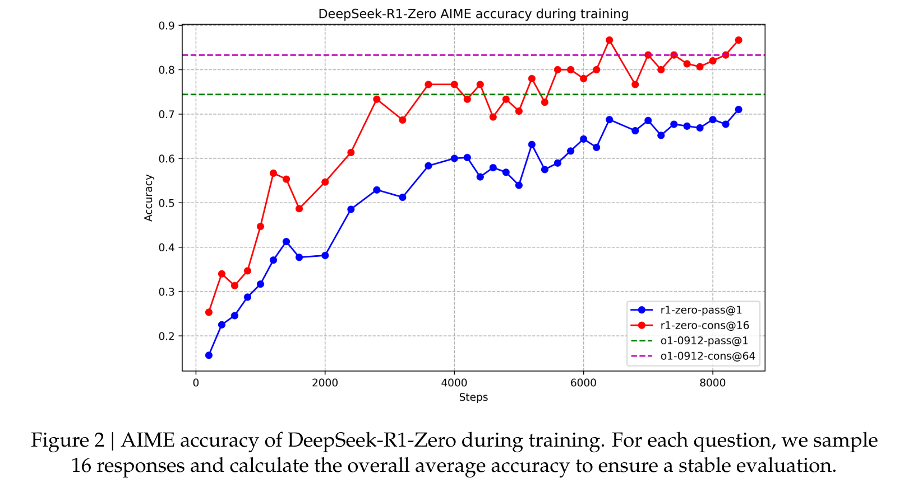

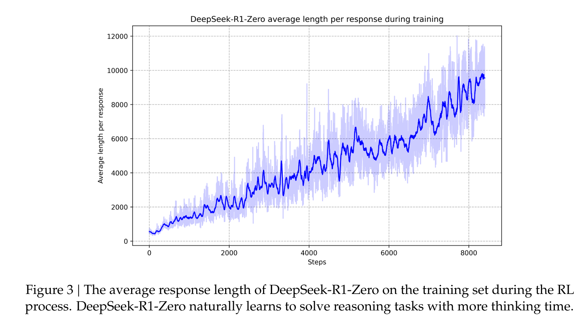

* 2.3.4. Reinforcement Learning for all Scenarios
  * 仍然用奖励模型
* DeepSeek-R1: Reinforcement Learning **with Cold Start**
  * 用CoT做SFT

### GRPO (Group Relative Policy Optimization) —— DeepSeekMath

> **DeepSeekMath Chpt 4，很好的材料**

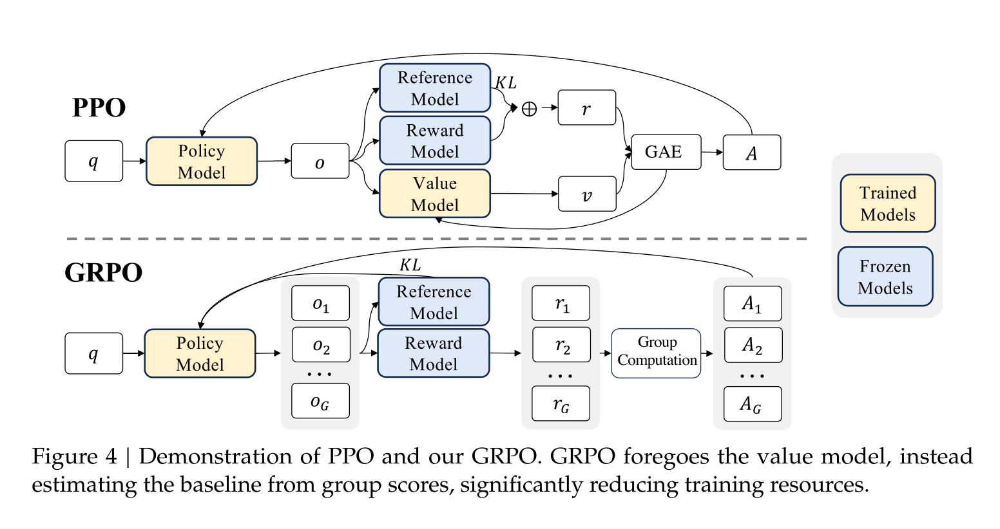

* 核心特点：放弃 Critic 模型，省内存
  * 去掉了PPO公式中At的计算

  * 在很多 RL 算法（如 Actor-Critic）中，除了策略模型（Actor，决定做什么动作/生成什么输出），还有一个 Critic 模型 ，用于评估当前状态或动作的好坏（预测未来的累积奖励，即价值 Value）。Critic 模型通常和策略模型差不多大。

  * GRPO 的一个关键点是 它不需要 Critic 模型 。这对于大模型来说是个显著优势，因为训练和维护一个同样大的 Critic 模型会消耗大量计算资源（内存、计算量）。

  * 替代方案 : 它不预测绝对的价值，而是通过比较 一组 (group) 输出的好坏来估计一个 相对的基线 (baseline) 。

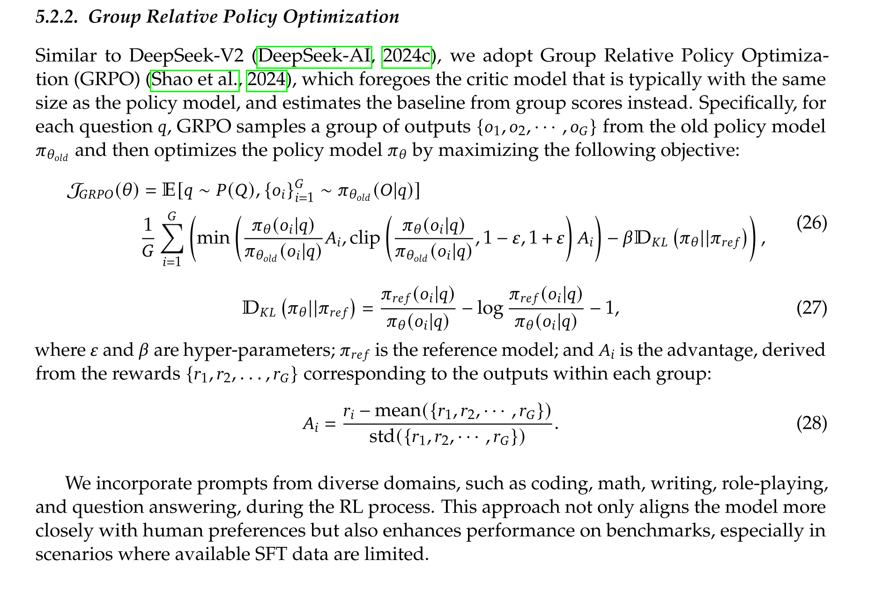

* 目标函数：
  * 重要性采样 (importance sampling) 的比率。它衡量了当前策略 πθ 生成输出 oᵢ 的概率相对于旧策略 πθ_old 的变化。如果比率大于 1，表示当前策略更倾向于生成 oᵢ 。
  * Ai是策略梯度项
  * Min限制更新幅度
  * KL 散度正则化项 ：这个项会惩罚 πθ 偏离 π_ref 太远。 β 是控制惩罚力度的超参数。这有助于防止模型在 RL 优化过程中忘记 SFT 阶段学到的知识（比如语言流畅性、基本事实等），保持模型的稳定性

* 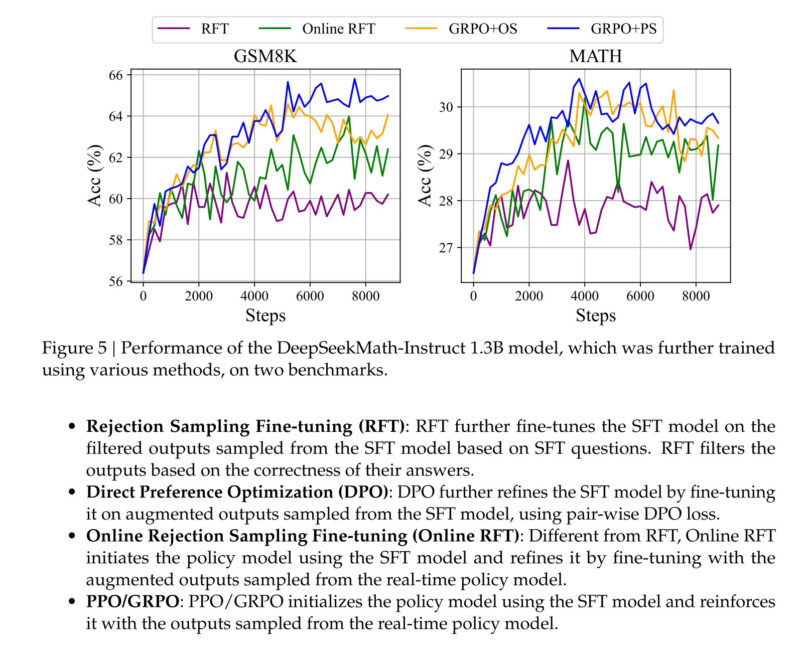
  * 开源社区很长时间在做offline RFT，或者迭代式的，没有用online RFT
    * online RFT比较贵、不稳定
  * PS过程监督，OS结果监督
  * 没有对比基于规则的RM

* 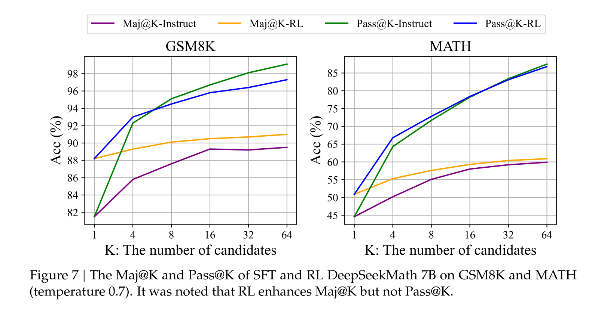
  * counterintuitive的结论：K=1时RL高，后面RL反而差，似乎探索能力下降了，这是一个negative的信号

#### Why RL work?

* 5.2.2. Why RL Works?
  * In this paper, we conduct reinforcement learning based on a subset of instruction tuning
    data, and it achieves significant performance enhancement upon the instruction tuning model.
    To further explain why reinforcement learning works. We evaluate the Pass@K and Maj@K
    accuracy of the Instruct and RL models on two benchmarks. **As shown in Figure 7, RL enhances**
    **Maj@K’s performance but not Pass@K. These findings indicate that RL enhances the model’s**
    **overall performance by rendering the output distribution more robust, in other words, it seems**
    **that the improvement is attributed to boosting the correct response from TopK rather than**
    **the enhancement of fundamental capabilities**. Similarly, (Wang et al., 2023a) identified a
    misalignment problem in reasoning tasks within the SFT model, showing that the reasoning
    performance of SFT models can be improved through a series of preference alignment strategies
    (Song et al., 2023; Wang et al., 2023a; Yuan et al., 2023b).
  * RL可能仅仅是提升对齐，没提升模型的核心能力
* 5.2.3. How to Achieve More Effective RL?
  * We demonstrate RL works pretty well in mathematical reasoning tasks. We also provide a unified
    paradigm to understand different representative training methods. Within this paradigm, all
    methods are conceptualized as either direct or simplified RL techniques. As summarized in
    Equation 5, there exist **three key components: Data Source, Algorithm, and Reward Function.**
    We provide some potential future directions about the three components.
  * **Data source** is the raw material of all training methods. In the context of RL, we
    specifically refer to the data source as the unlabeled questions with the outputs sampled from
    the policy model. In this paper, we only use the questions from the instruction tuning stage and
    a naive nucleus sampling to sample outputs. We think this is a potential reason that our RL
    pipeline only improves the Maj@K performance. In the future, we will explore our RL pipeline
    on out-of-distribution question prompts, in conjunction with advanced sampling (decoding)
    strategies, like those based on tree-search methods (Yao et al., 2023). Also, the efficient inference
    techniques (Kwon et al., 2023; Leviathan et al., 2023; Xia et al., 2023, 2024), which determines the exploration efficiency of policy models, also play an exceedingly important role.
  * **Algorithms** process the data and reward signal to the gradient coefficient to update
    the model parameter. Based on Equation 5, to some extent, all methods now fully TRUST the
    signal of the reward function to increase or decrease the conditional probability of a certain
    token. However, it is impossible to ensure the reward signal is always reliable, especially in
    extremely complex tasks. For example, even the PRM800K datasets (Lightman et al., 2023),
    which have been carefully annotated by well-trained annotators, still contain approximately 20%
    of incorrectly annotations7. To this end, we will explore the reinforcement learning algorithm
    that is robust against noisy reward signals. We believe such WEAK-TO-STRONG (Burns et al., alignment methods will bring a fundamental change to the learning algorithms.
  * **Reward function** is the source of the training signal. In RL, the reward
    function is usually the neural reward model. We think there exist three important directions for
    reward models: 1) **How to enhance the generalization ability of the reward model.** **The reward**
    **model must be effectively generalized to handle out-of-distribution questions and advanced**
    **decoding outputs; otherwise, reinforcement learning may merely stabilize the distribution of**
    **LLMs rather than improve their fundamental capabilities;** 2) How to reflect the uncertainty
    of reward model. The uncertainty could potentially act as a linking bridge between the weak
    reward model and the weak-to-strong learning algorithms; 3) How to efficiently build high-
    quality process reward models that can provide fine-grained training signals for the reasoning
    process (Lightman et al., 2023; Wang et al., 2023b).
    * 基于规则的泛化性，比基于模型的更强

## RLHF —— 基于人类反馈的强化学习

### Intro

* 核心贡献：解决了“奖励信号模糊”的难题

  * RLHF 其实从某种意义上想像成一个 Offline RL 步骤，因为 reward model 的能力限制了 RL 算法完全 off-policy 的能力。当然，它所带来的 reasoning 能力已经是超过了超越传统监督学习的 Pre-training，但提升幅度仍然非常有限。所以 experience /exploration 的 online 运行是无法避开的重要步骤。
  * 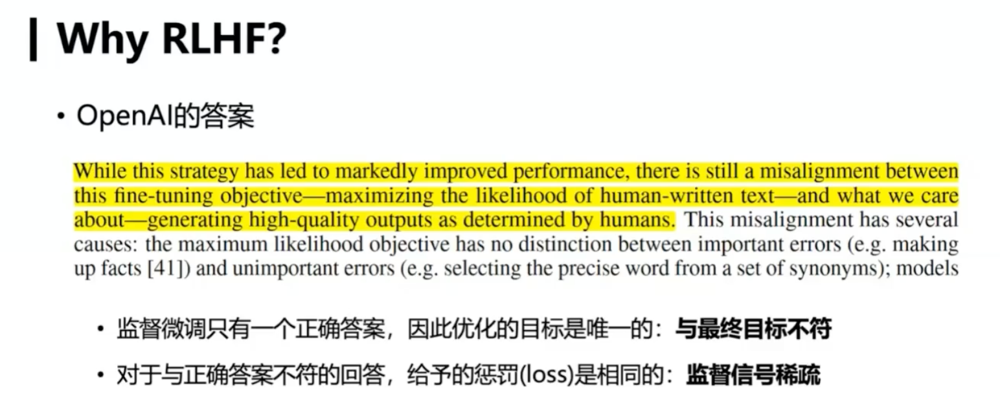

  * 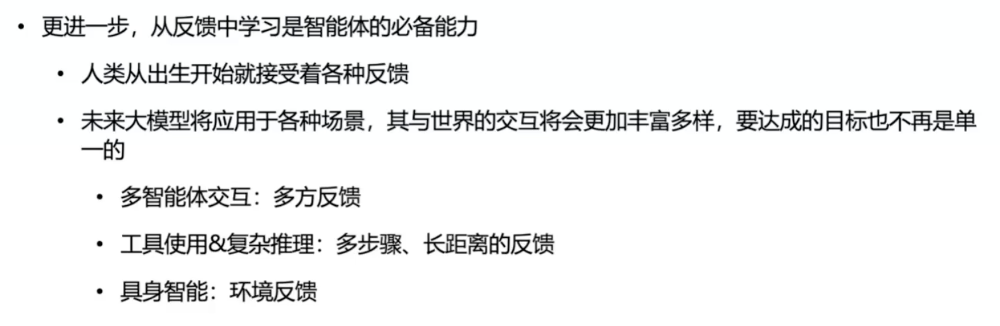

### 历史发展

* 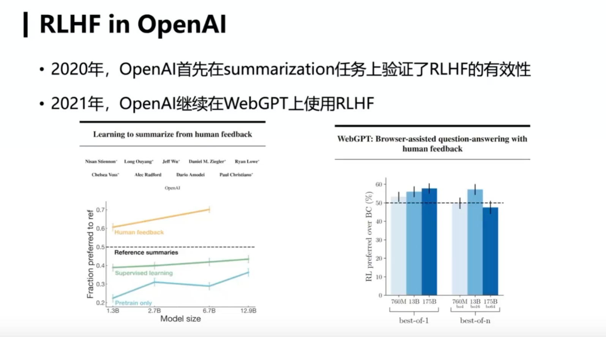

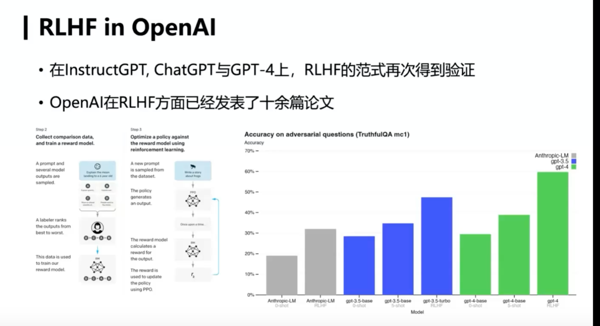

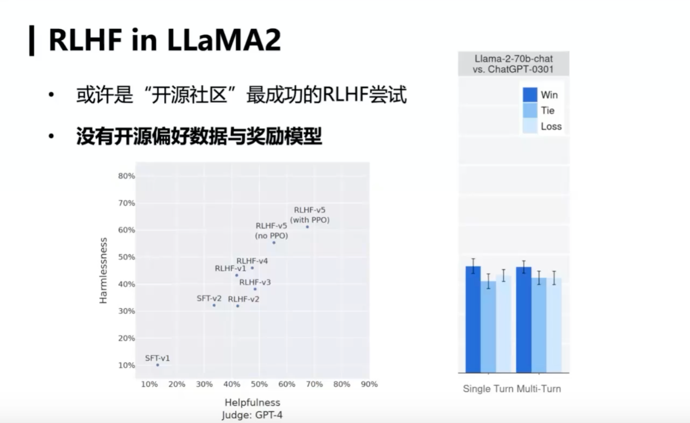

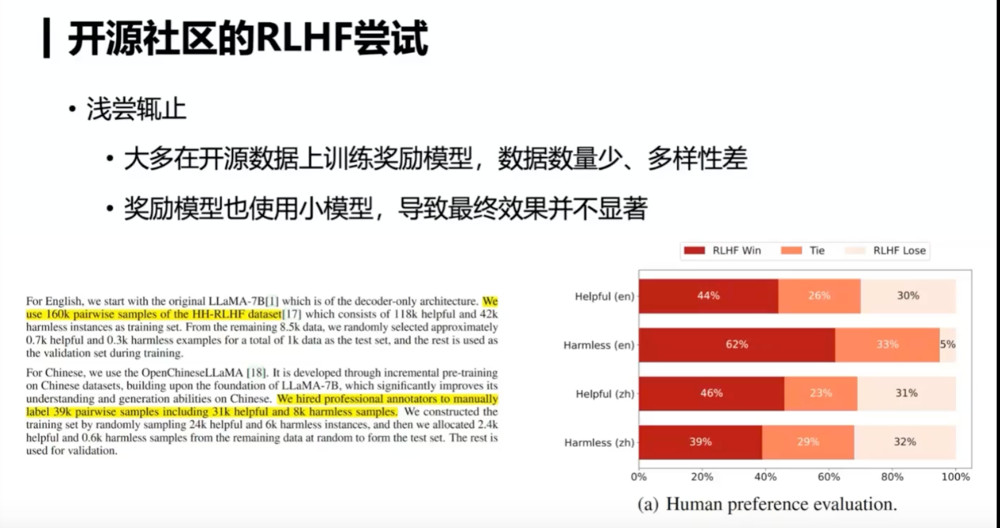

### RLHF 步骤

* Reinforcement Learning from Human Feedback (RLHF), using the same methods as [InstructGPT](https://openai.com/blog/instruction-following/), but with slight differences in the data collection setup
  * RLHF的blog介绍：https://huggingface.co/blog/rlhf
    * supervised fine-tuning: human AI trainers provided conversations in which they played both sides—the user and an AI assistant
  * 步骤：
    * 预训练一个语言模型 (LM) ；
    * 聚合问答数据并训练一个奖励模型 (Reward Model，RM) ；
    * 用强化学习 (RL) 方式微调语言模型（LM）。
  * reward model: 人工打分
    * 人工写答案 -> 人工选答案 -> 机器选答案
    * prompt dataset
    * fine-tune the model using [Proximal Policy Optimization](https://openai.com/blog/openai-baselines-ppo/)
    * 一些巧妙的打分方式：
      * 客服点按钮，选取ai答案，也是finetune过程
      * reddit帖子中的最高分

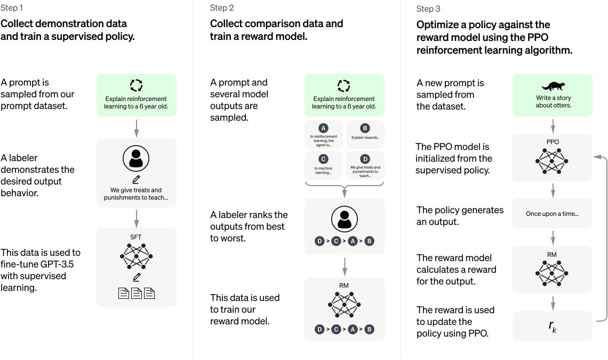

### InstructGPT —— 介绍RLHF的数据工程

* RLHF的数据量要求大于SFT

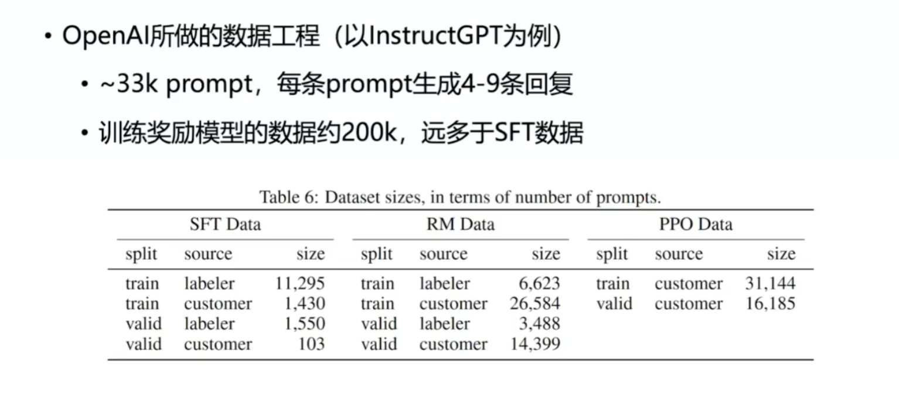

#### UltraFeedback

* --> UltraRM+

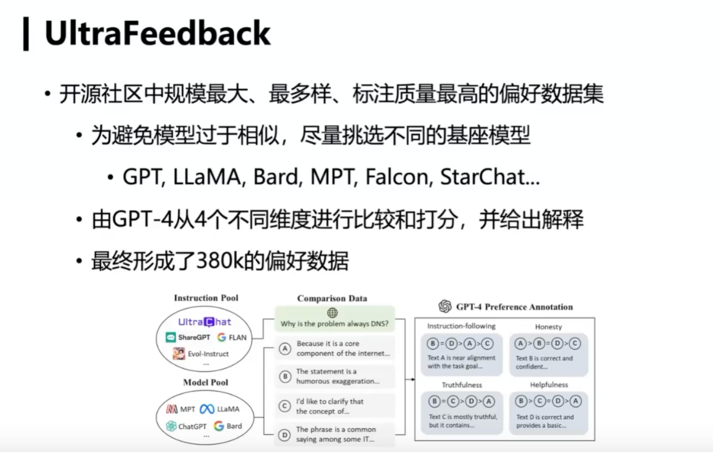

## OpenAI o1

> o1本质上是在探索大模型在AGI路上能走多远、天花板在哪里的问题
>
> [如何理解OpenAI o1](https://mp.weixin.qq.com/s/QdVSq8q7wLWtPakdZdqidA)

* 提升LLM模型认知能力的核心在于复杂逻辑推理能力。

  * LLM的逻辑推理能力越强，则能解锁更多复杂应用，大模型应用的天花板就越高
  * o1模型能力越强，则可以反哺基座模型
* o1的做法本质上是CoT的自动化or内化。
  * 具体怎么做：数据标注，对CoT的过程打分
  * rl搜索COT的决策空间
  * 问题越复杂，隐藏的COT token消耗越大

  * 大部分逻辑推理数据的形式是<问题，正确答案>，缺了中间的详细推理步骤，而o1本质上是让大模型学会自动寻找从问题到正确答案的中间步骤，以此来增强复杂问题的解决能力。
* RL的scaling law本质上是COT决策树搜索的scaling law
* Note
  * OpenAI想做的方向太多，资源分散导致分到具体一个方向的资源不够用，所以越往后发展“期货状态”的方向越多，也让人觉得尽显疲态。

### CoT

[OpenAI研究员、思维树作者姚顺雨专访：人生是一场无限流游戏丨独家](https://mp.weixin.qq.com/s/MdPI-X1HvRxFuX_Z0Ju_ug)

* 许多计算本质上就是去计算下一个token，next token prediction开始成为一个新的计算。那么针对计算复杂性，传统的语言如何在新框架下适用，还有很多问题需要去解决
* Open-endedness
  * 语言游戏之所以和其他游戏区别很大，就是因为语言的开放性，即open-endedness。既然这样，那么它本质上应该有一个generative solution，而不是一个discriminative solution。所以从我第一个工作开始，我就一直在做autoregressive language model (GPT-2)
  * 从哲学的角度来看，人生就是一个无限流游戏，某种程度上来说，更像一个文字游戏，而不是电子游戏。每天你都有很多选择，从程度上说是非常high level、 open ended的。
* ReAct
  * 这篇论文的本质是Agent不仅仅有environment action，也有thinking action。
  * 主要的思路是，在玩文字游戏的时候，为什么机器很笨，而人很聪明，是因为人类有思考的能力。当时我在做ReAct的时候，最初的想法是，如果我能够让机器模仿人，不仅仅是模仿人的活动，也模仿人怎么思考，是不是就可以泛化得更好。具体比如人看到了一个城堡，人的选择是走向第三个门，如果你只去模仿这样的Mapping，很多时候是很难去泛化的。但是如果能够让它同时去模仿人的思考过程，那可能就是一个非常自然的、可以泛化的一个理由。比如人可能会想，现在周围很黑暗而且有奇怪的叫声，可能有危险需要灯。灯在第一个房间，但是第一个房间的钥匙在第三个房间，所以我得先去第三个房间。
* CoT的扩展
  * 从某种程度上来说，ReAct和Tree of Thoughts其实相当于是CoT的两个方向的扩展。一个方向是要和外部世界发生联系，另一个方向是内部的思考，如何从一个线性过程变成一个非线性，也就是更加通往 system 2的一个过程。
* 身边太多聪明的人，但你发现自己并不比他们差。做研究非常重要的因素就是信心，如果你不相信能做出非常好的研究，那你是不可能做出来好的研究的。

## RL工程 Overview

> TODO: 大模型RL训练框架的进化之路 http://xhslink.com/o/2MvDgQlctwI  非常好的文章

### 挑战：训推一体

* RL的训练的workload包含既包含LLM训练的workload（计算bound），也包含推理的workload（访存bound），这导致RL训练的效率较低，依赖训推一体的高效训练
* 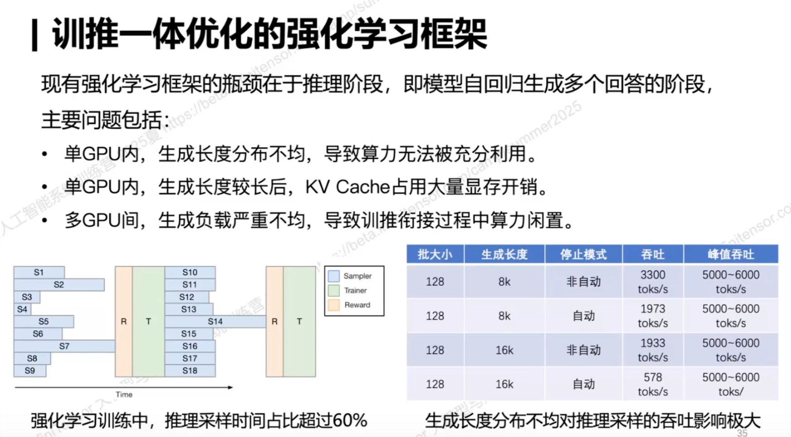 

### Partial Rollout

#### Intro

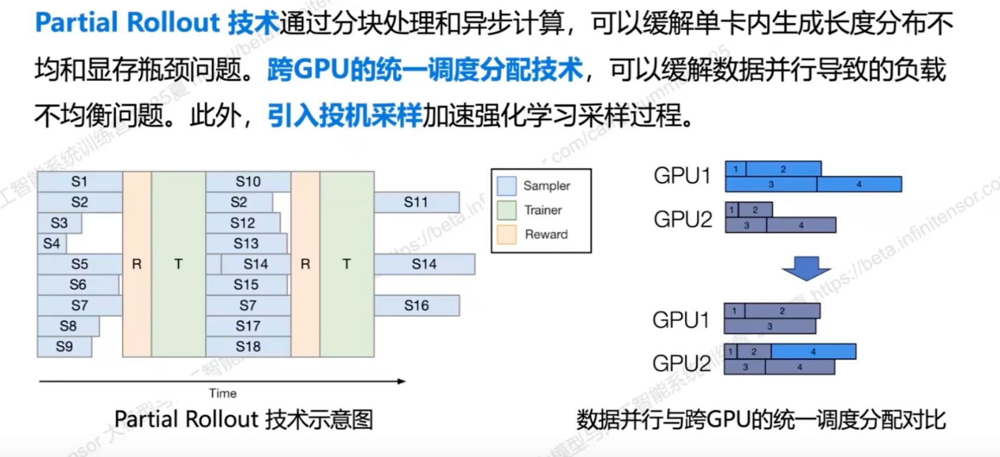

#### Mooncake + RL

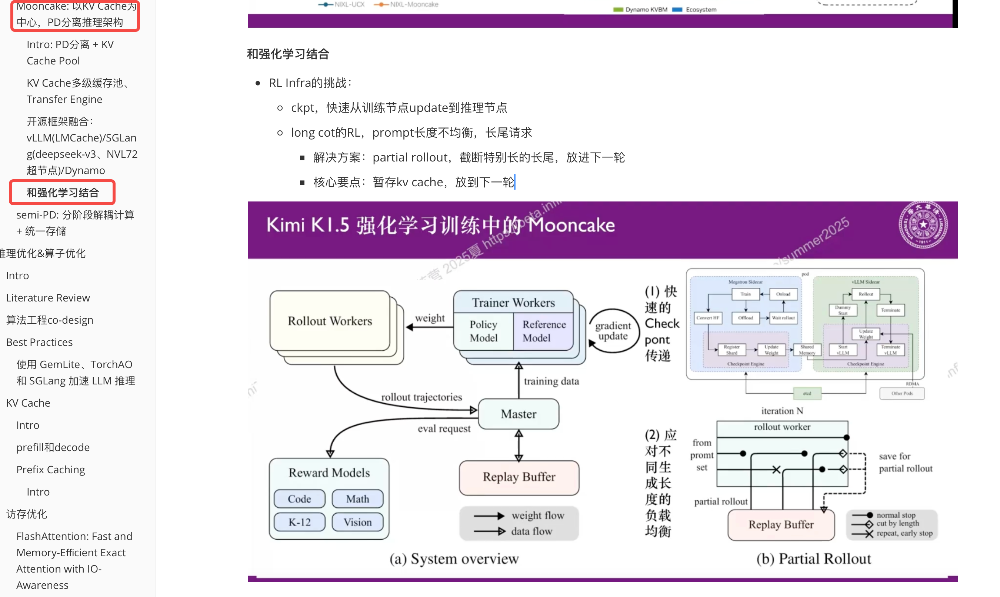

##  veRL

> https://arxiv.org/abs/2409.19256

### Intro

* veRL(HybridFlow)是一个灵活、高效、工业级的RL(HF)训练框架,专为大型语言模型(LLM)而设计。veRL应用hybrid-
  controller编程模型,兼具single-controller的编程灵活性与multi-controller的计算高效性。
* 在提供灵活性的同时,veRL利用3D-HybridEngine能力,减少训练和生成阶段之间转换期间的通信开销,提供极致吞吐性能。
* 支持Auto - Mapping算法来搜索每个node最佳Parallelism和Placement方式。将模型放置到不同的GPU组上,以实现高效的
  资源利用和跨不同集群规模的可扩展性。

## RL应用算法

### Search-r1

> reasoning模型和工具调用结合起来强化学习训练

### ZeroSearch

> https://alibaba-nlp.github.io/ZeroSearch/
>
> https://github.com/Alibaba-nlp/ZeroSearch

## RL的其它应用领域

### 游戏

* [AI挑战黑神话！死亡1000次，我训练的AI终于击败了首个BOSS【图灵计划10】](https://www.bilibili.com/video/BV1qE421c7mU)
* [【DQN只狼实战教程】手把手带你实现用强化学习DQN打只狼里的boss（第一期）](https://www.bilibili.com/video/BV1by4y1n7pe)

### 机器人

【一群不懂ActorCritic强化学习和PPO的人强行读Humanoid-Gym代码四小时-哔哩哔哩】 [一群不懂ActorCritic强化学习和PPO的人强行读Humanoid-Gym代码四小时_哔哩哔哩_bilibili](https://b23.tv/25KisIK)
