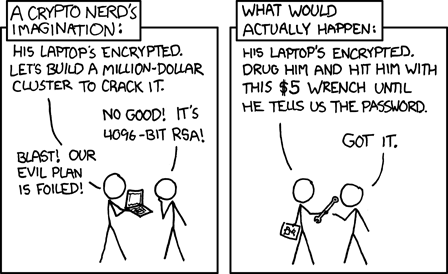

## Security-Privacy-Cryptography

### 密码学在计算机领域的应用

#### hash function
##### 1.性质

- Deterministic: the same input always generates the same output.
- Non-invertible: it is hard to find an input `m` such that `hash(m) = h` for some desired output `h`.
- Target collision resistant: given an input `m_1`, it’s hard to find a different input `m_2` such that `hash(m_1) = hash(m_2)`.
- Collision resistant: it’s hard to find two inputs `m_1` and `m_2` such that `hash(m_1) = hash(m_2)` (note that this is a strictly stronger property than target collision resistance).

注意区分Target collision resistant和Collision resistant


##### 2.原理

```c++
int sum=0; 
for(int i=0; i<v.size(); ++i) sum=sum*131+v[i]; 
return sum;
```

* 对`vector<int>`做hash的方法：

  I. 用上面的方法，选取质数131，可能需要再设另一个质数取模

  II. 两个或三个的简单情形，可以利用pair和map

  III. 对于每一个整数， 把0\~7、8\~15、 16\~23、 24\~31的位置取出来变成char，cat之后再hash

* 方法I中取模用质数更好的原因

  * “ 如果p是一个质数，n是任意非零整数（不是p的倍数）， 那么px+ny=z对于任意的x,y,z都有解”， 这样可以保证取模相对均匀一些， 避免所谓的 primary clustering， 要证明这个需要引理：“方程 ax+by=1 有整数解当且仅当 a 和 b 互质”
* 哈希算法可能用到乘除法。模素数的剩余系除去 0 ，这个集合关于乘法构成群。只有群才能保证每个元素都有逆元，除法才能合法。假设要计算 (p / q) mod m，如果想让结果与 (p mod m) / (q mod m) 相等，必须令 m 为素数，否则逆元求不出来。

##### 3.应用
* Git中的id是由SHA-1 hash生成，40个16进制字符
  * SHA-1: 160bit 
  * SHA-2: 有不同位数，比如SHA-256
  * `$ printf 'hello' | sha1sum`

* [Commitment scheme](https://en.wikipedia.org/wiki/Commitment_scheme)


### MIT 6.NULL 
[6.NULL Security and Cryptography](https://missing.csail.mit.edu/2020/security/)

[6.NULL Security and Privacy](https://missing.csail.mit.edu/2019/security/)

#### Security and Cryptography

[Cryptographic Right Answers](https://latacora.micro.blog/2018/04/03/cryptographic-right-answers.html)

一些概念：

##### Entropy
online guessing - 40 bits of entropy

offline guessing - 80 bits of entropy

##### Hash functions

 [lifetimes of cryptographic hash functions](https://valerieaurora.org/hash.html) 

##### Key derivation functions(KDFs)

应用：

- Producing keys from passphrases for use in other cryptographic algorithms (e.g. symmetric cryptography, see below).
- Storing login credentials. Storing plaintext passwords is bad; the right approach is to generate and store a random [salt](https://en.wikipedia.org/wiki/Salt_(cryptography)) `salt = random()` for each user, store `KDF(password + salt)`, and verify login attempts by re-computing the KDF given the entered password and the stored salt.


##### Symmetric cryptography

应用：

- Encrypting files for storage in an untrusted cloud service. This can be combined with KDFs, so you can encrypt a file with a passphrase. Generate `key = KDF(passphrase)`, and then store `encrypt(file, key)`.

```sh
openssl aes-256-cbc -salt -in {input filename} -out {output filename}
openssl aes-256-cbc -d -in {input filename} -out {output filename}
```


##### Asymmetric cryptography

用private key来sign，用public key来encrypt

- [PGP email encryption](https://en.wikipedia.org/wiki/Pretty_Good_Privacy). People can have their public keys posted online (e.g. in a PGP keyserver, or on [Keybase](https://keybase.io/)). Anyone can send them encrypted email.
- Private messaging. Apps like [Signal](https://signal.org/) and [Keybase](https://keybase.io/) use asymmetric keys to establish private communication channels.
- Signing software. Git can have GPG-signed commits and tags. With a posted public key, anyone can verify the authenticity of downloaded software.

* Key distribution: Asymmetric-key cryptography is wonderful, but it has a big challenge of distributing public keys / mapping public keys to real-world identities. There are many solutions to this problem. Signal has one simple solution: trust on first use, and support out-of-band public key exchange (you verify your friends’ “safety numbers” in person). PGP has a different solution, which is [web of trust](https://en.wikipedia.org/wiki/Web_of_trust). Keybase has yet another solution of [social proof](https://keybase.io/blog/chat-apps-softer-than-tofu) (along with other neat ideas). Each model has its merits; we (the instructors) like Keybase’s model.

应用：

* In use, once the server knows the client’s public key (stored in the `.ssh/authorized_keys` file), a connecting client can prove its identity using asymmetric signatures. This is done through [challenge-response](https://en.wikipedia.org/wiki/Challenge–response_authentication). At a high level, the server picks a random number and sends it to the client. The client then signs this message and sends the signature back to the server, which checks the signature against the public key on record. This effectively proves that the client is in possession of the private key corresponding to the public key that’s in the server’s `.ssh/authorized_keys` file, so the server can allow the client to log in.
* [Set up GPG](https://www.digitalocean.com/community/tutorials/how-to-use-gpg-to-encrypt-and-sign-messages)

[在Github上使用GPG的全过程 - 林溪的文章 - 知乎](https://zhuanlan.zhihu.com/p/76861431)

```sh
sudo apt-get install gnupg
gpg --gen-key
gpg --output ~/revocation.crt --gen-revoke your_email@address.com
chmod 600 ~/revocation.crt

gpg --import name_of_pub_key_file
https://pgp.mit.edu/

gpg --keyserver pgp.mit.edu  --search-keys search_parameters
gpg --fingerprint your_email@address.com

# 信任（用自己的密钥为其签名验证）
gpg --sign-key email@example.com
gpg --output ~/signed.key --export --armor email@example.com
gpg --import ~/signed.key

gpg --output ~/mygpg.key --armor --export your_email@address.com

gpg --keyserver pgp.mit.edu  --send-keys ...
gpg --keyserver pgp.mit.edu  --recv-keys ...

gpg --encrypt --sign --armor -r person@email.com name_of_file
# 如果想自己decrypt，需要第二个-r recipient
gpg file_name.asc

gpg --list-keys
gpg --refresh-keys

gpg --keyserver key_server --refresh-keys

```

Git and GPG
```sh
git config --global user.signingkey {key_id}
git config --global commit.gpgsign true

git commit -S
git tag -s

git log/show --show-signature
git tag -v
```

信任Github所用的GPG密钥，使本地确认在Github网页端进行的操作的真实性
```sh
curl https://github.com/web-flow.gpg | gpg --import
gpg --sign-key 4AEE18F83AFDEB23
```


#### Security and Privacy

Follow the [right people](https://heimdalsecurity.com/blog/best-twitter-cybersec-accounts/)

使用安全的密码管理器，比如[1password](https://1password.com/), [KeePass](https://keepass.info/), [KeePass](https://keepass.info/), [`pass`](https://www.passwordstore.org/)

更安全的two-factor authentication双因素认证：a [FIDO/U2F](https://fidoalliance.org/) dongle (a [YubiKey](https://www.yubico.com/quiz/) for example, which has [20% off for students](https://www.yubico.com/why-yubico/for-education/)). TOTP (like Google Authenticator or Duo) will also work in a pinch, but [doesn’t protect against phishing](https://twitter.com/taviso/status/1082015009348104192). SMS is pretty much useless unless your threat model only includes random strangers picking up your password in transit. 

* [SMS's issue](https://www.kaspersky.com/blog/2fa-practical-guide/24219/)

##### General Security Advice

Tech Solidarity has a pretty great list of [do’s and don’ts for journalists](https://techsolidarity.org/resources/basic_security.htm) that has a lot of sane advice, and is decently up-to-date. @thegrugq also has a good blog post on [travel security advice](https://medium.com/@thegrugq/stop-fabricating-travel-security-advice-35259bf0e869) that’s worth reading. We’ll repeat much of the advice from those sources here, plus some more. Also, get a [USB data blocker](https://amzn.com/B00QRRZ2QM), because [USB is scary](https://www.bleepingcomputer.com/news/security/heres-a-list-of-29-different-types-of-usb-attacks/).

##### Private Communication

Use [Signal](https://www.signal.org/) ([setup instructions](https://medium.com/@mshelton/signal-for-beginners-c6b44f76a1f0). [Wire](https://wire.com/en/) is [fine too](https://www.securemessagingapps.com/); WhatsApp is okay; [don’t use Telegram](https://twitter.com/bascule/status/897187286554628096) (不错的文章)). Desktop messengers are pretty broken (partially due to usually relying on Electron, which is a huge trust stack).

E-mail is particularly problematic, even if PGP signed. It’s not generally forward-secure, and the key-distribution problem is pretty severe. [keybase.io](https://keybase.io/) helps, and is useful for a number of other reasons. Also, PGP keys are generally handled on desktop computers, which is one of the least secure computing environments. Relatedly, consider getting a Chromebook, or just work on a tablet with a keyboard.


##### File Security

File security is hard, and operates on many level. What is it you’re trying to secure against?

[](https://xkcd.com/538/)

- Offline attacks (someone steals your laptop while it’s off): turn on full disk encryption. ([cryptsetup + LUKS](https://wiki.archlinux.org/index.php/Dm-crypt/Encrypting_a_non-root_file_system) on Linux, [BitLocker](https://fossbytes.com/enable-full-disk-encryption-windows-10/) on Windows, [FileVault](https://support.apple.com/en-us/HT204837) on macOS. Note that this won’t help if the attacker *also* has you and really wants your secrets.

- Online attacks (someone has your laptop and it’s on): use file encryption. There are two primary mechanisms for doing so    

  - Encrypted filesystems: stacked filesystem encryption software  encrypts files individually rather than having encrypted block devices.  You can “mount” these filesystems by providing the decryption key, and  then browse the files inside it freely. When you unmount it, those files are all unavailable.  Modern solutions include [gocryptfs](https://github.com/rfjakob/gocryptfs) and [eCryptFS](http://ecryptfs.org/). More detailed comparisons can be found [here](https://nuetzlich.net/gocryptfs/comparison/) and [here](https://wiki.archlinux.org/index.php/disk_encryption#Comparison_table)
  - Encrypted files: encrypt individual files with symmetric encryption (see `gpg -c`) and a secret key. Or, like `pass`, also encrypt the key with your public key so only you can read it back later with your private key. Exact encryption settings matter a lot!

- [Plausible deniability](https://en.wikipedia.org/wiki/Plausible_deniability) (what seems to be the problem officer?): usually lower performance, and easier to lose data. Hard to actually prove that it provides [deniable encryption](https://en.wikipedia.org/wiki/Deniable_encryption)! See the [discussion here](https://security.stackexchange.com/questions/135846/is-plausible-deniability-actually-feasible-for-encrypted-volumes-disks), and then consider whether you may want to try [VeraCrypt](https://www.veracrypt.fr/en/Home.html) (the maintained fork of good ol’ TrueCrypt).

- Encrypted backups: use  [Tarsnap](https://www.tarsnap.com/) or [Borgbase](https://www.borgbase.com/)

  - Think about whether an attacker can delete your backups if they get a hold of your laptop!

##### Internet Security & Privacy

The internet is a *very* scary place. Open WiFi networks [are](https://www.troyhunt.com/the-beginners-guide-to-breaking-website/) [scary](https://www.troyhunt.com/talking-with-scott-hanselman-on/). Make sure you delete them afterwards, otherwise your phone will happily announce and re-connect to something with the same name later!

If you’re ever on a network you don’t trust, a VPN *may* be worthwhile, but keep in mind that you’re trusting the VPN provider *a lot*. Do you really trust them more than your ISP? If you truly want a VPN, use a provider you’re sure you trust, and you should probably pay for it. Or set up [WireGuard](https://www.wireguard.com/) for yourself – it’s [excellent](https://latacora.micro.blog/there-will-be/)!

If you’re particularly privacy-oriented, [privacytools.io](https://privacytools.io) is also a good resource.

Some of you may wonder about [Tor](https://www.torproject.org/). Keep in mind that Tor is *not* particularly resistant to powerful global attackers, and is weak against traffic analysis attacks. It may be useful for hiding traffic on a small scale, but won’t really buy you all that much in terms of privacy. You’re better off using more secure services in the first place (Signal, TLS + certificate pinning, etc.).

##### Web Security

So, you want to go on the Web too? Jeez, you’re really pushing your luck here.

Install [HTTPS Everywhere](https://www.eff.org/https-everywhere). SSL/TLS is [critical](https://www.troyhunt.com/ssl-is-not-about-encryption/) (已读, **Login Landing Page Must Use SSL**), and it’s *not* just about encryption, but also about being able to verify that you’re talking to the right service in the first place! If you run your own web server, [test it](https://www.ssllabs.com/ssltest/index.html). TLS configuration [can get hairy](https://wiki.mozilla.org/Security/Server_Side_TLS). HTTPS Everywhere will do its very best to never navigate you to HTTP sites when there’s an alternative. That doesn’t save you, but it helps. If you’re truly paranoid, blacklist any SSL/TLS CAs that you don’t absolutely need.

Install [uBlock Origin](https://github.com/gorhill/uBlock). It is a [wide-spectrum blocker](https://github.com/gorhill/uBlock/wiki/Blocking-mode) that doesn’t just stop ads, but all sorts of third-party communication a page may try to do. And inline scripts and such. If you’re willing to spend some time on configuration to make things work, go to [medium mode](https://github.com/gorhill/uBlock/wiki/Blocking-mode:-medium-mode) or even [hard mode](https://github.com/gorhill/uBlock/wiki/Blocking-mode:-hard-mode). Those *will* make some sites not work until you’ve fiddled with the settings enough, but will also significantly improve your online security.

If you’re using Firefox, enable [Multi-Account Containers](https://support.mozilla.org/en-US/kb/containers). Create separate containers for social networks, banking, shopping, etc. Firefox will keep the cookies and other state for each of the containers totally separate, so sites you visit in one container can’t snoop on sensitive data from the others. In Google Chrome, you can use [Chrome Profiles](https://support.google.com/chrome/answer/2364824) to achieve similar results.


### Cryptography I, Stanford University, Dan Boneh

* [coursera课程](https://www.coursera.org/learn/crypto/home/welcome)
* [密码学资源推荐](https://blog.cryptographyengineering.com/useful-cryptography-resources/)
* [A Graduate Course In Applied Cryptography](https://toc.cryptobook.us/)
* [A Computational Introduction to Number Theory and Algebra](https://www.shoup.net/ntb/)


### Potpourri

* SSRF (Server-Side Request Forgery) attack
  * 本质上，不允许访问内网资源即可修复，但可能会被301/302/307/308重定向、DNS重绑定攻破，修复的时候有可能手抖。
  * 方案：可以用安全开发包，从传输层彻底断掉内网请求，提供自定义黑白名单功能

* RCE (Remote Code Execution) attach
  * 根本原因：开发者使用python的eval进行json解析，而本身eval是用来执行一个字符串表达式，并返回表达式的值，这意味着可以执行任何python代码，从而执行系统命令。
  * 方案：通过AST Node类型识别，干掉不安全的执行

* 任意文件读取/下载漏洞
* SQL注入漏洞
  * 编码不规范引发。攻击者拼接SQL片段，通过返回包内容的大小，逐步获取数据库的内容

##### Inbox:

配wireguard
