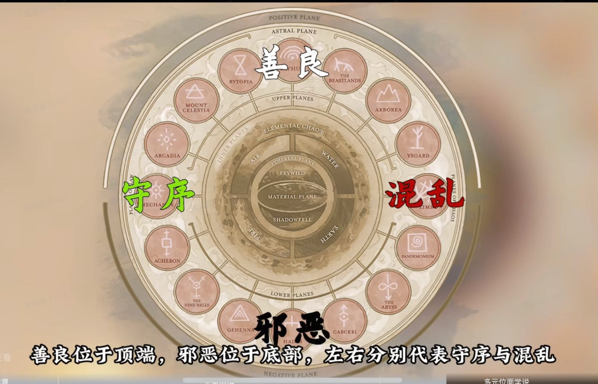
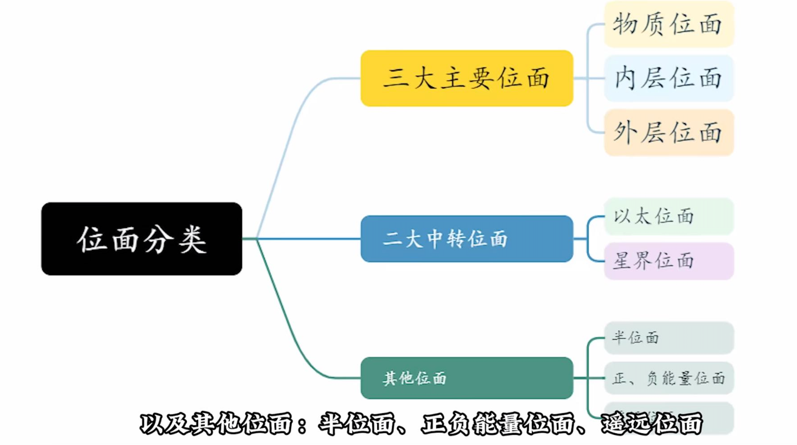

# DND

## 背景设定

### 规则、战役设定、模组

* 规则、战役设定（campaign setting）、模组
* 下面是几大战役设定

* 灰鹰Greyhawk 起源世界
  * 地轴倾斜角度（黄赤交角）30度 气候多样
  * 组织：八叶、猩红兄弟会

* 被遗忘的国度
  * 托瑞尔—— 费伦、卡拉图、马兹特克、扎哈拉
  * 剑湾：费伦西海岸，从北到南，深水城、无冬城、博德之门

* 龙枪编年史克莱恩世界
  * 三角平衡
* 异域风景planescape

### 多元宇宙论

> [也许是奇幻游戏世界最宏大的多元宇宙！【龙与地下城设定：多元宇宙论】_游戏热门视频](https://b23.tv/huLEaAx)

* 多元位面理论

  * 巨轮学说

    * 巨轮正中央：主物质位面、妖精荒野、堕影冥界
    * 
    * 能解释为什么冥河串联邪恶位面

  * 世界轴学说

    * 和巨轮的区别：1）内层不再通过以太和物质位面相连，而是通过星界；2）外层位面个数拓展和重新排列

    * “法术瘟疫”事件摧毁了世界树理论，
    * 简化为世界轴（对应4e版本）

* 晶壁系理论：魔法船战役设定，连接多位面

  * greyspace
  * krynnspace天宇
  * realmspace
  * 保护里面的世界不被燃素海毁灭
  * 魔法船每小时几百万公里，几周达到晶壁系边缘
  * 被位面理论替代：魔法船穿过“荒野空间”来到星界空间进行旅行
  * 各种魔法船：吉斯洋基人的红龙，夺心魔的螺壳船。受龙帝国的太空舰队，高等精灵的星海舰队

* 其它体系：主宇宙、并列位面、星系、蜿蜒之路、单一世界

### 位面 plane

> 多元宇宙中“位面”的概念
>
> 多元宇宙三定律：没有中心、万物归环、万事皆三
>
> 《the manual of the planes》  MOP



* 主物质位面
* 内层位面：
  * 火、空气、水、土、正能量、负能量
  * 妖精荒野
    * 树妖 半羊人 皮克精 小妖精 （在里面生活通常得吃素）
    * 妖精龙 树人 独角兽
    * 鬼婆 枯枝怪 地精 巨人
    * 女王：泰坦尼亚
      * 统治夏之王廷 领导喜乐妖精
    * 女王：空暗女王
      * 暮之王廷 哀怨妖精 unseelie fey
  * 堕影冥界
* 外层位面（精神信仰的投影世界）：
  * 天堂山
  * 极乐世界
  * 混沌海
  * 九层地狱


* 星界位面（astral planes）：时间流逝缓慢，是连接外层位面的通道，是跨宇宙旅行经过的空间
* 以太位面：物质世界与内层元素位面连接的通道
  * 浅层以太能察觉物质世界，反向不行


* 半位面：过渡位面
  * 印记城sigil（万门之城）
  * ravenloft 鸦阁

## 法师

### 辅助道具和能力

* 瞬发法术：五环需要九环法术位

### 战斗技巧

* 法师常规战术：高等隐形术、任意门、进攻
* 针对法师的法术：提升抗力、秘法视力

### 子职

#### 战法师

* 奥术职业 专门强化学习即死和塑能法术 有传言说破解了内爆术的秘密

### 法术

#### 二环

* 空气过滤泡：防护系
* 闪光尘

#### 三环

* 气化形体：变化系
  * 常用于自救，比如：敌方超态变化为蝙蝠进入龙腹，再超态变化为金质火巨人，龙可以对自己用气化形体解围

#### 六环

* 触发
  * 可以设定遭到攻击时和对手换位，制裁远程攻击（比如致死箭）

#### 七环

*  衰竭波
* 反重力术

#### 八环

* 力场囚笼：非魔法手段无法穿过

```
在《龙与地下城》（D&D）第五版规则中，**八环法术「力场囚笼」（Forcecage）**是塑能学派的顶级控制类法术，通过创造不可撼动的力场牢笼实现空间封锁。以下是其核心机制与实战应用的详细解析：

一、法术基础信息

• 环阶与学派：8环塑能法术，需消耗1个8环法术位。

• 施法条件：

◦ 材料：价值1500金币的红宝石尘埃（需在施法时抛洒）。

◦ 范围：以可见点为中心，半径10英尺、高度20英尺的圆柱或立方体。

• 持续时间：专注维持的1分钟（可通过4环或更高法术位延长，每高于3环增加1小时）。

• 豁免检定：被牢笼困住的生物若尝试传送或位面旅行，需通过魅力豁免（DC=8+施法者熟练加值+魅力调整值），失败则无法逃脱。

二、双重形态与核心效果

形态1：栅栏牢笼（Barred Cage）

• 尺寸：20英尺见方的立方体，由直径0.5英寸、间隔0.5英寸的力场栅栏构成。

• 特性：

◦ 允许生物通过栅栏施展法术或攻击外部目标，但无法用非魔法手段离开。

◦ 内部生物的远程攻击可穿透栅栏，但近战攻击因触及限制无法直接作用于外部敌人。

形态2：实心囚箱（Solid Box）

• 尺寸：10英尺见方的封闭立方体，完全隔绝内外物质与能量。

• 特性：

◦ 任何物质或法术（包括解离术、火球术等）均无法穿透，且内部生物无法感知外部环境。

◦ 若目标体型超过囚箱容积（如巨型生物），法术会将其推离区域并导致施法失败。

三、战术价值与限制

核心战术场景

1. 封锁高威胁目标：

◦ 囚禁具有传送能力的敌人（如恶魔、灵吸怪），阻止其逃脱或位面旅行。

◦ 配合「解离术」或「湮灭之球」直接摧毁牢笼与目标，避免持久战。

2. 战场分割与保护：

◦ 将敌方精锐单位与杂鱼部队隔离，集中火力逐个击破。

◦ 保护己方施法者或关键NPC，防止被敌方突袭。

3. 心理威慑与资源消耗：

◦ 迫使敌人消耗高阶法术（如「许愿术」）或珍贵道具（如「解除魔法卷轴」）来破解牢笼。

关键限制

1. 豁免与抗性：

◦ 高魅力生物（如魅魔、巫妖）更易通过豁免逃脱，需配合「降咒术」或「强效法术」削弱其豁免能力。

◦ 元素生物（如火焰元素）可免疫牢笼限制，因其本质为能量体。

2. 反制手段：

◦ 「解离术」可直接摧毁牢笼（需成功命中），而「反魔法领域」能暂时压制法术效果。

◦ 若牢笼被破坏，内部生物可能因能量反噬受到额外伤害（DM可裁定1d10+施法者等级的力场伤害）。

四、版本差异与常见误解

1. 与九环「禁锢术」的区别：

◦ 禁锢术（Imprisonment）通过半位面或实体封印实现永久囚禁，但需特定材料（如宝石、锁链）且无法被解除魔法破解。

◦ 力场囚笼更侧重即时战场控制，且允许目标在牢笼内行动，适合需要活捉或短期封锁的场景。

2. 历史设定中的特殊变种：

◦ 在「耐色瑞尔」等古代魔法文明中，存在「力场囚笼」的变种形态（如圆形鸟笼状牢笼），可通过仪式魔法延长至永久持续。

五、进阶组合策略

1. 与「幽影步」联动：

◦ 施法者进入牢笼后使用「幽影步」离开，利用牢笼的封锁特性制造「伪安全区」，误导敌人。

2. 「力场囚笼」+「迟缓术」：

◦ 先对目标释放「迟缓术」降低其豁免能力，再用牢笼封锁，大幅提升控制成功率。

3. 「力场囚笼」+「星界投射」：

◦ 施法者通过星界投射进入牢笼内部，直接攻击被困生物，而实体牢笼可阻止敌人反击。

六、规则细节与DM裁决

1. 体型与空间适配：

◦ 若目标体型超过牢笼尺寸（如巨型龙类），法术会将其推离区域，但需进行力量豁免（DC=法术豁免DC），失败则强制推离并受到1d6/环阶的力场伤害。

2. 材料替代与经济成本：

◦ 红宝石尘埃的价值可通过「鉴定术」或「法术反制」部分抵消，但需注意长期使用可能导致团队资源枯竭。

3. 持续时间与专注维持：

◦ 若施法者被击晕或死亡，牢笼仍会维持剩余持续时间（由法术位等级决定），但无法再调整形态或扩大范围。

综上，「力场囚笼」是D&D 5e中空间控制的巅峰法术，其双重形态与高战术弹性使其成为高阶施法者的核心手段。合理利用其封锁特性与反制机制，可在关键时刻扭转战局，但需谨慎应对敌方的破笼策略与资源消耗。建议以《玩家手册》与D&D Beyond数据库为准，结合具体战役设定灵活运用。
```


#### 九环

* 流星爆
* 时间停止：延长10-30s
  * 变化学派
  * 战术：禁锢灵魂+反魔法力场+时间停止 塞入对手口袋不被发现
* 静止克隆术
* 内爆术

```
在《龙与地下城》（D&D）的规则体系中，**内爆术（Implosion）**是一个以极端物理破坏为核心机制的高阶法术，其设计逻辑与战术价值在不同版本中呈现出显著差异。以下从规则机制、战术定位、版本迭代三个维度展开分析：

一、规则机制：极端压缩的能量释放

1. 法术基础参数

◦ 学派与等级：在5版D&D中，内爆术属于9级塑能系法术，需通过法术位或特定职业能力（如巴洛炎魔的类法术能力）施放。

◦ 施法条件：需消耗动作施法，射程通常为120英尺，目标为单一生物。

◦ 伤害机制：目标必须进行体质豁免检定，失败则承受10d6+施法者等级×2的力量伤害（如20级法师施放时为10d6+40），成功则伤害减半。

◦ 特殊效果：若目标当前生命值低于伤害值的一半（如受到50点伤害时生命值≤25），则直接死亡。

2. 能量转化逻辑
内爆术的本质是将魔法能量瞬间转化为超高压场，在目标体内引发逆向爆炸。这种能量形态与火球术的外向扩散不同，而是通过压缩空气形成直径1英尺的真空奇点，其压强可达海底4000米深度的数百倍，导致目标生物的器官和骨骼在20毫秒内被压碎。

3. 豁免检定的战术博弈
体质豁免的核心是对抗物理应力，因此对构装体、元素生物等无实体结构的生物无效。而对类人生物，高体质属性（如野蛮人）或防护魔法（如石肤术）可大幅降低风险。例如，一名体质18（+4）的战士在对抗20级法师的内爆术时，豁免DC为10+9（法术等级）+5（法师魅力修正）=24，成功概率约为35%。

二、战术定位：高阶施法者的战略威慑

1. 战场清道夫
内爆术的即死判定使其成为对抗高威胁单体目标（如巨龙、恶魔领主）的终极手段。例如，巴洛炎魔在战斗中常优先使用内爆术秒杀敌方施法者，而冒险者团队可通过“控场+集火”战术（如先用催眠术控制目标，再由法师施放内爆术）提升成功率。

2. 心理威慑与资源消耗
即使目标成功豁免，内爆术的高伤害仍可迫使敌方关键单位交出保命手段（如使用治疗药水、开启护盾术）。这种“消耗战”策略在持久战中尤为重要——例如，面对巫妖时，连续施放内爆术可迫使其频繁使用命匣复活，最终耗尽其复活次数。

3. 环境交互与风险控制
内爆术的真空效应可能引发连锁反应：在密闭空间（如洞穴、船舱）中施放时，可能导致气压失衡，使周围生物承受额外伤害或被吸入奇点。此外，若目标携带易爆物品（如炼金炸弹），内爆术可能触发二次爆炸，造成范围伤害。

三、版本迭代：从物理奇观到战术工具

1. 3.5版与5版的差异

◦ 3.5版：内爆术为6级塑能系法术，造成1d6/级的力量伤害（最高20d6），并附加震慑状态（1轮无法行动）。其核心价值在于“伤害+控场”的双重效果，但即死机制缺失导致战术价值有限。

◦ 5版：通过引入生命值阈值即死机制，内爆术成为真正的秒杀法术，但施法者需承担更高风险——若目标豁免成功，仅造成中等伤害，可能浪费宝贵的9环法术位。

2. 与其他高阶法术的对比

◦ 流星群（Meteor Swarm）：同为9级法术，流星群侧重范围伤害（40尺半径，8d6火焰+8d6强酸），适合清场但对单体目标效率较低。

◦ 力场囚笼（Forcecage）：控场能力更强（限制目标移动并提供防御），但缺乏直接伤害，需配合其他输出手段。

◦ 内爆术的不可替代性：在需要精准击杀（如刺杀敌方首领）或突破防御（如对抗巫妖的法术抗力）时，内爆术是唯一选择。

3. 职业适配与专长强化

◦ 法师：通过“法术精通”专长（选择内爆术）可减少其法术位消耗（如用8环法术位施放）。

◦ 邪术师：利用“恶魔之契”获取内爆术，并通过“快速施法”专长实现附赠动作施放，提升战术灵活性。

◦ 魔法物品：佩戴“能量汲取戒指”可将内爆术的部分伤害转化为自身生命值，增强续航能力。

四、哲学隐喻：魔法本质的极端诠释

1. 与魔网的关联
内爆术的能量形态直接反映了魔网的编织与解构——密斯特拉创造的魔法能量既可以编织成火球术的有序爆发，也可以压缩成内爆术的无序毁灭。这种双重性在“魔法瘟疫”时期尤为明显：当魔网崩溃时，内爆术可能失控，引发区域性的空间塌陷。

2. 与神术的对比
神术的治疗与复活能力体现了生命循环，而内爆术的即死机制则象征生命的终结。这种对立在“卡尔萨斯疑难”中尤为突出——奥术施法者通过内爆术展现对死亡的操控，而神术施法者则通过信仰规避死亡。

3. 叙事功能
内爆术常被用于戏剧化场景：例如，大反派在濒死时以自毁式内爆术与主角团同归于尽，或冒险者利用内爆术炸开被魔法封印的密室。这种设计既强化了魔法的不可控性，也为剧情发展提供了转折点。

五、实战指南：风险与收益的平衡

1. 施放时机

◦ 优先目标：敌方施法者、精英怪物、携带关键道具的敌人。

◦ 避免情况：面对免疫力量伤害的生物（如黏液怪）、拥有高豁免的坦克型敌人。

2. 组合策略

◦ 控场链：先用“催眠术”或“暗示术”降低目标豁免能力，再施放内爆术。

◦ 环境利用：在狭窄通道或悬崖边施放，使目标被吸入奇点后坠落致死。

3. 反制手段

◦ 法术反制（Counterspell）：3环防护系法术，可直接打断内爆术。

◦ 力场护盾（Force Screen）：吸收所有力量伤害，持续1分钟。

◦ 位移术（Dimension Door）：在法术生效前瞬移脱离范围。

总结

内爆术的魅力在于其极致的物理破坏美学与战术博弈深度——它既是高阶施法者的“终极杀招”，也是考验玩家策略思维的“风险投资”。在D&D的规则框架下，内爆术不仅是一个法术，更是魔法本质的极端体现：它揭示了能量与物质、秩序与混沌、生命与死亡之间永恒的张力。正如魔法女神密斯特拉在重建魔网时所言：“魔法的终点不是毁灭，而是让每个灵魂都能见证自己的极限。”
```

#### 传奇

* 时间回溯
* 时间复制
  * 配合九环法术时间停止
* 艾奥隆长生术（Ioulaum's Longevity）
  - **学派**：变化系
  - 效果
    - 对半径 120 尺区域内所有生物造成 20d6 点伤害，生命值降至 - 10 以下的活体目标会被彻底解离，仅留尘埃。
    - 每杀死一个生物，施法者寿命延长 1 年，效果永久。
  - **背景**：由耐瑟瑞尔帝国大法师艾奥隆创造，其学徒塔柏拉曾用此术歼灭灵吸怪军团，后被阴魂城捕获。
* 卡尔萨斯成神术
  * 研究魔法原力和魔网的本质
  * 卡尔萨斯疑难：魔网对神术施法者是否和对奥术施法者同样有意义

## 盗贼

### 子职

#### 诡术师

法术偷袭 比如抓住对手吸气的时机，酸液飞溅打入肺部


## 灵能

> [各派系灵能](http://dndlogs.com/DND3R%E6%B3%95%E6%9C%AF%E5%A4%A7%E5%85%A8/index.htm?page=%E5%90%84%E7%A7%8D%E5%85%B6%E4%BB%96%E7%B1%BB%E6%B3%95%E6%9C%AF%E5%8F%8A%E8%B6%85%E8%83%BD/%E7%81%B5%E8%83%BD%E7%B3%BB%E7%BB%9F/%E5%BF%83%E7%81%B5%E6%9C%AF%E5%A3%AB%C2%B7%E7%8B%82%E5%BF%B5%E8%80%85%E7%81%B5%E8%83%BD%E5%88%97%E8%A1%A8.htm)
>
> 《灵吸怪备忘录》

### Intro

* 心灵相比奥术的优势：
  * 无需法术位、原料咒语手势
  * 燃烧精神力增幅
  * 活动思维行动快
  * 对时空的控制力

### 辅助道具和能力

* 灵晶仆、灵容
* 灵吸怪专家：榨取大脑吸收知识和专长

### [灵能列表](http://dndlogs.com/DND3R%E6%B3%95%E6%9C%AF%E5%A4%A7%E5%85%A8/index.htm?page=%E5%90%84%E7%A7%8D%E5%85%B6%E4%BB%96%E7%B1%BB%E6%B3%95%E6%9C%AF%E5%8F%8A%E8%B6%85%E8%83%BD/%E7%81%B5%E8%83%BD%E7%B3%BB%E7%BB%9F/%E5%BF%83%E7%81%B5%E6%9C%AF%E5%A3%AB%C2%B7%E7%8B%82%E5%BF%B5%E8%80%85%E7%81%B5%E8%83%BD%E5%88%97%E8%A1%A8.htm)

#### 一级

* 活力术
* 消散之触：投入和效用成正比
* 创造声音
* 物质激灼：针对利用外物的对手

#### 二级

* 水晶集群：少数不受灵能抗力影响的攻击型灵能
* 操纵声音
* 体验剧痛

#### 三级

*  时间跳跃：将对手送入几十秒后的时空

#### 四级

* 心灵革新
* 任意门
* 死亡冲动
* 念控策略
  * 冲撞摔拌卸除目标武器，特点是不可豁免
* 心智分裂
  * 每6s多一个少三级的

#### 五级

* 星质蔓生怪

#### 六级

* 心灵交换
  * 配合五级灵能 灵能复活术
* 时间加速
  * 基础12s，精神力投入递增每次6s
* 灵能解离术

#### 七级

* 传送变向
* 闪避冲击

### 百变者（心灵自塑系）

* 四级：超态变化
  * 与超态变化配合的显能技巧 —— 真实变形：一天用三次变形生物的超自然能力天赋，比如用眼魔的中央主眼，120英尺锥形范围反魔法力场

### 传心者（心灵附魔系）

* 一级：心灵链接
  * 链接的对象同时生效状态 比如变形术
* 三级：伪造感觉
  * 破解真知术 让对手亵渎神物 失去神恩
* 六级：心灵交换

### 创形者（心灵创造系）

* 三级：星质茧

### 操能者（心灵转化系）

* 四级：操纵肢体
  * 针对法师
* 五级：火焰解体
  * 死中求活
* 六级：反灵能力场

## 种族

### 灰矮人

* 毒素免疫 灵能天赋
* 对视觉幻术免疫（镜像、隐形）
* 每天一次隐形和变巨术

### 织法者

* 精通六环，尤其塑能系
* 天生心灵免疫
* “法术编织”，一回合可以4+2也可以3*2

### 吉斯洋基人

* 星界银剑：以生命为媒介，意念融入星铁，能切断空间位面


## 怪物

### 龙

* 超喷吐能力
  * 滞留吐息


### 巫妖

* 巫妖是灵吸怪的克星，吸脑、影响心灵对巫妖无效，寒冷、电击、变形、毒素、睡眠、麻痹、震慑、疾病、致死效果也一样。因此巫妖只需要补免疫解离、吸收火焰强酸伤害、防护音波等buff