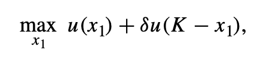
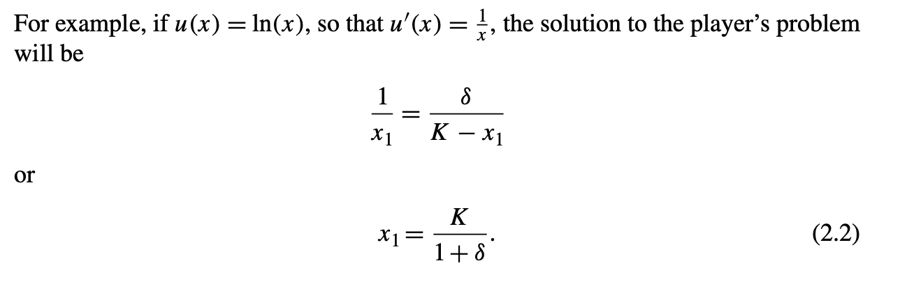
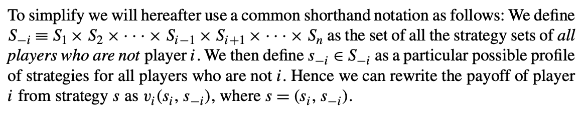
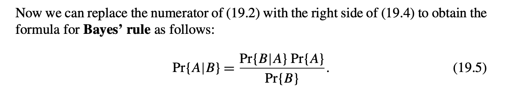
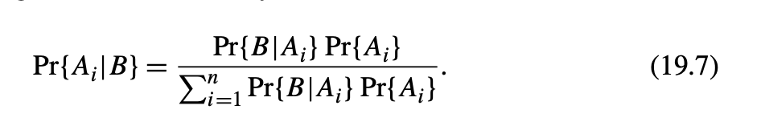

# Mathematics

## 概率论与数理统计

* [Jaccard相似度](https://zh.wikipedia.org/wiki/%E9%9B%85%E5%8D%A1%E5%B0%94%E6%8C%87%E6%95%B0)：是用于比较[样本](https://zh.wikipedia.org/wiki/样本)集的相似性与[多样性](https://zh.wikipedia.org/wiki/多样性指数)的统计量，雅卡尔系数能够量度有限样本集合的相似度，其定义为两个集合[交集](https://zh.wikipedia.org/wiki/交集)大小与[并集](https://zh.wikipedia.org/wiki/并集)大小之间的比例
  * 文本相似度

## 博弈论

### 博弈论与机器学习

* Milgrom, Paul R., and Steven Tadelis.How artificial intelligence and machine learning can impact market design. No. w24282. National Bureau of Economic Research, 2018.
* https://cloud.tencent.com/developer/article/1530214

## A Course in Game Theory - Martin J. Osborne and Ariel Rubinstein

### Chpt 1: Introduction

* Game Theory

  * The basic assumptions that underlie the theory are that decision-makers pursue well-defined exogenous objectives (they are **rational**) and take into account their knowledge or expectations of other decision-makers’ behavior (they **reason strategically**).
  * 对现实的指导
    * the theory of Nash equilibrium (Chapter 2) has been used to study oligopolistic and politi- cal competition. 
    * The theory of mixed strategy equilibrium (Chapter 3) has been used to explain the distributions of tongue length in bees and tube length in flowers. 
    * The theory of repeated games (Chapter 8) has been used to illuminate social phenomena like threats and promises. 
    * The theory of the core (Chapter 13) reveals a sense in which the outcome of trading under a price system is stable in an economy that contains many agents.

* Games and Solutions

  * Noncooperative and Cooperative Games
    * Noncooperative：Part 1、2、3； Cooperative：Part 4
  * Strategic Games and Extensive Games
    * 1； 2、3
  * Games with Perfect and Imperfect Information
    * 2；3

* Game Theory and the Theory of Competitive Equilibrium

  * competitive reasoning（经济学中的概念）只关注外部环境变量来做决策，不关注其他agent的决策

* Rational Behavior

  * A set A of actions from which the decision-maker makes a choice.
  * A set C of possible consequences of these actions.
  * A consequence function g:A → C that associates a consequence with each action.
    *  if the consequence function is **stochastic** and known to the decision-maker
      * **maximizes the expected value**
    * If not known: 引入状态空间，he is assumed to choose an action a that maximizes the expected value of **u(g(a,ω))**
  * A preference relation (a complete transitive reflexive binary relation) 􏰵 on the set C.
    * utility function

* The Steady State and Deductive Interpretations

  * **The Steady State** treats a game as a model designed to explain some regularity observed in a family of similar situations.
    * Each participant “knows” the equilibrium and tests the optimality of his behavior given this knowledge, which he has acquired from his long experience.
  * **Deductive Interpretations** treats a game in isolation, as **a “one-shot” event**, and attempts to infer the restrictions that rationality imposes on the out- come; it assumes that each player deduces how the other players will behave **simply from principles of rationality**

* Bounded Rationality

  * asymmetry between individuals in their abilities
  * Modeling asymmetries in abilities and in perceptions of a situation by different players is a fascinating challenge for future research

* Terminology and Notation

  *  increasing、nondecreasing function

  * concave

  * arg maxx∈X f (x) the set of maximizers of f

  * Throughout we use N to denote the set of players. We refer to a collection of values of some variable, one for each player, as a profile       (xi)

    * 

  * A binary relation on set的可能的性质: complete、reflexive、transitive

    * **A preference relation is a complete reflexive transitive binary relation.**

  * A preference relation的性质

    * 连续性：序列收敛

    * quasi-concave

      * 

      * 在某条线上的点的连续性
      * https://en.wikipedia.org/wiki/Quasiconvex_function
      * 

  *  Pareto efficient 和 strongly Pareto efficient 
    *  Pareto efficient：没被碾压
    * strongly Pareto efficient ：没人有任何方面对我有优势
  * **A probability measure μ** on a finite (or countable) set X is an additive function that associates a nonnegative real number with every subset of X

### Part I: Strategic Games

* strategic game = game in normal form
  * This model specifies for each player a set of possible actions and a preference ordering over the set of possible action profiles.

### Chpt 2: Nash Equilibrium

* Strategic Games
  * A strategic game is a model of interactive decision-making in which each decision-maker chooses his plan of action **once and for all,** and these **choices are made simultaneously**
  * 
  * finite/非有限
  * 分析：
    * the range of application of the model is limited by the requirement that we associate with each player a preference relation
    * 限定过于宽松，难以得出重大结论
    * a player can form his expectation of the other players’ behavior
      * A sequence of plays of the game can be modeled by a strategic game **only if there are no strategic links between the plays.**
      * The model of a repeated game discussed in Chapter 8 deals with series of strategic interactions in which such intertemporal links do exist.
  * 拓展：
    * To do so we introduce **a set C of consequences**, a function g:A → C that associates consequences with action profiles, and a profile (􏰵∗i ) of preference rela- tions over C.
    * a function g: A × Ω → C with the interpretation that g(a, ω) is the consequence when the action profile is a ∈ A and the realization of the random variable is ω ∈ Ω
      * 引入之后，**the lottery over C induced by g(a,·) is at least as good** according ...，似乎更严格了
  * payoff function
    * denote：⟨N, (Ai), (ui)⟩
    * 2 player时的矩阵表示：the convention is that the row player is player 1 and the column player is player 2

* Nash Equilibrium
  * 
  * 分析：
    * This notion captures a steady state of the play of a strategic game in which each player holds the correct expectation about the other players’ behavior and acts rationally.
    * It does not attempt to examine the process by which a steady state is reached.
  * 
  * 延伸：一种可能的求解纳什均衡的方式，N个best-response function(如果是单值)

* Examples

  * Example 15.3 (Bach or Stravinsky? (BoS))

    * 元素1在列中最大、元素2在行中最大

  * 囚徒困境

  * 鹰鸽博弈

    * 是一种Symmetric games，但只存在 asymmetric equilibria

  * Matching Pennies

    * Such a game, in which the interests of the players are diametrically opposed, is called **“strictly competitive”**. The game Matching Pennies has no Nash equilibrium.

  * Exercise 18.2 first-price auction

    * 注意lowest index的约束

  * **in a second price auction** the bid vi of any player i is a **weakly dominant action**

    * An equilibrium in which player j obtains the good is that in which b1 < vj, bj > v1, and

      bi = 0 for all players i ∈/ {1,j}.

  *  Example 18.4 (A war of attrition)

  * Example 18.6 (A location game)

    * There is no equilibrium in which all three players become candidates

* Note：

  * Every SNE is weakly Pareto-efficient https://en.wikipedia.org/wiki/Strong_Nash_equilibrium

* Existence of a Nash Equilibrium

  * 表述为 a∗ ∈ B(a∗)
  * Lemma 20.1 (Kakutani’s fixed point theorem角谷静夫不动点定理)
  * 

  * 
    * 注意不适用于有限actions集合的情况

* Strictly Competitive Games

  * 定义strictly competitive

  * for a strictly competitive game that possesses a Nash equilibrium, a pair of actions is a Nash equilibrium if and only if the action of each player is a maxminimizer

  * for strictly competitive games that possess Nash equilibria all equilibria yield the same payoffs.

  * 

    * part c提供一种场景的解法
    * by parts (a) and (c), **the Nash equilibria of a strictly competitive game are interchangeable**: if (x, y) and (x′, y′) are equilibria then so are (x, y′) and (x′, y).
    * Thus in any game (whether or not it is strictly competitive) the payoff that player 1 can guarantee herself is at most the amount that player 2 can hold her down to
      * 
      * 需要额外条件来确保存在纳什均衡

    * Part b: this payoff, the equilibrium payoff of player 1, is **the value of the game**
    * strictly competitive game中，增加payoff一定不会让value有损失；减少操作空间只可能让value有损失

* Bayesian Games: Strategic Games with Imperfect Information

  * 定义：Definition 25.1 A Bayesian game
    * We model the players’ uncertainty about each other by introducing a set Ω of possible “states of nature”, each of which is a description of all the players’ relevant characteristics. For convenience we assume that Ω is finite. Each player i has a prior belief about the state of nature given by a probability measure pi on Ω.
    * signal functions
    * 先验信号 
  * 分析：
    * player has imperfect information about the state of nature
  * 用处：
    * a state of nature is a profile of parameters of the players’ preferences (for example, profiles of their valuations of an ob- ject)
    * player is uncertain about what the others know.（section 2.6.3
  * bayesian game的纳什均衡
    * 
  * Exercise 28.1 (An exchange game）
    * in any Nash equilibrium the highest prize that either player is willing to exchange is the smallest possible prize.
  * 贝叶斯纳什均衡的习题例子：https://www.cnblogs.com/haohai9309/p/17753112.html
  * A Bayesian game can be used to model not only situations in which each player is uncertain about the other players’ payoffs, as in Exam- ple 27.1, but also situations in which each player is **uncertain about the other players’ knowledge.**
    * we can let Ω = Θ × (×i∈N Xi) be the state space and use the model of a Bayesian game to capture any situation in which players are uncertain not only about each other’s payoffs but also about each other’s beliefs.

### Chpt 3: Mixed, Correlated, and Evolutionary Equilibrium

* Mixed Strategy Nash Equilibrium

## GAME THEORY: AN INTRODUCTION - Steven Tadelis

### Intro

* Game theory provides a framework based on the construction of rigorous models that describe situations of conflict and cooperation between *rational* decision makers.

* 大家有没有比较推荐的博弈论的书？ - 子不语D的回答 - 知乎
  https://www.zhihu.com/question/446554214/answer/1751901215

* 学习博弈论，从入门、进阶到精通，如何列书单？ - 食其的回答 - 知乎
  https://www.zhihu.com/question/20266302/answer/76445562

* 官网：https://press.princeton.edu/books/hardcover/9780691129082/game-theory
* 习题：https://pup-assets.s3.amazonaws.com/public/resources/9780691129082/Tadelis-Game-Theory-Student-Solutions.pdf

### PART I: RATIONAL DECISION MAKING

### Chpt 1: The Single-Person Decision Problem

> 关于decision making的基础假设和有关推导

#### Actions, Outcomes, and Preferences

* 对 **The Decision Problem** 的定义
* Preferences
  * **preference relation**
  * **indifference relation**
* **The Completeness Axiom**： 任何outcome之间存在preference relation
* **The Transitivity Axiom**
* a preference relation that is complete and transitive is called a **rational preference relation**
* Payoff functions
  * the **profit function** 
  * payoff function <-> preference relation 
    * an *ordinal* construct
* **Proposition 1.1** If the set of  outcomes X is **finite** then any rational preference relation over X can be represented by a payoff function.
  * representation theorems: 构造payoff function
* *decision trees*
  * **decision node**、**terminal nodes**
* Note:
  * As with any theoretical framework, the value of our conclusions will be only as good as the sensibility of our assumptions.
  * group indecisiveness (P6)： it is possible to have a group of rational individual players who, when put together to make decisions as a group, will become an “irrational” group
    * 投票悖论 *Condorcet Paradox*

#### The Rational Choice Paradigm

* *Homo economicus* or “economic man.”
  * *Homo economicus* is “rational” in that he chooses actions that maximize his well-being as defined by his payoff function over the resulting outcomes.7
  * a formal definition of *Homo economicus:* a player who has rational preferences and is rational in that he understands all the aspects of his decision problem and always chooses an option that yields him the highest payoff from the set of possible actions.
* **Rational Choice Assumptions** The player fully understands the decision problem by knowing:
  *  all possible actions,A;
  * all possible outcomes,X;
  * exactly how each action affects which outcome will materialize
  * his rational preferences(payoffs) over outcomes.
* 单人决策，action和outcome是一一对应关系
* **Definition 1.2** A player facing a decision problem with a payoff function v(.) over actions is **rational** if he chooses an action a ∈ A that maximizes his payoff.

### Chpt 2: Introducing Uncertainty and Time

#### Risk, Nature, and Random Outcomes

* example：R&D project
  * no one-to-one correspondence here between actions and outcomes.
  * 用 random variables 来描述结果
* Finite Outcomes and Simple Lotteries
* **Definition 2.1** **A simple lottery** over outcomes X = {x1, x2, . . . , xn} is defined as a probability distribution p=(p(x ),p(x ),...,p(x )), where 概率和为1
* Simple versus Compound Lotteries
  * **compound lotteries**
* Lotteries over Continuous Outcomes
* **Definition 2.2**： 用CDF定义simple lottery

#### Evaluating Random Outcomes

* Expected Payoff: The Finite Case
* **Definition 2.3**： we define the player’s **expected payoff from the lottery** p
  * v(s)
* Expected Payoff: The Continuous Case
  * **Definition 2.4**
* Caveat: It’s Not Just the Order Anymore
  * the expected payoff representation involves a *cardi- nal ranking,* in which values matter just as much as order
* Risk Attitudes
  *  **risk neutral**
  * **risk averse**
  * **risk loving**
* The St. Petersburg Paradox: 无限价值的lottery硬币
  * He correctly anticipated that the value of this lottery should not be measured in its **expected monetary value**, but instead in **the monetary value of its *expected payoff.***

#### Rational Decision Making with Uncertainty

* **Definition 2.5** A player facing a decision problem with a payoff function u(.) over outcomes is rational if he chooses an action a ∈ A that maximizes his expected payoff.
* Maximizing Expected Payoffs

#### Decisions over Time

* 之前讨论的特点：has a timeless, static structure
  * Many decision problems, however, are more involved; they require some decisions to follow others, and the sequencing of the decision making is imposed by the problem at hand.
* Backward Induction
  * 例子：the fate of the R&D project is determined by Nature.
  * **dynamic programming** or **backward induction**
    * 从后往前倒退最优决策
* Discounting Future Payoffs
  * 存款：$100 × (1.02)^t in t years，反过来，未来的收益要除以系数 \delta^t
  * *discounted sum of future payoffs*

#### Applications

* The Value of Information 信息的价值
  * all-knowing oracle
  * comparing the decision problem with the added information to the decision problem without the additional information
*  Discounted Future Consumption
  * *choosing consumption over time*

* Theory versus Practice
  * Yet Amos Tversky and Daniel Kahneman (1981) have shown that “framing,” or **the way in which a problem is presented**, can affect the choices made by a decision maker.
  * preference reversals

### PART II: STATIC GAMES OF COMPLETE INFORMATION

### Chpt 3: Preliminaries

* 以大学考试为例，成绩受多位决策者影响
  * 自己的投入
  * 出题人心情
  * 同学的发挥
* *strategic environment*： 不能视其他人为噪声
  * **games.**
* 主线是引入并定义 **static games of complete information**
* **static game**
  * *Step 1:* Each player *simultaneously and independently* chooses an action.
    * 信息互不泄漏
  * *Step 2:* Conditional on the players’ choices of actions, payoffs are distributed to each player.
* **Games of Complete Information**: A **game of complete information** requires that the following four components be common knowledge among all the players of the game:
  * all the possible actions of all the players,
  * all the possible outcomes,
  * how each combination of actions of all players affects which outcome will materialize, and
  * the preferences of each and every player over outcomes.
* **Definition 3.1** An event E is **common knowledge** if (1) everyone knows E, (2) everyone knows that everyone knows E, and so on *ad infinitum.*
  * 这个定义也很微妙，因为很多情况下 *cannot be sure*
  * 帮助 *strategic reasoning*，比如角色A基于对角色B的游戏理解的belief，做决策

#### Normal-Form Games with Pure Strategies

* **strategy**： *a plan of action intended to accomplish a specific goal*
* **Definition 3.2**： A **pure strategy** for player i is a deterministic plan of action. The set of all **pure strategies** for player i is denoted Si. A **profile of pure strategies** s=(s1,s2,...,sn),si ∈Si foralli=1,2,...,n,describes a particular combination of pure strategies chosen by all n players in the game.
  * pure的含义：排除随机*stochastically*决策的角色
  * 为什么随机有利：朋友问去哪吃，我拿出硬币
  * We will introduce *stochastic* or *mixed strategies* in Chapter 6
  * strategy的含义：侧重观察其他玩家的决策
* **Definition 3.3** A **normal-form game** includes three components as follows:
  1. A finite **set of players,** N={1,2,...,n}.
  2. A **collection of sets of pure strategies,** {S1, S2, . . . , Sn}.
  3. A **set of payoff functions,** {v1, v2, . . . , vn}, each assigning a payoff value to each combination of chosen strategies, that is, a set of functions vi : S1 × S2 × . . . × Sn → R for each i ∈ N .
* Example: The Prisoner’s Dilemma
  * a static game of complete information
  * 表达成normal-form game的形式化形式
* Example: Cournot Duopoly 古诺双寡头模型
* Example: Voting on a New Agenda
  * status quo：现状

#### Matrix Representation: Two-Player Finite Game

* **Definition 3.4** A **finite game** is a game with a finite number of players, in which the number of strategies in Si is finite for all players i ∈ N .
  * 现实中常常有方法限定strategy为有限（比如场景中整数更合理）
* 矩阵表示 *bi-matrix*
  * **Rows** Each row represents one of player 1’s strategies. If there are k strategies in S1 then the matrix will have k rows.
  *  **Columns** Each column represents one of player 2’s strategies. If there are m strate- gies in S2 then the matrix will have m columns.
  * **Matrix entries** Each entry in this matrix contains a two-element vector (v1, v2), where vi is player i’s payoff when the actions of both players correspond to the row and column of that entry.

#### Solution Concepts

* 分析囚徒困境

  * The altruistic game有不同的结论

* the *Battle of the Sexes* : 较难有直接结论

* A solution concept is a method of analyzing games with the objective of restricting the set of *all possible outcomes* to those that are *more reasonable than others.*

  * 针对*no strategy* that is always best

* **equilibrium**： any one of the strategy profiles that emerges as one of the solution concept’s predictions

* Assumptions and Setup

  * rational、intelligent、common knowledge

  * **Self-enforcement:**Any prediction (or equilibrium)of a solution concept must

    be *self-enforcing.*

    * the heart of **noncooperative game theory**

* Evaluating Solution Concepts

  * **Existence：How Often Does It Apply?**
    * an ad hoc solution concept that offers the following predic- tion: “Players always choose the action that they think their opponent will choose.”
  * **Uniqueness: How Much Does It Restrict Behavior?**
    * It turns out that the nature of games makes the uniqueness requirement quite hard to meet. The reason, as we will learn to appreciate, lies in the nature of strategic interaction in a noncooperative environment.
    * 因此通常是策略组合
  * **Invariance: How Sensitive Is It to Small Changes?**
    * payoff function的微小变化不改变解

* Evaluating Outcomes

  * 标准是to improve the social outcomes of the players.
  * An outcome is considered to be **socially undesirable** if there is a different outcome that would make some people better off *without harming anyone else*
  *  turn to the criterion of ***Pareto optimality**,* which is in tune with the idea of efficiency or “no waste.” That is, we would like all the possible value deriving from a given interaction to be distributed among the players. To put this formally:

* **Definition 3.5** A strategy profile s ∈ S **Pareto dominates** strategy profile s′ ∈ S if vi(s) ≥ vi(s′)∀ i ∈ N and vi(s) > vi(s′) for at least one i ∈ N (in which case, we will also say that s′ is **Pareto dominated** by s). A strategy profile is **Pareto optimal** if it is not Pareto dominated by any other strategy profile.

  * Don’t confuse Pareto optimality with the best “symmetric” outcome that leaves all players “equally” happy
  * 囚徒困境为例，(M,M) (M,F) (F,M)是pareto最优，相反(F,F)pareto dominated by (M,M)
  * 帕累托准则强调的是资源配置的效率，而不是公平性。
  * 尽管帕累托准则告诉我们哪些结果在理论上是优越的，但在实际中，只有那些参与者愿意并能够自发遵守的策略组合才是合理的结果。

### Chpt 4: Rationality and Common Knowledge

#### Dominance in Pure Strategies

* Dominated Strategies
  * Definition 4.1: **strictly dominated**，对于个体，两个策略的关系
  * **Claim 4.1** *A rational player will never play a strictly dominated strategy.*

* Dominant Strategy Equilibrium
  * **Definition 4.2**： **strictly dominant strategy**
  * **Definition 4.3** The strategy profile sD ∈ S is a **strict dominant strategy equilibrium** if siD ∈ Si is a strict dominant strategy for all i ∈ N .
    * Prisoner’s Dilemma
  * **Proposition 4.1**：strict dominant strategy equilibrium的unique特点

* Evaluating Dominant Strategy Equilibrium
  * existence：不行
  * uniqueness：可以
  * invariance：可以
  * The failure of Pareto optimality implies that the players would benefit from modifying the environment in which they find themselves to create other enforcement mechanisms—for example, creating a “mafia” with norms of conduct that enforce implicit agreements so as to punish those who fink.
  * --> external enforcer, or institution 有助于实现pareto最优，提升资源配置效率
  * However, we need to be suspicious of whether such an institution will be *self-enforcing,* that is, whether the mafia will indeed enforce the punishments.
    * -> 引入了更多角色，贪腐的可能
    * we will explore at length when we consider multistage and repeated games in Chapters Chapters 9 and 10.
* **weak dominance**： 相比strict版本，不一定unique

### Chpt 19: Mathematical Appendix

* Sets and Sequences
  * N = {n: n > 0 is an integer}
  * For example, the set of **real numbers** R (any number that is positive, negative, or zero) has a greater cardinality than the set N.
  * set的countable属性
  * 真子集 **proper subset** 
  * **Cartesian product**
    *  if Si is the set of all possible strategies of player i and there are n players then the Cartesian product of the strategy sets is the set
  * A **partition **of a set A is a set of non-empty subsets of A, P ={A1,A2,...An}, such that every element a ∈ A is in exactly one of these subsets, Ai ∈ P 
* Functions
  * f : X → Y.     domain->codomain
    * The set of all outputs that can occur is called the **range** or **image** of the function, which is often a subset of a set of codomains
    * Ifthedomainandcodomainoff areboththe set of real numbers, R (which will often be the case in this textbook), then we call f a **real-valued function.**
    * a function is **invertible** if and only if it has two properties: (1) It is **one-to-one** (also called an injection), which has the property that if f (x) = f (z) then x = z (this means that every output is associated with only one input). (2) It is an **onto function** (also called a surjection), which has the property that for every y ∈Y there exists an x ∈X such that f(x)=y, so that every element in the codomain has an associated element in the domain.
  * Continuity
    * f到x0的极限等于f(x0)
    * linear function的 **slope**和intercept
    * **quadratic function**
      * U-shaped
      * inverse U-shaped
      * 求根公式

* Calculus and Optimization
  * An **optimum** is either a maximum or a minimum
  * Differentiation and Optimization
    * 极限、求导、极值点optimum
    * 根据二阶导判断max和min
    * A differentiable function f (x) is **concave** if its second derivative is negative for all values of x, and it is **convex**(凸) if its second derivative is positive for all values of x.
    * 凹函数/凸函数-> 极值点是最大值/最小值
      * -> 寻求 concave payoff functions，方便找最大值
  * Integration
    * **indefinite integral** 不定积分
    * **definite integral**
    * **fundamental theorem of calculus** ： F(b)-F(a)=...
    * -> computing the expected value of a continuous random variable
* Probability and Random Variables
  * **probability distribution**
    * The set of possible outcomes is typically called the **sample space** of the distribution, and if the sample space consists of real numbers it is often called the **support** of the distribution 支撑集
  * Cumulative Distribution and Density Functions
    * 离散概率分布 -> CDF是step function
    * **uniform distribution**
    * **probability density function**
  * Independence, Conditional Probability, and Bayes’ Rule
    * two events A and B are **independent** 
    * 条件概率：先验P(A) 后验P(A|B)
    * 
    * 
    * heavily used in Section 15.2 to define beliefs of players in their information sets
  * Expected Values

## Exercises in Machine Learning

https://arxiv.org/pdf/2206.13446

