# Mathematics


## 概率论与数理统计

### 正态分布

* UCB的公式是基于霍夫丁不等式（Hoeffding Inequality）推导而来的。

  * 假设有N个范围在0到1的独立有界随机变量，$$X_1, X_2, \cdots, X_N$$，那么这N个随机变量的经验期望为$$ \bar{X} = \frac{X_1 + \cdots + X_N}{N} $$
  * 满足如（式5 - 4）所示的不等式：$$ P(|\bar{X}-E[\bar{X}]| \geq \epsilon) \leq e^{-2N\epsilon^2} \quad (式5 - 4) $$

  * 那么，霍夫丁不等式和UCB的上界有什么关系呢？令 $$\epsilon = \sqrt{\frac{2\log t}{N}}$$，并代入（式5 - 4），可将霍夫丁不等式转换成如（式5 - 5）所示的形式：
    $$ P\left(|\bar{X}-E[\bar{X}]| \geq \sqrt{\frac{2\log t}{N}}\right) \leq t^{-4} \quad (式5 - 5) $$

  * 从（式5 - 5）中可以看出，如果选择UCB的上界是 $$\sqrt{\frac{2\log t}{N}}$$ 的形式，那么$$\bar{X}$$ 的均值与$$\bar{X}$$ 的实际期望值的差距在上界之外的概率非常小，小于$$t^{-4}$$，这就说明采用UCB的上界形式是严格且合理的。 --> UCB根据变量的上界进行exploration

### beta分布

* beta分布是伯努利分布的共轭先验分布
  * **共轭先验分布的概念**：根据先验分布计算后验分布，后验分布和先验分布属于同一个分布族
  * 应用：Thompson sampling

### 聚类 & 相似度

* Silhouette coefficient（轮廓系数）是一种用于评估聚类效果的指标，它综合考虑了聚类的紧密性和分离性，能有效衡量一个样本与其所属聚类以及相邻聚类之间的关系，其具体信息如下：
  * **定义与计算方式**    - 对于样本 $$i$$，设 $$a(i)$$ 为样本 $$i$$ 到其所属聚类 $$C$$ 中其他样本的平均距离，反映了样本在其所属聚类内的紧密程度。计算方式为 $$a(i)=\frac{1}{|C|-1}\sum_{j\in C,j\neq i}d(i,j)$$，其中 $$d(i,j)$$ 是样本 $$i$$ 和 $$j$$ 之间的距离度量（如欧几里得距离），$$|C|$$ 是聚类 $$C$$ 中的样本数量。    - 设 $$b(i)$$ 为样本 $$i$$ 到与其相邻最近聚类 $$C'$$ 中所有样本的平均距离，衡量了样本与其他聚类的分离程度。通过计算样本 $$i$$ 到所有其他聚类的平均距离，并取最小值作为 $$b(i)$$。    - 样本 $$i$$ 的轮廓系数 $$s(i)$$ 计算公式为 $$s(i)=\frac{b(i)-a(i)}{\max\{a(i),b(i)\}}$$，其取值范围在 $$[-1,1]$$ 之间。_
  * _ - **取值意义**    - 当 $$s(i)$$ 接近 1 时，表示样本 $$i$$ 与所属聚类内的样本距离较近，且与相邻聚类的样本距离较远，说明聚类效果较好，样本被合理地划分到了当前聚类中。    - 当 $$s(i)$$ 接近 0 时，表明样本 $$i$$ 处于两个聚类的边界附近，其所属聚类可能不太明确，聚类效果有待提高。    - 当 $$s(i)$$ 接近 -1 时，意味着样本 $$i$$ 可能被错误地划分到了当前聚类，它与相邻聚类的样本更为相似，聚类效果较差。 
  * - **整体评估**：通常会计算数据集中所有样本的轮廓系数，并取平均值作为整个数据集的轮廓系数。该平均值越高，说明聚类的整体质量越好；反之，则表示聚类效果不佳，可能需要调整聚类算法的参数或尝试其他聚类方法。例如，在一个包含 $$n$$ 个样本的数据集上，整体轮廓系数 $$S=\frac{1}{n}\sum_{i = 1}^{n}s(i)$$。 

* [Jaccard相似度](https://zh.wikipedia.org/wiki/%E9%9B%85%E5%8D%A1%E5%B0%94%E6%8C%87%E6%95%B0)：是用于比较[样本](https://zh.wikipedia.org/wiki/样本)集的相似性与[多样性](https://zh.wikipedia.org/wiki/多样性指数)的统计量，雅卡尔系数能够量度有限样本集合的相似度，其定义为两个集合[交集](https://zh.wikipedia.org/wiki/交集)大小与[并集](https://zh.wikipedia.org/wiki/并集)大小之间的比例
  * 文本相似度
* KL散度
  * $$D_{KL}(P||Q)=\sum_{i}P(i)\log\frac{P(i)}{Q(i)}$$
    * 衡量的是用分布Q来近似分布P时所损失的信息,有向的度量
  

## 博弈论

### 博弈论与机器学习

* Milgrom, Paul R., and Steven Tadelis.How artificial intelligence and machine learning can impact market design. No. w24282. National Bureau of Economic Research, 2018.
* https://cloud.tencent.com/developer/article/1530214


## A Course in Game Theory - Martin J. Osborne and Ariel Rubinstein

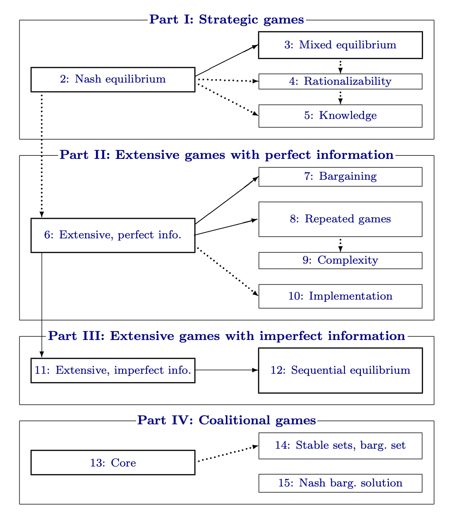

### Chpt 1: Introduction

* Game Theory

  * The basic assumptions that underlie the theory are that decision-makers pursue well-defined exogenous objectives (they are **rational**) and take into account their knowledge or expectations of other decision-makers’ behavior (they **reason strategically**).
  * 对现实的指导
    * the theory of Nash equilibrium (Chapter 2) has been used to study oligopolistic and politi- cal competition. 
    * The theory of mixed strategy equilibrium (Chapter 3) has been used to explain the distributions of tongue length in bees and tube length in flowers. 
    * The theory of repeated games (Chapter 8) has been used to illuminate social phenomena like threats and promises. 
    * The theory of the core (Chapter 13) reveals a sense in which the outcome of trading under a price system is stable in an economy that contains many agents.

* Games and Solutions

  * Noncooperative and Cooperative Games
    * Noncooperative：Part 1、2、3； Cooperative：Part 4
  * Strategic Games and Extensive Games
    * 1； 2、3
  * Games with Perfect and Imperfect Information
    * 2；3

* Game Theory and the Theory of Competitive Equilibrium

  * competitive reasoning（经济学中的概念）只关注外部环境变量来做决策，不关注其他agent的决策

* Rational Behavior

  * A set A of actions from which the decision-maker makes a choice.
  * A set C of possible consequences of these actions.
  * A consequence function g:A → C that associates a consequence with each action.
    *  if the consequence function is **stochastic** and known to the decision-maker
      * **maximizes the expected value**
    * If not known: 引入状态空间，he is assumed to choose an action a that maximizes the expected value of **u(g(a,ω))**
  * A preference relation (a complete transitive reflexive binary relation) 􏰵 on the set C.
    * utility function

* The Steady State and Deductive Interpretations

  * **The Steady State** treats a game as a model designed to explain some regularity observed in a family of similar situations.
    * Each participant “knows” the equilibrium and tests the optimality of his behavior given this knowledge, which he has acquired from his long experience.
  * **Deductive Interpretations** treats a game in isolation, as **a “one-shot” event**, and attempts to infer the restrictions that rationality imposes on the out- come; it assumes that each player deduces how the other players will behave **simply from principles of rationality**

* Bounded Rationality

  * asymmetry between individuals in their abilities
  * Modeling asymmetries in abilities and in perceptions of a situation by different players is a fascinating challenge for future research

* Terminology and Notation

  *  increasing、nondecreasing function

  * concave

  * arg maxx∈X f (x) the set of maximizers of f

  * Throughout we use N to denote the set of players. We refer to a collection of values of some variable, one for each player, as a profile       (xi)

    * 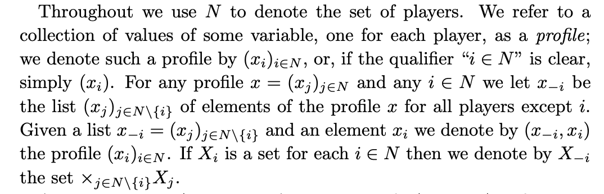

  * A binary relation on set的可能的性质: complete、reflexive、transitive

    * **A preference relation is a complete reflexive transitive binary relation.**

  * A preference relation的性质

    * 连续性：序列收敛

    * quasi-concave

      * 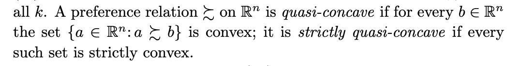

      * 在某条线上的点的连续性
      * https://en.wikipedia.org/wiki/Quasiconvex_function
      * 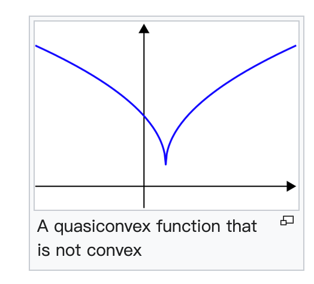

  *  Pareto efficient 和 strongly Pareto efficient 
    *  Pareto efficient：没被碾压
    * strongly Pareto efficient ：没人有任何方面对我有优势
  * **A probability measure μ** on a finite (or countable) set X is an additive function that associates a nonnegative real number with every subset of X

### Part I: Strategic Games

* strategic game = game in normal form
  * This model specifies for each player a set of possible actions and a preference ordering over the set of possible action profiles.

### Chpt 2: Nash Equilibrium

* Strategic Games
  * A strategic game is a model of interactive decision-making in which each decision-maker chooses his plan of action **once and for all,** and these **choices are made simultaneously**
  * 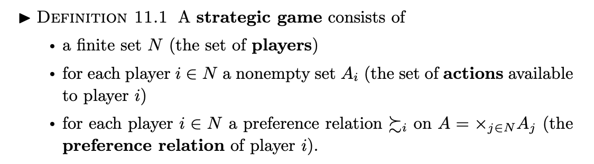
  * finite/非有限
  * 分析：
    * the range of application of the model is limited by the requirement that we associate with each player a preference relation
    * 限定过于宽松，难以得出重大结论
    * a player can form his expectation of the other players’ behavior
      * A sequence of plays of the game can be modeled by a strategic game **only if there are no strategic links between the plays.**
      * The model of a repeated game discussed in Chapter 8 deals with series of strategic interactions in which such intertemporal links do exist.
  * 拓展：
    * To do so we introduce **a set C of consequences**, a function g:A → C that associates consequences with action profiles, and a profile (􏰵∗i ) of preference rela- tions over C.
    * a function g: A × Ω → C with the interpretation that g(a, ω) is the consequence when the action profile is a ∈ A and the realization of the random variable is ω ∈ Ω
      * 引入之后，**the lottery over C induced by g(a,·) is at least as good** according ...，似乎更严格了
  * payoff function
    * denote：⟨N, (Ai), (ui)⟩
    * 2 player时的矩阵表示：the convention is that the row player is player 1 and the column player is player 2

* Nash Equilibrium
  * 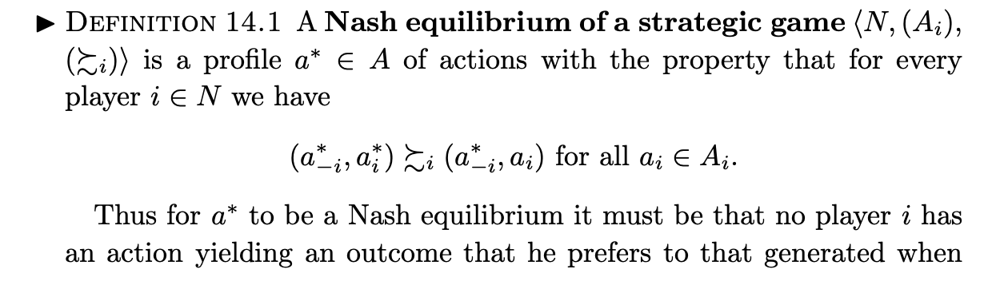
  * 分析：
    * This notion captures a steady state of the play of a strategic game in which each player holds the correct expectation about the other players’ behavior and acts rationally.
    * It does not attempt to examine the process by which a steady state is reached.
  * 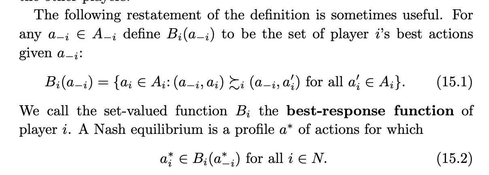
  * 延伸：一种可能的求解纳什均衡的方式，N个best-response function(如果是单值)

* Examples

  * Example 15.3 (Bach or Stravinsky? (BoS))

    * 元素1在列中最大、元素2在行中最大

  * 囚徒困境

  * 鹰鸽博弈

    * 是一种Symmetric games，但只存在 asymmetric equilibria

  * Matching Pennies

    * Such a game, in which the interests of the players are diametrically opposed, is called **“strictly competitive”**. The game Matching Pennies has no Nash equilibrium.

  * Exercise 18.2 first-price auction

    * 注意lowest index的约束

  * **in a second price auction** the bid vi of any player i is a **weakly dominant action**

    * An equilibrium in which player j obtains the good is that in which b1 < vj, bj > v1, and

      bi = 0 for all players i ∈/ {1,j}.

  *  Example 18.4 (A war of attrition)

  * Example 18.6 (A location game)

    * There is no equilibrium in which all three players become candidates

* Note：

  * Every SNE is weakly Pareto-efficient https://en.wikipedia.org/wiki/Strong_Nash_equilibrium

* Existence of a Nash Equilibrium

  * 表述为 a∗ ∈ B(a∗)
  * Lemma 20.1 (Kakutani’s fixed point theorem角谷静夫不动点定理)
  * 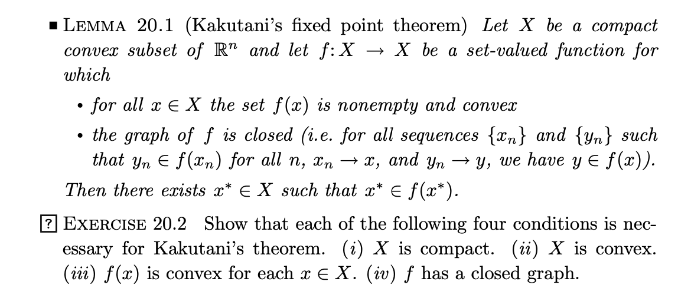

  * 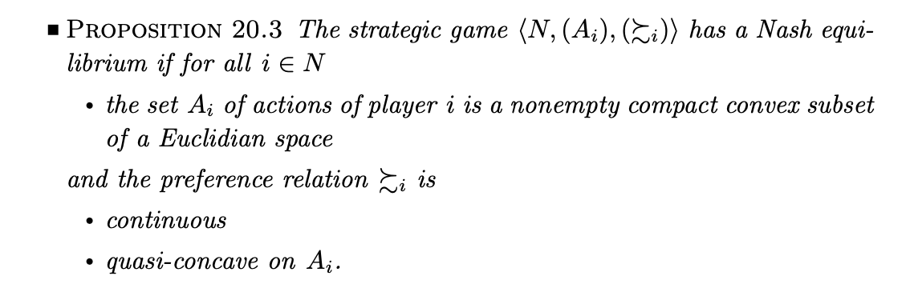
    * 注意不适用于有限actions集合的情况

* Strictly Competitive Games

  * 定义strictly competitive

  * for a strictly competitive game that possesses a Nash equilibrium, a pair of actions is a Nash equilibrium if and only if the action of each player is a maxminimizer

  * for strictly competitive games that possess Nash equilibria all equilibria yield the same payoffs.

  * 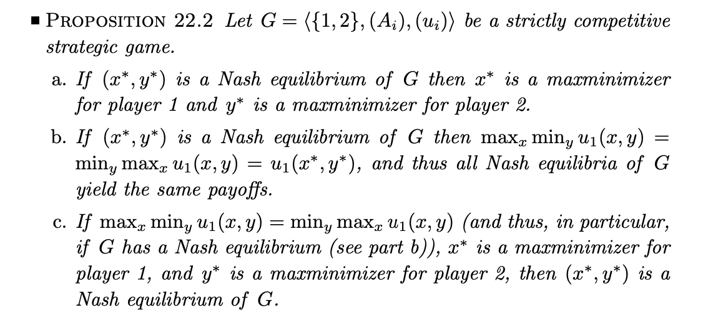

    * part c提供一种场景的解法
    * by parts (a) and (c), **the Nash equilibria of a strictly competitive game are interchangeable**: if (x, y) and (x′, y′) are equilibria then so are (x, y′) and (x′, y).
    * Thus in any game (whether or not it is strictly competitive) the payoff that player 1 can guarantee herself is at most the amount that player 2 can hold her down to
      * 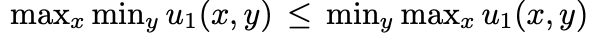
      * 需要额外条件来确保存在纳什均衡

    * Part b: this payoff, the equilibrium payoff of player 1, is **the value of the game**
    * strictly competitive game中，增加payoff一定不会让value有损失；减少操作空间只可能让value有损失

* Bayesian Games: Strategic Games with Imperfect Information

  * 定义：Definition 25.1 A Bayesian game
    * We model the players’ uncertainty about each other by introducing a set Ω of possible “states of nature”, each of which is a description of all the players’ relevant characteristics. For convenience we assume that Ω is finite. Each player i has a prior belief about the state of nature given by a probability measure pi on Ω.
    * signal functions
    * 先验信号 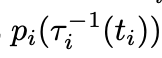
  * 分析：
    * player has imperfect information about the state of nature
  * 用处：
    * a state of nature is a profile of parameters of the players’ preferences (for example, profiles of their valuations of an ob- ject)
    * player is uncertain about what the others know.（section 2.6.3
  * bayesian game的纳什均衡
    * 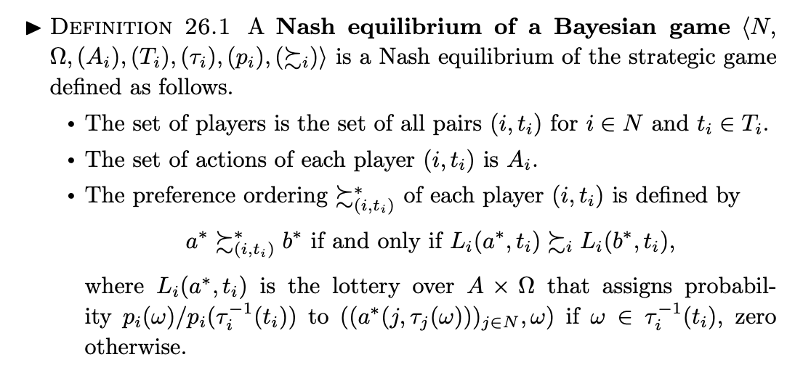
  * Exercise 28.1 (An exchange game）
    * in any Nash equilibrium the highest prize that either player is willing to exchange is the smallest possible prize.
  * 贝叶斯纳什均衡的习题例子：https://www.cnblogs.com/haohai9309/p/17753112.html
  * A Bayesian game can be used to model not only situations in which each player is uncertain about the other players’ payoffs, as in Exam- ple 27.1, but also situations in which each player is **uncertain about the other players’ knowledge.**
    * we can let Ω = Θ × (×i∈N Xi) be the state space and use the model of a Bayesian game to capture any situation in which players are uncertain not only about each other’s payoffs but also about each other’s beliefs.

### Chpt 3: Mixed, Correlated, and Evolutionary Equilibrium

* Mixed Strategy Nash Equilibrium


### Intro

* Game theory provides a framework based on the construction of rigorous models that describe situations of conflict and cooperation between *rational* decision makers.
* 大家有没有比较推荐的博弈论的书？ - 子不语D的回答 - 知乎
  https://www.zhihu.com/question/446554214/answer/1751901215
* 学习博弈论，从入门、进阶到精通，如何列书单？ - 食其的回答 - 知乎
  https://www.zhihu.com/question/20266302/answer/76445562

## ML Theory

* 神经网络扰动
  * [Hessian-based Analysis of Large Batch Training and Robustness to Adversaries](https://arxiv.org/pdf/1802.08241) 分析了Hessian特征值和神经网络扰动的关系
    * Q-Bert 计算最大特征值：通过两次反向传播计算Hv，[幂迭代法 Power Iteration](https://en.wikipedia.org/wiki/Power_iteration)
    * [Training Deep and Recurrent Networks with Hessian-Free Optimization](https://www.cs.toronto.edu/~jmartens/docs/HF_book_chapter.pdf) 完整综述
  * 应用：量化分析，Q-Bert
* 2024 诺贝尔物理学奖授予人工神经网络机器学习，为什么会颁给 AI 领域？ - SIY.Z的回答 - 知乎
  https://www.zhihu.com/question/777943030/answer/4508673022
  * RBM 受限玻尔兹曼机
  * sigmoid 函数有了自然的解释：玻尔兹曼分布下隐含层神经元激活的条件概率的激活函数。
* 大模型是不是能够稀疏化? 
  * 从物理和能量密度/信息密度的角度来看, 似乎是可以的. 
  * 但是从范畴论的角度, 特别是预层范畴的角度来看待,Dense的Foundation Model训练是必须要做的, 因为只有在相对Dense的模型结构上才能更好的捕获所有的态射. 

* TOPOS理论 在ML的应用
  * on the diagram of thought https://github.com/diagram-of-thought/diagram-of-thought


## Exercises in Machine Learning

https://arxiv.org/pdf/2206.13446

### Backpropagating计算

https://web.eecs.umich.edu/~justincj/teaching/eecs442/notes/linear-backprop.html

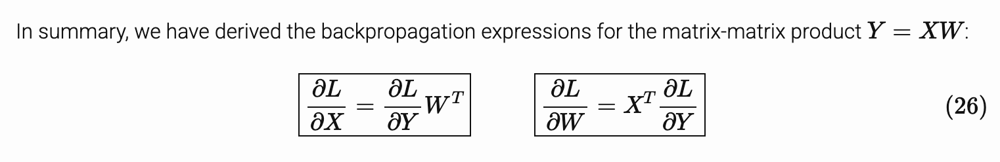

## 线性代数

*  $$E_{S}=E_CE_U$$    -> $$e_s^x={E_U}^Te_c^x$$
* 最小二乘法：
  * 考虑线性方程组 $$Ax = b$$，当该方程组无解（即 $$b$$ 不在 $$A$$ 的列空间中）时，我们希望找到一个 $$\hat{x}$$ 使得 $$\|Ax - b\|^2$$ 最小。
  * 此时，$$\hat{x}=(A^TA)^{-1}A^Tb$$，$$A\hat{x}=A(A^TA)^{-1}A^Tb$$
  * 即 $$A\hat{x}$$ 是 $$b$$ 在 $$A$$ 的列空间上的投影，$$A\hat{x}$$ 与 $$b$$ 的误差在所有可能的 $$Ax$$ 中是最小的。 

* $$E_U^T E_U=\left(U_1,U_2,U_3, ... U_u\right)\left(\begin{array}{c}{U_1}^T\\{U_2}^T\\{U_3}^T\\...\\{U_u}^T\end{array}\right) = \sum_{i=1}^uU_i{U_i}^T$$

### 特征值

* 特征值求解
  * [幂迭代法 Power Iteration](https://en.wikipedia.org/wiki/Power_iteration) 求解最大特征值
  * QR算法

### matrix vector derivatives for machine learning

> matrix vector derivatives for machine learning.pdf

### Cholesky decomposition

https://en.wikipedia.org/wiki/Cholesky_decomposition

* 分解 a [Hermitian](https://en.wikipedia.org/wiki/Hermitian_matrix) [positive-definite matrix](https://en.wikipedia.org/wiki/Positive-definite_matrix) A
* e.g.
  * 解方程：提升数值计算稳定性
  * non linear optimization
    * GPTQ

## SVD、矩阵分解

### Application

* [矩阵分解在协同过滤推荐算法中的应用 ](https://www.cnblogs.com/pinard/p/6351319.html)

  * SVD，计算量大
    * 稀疏SVD
      * 平均值补全
      * 随机投影或Lanczos迭代

  * FunkSVD
    * 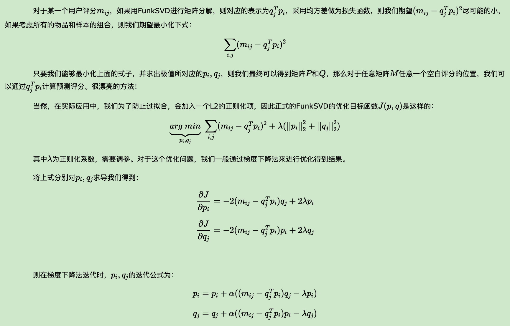

  * BiasSVD
    * 考虑 评分系统平均分μ,第i个用户的用户偏置项,第j个物品的物品偏置项
  * SVD++算法在BiasSVD算法上进一步做了增强，这里它增加考虑用户的隐式反馈
    * 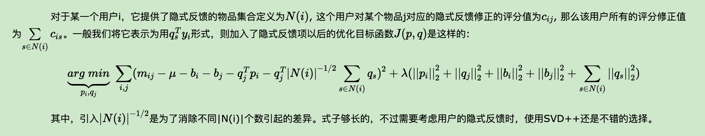

* 文档矩阵、主题模型
  *  Aij表示第 i 个文档中第 j 个词的出现情况
    * 词频/ TF-IDF

### Theory

* 求解SVD
  * $$A = U\Sigma V^T \Rightarrow A^T = V\Sigma U^T \Rightarrow A^T A = V\Sigma U^T U\Sigma V^T = V\Sigma^2 V^T$$

* [SVD分解(一)：自编码器与人工智能](https://spaces.ac.cn/archives/4208) —— 苏剑林

  * **不带激活函数的三层自编码器，跟传统的SVD分解是等价的。**
    * 我们降维，并不是纯粹地为了减少储存量或者减少计算量，而是**“智能”的初步体现**

  * SVD
    * (m+n)k < mn
  * 自编码器
    * 无视激活函数，只看线性结构。自编码器是希望训练一个f(x)=x的恒等函数，但是中间层节点做了压缩
    * 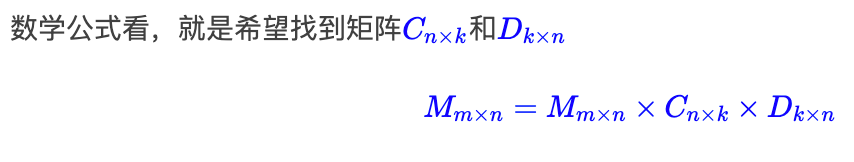

  * 压缩即智能

    * 通过压缩后进行重建，能够挖掘数据的共性，即我们所说的规律，然后得到更泛化的结果
    * 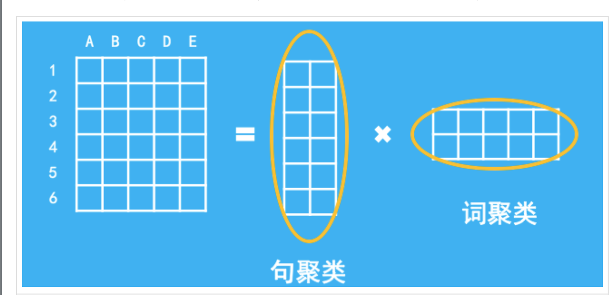

    * 我们通过SVD分解，原始的目的可能是压缩、降维，但复原后反而衍生出了更丰富、词汇量更多的结果。

    * ```
      将结巴分词的词表中所有频数不小于100的二字词选出来，然后以第一字为行，第二字为列，频数为值（没有这个词就默认记为0），得到一个矩阵。对这个矩阵做SVD分解，得到两个矩阵，然后把这两个矩阵乘起来（复原），把复原后的矩阵当作新的频数，然后对比原始矩阵，看看多出了哪些频数较高的词语。
      ```

  * 激活函数在这里的物理意义

    * 是对无关紧要元素的一种舍弃（截断），这种操作，我们在很久之前的统计就已经用到了（扔掉负数、扔掉小统计结果等）。
    * 当然，在神经网络中，激活函数有更深刻的意义，但在浅层的网络（矩阵分解）中，它给我们的直观感受，就是截断罢了。

* SVD的聚类含义
  * https://spaces.ac.cn/archives/4216
  * 转化为三个矩阵相乘
  * 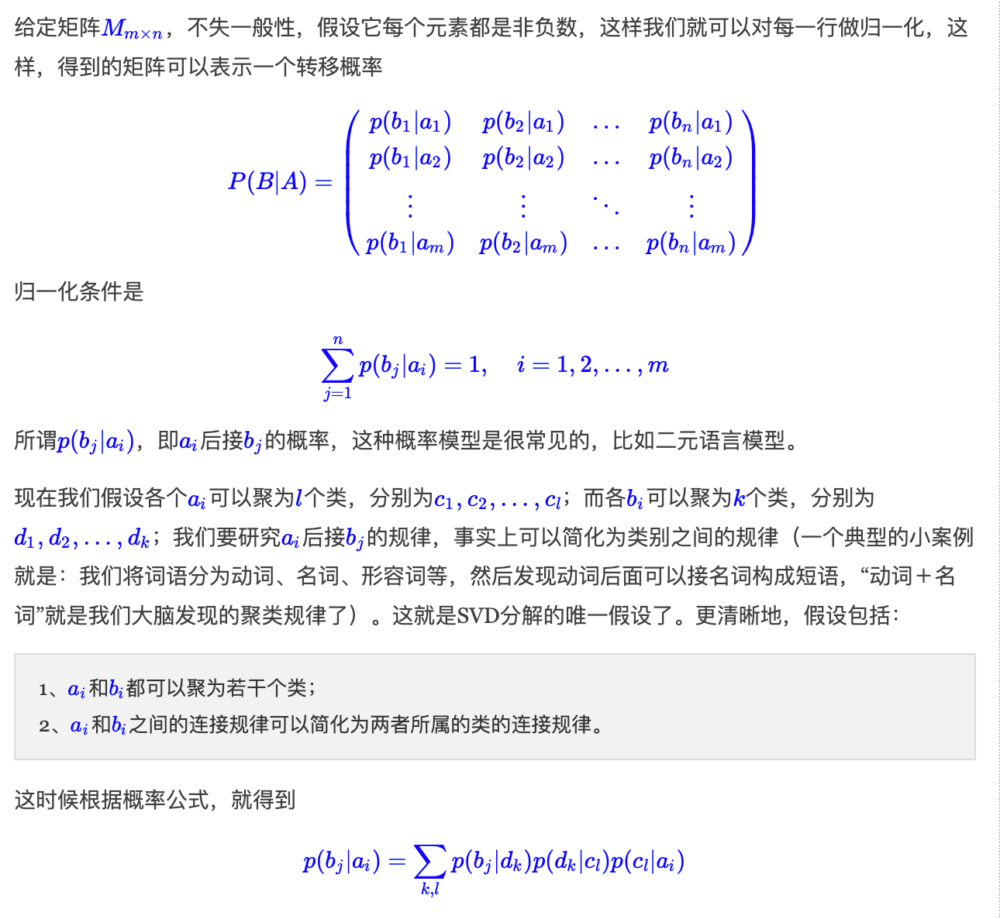

* word2vec是SVD

  * https://spaces.ac.cn/archives/4233

  * 词向量Embedding层 = one hot的全连接层

  * 在做情感分类问题时，如果有了词向量，想要得到句向量，最简单的一个方案就是直接对句子中的词语的词向量求和或者求平均，这约能达到85%的准确率。

    * FastText，多引入了ngram特征，来缓解词序问题，但总的来说，依旧是把特征向量求平均来得到句向量
    * 本质上是 **词袋模型**

  * word embedding和SVD的联系

    * distributed representation，即分布式表示，N维embedding
      * 设想开一个窗口（前后若干个词加上当前词，作为一个窗口），然后统计当前词的前后若干个词的分布情况，就用这个分布情况来表示当前词，而这个分布也可以用相应的NN维的向量来表示
    * SVD将distributed representation降维到k维
    * Word2Vec的一个CBOW （continuous bag-of-words）方案是，将前后若干个词的词向量求和，然后接一个NN维的全连接层，并做一个softmax来预测当前词的概率

  * word2vec和svd的区别

    * 1、Word2Vec的这种方案，可以看作是通过前后词来预测当前词，而自编码器或者SVD则是通过前后词来预测前后词；

      2、Word2Vec最后接的是softmax来预测概率，也就是说实现了一个非线性变换，而自编码器或者SVD并没有。

## 微分方程 ODE

### 基础技巧

* [用特征线方法与傅里叶变换求解偏微分方程](https://www.bilibili.com/video/BV16JFTeVEGj)

### 应用

* [玻色爱因斯坦凝聚与Boltzmann-Nordheim方程](https://www.bilibili.com/video/BV1YwNHeSEbp)
  * 利用测试函数，求弱解


## 数学在工科的应用

* [为什么这么多年直到马斯克出来才想到做可复用火箭？](https://www.zhihu.com/question/597238433/answer/3080541702)
  * 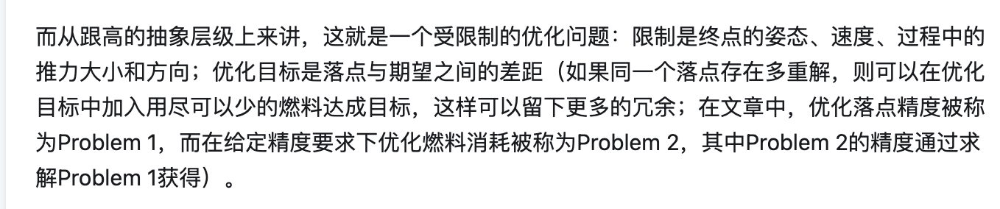

