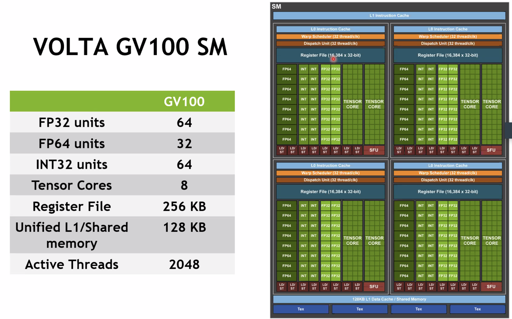
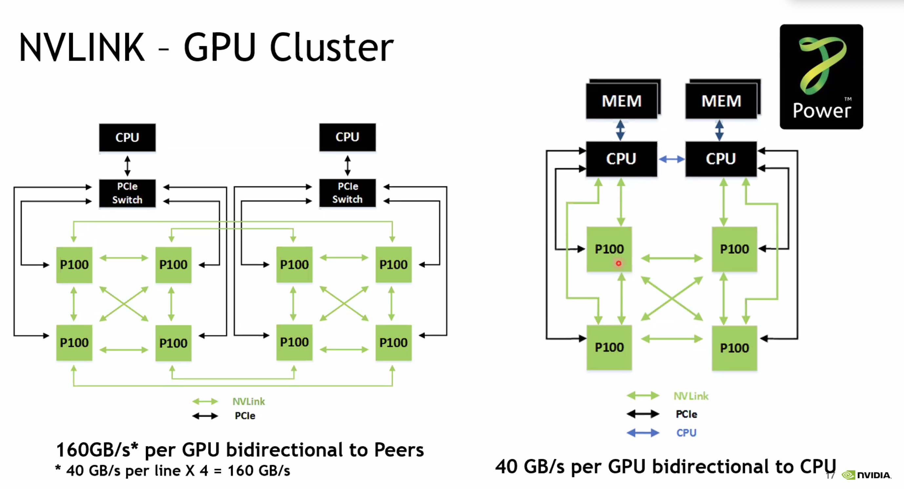
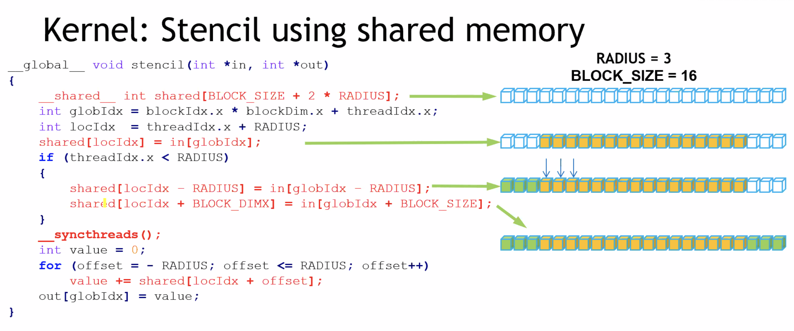

[toc]

[Cuda-Downloads](https://developer.nvidia.com/cuda-downloads)

[Cuda-C-Best-Practices](https://docs.nvidia.com/cuda/cuda-c-best-practices-guide/index.html#who-should-read-this-guide)


3 ways to accelerate applications:

1.Libraries    

2.OpenACC    		加directive，HPC工程

3.Programming Languages


CPU: latency-optimized low latency processor

GPU: throughput-optimized high throughput processor


#### 1.Accelerating Applications with CUDA C/C++

[课程网页](https://courses.nvidia.com/courses/course-v1:DLI+C-AC-01+V1/courseware/85f2a3ac16a0476685257996b84001ad/9ef2f68fb10d40c5b54b783392938d04/?activate_block_id=block-v1%3ADLI%2BC-AC-01%2BV1%2Btype%40sequential%2Bblock%409ef2f68fb10d40c5b54b783392938d04)

##### Writing Application Code for the GPU

 CUDA accelerates applications drastically with little effort, has an ecosystem of highly optimized libraries for [DNN](https://developer.nvidia.com/cudnn), [BLAS](https://developer.nvidia.com/cublas), [graph analytics](https://developer.nvidia.com/nvgraph), [FFT](https://developer.nvidia.com/cufft), and more, and also ships with powerful [command line](http://docs.nvidia.com/cuda/profiler-users-guide/index.html#nvprof-overview) and [visual profilers](http://docs.nvidia.com/cuda/profiler-users-guide/index.html#visual).

CUDA supports many, if not most, of the [world's most performant applications](https://www.nvidia.com/en-us/data-center/gpu-accelerated-applications/catalog/?product_category_id=58,59,60,293,98,172,223,227,228,265,487,488,114,389,220,258,461&search=) in, [Computational Fluid Dynamics](https://www.nvidia.com/en-us/data-center/gpu-accelerated-applications/catalog/?product_category_id=10,12,16,17,19,51,53,71,87,121,124,156,157,195,202,203,204,312,339,340,395,407,448,485,517,528,529,541,245,216,104,462,513,250,492,420,429,490,10,12,16,17,19,51,53,71,87,121,124,156,157,195,202,203,204,312,339,340,395,407,448,485,517,528,529,541,245,216,104,462,513,250,492,420,429,490,10,12,16,17,19,51,53,71,87,121,124,156,157,195,202,203,204,312,339,340,395,407,448,485,517,528,529,541,245,216,104,462,513,250,492,420,429,490&search=), [Molecular Dynamics](https://www.nvidia.com/en-us/data-center/gpu-accelerated-applications/catalog/?product_category_id=8,57,92,123,211,213,237,272,274,282,283,307,325,337,344,345,351,362,365,380,396,398,400,435,507,508,519,8,57,92,123,211,213,237,272,274,282,283,307,325,337,344,345,351,362,365,380,396,398,400,435,507,508,519,8,57,92,123,211,213,237,272,274,282,283,307,325,337,344,345,351,362,365,380,396,398,400,435,507,508,519,8,57,92,123,211,213,237,272,274,282,283,307,325,337,344,345,351,362,365,380,396,398,400,435,507,508,519&search=), [Quantum Chemistry](https://www.nvidia.com/en-us/data-center/gpu-accelerated-applications/catalog/?product_category_id=8,57,92,123,211,213,237,272,274,282,283,307,325,337,344,345,351,362,365,380,396,398,400,435,507,508,519,8,57,92,123,211,213,237,272,274,282,283,307,325,337,344,345,351,362,365,380,396,398,400,435,507,508,519&search=), [Physics](https://www.nvidia.com/en-us/data-center/gpu-accelerated-applications/catalog/?product_category_id=6,24,116,118,119,135,229,231,372,373,392,393,489,493,494,495,496,497,498,67,170,216,281,6,24,116,118,119,135,229,231,372,373,392,393,489,493,494,495,496,497,498,67,170,216,281,6,24,116,118,119,135,229,231,372,373,392,393,489,493,494,495,496,497,498,67,170,216,281,6,24,116,118,119,135,229,231,372,373,392,393,489,493,494,495,496,497,498,67,170,216,281,6,24,116,118,119,135,229,231,372,373,392,393,489,493,494,495,496,497,498,67,170,216,281&search=) and HPC.

```c++
nvidia-smi
cudaMallocManaged()
cudaDeviceSynchronize()
  
nvcc -arch=sm_70 -o hello-gpu 01-hello/01-hello-gpu.cu -run
```

code executed on the CPU is referred to as **host** code, and code running on the GPU is referred to as **device** code

```c++
void CPUFunction()
{
  printf("This function is defined to run on the CPU.\n");
}

__global__ void GPUFunction()
{
  printf("This function is defined to run on the GPU.\n");
}
// __global__表示CPU/GPU均可执行，必须返回void

int main()
{
  CPUFunction();
	// launch a kernel, provide an execution configuration
  GPUFunction<<<1, 1>>>();
  cudaDeviceSynchronize();
  // CPU等待GPU
}
```

At a high level, execution configuration allows programmers to specify the **thread hierarchy** for a kernel launch, which defines the number of thread groupings (called **blocks**), as well as how many **threads** to execute in each block.

[**NVIDIA CUDA Compiler**](http://docs.nvidia.com/cuda/cuda-compiler-driver-nvcc/index.html), [documentation](http://docs.nvidia.com/cuda/cuda-compiler-driver-nvcc/index.html)

[`arch` flag](http://docs.nvidia.com/cuda/cuda-compiler-driver-nvcc/index.html#options-for-steering-gpu-code-generation), [virtual architecture features](http://docs.nvidia.com/cuda/cuda-compiler-driver-nvcc/index.html#gpu-feature-list) 


##### CUDA Thread Hierarchy

三层抽象：grid, block, thread
* kernel execution configuration ~ grid

CUDA-Provided Thread Hierarchy Variables，可以在`__global__`函数里直接用，作为标识来实现并行
* 并行是无序的
* `threadIdx.x + blockIdx.x * blockDim.x`

```c++
gridDim.x: num of blocks
blockDim.x: num of threads in a block
blockIdx.x: block index
threadIdx.x: thread index
```

如果不同的线程在不同的Warp里，他们的执行顺序会有所不同（但如果执行的操作非常简单，那么它们执行的先后时间也相差非常小），因为硬件（SM）是以Warp为单位调度线程运行的，每个Warp有32个线程

##### Allocating Memory to be accessed on the GPU and the CPU
```c++
// CPU-only

int N = 2<<20;
size_t size = N * sizeof(int);

int *a;
a = (int *)malloc(size);

// Use `a` in CPU-only program.

free(a);
// Accelerated

int N = 2<<20;
size_t size = N * sizeof(int);

int *a;
// Note the address of `a` is passed as first argument.
cudaMallocManaged(&a, size);

// Use `a` on the CPU and/or on any GPU in the accelerated system.

cudaFree(a);
```

 这个地址在统一的内存空间里，GPU和CPU都可以使用，但物理上数据可以不在它被访问的设备里，这时会产生page fault（缺页错误），对这个错误的处理就是把数据拷贝到需要访问它的设备或主机内存里，这个操作是透明的（自动执行）。

https://on-demand.gputechconf.com/gtc/2018/presentation/s8430-everything-you-need-to-know-about-unified-memory.pdf
https://developer.nvidia.com/blog/unified-memory-cuda-beginners/


##### Grid Size Work 

Amount Mismatch
`size_t number_of_blocks = (N + threads_per_block - 1) / threads_per_block;`

* threads_per_bloack最大为1024

Grid-Stride Loops

```cpp
__global__ void kernel(int *a, int N)
{
  int indexWithinTheGrid = threadIdx.x + blockIdx.x * blockDim.x;
  int gridStride = gridDim.x * blockDim.x;

  for (int i = indexWithinTheGrid; i < N; i += gridStride)
  {
    // do work on a[i];
  }
}
```

##### Error Handling

```c++
cudaError_t err;
err = cudaMallocManaged(&a, N)                    // Assume the existence of `a` and `N`.

if (err != cudaSuccess)                           // `cudaSuccess` is provided by CUDA.
{
  printf("Error: %s\n", cudaGetErrorString(err)); // `cudaGetErrorString` is provided by CUDA.
}

someKernel<<<1, -1>>>();  // -1 is not a valid number of threads.

cudaError_t err;
err = cudaGetLastError(); // `cudaGetLastError` will return the error from above.
if (err != cudaSuccess)
{
  printf("Error: %s\n", cudaGetErrorString(err));
}
```

```c++
#include <stdio.h>
#include <assert.h>

inline cudaError_t checkCuda(cudaError_t result)
{
  if (result != cudaSuccess) {
    fprintf(stderr, "CUDA Runtime Error: %s\n", cudaGetErrorString(result));
    assert(result == cudaSuccess);
  }
  return result;
}

int main()
{

/*
 * The macro can be wrapped around any function returning
 * a value of type `cudaError_t`.
 */

  checkCuda( cudaDeviceSynchronize() )
}
```


利用dim3完成2d、3d任务

```c++
dim3 threads_per_block(16, 16, 1);
dim3 number_of_blocks(16, 16, 1);
someKernel<<<number_of_blocks, threads_per_block>>>()
```

##### Environments and Projects

https://github.com/NVIDIA/nvidia-docker

GPU加速[Mandelbrot Set Simulator](https://github.com/sol-prog/Mandelbrot_set)

Peruse [*GPU-Accelerated Libraries for Computing*](https://developer.nvidia.com/gpu-accelerated-libraries) to learn where you can use highly optimized CUDA libraries for tasks like [basic linear algebra solvers](https://developer.nvidia.com/cublas) (BLAS), [graph analytics](https://developer.nvidia.com/nvgraph), [fast fourier transforms](https://developer.nvidia.com/cufft) (FFT), [random number generation](https://developer.nvidia.com/curand) (RNG), and [image and signal processing](https://developer.nvidia.com/npp), to name a few.

#### 2.Managing Accelerated Application Memory with CUDA Unified Memory and nsys

Assess, Parallelize, Optimize, Deploy(APOD) design cycle

##### Iterative Optimizations with the NVIDIA Command Line Profiler

Profile configuration details, Report file(s) generation details, CUDA API Statistics, CUDA Kernel Statistics, CUDA Memory Operation Statistics (time and size), OS Runtime API Statistics

```shell
nvcc -o single-thread-vector-add 01-vector-add/01-vector-add.cu -run
nsys profile --stats=true ./single-thread-vector-add
```

##### Streaming Multiprocessors and Querying the Device

GPU内部很多functional units: SMs(Streaming Multiprocessors)，一个SM可以schedule多个block，但同一时间只能执行一个

* A set of CUDA cores
  * Tensor core相比CUDA core，实现了MMA operations，支持2:4 sparsity，支持in8和int4，更高效
  * CUDA core和thread在抽象层次上对应
* Registers / Shared Memory / L1 Cache
* SMs share Global Memory 
* PCIe / NVLINk





* SM片上单元比L2快3倍

```c++
cudaMallocManaged()     不注意的话开销大
cudaMalloc()       分配显存
cudaMemcpyHostToDevice
```

* 编译器决定kernel内定义的变量是否分配在寄存器上（没有超过上限的标量）
* 寄存器之间的值不一定是私有的，可以shuffle




* 左边的不是全连接结构，NV引入了NVSwitch单元，交换机芯片，支持最多16个GPU的直联


block size的选择

* SM的倍数
* 32的倍数， [in depth coverage of SMs and warps](http://docs.nvidia.com/cuda/cuda-c-programming-guide/index.html#hardware-implementation)

```c++
#include <stdio.h>

int main()
{
  int deviceId;
  cudaGetDevice(&deviceId);                  
  cudaDeviceProp props;
  cudaGetDeviceProperties(&props, deviceId); 

  int computeCapabilityMajor = props.major;
  int computeCapabilityMinor = props.minor;
  int multiProcessorCount = props.multiProcessorCount;
  int warpSize = props.warpSize;

  printf("Device ID: %d\nNumber of SMs: %d\nCompute Capability Major: %d\nCompute Capability Minor: %d\nWarp Size: %d\n", deviceId, multiProcessorCount, computeCapabilityMajor, computeCapabilityMinor, warpSize);
}
```




**dynamic parallelism in cuda**: kernel内执行kernel，但launch kernel开销较大，有几微秒

