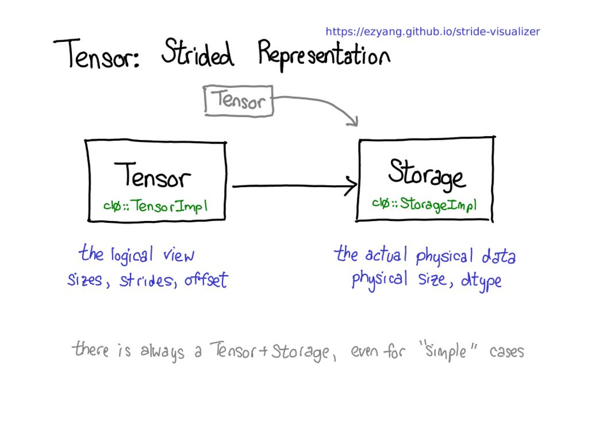

# PyTorch

## 资料

* 官网Intro https://pytorch.org/tutorials/
* 国产面试精华。。也适合速成 https://www.mstx.cn/pytorch.html


* PyTorch Internals
  * https://blog.ezyang.com/2019/05/pytorch-internals/

## PyTorch: An Imperative Style, High-Performance Deep Learning Library

* PyTorch builds on these trends by providing an **array-based programming model accelerated by GPUs**
  **and differentiable via automatic differentiation integrated in the Python ecosystem.**
* PyTorch foregoes the potential benefits of a graph-metaprogramming based approach to preserve the imperative programming model of Python

```Python
class LinearLayer(Module):
  def __init__(self, in_sz, out_sz):
    super().__init__()
    t1 = torch.randn(in_sz, out_sz)
    self.w = nn.Parameter(t1)
    t2 = torch.randn(out_sz)
    self.b = nn.Parameter(t2)
  def forward(self, activations):
    t = torch.mm(activations, self.w)
    return t + self.b
  
class FullBasicModel(nn.Module):
  def __init__(self):
    super().__init__()
    self.conv = nn.Conv2d(1, 128, 3)
    self.fc = LinearLayer(128, 10)
  def forward(self, x):
    t1 = self.conv(x)
    t2 = nn.functional.relu(t1)
    t3 = self.fc(t1)
    return nn.functional.softmax(t3)
```

* autograd
  * PyTorch uses the operator overloading approach, which builds up a representation of the computed function every
    time it is executed.
  * In its current implementation [30], PyTorch performs **reverse-mode automatic differentiation**, which computes the gradient of a scalar output with respect to a multivariate input.
    Differentiating functions with more outputs than inputs is more efficiently executed using forward-mode automatic differentiation, but this use case is less common for machine learning applications.
    PyTorch can be easily extended to perform forward-mode differentiation using array-level dual
    numbers [31, 32].

* 性能优化：

  * An efficient C++ core
    * Python bindings are generated using YAML meta-data files.
    * 比如可以用torchscript单独跑 https://pytorch.org/docs/stable/jit.html
  * Separate control and data flow
    * PyTorch is designed to execute operators asynchronously on GPU by leveraging the CUDA stream mechanism [38] to queue CUDA kernel invocations to the GPUs hardware FIFO
  * Custom caching tensor allocator
    * cache cuda memory
      * rounds up allocations to multiples of 512 bytes to avoid fragmentation issues.
    * One-pool-per-stream Design：
      * Moreover, it maintains a distinct pool of memory for every CUDA stream (work queue).
      * 只要新的内存分配操作与之前释放的内存区域使用在同一个流中，内存分配器就可以立即重新分配这块已经在 CPU 端释放的内存
        * 利用CPU释放更快的特点、流的序列化执行特性
      * limit：the allocations end up fragmented per stream
        * 很少用多流，Data loading and distributed computing utilities are exceptions，精心实现
  * multiprocessing：
    * PyTorch extends the Python multiprocessing module into torch.multiprocessing, which is a drop-in replacement for the built in package and automatically moves the data of tensors sent to other processes to shared memory instead of sending it over the communication channel.
    * Another unique feature of this system is that it transparently handles sharing of CUDA tensors, making it easy to implement techniques like Hogwild [42].

  * ref count
    * PyTorch tracks both references internal to the libtorch library and external references made by
      users in their Python code by integrating with Python’s own reference counting mechanism

## API

> [PyTorch官方的API接口文档](https://pytorch.org/docs/stable/index.html)

* torch模块。这是针对tensor进行全局设置的模块，主要常用的函数有
  * 全局设置tensor的类型
  * 全局设置tensor的device
  * 全局设置打印tensor的精度等。
  * 生成tensor的各种函数，包括：
    * 随机生成符合正态分布的tensor
    * 随机生成指定大小的tensor等
    * 序列化tensor的save和load函数

* torch.nn模块
  * 卷积层，池化层，dropout层，归一化层，全连接层，rnn层等
  * 各种loss函数。

* torch.autograd模块
  * [PyTorch自动微分](https://pytorch.org/tutorials/beginner/pytorch_with_examples.html)

* torch.nn.init模块
  * 网络参数初始化

## 二次开发

* 参考 GPU-Mode Lecture 1
  * load_inline
  * torch.profile
* operator call
  * 
  

## Tensor

* stride
  * 
  * 
  * 
    * 这样的设计不同于numpy
  
* Dispatch
  * The first dispatch is based on the device type and layout of a tensor: e.g., whether or not it is a CPU tensor or a CUDA tensor (and also, e.g., whether or not it is a strided tensor or a sparse one).
  * 
  * 
  * 一种拓展思路：tensor的wrapper class，参考torchao

* Gather index
  * torch.gather
  * 数组深加工


* leaf node
  * 默认情况下，非叶节点的梯度值在反向传播过程中使用完后就会被清除，不会被保留，只有叶子节点的梯度值能够被保留下来。对于非叶子节点而言，PyTorch出于节省内存的考虑，通常不会保存节点的导数值。总之，一句话：在调用backward()时，只有当节点的requires_grad和is_leaf同时为真时，才会计算节点的梯度值，也就是说节点的grad属性才会赋值，否则为None
  * 所有用户创建的向量都是叶子结点
    * 显式、隐式
  * 非叶子节点：中间变量


## Graph

* 动态图
  * 几乎每进行一次运算都会拓展原先的计算图，最后生成完成。
  * 当反向传播完成，计算图默认会被清除，所以只能用生成的计算图进行一次反向传播
  * `retain_graph` 参数可以保持计算图，从而避免别清除掉，其用法为：`loss.backward(retain_graph=True)`

### 异步执行

* CPU：同步执行
* GPU Op：
  * 任务分配
    * GPU执行算子计算
    * CPU推导输出信息、创建输出tensor、定位算子
  * 核心：CPU给GPU提交任务，不等待，直接返回

### 利用Stream


## Autograd

* Grad:  Jacobians left-multiplied by a vector,


* 
  * **在多输出操作的反向传播中，前向传播的输出会作为反向传播对应模块的输入**。通过 `output_nr`（前向输出编号）和 `input_nr`（反向输入编号）的映射，PyTorch 的自动求导系统能准确传递梯度，保证复杂计算图（如特征值分解 + 矩阵乘法）的反向传播正确执行。
* 

## Module

* 源码解读：https://zhuanlan.zhihu.com/p/340453841
  * 
  * 

## DataLoader

* concurrent
  * https://arxiv.org/pdf/2211.04908
* torchdata

## Optimizer

### Optimizing Optimizers —— [GPU Mode Lecture 6](https://www.youtube.com/watch?v=hIop0mWKPHc)

> 优化runtime

* kernel fusion —— vertical + horizontal
  * for loop
  * for each
  * entirely fused


## Serving

* 如果追求性能，可以用torch.fx改一下图，把手写op改进去
* torch.fx symbolic_trace可以变成静态图
* 静态图，会用torchscript trace出来整个图，然后在ir上做一些编译优化


## 调参

* 冻结网络参数的方式有三种：

  - 利用优化器的param_groups属性

  - 利用detach分离出某个网络层
    - detach
      - 将张量从当前计算图中分离出来，从而不需要跟踪张量的梯度变化
      - 将张量从GPU移动到CPU时

  - 利用dropout操作。

  * 前2种方法都是冻结整个层的训练参数，第3种方法使用dropout可以冻结部分网络参数，但是这是随机的


## Pytorch Lightning

