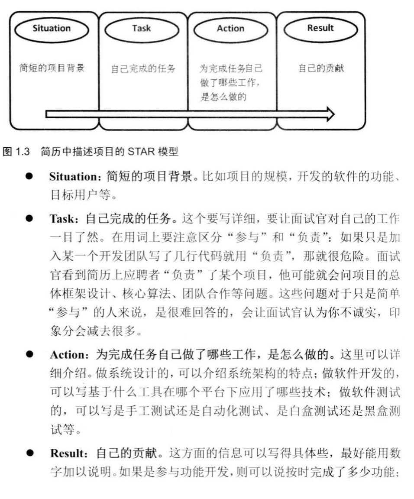
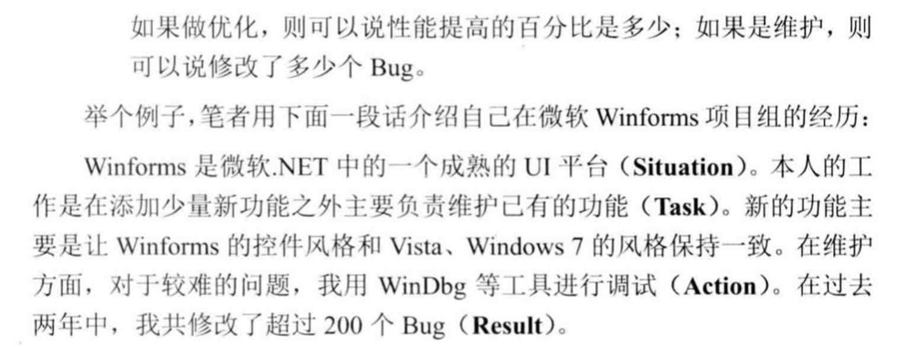

### 《剑指offer——名企面试官精讲典型编程题》，何海涛，电子工业出版社，2017

动态规划与分治的区别：前者自底向上，后者自顶向下

#### chpt1 面试的流程

* 电话面试：说细节，大胆pardon
* 远程桌面面试：编程习惯，调试能力
* 现场面试：准备几个问题
* 行为面试->技术面试->应聘者提问





* 技能：了解、熟悉、精通
* 常考点：链表、二叉树、快排
* 细节：空指针空字符串（nullptr）、错误处理、溢出
  * C语言的整型溢出问题，[很好的文章](https://coolshell.cn/articles/11466.html/comment-page-1#comments)

#### chpt2 面试需要的基础知识
* C++：面向对象的特性、构造函数、析构函数、动态绑定、内存管理
  * e.g. 空类1字节
* 软件工程：常见的设计模式、UML图

##### 4.[二维数组中的查找](https://leetcode-cn.com/problems/er-wei-shu-zu-zhong-de-cha-zhao-lcof/)
* [leetcode 240.](https://leetcode-cn.com/problems/search-a-2d-matrix-ii)
* 关键在于起点的选取，从左下角或者右上角开始

##### 7. [重建二叉树](https://leetcode-cn.com/problems/zhong-jian-er-cha-shu-lcof/)
* [leetcode 105.](https://leetcode-cn.com/problems/construct-binary-tree-from-preorder-and-inorder-traversal/) 
* 找到中间节点，递归

##### 11.[旋转数组的最小数字](https://leetcode-cn.com/problems/xuan-zhuan-shu-zu-de-zui-xiao-shu-zi-lcof/)
* [leetcode 154.](https://leetcode-cn.com/problems/find-minimum-in-rotated-sorted-array-ii)
* 如果有重复数字，则难以判断mid是在左边还是右边，r-=1是解决这一问题的关键代码
```c++
int findMin(vector<int>& numbers) {
    //if(numbers.size()==0)return -1;
    int l=0,r=numbers.size()-1;
    int mid;
    while(l<r){
        if(r-l==1)
            return (numbers[l]<=numbers[r])?numbers[l]:numbers[r];
        mid=(l+r)/2;
        if(numbers[mid]>numbers[r]) l=mid;
        else if(numbers[mid]<numbers[l])r=mid;
        else
            r-=1;
            //return minArraySeq(numbers,l,r);
    }
    return 1;
}
```

##### 15.[二进制中1的个数](https://leetcode-cn.com/problems/er-jin-zhi-zhong-1de-ge-shu-lcof/)
* [leetcode 191.](https://leetcode-cn.com/problems/number-of-1-bits) 
* n=n&(n-1);
* 易错点：`return n&1+hammingWeight(n>>=1);`
  * 位运算优先级很低，n&1应该打括号
* 复习[运算符优先级](https://baike.baidu.com/item/%E8%BF%90%E7%AE%97%E7%AC%A6%E4%BC%98%E5%85%88%E7%BA%A7/4752611?fr=aladdin#4)
* 基本的优先级需要记住：
  * 指针最优，单目运算优于双目运算，如正负号。
  * 先算术运算，后移位运算，最后位运算。1 << 3 + 2 & 7等价于 (1 << (3 + 2))&7，逻辑运算最后结合。

#### chpt3 高质量的代码

##### 18.[删除链表的节点](https://leetcode-cn.com/problems/shan-chu-lian-biao-de-jie-dian-lcof/)
* [leetcode 203.](https://leetcode-cn.com/problems/remove-linked-list-elements/)
* 直接遍历，也可以用sentinel node简化操作（在LRU cache也有应用）

```c++
class Solution {
public:
    ListNode* deleteNode(ListNode* head, int val) {
        if(head==NULL)return NULL;
        if(head->val==val)return head->next;
        ListNode *p=head;
        while(p->next){
            if(p->next->val==val){
                p->next=p->next->next;
                break;
            }
            p=p->next;
        }
        return head;
    }
};
```

##### 19. [正则表达式匹配](https://leetcode-cn.com/problems/zheng-ze-biao-da-shi-pi-pei-lcof/) 
* [leetcode 10.](https://leetcode-cn.com/problems/regular-expression-matching)
* 和0072.Edit-Space类似
$$
d[i][j]=\begin{cases}
d[i-1][j-1]& p[j]='.'\\
s[i] == p[j]\quad \&\& \quad d[i - 1][j - 1] & p[j]=a\\
d[i][j - 2]\quad ||\quad d[i-1][j] & p[j-1:j]='.*'\\
d[i][j - 2]\quad ||\quad (d[i-1][j]\quad \&\&\quad s[i]==p[j-1])      & p[j-1:j]='a*'
\end{cases}
\notag
$$

##### 20.[表示数值的字符串](https://leetcode-cn.com/problems/biao-shi-shu-zhi-de-zi-fu-chuan-lcof)
* [leetcode 65.](https://leetcode-cn.com/problems/valid-number/)
* 书上的代码结构很简洁，值得学习
```c++
int pointer;
bool isNumber(string s) {
    if(s=="")return -1;
    scanSpace(s);
    bool numeric=scanInteger(s);
    if(s[pointer]=='.'){
        ++pointer;
        numeric=scanUnsignedInteger(s)||numeric;
        //用||因为整数、小数部分有一即可
    }
    if(s[pointer]=='e'||s[pointer]=='E'){
        ++pointer;
        numeric=numeric&&scanInteger(s);
    }
    scanSpace(s);
    return numeric&&s[pointer]=='\0';
}
```
* 也可以用有限状态机来做

##### 24.[翻转链表](https://leetcode-cn.com/problems/fan-zhuan-lian-biao-lcof/)
* [leetcode 206.](https://leetcode-cn.com/problems/reverse-linked-list/)
```c++
ListNode* reverseList(ListNode* head) {
    if(!head||!head->next) return head;
    ListNode *p=head,*q=head->next; 
  	p->next=NULL;
  	ListNode* temp;
    while(q!=NULL){
    	temp=q->next;
			q->next=p;
			p=q;
      q=temp;
    }
    return p;
}
```

##### 25.[合并两个排序的链表](https://leetcode-cn.com/problems/he-bing-liang-ge-pai-xu-de-lian-biao-lcof/)
* [leetcode 21.](https://leetcode-cn.com/problems/merge-two-sorted-lists)，经典题，引入一个头节点
* 代码模版：
```c++
ListNode*head=new ListNode(0);
ListNode*p=head;
...
return head->next;
```

##### 28.[对称的二叉树](https://leetcode-cn.com/problems/symmetric-tree)
* [leetcode 101.](https://leetcode-cn.com/problems/symmetric-tree)
* 递归
```c++
bool isSymmetric(TreeNode* root) {
    if(!root)return 1;
    else return isSymmetric1(root->left,root->right);
}
bool isSymmetric1(TreeNode* a,TreeNode* b) {
    if(!(a||b))return 1;
    else if(!(a&&b))return 0;
    else return a->val==b->val&&isSymmetric1(a->left,b->right)&&isSymmetric1(a->right,b->left);
}
```

##### 29.[顺时针打印矩阵](https://leetcode-cn.com/problems/shun-shi-zhen-da-yin-ju-zhen-lcof/)
* [leetcode 54.](https://leetcode-cn.com/problems/spiral-matrix)
* 最简洁的写法
```c++
vector<int> spiralOrder(vector<vector<int>>& matrix) {
        vector<int>ret;
        int m=matrix.size();
        if(!m)return ret;
        int n=matrix[0].size();
        int b=0,t=m-1,l=0,r=n-1;
        while(1){
            for(int j=l;j<=r;j++)ret.push_back(matrix[b][j]);
            if(++b>t)break;
            for(int i=b;i<=t;i++)ret.push_back(matrix[i][r]);
            if(--r<l)break;
            for(int j=r;j>=l;j--)ret.push_back(matrix[t][j]);
            if(--t<b)break;
            for(int i=t;i>=b;i--)ret.push_back(matrix[i][l]);
            if(++l>r)break;
        }
        return ret;
}
```


#### chpt4 解决面试题的思路
解决复杂问题的三种方法：画图、举例、分解

##### 30.[包含min函数的栈](https://leetcode-cn.com/problems/bao-han-minhan-shu-de-zhan-lcof/)
* [leetcode 155.](https://leetcode-cn.com/problems/min-stack)
* 用另一个栈记录min的变化值

##### 32.从上到下打印二叉树
* [32-I，直接存](https://leetcode-cn.com/problems/cong-shang-dao-xia-da-yin-er-cha-shu-lcof/)：队列
* [32-II，按层保存](https://leetcode-cn.com/problems/cong-shang-dao-xia-da-yin-er-cha-shu-lcof): [leetcode 102.](https://leetcode-cn.com/problems/binary-tree-level-order-traversal/)，队列，设变量curNum和nextNum分别保存本层和下层的数的个数
* [32-III，锯齿形](https://leetcode-cn.com/problems/cong-shang-dao-xia-da-yin-er-cha-shu-iii-lcof/): [leetcode 103.](https://leetcode-cn.com/problems/binary-tree-zigzag-level-order-traversal/)，在102的基础上保存层数的奇偶性
* 引申：[关于vector的内存释放问题](https://www.cnblogs.com/jiayouwyhit/p/3878047.html)
  * 方法一：clear 
  * 方法二：`vector<int>().swap(nums);`
  * 方法三：利用代码块和临时变量
`
{
    vector<int> tmp = curLevel;   
    curLevel.swap(tmp); 
}
`

  * clear虽然不会deallocate释放空间，但是会destroy执行析构函数，所以可以用同一个空间构造节点，如果swap了就要重新分配空间再构造节点。由于本题是对同一个vector的重复利用，可以直接用clear();，空间复杂度是单层最大节点数。
  * 如果要每次都释放空间，也可以用`res.emplace_back(std::move(curLevel))`，涉及[emplace_back](https://www.cnblogs.com/ChrisCoder/p/9919646.html), [std::move](https://blog.csdn.net/p942005405/article/details/84644069/), [左值、右值引用](https://blog.csdn.net/p942005405/article/details/84644101), [这是一篇有关类定义的总结](https://blog.csdn.net/zzhongcy/article/details/86747794)

##### 33.[二叉搜索树的后序遍历序列](https://leetcode-cn.com/problems/er-cha-sou-suo-shu-de-hou-xu-bian-li-xu-lie-lcof/)
* 法1:递归子树，直观的思路
* 法2:参照leetcode84，利用单调栈，[一篇很好的文章](https://blog.csdn.net/lucky52529/article/details/89155694)（有小错，修正版见我的[leetcode题解](https://github.com/huangrt01/CS-Notes)）

##### 35.[复杂链表的复制](https://leetcode-cn.com/problems/fu-za-lian-biao-de-fu-zhi-lcof/)
* [leetcode 138.](https://leetcode-cn.com/problems/copy-list-with-random-pointer/)
* 思路值得学习，在原链表的主线上复制节点，进行删改操作。

##### 36.[二叉搜索树与双向链表](https://leetcode-cn.com/problems/er-cha-sou-suo-shu-yu-shuang-xiang-lian-biao-lcof/)
* [leetcode 426.](https://leetcode-cn.com/problems/convert-binary-search-tree-to-sorted-doubly-linked-list/)
* 方法一：二叉搜索树特性，中序遍历的递归/非递归实现，用nonlocal last记录上一次遍历的末尾节点
* 方法二：用flag指示返回最左/最右节点，递归后序遍历操作
```c++
Node *treeToDoublyList(Node *root)
{
    root = treeToDoublyList(root, 0);
    if (root == NULL)
        return NULL;
    Node *p = root;
    while (p->right) p = p->right;
    p->right = root;
    root->left = p;
    return root;
}
Node *treeToDoublyList(Node *root, int flag)
{ //flag=0:left, flag=1:right
    if (root == NULL)
        return NULL;
    Node *l = treeToDoublyList(root->left, 1);
    Node *r = treeToDoublyList(root->right, 0);
    root->left = l;
    root->right = r;
    if (l)
        l->right = root;
    if (r)
        r->left = root;
    Node *p = root;
    if (!flag) while (p->left) p = p->left;
    else while (p->right) p = p->right;
    return p;
}
```


##### 37.[序列化二叉树](https://leetcode-cn.com/problems/xu-lie-hua-er-cha-shu-lcof/)
* [leetcode 297.](https://leetcode-cn.com/problems/serialize-and-deserialize-binary-tree/)
* 思路上可以使用DFS或者BFS
* C++具体实现，利用stringstream
```c++
class Codec {
public:
    // Encodes a tree to a single string.
    string serialize(TreeNode* root) {
        if(root==NULL)return "";
        ostringstream ostr;
        queue<TreeNode*>q;
        TreeNode*temp;
        q.push(root);
        int curNum=1;
        while(!q.empty()){
            temp=q.front();
            q.pop();
            if(!temp){
                if(curNum) ostr<<"null,";
            }
            else {
                ostr<<temp->val<<",";
                curNum--;
                q.push(temp->left);
                if(temp->left)curNum++;
                q.push(temp->right);
                if(temp->right)curNum++;
            }
        }
        return ostr.str();
    }

    // Decodes your encoded data to tree.
    TreeNode* deserialize(string data) {
        if(data=="")return NULL;
        istringstream istr(data);
        queue<TreeNode*>q;
        TreeNode* root=new TreeNode;
        TreeNode **number=new TreeNode*;
        if(ReadStream (istr,number)){
            root=number[0];
            if(!root)return NULL;
            q.push(root);
        }
        else return NULL;
        TreeNode *temp;
        while(!q.empty()){
            temp=q.front();
            q.pop();
            if(!temp)continue;
            if(ReadStream(istr,number)){
                temp->left=number[0];
                q.push(temp->left);
            }
            else break;
            if(ReadStream(istr,number)){
                temp->right=number[0];
                q.push(temp->right);
            }
            else break;
        }
        return root;
    }
    bool ReadStream(istringstream &istr,TreeNode **number){
        string s;
        if(getline(istr,s,',')){
            if(s=="null")number[0]=NULL;
            else number[0]=new TreeNode(stoi(s));
            return 1;
        }
        return 0;
    }
};
```

##### 38.[字符串的排列](https://leetcode-cn.com/problems/zi-fu-chuan-de-pai-lie-lcof/)
* 回溯法，注意judge函数：排除重复的情形
* 全排列的应用：针对按一定要求摆放数字的问题，比如八皇后问题、正方体顶点和问题
```c++
class Solution {
public:
    vector<string>res;
    vector<string> permutation(string s) {
        int cursor=0;
        permutation(s,cursor);
        return res;
    }
    void permutation(string &s,int cursor){
        if(cursor==s.size()-1){
            res.push_back(s);
        }
        else{
            for(int i=cursor;i<s.size();i++){
                if(judge(s,cursor,i))continue;  //从cursor开始，遍历不重复的字符
                swap(s[cursor],s[i]);
                permutation(s,cursor+1);
                swap(s[cursor],s[i]);
            }
        }
    }
    bool judge(string& s, int start, int end) {
        for (int i = start; i < end; ++i) {
            if (s[i] == s[end]) return true;
        }
        return false;
    }
};
```

#### chpt5 优化时间和空间效率

##### 41.[数据流中的中位数](https://leetcode-cn.com/problems/shu-ju-liu-zhong-de-zhong-wei-shu-lcof/)

* [leetcode 295.](https://leetcode-cn.com/problems/find-median-from-data-stream/)
* 思路1: AVL树的平衡因子改为左、右子树节点数目之差
* 思路2: 左边最大堆，右边最小堆
  * 书上代码：push_heap和pop_heap
  * 也可直接用priority_queue，注意小顶堆的定义：`priority_queue<int, vector<int>, greater<int>> hi;`

```c++
min.push_back(num);
push_heap(min.begin(),min.end(),greater<int>());
```

* 字节后端开发终面：变式题，在本题基础上增加erase功能，需要把堆改成BST（即set），保证删除性能


