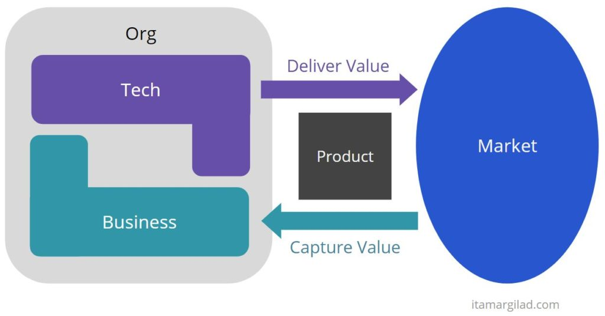
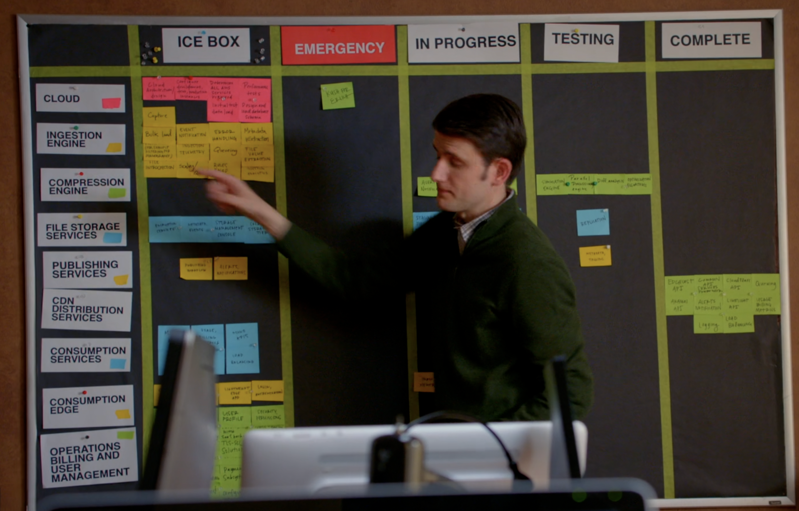
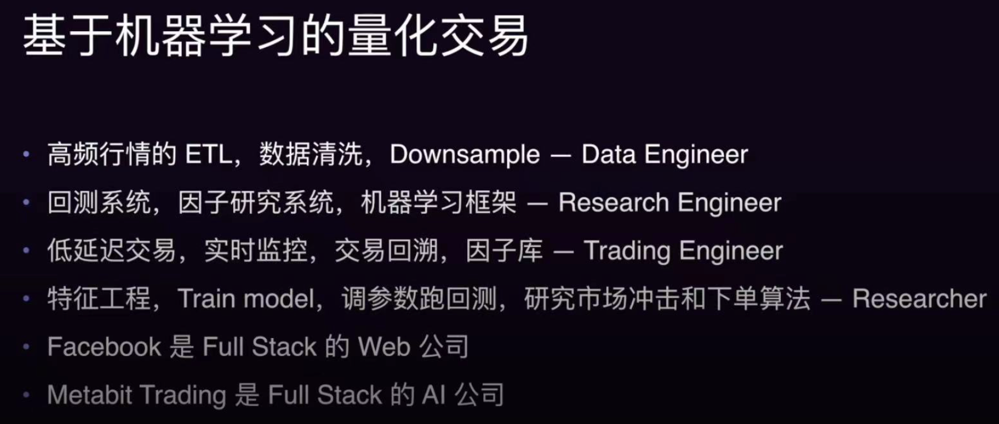
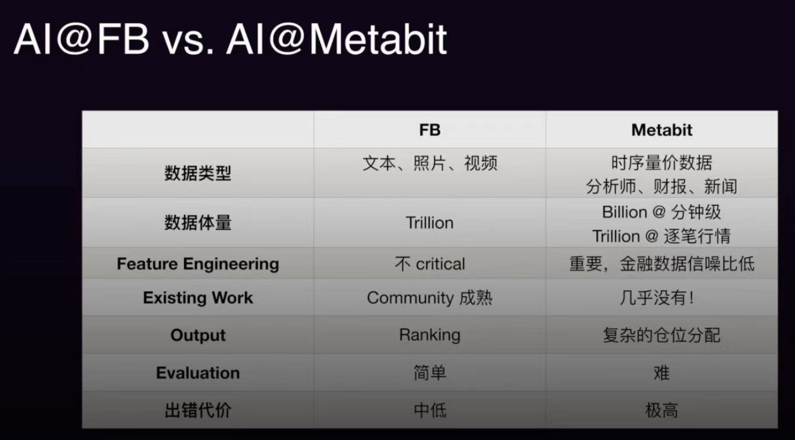
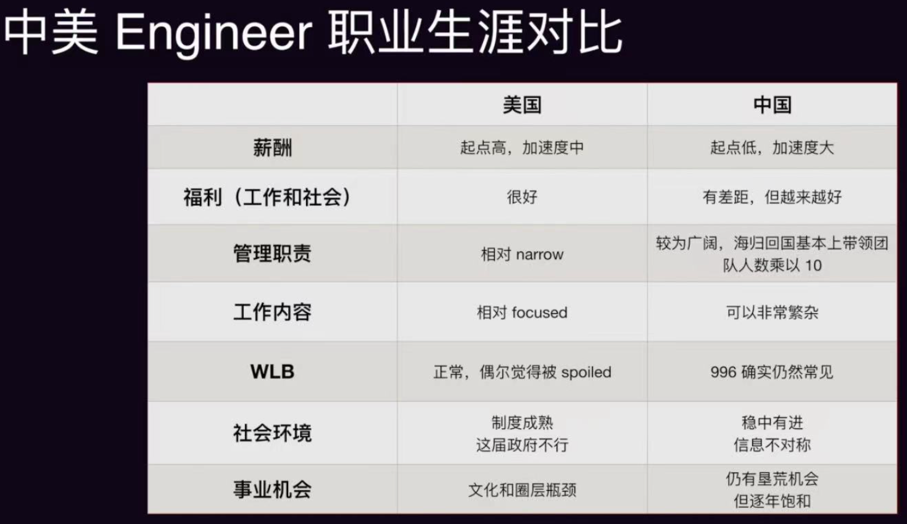

[toc]

## 非技术知识

* LT: Life Time 用户生命周期 

* LTV: Life Time Value 用户生命价值

* ARPU: Average Revenue Per User 用户日均收入（每个用户每个活跃日可以提供的平均收入）

* LT * ARPU = LTV

* DAU = MAU * (DAU/MAU) (用户活跃度)

* QoS: Quality of Service

* 市值 = GMV * take_rate

* 数据驱动 ～ 新产品

* 信仰判断 ～ 成熟产品，增长空间有限

### 持续关注

#### MLSys

* MLSys：https://www.zhihu.com/question/537007032/answer/3234159319
* 大猿搬砖日记 公众号
* GPU-Mode Channel
* PyTorch
  * Channel https://www.youtube.com/@PyTorch/videos
  * Dev Discuss https://dev-discuss.pytorch.org/
  * EzYang Blog https://blog.ezyang.com/
* 硬核课堂：https://www.bilibili.com/video/BV11m421M7N4
* zartbot 公众号
* Nvidia GTC: https://www.nvidia.com/gtc/
* 学术：
  * Song Han：量化/推理，AWQ/SVDQuant/EfficientViT/QServe/DuoAttention/StreamingLLM，MIT AP
  * Beidi Chen：量化/推理，ShadowKV/MagicPig/H2O/Deja Vu/OSD，CMU AP
  * Tri Dao：算子/算法，Flash Attention-1, 2, 3 & Mamba，Princeton AP
  * Yinmin Zhong：DistTrain/DistServe/LoongServe/AlpaServe，PKU phd

* 休闲科普：
  * 月球大叔

#### ToB

* 火山引擎 V-Moment：https://www.volcengine.com/docs/6703/1158657

#### 职场非技术

* 马可奥勒留：https://juejin.cn/user/1955412097653256/posts
* 奔跑的北极企鹅（vx公众号）：前国际电商leader
* 中年管理者日常（xhs）

#### 商业

* [张小珺Jùn｜商业访谈录](https://www.youtube.com/playlist?list=PLwAchVoh-4zNSI5UlKEkKCL5r_jJyrFeO)

#### ML算法

* YannicKilcher: https://www.youtube.com/@YannicKilcher
* FAI Seminar：https://www.fai-seminar.ac.cn/
* 苏剑林：https://www.kexue.fm/
* 李沐：https://github.com/mli/paper-reading

#### 传统搜广推算法

* 石塔西：https://zhuanlan.zhihu.com/learningdeep
* 王喆：https://www.zhihu.com/people/wang-zhe-58/posts

#### 人生哲理、学习方法

* 李新野

* 阿卡迪萨：https://space.bilibili.com/308598581

#### 情感

* 知春路Chris（xhs）

#### 美食品鉴

* 赵胤胤（douyin）
* 安妮大厨（bilibili）
* 名厨app

#### 时尚

* tigerhood https://www.thetigerhood.com/

#### 健康

* Luxenius：https://www.zhihu.com/people/luxenius/posts

#### 文史政经哲

* 学院派Academia（douyin）
* [Most influential books under 100 pages](https://www.goodreads.com/list/show/29560.Most_influential_books_under_100_pages)
* 冯唐讲xxx

#### dnd

* dual双持（bilibili）
* 元游pai（bilibili）

### Daily

* 时区查询：https://www.worldtimebuddy.com/

* Autman工作思路

  * https://mp.weixin.qq.com/s/WW2OZx5MpuPWiq8DLpo6xQ

  * 提升生产力，复合增长

  * a. “确保完成重要的事情”；

    b. “不要把时间浪费在愚蠢的事情上”；

    c. “列很多清单”。

  * 在您的日程表中留出足够的空间以允许偶遇和接触新的人和想法是至关重要的

    * **拥有一个开放的网络是有价值的。** 虽然我参加的随机会议中可能有 90% 是浪费时间，但另外 10% 确实弥补了它。

    * 大多数会议最好安排在 15-20 分钟或 2 小时内

  * 生活质量

    * 很棒的床垫
    * 睡眠追踪器
    * 锻炼
    * 每天约 200 毫克的咖啡因总量，醒后一大杯浓缩咖啡

### Thinking，思维方法

#### ROI
* 三个要素：
  * 计算主体（不是具象的客体，而是抽象的动作；问题颗粒度取决于想反馈的目标）
  * 计算媒介（关键变量）
  * 数学建模 
* 四个步骤：
  * 规划：业务洞察力，列举所有可能的成本和收益
  * 评估
  * 执行：变数->临时评估；评估要排除已经沉没的成本和收益
  * 复盘：反思结果和预判的差别；差别大 -> 调整主观预期、业务层面优化

* 持续策略收益评估：
  * 单次策略的重点是预评估，持续策略的重点是反馈机制
  * 考虑自主循环和时效性：动作饱和问题；切割收益和成本
  * 快速评估和优化机制设计
    * 媒介：投放->竞价, 红包策略->数值策略
    * 制定反馈机制
* 统计工具与模型
  * 数据调研和元假设：建模中内蕴的假设，来源于信念/历史经验。e.g. LSTM模型 => 数据集有时间结构或前后因果关系
  * 预估：
    * 数理统计：函数族拟合 => 模型容量不够；离散时间序列 (ARIMA、GARCH) => 参数矩阵奇异性、对outlier敏感
    * 统计学习：高维回归问题，GBDT->XGBT, HMM (自带时间结构、算力消耗大)
    * 深度学习：回归问题- MLP，时序性质- RNN。可解释性不强（核心思路是深度学习解决部分问题，再聚合结果）；启动成本问题
  * 增量计算：
    * A/B实验：开挂，不要过于依赖导致丧失自己的因果推断能力
      * A/B开不出来的场景：《囧妈》、疫情影响
    * 备选方案A/A：选取常态稳定的指标，比较粗糙
    * 伪A/B：挑选“相似人群”，难以评估，有一种方式是对行为向量序列降维，评估人群相似性
* 建模中的经典trick
  * “经验困境”：贝叶斯方法
  * 如何应对变化的外部环境：平滑化方法
    * 平滑工具：filter、pooling、正则项惩罚参数移动、贝叶斯化限制参数移动
    * 修正：根据上级维度的情况
  * 主观性问题中的非直接收益
    * 向外释放的媒介值通过混沌系统还回来
    * 方法：主观判断/问卷调研
  * 链式偏差问题和蒙特卡洛方法
    * 不要看点值，要看分布
* 提升因果逻辑分析能力
  * 解耦和节点化
  * “因果网络”
  * 敏感性分析：设置硬边界、设置先验概率、节点合理性、映射方式合理性
  * 非平衡代价问题

#### Problem Solving

真正的价值是问题分析后的 So-What

四个步骤
* 定义关键问题
  * 了解 context -> 准确识别“真正的需要解决的问题” -> 重新定义问题
  * Issue Tree 分解大问题，分解依赖 Hypothesis
  * 分解问题树时遵循 MECE 原则（Mutually Exclusive Collectively Exhaustive）
* 给出可执行、具体、有认知深度的建议
* 进行快速迭代
* 清晰有力地沟通传递建议
  * 回顾听众真正关心的问题
  * 把答案结构化
  * 为听众量身定制
  * 检查是否解决了听众的问题

#### 思维模型

* 人脑模型：

  * 内中外廷的人脑模型
    * [生理性喜欢是真的喜欢吗？by 阿卡迪萨_哔哩哔哩_bilibili](https://b23.tv/mcakX9Z)
    * 汲黯怼汉武帝内多欲而外施仁义的例子
    * 人既是雕刻家又是大理石，统一自己的三廷

  * 抑制和创造系统
    * 
    *  [抑制系统过强的人是什么一种体验？希望能给我相近的人一些启发_哔哩哔哩_bilibili](https://b23.tv/YpzvqSg)
    * A类道理和B类道理
    * 抑制系统强会导致上手速度慢，但不容易受垃圾数据集污染，且可能有顿悟现象
  * 理解本质上是一种渲染，先模糊再渲染成清晰
    * [准备给自己配副眼镜了，顺带讲讲理解是什么_哔哩哔哩_bilibili](https://b23.tv/O7RrzZC) 
  * 理解不断迭代，循环式上升
    *  [豁然开朗后又退步是非常正常的现象，不要怪自己没法坚持_哔哩哔哩_bilibili](https://b23.tv/oFBN5wU)
  * 注意力机制：抓重点、上下文越多不一定越好（对能力要求反而升高）
    *  [一觉醒来发现被博后导师关注了（顺带回一下原先一些弹幕）_哔哩哔哩_bilibili](https://b23.tv/o7P0Nms) 平衡学习与考试

* [大道理与小道理](https://www.bilibili.com/video/BV14NAUe1ED5)
  * 小道理讲不过大道理
  * 大道理：统合 秩序 平衡 毁灭 新生
  * 小道理：自由 平等 爱 有仇必报 有恩必报
  * 小道理具备对抗大道理的正当性，最终造成结果未必好，但需要存在，从而大道理的推行过程中需要兼顾一部分小道理
    * e.g. 王允、贾诩的例子

* 思维模型：

  * 法律 & 程序（40%）：严谨、精确、无二义性，考虑很多案例，正反思考

  * 历史 & 统计（30%）：趋势、数据统计，用以分析问题

  * 经济 & 价值（30%）：实用性、价值判断，经济学原理是社会运作的原理

[Product-Led is Just as Bad as Sales-Driven](https://itamargilad.com/product-led/)

#### 学习方法

* 《[从一位imo金牌得主的在清华读了六年本科的经历讲述不同人学数学的困境](https://www.bilibili.com/video/BV1R4ZiYVEWZ)》
  * 从数学学习的角度讲述了怎么认知自我的局限和突破自我的瓶颈
  * 追求细节从头推到尾的影响
    * [从“必要之恶”的角度，允许自己接受道理的模糊性](https://www.bilibili.com/video/BV1HfZ4YhEF6)
  * 缺少taste怎么办
  * 一直学习和推导一个领域导致走神和劳累

#### 价值判断

* 反常性和通用性均是判断理论价值的标准
  * [大五比mbti信效度更高，就一定更科学吗？（其实内容和标题没有特别大关系）_哔哩哔哩_bilibili](https://b23.tv/YYjUxg8) 

* 公司分类

  * 人力成本高：重人效

  * 资产成本高：重业务系统化（ERP, Enterprise resource planning）

#### 价值观

* [人生的两类强化路线：](https://www.bilibili.com/video/BV1dRoWYkEW6)
  * 路线一：现实是手段，精神是目的
    * 认知：现实是脆弱的，载入历史才能长存
    * 什么叫男人至死是少年？ 成熟是手段，幼稚是目的
    * e.g. 罗马权力斗争，禁卫队长戴克里先当了皇帝，一系列改革，四帝共治制、定义皇帝任期20年，20年退位，随后四帝共治制，君士坦丁收拾烂摊子。成熟（争权夺利）是手段，幼稚（退位）是目的。
  * 路线二：精神是手段，现实是目的
    * 认知：现实高于一切
    * e.g. 武侠剧的男女主角，决一死战后什么情况下会互相放过

* 什么是轴 （[从“必要之恶”角度讲我为什么没有以前那样社恐和轴了](https://www.bilibili.com/video/BV1HfZ4YhEF6))
  * 历史人物：白公胜
  * 如何改变认知：内心立法是为了帮助自己分清主次，而不是轴着执行
  * e.g. [讲述我学生生涯的最大危机：小学一年级大危机（并讲述我的伟大的母亲）](https://www.bilibili.com/video/BV1LmRDYLE3L) —— 母亲良好的处理，帮助自己改掉一个字也15分钟的习惯

#### 性格和心理

* [MBTI和战锤中的魔法八风](https://www.bilibili.com/video/BV1tTX8YNEAS)
  * 魔法八风是精灵提纯了混沌力量后分离出来的可控性比较高的八种

### 人文语料积累

* 关于目标和执行
  * 莫踬于山，而踬于垤

### Creativity

* Sam Altman Blog
  * Idea Generation 
    * it’s useful to get good at differentiating between real trends and fake trends. A key differentiator is if the new platform is used a lot by a small number of people, or used a little by a lot of people
    * founder/company fit is as important as product/market fit
    * a good test for an idea is if you can articulate why most people think it’s a bad idea, but you understand what makes it good.
  * The Strength of Being Misunderstood
    * It seems like there are two degrees of freedom: you can choose the people whose opinions you care about (and on what subjects), and you can choose the timescale you care about them on. Most people figure out the former [1] but the latter doesn’t seem to get much attention.
    * being right about an important but deeply non-consensus bet

### 开源

* [别不信，开源真的有毒 —— 那一科技公众号](https://mp.weixin.qq.com/s/eGdlu1G5jcMu8-_NAAzZJw)
  * NaiveSystems Depend 的软文，依赖管理工具
* Legal risks and suggestions about code
  
  * protected by copyright law, trade secret law
  * risks of using open source code
    * MIT license：最低限度的，只需要标注作者和 license
      * similar license: BSD, Apache
    * MPL license：keep the original license in the modified code file
    * GPL license：最严格的，协议复杂，简单来说，只要 distributing code containing GPL licensed code，就必须开源所有 code
      * similar license: AGPL

### 产品

#### 方法论

* 小鹏新的产品观：技术产品转变为用户产品，再叠加客户产品和商业产品
  * 什么是客户导向？并不是简单的技术强，而是技术带来了好的用户体验，让用户感知到。自动驾驶很难是一个强力的客户产品，
    * 但内空间做得有趣、差异化，这是客户产品
    * 商业产品则是价格有竞争力、企业有利润。
  * **为什么不亲自带产品？**：CEO 亲自带产品会有很多问题，汽车公司经常把 CEO 的话当成 “圣旨”，而做好产品需要自我博弈和团队力量，因为链条太长了，一旦你错了，就全错了。

#### 指标

北极星指标 护栏指标

#### Scrum敏捷开发

* ICE BOX
* Sprint：一个周期

### 运营

* [关于UGC、PGC、OGC三者详细区别](https://zhuanlan.zhihu.com/p/35596590)
* MCN（Multi-Channel Network），俗称网红经纪人，即多频道网络，一种多频道网络的产品形态，是一种新的网红经济运作模式。这种模式将不同类型和内容的PGC（专业生产内容）联合起来，在资本的有力支持下，保障内容的持续输出，从而最终实现商业的稳定变现。

* 自媒体运营的一些逻辑
  * 找到自己的变现逻辑：引流 / 广告
  * 有自己的核心优势、独特性
* 做引流
  * 找到变现群体，要铁粉不要泛粉
  * 每条笔记的动机：
    * 陌生人/泛粉 --> 铁粉：完整的垂直内容矩阵，从背景到方法论到细节到案例
    * 加强铁粉粘性：更多样性的内容

### 搜广推

* 搜推一体：
  * 小红书的搜索里，会插入更多 个性化推荐 的内容
    * 小红书的 种草社区属性+双列产品特点，搜索中插入相关性不高的 纯推荐内容，用户体验可控、有收益

### ToB & ML ToB

见【云原生】笔记

#### 数据库DB

* 商业模式：
  * Snowflake:易用性(屏蔽技术实现细节), data for ai , 
  * Databricks:生态, ai for data ,靠前期咨询consulting获客,tob服务进入整个企业业务链条,用数据驱动模型,联合建模等模式,按照业务单元售卖(含资源),比较重. 
  * coreweave模式

### 创业 & 企业

#### 创业

* 优势
  * **创新者的困境：**谷歌Bard（以前被称为Gemini）的现场演示中就遇到了问题。很多人可能不记得了，那次现场演示失败了，导致谷歌股价一天内下跌了5%到7%。所以，我们利用的就是这种不对称性，这种创新者的困境：我们能正确回答80%的查询，就能给像你，吉姆这样的人留下深刻印象；但谷歌回答错误20%的查询，就会让人觉得谷歌正在衰落，股价下跌，华尔街恐慌，谷歌不再被视为人工智能领域的领导者。这就是像我们这样的新进入者获得机会的地方。
* 创业的挑战
  * 痛苦的时刻很多，最痛苦的还是**转型**（pivot）的时候。尤其是当上一个产品已经有用户和客户，且在发展中时，你客观分析后发现这个方向很难继续，你不得不选择终止这个产品并转向新的方向。
    * 这不仅需要缓解团队内的不确定情绪，还要向投资人解释转型的原因。
    * 自己也要接受生活中的不确定性。这种巨大的不确定性会让你怀疑新方向的可行性。
  * 有很多事务性的工作，比如每月结算、发工资、处理银行关系和融资等
* 企业的挑战
  * Companies operate in an eternal [iterative elimination tournament](https://lethain.com/iterative-elimination-tournaments/), balancing future success against surviving until that future becomes the present. If you’re about to lose one of those rounds, then always focus there.
    * Running out of money, [like my experience at Digg](https://lethain.com/digg-v4/), can be the most obvious issue, but not every existential issue is financial
    * [Twitter’s fail whale stability challenges](https://www.theatlantic.com/technology/archive/2015/01/the-story-behind-twitters-fail-whale/384313/)
    * adapting to the shifts caused by the Covid-19 pandemic.
* 快速变革的领域，创业或者突破，需要努力和crazy ideas
  * crazy ideas：微软把ai外包给openai
* 事物的运作逻辑，先work，再clean the mess
  * prototype
* [十二年前的雷军讲创业](https://v.douyin.com/iSeJ3p6w/)
  * 市场规模越大越好：毒霸大于词霸
  * 借钱的方法论：1.找熟人借钱；2.利用朋友的辐射作用；
  * 初创公司什么时候去找钱： 花一半钱的时候
  * 寻求投资的步骤：1.人脉引荐；2.创业团队介绍；3.前景描绘
  * 股权分配是创业过程中的重要资源，用来和重要的人share
* 何小鹏
  * **回望 20 余年的创业生涯，从 PC 时代到移动互联网再到现在，有什么总结和认知可以和我们分享吗？**
  * 昨天好像有人问过我这个问题。1）我读大学的时候觉得 TCL、创维、康佳这三家已经把创业机会都拿完了，我们这种刚读大二的人怎么办？但你要永远相信，未来还有更大的机会，这很重要； 2）我告诉自己，因为我不聪明，所以我没有速成之道。
  

#### Hiring 招聘

* *Hiring* has a lot of folks involved in it, usually in terms of optimizing the [hiring funnel](https://lethain.com/hiring-funnel/), but onboarding, mentoring, and coaching are wholly neglected at many companies despite being *at least* [as impactful as hiring to your company’s engineering velocity](https://lethain.com/productivity-in-the-age-of-hypergrowth/).

### 管理

#### CEO

* CEO做什么？ 

  * 成型企业：找钱、找对人、定战略

  * 初创公司：建立管理制度、找资源

  * 庸才做ceo，无为往往是最好的方案
* 何小鹏谈管理 https://mp.weixin.qq.com/s/fQdLFSWGhu9wJXh3fuyzLw
  * CEO做三件事——改战略、改规划（产品图谱、技术路径）、改组织
    * 商业上，包括市场策略、成本控制
    * 技术、人性、风险、质量、成本的博弈——永远要寻找平衡最优解。
  
  * 公司越大越要用**横向管理法**，而不是纵向管理，横向本质是让业务流、人流、财务流横跨不同的业务和部门之间，更有效率、更可控，然后统筹和平衡好整体。
  * **CEO 不能当 “好人”：换人、激活人、点乱技能树**
  

#### 管理体系

* 大公司管理体系 像 古代春秋战国唐宋的王朝制度

  * 围着一个人转

  * 儒家孔孟为核心，掺杂道家、法家、佛家

  * 坏处：
    * 核心出问题
    * 不容易听到负面声音

* 小公司多数是人才驱动，加上部分管理规则和简单的流程而已
  * 最重要的是有一个组织——质量运营中心，确保内部形成的共识每个季度都被实施，且每个季度都检查
  * 小鹏
    * 新的组织搭建——横向、纵向、人才、流程和工具体系的全闭环完成

#### 用人

* 小鹏：
  * **看一个人有五个角度——专业、业务、管理、体系和基础**。很多人会优先看专业，他有经验，所以他应该干这个，但他有可能因为经验主义，导致高度受限。
    * AI 汽车是一个多维度能力的组合。为什么让干研发的人去干 HR？传统 HR 是在选育用留的框里干活，我现在更需要懂数字化和信息化的 HR。陈永海做过产品，只是没做过汽车，我当时需要他带领产品团队从技术产品向用户产品转变。
    * 我认为**人才的逻辑第一是不拘一格组合人才，第二是考虑长、中、短期的组合逻辑**。比如我去年决定，上海要扩招技术人员，因为本地的人才不够有厚度。我们在上海租了两栋楼，已经坐满了，2025 年要再租一栋楼。

### 销售（ToB）

#### 客户阶段

* https://www.salesassembly.com/blog/playbooks/mql-vs-sql/
* **Lead:** A lead is a potential customer discovered through lead generation who is not a customer yet, but who shows interest in a brand’s products or services.
* **Marketing-Qualified Lead** **(MQL):** A marketing qualified lead is a lead who has met certain criteria that identifies them as being a fit for your buyer personas or ideal customer profile, and as a likely customer candidate. However, an MQL is *not* ready to buy yet.
* **Sales-Qualified Lead** **(SQL):** Like an MQL, a sales qualified lead is a lead that has passed certain criteria. However, an SQL is someone who is identified as being ready to buy and should be handled by the sales team to close on a deal.
* [**Sales Accepted Opportunity (SAO)**](https://blog.hubspot.com/sales/criteria-to-upgrade-a-lead-to-an-opportunity-and-theyre-not-what-you-think?__hstc=65669489.02d81bfba3e203be7d93c05ee603a3de.1727258582544.1727258582544.1727258582544.1&__hssc=65669489.2.1727258582545&__hsfp=2390074637)**:** A sales accepted opportunity, also known as an SAO, is an SQL that has been accepted by the sales team and is now being managed directly as part of the sales team’s initiatives.
  * meet 2/4 BANT（Budget, Authority, Intent, Timeline）
* Validation
  * meet 4/4 BANT
* Pre-C/Commercial
* POC
* Closed Win
* Lost

* https://blog.hubspot.com/sales/criteria-to-upgrade-a-lead-to-an-opportunity-and-theyre-not-what-you-think

#### 客户支持

- **Data migration**: In order to use the software, you will have to import all of your product data (including product descriptions, photos, pricing and other information) into the software database. Formatting and cleaning the data for this purpose
- **Onboarding**: You will need to add users to the software, including an admin. This allows you to do things like extract your recommendation engine data, adjust product recommendations and add new product listings. During this process, you’ll need to add users, configure user permissions and train them to use the platform.
- **Implementation**: Once you go live with your new software, you may encounter issues. Ask if the vendor offers support with this process and what type of after-sales care is available.

### 广告

* CPS (Cost Per Sale)
  * 按销售付费，指广告主根据广告推广后实际销售的产品数量来支付广告费用的方式。这种方式有效地规避了广告主在广告投放过程中的费用风险，因为他们只为实际产生的销售结果买单。 CPS模式特别适用于购物、导购、网址导航等类型的网站，因为这些网站通常需要高度精准的流量来转化为实际的购买行为。

### 互联网

* Intro
  * [蘑菇街CEO 2012年对互联网发展的预测](https://www.zhihu.com/question/20219836/answer/14383147)
    * 感性=意图分析+语义匹配
* 大公司通过创新取得成功，却没有成功转型的现象
* 社区产品
  * 相比抖音等算法分发的内容产品，社区产品天然将部分流量分发权让渡给了内容生产者
  * 小红书这样高增长、有壁垒、有长期价值的标的在目前的资本市场依然是稀缺品。
* 平台变现方式
  * 平台变现方式其实也是受限于平台用户的，平台如果推广非主流受众的变现方式，性价比低，且可能影响平台调性
* [晚点LatePost：中国十二大互联网公司2022年盘点，关于降本增效](https://mp.weixin.qq.com/s/ijh4894o8yXOajVKvDn--A)
  * 腾讯
    * 3Q大战后，“连接+内容”的战略
    * 事好砍，人不好管	
    * 微信里如果没有交易生态就没有广告业务

  * 阿里
    * 淘宝天猫融合，“从交易转向消费”，既要向交易前端走，做好内容，又要往交易后端走，做好服务 —— 道理是这个道理，但具体怎么做，多数员工并不清楚。
    * 海外数字商业板块主要分为三大部分 —— 向海外批发商品的国际站、帮助中国商家在海外卖货的速卖通和东南亚电商平台 Lazada，他们占到了阿里整体营收的 7.6%

  * 字节
    * 尽管抖音已经有了电商和本地生活两大新业务加持，但这仍难以阻挡其广告收入增速放缓的趋势 —— 抖音电商目前的广告货币化率（广告 /GMV）已经达到了[国内一众电商平台之最](https://mp.weixin.qq.com/s?__biz=MzU3Mjk1OTQ0Ng==&mid=2247496768&idx=1&sn=88dc467cabb6227b34a905059170be82&scene=21#wechat_redirect)，收入上限近在眼前；而本地生活服务受限于业务自身的特性和行业体量，所能带来的广告收入也相对有限。
    * [晚点独家丨直播电商的天花板快到了，抖音找了条新出路](https://mp.weixin.qq.com/s?__biz=MzU3Mjk1OTQ0Ng==&mid=2247496768&idx=1&sn=88dc467cabb6227b34a905059170be82&scene=21#wechat_redirect)
      * 电商流量比例7%-8%
      * 业务短板：NPS 指标（用户对产品的净推荐值）过低是突出的问题之一。NPS 指标越低表明抖音电商在用户中的口碑不够好，用户再次消费的意愿低。
        * 当 NPS 为负数时，说明买完之后不推荐该服务的人数超过推荐的人数。抖音电商目前 NPS 约为 -12%。2021 年，抖音电商 NPS 值最低曾达到 -30%。

      * 抖音盒子失败，希望在商城

    * 《晚点 LatePost》曾独家报道，2022 年上半年，TikTok 的收入增长没有完成既定目标。全年收入突破 120 亿美元、[日活用户数突破 10 亿的目标](https://mp.weixin.qq.com/s?__biz=MzU3Mjk1OTQ0Ng==&mid=2247496474&idx=1&sn=b174c02479b8b6ec65668b5bb984844c&scene=21#wechat_redirect)也难以实现。据了解，TikTok 目前的日活跃用户在 8 亿多；同时它也在第四季度将全年收入目标下调至 100 亿美元。

  * 美团
    * 在和高管做业务讨论时，王兴会用银色子弹（Silver Bullet）来对竞争格局做极端推理。那么今天这个问题将是，如果美团只有一颗银弹，可一举歼灭对手，它会射向京东，还是射向字节？

  * 京东
    * 东哥批评京东的零售业务偏离了经营战略的核心 —— 即成本、效率、体验，一些高管能力不行、价值观不匹配，组织效率低下、讲故事太多，没有做到以用户体验为先。他认为，京东已经让一些消费者有了越来越贵的印象，但公司应服务多层次的消费者，“低价是我们过去成功最重要的武器，以后也是唯一基础性武器。”

  * 拼多多
    * Temu：上线三个月时间，GMV 就达到 2 亿美元；客单价在 20 美元 - 25 美元

  * 网易
    * 决策保守，影响不大

  * 百度
    * “业务健康度”：运营利润率加上收入增速超过 40%
    * 不再按照客户规模划分销售业务线，而是按照行业区分，让销售团队更精细化地挖掘可能的收入空间。

  * 快手、SHEIN、携程、贝壳
* [言中了几条？——“2022中国互联网十大预测”年终回顾 - 微信号 - 卫夕指北](https://mp.weixin.qq.com/s?__biz=MzU1NjEzNjk1Mw==&mid=2247486720&idx=1&sn=d15f857b9839f6599b1aea8d98e871db)
  * 阿里未出售微博全部股份：经过几次监管层的表态，今年互联网平台的监管压力有了明显的缓和
  * 元宇宙：短期不要太乐观，长期不要太悲观
  * 视频号
    * 管理层预计Q4视频号广告收入有望达到10亿；
    * 视频号广告ECPM高于朋友圈广告；
  * 印象相对深刻的新应用就是两个半——两个是汽水音乐、微信键盘，半个是羊了个羊。
  * kindle退出中国市场
    * 那些浓眉大眼的国外巨头，一来的确不熟悉国内的文化和用户习惯，做不好本土化；二来也搞不来国内各种眼花缭乱的“增长黑客”和神奇套路。
    * Uber、Airbnb、易趣、Kindle可没有监管，它们还是玩不转。
* [2023中国互联网十大预测](https://mp.weixin.qq.com/s/yixBGNCdGondVeXVnHc0ng)
  * 蚂蚁IPO
  * 大公司做AIGC
  * 腾讯广告收入在2023年增长超过15%
    * 宏观经济修复、2022年基数低、游戏版号放开、视频号创造新供给
  * 百度的元宇宙产品希壤会在2023年关闭
    * 有两类商业行为是值得尊敬的——
    * 第一类是对技术边界和前沿的未知探索，谷歌的谷歌眼镜、微软的HoloLens、Meta的Oculus就属于这类产品，尽管目前也并不成功，但这样的探索在推动产业进步显然是有价值的。
    * 第二类是接地气地解决现实中的实际问题，比如红米手机、百度知道、兴盛优选、万能WiFi钥匙、搜狗输入法等，它一点也不高大上，但简单粗暴，直接解决问题。
    * **附加预测：**Pico4在2023年累计销量超过50万台。
  * TikTok在美国遭遇重大地缘政治冲击
  * 2023中国智能手机销量至少下降5%
    * 性能过剩，有价值创新减少
      * 从客观的角度，尽管过去十多年智能手机发展迅速，但其产品形态并没有超越2008年发布的iPhone3G（这一代iPhone第一次出现了AppStore）
      * 智能手机过去十多年的发展历程都属于渐进式创新——性能越来越快、摄像头越来越强大、屏幕越来越优秀、尺寸越来越大.......这些更新当然是有意义的，但其在体验上的边际改善则越来越小。
      * 我个人的直观感受是——大概在2014年左右进入4G时代后，主流智能手机在体验上就已经达到90分了，而接下来的8年都是朝接近100分努力，其改善空间在客观上十分有限。
    * 换机周期长
    * 5G在体验层面感知较弱
  * 小红书在2023年迎来IPO
  * 携程2023年收入增长超过50%
  * 阿里和腾讯至少有一家会在2023下场做XR硬件
    * **腾讯在XR的基建方面其实已经有不少的布局，**它是虚幻引擎母公司Epic 和元宇宙第一股Roblox的投资方，它的游戏事业部探索了包括虚拟人在内的多种“全真互联网”技术，去年6月还专门成立了XR部门。
    * XR是一个融合的技术，其软硬结合程度远高于手机，很多业务和技术的探索离不开硬件层面的配合与支持。
  * 2023年移动互联网新增月活用户数不超过1000万
    * 过去3年的疫情严格防控在某种意义上是一个全民加速线上化的过程，它在客观上推动了在线时长和数字化程度的超量增长。
      * 一个简单的例子，过去3年对于健康码的严格检查其实就让不少老人从没有手机到必须买一台手机，从原来的功能机升级到智能机，这个增量同样不可忽视。
      * QuestMobile数据

#### 短视频 & 图文社区

* [虎嗅：抖音二次围猎“小红书”](https://mp.weixin.qq.com/s/7pKfu0yoHCUKDaAhenT3Yw)

  * 一位业内人士对虎嗅表示，“‘新草’铩羽而归后内部并未气馁，一直在等待合适契机杀回来。2020年抖音电商搞得风生水起，基本构建了电商直播闭环，从兴趣电商打造增量业务场景会更容易，‘种草’便成了顺便做掉的业务。”

  * 他还进一步总结出抖音电商经营的FACT策略 （Field 商家自播的阵地经营；Alliance 海量达人的矩阵经营；Campaign 营销活动的组合爆发；Top-KOL 头部大 V 的品销双赢），并表示这背后的意图就是要将种草、拔草一起做：“FACT经营策略下，商家可以基于不同阶段的 GMV 增长需求，灵活分配四大经营阵地的运营资源与营销投入，实现抖音电商生意总量高效的持续增长。而且，淘宝靠外部流量‘种草’，抖音完全可以内循环完成——其作为兴趣电商重要一环，不用再进行用户心智建设，模型比淘宝少一环且生态更稳固。所以，这个山头抖音必须打。”

  * **我的想法：小红书作为“种草”平台，笔记更需要客观性（才能让读者相信），而大量的广告内容可能破坏“客观”这一平台印象，所以平台不容易扩大变现规模**

#### 长视频

* [Netflix Q1 2025 财报分析：增长动能强劲，广告与内容双轮驱动，盘后股价飙升](https://mp.weixin.qq.com/s/v0AY37Wty1GiLeiGk-67Pw)
  * 广告增长
  * 直播体育不仅是流量引擎，还能大幅提升广告收入的溢价能力
  * 竞争优势：相较于Disney+和Amazon Prime Video，Netflix在广告收入增速和内容多样性上占据优势。其全球化运营能力（190个国家）和品牌影响力是难以复制的壁垒。

#### 电商

* 海外ToC电商的前景较好：
  * 国外大型电商平台不是绝对的统治地位，亚马逊占北美零售市场不到30%，分散的独立站电商购物平台更多，消费者对决策型AI产品更有需求
  * 国外电商客单价更高，国内价格战、消费者对商品其它维度关注度不高

* **Up-sell**的核心是向顾客推荐更高版本或更高价的替代产品。简单来说，就是在顾客已经决定购买某个产品的前提下，建议顾客选择价格稍高或者功能更强大的产品。
* **Cross-sell**的核心是向顾客推荐与其最初购买的产品相关联的其他产品。目的是通过建议相关产品来增加整体销售额。
* 电商平台的模式：
  * 广告
  * 分佣：ai导购

* [Adapt or Die: Why Retailers Want to Be Like Amazon](https://www.vantagediscovery.com/post/adapt-or-die-why-retailers-want-to-be-like-amazon)
  * digital marketplaces: sit between the supply side and the demand side
  * 好处：
    * 更多商品、更多消费者、更多商家、更多交易: a flywheel effect

    * there are significant cost synergies that emerge, pushing down the cost to serve each customer
      * Larger warehouse facilities、 fulfillment centers、Distribution and shipping infrastructure

    * 卖广告
    * 卖logistics network

  * An industry shift to merchant-focused services
    * “Customers want choice. They want that selection. They want that variety.”

    * Shopify:
      * Shopify was initially founded in the mid-2000s to be a platform for ecommerce brands to build their online retail footprint. It helped established and fledgling brands alike in designing their digital storefront, handle online payments, and fulfill orders. It actually wasn’t a consumer-facing brand and instead sold its services to businesses.
      * -> Shop App

    * Walmart launches a logistics business
      * Their pitch is that they focus on Every Day Low Costs (ELDC) to enable Every Day Low Prices (EDLP) for their consumers. This means leveraging their scale and infrastructure to drive cost synergies for their merchants, taking the savings and passing them on to the end customer.
      * Walmart Fulfillment Services

  * scale增加了对search能力的要求
  * Upwards of 43% of ecommerce shoppers go directly to the search bar. And what appears on that first results page can make or break a sale with 70% of Amazon users sticking to the first page of search results when looking for products.

* 用于筛选的信息：
  * 地区、价格、中式/粤式、销售量、发货地点、品牌、（自营标签）

### 半导体 & GPU

> 不错的信息渠道：信息平权知识星球

* Intro
  * 美国亚纳米级（5nm以下）芯片领先中国10年

* [璧仞没有内斗（转自雷锋网）](https://maimai.cn/article/detail?fid=1768749778&efid=eKM9RI_U7Dytn6WIUkZN0Q)
  * 对于出道即巅峰的璧仞来说，真正可叹的是，它建立于最纯粹的情怀，却迷失于最庸俗的现实。
  * 创始人
    * “**张文不懂技术，又喜欢管很多，想要忽悠他的人太多了。**无论是产品和技术路线，还是人员配置，张文都很难准确判断。” 梓航说，“或许壁仞的投资人想让李新荣替代张文的位置，但我认为已经意义不大。”
    * 这名哈佛法学博士，自从跨界到芯片领域后，就接连遇到他人生中最棘手的管理难题：**研发与销售两大体系，分别出现了内部撕裂**，开启一场场列王的纷争。

  * 两派
    * 技术大牛们普遍存在的人性弱点——在自己的技术战略上，容不得半点质疑和挑战。

    * CTO洪洲：定下了以GPGPU（通用GPU）打一场“不对称战争”的策略
      * 专攻通用AI训练和推理计算，将图形渲染等与AI加速无关设计剥离的GPGPU（通用GPU），实现比英伟达更高的算力和能效比。
      * 不好落地

    * 焦国方：图形GPU更符合投资人的期待
    * 壁仞的研发团队就这样陷入了洪洲、焦国方、前AMD老兵混战的境地。以焦国方被彻底架空收场。
  * 投资人
    * 投资人灿轩认为，从一开始张文选择图形GPU就动机不纯，更多是为了讲故事而不是做产品，实际上对璧仞来说这条路同样是“地狱难度”。

  * 销售
    * 克劳塞维茨曾说，战争是政治的延续。商场如战场，也存在着相同的逻辑：销售是产品的延续。用产品力得不到的客户，靠销售手段也难以得到。
    * “如果一个销售的客户不是真正使用产品的客户，那可能就是投资人、政府、或者老板。”
    * 天龙听闻，“壁仞的销售不仅要写日报、周报，还要在CRM（客户关系管理）系统中写拜访计划和拜访报告。感觉他们不是在做销售，而是在做演员。”
    * 技术出身的徐凌杰心里清楚自家产品几斤几两，**宁可摊手摆烂也顶住压力没给前东家阿里云送测产品。**
    * 肖冰用大公司的思维方式，提出了通过卖贴牌服务器先和客户建立联系，让客户熟悉壁仞，后续再卖GPU卡的“成功路线”。
      * 作为原来IBM/Oracle（甲骨文）的销售主管，肖冰的大厂基因让他对璧仞这样的初创公司走这条路所面临的问题缺乏全面认识。
      * 对于壁仞来说，既没有渠道，也没有自己的产品，没有价格优势，还没办法比拼售后，这根本就是一条不可行的路。
      * 徐凌杰看不上肖冰卖服务器的思路，认为这是在浪费公司资源。

  * 技术路线
    * 壁仞适配软件框架的成本是同行的几倍甚至几十倍，硬件架构设计的不是很好
    * 接近壁仞的梓航认为，壁仞“原创”的TF32+数据类型颇有种为了创造而创造的味道

### 游戏

* [复盘字节游戏：氪了几百亿元，没算出人性——晚点LatePost](https://mp.weixin.qq.com/s/g__Gdfqmqt4BtF-Tnripjw)

* [谁谋杀了我们的游戏？｜《黑神话：悟空》制作人17年前旧文](https://mp.weixin.qq.com/s/XiZrEcK1fW_1YM-_P-L8Gw)
  * 项目的策划（产品），尤其是主策划不热衷玩自己的游戏，是游戏研发中极端危险的征兆。
  * 狗日的网络游戏产业，催生出一帮像我这样的狗东西，天天琢磨下面五个命题：
    * 1．如何让玩家一直沉迷 
    * 2．如何让玩家吐出更多的人民币 
    * 3．如何让玩家拉帮结伙 
    * 4．如何让玩家相互仇视 
    * 5．如何实现隐性的现金赌博和金币交易
  * 网络游戏研发界最奇特的现象：
    * 我们成了终日分析某个级数通项是否合理，不停做曲线积分解微分方程的数学家；
    * 我们成了研究如何提高患者药物依赖程度，不断改进提纯工艺的职业医师；
    * 我们成了鼓励人们无视现实规则，恣意发泄个人情绪，激化各种矛盾的职业鼓动家和武器提供商；
    * 我们成了地下赌场的庄家和各种黑市交易的中间人。
  * 为什么要限制未成年人玩游戏
    * 只有中国，具备了如此大量的“失意人群”，在依靠市场本身已经无法做出正确调控时，国家有必要使用行政手段拨乱反正。何谓失意人群？我的定义是，在现实中无法获得足够的成就感，在现行教育体制下彷徨无措，在激烈的社会竞争中感到不安和失落的人群。
  * 哪些特征可以表现出这种堕落的趋势？请对照你的项目组看看是否符合下面的八条：
    * 游戏原始模型的创新被压缩到几乎为零；
    * 策划很少做前瞻性的思考，他们更多在做的是类比、修饰和抄袭；
    * 网络游戏作为单机游戏的成分，如人物情感，世界观，任务剧情，音乐音效的完成度要求显著降低；
    * 玩家被当成数学模型，在所有决策中，个体玩家的感受可以被完全忽略；
    * 策划普遍具备了凌驾玩家之上的心态，他们对热爱自己游戏的“上帝”毫无虔诚可言；
    * 如果不是工作要求，策划大都不愿意和玩家做主动的，直接的，频繁的交流，更不愿意他们干扰到自己的私人时间；
    * 资深（数值）策划的衡量标准是设计出能够强力成瘾的系统，他们以此为荣；
    * 头头们经常说的话是“我只关心它能不能为我赚到钱”。
  * 对游戏内某个技能的伤害数值一丝不苟，对某次活动明显的不严谨不公平置若罔闻。这种在策划上重设计轻运营的思想，这种**对运营策划的“非策划级”的要求标准**，对网络游戏，尤其是一个已经运营拥有一定数量玩家群的网络游戏而言，无疑是潜伏的定时炸弹。不能免俗，我还是试图找出了一些不成熟的，感性的运营策划经验，仅供参考。
  * 哪些活动事后让玩家怨声载道？
    * 要求玩家不断砸钱的活动
    * 容易导致作弊，刷分的活动
    * 黑箱操作决定奖品最终归属的活动
    * 难于报名，过程繁琐的活动
    * 过于简单粗糙的赠送类活动
    * 单调，重复，形式长期不变的活动
    * 不能给与全部玩家公平待遇的活动
    * 易于引起玩家间矛盾的活动
  * 哪些活动容易受到玩家欢迎？
    * 免费，方便，轻松参加的活动
    * 体现游戏技术含量的活动
    * 提倡玩家团队合作的活动
    * 提供超级特殊奖励的活动
    * 提供全新游戏内容的活动
    * 鼓励玩家相互交流的活动
    * 系统自动刷新获奖结果的活动
    * 玩家参与构建游戏世界的活动
    * 配合现实节日主题的活动
    * 丰富和多样化的任务
    * 紧扣游戏新版本的活动
    * 针对玩家热点的活动
    * 向游戏内恶意行为宣战的活动
    * 与游戏主要目标大相径庭的活动（如小游戏，答题等）
    * 两性主题的活动
  * 哪些活动应该谨慎举办？
    * 开支庞大的线下比赛活动
    * 各种不伦不类的赞助活动
    * 需投入大量人力监督的活动
    * 得不到足够重视的调研活动
    * 事前准备不充分的包机活动
    * 和社会公益结合的慈善活动
    * 公开选拔玩家明星的选秀活动

### 教育

* [北大社会学毕业生陈健坤做教育ToB的感悟](https://zhuanlan.zhihu.com/p/594282693)
  * 优质教育不是刚需，满足虚荣心让普通人一步登天才是刚需
  * 教育行业C端尽量不要入场
    * 大众没有分辨能力，每个客户需要重新转化一遍，客户转化成本非常高
    * C端的产品要么没法量产，能量产的又没有足够高的壁垒和核心技术
    * 没有大众能理解的产品指标
      * 比如新东方就可以通过每年几个亿甚至更多的百度广告投入让家长以为他们专业
  * 做B端是因为B端门槛高，客户（大学）有足够高的分辨能力，我不用花精力和海量骗子去竞争

### 金融 & 经济

* 金融客户：银行、互金、支付、卷商

#### 国际金融 —— 奔跑的北极企鹅（vx公众号）

##### 中美贸易战

* [债券市场崩盘！10年期美债收益率飙升，标普500暴跌8%，背后真相是什么？](https://mp.weixin.qq.com/s?__biz=MzU2MzY2MzA4Mw==&mid=2247483726&idx=1&sn=e8d166006c227667fd150a20a8aeea2d&chksm=fc5798cacb2011dcf55f9ead9b271c9c180b2ae177e7063ad0aadafe9b42c9c4455467d6cc75&cur_album_id=3925872278893756426&scene=189#wechat_redirect)
  * 答案指向一个关键因素——**“基差交易”（Basis Trade）的崩盘。**
  * 基差交易（Basis Trade）是一种利用现金国债（Cash Treasuries）和国债期货（Treasury Futures）之间微小价差进行套利的策略。简单来说：
    1. **现金国债**：直接在现货市场购买的美国政府债券。
    2. **国债期货**：在未来某个日期买卖国债的合约。
  * 由于市场供需等因素，现金国债和国债期货的价格往往存在微小差异（即“基差”）。对冲基金通过高杠杆（最高可达100倍）放大这一价差，赚取无风险套利收益。在低波动性的市场环境中，这种策略非常有效。**然而，一旦市场波动性激增，基差交易的脆弱性就会暴露出来。**
  * 
  * 与2020年类似，当前的基差交易崩盘也伴随着金价的飙升。黄金作为避险资产，在市场不确定性高企时往往表现优异，而债券（例如$TLT）则大幅下跌。

* S&P 500暴跌
  * bull trap牛市陷阱 <-- 市场情绪脆弱
  * 中美开启双边贸易谈判
  * --> 关注VIX指数，50以上说明恐慌情绪顶峰，可能是低位布局的良机

* [4.2川普互惠关税生效：贸易战升级与市场动荡](https://mp.weixin.qq.com/s/YoO5M8utcJJTCdibmyhARQ)
* [美国经济衰退信号显现：市场动态与政策影响分析](https://mp.weixin.qq.com/s/O-ek3vSu7_uclNUSQ_Uilg)
  * **市场信号：债券收益率与通胀的矛盾走势**
  * 10年期国债收益率大幅下挫65个基点 —— 0.65%
* [中美贸易战升级！中国对美商品加征34%关税，全球市场巨震](https://mp.weixin.qq.com/s?__biz=MzU2MzY2MzA4Mw==&mid=2247483691&idx=1&sn=3044df8abb494d685abd54417e2a3c06&chksm=fc5798afcb2011b98caeffec66078be553b8635354db894eb15686c01f4b41848761e73368bf&cur_album_id=3925872277014708235&scene=189#wechat_redirect)
  * 标普500指数暴跌、油价崩盘、债券市场预警
  * 中美贸易规模受冲击
    * 根据2024年的数据，美国从中国进口商品总值达4390亿美元，而中国从美国进口1430亿美元，总计约5820亿美元的贸易额。仅中美双方在过去24小时内加征的34%关税，就将额外增加约1980亿美元的成本。这相当于对消费者和企业征收了一项巨额“税收”。

  * 美国经济面临双重压力  
    * 如果这些关税长期持续，美国GDP可能萎缩3%-4%，而核心PCE通胀率可能在未来几个月升至4%左右。关税不仅推高了物价，还可能导致供应链混乱，进一步加剧通胀压力。

  * 全球供应链面临挑战
    * 中国对稀土金属的出口限制将直接影响美国的高科技和国防产业。稀土元素是电动车、风力涡轮机、军事通讯设备等产品的核心原料，而中国控制着全球99.9%的重稀土分离产能。美国的稀土供应链安全正面临前所未有的挑战。

* [全球股市风暴来袭：对冲基金抛售400亿美元，散户狂买后急撤，市场“投降”近在眼前？](https://mp.weixin.qq.com/s?__biz=MzU2MzY2MzA4Mw==&mid=2247483705&idx=1&sn=49832bb03608a966562d2149335da051&chksm=fc5798bdcb2011abca439d9101752e81ed58c0671d3d2622926846e92d6fc4d75f1189bac298&cur_album_id=3925872277014708235&scene=189#wechat_redirect)
  * Magnificent 7指数较历史高点下跌超过30%
  * **谁在乎股市？财富分配的真相**
    * 值得注意的是，特朗普似乎对股市的暴跌并不在意。原因或许在于，美国股市的财富分布极不均衡。根据彭博社数据，截至2024年，美国前1%的家庭持有超过50%的股票，而接下来的19%几乎持有剩余的所有股票。这意味着，约80%的美国人对股市波动并不敏感。

### 生物

* 人脑信息总量10万GB

### 量化

> Zartbot: https://mp.weixin.qq.com/s/yz8axx6PcOICIUWH-H57yA

* Intro
  * 量化和搜广推：通过一系列行为预测而产生决策提供流动性撮合交易而带来的溢价.
  * 小团队全栈处理
  * 量化比起通用大模型的技术壁垒和全栈技术要求更高. 从算法到实现甚至到芯片层面需要全方位的去分析和优化

* Metabit Trading CTO 鲜染：《我为何放弃Facebook E6，选择量化交易行业》
  * Facebook的Tech Stack
  * 基于ML的量化交易
    * 特征工程：复杂的数据清洗
    * Signal Prediction: 基于ML，超低信噪比（R^2 ~1%） 
    * Position: 稳健的风险控制，Portfolio construction
    * Trade: 容错率极低的实盘交易
  * 大公司病（ByteDance更像介于大公司和创业公司的一种形态，“在大公司创业”）
    * 难学到东西、未来可预测
    * 做事周期长、无捷径
    * 僧多粥少、赛马
    * 追求稳定的线性增长
    * 不再激动人心
  * 职业生涯相比科技公司
    * 无期权股票，有员工基金分红
    * 评价方式多了PNL (profit and loss)这一项
    * 反馈频率：日频、周频

### 音乐

* 音乐版权：播放收钱
  * ASCAP、BMI https://soundcharts.com/blog/bmi-vs-ascap

### 情感

* 分析《心动的信号》第七季角色 https://www.zhihu.com/question/665591245/answer/8209613174

### 机器人

* [宇树科技四足机器人，低成本](https://mp.weixin.qq.com/s/gSdfrLUk8s42mj_SXxplrw)
  * 机器人产业链分为大脑（机器人AI大模型）、小脑（运动控制）、硬件本体

### 车、自动驾驶

* [极越员工万字怒怼CEO](https://finance.sina.com.cn/roll/2024-12-18/doc-inczvssx0940168.shtml?cref=cj)

#### [晚点对话何小鹏：为了做一个真正的 CEO，我付出了怎样的代价](https://mp.weixin.qq.com/s/fQdLFSWGhu9wJXh3fuyzLw)

> 汽车行业的商业模式与互联网行业有本质区别，互联网公司可以免费提供服务，再通过其他方式（如广告、数据）赚钱，但**汽车行业必须通过硬件和软件的捆绑来实现盈利。**
>
> AI 的最大价值在于**改变物理世界（原子），不仅是改变数字世界（比特）**。数字世界的改变速度快，但影响浅；物理世界速度慢，但影响深。
>
> 在我的技术判断里面，很多与 AI 没有关联的技术也重要——材料、工艺、动力、舒适、空间、安全。

* 2025 核心就是行稳致远，2026 要规模有利润，2027 要全球发展
  * 判断要做到技术领先，一家 AI 汽车公司一年研发费应该在 500 亿。
  * 智能驾驶是基础能力，不是增值服务。不论是高等级 AEB，还是端到端自动驾驶，未来会成为汽车的标配
* **MONA M03 和 P7+ 的成绩总结为小胜**
  * 从强调科技长板到努力补齐短板
* 八个变好的原因：产品布局、经营提升、AI 能力、体系能力、全球化的变化、大众的支持、品牌向上、势能提升
  * 全球化，一半销量来自海外，一半销量来自国内。
  * AI 驱动，不光是自动驾驶。
  * 做好汽车，不仅是汽车，而是出行（包括飞行汽车）。
  * 产品价格带从 20 万-50 万扩展到 10 万-50 万
* 之前为什么差
  * 大部分实体产业从逆境拉回来，一般要 24-36 个月。2015 年前后小米的硬件制造体系出现挑战；华为在 2019 年也出现了挑战，他们花了 2 年多时间调整。
* 如何Scalable：P7+ 的 **BOM（bill of materials cost 物料成本）**控制得很好
  * AI 汽车拆解为三个能力——AI 能力、三电能力和汽车能力
    * 电子电气架构要做便宜且做好，就要把三电和底盘做在一起，安全、易维修、平台化
* **过去大众、小鹏、滴滴算是电动车行业的三个失意者，但从 2023 年 6 到 8 月，通过两轮 “攒局”，竟实现了三方共赢。你是如何用两个月的时间将小鹏从深渊拽回牌桌？**
  * 何小鹏：大众谈了很久，滴滴比较快。当时我们确定要在 10 到 20 万布局，我就主动去找了程维，第一次他没同意，第二次心动了。收 MONA 其实对我们挑战很大，全新的品牌，电子电气架构也不一样，智驾、智舱想放上去都难，后来我们花了很多精力。
  * 大众联合采购：汽车方面给我们单车以千为单位降本，但我们在数字化、电动化上降的本要多得多得多。
  * **大众对小鹏 4.99% 的入股**
* 钢有问题：是直购，但只有付款、物流是直购。你的价格并不是直购的人来谈的价格。
  * **你不知道这有多难。你认为是一个问题，你想解决，下面的人有 100 种方法说他们解决过了。**
  * 我印象最深的是他们对我说，在我们的配置要求下，这已经是全国最便宜的，然后拿出一堆数据给你看，你怎么办？最后你会发现用了过多的钢材品种，中间转了很多次弯来走商务，让你看到的都是好的。后来我每两个月都要去检查，如果最后我没有从财务上看到变化，我就知道过程一定出了问题，只是我不知道哪里出了问题，查了很久。
  * 
* 凤英管产品、销售，Brian（顾宏地） 管钱、风险，他俩联合负责全球化。其他何小鹏管。
* 关于产品创新：其实大家认为的创新，很多只是科技人士以为的创新，不是用户角度的创新。比如我们对于尾部空间，包括后备厢跟二排联动的空间，做了很大改变，这对用户有价值，但科技人士会觉得这没什么特别。
* 其它
  * 也谈了管理
  * 飞行汽车

### Web3

* [从社交机器人到全球智慧网络：智侣科技如何引领AI革命](https://mp.weixin.qq.com/s/wLSW5mQrTBxkUpx5XWP1uA)

### CSR (Corporate Social Responsibility)

* 企业社会责任：
  * 强调创造企业和社会的共享价值（Creating Shared Value），其中社会价值是指企业通过实践活动对经济、社会、环境带来的效益总和，其外在表现和影响称为企业的社会影响；
  * 承担企业社会责任符合企业发展的长远利益，是各界共识。CSR是一种关注长期价值的选择，可以从平台自身、平台延伸和平台之外三个层次，思考如何总体提升公司商业价值和社会价值及影响。

### 法律

* [Rule 37 Sanctions: Sufficient if Evidence is Concealed, but not Destroyed](https://dworkenlaw.com/rule-37-sanctions-sufficient-if-evidence-is-concealed-but-not-destroyed/)

* [龙飞律师小妙招](https://www.zhihu.com/question/534629511/answer/2515810140)

#### 计算机

* 破坏计算机信息系统罪是“口袋罪”
  * 请问这个为什么属于破坏计算机信息系统罪？ - 钱洪亮律师的回答 - 知乎
    https://www.zhihu.com/question/512055344/answer/2948415533
  * [破坏计算机信息系统罪——网络时代的口袋罪](https://www.wonderlawyer.com/%E7%A0%B4%E5%9D%8F%E8%AE%A1%E7%AE%97%E6%9C%BA%E4%BF%A1%E6%81%AF%E7%B3%BB%E7%BB%9F%E7%BD%AA-%E7%BD%91%E7%BB%9C%E6%97%B6%E4%BB%A3%E7%9A%84%E5%8F%A3%E8%A2%8B%E7%BD%AA/) 广东蕴德律师事务所
    * 棉纱案
  * 真的有敢在庭上和法官对喷的律师存在吗？ - 尹一律师的回答 - 知乎
    https://www.zhihu.com/question/406792544/answer/2614858728
    * 邢台鹦鹉案

#### 安全

* 信息安全事件
  * 2013年棱镜门
  * Facebook、万豪酒店等用户信息泄露
  * 搜狐员工邮箱被盗事件
* 相关法条
  * 《中华人民共和国反不正当竞争法》第9条
  * 《劳动合同法》第23条、第90条；劳动合同内专门的保密条款或协议

### Career 职业发展 & Communication

#### Intro

* [A Career Cold Start Algorithm](https://boz.com/articles/career-cold-start)
  * For the first 25 minutes: ask them to tell you everything they think you should know. Take copious notes. Only stop them to ask about things you don’t understand. Always stop them to ask about things you don’t understand.
  * For the next 3 minutes: ask about the biggest challenges the team has right now.
  * In the final 2 minutes: ask who else you should talk to. Write down every name they give you.
* [大模型 vs 搜广推？算法工程师们应该如何选择职业方向？](https://zhuanlan.zhihu.com/p/2593935005)
  * 目标：职业生涯总体收益
  * 3-1核心能力：
    * **充足的，相比招聘团队有优势的行业经验**
    * **解决新问题的能力**

  * e.g
    * iOS的隐私合规
    * 广告系统里多目标出价，正样本延迟，召回层优化目标

  * 为了钱去做决定，不如为了能力而做决定
  * 换一个角度讲，大模型公司现在最大的痛点是什么？是变现，它们迫切地希望有大厂搜广推的变现场景，但大厂又怎么可能轻易分享自己的数据和核心模型迭代的主导权呢？所以，反而是搜广推的团队更容易应用大模型来继续增强自己的技术优势。

#### career level

* https://lethain.com/career-levels-and-more/
* levels.fyi https://www.levels.fyi/?compare=ByteDance,OpenAI,Tencent,Alibaba&track=Software%20Engineer

#### [Staff Engineer: Leadership beyond the management track](https://staffeng.com/)

##### Intro

* 不同角色：https://staffeng.com/guides/staff-archetypes/
  * Tech Lead
    * an organization needs roughly one Tech Lead for every eight engineers, making it far more common than other archetypes.
  * Architect
    * do 关键事项 with organizational authority that they’ve earned by demonstrating consistently good judgment.
    * 写不写代码看公司风格
  * Solver
    * The *Solver* is most common in companies that think of [individuals, rather than teams, as the atomic unit of planning and ownership](https://lethain.com/weak-and-strong-team-concepts/).
  * Right Hand
    * 和老板深度对齐
    * The joy of these roles is that you only work on essential problems.
    * The tragedy is that you’re always on to the next issue by the time those problems are solved.

* [What do Staff engineers actually do?](https://staffeng.com/guides/what-do-staff-engineers-actually-do/)
  * setting and editing technical direction
    * **focus more on the long-term trend of progress than viewing each individual decision as a make-or-break crisis**
    * lead a specific area such [as API design](https://staffeng.com/stories/keavy-mcminn), and in other cases, they find themselves [editing and aligning approaches across a broad area](https://staffeng.com/stories/rick-boone).
    *  [Joy Ebertz](https://staffeng.com/stories/joy-ebertz)、[the Lorax](https://en.wikipedia.org/wiki/The_Lorax) 
  * providing sponsorship and mentorship
    * https://larahogan.me/blog/what-sponsorship-looks-like/
    * [Michelle Bu](https://staffeng.com/stories/michelle-bu)
  * injecting engineering context into organizational decisions
    * [Dan Na](https://staffeng.com/stories/dan-na)
    *  It’s frequent for [an organizational restructure](https://lethain.com/running-an-engineering-reorg/) to occur without valuable input that would have changed the outcome.
    *  [into the room](https://staffeng.com/guides/getting-in-the-room) and injecting engineering context
  * exploration
    *  [Ritu Vincent](https://staffeng.com/stories/ritu-vincent)
  * what [Tanya Reilly](https://noidea.dog/) calls **[being glue](https://noidea.dog/glue).**
    * expedit the [most important work and ensuring it gets finished](https://staffeng.com/guides/work-on-what-matters).
  * coding
    * code关键部分
    * code review
  * 总结：Slow but rewarding
    * longer timeframes

* [title的意义](https://staffeng.com/guides/does-the-title-even-matter/)
  * title的价值：
    * allowing you to bypass informal gauges of seniority,
      * [Keavy McMinn](https://staffeng.com/stories/keavy-mcminn) 
    * facilitating access to “the room,”
      * [Dan Na](https://staffeng.com/stories/dan-na) 
    * increase in current and career compensation.
    * A potential fourth advantage is that some folks find that the title grants more agency to select the projects you work on, but others find that increase in agency is swallowed by a commensurate increase in accountability to the business.
  * Do interesting work
    * the most consistently effective way to get access to interesting work is being hired to do it, such as [Ritu Vincent](https://staffeng.com/stories/ritu-vincent) who was hired to launch Dropbox’s product incubator and [Keavy McMinn](https://staffeng.com/stories/keavy-mcminn) who was hired to design Fastly’s API strategy.
    * 资深技术角色的核心矛盾在于：**用放弃部分个人自由的代价，换取对组织更深远的控制力**。
      - **短期**：可能因业务约束错失兴趣项目，甚至需压抑技术好奇心；
      - **长期**：通过合理让渡机会、优化资源分配，建立更可持续的技术生态，同时为自己积累 “战略决策者” 的口碑 —— 这正是迈向架构师、技术专家等顶级角色的必经之路。

##### Operating At Stuff

1. **[Work on what matters](https://staffeng.com/guides/work-on-what-matters)** to make the most of the working hours you have, particularly as you get further along in your career and life’s commitments expand.
2. **[Write an engineering strategy](https://staffeng.com/guides/engineering-strategy)** to guide your organization’s approach to supporting your company’s business objectives with its architecture, technology selection, and organizational structure.
3. **[Curate technical quality](https://staffeng.com/guides/manage-technical-quality)** to maintain the quality of your company’s architecture and software as it grows and tacks over time.
4. **[Stay aligned with authority](https://staffeng.com/guides/staying-aligned-with-authority)** to remain an effective leader over time. Technical leadership roles rely on proxied authority from another (usually, managerial) leader, and continued access to that authority depends on staying aligned, trustworthy, and predictable.
5. **[To lead, you have to follow](https://staffeng.com/guides/to-lead-follow)**. Having a vivid sense of how things ought to work is a powerful leadership tool, but it’s also essential to learn to blend your vision with the visions from your peers and leadership.
6. **[Learn to never be wrong](https://staffeng.com/guides/learn-to-never-be-wrong)**. Shift away from being right and towards understanding and communication. **Stop spending your social capital repairing relationships frayed by conflict, and learn to collaborate with folks with different priorities and perspectives.** This also comes with the added benefit of fewer folks complaining about you to your manager.
7. **[Create space for others](https://staffeng.com/guides/create-space-for-others)** so that your team grows stronger than your contribution.
8. **[Build a network of peers](https://staffeng.com/guides/network-of-peers)** to vet difficult decisions and to give you honest feedback when your role’s authority starts to temper feedback.
9. Mentorship and Sponsorship
   * Lara Hogan’s [What Does Sponsorship Look Like?](https://larahogan.me/blog/what-sponsorship-looks-like/),
10. Glue Work. 参考Being Glue

##### [Work on what matters](https://staffeng.com/guides/work-on-what-matters/)

* We all have a finite amount of time to live, and within that mortal countdown, we devote some fraction towards our work.
  * Only through [pacing your career to your life](https://lethain.com/forty-year-career/) can you sustain yourself for the long-term.

* 一些关键点
  * Avoid snacking
    * 避免失去opportunity cost
  * Stop preening
    * Preening is doing low-impact, high-visibility work.
    * If you’re taking a short-term look at [career growth](https://yenkel.dev/posts/how-to-achieve-career-growth-opportunities-skills-sponsors), then optimizing for your current organization’s pathologies in evaluating impact is the optimal path: go forth and preen gloriously. However, if you’re thinking about developing yourself to succeed as your [current role grows in complexity](https://lethain.com/growing-with-your-company/) or across multiple organizations, then it’s far more important to strike a balance between valued work and self-growth.
    * -> 选择和自己风格贴近的公司很关键
    *  to be a successful preener requires **near invulnerability to criticism of your actual impact**, and your true work *will* suffer if your energy is diverted to preening
  * Stop chasing ghosts
    *  [a strategy shift that fundamentally misunderstands the challenges at hand](https://lethain.com/grand-migration/) 是普遍现象
    * 需要认知 the well-being and success of an entire company matter to you more than being perceived as essential
    * 要解决「企业的挑战」
  * Work where there’s room *and* attention
    * the most effective places to work are those that matter to your company but still have enough room to actually do work
    * Sometimes you’ll find work that’s *worthy* of attention but which an organization is incapable of paying attention to, usually because its leadership doesn’t value that work. In some companies, this is developer tooling work. In others, it’s inclusion work. In most companies, it’s [glue work](https://noidea.dog/glue).
      * At some point, though, you’ll find that the work needs support, and it’s quite challenging to get support for work that a company is built to ignore or devalue. **Your early wins will slowly get eroded by indifference and misalignment, and your initial impact will be reclaimed by the sands of time.**
      * 不建议做这类事情，要服务公司value的目标
  * Edit
    * A surprising number of projects are one small change away from succeeding, one quick modification away from unlocking a new opportunity, or one conversation away from consensus.
    * making those small changes, quick modifications, and short conversations as *editing* your team’s approach.
      * 尤其在自己不熟悉的子领域
  * Finish Things
    * One special sort of editing is helping finish a project that just can’t quite close itself out. Often you’ll have a talented engineer earlier in their career who is already doing the work but can’t quite create buy-in or figure out how to rescope their project into finishable work. It’s surprisingly common that coaching a teammate on how to tweak a project into something finishable and then lending them your privilege to budge the right friction points will transform a six-month slog into a two-week sprint with almost an identical impact.
    * We [only get value from finishing projects](https://www.amazon.com/dp/B078Y98RG8/), and getting a project over the finish line is the magical moment it goes from risk to leverage. Time spent getting work finished is always time well spent.
  * What only you can
    * This work is an intersection of what you’re exceptionally good at and what you genuinely care about. It might be [writing your company’s technology strategy](https://lethain.com/magnitudes-of-exploration/) that folks *will actually follow*, it might be convincing a great candidate to join, it might be changing your CEO’s mind on how you pay down tech debt, it might [be crafting a discerning API](https://increment.com/apis/api-design-for-eager-discerning-developers/).

* e.g.
  * [Michelle Bu](https://staffeng.com/stories/michelle-bu)

##### Writing engineering strategy

* engineering strategy是什么
  * I kind of think writing about engineering strategy is hard because good strategy is pretty boring, and it’s kind of boring to write about. Also I think when people hear “strategy” they think “innovation” - [Camille Fournier](https://twitter.com/skamille/status/1328763503973429250)

* 怎么写
  * **To write an engineering strategy, write five design documents, and pull the similarities out.** That’s your engineering strategy.
  * To write an engineering vision, write five engineering strategies, and **forecast their implications two years into the future**. That’s your engineering vision.

#### 关于 Glue Work

> Being Glue https://www.noidea.dog/glue

##### Glue Work

* Glue work是什么：
  * 关键的活 or 脏活？二者兼有之
  * e.g. 和外部团队沟通合作、review designs、解决客户的应急难点问题、建设规范、调研纠偏团队方向、帮助新人landing
* 有意思的统计：
  * 女性（或者NF型人格）会更愿意volunteer glue work
  * 团队中有同学愿意承担
* 核心机制约束：
  * our industry biases are set up so that you really need to have a solid engineering resume before you take a non-engineering role.
  * Project managers and TPMs are routinely underestimated by engineers.
    * Kripa Krishnan, the legendary director of cloud product operations at Google once said that while she'd experienced some industry prejudice for being female and some for having an accent, it was nothing compared to the prejudice she experienced for being a TPM.
* 影响晋升和评价：non senior role做了过多的glue work，少做了technical work，会影响晋升（缺少代码产出、缺少技术设计产出）

##### 解法

* 个人的自救手段
  * volunteer在指出glue work的必要依赖之后，不能把责任强加在volunteer身上，需要在团队内公平分配脏活
    * push back on requests to do more than your fair share of non-promotable work and put your effort into something you want to get good at.
  * 和manager坦诚对齐预期和晋升需求
    * "Will I get promoted next round?" "What work do I need to do to get promoted?" "Is this senior engineer work?”
    * 前提：manager足够坦诚
  * 和manager沟通之后的举措：
    * 双方agree on goals, make a plan, and check in at intervals and make sure they're still on track
    * Get a useful tiltle，比如tech lead，因为人们期待tech lead进行大量glue work
  * tell a story建设影响力
    * 和manager对齐story，影响力not for **helping**, but for **leading**.
    * creating and saving artifacts that back up this narrative: design proposals, meeting notes, group emails, crucial points where she made the thing happen.
  * 持续学习新技术
    * **If you only do glue, you will only get better at glue.** 
    * If you're a senior person, please, show the junior people in your organisation that you're learning and how you're doing it. **Be public about what you're learning.**
  * 如果上述不work，及时止损，放弃glue work，做有利于晋升的事情
    * Crucially: don't catch things that are about to drop
* 团队营造更合理的沟通氛围：
  * 不要说“NOT TECHNICAL ENOUGH". 
  * 而是：
    * "You need to understand and participate in the technical discussion in design meetings, so please get comfortable with the tradeoffs in this set of technology. Here's a book I recommend."
    * "Our senior engineers are all system designers. Please take some distributed systems classes and have opinions about the CAP theorem."

#### 马可奥勒留

> https://juejin.cn/user/1955412097653256/posts

* [关于晋升--马可奥勒留-稀土掘金](https://juejin.cn/post/7277399972916019235)
  * "考核期"
  * 一个团队内晋升的人数，是考核一个实线leader的重要指标。
  * 交叉review、谨慎
  * 最好每一个项目都突出不同的优点，有的项目突出质量管理，有的项目突出项目管理，有的项目突出业务sense，有的项目突出跨部门沟通
* 能够为越多的人越长久地赢得福祉，思考的高度就越高。
* m+
  * m工作就是等效用曲线上的工作，你做好了也只能拿m绩效，做不好立刻就会拿m-绩效。研发同学日常工作中的oncall / case排查 / 运维值班 / 面试等工作，就是这一类工作。难道有人会因为你半年面试了100场，就给你打 E 绩效吗？高速公路收费站的工作人员，收费再多也成不了交通部长。
  * m+工作就是能够让你更加靠近圆心的工作，做好了就能拿m+，做不好也是m。比如你oncall了很久，发现大部分问题都可以靠一个自动检查机器人来解决，于是你开发了这个机器人，让售后的同学直接跟机器人聊天。这项工作不仅节省了你一个人的人效，把其他需要值班的同学的人效也提升了。
  * 反复多次想出来好项目
* 海德平衡理论
  * 主体客体和他们之间的连接，处在平衡状态的时候，人的内心就是平和的。处在不平衡状态的情况下，人就会陷入自我矛盾。
  * 人在面对自我不一致的时候，会改变三条线中，最薄弱那条线。
  * 人分为内归因者和外归因者。内归因者就是遇到内心矛盾，先从自己的身上找原因，所谓行有不得反求诸己。因为他们习惯从自己身上找原因，所以总是容易做出改变。外归因者遇到内心矛盾，总是把问题甩到别人身上。因为问题在别人身上，所以自己什么都不用改，所以他往往会遇到环境适应不良的问题。
  * 警戒线和抵触线
  * 职场的发展不是线性的，而是阶梯状的
* “关系户“
  * 在巨大的压力下，人们会克制自己任性的偏好。反过来说，在巨大的压力下，人们做出的抉择，往往不是任性的偏好。
  * 对于打工人来说，持续在同一个公司同一个团队长期工作才是最大化自己利益的最好方式，频繁跳槽的人是非常短视的。如果你加入了一个新团队，要保持耐心，耐心是一个良好的品格。
* 职场的第一性原理和第二性原理
  * 公司为了老板赚钱的目的展开
  * 对于一线工作的同学来说，你的直属上级就是你的老板，你工作的目标，就应该是帮助你的直属上级晋升。
    * 业务核心指标
    * 人力指标
    * 绩效指标

  * 当你把你的部门看做"xx中台有限责任公司"的时候，你的直属领导就是你的老板。

* 专业技术人才的发展，跟企业赚钱的核心目标之间，存在一个夹角。
  * 所以所有公司对专业技术人才的管理，都特别强调"业务sense"
  * 一个业务发展的不同阶段，对于程序员的特点要求是不同的。
* 权力指的是一种能力，别人本来不愿意干一件事，经过你的一顿操作，别人就去干了那件事。
  * 天底下所有的权力无非分为5种：暴力权力，奖赏权力，法定权力，专家权力和说服力。
  * 职场的真相是，只有先拥有说服力和专家权力，才能拥有法定权利。
  * 360环评：积累说服力的工具
* 关于写绩效和写周报
  * https://juejin.cn/post/7326746819513696266
  * 周会立项说明
  * 和兄弟部门沟通看法
  * 共同决策方案争议
  * 衡量方案收益
* 利益夹角
  * 卖房、房屋中介提成的例子
  * 压力小导致任性
    * 一个团队一个组织甚至一个行业，目标远大发展迅速压力巨大的，往往是比较公平的；而目标很小发展缓慢没啥压力的，几乎没有什么公平可言。

> 开创而不守城，不要依赖资源解决问题，而是要靠创新解决问题

* 加班
  * “救急不救穷”
  * 为了以后不加班——代码重构
  * 新的机会点
    * 抢占“生态位”
    * 一个机会的出现通常只有很短暂的时间窗口，要么是某一个新技术出现了，导致原来解决不了的问题突然可以解决了；要么是这个问题本来不重要，但是外因变化导致这个问题突然变得很重要。
  * 有一种情况是绝对不能加班的，就是优先级管理混乱导致的加班。
    * 一个疲于奔命的人，做任何事是不可能有好结果的。
  * 随时保持自己拥有能够跳槽的能力，这是核心竞争力。
  * 团队成员本质上是leader工作时长和工作意志的延伸。
    * 一个人要是抱着“即使事情变多到38件，我也要全部做完”的心态去工作，最可怕的还不是加班，而是优先级管理混乱。
    * 根据边际收益递减的基本经济学原理，一个团队已经到了10个人的规模的时候，再增加人力就很难带来收益的增长了。
    * 没有经验的上级领导才会提拔这种靠加班解决问题的人当领导，就是这个原因。任何团队的HC都不能无限扩张

* 质量和交付时间
  * 假设你家要装修，你因为各种原因必须在两个月内搬进这个房子去住。在同样的装修方案的情况下，你找了两个装修队，两个装修队你都提要求说两个月内必须完工。两个装修队肯定一开始都觉得压力很大，做不完，然后跟你讨价还价。我们假设 A 装修队最终同意两个月内做完；B 装修队还是咬死说必须得三个月。
  * 如果你选了A装修队，80%以上的概率，项目做得一团乱，厨房到处漏水，电线接错。你验收的时候气得要死，心里一个坚定的念头就是“绝对不能给尾款！”
  * 牺牲交付质量换取交付时间的做法，大概率是短视的做法。
* 细节决定成败->关键细节决定成败

* 任务分配的原则
  * https://juejin.cn/post/7423225149602856975
  * 任务级别+先来后到+灵活调整的原则
  * “资源有限”和“预测未来不准”两个基本的逻辑，决定团队成员收益的不确定性

* 管理理念
  * 程序员是一个以创造力为生产力的工作，所以我必然需要采用人性化的管理风格。我觉得批评指责的军事化管理风格，在程序员团队是完全不可取的。
    * **批评和指责没有办法帮助团队成员改正行为**。
    * 批评和指责会阻碍团队信息的传递
    * 团队会变得分崩离析
    * 团队不敢主动承担责任：做多错多挨骂多
  * “心理资本”： 陪孩子玩
    * 一个人对待一个事项，大致有5种态度：抵触 、怀疑、中立、顺从和反对。
    * 多少钱都买不来投入，哪怕月薪十万都不行。
    * 马斯洛提出来人类的内在驱动力，分为：安全、舒适、归属、尊重和自我价值。
    * 一定要让下属知道，我这个人是可以听反对意见的。别人跟我说了反对意见，我会跟他详细的讨论他反对意见的逻辑链条。

* **马克思的那一套剥削和剩余价值的理论，完全是错误的**。
  * 在任何双边合作的关系中，都会有强势的一方和弱势的一方。
  * 如果一对双边合作关系中，一旦存在强势方，我们就称之为“剥削”的话，那几乎天底下一切合作关系，都会凭空转变成剥削关系。
  * 财富是靠大范围合作才能换取的。

#### 技术决策

* 技术决策
  * https://lethain.com/how-to-invest-technical-infrastructure/

##### 工程师成长的真相 by zhenyuan

* 技术专家的特点：技术、balance、合作、产品视野、方法论
* 捕鼠器的故事
* 技术和业务的 balance，需要靠 control 的部分来管理，有人（比如技术VP、某个架构组）来去协调，进行必要统一，并在这个过程中对部分工作进行认可。
* 大 和 高效 的矛盾
  * 假设被打破：1）互相了解细节；2）工作目标和评价容易和上级沟通
  * => 冗余组织、管理风险、单位人效下降
* 对 产品team 和 基础技术team 的思考
  * 产品team
    * rd 和 pm 都会有 credit
    * rd 需要足够人力支持探索——进而设计更多机制去支持（如果 rd 和 pm 的沟通完全平等，pm 会处于弱势）
  * 基础技术team
    * 明确客户是谁
    * 标准不够高：要考虑错误率的放大效应
    * 暴露过多细节（主动加强技术普及，增加信任度和相互理解）
* 建立信任、有效沟通、换位思考，是向上管理的基础
  * 信息、预期、理念一致

#### 飞总聊IT

* [飞总聊IT —— 职场经验系列](https://mp.weixin.qq.com/mp/appmsgalbum?__biz=MzI5OTM3MjMyNA==&action=getalbum&album_id=1296990415903719424)
  * 简历：写给三类人

    * HR：match程度、是否有危险信号
    * 面试官：简历需要经得起考验
    * Tech Lead/Committee：简历需要有合理性
  * 一对一沟通

    * 有效时间越多越好
    * 有效时间守恒：达成相同的沟通效果，双方的有效时间付出总和守恒
      * 包含了沟通前的准备时间

    * 背景+问题+解法
  * 多人沟通

    * 复杂问题在多人沟通之前，需要有小范围的沟通达成一定的共识，减小会场上的不确定性
    * 弄清楚大佬需要你做什么
    * 大佬、利益相关方、利益无关方
      * 利益相关方需要大佬先聊
      * 利益无关方技术牛/资格老，一定要给面子
  * 给未来发展定方向

    * 三个维度：专业技能、解决问题能力、领导力
      * 专业技能：立身之本
      * 解决问题能力：硬性+软性
      * 领导力：代表组织做决策的能力

    * 上面三个维度，可以按顺序地提升和认知自己
    * 选择 + 判断 + 执行
  * 时间管理法

    * 日历
    * 时间粒度：和人协作的最小时间单位
    * 时间管理法：
      * 对工作时间，按最小粒度的N倍记录规划使用情况
      * 分析不合理的地方（开会、分心；合并会议）
  * 网上干货少

    * 因素：举报门槛低、非理性人多、双标、沉默的大多数
    * 大佬看人看事情看企业更看优点，所以更好打交道
    * 微信文章收费，过滤戾气重的人，本质上是输出者主动筛选受众
  * 领导说你不成熟

    * 逻辑、变通、大局、情商
    * 变通：任正非说华为是“灰度管理”
  * 有事说事

    * 我是谁、我的背景是什么、我找你干什么、我需要你提供什么、和我合作对你有什么好处
  * 人性复杂

    * 江山易改本性难移、固有印象难改变
  * linux全靠50-60岁老程序员维护

    * hr对中年求职者敌意最大，体现了老板的意志
    * 中年候选人的问题：思维固化，对外界不够敏感，好奇心失去了
    * 我感觉高效年轻化的公司应该弱化hr的职能，减少其“管理”的属性

  * 员工辞职，领导为什么努力挽留绩效差的，却放行绩效好的
    * 留不住 v.s. 老实人
  * 背锅侠的故事
    * 危险信号1：offer回复时间长
    * 危险信号2：老板换了
  * 印度领导干翻美国人
    * 利用、制造和扩大矛盾
  * 凡事量力而行
    * 亚麻上有政策（每年淘汰5-10%的人），下有对策（招新人背pip）
  * 职场如何正确认识自己和别人
    * 自己认知自己 与 自己认知他人如何认知自己，都是有偏见的
    * 只有多花时间思考认知这一条路
  * “先小人后君子”
    * 基于客观了解的情况作出力所能及的帮助；以及，不能对不熟悉的人毫无防备之心，要谨慎控制背书力度
  * 被同事陷害了怎么办
    * 原因：组的风气本身就有问题、一将无能累死三军
    * 对策：溜了or躺平
  * 被印度领导羞辱怎么办
    * 印度人搞小团体很厉害
    * 欲加之罪何患无词，阳谋逼人走
    * 要么走要么苟，苟=少做事少表态，度过安全期
    * HR不可能承认控诉，因为这会给员工起诉公司提赔偿的机会
    * exit interview是一个向HR表态的机会
  * 职场上的对错问题
    * 站在个人立场上的对和错，不等同于理性中性角度的对和错
    * 以解决问题和止损为原则
  * 无耻调查
    * 坚决支持 + 见势不妙开溜。。。作者并没有什么高见
  * 过年前开猿节流
    * 省钱+省发年终奖+过年不好闹事。。。
  * 为什么很多HR无底线
    * 狗腿子是主人意志的体现
    * 技术 + 忠诚（企业文化、价值观），综合评分

#### 面试

* 被评估的关键要素：
  * your accumulated prestige
  * the titles you’ve had and companies you’ve worked at
  * your backchannel reputation
  * how you present in your interview process.

#### 职场沟通中的case

##### 会议中，断言-核查

* 会议上出现 同学A声称自己发现了某一现象或者结论，其他同学要求同学A展现细节并共同确认细节正误，然后在会上进行当场确认，花费了时间。
  * 从善意假设的角度，我们会议上直接基于该现象或者结论进行进一步讨论，留待会后再check，是否更合理？
  * 问题：在这个场景中，应该由同学A还是主持人来拒绝会议当场double check的请求？
  * 解法：
    * 类似于一种 断言-核查 的工作模式，先假设断言成立，核查留待会后进行并同步核查结论。
    * 从这个角度，似乎需要由 同学A 向 主持人 申请断言

##### 提问的信息量

> 问题1: “确定的结论，还是一个猜测”；   问题2:“结论solid吗” 这两个问题，询问的信息量一样吗？

**问题 1：“确定的结论，还是一个猜测？”—— 聚焦结论的 “性质界定”**

- 信息指向：要求明确结论的确定性层级，属于二元判断（是 / 否）。
  - 回答者需说明结论是经过验证的 “确定结论”，还是基于假设的 “猜测”，侧重结论的**来源性质**（如是否有数据支撑、是否经过逻辑推导）。
- 信息量局限：
  - 仅能获取结论的 “定性分类”，无法深入了解结论的**可靠性细节**（如证据强度、逻辑漏洞、潜在变量等）。
  - 例如：回答 “是确定结论”，但无法得知该结论的验证过程是否严谨、数据是否充分。

**问题 2：“结论 solid 吗？”—— 聚焦结论的 “可靠性评估”**

- 信息指向：要求从多维度评估结论的稳固性，属于开放性追问。
  - “Solid” 隐含对结论的逻辑严谨性、数据支撑、抗反驳能力的考察，回答者需说明：
    - 结论是否有可验证的证据（如数据、实验结果）；
    - 逻辑链条是否存在漏洞；
    - 是否考虑了例外情况或反例。
- 信息量优势：
  - 能推动回答者暴露结论的**潜在缺陷**（如数据样本偏差、逻辑跳跃等），获取更具体的**验证细节**。
  - 例如：回答 “结论 solid” 时，需补充 “基于 XX 数据统计”“经过 XX 逻辑推导”“排除了 XX 干扰因素”，信息量远超过单纯的 “是否确定”。

### PMO 项目管理

### 写文档

#### RFC

* A good design document describes a specific problem, surveys possible solutions, and explains the selected approach’s details.
* 哪些情况下写design doc
  * You should write design documents for any project whose capabilities will be used by numerous future projects.
  * You should also write design documents for projects that meaningfully impact your users.
  * You should write a design document for any work taking more than a month of engineering time.

* 怎么写：
  * **Start from the problem.**
  * **Keep the template simple.**
    * only insist on exhaustive details for the riskiest projects.
  * **Gather and review together, write alone.**
    * **这个挺重要，先collect input from folks with relevant perspectives, particularly those who will rely on the output of your design document**
  * **Prefer good over perfect.**
    * Focus on pushing designs to be good, rather than fixating on your own best as the relevant quality bar.
* many formats to pick from:
  * [Design Docs, Markdown, and Git](https://caitiem20.wordpress.com/2020/03/29/design-docs-markdown-and-git/), [Design Docs at Google](https://www.industrialempathy.com/posts/design-docs-at-google/), and [Technical Decision-Making and Alignment in a Remote Culture](https://multithreaded.stitchfix.com/blog/2020/12/07/remote-decision-making/), Uber [standardized on RFC](https://blog.pragmaticengineer.com/scaling-engineering-teams-via-writing-things-down-rfcs/). 

#### 从RFC到Strategy

* design doc和strategy的关系
  * A batch of five design docs is the ideal ingredient for writing an effective strategy because design documents have what bad strategies lack: detailed specifics grounded in reality.
  * strategy is the “diagnosis” and “guiding policies” sections, deferring “coherent action” to the design documents.

* Good strategies guide tradeoffs and explain the rationale behind that guidance. Bad strategies state a policy without explanation, which decouples them from the context they were made.
  * 《[Good Strategy, Bad Strategy](https://www.amazon.com/dp/B004J4WKEC)》
* 怎么做
  * **Start where you are.** 
  * **Write the specifics.** 
  * **Be opinionated.** 
  * **Show your work.**
* Strategy的例子
  * “When should we write design documents?” is a strategy worth writing. “Which databases do we use for which use cases?” is a strategy worth writing. “How should we stage our migration from monolith to services?” is worth writing, too. As we leave behind the idea of strategy as demonstrations of brilliance, we can start to write far more of them, and we can write them more casually. If it ends up not being used, you can always deprecate it later.
  * e.g. [A Framework for Responsible Innovation](https://multithreaded.stitchfix.com/blog/2019/08/19/framework-for-responsible-innovation/) and [How Big Technical Changes Happen at Slack](https://slack.engineering/how-big-technical-changes-happen-at-slack/).

#### 从Strategy到Vision

* 适用场景
  * Maybe one of your strategies is to [Run less software](https://www.intercom.com/blog/run-less-software/) and rely more on cloud solutions, but another one of your strategies is to prefer offloading complexity to the database whenever possible. How do you reconcile those strategies if you identify a database that would allow you to offload a great deal of complexity, but that isn’t offered by your cloud vendor?

* Extrapolate five strategies into a vision
  * As you edit through the contradictions and weave the threads together, you’ve written an engineering vision.
  * The final version will give you what [Tanya Reilly](https://twitter.com/whereistanya) calls [a robust belief in the future](https://leaddev.com/technical-direction-strategy/sending-gifts-future-you),

* 怎么做
  * **Write two to three years out.**
  * **Ground in your business and your users.**
    * Bad visions treat technical sophistication as a self-justifying raison d’être–a view that is never shared by your company’s leadership.
  * **Be optimistic rather than audacious.** 
  * **Stay concrete and specific.**
  * **Keep it one to two pages long.**
    * ！！！

### Efficiency

#### 画图画表

* keynote和figjam生成图表
* mural 手画图
  * https://app.mural.co/t/hrt5383/m/hrt5383/1747516489611/f78cd0fec24fa4b1920dcae7c812be227fd58423

* carbon-now-cli生成代码示例

#### ChatGPT

* 编程问题
  * this code is not working like i expect — how do i fix it?
  * just part of it — the error never surfaces. I think there is something wrong with the channel
* 通用问题
  * write a limerick about it
  * summarize the conversation so far
  * can you make it more formal?

* 衍生产品
  * 文献搜索arxiv Xplorer：https://arxivxplorer.com/
* tutorial
  * https://www.youtube.com/watch?v=sTeoEFzVNSc
  

#### Chrome

* 插件
  * SwitchyOmega：http代理

#### Knowledge Sources

* Feed Site
  * Reddit/Programming: https://www.reddit.com/r/programming/
  * Hacker News: https://news.ycombinator.com/
  * Two Minutes Papers: https://www.youtube.com/c/K%C3%A1rolyZsolnai/videos
  * The Morning Paper: https://blog.acolyer.org/
  * Best Paper Awards in Computer Science: https://jeffhuang.com/best_paper_awards/
  * [Google Research](https://research.google/pubs/) and [Arxiv](https://arxiv.org/list/cs/recent)
  * [Microsoft Research](https://www.microsoft.com/en-us/research/search/?from=http%3A%2F%2Fresearch.microsoft.com%2Fapps%2Fcatalog%2Fdefault.aspx%3Ft%3Dpublications) and [Facebook Research](https://research.fb.com/publications/)
  * MIT's Distributed Systems Reading Group: http://dsrg.pdos.csail.mit.edu/
  * Papers We Love: https://github.com/papers-we-love/papers-we-love

* Engineer Blogs

  * Facebook Engineering (Recommended): https://engineering.fb.com/category/core-data/
  * 左耳朵耗子 Blog: https://coolshell.cn/, [付费专栏](https://time.geekbang.org/column/intro/48)
  * Cloudflare Blog: https://blog.cloudflare.com/
  * Netflix Blog: https://netflixtechblog.com/
  * Uber Engineering: https://eng.uber.com/
  * AWS CTO - All Things Distributed: https://www.allthingsdistributed.com/
  * AWS Blog: https://aws.amazon.com/cn/blogs/aws/
  * Microsoft - Cloud Design Pattern: https://docs.microsoft.com/en-us/azure/architecture/patterns/
  * High Scalability: http://highscalability.com/
  * RedHat Blog: https://www.redhat.com/en/blog
  * Splunk Blog: https://www.splunk.com/en_us/blog
  * Data Bricks Blog: https://databricks.com/blog/category/engineering
  * Martin Fowler: https://martinfowler.com
  * Hacker Noon: https://hackernoon.com/
  * Brendan D. Gregg: http://www.brendangregg.com/
  * Instagram Engineering: https://engineering.fb.com/tag/instagram/

#### Others

* 作图
  * https://chrome.google.com/webstore/detail/diagramsnet-desktop/pebppomjfocnoigkeepgbmcifnnlndla/related
  * https://www.processon.com/
  * Google drawing
  * https://www.websequencediagrams.com/

### Academic Resources

https://www.elastic.co/cn/blog/implementing-academic-papers-lessons-learned-from-elasticsearch-and-lucene

https://cstheory.stackexchange.com/

### 术语

* AOV：Average Order Value
  * **指标定义：**平均订单价值，记录了消费者每次在网站或移动应用上下订单时花费的平均货币金额。
    要计算公司的平均订单价值，只需将总收入除以订单数量即可。假设9月份你网上商店的销售额为31,000，总共有1,000个订单。31,000除以1,000 =31，因此9月份的每月AOV为 31。
* ARR，Annual Recurring Revenue
  * 是SaaS或采用定期订阅协议的企业的一项重要指标。只有订阅期大于1年的业务才纳入计算，该指标用来衡量每年的持续性收入，具有较高的确定性和可预测性。
* aspect ratio
  * 宽高比
* Customer Acquisition Cost (CAC)：获客单价
* DOA: Dead on Arrival
  * VC did a full clawback(收回条款) and our series A is DOA
* Eating your own dog food（直译为“吃你自家的狗粮”，亦略称为 dogfooding），用来说软件公司用自家的产品
* FOMO
  * 错失恐惧症 Fear of missing out
* GTM： Go To Market
  * 通常指的是产品或服务推向市场的过程。这个过程包括了市场营销、销售、产品开发和客户服务等多个方面，旨在将产品或服务推向市场，并满足客户的需求。
* Independent software vendor, ISV
  * 特指专门从事软件的开发、生产、销售和服务的企业，一般产品同学都直接用缩写ISV。
* "KISS"原则
  * "Keep It Simple, Stupid"，也可以解释为"Keep It Short and Simple"。这个原则强调在设计、沟通和解决问题时保持简单和直接。
* MRR：
  * Monthly Recurring Revenue指标定义：MRR x 12 = ARR，比如合同年费是120万，ARR就是120万，MRR即10万。应用场景：每月经常性收入。MRR是体现SaaS公司盈利能力的关键指标。
* niche：针对适合小团体的
* OEM vs ODM vs OBM
  * OEM：**Original Equipment Manufacturer**
  * ODM：-- Design --
  * OBM：-- Brand --
  * https://www.linkedin.com/pulse/oem-vs-odm-obm-which-manufacturing-model-right-your-business-singh/
* OTA：在线旅游（Online Travel Agency），是旅游电子商务行业的专业词语。指“旅游消费者通过网络向旅游服务提供商预定旅游产品或服务，并通过网上支付或者线下付费，即各旅游主体可以通过网络进行产品营销或产品销售”。
* OTT: Over The Top
  * 来源于篮球等体育运动，是“过顶传球”之意，指的是篮球运动员在他们头之上来回传送而达到目的地。
    现在指通过互联网向用户提供各种应用服务。这种服务由运营商之外的第三方提供，不少服务商直接面向用户提供服务和计费，使运营商沦为单纯的“传输管道”。
  * OTT业务包括即时消息和VolP业务。即时消息功能包括文字消息聊天、文件传输、闪屏振动以及语音通信、视频通信等。VolP业务实现了声音以数据包的形式在IP数据网上的实时传递，支持语音、传真、视频和数据等业务的传送，如WhatsApp、Viber等。
* PV: page view
  * UV: unique visitors
  
* PDP
  * Product Detail Page / 商品详情页
* PMF：Product Market Fit
  * 是指产品与市场的匹配程度，即产品是否满足市场需求和用户需求。如果产品与市场的匹配程度高，那么产品就能够成功地满足用户需求，获得用户的认可和市场的认可，从而实现商业成功。
* pivot： 遇到问题转型
  * Instagram：开始是基于地点的签到服务
  * Chatroulette：开始是社交媒体
* RS: related search
* "runway"（飞行跑道）通常是指一家公司在没有进一步融资的情况下，能够维持其运营和生存的时间长度
* SERP: Search Engine Results Page
* SKU
  * Stock Keeping Unit, 库存量单位: 即库存进出计量的基本单元，可以是以件，盒，托盘等为单位。 SKU 或库存单位是零售商用来识别和跟踪产品的字母数字代码。 使用 SKU 的零售商将为其库存中的每件商品分配一个唯一的代码。 SKU 的长度通常为 8 到 10 个字符，并包含代表不同产品功能的字符串，例如商品的价格、制造商、颜色和尺寸。 与其他类型的产品编码不同，SKU 由个体企业创建。 它们可以定制以满足供应商和客户的需求。
* SOP: Standard Operating Procedure
* SPU
  * 标准化产品单元。是商品信息聚合的最小单位，是一组可复用、易检索的标准化信息的集合，该集合描述了一个产品的特性。通俗点讲，属性值、特性相同的商品就可以称为一个SPU。
* TAM：Total Addressable Market
* Third Party Insourcing：第三方内部外包是指组织将某些业务功能或服务交由外部第三方供应商来承担，但这些服务提供商在组织内部设立专门的团队或机构来执行任务。这与一般的外包模式不同，一般外包是将业务功能交由外部供应商在其自己的设施和团队中执行。
  * 第三方内部外包的模式可以在多种情况下应用。一种常见的情况是，组织希望利用外部供应商的专业知识和技能，但同时也希望确保对业务过程的更高控制和可见性。通过建立专门的团队或机构，这些供应商可以在组织内部工作，与内部团队进行密切合作，并在组织的监督下执行任务。
* Time to value
  * 指标定义：TTV= 用户开始使用产品或服务的时间 - 用户获得实际价值的时间
  * 应用场景：可以帮助企业评估产品或服务的用户体验和价值，发现和解决用户使用过程中的问题和瓶颈。
* Winback 的直译为“重新赢得”，但中国云厂商习惯于使用 winback 的说法用来表示“将客户部署在其他云上的服务迁移到自己这里来”，比如“在中心云和边缘云场景都有重要客户的winback”，这实际上是一个行业内的“造词”。

### 物理

* 关于日月消失的科学解释
  * 流浪地球（天体远离）： 若地球像《流浪地球》中那样远离太阳，当距离足够遥远时，太阳的视亮度与视直径会大幅减小，从外观上看就如同普通星星，难以分辨其“日月”特征。这一解释符合天体物理学中距离与天体观测特征的关系——距离越远，天体辐射到观测点的能量越弱，视觉上越趋近于微弱光点，最终难以察觉其存在。 
  * 潮汐锁定的类地行星： 潮汐锁定是指天体因引力作用，自转周期与公转周期同步，导致永远以同一面朝向中心天体。若身处被恒星潮汐锁定的类地行星背面，该区域永远无法接收阳光（类似月球背面始终背对地球）；同时，若卫星因恒星强大引力被摧毁（如水星、金星因靠近太阳而无卫星），则背面既无太阳光照，也无卫星（如月亮）可见。此解释结合了潮汐锁定现象与天体引力对卫星的影响，逻辑自洽，展现了特殊宇宙环境下天体观测的结果。 
  * 黑洞视界内部：根据广义相对论，黑洞视界是“单向膜区”，一旦进入，包括光在内的任何物质都无法逃逸。在黑洞视界内部，光线被极端扭曲的时空束缚，无法正常传播，导致观测者既看不到外部恒星（如太阳），也无法看到其他天体（如月亮）。这一解释严格基于黑洞的物理特性，虽场景极端，但符合科学理论。

### TODO

* QQ秀 ppt
  * https://zhuanlan.zhihu.com/p/684222828
  * https://docs.qq.com/slide/DYnVIelpxTnRralBs
